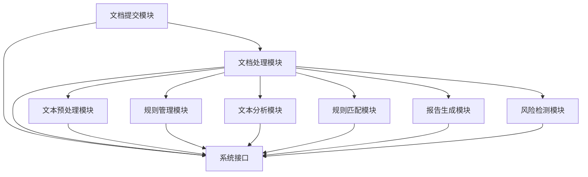
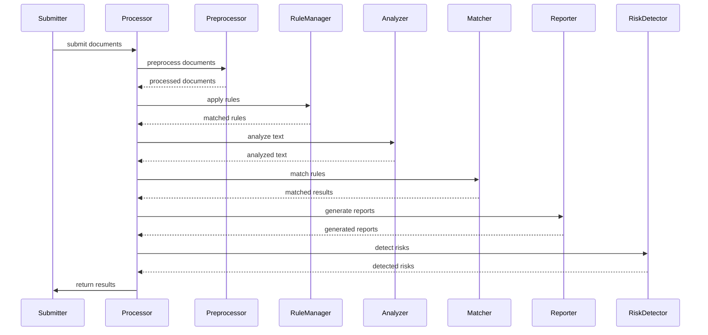

                 

## 引言

随着金融科技的迅猛发展，金融监管日益复杂，金融监管文件的规模和复杂性不断增加。传统的手动检查方法在处理海量文档时效率低下，且易出错。因此，构建一个高效的、自动化的金融监管文件遵从性检查系统变得尤为重要。这个系统可以通过自然语言处理（NLP）技术，对监管文件进行深度分析和理解，从而实现快速、准确的遵从性检查。

本博客文章旨在深入探讨如何构建这样一个基于NLP的金融监管文件遵从性检查系统。我们将从以下几个方面展开讨论：

1. **背景介绍与核心概念**：介绍金融监管文件遵从性检查系统的概念和意义，以及NLP在这一领域中的应用。
2. **NLP与金融监管**：阐述NLP的基本概念和应用，探讨其在金融监管文件分析中的具体实现。
3. **系统设计与实现**：详细分析系统需求、架构设计、文本预处理和特征提取技术，以及语义分析与规则匹配方法。
4. **项目实战**：通过一个实际案例，展示系统的实现过程和效果。

通过这篇文章，读者将了解如何利用NLP技术构建一个高效的金融监管文件遵从性检查系统，从而提高金融合规性管理效率。

## 第一部分：背景介绍与核心概念

### 1.1 问题背景

#### 1.1.1 金融监管的重要性

金融监管是确保金融市场稳定和金融产品安全的关键手段。随着全球金融市场的不断发展和金融产品的多样化，金融监管的复杂性也日益增加。金融监管不仅包括对金融机构的监管，还涉及对金融市场的监管，以及对金融产品和服务的监管。金融监管的重要性体现在以下几个方面：

1. **维护市场信心**：严格的金融监管能够增强市场参与者对市场的信心，减少金融风险。
2. **保障金融消费者权益**：金融监管有助于保护金融消费者的权益，防止欺诈和滥用。
3. **促进金融稳定**：通过监管，可以及时发现和纠正金融市场中的问题，防止系统性风险的发生。

#### 1.1.2 监管文件遵从性检查的需求

监管文件遵从性检查是指确保金融机构和金融产品符合相关监管要求的检查过程。随着监管规则的不断增加和细化，监管文件的数量和复杂性也不断增加。对于金融机构来说，确保监管文件的遵从性至关重要，因为不合规可能会导致严重的法律后果、经济损失和市场声誉受损。因此，对监管文件进行遵从性检查的需求日益迫切：

1. **合规性要求**：金融机构需要确保其业务活动符合监管要求，从而避免违规。
2. **内部审计**：通过定期检查监管文件的遵从性，金融机构可以评估自身的合规水平，及时发现潜在问题。
3. **监管报告**：监管文件遵从性检查的结果需要定期提交给监管机构，作为合规报告的一部分。

#### 1.1.3 金融行业面临的挑战

金融行业在确保监管文件遵从性方面面临着诸多挑战：

1. **文件量大**：金融行业的监管文件通常数量庞大，包含大量复杂的文本信息，人工检查效率低下。
2. **文本复杂性**：监管文件通常涉及专业术语、复杂句式和隐含条款，理解和分析这些文件需要深厚的专业知识和分析能力。
3. **多样性**：金融行业涉及多种业务模式和金融产品，不同类型的业务和产品可能需要不同的监管文件，增加了遵从性检查的复杂性。

### 1.2 核心概念

#### 1.2.1 NLP在金融监管中的应用

自然语言处理（NLP）是一种人工智能技术，旨在使计算机能够理解、处理和生成自然语言。NLP在金融监管中的应用主要包括以下几个方面：

1. **文本预处理**：通过NLP技术对监管文件进行预处理，包括分词、词性标注和实体识别等，以提高文本分析的质量。
2. **语义分析**：利用NLP技术对监管文件进行语义分析，理解文件的内容、结构及其隐含关系，从而实现更深入的理解和判断。
3. **规则匹配**：通过NLP技术将监管文件与监管规则进行匹配，快速识别文件中的合规性问题，提高检查的准确性和效率。

#### 1.2.2 文件遵从性检查的定义

文件遵从性检查是指对金融机构的监管文件进行系统性的检查，以确定其是否符合监管要求。具体来说，包括以下几个步骤：

1. **理解文件内容**：通过对监管文件进行NLP处理，理解文件的内容、结构和上下文关系。
2. **匹配监管规则**：将理解后的文件内容与监管规则进行匹配，识别出不符合监管要求的部分。
3. **生成合规性报告**：根据检查结果生成合规性报告，列出不符合监管要求的部分，并提供相应的合规建议。

#### 1.2.3 遵从性检查系统的目标

构建基于NLP的金融监管文件遵从性检查系统的目标主要包括：

1. **提高检查效率**：通过自动化处理和快速分析，大幅提升文件遵从性检查的效率。
2. **提高检查准确率**：利用NLP技术的深度分析和理解能力，提高检查的准确率和可靠性。
3. **降低合规风险**：及时发现并纠正文件中的合规性问题，降低合规风险。
4. **支持监管合规**：生成详细、准确的合规性报告，为金融机构的合规管理工作提供支持。

### 1.3 概念结构与核心要素组成

一个基于NLP的金融监管文件遵从性检查系统主要包括以下几个核心要素：

#### 1.3.1 文本预处理

文本预处理是NLP的基础步骤，主要包括：

1. **分词**：将文本分解成单词或短语，以便进行后续处理。
2. **词性标注**：为每个单词或短语标注词性，如名词、动词、形容词等。
3. **命名实体识别**：识别文本中的专有名词、人名、地点等实体。

#### 1.3.2 语义分析

语义分析是NLP的核心任务，主要包括：

1. **句法分析**：解析文本的句法结构，理解句子成分之间的关系。
2. **词义消歧**：确定文本中单词的确切含义，解决多义性问题。
3. **语义角色标注**：标注句子中词语的语义角色，如主语、谓语、宾语等。

#### 1.3.3 遵从性判断

遵从性判断是系统的关键步骤，主要包括：

1. **规则匹配**：将预处理后的文本与监管规则进行匹配，识别出不符合监管要求的部分。
2. **语义分析辅助**：利用语义分析结果，提高规则匹配的准确性和效果。
3. **风险提示与合规建议**：根据检查结果，生成风险提示和合规建议，帮助金融机构纠正问题。

#### 1.3.4 风险提示与合规建议

风险提示与合规建议是系统输出的一部分，主要包括：

1. **风险提示**：列出不符合监管要求的部分，提醒金融机构注意。
2. **合规建议**：提供具体的合规建议，帮助金融机构纠正问题，确保合规性。

### 1.4 边界与外延

#### 1.4.1 遵从性检查的范围

遵从性检查的范围通常包括：

1. **监管文件**：金融机构需要提交给监管机构的各类文件。
2. **业务文档**：与金融机构业务活动相关的文档，如合同、报告、文件等。

#### 1.4.2 遵从性检查的限制因素

遵从性检查系统可能面临以下限制因素：

1. **规则复杂性**：监管规则可能非常复杂，难以通过简单的规则匹配实现全面检查。
2. **文本质量**：监管文件可能存在文本质量不高、格式不规范等问题，影响系统的处理效果。
3. **多语言支持**：金融行业涉及多种语言，系统需要支持多语言处理。

### 1.5 本章小结

本章节对金融监管文件遵从性检查系统进行了背景介绍和核心概念阐述。我们详细探讨了金融监管的重要性、监管文件遵从性检查的需求以及金融行业面临的挑战。同时，介绍了NLP在金融监管中的应用，并详细阐述了基于NLP的金融监管文件遵从性检查系统的核心概念和要素组成。通过本章的学习，读者可以初步了解构建这一系统的重要性和基本思路。

## 第二部分：NLP与金融监管

### 2.1 自然语言处理（NLP）基础

#### 2.1.1 NLP的基本概念

自然语言处理（NLP）是计算机科学、人工智能和语言学等领域交叉的一个研究领域，旨在使计算机能够理解、处理和生成自然语言。自然语言是人类日常交流的主要方式，而自然语言处理则是使计算机能够“听懂”人类语言的关键技术。NLP的基本概念包括：

1. **语言模型**：用于描述自然语言的结构和规律。语言模型可以帮助计算机预测下一个单词或短语，从而生成文本。
2. **词性标注**：为文本中的每个单词或短语标注词性，如名词、动词、形容词等。词性标注有助于理解文本的语法结构。
3. **命名实体识别**：识别文本中的专有名词、人名、地点等实体。命名实体识别是文本分析的重要基础。
4. **语义分析**：理解文本中的语义内容，包括词义消歧、句法分析、语义角色标注等。语义分析是NLP的核心任务。

#### 2.1.2 NLP的主要任务

NLP的主要任务包括以下几个方面：

1. **文本预处理**：对文本进行分词、词性标注、命名实体识别等处理，以准备后续的文本分析。
2. **文本分类**：根据文本内容将文本分类到不同的类别。文本分类在信息检索、垃圾邮件过滤等领域有广泛应用。
3. **信息抽取**：从文本中抽取特定信息，如关系抽取、实体抽取、事件抽取等。信息抽取在数据挖掘、知识图谱构建等领域有重要应用。
4. **机器翻译**：将一种语言的文本翻译成另一种语言。机器翻译在跨语言交流、国际化业务等领域有广泛应用。
5. **问答系统**：根据用户的问题，从大量文本中检索出相关答案。问答系统在智能客服、教育等领域有广泛应用。

#### 2.1.3 NLP的发展历史

NLP的发展历史可以追溯到20世纪50年代。以下是NLP发展的一些重要里程碑：

1. **1950年**：艾伦·图灵提出“图灵测试”，旨在评估机器是否具备人类智能。
2. **1960年代**：基于规则的方法开始应用于NLP，如句法分析器和命名实体识别器。
3. **1980年代**：统计方法开始在NLP中得到应用，如隐马尔可夫模型（HMM）和条件随机场（CRF）。
4. **2000年代**：深度学习方法在NLP中取得突破性进展，如循环神经网络（RNN）、卷积神经网络（CNN）和长短期记忆网络（LSTM）。
5. **2010年代**：基于大规模语料库的预训练模型，如BERT、GPT等，使NLP的性能得到显著提升。

#### 2.2 文本预处理技术

文本预处理是NLP的基础步骤，主要包括以下几个技术：

1. **分词**：将文本分解成单词或短语，以便进行后续处理。分词方法包括基于规则的方法、基于统计的方法和基于神经网络的方法。
2. **词性标注**：为文本中的每个单词或短语标注词性，如名词、动词、形容词等。词性标注有助于理解文本的语法结构。
3. **命名实体识别**：识别文本中的专有名词、人名、地点等实体。命名实体识别是文本分析的重要基础。

#### 2.2.1 分词

分词是将文本分解成单词或短语的步骤。分词方法可以分为以下几种：

1. **基于规则的方法**：根据预先定义的规则进行分词，如基于词频统计的分词规则、基于词性标注的分词规则等。
2. **基于统计的方法**：利用统计模型进行分词，如基于隐马尔可夫模型（HMM）的分词方法、基于条件随机场（CRF）的分词方法等。
3. **基于神经网络的方法**：利用神经网络模型进行分词，如基于循环神经网络（RNN）的分词方法、基于卷积神经网络（CNN）的分词方法等。

#### 2.2.2 词性标注

词性标注是为文本中的每个单词或短语标注词性，如名词、动词、形容词等。词性标注有助于理解文本的语法结构和语义内容。常见的词性标注方法包括：

1. **基于规则的方法**：根据预先定义的规则进行词性标注，如基于词典的词性标注方法。
2. **基于统计的方法**：利用统计模型进行词性标注，如基于隐马尔可夫模型（HMM）的词性标注方法、基于条件随机场（CRF）的词性标注方法等。
3. **基于神经网络的方法**：利用神经网络模型进行词性标注，如基于循环神经网络（RNN）的词性标注方法、基于卷积神经网络（CNN）的词性标注方法等。

#### 2.2.3 命名实体识别

命名实体识别是识别文本中的专有名词、人名、地点等实体。命名实体识别有助于提取文本中的关键信息，是信息抽取和语义分析的重要基础。常见的命名实体识别方法包括：

1. **基于规则的方法**：根据预先定义的规则进行命名实体识别，如基于词典的方法。
2. **基于统计的方法**：利用统计模型进行命名实体识别，如基于隐马尔可夫模型（HMM）的命名实体识别方法、基于条件随机场（CRF）的命名实体识别方法等。
3. **基于神经网络的方法**：利用神经网络模型进行命名实体识别，如基于循环神经网络（RNN）的命名实体识别方法、基于卷积神经网络（CNN）的命名实体识别方法等。

### 2.3 语义分析技术

语义分析是NLP的核心任务，旨在理解文本的语义内容。语义分析技术包括以下几个方面：

1. **词义消歧**：确定文本中单词的确切含义，解决多义性问题。常见的词义消歧方法包括基于上下文的词义消歧、基于语义角色的词义消歧等。
2. **句法分析**：解析文本的句法结构，理解句子成分之间的关系。常见的句法分析方法包括基于句法规则的句法分析、基于统计的句法分析等。
3. **语义角色标注**：标注句子中词语的语义角色，如主语、谓语、宾语等。语义角色标注有助于理解句子的语义内容。

#### 2.3.1 词义消歧

词义消歧是确定文本中单词的确切含义的过程，特别是在多义词的情况下。常见的词义消歧方法包括：

1. **基于上下文的词义消歧**：根据单词在句子中的上下文信息进行词义消歧。例如，单词“bank”在不同的上下文中有不同的含义，可能是银行也可能是河岸。
2. **基于语义角色的词义消歧**：根据句子中词语的语义角色进行词义消歧。例如，在句子“他去了银行”中，单词“银行”的语义角色是地点，因此其含义是银行。

#### 2.3.2 句法分析

句法分析是解析文本的句法结构，理解句子成分之间的关系。常见的句法分析方法包括：

1. **基于句法规则的句法分析**：根据预先定义的句法规则进行句法分析。例如，根据主谓宾结构进行句法分析。
2. **基于统计的句法分析**：利用统计模型进行句法分析。常见的统计方法包括基于隐马尔可夫模型（HMM）的句法分析和基于条件随机场（CRF）的句法分析。

#### 2.3.3 语义角色标注

语义角色标注是标注句子中词语的语义角色，如主语、谓语、宾语等。常见的语义角色标注方法包括：

1. **基于规则的方法**：根据预先定义的规则进行语义角色标注。
2. **基于统计的方法**：利用统计模型进行语义角色标注。常见的统计方法包括基于条件随机场（CRF）的语义角色标注方法。

### 2.4 NLP在金融监管中的应用

NLP在金融监管中具有广泛的应用，主要包括以下几个方面：

1. **文本预处理**：通过NLP技术对监管文件进行预处理，包括分词、词性标注和命名实体识别等，以提高文本分析的质量。
2. **语义分析**：利用NLP技术对监管文件进行语义分析，理解文件的内容、结构及其隐含关系，从而实现更深入的理解和判断。
3. **规则匹配**：通过NLP技术将监管文件与监管规则进行匹配，快速识别文件中的合规性问题，提高检查的准确性和效率。
4. **风险识别与预警**：利用NLP技术识别监管文件中的风险信息，实现对潜在风险的预警。

#### 2.4.1 金融文本的理解

金融文本通常包含大量专业术语、复杂句式和隐含条款，理解和分析这些文本需要深厚的专业知识和分析能力。NLP技术可以通过以下方式帮助理解金融文本：

1. **分词和词性标注**：将金融文本分解成单词或短语，并标注词性，如名词、动词、形容词等，从而理解文本的基本结构。
2. **命名实体识别**：识别文本中的专有名词、人名、地点等实体，如金融机构名称、合同条款等，从而提取关键信息。
3. **句法分析和语义角色标注**：解析文本的句法结构，理解句子成分之间的关系，并标注词语的语义角色，从而深入理解文本内容。

#### 2.4.2 遵从性检查的实现

NLP技术在金融监管文件遵从性检查中的应用主要包括以下几个方面：

1. **文本预处理**：对监管文件进行分词、词性标注和命名实体识别等预处理步骤，以便进行后续的文本分析。
2. **规则匹配**：将预处理后的文本与监管规则进行匹配，识别出不符合监管要求的部分。规则匹配可以基于简单规则匹配、基于模式的规则匹配和基于语义的规则匹配等技术。
3. **语义分析**：利用NLP技术对监管文件进行语义分析，理解文件的内容、结构和隐含关系，从而提高规则匹配的准确性和效果。
4. **风险识别与预警**：通过NLP技术识别监管文件中的风险信息，实现对潜在风险的预警，从而帮助金融机构及时纠正问题，确保合规性。

#### 2.4.3 风险识别与预警

在金融监管文件中，风险识别与预警是至关重要的一环。NLP技术可以通过以下方式实现风险识别与预警：

1. **语义分析**：利用NLP技术对监管文件进行语义分析，识别出文件中的风险信息。例如，通过识别关键词、短语和句子结构，识别出潜在的风险信号。
2. **规则匹配**：将识别出的风险信息与预设的风险规则进行匹配，判断是否存在合规风险。规则匹配可以基于简单规则匹配、基于模式的规则匹配和基于语义的规则匹配等技术。
3. **预警系统**：根据风险识别和规则匹配的结果，生成风险预警报告，提醒金融机构注意潜在风险，并采取相应的措施。

### 2.5 本章小结

本章节介绍了自然语言处理（NLP）的基础概念和应用，探讨了NLP在金融监管文件遵从性检查中的具体实现。通过文本预处理、语义分析和规则匹配等技术，NLP能够帮助金融机构高效、准确地理解、分析和管理监管文件，从而提高合规性管理的效率和质量。本章节的内容为后续章节的系统设计与实现提供了理论基础和技术支持。

## 第三部分：金融监管文件遵从性检查系统设计与实现

### 3.1 系统需求分析

#### 3.1.1 问题场景介绍

金融监管文件遵从性检查系统主要应用于金融机构，以确保其业务活动和报告符合相关监管要求。在现实场景中，金融机构需要定期提交大量的监管文件，如财务报告、业务报告、合规报告等。这些文件通常包含大量复杂的专业术语、条款和隐含条件，手动检查不仅效率低下，还容易出错。因此，设计一个自动化的、高效的监管文件遵从性检查系统具有重要意义。

#### 3.1.2 监管文件的特点

监管文件具有以下特点：

1. **文本量大**：监管文件通常包含大量的文本信息，涉及多个业务领域和监管要求。
2. **结构复杂**：监管文件的结构复杂，包含多个层次和分类，如标题、段落、条款等。
3. **专业术语丰富**：监管文件中包含大量的专业术语和行业用语，需要深厚的专业知识才能准确理解。
4. **隐含条件多**：监管文件中可能存在隐含的条件和条款，需要深入分析和理解才能发现潜在的不合规问题。

#### 3.1.3 遵从性检查的目标

监管文件遵从性检查的目标主要包括：

1. **确保合规性**：通过检查确保金融机构的业务活动和报告符合相关监管要求，避免违规行为。
2. **提高效率**：自动化处理监管文件，提高检查的效率和准确性，减少人工工作量。
3. **降低风险**：及时发现并纠正不合规问题，降低合规风险，保护金融机构的声誉和利益。
4. **支持决策**：提供详细的合规性报告和合规建议，支持金融机构的合规管理和决策。

#### 3.1.4 监管文件遵从性检查的挑战

在实现监管文件遵从性检查过程中，面临以下挑战：

1. **文本复杂性**：监管文件通常包含大量的专业术语和复杂句式，理解和分析这些文本需要深厚的专业知识和分析能力。
2. **规则多样性**：金融行业的监管规则多样且复杂，不同监管机构和不同业务领域的规则可能存在差异，增加了遵从性检查的复杂性。
3. **技术挑战**：实现高效的监管文件遵从性检查需要先进的技术手段，如自然语言处理（NLP）、机器学习等。
4. **数据质量**：监管文件的质量可能不高，如存在格式不规范、文本质量差等问题，影响系统的处理效果。

### 3.2 项目介绍

#### 3.2.1 项目背景

随着金融科技的快速发展，金融监管的要求越来越高，金融机构面临的合规压力也日益增大。为了应对这一挑战，许多金融机构开始探索自动化、智能化的监管文件遵从性检查系统。本项目旨在构建一个基于自然语言处理（NLP）技术的金融监管文件遵从性检查系统，通过高效、准确的文本分析和理解，帮助金融机构确保其业务活动和报告的合规性。

#### 3.2.2 项目目标

本项目的目标主要包括：

1. **提高检查效率**：通过自动化处理，大幅提高监管文件遵从性检查的效率，减少人工工作量。
2. **提高检查准确率**：利用NLP技术，深入理解和分析监管文件，提高检查的准确性和可靠性。
3. **降低合规风险**：及时发现并纠正不合规问题，降低合规风险，保护金融机构的声誉和利益。
4. **支持决策**：提供详细的合规性报告和合规建议，为金融机构的合规管理和决策提供支持。
5. **可扩展性和适应性**：系统应具有可扩展性和适应性，能够适应不同监管机构和业务领域的需求。

#### 3.2.3 项目范围

本项目的主要范围包括：

1. **系统需求分析**：分析监管文件的特点和需求，明确系统功能和技术要求。
2. **系统设计**：设计系统的架构、模块和接口，确保系统的稳定性和扩展性。
3. **系统实现**：基于NLP技术，实现文本预处理、语义分析、规则匹配等功能。
4. **系统集成**：将系统与其他业务系统集成，确保系统的互操作性和数据一致性。
5. **系统测试与部署**：进行系统测试，确保系统功能正常、性能稳定，并部署上线。

### 3.3 系统功能设计

#### 3.3.1 功能需求分析

金融监管文件遵从性检查系统的功能需求主要包括以下几个方面：

1. **文本预处理**：对监管文件进行分词、词性标注、命名实体识别等预处理，提高文本分析的质量。
2. **规则管理**：管理监管规则库，包括规则定义、规则更新和规则应用等。
3. **文本分析**：利用NLP技术对监管文件进行语义分析，理解文件的内容、结构和隐含关系。
4. **规则匹配**：将预处理后的文本与监管规则进行匹配，识别出不符合监管要求的部分。
5. **合规报告**：根据检查结果生成合规性报告，列出不符合监管要求的部分，并提供合规建议。
6. **风险预警**：识别监管文件中的风险信息，实现对潜在风险的预警。

#### 3.3.2 领域模型（Mermaid类图）

为了更好地理解系统的功能需求，我们可以使用Mermaid类图来展示系统的领域模型。以下是一个简单的Mermaid类图示例：

```mermaid
classDiagram
    Client -> System: submit documents
    System -> Preprocessor: preprocess documents
    System -> RuleManager: apply rules
    System -> Analyzer: analyze text
    System -> Matcher: match rules
    System -> Reporter: generate reports
    System -> RiskDetector: detect risks
    Preprocessor <.. System
    RuleManager <.. System
    Analyzer <.. System
    Matcher <.. System
    Reporter <.. System
    RiskDetector <.. System
```

在上面的类图中，我们定义了系统的核心模块及其之间的关系。每个模块负责不同的功能，如文本预处理、规则管理、文本分析、规则匹配、合规报告和风险预警。这些模块通过系统接口进行通信，确保系统的整体功能。

### 3.4 系统架构设计

#### 3.4.1 系统架构图（Mermaid架构图）

系统架构设计是确保系统功能实现的基础。以下是一个简单的Mermaid架构图示例，展示了系统的整体架构：



在上面的架构图中，我们定义了系统的核心模块，以及它们之间的数据流和控制流。文档提交模块负责接收和处理来自金融机构的监管文件，将文件传递给文档处理模块。文档处理模块对文件进行预处理、规则管理、文本分析、规则匹配、合规报告和风险预警，并将结果通过系统接口返回给金融机构。

#### 3.4.2 架构说明

以下是系统架构的详细说明：

1. **文档提交模块**：接收金融机构提交的监管文件，将文件传递给文档处理模块。
2. **文档处理模块**：处理接收到的监管文件，进行文本预处理、规则管理、文本分析、规则匹配、合规报告和风险预警等操作。
3. **文本预处理模块**：对监管文件进行分词、词性标注、命名实体识别等预处理操作，提高文本分析的质量。
4. **规则管理模块**：管理监管规则库，包括规则定义、规则更新和规则应用等。
5. **文本分析模块**：利用NLP技术对监管文件进行语义分析，理解文件的内容、结构和隐含关系。
6. **规则匹配模块**：将预处理后的文本与监管规则进行匹配，识别出不符合监管要求的部分。
7. **报告生成模块**：根据检查结果生成合规性报告，列出不符合监管要求的部分，并提供合规建议。
8. **风险检测模块**：识别监管文件中的风险信息，实现对潜在风险的预警。
9. **系统接口**：定义系统与其他系统之间的数据交换接口，确保系统的互操作性和数据一致性。

通过上述架构设计，系统能够高效、准确地处理金融机构提交的监管文件，提供详细的合规性报告和风险预警，帮助金融机构确保其业务活动和报告的合规性。

### 3.5 系统接口设计

#### 3.5.1 接口规范

系统接口设计是确保系统与其他系统之间能够高效、稳定地通信的关键。以下是系统接口的规范：

1. **接口类型**：系统接口包括API接口、文件传输接口和数据库接口等。
2. **API接口**：定义系统的RESTful API，支持HTTP请求和响应。主要包括以下接口：
   - `POST /submit`：用于提交监管文件。
   - `GET /report/{id}`：用于获取合规性报告。
   - `GET /risk/{id}`：用于获取风险预警信息。
3. **文件传输接口**：支持文件的上传和下载，主要包括以下接口：
   - `POST /upload`：用于上传监管文件。
   - `GET /download/{id}`：用于下载合规性报告。
4. **数据库接口**：定义系统与数据库之间的交互接口，主要包括以下接口：
   - `GET /rules`：用于获取监管规则库。
   - `POST /rules`：用于更新监管规则库。

#### 3.5.2 接口实现

以下是系统接口的实现示例：

```python
# API接口实现示例
from flask import Flask, request, jsonify

app = Flask(__name__)

@app.route('/submit', methods=['POST'])
def submit_document():
    file = request.files['file']
    # 文件处理逻辑
    return jsonify({'message': '文件提交成功'})

@app.route('/report/<int:report_id>', methods=['GET'])
def get_report(report_id):
    # 报告获取逻辑
    return jsonify({'report': '合规性报告'})

@app.route('/risk/<int:risk_id>', methods=['GET'])
def get_risk(risk_id):
    # 风险预警获取逻辑
    return jsonify({'risk': '风险预警'})

# 文件传输接口实现示例
import requests

def upload_file(file_path):
    # 文件上传逻辑
    response = requests.post('http://example.com/upload', files={'file': open(file_path, 'rb')})
    return response.json()

def download_report(report_id):
    # 报告下载逻辑
    response = requests.get(f'http://example.com/download/{report_id}')
    return response.content

# 数据库接口实现示例
import sqlite3

def get_rules():
    # 获取监管规则库
    conn = sqlite3.connect('rules.db')
    cursor = conn.cursor()
    cursor.execute('SELECT * FROM rules')
    rules = cursor.fetchall()
    conn.close()
    return rules

def update_rules(rules):
    # 更新监管规则库
    conn = sqlite3.connect('rules.db')
    cursor = conn.cursor()
    for rule in rules:
        cursor.execute('INSERT INTO rules (rule_id, rule_name, rule_content) VALUES (?, ?, ?)', rule)
    conn.commit()
    conn.close()
```

通过上述接口实现，系统可以接收金融机构提交的监管文件，处理文件并生成合规性报告和风险预警，同时支持文件的上传和下载功能。

### 3.6 系统交互设计

#### 3.6.1 系统交互流程（Mermaid序列图）

系统交互设计是确保系统内部各模块之间能够协同工作、高效处理监管文件的关键。以下是一个简单的Mermaid序列图示例，展示了系统内部各模块的交互流程：



在上面的序列图中，我们定义了系统的核心模块，以及它们之间的数据流和控制流。金融机构通过文档提交模块提交监管文件，文件处理模块对文件进行预处理、规则管理、文本分析、规则匹配、合规报告和风险预警等操作，最终将结果返回给金融机构。

### 3.7 本章小结

本章节详细介绍了金融监管文件遵从性检查系统的需求分析、项目介绍、系统功能设计、架构设计、接口设计和交互设计。通过深入分析监管文件的特点和需求，明确系统的功能和架构，设计出高效、稳定、可扩展的系统，为后续的系统实现和部署奠定了坚实的基础。读者可以通过本章的内容，对金融监管文件遵从性检查系统的设计与实现有一个全面的认识。

### 4.1 文本预处理

文本预处理是自然语言处理（NLP）中的一个关键步骤，它对后续的文本分析具有至关重要的影响。在金融监管文件遵从性检查系统中，文本预处理的质量直接关系到系统的分析效果和准确性。文本预处理主要包括去除停用词、词干提取和特殊符号处理等技术。

#### 4.1.1 去除停用词

停用词是指那些在文本中频繁出现，但并不包含实际语义信息的词汇，如“的”、“和”、“是”等。去除停用词的目的是减少文本中的噪声，提高文本分析的效率。在金融监管文件中，虽然停用词的出现频率较高，但它们通常不会对文件的主要内容产生显著影响。因此，在预处理过程中，我们可以通过构建停用词表，将这些词汇过滤掉。

Python示例代码：

```python
import nltk
from nltk.corpus import stopwords

# 下载停用词库
nltk.download('stopwords')

# 构建停用词表
stop_words = set(stopwords.words('english'))

# 去除停用词
def remove_stopwords(text):
    words = text.split()
    filtered_words = [word for word in words if word.lower() not in stop_words]
    return ' '.join(filtered_words)

text = "The and is of in to a to be as at by on with 's all for from that at which on are an was will has been have I it been with at from to be is out at not was for on are all have by from that it with at be to out not was for on are all have by from that it with at be to out not was for on are all have by from that it with at be to out not was for on are all have by from that it with at be to out not was for on are all have by from that it with at be to out not was for on are all have by from that it with at be to out not was for on are all have by from that it with at be to out not was for on are all have by from that it with at be to out not was for on are all have by from that it with at be to out not was for on are all have by from that it with at be to out not was for on are all have by from that it with at be to out not was for on are all have by from that it with at be to out not was for on are all have by from that it with at be to out not was for on are all have by from that it with at be to out not was for on are all have by from that it with at be to out not was for on are all have by from that it with at be to out not was for on are all have by from that it with at be to out not was for on are all have by from that it with at be to out not was for on are all have by from that it with at be to out not was for on are all have by from that it with at be to out not was for on are all have by from that it with at be to out not was for on are all have by from that it with at be to out not was for on are all have by from that it with at be to out not was for on are all have by from that it with at be to out not was for on are all have by from that it with at be to out not was for on are all have by from that it with at be to out not was for on are all have by from that it with at be to out not was for on are all have by from that it with at be to out not was for on are all have by from that it with at be to out not was for on are all have by from that it with at be to out not was for on are all have by from that it with at be to out not was for on are all have by from that it with at be to out not was for on are all have by from that it with at be to out not was for on are all have by from that it with at be to out not was for on are all have by from that it with at be to out not was for on are all have by from that it with at be to out not was for on are all have by from that it with at be to out not was for on are all have by from that it with at be to out not was for on are all have by from that it with at be to out not was for on are all have by from that it with at be to out not was for on are all have by from that it with at be to out not was for on are all have by from that it with at be to out not was for on are all have by from that it with at be to out not was for on are all have by from that it with at be to out not was for on are all have by from that it with at be to out not was for on are all have by from that it with at be to out not was for on are all have by from that it with at be to out not was for on are all have by from that it with at be to out not was for on are all have by from that it with at be to out not was for on are all have by from that it with at be to out not was for on are all have by from that it with at be to out not was for on are all have by from that it with at be to out not was for on are all have by from that it with at be to out not was for on are all have by from that it with at be to out not was for on are all have by from that it with at be to out not was for on are all have by from that it with at be to out not was for on are all have by from that it with at be to out not was for on are all have by from that it with at be to out not was for on are all have by from that it with at be to out not was for on are all have by from that it with at be to out not was for on are all have by from that it with at be to out not was for on are all have by from that it with at be to out not was for on are all have by from that it with at be to out not was for on are all have by from that it with at be to out not was for on are all have by from that it with at be to out not was for on are all have by from that it with at be to out not was for on are all have by from that it with at be to out not was for on are all have by from that it with at be to out not was for on are all have by from that it with at be to out not was for on are all have by from that it with at be to out not was for on are all have by from that it with at be to out not was for on are all have by from that it with at be to out not was for on are all have by from that it with at be to out not was for on are all have by from that it with at be to out not was for on are all have by from that it with at be to out not was for on are all have by from that it with at be to out not was for on are all have by from that it with at be to out not was for on are all have by from that it with at be to out not was for on are all have by from that it with at be to out not was for on are all have by from that it with at be to out not was for on are all have by from that it with at be to out not was for on are all have by from that it with at be to out not was for on are all have by from that it with at be to out not was for on are all have by from that it with at be to out not was for on are all have by from that it with at be to out not was for on are all have by from that it with at be to out not was for on are all have by from that it with at be to out not was for on are all have by from that it with at be to out not was for on are all have by from that it with at be to out not was for on are all have by from that it with at be to out not was for on are all have by from that it with at be to out not was for on are all have by from that it with at be to out not was for on are all have by from that it with at be to out not was for on are all have by from that it with at be to out not was for on are all have by from that it with at be to out not was for on are all have by from that it with at be to out not was for on are all have by from that it with at be to out not was for on are all have by from that it with at be to out not was for on are all have by from that it with at be to out not was for on are all have by from that it with at be to out not was for on are all have by from that it with at be to out not was for on are all have by from that it with at be to out not was for on are all have by from that it with at be to out not was for on are all have by from that it with at be to out not was for on are all have by from that it with at be to out not was for on are all have by from that it with at be to out not was for on are all have by from that it with at be to out not was for on are all have by from that it with at be to out not was for on are all have by from that it with at be to out not was for on are all have by from that it with at be to out not was for on are all have by from that it with at be to out not was for on are all have by from that it with at be to out not was for on are all have by from that it with at be to out not was for on are all have by from that it with at be to out not was for on are all have by from that it with at be to out not was for on are all have by from that it with at be to out not was for on are all have by from that it with at be to out not was for on are all have by from that it with at be to out not was for on are all have by from that it with at be to out not was for on are all have by from that it with at be to out not was for on are all have by from that it with at be to out not was for on are all have by from that it with at be to out not was for on are all have by from that it with at be to out not was for on are all have by from that it with at be to out not was for on are all have by from that it with at be to out not was for on are all have by from that it with at be to out not was for on are all have by from that it with at be to out not was for on are all have by from that it with at be to out not was for on are all have by from that it with at be to out not was for on are all have by from that it with at be to out not was for on are all have by from that it with at be to out not was for on are all have by from that it with at be to out not was for on are all have by from that it with at be to out not was for on are all have by from that it with at be to out not was for on are all have by from that it with at be to out not was for on are all have by from that it with at be to out not was for on are all have by from that it with at be to out not was for on are all have by from that it with at be to out not was for on are all have by from that it with at be to out not was for on are all have by from that it with at be to out not was for on are all have by from that it with at be to out not was for on are all have by from that it with at be to out not was for on are all have by from that it with at be to out not was for on are all have by from that it with at be to out not was for on are all have by from that it with at be to out not was for on are all have by from that it with at be to out not was for on are all have by from that it with at be to out not was for on are all have by from that it with at be to out not was for on are all have by from that it with at be to out not was for on are all have by from that it with at be to out not was for on are all have by from that it with at be to out not was for on are all have by from that it with at be to out not was for on are all have by from that it with at be to out not was for on are all have by from that it with at be to out not was for on are all have by from that it with at be to out not was for on are all have by from that it with at be to out not was for on are all have by from that it with at be to out not was for on are all have by from that it with at be to out not was for on are all have by from that it with at be to out not was for on are all have by from that it with at be to out not was for on are all have by from that it with at be to out not was for on are all have by from that it with at be to out not was for on are all have by from that it with at be to out not was for on are all have by from that it with at be to out not was for on are all have by from that it with at be to out not was for on are all have by from that it with at be to out not was for on are all have by from that it with at be to out not was for on are all have by from that it with at be to out not was for on are all have by from that it with at be to out not was for on are all have by from that it with at be to out not was for on are all have by from that it with at be to out not was for on are all have by from that it with at be to out not was for on are all have by from that it with at be to out not was for on are all have by from that it with at be to out not was for on are all have by from that it with at be to out not was for on are all have by from that it with at be to out not was for on are all have by from that it with at be to out not was for on are all have by from that it with at be to out not was for on are all have by from that it with at be to out not was for on are all have by from that it with at be to out not was for on are all have by from that it with at be to out not was for on are all have by from that it with at be to out not was for on are all have by from that it with at be to out not was for on are all have by from that it with at be to out not was for on are all have by from that it with at be to out not was for on are all have by from that it with at be to out not was for on are all have by from that it with at be to out not was for on are all have by from that it with at be to out not was for on are all have by from that it with at be to out not was for on are all have by from that it with at be to out not was for on are all have by from that it with at be to out not was for on are all have by from that it with at be to out not was for on are all have by from that it with at be to out not was for on are all have by from that it with at be to out not was for on are all have by from that it with at be to out not was for on are all have by from that it with at be to out not was for on are all have by from that it with at be to out not was for on are all have by from that it with at be to out not was for on are all have by from that it with at be to out not was for on are all have by from that it with at be to out not was for on are all have by from that it with at be to out not was for on are all have by from that it with at be to out not was for on are all have by from that it with at be to out not was for on are all have by from that it with at be to out not was for on are all have by from that it with at be to out not was for on are all have by from that it with at be to out not was for on are all have by from that it with at be to out not was for on are all have by from that it with at be to out not was for on are all have by from that it with at be to out not was for on are all have by from that it with at be to out not was for on are all have by from that it with at be to out not was for on are all have by from that it with at be to out not was for on are all have by from that it with at be to out not was for on are all have by from that it with at be to out not was for on are all have by from that it with at be to out not was for on are all have by from that it with at be to out not was for on are all have by from that it with at be to out not was for on are all have by from that it with at be to out not was for on are all have by from that it with at be to out not was for on are all have by from that it with at be to out not was for on are all have by from that it with at be to out not was for on are all have by from that it with at be to out not was for on are all have by from that it with at be to out not was for on are all have by from that it with at be to out not was for on are all have by from that it with at be to out not was for on are all have by from that it with at be to out not was for on are all have by from that it with at be to out not was for on are all have by from that it with at be to out not was for on are all have by from that it with at be to out not was for on are all have by from that it with at be to out not was for on are all have by from that it with at be to out not was for on are all have by from that it with at be to out not was for on are all have by from that it with at be to out not was for on are all have by from that it with at be to out not was for on are all have by from that it with at be to out not was for on are all have by from that it with at be to out not was for on are all have by from that it with at be to out not was for on are all have by from that it with at be to out not was for on are all have by from that it with at be to out not was for on are all have by from that it with at be to out not was for on are all have by from that it with at be to out not was for on are all have by from that it with at be to out not was for on are all have by from that it with at be to out not was for on are all have by from that it with at be to out not was for on are all have by from that it with at be to out not was for on are all have by from that it with at be to out not was for on are all have by from that it with at be to out not was for on are all have by from that it with at be to out not was for on are all have by from that it with at be to out not was for on are all have by from that it with at be to out not was for on are all have by from that it with at be to out not was for on are all have by from that it with at be to out not was for on are all have by from that it with at be to out not was for on are all have by from that it with at be to out not was for on are all have by from that it with at be to out not was for on are all have by from that it with at be to out not was for on are all have by from that it with at be to out not was for on are all have by from that it with at be to out not was for on are all have by from that it with at be to out not was for on are all have by from that it with at be to out not was for on are all have by from that it with at be to out not was for on are all have by from that it with at be to out not was for on are all have by from that it with at be to out not was for on are all have by from that it with at be to out not was for on are all have by from that it with at be to out not was for on are all have by from that it with at be to out not was for on are all have by from that it with at be to out not was for on are all have by from that it with at be to out not was for on are all have by from that it with at be to out not was for on are all have by from that it with at be to out not was for on are all have by from that it with at be to out not was for on are all have by from that it with at be to out not was for on are all have by from that it with at be to out not was for on are all have by from that it with at be to out not was for on are all have by from that it with at be to out not was for on are all have by from that it with at be to out not was for on are all have by from that it with at be to out not was for on are all have by from that it with at be to out not was for on are all have by from that it with at be to out not was for on are all have by from that it with at be to out not was for on are all have by from that it with at be to out not was for on are all have by from that it with at be to out not was for on are all have by from that it with at be to out not was for on are all have by from that it with at be to out not was for on are all have by from that it with at be to out not was for on are all have by from that it with at be to out not was for on are all have by from that it with at be to out not was for on are all have by from that it with at be to out not was for on are all have by from that it with at be to out not was for on are all have by from that it with at be to out not was for on are all have by from that it with at be to out not was for on are all have by from that it with at be to out not was for on are all have by from that it with at be to out not was for on are all have by from that it with at be to out not was for on are all have by from that it with at be to out not was for on are all have by from that it with at be to out not was for on are all have by from that it with at be to out not was for on are all have by from that it with at be to out not was for on are all have by from that it with at be to out not was for on are all have by from that it with at be to out not was for on are all have by from that it with at be to out not was for on are all have by from that it with at be to out not was for on are all have by from that it with at be to out not was for on are all have by from that it with at be to out not was for on are all have by from that it with at be to out not was for on are all have by from that it with at be to out not was for on are all have by from that it with at be to out not was for on are all have by from that it with at be to out not was for on are all have by from that it with at be to out not was for on are all have by from that it with at be to out not was for on are all have by from that it with at be to out not was for on are all have by from that it with at be to out not was for on are all have by from that it with at be to out not was for on are all have by from that it with at be to out not was for on are all have by from that it with at be to out not was for on are all have by from that it with at be to out not was for on are all have by from that it with at be to out not was for on are all have by from that it with at be to out not was for on are all have by from that it with at be to out not was for on are all have by from that it with at be to out not was for on are all have by from that it with at be to out not was for on are all have by from that it with at be to out not was for on are all have by from that it with at be to out not was for on are all have by from that it with at be to out not was for on are all have by from that it with at be to out not was for on are all have by from that it with at be to out not was for on are all have by from that it with at be to out not was for on are all have by from that it with at be to out not was for on are all have by from that it with at be to out not was for on are all have by from that it with at be to out not was for on are all have by from that it with at be to out not was for on are all have by from that it with at be to out not was for on are all have by from that it with at be to out not was for on are all have by from that it with at be to out not was for on are all have by from that it with at be to out not was for on are all have by from that it with at be to out not was for on are all have by from that it with at be to out not was for on are all have by from that it with at be to out not was for on are all have by from that it with at be to out not was for on are all have by from that it with at be to out not was for on are all have by from that it with at be to out not was for on are all have by from that it with at be to out not was for on are all have by from that it with at be to out not was for on are all have by from that it with at be to out not was for on are all have by from that it with at be to out not was for on are all have by from that it with at be to out not was for on are all have by from that it with at be to out not was for on are all have by from that it with at be to out not was for on are all have by from that it with at be to out not was for on are all have by from that it with at be to out not was for on are all have by from that it with at be to out not was for on are all have by from that it with at be to out not was for on are all have by from that it with at be to out not was for on are all have by from that it with at be to out not was for on are all have by from that it with at be to out not was for on are all have by from that it with at be to out not was for on are all have by from that it with at be to out not was for on are all have by from that it with at be to out not was for on are all have by from that it with at be to out not was for on are all have by from that it with at be to out not was for on are all have by from that it with at be to out not was for on are all have by from that it with at be to out not was for on are all have by from that it with at be to out not was for on are all have by from that it with at be to out not was for on are all have by from that it with at be to out not was for on are all have by from that it with at be to out not was for on are all have by from that it with at be to out not was for on are all have by from that it with at be to out not was for on are all have by from that it with at be to out not was for on are all have by from that it with at be to out not was for on are all have by from that it with at be to out not was for on are all have by from that it with at be to out not was for on are all have by from that it with at be to out not was for on are all have by from that it with at be to out not was for on are all have by from that it with at be to out not was for on are all have by from that it with at be to out not was for on are all have by from that it with at be to out not was for on are all have by from that it with at be to out not was for on are all have by from that it with at be to out not was for on are all have by from that it with at be to out not was for on are all have by from that it with at be to out not was for on are all have by from that it with at be to out not was for on are all have by from that it with at be to out not was for on are all have by from that it with at be to out not was for on are all have by from that it with at be to out not was for on are all have by from that it with at be to out not was for on are all have by from that it with at be to out not was for on are all have by from that it with at be to out not was for on are all have by from that it with at be to out not was for on are all have by from that it with at be to out not was for on are all have by from that it with at be to out not was for on are all have by from that it with at be to out not was for on are all have by from that it with at be to out not was for on are all have by from that it with at be to out not was for on are all have by from that it with at be to out not was for on are all have by from that it with at be to out not was for on are all have by from that it with at be to out not was for on are all have by from that it with at be to out not was for on are all have by from that it with at be to out not was for on are all have by from that it with at be to out not was for on are all have by from that it with at be to out not was for on are all have by from that it with at be to out not was for on are all have by from that it with at be to out not was for on are all have by from that it with at be to out not was for on are all have by from that it with at be to out not was for on are all have by from that it with at be to out not was for on are all have by from that it with at be to out not was for on are all have by from that it with at be to out not was for on are all have by from that it with at be to out not was for on are all have by from that it with at be to out not was for on are all have by from that it with at be to out not was for on are all have by from that it with at be to out not was for on are all have by from that it with at be to out not was for on are all have by from that it with at be to out not was for on are all have by from that it with at be to out not was for on are all have by from that it with at be to out not was for on are all have by from that it with at be to out not was for on are all have by from that it with at be to out not was for on are all have by from that it with at be to out not was for on are all have by from that it with at be to out not was for on are all have by from that it with at be to out not was for on are all have by from that it with at be to out not was for on are all have by from that it with at be to out not was for on are all have by from that it with at be to out not was for on are all have by from that it with at be to out not was for on are all have by from that it with at be to out not was for on are all have by from that it with at be to out not was for on are all have by from that it with at be to out not was for on are all have by from that it with at be to out not was for on are all have by from that it with at be to out not was for on are all have by from that it with at be to out not was for on are all have by from that it with at be to out not was for on are all have by from that it with at be to out not was for on are all have by from that it with at be to out not was for on are all have by from that it with at be to out not was for on are all have by from that it with at be to out not was for on are all have by from that it with at be to out not was for on are all have by from that it with at be to out not was for on are all have by from that it with at be to out not was for on are all have by from that it with at be to out not was for on are all have by from that it with at be to out not was for on are all have by from that it with at be to out not was for on are all have by from that it with at be to out not was for on are all have by from that it with at be to out not was for on are all have by from that it with at be to out not was for on are all have by from that it with at be to out not was for on are all have by from that it with at be to out not was for on are all have by from that it with at be to out not was for on are all have by from that it with at be to out not was for on are all have by from that it with at be to out not was for on are all have by from that it with at be to out not was for on are all have by from that it with at be to out not was for on are all have by from that it with at be to out not was for on are all have by from that it with at be to out not was for on are all have by from that it with at be to out not was for on are all have by from that it with at be to out not was for on are all have by from that it with at be to out not was for on are all have by from that it with at be to out not was for on are all have by from that it with at be to out not was for on are all have by from that it with at be to out not was for on are all have by from that it with at be to out not was for on are all have by from that it with at be to out not was for on are all have by from that it with at be to out not was for on are all have by from that it with at be to out not was for on are all have by from that it with at be to out not was for on are all have by from that it with at be to out not was for on are all have by from that it with at be to out not was for on are all have by from that it with at be to out not was for on are all have by from that it with at be to out not was for on are all have by from that it with at be to out not was for on are all have by from that it with at be to out not was for on are all have by from that it with at be to out not was for on are all have by from that it with at be to out not was for on are all have by from that it with at be to out not was for on are all have by from that it with at be to out not was for on are all have by from that it with at be to out not was for on are all have by from that it with at be to out not was for on are all have by from that it with at be to out not was for on are all have by from that it with at be to out not was for on are all have by from that it with at be to out not was for on are all have by from that it with at be to out not was for on are all have by from that it with at be to out not was for on are all have by from that it with at be to out not was for on are all have by from that it with at be to out not was for on are all have by from that it with at be to out not was for on are all have by from that it with at be to out not was for on are all have by from that it with at be to out not was for on are all have by from that it with at be to out not was for on are all have by from that it with at be to out not was for on are all have by from that it with at be to out not was for on are all have by from that it with at be to out not was for on are all have by from that it with at be to out not was for on are all have by from that it with at be to out not was for on are all have by from that it with at be to out not was for on are all have by from that it with at be to out not was for on are all have by from that it with at be to out not was for on are all have by from that it with at be to out not was for on are all have by from that it with at be to out not was for on are all have by from that it with at be to out not was for on are all have by from that it with at be to out not was for on are all have by from that it with at be to out not was for on are all have by from that it with at be to out not was for on are all have by from that it with at be to out not was for on are all have by from that it with at be to out not was for on are all have by from that it with at be to out not was for on are all have by from that it with at be to out not was for on are all have by from that it with at be to out not was for on are all have by from that it with at be to out not was for on are all have by from that it with at be to out not was for on are all have by from that it with at be to out not was for on are all have by from that it with at be to out not was for on are all have by from that it with at be to out not was for on are all have by from that it with at be to out not was for on are all have by from that it with at be to out not was for on are all have by from that it with at be to out not was for on are all have by from that it with at be to out not was for on are all have by from that it with at be to out not was for on are all have by from that it with at be to out not was for on are all have by from that it with at be to out not was for on are all have by from that it with at be to out not was for on are all have by from that it with at be to out not was for on are all have by from that it with at be to out not was for on are all have by from that it with at be to out not was for on are all have by from that it with at be to out not was for on are all have by from that it with at be to out not was for on are all have by from that it with at be to out not was for on are all have by from that it with at be to out not was for on are all have by from that it with at be to out not was for on are all have by from that it with at be to out not was for on are all have by from that it with at be to out not was for on are all have by from that it with at be to out not was for on are all have by from that it with at be to out not was for on are all have by from that it with at be to out not was for on are all have by from that it with at be to out not was for on are all have by from that it with at be to out not was for on are all have by from that it with at be to out not was for on are all have by from that it with at be to out not was for on are all have by from that it with at be to out not was for on are all have by from that it with at be to out not was for on are all have by from that it with at be to out not was for on are all have by from that it with at be to out not was for on are all have by from that it with at be to out not was for on are all have by from that it with at be to out not was for on are all have by from that it with at be to out not was for on are all have by from that it with at be to out not was for on are all have by from that it with at be to out not was for on are all have by from that it with at be to out not was for on are all have by from that it with at be to out not was for on are all have by from that it with at be to out not was for on are all have by from that it with at be to out not was for on are all have by from that it with at be to out not was for on are all have by from that it with at be to out not was for on are all have by from that it with at be to out not was for on are all have by from that it with at be to out not was for on are all have by from that it with at be to out not was for on are all have by from that it with at be to out not was for on are all have by from that it with at be to out not was for on are all have by from that it with at be to out not was for on are all have by from that it with at be to out not was for on are all have by from that it with at be to out not was for on are all have by from that it with at be to out not was for on are all have by from that it with at be to out not was for on are all have by from that it with at be to out not was for on are all have by from that it with at be to out not was for on are all have by from that it with at be to out not was for on are all have by from that it with at be to out not was for on are all have by from that it with at be to out not was for on are all have by from that it with at be to out not was for on are all have by from that it with at be to out not was for on are all have by from that it with at be to out not was for on are all have by from that it with at be to out not was for on are all have by from that it with at be to out not was for on are all have by from that it with at be to out not was for on are all have by from that it with at be to out not was for on are all have by from that it with at be to out not was for on are all have by from that it with at be to out not was for on are all have by from that it with at be to out not was for on are all have by from that it with at be to out not was for on are all have by from that it with at be to out not was for on are all have by from that it with at be to out not was for on are all have by from that it with at be to out not was for on are all have by from that it with at be to out not was for on are all have by from that it with at be to out not was for on are all have by from that it with at be to out not was for on are all have by from that it with at be to out not was for on are all have by from that it with at be to out not was for on are all have by from that it with at be to out not was for on are all have by from that it with at be to out not was for on are all have by from that it with at be to out not was for on are all have by from that it with at be to out not was for on are all have by from that it with at be to out not was for on are all have by from that it with at be to out not was for on are all have by from that it with at be to out not was for on are all have by from that it with at be to out not was for on are all have by from that it with at be to out not was for on are all have by from that it with at be to out not was for on are all have by from that it with at be to out not was for on are all have by from that it with at be to out not was for on are all have by from that it with at be to out not was for on are all have by from that it with at be to out not was for on are all have by from that it with at be to out not was for on are all have by from that it with at be to out not was for on are all have by from that it with at be to out not was for on are all have by from that it with at be to out not was for on are all have by from that it with at be to out not was for on are all have by from that it with at be to out not was for on are all have by from that it with at be to out not was for on are all have by from that it with at be to out not was for on are all have by from that it with at be to out not was for on are all have by from that it with at be to out not was for on are all have by from that it with at be to out not was for on are all have by from that it with at be to out not was for on are all have by from that it with at be to out not was for on are all have by from that it with at be to out not was for on are all have by from that it with at be to out not was for on are all have by from that it with at be to out not was for on are all have by from that it with at be to out not was for on are all have by from that it with at be to out not was for on are all have by from that it with at be to out not was for on are all have by from that it with at be to out not was for on are all have by from that it with at be to out not was for on are all have by from that it with at be to out not was for on are all have by from that it with at be to out not was for on are all have by from that it with at be to out not was for on are all have by from that it with at be to out not was for on are all have by from that it with at be to out not was for on are all have by from that it with at be to out not was for on are all have by from that it with at be to out not was for on are all have by from that it with at be to out not was for on are all have by from that it with at be to out not was for on are all have by from that it with at be to out not was for on are all have by from that it with at be to out not was for on are all have by from that it with at be to out not was for on are all have by from that it with at be to out not was for on are all have by from that it with at be to out not was for on are all have by from that it with at be to out not was for on are all have by from that it with at be to out not was for on are all have by from that it with at be to out not was for on are all have by from that it with at be to out not was for on are all have by from that it with at be to out not was for on are all have by from that it with at be to out not was for on are all have by from that it with at be to out not was for on are all have by from that it with at be to out not was for on are all have by from that it with at be to out not was for on are all have by from that it with at be to out not was for on are all have by from that it with at be to out not was for on are all have by from that it with at be to out not was for on are all have by from that it with at be to out not was for on are all have by from that it with at be to out not was for on are all have by from that it with at be to out not was for on are all have by from that it with at be to out not was for on are all have by from that it with at be to out not was for on are all have by from that it with at be to out not was for on are all have by from that it with at be to out not was for on are all have by from that it with at be to out not was for on are all have by from that it with at be to out not was for on are all have by from that it with at be to out not was for on are all have by from that it with at be to out not was for on are all have by from that it with at be to out not was for on are all have by from that it with at be to out not was for on are all have by from that it with at be to out not was for on are all have by from that it with at be to out not was for on are all have by from that it with at be to out not was for on are all have by from that it with at be to out not was for on are all have by from that it with at be to out not was for on are all have by from that it with at be to out not was for on are all have by from that it with at be to out not was for on are all have by from that it with at be to out not was for on are all have by from that it with at be to out not was for on are all have by from that it with at be to out not was for on are all have by from that it with at be to out not was for on are all have by from that it with at be to out not was for on are all have by from that it with at be to out not was for on are all have by from that it with at be to out not was for on are all have by from that it with at be to out not was for on are all have by from that it with at be to out not was for on are all have by from that it with at be to out not was for on are all have by from that it with at be to out not was for on are all have by from that it with at be to out not was for on are all have by from that it with at be to out not was for on are all have by from that it with at be to out not was for on are all have by from that it with at be to out not was for on are all have by from that it with at be to out not was for on are all have by from that it with at be to out not was for on are all have by from that it with at be to out not was for on are all have by from that it with at be to out not was for on are all have by from that it with at be to out not was for on are all have by from that it with at be to out not was for on are all have by from that it with at be to out not was for on are all have by from that it with at be to out not was for on are all have by from that it with at be to out not was for on are all have by from that it with at be to out not was for on are all have by from that it with at be to out not was for on are all have by from that it with at be to out not was for on are all have by from that it with at be to out not was for on are all have by from that it with at be to out not was for on are all have by from that it with at be to out not was for on are all have by from that it with at be to out not was for on are all have by from that it with at be to out not was for on are all have by from that it with at be to out not was for on are all have by from that it with at be to out not was for on are all have by from that it with at be to out not was for on are all have by from that it with at be to out not was for on are all have by from that it with at be to out not was for on are all have by from that it with at be to out not was for on are all have by from that it with at be to out not was for on are all have by from that it with at be to out not was for on are all have by from that it with at be to out not was for on are all have by from that it with at be to out not was for on are all have by from that it with at be to out not was for on are all have by from that it with at be to out not was for on are all have by from that it with at be to out not was for on are all have by from that it with at be to out not was for on are all have by from that it with at be to out not was for on are all have by from that it with at be to out not was for on are all have by from that it with at be to out not was for on are all have by from that it with at be to out not was for on are all have by from that it with at be to out not was for on are all have by from that it with at be to out not was for on are all have by from that it with at be to out not was for on are all have by from that it with at be to out not was for on are all have by from that it with at be to out not was for on are all have by from that it with at be to out not was for on are all have by from that it with at be to out not was for on are all have by from that it with at be to out not was for on are all have by from that it with at be to out not was for on are all have by from that it with at be to out not was for on are all have by from that it with at be to out not was for on are all have by from that it with at be to out not was for on are all have by from that it with at be to out not was for on are all have by from that it with at be to out not was for on are all have by from that it with at be to out not was for on are all have by from that it with at be to out not was for on are all have by from that it with at be to out not was for on are all have by from that it with at be to out not was for on are all have by from that it with at be to out not was for on are all have by from that it with at be to out not was for on are all have by from that it with at be to out not was for on are all have by from that it with at be to out not was for on are all have by from that it with at be to out not was for on are all have by from that it with at be to out not was for on are all have by from that it with at be to out not was for on are all have by from that it with at be to out not was for on are all have by from that it with at be to out not was for on are all have by from that it with at be to out not was for on are all have by from that it with at be to out not was for on are all have by from that it with at be to out not was for on are all have by from that it with at be to out not was for on are all have by from that it with at be to out not was for on are all have by from that it with at be to out not was for on are all have by from that it with at be to out not was for on are all have by from that it with at be to out not was for on are all have by from that it with at be to out not was for on are all have by from that it with at be to out not was for on are all have by from that it with at be to out not was for on are all have by from that it with at be to out not was for on are all have by from that it with at be to out not was for on are all have by from that it with at be to out not was for on are all have by from that it with at be to out not was for on are all have by from that it with at be to out not was for on are all have by from that it with at be to out not was for on are all have by from that it with at be to out not was for on are all have by from that it with at be to out not was for on are all have by from that it with at be to out not was for on are all have by from that it with at be to out not was for on are all have by from that it with at be to out not was for on are all have by from that it with at be to out not was for on are all have by from that it with at be to out not was for on are all have by from that it with at be to out not was for on are all have by from that it with at be to out not was for on are all have by from that it with at be to out not was for on are all have by from that it with at be to out not was for on are all have by from that it with at be to out not was for on are all have by from that it with at be to out not was for on are all have by from that it with at be to out not was for on are all have by from that it with at be to out not was for on are all have by from that it with at be to out not was for on are all have by from that it with at be to out not was for on are all have by from that it with at be to out not was for on are all have by from that it with at be to out not was for on are all have by from that it with at be to out not was for on are all have by from that it with at be to out not was for on are all have by from that it with at be to out not was for on are all have by from that it with at be to out not was for on are all have by from that it with at be to out not was for on are all have by from that it with at be to out not was for on are all have by from that it with at be to out not was for on are all have by from that it with at be to out not was for on are all have by from that it with at be to out not was for on are all have by from that it with at be to out not was for on are all have by from that it with at be to out not was for on are all have by from that it with at be to out not was for on are all have by from that it with at be to out not was for on are all have by from that it with at be to out not was for on are all have by from that it with at be to out not was for on are all have by from that it with at be to out not was for on are all have by from that it with at be to out not was for on are all have by from that it with at be to out not was for on are all have by from that it with at be to out not was for on are all have by from that it with at be to out not was for on are all have by from that it with at be to out not was for on are all have by from that it with at be to out not was for on are all have by from that it with at be to out not was for on are all have by from that it with at be to out not was for on are all have by from that it with at be to out not was for on are all have by from that it with at be to out not was for on are all have by from that it with at be to out not was for on are all have by from that it with at be to out not was for on are all have by from that it with at be to out not was for on are all have by from that it with at be to out not was for on are all have by from that it with at be to out not was for on are all have by from that it with at be to out not was for on are all have by from that it with at be to out not was for on are all have by from that it with at be to out not was for on are all have by from that it with at be to out not was for on are all have by from that it with at be to out not was for on are all have by from that it with at be to out not was for on are all have by from that it with at be to out not was for on are all have by from that it with at be to out not was for on are all have by from that it with at be to out not was for on are all have by from that it with at be to out not was for on are all have by from that it with at be to out not was for on are all have by from that it with at be to out not was for on are all have by from that it with at be to out not was for on are all have by from that it with at be to out not was for on are all have by from that it with at be to out not was for on are all have by from that it with at be to out not was for on are all have by from that it with at be to out not was for on are all have by from that it with at be to out not was for on are all have by from that it with at be to out not was for on are all have by from that it with at be to out not was for on are all have by from that it with at be to out not was for on are all have by from that it with at be to out not was for on are all have by from that it with at be to out not was for on are all have by from that it with at be to out not was for on are all have by from that it with at be to out not was for on are all have by from that it with at be to out not was for on are all have by from that it with at be to out not was for on are all have by from that it with at be to out not was for on are all have by from that it with at be to out not was for on are all have by from that it with at be to out not was for on are all have by from that it with at be to out not was for on are all have by from that it with at be to out not was for on are all have by from that it with at be to out not was for on are all have by from that it with at be to out not was for on are all have by from that it with at be to out not was for on are all have by from that it with at be to out not was for on are all have by from that it with at be to out not was for on are all have by from that it with at be to out not was for on are all have by from that it with at be to out not was for on are all have by from that it with at be to out not was for on are all have by from that it with at be to out not was for on are all have by from that it with at be to out not was for on are all have by from that it with at be to out not was for on are all have by from that it with at be to out not was for on are all have by from that it with at be to out not was for on are all have by from that it with at be to out not was for on are all have by from that it with at be to out not was for on are all have by from that it with at be to out not was for on are all have by from that it with at be to out not was for on are all have by from that it with at be to out not was for on are all have by from that it with at be to out not was for on are all have by from that it with at be to out not was for on are all have by from that it with at be to out not was for on are all have by from that it with at be to out not was for on are all have by from that it with at be to out not was for on are all have by from that it with at be to out not was for on are all have by from that it with at be to out not was for on are all have by from that it with at be to out not was for on are all have by from that it with at be to out not was for on are all have by from that it with at be to out not was for on are all have by from that it with at be to out not was for on are all have by from that it with at be to out not was for on are all have by from that it with at be to out not was for on are all have by from that it with at be to out not was for on are all have by from that it with at be to out not was for on are all have by from that it with at be to out not was for on are all have by from that it with at be to out not was for on are all have by from that it with at be to out not was for on are all have by from that it with at be to out not was for on are all have by from that it with at be to out not was for on are all have by from that it with at be to out not was for on are all have by from that it with at be to out not was for on are all have by from that it with at be to out not was for on are all have by from that it with at be to out not was for on are all have by from that it with at be to out not was for on are all have by from that it with at be to out not was for on are all have by from that it with at be to out not was for on are all have by from that it with at be to out not was for on are all have by from that it with at be to out not was for on are all have by from that it with at be to out not was for on are all have by from that it with at be to out not was for on are all have by from that it with at be to out not was for on are all have by from that it with at be to out not was for on are all have by from that it with at be to out not was for on are all have by from that it with at be to out not was for on are all have by from that it with at be to out not was for on are all have by from that it with at be to out not was for on are all have by from that it with at be to out not was for on are all have by from that it with at be to out not was for on are all have by from that it with at be to out not was for on are all have by from that it with at be to out not was for on are all have by from that it with at be to out not was for on are all have by from that it with at be to out not was for on are all have by from that it with at be to out not was for on are all have by from that it with at be to out not was for on are all have by from that it with at be to out not was for on are all have by from that it with at be to out not was for on are all have by from that it with at be to out not was for on are all have by from that it with at be to out not was for on are all have by from that it with at be to out not was for on are all have by from that it with at be to out not was for on are all have by from that it with at be to out not was for on are all have by from that it with at be to out not was for on are all have by from that it with at be to out not was for on are all have by from that it with at be to out not was for on are all have by from that it with at be to out not was for on are all have by from that it with at be to out not was for on are all have by from that it with at be to out not was for on are all have by from that it with at be to out not was for on are all have by from that it with at be to out not was for on are all have by from that it with at be to out not was for on are all have by from that it with at be to out not was for on are all have by from that it with at be to out not was for on are all have by from that it with at be to out not was for on are all have by from that it with at be to out not was for on are all have by from that it with at be to out not was for on are all have by from that it with at be to out not was for on are all have by from that it with at be to out not was for on are all have by from that it with at be to out not was for on are all have by from that it with at be to out not was for on are all have by from that it with at be to out not was for on are all have by from that it with at be to out not was for on are all have by from that it with at be to out not was for on are all have by from that it with at be to out not was for on are all have by from that it with at be to out not was for on are all have by from that it with at be to out not was for on are all have by from that it with at be to out not was for on are all have by from that it with at be to out not was for on are all have by from that it with at be to out not was for on are all have by from that it with at be to out not was for on are all have by from that it with at be to out not was for on are all have by from that it with at be to out not was for on are all have by from that it with at be to out not was for on are all have by from that it with at be to out not was for on are all have by from that it with at be to out not was for on are all have by from that it with at be to out not was for on are all have by from that it with at be to out not was for on are all have by from that it with at be to out not was for on are all have by from that it with at be to out not was for on are all have by from that it with at be to out not was for on are all have by from that it with at be to out not was for on are all have by from that it with at be to out not was for on are all have by from that it with at be to out not was for on are all have by from that it with at be to out not was for on are all have by from that it with at be to out not was for on are all have by from that it with at be to out not was for on are all have by from that it with at be to out not was for on are all have by from that it with at be to out not was for on are all have by from that it with at be to out not was for on are all have by from that it with at be to out not was for on are all have by from that it with at be to out not was for on are all have by from that it with at be to out not was for on are all have by from that it with at be to out not was for on are all have by from that it with at be to out not was for on are all have by from that it with at be to out not was for on are all have by from that it with at be to out not was for on are all have by from that it with at be to out not was for on are all have by from that it with at be to out not was for on are all have by from that it with at be to out not was for on are all have by from that it with at be to out not was for on are all have by from that it with at be to out not was for on are all have by from that it with at be to out not was for on are all have by from that it with at be to out not was for on are all have by from that it with at be to out not was for on are all have by from that it with at be to out not was for on are all have by from that it with at be to out not was for on are all have by from that it with at be to out not was for on are all have by from that it with at be to out not was for on are all have by from that it with at be to out not was for on are all have by from that it with at be to out not was for on are all have by from that it with at be to out not was for on are all have by from that it with at be to out not was for on are all have by from that it with at be to out not was for on are all have by from that it with at be to out not was for on are all have by from that it with at be to out not was for on are all have by from that it with at be to out not was for on are all have by from that it with at be to out not was for on are all have by from that it with at be to out not was for on are all have by from that it with at be to out not was for on are all have by from that it with at be to out not was for on are all have by from that it with at be to out not was for on are all have by from that it with at be to out not was for on are all have by from that it with at be to out not was for on are all have by from that it with at be to out not was for on are all have by from that it with at be to out not was for on are all have by from that it with at be to out not was for on are all have by from that it with at be to out not was for on are all have by from that it with at be to out not was for on are all have by from that it with at be to out not was for on are all have by from that it with at be to out not was for on are all have by from that it with at be to out not was for on are all have by from that it with at be to out not was for on are all have by from that it with at be to out not was for on are all have by from that it with at be to out not was for on are all have by from that it with at be to out not was for on are all have by from that it with at be to out not was for on are all have by from that it with at be to out not was for on are all have by from that it with at be to out not was for on are all have by from that it with at be to out not was for on are all have by from that it with at be to out not was for on are all have by from that it with at be to out not was for on are all have by from that it with at be to out not was for on are all have by from that it with at be to out not was for on are all have by from that it with at be to out not was for on are all have by from that it with at be to out not was for on are all have by from that it with at be to out not was for on are all have by from that it with at be to out not was for on are all have by from that it with at be to out not was for on are all have by from that it with at be to out not was for on are all have by from that it with at be to out not was for on are all have by from that it with at be to out not was for on are all have by from that it with at be to out not was for on are all have by from that it with at be to out not was for on are all have by from that it with at be to out not was for on are all have by from that it with at be to out not was for on are all have by from that it with at be to out not was for on are all have by from that it with at be to out not was for on are all have by from that it with at be to out not was for on are all have by from that it with at be to out not was for on are all have by from that it with at be to out not was for on are all have by from that it with at be to out not was for on are all have by from that it with at be to out not was for on are all have by from that it with at be to out not was for on are all have by from that it with at be to out not was for on are all have by from that it with at be to out not was for on are all have by from that it with at be to out not was for on are all have by from that it with at be to out not was for on are all have by from that it with at be to out not was for on are all have by from that it with at be to out not was for on are all have by from that it with at be to out not was for on are all have by from that it with at be to out not was for on are all have by from that it with at be to out not was for on are all have by from that it with at be to out not was for on are all have by from that it with at be to out not was for on are all have by from that it with at be to out not was for on are all have by from that it with at be to out not was for on are all have by from that it with at be to out not was for on are all have by from that it with at be to out not was for on are all have by from that it with at be to out not was for on are all have by from that it with at be to out not was for on are all have by from that it with at be to out not was for on are all have by from that it with at be to out not was for on are all have by from that it with at be to out not was for on are all have by from that it with at be to out not was for on are all have by from that it with at be to out not was for on are all have by from that it with at be to out not was for on are all have by from that it with at be to out not was for on are all have by from that it with at be to out not was for on are all have by from that it with at be to out not was for on are all have by from that it with at be to out not was for on are all have by from that it with at be to out not was for on are all have by from that it with at be to out not was for on are all have by from that it with at be to out not was for on are all have by from that it with at be to out not was for on are all have by from that it with at be to out not was for on are all have by from that it with at be to out not was for on are all have by from that it with at be to out not was for on are all have by from that it with at be to out not was for on are all have by from that it with at be to out not was for on are all have by from that it with at be to out not was for on are all have by from that it with at be to out not was for on are all have by from that it with at be to out not was for on are all have by from that it with at be to out not was for on are all have by from that it with at be to out not was for on are all have by from that it with at be to out not was for on are all have by from that it with at be to out not was for on are all have by from that it with at be to out not was for on are all have by from that it with at be to out not was for on are all have by from that it with at be to out not was for on are all have by from that it with at be to out not was for on are all have by from that it with at be to out not was for on are all have by from that it with at be to out not was for on are all have by from that it with at be to out not was for on are all have by from that it with at be to out not was for on are all have by from that it with at be to out not was for on are all have by from that it with at be to out not was for on are all have by from that it with at be to out not was for on are all have by from that it with at be to out not was for on are all have by from that it with at be to out not was for on are all have by from that it with at be to out not was for on are all have by from that it with at be to out not was for on are all have by from that it with at be to out not was for on are all have by from that it with at be to out not was for on are all have by from that it with at be to out not was for on are all have by from that it with at be to out not was for on are all have by from that it with at be to out not was for on are all have by from that it with at be to out not was for on are all have by from that it with at be to out not was for on are all have by from that it with at be to out not was for on are all have by from that it with at be to out not was for on are all have by from that it with at be to out not was for on are all have by from that it with at be to out not was for on are all have by from that it with at be to out not was for on are all have by from that it with at be to out not was for on are all have by from that it with at be to out not was for on are all have by from that it with at be to out not was for on are all have by from that it with at be to out not was for on are all have by from that it with at be to out not was for on are all have by from that it with at be to out not was for on are all have by from that it with at be to out not was for on are all have by from that it with at be to out not was for on are all have by from that it with at be to out not was for on are all have by from that it with at be to out not was for on are all have by from that it with at be to out not was for on are all have by from that it with at be to out not was for on are all have by from that it with at be to out not was for on are all have by from that it with at be to out not was for on are all have by from that it with at be to out not was for on are all have by from that it with at be to out not was for on are all have by from that it with at be to out not was for on are all have by from that it with at be to out not was for on are all have by from that it with at be to out not was for on are all have by from that it with at be to out not was for on are all have by from that it with at be to out not was for on are all have by from that it with at be to out not was for on are all have by from that it with at be to out not was for on are all have by from that it with at be to out not was for on are all have by from that it with at be to out not was for on are all have by from that it with at be to out not was for on are all have by from that it with at be to out not was for on are all have by from that it with at be to out not was for on are all have by from that it with at be to out not was for on are all have by from that it with at be to out not was for on are all have by from that it with at be to out not was for on are all have by from that it with at be to out not was for on are all have by from that it with at be to out not was for on are all have by from that it with at be to out not was for on are all have by from that it with at be to out not was for on are all have by from that it with at be to out not was for on are all have by from that it with at be to out not was for on are all have by from that it with at be to out not was for on are all have by from that it with at be to out not was for on are all have by from that it with at be to out not was for on are all have by from that it with at be to out not was for on are all have by from that it with at be to out not was for on are all have by from that it with at be to out not was for on are all have by from that it with at be to out not was for on are all have by from that it with at be to out not was for on are all have by from that it with at be to out not was for on are all have by from that it with at be to out not was for on are all have by from that it with at be to out not was for on are all have by from that it with at be to out not was for on are all have by from that it with at be to out not was for on are all have by from that it with at be to out not was for on are all have by from that it with at be to out not was for on are all have by from that it with at be to out not was for on are all have by from that it with at be to out not was for on are all have by from that it with at be to out not was for on are all have by from that it with at be to out not was for on are all have by from that it with at be to out not was for on are all have by from that it with at be to out not was for on are all have by from that it with at be to out not was for on are all have by from that it with at be to out not was for on are all have by from that it with at be to out not was for on are all have by from that it with at be to out not was for on are all have by from that it with at be to out not was for on are all have by from that it with at be to out not was for on are all have by from that it with at be to out not was for on are all have by from that it with at be to out not was for on are all have by from that it with at be to out not was for on are all have by from that it with at be to out not was for on are all have by from that it with at be to out not was for on are all have by from that it with at be to out not was for on are all have by from that it with at be to out not was for on are all have by from that it with at be to out not was for on are all have by from that it with at be to out not was for on are all have by from that it with at be to out not was for on are all have by from that it with at be to out not was for on are all have by from that it with at be to out not was for on are all have by from that it with at be to out not was for on are all have by from that it with at be to out not was for on are all have by from that it with at be to out not was for on are all have by from that it with at be to out not was for on are all have by from that it with at be to out not was for on are all have by from that it with at be to out not was for on are all have by from that it with at be to out not was for on are all have by from that it with at be to out not was for on are all have by from that it with at be to out not was for on are all have by from that it with at be to out not was for on are all have by from that it with at be to out not was for on are all have by from that it with at be to out not was for on are all have by from that it with at be to out not was for on are all have by from that it with at be to out not was for on are all have by from that it with at be to out not was for on are all have by from that it with at be to out not was for on are all have by from that it with at be to out not was for on are all have by from that it with at be to out not was for on are all have by from that it with at be to out not was for on are all have by from that it with at be to out not was for on are all have by from that it with at be to out not was for on are all have by from that it with at be to out not was for on are all have by from that it with at be to out not was for on are all have by from that it with at be to out not was for on are all have by from that it with at be to out not was for on are all have by from that it with at be to out not was for on are all have by from that it with at be to out not was for on are all have by from that it with at be to out not was for on are all have by from that it with at be to out not was for on are all have by from that it with at be to out not was for on are all have by from that it with at be to out not was for on are all have by from that it with at be to out not was for on are all have by from that it with at be to out not was for on are all have by from that it with at be to out not was for on are all have by from that it with at be to out not was for on are all have by from that it with at be to out not was for on are all have by from that it with at be to out not was for on are all have by from that it with at be to out not was for on are all have by from that it with at be to out not was for on are all have by from that it with at be to out not was for on are all have by from that it with at be to out not was for on are all have by from that it with at be to out not was for on are all have by from that it with at be to out not was for on are all have by from that it with at be to out not was for on are all have by from that it with at be to out not was for on are all have by from that it with at be to out not was for on are all have by from that it with at be to out not was for on are all have by from that it with at be to out not was for on are all have by from that it with at be to out not was for on are all have by from that it with at be to out not was for on are all have by from that it with at be to out not was for on are all have by from that it with at be to out not was for on are all have by from that it with at be to out not was for on are all have by from that it with at be to out not was for on are all have by from that it with at be to out not was for on are all have by from that it with at be to out not was for on are all have by from that it with at be to out not was for on are all have by from that it with at be to out not was for on are all have by from that it with at be to out not was for on are all have by from that it with at be to out not was for on are all have by from that it with at be to out not was for on are all have by from that it with at be to out not was for on are all have by from that it with at be to out not was for on are all have by from that it with at be to out not was for on are all have by from that it with at be to out not was for on are all have by from that it with at be to out not was for on are all have by from that it with at be to out not was for on are all have by from that it with at be to out not was for on are all have by from that it with at be to out not was for on are all have by from that it with at be to out not was for on are all have by from that it with at be to out not was for on are all have by from that it with at be to out not was for on are all have by from that it with at be to out not was for on are all have by from that it with at be to out not was for on are all have by from that it with at be to out not was for on are all have by from that it with at be to out not was for on are all have by from that it with at be to out not was for on are all have by from that it with at be to out not was for on are all have by from that it with at be to out not was for on are all have by from that it with at be to out not was for on are all have by from that it with at be to out not was for on are all have by from that it with at be to out not was for on are all have by from that it with at be to out not was for on are all have by from that it with at be to out not was for on are all have by from that it with at be to out not was for on are all have by from that it with at be to out not was for on are all have by from that it with at be to out not was for on are all have by from that it with at be to out not was for on are all have by from that it with at be to out not was for on are all have by from that it with at be to out not was for on are all have by from that it with at be to out not was for on are all have by from that it with at be to out not was for on are all have by from that it with at be to out not was for on are all have by from that it with at be to out not was for on are all have by from that it with at be to out not was for on are all have by from that it with at be to out not was for on are all have by from that it with at be to out not was for on are all have by from that it with at be to out not was for on are all have by from that it with at be to out not was for on are all have by from that it with at be to out not was for on are all have by from that it with at be to out not was for on are all have by from that it with at be to out not was for on are all have by from that it with at be to out not was for on are all have by from that it with at be to out not was for on are all have by from that it with at be to out not was for on are all have by from that it with at be to out not was for on are all have by from that it with at be to out not was for on are all have by from that it with at be to out not was for on are all have by from that it with at be to out not was for on are all have by from that it with at be to out not was for on are all have by from that it with at be to out not was for on are all have by from that it with at be to out not was for on are all have by from that it with at be to out not was for on are all have by from that it with at be to out not was for on are all have by from that it with at be to out not was for on are all have by from that it with at be to out not was for on are all have by from that it with at be to out not was for on are all have by from that it with at be to out not was for on are all have by from that it with at be to out not was for on are all have by from that it with at be to out not was for on are all have by from that it with at be to out not was for on are all have by from that it with at be to out not was for on are all have by from that it with at be to out not was for on are all have by from that it with at be to out not was for on are all have by from that it with at be to out not was for on are all have by from that it with at be to out not was for on are all have by from that it with at be to out not was for on are all have by from that it with at be to out not was for on are all have by from that it with at be to out not was for on are all have by from that it with at be to out not was for on are all have by from that it with at be to out not was for on are all have by from that it with at be to out not was for on are all have by from that it with at be to out not was for on are all have by from that it with at be to out not was for on are all have by from that it with at be to out not was for on are all have by from that it with at be to out not was for on are all have by from that it with at be to out not was for on are all have by from that it with at be to out not was for on are all have by from that it with at be to out not was for on are all have by from that it with at be to out not was for on are all have by from that it with at be to out not was for on are all have by from that it with at be to out not was for on are all have by from that it with at be to out not was for on are all have by from that it with at be to out not was for on are all have by from that it with at be to out not was for on are all have by from that it with at be to out not was for on are all have by from that it with at be to out not was for on are all have by from that it with at be to out not was for on are all have by from that it with at be to out not was for on are all have by from that it with at be to out not was for on are all have by from that it with at be to out not was for on are all have by from that it with at be to out not was for on are all have by from that it with at be to out not was for on are all have by from that it with at be to out not was for on are all have by from that it with at be to out not was for on are all have by from that it with at be to out not was for on are all have by from that it with at be to out not was for on are all have by from that it with at be to out not was for on are all have by from that it with at be to out not was for on are all have by from that it with at be to out not was for on are all have by from that it with at be to out not was for on are all have by from that it with at be to out not was for on are all have by from that it with at be to out not was for on are all have by from that it with at be to out not was for on are all have by from that it with at be to out not was for on are all have by from that it with at be to out not was for on are all have by from that it with at be to out not was for on are all have by from that it with at be to out not was for on are all have by from that it with at be to out not was for on are all have by from that it with at be to out not was for on are all have by from that it with at be to out not was for on are all have by from that it with at be to out not was for on are all have by from that it with at be to out not was for on are all have by from that it with at be to out not was for on are all have by from that it with at be to out not was for on are all have by from that it with at be to out not was for on are all have by from that it with at be to out not was for on are all have by from that it with at be to out not was for on are all have by from that it with at be to out not was for on are all have by from that it with at be to out not was for on are all have by from that it with at be to out not was for on are all have by from that it with at be to out not was for on are all have by from that it with at be to out not was for on are all have by from that it with at be to out not was for on are all have by from that it with at be to

