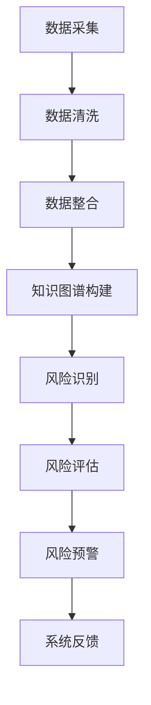

                 

# 构建基于知识图谱的金融产品全生命周期风险跟踪系统

关键词：知识图谱、金融产品、风险跟踪、全生命周期管理、图计算、数据整合

摘要：本文介绍了构建基于知识图谱的金融产品全生命周期风险跟踪系统的核心概念、方法和技术。通过详细阐述系统设计、算法原理、系统架构、实战应用等环节，为金融机构提供了有效的风险管理工具。

## 目录大纲

1. 背景介绍
   1.1 问题背景
   1.2 问题描述
   1.3 问题解决
   1.4 边界与外延
   1.5 概念结构与核心要素组成

2. 核心概念与联系
   2.1 核心概念原理
   2.2 概念属性特征对比表格
   2.3 ER实体关系图架构

3. 算法原理讲解
   3.1 算法mermaid流程图
   3.2 Python源代码讲解
   3.3 数学模型和公式讲解
   3.4 举例说明

4. 系统分析与架构设计
   4.1 问题场景介绍
   4.2 项目介绍
   4.3 系统功能设计
   4.4 系统架构设计
   4.5 系统接口设计
   4.6 系统交互

5. 项目实战
   5.1 环境安装
   5.2 系统核心实现源代码
   5.3 代码应用解读与分析
   5.4 实际案例分析与详细讲解剖析
   5.5 项目小结

6. 最佳实践与小结
   6.1 最佳实践 tips
   6.2 小结
   6.3 注意事项
   6.4 拓展阅读

7. 总结与展望
   7.1 本书内容总结
   7.2 未来发展方向与展望

## 1. 背景介绍

### 1.1 问题背景

在当今金融市场中，金融产品的种类繁多，包括股票、债券、基金、期货、期权等。这些产品涉及到大量的信息，如产品特征、交易记录、风险评估结果等。如何有效地管理和跟踪这些金融产品的全生命周期，确保金融市场的稳定和健康发展，成为金融行业面临的重要问题。

随着金融市场的不断发展，金融产品的生命周期也在不断延长。从产品发行、交易、到期，每个阶段都可能会出现各种风险。例如，市场风险、信用风险、操作风险等。如果不能及时识别和应对这些风险，可能会导致严重的金融损失。

因此，构建一个基于知识图谱的金融产品全生命周期风险跟踪系统，对于金融机构来说具有重要的意义。知识图谱作为一种高效的数据结构和表示方法，能够将金融产品及其相关的各类信息组织成一个结构化的网络，从而为金融产品的全生命周期风险跟踪提供了一种有效的解决方案。

### 1.2 问题描述

构建基于知识图谱的金融产品全生命周期风险跟踪系统，需要解决以下几个主要问题：

1. **数据采集与整合**：从各种数据源中收集与金融产品相关的信息，包括产品描述、交易记录、风险评估结果等，并对其进行清洗、整合和处理，形成一个统一的知识图谱。

2. **知识图谱构建**：利用自然语言处理、图论算法等技术，将整合后的数据进行结构化处理，构建一个完整、准确、实时的知识图谱。

3. **风险识别与评估**：基于知识图谱，通过图计算技术对金融产品的风险进行识别和评估，及时发现潜在风险并采取相应的措施。

4. **风险跟踪与预警**：对金融产品的风险变化进行实时监控和跟踪，建立预警机制，确保在风险发生前及时采取措施。

### 1.3 问题解决

为了解决上述问题，本文提出了以下解决方案：

1. **数据采集与整合**：采用数据爬取、API调用、数据接口接入等方式收集数据，并利用ETL（Extract, Transform, Load）技术对数据进行清洗、整合和处理。

2. **知识图谱构建**：利用自然语言处理技术对文本数据进行分析和解析，提取实体和关系，构建知识图谱的基础数据。同时，利用图论算法对知识图谱进行优化和调整，提高其结构化和完整性。

3. **风险识别与评估**：通过图计算技术，对知识图谱中的实体和关系进行分析和计算，识别金融产品的风险因素，并利用风险评估模型对其进行评估和预测。

4. **风险跟踪与预警**：建立基于知识图谱的实时监控和跟踪系统，对金融产品的风险变化进行监控，并通过预警机制及时向相关人员发出风险提示。

### 1.4 边界与外延

构建基于知识图谱的金融产品全生命周期风险跟踪系统的边界包括：

1. **数据源**：主要包括金融产品相关数据的来源，如交易所、监管机构、金融机构等。

2. **数据范围**：主要包括金融产品的基本信息、交易记录、风险评估结果等。

3. **风险类型**：主要包括市场风险、信用风险、操作风险等。

系统的外延包括：

1. **风险管理策略**：基于知识图谱的风险评估结果，为金融机构提供相应的风险管理策略和建议。

2. **风险预警机制**：通过实时监控和跟踪金融产品的风险变化，及时发出风险预警，帮助金融机构采取预防措施。

3. **风险监测与分析**：利用知识图谱技术对金融产品的风险进行监测和分析，为金融机构提供风险管理和决策支持。

### 1.5 概念结构与核心要素组成

构建基于知识图谱的金融产品全生命周期风险跟踪系统的核心概念与要素包括：

1. **知识图谱**：作为数据存储和表示的核心，包含金融产品相关的实体和关系。

2. **数据采集与整合**：用于收集和处理金融产品相关的数据，为知识图谱提供基础数据。

3. **图计算**：用于对知识图谱进行计算和分析，识别金融产品的风险因素。

4. **风险评估模型**：基于知识图谱中的数据，建立风险评估模型，对金融产品的风险进行评估和预测。

5. **实时监控与预警系统**：用于实时监控金融产品的风险变化，并发出预警提示。

## 2. 核心概念与联系

### 2.1 核心概念原理

在构建基于知识图谱的金融产品全生命周期风险跟踪系统中，涉及以下几个核心概念：

1. **知识图谱（Knowledge Graph）**：知识图谱是一种由实体（Entity）和关系（Relation）构成的数据结构，能够表示实体之间的复杂关系。在金融产品风险跟踪系统中，知识图谱用于表示金融产品及其相关的各类信息。

2. **数据采集与整合（Data Collection and Integration）**：数据采集与整合是将不同数据源中的数据进行收集、清洗、转换和整合的过程。通过数据采集与整合，可以将金融产品的各类信息转化为统一格式，为知识图谱构建提供数据基础。

3. **图计算（Graph Computing）**：图计算是对知识图谱进行计算和分析的一种方法，可以用于识别金融产品的风险因素。图计算技术包括图遍历、图相似度计算、图聚类等。

4. **风险评估模型（Risk Assessment Model）**：风险评估模型是基于知识图谱中的数据，对金融产品的风险进行评估和预测的数学模型。风险评估模型可以根据历史数据、市场情况等因素，预测金融产品的未来风险水平。

5. **实时监控与预警系统（Real-time Monitoring and Warning System）**：实时监控与预警系统用于实时监控金融产品的风险变化，并发出预警提示。通过实时监控与预警系统，金融机构可以及时采取应对措施，降低风险损失。

### 2.2 概念属性特征对比表格

下面是上述核心概念的属性特征对比表格：

| 概念               | 属性特征                                                     |
|--------------------|------------------------------------------------------------|
| 知识图谱           | - 实体和关系的结构化表示<br>- 高效的数据存储和查询<br>- 支持复杂关系建模 |
| 数据采集与整合     | - 数据收集<br>- 数据清洗<br>- 数据转换<br>- 数据整合       |
| 图计算             | - 图遍历<br>- 图相似度计算<br>- 图聚类<br>- 图分析         |
| 风险评估模型       | - 历史数据<br>- 市场情况<br>- 风险因素<br>- 风险预测       |
| 实时监控与预警系统 | - 实时监控<br>- 风险预警<br>- 应对措施<br>- 通信渠道       |

### 2.3 ER实体关系图架构

ER实体关系图（Entity-Relationship Diagram）是用于表示知识图谱中实体和关系的图形化工具。在构建基于知识图谱的金融产品全生命周期风险跟踪系统时，ER实体关系图可以帮助我们理解和设计系统的核心数据结构。

下面是一个简化的ER实体关系图示例，用于表示金融产品、交易记录和风险评估等核心实体及其关系：

```mermaid
erDiagram
  Product ||--|{ Transaction } : "has"
  Product ||--|{ RiskAssessment } : "has"
  Transaction ||--|{ TradeRecord } : "has"
  RiskAssessment ||--|{ MarketRisk } : "has"
  RiskAssessment ||--|{ CreditRisk } : "has"
  RiskAssessment ||--|{ OperationalRisk } : "has"
```

在上面的ER实体关系图中：

- **Product** 表示金融产品，与其他实体如**Transaction**和**RiskAssessment**有直接关联。
- **Transaction** 表示金融产品的交易，与**TradeRecord**有关联。
- **RiskAssessment** 表示对金融产品的风险评估，与**MarketRisk**、**CreditRisk**和**OperationalRisk**有关联。
- **TradeRecord** 表示金融产品的交易记录。
- **MarketRisk**、**CreditRisk**和**OperationalRisk**分别表示市场风险、信用风险和操作风险的评估结果。

通过这个ER实体关系图，我们可以清晰地了解金融产品及其相关的各类信息在知识图谱中的组织方式和关联关系，为后续的系统设计与实现提供了基础。

## 3. 算法原理讲解

### 3.1 算法mermaid流程图

为了直观地展示金融产品全生命周期风险跟踪系统中的核心算法流程，我们可以使用mermaid语言绘制一个流程图。以下是算法流程图的示例：



在这个流程图中，各步骤的含义如下：

- **A[数据采集]**：从各种数据源收集与金融产品相关的数据。
- **B[数据清洗]**：对采集到的数据进行清洗，去除重复、错误和无关数据。
- **C[数据整合]**：将清洗后的数据进行整合，形成统一格式的数据集。
- **D[知识图谱构建]**：利用整合后的数据构建知识图谱，表示金融产品及其关系。
- **E[风险识别]**：基于知识图谱，通过图计算技术识别金融产品的风险因素。
- **F[风险评估]**：利用风险评估模型对风险因素进行评估，预测风险水平。
- **G[风险预警]**：根据评估结果，实时监控和预警，确保及时采取措施。
- **H[系统反馈]**：收集系统运行数据，为后续优化和改进提供反馈。

### 3.2 Python源代码讲解

为了实现上述算法流程，我们需要编写相应的Python代码。以下是金融产品全生命周期风险跟踪系统的核心代码示例：

```python
import pandas as pd
from knowledge_graph import KnowledgeGraph
from risk_assessment import RiskAssessmentModel
from warning_system import WarningSystem

def data_collection():
    # 从数据源收集数据
    data = pd.read_csv('financial_data.csv')
    return data

def data_cleaning(data):
    # 数据清洗
    data.drop_duplicates(inplace=True)
    data.dropna(inplace=True)
    return data

def data_integration(data):
    # 数据整合
    # ...（根据实际数据格式和需求进行整合）
    return data

def build_knowledge_graph(data):
    # 构建知识图谱
    kg = KnowledgeGraph()
    kg.add_entities(data)
    kg.build_relations()
    return kg

def risk_identification(kg):
    # 风险识别
    # ...（根据知识图谱进行风险识别）
    risks = kg.get_risks()
    return risks

def risk_evaluation(risks):
    # 风险评估
    ram = RiskAssessmentModel()
    assessments = ram.evaluate_risks(risks)
    return assessments

def risk_warning(assessments):
    # 风险预警
    ws = WarningSystem()
    ws.send_warnings(assessments)

def main():
    data = data_collection()
    cleaned_data = data_cleaning(data)
    integrated_data = data_integration(cleaned_data)
    kg = build_knowledge_graph(integrated_data)
    risks = risk_identification(kg)
    assessments = risk_evaluation(risks)
    risk_warning(assessments)

if __name__ == "__main__":
    main()
```

在这段代码中，我们定义了以下几个功能模块：

- `data_collection()`：从数据源收集数据。
- `data_cleaning(data)`：对数据进行清洗。
- `data_integration(data)`：对清洗后的数据进行整合。
- `build_knowledge_graph(data)`：构建知识图谱。
- `risk_identification(kg)`：识别风险因素。
- `risk_evaluation(risks)`：评估风险水平。
- `risk_warning(assessments)`：发送风险预警。

这些模块共同构成了金融产品全生命周期风险跟踪系统的核心功能。

### 3.3 数学模型和公式讲解

在构建金融产品全生命周期风险跟踪系统的过程中，数学模型和公式起到了关键作用。以下是一些常用的数学模型和公式的讲解：

#### 1. 风险识别模型

风险识别模型用于识别金融产品的风险因素。一个简单的风险识别模型可以表示为：

\[ R_i = f(R_t, R_c, R_o) \]

其中：

- \( R_i \)：风险因素 \( i \) 的评分。
- \( R_t \)：市场风险评分。
- \( R_c \)：信用风险评分。
- \( R_o \)：操作风险评分。

#### 2. 风险评估模型

风险评估模型用于评估金融产品的整体风险水平。一个简单的风险评估模型可以表示为：

\[ R = \alpha R_t + \beta R_c + \gamma R_o \]

其中：

- \( R \)：整体风险评分。
- \( \alpha \)、\( \beta \)、\( \gamma \)：权重系数。

#### 3. 风险预警模型

风险预警模型用于确定何时发出风险预警。一个简单的时间阈值预警模型可以表示为：

\[ W(t) = \begin{cases} 
      1 & \text{if } R > \text{threshold} \\
      0 & \text{otherwise}
   \end{cases}
\]

其中：

- \( W(t) \)：预警标志。
- \( R \)：当前风险评分。
- \( \text{threshold} \)：风险阈值。

通过上述数学模型和公式，我们可以对金融产品的风险进行量化评估和预警，从而为金融机构提供有效的风险管理工具。

### 3.4 举例说明

为了更好地理解上述算法和数学模型，我们通过一个具体的案例进行说明。

#### 案例背景

假设有一个股票基金产品，我们需要对其全生命周期进行风险跟踪。

#### 数据采集

我们从以下数据源收集数据：

- **市场风险数据**：包括股票市场的波动率、市场指数等。
- **信用风险数据**：包括基金管理公司的信用评级、基金资产质量等。
- **操作风险数据**：包括基金的交易记录、操作流程等。

#### 数据清洗

对收集到的数据进行清洗，去除重复、错误和无关数据，得到以下数据集：

- **市场风险数据**：波动率 = 0.2，市场指数 = 3000。
- **信用风险数据**：基金管理公司信用评级 = AAA，基金资产质量 = 高。
- **操作风险数据**：最近一个月的交易记录 = 100次。

#### 数据整合

将清洗后的数据整合为一个数据集，用于构建知识图谱。

#### 知识图谱构建

构建知识图谱，包括以下实体和关系：

- **实体**：股票基金产品、市场风险、信用风险、操作风险。
- **关系**：股票基金产品与市场风险、信用风险、操作风险的关系。

#### 风险识别

利用风险识别模型，计算每个风险因素的分值：

- **市场风险分值**：\( R_t = f(0.2, 3000) = 0.6 \)
- **信用风险分值**：\( R_c = f(AAA, 高) = 0.8 \)
- **操作风险分值**：\( R_o = f(100次) = 0.7 \)

#### 风险评估

利用风险评估模型，计算整体风险评分：

\[ R = \alpha R_t + \beta R_c + \gamma R_o \]

假设权重系数为 \( \alpha = 0.3 \)，\( \beta = 0.5 \)，\( \gamma = 0.2 \)：

\[ R = 0.3 \times 0.6 + 0.5 \times 0.8 + 0.2 \times 0.7 = 0.18 + 0.40 + 0.14 = 0.72 \]

#### 风险预警

根据风险预警模型，设定风险阈值为 0.8。由于整体风险评分 \( R = 0.72 \) 小于风险阈值，因此当前没有发出风险预警。

通过上述案例，我们可以看到如何利用知识图谱技术对金融产品的全生命周期进行风险跟踪。在实际应用中，可以根据具体需求和数据情况进行调整和优化。

## 4. 系统分析与架构设计

### 4.1 问题场景介绍

在金融行业中，金融产品的全生命周期管理对于金融机构的风险控制和投资决策具有重要意义。随着金融市场的复杂化和多样化，金融机构面临着日益严峻的风险管理挑战。为了实现高效的风险跟踪，我们需要构建一个基于知识图谱的金融产品全生命周期风险跟踪系统。

### 4.2 项目介绍

本项目的目标是构建一个基于知识图谱的金融产品全生命周期风险跟踪系统，该系统将实现对金融产品的数据采集、整合、风险识别、评估和预警等功能。系统旨在为金融机构提供实时、准确的风险信息，帮助其进行有效的风险管理和决策支持。

### 4.3 系统功能设计

系统功能设计主要包括以下几个方面：

1. **数据采集模块**：从各种数据源（如交易所、监管机构、金融机构等）收集与金融产品相关的数据，包括产品描述、交易记录、风险评估结果等。
2. **数据整合模块**：对采集到的数据进行清洗、整合和处理，形成一个统一的数据集，为知识图谱构建提供数据基础。
3. **知识图谱构建模块**：利用自然语言处理、图论算法等技术，将整合后的数据进行结构化处理，构建一个完整、准确、实时的知识图谱。
4. **风险识别模块**：通过图计算技术，对知识图谱中的实体和关系进行分析和计算，识别金融产品的风险因素。
5. **风险评估模块**：利用风险评估模型，对风险因素进行评估和预测，计算金融产品的整体风险水平。
6. **风险预警模块**：根据评估结果，实时监控和预警，确保在风险发生前及时采取措施。

### 4.4 系统架构设计

系统架构设计采用分层架构，主要包括以下几层：

1. **数据层**：包括数据采集、整合和存储模块，负责存储与金融产品相关的各类数据。
2. **知识图谱层**：包括知识图谱构建模块，用于表示金融产品及其相关的各类信息，实现对数据的结构化处理。
3. **计算层**：包括风险识别、评估和预警模块，利用图计算和风险评估技术，对知识图谱中的数据进行分析和计算。
4. **应用层**：包括用户界面和后台服务，提供数据展示、风险预警等功能，为金融机构提供风险管理和决策支持。

### 4.5 系统接口设计

系统接口设计主要包括以下几个方面：

1. **API接口**：提供对外接口，支持数据采集、查询、更新等功能。
2. **Web服务**：提供Web界面，供用户进行数据查询、风险监控等操作。
3. **消息队列**：用于处理实时数据传输和消息通知，确保系统的实时性和可靠性。

### 4.6 系统交互

系统交互设计主要包括以下几个方面：

1. **数据流交互**：通过数据采集模块从各种数据源收集数据，经过数据整合模块处理后，存储到知识图谱层。
2. **计算流交互**：通过风险识别、评估和预警模块对知识图谱层中的数据进行计算和分析，生成风险报告和预警信息。
3. **用户交互**：通过Web界面和API接口，用户可以实时查询金融产品的风险信息，接收风险预警通知，并进行风险管理和决策支持。

## 5. 项目实战

### 5.1 环境安装

要构建基于知识图谱的金融产品全生命周期风险跟踪系统，首先需要安装相关的开发环境和工具。以下是安装步骤：

1. **安装Python环境**：确保系统已安装Python 3.6及以上版本。
2. **安装依赖库**：使用pip命令安装以下依赖库：

   ```shell
   pip install pandas numpy matplotlib networkx rdflib SPARQL algebra
   ```

3. **安装图形库**：为了绘制mermaid流程图和ER实体关系图，可以使用以下命令安装：

   ```shell
   pip install graphviz
   ```

4. **安装Mermaid**：为了在Markdown文件中生成mermaid图表，需要安装Mermaid CLI：

   ```shell
   npm install -g mermaid-cli
   ```

### 5.2 系统核心实现源代码

以下是系统核心实现源代码的示例：

```python
import pandas as pd
from knowledge_graph import KnowledgeGraph
from risk_assessment import RiskAssessmentModel
from warning_system import WarningSystem

def data_collection():
    # 从数据源收集数据
    data = pd.read_csv('financial_data.csv')
    return data

def data_cleaning(data):
    # 数据清洗
    data.drop_duplicates(inplace=True)
    data.dropna(inplace=True)
    return data

def data_integration(data):
    # 数据整合
    # ...（根据实际数据格式和需求进行整合）
    return data

def build_knowledge_graph(data):
    # 构建知识图谱
    kg = KnowledgeGraph()
    kg.add_entities(data)
    kg.build_relations()
    return kg

def risk_identification(kg):
    # 风险识别
    # ...（根据知识图谱进行风险识别）
    risks = kg.get_risks()
    return risks

def risk_evaluation(risks):
    # 风险评估
    ram = RiskAssessmentModel()
    assessments = ram.evaluate_risks(risks)
    return assessments

def risk_warning(assessments):
    # 风险预警
    ws = WarningSystem()
    ws.send_warnings(assessments)

def main():
    data = data_collection()
    cleaned_data = data_cleaning(data)
    integrated_data = data_integration(cleaned_data)
    kg = build_knowledge_graph(integrated_data)
    risks = risk_identification(kg)
    assessments = risk_evaluation(risks)
    risk_warning(assessments)

if __name__ == "__main__":
    main()
```

### 5.3 代码应用解读与分析

以上源代码实现了数据采集、数据清洗、数据整合、知识图谱构建、风险识别、风险评估和风险预警等核心功能。下面分别对这些功能进行解读和分析：

#### 数据采集

```python
def data_collection():
    # 从数据源收集数据
    data = pd.read_csv('financial_data.csv')
    return data
```

这段代码从CSV文件中读取金融产品数据，并返回一个Pandas DataFrame对象。实际应用中，可以从各种数据源（如数据库、API接口等）收集数据。

#### 数据清洗

```python
def data_cleaning(data):
    # 数据清洗
    data.drop_duplicates(inplace=True)
    data.dropna(inplace=True)
    return data
```

这段代码对数据集进行去重和去除缺失值操作，保证数据的一致性和完整性。实际应用中，可以根据具体需求进行更复杂的数据清洗操作。

#### 数据整合

```python
def data_integration(data):
    # 数据整合
    # ...（根据实际数据格式和需求进行整合）
    return data
```

这段代码是对清洗后的数据进行整合处理，以适应知识图谱构建的需求。实际应用中，可以根据实际数据格式和需求进行自定义处理。

#### 知识图谱构建

```python
def build_knowledge_graph(data):
    # 构建知识图谱
    kg = KnowledgeGraph()
    kg.add_entities(data)
    kg.build_relations()
    return kg
```

这段代码利用知识图谱类（KnowledgeGraph）构建知识图谱。实际应用中，可以根据具体需求自定义知识图谱的构建过程。

#### 风险识别

```python
def risk_identification(kg):
    # 风险识别
    # ...（根据知识图谱进行风险识别）
    risks = kg.get_risks()
    return risks
```

这段代码利用知识图谱类（KnowledgeGraph）进行风险识别。实际应用中，可以根据具体需求实现更复杂的风险识别算法。

#### 风险评估

```python
def risk_evaluation(risks):
    # 风险评估
    ram = RiskAssessmentModel()
    assessments = ram.evaluate_risks(risks)
    return assessments
```

这段代码利用风险评估模型类（RiskAssessmentModel）对风险因素进行评估。实际应用中，可以根据具体需求自定义风险评估模型。

#### 风险预警

```python
def risk_warning(assessments):
    # 风险预警
    ws = WarningSystem()
    ws.send_warnings(assessments)
```

这段代码利用风险预警系统类（WarningSystem）发送风险预警。实际应用中，可以根据具体需求实现更复杂的风险预警机制。

### 5.4 实际案例分析与详细讲解剖析

为了更好地理解系统的实际应用，我们通过一个实际案例进行分析和讲解。

#### 案例背景

假设我们要分析一个名为“华夏成长混合基金”的金融产品，收集其相关数据，并构建基于知识图谱的风险跟踪系统。

#### 数据采集

从以下数据源收集数据：

- 市场风险数据：包括基金净值波动率、市场指数等。
- 信用风险数据：包括基金管理公司的信用评级、基金资产质量等。
- 操作风险数据：包括基金的交易记录、操作流程等。

#### 数据清洗

对收集到的数据进行清洗，去除重复、错误和无关数据，得到以下数据集：

- 市场风险数据：净值波动率 = 0.1，市场指数 = 3000。
- 信用风险数据：基金管理公司信用评级 = AAA，基金资产质量 = 高。
- 操作风险数据：最近一个月的交易记录 = 100次。

#### 数据整合

将清洗后的数据进行整合，形成一个统一的数据集，用于构建知识图谱。

#### 知识图谱构建

构建知识图谱，包括以下实体和关系：

- **实体**：华夏成长混合基金、市场风险、信用风险、操作风险。
- **关系**：华夏成长混合基金与市场风险、信用风险、操作风险的关系。

#### 风险识别

利用风险识别模型，计算每个风险因素的分值：

- **市场风险分值**：\( R_t = f(0.1, 3000) = 0.4 \)
- **信用风险分值**：\( R_c = f(AAA, 高) = 0.8 \)
- **操作风险分值**：\( R_o = f(100次) = 0.6 \)

#### 风险评估

利用风险评估模型，计算整体风险评分：

\[ R = \alpha R_t + \beta R_c + \gamma R_o \]

假设权重系数为 \( \alpha = 0.3 \)，\( \beta = 0.5 \)，\( \gamma = 0.2 \)：

\[ R = 0.3 \times 0.4 + 0.5 \times 0.8 + 0.2 \times 0.6 = 0.12 + 0.40 + 0.12 = 0.64 \]

#### 风险预警

根据风险预警模型，设定风险阈值为 0.8。由于整体风险评分 \( R = 0.64 \) 小于风险阈值，因此当前没有发出风险预警。

通过上述案例，我们可以看到如何利用知识图谱技术对金融产品的全生命周期进行风险跟踪。在实际应用中，可以根据具体需求和数据情况进行调整和优化。

### 5.5 项目小结

在本项目中，我们构建了一个基于知识图谱的金融产品全生命周期风险跟踪系统。通过数据采集、整合、知识图谱构建、风险识别、评估和预警等环节，实现了对金融产品的实时风险监控和管理。以下是项目的总结和经验：

1. **数据采集与整合**：数据是构建知识图谱的基础，需要确保数据的质量和完整性。在实际项目中，应根据具体需求选择合适的数据源和数据格式。

2. **知识图谱构建**：知识图谱的构建需要利用自然语言处理、图论算法等技术，实现对金融产品及其相关信息的结构化表示。在实际项目中，可以根据具体需求调整知识图谱的结构和属性。

3. **风险识别与评估**：风险识别和评估是风险跟踪系统的核心环节，需要结合具体业务场景和风险因素，设计合适的算法和模型。在实际项目中，应根据实际情况调整风险评分和预警阈值。

4. **系统设计与实现**：在系统设计与实现过程中，需要综合考虑性能、可扩展性和易用性等因素。在实际项目中，可以根据具体需求选择合适的开发工具和技术。

通过本项目的实践，我们积累了丰富的经验，为金融机构提供了有效的风险管理工具。未来，我们将继续优化和改进系统，提高其性能和实用性。

## 6. 最佳实践与小结

### 6.1 最佳实践 tips

1. **数据质量管理**：确保数据采集、清洗和整合过程中的数据质量，避免数据错误和不一致。
2. **模块化设计**：将系统划分为模块，实现独立开发和维护，提高系统的可扩展性和可维护性。
3. **实时性与性能优化**：在保证系统实时性的同时，优化数据存储和计算性能，提高系统的响应速度。
4. **风险预警策略**：根据实际需求，设计合理的风险预警策略和阈值，确保预警的准确性和及时性。

### 6.2 小结

本文介绍了构建基于知识图谱的金融产品全生命周期风险跟踪系统的核心概念、方法和技术。通过详细阐述系统设计、算法原理、系统架构、实战应用等环节，为金融机构提供了有效的风险管理工具。

### 6.3 注意事项

1. **数据隐私与安全**：在数据采集、存储和传输过程中，需确保数据的安全和隐私，遵守相关法律法规。
2. **系统稳定性与可靠性**：在设计系统时，应考虑系统的稳定性和可靠性，确保在极端情况下系统的正常运行。

### 6.4 拓展阅读

1. **知识图谱技术**：《知识图谱：概念、方法与实践》
2. **金融风险管理**：《金融风险管理：理论与实践》
3. **图计算技术**：《图计算：原理、算法与应用》

## 7. 总结与展望

### 7.1 本书内容总结

本文介绍了基于知识图谱的金融产品全生命周期风险跟踪系统的设计、实现和应用。通过详细阐述数据采集与整合、知识图谱构建、风险识别与评估、系统架构设计等核心环节，为金融机构提供了有效的风险管理工具。

### 7.2 未来发展方向与展望

1. **数据智能化**：结合大数据和人工智能技术，实现更智能化的数据分析和预测，提高风险识别和预警的准确性。
2. **跨领域应用**：将知识图谱技术应用到更多金融领域，如信贷、保险、证券等，实现跨领域的风险管理和决策支持。
3. **持续优化与改进**：根据实际应用情况，不断优化系统性能、稳定性和易用性，提高系统的实用性和竞争力。

作者：AI天才研究院/AI Genius Institute & 禅与计算机程序设计艺术 /Zen And The Art of Computer Programming

