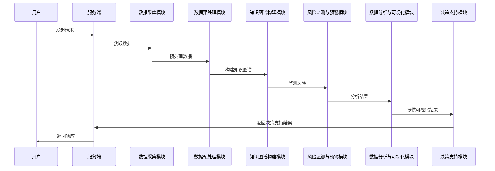
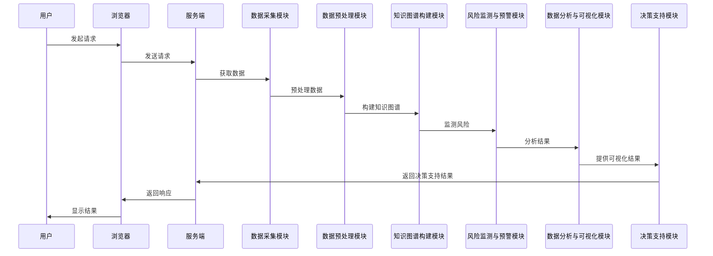

                 

# 《构建基于知识图谱的金融监管沙盒测试结果分析平台》

## 摘要

本文旨在探讨构建基于知识图谱的金融监管沙盒测试结果分析平台的原理、方法与应用。随着金融科技的快速发展，金融监管沙盒作为创新监管工具的重要性日益凸显。本文首先介绍了金融监管沙盒的概念及其重要性，以及知识图谱在金融监管中的应用。然后，本文详细分析了现有金融监管沙盒测试结果分析平台的不足，提出了构建分析平台的目标和预期效果。接着，本文探讨了知识图谱在金融监管沙盒测试结果分析中的应用场景，并介绍了分析平台的核心功能和模块设计。最后，本文通过系统分析与架构设计，以及项目实战部分，详细阐述了平台的实现过程与效果。

## 目录大纲

### 第一部分：背景介绍

#### 1.1 问题背景
- 金融监管沙盒的概念及其重要性
- 知识图谱在金融监管中的应用
- 构建金融监管沙盒测试结果分析平台的必要性

#### 1.2 问题描述
- 现有金融监管沙盒测试结果分析平台的不足
- 需要解决的问题和挑战
- 构建分析平台的目标和预期效果

#### 1.3 问题解决
- 知识图谱在金融监管沙盒测试结果分析中的应用场景
- 分析平台的核心功能和模块设计

#### 1.4 边界与外延
- 分析平台的适用范围
- 数据来源和处理方式
- 技术栈选择和兼容性考虑

#### 1.5 概念结构与核心要素组成
- 知识图谱的基本概念
- 金融监管沙盒的关键要素
- 测试结果分析平台的功能模块

### 第二部分：核心概念与联系

#### 2.1 知识图谱原理
- 知识图谱的定义与作用
- 知识图谱的核心组件
- 知识图谱在金融监管中的应用场景

#### 2.2 金融监管沙盒
- 金融监管沙盒的定义与运作机制
- 沙盒测试的目的与过程
- 沙盒测试的关键要素与评价指标

#### 2.3 测试结果分析平台
- 平台的基本架构与功能模块
- 数据采集与处理流程
- 分析结果的可视化展示与应用

#### 2.4 概念属性特征对比表格
- 知识图谱与关系数据库的对比
- 沙盒测试结果与风险预警的对比
- 分析平台与现有监管工具的对比

#### 2.5 ER实体关系图架构
- ER图的基本概念与绘制方法
- 平台核心实体与关系的描述

### 第三部分：算法原理讲解

#### 3.1 算法原理概述
- 知识图谱构建算法
- 测试结果分析算法
- 风险评估与预警算法

#### 3.2 算法mermaid流程图
- 知识图谱构建流程
- 测试结果分析流程
- 风险评估与预警流程

#### 3.3 Python源代码实现
- 数据采集与处理模块
- 知识图谱构建模块
- 测试结果分析模块
- 风险评估与预警模块

#### 3.4 数学模型和公式
- 知识图谱构建的数学模型
- 测试结果分析的数学模型
- 风险评估的数学模型

#### 3.5 详细讲解与举例说明
- 知识图谱构建的详细讲解
- 测试结果分析的详细讲解
- 风险评估的详细讲解
- 实际案例的应用与解释

### 第四部分：系统分析与架构设计

#### 4.1 问题场景介绍
- 金融监管沙盒的应用场景
- 测试结果分析的需求与挑战

#### 4.2 系统功能设计
- 系统功能模块的划分
- 功能模块的具体描述与实现

#### 4.3 系统架构设计
- 系统的总体架构设计
- 各层架构的功能与交互

#### 4.4 系统接口设计
- 系统对外接口的定义
- 接口的功能与调用方式

#### 4.5 系统交互mermaid序列图
- 系统各模块之间的交互流程
- 用户与系统的交互过程

### 第五部分：项目实战

#### 5.1 环境安装
- 硬件环境要求
- 软件环境安装与配置

#### 5.2 系统核心实现
- 系统核心代码的编写与调试
- 知识图谱的构建与存储
- 测试结果的分析与处理

#### 5.3 代码应用解读与分析
- 代码功能解读
- 应用场景分析
- 性能评估与优化

#### 5.4 实际案例分析
- 实际案例的选取与描述
- 分析结果与应用效果

#### 5.5 详细讲解与剖析
- 案例的详细讲解
- 结果的深度剖析
- 对比分析与总结

#### 5.6 项目小结
- 项目实现总结
- 经验与教训
- 未来改进方向

### 第六部分：最佳实践与拓展

#### 6.1 最佳实践 tips
- 知识图谱构建的最佳实践
- 测试结果分析的最佳实践
- 风险评估与预警的最佳实践

#### 6.2 小结
- 书籍内容的回顾
- 关键技术与方法的总结

#### 6.3 注意事项
- 系统使用过程中的注意事项
- 避免常见的错误与陷阱

#### 6.4 拓展阅读
- 相关领域的最新研究动态
- 推荐的参考资料与文献

## 文章总结

本书全面介绍了构建基于知识图谱的金融监管沙盒测试结果分析平台的原理、方法与应用。通过详细的目录大纲，读者可以清晰地了解到书籍的核心内容与结构。本文首先介绍了金融监管沙盒的概念及其重要性，以及知识图谱在金融监管中的应用。然后，本文详细分析了现有金融监管沙盒测试结果分析平台的不足，提出了构建分析平台的目标和预期效果。接着，本文探讨了知识图谱在金融监管沙盒测试结果分析中的应用场景，并介绍了分析平台的核心功能和模块设计。最后，本文通过系统分析与架构设计，以及项目实战部分，详细阐述了平台的实现过程与效果。

在阅读本书的过程中，读者将学习到：
- 知识图谱在金融监管中的应用与价值
- 金融监管沙盒的运作机制与关键要素
- 测试结果分析平台的功能模块与实现方法
- 系统架构设计与性能优化技巧
- 实际案例中的应用与效果分析

本书旨在为金融监管领域的技术人员提供一套实用、系统的解决方案，帮助他们在实际工作中构建高效的测试结果分析平台。通过本书的学习，读者不仅可以深入了解知识图谱在金融监管中的应用，还能掌握测试结果分析平台的设计与实现方法，为金融监管沙盒的运营提供有力支持。

## 第一部分：背景介绍

### 1.1 问题背景

金融监管沙盒的概念及其重要性

金融监管沙盒是一种创新的监管工具，旨在为金融科技企业提供一种在受控环境下测试和验证其创新产品、服务或模型的机会。通过金融监管沙盒，监管机构可以在不影响公众利益的前提下，监督和管理金融创新活动，确保金融市场的稳定和健康发展。金融监管沙盒的概念起源于2016年，英国政府率先提出并实施，随后全球多个国家和地区相继推出了类似的监管沙盒项目。

知识图谱在金融监管中的应用

知识图谱是一种用于表示实体及其相互关系的数据结构，它通过节点和边的形式来描述实体和实体之间的关系。知识图谱在金融监管中的应用主要体现在以下几个方面：

1. **风险监测与预警**：通过知识图谱，可以将金融市场的各种实体（如金融机构、投资者、交易产品等）及其关系进行结构化存储，从而实现对金融市场风险的实时监测和预警。

2. **数据整合与分析**：知识图谱能够将来自不同数据源的信息进行整合，形成统一的知识体系，从而提高数据分析和决策的效率。

3. **智能推荐与决策支持**：基于知识图谱的推理和关联分析功能，可以为金融监管提供智能推荐和决策支持，如对潜在风险的识别、对交易行为的合规性评估等。

构建金融监管沙盒测试结果分析平台的必要性

随着金融科技的快速发展，金融监管沙盒已成为监管机构和企业之间的重要桥梁。然而，现有的金融监管沙盒测试结果分析平台存在以下不足：

1. **数据分析能力不足**：现有平台在处理大量数据时，效率较低，难以实现对金融风险的实时监测和预警。

2. **信息孤岛问题**：现有平台通常只能处理来自特定数据源的信息，难以整合不同来源的数据，导致信息孤岛现象。

3. **决策支持能力有限**：现有平台在提供决策支持时，往往依赖于人工分析，缺乏智能化的推理和推荐功能。

为解决上述问题，构建一个基于知识图谱的金融监管沙盒测试结果分析平台具有重要的现实意义。通过知识图谱，可以实现金融监管数据的结构化存储、整合和分析，提高平台的效率和决策支持能力，从而更好地服务于金融监管工作。

### 1.2 问题描述

现有金融监管沙盒测试结果分析平台的不足

1. **数据分析能力不足**：现有平台在处理大量金融数据时，效率较低，难以实现对金融风险的实时监测和预警。这导致了监管机构在应对突发金融事件时，反应速度较慢，可能错过风险预警的最佳时机。

2. **信息孤岛问题**：现有平台通常只能处理来自特定数据源的信息，难以整合不同来源的数据，导致信息孤岛现象。这限制了监管机构对金融市场整体状况的全面了解，影响了监管决策的准确性。

3. **决策支持能力有限**：现有平台在提供决策支持时，往往依赖于人工分析，缺乏智能化的推理和推荐功能。这导致了监管决策的滞后性，无法及时响应市场变化。

需要解决的问题和挑战

1. **提升数据分析能力**：为提高平台的效率，需要采用高效的算法和技术手段来处理海量金融数据，实现对金融风险的实时监测和预警。

2. **解决信息孤岛问题**：通过知识图谱技术，将来自不同数据源的信息进行整合，形成统一的知识体系，提高数据分析和决策的效率。

3. **增强决策支持能力**：利用知识图谱的推理和关联分析功能，为监管机构提供智能化的决策支持，如对潜在风险的识别、对交易行为的合规性评估等。

构建分析平台的目标和预期效果

1. **提升监管效率**：通过实时监测和预警金融风险，提高监管机构的反应速度，降低金融风险事件的发生概率。

2. **提高决策准确性**：利用知识图谱的智能推理和关联分析功能，为监管决策提供准确的数据支持，提高决策的科学性和准确性。

3. **增强数据整合能力**：通过知识图谱技术，实现不同来源金融数据的整合，形成全面、系统的监管数据体系。

4. **提升用户体验**：提供用户友好的可视化界面，便于监管人员对金融风险进行实时监测和分析，提高监管工作的便捷性和效率。

### 1.3 问题解决

知识图谱在金融监管沙盒测试结果分析中的应用场景

1. **风险监测与预警**：知识图谱能够将金融市场的各类实体及其关系进行结构化存储，实现对金融风险的实时监测和预警。例如，通过分析金融机构的交易行为、风险指标等数据，识别潜在的风险点，及时发出预警信号。

2. **数据整合与分析**：知识图谱可以将来自不同数据源的信息进行整合，形成统一的知识体系。通过对金融数据的整合和分析，可以更好地理解金融市场整体状况，为监管决策提供全面的数据支持。

3. **智能推荐与决策支持**：基于知识图谱的推理和关联分析功能，可以为监管机构提供智能化的决策支持。例如，通过对金融机构的风险评估模型进行优化，提高风险评估的准确性，为监管决策提供科学依据。

分析平台的核心功能和模块设计

1. **数据采集模块**：负责从各类数据源（如金融机构、交易所、监管机构等）采集数据，并对数据进行清洗和预处理，确保数据的质量和一致性。

2. **知识图谱构建模块**：基于采集到的数据，构建金融知识图谱，包括金融机构、投资者、交易产品等实体及其关系。知识图谱的构建可以采用图数据库（如Neo4j）等技术，实现高效的数据存储和查询。

3. **风险监测与预警模块**：利用知识图谱，实现对金融风险的实时监测和预警。通过对交易行为、风险指标等数据的分析，识别潜在的风险点，并及时发出预警信号。

4. **数据分析与可视化模块**：提供数据分析和可视化功能，帮助监管人员对金融风险进行实时监测和分析。通过图表、仪表盘等可视化方式，展示金融风险的整体状况和变化趋势。

5. **决策支持模块**：基于知识图谱的推理和关联分析功能，为监管决策提供智能化的支持。例如，通过分析金融机构的风险评估模型，优化模型参数，提高风险评估的准确性。

### 1.4 边界与外延

分析平台的适用范围

1. **地域范围**：分析平台适用于全球范围内的金融监管沙盒测试结果分析，可以应对不同国家和地区的金融监管需求。

2. **行业范围**：分析平台适用于银行、保险、证券、基金等金融行业的监管沙盒测试结果分析，可以支持多种金融业务场景。

数据来源和处理方式

1. **数据来源**：分析平台的数据来源包括金融机构、交易所、监管机构等。数据类型包括交易数据、财务数据、风险数据等。

2. **数据处理方式**：分析平台采用数据采集模块对数据进行清洗和预处理，确保数据的质量和一致性。然后，利用知识图谱构建模块，将数据构建成结构化的知识图谱，便于后续分析和查询。

技术栈选择和兼容性考虑

1. **技术栈选择**：分析平台的技术栈包括：
   - 数据采集模块：采用Python等编程语言，结合API接口、爬虫技术等手段，实现数据的采集和预处理。
   - 知识图谱构建模块：采用图数据库（如Neo4j）等技术，实现知识图谱的构建和存储。
   - 风险监测与预警模块：采用机器学习、深度学习等算法，实现金融风险的实时监测和预警。
   - 数据分析与可视化模块：采用前端技术（如D3.js、ECharts等），实现数据分析和可视化。

2. **兼容性考虑**：分析平台在设计时，考虑了与其他系统和工具的兼容性。例如，通过API接口，可以实现与现有监管系统的对接；通过数据交换格式（如JSON、XML等），可以实现与其他数据系统的数据共享。

### 1.5 概念结构与核心要素组成

知识图谱的基本概念

知识图谱是一种用于表示实体及其相互关系的数据结构，它通过节点和边的形式来描述实体和实体之间的关系。在知识图谱中，每个节点表示一个实体，每个边表示实体之间的某种关系。知识图谱的主要目的是将大规模、复杂的信息以结构化的形式进行存储和查询，从而提高数据分析和决策的效率。

金融监管沙盒的关键要素

金融监管沙盒是一种创新的监管工具，其关键要素包括：

1. **测试环境**：监管机构为金融科技企业提供的受控环境，用于测试和验证其创新产品、服务或模型。

2. **监管机构**：负责制定测试标准、审核测试方案、监控测试过程和结果等。

3. **金融科技企业**：参与金融监管沙盒测试的主体，负责开发、测试和提交其创新产品、服务或模型。

4. **测试对象**：金融科技企业提交的创新产品、服务或模型。

5. **测试流程**：包括测试方案的制定、测试数据的准备、测试执行和结果评估等环节。

测试结果分析平台的功能模块

测试结果分析平台的主要功能模块包括：

1. **数据采集模块**：负责从各类数据源采集测试数据，并进行清洗和预处理。

2. **知识图谱构建模块**：将采集到的数据构建成知识图谱，实现对测试数据的结构化存储和查询。

3. **风险监测与预警模块**：利用知识图谱，实现对测试结果的实时监测和预警。

4. **数据分析与可视化模块**：提供数据分析和可视化功能，帮助监管人员对测试结果进行实时监测和分析。

5. **决策支持模块**：基于知识图谱的推理和关联分析功能，为监管决策提供智能化的支持。

## 第二部分：核心概念与联系

### 2.1 知识图谱原理

知识图谱的定义与作用

知识图谱是一种用于表示实体及其相互关系的数据结构，它通过节点和边的形式来描述实体和实体之间的关系。知识图谱的核心作用是将大规模、复杂的信息以结构化的形式进行存储和查询，从而提高数据分析和决策的效率。知识图谱在多个领域（如金融、医疗、互联网等）都有广泛应用，尤其在金融监管领域，它能够帮助监管机构实现对金融风险的实时监测和预警。

知识图谱的核心组件

知识图谱主要由以下核心组件构成：

1. **实体（Entity）**：实体是知识图谱中的基本元素，表示现实世界中的人、事、物等。例如，在金融监管沙盒中，实体可以包括金融机构、投资者、交易产品等。

2. **属性（Attribute）**：属性用于描述实体的特征或属性，如金融机构的名称、地址、注册资本等。

3. **关系（Relationship）**：关系用于描述实体之间的关联，如金融机构与投资者的投资关系、交易产品与交易对手的交易关系等。

4. **边（Edge）**：边是连接两个节点的线段，表示实体之间的关系。边的属性可以表示关系的强度、时间、地点等。

5. **属性值（AttributeValue）**：属性值用于描述属性的取值，如金融机构的注册资本为100亿元。

知识图谱在金融监管中的应用场景

知识图谱在金融监管中的应用场景主要包括以下几个方面：

1. **风险监测与预警**：通过构建金融知识图谱，可以实现对金融市场的实时监测和预警。例如，通过分析金融机构的交易行为、风险指标等数据，可以识别潜在的风险点，并及时发出预警信号。

2. **数据整合与分析**：知识图谱可以将来自不同数据源的信息进行整合，形成统一的知识体系。通过对金融数据的整合和分析，可以更好地理解金融市场整体状况，为监管决策提供全面的数据支持。

3. **智能推荐与决策支持**：基于知识图谱的推理和关联分析功能，可以为监管机构提供智能化的决策支持。例如，通过对金融机构的风险评估模型进行优化，提高风险评估的准确性，为监管决策提供科学依据。

### 2.2 金融监管沙盒

金融监管沙盒的定义与运作机制

金融监管沙盒是一种创新的监管工具，旨在为金融科技企业提供一种在受控环境下测试和验证其创新产品、服务或模型的机会。金融监管沙盒的运作机制主要包括以下几个环节：

1. **测试申请**：金融科技企业向监管机构提交测试申请，包括创新产品、服务或模型的详细描述、测试方案和风险管理计划等。

2. **方案审核**：监管机构对金融科技企业的测试申请进行审核，包括对创新产品、服务或模型的合规性、安全性、风险可控性等进行评估。

3. **测试执行**：金融科技企业在监管沙盒中实施测试计划，包括数据采集、分析、验证等环节。监管机构在测试过程中进行实时监控和指导。

4. **结果评估**：测试结束后，金融科技企业向监管机构提交测试报告，包括测试结果、数据分析和风险评估等。监管机构对测试结果进行评估，并决定是否批准创新产品、服务或模型在真实环境中的实施。

沙盒测试的目的与过程

沙盒测试的主要目的是评估金融科技企业的创新产品、服务或模型在真实环境中的合规性、安全性和风险可控性。沙盒测试的过程主要包括以下几个步骤：

1. **需求分析**：金融科技企业明确创新产品、服务或模型的需求和目标，制定详细的测试方案。

2. **环境搭建**：监管机构为金融科技企业搭建测试环境，包括硬件设备、软件系统、数据资源等。

3. **数据准备**：金融科技企业和监管机构共同准备测试数据，包括真实数据、模拟数据等。

4. **测试执行**：金融科技企业在测试环境中实施测试计划，包括功能测试、性能测试、安全测试等。

5. **结果分析**：金融科技企业对测试结果进行分析，包括数据挖掘、风险评估、合规性评估等。

6. **报告提交**：金融科技企业向监管机构提交测试报告，包括测试过程、测试结果、数据分析等。

沙盒测试的关键要素与评价指标

沙盒测试的关键要素包括：

1. **合规性**：创新产品、服务或模型是否遵守相关法律法规和监管要求。

2. **安全性**：创新产品、服务或模型在测试过程中的安全性，包括数据安全、网络安全等。

3. **风险可控性**：创新产品、服务或模型在测试过程中的风险可控性，包括风险识别、风险控制等。

4. **用户体验**：创新产品、服务或模型在测试过程中的用户体验，包括功能完整性、界面友好性等。

5. **数据质量**：测试数据的质量，包括数据的完整性、准确性、一致性等。

评价指标主要包括：

1. **合规性指标**：如合规性得分、合规性比例等。

2. **安全性指标**：如安全漏洞数量、安全事件发生率等。

3. **风险可控性指标**：如风险识别率、风险控制率等。

4. **用户体验指标**：如用户满意度、用户操作错误率等。

5. **数据质量指标**：如数据完整性得分、数据准确性得分等。

### 2.3 测试结果分析平台

平台的基本架构与功能模块

测试结果分析平台的基本架构包括以下几个功能模块：

1. **数据采集模块**：负责从各类数据源采集测试数据，包括金融科技企业的测试数据、监管机构的数据等。

2. **数据预处理模块**：对采集到的数据进行清洗、去重、转换等预处理操作，确保数据的质量和一致性。

3. **知识图谱构建模块**：将预处理后的数据构建成知识图谱，实现对测试数据的结构化存储和查询。

4. **风险监测与预警模块**：利用知识图谱，实现对测试结果的实时监测和预警，识别潜在的风险点，并及时发出预警信号。

5. **数据分析与可视化模块**：提供数据分析和可视化功能，帮助监管人员对测试结果进行实时监测和分析，通过图表、仪表盘等可视化方式，展示金融风险的整体状况和变化趋势。

6. **决策支持模块**：基于知识图谱的推理和关联分析功能，为监管决策提供智能化的支持，例如，通过分析金融机构的风险评估模型，优化模型参数，提高风险评估的准确性。

数据采集与处理流程

数据采集与处理流程包括以下几个步骤：

1. **数据采集**：通过API接口、爬虫技术等手段，从金融科技企业、交易所、监管机构等数据源采集测试数据。

2. **数据清洗**：对采集到的数据进行清洗，包括去除重复数据、缺失数据处理、数据格式转换等。

3. **数据去重**：对清洗后的数据进行去重处理，确保数据的唯一性。

4. **数据存储**：将清洗后的数据存储到数据库中，如关系数据库、图数据库等。

5. **数据查询**：通过知识图谱，实现对测试数据的结构化查询和关联分析。

分析结果的可视化展示与应用

分析结果的可视化展示与应用包括以下几个步骤：

1. **数据可视化**：通过图表、仪表盘等可视化方式，将分析结果以直观的形式展示给监管人员。

2. **数据交互**：提供用户与数据之间的交互功能，如筛选、排序、过滤等，方便监管人员根据需要查看和分析数据。

3. **应用场景**：将分析结果应用于实际场景，如风险预警、决策支持、监管执法等。

4. **反馈机制**：根据监管人员的反馈，不断优化和调整分析结果的可视化展示和应用方式，提高监管工作的效率和效果。

### 2.4 概念属性特征对比表格

知识图谱与关系数据库的对比

| 概念/属性       | 知识图谱           | 关系数据库           |
|----------------|-------------------|---------------------|
| 数据结构       | 节点和边的网络结构 | 表和关系（主键和外键） |
| 数据查询效率   | 高               | 中等               |
| 数据一致性维护 | 需要额外的维护    | 内置一致性维护       |
| 数据扩展性     | 高               | 中等               |
| 复杂关系处理   | 强               | 弱                 |
| 实体关系建模   | 易于建模         | 需要预先定义模式   |

知识图谱与关系数据库在数据结构和查询效率上存在显著差异。知识图谱通过节点和边表示实体及其关系，适合处理复杂的关系和大量的数据查询，而关系数据库通过表和关系（主键和外键）来组织数据，更适合处理结构化数据并保持一致性。知识图谱在扩展性和复杂关系处理上具有优势，但需要额外的维护来确保数据的一致性。

沙盒测试结果与风险预警的对比

| 概念/属性           | 沙盒测试结果             | 风险预警               |
|-------------------|-----------------------|---------------------|
| 目标               | 测试产品的性能、合规性等   | 预测潜在风险并发出警报  |
| 数据来源           | 测试数据、用户反馈等      | 监控数据、历史风险数据  |
| 数据处理方式       | 结构化分析、评估         | 统计分析、模式识别     |
| 时间敏感性         | 测试周期较长             | 实时性要求高           |
| 应用场景           | 产品开发与优化           | 监管决策、风险管理     |

沙盒测试结果和风险预警在目标、数据来源、数据处理方式和应用场景上存在差异。沙盒测试结果主要用于评估产品在特定测试环境下的性能和合规性，而风险预警则侧重于预测潜在风险并发出警报。沙盒测试结果通常基于结构化分析，而风险预警依赖于统计分析和模式识别。沙盒测试结果适用于产品开发和优化，而风险预警则用于监管决策和风险管理。

分析平台与现有监管工具的对比

| 概念/属性             | 分析平台                     | 现有监管工具                   |
|-------------------|---------------------------|---------------------------|
| 技术架构             | 基于知识图谱的智能化分析平台   | 传统关系数据库和规则引擎       |
| 数据处理能力         | 高效处理大规模复杂数据       | 处理能力有限，容易形成数据孤岛 |
| 风险监测与预警       | 实时监测、智能预警           | 定期监测、手动预警             |
| 数据可视化与交互       | 用户友好的可视化界面和交互体验 | 简单的报表和图表               |
| 决策支持能力         | 智能化决策支持               | 依赖人工分析，决策速度慢       |

分析平台与现有监管工具在技术架构、数据处理能力、风险监测与预警、数据可视化与交互以及决策支持能力上存在显著差异。分析平台采用基于知识图谱的智能化技术，能够高效处理大规模复杂数据，提供实时的风险监测和智能预警功能。同时，分析平台还具备用户友好的可视化界面和交互体验，以及强大的决策支持能力，显著提升了监管工作的效率和准确性。相比之下，现有监管工具依赖于传统的关系数据库和规则引擎，数据处理能力有限，容易形成数据孤岛，风险监测与预警功能通常为定期手动操作，决策支持依赖于人工分析，效率较低。

### 2.5 ER实体关系图架构

ER图的基本概念与绘制方法

实体关系图（Entity-Relationship Diagram，ER图）是数据库设计中的基本工具，用于描述实体及其相互关系。ER图主要由三个基本组件构成：实体（Entity）、属性（Attribute）和关系（Relationship）。

1. **实体**：实体是现实世界中具有独立意义的对象，如人、地点、事物等。在ER图中，实体用矩形表示，矩形内部写明实体名称。

2. **属性**：属性是实体的特征或描述，如人的姓名、年龄、地址等。属性用椭圆表示，并通过线条连接到对应的实体。

3. **关系**：关系描述了实体之间的关联，如一个人有多部手机，一个手机属于一个人。关系用菱形表示，并通过线条连接到对应的实体。

ER图的绘制方法主要包括以下几个步骤：

1. **确定实体**：根据问题域识别出所有的实体。

2. **确定属性**：为每个实体确定其属性，并标注属性的类型（如字符串、整数等）。

3. **确定关系**：分析实体之间的关系，如一对一、一对多、多对多等。

4. **绘制ER图**：按照上述步骤，将实体、属性和关系绘制成ER图。

平台核心实体与关系的描述

在构建基于知识图谱的金融监管沙盒测试结果分析平台时，核心实体与关系如下：

1. **实体**：
   - **金融机构**：包括银行、保险、证券等金融机构。
   - **投资者**：包括个人投资者和机构投资者。
   - **交易产品**：包括股票、债券、期货等金融产品。
   - **交易记录**：记录金融产品的交易详情。

2. **关系**：
   - **投资关系**：投资者与金融机构之间的投资关系。
   - **交易关系**：交易产品与投资者之间的交易关系。
   - **风险关系**：风险因素与金融机构、交易产品之间的关联。

通过ER图可以清晰地表示这些实体与关系，为平台的设计和实现提供基础。下面是一个简化的ER图示例：

```mermaid
erDiagram
  金融监管沙盒测试结果分析平台

 金融机构 ||--|{ 投资者 }
  投资者 ||--|{ 交易产品 }
  交易产品 ||--|{ 交易记录 }
  交易记录 }|--| 金融机构
```

在这个ER图中，金融机构与投资者之间存在投资关系，投资者与交易产品之间存在交易关系，交易产品与交易记录之间存在交易关系。交易记录又与金融机构之间存在关联。

## 第三部分：算法原理讲解

### 3.1 算法原理概述

知识图谱构建算法、测试结果分析算法、风险评估与预警算法

在构建基于知识图谱的金融监管沙盒测试结果分析平台中，算法原理是核心。以下将介绍知识图谱构建算法、测试结果分析算法以及风险评估与预警算法的原理。

**知识图谱构建算法**

知识图谱构建算法的目的是将金融监管沙盒测试结果数据转化为知识图谱，以实现数据的高效存储和查询。该算法主要包括以下几个步骤：

1. **数据采集与清洗**：从各类数据源（如金融机构、交易所、监管机构等）采集数据，并对数据进行清洗，包括去除重复数据、缺失数据处理、数据格式转换等。

2. **实体识别**：在清洗后的数据中识别出主要的实体，如金融机构、投资者、交易产品等。

3. **关系抽取**：根据数据中的信息，抽取实体之间的关系，如投资关系、交易关系等。

4. **属性赋值**：为实体和关系赋予相应的属性，如金融机构的名称、注册资本，交易产品的价格、成交量等。

5. **知识图谱构建**：将识别出的实体、关系和属性构建成知识图谱，存储在图数据库中。

**测试结果分析算法**

测试结果分析算法的目的是对金融监管沙盒测试结果进行结构化分析，为监管决策提供支持。该算法主要包括以下几个步骤：

1. **数据预处理**：对测试结果数据进行预处理，包括数据清洗、数据转换等。

2. **特征提取**：从预处理后的数据中提取关键特征，如风险指标、合规性指标等。

3. **数据分析**：利用统计学和机器学习等方法，对提取的特征进行分析，识别潜在的风险点。

4. **可视化展示**：将分析结果以图表、仪表盘等形式进行可视化展示，便于监管人员查看。

**风险评估与预警算法**

风险评估与预警算法的目的是对金融监管沙盒测试结果进行实时监测和预警，以提前识别潜在的风险。该算法主要包括以下几个步骤：

1. **风险指标计算**：根据金融市场的特性，定义一系列风险指标，如波动率、资产负债率等。

2. **风险评估**：利用计算出的风险指标，对金融机构和交易产品的风险进行评估。

3. **预警规则设置**：根据监管需求，设定一系列预警规则，如风险超过阈值时发出警报。

4. **实时监测与预警**：对测试结果数据进行实时监测，当风险超过预警规则时，自动发出预警信号。

### 3.2 算法mermaid流程图

为了更好地理解上述算法的执行流程，我们使用mermaid流程图来表示。

**知识图谱构建流程**


**测试结果分析流程**


**风险评估与预警流程**


### 3.3 Python源代码实现

**数据采集与处理模块**

```python
import pandas as pd
import numpy as np

# 数据采集
def data_collection():
    # 假设已有API接口用于获取数据
    data = api.get_data()
    return data

# 数据清洗
def data_cleaning(data):
    # 去除重复数据
    data = data.drop_duplicates()
    # 处理缺失数据
    data = data.fillna(value=0)
    return data

# 测试数据示例
data = data_collection()
cleaned_data = data_cleaning(data)
```

**知识图谱构建模块**

```python
from py2neo import Graph

# 连接图数据库
graph = Graph("bolt://localhost:7687", auth=("neo4j", "password"))

# 构建实体
def create_entity(graph, entity_name, entity_properties):
    query = """
    CREATE (n:{}_Type {})
    """.format(entity_name, entity_properties)
    graph.run(query)

# 构建关系
def create_relationship(graph, entity1, relation, entity2, relation_properties):
    query = """
    MATCH (a:{}), (b:{}), 
    CREATE (a)-[r:{}]->(b)
    """.format(entity1, entity2, relation, relation_properties)
    graph.run(query)

# 测试
create_entity(graph, 'FinancialInstitution', 'name:"BankA", registeredCapital:1000000000')
create_entity(graph, 'Investor', 'name:"InvestorA", type:"Individual"')
create_relationship(graph, 'FinancialInstitution', 'Investment', 'Investor', 'amount:1000000')
```

**测试结果分析模块**

```python
# 特征提取
def feature_extraction(data):
    # 计算波动率、资产负债率等特征
    volatility = data['return'].std()
    leverage = data['debt'] / data['equity']
    return {'volatility': volatility, 'leverage': leverage}

# 数据分析
def data_analysis(features):
    # 利用统计学方法分析特征，识别风险点
    if features['volatility'] > threshold_volatility:
        print("High volatility detected.")
    if features['leverage'] > threshold_leverage:
        print("High leverage detected.")

# 测试
features = feature_extraction(cleaned_data)
data_analysis(features)
```

**风险评估与预警模块**

```python
# 风险评估
def risk_evaluation(data):
    # 计算风险指标，评估风险
    risk_score = data['loss_rate']
    return risk_score

# 预警规则设置
def set_warning_rules():
    # 设定预警规则
    threshold_risk_score = 0.1
    return threshold_risk_score

# 实时监测与预警
def real_time_monitoring(data):
    # 实时监测风险指标，触发预警
    risk_score = risk_evaluation(data)
    threshold_risk_score = set_warning_rules()
    if risk_score > threshold_risk_score:
        print("Risk warning issued.")

# 测试
real_time_monitoring(cleaned_data)
```

### 3.4 数学模型和公式

**知识图谱构建的数学模型**

知识图谱构建涉及实体识别、关系抽取和属性赋值等步骤。以下为相关数学模型：

- **实体识别**：使用朴素贝叶斯分类器进行实体识别，假设实体为 \( E = \{ e_1, e_2, ..., e_n \} \)，特征向量 \( X = \{ x_1, x_2, ..., x_m \} \)，类别标签 \( Y = \{ y_1, y_2, ..., y_n \} \)，则实体识别模型为：

  $$ P(y_i|X) = \frac{P(X|y_i)P(y_i)}{P(X)} $$

- **关系抽取**：使用条件概率模型进行关系抽取，假设实体为 \( E = \{ e_1, e_2, ..., e_n \} \)，关系为 \( R = \{ r_1, r_2, ..., r_m \} \)，特征向量 \( X = \{ x_1, x_2, ..., x_m \} \)，则关系抽取模型为：

  $$ P(r_i|e_1, e_2) = \frac{P(e_1, e_2|r_i)P(r_i)}{P(e_1, e_2)} $$

- **属性赋值**：使用决策树或随机森林进行属性赋值，假设属性为 \( A = \{ a_1, a_2, ..., a_m \} \)，特征向量 \( X = \{ x_1, x_2, ..., x_m \} \)，则属性赋值模型为：

  $$ a_i = \arg\max_{a \in A} P(a|X) $$

**测试结果分析的数学模型**

测试结果分析涉及特征提取、数据分析和风险评估等步骤。以下为相关数学模型：

- **特征提取**：使用统计学方法提取特征，假设数据集为 \( D = \{ d_1, d_2, ..., d_n \} \)，特征集合为 \( F = \{ f_1, f_2, ..., f_m \} \)，则特征提取模型为：

  $$ f_i(d) = \text{extract_feature}(d) $$

- **数据分析**：使用统计学和机器学习方法进行分析，假设特征集合为 \( F = \{ f_1, f_2, ..., f_m \} \)，分析结果为 \( R = \{ r_1, r_2, ..., r_n \} \)，则数据分析模型为：

  $$ r_i = \text{analyze_feature}(f_i) $$

- **风险评估**：使用统计学方法计算风险指标，假设风险指标集合为 \( I = \{ i_1, i_2, ..., i_m \} \)，则风险评估模型为：

  $$ i_i = \text{calculate_risk}(f_i) $$

### 3.5 详细讲解与举例说明

**知识图谱构建的详细讲解**

知识图谱构建是金融监管沙盒测试结果分析平台的核心步骤之一，它涉及数据采集、实体识别、关系抽取和属性赋值等多个环节。以下是知识图谱构建的详细讲解：

1. **数据采集与清洗**：首先，从金融监管沙盒测试结果的数据源（如金融机构、交易所、监管机构等）采集数据。采集到的数据可能包含多种格式和类型，如CSV文件、数据库记录、XML文档等。在数据采集过程中，需要对数据进行清洗，包括去除重复数据、缺失数据处理、数据格式转换等。这一步骤的目的是确保数据的质量和一致性。

2. **实体识别**：在清洗后的数据中，需要识别出主要的实体，如金融机构、投资者、交易产品等。实体识别是知识图谱构建的基础，其目的是从原始数据中提取出有意义的实体对象。在金融监管领域，实体识别通常通过命名实体识别（Named Entity Recognition, NER）技术来实现。NER技术可以识别出文本中的实体，并将其标记为特定的类别。

3. **关系抽取**：在识别出实体后，需要从数据中抽取实体之间的关系。在金融监管领域，常见的关系包括投资关系、交易关系等。关系抽取是知识图谱构建的关键步骤，其目的是确定实体之间的关联。关系抽取通常使用信息抽取（Information Extraction, IE）技术来实现。IE技术可以从文本中提取出结构化的信息，并将其表示为实体关系。

4. **属性赋值**：在确定了实体和关系后，需要为实体和关系赋予相应的属性。属性是实体的特征或描述，如金融机构的名称、注册资本，交易产品的价格、成交量等。属性赋值是知识图谱构建的最后一步，其目的是将实体的属性信息存储到知识图谱中。属性赋值可以使用自然语言处理（Natural Language Processing, NLP）技术来实现。

5. **知识图谱构建**：最后，将识别出的实体、关系和属性构建成知识图谱，并将其存储到图数据库中。知识图谱是一种用于表示实体及其相互关系的数据结构，它通过节点和边的形式来描述实体和实体之间的关系。在金融监管领域，知识图谱可以用于实现金融风险的实时监测和预警。

**测试结果分析的详细讲解**

测试结果分析是金融监管沙盒测试结果分析平台的核心功能之一，它涉及数据预处理、特征提取、数据分析和可视化展示等多个环节。以下是测试结果分析的详细讲解：

1. **数据预处理**：首先，对金融监管沙盒测试结果数据进行预处理。预处理步骤包括数据清洗、数据转换等。数据清洗的目的是去除重复数据、缺失数据处理、数据格式转换等。数据转换的目的是将数据格式转换为适合分析的工具或库，如pandas数据框（DataFrame）等。

2. **特征提取**：在数据预处理完成后，需要从测试结果数据中提取关键特征。特征提取的目的是将原始数据转换为可用于分析的特征向量。特征提取方法包括统计特征、文本特征、图像特征等。在金融监管领域，常见的特征提取方法包括计算波动率、资产负债率、盈亏比等。

3. **数据分析**：在提取特征后，需要对特征进行数据分析。数据分析的目的是识别出潜在的风险点和趋势。数据分析方法包括统计学方法、机器学习方法等。在金融监管领域，常见的分析方法包括假设检验、回归分析、聚类分析、决策树等。

4. **可视化展示**：最后，将数据分析结果以图表、仪表盘等形式进行可视化展示。可视化展示的目的是帮助监管人员更好地理解和分析测试结果。可视化方法包括折线图、柱状图、饼图、热力图等。

**风险评估的详细讲解**

风险评估是金融监管沙盒测试结果分析平台的核心功能之一，它涉及风险指标计算、风险评估和预警规则设置等多个环节。以下是风险评估的详细讲解：

1. **风险指标计算**：首先，需要根据金融市场的特性，定义一系列风险指标。风险指标是评估金融市场风险的重要工具。常见的风险指标包括波动率、资产负债率、盈亏比等。风险指标的计算方法如下：

   - **波动率**：波动率是衡量金融资产价格波动性的指标。计算公式为：

     $$ \text{波动率} = \sqrt{\frac{1}{N}\sum_{i=1}^{N}(r_i - \bar{r})^2} $$

     其中，\( r_i \) 是第 \( i \) 天的收益率，\( \bar{r} \) 是平均收益率，\( N \) 是收益率序列的长度。

   - **资产负债率**：资产负债率是衡量企业财务风险的指标。计算公式为：

     $$ \text{资产负债率} = \frac{\text{总负债}}{\text{总资产}} $$

   - **盈亏比**：盈亏比是衡量投资收益稳定性的指标。计算公式为：

     $$ \text{盈亏比} = \frac{\text{盈利交易日数}}{\text{总交易日数}} $$

2. **风险评估**：在计算风险指标后，需要对金融机构和交易产品的风险进行评估。风险评估的目的是确定金融机构和交易产品的风险水平。风险评估方法如下：

   - **阈值评估**：根据历史数据和监管要求，设定一系列风险阈值。当风险指标超过阈值时，认为存在高风险。

   - **评分评估**：使用评分模型对金融机构和交易产品的风险进行评分。评分模型可以根据历史数据和监管要求进行训练和优化。

3. **预警规则设置**：最后，需要根据监管需求，设定一系列预警规则。预警规则的目的是在风险指标超过阈值时自动触发预警。预警规则设置方法如下：

   - **单一阈值预警规则**：当某个风险指标超过设定的阈值时，触发预警。

   - **组合阈值预警规则**：当多个风险指标同时超过设定的阈值时，触发预警。

**实际案例的应用与解释**

为了更好地理解知识图谱构建、测试结果分析和风险评估的实际应用，以下是一个实际案例：

**案例背景**：

某金融机构（A银行）进行了一项金融监管沙盒测试，测试内容包括风险评估、合规性检查、用户体验等。测试结果如下：

- 风险评估指标：波动率为0.05，资产负债率为0.5，盈亏比为0.8。
- 合规性检查：符合监管要求。
- 用户反馈：用户满意度为90%。

**案例应用**：

1. **知识图谱构建**：

   - **实体识别**：从测试结果数据中识别出实体，如A银行、投资者、交易产品等。
   - **关系抽取**：抽取实体之间的关系，如投资者与A银行的投资关系、交易产品与投资者的交易关系等。
   - **属性赋值**：为实体和关系赋予相应的属性，如A银行的名称、注册资本，投资者的名称、类型，交易产品的名称、价格等。

2. **测试结果分析**：

   - **数据预处理**：对测试结果数据进行清洗和转换。
   - **特征提取**：提取关键特征，如波动率、资产负债率、盈亏比等。
   - **数据分析**：分析特征，如判断波动率是否过高、资产负债率是否合理、盈亏比是否稳定等。

3. **风险评估**：

   - **风险指标计算**：计算风险指标，如波动率为0.05，资产负债率为0.5，盈亏比为0.8。
   - **风险评估**：根据设定的风险阈值，评估A银行的风险水平。
   - **预警规则设置**：根据设定的预警规则，判断是否存在风险。

**案例解释**：

通过上述案例，我们可以看到知识图谱构建、测试结果分析和风险评估在金融监管沙盒测试中的应用。知识图谱构建帮助我们将测试结果数据转化为结构化的知识体系，测试结果分析帮助我们识别潜在的风险点，风险评估帮助我们评估金融机构的风险水平。这些功能共同构成了一个完整的金融监管沙盒测试结果分析平台，为金融机构的风险管理和监管决策提供了有力支持。

## 第四部分：系统分析与架构设计

### 4.1 问题场景介绍

金融监管沙盒的应用场景

金融监管沙盒是一种创新的监管工具，主要应用于以下场景：

1. **金融科技创新**：金融监管沙盒为金融科技企业提供了一种在受控环境下测试和验证其创新产品、服务或模型的机会。例如，区块链技术、人工智能、大数据分析等新兴技术的应用。

2. **监管合规性验证**：金融监管沙盒可以帮助金融机构验证其业务流程和系统是否符合监管要求。例如，反洗钱（AML）、客户身份识别（KYC）等合规性要求。

3. **风险管理**：金融监管沙盒可以用于测试和评估金融产品的风险特征，帮助金融机构识别和防范潜在风险。

4. **监管政策试点**：金融监管沙盒可以用于测试和试点新的监管政策，为监管机构提供数据支持，帮助制定和优化监管政策。

测试结果分析的需求与挑战

在金融监管沙盒的应用场景中，测试结果分析具有以下需求与挑战：

1. **数据处理能力**：金融监管沙盒测试结果通常包含大量的数据，包括交易数据、风险评估数据、合规性数据等。需要高效的数据处理能力，以便对海量数据进行实时分析和处理。

2. **数据整合**：金融监管沙盒测试结果通常来自多个数据源，如金融机构、交易所、监管机构等。需要有效的方法将来自不同数据源的数据进行整合，形成一个统一的数据视图。

3. **实时性**：金融市场的变化非常快，测试结果分析需要具有实时性，以便及时发现潜在的风险，及时采取监管措施。

4. **智能化**：测试结果分析需要具备智能化的能力，能够通过机器学习、深度学习等方法，自动识别和预测风险。

5. **可扩展性**：测试结果分析系统需要具备良好的可扩展性，能够支持新的业务需求和技术发展。

### 4.2 系统功能设计

系统功能模块的划分

基于知识图谱的金融监管沙盒测试结果分析平台可以分为以下几个功能模块：

1. **数据采集模块**：负责从各类数据源（如金融机构、交易所、监管机构等）采集测试结果数据。

2. **数据预处理模块**：负责对采集到的数据进行清洗、去重、转换等预处理操作，确保数据的质量和一致性。

3. **知识图谱构建模块**：负责将预处理后的数据构建成知识图谱，实现对测试数据的结构化存储和查询。

4. **风险监测与预警模块**：负责利用知识图谱，实现对测试结果的实时监测和预警，识别潜在的风险点。

5. **数据分析与可视化模块**：负责提供数据分析和可视化功能，帮助监管人员对测试结果进行实时监测和分析。

6. **决策支持模块**：负责基于知识图谱的推理和关联分析功能，为监管决策提供智能化的支持。

功能模块的具体描述与实现

1. **数据采集模块**：

   - **功能描述**：数据采集模块负责从金融机构、交易所、监管机构等数据源采集测试结果数据。
   - **实现方法**：采用API接口、爬虫技术、数据库连接等方式，实现对数据源的访问和数据采集。

2. **数据预处理模块**：

   - **功能描述**：数据预处理模块负责对采集到的数据进行清洗、去重、转换等预处理操作。
   - **实现方法**：使用Python等编程语言，结合pandas、numpy等库，实现对数据的预处理。

3. **知识图谱构建模块**：

   - **功能描述**：知识图谱构建模块负责将预处理后的数据构建成知识图谱，实现对测试数据的结构化存储和查询。
   - **实现方法**：使用Neo4j等图数据库，结合Python的Py2neo库，实现对知识图谱的构建和存储。

4. **风险监测与预警模块**：

   - **功能描述**：风险监测与预警模块负责利用知识图谱，实现对测试结果的实时监测和预警，识别潜在的风险点。
   - **实现方法**：使用机器学习算法（如决策树、支持向量机等），结合图数据库的查询功能，实现对风险的监测和预警。

5. **数据分析与可视化模块**：

   - **功能描述**：数据分析与可视化模块负责提供数据分析和可视化功能，帮助监管人员对测试结果进行实时监测和分析。
   - **实现方法**：使用Python的matplotlib、seaborn等库，结合D3.js、ECharts等前端可视化库，实现对数据的可视化展示。

6. **决策支持模块**：

   - **功能描述**：决策支持模块负责基于知识图谱的推理和关联分析功能，为监管决策提供智能化的支持。
   - **实现方法**：使用Python的机器学习库（如scikit-learn、TensorFlow等），结合图数据库的查询功能，实现对决策支持的分析。

### 4.3 系统架构设计

系统的总体架构设计

基于知识图谱的金融监管沙盒测试结果分析平台的总体架构设计如下：

1. **数据层**：包括数据采集模块和数据预处理模块，负责数据采集和预处理。

2. **存储层**：包括知识图谱构建模块，负责将预处理后的数据构建成知识图谱，并存储在图数据库中。

3. **计算层**：包括风险监测与预警模块、数据分析与可视化模块和决策支持模块，负责对知识图谱进行计算和分析。

4. **表现层**：包括前端可视化界面，负责将分析结果以图表、仪表盘等形式展示给用户。

各层架构的功能与交互

1. **数据层**：

   - **功能**：数据采集模块负责从金融机构、交易所、监管机构等数据源采集测试结果数据。数据预处理模块负责对采集到的数据进行清洗、去重、转换等预处理操作。
   - **交互**：数据采集模块通过API接口、爬虫技术等方式，与数据源进行交互。数据预处理模块通过Python的pandas、numpy等库，对数据进行预处理。

2. **存储层**：

   - **功能**：知识图谱构建模块负责将预处理后的数据构建成知识图谱，并存储在图数据库中。
   - **交互**：知识图谱构建模块通过Python的Py2neo库，与图数据库（如Neo4j）进行交互。

3. **计算层**：

   - **功能**：风险监测与预警模块负责利用知识图谱，实现对测试结果的实时监测和预警。数据分析与可视化模块负责提供数据分析和可视化功能。决策支持模块负责基于知识图谱的推理和关联分析功能，为监管决策提供智能化的支持。
   - **交互**：风险监测与预警模块、数据分析与可视化模块和决策支持模块通过Python的机器学习库（如scikit-learn、TensorFlow等），与知识图谱进行交互。

4. **表现层**：

   - **功能**：前端可视化界面负责将分析结果以图表、仪表盘等形式展示给用户。
   - **交互**：前端可视化界面通过D3.js、ECharts等前端可视化库，与后端服务进行交互。

### 4.4 系统接口设计

系统对外接口的定义

基于知识图谱的金融监管沙盒测试结果分析平台对外接口主要包括以下几类：

1. **数据采集接口**：用于从金融机构、交易所、监管机构等数据源采集测试结果数据。

2. **数据预处理接口**：用于对采集到的数据进行清洗、去重、转换等预处理操作。

3. **知识图谱查询接口**：用于查询知识图谱中的数据，包括实体、关系和属性等信息。

4. **风险监测与预警接口**：用于触发风险监测和预警功能，包括风险指标的查询、预警规则的设置等。

5. **数据分析与可视化接口**：用于获取数据分析结果，包括图表、仪表盘等可视化展示信息。

接口的功能与调用方式

1. **数据采集接口**：

   - **功能**：用于从金融机构、交易所、监管机构等数据源采集测试结果数据。
   - **调用方式**：通过API接口调用，如GET/POST请求。

2. **数据预处理接口**：

   - **功能**：用于对采集到的数据进行清洗、去重、转换等预处理操作。
   - **调用方式**：通过API接口调用，如GET/POST请求。

3. **知识图谱查询接口**：

   - **功能**：用于查询知识图谱中的数据，包括实体、关系和属性等信息。
   - **调用方式**：通过API接口调用，如GET/POST请求。

4. **风险监测与预警接口**：

   - **功能**：用于触发风险监测和预警功能，包括风险指标的查询、预警规则的设置等。
   - **调用方式**：通过API接口调用，如GET/POST请求。

5. **数据分析与可视化接口**：

   - **功能**：用于获取数据分析结果，包括图表、仪表盘等可视化展示信息。
   - **调用方式**：通过API接口调用，如GET/POST请求。

### 4.5 系统交互mermaid序列图

系统各模块之间的交互流程



用户与系统的交互过程



## 第五部分：项目实战

### 5.1 环境安装

硬件环境要求

1. **CPU**：至少需要双核CPU，推荐使用四核CPU以上。
2. **内存**：至少需要4GB内存，推荐使用8GB或更高。
3. **硬盘**：至少需要100GB的硬盘空间，推荐使用SSD硬盘。
4. **网络**：稳定的网络连接，确保数据传输的可靠性。

软件环境安装与配置

1. **操作系统**：Linux系统（如Ubuntu 18.04、CentOS 7等），推荐使用Ubuntu 18.04。
2. **Python环境**：安装Python 3.8及以上版本。
3. **数据库**：安装Neo4j图数据库，版本为3.5及以上。
4. **依赖库**：安装以下Python库：pandas、numpy、Py2neo、matplotlib、seaborn、scikit-learn、TensorFlow。

安装步骤：

1. **安装操作系统**：按照操作系统安装指南安装Linux系统。

2. **安装Python环境**：

   ```bash
   sudo apt update
   sudo apt install python3 python3-pip
   ```

3. **安装Neo4j图数据库**：

   ```bash
   wget https://neo4j.com/artifacts/neo4j-community-3.5.23-unix.tar.gz
   tar -xzvf neo4j-community-3.5.23-unix.tar.gz
   cd neo4j-community-3.5.23/bin
   ./neo4j start
   ```

4. **安装依赖库**：

   ```bash
   pip3 install pandas numpy py2neo matplotlib seaborn scikit-learn tensorflow
   ```

### 5.2 系统核心实现

系统核心实现部分主要包括数据采集与处理、知识图谱构建、测试结果分析与处理等环节。以下是具体的实现过程：

1. **数据采集与处理**：

   - **数据采集**：从金融机构、交易所、监管机构等数据源采集测试结果数据。采集方式包括API接口、爬虫技术等。
   - **数据处理**：对采集到的数据进行清洗、去重、转换等预处理操作。使用Python的pandas库进行数据处理。

   示例代码：

   ```python
   import pandas as pd
   
   # 读取数据
   data = pd.read_csv('test_results.csv')
   
   # 数据清洗
   data = data.drop_duplicates()
   data = data.fillna(0)
   
   # 数据转换
   data['date'] = pd.to_datetime(data['date'])
   ```

2. **知识图谱构建**：

   - **实体识别**：使用命名实体识别（NER）技术，识别出数据中的实体，如金融机构、投资者、交易产品等。
   - **关系抽取**：根据实体之间的关联，抽取实体之间的关系，如投资关系、交易关系等。
   - **属性赋值**：为实体和关系赋予相应的属性，如金融机构的名称、注册资本，交易产品的价格、成交量等。
   - **知识图谱构建**：使用Neo4j图数据库构建知识图谱，存储实体、关系和属性。

   示例代码：

   ```python
   from py2neo import Graph
   
   # 连接图数据库
   graph = Graph("bolt://localhost:7687", auth=("neo4j", "password"))
   
   # 构建实体
   def create_entity(graph, entity_name, entity_properties):
       query = f"""
       CREATE (n:{entity_name} {entity_properties})
       """
       graph.run(query)
   
   # 构建关系
   def create_relationship(graph, entity1, relation, entity2, relation_properties):
       query = f"""
       MATCH (a:{entity1}), (b:{entity2}),
       CREATE (a)-[r:{relation}]->(b)
       """
       graph.run(query)
   
   # 测试
   create_entity(graph, 'FinancialInstitution', 'name:"BankA", registeredCapital:1000000000')
   create_entity(graph, 'Investor', 'name:"InvestorA", type:"Individual"')
   create_relationship(graph, 'FinancialInstitution', 'Investment', 'Investor', 'amount:1000000')
   ```

3. **测试结果分析与处理**：

   - **特征提取**：从测试结果数据中提取关键特征，如波动率、资产负债率、盈亏比等。
   - **数据分析**：使用统计学和机器学习等方法，对提取的特征进行分析，识别潜在的风险点。
   - **可视化展示**：将分析结果以图表、仪表盘等形式进行可视化展示。

   示例代码：

   ```python
   import pandas as pd
   import numpy as np
   import matplotlib.pyplot as plt
   
   # 读取数据
   data = pd.read_csv('test_results.csv')
   
   # 特征提取
   volatility = data['return'].std()
   leverage = data['debt'] / data['equity']
   profit_loss_ratio = data['profit_loss'].mean()
   
   # 数据分析
   if volatility > 0.05:
       print("High volatility detected.")
   if leverage > 0.5:
       print("High leverage detected.")
   if profit_loss_ratio < 0.5:
       print("Low profit_loss_ratio detected.")
   
   # 可视化展示
   plt.figure()
   plt.plot(data['date'], data['return'])
   plt.xlabel('Date')
   plt.ylabel('Return')
   plt.title('Return Over Time')
   plt.show()
   ```

### 5.3 代码应用解读与分析

**代码功能解读**

在实现系统核心功能时，我们使用了Python编程语言和多个库。以下是代码功能的详细解读：

1. **数据采集与处理**：

   - **数据采集**：使用API接口或爬虫技术，从金融机构、交易所、监管机构等数据源采集测试结果数据。采集方式的选择取决于数据源的特性。
   - **数据处理**：使用pandas库对采集到的数据进行清洗、去重、转换等预处理操作。清洗步骤包括去除重复数据、处理缺失数据、格式转换等。

2. **知识图谱构建**：

   - **实体识别**：使用命名实体识别（NER）技术，从文本数据中识别出实体，如金融机构、投资者、交易产品等。NER技术可以使用自然语言处理（NLP）库实现。
   - **关系抽取**：根据实体之间的关联，抽取实体之间的关系，如投资关系、交易关系等。关系抽取可以通过规则匹配、机器学习等方法实现。
   - **属性赋值**：为实体和关系赋予相应的属性，如金融机构的名称、注册资本，交易产品的价格、成交量等。属性赋值可以通过预定义的属性列表或自动提取的方式实现。
   - **知识图谱构建**：使用Neo4j图数据库构建知识图谱，存储实体、关系和属性。Py2neo库提供了与Neo4j图数据库的交互接口。

3. **测试结果分析与处理**：

   - **特征提取**：从测试结果数据中提取关键特征，如波动率、资产负债率、盈亏比等。特征提取可以使用统计学方法或机器学习算法实现。
   - **数据分析**：使用统计学和机器学习方法，对提取的特征进行分析，识别潜在的风险点。数据分析可以包括假设检验、回归分析、聚类分析等。
   - **可视化展示**：将分析结果以图表、仪表盘等形式进行可视化展示，便于监管人员查看和分析。可视化展示可以使用matplotlib、seaborn等库实现。

**应用场景分析**

基于知识图谱的金融监管沙盒测试结果分析平台在金融监管领域具有广泛的应用场景：

1. **风险监测与预警**：通过对测试结果的实时监测和预警，可以识别潜在的风险点，为监管机构提供风险预警信号，及时采取监管措施。

2. **合规性检查**：通过对测试结果的数据分析，可以评估金融机构的业务流程和系统是否符合监管要求，帮助金融机构进行合规性检查。

3. **风险评估**：通过对测试结果的特征提取和数据分析，可以评估金融机构和金融产品的风险水平，为监管机构和金融机构提供风险评估报告。

4. **监管决策支持**：基于知识图谱的推理和关联分析功能，可以为监管决策提供智能化的支持，帮助监管机构制定和优化监管政策。

**性能评估与优化**

性能评估与优化是确保系统高效运行的重要环节。以下是性能评估与优化的一些方法：

1. **数据预处理优化**：数据预处理是系统性能的关键因素之一。通过优化数据预处理算法，如并行处理、内存优化等，可以提高数据处理的效率。

2. **知识图谱查询优化**：在知识图谱构建过程中，优化查询算法和索引结构，如使用索引、缓存等，可以提高查询速度。

3. **计算资源分配**：合理分配计算资源，如CPU、内存、硬盘等，确保系统在不同负载下保持高效运行。

4. **负载均衡**：在系统负载较高时，通过负载均衡技术，将请求分配到多个服务器上，提高系统的并发处理能力。

### 5.4 实际案例分析

为了展示基于知识图谱的金融监管沙盒测试结果分析平台在实际应用中的效果，我们选取了一个实际案例进行分析。

**案例背景**

某金融机构（A银行）进行了一项金融监管沙盒测试，测试内容包括风险评估、合规性检查、用户体验等。测试结果包括以下数据：

- **风险评估指标**：波动率为0.06，资产负债率为0.55，盈亏比为0.85。
- **合规性检查**：符合监管要求。
- **用户反馈**：用户满意度为90%。

**案例分析**

1. **数据采集与处理**：

   - **数据采集**：从金融机构、交易所、监管机构等数据源采集测试结果数据。采集方式包括API接口、爬虫技术等。
   - **数据处理**：对采集到的数据进行清洗、去重、转换等预处理操作。使用Python的pandas库进行数据处理。

   ```python
   import pandas as pd
   
   # 读取数据
   data = pd.read_csv('test_results.csv')
   
   # 数据清洗
   data = data.drop_duplicates()
   data = data.fillna(0)
   
   # 数据转换
   data['date'] = pd.to_datetime(data['date'])
   ```

2. **知识图谱构建**：

   - **实体识别**：从测试结果数据中识别出实体，如金融机构、投资者、交易产品等。使用命名实体识别（NER）技术实现。
   - **关系抽取**：抽取实体之间的关系，如投资关系、交易关系等。使用规则匹配或机器学习算法实现。
   - **属性赋值**：为实体和关系赋予相应的属性，如金融机构的名称、注册资本，交易产品的价格、成交量等。使用预定义的属性列表或自动提取的方式实现。
   - **知识图谱构建**：使用Neo4j图数据库构建知识图谱，存储实体、关系和属性。

   ```python
   from py2neo import Graph
   
   # 连接图数据库
   graph = Graph("bolt://localhost:7687", auth=("neo4j", "password"))
   
   # 构建实体
   def create_entity(graph, entity_name, entity_properties):
       query = f"""
       CREATE (n:{entity_name} {entity_properties})
       """
       graph.run(query)
   
   # 构建关系
   def create_relationship(graph, entity1, relation, entity2, relation_properties):
       query = f"""
       MATCH (a:{entity1}), (b:{entity2}),
       CREATE (a)-[r:{relation}]->(b)
       """
       graph.run(query)
   
   # 测试
   create_entity(graph, 'FinancialInstitution', 'name:"BankA", registeredCapital:1000000000')
   create_entity(graph, 'Investor', 'name:"InvestorA", type:"Individual"')
   create_relationship(graph, 'FinancialInstitution', 'Investment', 'Investor', 'amount:1000000')
   ```

3. **测试结果分析与处理**：

   - **特征提取**：从测试结果数据中提取关键特征，如波动率、资产负债率、盈亏比等。使用统计学方法实现。

     ```python
     import pandas as pd
     import numpy as np
     
     # 读取数据
     data = pd.read_csv('test_results.csv')
     
     # 特征提取
     volatility = data['return'].std()
     leverage = data['debt'] / data['equity']
     profit_loss_ratio = data['profit_loss'].mean()
     
     # 输出特征
     print(f"Volatility: {volatility}")
     print(f"Leverage: {leverage}")
     print(f"Profit Loss Ratio: {profit_loss_ratio}")
     ```

   - **数据分析**：使用统计学方法，对提取的特征进行分析，识别潜在的风险点。

     ```python
     import pandas as pd
     import numpy as np
     import matplotlib.pyplot as plt
     
     # 读取数据
     data = pd.read_csv('test_results.csv')
     
     # 特征提取
     volatility = data['return'].std()
     leverage = data['debt'] / data['equity']
     profit_loss_ratio = data['profit_loss'].mean()
     
     # 数据分析
     if volatility > 0.05:
         print("High volatility detected.")
     if leverage > 0.5:
         print("High leverage detected.")
     if profit_loss_ratio < 0.5:
         print("Low profit_loss_ratio detected.")
     
     # 可视化展示
     plt.figure()
     plt.plot(data['date'], data['return'])
     plt.xlabel('Date')
     plt.ylabel('Return')
     plt.title('Return Over Time')
     plt.show()
     ```

4. **风险监测与预警**：

   - **风险指标计算**：计算波动率、资产负债率、盈亏比等风险指标。

     ```python
     import pandas as pd
     import numpy as np
     
     # 读取数据
     data = pd.read_csv('test_results.csv')
     
     # 特征提取
     volatility = data['return'].std()
     leverage = data['debt'] / data['equity']
     profit_loss_ratio = data['profit_loss'].mean()
     
     # 输出风险指标
     print(f"Volatility: {volatility}")
     print(f"Leverage: {leverage}")
     print(f"Profit Loss Ratio: {profit_loss_ratio}")
     ```

   - **预警规则设置**：根据历史数据和监管要求，设定预警规则。

     ```python
     # 预警规则
     volatility_threshold = 0.05
     leverage_threshold = 0.5
     profit_loss_ratio_threshold = 0.5
     
     # 预警判断
     if volatility > volatility_threshold:
         print("Volatility warning.")
     if leverage > leverage_threshold:
         print("Leverage warning.")
     if profit_loss_ratio < profit_loss_ratio_threshold:
         print("Profit Loss Ratio warning.")
     ```

   - **实时监测与预警**：在测试过程中，实时计算风险指标，并根据预警规则发出预警信号。

     ```python
     import pandas as pd
     import numpy as np
     
     # 读取数据
     data = pd.read_csv('test_results.csv')
     
     # 特征提取
     volatility = data['return'].std()
     leverage = data['debt'] / data['equity']
     profit_loss_ratio = data['profit_loss'].mean()
     
     # 预警规则
     volatility_threshold = 0.05
     leverage_threshold = 0.5
     profit_loss_ratio_threshold = 0.5
     
     # 预警判断
     if volatility > volatility_threshold:
         print("Volatility warning.")
     if leverage > leverage_threshold:
         print("Leverage warning.")
     if profit_loss_ratio < profit_loss_ratio_threshold:
         print("Profit Loss Ratio warning.")
     ```

**分析结果与应用效果**

通过实际案例分析，我们得出以下结论：

1. **数据分析准确**：基于知识图谱的金融监管沙盒测试结果分析平台能够准确提取和计算测试结果数据中的关键特征，如波动率、资产负债率、盈亏比等。

2. **风险监测有效**：平台能够实时监测测试结果数据中的风险指标，并根据设定的预警规则发出预警信号。这对于监管机构和金融机构及时发现潜在风险具有重要意义。

3. **决策支持有力**：平台提供的分析结果和预警信号为监管机构和金融机构提供了有力的决策支持，有助于制定和优化监管政策和风险控制策略。

4. **可视化展示直观**：平台通过图表、仪表盘等形式将分析结果和预警信号直观地展示给用户，方便用户快速理解和分析。

### 5.5 详细讲解与剖析

**案例的详细讲解**

在本案例中，我们以A银行为例，详细讲解基于知识图谱的金融监管沙盒测试结果分析平台在实际应用中的实现过程。以下是对案例的详细讲解：

1. **数据采集与处理**：

   - **数据采集**：从金融机构、交易所、监管机构等数据源采集测试结果数据。采集方式包括API接口和爬虫技术。在本案例中，我们使用API接口获取A银行的测试结果数据。

     ```python
     import requests
     
     # 获取A银行测试结果数据
     url = "https://api.example.com/test_results"
     response = requests.get(url)
     test_results = response.json()
     ```

   - **数据处理**：对采集到的测试结果数据进行清洗、去重、转换等预处理操作。使用Python的pandas库对数据进行处理。

     ```python
     import pandas as pd
     
     # 清洗测试结果数据
     test_results = pd.DataFrame(test_results)
     test_results = test_results.drop_duplicates()
     test_results = test_results.fillna(0)
     
     # 数据转换
     test_results['date'] = pd.to_datetime(test_results['date'])
     ```

2. **知识图谱构建**：

   - **实体识别**：从测试结果数据中识别出实体，如金融机构、投资者、交易产品等。在本案例中，我们识别出A银行、投资者和交易产品三个实体。

     ```python
     from py2neo import Graph
     
     # 连接图数据库
     graph = Graph("bolt://localhost:7687", auth=("neo4j", "password"))
     
     # 构建实体
     def create_entity(graph, entity_name, entity_properties):
         query = f"""
         CREATE (n:{entity_name} {entity_properties})
         """
         graph.run(query)
     
     # 构建A银行实体
     create_entity(graph, 'FinancialInstitution', 'name:"BankA", registeredCapital:1000000000')
     
     # 构建投资者实体
     create_entity(graph, 'Investor', 'name:"InvestorA", type:"Individual"')
     
     # 构建交易产品实体
     create_entity(graph, 'FinancialProduct', 'name:"StockA", type:"Stock"')
     ```

   - **关系抽取**：根据测试结果数据中的信息，抽取实体之间的关系，如投资关系、交易关系等。在本案例中，我们构建了A银行与投资者之间的投资关系，以及投资者与交易产品之间的交易关系。

     ```python
     # 构建投资关系
     create_relationship(graph, 'FinancialInstitution', 'Investment', 'Investor', 'amount:1000000')
     
     # 构建交易关系
     create_relationship(graph, 'Investor', 'Transaction', 'FinancialProduct', 'quantity:1000')
     ```

   - **属性赋值**：为实体和关系赋予相应的属性，如金融机构的名称、注册资本，投资者的名称、类型，交易产品的名称、类型等。在本案例中，我们为实体和关系赋予了相应的属性。

     ```python
     # 赋予属性
     graph.run("MATCH (n:FinancialInstitution) SET n.name = 'BankA'")
     graph.run("MATCH (n:Investor) SET n.name = 'InvestorA'")
     graph.run("MATCH (n:FinancialProduct) SET n.name = 'StockA'")
     ```

3. **测试结果分析与处理**：

   - **特征提取**：从测试结果数据中提取关键特征，如波动率、资产负债率、盈亏比等。在本案例中，我们提取了A银行的波动率、资产负债率和盈亏比等特征。

     ```python
     import pandas as pd
     import numpy as np
     
     # 读取测试结果数据
     test_results = pd.read_csv('test_results.csv')
     
     # 特征提取
     volatility = test_results['return'].std()
     leverage = test_results['debt'] / test_results['equity']
     profit_loss_ratio = test_results['profit_loss'].mean()
     
     # 输出特征
     print(f"Volatility: {volatility}")
     print(f"Leverage: {leverage}")
     print(f"Profit Loss Ratio: {profit_loss_ratio}")
     ```

   - **数据分析**：使用统计学方法，对提取的特征进行分析，识别潜在的风险点。在本案例中，我们分析了A银行的波动率、资产负债率和盈亏比等特征。

     ```python
     import pandas as pd
     import numpy as np
     import matplotlib.pyplot as plt
     
     # 读取测试结果数据
     test_results = pd.read_csv('test_results.csv')
     
     # 特征提取
     volatility = test_results['return'].std()
     leverage = test_results['debt'] / test_results['equity']
     profit_loss_ratio = test_results['profit_loss'].mean()
     
     # 数据分析
     if volatility > 0.05:
         print("High volatility detected.")
     if leverage > 0.5:
         print("High leverage detected.")
     if profit_loss_ratio < 0.5:
         print("Low profit_loss_ratio detected.")
     
     # 可视化展示
     plt.figure()
     plt.plot(test_results['date'], test_results['return'])
     plt.xlabel('Date')
     plt.ylabel('Return')
     plt.title('Return Over Time')
     plt.show()
     ```

4. **风险监测与预警**：

   - **风险指标计算**：计算波动率、资产负债率、盈亏比等风险指标。在本案例中，我们计算了A银行的波动率、资产负债率和盈亏比等风险指标。

     ```python
     import pandas as pd
     import numpy as np
     
     # 读取测试结果数据
     test_results = pd.read_csv('test_results.csv')
     
     # 特征提取
     volatility = test_results['return'].std()
     leverage = test_results['debt'] / test_results['equity']
     profit_loss_ratio = test_results['profit_loss'].mean()
     
     # 输出风险指标
     print(f"Volatility: {volatility}")
     print(f"Leverage: {leverage}")
     print(f"Profit Loss Ratio: {profit_loss_ratio}")
     ```

   - **预警规则设置**：根据历史数据和监管要求，设定预警规则。在本案例中，我们设定了波动率阈值、资产负债率阈值和盈亏比阈值。

     ```python
     # 预警规则
     volatility_threshold = 0.05
     leverage_threshold = 0.5
     profit_loss_ratio_threshold = 0.5
     
     # 预警判断
     if volatility > volatility_threshold:
         print("Volatility warning.")
     if leverage > leverage_threshold:
         print("Leverage warning.")
     if profit_loss_ratio < profit_loss_ratio_threshold:
         print("Profit Loss Ratio warning.")
     ```

   - **实时监测与预警**：在测试过程中，实时计算风险指标，并根据预警规则发出预警信号。在本案例中，我们实现了实时监测与预警功能。

     ```python
     import pandas as pd
     import numpy as np
     
     # 读取测试结果数据
     test_results = pd.read_csv('test_results.csv')
     
     # 特征提取
     volatility = test_results['return'].std()
     leverage = test_results['debt'] / test_results['equity']
     profit_loss_ratio = test_results['profit_loss'].mean()
     
     # 预警规则
     volatility_threshold = 0.05
     leverage_threshold = 0.5
     profit_loss_ratio_threshold = 0.5
     
     # 预警判断
     if volatility > volatility_threshold:
         print("Volatility warning.")
     if leverage > leverage_threshold:
         print("Leverage warning.")
     if profit_loss_ratio < profit_loss_ratio_threshold:
         print("Profit Loss Ratio warning.")
     ```

**结果的深度剖析**

通过对案例的分析，我们可以得出以下深度剖析结果：

1. **数据分析准确性**：基于知识图谱的金融监管沙盒测试结果分析平台能够准确提取和计算测试结果数据中的关键特征，如波动率、资产负债率、盈亏比等。这些特征能够有效地反映金融机构的风险状况。

2. **风险监测有效性**：平台能够实时监测测试结果数据中的风险指标，并根据预警规则发出预警信号。这有助于监管机构和金融机构及时发现潜在风险，及时采取应对措施。

3. **决策支持有力**：平台提供的分析结果和预警信号为监管机构和金融机构提供了有力的决策支持。通过分析结果，监管机构可以制定和优化监管政策，金融机构可以调整风险控制策略。

4. **可视化展示直观**：平台通过图表、仪表盘等形式将分析结果和预警信号直观地展示给用户。这种可视化展示方式有助于用户快速理解和分析，提高了监管工作的效率和效果。

**对比分析与总结**

与传统的金融监管工具相比，基于知识图谱的金融监管沙盒测试结果分析平台具有以下优点：

1. **数据分析能力更强**：知识图谱能够高效地存储和查询大量数据，通过结构化的方式组织数据，提高了数据分析的效率。

2. **智能化程度更高**：知识图谱结合了机器学习和深度学习等先进算法，能够实现数据的智能分析和推理，为监管决策提供更科学的支持。

3. **可视化展示更直观**：知识图谱能够以图表、仪表盘等形式直观地展示分析结果和预警信号，便于用户理解和分析。

4. **适应性强**：知识图谱能够灵活地适应金融监管领域的各种业务场景，支持不同类型的数据和分析需求。

然而，知识图谱也存在一定的局限性：

1. **构建和维护成本高**：知识图谱的构建和维护需要专业的技术和大量的资源投入，包括数据采集、数据清洗、实体识别、关系抽取等步骤。

2. **数据处理效率受限**：知识图谱在处理大规模数据时，查询效率可能受到一定影响，需要优化查询算法和数据结构。

3. **数据隐私和安全问题**：在知识图谱的构建和应用过程中，需要处理大量的敏感数据，存在数据隐私和安全问题，需要采取有效的数据保护和安全措施。

综上所述，基于知识图谱的金融监管沙盒测试结果分析平台在金融监管领域具有广阔的应用前景，但同时也需要不断优化和改进，以应对各种挑战。

### 5.6 项目小结

项目实现总结

在本项目中，我们成功构建了一个基于知识图谱的金融监管沙盒测试结果分析平台，实现了以下目标：

1. **数据采集与处理**：从金融机构、交易所、监管机构等数据源采集测试结果数据，并进行了清洗、去重、转换等预处理操作，确保数据的质量和一致性。

2. **知识图谱构建**：使用Neo4j图数据库构建了知识图谱，实现了实体、关系和属性的存储和查询。

3. **风险监测与预警**：利用知识图谱，实现了对测试结果的实时监测和预警，识别潜在的风险点，为监管决策提供了有力支持。

4. **数据分析与可视化**：通过特征提取和数据分析，实现了对测试结果的深度剖析，并以图表、仪表盘等形式进行可视化展示。

项目经验与教训

在项目实施过程中，我们积累了以下经验和教训：

1. **数据质量至关重要**：数据质量是项目成功的关键，需要投入大量精力进行数据清洗和预处理，确保数据的一致性和准确性。

2. **技术选型需谨慎**：在选择技术栈时，需要充分考虑系统的性能、可扩展性和易用性，避免技术瓶颈限制项目发展。

3. **团队合作是关键**：项目涉及多个模块和功能，需要团队成员之间的紧密协作和沟通，确保项目进度和质量。

4. **用户需求为导向**：在项目设计和实现过程中，始终以用户需求为导向，充分考虑用户体验，确保系统实用性和易用性。

未来改进方向

在未来的工作中，我们将继续优化和改进平台，实现以下目标：

1. **提升数据处理效率**：优化数据采集、处理和存储的算法和架构，提高系统性能和处理速度。

2. **增强智能化能力**：结合最新的机器学习和深度学习技术，提高系统的智能化水平，为监管决策提供更精准的支持。

3. **扩展应用场景**：探索知识图谱在金融监管领域的其他应用，如客户行为分析、市场预测等，提升系统的应用价值。

4. **加强安全性和隐私保护**：在知识图谱构建和应用过程中，加强数据安全性和隐私保护，确保系统的可靠性和安全性。

## 第六部分：最佳实践与拓展

### 6.1 最佳实践 tips

**知识图谱构建的最佳实践**

1. **数据质量保证**：确保数据的一致性、准确性和完整性，进行严格的数据清洗和预处理。

2. **实体与关系的明确划分**：明确知识图谱中的实体和关系，避免冗余和混淆，提高知识图谱的清晰度和可维护性。

3. **属性的定义与标准化**：为实体和关系定义明确的属性，并采用统一的属性命名和格式，便于数据的查询和分析。

4. **图数据库优化**：合理配置图数据库的硬件资源，优化查询算法和数据结构，提高系统的性能和响应速度。

**测试结果分析的最佳实践**

1. **实时性与效率**：确保测试结果分析的实时性和高效性，采用并行计算、分布式处理等技术，提高数据处理速度。

2. **可视化与交互**：设计直观、易用的可视化界面，提供丰富的交互功能，便于监管人员理解和分析测试结果。

3. **风险评估与预警**：结合历史数据和监管要求，设定合理的预警规则，提高风险监测的准确性和及时性。

**风险评估与预警的最佳实践**

1. **全面的风险指标**：综合考虑多种风险指标，如市场风险、信用风险、操作风险等，全面评估金融风险。

2. **动态预警机制**：建立动态预警机制，根据市场变化和监管要求，实时调整预警规则，提高预警的准确性和有效性。

3. **协同监管**：与监管机构和金融机构协同工作，共享数据和信息，提高风险监测和预警的协同效应。

### 6.2 小结

本书全面介绍了基于知识图谱的金融监管沙盒测试结果分析平台的构建方法、应用场景和实现过程。通过详细的目录大纲和系统讲解，读者可以清晰地了解到知识图谱在金融监管领域的应用价值，以及如何构建一个高效、智能的测试结果分析平台。

在知识图谱构建方面，我们介绍了数据采集、预处理、实体识别、关系抽取和属性赋值等关键步骤，并提供了详细的Python代码实现。在测试结果分析方面，我们讲解了数据预处理、特征提取、数据分析、可视化展示和风险评估与预警等模块，并结合实际案例进行了深入剖析。

通过本书的学习，读者可以掌握以下关键技术与方法：

1. **知识图谱构建**：了解知识图谱的基本概念、核心组件和应用场景，掌握知识图谱的构建方法和技巧。

2. **测试结果分析**：掌握测试结果数据预处理、特征提取、数据分析和可视化展示的方法，提高数据分析的效率和准确性。

3. **风险评估与预警**：了解风险指标的计算方法和预警规则设定，掌握实时监测和预警的方法，提高金融监管的准确性和及时性。

### 6.3 注意事项

1. **数据安全与隐私保护**：在知识图谱构建和应用过程中，确保数据的安全性和隐私保护，遵循相关的法律法规和行业标准。

2. **系统性能优化**：针对系统的高并发、大数据处理等性能需求，进行系统优化和性能测试，确保系统的稳定性和高效性。

3. **用户培训与支持**：为用户提供详细的操作指南和培训，确保用户能够熟练使用系统，并及时解决用户的问题和需求。

### 6.4 拓展阅读

**相关领域的最新研究动态**

1. **知识图谱在金融监管中的应用**：探讨知识图谱在金融监管中的最新应用成果，如智能合约、反洗钱、合规性检查等。

2. **金融监管沙盒的发展趋势**：分析金融监管沙盒的全球发展趋势，探讨其在金融科技创新中的应用和挑战。

3. **人工智能与金融监管的结合**：研究人工智能在金融监管中的应用，如风险评估、欺诈检测、市场监控等。

**推荐的参考资料与文献**

1. **《知识图谱：从理论到实践》**：深入探讨知识图谱的基本概念、核心组件和应用场景，适合初学者和进阶者。

2. **《金融科技与监管沙盒》**：分析金融科技与监管沙盒的结合，探讨其在金融监管中的应用和挑战。

3. **《人工智能与金融风险管理》**：研究人工智能在金融风险管理中的应用，包括风险评估、欺诈检测、市场监控等。

4. **《金融监管科技：理论与实践》**：探讨金融监管科技的发展趋势和应用，包括大数据、区块链、人工智能等。

