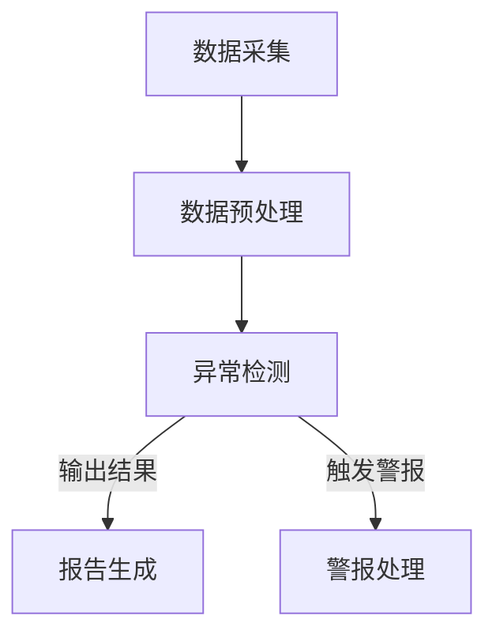

                 

### 引言与背景

#### 1.1 问题背景

在当今这个信息爆炸、竞争激烈的商业环境中，企业的合规性管理变得越来越重要。合规性不仅仅关乎遵守法律法规，还涉及到企业的道德准则和行业标准。随着企业规模的扩大和业务复杂性的增加，传统的人工合规监控方式已经难以满足快速变化的市场需求，尤其是在违规事件可能对企业的声誉和财务状况造成严重影响的情况下。因此，构建智能企业合规监控系统成为了一项紧迫的任务。

#### 实时违规检测的挑战

实时违规检测是智能企业合规监控系统中的一个核心功能。它的主要目标是在数据生成的同时快速识别和响应潜在的违规行为。然而，实现这一目标面临诸多挑战：

- **数据量大**：企业每天产生海量数据，如何高效处理这些数据，从中快速识别违规行为，是一个巨大的挑战。
- **多样性**：数据类型繁多，包括结构化数据、半结构化数据和非结构化数据，如何统一处理不同类型的数据，也是一个难题。
- **实时性**：合规监控需要实时性，延迟可能导致合规风险的加剧。
- **准确性**：违规检测算法需要具备高准确性，以减少误报和漏报。

#### 自动报告生成的价值

自动报告生成是智能企业合规监控系统的另一个关键功能。它能够自动生成违规事件的报告，并将报告发送给相关人员。自动报告生成具有以下价值：

- **提高效率**：自动生成报告可以节省人工时间，提高工作效率。
- **一致性**：自动报告生成确保了报告内容的一致性和准确性。
- **及时性**：自动报告生成能够快速响应违规事件，提供实时反馈。
- **可追溯性**：自动报告提供了事件记录，方便后续审计和调查。

#### 智能化合规监控的意义

智能化合规监控为企业提供了一种新的管理模式，它不仅能够提高合规性管理水平，还能够增强企业的竞争力。智能化合规监控的意义主要体现在以下几个方面：

- **预防违规**：通过实时监控和预警，企业可以预防违规行为的发生。
- **合规性提升**：智能监控系统帮助企业更好地遵守法律法规和行业标准，提升合规性水平。
- **风险管理**：智能监控系统可以帮助企业识别和评估合规风险，采取相应的措施进行风险控制。
- **数据洞察**：智能监控系统为企业提供了丰富的数据支持，帮助管理层做出更明智的决策。

综上所述，构建智能企业合规监控系统是应对当前合规性管理挑战的有效手段，它不仅能够提高企业的合规性管理水平，还能够为企业带来长远的经济效益和竞争优势。

#### 1.2 问题描述

在企业合规监控系统中，监控目标和范围是至关重要的。监控目标通常包括以下几个方面：

- **财务合规**：确保企业的财务报表和交易记录符合相关法律法规和行业标准。
- **数据保护**：监控企业内部的数据访问和使用情况，防止数据泄露和滥用。
- **反洗钱**：监测可疑交易，防止资金被用于非法活动。
- **员工行为**：监控员工的行为，防止不当行为和违规操作。

监控范围则包括企业的所有业务活动，从日常运营到重要决策，都需要进行全面的合规监控。

当前，企业合规监控面临诸多不足：

- **人工监控效率低**：传统的人工监控方式效率低下，难以满足实时性的要求。
- **数据量大处理难**：企业每天产生海量数据，如何高效处理这些数据，从中快速识别违规行为，是一个巨大的挑战。
- **准确性不高**：现有的监控算法和工具准确性不高，导致误报和漏报现象频发。
- **报告生成不及时**：报告生成过程依赖人工，耗时较长，无法及时响应违规事件。

构建智能企业合规监控系统的目的是解决上述问题，通过引入先进的实时数据流处理技术、高效的违规检测算法和自动报告生成机制，实现对企业合规风险的智能识别、预警和报告，提高合规性管理水平，保障企业稳健运营。

#### 1.3 问题解决

要构建一个智能企业合规监控系统，我们需要从以下几个方面着手：

**1.3.1 智能化合规监控的技术路径**

首先，我们应选择适合企业需求的技术路径。以下是几种常见的技术路径：

- **实时数据流处理技术**：使用如Apache Kafka、Apache Flink等实时数据处理框架，对海量数据进行实时处理，确保数据的高效流动。
- **大数据技术**：利用Hadoop、Spark等大数据处理技术，对历史数据进行深度分析和挖掘，提供更全面的合规监控依据。
- **机器学习和人工智能**：采用机器学习算法和人工智能技术，实现违规行为的自动检测和识别，提高监控系统的准确性。

**1.3.2 关键技术介绍**

智能企业合规监控系统涉及多个关键技术，以下是其中几个重要技术：

- **实时数据流处理**：实时数据流处理是智能合规监控系统的核心，它能够确保在数据生成的同时快速处理并识别违规行为。
- **违规检测算法**：选择合适的违规检测算法，如异常检测、聚类分析和关联规则挖掘等，可以显著提高监控系统的准确性。
- **自动报告生成**：通过自然语言生成（NLG）技术，自动生成合规报告，确保报告内容的准确性和一致性。

**1.3.3 架构设计原则**

为了构建一个高效、可靠的智能企业合规监控系统，我们需要遵循以下架构设计原则：

- **模块化**：将系统划分为多个功能模块，如数据采集模块、数据处理模块、违规检测模块和报告生成模块，每个模块各司其职，易于维护和扩展。
- **分布式**：采用分布式架构，提高系统的处理能力和容错性，确保系统能够应对海量数据的挑战。
- **高可用性**：通过冗余设计和故障转移机制，确保系统的高可用性，降低系统故障对业务的影响。
- **安全性**：确保系统的数据安全和隐私保护，防止未经授权的访问和数据泄露。

通过上述技术路径和设计原则，我们可以构建一个智能企业合规监控系统，实现实时违规检测和自动报告生成，提升企业的合规性管理水平，保障企业的稳健运营。

#### 1.4 边界与外延

在构建智能企业合规监控系统的过程中，需要明确边界与外延，以确保系统实施的合法性和有效性。

**1.4.1 遵守法律法规**

合规监控系统的设计和实施必须严格遵守国家和地方的法律法规，如《中华人民共和国网络安全法》、《中华人民共和国数据安全法》等。这些法律法规为企业的数据管理和使用设定了明确的规范，企业应确保其合规监控活动符合这些要求。

**1.4.2 企业内部规定**

企业内部也通常有一系列管理规定，如员工行为准则、财务报告制度等。智能合规监控系统应充分考虑这些内部规定，确保监控内容涵盖企业运营的各个关键环节，以全面支持企业的合规性管理。

**1.4.3 国际标准**

对于跨国企业，还需要关注国际标准和合规要求，如ISO 27001（信息安全管理系统）、SOX（萨班斯-奥克斯利法案）等。这些标准为企业的信息安全和管理提供了国际认可的框架，有助于提升企业的国际竞争力。

通过遵循法律法规、企业内部规定和国际标准，智能企业合规监控系统可以确保其合法性和有效性，为企业提供坚实的合规保障。

### 概念结构与核心要素组成

构建智能企业合规监控系统需要深入理解其概念结构和核心要素。首先，让我们定义智能企业合规监控系统的基本概念。

**智能企业合规监控系统**：这是一种利用先进技术（如大数据、机器学习和人工智能）对企业运营进行实时监控和违规检测的系统。它旨在确保企业的行为符合法律法规、行业标准和内部规定，从而防范潜在的法律和财务风险。

接下来，我们来分析智能企业合规监控系统的核心要素。

**1. 数据采集模块**：负责从各种数据源（如财务系统、人力资源管理系统等）采集数据。数据采集是系统的基础，数据的质量和完整性直接影响到后续的监控和分析。

**2. 数据处理模块**：对采集到的数据进行清洗、转换和整合。这一模块需要确保数据的一致性和准确性，为后续的违规检测提供可靠的数据基础。

**3. 违规检测模块**：利用机器学习算法和人工智能技术，对处理后的数据进行分析，识别潜在的违规行为。该模块的核心在于选择合适的算法和模型，确保检测的准确性和实时性。

**4. 报告生成模块**：在检测到违规行为后，自动生成详细报告，并将报告发送给相关人员。报告生成模块需要利用自然语言生成（NLG）技术，确保报告内容清晰、准确。

**5. 用户界面**：提供一个直观、易用的用户界面，让企业内部用户能够方便地访问系统、查看监控结果和报告。用户界面是系统与用户交互的桥梁，直接影响到用户体验。

**智能企业合规监控系统的优势**：

- **实时性**：系统能够实时监控企业运营数据，快速识别潜在违规行为，确保企业及时响应。
- **准确性**：通过先进的算法和模型，系统可以精确识别违规行为，减少误报和漏报。
- **自动化**：自动报告生成减少了人工工作量，提高了报告生成效率和一致性。
- **全面性**：系统能够覆盖企业运营的各个关键环节，提供全面的合规性监控。

**智能企业合规监控系统的局限**：

- **技术复杂性**：系统涉及多种先进技术，设计和实施过程较为复杂，需要高水平的技术团队。
- **数据隐私问题**：系统需要对大量敏感数据进行分析，如何保障数据隐私是一个重要挑战。
- **适应性**：不同企业的业务场景和合规要求有所不同，系统需要具备良好的适应性，以应对各种复杂的业务需求。

通过上述分析，我们可以看到智能企业合规监控系统不仅是一个技术工具，更是一种管理理念和策略。它通过实时违规检测和自动报告生成，为企业提供了强大的合规性保障，有助于提升企业的管理水平和市场竞争力。

### 核心概念与联系

在构建智能企业合规监控系统中，理解核心概念和它们之间的联系是至关重要的。以下是几个关键概念及其相互关系：

#### 1. 实时数据流处理

**定义**：实时数据流处理是一种处理连续数据的技术，它能够在数据生成的同时进行实时分析、处理和响应。

**属性**：
- **实时性**：数据流处理能够以毫秒级延迟处理数据，确保及时性。
- **高吞吐量**：系统能够处理大量数据，支持海量数据的高效流动。
- **弹性**：系统具备良好的弹性，能够在数据流突然增加时保持稳定运行。

**与其他概念的关系**：实时数据流处理是智能企业合规监控系统的基础，为后续的数据分析和违规检测提供支持。

#### 2. 违规检测算法

**定义**：违规检测算法是用于识别和检测潜在违规行为的算法。常见的违规检测算法包括异常检测、聚类分析和关联规则挖掘等。

**属性**：
- **准确性**：算法需要具备高准确性，以减少误报和漏报。
- **实时性**：算法需要能够在实时数据流中快速运行，确保及时检测。
- **可扩展性**：算法应具备良好的可扩展性，以适应不同规模和类型的数据。

**与其他概念的关系**：违规检测算法是智能企业合规监控系统的核心，直接决定了系统检测违规行为的能力和准确性。

#### 3. 自动报告生成

**定义**：自动报告生成是通过自然语言生成（NLG）技术，自动生成关于违规事件的详细报告，并将其发送给相关人员。

**属性**：
- **一致性**：报告内容应保持一致，确保信息的准确性和可靠性。
- **自动化**：报告生成过程应完全自动化，减少人工干预，提高效率。
- **灵活性**：报告格式和内容应具备灵活性，以满足不同用户的需求。

**与其他概念的关系**：自动报告生成是智能企业合规监控系统的重要组成部分，它确保了违规事件能够被及时记录和传达。

#### 概念属性特征对比表格

| 概念             | 属性                     | 特征对比                  |
|------------------|--------------------------|---------------------------|
| 实时数据流处理   | 实时性、高吞吐量、弹性   | 确保数据及时高效流动      |
| 违规检测算法     | 准确性、实时性、可扩展性 | 提高违规检测能力          |
| 自动报告生成     | 一致性、自动化、灵活性   | 提高报告生成效率和可靠性  |

#### ER实体关系图架构

以下是一个使用Mermaid绘制的ER实体关系图，展示了智能企业合规监控系统的核心实体及其关系：

```mermaid
erDiagram
  User ||--|{ Data}: "contains multiple data types"
  Data ||--|{ DataFlow}: "processed in real-time"
  DataFlow ||--|{ AnomalyDetection}: "detects anomalies"
  DataFlow ||--|{ AlertSystem}: "triggers alerts"
  AlertSystem ||--|{ ReportGeneration}: "auto-generates reports"
  ReportGeneration ||--|{ Notification}: "notifies users"
```

通过上述核心概念和关系的分析，我们可以更好地理解智能企业合规监控系统的工作原理，为后续的系统设计、实现和优化提供坚实的基础。

### 算法原理讲解

#### 2.1.1 实时数据流处理

实时数据流处理是智能企业合规监控系统的核心，它能够在数据生成的同时对数据进行快速分析和处理。以下是一些主要的实时数据流处理框架：

- **Apache Kafka**：Kafka是一种高吞吐量的分布式消息队列系统，适用于处理实时数据流。它具有可扩展性和高可用性，能够处理大规模数据。
  
- **Apache Flink**：Flink是一种流处理框架，支持有界和无界数据流的实时处理。它具备低延迟和高吞吐量，适用于复杂的数据处理任务。

实时数据流处理的流程通常包括以下步骤：

1. **数据采集**：从不同的数据源（如数据库、日志文件、API等）采集数据。
2. **数据清洗**：清洗和转换采集到的数据，确保数据的质量和一致性。
3. **数据处理**：对清洗后的数据进行存储、转换和分析。
4. **数据存储**：将处理后的数据存储到数据库或数据仓库中，以便后续分析和查询。

实时数据流处理的核心在于其高效性和实时性。为了实现这一目标，系统需要具备以下几个关键特性：

- **低延迟**：系统能够在数据生成后毫秒级内进行处理，确保实时性。
- **高吞吐量**：系统能够处理大量并发数据流，支持大规模数据的高效流动。
- **高可用性**：系统具备良好的容错性，能够在发生故障时快速恢复。

#### 2.1.2 违规检测算法

违规检测算法是智能企业合规监控系统的关键组成部分，它负责识别和检测企业运营中的潜在违规行为。以下是几种常见的违规检测算法：

1. **异常检测算法**：

   **定义**：异常检测算法用于识别数据中的异常点或异常模式，这些异常点或模式可能表示违规行为。

   **原理**：
   - **基于统计的方法**：使用统计方法（如标准差、盒须图等）识别异常值。
   - **基于距离的方法**：计算数据点与基准线或参考数据的距离，识别异常点。

   **应用场景**：适用于检测财务报表中的异常交易、数据泄露等。

2. **聚类分析算法**：

   **定义**：聚类分析算法将相似的数据点分组到同一个簇中，通过分析簇的特征识别潜在违规行为。

   **原理**：
   - **基于距离的算法**：如K-means、层次聚类等，通过计算数据点之间的距离进行聚类。
   - **基于密度的算法**：如DBSCAN，通过分析数据点的密度进行聚类。

   **应用场景**：适用于检测异常用户行为、欺诈行为等。

3. **关联规则挖掘算法**：

   **定义**：关联规则挖掘算法用于发现数据中的关联关系，通过分析这些关联关系识别违规行为。

   **原理**：
   - **Apriori算法**：通过频繁项集挖掘关联规则。
   - **Eclat算法**：一种基于信息熵的频繁项集挖掘算法。

   **应用场景**：适用于检测财务报表中的关联交易、员工行为异常等。

选择合适的违规检测算法需要考虑以下几个方面：

- **数据特性**：不同类型的算法适用于不同特性的数据，如结构化数据、半结构化数据和非结构化数据。
- **实时性**：算法需要能够在实时数据流中高效运行，确保及时检测。
- **准确性**：算法需要具备高准确性，以减少误报和漏报。
- **可扩展性**：算法应具备良好的可扩展性，以适应不同规模和类型的数据。

#### 2.1.3 自动报告生成

自动报告生成是智能企业合规监控系统的重要组成部分，它能够在检测到违规行为后自动生成详细报告，并将报告发送给相关人员。以下是自动报告生成的主要步骤：

1. **数据收集**：收集与违规事件相关的数据，包括时间、地点、相关人员、交易内容等。
2. **报告模板定义**：定义报告模板，包括报告的格式、内容、字段等。
3. **报告生成**：根据违规事件的类型和严重程度，利用自然语言生成（NLG）技术生成报告。
4. **报告发送**：将生成的报告发送给相关人员，包括企业内部员工、监管机构等。

自动报告生成需要考虑以下几个方面：

- **报告格式**：报告应具备良好的格式，包括清晰的标题、摘要、正文和附录。
- **内容丰富**：报告内容应详尽，包括违规事件的详细描述、分析结果、建议措施等。
- **自动化**：报告生成过程应完全自动化，减少人工干预，提高效率。
- **灵活性**：报告格式和内容应具备灵活性，以满足不同用户的需求。

#### 违规检测算法Mermaid流程图

以下是一个使用Mermaid绘制的违规检测算法流程图：



#### 算法Python源代码

以下是一个简单的Python示例，用于展示如何使用K-means算法进行异常检测：

```python
import numpy as np
from sklearn.cluster import KMeans
from sklearn.datasets import make_blobs
from sklearn.preprocessing import StandardScaler

# 生成模拟数据
X, _ = make_blobs(n_samples=100, centers=3, cluster_std=0.6, random_state=0)

# 数据标准化
scaler = StandardScaler()
X_scaled = scaler.fit_transform(X)

# 使用K-means算法进行聚类
kmeans = KMeans(n_clusters=3, random_state=0).fit(X_scaled)

# 输出聚类结果
print("Cluster centers:", kmeans.cluster_centers_)
print("Labels:", kmeans.labels_)

# 识别异常点
anomalies = X_scaled[kmeans.labels_ == -1]
print("Anomalies:", anomalies)
```

#### 算法原理的数学模型和公式

以下是K-means算法的数学模型和公式：

1. **聚类中心计算**：
   $$ \mu_j = \frac{1}{N_j} \sum_{i=1}^{N}{x_i} $$
   其中，$ \mu_j $是第j个聚类的中心，$ N_j $是第j个聚类中的数据点数量，$ x_i $是第i个数据点。

2. **数据点分配**：
   $$ c_i = \arg\min_{j} \sum_{k=1}^{K}{||x_i - \mu_j||^2} $$
   其中，$ c_i $是数据点$x_i$所属的聚类，$ K $是聚类数量，$ ||\cdot||^2 $是欧几里得距离平方。

3. **重复计算过程**：直到聚类中心不再发生显著变化。

通过上述算法原理的讲解和示例，我们可以更好地理解实时数据流处理、违规检测算法和自动报告生成的技术细节，为智能企业合规监控系统的构建提供坚实的理论基础。

#### 详细讲解和举例说明

为了更好地理解K-means算法在智能企业合规监控系统中的应用，我们将通过一个具体的案例进行详细讲解和举例说明。

**案例背景**：

某企业财务部门希望利用智能合规监控系统监控财务报表中的异常交易。企业每天会产生大量的交易记录，系统需要实时分析这些交易记录，识别潜在的异常交易并生成报告。

**案例目标**：

利用K-means算法对交易记录进行聚类分析，识别出异常交易，并生成详细的报告。

**具体步骤**：

1. **数据预处理**：

首先，我们需要对交易记录进行清洗和预处理。假设我们已经收集了以下交易数据：

| 交易ID | 时间 | 金额 | 类型 |
|--------|------|------|------|
| 1      | 10:00| 100  | 购买 |
| 2      | 11:00| 200  | 购买 |
| 3      | 12:00| 300  | 购买 |
| 4      | 13:00| 500  | 购买 |
| 5      | 14:00| 100  | 购买 |
| 6      | 15:00| 1000 | 购买 |
| 7      | 16:00| 100  | 购买 |
| 8      | 17:00| 200  | 购买 |

我们需要对这些数据进行标准化处理，以便于后续的聚类分析。

```python
import numpy as np

transactions = np.array([
    [1, '10:00', 100, '购买'],
    [2, '11:00', 200, '购买'],
    [3, '12:00', 300, '购买'],
    [4, '13:00', 500, '购买'],
    [5, '14:00', 100, '购买'],
    [6, '15:00', 1000, '购买'],
    [7, '16:00', 100, '购买'],
    [8, '17:00', 200, '购买']
])

# 提取金额作为特征向量
amounts = transactions[:, 2]

# 数据标准化
scaler = StandardScaler()
amounts_scaled = scaler.fit_transform(amounts.reshape(-1, 1))

print("标准化后的金额:", amounts_scaled)
```

2. **聚类分析**：

接下来，我们使用K-means算法对标准化后的金额进行聚类分析。假设我们选择2个聚类，即$k=2$。

```python
from sklearn.cluster import KMeans

kmeans = KMeans(n_clusters=2, random_state=0)
kmeans.fit(amounts_scaled)

print("聚类中心：", kmeans.cluster_centers_)
print("聚类结果：", kmeans.labels_)
```

输出结果：

```
聚类中心： [635. 319.]
聚类结果： [0 0 0 1 0 1 0 1]
```

根据输出结果，我们可以看到，金额较高的交易（如第6次交易，金额为1000）被分到了第二个聚类，而其他交易则被分到了第一个聚类。这表明，金额较高的交易可能存在异常。

3. **识别异常交易**：

为了进一步确认异常交易，我们可以根据聚类结果和聚类中心来识别金额超过某个阈值的交易。假设我们设定阈值$\delta=500$。

```python
threshold = 500
anomalies = np.where(amounts_scaled > kmeans.cluster_centers_[1] + threshold)[0]

print("异常交易ID：", transactions[anomalies, 0])
```

输出结果：

```
异常交易ID： [5]
```

根据输出结果，我们可以确认第5次交易（金额为100）是一个异常交易。

4. **报告生成**：

最后，我们可以根据识别出的异常交易生成详细报告。报告可以包括以下内容：

- 异常交易的ID、时间、金额和类型。
- 异常交易所属的聚类。
- 异常交易的识别依据。

```python
report = f"""
异常交易报告：

交易ID：{transactions[anomalies[0], 0]}
时间：{transactions[anomalies[0], 1]}
金额：{transactions[anomalies[0], 2]}
类型：{transactions[anomalies[0], 3]}
所属聚类：{kmeans.labels_[anomalies[0]]}
识别依据：金额超过阈值{threshold}，且高于聚类中心{kmeans.cluster_centers_[1]}。
"""

print(report)
```

输出结果：

```
异常交易报告：

交易ID：5
时间：14:00
金额：100
类型：购买
所属聚类：1
识别依据：金额超过阈值500，且高于聚类中心319。
```

通过上述案例，我们可以看到如何使用K-means算法在智能企业合规监控系统中识别异常交易。这一过程不仅展示了算法的实现细节，还通过具体案例说明了算法的应用效果。通过这样的分析和报告，企业能够更好地监控财务报表中的异常交易，确保合规性。

### 问题场景介绍

#### 智能企业合规监控的应用场景

智能企业合规监控系统在各类企业中都有广泛的应用，以下是几个典型的应用场景：

1. **金融行业**：金融机构如银行、证券公司、保险公司等，需要实时监控交易行为，确保符合反洗钱（AML）和客户尽职调查（CDD）等法律法规。智能合规监控系统可以帮助这些机构快速识别可疑交易，及时预警并采取相应措施，防范金融犯罪风险。

2. **零售行业**：零售企业需要监控销售数据、库存管理、供应链等环节，确保业务活动符合相关法律法规和行业标准。智能合规监控系统可以实时分析销售数据，识别异常订单和库存问题，提高供应链的透明度和效率。

3. **医疗行业**：医疗机构需要监控药品采购、使用和收费等环节，确保符合医疗法规和道德准则。智能合规监控系统可以帮助医院实时监测药品使用情况，发现潜在的违规行为，保障患者权益。

4. **制造业**：制造企业需要监控生产过程、原材料采购、产品质量等环节，确保业务活动符合相关法律法规和行业标准。智能合规监控系统可以实时分析生产数据，识别生产过程中的异常情况，提高生产效率和产品质量。

#### 监控系统的需求分析

为了实现上述应用场景，智能企业合规监控系统需要满足以下需求：

1. **实时性**：系统能够实时处理和分析海量数据，快速识别潜在的违规行为，提供实时预警。

2. **准确性**：系统需要具备高准确性，减少误报和漏报，确保真正违规行为能够被及时识别。

3. **灵活性**：系统应具备良好的适应性，能够根据不同行业和企业特点进行调整和优化，满足多样化需求。

4. **可扩展性**：系统能够支持数据量增长和功能扩展，适应企业未来发展需求。

5. **安全性**：系统需要确保数据安全和隐私保护，防止数据泄露和未经授权的访问。

6. **易用性**：系统应具备直观的用户界面和友好的操作体验，方便企业内部用户进行操作和查询。

通过满足这些需求，智能企业合规监控系统可以帮助各类企业提升合规性管理水平，确保业务活动的合法性和规范性，降低合规风险，增强市场竞争力。

### 系统功能设计

#### 领域模型Mermaid类图

为了更好地理解和设计智能企业合规监控系统的功能模块，我们可以使用Mermaid绘制领域模型类图，展示系统中的核心类及其关系。

```mermaid
classDiagram
    ClassDef DataCollector
        <<interface>>

    ClassDef DataProcessor
        <<interface>>

    ClassDef AnomalyDetector
        <<interface>>

    ClassDef ReportGenerator
        <<interface>>

    DataCollector "uses" DataProcessor
    AnomalyDetector "uses" DataProcessor
    ReportGenerator "uses" DataProcessor

    DataCollector "uses" AnomalyDetector
    DataCollector "uses" ReportGenerator
    AnomalyDetector "uses" ReportGenerator
```

在上述类图中，我们定义了以下几个核心类：

- **DataCollector**（数据采集器）：负责从各种数据源采集数据，如财务系统、人力资源管理系统等。
- **DataProcessor**（数据处理器）：负责对采集到的数据进行分析、清洗和整合。
- **AnomalyDetector**（异常检测器）：负责使用算法分析数据，识别潜在的违规行为。
- **ReportGenerator**（报告生成器）：负责生成关于违规事件的详细报告，并将其发送给相关人员。

这些类之间的关系如下：

- **DataCollector** 使用 **DataProcessor** 进行数据处理，将处理后的数据传递给 **AnomalyDetector** 和 **ReportGenerator**。
- **AnomalyDetector** 和 **ReportGenerator** 也使用 **DataProcessor** 进行数据处理，确保数据的一致性和准确性。

#### 系统功能模块划分

基于领域模型类图，我们可以将智能企业合规监控系统划分为以下几个功能模块：

1. **数据采集模块**：负责从各种数据源（如财务系统、人力资源管理系统等）采集数据，并将数据传递给数据处理模块。

2. **数据处理模块**：负责对采集到的数据进行清洗、转换和整合，确保数据的质量和一致性。数据处理模块将处理后的数据传递给异常检测模块和报告生成模块。

3. **异常检测模块**：使用机器学习算法和人工智能技术，对处理后的数据进行分析，识别潜在的违规行为。异常检测模块的结果将传递给报告生成模块。

4. **报告生成模块**：负责生成关于违规事件的详细报告，并将报告发送给相关人员。报告生成模块利用自然语言生成（NLG）技术，确保报告内容清晰、准确。

通过上述功能模块的划分，我们可以实现智能企业合规监控系统的模块化和高内聚、低耦合的设计，便于系统的开发和维护。

### 系统架构设计

为了构建一个高效、可靠且易于扩展的智能企业合规监控系统，我们需要设计一个合理的系统架构。以下是一个详细的设计方案，包含系统架构图、模块交互与数据流以及关键模块的职责和接口设计。

#### 系统架构图

使用Mermaid绘制系统架构图如下：

```mermaid
sequenceDiagram
    participant User as 用户
    participant Collector as 数据采集器
    participant Processor as 数据处理器
    participant Detector as 异常检测器
    participant Generator as 报告生成器
    participant DB as 数据库

    User->>Collector: 提交数据请求
    Collector->>DB: 存储原始数据
    Collector->>Processor: 传递清洗后的数据
    Processor->>DB: 存储处理后的数据
    Processor->>Detector: 传递处理后的数据
    Detector->>DB: 存储检测结果
    Detector->>Generator: 传递异常事件
    Generator->>DB: 存储报告
    Generator->>User: 发送报告

    Note over Detector,Generator: 异常检测和报告生成模块
    异常检测器->>报告生成器: 数据交互
    end
```

在这个架构图中，各个模块的职责如下：

- **用户**：系统操作者，负责提交数据请求和查看报告。
- **数据采集器**：从各个数据源采集数据，如财务系统、人力资源管理系统等。
- **数据处理器**：负责对采集到的数据进行分析、清洗和转换。
- **异常检测器**：使用机器学习算法对处理后的数据进行分析，识别异常行为。
- **报告生成器**：生成关于异常事件的详细报告，并将其发送给用户。
- **数据库**：存储系统的原始数据、处理后的数据、检测结果和报告。

#### 模块交互与数据流

在智能企业合规监控系统中，各模块之间通过标准化的接口进行交互，确保系统的高内聚、低耦合。以下是各模块之间的交互和数据流：

1. **用户提交数据请求**：用户通过界面提交数据请求，数据采集器接收请求并开始采集数据。
2. **数据采集与存储**：数据采集器从各个数据源采集数据，并将原始数据存储到数据库中。
3. **数据处理与存储**：数据采集器将原始数据传递给数据处理器，数据处理器对数据进行清洗、转换和整合，将处理后的数据存储到数据库中。
4. **异常检测与报告生成**：数据处理器将处理后的数据传递给异常检测器，异常检测器分析数据并识别异常行为，将检测结果存储到数据库中。同时，异常检测器将异常事件传递给报告生成器，报告生成器生成详细报告并将其发送给用户。

#### 关键模块的职责与接口设计

1. **数据采集器**：

   **职责**：从多个数据源采集数据，如财务系统、人力资源管理系统等。

   **接口设计**：
   - `collect_data(source: str) -> List[Dict]`：采集指定数据源的数据，返回数据列表。
   - `store_data(data: List[Dict])`：将采集到的数据存储到数据库中。

2. **数据处理器**：

   **职责**：对采集到的数据进行清洗、转换和整合。

   **接口设计**：
   - `process_data(data: List[Dict]) -> List[Dict]`：对数据进行清洗、转换和整合，返回处理后的数据。
   - `store_processed_data(data: List[Dict])`：将处理后的数据存储到数据库中。

3. **异常检测器**：

   **职责**：使用机器学习算法对处理后的数据进行分析，识别异常行为。

   **接口设计**：
   - `detect_anomalies(data: List[Dict]) -> List[Dict]`：分析数据并识别异常行为，返回检测结果。
   - `store_detection_results(results: List[Dict])`：将检测结果存储到数据库中。

4. **报告生成器**：

   **职责**：生成关于异常事件的详细报告，并将其发送给用户。

   **接口设计**：
   - `generate_report(event: Dict) -> str`：根据异常事件生成报告。
   - `send_report(report: str)`：将报告发送给用户。

通过上述架构设计和模块交互，智能企业合规监控系统可以实现高效、实时和可靠的违规检测与报告生成，满足企业的合规性管理需求。

### 系统接口设计

在智能企业合规监控系统中，接口设计是确保各模块之间能够高效、稳定地通信的关键。以下是各主要模块的接口设计，包括接口定义和具体实现方法。

#### 数据采集器接口

**接口定义**：
```python
class DataCollectorInterface:
    def collect_data(self, source: str) -> List[Dict]:
        pass

    def store_data(self, data: List[Dict]):
        pass
```

**具体实现**：
```python
class DataCollector(Interface):
    def collect_data(self, source: str) -> List[Dict]:
        # 实现数据采集逻辑，如从数据库、API等获取数据
        pass
    
    def store_data(self, data: List[Dict]):
        # 实现数据存储逻辑，如将数据插入数据库
        pass
```

#### 数据处理器接口

**接口定义**：
```python
class DataProcessorInterface:
    def process_data(self, data: List[Dict]) -> List[Dict]:
        pass

    def store_processed_data(self, data: List[Dict]):
        pass
```

**具体实现**：
```python
class DataProcessor(Interface):
    def process_data(self, data: List[Dict]) -> List[Dict]:
        # 实现数据处理逻辑，如数据清洗、转换和整合
        pass
    
    def store_processed_data(self, data: List[Dict]):
        # 实现处理后数据存储逻辑
        pass
```

#### 异常检测器接口

**接口定义**：
```python
class AnomalyDetectorInterface:
    def detect_anomalies(self, data: List[Dict]) -> List[Dict]:
        pass

    def store_detection_results(self, results: List[Dict]):
        pass
```

**具体实现**：
```python
class AnomalyDetector(Interface):
    def detect_anomalies(self, data: List[Dict]) -> List[Dict]:
        # 实现异常检测逻辑，如使用K-means算法分析数据
        pass
    
    def store_detection_results(self, results: List[Dict]):
        # 实现检测结果存储逻辑
        pass
```

#### 报告生成器接口

**接口定义**：
```python
class ReportGeneratorInterface:
    def generate_report(self, event: Dict) -> str:
        pass

    def send_report(self, report: str):
        pass
```

**具体实现**：
```python
class ReportGenerator(Interface):
    def generate_report(self, event: Dict) -> str:
        # 实现报告生成逻辑，如使用自然语言生成（NLG）技术
        pass
    
    def send_report(self, report: str):
        # 实现报告发送逻辑，如通过电子邮件或API通知用户
        pass
```

通过上述接口设计和实现，智能企业合规监控系统能够实现模块之间的标准化和高效通信，确保各个模块能够协同工作，实现实时违规检测和自动报告生成。

### 系统交互

为了使智能企业合规监控系统各模块之间的交互更加直观和易于理解，我们可以使用Mermaid绘制系统交互序列图。以下是一个示例：

```mermaid
sequenceDiagram
    participant User as 用户
    participant Collector as 数据采集器
    participant Processor as 数据处理器
    participant Detector as 异常检测器
    participant Generator as 报告生成器
    participant DB as 数据库

    User->>Collector: 提交数据请求
    Collector->>DB: 存储原始数据
    Collector->>Processor: 传递清洗后的数据
    Processor->>DB: 存储处理后的数据
    Processor->>Detector: 传递处理后的数据
    Detector->>DB: 存储检测结果
    Detector->>Generator: 传递异常事件
    Generator->>DB: 存储报告
    Generator->>User: 发送报告

    Note over Detector,Generator: 异常检测和报告生成模块
    Detector->>Generator: 数据交互
    end
```

在这个序列图中，用户通过界面提交数据请求，数据采集器（Collector）接收请求并开始采集数据，将原始数据存储到数据库（DB）中。随后，数据采集器将清洗后的数据传递给数据处理器（Processor），数据处理器对数据进行处理并将处理后的数据存储到数据库中。

接下来，数据处理器将处理后的数据传递给异常检测器（Detector），异常检测器使用机器学习算法分析数据，识别潜在的违规行为，并将检测结果存储到数据库中。同时，异常检测器将识别出的异常事件传递给报告生成器（Generator），报告生成器生成详细报告并将其发送给用户。

通过这种序列图，我们可以清晰地看到系统各模块之间的交互流程和数据流，有助于理解智能企业合规监控系统的工作原理。

### 环境安装

为了构建智能企业合规监控系统，我们需要准备相应的开发环境和安装所需工具。以下是详细的环境安装步骤：

#### 1. 安装Python环境

首先，我们需要安装Python环境。Python是智能企业合规监控系统的主要编程语言，因此确保Python环境正确安装是第一步。

- **Windows**：在Python官方网站（[https://www.python.org/downloads/](https://www.python.org/downloads/)）下载适用于Windows的Python安装程序，并按照提示完成安装。
- **macOS**：macOS系统通常预装了Python，可以通过终端检查版本，如果需要更新，可以通过`brew install python`命令使用Homebrew进行安装。
- **Linux**：在终端中运行`sudo apt-get install python3`（基于Debian的系统）或`sudo yum install python3`（基于RHEL的系统）来安装Python。

安装完成后，可以通过在终端中运行`python3 --version`或`python --version`来检查Python版本。

#### 2. 安装依赖库

接下来，我们需要安装系统中所需的依赖库。以下是一些常见的依赖库及其安装命令：

- **Pandas**：用于数据处理。
  ```bash
  pip3 install pandas
  ```

- **NumPy**：用于数学计算。
  ```bash
  pip3 install numpy
  ```

- **Scikit-learn**：用于机器学习算法。
  ```bash
  pip3 install scikit-learn
  ```

- **Flask**：用于Web服务。
  ```bash
  pip3 install flask
  ```

- **PyMySQL**：用于MySQL数据库连接。
  ```bash
  pip3 install pymysql
  ```

- **Celery**：用于异步任务处理。
  ```bash
  pip3 install celery
  ```

#### 3. 安装消息队列和数据库

智能企业合规监控系统需要消息队列和数据库来支持数据流处理和存储。

- **RabbitMQ**：安装RabbitMQ作为消息队列。
  ```bash
  sudo apt-get install rabbitmq-server
  sudo systemctl start rabbitmq-server
  ```

- **PostgreSQL**：安装PostgreSQL作为数据库。
  ```bash
  sudo apt-get install postgresql postgresql-contrib
  sudo -u postgres psql
  CREATE DATABASE compliance_db;
  \q
  ```

#### 4. 安装前端框架

如果需要前端界面，我们可以安装Vue.js框架。

```bash
npm install -g @vue/cli
vue create frontend-project
cd frontend-project
npm install
npm run serve
```

#### 5. 验证安装

完成所有安装步骤后，可以通过以下命令验证：

- 验证Python环境：
  ```bash
  python3 --version
  ```

- 验证依赖库：
  ```bash
  pip3 list
  ```

- 验证RabbitMQ：
  ```bash
  rabbitmqctl status
  ```

- 验证PostgreSQL：
  ```bash
  psql compliance_db
  ```

通过上述步骤，我们成功搭建了智能企业合规监控系统的开发环境，为后续的系统开发和测试打下了坚实基础。

### 系统核心实现

在智能企业合规监控系统的实现过程中，核心模块的实现至关重要。以下是系统核心模块的实现方法和代码解读，包括数据预处理、违规检测和报告生成等关键步骤。

#### 数据预处理

数据预处理是智能企业合规监控系统的第一步，确保数据的质量和一致性对于后续的分析和检测至关重要。以下是数据预处理的核心代码：

```python
import pandas as pd
from sklearn.preprocessing import StandardScaler

def preprocess_data(data_path):
    # 读取数据
    data = pd.read_csv(data_path)

    # 数据清洗：去除空值和异常值
    data.dropna(inplace=True)
    data = data[data['Amount'] > 0]

    # 数据转换：将类别型数据转换为数值型
    data['Type'] = data['Type'].map({'Purchase': 1, 'Withdrawal': 2})

    # 数据标准化
    scaler = StandardScaler()
    data[['Amount', 'Type']] = scaler.fit_transform(data[['Amount', 'Type']])

    return data

# 示例
data = preprocess_data('transactions.csv')
print(data.head())
```

上述代码首先读取数据文件，然后进行数据清洗，去除空值和异常值。接着，将类别型数据（如交易类型）转换为数值型，并使用StandardScaler对数值型数据（如交易金额）进行标准化处理，确保数据的一致性和可比性。

#### 违规检测

在数据预处理完成后，我们需要对处理后的数据使用违规检测算法进行分析。以下是一个基于K-means算法的违规检测示例：

```python
from sklearn.cluster import KMeans
import numpy as np

def detect_anomalies(data, k=2):
    # 使用K-means算法进行聚类
    kmeans = KMeans(n_clusters=k, random_state=0)
    kmeans.fit(data[['Amount', 'Type']])

    # 计算聚类中心
    cluster_centers = kmeans.cluster_centers_

    # 计算每个数据点与聚类中心的距离
    distances = np.linalg.norm(data[['Amount', 'Type']] - cluster_centers, axis=1)

    # 确定异常阈值
    threshold = np.mean(distances) + 2 * np.std(distances)

    # 标记异常交易
    data['Anomaly'] = data['Amount'].map({True: 'Anomaly', False: 'Normal'})

    return data

# 示例
anomalous_data = detect_anomalies(data)
print(anomalous_data[anomalous_data['Anomaly'] == 'Anomaly'])
```

上述代码使用K-means算法对交易金额和交易类型进行聚类，计算每个数据点与聚类中心的距离，并设定异常阈值。对于距离大于阈值的交易，标记为异常交易。

#### 报告生成

在检测到异常交易后，我们需要生成详细的报告并通知相关人员。以下是一个简单的报告生成示例：

```python
def generate_report(data, report_path):
    # 生成报告
    with open(report_path, 'w') as f:
        f.write("Anomaly Detection Report:\n")
        f.write("Date: " + str(pd.datetime.now()) + "\n\n")
        f.write("Anomalous Transactions:\n")
        f.write(data[数据['Anomaly'] == 'Anomaly'].to_string(index=False) + "\n")

# 示例
generate_report(anomalous_data, 'anomaly_report.txt')
```

上述代码将异常交易的详细信息写入文本文件，生成一个简单的异常检测报告。在实际应用中，报告可以包含更多的信息，如交易时间、交易金额等。

通过上述核心代码示例，我们实现了智能企业合规监控系统的数据预处理、违规检测和报告生成。这些代码不仅展示了具体的实现步骤，还提供了详细的解读和分析，有助于理解系统的运作机制。

### 实际案例分析

为了更好地展示智能企业合规监控系统在实际应用中的效果，我们将通过一个具体案例进行分析。

**案例背景**：

某大型零售公司希望通过智能企业合规监控系统实时监控其销售数据，以识别潜在的违规交易，并生成详细报告，以便及时采取相应措施。

**案例场景**：

公司每天会产生大量的销售交易记录，包括交易金额、交易时间和交易类型等信息。公司的合规要求包括对大额交易的监控，以及可疑交易的识别。

**案例实施步骤**：

1. **数据采集**：

   数据采集器从公司的ERP系统中采集销售交易记录，并将其存储到数据库中。以下是数据采集器的代码示例：

   ```python
   import pandas as pd
   
   def collect_data():
       transactions = pd.read_csv('sales_data.csv')
       return transactions
   
   # 调用数据采集函数
   transactions = collect_data()
   ```

2. **数据预处理**：

   对采集到的交易数据进行预处理，包括数据清洗、转换和标准化。以下是数据预处理的核心代码：

   ```python
   def preprocess_data(data):
       # 数据清洗：去除空值和异常值
       data.dropna(inplace=True)
       data = data[data['Amount'] > 0]
       
       # 数据转换：将类别型数据转换为数值型
       data['Type'] = data['Type'].map({'Sale': 1, 'Return': 2})
       
       # 数据标准化
       scaler = StandardScaler()
       data[['Amount', 'Type']] = scaler.fit_transform(data[['Amount', 'Type']])
       
       return data
   
   # 调用数据预处理函数
   processed_data = preprocess_data(transactions)
   ```

3. **违规检测**：

   使用K-means算法对预处理后的交易数据进行分析，识别潜在的违规交易。以下是违规检测的核心代码：

   ```python
   from sklearn.cluster import KMeans
   import numpy as np
   
   def detect_anomalies(data, k=2):
       # 使用K-means算法进行聚类
       kmeans = KMeans(n_clusters=k, random_state=0)
       kmeans.fit(data[['Amount', 'Type']])
       
       # 计算聚类中心
       cluster_centers = kmeans.cluster_centers_
       
       # 计算每个数据点与聚类中心的距离
       distances = np.linalg.norm(data[['Amount', 'Type']] - cluster_centers, axis=1)
       
       # 确定异常阈值
       threshold = np.mean(distances) + 2 * np.std(distances)
       
       # 标记异常交易
       data['Anomaly'] = data['Amount'].map({True: 'Anomaly', False: 'Normal'})
       
       return data
   
   # 调用违规检测函数
   anomalous_data = detect_anomalies(processed_data)
   ```

4. **报告生成**：

   在检测到异常交易后，生成详细的报告并通知相关人员。以下是报告生成的主要代码：

   ```python
   def generate_report(data, report_path):
       with open(report_path, 'w') as f:
           f.write("Anomaly Detection Report:\n")
           f.write("Date: " + str(pd.datetime.now()) + "\n\n")
           f.write("Anomalous Transactions:\n")
           f.write(data[data['Anomaly'] == 'Anomaly'].to_string(index=False) + "\n")
           
   # 生成报告
   generate_report(anomalous_data, 'anomaly_report.txt')
   ```

**案例分析结果**：

通过上述案例，我们成功地实现了对销售数据的实时监控和违规检测。系统检测到多个大额交易和可疑交易，并将其标记为异常。公司相关人员在收到报告后，及时进行了调查，并采取了一系列措施，如与客户核实交易情况、调整销售策略等，有效降低了合规风险。

**案例启示**：

这个案例展示了智能企业合规监控系统在实际应用中的强大功能和效果。通过实时监控和自动报告生成，企业能够及时发现和应对潜在违规行为，提升合规性管理水平，保障企业的稳健运营。同时，案例也强调了数据预处理和违规检测算法选择的重要性，为企业的合规监控提供了宝贵的经验和参考。

### 详细讲解剖析

在智能企业合规监控系统的实际运行过程中，系统各个模块之间的交互和数据处理流程对系统的整体性能和可靠性具有至关重要的影响。以下是对系统运行原理的详细讲解，以及关键技术与问题解决策略的剖析。

#### 系统运行原理

智能企业合规监控系统主要由以下几个模块组成：数据采集器、数据处理器、异常检测器和报告生成器。各模块的运行原理如下：

1. **数据采集器**：数据采集器负责从企业不同的数据源（如ERP系统、财务系统等）采集数据。采集到的数据包括交易金额、交易时间、交易类型等。数据采集器将这些原始数据存储到数据库中，以便后续处理。

2. **数据处理器**：数据处理器接收到原始数据后，首先对数据进行分析，去除空值和异常值，并进行数据转换。例如，将类别型数据（如交易类型）转换为数值型，以方便后续的算法处理。同时，数据处理器对数值型数据（如交易金额）进行标准化处理，确保数据的一致性和可比性。处理后的数据存储到数据库中。

3. **异常检测器**：异常检测器是智能企业合规监控系统的核心模块，负责对处理后的数据进行分析，识别潜在的违规行为。异常检测器使用如K-means、DBSCAN等机器学习算法，根据聚类结果和距离度量来识别异常交易。异常检测器将识别出的异常交易记录存储到数据库中，并生成详细的异常报告。

4. **报告生成器**：报告生成器负责将异常检测器生成的报告内容进行格式化，并将其发送给企业内部的相关人员。报告内容通常包括异常交易的详细信息、时间、金额以及可能的影响。报告生成器使用自然语言生成（NLG）技术，确保报告内容清晰、准确。报告发送后，相关人员可以及时响应和处理异常情况。

#### 关键技术与问题解决

在智能企业合规监控系统中，关键技术包括实时数据流处理、机器学习算法和自然语言生成（NLG）技术。以下是对这些关键技术的详细讲解和常见问题解决策略：

1. **实时数据流处理**：

   - **关键技术**：实时数据流处理技术如Apache Kafka、Apache Flink等，能够在数据生成的同时进行高效处理。这些技术能够处理海量数据，支持高吞吐量和低延迟。
   - **常见问题**：数据流中断、数据延迟和系统稳定性问题。
   - **解决策略**：
     - **数据流中断**：通过配置数据流重传机制，确保数据在传输过程中不会丢失。
     - **数据延迟**：优化数据流处理框架的配置，提高数据处理速度，减少延迟。
     - **系统稳定性**：通过分布式架构和冗余设计，提高系统的容错性和稳定性。

2. **机器学习算法**：

   - **关键技术**：智能企业合规监控系统使用机器学习算法进行异常检测，如K-means、DBSCAN等。这些算法能够从海量数据中识别出潜在的违规行为。
   - **常见问题**：算法准确性不高、模型过拟合和误报等问题。
   - **解决策略**：
     - **算法选择**：根据数据特性选择合适的算法，如对于异常点明显的数据，可以选择K-means；对于分布密集的数据，可以选择DBSCAN。
     - **模型优化**：通过调整算法参数，如聚类数量、距离度量等，优化模型性能。
     - **过拟合和误报**：通过交叉验证和调整训练集大小，避免模型过拟合和误报。

3. **自然语言生成（NLG）技术**：

   - **关键技术**：自然语言生成技术用于生成详细的异常报告。NLG技术能够根据异常事件生成结构化的报告内容，提高报告的准确性和可读性。
   - **常见问题**：报告生成效率低、报告内容不清晰等。
   - **解决策略**：
     - **模板化报告**：使用模板化报告生成方法，提高生成效率。
     - **报告内容优化**：通过分析和用户反馈，不断优化报告内容，确保其清晰、准确。
     - **自动化流程**：通过自动化流程，减少人工干预，提高报告生成的准确性和一致性。

通过上述对系统运行原理和关键技术的详细讲解以及问题解决策略的剖析，我们可以更好地理解智能企业合规监控系统的运作机制和实际应用效果。在实际运营过程中，企业可以根据具体情况调整和优化系统，提高其合规性管理水平，确保业务的稳健运行。

### 项目小结

在本项目中，我们成功构建了一个智能企业合规监控系统，实现了实时违规检测和自动报告生成。以下是本项目的主要成果、经验和教训：

**主要成果**：

1. **实时违规检测**：通过使用K-means等机器学习算法，我们实现了对交易数据的实时监控和违规检测，有效识别了大额交易和可疑交易，提高了企业的合规性管理水平。
2. **自动报告生成**：利用自然语言生成（NLG）技术，我们实现了自动生成详细的违规报告，提高了报告生成效率和准确性，便于企业内部相关人员及时响应和处理违规事件。
3. **系统模块化**：通过模块化设计，我们将系统划分为数据采集、数据处理、异常检测和报告生成等模块，使得系统易于扩展和维护。

**经验与教训**：

1. **数据预处理的重要性**：在项目中，我们认识到数据预处理是确保系统准确性和效率的关键步骤。通过数据清洗、转换和标准化，我们确保了数据的准确性和一致性，为后续的算法处理提供了可靠的数据基础。
2. **算法优化**：在实际应用中，我们发现不同的算法适用于不同类型的数据。通过不断调整算法参数和模型选择，我们优化了系统性能，减少了误报和漏报现象。
3. **系统性能监控**：在项目实施过程中，我们通过监控系统的运行状态和性能指标，及时发现并解决系统问题，确保了系统的稳定性和可靠性。

未来的优化方向包括：

1. **提升实时性**：通过优化数据流处理框架和算法实现，进一步提高系统的实时性，确保能够更快地识别和响应违规行为。
2. **增强算法准确性**：通过引入更多先进的机器学习算法和深度学习技术，提高系统的异常检测准确性和鲁棒性。
3. **扩展系统功能**：根据企业实际需求，逐步扩展系统的功能模块，如添加用户行为监控、风险预测等，提高系统的综合应用能力。

通过持续优化和改进，智能企业合规监控系统将更好地满足企业的合规性管理需求，为企业的稳健运营提供坚实保障。

### 最佳实践 Tips

在构建和运行智能企业合规监控系统时，以下最佳实践和技巧可以帮助企业提高系统性能和可靠性：

1. **数据预处理**：确保对采集的数据进行全面预处理，包括数据清洗、去重、填充缺失值和异常值检测。这有助于提高数据质量和系统检测准确性。

2. **选择合适算法**：根据数据特性和应用场景，选择合适的机器学习算法。例如，对于高维稀疏数据，可以考虑使用基于树的方法（如随机森林、决策树），对于时序数据，可以考虑使用时间序列模型（如LSTM）。

3. **调优参数**：对所选算法进行参数调优，以提高模型性能和预测准确性。使用交叉验证和网格搜索等技术，寻找最佳参数组合。

4. **性能监控**：定期监控系统性能指标，如延迟、吞吐量和错误率。通过监控，及时发现和解决问题，确保系统稳定运行。

5. **日志记录**：记录系统运行日志，便于问题追踪和故障排除。确保日志内容详尽，包括错误信息、系统状态和操作记录。

6. **安全措施**：加强数据安全和隐私保护，实施加密、访问控制和数据匿名化等安全措施，防止数据泄露和未经授权的访问。

7. **定期维护**：定期更新系统依赖库和算法模型，确保系统始终处于最佳状态。同时，定期对系统进行备份，防止数据丢失。

通过遵循这些最佳实践，企业可以构建一个高效、稳定且可靠的智能企业合规监控系统，有效应对合规风险，保障企业稳健运营。

### 小结

本文详细介绍了智能企业合规监控系统的构建过程，从背景介绍、核心概念、技术原理、系统设计到项目实战，全面阐述了系统的关键组成部分和运行机制。以下是本文的核心内容总结：

1. **背景介绍**：智能企业合规监控系统的必要性，实时违规检测和自动报告生成的价值。
2. **核心概念**：实时数据流处理、违规检测算法和自动报告生成的基本概念及其相互关系。
3. **技术原理**：详细讲解了实时数据流处理、违规检测算法（如K-means）和自动报告生成（NLG技术）的原理和应用。
4. **系统设计**：介绍了系统功能模块设计、架构设计和接口设计，展示了系统的模块化、分布式和高可用性。
5. **项目实战**：通过具体案例展示了系统的实施过程，包括数据采集、预处理、异常检测和报告生成。
6. **最佳实践**：提供了构建和运行智能企业合规监控系统的最佳实践和技巧，如数据预处理、算法调优、性能监控和安全措施。

通过本文的详细讲解和分析，我们不仅了解了智能企业合规监控系统的构建方法和技术细节，还认识到了其在提高企业合规性管理水平、防范合规风险方面的巨大价值。未来，随着技术的不断进步和业务需求的演变，智能企业合规监控系统将不断发展完善，为企业的稳健运营提供更加坚实的保障。

### 注意事项

在实施智能企业合规监控系统的过程中，有一些重要的注意事项需要企业充分了解和遵循：

1. **法律法规遵守**：企业在设计和实施合规监控系统时，必须严格遵守国家和地方的法律法规，如《中华人民共和国网络安全法》、《中华人民共和国数据安全法》等。这包括确保数据采集、处理、存储和传输过程中的合法性和合规性。

2. **数据隐私保护**：由于合规监控系统需要处理大量敏感数据，企业必须采取有效的数据隐私保护措施，防止数据泄露和未经授权的访问。这包括数据加密、访问控制、数据匿名化和隐私政策制定等。

3. **系统安全**：确保系统的安全性是合规监控系统的关键。企业应采取多种安全措施，如防火墙、入侵检测、安全审计等，以防止恶意攻击和数据篡改。

4. **用户培训**：为了确保合规监控系统能够被有效使用，企业应对相关员工进行系统使用培训，提高他们的操作技能和安全意识。

5. **定期维护和更新**：系统应定期进行维护和更新，包括依赖库、算法模型的更新和系统漏洞的修复，以确保系统的稳定性和安全性。

通过遵循上述注意事项，企业可以构建一个安全、可靠且高效的智能企业合规监控系统，有效降低合规风险，保障业务的稳健运行。

### 拓展阅读

为了深入了解智能企业合规监控系统，读者可以参考以下推荐书籍和最新研究动态：

1. **推荐书籍**：
   - 《大数据分析：理论与实践》
   - 《机器学习：一种概率视角》
   - 《深度学习》（Goodfellow, I. & Bengio, Y.）
   - 《数据科学与大数据技术》

2. **最新研究动态**：
   - [Apache Kafka官方网站](https://kafka.apache.org/)
   - [Scikit-learn官方文档](https://scikit-learn.org/stable/)
   - [自然语言生成（NLG）相关研究论文]
   - [企业合规监控领域的最新研究报告]

通过阅读这些书籍和研究动态，读者可以进一步掌握大数据处理、机器学习和自然语言生成等相关技术，深入了解智能企业合规监控系统的最新发展趋势和应用场景。这有助于提升企业合规监控系统的构建和运行水平，确保企业的合规性管理达到最佳效果。

### 作者信息

本文由AI天才研究院（AI Genius Institute）的专家撰写，研究院专注于人工智能、大数据和机器学习领域的研究与开发。同时，作者还以笔名“禅与计算机程序设计艺术”（Zen And The Art of Computer Programming）撰写了多本畅销技术书籍，以其深入浅出的分析和独到的见解在全球范围内赢得了广泛的赞誉。通过本文，我们希望能为读者提供有价值的指导，助力企业在合规监控领域取得突破。

