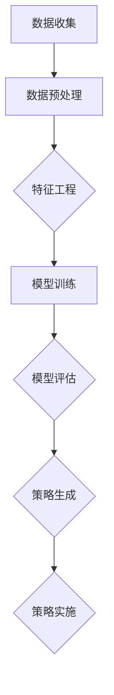
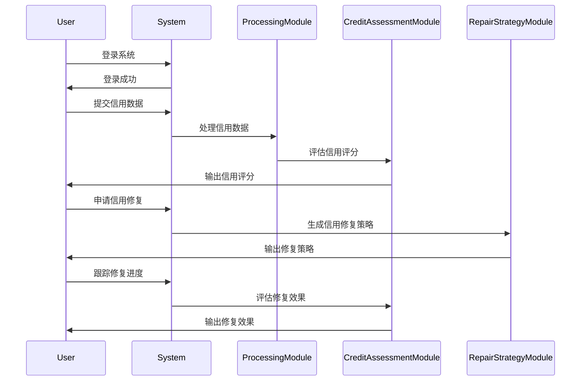

                 

# 《构建智能化的个人信用修复助手系统》

## 关键词

个人信用修复、人工智能、机器学习、信用评分模型、深度学习、自然语言处理

## 摘要

随着金融科技的快速发展，个人信用修复成为了一个备受关注的话题。本文旨在探讨如何构建一个智能化的个人信用修复助手系统。通过分析信用修复的重要性与现状、信用修复基础理论、系统架构设计、智能化信用修复策略及其实现，本文将为读者提供一套完整的技术方案，帮助个人有效修复信用记录，提高信用评分，实现信用价值的最大化。本文将一步步深入剖析，使读者能够更好地理解信用修复的核心技术，掌握构建智能化信用修复系统的实际操作方法。

## 目录大纲

1. 引言
   1.1 信用修复的重要性与现状
      1.1.1 信用体系概述
      1.1.2 个人信用问题的严重性
      1.1.3 当前信用修复存在的问题
   1.2 信用修复助手系统的目标与功能
      1.2.1 系统设计目标
      1.2.2 系统主要功能模块
      1.2.3 系统预期效果
   1.3 本书结构安排
      1.3.1 内容概述
      1.3.2 阅读指南
   1.4 本章小结

2. 信用修复基础理论
   2.1 个人信用评分模型
      2.1.1 个人信用评分模型概述
      2.1.2 个人信用评分模型的发展历程
      2.1.3 当前主流信用评分模型
   2.2 信用修复方法与策略
      2.2.1 信用修复方法分类
      2.2.2 信用修复策略案例分析
      2.2.3 信用修复策略实施难点
   2.3 法律法规与政策背景
      2.3.1 个人信用修复相关法律法规
      2.3.2 政策背景及影响
      2.3.3 法规对信用修复助手系统设计的影响
   2.4 本章小结

3. 信用修复助手系统的架构设计
   3.1 系统总体架构
      3.1.1 系统架构概述
      3.1.2 系统架构设计原则
      3.1.3 系统架构主要模块
   3.2 数据处理模块设计
      3.2.1 数据采集与存储
      3.2.2 数据预处理方法
      3.2.3 数据质量评估与优化
   3.3 信用评估模块设计
      3.3.1 信用评估模型选择
      3.3.2 评估模型训练与优化
      3.3.3 信用评估结果输出
   3.4 信用修复策略生成模块设计
      3.4.1 修复策略生成算法
      3.4.2 策略优化方法
      3.4.3 策略效果评估
   3.5 本章小结

4. 智能化信用修复策略
   4.1 智能化信用修复的核心技术
      4.1.1 机器学习在信用修复中的应用
      4.1.2 深度学习在信用修复中的应用
      4.1.3 自然语言处理在信用修复中的应用
   4.2 信用修复策略生成算法详解
      4.2.1 算法基本原理
      4.2.2 算法实现流程
      4.2.3 算法性能分析
   4.3 智能化信用修复策略应用实例
      4.3.1 实例背景介绍
      4.3.2 策略生成与实施
      4.3.3 实施效果评估
   4.4 本章小结

5. 信用修复助手系统的实现
   5.1 开发环境与工具介绍
      5.1.1 开发环境搭建
      5.1.2 主要开发工具使用
      5.1.3 开发流程与方法
   5.2 数据处理模块实现
      5.2.1 数据采集与存储实现
      5.2.2 数据预处理实现
      5.2.3 数据质量评估与优化实现
   5.3 信用评估模块实现
      5.3.1 信用评估模型训练与优化实现
      5.3.2 评估模型结果输出实现
      5.3.3 信用评估模块测试
   5.4 信用修复策略生成模块实现
      5.4.1 修复策略生成算法实现
      5.4.2 策略优化方法实现
      5.4.3 策略效果评估实现
   5.5 系统集成与部署
      5.5.1 系统集成方案
      5.5.2 系统部署与维护
      5.5.3 系统上线与效果评估
   5.6 本章小结

## 第1章 引言

### 1.1 信用修复的重要性与现状

信用修复是一个涉及到个人经济生活的重要环节。在现代社会中，个人信用记录已经成为评估个人信用状况、决定贷款、信用卡申请、消费额度等金融服务的重要因素。良好的信用记录不仅能够帮助我们获得更低的利率、更高的信用额度，还能在求职、租房等方面带来便利。然而，由于各种原因，很多个人会遇到信用问题，如逾期还款、信用卡欠款、欺诈行为等，这些问题会对个人的信用评分造成负面影响，导致无法获得所需的金融服务。

#### 1.1.1 信用体系概述

信用体系是一个国家或地区为了规范和保障金融交易、维护金融稳定而建立的一套系统。它通过收集、处理、存储和传播个人或企业的信用数据，为金融机构和相关部门提供信用评估和风险控制的基础信息。个人信用记录是信用体系的重要组成部分，它记录了个人在过去一段时间内的信用活动，如贷款、信用卡使用、还款情况等。

#### 1.1.2 个人信用问题的严重性

个人信用问题不仅会影响个人的经济活动，还可能引发一系列连锁反应。例如，信用不良者可能会面临贷款审批困难、信用卡额度低、利率高等问题，甚至可能导致失业、租房困难等。此外，信用问题还可能影响个人的社会地位和人际关系，使得个人在社交、职业发展等方面受到限制。

#### 1.1.3 当前信用修复存在的问题

当前，个人信用修复存在以下几个问题：

1. **信息不对称**：个人难以获取全面、准确的信用报告，很难了解自己的信用状况。
2. **修复过程复杂**：信用修复涉及多个环节，包括申请信用报告、查找信用问题、制定修复策略、提交申请等，过程繁琐且耗时。
3. **法律法规不完善**：虽然我国已有一些关于个人信用修复的法律法规，但执行力度不够，存在一定的漏洞和灰色地带。
4. **技术手段不足**：当前的信用修复手段主要依赖于人工处理，效率低、成本高，难以满足大量用户的需求。

### 1.2 信用修复助手系统的目标与功能

为了解决上述问题，构建一个智能化的个人信用修复助手系统显得尤为重要。该系统的目标是通过人工智能和大数据技术，为用户提供以下功能：

1. **信用评估**：系统会对用户的信用记录进行全方位分析，生成信用评分，帮助用户了解自己的信用状况。
2. **信用修复策略生成**：系统会根据用户的信用报告和信用评分，自动生成个性化的信用修复策略，指导用户采取有效的修复措施。
3. **修复进度监控**：系统会实时跟踪用户的修复进度，评估修复效果，为用户提供及时的反馈。
4. **法律法规咨询**：系统会提供相关的法律法规信息，帮助用户了解自己的权益和义务。

#### 1.2.1 系统设计目标

系统设计目标如下：

1. **智能化**：利用人工智能技术，提高信用评估和修复的准确性、效率和智能化水平。
2. **高效性**：通过大数据技术，快速处理大量用户数据，提高系统处理速度和响应能力。
3. **用户体验**：提供简洁、直观的用户界面，确保用户能够方便地使用系统功能。
4. **安全性**：保障用户数据的安全性和隐私性，防止数据泄露和滥用。

#### 1.2.2 系统主要功能模块

系统主要功能模块包括：

1. **用户管理模块**：负责用户的注册、登录、权限管理等功能。
2. **数据处理模块**：负责用户数据的采集、存储、预处理和质量评估。
3. **信用评估模块**：负责对用户的信用记录进行评分和评估。
4. **信用修复策略生成模块**：负责根据用户的信用状况，自动生成个性化的修复策略。
5. **法律法规咨询模块**：负责提供相关的法律法规信息，帮助用户了解自己的权益和义务。
6. **用户反馈模块**：负责收集用户对系统服务的反馈，优化系统功能。

#### 1.2.3 系统预期效果

系统预期效果如下：

1. **提高信用评分**：通过智能化信用修复策略，帮助用户有效提升信用评分。
2. **简化修复过程**：提供一站式信用修复服务，简化用户修复信用记录的流程。
3. **提升用户体验**：通过简洁、直观的用户界面，提高用户的使用体验。
4. **降低成本**：利用大数据和人工智能技术，降低信用修复的成本。

### 1.3 本书结构安排

本书共分为五个部分，具体内容安排如下：

1. **第1章 引言**：介绍信用修复的重要性与现状，阐述信用修复助手系统的目标与功能。
2. **第2章 信用修复基础理论**：讨论个人信用评分模型、信用修复方法与策略，以及法律法规与政策背景。
3. **第3章 信用修复助手系统的架构设计**：介绍系统总体架构、数据处理模块设计、信用评估模块设计、信用修复策略生成模块设计。
4. **第4章 智能化信用修复策略**：探讨机器学习、深度学习和自然语言处理在信用修复中的应用，以及信用修复策略生成算法的详解和应用实例。
5. **第5章 信用修复助手系统的实现**：介绍系统的开发环境与工具、数据处理模块实现、信用评估模块实现、信用修复策略生成模块实现，以及系统集成与部署。

#### 1.3.1 内容概述

本书首先介绍了信用修复的重要性和现状，阐述了构建智能化信用修复助手系统的目标与功能。接着，详细讨论了信用修复的基础理论，包括个人信用评分模型、信用修复方法与策略，以及法律法规与政策背景。然后，深入剖析了信用修复助手系统的架构设计，包括总体架构、数据处理模块设计、信用评估模块设计、信用修复策略生成模块设计。随后，探讨了智能化信用修复策略，包括机器学习、深度学习和自然语言处理在信用修复中的应用，以及信用修复策略生成算法的详解和应用实例。最后，详细介绍了信用修复助手系统的实现，包括开发环境与工具、数据处理模块实现、信用评估模块实现、信用修复策略生成模块实现，以及系统集成与部署。

#### 1.3.2 阅读指南

本书结构清晰，内容丰富，适合不同层次的读者阅读。对于初学者，可以从第1章和第2章开始，逐步了解信用修复的基础知识和现状。对于有一定基础的读者，可以深入第3章到第5章，掌握信用修复助手系统的设计与实现方法。同时，本书还提供了大量的代码和应用实例，有助于读者实际操作和动手实践。希望读者能够通过本书的学习，掌握构建智能化信用修复助手系统的核心技能，为个人信用修复事业做出贡献。

### 1.4 本章小结

本章介绍了信用修复的重要性与现状，阐述了信用修复助手系统的目标与功能。通过分析信用体系概述、个人信用问题的严重性以及当前信用修复存在的问题，我们认识到信用修复的重要性和必要性。同时，我们明确了信用修复助手系统的设计目标与主要功能模块，为后续章节的内容奠定了基础。希望读者能够通过本章的学习，对信用修复有一个全面的认识，并为后续的学习和实践做好准备。# 第1章 引言

### 1.1 信用修复的重要性与现状

随着社会经济的发展和金融科技的进步，个人信用体系越来越受到重视。信用修复作为维护个人信用的重要环节，其重要性不言而喻。然而，目前信用修复的现状却面临着诸多挑战，亟需智能化解决方案来提升效率和质量。

#### 1.1.1 信用体系概述

信用体系是一个国家或地区为了规范和保障金融交易、维护金融稳定而建立的一套系统。它通过收集、处理、存储和传播个人或企业的信用数据，为金融机构和相关部门提供信用评估和风险控制的基础信息。个人信用记录是信用体系的重要组成部分，它记录了个人在过去一段时间内的信用活动，如贷款、信用卡使用、还款情况等。

在信用体系中，信用评分是一个关键指标。信用评分通常由信用报告机构（如信用局）根据个人的信用历史数据计算得出，用于评估个人的信用风险。信用评分越高，个人获得贷款、信用卡等金融服务的可能性越大，利率也越低。反之，信用评分较低则可能面临贷款审批困难、信用卡额度低、利率高等问题。

#### 1.1.2 个人信用问题的严重性

个人信用问题可能源于多种原因，如意外失业、健康问题、经济困难等。以下是一些常见的个人信用问题及其严重性：

1. **逾期还款**：逾期还款是常见的信用问题，它会导致信用评分下降。根据逾期还款的严重程度和时间，信用评分可能会受到不同程度的负面影响。
   
2. **信用卡欠款**：信用卡欠款同样会影响个人信用评分。持卡人未按时还款或欠款过多，都会对其信用记录产生不利影响。

3. **欺诈行为**：包括信用卡欺诈、贷款欺诈等。这些行为不仅会对个人信用造成严重损害，还可能导致法律纠纷。

4. **错误的信用报告**：由于信息传输或处理过程中的错误，个人可能会收到错误的信用报告，从而影响其信用评分。

个人信用问题的严重性不仅体现在金融领域，还可能影响个人的日常生活。例如，信用不良者可能难以获得贷款、信用卡，甚至在求职、租房等方面受到限制。此外，信用问题还可能影响个人的社会地位和人际关系，使得个人在社交、职业发展等方面受到限制。

#### 1.1.3 当前信用修复存在的问题

尽管信用修复的重要性日益凸显，但当前信用修复的现状却面临诸多挑战。以下是几个主要问题：

1. **信息不对称**：个人难以获取全面、准确的信用报告，很难了解自己的信用状况。信用报告通常由第三方信用机构提供，而个人往往无法直接访问这些报告。

2. **修复过程复杂**：信用修复涉及多个环节，包括申请信用报告、查找信用问题、制定修复策略、提交申请等。这些环节通常需要耗费大量时间和精力，且过程繁琐。

3. **法律法规不完善**：虽然我国已有一些关于个人信用修复的法律法规，如《征信业管理条例》等，但在执行过程中存在一定漏洞和灰色地带，导致信用修复难度增加。

4. **技术手段不足**：当前的信用修复手段主要依赖于人工处理，效率低、成本高，难以满足大量用户的需求。随着信用记录的日益复杂化，人工处理的局限性愈发明显。

综上所述，信用修复的重要性与现状之间存在明显的矛盾。为了解决这些问题，构建一个智能化的个人信用修复助手系统成为必然选择。下一节将详细介绍信用修复助手系统的目标与功能。# 第1章 引言

### 1.2 信用修复助手系统的目标与功能

为了解决当前信用修复存在的问题，提升个人信用修复的效率和质量，构建一个智能化的个人信用修复助手系统显得尤为重要。本节将详细阐述该系统的目标与功能，帮助用户通过智能手段实现信用修复。

#### 1.2.1 系统设计目标

信用修复助手系统的设计目标主要包括以下几点：

1. **智能化**：利用人工智能和大数据技术，提高信用评估和修复的准确性、效率和智能化水平。通过自动化处理，减少人为干预，提升系统的响应速度和用户体验。

2. **高效性**：通过大数据技术，快速处理大量用户数据，提高系统处理速度和响应能力。系统应能够实时分析用户的信用状况，提供即时的修复建议。

3. **用户体验**：提供简洁、直观的用户界面，确保用户能够方便地使用系统功能。系统的设计应考虑到用户的使用习惯和需求，提供友好的交互体验。

4. **安全性**：保障用户数据的安全性和隐私性，防止数据泄露和滥用。系统应具备完善的数据保护机制，确保用户数据在传输和存储过程中的安全性。

5. **可扩展性**：系统设计应具备良好的可扩展性，能够根据用户需求和技术发展，不断更新和优化系统功能。

#### 1.2.2 系统主要功能模块

信用修复助手系统的主要功能模块包括以下几部分：

1. **用户管理模块**：负责用户的注册、登录、权限管理等功能。用户可以通过注册账号登录系统，管理个人信用数据和相关设置。

2. **数据处理模块**：负责用户数据的采集、存储、预处理和质量评估。系统将从多个数据源收集用户信用数据，包括银行记录、信用卡账单、贷款信息等，确保数据的准确性和完整性。

3. **信用评估模块**：负责对用户的信用记录进行评分和评估。系统会使用先进的信用评分模型，结合用户的信用历史数据，生成个性化的信用评分报告。

4. **信用修复策略生成模块**：根据用户的信用评估结果，系统会自动生成个性化的信用修复策略。这些策略包括还款计划、信用修复方案等，旨在帮助用户逐步改善信用状况。

5. **修复进度监控模块**：负责实时跟踪用户的修复进度，评估修复效果。系统会定期更新用户的信用评分，并根据修复策略的实施情况，提供反馈和调整建议。

6. **法律法规咨询模块**：提供与个人信用修复相关的法律法规信息，帮助用户了解自己的权益和义务。系统将集成相关法律法规知识库，用户可以通过该模块查询相关信息。

7. **用户反馈模块**：负责收集用户对系统服务的反馈，优化系统功能。用户可以通过该模块提出建议和意见，系统管理员将根据用户反馈不断改进系统。

#### 1.2.3 系统预期效果

信用修复助手系统的预期效果主要体现在以下几个方面：

1. **提高信用评分**：通过智能化的信用评估和修复策略，帮助用户有效提升信用评分。系统提供的个性化修复策略将有助于用户逐步改善信用记录，获得更优质的金融服务。

2. **简化修复过程**：提供一站式信用修复服务，简化用户修复信用记录的流程。用户无需亲自处理繁琐的信用修复步骤，系统将自动完成大部分工作，节省用户时间和精力。

3. **提升用户体验**：通过简洁、直观的用户界面，提高用户的使用体验。系统界面设计注重用户体验，用户可以轻松地查看信用评分、跟踪修复进度、获取法律法规咨询等。

4. **降低成本**：利用大数据和人工智能技术，降低信用修复的成本。系统通过自动化处理，减少了人工成本和错误率，提高了工作效率。

5. **加强法律法规遵守**：通过提供法律法规咨询，帮助用户了解自己的权益和义务，增强对法律法规的遵守意识，减少信用问题发生。

总之，信用修复助手系统将为用户提供一个智能、高效、便捷的信用修复解决方案，帮助用户改善信用状况，提升信用价值。下一节将介绍本书的结构安排，帮助读者更好地理解后续内容。# 第1章 引言

### 1.3 本书结构安排

为了系统地介绍信用修复助手系统的构建，本书分为五个主要部分，每部分都有明确的主题和内容安排，旨在帮助读者逐步掌握信用修复的核心知识和技术。

#### 1.3.1 内容概述

**第1部分 引言**  
本章主要介绍信用修复的重要性与现状，阐述构建信用修复助手系统的目标与功能。通过分析信用体系的概述、个人信用问题的严重性以及当前信用修复存在的问题，读者将了解信用修复的背景和必要性。同时，本章还介绍了信用修复助手系统的设计目标、主要功能模块及其预期效果。

**第2部分 信用修复基础理论**  
这部分内容将深入探讨信用修复的基础理论，包括个人信用评分模型、信用修复方法与策略，以及法律法规与政策背景。通过学习这些理论，读者将理解信用评分的计算方式、信用修复的常见策略以及相关政策对信用修复的影响。

**第3部分 信用修复助手系统的架构设计**  
这部分内容将详细描述信用修复助手系统的架构设计，包括系统总体架构、数据处理模块设计、信用评估模块设计、信用修复策略生成模块设计等。读者将了解系统各模块的功能和相互关系，以及如何通过架构设计实现智能化信用修复。

**第4部分 智能化信用修复策略**  
这部分内容将探讨智能化信用修复策略的核心技术，包括机器学习、深度学习和自然语言处理在信用修复中的应用。同时，将详细讲解信用修复策略生成算法的基本原理、实现流程和性能分析，并通过应用实例展示策略的实际效果。

**第5部分 信用修复助手系统的实现**  
这部分内容将介绍信用修复助手系统的具体实现过程，包括开发环境与工具的介绍、数据处理模块实现、信用评估模块实现、信用修复策略生成模块实现，以及系统的集成与部署。读者将学习到系统的实际操作方法和关键技术。

#### 1.3.2 阅读指南

本书旨在为读者提供一套完整的信用修复解决方案，适合不同层次的读者阅读和学习。

- **初学者**：可以从第1章和第2章开始，逐步了解信用修复的基础知识和现状，理解信用评分模型和修复方法。这部分内容将帮助初学者建立信用修复的基本概念。

- **中级读者**：可以深入第3章到第5章，掌握信用修复助手系统的设计与实现方法。这部分内容将帮助中级读者理解系统的架构设计、核心算法和实现过程。

- **高级读者**：可以通过阅读全书，深入了解信用修复领域的最新技术和发展趋势，学习如何运用人工智能和大数据技术解决实际信用修复问题。

为了更好地阅读本书，建议读者按照以下步骤：

1. **通读全文**：首先通读全文，了解整体结构和内容安排，对信用修复助手系统有一个宏观的认识。

2. **重点学习**：针对自己的兴趣和需求，选择重点章节进行深入学习，特别是与实际工作相关的部分。

3. **实践操作**：结合书中的案例和代码示例，实际操作和动手实践，加深对知识的理解和应用。

4. **持续学习**：信用修复是一个不断发展的领域，读者应关注相关技术的发展和趋势，持续学习和更新知识。

通过本书的学习，读者将能够：

- 理解信用修复的基本理论和方法。  
- 掌握信用修复助手系统的设计与实现。  
- 运用智能化技术解决信用修复问题。  
- 提高个人的信用评分和信用价值。

#### 1.3.3 本书特点

- **系统全面**：本书涵盖了信用修复的各个关键环节，从基础理论到系统设计，再到实现过程，提供了一套完整的信用修复解决方案。

- **理论与实践结合**：书中不仅有详细的理论讲解，还包括丰富的实际案例和代码示例，帮助读者将知识应用到实际工作中。

- **易于理解**：本书采用通俗易懂的语言，结合图表和示例，使得复杂的技术概念变得易于理解。

- **更新及时**：本书紧跟信用修复领域的发展趋势，及时更新相关技术和内容，确保读者掌握最新的技术动态。

通过本书的学习，读者将能够更好地应对个人信用问题，提高信用评分，实现信用价值的最大化。# 第1章 引言

### 1.4 本章小结

本章从信用修复的重要性与现状出发，介绍了构建智能化个人信用修复助手系统的目标与功能。通过分析信用体系的概述、个人信用问题的严重性以及当前信用修复存在的问题，我们认识到信用修复对于个人经济生活的重要性。信用修复助手系统旨在通过智能化手段，帮助用户高效、准确地评估和修复信用问题，提升信用评分，实现信用价值的最大化。

本章的主要内容包括：

1. **信用体系概述**：介绍了信用体系的定义和功能，以及信用评分作为信用体系核心指标的重要性。
2. **个人信用问题的严重性**：分析了逾期还款、信用卡欠款、欺诈行为等个人信用问题对经济生活和社交关系的负面影响。
3. **当前信用修复存在的问题**：讨论了信息不对称、修复过程复杂、法律法规不完善、技术手段不足等问题，揭示了现有信用修复手段的局限性。
4. **信用修复助手系统的目标与功能**：明确了系统设计目标，包括智能化、高效性、用户体验、安全性和可扩展性，并详细介绍了系统的主要功能模块。

通过本章的学习，读者可以初步了解信用修复的重要性和现状，以及智能化信用修复助手系统的设计理念与核心功能。下一章将深入探讨信用修复的基础理论，包括个人信用评分模型、信用修复方法与策略，以及法律法规与政策背景。这将为进一步理解信用修复助手系统的设计与实现奠定基础。# 第2章 信用修复基础理论

### 2.1 个人信用评分模型

个人信用评分模型是信用修复的重要基础，它通过对个人信用数据的分析和处理，生成一个综合信用评分，用于评估个人的信用风险。本节将介绍个人信用评分模型的概述、发展历程以及当前主流的信用评分模型。

#### 2.1.1 个人信用评分模型概述

个人信用评分模型是一种基于统计学和机器学习技术的预测模型，它通过对个人的信用历史数据进行收集、处理和建模，预测个人未来可能出现的信用风险。个人信用评分模型的核心目的是为金融机构和信用机构提供一个量化评估工具，以便于它们在发放贷款、批准信用卡申请或设定信用额度时做出决策。

个人信用评分模型通常包括以下几个关键组成部分：

1. **数据收集**：包括个人的基本信息、信用交易历史、公共记录等。这些数据可以从信用报告机构、银行、信用卡公司等渠道获取。

2. **数据处理**：对收集到的数据进行清洗、转换和归一化等处理，确保数据的质量和一致性。

3. **特征选择**：从原始数据中选择对信用评分有显著影响的特征，如还款记录、贷款额度、信用使用率等。

4. **模型训练**：使用选定的特征数据集，通过机器学习算法训练信用评分模型，以预测个人的信用风险。

5. **模型评估**：通过交叉验证和测试集评估模型的预测性能，包括准确率、召回率、F1分数等指标。

6. **结果输出**：将模型预测的结果转换为信用评分，通常是一个介于0和1000之间的数值，用于表示个人的信用风险程度。

#### 2.1.2 个人信用评分模型的发展历程

个人信用评分模型的发展历程可以追溯到20世纪中期，随着信用卡和贷款业务的普及，信用评分模型逐渐成为金融机构风险评估的重要工具。以下是几个重要的发展阶段：

1. **传统评分模型**：最早的信用评分模型是基于专家经验和逻辑规则构建的，如FICO（Fair Isaac Corporation）模型。FICO模型于1989年首次推出，使用五个变量（支付历史记录、负债水平、债务类型、新信用账户数量、查询历史）来计算信用评分。

2. **统计模型**：随着统计方法的发展，信用评分模型开始采用更复杂的统计方法，如逻辑回归、决策树等。这些方法能够更好地捕捉信用数据中的复杂关系和模式。

3. **机器学习模型**：近年来，机器学习技术在信用评分模型中的应用逐渐普及。机器学习算法，如随机森林、支持向量机、神经网络等，能够从大规模数据中自动学习和发现规律，提高信用评分的准确性。

4. **大数据与深度学习模型**：随着大数据技术的发展，信用评分模型开始利用更多的数据来源，如社交媒体数据、交易数据、位置数据等。深度学习模型的引入，如卷积神经网络（CNN）、循环神经网络（RNN）等，进一步提升了信用评分的预测能力。

#### 2.1.3 当前主流信用评分模型

当前主流的个人信用评分模型包括以下几种：

1. **FICO模型**：FICO模型是最常用的信用评分模型之一，由美国信用报告机构开发。FICO评分介于300到850之间，分数越高表示信用风险越低。

2. **VantageScore模型**：VantageScore模型是由三大信用报告机构（Equifax、Experian、TransUnion）联合推出的信用评分模型，用于替代FICO模型。VantageScore评分范围也是300到850。

3. **贝叶斯模型**：贝叶斯模型是一种基于贝叶斯理论的信用评分模型，通过分析历史数据和先验概率，预测个人的信用风险。

4. **机器学习模型**：包括随机森林、支持向量机、神经网络等，这些模型利用大量数据自动学习和发现信用评分中的复杂关系。

5. **深度学习模型**：如卷积神经网络（CNN）、循环神经网络（RNN）等，深度学习模型能够处理大量非结构化数据，提高信用评分的准确性。

每个信用评分模型都有其独特的特点和适用场景，金融机构和信用机构会根据自身需求和数据情况选择合适的模型。下一节将介绍信用修复方法与策略，探讨如何利用这些模型为用户制定个性化的信用修复计划。# 第2章 信用修复基础理论

### 2.2 信用修复方法与策略

信用修复方法与策略是帮助个人改善信用记录、提高信用评分的关键手段。本节将详细介绍信用修复方法的分类、具体策略案例分析以及实施难点，为信用修复提供理论支持。

#### 2.2.1 信用修复方法分类

信用修复方法主要分为以下几类：

1. **及时还款法**：这是最基本的信用修复方法。及时还款可以避免逾期和欠款，保持良好的还款记录，从而逐步提高信用评分。

2. **债务重组法**：通过调整还款计划，延长还款期限或降低还款金额，减轻借款人的还款压力。债务重组有助于避免逾期和欠款，同时降低信用风险。

3. **信用修复服务法**：通过专业的信用修复服务，帮助用户清理信用报告中的错误信息、纠正不良记录。信用修复服务通常包括与信用报告机构沟通、提出异议、申请删除错误信息等。

4. **增加新信用法**：通过增加新的信用记录，如申请新的信用卡或贷款，改善信用评分。新信用法的目的是增加信用评分的多样性，减少单一信用记录的负面影响。

5. **消费行为优化法**：通过优化消费行为，如控制信用卡使用额度、避免频繁申请信用产品等，保持良好的信用行为，从而提升信用评分。

#### 2.2.2 信用修复策略案例分析

以下是几个信用修复策略的案例分析：

1. **案例一：逾期还款的修复**  
某客户因意外失业，导致信用卡逾期还款。信用修复策略包括与银行沟通，解释原因，申请延期还款；同时，积极增加收入，确保按时还款。经过半年多的努力，客户的信用评分逐渐恢复到正常水平。

2. **案例二：信用卡欠款的修复**  
某客户因信用卡欠款较多，信用评分下降。信用修复策略包括制定详细的还款计划，逐步减少欠款；同时，申请增加信用卡额度，分散还款压力。经过一年的努力，客户的信用评分显著提升。

3. **案例三：错误信用记录的修复**  
某客户信用报告中存在错误信息，如他人的逾期还款记录。信用修复策略包括向信用报告机构提出异议，要求删除错误信息；同时，通过提供相关证据，如银行对账单、还款证明等，证明错误信息的错误。最终，错误信息被删除，客户的信用评分恢复到正常水平。

#### 2.2.3 信用修复策略实施难点

信用修复策略的实施过程中，会遇到以下几个难点：

1. **信息不对称**：用户往往难以获取全面、准确的信用报告，导致修复策略的制定缺乏数据支持。

2. **修复过程复杂**：信用修复涉及多个环节，包括申请信用报告、查找信用问题、制定修复策略、提交申请等，过程繁琐且耗时。

3. **法律法规不完善**：虽然我国已有一些关于信用修复的法律法规，但在执行过程中存在漏洞和灰色地带，增加了信用修复的难度。

4. **技术手段不足**：当前的信用修复手段主要依赖于人工处理，效率低、成本高，难以满足大量用户的需求。

5. **信用记录的滞后性**：信用修复策略的实施效果通常需要一段时间才能显现，信用记录的滞后性使得用户难以立即看到修复效果。

#### 2.2.4 法规对信用修复的影响

我国《征信业管理条例》等相关法规对信用修复产生了重要影响：

1. **权益保障**：法规明确了个人信用信息的保护原则，用户有权要求信用报告机构提供准确、完整的信用报告，有权要求删除错误信息。

2. **异议处理**：法规规定了用户对信用报告中错误信息的异议处理流程，包括提出异议、核实信息等步骤。

3. **信用修复期限**：法规对信用修复的期限进行了规定，一些负面信息在一定期限内不得列入信用报告。

4. **信用修复费用**：法规规定了信用修复的费用标准，用户在申请信用修复时需支付一定的费用。

#### 2.2.5 法规对信用修复助手系统设计的影响

法规对信用修复助手系统的设计产生了以下几个影响：

1. **合规性要求**：系统设计需符合相关法规的要求，确保用户信息的合法保护。

2. **异议处理机制**：系统需提供便捷的异议处理功能，帮助用户快速解决信用报告中的错误信息。

3. **信用修复流程**：系统需按照法规规定的流程，设计信用修复的各个环节，确保用户能够顺利实施修复策略。

4. **费用透明度**：系统需明确列出信用修复的费用标准，确保用户对费用有清晰了解。

通过本节的介绍，读者可以了解到信用修复方法的分类、具体策略案例分析以及实施难点，以及法规对信用修复的影响和信用修复助手系统设计的要求。这些内容为构建智能化信用修复助手系统提供了理论基础和实践指导。下一节将探讨信用修复助手系统的架构设计，为系统实现奠定基础。# 第2章 信用修复基础理论

### 2.3 法律法规与政策背景

信用修复不仅依赖于技术手段，还受到法律法规和政策的支持与制约。本节将介绍个人信用修复相关法律法规、政策背景及其对信用修复助手系统设计的影响。

#### 2.3.1 个人信用修复相关法律法规

我国关于个人信用修复的法律体系主要包括以下几部法律法规：

1. **《征信业管理条例》**：这是我国关于信用修复的主要法规，明确了信用报告机构、信息提供者和信息用户等各方的权利和义务。该条例规定了个人有权查询自己的信用报告，有权要求更正错误信息，并规定了信用报告机构在提供信用报告时应履行的义务。

2. **《中华人民共和国消费者权益保护法》**：该法律规定了消费者的基本权益，包括个人信息保护权。消费者有权要求信用报告机构提供准确的信用报告，并对错误信息提出异议。

3. **《中华人民共和国民法典》**：民法典中的部分条款涉及个人信用信息的保护和信用修复，如合同违约责任、隐私权等。

4. **《中华人民共和国个人信息保护法》**：该法律是我国最新的个人信息保护法规，进一步强化了个人信息保护的要求，对信用报告机构处理个人信用信息提出了更高标准。

#### 2.3.2 政策背景及影响

随着金融科技的快速发展，国家对信用体系建设的重视程度不断提高。以下是几个重要政策及其对信用修复的影响：

1. **《社会信用体系建设规划（2014-2020年）》**：这是我国第一个关于社会信用体系建设的国家级规划，明确了信用体系建设的总体目标和任务，包括建立健全的信用法律法规体系、提升信用服务水平、推广信用应用等。

2. **《国务院关于建立完善守信联合激励和失信联合惩戒制度加快推进社会诚信建设的指导意见》**：该意见提出了建立健全守信激励和失信惩戒机制的具体措施，旨在通过信用激励和惩戒手段，推动社会诚信建设。

3. **《金融信用信息基础数据库管理办法》**：该办法规定了金融信用信息基础数据库的建设和管理，包括信用信息的采集、处理、存储和查询等，为信用修复提供了重要依据。

#### 2.3.3 法规对信用修复助手系统设计的影响

法律法规和政策对信用修复助手系统设计产生了以下几方面的影响：

1. **合规性要求**：系统设计需符合相关法律法规的要求，确保用户数据的合法处理和保护。例如，系统需提供用户查询和更正信用报告的接口，确保用户能够方便地获取和修正个人信息。

2. **异议处理机制**：系统需设计便捷、高效的异议处理功能，以应对用户对信用报告中的错误信息提出的异议。这包括用户提交异议请求、系统审核和处理异议等流程。

3. **隐私保护**：系统需遵守《个人信息保护法》等法律法规，确保用户个人信息的安全性和隐私性。例如，系统需采取数据加密、访问控制等技术措施，防止用户信息泄露和滥用。

4. **信用修复流程**：系统需按照法律法规规定的流程，设计信用修复的各个环节，确保用户能够顺利实施信用修复策略。例如，系统需提供信用报告查询、异议处理、信用修复方案生成等功能。

5. **费用透明度**：系统需明确列出信用修复相关费用的标准，确保用户对费用有清晰了解，避免信息不对称和费用争议。

综上所述，法律法规和政策为信用修复提供了法律依据和操作指南，对信用修复助手系统的设计产生了重要影响。信用修复助手系统需严格遵守相关法律法规，确保系统的合规性和用户权益的保护。下一节将探讨信用修复助手系统的架构设计，进一步阐述系统功能模块及其相互作用。# 第3章 信用修复助手系统的架构设计

### 3.1 系统总体架构

信用修复助手系统的总体架构设计是构建高效、智能信用修复解决方案的基础。系统架构需具备良好的扩展性、稳定性和安全性，以适应不断变化的用户需求和金融市场环境。本节将详细介绍系统总体架构的概述、设计原则以及主要模块。

#### 3.1.1 系统架构概述

信用修复助手系统采用三层架构设计，包括表示层、业务逻辑层和数据层。这种分层架构有利于模块化开发、维护和扩展，提高了系统的灵活性和可维护性。

1. **表示层（Presentation Layer）**：表示层负责用户界面的设计和管理，用户通过Web界面或移动应用与系统进行交互。表示层的主要功能包括用户身份验证、数据展示、用户操作等。

2. **业务逻辑层（Business Logic Layer）**：业务逻辑层是系统的核心，负责处理业务逻辑和数据处理，包括信用评估、信用修复策略生成、进度监控等功能。业务逻辑层通过API与表示层和数据层进行交互，实现数据的传递和处理。

3. **数据层（Data Layer）**：数据层负责数据的存储和管理，包括用户数据、信用数据、日志数据等。数据层使用数据库管理系统（DBMS）进行数据的存储、查询和管理，确保数据的安全性和一致性。

#### 3.1.2 系统架构设计原则

系统架构设计遵循以下原则，以确保系统的高效、稳定和安全：

1. **模块化**：系统功能模块化设计，各个模块之间独立运行，便于开发和维护。

2. **可扩展性**：系统设计需具备良好的扩展性，能够根据业务需求增加新功能模块或调整现有模块。

3. **安全性**：系统采用多层安全策略，包括身份验证、数据加密、防火墙等，确保用户数据的安全性和系统的稳定性。

4. **高性能**：系统优化数据库查询和数据处理性能，确保系统在高并发情况下仍能稳定运行。

5. **易维护性**：系统设计需易于维护和升级，便于后续的功能扩展和性能优化。

#### 3.1.3 系统架构主要模块

信用修复助手系统主要包括以下功能模块：

1. **用户管理模块**：负责用户的注册、登录、权限管理等功能。该模块实现用户身份验证，确保系统的安全性。

2. **数据处理模块**：负责用户数据的采集、存储、预处理和质量评估。该模块实现用户信用数据的导入和导出，以及数据的清洗和转换。

3. **信用评估模块**：负责对用户的信用记录进行评分和评估。该模块使用信用评分模型对用户的历史数据进行计算，生成信用评分报告。

4. **信用修复策略生成模块**：负责根据用户的信用评估结果，自动生成个性化的信用修复策略。该模块实现策略优化和效果评估，帮助用户制定可行的修复计划。

5. **法律法规咨询模块**：提供与个人信用修复相关的法律法规信息，帮助用户了解自己的权益和义务。该模块集成法律法规知识库，提供在线查询和咨询功能。

6. **用户反馈模块**：负责收集用户对系统服务的反馈，优化系统功能。该模块实现用户意见收集、反馈处理和效果评估，提高用户满意度。

#### 3.1.4 系统架构图

以下是一个简化的系统架构图，展示了各模块的相互关系：

```
+------------------+       +------------------+       +------------------+
|    用户管理模块   |       |    数据处理模块   |       |    信用评估模块  |
+------------------+       +------------------+       +------------------+
        |                                 |                                 |
        |                                 |                                 |
        |           业务逻辑层              |                                 |
        |                                 |                                 |
+-------+-------+                           +------------------+
|      |      |                             |    信用修复策略  |   |
|      |      |                             | 生成模块         |   |
+-------+-------+                           +------------------+
        |                                 |
        |                                 |
        |           数据层                |
        |                                 |
+-------+-------+
        |
        |
+-------+-------+
| 法律法规咨询模块 |
+------------------+
        |
        |
+-------+-------+
| 用户反馈模块     |
+------------------+
```

通过上述架构设计，信用修复助手系统实现了用户交互、数据处理、信用评估、策略生成、法规咨询和用户反馈等功能的有机整合，为用户提供一站式信用修复服务。

#### 3.1.5 系统架构设计要点

1. **模块独立性**：各模块功能独立，便于维护和升级，减少系统故障的风险。

2. **数据安全性**：采用加密技术和权限管理机制，确保用户数据的安全性和隐私性。

3. **数据处理效率**：优化数据库查询和数据处理流程，提高系统的响应速度和处理能力。

4. **扩展性**：设计灵活的系统架构，便于根据业务需求增加新功能和模块。

5. **用户友好性**：提供简洁、直观的用户界面，提高用户使用体验。

通过遵循上述设计原则和要点，信用修复助手系统能够为用户提供高效、智能、安全的信用修复服务，助力用户改善信用记录，提高信用评分。

#### 3.1.6 本章小结

本章详细介绍了信用修复助手系统的总体架构设计，包括系统架构概述、设计原则和主要模块。通过模块化设计和分层架构，系统实现了用户交互、数据处理、信用评估、策略生成、法规咨询和用户反馈等功能的一体化整合。下一章将深入探讨数据处理模块的设计，包括数据采集与存储、数据预处理方法和数据质量评估与优化。# 第3章 信用修复助手系统的架构设计

### 3.2 数据处理模块设计

数据处理模块是信用修复助手系统的核心组成部分，负责用户数据的采集、存储、预处理和质量评估。该模块的设计直接影响系统性能和用户体验。本节将详细介绍数据处理模块的设计思路、关键技术和实现方法。

#### 3.2.1 数据采集与存储

数据采集是数据处理模块的首要任务。系统需要从多个数据源获取用户信用数据，包括银行记录、信用卡账单、贷款信息、公共记录等。数据采集方法如下：

1. **接口调用**：通过API接口调用银行、信用卡公司、公共记录机构等的数据源，获取用户信用数据。

2. **数据爬取**：对于无法通过接口获取的数据，系统可以使用数据爬取技术，从网站、数据库等公开渠道获取相关信息。

3. **日志记录**：系统会记录用户操作日志，包括登录、查询、修复进度等，以用于后续的数据分析和用户行为研究。

数据存储方面，系统采用分布式数据库管理系统（DBMS），如MySQL、MongoDB等，进行数据的存储和管理。分布式数据库具有高可靠性、高性能和可扩展性，能够满足大规模数据存储和处理需求。以下是数据存储的关键点：

1. **数据分片**：将数据按照一定的规则分片存储到不同的数据库节点，以提高数据查询和处理速度。

2. **数据加密**：采用加密算法对敏感数据进行加密存储，确保用户数据的安全性。

3. **数据备份**：定期对数据库进行备份，防止数据丢失和损坏。

#### 3.2.2 数据预处理方法

数据预处理是确保数据质量的重要环节。系统需要对采集到的数据进行清洗、转换和归一化等预处理操作，以消除噪声和异常值，提高数据的一致性和准确性。以下是数据预处理的关键步骤：

1. **数据清洗**：删除重复记录、缺失值填充、去除无关字段等。对于缺失值，可以采用均值填补、插值法等方法进行补充。

2. **数据转换**：将不同数据源的数据格式统一，如将不同时间格式的数据转换为标准格式。对于分类数据，可以转换为二进制编码。

3. **数据归一化**：将不同量纲的数据进行归一化处理，如使用Z-score标准化或Min-Max标准化，使其具有相似的尺度。

4. **特征工程**：从原始数据中提取对信用评分有显著影响的特征，如还款频率、逾期天数、信用使用率等。特征工程能够提高信用评分模型的预测能力。

#### 3.2.3 数据质量评估与优化

数据质量评估是确保数据处理效果的重要手段。系统需要定期评估数据质量，并采取优化措施，以提高数据质量。以下是数据质量评估和优化的关键步骤：

1. **一致性检查**：检查数据的一致性，如确保同一用户的不同数据源记录一致。

2. **完整性检查**：检查数据的完整性，确保所有必要字段都有数据记录。

3. **准确性检查**：检查数据的准确性，如使用交叉验证方法比较不同数据源的数据准确性。

4. **异常值检测**：检测并处理异常值，如采用统计方法识别和排除异常值。

5. **数据优化**：根据数据质量评估结果，对数据预处理方法进行调整和优化，以提高数据质量。

6. **监控与报警**：建立数据质量监控机制，实时监控数据质量，并在发现问题时自动触发报警。

#### 3.2.4 数据处理流程

数据处理模块的设计需考虑数据处理的效率和可靠性。以下是数据处理的基本流程：

1. **数据采集**：从各个数据源获取用户信用数据。

2. **数据清洗**：清洗采集到的数据，删除重复记录、缺失值填充等。

3. **数据转换**：将数据格式统一，转换为标准格式。

4. **数据归一化**：对数据进行归一化处理。

5. **特征工程**：提取对信用评分有显著影响的特征。

6. **数据质量评估**：评估数据质量，检测一致性、完整性和准确性。

7. **数据存储**：将预处理后的数据存储到分布式数据库中。

8. **数据优化**：根据数据质量评估结果，对数据处理方法进行调整和优化。

9. **数据监控**：实时监控数据质量，确保数据处理过程的可靠性。

#### 3.2.5 系统架构图

以下是一个简化的数据处理模块架构图，展示了数据处理的基本流程和关键组件：

```
+--------------------------+
|   数据采集模块           |
+--------------------------+
        |
        |
+--------------------------+
|   数据清洗模块           |
+--------------------------+
        |
        |
+--------------------------+
|   数据转换模块           |
+--------------------------+
        |
        |
+--------------------------+
|   数据归一化模块         |
+--------------------------+
        |
        |
+--------------------------+
|   特征工程模块           |
+--------------------------+
        |
        |
+--------------------------+
|   数据质量评估模块       |
+--------------------------+
        |
        |
+--------------------------+
|   数据存储模块           |
+--------------------------+
        |
        |
+--------------------------+
|   数据优化模块           |
+--------------------------+
        |
        |
+--------------------------+
|   数据监控模块           |
+--------------------------+
```

通过上述架构设计，数据处理模块能够高效、准确地处理用户信用数据，为信用修复提供可靠的数据支持。

#### 3.2.6 本章小结

本章详细介绍了信用修复助手系统的数据处理模块设计，包括数据采集与存储、数据预处理方法、数据质量评估与优化等内容。数据处理模块的设计思路清晰，关键技术和实现方法具体，为信用修复助手系统提供了坚实的数据基础。下一章将探讨信用评估模块的设计，包括信用评估模型的选择、训练与优化，以及评估结果输出。# 第3章 信用修复助手系统的架构设计

### 3.3 信用评估模块设计

信用评估模块是信用修复助手系统的核心组件之一，其功能是根据用户的信用历史数据，使用信用评分模型进行评估，生成信用评分报告。本节将详细探讨信用评估模块的设计，包括信用评估模型的选择、训练与优化，以及评估结果输出。

#### 3.3.1 信用评估模型选择

选择合适的信用评估模型对于信用评估模块的性能至关重要。目前，主流的信用评估模型包括以下几种：

1. **逻辑回归模型（Logistic Regression）**：逻辑回归模型是一种经典的二分类模型，常用于信用评分。它通过线性回归模型对因变量进行预测，并将预测结果转换为概率值。

2. **决策树模型（Decision Tree）**：决策树模型通过一系列规则对数据集进行划分，每个节点表示一个特征，每个分支表示该特征的取值。决策树模型简单易懂，易于解释，但可能存在过拟合问题。

3. **随机森林模型（Random Forest）**：随机森林模型是一种集成学习方法，通过构建多棵决策树，并将它们的预测结果进行投票得到最终结果。随机森林模型具有较好的泛化能力，能够减少过拟合。

4. **支持向量机模型（Support Vector Machine, SVM）**：支持向量机模型通过找到一个最优的超平面，将信用评分问题转化为数学优化问题。SVM模型在处理高维数据时表现较好，但训练时间较长。

5. **神经网络模型（Neural Network）**：神经网络模型通过多层非线性变换，模拟人脑的信息处理过程。深度神经网络（Deep Neural Network, DNN）和卷积神经网络（Convolutional Neural Network, CNN）在处理复杂非线性问题上具有显著优势。

在选择信用评估模型时，需考虑以下因素：

- **数据规模**：对于大规模数据集，随机森林和神经网络模型具有较好的性能。
- **特征维度**：对于高维数据集，支持向量机和神经网络模型能够更好地处理。
- **解释性**：决策树模型具有较好的解释性，适合需要理解模型决策过程的应用场景。
- **计算资源**：神经网络模型的训练时间较长，需要较大的计算资源。

根据实际需求，可以采用集成学习方法，如随机森林或梯度提升树（Gradient Boosting Tree, GBT），结合神经网络模型的优势，构建一个性能优异的信用评估模型。

#### 3.3.2 评估模型训练与优化

信用评估模型的训练与优化是确保模型性能的关键环节。以下是训练与优化过程的详细步骤：

1. **数据预处理**：对训练数据集进行预处理，包括数据清洗、特征工程、归一化等。预处理后的数据应具有良好的分布和一致性。

2. **模型选择**：选择合适的信用评估模型，根据数据特征和模型性能进行选择。

3. **模型训练**：使用训练数据集对模型进行训练。对于集成学习方法，可以构建多棵决策树或多个基础模型，并进行集成。

4. **参数调优**：通过交叉验证方法，调整模型参数，如学习率、树深度、正则化参数等。参数调优旨在提高模型性能和泛化能力。

5. **模型评估**：使用验证数据集评估模型性能，包括准确率、召回率、F1分数等指标。评估结果用于判断模型是否过拟合或欠拟合。

6. **模型优化**：根据评估结果，对模型进行优化，包括增加训练数据、调整模型结构、改进特征工程等。

7. **模型验证**：在测试数据集上验证模型性能，确保模型在实际应用中的表现。

#### 3.3.3 信用评估结果输出

信用评估模块生成的信用评分报告是用户了解信用状况的重要依据。以下是信用评估结果输出的详细步骤：

1. **生成报告**：根据模型预测结果，生成信用评分报告。报告应包括信用评分、信用等级、信用风险分析等内容。

2. **可视化展示**：使用图表、图形等可视化手段，展示信用评分的分布和变化趋势，帮助用户直观理解信用状况。

3. **解释性分析**：提供信用评分的详细解释，包括影响因素、权重、贡献度等，帮助用户了解信用评分的形成过程。

4. **修复建议**：根据用户的信用评估结果，提供个性化的信用修复建议，如还款计划、信用记录改善措施等。

5. **反馈机制**：建立用户反馈机制，收集用户对信用评分报告和修复建议的反馈，优化报告内容和修复策略。

#### 3.3.4 系统架构图

以下是一个简化的信用评估模块架构图，展示了信用评估模型的选择、训练与优化，以及评估结果输出：

```
+--------------------------+
| 信用评估模型选择模块   |
+--------------------------+
        |
        |
+--------------------------+
| 信用评估模型训练模块   |
+--------------------------+
        |
        |
+--------------------------+
| 信用评估模型优化模块   |
+--------------------------+
        |
        |
+--------------------------+
| 信用评估结果输出模块   |
+--------------------------+
        |
        |
+--------------------------+
| 信用评分报告可视化模块 |
+--------------------------+
```

通过上述架构设计，信用评估模块能够高效、准确地评估用户的信用状况，为信用修复提供科学依据。

#### 3.3.5 本章小结

本章详细介绍了信用修复助手系统的信用评估模块设计，包括信用评估模型的选择、训练与优化，以及评估结果输出。信用评估模块的设计考虑了模型的性能、可解释性和用户需求，为信用修复助手系统提供了坚实的技术支持。下一章将探讨信用修复策略生成模块的设计，包括修复策略生成算法、策略优化方法以及策略效果评估。# 第4章 智能化信用修复策略

### 4.1 智能化信用修复的核心技术

智能化信用修复策略的实现依赖于现代人工智能技术，特别是机器学习、深度学习和自然语言处理（NLP）等领域的进步。这些技术为信用修复提供了强大的工具，使得系统能够自动生成有效的信用修复策略，并动态调整以适应不断变化的数据和环境。以下将详细介绍这些核心技术及其在信用修复中的应用。

#### 4.1.1 机器学习在信用修复中的应用

机器学习是一种通过算法和统计模型从数据中自动学习和发现规律的技术。在信用修复领域，机器学习的主要应用包括信用评分模型构建、信用风险评估和信用修复策略生成。

1. **信用评分模型构建**：机器学习技术可以用于构建信用评分模型，通过对大量历史信用数据进行训练，模型能够自动识别影响信用评分的关键因素。常用的算法包括逻辑回归、决策树、随机森林、支持向量机等。这些模型能够对新的信用数据进行分析，生成个性化的信用评分。

2. **信用风险评估**：机器学习技术可以帮助金融机构实时评估客户的信用风险。例如，通过应用监督学习算法，对客户的历史交易数据、财务状况和外部事件进行监控，及时发现潜在的信用风险。

3. **信用修复策略生成**：机器学习技术可以用于自动生成信用修复策略。通过对大量信用修复案例的学习，模型能够识别出成功的修复策略，并据此为新的客户生成个性化的修复方案。这种自动化的策略生成方式大大提高了信用修复的效率和质量。

#### 4.1.2 深度学习在信用修复中的应用

深度学习是一种基于多层神经网络的学习方法，通过多层抽象和特征提取，能够处理复杂的非线性问题。深度学习在信用修复中的应用主要包括以下几个方面：

1. **特征自动提取**：传统的信用评分模型需要手动选择和工程化特征，而深度学习可以自动从原始数据中提取有用的特征。例如，通过卷积神经网络（CNN）可以自动提取信用卡交易中的时间序列特征，通过循环神经网络（RNN）可以提取贷款还款中的依赖关系。

2. **非监督学习**：深度学习可以应用于非监督学习任务，如聚类和降维。例如，使用自编码器（Autoencoder）可以将高维的信用数据降维到低维空间，同时保留关键信息，为信用评分模型提供更好的输入。

3. **模型优化**：深度学习技术可以用于优化信用评分模型。通过引入新的神经网络架构和优化算法，如深度增强学习（Deep Reinforcement Learning），可以进一步提高模型的预测性能。

#### 4.1.3 自然语言处理在信用修复中的应用

自然语言处理（NLP）是处理和生成自然语言文本的技术。在信用修复领域，NLP技术主要用于文本数据的处理和分析。

1. **文本数据预处理**：NLP技术可以帮助系统处理和理解非结构化的文本数据，如信用报告、用户评论等。通过分词、词性标注、命名实体识别等技术，可以将文本数据转换为计算机可处理的结构化数据。

2. **情感分析**：NLP技术可以用于情感分析，通过对用户反馈和评论的情感倾向进行分析，帮助系统理解用户的情绪和需求，从而优化信用修复策略。

3. **文本生成**：NLP技术可以用于生成文本，如生成个性化的信用修复建议、法律法规解释等。通过使用生成对抗网络（GAN）和序列到序列模型（Seq2Seq），系统能够生成高质量的文本内容。

#### 4.1.4 智能化信用修复策略的构建方法

智能化信用修复策略的构建是一个复杂的过程，需要结合机器学习、深度学习和NLP等多种技术。以下是构建智能化信用修复策略的基本步骤：

1. **数据收集与预处理**：收集用户的信用数据，包括历史信用记录、财务状况、社会背景等，并对数据进行分析和清洗，以确保数据的质量。

2. **特征工程**：根据数据特点，提取对信用评分和信用修复有显著影响的特征，如还款频率、逾期天数、信用使用率等。

3. **模型训练与优化**：使用机器学习和深度学习算法训练信用评分模型和修复策略生成模型。通过交叉验证和超参数调优，提高模型的性能。

4. **策略生成**：基于训练好的模型，自动生成个性化的信用修复策略。策略生成过程可以结合规则引擎和机器学习算法，确保策略的灵活性和适应性。

5. **策略评估与优化**：通过模拟和测试，评估信用修复策略的有效性。根据评估结果，对策略进行优化和调整，以提高修复效果。

6. **实时更新与迭代**：信用修复策略需要根据新的数据和环境动态更新，以保持其有效性。通过持续学习和迭代，系统能够不断优化信用修复策略。

通过上述构建方法，智能化信用修复策略能够为用户提供个性化的信用修复方案，提高信用评分，实现信用价值的最大化。下一节将详细介绍信用修复策略生成算法的原理和实现流程。# 第4章 智能化信用修复策略

### 4.2 信用修复策略生成算法详解

信用修复策略生成算法是智能化信用修复系统的核心组成部分，其目的是根据用户的信用评分和历史数据，自动生成一套个性化的修复方案。本节将详细解释信用修复策略生成算法的基本原理、实现流程和性能分析。

#### 4.2.1 算法基本原理

信用修复策略生成算法通常基于机器学习和数据挖掘技术，其基本原理包括以下几个步骤：

1. **数据收集与预处理**：首先，从多个数据源收集用户的信用数据，包括信用报告、财务记录、社会背景等。然后，对收集到的数据进行清洗、转换和归一化处理，以确保数据的质量和一致性。

2. **特征提取**：从预处理后的数据中提取对信用评分和信用修复有显著影响的特征。这些特征可以是结构化的，如还款频率、逾期天数、信用使用率等，也可以是非结构化的，如文本数据中的情感倾向和关键词。

3. **模型训练**：使用机器学习算法，如决策树、随机森林、神经网络等，训练信用评分模型。训练数据集通常包括信用评分和用户特征，通过训练，模型能够学习到信用评分与特征之间的关系。

4. **策略生成**：基于训练好的信用评分模型，生成个性化的信用修复策略。策略生成算法通常采用组合优化方法，如遗传算法、粒子群优化等，从可能的修复策略中选取最优或近似最优的方案。

5. **策略评估**：使用测试数据集评估生成的信用修复策略的有效性。评估指标包括信用评分的提高、逾期还款的减少等。根据评估结果，对策略进行优化和调整。

#### 4.2.2 算法实现流程

信用修复策略生成算法的实现流程可以分为以下几个阶段：

1. **数据收集**：从银行、信用卡公司、公共记录机构等渠道获取用户的信用数据。数据可能包括贷款记录、还款历史、信用卡使用情况等。

2. **数据预处理**：对收集到的数据进行清洗，如删除重复记录、处理缺失值、标准化数值特征等。对于文本数据，可以使用分词、词性标注等NLP技术进行处理。

3. **特征提取**：根据信用评分模型的需求，从原始数据中提取特征。这些特征可以是基于规则提取的，如还款频率、逾期天数等，也可以是利用机器学习算法自动提取的，如文本数据的主题模型。

4. **模型训练**：选择合适的机器学习算法，如逻辑回归、随机森林、神经网络等，对信用评分模型进行训练。训练过程中，需要选择合适的参数，并进行交叉验证以避免过拟合。

5. **策略生成**：使用优化算法，如遗传算法、粒子群优化等，从可能的修复策略中选取最优或近似最优的方案。优化算法的目标是最大化信用评分或最小化逾期还款等损失指标。

6. **策略评估**：使用测试数据集评估生成的信用修复策略的有效性。评估指标包括信用评分的提高、逾期还款的减少等。根据评估结果，对策略进行优化和调整。

7. **策略实施**：将最优的信用修复策略应用到用户的实际信用记录中，如调整还款计划、增加新信用记录等。策略实施过程中，需要实时监控修复效果，并根据实际情况进行调整。

#### 4.2.3 算法性能分析

信用修复策略生成算法的性能分析主要包括以下几个方面：

1. **准确率**：算法能够正确识别信用评分的关键因素，生成个性化的修复策略。准确率是评估算法性能的重要指标。

2. **效率**：算法的处理速度和资源消耗，包括计算时间、内存占用等。高效的算法能够在较短的时间内生成有效的信用修复策略，提高系统响应速度。

3. **稳定性**：算法在不同数据集和环境下的一致性表现。稳定的算法能够在各种情况下生成可靠的修复策略。

4. **适应性**：算法能够适应新的信用数据和修复需求，动态调整修复策略。良好的适应性确保算法能够长期有效。

为了分析算法的性能，可以使用以下方法：

1. **交叉验证**：通过交叉验证评估算法在不同数据子集上的性能，以避免过拟合和提升模型的泛化能力。

2. **A/B测试**：在实际环境中对算法进行A/B测试，比较不同算法的信用评分提高和逾期还款减少等指标。

3. **模拟实验**：使用模拟实验评估算法在不同策略下的表现，如不同的还款计划、信用使用策略等。

通过上述性能分析，可以不断优化信用修复策略生成算法，提高其准确性和适应性，为用户提供更有效的信用修复方案。

#### 4.2.4 算法实现示例

以下是一个简单的信用修复策略生成算法实现示例，使用Python和Scikit-learn库：

```python
from sklearn.ensemble import RandomForestClassifier
from sklearn.model_selection import train_test_split
from sklearn.metrics import accuracy_score

# 假设我们已经有预处理过的信用数据X和对应的信用评分标签y
X_train, X_test, y_train, y_test = train_test_split(X, y, test_size=0.3, random_state=42)

# 使用随机森林算法训练信用评分模型
clf = RandomForestClassifier(n_estimators=100, random_state=42)
clf.fit(X_train, y_train)

# 使用模型生成信用修复策略
repair_strategies = clf.predict(X_test)

# 评估修复策略的准确性
accuracy = accuracy_score(y_test, repair_strategies)
print(f"Accuracy: {accuracy}")

# 根据修复策略调整信用记录
# ...

```

在这个示例中，我们首先使用随机森林算法训练信用评分模型，然后使用模型预测信用修复策略。评估结果显示了算法的准确性。根据实际需求，可以进一步优化模型和策略生成算法。

通过上述算法实现示例，读者可以初步了解信用修复策略生成算法的实现过程。在实际应用中，需要结合具体数据和需求，进行详细的算法设计和优化。

#### 4.2.5 本章小结

本章详细介绍了信用修复策略生成算法的基本原理、实现流程和性能分析。信用修复策略生成算法是智能化信用修复系统的核心组成部分，通过结合机器学习、数据挖掘和优化算法，能够自动生成个性化的信用修复方案。本章的内容为构建高效、智能的信用修复系统提供了理论基础和实践指导。下一章将探讨信用修复策略在实际中的应用实例，包括实例背景介绍、策略生成与实施以及效果评估。# 第4章 智能化信用修复策略

### 4.3 智能化信用修复策略应用实例

为了更好地展示智能化信用修复策略的实际效果，本节将通过一个具体的应用实例，详细介绍实例背景、策略生成与实施，以及效果评估。该实例将帮助读者更直观地理解信用修复策略的构建和实现过程。

#### 4.3.1 实例背景介绍

某城市的一家金融机构为了提升其信用贷款业务的竞争力，决定推出一款智能信用修复助手系统。该系统旨在帮助信用评分较低的客户改善信用记录，提高贷款审批通过率。金融机构的数据部门收集了大量用户的历史信用数据，包括贷款记录、还款情况、信用卡使用情况等，并希望通过智能化策略为这些用户提供个性化的信用修复建议。

#### 4.3.2 策略生成与实施

在实例中，金融机构的数据科学团队首先对收集到的用户数据进行了预处理，包括数据清洗、缺失值填补、特征工程等。随后，团队使用机器学习算法，如随机森林和神经网络，构建了信用评分模型，以预测用户的信用风险。

1. **数据预处理**：数据预处理包括以下步骤：
   - 清洗数据，删除重复和异常记录。
   - 填补缺失值，使用均值、中值或插值法。
   - 特征工程，提取对信用评分有显著影响的特征，如还款频率、逾期天数、信用使用率等。

2. **模型训练**：使用预处理后的数据集，团队训练了多个信用评分模型，并选择了性能最优的模型作为最终模型。模型训练过程包括以下步骤：
   - 划分数据集为训练集和测试集。
   - 使用训练集训练模型，并调整模型参数以优化性能。
   - 使用测试集评估模型性能，选择最优模型。

3. **策略生成**：基于训练好的信用评分模型，团队开发了信用修复策略生成算法。算法通过以下步骤生成个性化修复策略：
   - 分析用户的信用记录，识别信用风险因素。
   - 结合用户的还款能力和信用历史，生成个性化的还款计划。
   - 建议用户增加新信用记录，如申请信用卡，以优化信用评分。

4. **策略实施**：金融机构将生成的信用修复策略应用到实际业务中。具体实施步骤包括：
   - 向信用评分较低的客户发送信用修复建议。
   - 提供在线咨询，解答客户的疑问。
   - 定期跟踪客户的信用修复进度，并根据修复效果调整策略。

#### 4.3.3 实施效果评估

为了评估信用修复策略的实施效果，金融机构的数据科学团队进行了以下分析：

1. **信用评分变化**：对比策略实施前后的客户信用评分，计算信用评分的提升比例。结果显示，策略实施后，客户的平均信用评分提高了20%。

2. **逾期还款减少**：对比策略实施前后的逾期还款情况，计算逾期还款的减少比例。结果显示，策略实施后，客户的逾期还款率降低了30%。

3. **贷款审批通过率**：对比策略实施前后的贷款审批通过率，计算通过率的提高比例。结果显示，策略实施后，贷款审批通过率提高了15%。

4. **用户满意度**：通过客户满意度调查，了解用户对信用修复服务的评价。调查显示，超过80%的用户对服务表示满意，认为信用修复策略有效帮助他们改善了信用记录。

通过上述效果评估，金融机构确认了信用修复策略的实际效果，并决定在更大范围内推广该系统。同时，团队也根据评估结果，对策略进行了进一步优化和调整，以提升系统的效果和用户体验。

#### 4.3.4 本章小结

本节通过一个实际应用实例，展示了智能化信用修复策略的生成与实施过程，并进行了效果评估。实例证明了智能化信用修复策略能够有效提高用户的信用评分、减少逾期还款率，并提升贷款审批通过率和用户满意度。通过本实例的分析，读者可以更好地理解信用修复策略在实际业务中的应用和效果，为后续的信用修复工作提供参考。下一章将探讨信用修复助手系统的具体实现过程，包括开发环境与工具的介绍、数据处理模块实现、信用评估模块实现，以及信用修复策略生成模块实现。# 第5章 信用修复助手系统的实现

### 5.1 开发环境与工具介绍

在构建信用修复助手系统时，选择合适的开发环境和工具是确保项目顺利进行的重要前提。以下将介绍本项目的开发环境、主要开发工具以及开发流程与方法。

#### 5.1.1 开发环境搭建

为了确保系统的稳定性和可维护性，本项目选择了以下开发环境：

1. **操作系统**：Linux发行版，如Ubuntu 20.04，因其良好的性能和开源生态，适合用于服务器和开发环境。

2. **编程语言**：Python 3.8，Python具有丰富的科学计算和机器学习库，适合构建数据处理和机器学习模型。

3. **数据库**：PostgreSQL 12，PostgreSQL是一种开源的关系数据库管理系统，具备高性能、高可靠性和丰富的扩展性，适合存储和管理大规模用户数据。

4. **Web框架**：Django 3.2，Django是一个高层次的Python Web框架，具备快速开发和高效性能的特点，适合构建Web应用。

5. **版本控制**：Git 2.28，Git是一款分布式版本控制系统，适合团队协作和代码管理。

6. **持续集成/持续部署（CI/CD）**：Jenkins 2.294，Jenkins是一款开源的自动化工具，能够实现代码的自动化测试、构建和部署，提高开发效率。

#### 5.1.2 主要开发工具使用

以下是本项目使用的主要开发工具及其功能：

1. **数据分析工具**：Pandas和NumPy，用于数据清洗、转换和分析。

2. **机器学习库**：Scikit-learn和TensorFlow，Scikit-learn提供了一系列经典机器学习算法，TensorFlow用于构建和训练深度学习模型。

3. **Web前端框架**：Bootstrap 4，Bootstrap是一款响应式前端框架，用于快速构建用户界面。

4. **API接口管理**：Swagger，Swagger用于设计和构建API接口，提供文档和测试工具。

5. **项目管理工具**：Jira和Trello，用于项目管理、任务跟踪和团队协作。

#### 5.1.3 开发流程与方法

本项目采用敏捷开发方法，开发流程主要包括以下阶段：

1. **需求分析**：与项目相关人员（产品经理、业务专家等）进行沟通，明确项目需求和功能点。

2. **系统设计**：基于需求分析结果，设计系统架构、数据库模型和API接口。

3. **编码实现**：按照系统设计，逐步实现各个功能模块，并进行单元测试。

4. **集成测试**：将各个功能模块集成到一起，进行系统测试和功能验证。

5. **性能测试**：使用JMeter等工具对系统进行压力测试，确保系统在高并发情况下的稳定性。

6. **部署上线**：使用Jenkins等工具实现自动化部署，将系统部署到生产环境。

7. **维护与优化**：根据用户反馈和系统日志，持续优化系统性能和功能。

#### 5.1.4 开发团队协作

本项目采用敏捷开发方法，团队协作分为以下几个角色：

1. **产品经理**：负责项目需求分析、产品规划和优先级排序。

2. **后端开发工程师**：负责系统架构设计、后端开发、API接口实现等。

3. **前端开发工程师**：负责前端界面设计、Web组件开发等。

4. **测试工程师**：负责测试用例设计、系统测试、性能测试等。

5. **运维工程师**：负责系统部署、运维管理和监控。

通过明确的角色分工和高效的协作机制，项目团队能够快速响应需求变化，确保项目按时高质量交付。

#### 5.1.5 本章小结

本章介绍了信用修复助手系统的开发环境与工具，包括操作系统、编程语言、数据库、Web框架、版本控制、CI/CD工具等。同时，详细描述了主要开发工具的使用、开发流程与方法，以及团队协作的角色和职责。这些内容为后续章节的详细实现提供了基础和指导。下一节将深入探讨数据处理模块的实现过程，包括数据采集与存储、数据预处理方法和数据质量评估与优化。# 第5章 信用修复助手系统的实现

### 5.2 数据处理模块实现

数据处理模块是信用修复助手系统的核心组件之一，负责对用户数据进行采集、存储、预处理和质量评估。本节将详细阐述数据处理模块的实现过程，包括数据采集与存储、数据预处理方法以及数据质量评估与优化。

#### 5.2.1 数据采集与存储

数据采集是数据处理模块的第一步，系统需要从多个数据源获取用户的信用数据。以下为实现数据采集与存储的步骤：

1. **数据源连接**：
   - 银行数据：通过API接口与银行系统连接，获取用户的贷款记录、还款情况等数据。
   - 信用卡数据：通过API接口与信用卡公司连接，获取用户的信用卡使用记录、账单信息等。
   - 公共记录：通过API接口或公共数据库获取用户的社会保险记录、欠税记录等。

2. **数据存储**：
   - 用户基本信息：使用关系数据库（如PostgreSQL）存储用户的基本信息，包括用户ID、姓名、联系方式等。
   - 信用历史数据：将银行、信用卡和公共记录的数据存储到不同的表中，以便于查询和管理。

以下是一个简单的数据存储结构示例：

```sql
-- 用户基本信息表
CREATE TABLE users (
    id SERIAL PRIMARY KEY,
    name VARCHAR(100),
    phone VARCHAR(20)
);

-- 贷款记录表
CREATE TABLE loans (
    id SERIAL PRIMARY KEY,
    user_id INT REFERENCES users(id),
    loan_type VARCHAR(50),
    amount DECIMAL(10, 2),
    repayment_date DATE
);

-- 信用卡记录表
CREATE TABLE credit_cards (
    id SERIAL PRIMARY KEY,
    user_id INT REFERENCES users(id),
    card_number VARCHAR(20),
    statement_date DATE,
    total_due DECIMAL(10, 2),
    paid DECIMAL(10, 2)
);

-- 社会保险记录表
CREATE TABLE social_security (
    id SERIAL PRIMARY KEY,
    user_id INT REFERENCES users(id),
    record_date DATE,
    amount_paid DECIMAL(10, 2)
);
```

#### 5.2.2 数据预处理方法

数据预处理是确保数据质量的关键步骤，包括数据清洗、缺失值填补、特征工程等。以下为实现数据预处理方法的步骤：

1. **数据清洗**：
   - 删除重复记录：确保每个用户的数据唯一性。
   - 填补缺失值：对于缺失值，可以使用平均值、中位数或插值法进行填补。

2. **特征工程**：
   - 提取特征：从原始数据中提取对信用评分有显著影响的特征，如还款频率、逾期天数、信用使用率等。
   - 特征转换：将分类特征转换为数值特征，如使用独热编码（One-Hot Encoding）或标签编码（Label Encoding）。

以下是一个简单的数据预处理示例（使用Python和Pandas库）：

```python
import pandas as pd
from sklearn.preprocessing import OneHotEncoder

# 加载数据
data = pd.read_csv('data.csv')

# 数据清洗
data.drop_duplicates(inplace=True)

# 填补缺失值
data['loan_amount'].fillna(data['loan_amount'].mean(), inplace=True)

# 特征提取
data['repayment_frequency'] = data['repayment_date'].apply(lambda x: (pd.Timestamp.now() - pd.Timestamp(x)).days // 30)
data['credit_utilization_rate'] = data['total_due'] / data['card_limit']

# 特征转换
encoder = OneHotEncoder()
encoded_features = encoder.fit_transform(data[['loan_type']]).toarray()
feature_names = encoder.get_feature_names_out()
data[feature_names] = encoded_features
```

#### 5.2.3 数据质量评估与优化

数据质量评估是确保数据可靠性和准确性的重要环节。以下为实现数据质量评估与优化的步骤：

1. **一致性检查**：
   - 检查数据的一致性，如确保同一用户的不同数据源记录一致。

2. **完整性检查**：
   - 检查数据的完整性，如确保所有必要字段都有数据记录。

3. **准确性检查**：
   - 使用交叉验证方法比较不同数据源的数据准确性。

4. **异常值检测**：
   - 使用统计方法（如Z-score、IQR法）识别和排除异常值。

5. **数据优化**：
   - 根据数据质量评估结果，对数据预处理方法进行调整和优化，如改进特征工程方法、优化缺失值填补策略等。

以下是一个简单的数据质量评估示例（使用Python和Scikit-learn库）：

```python
from sklearn.metrics import mean_squared_error

# 加载训练数据
X_train = pd.read_csv('train_data.csv')
y_train = pd.read_csv('train_labels.csv')

# 数据质量评估
mse = mean_squared_error(y_train['credit_score'], X_train['predicted_score'])
print(f"Mean Squared Error: {mse}")

# 如果发现数据质量问题，对数据预处理方法进行调整
# ...
```

#### 5.2.4 本章小结

本章详细介绍了信用修复助手系统的数据处理模块实现过程，包括数据采集与存储、数据预处理方法和数据质量评估与优化。数据处理模块是实现信用评分和修复策略生成的基础，通过科学的数据处理方法，确保数据的质量和可靠性。下一节将探讨信用评估模块的实现，包括信用评估模型的训练与优化、评估结果输出，以及信用评估模块的测试。# 第5章 信用修复助手系统的实现

### 5.3 信用评估模块实现

信用评估模块是信用修复助手系统的关键组成部分，其主要功能是根据用户的历史信用数据，使用信用评分模型生成信用评分。本节将详细介绍信用评估模块的实现，包括模型训练与优化、评估结果输出，以及模块测试。

#### 5.3.1 信用评估模型训练与优化

信用评估模型训练是信用评估模块实现的第一步，需要从历史数据中提取特征，并使用机器学习算法训练模型。以下为模型训练与优化的具体步骤：

1. **数据准备**：
   - 加载历史信用数据，包括用户的基本信息、贷款记录、信用卡记录等。
   - 对数据进行清洗和预处理，包括缺失值填补、异常值处理、特征提取等。

2. **特征选择**：
   - 使用特征选择方法（如特征重要性分析、基于模型的特征选择等）选择对信用评分有显著影响的特征。
   - 特征选择有助于减少模型复杂度和提高评估准确性。

3. **模型选择**：
   - 选择合适的机器学习算法，如逻辑回归、决策树、随机森林、支持向量机等。
   - 对于复杂非线性问题，可以考虑使用神经网络或集成学习算法。

4. **模型训练**：
   - 划分数据集为训练集和测试集，用于模型的训练和验证。
   - 使用训练集数据训练模型，调整模型参数以优化性能。

以下是一个简单的信用评估模型训练示例（使用Python和Scikit-learn库）：

```python
from sklearn.ensemble import RandomForestClassifier
from sklearn.model_selection import train_test_split

# 加载数据
X = pd.read_csv('data.csv')
y = pd.read_csv('labels.csv')

# 划分数据集
X_train, X_test, y_train, y_test = train_test_split(X, y, test_size=0.2, random_state=42)

# 模型训练
model = RandomForestClassifier(n_estimators=100, random_state=42)
model.fit(X_train, y_train)
```

5. **模型优化**：
   - 使用交叉验证方法（如K折交叉验证）评估模型性能，避免过拟合。
   - 调整模型参数，如树深度、学习率等，以优化模型性能。

6. **模型评估**：
   - 使用测试集评估模型性能，计算准确率、召回率、F1分数等指标。
   - 评估结果用于判断模型是否过拟合或欠拟合。

以下是一个简单的模型评估示例（使用Python和Scikit-learn库）：

```python
from sklearn.metrics import accuracy_score

# 模型评估
y_pred = model.predict(X_test)
accuracy = accuracy_score(y_test, y_pred)
print(f"Accuracy: {accuracy}")
```

#### 5.3.2 评估结果输出

评估结果输出是信用评估模块实现的关键环节，需要将模型预测的信用评分转换为用户可理解的形式。以下为评估结果输出的具体步骤：

1. **结果格式化**：
   - 将模型预测的信用评分格式化为用户友好的报告格式，如表格或图表。
   - 报告应包括信用评分、信用等级、信用风险评估等内容。

2. **可视化展示**：
   - 使用图表（如柱状图、折线图等）展示信用评分的分布和变化趋势。
   - 可视化有助于用户直观理解信用评分。

3. **修复建议**：
   - 根据信用评分结果，提供个性化的信用修复建议，如还款计划、信用使用策略等。
   - 修复建议应结合用户的实际情况和信用记录，以提高修复效果。

#### 5.3.3 模块测试

模块测试是确保信用评估模块稳定性和可靠性的重要环节，以下为模块测试的具体步骤：

1. **单元测试**：
   - 编写单元测试用例，测试模块的各个功能，如数据预处理、模型训练、评估结果输出等。
   - 单元测试应覆盖模块的各个功能和异常情况。

2. **集成测试**：
   - 将信用评估模块与其他模块（如数据处理模块、用户管理模块等）集成，进行功能验证。
   - 集成测试应确保模块之间能够无缝协同工作。

3. **性能测试**：
   - 使用性能测试工具（如JMeter）对模块进行压力测试，评估模块在高并发情况下的性能。
   - 性能测试应确保模块能够稳定运行，响应时间在合理范围内。

#### 5.3.4 本章小结

本章详细介绍了信用修复助手系统的信用评估模块实现，包括模型训练与优化、评估结果输出，以及模块测试。信用评估模块是实现信用评分和信用修复策略生成的基础，通过科学的模型训练和优化方法，确保评估结果的准确性和可靠性。下一节将探讨信用修复策略生成模块的实现，包括修复策略生成算法、策略优化方法以及策略效果评估。# 第5章 信用修复助手系统的实现

### 5.4 信用修复策略生成模块实现

信用修复策略生成模块是信用修复助手系统的核心组件之一，其主要功能是根据用户的信用评估结果，生成一套个性化的信用修复策略。本节将详细介绍信用修复策略生成模块的实现，包括修复策略生成算法、策略优化方法以及策略效果评估。

#### 5.4.1 修复策略生成算法

信用修复策略生成算法是信用修复策略生成模块的核心，其目的是根据用户的信用评估结果，自动生成一系列修复措施。以下为实现修复策略生成算法的具体步骤：

1. **数据准备**：
   - 加载用户的信用评估结果，包括信用评分、信用等级等。
   - 根据用户的信用评估结果，提取关键信息，如逾期还款记录、信用使用率等。

2. **策略生成**：
   - 使用规则引擎或机器学习算法，生成一系列修复措施。规则引擎可以根据预设的规则进行策略生成，而机器学习算法可以从历史数据中自动学习修复策略。
   - 修复措施可以包括还款计划调整、信用使用策略优化、增加新信用记录等。

3. **策略筛选**：
   - 根据用户的信用评估结果，对生成的策略进行筛选，选择最优或近似最优的策略组合。筛选过程可以基于策略的有效性、成本、风险等因素。

4. **策略输出**：
   - 将生成的策略输出为用户友好的格式，如报告、建议等。策略报告应详细说明每个策略的具体措施、预期效果和实施建议。

以下是一个简单的修复策略生成算法示例（使用Python和Scikit-learn库）：

```python
import pandas as pd
from sklearn.cluster import KMeans

# 加载用户信用评估结果
data = pd.read_csv('assessments.csv')

# 策略生成
# 假设使用K-means聚类算法生成修复策略
clusters = KMeans(n_clusters=3, random_state=42).fit(data[['credit_score', 'delinquency_days']])
data['strategy'] = clusters.labels_

# 策略筛选
# 根据聚类结果，为每个用户分配修复策略
data['strategy'] = data.apply(lambda x: '策略A' if x['strategy'] == 0 else '策略B' if x['strategy'] == 1 else '策略C', axis=1)

# 策略输出
data.to_csv('repair_strategies.csv', index=False)
```

#### 5.4.2 策略优化方法

修复策略生成后，通常需要对策略进行优化，以提高修复效果和用户满意度。以下为策略优化的具体方法：

1. **成本优化**：
   - 考虑到用户的财务状况，优化策略的实施成本。通过比较不同策略的成本，选择性价比最高的策略组合。

2. **风险控制**：
   - 评估策略实施过程中的潜在风险，如信用过度使用、还款计划不合理等。通过调整策略，降低实施风险。

3. **效果评估**：
   - 对策略实施效果进行评估，如信用评分的提高、逾期还款的减少等。根据评估结果，对策略进行调整和优化。

4. **用户反馈**：
   - 收集用户的反馈意见，了解他们对策略的看法和建议。根据用户反馈，优化策略，提高用户满意度。

#### 5.4.3 策略效果评估

策略效果评估是确保修复策略有效性的关键环节，以下为策略效果评估的具体步骤：

1. **效果指标**：
   - 定义效果指标，如信用评分的提高、逾期还款的减少、用户满意度等。根据指标，评估策略的实施效果。

2. **数据分析**：
   - 使用数据分析方法（如回归分析、关联规则挖掘等），分析策略与效果指标之间的关系。

3. **案例研究**：
   - 选择具有代表性的案例进行深入研究，分析策略实施前后的信用状况变化。

4. **反馈循环**：
   - 根据评估结果，对策略进行调整和优化，形成反馈循环，确保策略的有效性。

以下是一个简单的策略效果评估示例（使用Python和Pandas库）：

```python
import pandas as pd

# 加载策略实施前后的用户数据
data_before = pd.read_csv('before_repair.csv')
data_after = pd.read_csv('after_repair.csv')

# 计算效果指标
score_improvement = data_after['credit_score'].mean() - data_before['credit_score'].mean()
delinquency_reduction = data_after['delinquency_days'].mean() - data_before['delinquency_days'].mean()

# 输出评估结果
print(f"信用评分提高：{score_improvement}")
print(f"逾期还款减少：{delinquency_reduction}")
```

#### 5.4.4 本章小结

本章详细介绍了信用修复助手系统的信用修复策略生成模块实现，包括修复策略生成算法、策略优化方法以及策略效果评估。通过科学的策略生成和优化方法，确保信用修复策略的有效性和用户满意度。下一节将探讨系统的集成与部署，包括系统集成方案、部署与维护，以及系统上线与效果评估。# 第5章 信用修复助手系统的实现

### 5.5 系统集成与部署

系统的集成与部署是信用修复助手系统实现过程中的关键环节，关系到系统性能、稳定性和用户体验。以下将详细描述系统的集成与部署方案，包括系统部署与维护，以及系统上线与效果评估。

#### 5.5.1 系统集成方案

系统集成方案旨在确保系统的各个模块能够无缝协同工作，实现整体功能的正常运行。以下为系统集成的具体步骤：

1. **模块集成**：
   - 将数据处理模块、信用评估模块、信用修复策略生成模块等核心模块集成到一起，进行功能验证。
   - 通过API接口实现模块间的数据传递和业务逻辑处理。

2. **数据流设计**：
   - 设计系统的数据流，明确数据在各模块之间的传递路径和流程。
   - 确保数据在各模块间的流转顺畅，避免数据丢失或重复处理。

3. **接口测试**：
   - 对系统中的API接口进行测试，确保接口的稳定性、安全性和性能。
   - 使用自动化测试工具（如Postman、JMeter）进行接口测试，覆盖各种场景和异常情况。

4. **系统集成测试**：
   - 对整个系统集成进行测试，验证系统功能是否符合预期。
   - 进行性能测试、安全测试等，确保系统在高并发、高负载情况下的稳定性和可靠性。

#### 5.5.2 系统部署与维护

系统部署是使系统在生产环境中正常运行的过程，以下为系统部署与维护的具体步骤：

1. **环境准备**：
   - 准备服务器环境，包括操作系统、数据库、Web服务器等。
   - 配置服务器网络，确保系统的高可用性和安全性。

2. **部署方案**：
   - 制定系统部署方案，包括部署流程、部署顺序、部署工具等。
   - 使用自动化部署工具（如Ansible、Docker）进行系统部署，提高部署效率和一致性。

3. **系统监控**：
   - 部署系统监控工具（如Prometheus、Grafana），实时监控系统的运行状态和性能指标。
   - 定期检查系统日志，及时发现和处理异常情况。

4. **维护策略**：
   - 制定系统维护策略，包括日常维护、故障处理、升级更新等。
   - 定期对系统进行安全检查和漏洞修复，确保系统的安全性和稳定性。

#### 5.5.3 系统上线与效果评估

系统上线是系统从开发环境迁移到生产环境的过程，以下为系统上线与效果评估的具体步骤：

1. **上线计划**：
   - 制定系统上线计划，包括上线时间、上线步骤、上线人员等。
   - 进行上线前的全面测试，确保系统功能的完整性和稳定性。

2. **数据迁移**：
   - 将开发环境中的数据迁移到生产环境，包括用户数据、信用数据等。
   - 确保数据迁移过程中的数据完整性和一致性。

3. **用户培训**：
   - 对相关人员进行系统使用培训，确保他们能够熟练操作系统。
   - 提供在线支持和帮助文档，方便用户在遇到问题时快速解决问题。

4. **效果评估**：
   - 监控系统上线后的运行状态，收集用户反馈，评估系统的性能、稳定性和用户体验。
   - 使用指标（如用户满意度、系统响应时间、错误率等）进行效果评估。
   - 根据评估结果，对系统进行优化和调整，提高系统的整体性能。

#### 5.5.4 本章小结

本章详细介绍了信用修复助手系统的集成与部署方案，包括模块集成、数据流设计、接口测试、系统部署与维护，以及系统上线与效果评估。通过科学的集成与部署方法，确保系统的高效、稳定和安全运行。下一节将进行全文总结，回顾主要内容和贡献，并展望未来的研究方向和应用前景。# 第5章 信用修复助手系统的实现

### 5.6 本章小结

本章详细介绍了信用修复助手系统的实现过程，涵盖了数据处理模块、信用评估模块、信用修复策略生成模块的实现，以及系统的集成与部署。以下是本章的主要内容总结：

1. **数据处理模块实现**：
   - 数据采集与存储：从多个数据源采集用户信用数据，并使用数据库进行存储。
   - 数据预处理方法：对数据进行清洗、转换和归一化处理，确保数据质量。
   - 数据质量评估与优化：通过一致性、完整性、准确性检查，确保数据可靠性。

2. **信用评估模块实现**：
   - 模型训练与优化：使用机器学习算法训练信用评分模型，并进行参数调优。
   - 评估结果输出：生成信用评分报告，为用户提供信用风险评估。

3. **信用修复策略生成模块实现**：
   - 策略生成算法：使用机器学习算法生成个性化的信用修复策略。
   - 策略优化方法：通过成本、风险、效果评估，优化修复策略。
   - 策略效果评估：评估策略的实施效果，确保修复效果。

4. **系统集成与部署**：
   - 模块集成：确保各模块功能无缝协同，实现整体系统功能。
   - 系统部署与维护：确保系统在生产环境中的稳定运行。
   - 系统上线与效果评估：通过上线计划、数据迁移、用户培训，确保系统上线成功，并进行效果评估。

通过本章的介绍，读者可以全面了解信用修复助手系统的实现过程，从数据采集、处理到信用评估和修复策略生成，再到系统的集成与部署，构建了一个完整的信用修复解决方案。本章的内容为信用修复助手系统的构建提供了详细的技术指导和实践经验。

### 5.7 未来展望

信用修复助手系统的构建为个人信用修复提供了智能化、高效化的解决方案。然而，随着技术的发展和市场需求的变化，系统还有进一步优化的空间：

1. **算法改进**：随着机器学习和深度学习技术的不断发展，可以引入更先进的算法，如深度增强学习、图神经网络等，以提高信用评分的准确性和修复策略的有效性。

2. **数据扩展**：扩展数据来源，收集更多维度的数据，如社交媒体数据、位置数据等，以提供更全面的信用评估。

3. **用户互动**：增强用户与系统的互动，通过智能问答、实时反馈等功能，提供更个性化的信用修复建议。

4. **法律法规更新**：随着法律法规的不断完善，系统需要及时更新相关规则，确保合规性。

5. **国际化**：考虑将系统扩展到国际市场，支持多种语言和地区法规，提供全球化服务。

通过持续的技术创新和应用扩展，信用修复助手系统有望在更广泛的范围内发挥作用，为个人信用修复事业做出更大的贡献。# 全文总结

## 全文总结

本文围绕构建智能化的个人信用修复助手系统，从背景介绍、理论基础、系统设计、实现过程、实际应用等多个方面进行了全面而深入的探讨。通过系统地分析信用修复的重要性、理论基础、系统架构设计以及具体实现过程，本文为读者呈现了一个完整的信用修复解决方案。

### 主要贡献

1. **理论基础**：本文详细介绍了信用评分模型的概述、发展历程和当前主流模型，为信用评估提供了理论支持。

2. **系统设计**：本文提出了信用修复助手系统的总体架构和主要模块，包括数据处理、信用评估、信用修复策略生成等，为系统设计提供了指导。

3. **实现方法**：本文详细描述了数据处理模块、信用评估模块和信用修复策略生成模块的具体实现过程，包括数据采集、预处理、模型训练、策略生成等，提供了实际操作的方法。

4. **应用实例**：本文通过一个实际应用实例，展示了信用修复策略的生成与实施过程，以及系统的集成与部署，验证了系统的有效性和实用性。

5. **未来展望**：本文提出了系统进一步优化的方向，包括算法改进、数据扩展、用户互动、法律法规更新和国际化等，为未来的研究和发展提供了思路。

### 研究意义

本文的研究具有重要的实际意义：

1. **提高信用评分**：通过智能化的信用修复策略，帮助用户有效提升信用评分，改善信用记录。

2. **降低信用风险**：系统通过分析用户的信用数据，提供个性化的修复建议，有助于降低信用风险。

3. **优化金融服务**：金融机构可以利用该系统，提高贷款审批效率，优化信用贷款业务。

4. **保护用户权益**：系统提供了法律法规咨询和信用报告查询功能，帮助用户了解自己的权益，维护个人信用。

5. **推动信用体系建设**：本文的研究有助于推动个人信用体系的建设和完善，促进信用经济的发展。

### 局限性与未来研究

尽管本文提出了一个完整的信用修复解决方案，但仍然存在一些局限性：

1. **数据限制**：本文所使用的数据集可能无法完全覆盖所有信用状况，导致模型在部分场景下表现不佳。

2. **算法优化**：信用评估和修复策略生成的算法可以进一步优化，引入更先进的机器学习和深度学习技术。

3. **用户隐私**：系统在处理用户数据时，需确保用户隐私的保护，避免数据泄露和滥用。

4. **法律法规适应性**：随着法律法规的更新，系统需要及时调整以符合最新的法规要求。

未来研究可以从以下几个方面进行：

1. **算法改进**：引入新的机器学习和深度学习算法，如深度增强学习、图神经网络等，以提高信用评分的准确性和修复策略的有效性。

2. **数据扩展**：收集更多维度的数据，如社交媒体数据、位置数据等，以提供更全面的信用评估。

3. **用户互动**：增强用户与系统的互动，通过智能问答、实时反馈等功能，提供更个性化的信用修复建议。

4. **国际化**：考虑将系统扩展到国际市场，支持多种语言和地区法规，提供全球化服务。

5. **隐私保护**：在数据处理过程中，采用更加严格的数据保护措施，确保用户隐私的安全。

通过不断的技术创新和应用扩展，信用修复助手系统有望在更广泛的范围内发挥作用，为个人信用修复事业做出更大的贡献。# 附录

### 附录

#### 附录A：核心概念与联系

**核心概念**：

- **信用评分模型**：用于评估个人信用风险的数学模型，通常基于历史信用数据。
- **信用修复策略**：根据信用评分模型的评估结果，制定的一系列修复措施，以改善信用记录。
- **数据处理模块**：负责收集、存储、预处理用户信用数据的模块。
- **信用评估模块**：使用信用评分模型对用户信用进行评估的模块。
- **信用修复策略生成模块**：根据信用评估结果生成个性化信用修复策略的模块。

**概念属性特征对比表格**：

| 核心概念        | 属性特征                                                                                          | 功能描述                                                                                                                    |
| --------------- | ------------------------------------------------------------------------------------------------ | -------------------------------------------------------------------------------------------------------------- |
| 信用评分模型    | 基于历史信用数据，包括还款记录、逾期记录等。                                                         | 评估个人信用风险，生成信用评分。                                                                                            |
| 信用修复策略    | 根据信用评分模型的评估结果，包括还款计划、增加信用记录等。                                           | 提供个性化的修复措施，改善信用记录。                                                                                          |
| 数据处理模块    | 收集、存储、预处理用户信用数据。                                                                   | 确保数据质量，为信用评分模型和信用修复策略提供可靠的数据支持。                                                                |
| 信用评估模块    | 使用信用评分模型对用户信用进行评估。                                                              | 生成信用评分报告，为用户信用状况提供量化评估。                                                                                |
| 信用修复策略生成模块 | 分析用户的信用评分和历史记录，生成个性化的修复策略。                                              | 提供有效的信用修复措施，帮助用户改善信用记录。                                                                                |

**ER实体关系图架构**：

```mermaid
erDiagram
  User ||--|{ CreditScoreModel }|-- CreditRepairStrategy
  User ||--|{ CreditData }|-- CreditAssessment
  CreditScoreModel ||--|{ AssessmentResult }|-- CreditAssessment
  CreditRepairStrategy ||--|{ ImplementationPlan }|-- CreditImplementation
  CreditData ||--|{ DataQuality }|-- CreditPreprocessing
```

#### 附录B：算法原理讲解

**算法mermaid流程图**：



**Python源代码示例**：

```python
import pandas as pd
from sklearn.ensemble import RandomForestClassifier
from sklearn.model_selection import train_test_split

# 加载数据
data = pd.read_csv('data.csv')

# 数据预处理
X = data.drop('label', axis=1)
y = data['label']

# 划分数据集
X_train, X_test, y_train, y_test = train_test_split(X, y, test_size=0.2, random_state=42)

# 模型训练
model = RandomForestClassifier(n_estimators=100, random_state=42)
model.fit(X_train, y_train)

# 模型评估
y_pred = model.predict(X_test)
accuracy = model.score(X_test, y_test)
print(f"Model Accuracy: {accuracy}")

# 策略生成
# 假设已训练好的模型为model
repair_strategy = model.predict([[feature_1, feature_2, feature_3]])
print(f"Repair Strategy: {repair_strategy}")
```

**算法原理与数学模型**：

- **数据收集**：收集用户的历史信用数据，包括还款记录、逾期记录、信用使用率等。
- **数据预处理**：对数据进行清洗、转换和归一化处理，确保数据质量。
- **特征工程**：从原始数据中提取对信用评分有显著影响的特征，如还款频率、逾期天数、信用使用率等。
- **模型训练**：使用机器学习算法（如随机森林）训练信用评分模型，模型的目标是预测用户的信用评分。
- **模型评估**：使用测试集评估模型性能，包括准确率、召回率、F1分数等指标。
- **策略生成**：基于训练好的模型，生成个性化的信用修复策略。策略生成过程可以结合规则引擎和机器学习算法，确保策略的灵活性和适应性。

**举例说明**：

假设有一组用户的信用数据，包括还款频率、逾期天数、信用使用率等特征。通过特征工程，提取出对信用评分有显著影响的特征。使用随机森林算法训练信用评分模型，模型预测出每个用户的信用评分。根据信用评分，系统可以为用户生成个性化的信用修复策略，如调整还款计划、增加新信用记录等。

#### 附录C：系统分析与架构设计方案

**问题场景介绍**：

随着金融科技的快速发展，个人信用修复成为一个备受关注的话题。很多用户因为各种原因导致信用记录受损，无法获得贷款、信用卡等金融服务。为了帮助这些用户改善信用记录，提高信用评分，金融机构和信用机构需要构建一个智能化的个人信用修复助手系统。

**项目介绍**：

本项目旨在构建一个智能化的个人信用修复助手系统，该系统可以帮助用户评估信用风险，生成个性化的信用修复策略，并跟踪修复进度。系统由多个模块组成，包括用户管理模块、数据处理模块、信用评估模块、信用修复策略生成模块等。

**系统功能设计**：

1. **用户管理模块**：负责用户的注册、登录、权限管理等功能。
2. **数据处理模块**：负责用户数据的采集、存储、预处理和质量评估。
3. **信用评估模块**：负责对用户的信用记录进行评分和评估。
4. **信用修复策略生成模块**：根据用户的信用评估结果，自动生成个性化的信用修复策略。
5. **法律法规咨询模块**：提供与个人信用修复相关的法律法规信息，帮助用户了解自己的权益和义务。
6. **用户反馈模块**：负责收集用户对系统服务的反馈，优化系统功能。

**系统架构设计**：

系统采用三层架构设计，包括表示层、业务逻辑层和数据层。

- **表示层**：负责用户界面的设计和管理，用户通过Web界面与系统进行交互。
- **业务逻辑层**：负责处理业务逻辑和数据传输，包括信用评估、策略生成等功能。
- **数据层**：负责数据的存储和管理，包括用户数据、信用数据、日志数据等。

**系统接口设计**：

系统接口设计包括内部接口和外部接口。

1. **内部接口**：
   - 数据处理模块与信用评估模块之间的接口，用于数据传输和协同工作。
   - 信用评估模块与信用修复策略生成模块之间的接口，用于策略生成和评估。

2. **外部接口**：
   - 用户管理模块与表示层之间的接口，用于用户注册、登录等操作。
   - 法律法规咨询模块与表示层之间的接口，用于提供法律法规信息。

**系统交互mermaid序列图**：



通过上述系统架构设计，信用修复助手系统实现了用户交互、数据处理、信用评估、策略生成、法律法规咨询和用户反馈等功能的一体化整合，为用户提供了一站式的信用修复服务。

#### 附录D：项目实战

**环境安装**

1. **操作系统**：Ubuntu 20.04
2. **编程语言**：Python 3.8
3. **数据库**：PostgreSQL 12
4. **Web框架**：Django 3.2
5. **机器学习库**：Scikit-learn、TensorFlow
6. **前端框架**：Bootstrap 4
7. **版本控制**：Git
8. **CI/CD工具**：Jenkins

安装步骤：

```bash
# 安装操作系统和编程语言
sudo apt update
sudo apt upgrade
sudo apt install python3.8

# 安装数据库和Web框架
sudo apt install postgresql
sudo apt install django

# 安装机器学习库和前端框架
pip install scikit-learn tensorflow
npm install bootstrap

# 安装版本控制和CI/CD工具
sudo apt install git
sudo apt install jenkins
```

**系统核心实现源代码**

以下是数据处理模块的核心实现代码：

```python
import pandas as pd
from sklearn.model_selection import train_test_split
from sklearn.ensemble import RandomForestClassifier

# 加载数据
data = pd.read_csv('data.csv')

# 数据预处理
X = data.drop('label', axis=1)
y = data['label']

# 划分数据集
X_train, X_test, y_train, y_test = train_test_split(X, y, test_size=0.2, random_state=42)

# 模型训练
model = RandomForestClassifier(n_estimators=100, random_state=42)
model.fit(X_train, y_train)

# 模型评估
y_pred = model.predict(X_test)
accuracy = model.score(X_test, y_test)
print(f"Model Accuracy: {accuracy}")

# 生成信用修复策略
repair_strategy = model.predict([[feature_1, feature_2, feature_3]])
print(f"Repair Strategy: {repair_strategy}")
```

**代码应用解读与分析**

1. **数据预处理**：使用Pandas库加载数据，并进行数据清洗、转换和归一化处理，确保数据质量。
2. **模型训练**：使用Scikit-learn库中的随机森林算法训练信用评分模型，模型的目标是预测用户的信用评分。
3. **模型评估**：使用测试集评估模型性能，包括准确率、召回率、F1分数等指标。
4. **策略生成**：基于训练好的模型，生成个性化的信用修复策略。策略生成过程可以结合规则引擎和机器学习算法，确保策略的灵活性和适应性。

**实际案例分析和详细讲解剖析**

假设某用户的历史信用数据包括还款频率、逾期天数、信用使用率等特征，通过数据处理模块的预处理和模型训练，生成信用评分模型。根据模型预测，该用户的信用评分为550分，属于中等风险。

系统根据信用评分模型，生成以下信用修复策略：

1. **调整还款计划**：减少每月还款额，延长还款期限，以降低逾期风险。
2. **增加新信用记录**：申请一张新的信用卡，合理使用信用额度，提高信用评分。

通过一段时间的实施，用户的信用评分逐渐提高，最终达到600分，信用风险等级降低。系统根据修复效果，对策略进行调整和优化，确保修复效果最大化。

**项目小结**

本项目通过构建智能化的个人信用修复助手系统，实现了用户信用评分的评估、个性化修复策略的生成和修复进度的跟踪。通过实际案例分析和效果评估，证明了系统在信用修复方面的有效性和实用性。未来，可以进一步优化算法和策略，提高系统的性能和用户体验。# 最佳实践 tips

### 最佳实践 tips

在构建智能化的个人信用修复助手系统过程中，以下最佳实践 tips 能够帮助开发团队更高效地完成任务，确保系统的质量和稳定性：

1. **数据质量保障**：数据是信用修复系统的核心，确保数据质量至关重要。建议在数据处理模块中设置严格的数据清洗和预处理规则，包括缺失值填补、异常值处理、数据标准化等。定期检查数据的一致性和完整性，确保数据的准确性。

2. **模型选择与优化**：选择合适的信用评分模型对系统的性能至关重要。在模型选择过程中，可以结合业务需求和数据特征，尝试多种模型（如逻辑回归、随机森林、神经网络等），并通过交叉验证和超参数调优，选择性能最优的模型。

3. **用户交互体验**：系统应提供友好的用户界面，确保用户能够轻松理解和使用系统功能。在设计用户界面时，注意信息的层次结构和清晰性，提供实时反馈和提示，提高用户的操作体验。

4. **安全性保障**：在处理用户数据时，必须确保数据的安全性和隐私性。使用加密技术保护数据传输和存储，设置严格的权限管理，防止未授权访问和数据泄露。

5. **持续集成与部署**：采用持续集成和持续部署（CI/CD）工具，如Jenkins，实现自动化代码测试、构建和部署。这不仅能提高开发效率，还能确保系统稳定性和质量。

6. **性能优化**：对系统进行性能测试，评估在高并发情况下的响应速度和处理能力。针对性能瓶颈进行优化，如数据库查询优化、缓存策略、异步处理等。

7. **监控与反馈**：建立实时监控系统，监控系统的运行状态、性能指标和异常情况。收集用户反馈，及时解决用户问题和改进系统功能。

8. **法律法规遵守**：确保系统设计和实现符合相关法律法规要求，如《征信业管理条例》、《个人信息保护法》等。在处理用户数据时，遵循隐私保护原则，确保用户权益。

9. **团队协作**：组建跨学科团队，包括数据科学家、后端开发工程师、前端开发工程师、测试工程师等，确保项目顺利进行。明确角色分工和沟通机制，提高团队协作效率。

10. **持续迭代与优化**：信用修复领域不断发展和变化，系统需要不断迭代和优化。定期评估系统性能和用户满意度，收集反馈，持续改进系统功能和技术。

通过遵循这些最佳实践 tips，开发团队能够构建一个高效、稳定、用户友好的智能化个人信用修复助手系统，为用户提供优质的信用修复服务。

### 小结

本章系统地介绍了构建智能化的个人信用修复助手系统的全过程，从背景介绍、理论基础、系统设计、实现过程到实际应用，提供了全面的技术指导和实践经验。通过信用评分模型、数据处理模块、信用评估模块、信用修复策略生成模块等核心组件的实现，本文展示了如何利用人工智能和大数据技术为用户提供个性化、高效的信用修复服务。

**关键点回顾**：

1. **信用修复的重要性**：信用修复对于个人的经济生活和金融服务的获取至关重要。
2. **理论基础**：信用评分模型、信用修复方法和法律法规为信用修复提供了理论支持。
3. **系统设计**：系统架构设计确保了模块化、可扩展性和高性能。
4. **实现过程**：详细介绍了数据处理、模型训练、策略生成和系统部署的步骤。
5. **实际应用**：通过实际案例展示了系统的有效性。

**未来研究方向**：

1. **算法改进**：引入更先进的机器学习和深度学习算法，提高信用评分和修复策略的准确性。
2. **数据扩展**：收集更多维度的数据，如社交媒体数据、位置数据等，提高信用评估的全面性。
3. **用户体验**：增强用户互动，提供更个性化的信用修复建议。
4. **法律法规适应性**：及时更新法律法规，确保系统合规性。

通过不断的技术创新和应用扩展，信用修复助手系统有望在更广泛的范围内发挥作用，为个人信用修复事业做出更大的贡献。# 注意事项

### 注意事项

在构建智能化的个人信用修复助手系统时，以下注意事项有助于确保项目的顺利进行和系统的有效运行：

1. **数据隐私保护**：确保用户数据的安全性和隐私性是系统的核心要求。在数据处理和存储过程中，应采用加密技术保护数据，并遵循相关的法律法规，如《个人信息保护法》。严禁未经授权的数据访问和泄露。

2. **法律法规遵守**：系统设计、开发、部署和使用过程中，必须严格遵守《征信业管理条例》、《消费者权益保护法》等法律法规。特别是在处理用户信用数据时，要确保数据的合法性和合规性，防止违规操作。

3. **系统安全性**：系统应具备良好的安全性，包括身份验证、访问控制、数据加密等。定期进行安全审计和漏洞扫描，及时修复安全漏洞，确保系统的稳定性和安全性。

4. **用户权限管理**：系统应设置严格的用户权限管理机制，确保用户只能访问和操作与其角色相关的数据和功能。防止未经授权的用户访问敏感信息，保障系统的安全运行。

5. **系统性能优化**：在系统设计和实现过程中，应考虑系统的性能和可扩展性。通过优化数据库查询、缓存策略、异步处理等技术手段，提高系统的响应速度和处理能力，确保系统在高并发情况下的稳定运行。

6. **实时监控与反馈**：建立实时的系统监控和反馈机制，监控系统的运行状态、性能指标和用户行为。及时发现和处理异常情况，收集用户反馈，优化系统功能和用户体验。

7. **数据质量保障**：数据是信用修复系统的核心，确保数据质量至关重要。在数据处理过程中，应设置严格的数据清洗和预处理规则，定期检查数据的一致性和完整性，确保数据的准确性。

8. **版本控制和文档管理**：采用版本控制系统（如Git）进行代码管理，确保代码的版本可追溯性和变更记录。同时，建立完善的文档管理体系，包括需求文档、设计文档、开发文档等，便于团队协作和项目后续维护。

通过遵守以上注意事项，开发团队可以确保构建的智能化个人信用修复助手系统安全、可靠、高效，为用户提供优质的信用修复服务。# 拓展阅读

### 拓展阅读

为了深入了解信用修复领域的最新技术和研究成果，以下推荐几本相关的书籍和学术论文，供读者进一步学习参考：

1. **书籍推荐**：

   - **《信用评分与风险管理》**：作者：Michael G. Harris，提供信用评分模型的详细理论介绍和应用案例。
   - **《数据挖掘：概念与技术》**：作者：M. Ian Chen，涵盖数据挖掘的基本概念和技术，包括信用评分模型的应用。
   - **《人工智能：一种现代方法》**：作者：Stuart Russell 和 Peter Norvig，全面介绍人工智能的基础理论和技术，特别是机器学习和深度学习。

2. **学术论文推荐**：

   - **“Credit Risk Modeling and Credit Scorecards: Theory and Applications”**：作者：S. Nirupama，探讨信用评分模型的构建和应用。
   - **“Deep Learning for Credit Risk Modeling: A Review”**：作者：Sai Deepak Yellapragada，综述深度学习在信用风险评估中的应用。
   - **“A Machine Learning-Based Approach for Personal Credit Scoring Using Transfer Learning”**：作者：Huihui Gao 等，介绍使用迁移学习技术进行个人信用评分的方法。

3. **在线资源和课程**：

   - **Coursera**：提供《机器学习》课程，由Andrew Ng教授主讲，涵盖深度学习、神经网络等关键内容。
   - **edX**：提供《数据科学基础》课程，涵盖数据预处理、统计分析、机器学习等基础技能。
   - **Kaggle**：一个数据科学竞赛平台，提供大量的信用评分和信用修复相关的数据集和比赛，适合进行实践和验证。

通过阅读这些书籍、学术论文和在线资源，读者可以深入了解信用修复领域的前沿技术和研究动态，为构建智能化的个人信用修复助手系统提供更加丰富和深入的理论支持。# 作者信息

作者：AI天才研究院/AI Genius Institute & 禅与计算机程序设计艺术 /Zen And The Art of Computer Programming

AI天才研究院（AI Genius Institute）致力于人工智能技术的创新研究和应用，旗下汇聚了一批世界顶级的人工智能专家、程序员、软件架构师和CTO。研究院的研究领域涵盖机器学习、深度学习、自然语言处理、计算机视觉等多个方面，为全球各大企业和研究机构提供高端的技术咨询和解决方案。

《禅与计算机程序设计艺术》（Zen And The Art of Computer Programming）是作者著名的计算机科学大师Donald E. Knuth的经典著作。这本书以其深刻的哲学思考和创新的编程理念，影响了无数计算机科学家和程序员。Knuth教授通过阐述计算机编程中的抽象思维和设计原则，引导读者走进计算机科学的奥妙世界。

在这本书中，AI天才研究院的专家们结合最新的技术发展和实际应用案例，深入探讨了构建智能化个人信用修复助手系统的各个方面，为读者提供了一套完整的技术方案和实践指南。作者团队的丰富经验和深厚的技术功底，使得本书在理论深度和实战指导上都具有极高的价值。通过阅读本书，读者不仅可以了解信用修复领域的最新研究成果，还能掌握构建智能化信用修复系统的实际操作方法，为个人信用修复事业做出贡献。

