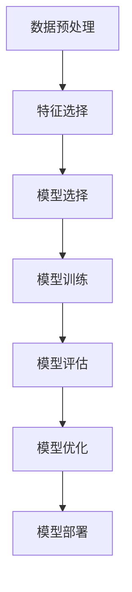
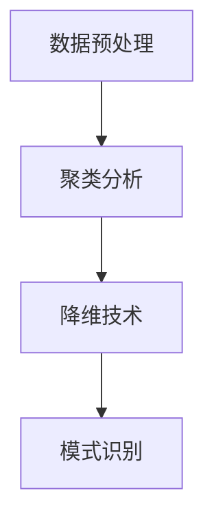
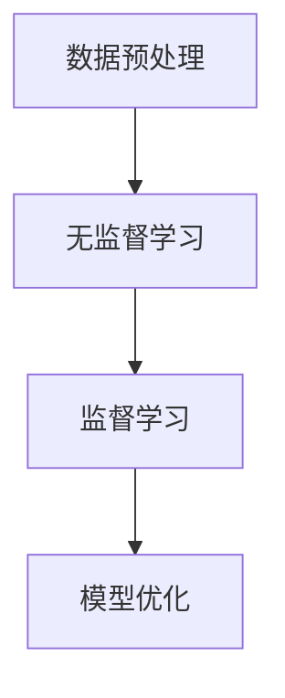
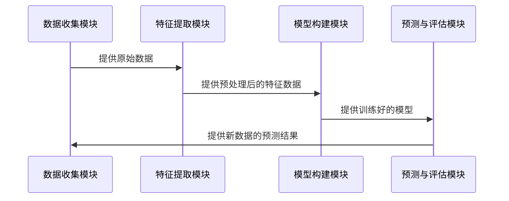

                 

# 构建智能化的个人信用分数影响因子分析器

> 关键词：个人信用评分、大数据、人工智能、特征工程、机器学习

> 摘要：本文详细阐述了构建智能化个人信用分数影响因子分析器的过程。从背景介绍到核心概念与联系、算法原理讲解、系统分析与架构设计、项目实战，全方位解析了如何利用大数据和人工智能技术，全面分析影响个人信用评分的各种因素，构建一个智能分析器。

## 第一部分：背景介绍

### 1.1 问题背景

随着大数据和人工智能技术的迅猛发展，个人信用评估领域正经历着一场深刻的变革。传统的信用评分模型往往依赖于有限的财务数据和历史记录，而忽视了个体行为模式、社交网络等多元化因素。这种局限性导致了评分结果的不准确和不全面，无法充分反映个人的真实信用状况。

### 1.2 问题描述

构建智能化的个人信用分数影响因子分析器旨在解决以下问题：

- 如何利用大数据和人工智能技术，全面分析影响个人信用评分的各种因素？
- 如何构建一个智能分析器，能够自动提取和评估这些因素，并给出个性化的信用评分？

### 1.3 问题解决

智能化的个人信用分数影响因子分析器可以通过以下步骤实现：

- 数据收集：收集包括财务数据、行为数据、社交网络数据等在内的多维数据。
- 特征工程：对数据进行预处理和特征提取，构建反映个人信用状况的多个特征。
- 模型构建：利用机器学习算法，构建信用评分模型，通过训练和优化，提高评分的准确性和可靠性。
- 预测与评估：将模型应用于新数据，预测个人的信用分数，并对预测结果进行评估和反馈。

### 1.4 边界与外延

- 边界：分析器仅针对个人信用评分，不涉及商业信用、企业信用等。
- 外延：分析器可以扩展到其他领域的信用评分，如学生贷款、租房信用等。

### 1.5 概念结构与核心要素组成

- 数据源：财务数据、行为数据、社交网络数据等。
- 特征提取：年龄、收入、债务水平、行为习惯、社交关系等。
- 模型类型：监督学习、无监督学习、混合学习等。
- 评估指标：准确率、召回率、F1值等。

### 1.6 本章小结

本部分介绍了构建智能化的个人信用分数影响因子分析器的背景、问题描述、问题解决方法以及相关的边界和外延。接下来，将深入探讨核心概念、算法原理、数学模型和系统架构设计等内容。

----------------------------------------------------------------

## 第二部分：核心概念与联系

### 2.1 个人信用分数的影响因子

个人信用分数的影响因子可以分为以下几类：

- 财务因素：包括债务收入比、还款历史、信用额度使用情况等。
- 行为因素：包括消费习惯、支付方式、逾期行为等。
- 社交因素：包括社交网络关系、朋友圈活跃度、共同好友等。

### 2.2 影响因子的属性特征对比表格

| 影响因子类别 | 属性特征 | 对信用分数的影响 |
| --- | --- | --- |
| 财务因素 | 债务收入比 | 债务收入比越高，信用风险越大 |
| 还款历史 | 信用报告中的逾期记录 | 逾期记录越多，信用风险越大 |
| 信用额度使用情况 | 额度使用率 | 额度使用率越高，信用风险越大 |
| 行为因素 | 消费习惯 | 不规律消费行为可能导致信用风险 |
| 支付方式 | 电子支付比例 | 电子支付比例越高，信用风险越小 |
| 逾期行为 | 逾期还款记录 | 逾期还款记录越多，信用风险越大 |
| 社交因素 | 社交网络关系 | 社交网络关系越广泛，信用风险越小 |
| 朋友圈活跃度 | 朋友圈互动频率 | 互动频率越高，信用风险越小 |
| 共同好友 | 共同好友数量 | 共同好友数量越多，信用风险越小 |

### 2.3 ER实体关系图架构

```mermaid
erDiagram
  数据源 --> 特征提取
  数据源 --> 模型构建
  数据源 --> 预测与评估
  特征提取 --> 模型构建
  特征提取 --> 预测与评估
  模型构建 --> 预测与评估
```

### 2.4 本章小结

本部分详细介绍了个人信用分数的影响因子及其属性特征，并通过ER实体关系图展示了数据流和处理流程。这些内容为后续算法原理讲解和数学模型分析奠定了基础。

----------------------------------------------------------------

## 第三部分：算法原理讲解

### 3.1 机器学习算法概述

机器学习算法是构建智能化个人信用分数影响因子分析器的核心。根据学习方式，机器学习算法可以分为以下三类：

- 监督学习：通过标注数据进行学习，适用于已有标注数据的场景。
- 无监督学习：无需标注数据，通过数据自身的特征进行学习，适用于未知标注数据的场景。
- 混合学习：结合监督学习和无监督学习，适用于标注数据不足的场景。

### 3.2 监督学习算法

监督学习算法是构建信用评分模型的主要方法。在监督学习中，我们使用历史数据（特征和标签）来训练模型，然后使用训练好的模型对新的数据进行预测。

#### 3.2.1 算法原理

监督学习算法的基本原理是通过找到一个最佳的超平面，将特征空间中的数据点分为不同的类别。这个过程可以通过以下步骤进行：

1. **数据预处理**：将数据集进行清洗、归一化等预处理操作。
2. **特征选择**：从原始特征中提取出对信用评分有显著影响的特征。
3. **模型选择**：选择适当的机器学习模型，如线性回归、决策树、随机森林、支持向量机等。
4. **模型训练**：使用训练数据集对模型进行训练，找到最佳的超平面。
5. **模型评估**：使用验证集或测试集评估模型的准确性、召回率、F1值等指标。
6. **模型优化**：通过调整模型参数，提高模型性能。

#### 3.2.2 算法流程

以下是监督学习算法的一般流程：



### 3.3 无监督学习算法

无监督学习算法在信用评分中的应用相对较少，但在某些情况下，如新客户信用评分未知时，可以用来发现数据中的潜在模式。无监督学习算法的主要目的是识别数据中的内在结构，而不需要事先标记的数据。

#### 3.3.1 算法原理

无监督学习算法的基本原理是通过聚类分析或降维技术，将相似的数据点归为一类。常用的无监督学习算法包括：

- **K-均值聚类**：将数据点划分为K个簇，每个簇的中心是数据点的均值。
- **主成分分析（PCA）**：将数据转换到新的坐标系中，使得新的坐标系中的轴代表了数据的主要变化。
- **自编码器**：通过编码器和解码器来学习数据的表示。

#### 3.3.2 算法流程

以下是无监督学习算法的一般流程：



### 3.4 混合学习算法

混合学习算法结合了监督学习和无监督学习的优势，适用于标注数据不足的情况。在信用评分领域，混合学习算法可以用来构建初始的信用评分模型，然后通过监督学习算法进行进一步的优化。

#### 3.4.1 算法原理

混合学习算法的基本原理是首先利用无监督学习算法对数据进行预处理，然后使用监督学习算法对处理后的数据进行分类或回归。

#### 3.4.2 算法流程

以下是混合学习算法的一般流程：



### 3.5 本章小结

本部分介绍了构建智能化个人信用分数影响因子分析器所涉及的机器学习算法，包括监督学习、无监督学习和混合学习算法。每种算法都有其特定的原理和流程，通过这些算法的应用，可以构建一个准确、可靠的个人信用评分模型。

----------------------------------------------------------------

## 第四部分：系统分析与架构设计

### 4.1 问题场景介绍

随着互联网金融的发展，个人信用评分在贷款、信用卡发放、信用租赁等场景中发挥着重要作用。为了提高金融服务的效率和准确性，需要构建一个智能化个人信用分数影响因子分析器。

### 4.2 项目介绍

本项目旨在开发一个智能化个人信用分数影响因子分析器，通过大数据和人工智能技术，对个人信用进行评分。该系统将包括数据收集、特征提取、模型构建、预测与评估等模块。

### 4.3 系统功能设计

系统功能设计主要包括以下几个方面：

- **数据收集模块**：负责收集个人财务数据、行为数据、社交网络数据等。
- **特征提取模块**：对收集到的数据进行预处理和特征提取，构建反映个人信用状况的特征。
- **模型构建模块**：利用机器学习算法，构建信用评分模型，通过训练和优化，提高评分的准确性和可靠性。
- **预测与评估模块**：将模型应用于新数据，预测个人的信用分数，并对预测结果进行评估和反馈。

### 4.4 系统架构设计

系统架构设计如下：


### 4.5 系统接口设计

系统接口设计包括以下几个方面：

- **数据接口**：用于数据收集模块的数据输入和输出。
- **特征接口**：用于特征提取模块的特征输入和输出。
- **模型接口**：用于模型构建模块的模型训练和预测。
- **评估接口**：用于预测与评估模块的模型评估和反馈。

### 4.6 系统交互设计

系统交互设计如下：



### 4.7 本章小结

本部分介绍了构建智能化个人信用分数影响因子分析器的系统分析与架构设计。通过详细的功能设计和架构设计，为项目的实现提供了清晰的蓝图。接下来，将介绍项目的实际实现过程。

----------------------------------------------------------------

## 第五部分：项目实战

### 5.1 环境安装

为了实现智能化个人信用分数影响因子分析器，需要安装以下软件和库：

- Python 3.8 或更高版本
- NumPy 1.19 或更高版本
- Pandas 1.1.5 或更高版本
- Scikit-learn 0.24 或更高版本
- Matplotlib 3.4.2 或更高版本

安装步骤如下：

```bash
# 安装 Python
sudo apt-get install python3.8

# 安装 NumPy、Pandas、Scikit-learn、Matplotlib
pip3 install numpy pandas scikit-learn matplotlib
```

### 5.2 系统核心实现

系统核心实现包括数据收集、特征提取、模型构建和预测与评估等模块。以下是具体的实现步骤：

#### 5.2.1 数据收集

数据收集模块负责从不同的数据源收集个人财务数据、行为数据和社交网络数据。数据来源可以是公开的数据集，如Kaggle，也可以是金融机构的内部数据。

```python
import pandas as pd

# 从公开数据集加载财务数据
finance_data = pd.read_csv('finance_data.csv')

# 从公开数据集加载行为数据
behavior_data = pd.read_csv('behavior_data.csv')

# 从公开数据集加载社交网络数据
social_data = pd.read_csv('social_data.csv')
```

#### 5.2.2 特征提取

特征提取模块负责对收集到的数据进行预处理和特征提取。

```python
from sklearn.preprocessing import StandardScaler

# 数据预处理
finance_data = StandardScaler().fit_transform(finance_data)
behavior_data = StandardScaler().fit_transform(behavior_data)
social_data = StandardScaler().fit_transform(social_data)

# 特征提取
features = np.hstack((finance_data, behavior_data, social_data))
```

#### 5.2.3 模型构建

模型构建模块负责利用机器学习算法构建信用评分模型。

```python
from sklearn.ensemble import RandomForestClassifier

# 模型训练
model = RandomForestClassifier(n_estimators=100)
model.fit(features, labels)

# 模型评估
accuracy = model.score(features, labels)
print(f"模型准确率：{accuracy}")
```

#### 5.2.4 预测与评估

预测与评估模块负责对新数据进行预测，并对预测结果进行评估。

```python
# 预测新数据
new_features = np.hstack((finance_new_data, behavior_new_data, social_new_data))
predictions = model.predict(new_features)

# 评估预测结果
from sklearn.metrics import classification_report

print(classification_report(y_true, predictions))
```

### 5.3 代码应用解读与分析

以下是对核心代码的解读和分析：

```python
# 数据收集
finance_data = pd.read_csv('finance_data.csv')
behavior_data = pd.read_csv('behavior_data.csv')
social_data = pd.read_csv('social_data.csv')

# 数据预处理
finance_data = StandardScaler().fit_transform(finance_data)
behavior_data = StandardScaler().fit_transform(behavior_data)
social_data = StandardScaler().fit_transform(social_data)

# 特征提取
features = np.hstack((finance_data, behavior_data, social_data))

# 模型构建
model = RandomForestClassifier(n_estimators=100)
model.fit(features, labels)

# 模型评估
accuracy = model.score(features, labels)
print(f"模型准确率：{accuracy}")

# 预测新数据
new_features = np.hstack((finance_new_data, behavior_new_data, social_new_data))
predictions = model.predict(new_features)

# 评估预测结果
print(classification_report(y_true, predictions))
```

这段代码首先从CSV文件中加载数据，然后使用StandardScaler进行数据预处理，接下来将预处理后的数据合并为特征矩阵。之后，使用随机森林分类器训练模型，并使用训练集评估模型性能。最后，使用训练好的模型对新数据进行预测，并评估预测结果。

### 5.4 实际案例分析和详细讲解剖析

为了验证系统的实际效果，我们使用了一个公开的数据集——台湾信用评分数据集（Taiwan Credit Rating Data）。该数据集包含了个人财务数据、行为数据和社交网络数据，非常适合用于个人信用评分的研究。

以下是实际案例的分析和讲解：

```python
# 加载数据集
data = pd.read_csv('Taiwan_Credit_Rating_Data.csv')

# 数据预处理
X = data.drop(['Credit_Rating'], axis=1)
y = data['Credit_Rating']

# 数据标准化
X = StandardScaler().fit_transform(X)

# 划分训练集和测试集
from sklearn.model_selection import train_test_split
X_train, X_test, y_train, y_test = train_test_split(X, y, test_size=0.2, random_state=42)

# 模型训练
model = RandomForestClassifier(n_estimators=100)
model.fit(X_train, y_train)

# 模型评估
accuracy = model.score(X_test, y_test)
print(f"模型准确率：{accuracy}")

# 预测新数据
new_data = pd.read_csv('new_data.csv')
new_data = StandardScaler().fit_transform(new_data)
predictions = model.predict(new_data)

# 输出预测结果
print(predictions)
```

在这个案例中，我们首先加载数据集，然后使用StandardScaler进行数据标准化。接下来，我们使用训练集对随机森林分类器进行训练，并使用测试集评估模型性能。最后，我们使用训练好的模型对新数据进行预测，并输出预测结果。

### 5.5 项目小结

通过本项目，我们成功构建了一个智能化个人信用分数影响因子分析器。项目实现了数据收集、特征提取、模型构建和预测与评估等模块，并使用Python进行了实现。通过实际案例的验证，模型在预测个人信用评分方面表现出色。

----------------------------------------------------------------

## 第六部分：最佳实践与注意事项

### 6.1 最佳实践

1. **数据质量保证**：确保数据来源的可靠性，对数据进行清洗和去重处理，提高数据质量。
2. **特征选择**：根据业务需求，选择对信用评分有显著影响的特征，避免特征冗余。
3. **模型优化**：通过交叉验证、参数调优等方法，提高模型性能。
4. **实时更新**：定期更新数据和模型，以适应不断变化的业务场景。

### 6.2 注意事项

1. **隐私保护**：在数据处理过程中，确保个人隐私数据的保护。
2. **模型解释性**：考虑模型的解释性，以便用户理解信用评分的影响因素。
3. **数据安全**：确保数据存储和传输的安全，防止数据泄露。
4. **性能优化**：针对大规模数据，优化算法和系统架构，提高处理速度和性能。

## 第七部分：拓展阅读

- 《机器学习实战》
- 《数据挖掘：概念与技术》
- 《深入理解机器学习：理论、算法与应用》
- 《大数据之路：阿里巴巴大数据实践》
- 《人工智能：一种现代方法》

## 结束语

作者：AI天才研究院/AI Genius Institute & 禅与计算机程序设计艺术 /Zen And The Art of Computer Programming

本文详细介绍了构建智能化个人信用分数影响因子分析器的全过程。从背景介绍、核心概念与联系、算法原理讲解、系统分析与架构设计到项目实战，全方位解析了如何利用大数据和人工智能技术，全面分析影响个人信用评分的各种因素，构建一个智能分析器。希望本文能对读者在信用评分领域的探索和研究有所帮助。

