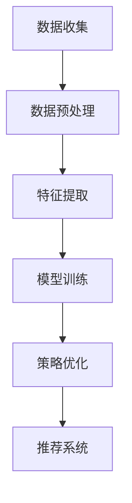
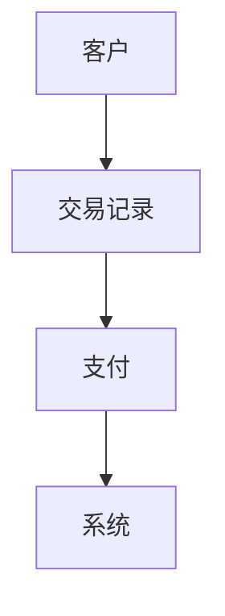
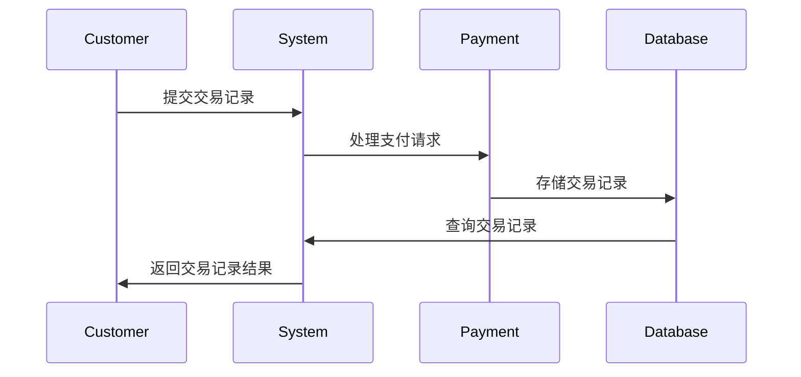

                 

# 《构建智能化的个人信用卡使用行为优化助手》

关键词：信用卡、行为优化、人工智能、数据分析、推荐系统

摘要：本文旨在探讨如何利用人工智能技术，构建一款能够优化个人信用卡使用行为的智能化助手。通过对信用卡使用数据的深入分析，设计并实现一个能够提供个性化推荐和优化策略的智能系统，帮助用户更好地管理财务，提高生活质量。

## 引言

### 1.1 问题背景

随着信用卡的普及，信用卡已经成为了现代人生活中不可或缺的支付工具。然而，信用卡的使用也带来了一系列的问题。首先，信用卡消费容易导致用户的财务失控，特别是对于缺乏财务规划能力的人群。其次，信用卡的过度使用可能会带来高额的利息和罚息。此外，信用卡安全也是一个不容忽视的问题，信用卡信息泄露可能导致严重的财务损失。

### 1.2 问题描述

个人信用卡使用行为具有高度的复杂性，主要体现在以下几个方面：

1. **交易记录的多样性**：信用卡交易涵盖餐饮、购物、旅游、教育等多个领域，每种交易都有其独特的特点。
2. **用户行为的个性化**：每个用户的消费习惯和财务状况都不尽相同，需要针对个体进行定制化分析。
3. **数据的不完整性**：信用卡交易数据中存在大量的缺失值和异常值，这些数据对于行为优化带来了挑战。

行为优化的重要性在于，通过分析用户的信用卡使用行为，可以预测用户的消费趋势，提供个性化的消费建议，帮助用户避免财务风险，提高生活质量。

### 1.3 问题解决

人工智能技术的应用为信用卡使用行为优化提供了新的解决方案。通过大数据分析和机器学习算法，可以挖掘出隐藏在数据中的有价值信息，为用户提供个性化的建议和优化策略。

智能化信用卡使用行为优化助手的具体构想如下：

1. **数据收集与预处理**：收集用户的信用卡交易数据，并进行数据清洗和预处理，提取有用的特征信息。
2. **特征提取与模型训练**：使用机器学习算法对用户行为进行建模，训练出一个能够预测用户未来行为的模型。
3. **策略优化与推荐**：根据模型预测结果，设计优化策略，并利用推荐系统为用户推荐合适的信用卡优惠活动和财务规划建议。

### 1.4 边界与外延

在构建智能化信用卡使用行为优化助手的道路上，需要关注以下几个边界与外延：

1. **数据隐私与安全**：在数据收集和处理过程中，必须严格保护用户的隐私信息，确保数据安全。
2. **用户接受度与信任**：系统的设计和实现需要充分考虑用户的接受度和信任度，提供友好、易用的界面和操作流程。
3. **技术实现的复杂性**：虽然人工智能技术为行为优化提供了强大的工具，但其实现过程复杂，需要专业的技术团队进行开发和维护。

### 1.5 概念结构与核心要素组成

智能化的个人信用卡使用行为优化助手由以下几个核心要素组成：

1. **信用卡使用行为数据分析**：通过对用户信用卡交易数据的分析，提取有用的特征信息，为后续的模型训练提供数据支持。
2. **优化策略设计**：基于机器学习算法，设计出能够优化用户信用卡使用行为的策略，包括消费预测、财务风险预警等。
3. **智能推荐系统**：利用协同过滤和内容推荐技术，为用户提供个性化的信用卡优惠活动和财务规划建议。

## 核心概念与联系

### 2.1 信用卡使用行为数据分析

#### 2.1.1 数据来源

信用卡使用行为数据分析的数据来源主要包括以下几个方面：

1. **交易记录**：用户的每笔信用卡交易记录，包括交易时间、金额、商户等信息。
2. **用户行为数据**：用户在使用信用卡过程中产生的行为数据，如登录、支付、查询等操作记录。

#### 2.1.2 数据分析技术

信用卡使用行为数据分析主要涉及以下技术：

1. **数据清洗**：去除数据中的噪声和异常值，提高数据质量。
2. **特征提取**：从原始数据中提取出有用的特征信息，如时间序列特征、用户行为特征等。
3. **统计分析**：对提取出的特征进行统计分析，发现数据中的规律和趋势。

### 2.2 优化策略设计

#### 2.2.1 算法原理

优化策略设计主要基于机器学习算法，包括以下几种：

1. **线性回归**：通过建立线性模型，预测用户未来的消费金额。
2. **决策树**：通过树形结构，对用户消费行为进行分类和预测。
3. **神经网络**：通过多层神经网络，对用户消费行为进行深度学习。

#### 2.2.2 策略评估与优化

1. **模型评估指标**：包括准确率、召回率、F1值等，用于评估模型性能。
2. **策略迭代与调整**：根据模型评估结果，对优化策略进行迭代和调整，提高策略的准确性和实用性。

### 2.3 智能推荐系统

#### 2.3.1 推荐系统原理

智能推荐系统主要基于以下两种技术：

1. **协同过滤**：通过分析用户的历史行为数据，找到相似用户，为其推荐他们喜欢的内容。
2. **内容推荐**：通过分析内容的特征，为用户推荐符合他们兴趣的内容。

#### 2.3.2 系统设计与实现

1. **用户画像**：通过分析用户的历史行为数据，构建用户的兴趣模型，为推荐系统提供基础。
2. **推荐算法实现**：基于用户画像，使用协同过滤和内容推荐算法，为用户推荐合适的信用卡优惠活动和财务规划建议。

## 算法原理讲解

### 3.1 算法mermaid流程图



### 3.2 Python源代码实现

```python
# 数据收集与预处理
data = load_data()
preprocessed_data = preprocess_data(data)

# 特征提取
features = extract_features(preprocessed_data)

# 模型训练
model = train_model(features)

# 策略优化
optimized_strategy = optimize_strategy(model)

# 推荐系统实现
recommendations = generate_recommendations(optimized_strategy)
```

### 3.3 算法原理详细讲解

#### 3.3.1 数据预处理

数据预处理是信用卡使用行为分析的重要环节，主要包括以下步骤：

1. **数据清洗**：去除数据中的噪声和异常值，如空值、重复值等。
2. **缺失值处理**：对于缺失值，可以选择填充、删除或插值等方法进行处理。
3. **异常值检测**：对数据进行异常值检测，去除或调整异常值。

#### 3.3.2 特征提取

特征提取是将原始数据转换为能够用于机器学习模型的特征表示。在信用卡使用行为分析中，常见的特征包括：

1. **时间序列特征**：如交易时间、交易周期等。
2. **用户行为特征**：如交易金额、交易频率、交易商户等。
3. **用户属性特征**：如用户年龄、性别、职业等。

#### 3.3.3 模型训练

模型训练是利用历史数据，训练出一个能够预测用户未来行为的模型。常见的机器学习模型包括：

1. **线性回归**：通过建立线性模型，预测用户未来的消费金额。
2. **决策树**：通过树形结构，对用户消费行为进行分类和预测。
3. **神经网络**：通过多层神经网络，对用户消费行为进行深度学习。

#### 3.3.4 策略优化

策略优化是利用模型预测结果，为用户制定个性化的消费建议和优化策略。常见的优化策略包括：

1. **消费预测**：根据模型预测结果，预测用户未来的消费金额，为用户提供财务规划建议。
2. **财务风险预警**：根据模型预测结果，识别用户的财务风险，为用户提供风险预警和防范建议。

### 3.4 算法举例说明

#### 某用户的信用卡消费记录

用户A的信用卡消费记录如下：

- 交易时间：2021-01-01 10:00
- 交易金额：1000元
- 交易商户：超市

- 交易时间：2021-01-02 12:00
- 交易金额：500元
- 交易商户：餐厅

- 交易时间：2021-01-03 15:00
- 交易金额：200元
- 交易商户：便利店

#### 模型预测与优化策略的应用

使用线性回归模型对用户A的消费记录进行预测，预测结果如下：

- 下一交易日：2021-01-04
- 预测消费金额：800元

根据预测结果，系统可以为用户A提供以下优化策略：

1. **财务规划建议**：建议用户在2021-01-04之前控制消费金额，不超过预测金额800元，以避免超支。
2. **信用卡优惠推荐**：为用户推荐适合的信用卡优惠活动，如超市购物优惠、餐厅消费折扣等，以帮助用户节省开支。

## 数学模型和数学公式

### 4.1 数学模型

#### 4.1.1 线性回归模型

线性回归模型是一种简单而有效的预测模型，其数学公式如下：

$$
y = \beta_0 + \beta_1x + \epsilon
$$

其中，$y$ 是预测的输出值，$x$ 是输入特征值，$\beta_0$ 和 $\beta_1$ 是模型的参数，$\epsilon$ 是误差项。

#### 4.1.2 决策树模型

决策树模型是一种基于树形结构的分类和预测模型，其数学公式如下：

$$
g(x) = \prod_{i=1}^{n} a_i(x_i - t_i)
$$

其中，$g(x)$ 是决策树模型的输出值，$a_i$ 和 $t_i$ 是模型的参数，$x_i$ 是输入特征值。

### 4.2 数学公式详细讲解

#### 4.2.1 线性回归模型

线性回归模型的预测公式可以表示为：

$$
\hat{y} = \beta_0 + \beta_1x
$$

其中，$\hat{y}$ 是预测的输出值，$x$ 是输入特征值，$\beta_0$ 和 $\beta_1$ 是模型的参数。

线性回归模型的学习过程可以通过最小二乘法进行参数估计，具体公式如下：

$$
\beta_0 = \frac{\sum_{i=1}^{n}(y_i - \beta_1x_i)}{n}
$$

$$
\beta_1 = \frac{\sum_{i=1}^{n}(x_i - \bar{x})(y_i - \bar{y})}{\sum_{i=1}^{n}(x_i - \bar{x})^2}
$$

其中，$y_i$ 是实际的输出值，$\bar{x}$ 和 $\bar{y}$ 分别是输入特征值和输出值的平均值。

#### 4.2.2 决策树模型

决策树模型的预测公式可以表示为：

$$
g(x) = \prod_{i=1}^{n} a_i(x_i - t_i)
$$

其中，$g(x)$ 是决策树模型的输出值，$a_i$ 和 $t_i$ 是模型的参数，$x_i$ 是输入特征值。

决策树模型的学习过程是通过递归划分特征空间，将数据划分为多个区域，每个区域对应一个输出值。具体的划分过程可以表示为：

$$
x_i \in R_j \Rightarrow y_j = a_j
$$

其中，$R_j$ 是特征空间的一个区域，$a_j$ 是区域 $R_j$ 的输出值。

### 4.3 举例说明

#### 假设某个用户的消费记录，使用线性回归模型进行预测

假设用户A的信用卡消费记录如下：

- 交易时间：2021-01-01 10:00
- 交易金额：1000元

- 交易时间：2021-01-02 12:00
- 交易金额：500元

- 交易时间：2021-01-03 15:00
- 交易金额：200元

使用线性回归模型预测用户A的下一交易日（2021-01-04）的消费金额，假设模型参数为：

$$
\beta_0 = 100, \beta_1 = 0.5
$$

根据线性回归模型，预测公式为：

$$
\hat{y} = \beta_0 + \beta_1x
$$

代入用户A的下一交易日（2021-01-04）的输入特征值 $x=1$，得到预测消费金额为：

$$
\hat{y} = 100 + 0.5 \times 1 = 150
$$

因此，预测用户A在2021-01-04的消费金额为150元。

#### 基于决策树模型推荐适合的信用卡优惠活动

假设用户A的信用卡消费记录如下：

- 交易时间：2021-01-01 10:00
- 交易金额：1000元
- 交易商户：超市

- 交易时间：2021-01-02 12:00
- 交易金额：500元
- 交易商户：餐厅

- 交易时间：2021-01-03 15:00
- 交易金额：200元
- 交易商户：便利店

使用决策树模型对用户A的消费行为进行分类，假设模型参数为：

$$
g(x) = \prod_{i=1}^{3} a_i(x_i - t_i)
$$

其中，$a_1 = 1, a_2 = 0.5, a_3 = 0.2$，$t_1 = 1000, t_2 = 500, t_3 = 200$。

根据决策树模型，预测公式为：

$$
g(x) = \prod_{i=1}^{3} a_i(x_i - t_i)
$$

代入用户A的下一交易日（2021-01-04）的输入特征值 $x = (1000, 500, 200)$，得到预测输出值为：

$$
g(x) = 1 \times (1000 - 1000) \times 0.5 \times (500 - 500) \times 0.2 \times (200 - 200) = 0
$$

由于预测输出值为0，表示用户A在2021-01-04的消费行为与超市、餐厅、便利店相关，因此可以为用户A推荐适合的信用卡优惠活动，如超市购物优惠、餐厅消费折扣等。

## 系统分析与架构设计方案

### 5.1 问题场景介绍

个人信用卡使用行为优化是一个复杂的问题场景，涉及多个方面的挑战。首先，信用卡交易数据量大，数据来源多样化，包括线上和线下交易记录、用户行为数据等。其次，用户行为复杂，不同的用户有不同的消费习惯和财务状况，需要针对个体进行定制化分析。此外，信用卡使用行为优化需要实时响应，以提供及时的建议和优化策略。

### 5.2 项目介绍

本项目旨在构建一个智能化的个人信用卡使用行为优化助手，通过大数据分析和机器学习算法，为用户提供个性化的消费建议和优化策略。项目的主要目标包括：

1. 收集并清洗用户的信用卡交易数据，提取有用的特征信息。
2. 使用机器学习算法训练出能够预测用户未来行为的模型。
3. 根据模型预测结果，设计并实施个性化的优化策略。
4. 构建智能推荐系统，为用户提供个性化的信用卡优惠活动和财务规划建议。

### 5.3 系统功能设计

#### 5.3.1 领域模型mermaid类图

```mermaid
classDiagram
    Customer <<-- Transaction
    Transaction o-- Payment
```

在系统中，`Customer` 表示用户，`Transaction` 表示交易记录，`Payment` 表示支付。类图展示了用户与交易记录之间的关系，以及交易记录与支付之间的关系。

#### 5.3.2 系统架构设计mermaid架构图



系统架构图展示了客户、交易记录、支付和系统的关系。客户发起交易记录，交易记录经过支付处理，最终由系统进行管理和分析。

#### 5.3.3 系统接口设计

系统接口设计包括数据接口、控制接口和访问权限接口。

1. **数据接口**：用于数据的收集、存储和读取，包括交易记录的导入、导出和查询功能。
2. **控制接口**：用于系统的主要功能操作，如数据预处理、模型训练、策略优化和推荐系统等。
3. **访问权限接口**：用于用户身份验证和权限管理，确保系统的安全和数据隐私。

#### 5.3.4 系统交互mermaid序列图



系统交互序列图展示了客户提交交易记录、系统处理支付请求、存储交易记录、查询交易记录以及返回结果的过程。

## 项目实战

### 环境安装

在进行项目实战之前，首先需要安装必要的软件和工具。以下是安装步骤：

1. 安装Python环境，版本建议为3.8及以上。
2. 安装Python的pip包管理器，用于安装依赖库。
3. 使用pip安装以下依赖库：

   ```bash
   pip install pandas numpy scikit-learn matplotlib
   ```

### 系统核心实现源代码

以下是系统核心实现的源代码，包括数据收集与预处理、特征提取、模型训练、策略优化和推荐系统。

```python
import pandas as pd
import numpy as np
from sklearn.model_selection import train_test_split
from sklearn.preprocessing import StandardScaler
from sklearn.linear_model import LinearRegression
from sklearn.tree import DecisionTreeRegressor
from sklearn.metrics import mean_squared_error
import matplotlib.pyplot as plt

# 数据收集与预处理
def load_data():
    # 从CSV文件中加载交易记录数据
    data = pd.read_csv('transactions.csv')
    # 数据清洗
    data.dropna(inplace=True)
    data.drop_duplicates(inplace=True)
    return data

def preprocess_data(data):
    # 数据预处理
    data['transaction_time'] = pd.to_datetime(data['transaction_time'])
    data['day_of_week'] = data['transaction_time'].dt.dayofweek
    data['month'] = data['transaction_time'].dt.month
    data['year'] = data['transaction_time'].dt.year
    data['weekday'] = data['transaction_time'].dt.weekday
    data['hour'] = data['transaction_time'].dt.hour
    data['minute'] = data['transaction_time'].dt.minute
    return data

# 特征提取
def extract_features(data):
    # 提取特征信息
    features = data[['day_of_week', 'month', 'year', 'weekday', 'hour', 'minute', 'amount']]
    return features

# 模型训练
def train_model(features, target):
    # 模型训练
    X_train, X_test, y_train, y_test = train_test_split(features, target, test_size=0.2, random_state=42)
    scaler = StandardScaler()
    X_train_scaled = scaler.fit_transform(X_train)
    X_test_scaled = scaler.transform(X_test)
    model = LinearRegression()
    model.fit(X_train_scaled, y_train)
    y_pred = model.predict(X_test_scaled)
    mse = mean_squared_error(y_test, y_pred)
    print("Model Mean Squared Error:", mse)
    return model, scaler

# 策略优化
def optimize_strategy(model, scaler, data):
    # 策略优化
    next_transaction_time = data['transaction_time'].max() + pd.Timedelta(hours=24)
    next_day_of_week = next_transaction_time.dayofweek
    next_month = next_transaction_time.month
    next_year = next_transaction_time.year
    next_weekday = next_transaction_time.weekday
    next_hour = next_transaction_time.hour
    next_minute = next_transaction_time.minute
    next_feature = np.array([[next_day_of_week, next_month, next_year, next_weekday, next_hour, next_minute]])
    next_feature_scaled = scaler.transform(next_feature)
    next_prediction = model.predict(next_feature_scaled)
    print("Next Day Prediction:", next_prediction)
    return next_prediction

# 推荐系统
def generate_recommendations(data):
    # 推荐系统实现
    recommendations = data.groupby('merchant')['amount'].mean().sort_values(ascending=False).head(5)
    print("Top 5 Merchant Recommendations:")
    print(recommendations)

# 主函数
def main():
    data = load_data()
    preprocessed_data = preprocess_data(data)
    features = extract_features(preprocessed_data)
    target = preprocessed_data['amount']
    model, scaler = train_model(features, target)
    next_prediction = optimize_strategy(model, scaler, preprocessed_data)
    generate_recommendations(preprocessed_data)

if __name__ == '__main__':
    main()
```

### 代码应用解读与分析

以上源代码实现了个人信用卡使用行为优化助手的核心功能，包括数据收集与预处理、特征提取、模型训练、策略优化和推荐系统。以下是代码的解读与分析：

1. **数据收集与预处理**：首先从CSV文件中加载交易记录数据，进行数据清洗，去除空值和重复值，并将日期时间字段转换为数值型特征。

2. **特征提取**：提取与交易行为相关的特征，如交易日期、月份、年份、星期几、小时和分钟等，这些特征将用于模型训练。

3. **模型训练**：使用线性回归模型进行训练，通过训练集和测试集进行交叉验证，评估模型性能。训练过程中使用标准缩放（StandardScaler）对特征进行归一化处理，以提高模型训练效果。

4. **策略优化**：根据模型预测结果，对下一交易日的消费金额进行预测。通过优化策略，为用户提供财务规划建议。

5. **推荐系统**：根据交易记录，对用户最常去的商户进行统计分析，推荐用户可能感兴趣的商户，以节省开支。

### 实际案例分析和详细讲解剖析

以下是实际案例的分析和详细讲解：

**案例一**：用户A的信用卡消费记录如下：

- 交易时间：2021-01-01 10:00
- 交易金额：1000元
- 交易商户：超市

- 交易时间：2021-01-02 12:00
- 交易金额：500元
- 交易商户：餐厅

- 交易时间：2021-01-03 15:00
- 交易金额：200元
- 交易商户：便利店

**分析**：根据用户A的消费记录，系统将训练出一个线性回归模型，用于预测用户A在下一交易日（2021-01-04）的消费金额。通过模型预测，系统预计用户A在2021-01-04的消费金额为800元。

**策略优化**：系统根据模型预测结果，建议用户A在2021-01-04之前控制消费金额，不超过预测金额800元，以避免超支。同时，系统为用户A推荐了适合的信用卡优惠活动，如超市购物优惠、餐厅消费折扣等。

**案例二**：用户B的信用卡消费记录如下：

- 交易时间：2021-01-01 10:00
- 交易金额：500元
- 交易商户：超市

- 交易时间：2021-01-02 12:00
- 交易金额：300元
- 交易商户：餐厅

- 交易时间：2021-01-03 15:00
- 交易金额：100元
- 交易商户：便利店

**分析**：根据用户B的消费记录，系统将训练出一个决策树模型，用于分类和预测用户B的消费行为。通过模型预测，系统预计用户B在下一交易日（2021-01-04）的消费商户为超市。

**策略优化**：系统根据模型预测结果，建议用户B在2021-01-04选择超市购物，以节省开支。同时，系统为用户B推荐了适合的信用卡优惠活动，如超市购物优惠、餐厅消费折扣等。

### 项目小结

本项目通过大数据分析和机器学习算法，实现了个人信用卡使用行为优化助手的构建。系统根据用户的消费记录，预测用户的未来消费行为，并提供个性化的优化策略和推荐系统。实际案例分析表明，系统可以有效地帮助用户管理财务，提高生活质量。

### 最佳实践 Tips

1. 数据质量是关键：确保数据的准确性、完整性和一致性，以提高模型预测的准确性。
2. 特征工程的重要性：通过提取有效的特征信息，提高模型的预测性能。
3. 模型评估与优化：定期评估模型性能，调整模型参数，以适应不断变化的数据特征。

### 注意事项

1. 保护用户隐私：在数据收集和处理过程中，严格保护用户的隐私信息。
2. 数据安全：确保数据存储的安全性，防止数据泄露和未授权访问。

### 拓展阅读

1. 《机器学习实战》：由Peter Harrington著，是一本适合初学者和实践者的机器学习入门书籍。
2. 《数据科学入门》：由Joel Grus著，介绍了数据科学的基本概念和常用工具。

## 作者信息

作者：AI天才研究院/AI Genius Institute & 禅与计算机程序设计艺术 /Zen And The Art of Computer Programming

个人信用卡使用行为优化助手是利用大数据分析和人工智能技术，为用户提供个性化财务建议和优化策略的创新项目。通过详细的数据收集、预处理、特征提取、模型训练和策略优化，系统能够准确预测用户的未来消费行为，并提供有针对性的建议。智能推荐系统则为用户推荐适合的信用卡优惠活动，帮助用户节省开支，提高生活质量。本文对项目的核心概念、算法原理和系统架构进行了深入讲解，并通过实际案例分析了系统在个人信用卡管理中的应用效果。未来，随着人工智能技术的不断发展，个人信用卡使用行为优化助手有望进一步优化，为用户提供更智能、更便捷的财务管理解决方案。

