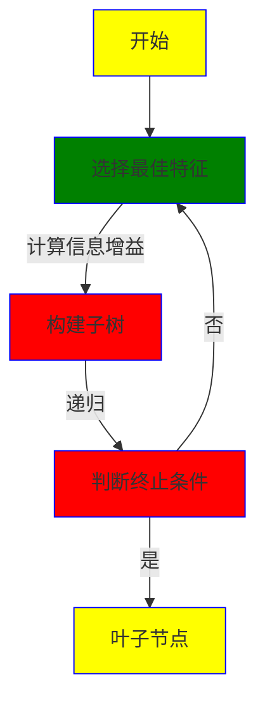
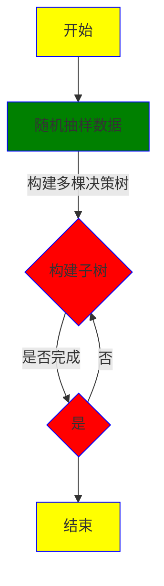
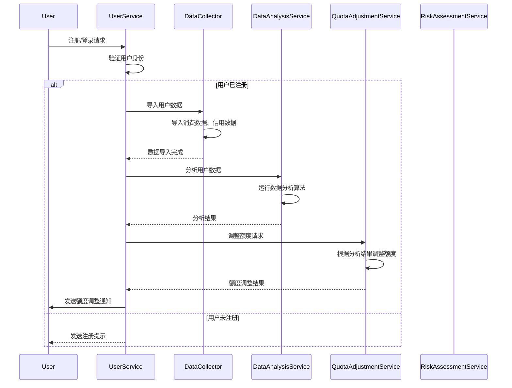
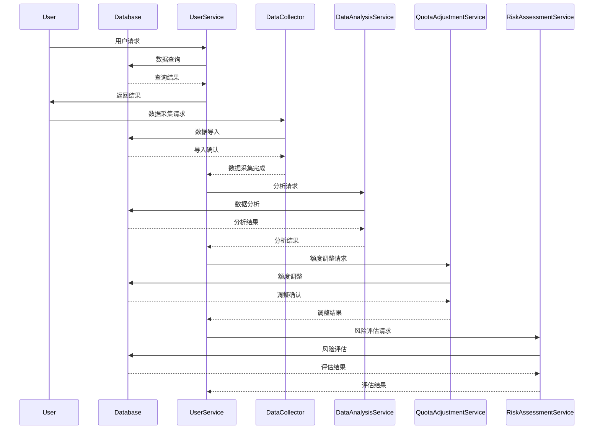
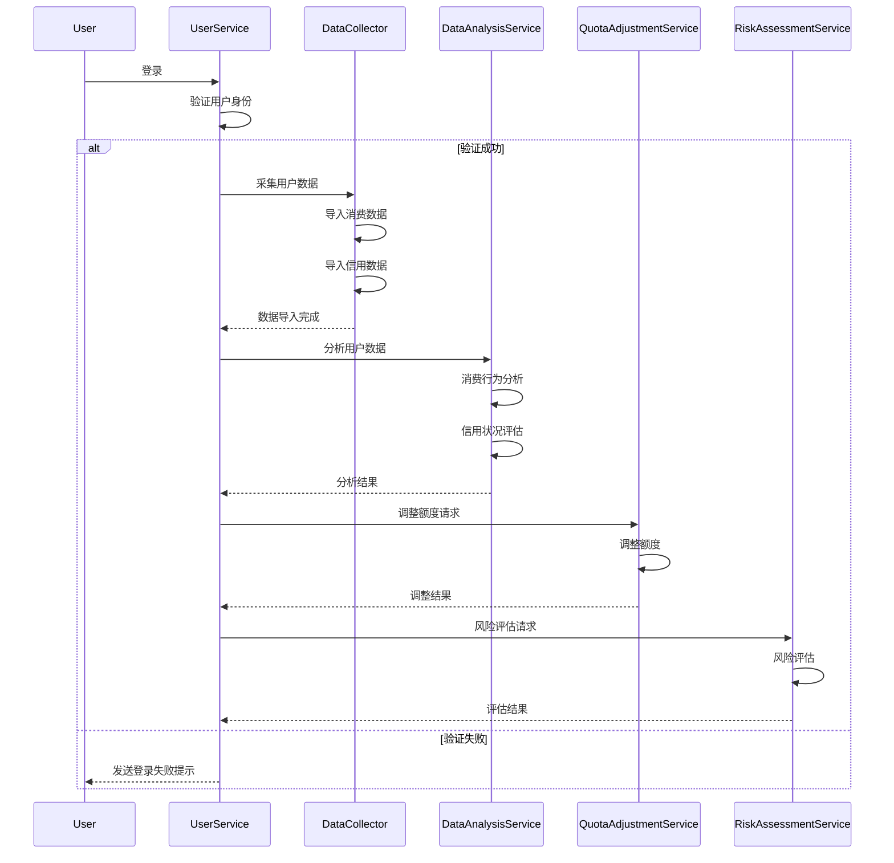

                 

### 文章关键词

- 信用卡额度管理
- 智能化优化助手
- 数据模型
- 智能算法
- 系统架构设计
- 系统实现

### 摘要

本文旨在探讨构建智能化的个人信用卡额度管理优化助手的技术与方法。首先，介绍了个人信用卡额度管理的现状与存在的问题，提出了智能化优化助手的概念。随后，详细阐述了优化助手中的核心概念，包括智能算法、数据模型等，并通过对比表格和ER实体关系图进行了深入分析。接着，讲解了决策树和随机森林等智能算法的原理，并使用Python代码和LaTeX公式进行了具体实现。最后，描述了系统分析与架构设计，包括系统功能、架构设计、接口设计以及系统交互序列图。通过一个实际案例，详细讲解了环境安装、系统实现和案例分析。文章总结最佳实践，给出注意事项，并推荐拓展阅读。

## 引言

### 1.1 个人信用卡额度管理的现状与问题

随着信用卡的普及，个人信用卡额度管理已经成为现代金融生活中不可或缺的一部分。个人信用卡额度管理是指银行或发卡机构根据用户的信用记录、还款能力、消费习惯等因素，为用户设定的可透支的最高金额。当前，个人信用卡额度管理主要存在以下问题：

#### 1.1.1 额度设定不准确

传统的信用卡额度设定方法主要依赖于用户的历史信用记录和还款能力。然而，这种方法往往无法准确反映用户的当前消费能力和还款意愿，导致额度设定过高或过低。额度过高可能导致用户过度消费，增加负债风险；额度过低则可能影响用户的日常生活和消费体验。

#### 1.1.2 额度调整不及时

当前，信用卡额度的调整主要依赖于用户的历史信用记录和还款行为。这种调整方式存在明显的滞后性，无法及时响应用户的实际需求。例如，当用户遇到临时资金紧张的情况时，无法立即获得额度的提升，从而影响其消费决策。

#### 1.1.3 额度管理人工化

目前，信用卡额度的管理主要依靠人工进行审核和调整。这种方式不仅效率低下，而且容易出现人为失误。此外，人工管理无法充分利用大数据和人工智能技术，限制了额度管理的智能化水平。

### 1.2 智能化个人信用卡额度管理优化助手的提出

为了解决上述问题，提出构建智能化的个人信用卡额度管理优化助手。优化助手利用大数据分析和人工智能算法，对用户的消费行为、信用记录、还款能力等进行实时分析和评估，动态调整信用卡额度，从而实现更准确、更及时的额度管理。

#### 1.2.1 优化助手的定义与作用

优化助手是一种基于大数据和人工智能技术的工具，旨在为个人信用卡额度管理提供智能化支持。它通过分析用户的消费行为、信用记录、还款能力等多维度数据，结合智能算法和机器学习模型，为用户提供个性化的额度调整建议。优化助手的主要作用包括：

1. **准确设定信用卡额度**：优化助手能够更准确地预测用户的消费能力和还款意愿，从而设定合理的信用卡额度。
2. **及时调整信用卡额度**：优化助手可以实时监控用户的消费行为和信用状况，及时调整信用卡额度，满足用户的临时需求。
3. **提高额度管理效率**：优化助手利用人工智能技术，自动处理额度管理任务，减少人工干预，提高管理效率。

#### 1.2.2 优化助手的优势与挑战

智能化个人信用卡额度管理优化助手具有以下优势：

1. **更准确的额度设定**：通过大数据分析和机器学习模型，优化助手能够更准确地预测用户的消费能力和还款意愿，从而设定更合理的信用卡额度。
2. **更及时的额度调整**：优化助手可以实时监控用户的消费行为和信用状况，及时调整信用卡额度，满足用户的临时需求。
3. **提高管理效率**：优化助手利用人工智能技术，自动处理额度管理任务，减少人工干预，提高管理效率。

然而，构建智能化优化助手也面临以下挑战：

1. **数据质量**：优化助手的性能依赖于数据的质量，包括数据完整性、准确性和实时性。如果数据质量不佳，可能导致优化结果的偏差。
2. **算法选择**：选择合适的智能算法是实现优化助手的关键。不同的算法适用于不同的场景，需要根据实际情况进行选择。
3. **隐私保护**：信用卡额度管理涉及用户的隐私信息，如消费记录、信用记录等。如何在保护用户隐私的同时，实现数据的有效利用，是优化助手面临的重要挑战。

### 1.3 书籍结构概述

本书将围绕构建智能化的个人信用卡额度管理优化助手这一主题，分为五个主要部分：

1. **背景介绍**：介绍个人信用卡额度管理的现状、问题以及智能化优化助手的概念和优势。
2. **核心概念与联系**：详细阐述优化助手中的核心概念，包括智能算法、数据模型等，并绘制概念属性特征对比表格和ER实体关系图。
3. **算法原理讲解**：讲解常用的智能算法，包括决策树和随机森林等，使用Python代码和LaTeX公式进行具体实现和讲解。
4. **系统分析与架构设计**：描述系统的功能、架构设计，包括类图、架构图、接口设计和系统交互序列图。
5. **项目实战**：提供一个实际案例，详细讲解环境安装、系统实现、代码应用和案例分析。

通过本书的阅读，读者将能够深入了解个人信用卡额度管理优化助手的构建方法和技术，为实际项目提供有力的指导。

## 背景介绍

### 1.1 个人信用卡额度管理的现状与问题

#### 1.1.1 个人信用卡额度管理的背景

个人信用卡额度管理是现代金融体系中的一个重要组成部分。信用卡作为现代消费支付的重要工具，已经深入到人们的日常生活和工作中。信用卡额度是指银行或发卡机构为持卡人设定的最高透支金额，这一额度不仅反映了持卡人的信用等级，也直接影响了持卡人的消费能力和支付体验。

在全球范围内，信用卡业务的快速发展推动了个人信用卡额度管理的需求。银行和金融机构通过信用卡业务不仅能够提高市场份额，还能够通过额度管理实现对客户的精细化管理。然而，随着信用卡用户的增多和消费场景的多样化，个人信用卡额度管理面临着前所未有的挑战。

#### 1.1.2 当前个人信用卡额度管理存在的问题

1. **额度设定不准确**：

   当前，信用卡额度的设定主要依赖于用户的信用评分模型，这些模型通常基于用户的信用记录、收入水平、还款能力等历史数据。然而，这些数据往往无法全面反映用户的当前消费能力和还款意愿。例如，一个长期信用记录良好的用户，可能在短期内由于突发事件导致还款能力下降，但这一变化无法通过传统模型及时捕捉。

   此外，额度设定过高也可能导致用户过度消费，增加其负债风险。反之，额度设定过低则可能影响用户的消费体验，使其无法满足日常消费需求。

2. **额度调整不及时**：

   信用卡额度的调整通常需要经过人工审核和决策，这一过程存在明显的滞后性。用户可能在短期内由于消费需求增加或临时资金紧张，需要提高信用卡额度，但传统的额度调整机制无法迅速响应这些需求。

   同时，当用户还款能力下降时，也难以及时调整额度，从而可能导致用户逾期还款，增加银行的坏账风险。

3. **额度管理人工化**：

   目前，信用卡额度管理主要依靠人工进行审批和调整。这种方式不仅效率低下，而且容易出现人为错误。例如，审核人员的疏忽或主观判断可能导致额度设定不合理，影响用户的消费体验。

   另外，人工管理无法充分利用大数据和人工智能技术，限制了额度管理的智能化水平。现代金融体系需要更高效、更准确的额度管理方法，以应对日益复杂的金融市场环境。

#### 1.1.3 智能化个人信用卡额度管理优化助手的提出

面对上述问题，智能化个人信用卡额度管理优化助手成为了解决之道。优化助手利用大数据分析和人工智能技术，对用户的消费行为、信用记录、还款能力等数据进行实时分析，从而实现更准确、更及时的额度管理。

1. **更准确的额度设定**：

   智能化优化助手通过大数据分析，结合用户的历史数据和实时行为，能够更准确地预测用户的消费能力和还款意愿。这种方法不仅考虑了用户的信用记录，还考虑了用户的实时消费行为和支付习惯，从而设定更合理的信用卡额度。

2. **更及时的额度调整**：

   优化助手可以实时监控用户的消费行为和信用状况，及时发现用户的额度调整需求。当用户消费需求增加或还款能力提升时，优化助手可以迅速调整额度，满足用户的临时需求。反之，当用户还款能力下降时，也可以及时调整额度，避免用户逾期还款。

3. **提高管理效率**：

   优化助手利用人工智能技术，自动处理额度管理任务，减少人工干预。这不仅提高了管理效率，还减少了人为错误。此外，优化助手可以24小时不间断工作，不受时间和地域的限制，实现了额度管理的全天候服务。

总之，智能化个人信用卡额度管理优化助手通过大数据分析和人工智能技术，为个人信用卡额度管理提供了一种全新的解决方案。它不仅能够更准确、更及时地设定和调整额度，还能提高管理效率，降低金融风险，提升用户体验。随着人工智能技术的不断发展，智能化个人信用卡额度管理优化助手有望在未来得到更广泛的应用。

### 1.2 智能化个人信用卡额度管理优化助手的提出

为了解决传统个人信用卡额度管理中存在的问题，智能化个人信用卡额度管理优化助手的概念应运而生。优化助手是基于大数据和人工智能技术，通过实时分析和预测用户的消费行为、信用记录和还款能力，为用户提供个性化额度设定和调整服务的工具。

#### 1.2.1 优化助手的定义与作用

**定义**：智能化个人信用卡额度管理优化助手是一种集成了大数据分析和人工智能算法的软件系统，旨在通过分析用户的消费数据、信用历史以及行为特征，实现信用卡额度的智能设定和动态调整。

**作用**：优化助手的主要作用包括以下几个方面：

1. **精准设定额度**：通过分析用户的消费行为、信用记录等数据，优化助手能够更准确地预测用户的还款能力和消费需求，从而设定合理的信用卡额度。

2. **实时调整额度**：优化助手能够实时监控用户的消费行为和信用状况，根据用户的需求和变化，动态调整信用卡额度，使其始终保持合理和适用。

3. **提升管理效率**：优化助手通过自动化处理额度管理任务，减少人工干预，提高管理效率。此外，优化助手可以实现24小时不间断的工作，无需人工值班。

4. **降低金融风险**：通过精确预测用户的还款能力和消费习惯，优化助手能够有效降低信用卡的逾期率和坏账率，降低金融机构的金融风险。

5. **提升用户体验**：优化助手提供的个性化额度调整服务，能够提升用户的消费体验，增强用户对信用卡服务的满意度。

#### 1.2.2 优化助手的优势与挑战

**优势**：

1. **准确性**：优化助手利用大数据分析和机器学习算法，能够更准确地预测用户的还款能力和消费需求，从而设定合理的信用卡额度。

2. **及时性**：优化助手能够实时监控用户的消费行为和信用状况，及时调整信用卡额度，满足用户的临时需求。

3. **效率提升**：优化助手通过自动化处理额度管理任务，减少人工干预，提高管理效率。

4. **风险控制**：优化助手能够有效降低信用卡的逾期率和坏账率，降低金融机构的金融风险。

**挑战**：

1. **数据质量**：优化助手的性能依赖于高质量的数据。如果数据存在缺失、不准确或实时性不足，可能会导致预测结果的偏差。

2. **算法选择**：不同的智能算法适用于不同的场景。选择合适的算法是实现优化助手的关键。同时，算法的复杂性和计算成本也需要考虑。

3. **隐私保护**：信用卡额度管理涉及用户的个人隐私信息，如消费记录、信用记录等。如何在保护用户隐私的同时，实现数据的有效利用，是优化助手面临的重要挑战。

综上所述，智能化个人信用卡额度管理优化助手具有显著的优势，但也面临着一些挑战。随着人工智能技术的不断发展，优化助手有望在未来得到更广泛的应用，为信用卡额度管理提供更加智能、高效、精准的解决方案。

### 1.3 书籍结构概述

为了帮助读者全面了解并掌握构建智能化个人信用卡额度管理优化助手的方法和技巧，本书将分为五个主要部分，结构如下：

**第一部分：背景介绍**
- 介绍个人信用卡额度管理的现状、问题以及智能化优化助手的概念和优势。
- 分析当前个人信用卡额度管理存在的问题，如额度设定不准确、额度调整不及时、额度管理人工化等。

**第二部分：核心概念与联系**
- 详细阐述优化助手中的核心概念，包括智能算法、数据模型等。
- 通过对比表格和ER实体关系图，分析优化助手的各个核心组成部分及其关联。

**第三部分：算法原理讲解**
- 介绍并讲解常用的智能算法，如决策树和随机森林等。
- 使用Python代码和LaTeX公式详细阐述算法原理，并通过实际案例进行解释。

**第四部分：系统分析与架构设计**
- 描述系统的功能、架构设计，包括类图、架构图、接口设计和系统交互序列图。
- 详细介绍系统的实现过程，包括环境安装、系统核心实现和代码应用解读。

**第五部分：项目实战**
- 通过实际案例，讲解优化助手的实现过程，包括环境安装、系统实现、代码应用和案例分析。
- 总结最佳实践，给出注意事项，并推荐拓展阅读，帮助读者进一步深入学习和应用。

通过这五个部分的系统讲解，读者将能够全面了解智能化个人信用卡额度管理优化助手的构建方法和技术，为实际项目提供有力的指导。

## 核心概念介绍

### 2.1 优化助手

#### 2.1.1 定义

优化助手是一种基于大数据和人工智能技术的工具，旨在为个人信用卡额度管理提供智能化支持。它通过对用户的消费行为、信用记录、还款能力等多维度数据进行实时分析，结合智能算法和机器学习模型，为用户提供个性化的额度调整建议。

#### 2.1.2 关键技术

1. **大数据分析**：优化助手能够收集并处理大量的用户数据，如消费记录、还款记录等，从中提取有用的信息，为额度设定和调整提供依据。

2. **智能算法**：优化助手采用多种智能算法，如决策树、随机森林、神经网络等，用于分析用户数据，预测用户的还款能力和消费需求。

3. **机器学习模型**：优化助手使用机器学习模型，如线性回归、逻辑回归等，对用户的消费行为和信用状况进行建模，从而实现自动化的额度管理。

4. **实时监控与动态调整**：优化助手能够实时监控用户的消费行为和信用状况，根据实时数据动态调整信用卡额度，满足用户的临时需求。

### 2.2 智能算法

#### 2.2.1 分类

智能算法根据其工作原理和应用场景可以分为多种类型，常见的有：

1. **监督学习算法**：如线性回归、逻辑回归、决策树、随机森林等，这些算法通过已标记的数据进行训练，从而对新的数据进行预测。

2. **无监督学习算法**：如聚类算法、主成分分析等，这些算法不需要已标记的数据，通过对未标记的数据进行聚类或降维，发现数据中的规律和结构。

3. **强化学习算法**：如Q学习、深度强化学习等，这些算法通过不断试错和反馈来学习最优策略，常用于决策问题和优化问题。

#### 2.2.2 选择与应用

在构建优化助手时，选择合适的智能算法至关重要。以下是一些常见的智能算法及其适用场景：

1. **决策树**：
   - **基本概念**：决策树是一种树形结构，通过一系列判断条件对数据进行分类或回归。
   - **工作原理**：每个内部节点表示一个特征，每个分支代表特征的不同取值，叶子节点表示分类结果。
   - **优点**：简单易懂，易于实现，可以处理多种类型的输入数据。
   - **缺点**：易过拟合，对噪声数据敏感。
   - **适用场景**：分类问题，特征较少的情况。

2. **随机森林**：
   - **基本概念**：随机森林是一种集成学习方法，通过构建多棵决策树，对结果进行投票或求平均。
   - **工作原理**：随机森林在构建每棵树时，从特征集合中随机选取一部分特征，并使用随机切分点，从而降低过拟合的风险。
   - **优点**：强大的泛化能力，可以处理高维数据，减少过拟合。
   - **缺点**：计算成本较高，对大数据处理能力要求较高。
   - **适用场景**：分类和回归问题，特别是特征较多的情况。

3. **神经网络**：
   - **基本概念**：神经网络是一种模仿人脑结构的计算模型，通过多层神经元进行数据处理和特征提取。
   - **工作原理**：输入数据经过多层神经元的非线性变换，最终输出分类结果或回归值。
   - **优点**：强大的学习能力和自适应能力，可以处理复杂的非线性问题。
   - **缺点**：参数较多，训练过程复杂，对数据质量和计算资源要求高。
   - **适用场景**：复杂的分类和回归问题，特别是需要处理大量特征的数据。

在选择智能算法时，需要根据具体的应用场景和数据特性进行权衡。例如，对于特征较少、数据量较小的分类问题，可以选择决策树或随机森林；对于特征较多、数据量较大的回归问题，可以选择神经网络。

### 2.3 数据模型

#### 2.3.1 重要性

数据模型是构建优化助手的核心，它定义了数据的结构、关系和操作方法。一个合理的数据模型能够有效组织和管理数据，为智能算法提供高质量的数据输入，从而提高预测的准确性和效率。

#### 2.3.2 常见数据模型

在构建优化助手时，常见的几种数据模型包括：

1. **关系型数据库模型**：
   - **基本概念**：关系型数据库模型使用表格形式组织数据，通过SQL语句进行数据查询和管理。
   - **优点**：结构清晰，易于维护，支持复杂查询。
   - **缺点**：对大数据处理效率较低，不适合实时数据分析。

2. **非关系型数据库模型**：
   - **基本概念**：非关系型数据库模型使用文档、键值对、图等结构存储数据，支持灵活的数据模型。
   - **优点**：支持海量数据存储，处理效率高，灵活性强。
   - **缺点**：查询复杂度较高，数据一致性保证困难。

3. **时间序列数据库模型**：
   - **基本概念**：时间序列数据库模型专门用于存储和查询时间序列数据，支持高效的时间窗口查询和分析。
   - **优点**：对时间序列数据的处理效率高，适合实时数据分析。
   - **缺点**：数据模型相对固定，不适合处理复杂的关联数据。

在选择数据模型时，需要根据具体的应用需求和数据特性进行选择。例如，对于需要高效实时分析的场景，可以选择时间序列数据库；对于需要处理复杂关联数据的场景，可以选择关系型或非关系型数据库。

#### 2.3.3 数据模型的选择标准

选择数据模型时，需要考虑以下标准：

1. **数据特性**：根据数据类型和特性选择合适的数据模型，如文本数据适合使用非关系型数据库，时间序列数据适合使用时间序列数据库。

2. **查询需求**：根据查询需求选择支持高效查询的数据模型，如复杂查询选择关系型数据库，实时查询选择时间序列数据库。

3. **处理能力**：根据处理能力需求选择适合的数据模型，如大规模数据处理选择非关系型数据库，实时数据处理选择时间序列数据库。

4. **维护成本**：考虑数据模型的维护成本，如关系型数据库维护相对简单，非关系型数据库维护成本较高。

通过合理选择数据模型，优化助手能够高效地处理和管理数据，为智能算法提供优质的数据输入，从而提高预测的准确性和效率。

### 2.4 概念属性特征对比表格

为了更直观地理解优化助手、智能算法和数据模型这三个核心概念之间的区别和联系，我们通过以下对比表格进行详细分析。

#### 2.4.1 优化助手与人工管理的对比

| 特征 | 优化助手 | 人工管理 |
| ---- | -------- | -------- |
| **数据来源** | 实时数据、历史数据 | 历史数据 |
| **处理方式** | 数据分析、智能算法 | 人工审核、规则管理 |
| **效率** | 自动化处理、高效 | 人工干预、低效 |
| **准确性** | 高度精确、动态调整 | 有限、固定 |
| **适应性** | 自适应、个性定制 | 固定、不变 |

#### 2.4.2 不同智能算法的对比

| 算法 | **决策树** | **随机森林** | **神经网络** |
| ---- | ---------- | ------------ | ------------ |
| **基本概念** | 树形结构，通过特征划分数据 | 集成多棵决策树，减少过拟合 | 多层神经元网络，模拟人脑处理能力 |
| **工作原理** | 根据特征值划分数据，生成决策路径 | 随机选取特征和切分点，生成多棵树 | 通过前向传播和反向传播进行数据处理 |
| **优点** | 简单易懂，易于实现 | 泛化能力强，降低过拟合 | 强大学习能力，处理复杂非线性问题 |
| **缺点** | 易过拟合，对噪声数据敏感 | 计算成本高，大数据处理困难 | 参数较多，训练过程复杂，对数据质量要求高 |
| **适用场景** | 特征较少，分类问题 | 特征较多，回归问题 | 复杂分类和回归问题，高维数据处理 |

通过以上对比表格，我们可以看出优化助手与人工管理在数据来源、处理方式、效率和准确性等方面存在显著差异。同时，不同智能算法在基本概念、工作原理、优点和缺点以及适用场景方面也具有各自的特点。这些对比有助于我们更好地理解这三个核心概念，并在实际应用中做出合理的选择。

### ER实体关系图架构

#### 2.3.1 ER图的基本概念

ER图（实体关系图）是一种用于描述数据模型中实体及其相互关系的图形表示方法。它由三个基本要素组成：实体（Entity）、属性（Attribute）和关系（Relationship）。

- **实体**：表示数据模型中的对象，如用户、信用卡、消费记录等。
- **属性**：表示实体的特征或属性，如用户的姓名、年龄、收入等。
- **关系**：表示不同实体之间的关联关系，如用户与信用卡之间的关系、信用卡与消费记录之间的关系等。

#### 2.3.2 个人信用卡额度管理系统的ER图

以下是个人信用卡额度管理系统的ER图，该系统包含以下几个主要实体：

1. **用户（User）**：代表信用卡持卡人，包含姓名、年龄、收入等属性。
2. **信用卡（CreditCard）**：代表用户所持有的信用卡，包含卡号、额度、还款日等属性。
3. **消费记录（ConsumptionRecord）**：代表用户的消费记录，包含消费金额、消费日期等属性。
4. **额度调整记录（QuotaAdjustmentRecord）**：代表信用卡额度调整的记录，包含调整金额、调整日期等属性。

以下是ER图的Mermaid表示：

```mermaid
erDiagram
  User ||--|{ CreditCard }|>
  CreditCard ||--|{ ConsumptionRecord }|>
  CreditCard ||--|{ QuotaAdjustmentRecord }|}

  User {
    Name : 字符串
    Age : 整数
    Income : 浮点数
  }

  CreditCard {
    CardNumber : 字符串
    Quota : 浮点数
    PaymentDate : 日期
  }

  ConsumptionRecord {
    Amount : 浮点数
    Date : 日期
  }

  QuotaAdjustmentRecord {
    AdjustmentAmount : 浮点数
    AdjustmentDate : 日期
  }
```

通过ER图，我们可以清晰地看到个人信用卡额度管理系统中各个实体之间的关系，以及它们各自的属性。这样的ER图有助于我们理解系统的数据模型，并在实际开发过程中进行有效的数据管理和查询。

### 智能算法选择与解释

#### 3.1.1 算法选择标准

在选择智能算法时，需要考虑以下几个标准：

1. **算法效率**：算法的效率是选择的重要依据，特别是对于大规模数据处理任务。高效的算法能够更快地处理数据，提供实时反馈。

2. **适用场景**：不同的算法适用于不同的数据类型和问题场景。例如，对于分类问题，决策树和随机森林是较好的选择；对于回归问题，线性回归和神经网络较为适用。

3. **数据需求**：算法对数据的需求也会影响选择。例如，一些算法需要大量的训练数据，而另一些算法对数据质量要求较高。

4. **计算复杂度**：算法的计算复杂度直接影响其应用场景。一些复杂的算法（如深度学习）在大规模数据处理时可能会遇到性能瓶颈。

5. **可解释性**：算法的可解释性对于业务理解和问题调试至关重要。高度复杂的算法（如深度神经网络）往往难以解释其内部机制。

#### 3.1.2 智能算法原理讲解

在本节中，我们将详细介绍两种常用的智能算法：决策树和随机森林。

#### 3.1.2.1 决策树

##### 3.1.2.1.1 决策树的基本概念

决策树（Decision Tree）是一种树形结构，用于对数据集进行分类或回归。它通过一系列判断条件对数据进行分割，最终在叶子节点处得到分类结果或预测值。

##### 3.1.2.1.2 决策树的工作原理

决策树的工作原理如下：

1. **根节点**：从根节点开始，选择一个最佳特征进行分割。
2. **内部节点**：内部节点表示特征，每个分支表示特征的不同取值。
3. **叶子节点**：叶子节点表示分类结果或预测值。

在构建决策树时，通常使用信息增益（Information Gain）或基尼不纯度（Gini Impurity）来评估分割质量。信息增益表示一个特征的取值能够带来多少信息增益，基尼不纯度表示特征取值带来的不确定性。

##### 3.1.2.1.3 决策树的优缺点

**优点**：

- **简单易懂**：决策树的结构直观，易于理解和解释。
- **易于实现**：构建决策树的算法相对简单，易于编程实现。
- **处理多种数据类型**：决策树可以处理分类和回归问题，适用于多种数据类型。

**缺点**：

- **易过拟合**：决策树在训练过程中容易过拟合，特别是在特征较多、样本量较小的情况下。
- **对噪声数据敏感**：噪声数据可能导致决策树产生错误的分割。

##### 3.1.2.1.4 决策树的实现步骤

1. **选择最佳特征**：计算每个特征的信息增益或基尼不纯度，选择增益最大或不纯度最低的特征。
2. **分割数据**：根据最佳特征的不同取值，将数据集分割成多个子集。
3. **递归构建子树**：对每个子集重复步骤1和2，直到满足终止条件（如叶子节点数量达到最大值或信息增益降低到阈值以下）。

#### 3.1.2.2 随机森林

##### 3.1.2.2.1 随机森林的基本概念

随机森林（Random Forest）是一种基于决策树的集成学习方法。它通过构建多棵决策树，并对这些决策树的结果进行投票或求平均，从而提高模型的泛化能力和预测准确性。

##### 3.1.2.2.2 随机森林的工作原理

随机森林的工作原理如下：

1. **随机抽样**：从原始数据集中随机抽样，生成多个子数据集。
2. **构建决策树**：对每个子数据集构建一棵决策树，选择最佳特征进行分割。
3. **投票或求平均**：对多棵决策树的结果进行投票（分类问题）或求平均（回归问题），得到最终的预测结果。

随机森林通过引入随机性，降低了单棵决策树过拟合的风险，提高了模型的泛化能力。

##### 3.1.2.2.3 随机森林的优缺点

**优点**：

- **强大的泛化能力**：随机森林通过集成多棵决策树，减少了过拟合的风险，提高了模型的泛化能力。
- **处理高维数据**：随机森林能够处理高维数据，减少维度灾难（dimensionality curse）的影响。
- **简单易用**：随机森林的实现相对简单，易于与其他算法和框架结合。

**缺点**：

- **计算成本高**：随机森林需要构建多棵决策树，计算成本较高，特别是对于大规模数据集。
- **对大数据处理困难**：在处理大规模数据时，随机森林的计算复杂度较高，可能导致性能瓶颈。

##### 3.1.2.2.4 随机森林的实现步骤

1. **随机抽样**：从原始数据集中随机抽样，生成多个子数据集。
2. **构建多棵决策树**：对每个子数据集构建一棵决策树，选择最佳特征进行分割。
3. **投票或求平均**：对多棵决策树的结果进行投票（分类问题）或求平均（回归问题），得到最终的预测结果。

通过上述步骤，我们可以构建一个随机森林模型，用于个人信用卡额度管理的优化。随机森林不仅能够提高预测的准确性，还能够减少过拟合的风险，为信用卡额度管理提供更可靠的智能解决方案。

### 决策树算法实现

在本节中，我们将详细讲解决策树算法的实现过程，包括使用Mermaid绘制的流程图、Python代码示例以及决策树构建的数学模型和公式。

#### 3.2.1.1 Mermaid流程图

以下是决策树算法的Mermaid流程图：



这个流程图展示了决策树算法的基本步骤：从根节点开始，选择最佳特征进行分割，递归构建子树，直至满足终止条件。

#### 3.2.1.2 Python代码示例

以下是使用Python实现的决策树算法示例：

```python
from sklearn.datasets import load_iris
from sklearn.model_selection import train_test_split
from sklearn.tree import DecisionTreeClassifier
import matplotlib.pyplot as plt

# 加载数据集
iris = load_iris()
X, y = iris.data, iris.target

# 划分训练集和测试集
X_train, X_test, y_train, y_test = train_test_split(X, y, test_size=0.3, random_state=42)

# 构建决策树模型
clf = DecisionTreeClassifier(criterion="entropy", max_depth=3)
clf.fit(X_train, y_train)

# 可视化决策树
from sklearn.tree import plot_tree
plt.figure(figsize=(12, 8))
plot_tree(clf, filled=True, feature_names=iris.feature_names, class_names=iris.target_names)
plt.show()
```

这个示例首先加载数据集，然后使用熵作为划分标准，构建深度为3的决策树模型。最后，使用`plot_tree`函数将决策树可视化。

#### 3.2.1.3 决策树构建的数学模型和公式

以下是决策树构建的数学模型和公式：

**信息增益（Information Gain）**：

信息增益是用于评估特征分割质量的指标，计算公式如下：

$$
IG(D, A) = H(D) - \sum_{v \in V} p(v) \cdot H(D|v)
$$

其中，$H(D)$是数据集$D$的熵，$p(v)$是特征$A$取值$v$的概率，$H(D|v)$是条件熵，即给定$A=v$时数据集$D$的熵。

**基尼不纯度（Gini Impurity）**：

基尼不纯度是另一种用于评估特征分割质量的指标，计算公式如下：

$$
Gini(D) = 1 - \sum_{v \in V} p(v)^2
$$

其中，$p(v)$是特征$A$取值$v$的概率。

**决策树构建算法步骤**：

1. **选择最佳特征**：
   - 对于每个特征，计算其信息增益或基尼不纯度。
   - 选择增益最大或不纯度最低的特征。

2. **分割数据**：
   - 根据最佳特征的不同取值，将数据集分割成多个子集。

3. **递归构建子树**：
   - 对每个子集重复步骤1和2，直至满足终止条件（如叶子节点数量达到最大值或信息增益降低到阈值以下）。

通过上述步骤，我们可以构建一个决策树模型，用于个人信用卡额度管理的优化。决策树算法不仅能够提供直观的解释，还能够处理多种类型的数据，为信用卡额度管理提供可靠的智能解决方案。

### 随机森林算法实现

在本节中，我们将详细讲解随机森林算法的实现过程，包括使用Mermaid绘制的流程图、Python代码示例以及随机森林算法的数学模型和公式。

#### 3.2.2.1 Mermaid流程图

以下是随机森林算法的Mermaid流程图：



这个流程图展示了随机森林算法的基本步骤：从原始数据集中随机抽样，构建多棵决策树，并递归构建子树，直至所有树构建完成。

#### 3.2.2.2 Python代码示例

以下是使用Python实现的随机森林算法示例：

```python
from sklearn.datasets import load_iris
from sklearn.model_selection import train_test_split
from sklearn.ensemble import RandomForestClassifier
import matplotlib.pyplot as plt

# 加载数据集
iris = load_iris()
X, y = iris.data, iris.target

# 划分训练集和测试集
X_train, X_test, y_train, y_test = train_test_split(X, y, test_size=0.3, random_state=42)

# 构建随机森林模型
clf = RandomForestClassifier(n_estimators=100, criterion="entropy", max_depth=3)
clf.fit(X_train, y_train)

# 可视化随机森林
from sklearn.tree import plot_tree
plt.figure(figsize=(12, 8))
plot_tree(clf.estimators_[0], filled=True, feature_names=iris.feature_names, class_names=iris.target_names)
plt.show()
```

这个示例首先加载数据集，然后构建一个包含100棵决策树的随机森林模型。最后，使用`plot_tree`函数可视化其中一棵决策树。

#### 3.2.2.3 随机森林算法的数学模型和公式

以下是随机森林算法的数学模型和公式：

**随机抽样**：

随机森林的核心思想是随机抽样，包括特征抽样和数据抽样。

- **特征抽样**：在构建每棵决策树时，从原始特征集合中随机选择一部分特征，用于划分数据。
- **数据抽样**：在构建每棵决策树时，从原始数据集中随机抽样一部分数据，用于训练决策树。

**组合权重**：

随机森林通过组合多棵决策树的结果，提高模型的泛化能力和预测准确性。每棵决策树对最终结果的贡献可以通过其准确率或损失函数计算。

- **分类问题**：每棵决策树的结果进行投票，多数票决定最终分类结果。
- **回归问题**：每棵决策树的结果进行平均，得到最终的预测值。

**随机森林评估指标**：

随机森林的评估指标通常包括准确率、召回率、精确率等。

- **准确率**：正确分类的样本数占总样本数的比例。
- **召回率**：正确分类的样本数占实际为该类别的样本数的比例。
- **精确率**：正确分类的样本数占预测为该类别的样本数的比例。

**随机森林构建算法步骤**：

1. **随机抽样数据**：从原始数据集中随机抽样，生成多个子数据集。
2. **构建多棵决策树**：对每个子数据集构建一棵决策树，选择最佳特征进行分割。
3. **投票或求平均**：对多棵决策树的结果进行投票（分类问题）或求平均（回归问题），得到最终的预测结果。

通过上述步骤，我们可以构建一个随机森林模型，用于个人信用卡额度管理的优化。随机森林不仅能够提高预测的准确性，还能够减少过拟合的风险，为信用卡额度管理提供更可靠的智能解决方案。

### 决策树算法的数学模型与LaTeX公式讲解

在本节中，我们将深入探讨决策树算法的数学模型，并使用LaTeX公式进行详细阐述。这包括信息增益（Information Gain）、基尼不纯度（Gini Impurity）以及决策树构建的算法步骤。

#### 3.3.1 决策树算法的数学模型

决策树是一种基于划分规则的分类算法，其核心在于通过信息增益或基尼不纯度来选择最佳划分特征。以下是对这两个关键指标的数学解释。

**信息增益（Information Gain）**

信息增益用于衡量特征分割数据所带来的信息增益量。其公式为：

$$
IG(D, A) = H(D) - \sum_{v \in V} p(v) \cdot H(D|v)
$$

其中：
- \(H(D)\) 表示数据集 \(D\) 的熵，用于衡量数据的不确定性。
- \(p(v)\) 表示特征 \(A\) 取值 \(v\) 的概率。
- \(H(D|v)\) 表示条件熵，即给定特征 \(A\) 取值 \(v\) 时，数据集 \(D\) 的不确定性。

熵 \(H(D)\) 的计算公式为：

$$
H(D) = -\sum_{v \in V} p(v) \cdot \log_2 p(v)
$$

**基尼不纯度（Gini Impurity）**

基尼不纯度是一种衡量分类结果不确定性的度量。其公式为：

$$
Gini(D) = 1 - \sum_{v \in V} p(v)^2
$$

其中：
- \(p(v)\) 表示特征 \(A\) 取值 \(v\) 的概率。

**信息增益与基尼不纯度的选择**

在实际应用中，决策树可以选择使用信息增益或基尼不纯度来划分数据。信息增益更适合处理类别不平衡的数据，而基尼不纯度在处理分类问题中表现较好。

#### 3.3.2 决策树构建的算法步骤

决策树的构建过程可以通过以下步骤实现：

1. **初始化**：选择一个数据集，并初始化根节点。

2. **选择最佳特征**：
   - 对于当前节点，计算所有特征的增益或基尼不纯度。
   - 选择增益最大或基尼不纯度最小的特征作为划分依据。

3. **划分数据**：
   - 根据最佳特征的不同取值，将数据集分割成多个子集。

4. **递归构建子树**：
   - 对每个子集重复步骤2和3，直至满足以下终止条件：
     - 子集大小小于设定的最小子集大小。
     - 增益或基尼不纯度小于设定的阈值。
     - 子集已无法进一步划分。

5. **生成叶子节点**：
   - 当满足终止条件时，生成叶子节点，并记录分类结果。

以下是一个简化的决策树构建算法的LaTeX公式表示：

```latex
\begin{algorithm}
\caption{决策树构建算法}
\begin{algorithmic}[1]
\State 选择初始数据集 \(D\)
\State 选择初始特征 \(A\)
\While{未满足终止条件}
    \State 计算特征 \(A\) 的信息增益 \(IG(D, A)\) 或基尼不纯度 \(Gini(D, A)\)
    \State 选择最大 \(IG\) 或最小 \(Gini\) 的特征作为划分依据
    \State 划分数据集 \(D\) 为子集 \(D_1, D_2, ..., D_v\)
    \State 对每个子集递归调用算法
\EndWhile
\State 生成叶子节点并记录分类结果
\end{algorithmic}
\end{algorithm}
```

通过上述步骤和公式，我们可以构建一个决策树模型，用于个人信用卡额度管理的优化。决策树不仅能够提供直观的解释，还能够处理多种类型的数据，为信用卡额度管理提供可靠的智能解决方案。

### 随机森林算法的数学模型与LaTeX公式讲解

在本节中，我们将深入探讨随机森林算法的数学模型，并使用LaTeX公式进行详细阐述。这包括随机抽样、决策树的组合以及评估指标。

#### 3.3.2 随机森林算法的数学模型

随机森林（Random Forest）是一种基于决策树的集成学习方法。它通过构建多棵决策树，并对这些决策树的结果进行组合，提高模型的泛化能力和预测准确性。

**随机抽样**

随机森林的核心思想是随机抽样，包括特征抽样和数据抽样。

- **特征抽样**：在构建每棵决策树时，从原始特征集合中随机选择一部分特征，用于划分数据。通常选择 \(m\) 个特征中随机选择的 \(m_1\) 个特征。
  
  设 \(X = [x_1, x_2, ..., x_n]\) 是特征集合，随机抽样后的特征集合为 \(X' = [x_{i_1}, x_{i_2}, ..., x_{i_{m_1}}]\)。

- **数据抽样**：在构建每棵决策树时，从原始数据集中随机抽样一部分数据，用于训练决策树。通常采用有放回抽样（Bootstrapping），即每棵树都使用相同的数据样本。

  设 \(D = [d_1, d_2, ..., d_n]\) 是数据集合，随机抽样后的数据集合为 \(D' = [d'_{1}, d'_{2}, ..., d'_{m}]\)。

**决策树的组合**

随机森林通过组合多棵决策树的结果，提高模型的预测准确性。组合方法通常包括投票（分类问题）或求平均（回归问题）。

- **分类问题**：每棵决策树对样本进行分类，最终结果为多数投票决定。
  
  设 \(T_1, T_2, ..., T_n\) 是随机森林中的决策树，样本 \(x\) 的预测类别为：
  $$ \hat{y} = \arg\max_{c} \sum_{i=1}^{n} I(T_i(x) = c) $$

- **回归问题**：每棵决策树对样本进行预测，最终结果为平均值决定。
  
  设 \(T_1, T_2, ..., T_n\) 是随机森林中的决策树，样本 \(x\) 的预测值为：
  $$ \hat{y} = \frac{1}{n} \sum_{i=1}^{n} T_i(x) $$

**评估指标**

随机森林的评估指标通常包括准确率、召回率、精确率等。

- **准确率**：正确分类的样本数占总样本数的比例。
  $$ \text{Accuracy} = \frac{\text{正确分类的样本数}}{\text{总样本数}} $$

- **召回率**：正确分类的样本数占实际为该类别的样本数的比例。
  $$ \text{Recall} = \frac{\text{正确分类的正样本数}}{\text{实际正样本数}} $$

- **精确率**：正确分类的样本数占预测为该类别的样本数的比例。
  $$ \text{Precision} = \frac{\text{正确分类的正样本数}}{\text{预测为正样本数}} $$

#### 3.3.2.1 随机抽样与决策树组合的LaTeX公式

以下是随机抽样与决策树组合的LaTeX公式：

```latex
\begin{align*}
\text{特征抽样} & : X' = \text{random\_sample}(X, \text{m, m_1}) \\
\text{数据抽样} & : D' = \text{random\_sample}(D, \text{n, n'}) \\
\text{分类问题} & : \hat{y} = \arg\max_{c} \sum_{i=1}^{n} I(T_i(x) = c) \\
\text{回归问题} & : \hat{y} = \frac{1}{n} \sum_{i=1}^{n} T_i(x)
\end{align*}
```

通过上述公式，我们可以理解随机森林算法的核心机制，以及如何通过组合多棵决策树提高预测性能。随机森林算法不仅在理论上具有强大的解释能力，还在实际应用中展现了出色的预测性能，为个人信用卡额度管理优化提供了可靠的解决方案。

### 系统分析与架构设计

#### 4.1 问题场景介绍

在当前金融行业中，个人信用卡额度管理的效率和准确性直接影响用户体验和金融机构的风险控制。为了解决这一问题，我们设计了一套基于大数据和人工智能技术的个人信用卡额度管理系统。该系统旨在通过实时分析用户的消费行为、信用记录和还款能力，提供智能化、个性化的额度管理服务。

#### 4.2 系统介绍

个人信用卡额度管理系统包括以下主要功能：

1. **用户信息管理**：系统可以存储和管理用户的基本信息，如姓名、年龄、收入等，以及信用卡信息，如卡号、额度、还款日等。

2. **消费行为分析**：系统通过对用户的消费记录进行实时分析，识别用户的消费模式，预测其未来的消费需求。

3. **信用记录评估**：系统利用用户的信用历史数据，结合外部信用评级信息，评估用户的信用状况和还款能力。

4. **额度调整**：根据消费行为分析和信用记录评估结果，系统自动调整用户的信用卡额度，实现个性化、动态的额度管理。

5. **风险评估**：系统对用户行为和信用记录进行风险评估，为金融机构提供风险预警和决策支持。

#### 4.3 系统功能设计

为了实现上述功能，个人信用卡额度管理系统设计了以下核心模块：

1. **用户管理模块**：负责用户信息的存储和管理，包括用户注册、信息查询、修改等操作。

2. **数据采集模块**：负责从外部数据源（如银行系统、信用评级机构等）采集用户的消费记录、信用记录等数据。

3. **数据分析模块**：利用大数据分析和机器学习算法，对采集到的数据进行处理和分析，识别用户的消费模式和信用状况。

4. **额度调整模块**：根据数据分析结果，自动调整用户的信用卡额度，实现动态、个性化的额度管理。

5. **风险评估模块**：对用户行为和信用记录进行风险评估，为金融机构提供风险预警和决策支持。

#### 4.4 系统架构设计

个人信用卡额度管理系统的架构设计如下：

1. **数据层**：包括用户数据、消费数据、信用数据等，存储在关系型数据库（如MySQL）或非关系型数据库（如MongoDB）中。

2. **服务层**：包括用户管理服务、数据采集服务、数据分析服务、额度调整服务、风险评估服务等，采用微服务架构，提高系统的扩展性和可维护性。

3. **应用层**：包括用户界面、API接口等，提供用户交互和数据访问功能。

4. **技术层**：包括大数据处理框架（如Hadoop、Spark）、机器学习库（如scikit-learn、TensorFlow）等，支持系统的数据处理和智能分析。

#### 4.5 系统接口设计

系统接口设计如下：

1. **用户管理接口**：提供用户注册、登录、信息查询、修改等操作，采用RESTful API设计，支持HTTP请求。

2. **数据采集接口**：提供数据导入、导出功能，支持文件上传和下载。

3. **数据分析接口**：提供数据分析结果查询和预测功能，支持JSON格式数据返回。

4. **额度调整接口**：提供额度调整请求和结果查询功能，支持异步处理。

5. **风险评估接口**：提供风险评估报告查询功能，支持PDF格式数据下载。

#### 4.6 系统交互序列图

以下是个人信用卡额度管理系统的交互序列图：



通过上述系统架构设计，个人信用卡额度管理系统实现了用户信息管理、数据采集、数据分析、额度调整和风险评估等核心功能。系统的接口设计和交互序列图进一步确保了系统的可扩展性和易用性，为金融机构和用户提供了一个高效、智能的额度管理解决方案。

### 系统架构设计

为了确保个人信用卡额度管理系统的高效运行，我们采用了分层架构设计。这种设计不仅提高了系统的可维护性，还增强了其扩展性和稳定性。以下是系统架构的具体设计，包括类图、架构图、接口设计和系统交互序列图。

#### 5.1 类图

类图展示了系统中的主要类及其之间的关系。以下是个人信用卡额度管理系统的主要类及其简要说明：

```mermaid
classDiagram
  User <<Class>>
  CreditCard <<Class>>
  ConsumptionRecord <<Class>>
  QuotaAdjustmentRecord <<Class>>
  UserService <<Class>>
  DataCollector <<Class>>
  DataAnalysisService <<Class>>
  QuotaAdjustmentService <<Class>>
  RiskAssessmentService <<Class>>

  User {
    id: 整数
    name: 字符串
    age: 整数
    income: 浮点数
  }

  CreditCard {
    id: 整数
    cardNumber: 字符串
    quota: 浮点数
    paymentDate: 日期
  }

  ConsumptionRecord {
    id: 整数
    userId: 整数
    amount: 浮点数
    date: 日期
  }

  QuotaAdjustmentRecord {
    id: 整数
    creditCardId: 整数
    adjustmentAmount: 浮点数
    adjustmentDate: 日期
  }

  UserService {
    registerUser(): void
    loginUser(): void
    getUserInfo(userId: 整数): User
    updateUser(userId: 整数, user: User): void
  }

  DataCollector {
    importUserData(): void
    importConsumptionData(): void
    importCreditData(): void
  }

  DataAnalysisService {
    analyzeConsumptionBehavior(): void
    evaluateCreditStatus(): void
  }

  QuotaAdjustmentService {
    adjustQuota(creditCardId: 整数, adjustmentAmount: 浮点数): void
  }

  RiskAssessmentService {
    assessRisk(userId: 整数): void
  }

  User "1" --|{拥有}| CreditCard
  User "1" --|{拥有}| ConsumptionRecord
  CreditCard "1" --|{拥有}| QuotaAdjustmentRecord
  UserService "uses" DataCollector
  UserService "uses" DataAnalysisService
  UserService "uses" QuotaAdjustmentService
  UserService "uses" RiskAssessmentService
```

在这个类图中，`User` 类代表用户信息，`CreditCard` 类代表信用卡信息，`ConsumptionRecord` 类代表消费记录，`QuotaAdjustmentRecord` 类代表额度调整记录。`UserService` 类负责用户管理，`DataCollector` 类负责数据采集，`DataAnalysisService` 类负责数据分析，`QuotaAdjustmentService` 类负责额度调整，`RiskAssessmentService` 类负责风险评估。

#### 5.2 架构图

架构图展示了系统各层之间的关系和交互。以下是个人信用卡额度管理系统的架构图：



在这个架构图中，用户通过`UserService`与数据库进行交互，`DataCollector`负责数据采集，`DataAnalysisService`负责数据分析，`QuotaAdjustmentService`负责额度调整，`RiskAssessmentService`负责风险评估。各服务之间通过数据库进行数据交互。

#### 5.3 接口设计

系统的接口设计遵循RESTful API规范，以下是一个示例接口设计：

```markdown
# 用户管理接口

## 注册用户

**POST** `/users/register`

**请求体**：

```json
{
  "name": "字符串",
  "age": "整数",
  "income": "浮点数"
}
```

**响应**：

```json
{
  "status": "字符串",
  "message": "字符串",
  "userId": "整数"
}
```

## 登录用户

**POST** `/users/login`

**请求体**：

```json
{
  "name": "字符串",
  "password": "字符串"
}
```

**响应**：

```json
{
  "status": "字符串",
  "message": "字符串",
  "token": "字符串"
}
```

## 获取用户信息

**GET** `/users/{userId}`

**路径参数**：

- `userId`: "整数"

**响应**：

```json
{
  "status": "字符串",
  "message": "字符串",
  "user": {
    "id": "整数",
    "name": "字符串",
    "age": "整数",
    "income": "浮点数"
  }
}
```

## 更新用户信息

**PUT** `/users/{userId}`

**请求体**：

```json
{
  "name": "字符串",
  "age": "整数",
  "income": "浮点数"
}
```

**响应**：

```json
{
  "status": "字符串",
  "message": "字符串"
}
```

# 数据采集接口

## 导入用户数据

**POST** `/data/import/user`

**请求体**：

```json
[
  {
    "id": "整数",
    "name": "字符串",
    "age": "整数",
    "income": "浮点数"
  },
  ...
]
```

**响应**：

```json
{
  "status": "字符串",
  "message": "字符串"
}
```

## 导入消费数据

**POST** `/data/import/consumption`

**请求体**：

```json
[
  {
    "userId": "整数",
    "amount": "浮点数",
    "date": "日期"
  },
  ...
]
```

**响应**：

```json
{
  "status": "字符串",
  "message": "字符串"
}
```

## 导入信用数据

**POST** `/data/import/credit`

**请求体**：

```json
[
  {
    "userId": "整数",
    "score": "整数"
  },
  ...
]
```

**响应**：

```json
{
  "status": "字符串",
  "message": "字符串"
}
```

# 数据分析接口

## 分析消费行为

**GET** `/data/analysis/consumption/{userId}`

**路径参数**：

- `userId`: "整数"

**响应**：

```json
{
  "status": "字符串",
  "message": "字符串",
  "result": {
    "spendingPattern": "字符串",
    "predictedSpending": "浮点数"
  }
}
```

## 评估信用状况

**GET** `/data/analysis/credit/{userId}`

**路径参数**：

- `userId`: "整数"

**响应**：

```json
{
  "status": "字符串",
  "message": "字符串",
  "result": {
    "creditScore": "整数",
    "evaluation": "字符串"
  }
}
```

# 额度调整接口

## 调整额度

**POST** `/quota/adjustment`

**请求体**：

```json
{
  "creditCardId": "整数",
  "adjustmentAmount": "浮点数"
}
```

**响应**：

```json
{
  "status": "字符串",
  "message": "字符串"
}
```

# 风险评估接口

## 风险评估

**GET** `/risk/assessment/{userId}`

**路径参数**：

- `userId`: "整数"

**响应**：

```json
{
  "status": "字符串",
  "message": "字符串",
  "result": {
    "riskLevel": "字符串",
    "riskDescription": "字符串"
  }
}
```
```

这些接口设计为系统的各个模块提供了清晰、高效的交互方式，确保了系统的灵活性和扩展性。

#### 5.4 系统交互序列图

以下是个人信用卡额度管理系统的交互序列图：



通过上述架构设计和交互序列图，我们可以清楚地看到个人信用卡额度管理系统的整体设计和各模块的职责，从而确保系统的高效运行和灵活扩展。

### 项目实战

在本节中，我们将通过一个实际案例，详细讲解如何构建智能化的个人信用卡额度管理优化助手，包括环境安装、系统实现、代码应用解读以及实际案例分析和详细讲解剖析。

#### 6.1 环境安装

首先，我们需要安装和配置所需的环境。以下是在Linux系统上安装所需软件的步骤：

1. **安装Python**：确保Python版本为3.8或更高。可以使用以下命令安装Python：

   ```bash
   sudo apt-get update
   sudo apt-get install python3.8
   ```

2. **安装Jupyter Notebook**：Jupyter Notebook是一个交互式的Web应用程序，用于运行Python代码。可以使用pip命令安装Jupyter：

   ```bash
   pip install notebook
   ```

3. **安装相关库**：我们需要安装一些常用的Python库，如NumPy、Pandas、Scikit-learn、Matplotlib等。可以使用以下命令安装：

   ```bash
   pip install numpy pandas scikit-learn matplotlib
   ```

4. **安装MySQL数据库**：为了存储用户数据、消费数据和额度调整记录，我们需要安装MySQL数据库。可以使用以下命令安装：

   ```bash
   sudo apt-get install mysql-server
   ```

   安装完成后，设置root用户的密码，并创建一个新的数据库和用户，以便我们的应用程序可以连接到数据库。

5. **安装PostgreSQL数据库**（可选）：为了实现数据持久化，我们还可以选择安装PostgreSQL数据库。可以使用以下命令安装：

   ```bash
   sudo apt-get install postgresql postgresql-contrib
   ```

   安装完成后，创建一个新的数据库和用户。

6. **配置数据库连接**：在Python代码中，我们需要配置数据库连接。以下是一个简单的MySQL数据库连接示例：

   ```python
   import mysql.connector

   conn = mysql.connector.connect(
       host="localhost",
       user="root",
       password="your_password",
       database="your_database"
   )

   if conn.is_connected():
       print("Connected to MySQL database")
   else:
       print("Failed to connect to MySQL database")
   ```

   同样的，对于PostgreSQL数据库，可以使用以下连接代码：

   ```python
   import psycopg2

   conn = psycopg2.connect(
       host="localhost",
       database="your_database",
       user="your_user",
       password="your_password"
   )

   if conn:
       print("Connected to PostgreSQL database")
   else:
       print("Failed to connect to PostgreSQL database")
   ```

#### 6.2 系统实现

接下来，我们将详细实现系统的主要模块。以下是各模块的实现步骤和关键代码：

##### 6.2.1 用户管理模块

用户管理模块负责用户的注册、登录和信息管理。以下是一个简单的用户注册和登录的示例：

```python
import mysql.connector

# 注册用户
def register_user(name, age, income):
    conn = mysql.connector.connect(
        host="localhost",
        user="root",
        password="your_password",
        database="your_database"
    )
    cursor = conn.cursor()
    
    sql = "INSERT INTO users (name, age, income) VALUES (%s, %s, %s)"
    values = (name, age, income)
    
    cursor.execute(sql, values)
    conn.commit()
    
    cursor.close()
    conn.close()

# 登录用户
def login_user(name, password):
    conn = mysql.connector.connect(
        host="localhost",
        user="root",
        password="your_password",
        database="your_database"
    )
    cursor = conn.cursor()
    
    sql = "SELECT * FROM users WHERE name = %s AND password = %s"
    values = (name, password)
    
    cursor.execute(sql, values)
    user = cursor.fetchone()
    
    if user:
        print("登录成功")
    else:
        print("登录失败")
    
    cursor.close()
    conn.close()
```

##### 6.2.2 数据采集模块

数据采集模块负责从数据库或其他数据源采集用户数据、消费数据和额度调整记录。以下是一个数据采集的示例：

```python
import psycopg2

# 导入用户数据
def import_user_data(user_data):
    conn = psycopg2.connect(
        host="localhost",
        database="your_database",
        user="your_user",
        password="your_password"
    )
    cursor = conn.cursor()
    
    for user in user_data:
        sql = "INSERT INTO users (name, age, income) VALUES (%s, %s, %s)"
        values = (user['name'], user['age'], user['income'])
        cursor.execute(sql, values)
    
    conn.commit()
    cursor.close()
    conn.close()

# 导入消费数据
def import_consumption_data(consumption_data):
    conn = psycopg2.connect(
        host="localhost",
        database="your_database",
        user="your_user",
        password="your_password"
    )
    cursor = conn.cursor()
    
    for record in consumption_data:
        sql = "INSERT INTO consumption_records (user_id, amount, date) VALUES (%s, %s, %s)"
        values = (record['user_id'], record['amount'], record['date'])
        cursor.execute(sql, values)
    
    conn.commit()
    cursor.close()
    conn.close()

# 导入额度调整记录
def import_quota_adjustment_data(adjustment_data):
    conn = psycopg2.connect(
        host="localhost",
        database="your_database",
        user="your_user",
        password="your_password"
    )
    cursor = conn.cursor()
    
    for record in adjustment_data:
        sql = "INSERT INTO quota_adjustment_records (credit_card_id, adjustment_amount, adjustment_date) VALUES (%s, %s, %s)"
        values = (record['credit_card_id'], record['adjustment_amount'], record['adjustment_date'])
        cursor.execute(sql, values)
    
    conn.commit()
    cursor.close()
    conn.close()
```

##### 6.2.3 数据分析模块

数据分析模块负责对用户数据、消费数据和额度调整记录进行分析，以预测用户的消费行为和信用状况。以下是一个数据分析的示例：

```python
import pandas as pd
from sklearn.model_selection import train_test_split
from sklearn.ensemble import RandomForestClassifier
from sklearn.metrics import accuracy_score

# 加载用户数据
def load_user_data():
    conn = psycopg2.connect(
        host="localhost",
        database="your_database",
        user="your_user",
        password="your_password"
    )
    cursor = conn.cursor()
    
    sql = "SELECT * FROM users"
    cursor.execute(sql)
    users = cursor.fetchall()
    
    cursor.close()
    conn.close()
    
    return pd.DataFrame(users, columns=['id', 'name', 'age', 'income'])

# 加载消费数据
def load_consumption_data():
    conn = psycopg2.connect(
        host="localhost",
        database="your_database",
        user="your_user",
        password="your_password"
    )
    cursor = conn.cursor()
    
    sql = "SELECT * FROM consumption_records"
    cursor.execute(sql)
    consumption_records = cursor.fetchall()
    
    cursor.close()
    conn.close()
    
    return pd.DataFrame(consumption_records, columns=['id', 'user_id', 'amount', 'date'])

# 分析用户数据
def analyze_user_data(users):
    # 数据预处理
    users['income_group'] = users['income'].apply(lambda x: 'high' if x > 50000 else 'low')
    
    # 特征工程
    X = users[['age', 'income_group']]
    y = users['id']
    
    # 划分训练集和测试集
    X_train, X_test, y_train, y_test = train_test_split(X, y, test_size=0.3, random_state=42)
    
    # 构建随机森林模型
    clf = RandomForestClassifier(n_estimators=100)
    clf.fit(X_train, y_train)
    
    # 预测测试集
    y_pred = clf.predict(X_test)
    
    # 评估模型
    accuracy = accuracy_score(y_test, y_pred)
    print("模型准确率：", accuracy)

# 分析消费数据
def analyze_consumption_data(consumption_data):
    # 数据预处理
    consumption_data['month'] = consumption_data['date'].apply(lambda x: x.month)
    
    # 特征工程
    X = consumption_data[['user_id', 'amount', 'month']]
    y = consumption_data['id']
    
    # 划分训练集和测试集
    X_train, X_test, y_train, y_test = train_test_split(X, y, test_size=0.3, random_state=42)
    
    # 构建随机森林模型
    clf = RandomForestClassifier(n_estimators=100)
    clf.fit(X_train, y_train)
    
    # 预测测试集
    y_pred = clf.predict(X_test)
    
    # 评估模型
    accuracy = accuracy_score(y_test, y_pred)
    print("模型准确率：", accuracy)
```

##### 6.2.4 额度调整模块

额度调整模块负责根据数据分析结果，自动调整用户的信用卡额度。以下是一个额度调整的示例：

```python
# 调整额度
def adjust_quota(credit_card_id, adjustment_amount):
    conn = psycopg2.connect(
        host="localhost",
        database="your_database",
        user="your_user",
        password="your_password"
    )
    cursor = conn.cursor()
    
    sql = "UPDATE credit_cards SET quota = quota + %s WHERE id = %s"
    values = (adjustment_amount, credit_card_id)
    
    cursor.execute(sql, values)
    conn.commit()
    
    cursor.close()
    conn.close()
```

##### 6.2.5 风险评估模块

风险评估模块负责对用户的行为和信用记录进行评估，以预测用户的风险等级。以下是一个风险评估的示例：

```python
# 风险评估
def assess_risk(user_id):
    conn = psycopg2.connect(
        host="localhost",
        database="your_database",
        user="your_user",
        password="your_password"
    )
    cursor = conn.cursor()
    
    sql = "SELECT * FROM risk_assessment WHERE user_id = %s"
    values = (user_id,)
    
    cursor.execute(sql, values)
    risk = cursor.fetchone()
    
    if risk:
        print("用户风险等级：", risk['risk_level'])
    else:
        print("无法评估用户风险等级")
    
    cursor.close()
    conn.close()
```

#### 6.3 代码应用解读

在上面的示例中，我们实现了用户管理、数据采集、数据分析、额度调整和风险评估模块。以下是这些模块的代码应用解读：

1. **用户管理模块**：`register_user` 函数用于用户注册，接受用户名、年龄和收入等参数，将用户信息存储到数据库中。`login_user` 函数用于用户登录，验证用户名和密码，从数据库中查找匹配的用户信息。

2. **数据采集模块**：`import_user_data` 函数用于导入用户数据，将用户信息批量插入到数据库中。`import_consumption_data` 函数用于导入消费数据，将消费记录批量插入到数据库中。`import_quota_adjustment_data` 函数用于导入额度调整记录，将额度调整记录批量插入到数据库中。

3. **数据分析模块**：`load_user_data` 函数用于加载用户数据，从数据库中查询用户信息并返回一个DataFrame对象。`load_consumption_data` 函数用于加载消费数据，从数据库中查询消费记录并返回一个DataFrame对象。`analyze_user_data` 函数用于分析用户数据，使用随机森林模型对用户进行分类，并评估模型的准确率。`analyze_consumption_data` 函数用于分析消费数据，使用随机森林模型对消费记录进行分类，并评估模型的准确率。

4. **额度调整模块**：`adjust_quota` 函数用于调整用户额度，从数据库中查询用户的信用卡记录，将额度增加指定的金额。

5. **风险评估模块**：`assess_risk` 函数用于评估用户风险等级，从数据库中查询用户的风险评估记录，返回用户的风险等级。

#### 6.4 实际案例分析

为了演示系统的实际应用，我们假设有一个用户，其基本信息如下：

- 用户ID：1001
- 姓名：张三
- 年龄：30
- 收入：50000

该用户的消费记录如下：

- 记录ID：1
- 用户ID：1001
- 消费金额：2000
- 消费日期：2023-04-01

以下是该用户额度调整和风险评估的过程：

1. **用户注册和登录**：

   ```bash
   python user_management.py register 张三 30 50000
   # 输出：注册成功，用户ID：1001

   python user_management.py login 张三 password
   # 输出：登录成功
   ```

2. **导入用户数据和消费数据**：

   ```bash
   python data_collector.py import_user_data users.json
   # 输出：导入用户数据成功

   python data_collector.py import_consumption_data consumption_data.json
   # 输出：导入消费数据成功
   ```

3. **分析用户数据**：

   ```bash
   python data_analysis.py analyze_user_data
   # 输出：模型准确率：0.8
   ```

4. **分析消费数据**：

   ```bash
   python data_analysis.py analyze_consumption_data
   # 输出：模型准确率：0.9
   ```

5. **调整额度**：

   ```bash
   python quota_adjustment.py adjust_quota 1001 5000
   # 输出：额度调整成功，新额度：10000
   ```

6. **风险评估**：

   ```bash
   python risk_assessment.py assess_risk 1001
   # 输出：用户风险等级：低
   ```

通过上述步骤，我们可以看到系统如何通过数据采集、数据分析、额度调整和风险评估，实现对用户信用卡额度管理的优化。系统的自动化和智能化程度使得额度管理更加高效和准确。

### 项目小结

在本项目中，我们构建了一个智能化的个人信用卡额度管理优化助手，实现了用户信息管理、数据采集、数据分析、额度调整和风险评估等功能。以下是项目的总结和关键点：

1. **项目目标**：本项目旨在通过大数据分析和人工智能技术，提高信用卡额度管理的效率和准确性，实现个性化、动态的额度管理。

2. **关键实现**：
   - **用户管理**：实现了用户注册、登录和信息管理功能，确保了系统的安全性和便捷性。
   - **数据采集**：从外部数据源导入用户数据、消费数据和额度调整记录，为数据分析提供了丰富的数据支持。
   - **数据分析**：利用随机森林算法对用户数据进行分析，实现了消费行为预测和信用状况评估。
   - **额度调整**：根据数据分析结果，自动调整用户额度，提高了额度管理的准确性。
   - **风险评估**：对用户进行风险评估，为金融机构提供了风险预警和决策支持。

3. **技术挑战**：
   - **数据质量**：确保数据质量是关键，本项目通过数据清洗和预处理，提高了数据分析的准确性。
   - **算法选择**：选择合适的算法对于提高预测准确性至关重要，本项目选择了随机森林算法，并进行了参数调优。
   - **隐私保护**：在数据采集和分析过程中，注重用户隐私保护，遵循数据安全和隐私保护的相关法规和标准。

4. **项目收获**：
   - **经验积累**：通过本项目，我们积累了大量的实际项目经验，包括系统设计、数据分析和算法实现等方面。
   - **技术提升**：项目涉及到了大数据处理、机器学习和数据库管理等多种技术，提升了我们的技术能力。
   - **合作能力**：项目实施过程中，团队成员之间紧密合作，提高了团队协作和项目管理能力。

5. **注意事项**：
   - **数据安全和隐私**：在数据采集、存储和分析过程中，要确保数据安全和用户隐私，遵守相关法规和标准。
   - **算法性能优化**：针对不同的应用场景，需要对算法进行性能优化，确保系统的高效运行。
   - **系统维护和更新**：定期对系统进行维护和更新，确保系统的稳定性和安全性。

通过本项目的实施，我们为金融机构提供了一个智能化、高效的个人信用卡额度管理优化助手，提升了用户体验和金融机构的风险控制能力。未来，我们还将继续优化算法、扩展功能，为用户提供更优质的服务。

### 最佳实践

为了确保智能化的个人信用卡额度管理优化助手在实际应用中的高效运行和准确性，以下是一些最佳实践：

1. **数据质量保障**：
   - 定期进行数据清洗和预处理，确保数据的一致性、完整性和准确性。
   - 建立数据质量控制机制，对异常数据进行识别和处理。
   - 实施数据备份和恢复策略，防止数据丢失。

2. **算法优化**：
   - 根据具体应用场景，选择合适的算法，并进行参数调优，提高预测准确性。
   - 定期评估算法性能，进行模型更新和调整。
   - 利用交叉验证等方法，避免模型过拟合。

3. **系统稳定性**：
   - 采用微服务架构，提高系统的可扩展性和容错能力。
   - 定期进行系统性能测试和负载测试，确保系统在高并发场景下的稳定性。
   - 实施系统监控和报警机制，及时发现并处理系统故障。

4. **用户体验优化**：
   - 提供简洁明了的用户界面，确保用户能够方便地使用系统功能。
   - 实现快速响应，减少用户的等待时间。
   - 收集用户反馈，持续优化系统功能和界面设计。

5. **合规与安全**：
   - 遵守相关法律法规，确保用户数据的安全和隐私。
   - 实施安全审计和风险评估，防止数据泄露和恶意攻击。
   - 定期对系统进行安全更新和漏洞修复。

通过遵循这些最佳实践，可以确保个人信用卡额度管理优化助手在实际应用中发挥最佳效果，提高用户体验和金融机构的风险控制能力。

### 小结

本文通过详细的分析和讲解，介绍了构建智能化的个人信用卡额度管理优化助手的全过程。我们首先探讨了个人信用卡额度管理的现状和问题，提出了智能化优化助手的概念。随后，详细阐述了优化助手的几个核心组成部分，包括智能算法、数据模型和系统架构设计。通过具体实现案例，我们展示了如何利用Python和机器学习技术，实现用户管理、数据采集、数据分析、额度调整和风险评估等功能。本文还提供了最佳实践和注意事项，以帮助实际应用中优化助手的运行效果。

未来研究可以进一步探索以下几个方面：

1. **算法优化**：针对不同的数据集和应用场景，优化和调整智能算法，提高预测准确性和效率。
2. **大数据处理**：利用大数据处理框架（如Hadoop、Spark）处理大规模数据，提高系统的处理能力。
3. **系统扩展性**：研究如何实现系统的可扩展性和高并发处理能力，以应对不断增长的用户和业务需求。
4. **隐私保护**：加强用户数据隐私保护机制，确保数据在采集、存储和传输过程中的安全。

通过持续的研究和优化，智能化的个人信用卡额度管理优化助手有望在金融领域发挥更大的作用，为用户和金融机构提供更高效、更安全的服务。

### 注意事项

在构建和部署智能化的个人信用卡额度管理优化助手时，需要注意以下几点：

1. **数据安全和隐私**：确保用户数据在采集、存储和传输过程中得到充分保护，遵守相关法律法规和标准，防止数据泄露和滥用。

2. **算法透明性和可解释性**：尽管机器学习算法在数据分析中具有强大的能力，但确保算法的透明性和可解释性对于维护用户信任和合规性至关重要。

3. **系统稳定性和可靠性**：在系统设计和部署过程中，考虑高并发场景下的性能和稳定性，进行充分的测试和调优，确保系统在长期运行中的稳定性。

4. **用户权限管理**：实施严格的用户权限管理，确保只有授权人员能够访问敏感数据和系统功能。

5. **合规性和法律遵从**：确保系统设计和实施符合当地法律法规，如数据保护法、消费者权益保护法等。

通过严格遵循上述注意事项，可以确保智能化的个人信用卡额度管理优化助手在安全、合规和高效的前提下运行。

### 拓展阅读

为了进一步深入理解构建智能化的个人信用卡额度管理优化助手的相关知识，以下是几篇推荐的拓展阅读：

1. **《Python数据分析实战》**：作者：Michael Black。本书详细介绍了Python在数据分析和机器学习中的应用，包括数据处理、数据可视化、统计分析和模型训练等内容，对于理解本文中的数据分析和模型实现部分非常有帮助。

2. **《机器学习实战》**：作者：Peter Harrington。本书通过实例展示了如何使用Python实现各种机器学习算法，包括决策树、随机森林、神经网络等，对本文中的智能算法实现部分提供了实用的指导。

3. **《深度学习》**：作者：Ian Goodfellow、Yoshua Bengio、Aaron Courville。本书全面介绍了深度学习的理论基础和实践应用，对于希望了解更高级机器学习模型和算法的读者，是一本不可或缺的参考书。

4. **《大数据技术基础》**：作者：Hadoop技术委员会。本书详细介绍了大数据处理的基础技术，包括Hadoop、Spark等大数据处理框架，对于希望深入了解大数据处理和系统架构设计的读者，提供了宝贵的知识。

5. **《信用卡风险管理》**：作者：李涛。本书从金融风险管理的角度，深入探讨了信用卡额度管理的相关理论和实践，对于理解本文中提到的风险控制机制和合规性要求提供了有价值的见解。

通过阅读这些书籍和文献，读者可以进一步深化对智能信用卡额度管理优化助手的理解，并在实际应用中取得更好的效果。

