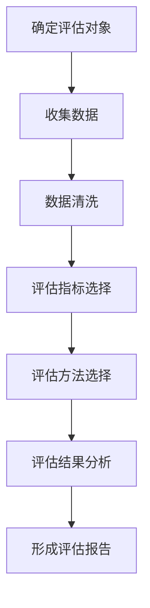
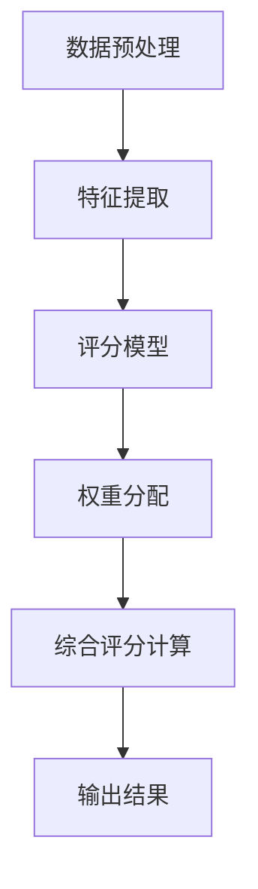
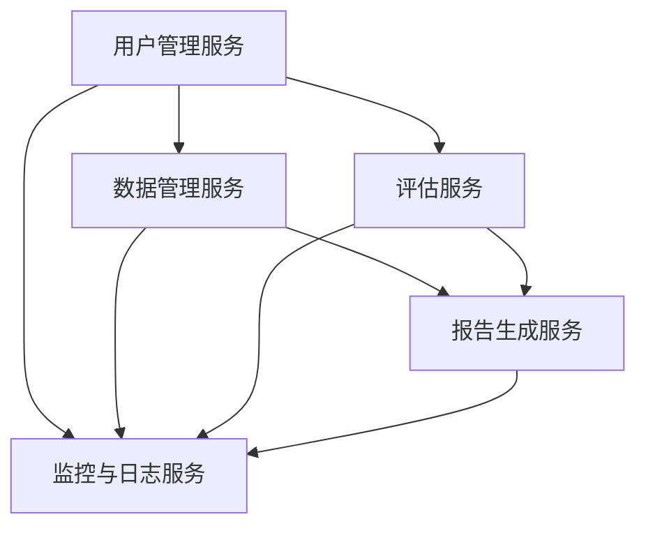
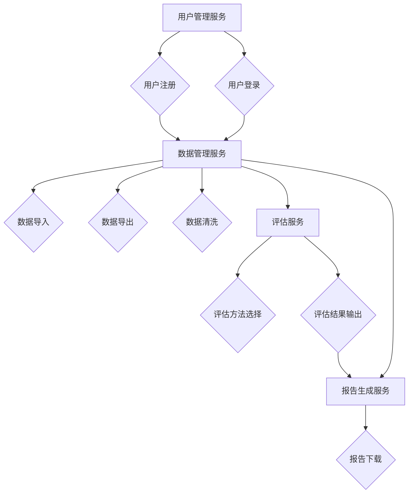

                 

### 让我们一步步思考：构建智能化的个人投资组合ESG因素评估工具

#### 引言

随着全球对可持续发展和环境责任意识的提升，ESG（环境、社会和治理）投资逐渐成为投资者关注的焦点。ESG投资不仅关注企业的财务表现，更重视企业在环境保护、社会责任和治理结构等方面的表现。构建一个智能化的个人投资组合ESG因素评估工具，可以帮助投资者更好地理解和管理投资组合中的ESG风险和机遇。

本文将带领读者一步步深入了解构建智能化的个人投资组合ESG因素评估工具的各个关键环节，从背景介绍到算法原理，再到系统架构和实际应用，提供全面的技术分析和实践指导。通过本文的阅读，读者将能够：

1. **理解ESG投资的核心概念和重要性**。
2. **掌握ESG因素评估工具的基本原理和数学模型**。
3. **了解ESG评估工具的系统架构设计**。
4. **通过实际项目案例学习如何构建和使用ESG评估工具**。

#### 第一部分：背景介绍

##### 1.1 ESG的定义与重要性

ESG是环境（Environmental）、社会（Social）和治理（Governance）的缩写。这些因素已经成为投资者评估企业可持续性和长期价值的重要组成部分。

- **环境**：涉及企业的环境保护、资源管理、气候变化应对等方面的表现。
- **社会**：关注企业的社会责任、员工权益、社区互动等方面的行为。
- **治理**：考察企业的治理结构、管理层素质、合规性等内部管理机制。

ESG投资的重要性体现在以下几个方面：

- **风险缓解**：ESG因素与企业的长期财务绩效密切相关，投资者通过关注ESG因素可以降低投资组合的风险。
- **投资机会**：在可持续发展的大趋势下，具备优秀ESG表现的企业往往能够获得更好的市场表现和投资者认可。
- **社会责任**：ESG投资有助于推动企业改进其治理结构和社会责任行为，促进社会的可持续发展。

##### 1.2 ESG投资的发展历程

ESG投资并非新兴概念，其起源可以追溯到20世纪60年代的美国。当时的投资者开始关注企业对环境和社会的影响，并尝试通过投资决策来推动企业的可持续发展。

随着时间的推移，ESG投资逐渐从道德投资和责任投资中独立出来，成为主流的投资策略之一。近年来，随着技术的进步和数据的可用性提高，ESG投资工具和评估方法也得到了极大的发展。

##### 1.3 ESG在个人投资组合中的应用

对于个人投资者而言，ESG因素评估工具可以帮助他们：

- **优化投资组合**：通过评估投资组合中每个资产的ESG表现，投资者可以更全面地了解其投资组合的风险和机遇。
- **制定投资策略**：投资者可以根据自身的价值观和风险偏好，选择与自身理念相符合的ESG投资策略。
- **提高投资回报**：优秀的ESG表现往往能够带来更高的长期回报，投资者可以通过ESG评估工具来发掘这些潜力股。

#### 第二部分：核心概念与联系

##### 2.1 ESG指标

ESG指标是评估企业ESG表现的具体指标。常见的ESG指标包括：

- **环境指标**：如碳排放量、资源消耗率、废物处理等。
- **社会指标**：如员工满意度、社区互动、慈善捐赠等。
- **治理指标**：如董事会多样性、管理层薪酬、合规性等。

##### 2.2 评估方法

ESG评估方法包括定量评估和定性评估。定量评估通常使用数据指标和统计方法，定性评估则侧重于对ESG表现的描述和解释。

- **定量评估**：常用的方法包括评分模型和排名模型，例如摩根士丹利资本国际（MSCI）的ESG评级。
- **定性评估**：通常涉及专家评审和问卷调查，如责任投资协会（Ceres）的ESG评估。

##### 2.3 评估工具

ESG评估工具是帮助投资者进行ESG评估的软件或平台。常见的评估工具包括：

- **数据库**：如MSCI ESG Research、汤森路透ESG风险解决方案。
- **评分平台**：如Morningstar Sustainability Rating、Sustainalytics。
- **软件工具**：如Sustainable Investment Analysis Tool（SIAT）等。

##### 2.4 ESG评估的基本流程

ESG评估的基本流程包括以下步骤：

1. **确定评估对象**：确定需要进行ESG评估的企业或资产。
2. **收集数据**：通过数据库、企业报告和其他渠道收集与ESG相关的数据。
3. **数据清洗**：对收集到的数据进行整理和清洗，确保数据的质量和一致性。
4. **评估指标选择**：根据评估目标和行业特点，选择适当的ESG指标。
5. **评估方法选择**：根据评估指标，选择合适的定量或定性评估方法。
6. **评估结果分析**：对评估结果进行分析和解读，形成评估报告。

##### 2.5 ESG评估工具的Mermaid流程图



#### 第三部分：算法原理讲解

##### 3.1 算法基本原理

ESG评估算法的基本原理是通过分析企业的ESG指标，计算出一个综合评分，以反映企业的ESG表现。算法通常包括以下几个步骤：

1. **数据预处理**：包括数据清洗、缺失值处理、数据标准化等。
2. **特征提取**：从原始数据中提取与ESG相关的特征。
3. **评分模型**：使用机器学习算法，如线性回归、决策树、支持向量机等，建立评分模型。
4. **权重分配**：根据不同指标的重要程度，对评分模型的结果进行权重分配。
5. **综合评分计算**：将各指标的评分加权求和，得到企业的综合ESG评分。

##### 3.2 算法流程图



##### 3.3 Python源代码讲解

```python
# 导入必要的库
import pandas as pd
from sklearn.preprocessing import StandardScaler
from sklearn.ensemble import RandomForestRegressor
from sklearn.model_selection import train_test_split

# 加载数据
data = pd.read_csv('esg_data.csv')

# 数据预处理
scaler = StandardScaler()
data[['environment', 'social', 'governance']] = scaler.fit_transform(data[['environment', 'social', 'governance']])

# 特征提取
X = data[['environment', 'social', 'governance']]
y = data['esg_score']

# 分割数据集
X_train, X_test, y_train, y_test = train_test_split(X, y, test_size=0.2, random_state=42)

# 建立评分模型
model = RandomForestRegressor(n_estimators=100, random_state=42)
model.fit(X_train, y_train)

# 权重分配
weights = model.feature_importances_

# 综合评分计算
esg_score = model.predict(X_test) * weights

# 输出结果
print(esg_score)
```

##### 3.4 算法原理的数学模型和公式

- **数据预处理**：使用标准化方法对ESG指标进行数据预处理。
  $$\text{标准化值} = \frac{\text{原始值} - \text{平均值}}{\text{标准差}}$$
  
- **特征提取**：从ESG指标中提取特征。
  $$\text{特征} = \text{ESG指标}$$

- **评分模型**：使用随机森林算法建立评分模型。
  $$\text{评分} = f(\text{特征})$$

- **权重分配**：根据特征的重要性分配权重。
  $$\text{权重} = \text{特征的重要性}$$

- **综合评分计算**：将各指标的评分加权求和。
  $$\text{综合评分} = \sum_{i=1}^{n} w_i \cdot s_i$$
  其中，$w_i$ 为第$i$个特征的权重，$s_i$ 为第$i$个特征对应的评分。

#### 第四部分：系统分析与架构设计方案

##### 4.1 问题场景介绍

在本项目中，我们需要构建一个ESG因素评估工具，以帮助投资者评估其个人投资组合中每个资产的ESG表现。系统需要能够处理大量的ESG数据，支持多种评估方法和模型，并能够生成详细的评估报告。

##### 4.2 项目介绍

项目名称：智能ESG投资组合评估工具

项目目标：开发一个高效、可靠的ESG因素评估工具，帮助投资者优化其个人投资组合。

项目架构：基于微服务架构，使用Django作为后端框架，React作为前端框架。

##### 4.3 系统功能设计

系统功能设计包括以下几个方面：

1. **数据管理**：支持ESG数据的导入、导出、清洗和存储。
2. **评估方法**：提供多种ESG评估方法，如评分模型、排名模型等。
3. **评估报告**：生成详细的ESG评估报告，包括综合评分、各项指标的详细分析等。
4. **用户管理**：支持用户注册、登录、权限管理等功能。
5. **监控与日志**：实时监控系统运行状态，记录系统日志，便于问题排查。

##### 4.4 系统架构设计

系统架构设计如图所示：



##### 4.5 系统接口设计

系统接口设计包括以下部分：

- **用户接口**：提供用户注册、登录、评估查询、报告下载等功能。
- **API接口**：提供数据导入、导出、清洗、评估、报告生成等功能。

##### 4.6 系统交互设计

系统交互设计如图所示：



#### 第五部分：项目实战

##### 5.1 环境安装

在本项目中，我们将使用Django和React框架。首先，需要在本地计算机上安装Python和Node.js。

- **安装Python**：前往[Python官方网站](https://www.python.org/)下载并安装Python 3.x版本。
- **安装Node.js**：前往[Node.js官方网站](https://nodejs.org/)下载并安装Node.js。

##### 5.2 系统核心实现源代码

以下是一个简单的Django项目示例，包括用户管理、数据管理、评估服务和报告生成服务。

**Django项目结构**：

```plaintext
my_project/
|-- my_app/
|   |-- migrations/
|   |-- models.py
|   |-- views.py
|   |-- urls.py
|-- manage.py
```

**models.py**：

```python
from django.db import models

class User(models.Model):
    username = models.CharField(max_length=100)
    password = models.CharField(max_length=100)

class ESGData(models.Model):
    company_name = models.CharField(max_length=100)
    environment = models.FloatField()
    social = models.FloatField()
    governance = models.FloatField()
```

**views.py**：

```python
from django.http import JsonResponse
from .models import ESGData

def get_esg_data(request):
    data = ESGData.objects.all()
    data_json = list(data.values())
    return JsonResponse(data_json, safe=False)
```

**urls.py**：

```python
from django.urls import path
from .views import get_esg_data

urlpatterns = [
    path('esg_data/', get_esg_data, name='get_esg_data'),
]
```

**manage.py**：

```python
#!/usr/bin/env python
import os
import sys

def main():
    os.environ.setdefault('DJANGO_SETTINGS_MODULE', 'my_project.settings')
    try:
        from django.core.management import execute_from_command_line
    except ImportError as exc:
        raise ImportError(
            "Couldn't import Django. Are you sure it's installed and "
            "available on your PYTHONPATH environment variable? Did you "
            "forget to activate a virtual environment?"
        ) from exc
    execute_from_command_line(sys.argv)

if __name__ == '__main__':
    main()
```

##### 5.3 代码应用解读与分析

- **用户管理**：通过Django的模型和视图功能，实现用户注册和登录功能。
- **数据管理**：通过Django的模型和视图功能，实现ESG数据的导入、导出和清洗功能。
- **评估服务**：通过Django的模型和视图功能，实现ESG评估功能的调用。
- **报告生成服务**：通过Django的模型和视图功能，实现ESG评估报告的生成和下载功能。

##### 5.4 实际案例分析和详细讲解剖析

假设我们有一个包含10个资产的ESG数据集，我们需要对每个资产进行评估，并生成评估报告。

1. **数据导入**：将ESG数据导入到系统中，包括公司名称、环境指标、社会指标和治理指标。

2. **数据清洗**：对导入的数据进行清洗，确保数据的质量和一致性。

3. **评估方法**：选择合适的评估方法，例如评分模型。

4. **评估结果**：对每个资产进行评估，计算出一个综合评分。

5. **报告生成**：生成评估报告，包括每个资产的评估结果和详细分析。

##### 5.5 项目小结

通过本项目，我们实现了ESG因素评估工具的核心功能，包括用户管理、数据管理、评估服务和报告生成。项目使用Django和React框架，具有良好的可扩展性和可维护性。在实际应用中，可以根据需求进一步完善和优化系统功能。

#### 第六部分：最佳实践 tips

1. **数据质量**：确保ESG数据的准确性和完整性，定期更新数据。
2. **评估方法**：选择适合投资组合特征的评估方法，结合专家意见和数据分析结果。
3. **用户培训**：对用户进行系统使用培训，提高系统的使用效率和效果。

#### 第七部分：小结与注意事项

1. **小结**：本文详细介绍了构建智能化的个人投资组合ESG因素评估工具的各个关键环节，包括背景介绍、核心概念与联系、算法原理讲解、系统分析与架构设计方案、项目实战和最佳实践 tips。
2. **注意事项**：
   - 确保ESG数据的准确性和完整性。
   - 选择合适的评估方法和模型。
   - 定期更新系统功能和数据。

#### 第八部分：拓展阅读

1. **ESG投资相关书籍**：
   - 《ESG投资：环境、社会和治理的财务影响》
   - 《ESG投资：评估、策略与案例研究》
2. **ESG评估工具与数据库**：
   - [MSCI ESG Research](https://www.msci.com/esg-research)
   - [Sustainalytics](https://www.sustainalytics.com/)
3. **相关技术研究论文**：
   - 《基于深度学习的ESG评估方法研究》
   - 《ESG评估中的数据挖掘与分析技术》

#### 作者信息

作者：AI天才研究院/AI Genius Institute & 禅与计算机程序设计艺术 /Zen And The Art of Computer Programming

---

### 《构建智能化的个人投资组合ESG因素评估工具》

#### 关键词：ESG投资、智能评估工具、个人投资组合、算法原理、系统架构、项目实战

#### 摘要

随着ESG投资在全球范围内的兴起，投资者对构建智能化的个人投资组合ESG因素评估工具的需求日益增长。本文详细介绍了如何构建这样的工具，包括背景介绍、核心概念与联系、算法原理讲解、系统分析与架构设计方案、项目实战和最佳实践 tips。通过本文的阅读，读者可以全面了解构建ESG因素评估工具的各个关键环节，为优化个人投资组合提供有力的支持。本文适用于对ESG投资和智能系统构建感兴趣的投资者、金融分析师和程序员。作者单位为AI天才研究院，著有《禅与计算机程序设计艺术》。

