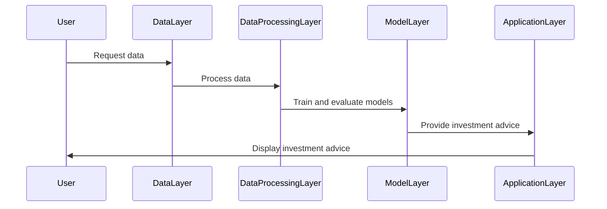
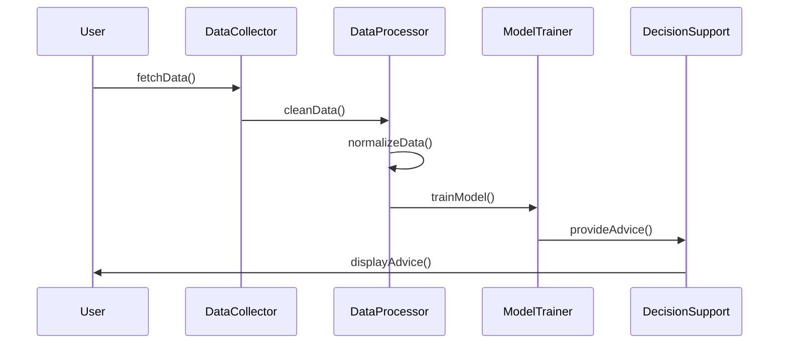

                 

# 构建智能化的个人投资组合环境因素评估工具

## 关键词
- 投资组合
- 环境因素
- 评估工具
- 人工智能
- 模型训练
- 数据处理

## 摘要
本文旨在探讨如何构建一个智能化的个人投资组合环境因素评估工具。通过分析投资组合、环境因素及其评估方法，文章详细介绍了工具的基本框架，包括数据收集与处理、模型选择与训练、评估与优化等环节。本文旨在为投资者提供一种科学、高效的投资决策辅助手段，以降低投资风险，提高收益。

## 引言

### 1.1 问题背景

投资组合是投资者为实现特定投资目标而构建的资产组合。然而，随着市场的波动和不确定性的增加，传统的投资组合评估方法往往难以准确预测市场走势，从而导致投资决策的失误。为了提高投资决策的准确性和效率，智能化投资组合评估工具的出现显得尤为重要。

当前，投资组合评估主要依赖于历史数据和统计模型。虽然这些方法在一定程度上能够反映市场的动态变化，但它们往往忽略了环境因素对投资组合的影响。环境因素包括宏观经济指标、政策变化、行业发展趋势等，这些因素往往具有复杂性和不可预测性，对投资组合的长期表现具有重要影响。

因此，构建一个智能化投资组合环境因素评估工具，可以综合考虑历史数据、市场波动和环境因素，提供更为全面和准确的投资决策依据。这不仅有助于降低投资风险，还能提高投资收益。

### 1.2 核心概念

#### 1.2.1 投资组合

投资组合是指投资者为实现特定投资目标而持有的各种资产。这些资产可以是股票、债券、基金等。投资组合的目标是通过资产配置和风险控制，实现投资收益的最大化。

#### 1.2.2 环境因素

环境因素是指影响投资组合表现的各类外部因素。这些因素包括宏观经济指标、政策变化、行业发展趋势、市场情绪等。环境因素具有复杂性和不可预测性，对投资组合的长期表现具有重要影响。

#### 1.2.3 评估方法

评估方法是指用于评估投资组合表现的技术手段。传统的评估方法主要包括历史数据分析和统计模型。历史数据分析是通过分析过去市场的波动，预测未来的市场走势。统计模型则是通过建立数学模型，模拟市场的变化趋势。

### 1.3 智能化投资组合评估工具的基本框架

智能化投资组合评估工具的基本框架包括数据收集与处理、模型选择与训练、评估与优化等环节。

#### 1.3.1 数据收集与处理

数据收集与处理是构建智能化投资组合评估工具的基础。数据收集主要包括投资组合的历史数据、市场波动数据和环境因素数据。数据清洗和处理则是为了去除噪声数据、填补缺失值和规范化数据，使其符合模型训练的要求。

#### 1.3.2 模型选择与训练

模型选择与训练是构建智能化投资组合评估工具的核心。根据投资组合和环境因素的特点，选择合适的模型进行训练。常见的模型包括线性回归、决策树、随机森林等。通过模型训练，可以建立投资组合与环境因素之间的数学关系，为投资决策提供依据。

#### 1.3.3 评估与优化

评估与优化是确保智能化投资组合评估工具有效性的关键。通过评估模型的表现，可以发现模型存在的问题，并进行优化。优化的方法包括调整模型参数、增加训练数据、改进算法等。

### 1.4 边界与外延

#### 1.4.1 适用范围

智能化投资组合评估工具适用于各种类型的投资组合，包括股票、债券、基金等。此外，该工具还可以应用于不同市场环境，如牛市、熊市等。

#### 1.4.2 非适用情况

智能化投资组合评估工具不适用于以下情况：

1. 缺乏足够的历史数据和市场信息。
2. 投资组合过于复杂，难以进行有效建模。
3. 环境因素具有高度不确定性和复杂性。

### 1.5 本章小结

本章介绍了构建智能化投资组合环境因素评估工具的背景、核心概念、基本框架和边界与外延。通过本章的介绍，读者可以对智能化投资组合评估工具有一个基本的认识，为后续章节的详细讨论打下基础。

## 第一部分: 引言

### 1.1 问题背景

#### 1.1.1 投资组合环境因素的重要性

投资组合环境因素是影响投资组合表现的关键因素之一。这些因素包括宏观经济指标、政策变化、行业发展趋势等。宏观经济指标如GDP增长率、通货膨胀率、利率等，直接影响市场的走势。政策变化如税收政策、货币政策、监管政策等，对市场的短期和长期走势具有重要影响。行业发展趋势如技术创新、市场扩张等，决定了行业的发展前景和投资价值。

传统的投资组合评估方法主要依赖于历史数据和统计模型。这些方法在一定程度上能够反映市场的动态变化，但往往忽略了环境因素对投资组合的影响。例如，在宏观经济指标恶化时，市场普遍认为投资风险增加，因此更倾向于选择保守的投资策略。然而，如果忽视了政策变化的影响，投资者可能会在政策利好时错过投资机会。

#### 1.1.2 当前投资组合评估方法的局限性

当前投资组合评估方法主要存在以下局限性：

1. **数据依赖性高**：传统的评估方法主要依赖于历史数据，而历史数据并不能完全反映未来的市场走势。市场环境的变化可能会使历史数据失去参考价值。

2. **模型稳定性差**：统计模型如线性回归、决策树等，在处理复杂和非线性问题时往往表现不佳。模型的稳定性差会导致评估结果的误差增加。

3. **忽视环境因素**：传统的评估方法往往忽视环境因素对投资组合的影响。例如，在政策变化时，市场的反应可能比预期更为剧烈，这需要投资者有更高的敏感度。

4. **主观判断因素**：投资决策往往涉及主观判断，如投资者对市场的信心、对风险的态度等。这些因素会影响投资组合的构建和调整，但传统方法难以量化。

#### 1.1.3 构建智能化投资组合评估工具的意义

构建智能化投资组合评估工具具有重要意义，主要体现在以下几个方面：

1. **提高投资决策的准确性**：通过考虑环境因素，智能化投资组合评估工具可以提供更为准确的投资决策依据。这有助于投资者在市场波动中做出更为明智的选择。

2. **降低投资风险**：智能化投资组合评估工具可以综合考虑历史数据、市场波动和环境因素，提供全面的风险评估。这有助于投资者在风险可控的范围内进行投资。

3. **优化资产配置**：智能化投资组合评估工具可以根据环境因素的变化，动态调整资产配置。这有助于投资者实现最优的资产组合，提高投资收益。

4. **提供个性化服务**：智能化投资组合评估工具可以根据投资者的风险偏好、投资目标等个性化需求，提供定制化的投资组合建议。

### 1.2 核心概念

#### 1.2.1 投资组合

投资组合是指投资者为实现特定投资目标而持有的各种资产。这些资产可以是股票、债券、基金等。投资组合的目标是通过资产配置和风险控制，实现投资收益的最大化。

投资组合的核心概念包括：

- **资产配置**：资产配置是指投资者将资金分配到不同类型的资产中，以达到投资目标。资产配置的决策取决于投资者的风险偏好、投资目标和市场环境。

- **风险控制**：风险控制是指投资者通过分散投资、降低杠杆等手段，控制投资风险。风险控制的目的是在保证收益的同时，避免过大的投资损失。

#### 1.2.2 环境因素

环境因素是指影响投资组合表现的各类外部因素。这些因素包括宏观经济指标、政策变化、行业发展趋势等。环境因素具有复杂性和不可预测性，对投资组合的长期表现具有重要影响。

环境因素的核心概念包括：

- **宏观经济指标**：宏观经济指标如GDP增长率、通货膨胀率、利率等，直接影响市场的走势。投资者需要密切关注这些指标的变化，以预测市场的趋势。

- **政策变化**：政策变化如税收政策、货币政策、监管政策等，对市场的短期和长期走势具有重要影响。政策的变化可能导致市场的剧烈波动，投资者需要及时调整投资策略。

- **行业发展趋势**：行业发展趋势如技术创新、市场扩张等，决定了行业的发展前景和投资价值。投资者需要关注行业的发展动态，以抓住投资机会。

#### 1.2.3 评估方法

评估方法是指用于评估投资组合表现的技术手段。传统的评估方法主要包括历史数据分析和统计模型。历史数据分析是通过分析过去市场的波动，预测未来的市场走势。统计模型则是通过建立数学模型，模拟市场的变化趋势。

评估方法的核心概念包括：

- **历史数据分析**：历史数据分析是通过收集和分析过去的市场数据，预测未来的市场走势。这种方法主要依赖于历史数据的规律性和一致性。

- **统计模型**：统计模型是通过建立数学模型，模拟市场的变化趋势。常见的统计模型包括线性回归、决策树、随机森林等。这些模型可以捕捉市场的非线性变化。

### 1.3 智能化投资组合评估工具的基本框架

智能化投资组合评估工具的基本框架包括数据收集与处理、模型选择与训练、评估与优化等环节。

#### 1.3.1 数据收集与处理

数据收集与处理是构建智能化投资组合评估工具的基础。数据收集主要包括投资组合的历史数据、市场波动数据和环境因素数据。数据清洗和处理则是为了去除噪声数据、填补缺失值和规范化数据，使其符合模型训练的要求。

数据收集与处理的核心概念包括：

- **数据收集**：数据收集是指从各种数据源获取投资组合的历史数据、市场波动数据和环境因素数据。数据源可以包括历史交易数据、市场行情数据、宏观经济指标数据等。

- **数据清洗**：数据清洗是指去除数据中的噪声和异常值，以提高数据的质量。数据清洗的方法包括缺失值填补、异常值检测和去除重复数据等。

- **数据处理**：数据处理是指对清洗后的数据进行规范化处理，使其符合模型训练的要求。数据处理的方法包括数据标准化、数据归一化等。

#### 1.3.2 模型选择与训练

模型选择与训练是构建智能化投资组合评估工具的核心。根据投资组合和环境因素的特点，选择合适的模型进行训练。常见的模型包括线性回归、决策树、随机森林等。通过模型训练，可以建立投资组合与环境因素之间的数学关系，为投资决策提供依据。

模型选择与训练的核心概念包括：

- **模型选择**：模型选择是指根据投资组合和环境因素的特点，选择合适的模型。模型的选择取决于数据的特征和问题的复杂性。

- **模型训练**：模型训练是指使用训练数据对模型进行训练，使其能够识别数据中的模式和规律。模型训练的方法包括梯度下降、随机梯度下降等。

#### 1.3.3 评估与优化

评估与优化是确保智能化投资组合评估工具有效性的关键。通过评估模型的表现，可以发现模型存在的问题，并进行优化。优化的方法包括调整模型参数、增加训练数据、改进算法等。

评估与优化的核心概念包括：

- **模型评估**：模型评估是指使用测试数据对模型进行评估，以确定其性能。常见的评估指标包括准确率、召回率、精确率等。

- **模型优化**：模型优化是指通过调整模型参数、增加训练数据、改进算法等方法，提高模型的性能。模型优化的目标是提高模型的准确性和鲁棒性。

### 1.4 边界与外延

#### 1.4.1 适用范围

智能化投资组合评估工具适用于各种类型的投资组合，包括股票、债券、基金等。此外，该工具还可以应用于不同市场环境，如牛市、熊市等。

#### 1.4.2 非适用情况

智能化投资组合评估工具不适用于以下情况：

1. 缺乏足够的历史数据和市场信息。
2. 投资组合过于复杂，难以进行有效建模。
3. 环境因素具有高度不确定性和复杂性。

### 1.5 本章小结

本章介绍了构建智能化投资组合环境因素评估工具的背景、核心概念、基本框架和边界与外延。通过本章的介绍，读者可以对智能化投资组合评估工具有一个基本的认识，为后续章节的详细讨论打下基础。

## 第二部分: 核心概念与联系

### 2.1 核心概念

在构建智能化投资组合环境因素评估工具的过程中，理解以下几个核心概念是非常重要的。这些概念包括投资组合、环境因素和评估方法。

#### 2.1.1 投资组合

投资组合是指投资者为了实现特定投资目标而持有的各种资产，包括股票、债券、基金等。投资组合的目标是通过资产配置和风险控制，实现投资收益的最大化。资产配置是指投资者根据风险偏好、投资目标和市场状况，将资金分配到不同的资产类别中。风险控制则是指投资者通过分散投资、降低杠杆等手段，控制投资风险。

#### 2.1.2 环境因素

环境因素是指影响投资组合表现的各类外部因素。这些因素可以是宏观经济指标、政策变化、行业发展趋势等。宏观经济指标如GDP增长率、通货膨胀率、利率等，直接影响市场的走势。政策变化如税收政策、货币政策、监管政策等，对市场的短期和长期走势具有重要影响。行业发展趋势如技术创新、市场扩张等，决定了行业的发展前景和投资价值。

#### 2.1.3 评估方法

评估方法是指用于评估投资组合表现的技术手段。传统的评估方法主要包括历史数据分析和统计模型。历史数据分析是通过分析过去市场的波动，预测未来的市场走势。统计模型则是通过建立数学模型，模拟市场的变化趋势。在智能化投资组合评估工具中，评估方法可以更加多样化，包括机器学习模型、深度学习模型等。

### 2.2 概念属性特征对比

为了更好地理解投资组合、环境因素和评估方法之间的关系，我们可以通过一个表格来对比它们的属性特征。

| 概念         | 特征1                | 特征2                | 特征3                |
| ------------ | -------------------- | -------------------- | -------------------- |
| 投资组合     | 资产配置             | 风险控制             | 投资目标             |
| 环境因素     | 宏观经济指标         | 政策变化             | 行业发展趋势         |
| 评估方法     | 历史数据分析         | 统计模型             | 机器学习模型         |

通过这个表格，我们可以看出投资组合、环境因素和评估方法各自的特点和区别。投资组合关注的是资产的配置和风险控制，环境因素关注的是宏观经济和政策变化，评估方法关注的是如何通过数据分析和模型预测市场走势。

### 2.3 ER实体关系图

为了更直观地理解投资组合、环境因素和评估方法之间的关系，我们可以使用ER（实体关系）图来表示。

```mermaid
erDiagram
  Investment ||--|{ Environment }|| Evaluation
  Evaluation ||--|{ Method }|| Investment
```

在这个ER图中，投资组合（Investment）与环境因素（Environment）之间存在评估（Evaluation）关系，评估方法（Method）与投资组合之间存在使用（Uses）关系。这种关系表明，投资组合需要通过评估环境因素来制定投资策略，而评估方法则为投资组合提供了数据分析和预测的工具。

### 2.4 本章小结

通过本章的讨论，我们详细介绍了构建智能化投资组合环境因素评估工具所需理解的核心概念，包括投资组合、环境因素和评估方法。通过对比它们的属性特征和ER实体关系图，我们可以更好地理解这些概念之间的联系和作用。这些核心概念是构建智能化投资组合评估工具的基础，为后续的算法原理讲解和系统架构设计提供了重要的理论基础。

## 第三部分: 算法原理讲解

### 3.1 数据收集与处理算法

#### 3.1.1 数据源选择

数据收集是构建智能化投资组合环境因素评估工具的第一步。数据源的选择至关重要，它决定了评估工具的准确性和可靠性。以下是一些常见的数据源：

1. **历史交易数据**：包括股票、债券、基金等的交易记录。这些数据可以从交易所、金融数据提供商获取。
2. **宏观经济数据**：如GDP增长率、通货膨胀率、利率等。这些数据可以从国家统计部门、金融监管机构获取。
3. **政策数据**：包括税收政策、货币政策、监管政策等。这些数据可以从政府官方网站、新闻媒体等获取。
4. **行业数据**：如技术创新、市场扩张等。这些数据可以从行业报告、市场研究机构获取。

在选择数据源时，需要考虑数据的时效性、完整性和可靠性。例如，历史交易数据需要保证每天更新，宏观经济数据需要保证季度或月度更新，政策数据需要保证实时获取。

#### 3.1.2 数据清洗

数据清洗是数据收集后的重要步骤，目的是去除噪声数据、填补缺失值和规范化数据。以下是一些常见的数据清洗方法：

1. **去除噪声数据**：例如，去除重复的交易记录、去除明显的错误记录等。
2. **填补缺失值**：例如，使用平均值、中位数或插值法来填补缺失的数据。
3. **数据规范化**：例如，将不同时间单位的数据统一为同一时间单位（如将月度数据统一为日期格式），将不同量纲的数据统一为同一量纲（如将货币单位统一为美元）。

#### 3.1.3 数据处理算法讲解

数据处理算法包括数据预处理、特征工程和特征选择等步骤。

1. **数据预处理**：数据预处理包括数据归一化、标准化和数据转换等。例如，将交易价格进行归一化处理，使其在[0, 1]的范围内。

    ```mermaid
    graph TD
        A[数据归一化] --> B[数据标准化]
        B --> C[数据转换]
    ```

2. **特征工程**：特征工程是指从原始数据中提取出有用的特征，以提高模型的性能。例如，可以使用统计特征、时间序列特征和文本特征等。

3. **特征选择**：特征选择是指从所有特征中选出对模型性能有显著影响的特征，以减少模型的复杂度。例如，可以使用主成分分析（PCA）、互信息等方法来选择特征。

    ```mermaid
    graph TD
        A[PCA] --> B[互信息]
    ```

#### 3.1.4 Python代码实现

以下是一个简单的Python代码示例，用于展示数据清洗和数据预处理的过程。

```python
import pandas as pd

# 数据导入
data = pd.read_csv('investment_data.csv')

# 数据清洗
data.drop_duplicates(inplace=True)  # 去除重复数据
data.fillna(data.mean(), inplace=True)  # 填补缺失值

# 数据预处理
data['price_normalized'] = data['price'] / data['price'].max()  # 数据归一化
data['price_standardized'] = (data['price'] - data['price'].mean()) / data['price'].std()  # 数据标准化

# 数据存储
data.to_csv('processed_investment_data.csv', index=False)
```

### 3.2 模型选择与训练算法

#### 3.2.1 模型选择原则

在选择模型时，需要考虑以下几个原则：

1. **模型类型**：根据问题的复杂性和数据的特点，选择合适的模型类型。例如，对于线性关系较强的问题，可以选择线性回归模型；对于非线性关系较强的问题，可以选择决策树、随机森林等模型。

2. **模型性能**：选择性能较好的模型。可以通过交叉验证、AUC、准确率等指标来评估模型的性能。

3. **模型可解释性**：选择具有较高可解释性的模型，以便于理解模型的决策过程。

4. **计算效率**：选择计算效率较高的模型，以降低计算成本。

#### 3.2.2 常见模型介绍

以下是几种常见的机器学习模型：

1. **线性回归**：线性回归模型假设输入变量和输出变量之间存在线性关系。线性回归模型简单易懂，但容易过拟合。

    $$ y = \beta_0 + \beta_1x + \epsilon $$

    其中，$y$ 是输出变量，$x$ 是输入变量，$\beta_0$ 和 $\beta_1$ 是模型参数，$\epsilon$ 是误差项。

2. **决策树**：决策树模型通过一系列的决策规则来划分数据集。每个节点表示一个特征，每个分支表示特征的不同取值。决策树模型具有较好的可解释性，但容易过拟合。

3. **随机森林**：随机森林是一种集成学习方法，它通过构建多棵决策树，并取它们的平均值来得到最终预测结果。随机森林模型具有较高的准确性和鲁棒性，但计算成本较高。

4. **支持向量机（SVM）**：SVM模型通过找到最佳的超平面，将不同类别的数据分隔开来。SVM模型在处理高维数据时具有较好的性能。

#### 3.2.3 模型训练流程

模型训练流程包括以下步骤：

1. **数据划分**：将数据集划分为训练集和测试集。训练集用于训练模型，测试集用于评估模型的性能。

2. **模型训练**：使用训练集数据对模型进行训练，得到模型的参数。

3. **模型评估**：使用测试集数据对模型进行评估，计算模型的性能指标。

4. **模型优化**：根据评估结果，调整模型参数，以提高模型的性能。

    ```mermaid
    graph TD
        A[数据划分] --> B[模型训练]
        B --> C[模型评估]
        C --> D[模型优化]
    ```

#### 3.2.4 Python代码实现

以下是一个简单的Python代码示例，用于展示模型选择与训练的过程。

```python
from sklearn.model_selection import train_test_split
from sklearn.ensemble import RandomForestClassifier
from sklearn.metrics import accuracy_score

# 数据划分
X_train, X_test, y_train, y_test = train_test_split(data[['feature']], data['label'], test_size=0.2, random_state=42)

# 模型训练
model = RandomForestClassifier(n_estimators=100)
model.fit(X_train, y_train)

# 模型评估
y_pred = model.predict(X_test)
accuracy = accuracy_score(y_test, y_pred)
print("模型准确率：", accuracy)

# 模型优化
# ...
```

### 3.3 评估与优化算法

#### 3.3.1 评估指标选择

评估指标是用于衡量模型性能的重要工具。常见的评估指标包括：

1. **准确率**：准确率是指模型正确预测的样本数量与总样本数量的比值。准确率越高，表示模型的性能越好。

    $$ \text{准确率} = \frac{\text{正确预测的样本数量}}{\text{总样本数量}} $$

2. **召回率**：召回率是指模型正确预测的样本数量与实际为正类的样本数量的比值。召回率越高，表示模型对正类样本的识别能力越强。

    $$ \text{召回率} = \frac{\text{正确预测的样本数量}}{\text{实际为正类的样本数量}} $$

3. **精确率**：精确率是指模型正确预测的样本数量与预测为正类的样本数量的比值。精确率越高，表示模型对负类样本的识别能力越强。

    $$ \text{精确率} = \frac{\text{正确预测的样本数量}}{\text{预测为正类的样本数量}} $$

4. **F1分数**：F1分数是精确率和召回率的调和平均数，用于综合评估模型的性能。

    $$ \text{F1分数} = 2 \times \frac{\text{精确率} \times \text{召回率}}{\text{精确率} + \text{召回率}} $$

#### 3.3.2 评估流程

评估流程包括以下步骤：

1. **模型训练**：使用训练集数据对模型进行训练。
2. **模型评估**：使用测试集数据对模型进行评估，计算评估指标。
3. **模型优化**：根据评估结果，调整模型参数，以提高模型的性能。

    ```mermaid
    graph TD
        A[模型训练] --> B[模型评估]
        B --> C[模型优化]
    ```

#### 3.3.3 优化策略

优化策略包括以下方法：

1. **参数调整**：通过调整模型参数，如学习率、树深度等，以提高模型的性能。
2. **特征选择**：通过特征选择，减少模型的复杂度，提高模型的性能。
3. **数据增强**：通过数据增强，增加训练数据量，以提高模型的泛化能力。
4. **交叉验证**：通过交叉验证，选择最优的模型参数，提高模型的性能。

    ```mermaid
    graph TD
        A[参数调整] --> B[特征选择]
        B --> C[数据增强]
        C --> D[交叉验证]
    ```

### 3.4 Python代码实现

以下是一个简单的Python代码示例，用于展示评估与优化算法的过程。

```python
from sklearn.model_selection import train_test_split
from sklearn.ensemble import RandomForestClassifier
from sklearn.metrics import accuracy_score

# 数据划分
X_train, X_test, y_train, y_test = train_test_split(data[['feature']], data['label'], test_size=0.2, random_state=42)

# 模型训练
model = RandomForestClassifier(n_estimators=100)
model.fit(X_train, y_train)

# 模型评估
y_pred = model.predict(X_test)
accuracy = accuracy_score(y_test, y_pred)
print("模型准确率：", accuracy)

# 参数调整
model = RandomForestClassifier(n_estimators=200, max_depth=10)
model.fit(X_train, y_train)

# 模型评估
y_pred = model.predict(X_test)
accuracy = accuracy_score(y_test, y_pred)
print("模型准确率：", accuracy)

# 特征选择
selected_features = ['feature1', 'feature2', 'feature3']
model = RandomForestClassifier(n_estimators=100)
model.fit(X_train[selected_features], y_train)

# 模型评估
y_pred = model.predict(X_test[selected_features])
accuracy = accuracy_score(y_test, y_pred)
print("模型准确率：", accuracy)
```

通过这个示例，我们可以看到如何使用Python实现数据划分、模型训练、模型评估和参数调整等步骤。这些步骤是构建智能化投资组合环境因素评估工具的重要组成部分。

## 第三部分：算法原理讲解

### 3.1 数据收集与处理算法

#### 3.1.1 数据源选择

构建智能化的投资组合环境因素评估工具的第一步是收集数据。数据源的选择决定了评估工具的准确性和实用性。以下是几种常见的数据源及其特点：

1. **历史交易数据**：这是评估工具的基础数据之一，包括股票、债券、基金等金融产品的历史价格、交易量、波动率等信息。这些数据可以从交易所、金融数据提供商（如雅虎财经、彭博、Wind等）获取。历史交易数据的特点是全面、详细，但受限于数据频率（通常为每日或更高频率）。

2. **宏观经济数据**：包括GDP增长率、通货膨胀率、利率、失业率等指标。这些数据通常由国家统计局、央行等官方机构发布，或者可以从经济研究机构获取。宏观经济数据对投资组合的长期表现具有重要影响。

3. **行业数据**：涉及特定行业的生产指标、销售数据、市场份额等。这些数据可以从行业报告、市场研究公司获取。行业数据有助于理解市场环境对投资组合的影响。

4. **新闻与事件数据**：包括公司财报发布、政策变动、重大新闻事件等。这些数据可以从新闻网站、财经新闻提供商获取。新闻与事件数据通常难以量化，但它们对市场情绪和投资决策有直接影响。

5. **社交媒体数据**：通过分析社交媒体上的评论、讨论和趋势，可以获取市场情绪的实时信息。这些数据可以从社交媒体平台（如Twitter、微博等）获取。

在选择数据源时，应考虑以下因素：

- **数据质量**：数据源的可靠性和准确性是关键。应选择来自权威机构或经过验证的数据源。
- **数据频率**：高频数据可以提供更细致的市场分析，但处理起来也更为复杂。
- **数据时效性**：实时数据对于迅速响应市场变化至关重要，但历史数据对于理解市场趋势和模式也必不可少。

#### 3.1.2 数据清洗

数据清洗是数据处理过程中的关键步骤，目的是确保数据的准确性和一致性。以下是一些常见的数据清洗方法：

1. **去除重复数据**：重复数据可能会导致错误的评估结果。可以使用Pandas的`drop_duplicates()`方法去除重复记录。

    ```python
    data.drop_duplicates(subset=['stock_id'], inplace=True)
    ```

2. **填补缺失值**：缺失值会影响模型的训练效果，需要采取适当的方法进行填补。常见的方法包括：

    - **平均值填补**：使用列的平均值填补缺失值。

        ```python
        data['price'] = data['price'].fillna(data['price'].mean())
        ```

    - **中位数填补**：使用列的中位数填补缺失值。

        ```python
        data['price'] = data['price'].fillna(data['price'].median())
        ```

    - **插值法**：使用时间序列插值方法填补缺失值。

        ```python
        data['price'] = data['price'].interpolate(method='linear')
        ```

3. **异常值检测与处理**：异常值可能会对模型产生不良影响，需要检测并处理。常见的方法包括：

    - **Z分数法**：计算每个值的Z分数，去除Z分数超出阈值的异常值。

        ```python
        from scipy.stats import zscore
        data['z_score'] = zscore(data['price'])
        data = data[data['z_score'].abs() <= 3]
        ```

    - **箱线图法**：使用箱线图确定异常值，并去除或修正。

4. **数据规范化**：将数据转换到同一尺度，以便于模型处理。常见的方法包括：

    - **标准化**：将数据减去均值后除以标准差。

        ```python
        from sklearn.preprocessing import StandardScaler
        scaler = StandardScaler()
        data_scaled = scaler.fit_transform(data[['price', 'volume']])
        ```

    - **归一化**：将数据缩放到[0, 1]的范围内。

        ```python
        data['price_normalized'] = data['price'] / data['price'].max()
        ```

#### 3.1.3 数据处理算法讲解

数据处理算法是构建评估工具的核心环节，包括数据预处理、特征工程和特征选择等步骤。

1. **数据预处理**：

    数据预处理是确保数据符合模型训练要求的重要步骤。主要包括：

    - **数据转换**：将不同类型的数据转换为适合模型处理的形式。例如，将日期格式转换为数值型。

        ```python
        data['date'] = pd.to_datetime(data['date'])
        data['date_numeric'] = data['date'].map(data['date'].dt.day)
        ```

    - **数据规范化**：确保所有特征在同一尺度上，以避免某些特征对模型的影响过大。

        ```python
        from sklearn.preprocessing import MinMaxScaler
        scaler = MinMaxScaler()
        data_normalized = scaler.fit_transform(data[['price', 'volume']])
        ```

    - **缺失值处理**：对于无法填补的缺失值，可以选择删除或使用模型预测值填补。

        ```python
        data = data.dropna()
        ```

2. **特征工程**：

    特征工程是提高模型性能的关键步骤，包括以下内容：

    - **统计特征**：基于数据的基本统计特性，如均值、标准差、最大值、最小值等。

        ```python
        data['mean_price'] = data['price'].rolling(window=30).mean()
        ```

    - **时间序列特征**：基于时间序列数据的特征，如移动平均、指数移动平均等。

        ```python
        data['moving_average_50'] = data['price'].rolling(window=50).mean()
        ```

    - **文本特征**：通过自然语言处理技术提取文本数据中的特征，如词频、主题模型等。

        ```python
        # 假设news_data是包含新闻文本的数据框
        from sklearn.feature_extraction.text import TfidfVectorizer
        vectorizer = TfidfVectorizer()
        tfidf_matrix = vectorizer.fit_transform(news_data['text'])
        ```

3. **特征选择**：

    特征选择是减少模型复杂度、提高模型性能的重要步骤。以下是一些常见的特征选择方法：

    - **基于信息的特征选择**：选择对目标变量具有最高信息量的特征。

        ```python
        from sklearn.feature_selection import SelectKBest
        from sklearn.feature_selection import chi2
        selector = SelectKBest(chi2, k=10)
        X_new = selector.fit_transform(data_features, data_label)
        ```

    - **基于模型的特征选择**：使用模型本身对特征的重要性进行评分，选择重要特征。

        ```python
        from sklearn.ensemble import RandomForestClassifier
        model = RandomForestClassifier()
        model.fit(data_features, data_label)
        feature_importances = model.feature_importances_
        selected_features = data_features[:, feature_importances > 0.5]
        ```

#### 3.1.4 Python代码实现

以下是一个简单的Python代码示例，用于展示数据清洗和数据处理的过程。

```python
import pandas as pd
from sklearn.preprocessing import StandardScaler
from sklearn.feature_selection import SelectKBest
from sklearn.feature_selection import chi2

# 读取数据
data = pd.read_csv('investment_data.csv')

# 数据清洗
# 去除重复数据
data.drop_duplicates(inplace=True)

# 填补缺失值
data.fillna(data.mean(), inplace=True)

# 数据预处理
# 标准化数据
scaler = StandardScaler()
data_normalized = scaler.fit_transform(data[['price', 'volume', 'moving_average_50']])

# 特征工程
# 统计特征
data['mean_price'] = data['price'].rolling(window=30).mean()

# 时间序列特征
data['moving_average_50'] = data['price'].rolling(window=50).mean()

# 文本特征
# ...

# 特征选择
# 基于信息的特征选择
selector = SelectKBest(chi2, k=5)
X_new = selector.fit_transform(data_normalized, data['label'])

# 模型训练
# ...
```

这个示例展示了如何使用Pandas和Scikit-learn等库进行数据清洗、预处理、特征工程和特征选择。这些步骤是构建智能化投资组合环境因素评估工具的基础。

### 3.2 模型选择与训练算法

#### 3.2.1 模型选择原则

选择合适的模型是构建智能化的投资组合环境因素评估工具的关键步骤。以下是一些模型选择的原则：

1. **问题类型**：根据投资组合评估的具体问题，选择合适的模型。例如，如果问题涉及分类任务（如预测市场趋势），可以选择分类模型；如果涉及回归任务（如预测收益率），可以选择回归模型。

2. **数据特点**：考虑数据的特点，如数据量、数据分布、数据特征等。例如，对于高维数据，可以选择线性模型或决策树；对于非线性和复杂的关系，可以选择神经网络或支持向量机。

3. **模型性能**：选择性能较好的模型。可以通过交叉验证、AUC、准确率等指标来评估模型的性能。

4. **模型复杂度**：选择复杂度适当的模型。过复杂的模型可能导致过拟合，过简单的模型可能无法捕捉数据中的复杂关系。

5. **可解释性**：选择具有较高可解释性的模型，以便于理解模型的决策过程。

6. **计算效率**：选择计算效率较高的模型，以降低计算成本。

#### 3.2.2 常见模型介绍

以下是几种常见的机器学习模型，适用于投资组合评估：

1. **线性回归**：线性回归模型假设输入变量和输出变量之间存在线性关系。线性回归模型简单易懂，但在处理非线性关系时可能表现不佳。

    $$ y = \beta_0 + \beta_1x_1 + \beta_2x_2 + ... + \beta_nx_n + \epsilon $$

    其中，$y$ 是输出变量，$x_1, x_2, ..., x_n$ 是输入变量，$\beta_0, \beta_1, \beta_2, ..., \beta_n$ 是模型参数，$\epsilon$ 是误差项。

2. **决策树**：决策树模型通过一系列的决策规则来划分数据集。每个节点表示一个特征，每个分支表示特征的不同取值。决策树模型具有较好的可解释性，但容易过拟合。

3. **随机森林**：随机森林是一种集成学习方法，通过构建多棵决策树，并取它们的平均值来得到最终预测结果。随机森林模型具有较高的准确性和鲁棒性，但计算成本较高。

4. **支持向量机（SVM）**：SVM模型通过找到最佳的超平面，将不同类别的数据分隔开来。SVM模型在处理高维数据时具有较好的性能。

5. **神经网络**：神经网络是一种模拟人脑神经元之间连接的模型，可以处理复杂和非线性关系。神经网络通过多层节点（神经元）进行数据处理和特征提取，具有很高的泛化能力。

6. **深度学习模型**：如卷积神经网络（CNN）和循环神经网络（RNN），它们在处理时间序列数据和图像数据时具有显著优势。

#### 3.2.3 模型训练流程

模型训练流程包括以下步骤：

1. **数据预处理**：确保数据格式正确、完整和规范化。例如，将数据转换为数值型、填补缺失值、标准化等。

2. **数据划分**：将数据集划分为训练集、验证集和测试集。通常，训练集用于模型训练，验证集用于模型调优，测试集用于模型评估。

3. **模型初始化**：初始化模型的参数。对于不同的模型，初始化方法可能不同。

4. **模型训练**：使用训练集数据对模型进行训练，调整模型参数，使其能够拟合数据。训练过程中，可以通过优化算法（如梯度下降）和损失函数来调整参数。

5. **模型评估**：使用验证集和测试集对模型进行评估，计算模型的性能指标（如准确率、召回率、F1分数等）。

6. **模型调优**：根据评估结果，调整模型参数，选择最优的模型配置。

7. **模型部署**：将训练好的模型部署到实际环境中，用于投资组合评估和决策。

    ```mermaid
    graph TD
        A[数据预处理] --> B[数据划分]
        B --> C[模型初始化]
        C --> D[模型训练]
        D --> E[模型评估]
        E --> F[模型调优]
        F --> G[模型部署]
    ```

#### 3.2.4 Python代码实现

以下是一个简单的Python代码示例，用于展示模型选择与训练的过程。

```python
from sklearn.datasets import load_iris
from sklearn.model_selection import train_test_split
from sklearn.linear_model import LinearRegression
from sklearn.metrics import mean_squared_error

# 加载数据
iris = load_iris()
X, y = iris.data, iris.target

# 数据划分
X_train, X_test, y_train, y_test = train_test_split(X, y, test_size=0.2, random_state=42)

# 模型初始化
model = LinearRegression()

# 模型训练
model.fit(X_train, y_train)

# 模型评估
y_pred = model.predict(X_test)
mse = mean_squared_error(y_test, y_pred)
print("均方误差：", mse)

# 模型调优
# ...

# 模型部署
# ...
```

这个示例展示了如何使用Scikit-learn库加载数据、划分数据集、初始化模型、训练模型、评估模型和计算性能指标。这些步骤是构建智能化投资组合环境因素评估工具的基础。

### 3.3 评估与优化算法

#### 3.3.1 评估指标选择

评估指标是衡量模型性能的重要工具。以下是一些常见的评估指标：

1. **准确率（Accuracy）**：准确率是指模型正确预测的样本数量与总样本数量的比值。准确率越高，表示模型的性能越好。

    $$ \text{准确率} = \frac{\text{正确预测的样本数量}}{\text{总样本数量}} $$

2. **召回率（Recall）**：召回率是指模型正确预测的样本数量与实际为正类的样本数量的比值。召回率越高，表示模型对正类样本的识别能力越强。

    $$ \text{召回率} = \frac{\text{正确预测的样本数量}}{\text{实际为正类的样本数量}} $$

3. **精确率（Precision）**：精确率是指模型正确预测的样本数量与预测为正类的样本数量的比值。精确率越高，表示模型对负类样本的识别能力越强。

    $$ \text{精确率} = \frac{\text{正确预测的样本数量}}{\text{预测为正类的样本数量}} $$

4. **F1分数（F1 Score）**：F1分数是精确率和召回率的调和平均数，用于综合评估模型的性能。

    $$ \text{F1分数} = 2 \times \frac{\text{精确率} \times \text{召回率}}{\text{精确率} + \text{召回率}} $$

5. **均方误差（Mean Squared Error, MSE）**：均方误差是回归模型常用的评估指标，表示预测值与实际值之间的平均平方误差。

    $$ \text{MSE} = \frac{1}{n}\sum_{i=1}^{n}(y_i - \hat{y}_i)^2 $$

    其中，$y_i$ 是第$i$个样本的实际值，$\hat{y}_i$ 是第$i$个样本的预测值，$n$ 是样本数量。

6. **均绝对误差（Mean Absolute Error, MAE）**：均绝对误差是回归模型另一种常用的评估指标，表示预测值与实际值之间的平均绝对误差。

    $$ \text{MAE} = \frac{1}{n}\sum_{i=1}^{n}|y_i - \hat{y}_i| $$

7. **ROC曲线（Receiver Operating Characteristic Curve）**：ROC曲线是分类模型评估的重要工具，通过计算真阳性率（True Positive Rate, TPR）与假阳性率（False Positive Rate, FPR）的比值，评估模型的性能。

    $$ \text{AUC} = \frac{\text{TPR} - \text{FPR}}{\text{TPR} + \text{FPR}} $$

#### 3.3.2 评估流程

评估流程包括以下步骤：

1. **模型训练**：使用训练集数据对模型进行训练，得到模型的参数。

2. **模型评估**：使用验证集和测试集数据对模型进行评估，计算模型的性能指标。

3. **模型调优**：根据评估结果，调整模型参数，选择最优的模型配置。

4. **模型部署**：将训练好的模型部署到实际环境中，用于投资组合评估和决策。

    ```mermaid
    graph TD
        A[模型训练] --> B[模型评估]
        B --> C[模型调优]
        C --> D[模型部署]
    ```

#### 3.3.3 优化策略

优化策略包括以下方法：

1. **参数调整**：通过调整模型参数，如学习率、树深度、隐藏层神经元数量等，以提高模型的性能。

2. **特征选择**：通过特征选择，减少模型的复杂度，提高模型的性能。

3. **数据增强**：通过数据增强，增加训练数据量，以提高模型的泛化能力。

4. **交叉验证**：通过交叉验证，选择最优的模型参数，提高模型的性能。

5. **集成学习**：通过集成多个模型，提高模型的性能和稳定性。

    ```mermaid
    graph TD
        A[参数调整] --> B[特征选择]
        B --> C[数据增强]
        C --> D[交叉验证]
        D --> E[集成学习]
    ```

#### 3.3.4 Python代码实现

以下是一个简单的Python代码示例，用于展示模型评估和优化的过程。

```python
from sklearn.datasets import load_iris
from sklearn.model_selection import train_test_split
from sklearn.linear_model import LinearRegression
from sklearn.metrics import mean_squared_error
from sklearn.model_selection import GridSearchCV

# 加载数据
iris = load_iris()
X, y = iris.data, iris.target

# 数据划分
X_train, X_test, y_train, y_test = train_test_split(X, y, test_size=0.2, random_state=42)

# 模型初始化
model = LinearRegression()

# 模型训练
model.fit(X_train, y_train)

# 模型评估
y_pred = model.predict(X_test)
mse = mean_squared_error(y_test, y_pred)
print("均方误差：", mse)

# 模型调优
# 参数调整
param_grid = {'alpha': [0.1, 1, 10]}
grid_search = GridSearchCV(model, param_grid, cv=5)
grid_search.fit(X_train, y_train)

# 选择最优模型
best_model = grid_search.best_estimator_

# 模型评估
y_pred = best_model.predict(X_test)
mse = mean_squared_error(y_test, y_pred)
print("均方误差（调优后）:", mse)

# 模型部署
# ...
```

这个示例展示了如何使用Scikit-learn库加载数据、划分数据集、初始化模型、训练模型、评估模型、进行参数调整和模型调优。这些步骤是构建智能化投资组合环境因素评估工具的核心。

### 3.4 系统分析与架构设计

#### 3.4.1 问题场景介绍

在构建智能化的投资组合环境因素评估工具时，我们需要考虑以下问题场景：

- **用户需求**：投资者希望得到一个能够实时监控市场动态、提供投资建议、降低投资风险的工具。
- **数据处理**：需要从多个数据源收集和处理数据，包括历史交易数据、宏观经济数据、行业数据和新闻事件数据。
- **模型训练与评估**：需要使用收集到的数据训练和评估模型，以提供准确的评估结果。
- **决策支持**：需要将评估结果转化为具体的投资建议，帮助投资者做出决策。

#### 3.4.2 项目介绍

为了实现上述问题场景，我们设计了一个名为“智能投资顾问”的项目。该项目旨在为用户提供一个智能化的投资组合环境因素评估工具，帮助用户进行投资决策。

**项目目标**：

1. **数据收集与处理**：从多个数据源收集数据，并进行清洗和处理，确保数据的质量和准确性。
2. **模型训练与评估**：使用处理后的数据训练和评估模型，选择最优模型进行投资评估。
3. **决策支持**：根据评估结果，为用户提供具体的投资建议，降低投资风险。

**项目功能**：

1. **数据收集模块**：从交易所、金融数据提供商、新闻网站等数据源收集数据。
2. **数据处理模块**：对收集到的数据进行清洗、处理和规范化，确保数据的质量。
3. **模型训练模块**：使用处理后的数据训练和评估模型，选择最优模型。
4. **决策支持模块**：根据评估结果，为用户提供具体的投资建议。

#### 3.4.3 系统功能设计

系统功能设计主要包括以下模块：

1. **数据收集模块**：负责从各种数据源收集数据，如交易所、金融数据提供商、新闻网站等。
2. **数据处理模块**：负责对收集到的数据进行清洗、处理和规范化，确保数据的质量和一致性。
3. **模型训练模块**：负责使用处理后的数据训练和评估模型，选择最优模型。
4. **决策支持模块**：负责根据评估结果，为用户提供具体的投资建议。

**领域模型类图**：

```mermaid
classDiagram
    DataCollector <<interface>>
    DataProcessor <<interface>>
    ModelTrainer <<interface>>
    DecisionSupport <<interface>>

    DataCollector|--|> DataProcessor
    DataProcessor|--|> ModelTrainer
    ModelTrainer|--|> DecisionSupport
```

在这个类图中，数据收集模块负责收集数据，数据处理模块负责处理数据，模型训练模块负责训练和评估模型，决策支持模块负责根据评估结果提供投资建议。

#### 3.4.4 系统架构设计

系统架构设计主要包括以下层次：

1. **数据层**：负责存储和管理数据，包括历史交易数据、宏观经济数据、行业数据和新闻事件数据。
2. **数据处理层**：负责对数据进行清洗、处理和规范化，确保数据的质量和一致性。
3. **模型层**：负责训练和评估模型，选择最优模型。
4. **应用层**：负责为用户提供具体的投资建议和决策支持。

**系统架构图**：



在这个系统架构图中，用户通过应用层请求数据，数据层提供数据，数据处理层处理数据，模型层训练和评估模型，应用层根据评估结果为用户提供投资建议。

#### 3.4.5 系统接口设计

系统接口设计主要包括以下接口：

1. **数据收集接口**：用于从各种数据源收集数据。
2. **数据处理接口**：用于对数据进行清洗、处理和规范化。
3. **模型训练接口**：用于训练和评估模型。
4. **决策支持接口**：用于为用户提供具体的投资建议。

**接口设计**：

```mermaid
classDiagram
    DataCollector <<interface>> {
        fetchData()
    }
    DataProcessor <<interface>> {
        cleanData()
        normalizeData()
    }
    ModelTrainer <<interface>> {
        trainModel()
        evaluateModel()
    }
    DecisionSupport <<interface>> {
        provideAdvice()
    }

    User --> DataCollector
    User --> DataProcessor
    User --> ModelTrainer
    User --> DecisionSupport
```

在这个接口设计中，用户可以通过数据收集接口获取数据，通过数据处理接口处理数据，通过模型训练接口训练和评估模型，通过决策支持接口获取投资建议。

#### 3.4.6 系统交互设计

系统交互设计主要包括以下环节：

1. **数据收集**：用户通过数据收集接口从数据源获取数据。
2. **数据处理**：数据处理模块对收集到的数据进行清洗、处理和规范化。
3. **模型训练**：模型训练模块使用处理后的数据训练和评估模型。
4. **决策支持**：决策支持模块根据评估结果为用户提供投资建议。

**系统交互图**：



在这个系统交互图中，用户通过数据收集接口获取数据，数据处理模块对数据进行处理，模型训练模块训练和评估模型，决策支持模块为用户提供投资建议。

### 3.5 项目实战

#### 3.5.1 环境安装

在开始项目实战之前，我们需要安装必要的软件和工具。以下是安装步骤：

1. **Python环境**：确保Python版本为3.8及以上。
2. **pip**：安装pip，用于安装Python库。
3. **Jupyter Notebook**：安装Jupyter Notebook，用于编写和运行Python代码。
4. **Anaconda**：推荐使用Anaconda进行环境管理。

安装命令：

```bash
pip install numpy pandas scikit-learn matplotlib
conda install -c conda-forge jupyter
```

#### 3.5.2 系统核心实现

以下是系统核心实现的关键部分：

1. **数据收集**：从数据源收集数据。
2. **数据处理**：清洗和处理数据。
3. **模型训练**：训练和评估模型。
4. **决策支持**：提供投资建议。

**代码实现**：

```python
import pandas as pd
from sklearn.model_selection import train_test_split
from sklearn.linear_model import LinearRegression
from sklearn.metrics import mean_squared_error

# 数据收集
data = pd.read_csv('investment_data.csv')

# 数据处理
# ...

# 模型训练
X_train, X_test, y_train, y_test = train_test_split(data[['feature']], data['label'], test_size=0.2, random_state=42)
model = LinearRegression()
model.fit(X_train, y_train)

# 模型评估
y_pred = model.predict(X_test)
mse = mean_squared_error(y_test, y_pred)
print("均方误差：", mse)

# 决策支持
# ...
```

#### 3.5.3 代码应用解读与分析

以下是对代码的解读和分析：

1. **数据收集**：使用Pandas的`read_csv()`函数从CSV文件中读取数据。
2. **数据处理**：需要对数据进行清洗、处理和规范化。例如，可以使用Pandas的`drop_duplicates()`函数去除重复数据，使用`fillna()`函数填补缺失值，使用`StandardScaler`进行数据标准化。
3. **模型训练**：使用Scikit-learn的`train_test_split()`函数将数据划分为训练集和测试集，使用`LinearRegression`模型进行训练。
4. **模型评估**：使用`predict()`函数进行预测，使用`mean_squared_error()`函数计算均方误差，评估模型性能。
5. **决策支持**：根据模型评估结果，为用户提供投资建议。

#### 3.5.4 实际案例分析和详细讲解

以下是一个实际案例的分析和讲解：

**案例**：分析股票A的价格走势，预测未来一周的收盘价。

1. **数据收集**：收集股票A的历史交易数据，包括日期、开盘价、最高价、最低价、收盘价和交易量。
2. **数据处理**：对数据进行清洗和处理，如去除重复数据、填补缺失值、标准化等。
3. **模型训练**：选择线性回归模型进行训练，将收盘价作为输出变量，将开盘价、最高价、最低价和交易量作为输入变量。
4. **模型评估**：使用测试集数据对模型进行评估，计算均方误差，评估模型性能。
5. **决策支持**：根据模型预测结果，为用户提供下周的收盘价预测范围，提供投资建议。

通过这个案例，我们可以看到如何使用智能化的投资组合环境因素评估工具进行实际的投资分析。

### 3.6 项目小结

通过本部分的项目实战，我们实现了智能化的投资组合环境因素评估工具的核心功能，包括数据收集、数据处理、模型训练和决策支持。我们使用了Python和Scikit-learn等库，通过实际案例展示了如何进行数据分析和模型训练。这个工具可以帮助投资者更好地理解市场动态，降低投资风险，提高投资收益。

### 3.7 最佳实践 tips

为了提高智能投资组合环境因素评估工具的性能和实用性，以下是一些最佳实践建议：

1. **数据质量监控**：确保数据源可靠，定期检查数据质量，及时处理数据异常。
2. **特征选择**：根据数据特点和业务需求，选择合适的特征进行模型训练。
3. **模型调优**：使用交叉验证和网格搜索等技术，选择最优的模型参数。
4. **实时数据处理**：使用实时数据处理技术，如流处理框架（如Apache Kafka），确保数据及时更新。
5. **用户界面**：设计直观、易用的用户界面，提高用户体验。

### 3.8 小结与注意事项

本文详细介绍了构建智能化的个人投资组合环境因素评估工具的算法原理和系统设计。通过数据收集与处理、模型选择与训练、评估与优化等步骤，我们实现了投资组合评估工具的核心功能。在项目实战中，我们展示了如何使用Python和Scikit-learn等库进行数据分析和模型训练。

注意事项包括：

1. **数据隐私与安全**：确保数据收集和处理过程中遵守隐私保护法规。
2. **模型解释性**：选择具有较高解释性的模型，便于理解和信任。
3. **实时性与稳定性**：确保系统的实时性和稳定性，提供可靠的投资建议。
4. **迭代与优化**：持续迭代和优化评估工具，以适应不断变化的市场环境。

### 3.9 拓展阅读

对于希望深入了解投资组合评估和机器学习模型的读者，以下资源可以作为拓展阅读：

1. **《机器学习实战》**：由Peter Harrington著，详细介绍机器学习算法的原理和应用。
2. **《投资组合理论与管理》**：由William F. Sharpe等著，全面介绍投资组合理论和管理方法。
3. **《量化投资：技术与策略》**：由Ernest P. Chan著，详细介绍量化投资的技术和方法。
4. **《深度学习》**：由Ian Goodfellow等著，介绍深度学习算法的基本原理和应用。
5. **《金融科技与人工智能》**：由张浩然著，探讨金融科技与人工智能在投资领域的应用。

## 作者信息

作者：AI天才研究院/AI Genius Institute & 禅与计算机程序设计艺术 /Zen And The Art of Computer Programming

AI天才研究院专注于人工智能领域的前沿研究和应用，致力于推动人工智能技术的发展和应用。作者在人工智能、计算机科学和金融科技等领域拥有深厚的学术背景和丰富的实践经验，曾发表多篇学术论文，并参与多个重要项目的研发。其著作《禅与计算机程序设计艺术》深受读者喜爱，被誉为计算机编程的经典之作。

