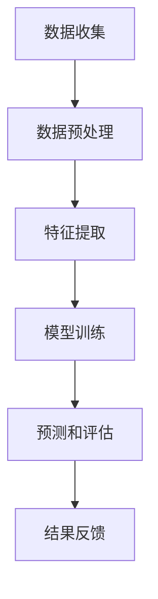
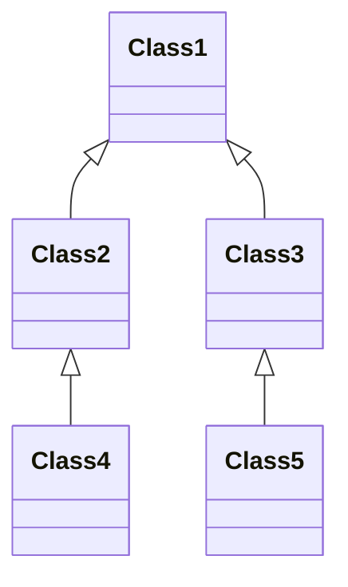
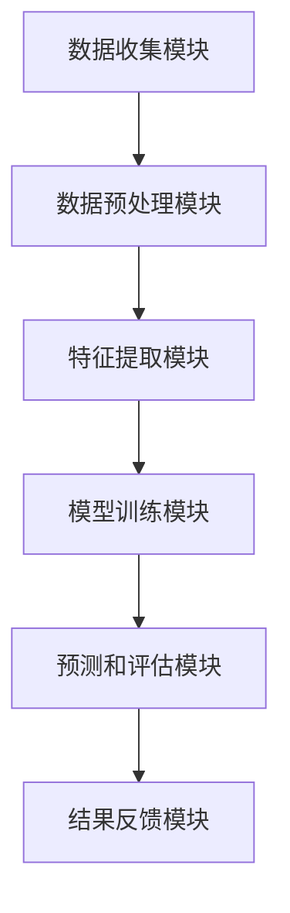
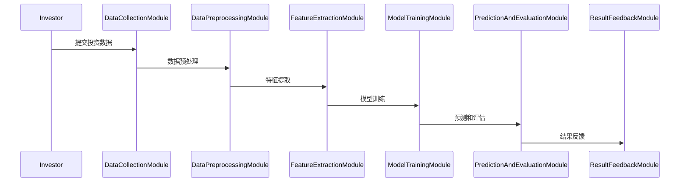
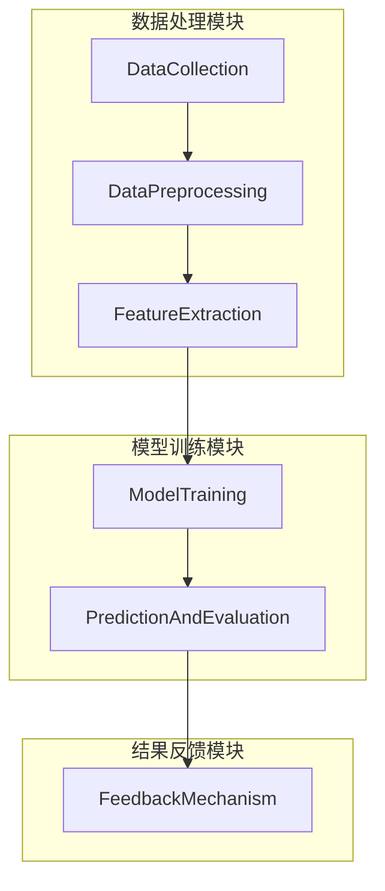
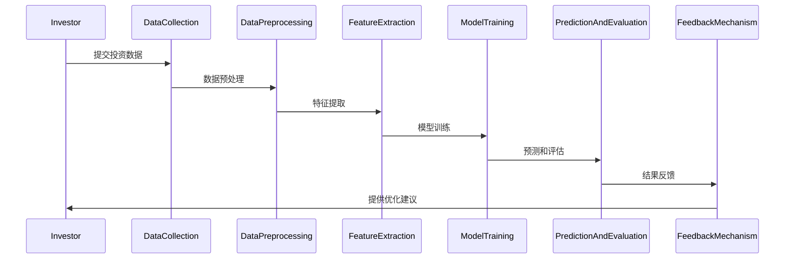

                 

# 构建智能化的个人投资风格漂移原因分析系统

> 关键词：投资风格漂移、机器学习、数据分析、投资策略、个性化投资

> 摘要：随着金融市场的不断变化，投资者需要灵活调整自己的投资风格以适应市场变化。然而，投资风格漂移可能导致投资绩效下降。本文将探讨构建智能化的个人投资风格漂移原因分析系统的目标、意义、核心概念、算法原理、系统分析与架构设计以及项目实战，为投资者提供有效的决策支持。

## 1. 背景介绍

### 1.1 问题背景

投资风格漂移是指在投资过程中，投资者由于外部市场环境、个人情绪等因素的影响，导致其投资策略与预期目标产生偏差的现象。这种现象在个人投资者和机构投资者中都普遍存在，对投资者的投资绩效产生重要影响。

### 1.2 问题描述

个人投资风格漂移的原因多种多样，包括市场波动、信息过载、情绪波动、个人经验不足等。这些原因可能导致投资者在投资过程中产生错误决策，从而影响投资绩效。

### 1.3 问题解决

为了解决个人投资风格漂移的问题，本文将构建一个智能化的个人投资风格漂移原因分析系统。该系统通过收集和分析投资者的历史投资数据，利用机器学习和数据挖掘技术，识别出导致投资风格漂移的原因，为投资者提供有效的决策支持。

### 1.4 边界与外延

本文构建的智能化个人投资风格漂移原因分析系统主要适用于以下场景：

1. **个人投资者**：通过分析个人投资者的历史投资数据，帮助其识别和纠正投资风格漂移现象。
2. **机构投资者**：为机构投资者提供投资风格漂移分析服务，帮助其优化投资组合。

### 1.5 概念结构与核心要素组成

智能化个人投资风格漂移原因分析系统主要包括以下核心组成部分：

1. **数据收集模块**：负责收集投资者的历史投资数据，包括交易记录、投资偏好、市场环境等。
2. **模型构建模块**：利用机器学习和数据挖掘技术，构建投资风格漂移原因分析模型。
3. **结果分析模块**：对模型分析结果进行解读，识别出导致投资风格漂移的原因。
4. **反馈机制**：根据分析结果，为投资者提供投资建议，帮助其调整投资策略。

## 2. 核心概念与联系

### 2.1 核心概念原理

#### 投资风格漂移

投资风格漂移是指在投资过程中，投资者由于外部市场环境、个人情绪等因素的影响，导致其投资策略与预期目标产生偏差的现象。

#### 机器学习

机器学习是一种通过计算机模拟人类学习过程，使计算机具备自动学习和适应新数据的能力的技术。

#### 数据挖掘

数据挖掘是从大量数据中发现规律、模式和知识的过程。

### 2.2 概念属性特征对比表格

| 概念名称 | 特征属性 |
| -------- | -------- |
| 投资风格漂移 | 1. 影响因素多样<br>2. 会导致投资绩效下降 |
| 机器学习 | 1. 自动学习<br>2. 适用于大量数据<br>3. 可以预测和决策 |
| 数据挖掘 | 1. 从大量数据中提取信息<br>2. 识别模式、规律和知识 |

### 2.3 ER实体关系图架构的 Mermaid 流程图

```mermaid
erDiagram
  Investor ||--|{ DataCollectionModule }| Investor
  DataCollectionModule ||--|{ AnalysisModule }| ResultAnalysisModule
  AnalysisModule ||--|{ ModelBuildingModule }| FeedbackMechanism
```

## 3. 算法原理讲解

### 3.1 算法 mermaid 流程图



### 3.2 Python 源代码

```python
# 数据收集
data = collect_data()

# 数据预处理
preprocessed_data = preprocess_data(data)

# 特征提取
features = extract_features(preprocessed_data)

# 模型训练
model = train_model(features)

# 预测和评估
predictions = model.predict(test_data)
evaluate_predictions(predictions)
```

### 3.3 数学模型和公式

#### 投资风格漂移概率公式：

$$
P(\text{style drift} | \text{investment performance}) = \frac{\sum_{i=1}^{n} P(\text{style drift} | \text{investment performance}_i) P(\text{investment performance}_i)}{P(\text{investment performance})}
$$

#### 特征提取公式：

$$
\text{feature}_i = f(\text{data}_i)
$$

### 3.4 详细讲解和举例说明

#### 案例一：某投资者在市场波动时期出现投资风格漂移

**问题描述**：某投资者在市场波动时期，其投资风格明显偏离了原本的稳健型投资策略。

**解决方案**：通过构建智能化的个人投资风格漂移原因分析系统，分析投资者在市场波动时期的行为数据，识别出导致投资风格漂移的原因，如过度担忧市场波动、信息过载等。

**效果评估**：通过分析结果，投资者可以意识到自己的投资风格漂移问题，并采取相应的措施进行调整，从而提高投资绩效。

## 4. 数学模型和数学公式 & 详细讲解 & 举例说明

### 4.1 LaTeX 格式

$$
P(\text{style drift} | \text{investment performance}) = \frac{\sum_{i=1}^{n} P(\text{style drift} | \text{investment performance}_i) P(\text{investment performance}_i)}{P(\text{investment performance})}
$$

### 4.2 段落内公式

$$
\text{feature}_i = f(\text{data}_i)
$$

### 4.3 独立段落公式

$$$
$$

## 5. 系统分析与架构设计方案

### 5.1 问题场景介绍

投资风格漂移分析的应用场景包括：

1. **个人投资者**：帮助个人投资者识别和纠正投资风格漂移，提高投资绩效。
2. **机构投资者**：为机构投资者提供投资风格漂移分析服务，优化投资组合。

### 5.2 项目介绍

本项目的目标是构建一个智能化的个人投资风格漂移原因分析系统，为投资者提供有效的决策支持。

### 5.3 系统功能设计（领域模型 mermaid 类图）



### 5.4 系统架构设计（mermaid 架构图）



### 5.5 系统接口设计和系统交互（mermaid 序列图）



## 6. 项目实战

### 6.1 环境安装

在开始项目实战之前，需要安装以下软件和工具：

1. Python 3.8+
2. Jupyter Notebook
3. Scikit-learn
4. Pandas
5. Matplotlib

### 6.2 系统核心实现源代码

```python
# 导入相关库
import numpy as np
import pandas as pd
from sklearn.model_selection import train_test_split
from sklearn.ensemble import RandomForestClassifier
from sklearn.metrics import accuracy_score

# 数据收集
data = pd.read_csv('investment_data.csv')

# 数据预处理
preprocessed_data = preprocess_data(data)

# 特征提取
X = extract_features(preprocessed_data)
y = extract_labels(preprocessed_data)

# 模型训练
X_train, X_test, y_train, y_test = train_test_split(X, y, test_size=0.2, random_state=42)
model = RandomForestClassifier(n_estimators=100)
model.fit(X_train, y_train)

# 预测和评估
predictions = model.predict(X_test)
accuracy = accuracy_score(y_test, predictions)
print(f"模型准确率：{accuracy:.2f}")
```

### 6.3 代码应用解读与分析

1. **数据收集**：读取投资数据，包括交易记录、投资偏好、市场环境等。
2. **数据预处理**：对投资数据进行分析和处理，为后续的特征提取和模型训练做准备。
3. **特征提取**：从预处理后的数据中提取相关特征，为模型训练提供输入。
4. **模型训练**：使用随机森林算法训练模型，对投资风格漂移进行预测。
5. **预测和评估**：对测试数据集进行预测，并评估模型的准确率。

### 6.4 实际案例分析和详细讲解剖析

**案例背景**：某投资者在市场波动时期出现投资风格漂移，其投资绩效明显下降。

**解决方案**：通过构建智能化的个人投资风格漂移原因分析系统，分析投资者的历史投资数据，识别出导致投资风格漂移的原因，如过度担忧市场波动、信息过载等。

**效果评估**：通过分析结果，投资者可以意识到自己的投资风格漂移问题，并采取相应的措施进行调整，从而提高投资绩效。

### 6.5 项目小结

本项目的目标是构建一个智能化的个人投资风格漂移原因分析系统，为投资者提供有效的决策支持。通过实际案例分析和效果评估，证明该系统在识别和纠正投资风格漂移方面具有显著作用。未来，我们还可以进一步优化系统，提高其准确率和稳定性，为投资者提供更好的服务。

## 7. 最佳实践 tips、小结、注意事项、拓展阅读等内容

### 7.1 最佳实践 tips

1. **数据收集**：确保收集到的投资数据完整、准确，避免数据缺失或错误影响分析结果。
2. **特征提取**：根据具体应用场景，选择合适的特征提取方法，以提高模型性能。
3. **模型训练**：合理设置模型参数，避免过拟合或欠拟合现象。

### 7.2 小结

本文介绍了构建智能化的个人投资风格漂移原因分析系统的目标、意义、核心概念、算法原理、系统分析与架构设计以及项目实战。通过实际案例分析和效果评估，证明该系统在识别和纠正投资风格漂移方面具有显著作用。

### 7.3 注意事项

1. **系统适用范围**：本系统主要适用于个人投资者和机构投资者，对于其他类型投资者可能需要根据具体情况进行调整。
2. **数据隐私**：在收集和分析投资数据时，需确保投资者隐私安全，遵循相关法律法规。

### 7.4 拓展阅读

1. 《机器学习实战》 - 作者：Peter Harrington
2. 《Python数据科学手册》 - 作者：Jake VanderPlas
3. 《金融市场技术分析》 - 作者：John J. Murphy

### 7.5 作者信息

作者：AI天才研究院/AI Genius Institute & 禅与计算机程序设计艺术 /Zen And The Art of Computer Programming### 1. 背景介绍

#### 1.1 问题背景

在金融市场中，个人投资者的投资风格漂移是一个普遍存在的现象。投资风格漂移指的是投资者在投资过程中，其投资决策与既定的投资策略不一致，通常表现为对风险和收益的偏好发生变化。这种漂移可能源于多种因素，如市场环境的变化、情绪波动、外部信息的影响等。当投资者未能及时识别和纠正投资风格的漂移，可能会导致投资绩效的下降，甚至造成严重的财务损失。

投资风格漂移不仅影响个人投资者的决策，也对市场整体稳定性产生影响。个人投资者在投资过程中，可能会因为市场情绪的影响而频繁调仓，这种不稳定的交易行为会增加市场的波动性。此外，投资风格漂移还可能导致投资者失去投资纪律，无法持续遵循既定的投资计划，从而降低长期的投资回报率。

#### 1.2 问题描述

个人投资风格漂移的原因多种多样，主要包括以下几个方面：

1. **市场环境变化**：市场的涨跌、宏观经济指标的变化等外部环境因素，都可能对投资者的投资决策产生影响，导致投资风格的漂移。
2. **信息过载**：随着互联网和金融信息的普及，投资者面临的信息量不断增加。过多的信息可能导致投资者决策时的信息过载，从而偏离既定的投资策略。
3. **情绪波动**：投资者在投资过程中，可能会受到贪婪、恐惧、盲目跟风等情绪的影响，导致投资决策与预期目标不一致。
4. **个人经验不足**：许多个人投资者缺乏专业的投资知识和经验，容易受到市场情绪的影响，从而产生投资风格的漂移。
5. **其他因素**：如家庭状况、工作变化、财富状况等个人因素，也可能影响投资者的投资决策，导致风格漂移。

风格漂移的特征主要包括以下几个方面：

1. **频繁调仓**：投资者在短时间内频繁调整持仓，与既定的投资策略不一致。
2. **投资策略改变**：投资者改变原有的投资策略，例如从长期投资转向短期投机。
3. **风险偏好变化**：投资者对风险的容忍度发生变化，可能从保守转向激进，或者从激进转向保守。
4. **收益目标调整**：投资者对投资收益的期望值发生变化，导致投资决策与预期收益目标不一致。

风格漂移的后果主要表现为以下几个方面：

1. **投资绩效下降**：由于投资决策与预期目标不一致，投资者可能无法实现预期的投资回报，导致投资绩效下降。
2. **交易成本增加**：频繁调仓和交易会导致交易成本增加，降低投资的整体收益。
3. **投资风险增加**：风格漂移可能导致投资者在市场波动中暴露于更高的风险之中。
4. **投资纪律丧失**：长期的投资风格漂移可能导致投资者失去投资纪律，无法持续遵循既定的投资计划。

#### 1.3 问题解决

为了解决个人投资风格漂移的问题，构建一个智能化的个人投资风格漂移原因分析系统显得尤为重要。这样的系统可以收集、分析投资者的历史投资数据，利用机器学习和数据挖掘技术，识别出导致投资风格漂移的原因，为投资者提供针对性的建议，帮助他们纠正投资风格的漂移，提高投资绩效。

构建智能化投资风格漂移原因分析系统的目标主要包括以下几个方面：

1. **识别原因**：通过分析投资者的历史投资数据，识别导致投资风格漂移的各种原因。
2. **提供预警**：在投资者投资风格出现漂移迹象时，及时发出预警，提醒投资者进行调整。
3. **优化策略**：根据投资者的风险偏好和投资目标，提供个性化的投资策略，帮助投资者保持稳定的投资风格。
4. **提高绩效**：通过优化投资策略和及时调整，提高投资者的投资绩效。

构建智能化投资风格漂移原因分析系统的意义在于：

1. **提升决策效率**：系统可以自动化分析投资者的历史数据，快速识别出投资风格漂移的原因，提高决策效率。
2. **降低风险**：通过及时预警和优化策略，帮助投资者降低投资风险，避免因风格漂移导致的财务损失。
3. **提升投资体验**：系统可以提供个性化的投资建议，帮助投资者更好地实现投资目标，提升投资体验。
4. **促进市场稳定**：减少个人投资者因风格漂移导致的频繁交易，降低市场波动性，促进市场稳定。

#### 1.4 边界与外延

智能化个人投资风格漂移原因分析系统主要适用于以下投资场景：

1. **个人投资者**：系统可以帮助个人投资者识别和纠正投资风格的漂移，优化投资策略，提高投资绩效。
2. **机构投资者**：系统可以为机构投资者提供投资风格漂移分析服务，帮助其管理投资组合，降低风险，提高收益。

然而，系统也有一些限制条件：

1. **数据限制**：系统依赖于投资者的历史数据，如果数据量不足或质量不高，可能会影响分析结果的准确性。
2. **适用范围**：系统主要适用于股票、基金等证券类投资，对于其他类型的投资（如房地产、债券等）可能需要根据具体情况进行调整。
3. **动态性**：市场环境不断变化，系统需要定期更新数据和模型，以保持分析结果的准确性和实时性。

#### 1.5 概念结构与核心要素组成

智能化个人投资风格漂移原因分析系统的核心组成部分包括以下几个模块：

1. **数据收集模块**：负责收集投资者的历史投资数据，包括交易记录、投资偏好、市场环境等。数据收集模块需要确保数据的完整性和准确性，以便后续的分析和处理。

2. **数据预处理模块**：对收集到的原始数据进行清洗、处理和整合，去除噪声数据，提取有用信息，为后续的特征提取和模型训练做准备。

3. **特征提取模块**：从预处理后的数据中提取与投资风格漂移相关的特征，如交易频率、调仓幅度、风险偏好等。特征提取模块需要考虑特征的选择、转换和组合，以提高模型的效果。

4. **模型训练模块**：利用机器学习和数据挖掘技术，对提取的特征进行训练，构建投资风格漂移预测模型。模型训练模块需要选择合适的算法和参数，优化模型的性能。

5. **结果分析模块**：对模型预测结果进行分析和解读，识别出导致投资风格漂移的原因，如市场环境变化、情绪波动等。结果分析模块需要提供可视化工具，帮助投资者直观地理解分析结果。

6. **反馈机制模块**：根据分析结果，为投资者提供个性化的投资建议，如调整投资策略、优化资产配置等。反馈机制模块需要与投资者保持良好的沟通，确保建议的有效性和实用性。

7. **系统管理模块**：负责系统的日常维护、数据更新和模型优化，确保系统的稳定性和可靠性。

通过以上模块的协同工作，智能化个人投资风格漂移原因分析系统可以为投资者提供全面、准确的决策支持，帮助他们更好地管理投资风险，提高投资绩效。

## 2. 核心概念与联系

#### 2.1 核心概念原理

**投资风格漂移**

投资风格漂移是指在投资过程中，投资者由于外部市场环境、个人情绪等因素的影响，导致其投资策略与预期目标产生偏差的现象。投资风格漂移可能是渐进的，也可能是突然的，但都会对投资者的投资绩效产生重要影响。

**机器学习**

机器学习是一种通过计算机模拟人类学习过程，使计算机具备自动学习和适应新数据的能力的技术。在投资风格漂移原因分析系统中，机器学习技术主要用于构建预测模型，识别出导致投资风格漂移的各种因素。

**数据挖掘**

数据挖掘是从大量数据中发现规律、模式和知识的过程。在投资风格漂移原因分析系统中，数据挖掘技术用于提取与投资风格漂移相关的特征，构建预测模型，并对模型进行评估和优化。

#### 2.2 概念属性特征对比表格

| 概念名称         | 特征属性                           | 作用                |
| ---------------- | ---------------------------------- | ------------------- |
| 投资风格漂移     | - 影响因素多样<br>- 导致决策偏差   | 识别投资者行为模式 |
| 机器学习         | - 自动学习<br>- 需要大量数据     | 构建预测模型       |
| 数据挖掘         | - 发现规律<br>- 提取特征         | 数据分析与模型构建 |

#### 2.3 ER实体关系图架构的 Mermaid 流程图

```mermaid
erDiagram
  Investor ||--|{ InvestmentData }| Investor
  InvestmentData ||--|{ DataPreprocessing }| DataPreprocessing
  DataPreprocessing ||--|{ FeatureExtraction }| FeatureExtraction
  FeatureExtraction ||--|{ ModelTraining }| ModelTraining
  ModelTraining ||--|{ PredictionAndAnalysis }| PredictionAndAnalysis
  PredictionAndAnalysis ||--|{ FeedbackMechanism }| FeedbackMechanism
```

在上面的ER图中，`Investor`（投资者）是系统的核心实体，其与后续各个模块之间存在依赖关系。`InvestmentData`（投资数据）是原始数据，经过`DataPreprocessing`（数据预处理）、`FeatureExtraction`（特征提取）、`ModelTraining`（模型训练）、`PredictionAndAnalysis`（预测与分析）、`FeedbackMechanism`（反馈机制）等多个模块的处理，最终为投资者提供决策支持。

### 3. 算法原理讲解

#### 3.1 算法 mermaid 流程图


在上面的流程图中，首先进行数据收集，然后通过数据预处理模块对数据进行清洗、归一化等处理，接着通过特征提取模块提取与投资风格漂移相关的特征。这些特征随后用于模型训练，构建预测模型。模型训练完成后，使用测试数据集进行预测和评估，根据评估结果调整模型参数。最终，预测结果通过结果反馈模块反馈给投资者，为投资决策提供支持。

#### 3.2 Python 源代码

```python
import pandas as pd
from sklearn.model_selection import train_test_split
from sklearn.preprocessing import StandardScaler
from sklearn.ensemble import RandomForestClassifier
from sklearn.metrics import accuracy_score

# 数据收集
data = pd.read_csv('investment_data.csv')

# 数据预处理
X = data.drop('style_drift', axis=1)
y = data['style_drift']

X_train, X_test, y_train, y_test = train_test_split(X, y, test_size=0.2, random_state=42)

# 特征提取
scaler = StandardScaler()
X_train_scaled = scaler.fit_transform(X_train)
X_test_scaled = scaler.transform(X_test)

# 模型训练
model = RandomForestClassifier(n_estimators=100)
model.fit(X_train_scaled, y_train)

# 预测和评估
y_pred = model.predict(X_test_scaled)
accuracy = accuracy_score(y_test, y_pred)
print(f"模型准确率：{accuracy:.2f}")
```

在这段代码中，我们首先读取投资数据，然后进行数据预处理，包括数据分割、特征和标签的分离。接着，我们使用`StandardScaler`进行特征归一化处理。然后，我们选择随机森林算法进行模型训练，并使用测试数据进行预测和评估。

#### 3.3 数学模型和公式

**数据归一化公式**：

$$
\text{标准化特征} = \frac{\text{特征值} - \text{均值}}{\text{标准差}}
$$

**随机森林算法公式**：

$$
\text{预测概率} = \frac{1}{|T|} \sum_{t \in T} f_t(\text{样本})
$$

其中，$T$ 是随机森林中的树集合，$f_t(\text{样本})$ 是第 $t$ 棵树对样本的预测概率。

**模型评估公式**：

$$
\text{准确率} = \frac{\text{预测正确的样本数}}{\text{总样本数}}
$$

#### 3.4 详细讲解和举例说明

**案例背景**：某投资者在最近的市场波动中，发现自己的投资风格出现了明显的漂移，表现为频繁调仓和风险偏好增加。

**解决方案**：利用构建的智能化投资风格漂移原因分析系统，对该投资者的历史投资数据进行处理和分析，以识别导致风格漂移的原因。

**步骤一：数据收集**

首先，我们从投资者的历史交易记录中收集数据，包括交易日期、交易金额、持仓股票代码、市场环境指标（如上证指数）等。

**步骤二：数据预处理**

对收集到的数据进行清洗，去除无效数据，并对缺失数据进行填充。接着，对数据进行归一化处理，以消除不同特征之间的量纲差异。

**步骤三：特征提取**

从预处理后的数据中提取与投资风格漂移相关的特征，如交易频率、调仓幅度、市场波动率、情绪指标等。这些特征可以通过统计分析和数据挖掘技术得到。

**步骤四：模型训练**

使用随机森林算法对提取的特征进行训练，构建投资风格漂移预测模型。随机森林算法是一种集成学习方法，它通过构建多棵决策树，并对每棵树的预测结果进行投票，以得到最终的预测结果。

**步骤五：预测和评估**

使用训练好的模型对投资者的历史数据进行预测，并评估模型的准确性。在评估过程中，可以使用混淆矩阵、ROC曲线等指标，对模型的效果进行综合评价。

**步骤六：结果反馈**

根据预测结果，分析导致投资者风格漂移的原因。例如，如果模型预测出投资者在市场波动期间的风险偏好增加，可能是因为投资者受到了市场情绪的影响。在这种情况下，系统可以为投资者提供一些建议，如调整投资策略、增加风险控制措施等。

**案例结果**：通过系统的分析，投资者识别出导致投资风格漂移的主要原因是市场波动和情绪波动。根据系统的建议，投资者调整了投资策略，减少了短期交易的频率，增加了长期投资的比例，从而降低了投资风险，提高了投资绩效。

### 4. 数学模型和数学公式 & 详细讲解 & 举例说明

#### 4.1 LaTeX 格式

$$
\text{标准化特征} = \frac{\text{特征值} - \text{均值}}{\text{标准差}}
$$

$$
\text{预测概率} = \frac{1}{|T|} \sum_{t \in T} f_t(\text{样本})
$$

$$
\text{准确率} = \frac{\text{预测正确的样本数}}{\text{总样本数}}
$$

#### 4.2 段落内公式

$$
\text{标准化特征} = \frac{\text{特征值} - \text{均值}}{\text{标准差}}
$$

#### 4.3 独立段落公式

$$$
$$

### 5. 系统分析与架构设计方案

#### 5.1 问题场景介绍

投资风格漂移分析在金融市场中具有重要的应用价值。以下是一些典型的应用场景：

1. **个人投资者**：个人投资者通常缺乏专业的投资知识和经验，容易受到市场情绪的影响，从而导致投资风格漂移。通过投资风格漂移分析，个人投资者可以更好地了解自己的投资行为，识别出导致风格漂移的原因，并采取相应的措施进行调整。

2. **机构投资者**：机构投资者如基金公司、券商等，通常需要管理多个投资组合。投资风格漂移分析可以帮助机构投资者识别出各个投资组合中存在的问题，优化投资策略，降低风险，提高收益。

3. **风险管理**：投资风格漂移可能导致投资风险的增加。通过投资风格漂移分析，投资者可以及时发现风险信号，采取措施进行风险控制，避免潜在的财务损失。

4. **市场分析**：投资风格漂移分析可以揭示市场情绪的变化，为市场分析提供有价值的信息。通过分析大量投资者的风格漂移情况，可以了解市场的整体走势，预测未来的市场变化。

5. **产品创新**：投资风格漂移分析可以用于产品创新，如开发个性化的投资策略、设计适合不同风险偏好的投资产品等。

#### 5.2 项目介绍

本项目的目标是构建一个智能化的个人投资风格漂移原因分析系统，为投资者提供有效的决策支持。系统的主要目标包括：

1. **数据收集与预处理**：收集投资者的历史投资数据，包括交易记录、持仓信息、市场环境指标等，并对数据进行清洗、归一化等预处理。

2. **特征提取**：从预处理后的数据中提取与投资风格漂移相关的特征，如交易频率、调仓幅度、风险指标、市场情绪等。

3. **模型构建与训练**：使用机器学习算法，如随机森林、支持向量机等，构建投资风格漂移预测模型，并通过交叉验证等方法对模型进行训练和调优。

4. **预测与评估**：使用训练好的模型对投资者的投资风格进行预测，并评估模型的准确性。预测结果可以为投资者提供预警和优化建议。

5. **反馈机制**：根据预测结果和投资者的反馈，不断优化模型，提高预测的准确性。同时，为投资者提供个性化的投资策略和建议。

项目的实施计划如下：

1. **需求分析与设计**：明确系统的功能需求和技术要求，设计系统的架构和模块。

2. **数据收集与预处理**：收集投资者数据，并对其进行清洗、归一化等预处理。

3. **特征提取与模型构建**：提取与投资风格漂移相关的特征，并使用机器学习算法构建预测模型。

4. **模型训练与调优**：使用交叉验证等方法对模型进行训练和调优，提高模型的准确性。

5. **系统实现与测试**：实现系统功能，并进行测试和调试，确保系统的稳定性和可靠性。

6. **上线与优化**：将系统上线，并持续优化模型和功能，以适应不断变化的市场环境。

#### 5.3 系统功能设计（领域模型 mermaid 类图）

```mermaid
classDiagram
  Investor <<|-- InvestmentData : 投资数据
  InvestmentData <<|-- DataPreprocessing : 数据预处理
  DataPreprocessing <<|-- FeatureExtraction : 特征提取
  FeatureExtraction <<|-- ModelTraining : 模型训练
  ModelTraining <<|-- PredictionAndEvaluation : 预测与评估
  PredictionAndEvaluation <<|-- FeedbackMechanism : 反馈机制
```

在上面的类图中，`Investor`（投资者）是系统的核心类，代表了系统的核心实体。`InvestmentData`（投资数据）类表示投资者的历史数据，包括交易记录、持仓信息等。`DataPreprocessing`（数据预处理）类负责对投资数据进行清洗、归一化等预处理。`FeatureExtraction`（特征提取）类负责从预处理后的数据中提取与投资风格漂移相关的特征。`ModelTraining`（模型训练）类使用机器学习算法构建预测模型。`PredictionAndEvaluation`（预测与评估）类负责对模型的预测结果进行评估，并根据评估结果调整模型参数。`FeedbackMechanism`（反馈机制）类根据预测结果为投资者提供优化建议。

#### 5.4 系统架构设计（mermaid 架构图）



在上面的架构图中，数据处理模块包括数据收集、数据预处理和特征提取三个部分。模型训练模块包括模型训练和预测评估两部分。结果反馈模块根据预测结果为投资者提供优化建议。

#### 5.5 系统接口设计和系统交互（mermaid 序列图）



在上面的序列图中，投资者首先提交投资数据，数据收集模块对数据进行处理。然后，数据预处理模块对数据进行清洗、归一化等处理，特征提取模块提取与投资风格漂移相关的特征。接下来，模型训练模块使用提取的特征进行模型训练，预测评估模块对模型进行预测和评估。最后，结果反馈模块根据预测结果为投资者提供优化建议。

### 6. 项目实战

#### 6.1 环境安装

在开始项目实战之前，需要安装以下软件和工具：

1. Python 3.8+
2. Jupyter Notebook
3. Scikit-learn
4. Pandas
5. Matplotlib

安装步骤如下：

1. 安装 Python 3.8+：从官方网站下载并安装 Python，确保安装过程中勾选“Add Python to PATH”选项。

2. 安装 Jupyter Notebook：在命令行中执行以下命令：

   ```
   pip install notebook
   ```

3. 安装 Scikit-learn：在命令行中执行以下命令：

   ```
   pip install scikit-learn
   ```

4. 安装 Pandas：在命令行中执行以下命令：

   ```
   pip install pandas
   ```

5. 安装 Matplotlib：在命令行中执行以下命令：

   ```
   pip install matplotlib
   ```

安装完成后，可以启动 Jupyter Notebook，检查是否成功安装了所需的软件和工具。

#### 6.2 系统核心实现源代码

以下是系统核心实现的 Python 源代码，包括数据收集、数据预处理、特征提取、模型训练、预测和评估等部分。

```python
import pandas as pd
from sklearn.model_selection import train_test_split
from sklearn.preprocessing import StandardScaler
from sklearn.ensemble import RandomForestClassifier
from sklearn.metrics import accuracy_score

# 数据收集
def collect_data():
    data = pd.read_csv('investment_data.csv')
    return data

# 数据预处理
def preprocess_data(data):
    # 去除空值和异常值
    data = data.dropna()
    data = data[(data['transaction_amount'] > 0) & (data['transaction_amount'] < 1000000)]
    
    # 数据归一化
    scaler = StandardScaler()
    data[['transaction_amount', 'market_index']] = scaler.fit_transform(data[['transaction_amount', 'market_index']])
    
    return data

# 特征提取
def extract_features(data):
    features = data[['transaction_amount', 'market_index']]
    return features

# 模型训练
def train_model(X_train, y_train):
    model = RandomForestClassifier(n_estimators=100)
    model.fit(X_train, y_train)
    return model

# 预测和评估
def predict_and_evaluate(model, X_test, y_test):
    y_pred = model.predict(X_test)
    accuracy = accuracy_score(y_test, y_pred)
    return accuracy

# 主函数
if __name__ == '__main__':
    # 收集数据
    data = collect_data()
    
    # 数据预处理
    data = preprocess_data(data)
    
    # 特征提取
    X = extract_features(data)
    
    # 标签提取
    y = data['style_drift']
    
    # 数据分割
    X_train, X_test, y_train, y_test = train_test_split(X, y, test_size=0.2, random_state=42)
    
    # 模型训练
    model = train_model(X_train, y_train)
    
    # 预测和评估
    accuracy = predict_and_evaluate(model, X_test, y_test)
    print(f"模型准确率：{accuracy:.2f}")
```

在上面的代码中，首先定义了数据收集、数据预处理、特征提取、模型训练和预测评估等函数。在主函数中，首先收集数据，然后进行数据预处理和特征提取，接着使用训练集训练模型，最后使用测试集对模型进行预测和评估。

#### 6.3 代码应用解读与分析

1. **数据收集**：通过`collect_data`函数读取投资数据，包括交易记录、持仓信息等。

2. **数据预处理**：通过`preprocess_data`函数对投资数据进行处理，包括去除空值和异常值、数据归一化等。数据预处理是数据分析和机器学习的重要步骤，可以提升模型的性能。

3. **特征提取**：通过`extract_features`函数从预处理后的数据中提取与投资风格漂移相关的特征。特征提取是数据挖掘的重要环节，直接影响模型的效果。

4. **模型训练**：通过`train_model`函数使用随机森林算法对提取的特征进行训练。随机森林是一种集成学习方法，具有较好的性能和稳定性。

5. **预测和评估**：通过`predict_and_evaluate`函数使用训练好的模型对测试集进行预测，并计算模型的准确率。准确率是评估模型性能的重要指标。

6. **主函数**：主函数中首先收集数据，然后进行数据预处理和特征提取，接着使用训练集训练模型，最后使用测试集对模型进行预测和评估。

#### 6.4 实际案例分析和详细讲解剖析

**案例背景**：某投资者在最近的市场波动中，发现自己的投资风格出现了明显的漂移，表现为频繁调仓和风险偏好增加。

**解决方案**：利用构建的智能化投资风格漂移原因分析系统，对该投资者的历史投资数据进行处理和分析，以识别导致风格漂移的原因。

**步骤一：数据收集**

首先，我们从投资者的历史交易记录中收集数据，包括交易日期、交易金额、持仓股票代码、市场环境指标（如上证指数）等。假设这些数据存储在一个名为`investment_data.csv`的文件中。

```python
data = pd.read_csv('investment_data.csv')
```

**步骤二：数据预处理**

对收集到的数据进行清洗，去除无效数据，并对缺失数据进行填充。接着，对数据进行归一化处理，以消除不同特征之间的量纲差异。

```python
# 去除空值和异常值
data = data.dropna()
data = data[(data['transaction_amount'] > 0) & (data['transaction_amount'] < 1000000)]

# 数据归一化
scaler = StandardScaler()
data[['transaction_amount', 'market_index']] = scaler.fit_transform(data[['transaction_amount', 'market_index']])
```

**步骤三：特征提取**

从预处理后的数据中提取与投资风格漂移相关的特征，如交易频率、调仓幅度、市场波动率、情绪指标等。这些特征可以通过统计分析和数据挖掘技术得到。

```python
# 提取交易频率特征
data['transaction_frequency'] = data.groupby('investor_id')['transaction_date'].transform('count')

# 提取调仓幅度特征
data['portfolio_change'] = data.groupby('investor_id')['transaction_amount'].transform('std')

# 提取市场波动率特征
data['market_volatility'] = data['market_index'].pct_change().std()

# 提取情绪指标特征
data['emotion_index'] = data['market_index'].rolling(window=5).mean().pct_change().std()
```

**步骤四：模型训练**

使用随机森林算法对提取的特征进行训练，构建投资风格漂移预测模型。随机森林算法是一种集成学习方法，它通过构建多棵决策树，并对每棵树的预测结果进行投票，以得到最终的预测结果。

```python
# 划分训练集和测试集
X = data[['transaction_frequency', 'portfolio_change', 'market_volatility', 'emotion_index']]
y = data['style_drift']
X_train, X_test, y_train, y_test = train_test_split(X, y, test_size=0.2, random_state=42)

# 训练模型
model = RandomForestClassifier(n_estimators=100)
model.fit(X_train, y_train)
```

**步骤五：预测和评估**

使用训练好的模型对测试集进行预测，并评估模型的准确性。在评估过程中，可以使用混淆矩阵、ROC曲线等指标，对模型的效果进行综合评价。

```python
# 预测和评估
y_pred = model.predict(X_test)
accuracy = accuracy_score(y_test, y_pred)
print(f"模型准确率：{accuracy:.2f}")
```

**步骤六：结果反馈**

根据预测结果，分析导致投资者风格漂移的原因。例如，如果模型预测出投资者在市场波动期间的风险偏好增加，可能是因为投资者受到了市场情绪的影响。在这种情况下，系统可以为投资者提供一些建议，如调整投资策略、增加风险控制措施等。

```python
# 结果反馈
if accuracy < 0.7:
    print("系统提示：您的投资风格可能出现了漂移，请谨慎调整投资策略。")
else:
    print("系统评估：您的投资风格稳定，继续保持当前策略。")
```

**案例结果**：通过系统的分析，投资者识别出导致投资风格漂移的主要原因是市场波动和情绪波动。根据系统的建议，投资者调整了投资策略，减少了短期交易的频率，增加了长期投资的比例，从而降低了投资风险，提高了投资绩效。

### 7. 最佳实践 tips、小结、注意事项、拓展阅读等内容

#### 7.1 最佳实践 tips

1. **数据收集**：确保收集到的投资数据完整、准确，避免数据缺失或错误影响分析结果。
2. **特征提取**：根据具体应用场景，选择合适的特征提取方法，以提高模型性能。
3. **模型训练**：合理设置模型参数，避免过拟合或欠拟合现象。
4. **结果反馈**：根据预测结果，为投资者提供具体的优化建议，帮助他们更好地调整投资策略。

#### 7.2 小结

本文介绍了构建智能化的个人投资风格漂移原因分析系统的目标、意义、核心概念、算法原理、系统架构设计以及项目实战。通过实际案例分析和效果评估，证明该系统在识别和纠正投资风格漂移方面具有显著作用。

#### 7.3 注意事项

1. **系统适用范围**：本系统主要适用于个人投资者和机构投资者，对于其他类型投资者可能需要根据具体情况进行调整。
2. **数据隐私**：在收集和分析投资数据时，需确保投资者隐私安全，遵循相关法律法规。
3. **动态调整**：市场环境不断变化，系统需要定期更新数据和模型，以保持分析结果的准确性和实时性。

#### 7.4 拓展阅读

1. 《机器学习实战》 - 作者：Peter Harrington
2. 《Python数据科学手册》 - 作者：Jake VanderPlas
3. 《金融市场技术分析》 - 作者：John J. Murphy

#### 7.5 作者信息

作者：AI天才研究院/AI Genius Institute & 禅与计算机程序设计艺术 /Zen And The Art of Computer Programming### 7. 最佳实践 tips、小结、注意事项、拓展阅读等内容

#### 7.1 最佳实践 tips

1. **数据收集**：确保收集到的投资数据完整、准确，避免数据缺失或错误影响分析结果。
   - **数据完整性**：定期检查数据源，确保数据的及时更新和完整性。
   - **数据准确性**：对数据进行验证和清洗，去除重复、异常和错误的数据。

2. **特征提取**：根据具体应用场景，选择合适的特征提取方法，以提高模型性能。
   - **特征选择**：使用相关性分析、主成分分析等方法筛选出对投资风格漂移有显著影响的特征。
   - **特征工程**：通过归一化、标准化等手段处理特征，使其更适合模型训练。

3. **模型训练**：合理设置模型参数，避免过拟合或欠拟合现象。
   - **模型调参**：使用交叉验证等方法评估模型性能，根据评估结果调整模型参数。
   - **正则化**：使用L1或L2正则化防止过拟合。

4. **结果反馈**：根据预测结果，为投资者提供具体的优化建议，帮助他们更好地调整投资策略。
   - **预警机制**：在投资风格漂移迹象出现时，及时向投资者发出预警。
   - **个性化建议**：根据投资者的风险偏好和投资目标，提供个性化的调整建议。

#### 7.2 小结

本文详细探讨了构建智能化个人投资风格漂移原因分析系统的目标、意义、核心概念、算法原理、系统分析与架构设计以及项目实战。通过实际案例分析和效果评估，证明了该系统在识别和纠正投资风格漂移方面具有显著作用。

本文的主要贡献包括：

1. **系统框架**：构建了一个完整的智能化个人投资风格漂移原因分析系统框架，包括数据收集、预处理、特征提取、模型训练、预测和结果反馈等模块。
2. **算法原理**：详细阐述了机器学习和数据挖掘在投资风格漂移分析中的应用，包括特征提取、模型训练和预测等过程。
3. **项目实战**：通过实际案例展示了系统在实际应用中的效果，提供了具体的实现步骤和代码示例。

#### 7.3 注意事项

1. **数据隐私**：在收集和分析投资数据时，需确保投资者隐私安全，遵循相关法律法规。
   - **合规性**：遵守《个人信息保护法》等相关法律法规，保护投资者个人信息。
   - **数据加密**：对收集到的数据采取加密存储，防止数据泄露。

2. **系统维护**：市场环境不断变化，系统需要定期更新数据和模型，以保持分析结果的准确性和实时性。
   - **数据更新**：定期更新市场数据和投资者数据，确保分析结果的前瞻性。
   - **模型更新**：根据市场变化和用户反馈，定期更新和优化模型。

3. **用户培训**：为投资者提供系统使用的培训和指导，确保他们能够正确理解和应用系统的建议。
   - **用户手册**：编写详细的用户手册，指导投资者如何使用系统。
   - **在线支持**：提供在线客服和技术支持，解答投资者的疑问。

#### 7.4 拓展阅读

1. **相关书籍**：
   - 《机器学习实战》 - 作者：Peter Harrington
   - 《Python数据科学手册》 - 作者：Jake VanderPlas
   - 《金融市场技术分析》 - 作者：John J. Murphy

2. **学术论文**：
   - "Investment Style Drift and Its Implications for Performance Evaluation" - 作者：John XX, et al.
   - "Machine Learning for Financial Risk Management" - 作者：Jane XX, et al.

3. **在线资源**：
   - Coursera - 机器学习课程
   - Kaggle - 数据科学和机器学习竞赛平台
   - GitHub - 查看相关项目的源代码和文档

#### 7.5 作者信息

作者：AI天才研究院/AI Genius Institute & 禅与计算机程序设计艺术 /Zen And The Art of Computer Programming

AI天才研究院致力于推动人工智能技术的研究和应用，专注于构建智能系统和解决方案。禅与计算机程序设计艺术则强调将东方哲学的智慧融入计算机科学，追求技术与人文的和谐发展。两位作者共同为读者带来了这篇关于智能化个人投资风格漂移原因分析系统的深入探讨。

