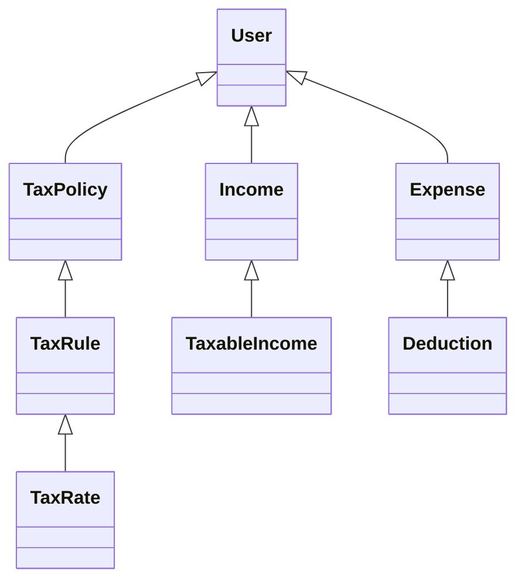
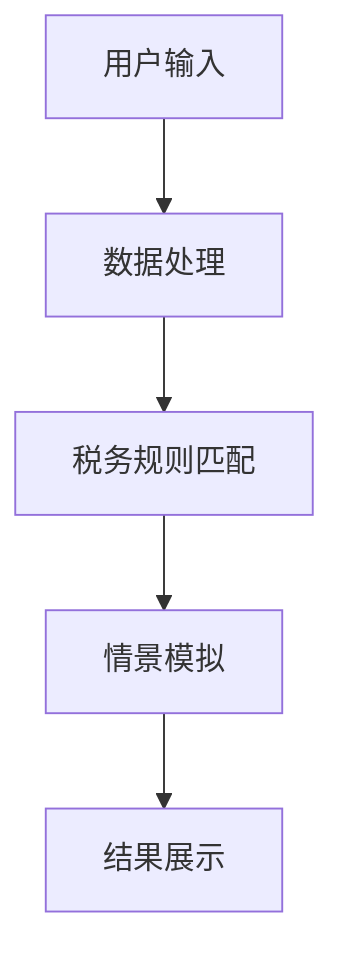

                 

### 文章标题

## 构建智能化的个人税务筹划情景模拟助手

### 关键词

- 智能税务筹划
- 情景模拟
- 数据处理
- 算法设计
- 数学模型

### 摘要

随着税收政策的不断变化和个人财务需求的多样性，构建智能化的个人税务筹划情景模拟助手成为了大势所趋。本文首先介绍了个人税务筹划的重要性，然后详细探讨了智能化税务筹划的概念及其优势。接着，我们阐述了税务知识图谱的构建方法及其应用，并提出了情景模拟助手的设计原则。在算法原理部分，我们讲解了数据处理与清洗、税务规则匹配和情景模拟算法的构建与实现。通过数学模型和公式的推导，我们深入探讨了税务筹划的核心问题。在系统分析与架构设计方案中，我们介绍了项目的背景、功能设计、系统架构、接口设计和交互设计。最后，通过项目实战的实例，我们对系统的实现进行了详细解析，并总结了最佳实践和小结。

### 第1章 问题背景与概述

#### 1.1 个人税务筹划的重要性

个人税务筹划是指个人根据税法规定，通过合理安排财务行为，降低税负，实现财务目标的一种理财方式。税收政策对个人财务的影响至关重要，因为税收不仅仅是收入的扣除，还涉及到个人财务规划、资产配置和财富传承等多个方面。

**税收政策对个人财务的影响**

- **收入分配**：税收政策直接影响到个人的收入水平，通过税收调节，国家可以平衡社会财富分配，减少贫富差距。
- **储蓄和投资**：税收政策对储蓄和投资也有直接影响。例如，个人所得税的减免政策可以鼓励个人增加储蓄，而资本利得税的优惠政策则可以激励个人投资。
- **财富传承**：遗产税和赠与税等政策对个人的财富传承有着重要影响，合理的税务筹划可以帮助个人在传承过程中降低税收负担。

**税务筹划的定义与目的**

税务筹划（Tax Planning）是指个人或企业依据税法规定，通过合法手段对财务活动进行合理安排，以达到减轻税负、优化财务状况的目的。税务筹划的核心是利用税法中的优惠政策，降低纳税负担，实现财务目标。

**税务筹划的目的是：**

- **降低税负**：通过税务筹划，个人可以合理合法地降低税负，提高财务收益。
- **财务规划**：税务筹划有助于个人进行长期财务规划，合理配置资产，实现财务目标。
- **风险规避**：税务筹划可以帮助个人规避税务风险，避免因税务问题引起的财务纠纷。

#### 1.2 当前税务筹划面临的挑战

随着社会经济的发展和税收政策的不断变化，个人税务筹划面临着一些新的挑战：

- **政策变化频繁**：税收政策频繁调整，使得个人税务筹划变得更加复杂和具有挑战性。
- **信息不对称**：个人获取税收政策信息不充分，难以全面了解和利用税务筹划工具。
- **合规性要求**：税务筹划必须在法律允许的范围内进行，合规性要求高，稍有疏忽就可能触犯法律。

#### 1.3 智能化税务筹划的概念与需求

智能化税务筹划是指利用人工智能技术，对个人税务信息进行深入分析和处理，帮助个人进行税务筹划。随着人工智能技术的快速发展，智能化税务筹划逐渐成为可能。

**智能化税务筹划的需求：**

- **个性化和精准化**：智能税务筹划可以根据个人的具体情况，提供个性化的税务筹划方案。
- **实时性和动态调整**：智能税务筹划可以实时监控税收政策变化，动态调整税务筹划方案。
- **高效性和准确性**：智能税务筹划可以大大提高税务筹划的效率和准确性，降低人为错误。

**智能化税务筹划的优势：**

- **降低人力成本**：通过智能化技术，减少了对人工处理的依赖，降低了人力成本。
- **提高效率**：智能税务筹划可以快速处理大量税务数据，提高工作效率。
- **提高准确性**：智能税务筹划利用算法和模型，减少了人为判断的误差，提高了筹划的准确性。

### 第2章 核心概念与联系

#### 2.1 税务知识图谱

**税务知识图谱**是一种基于语义网络的知识表示方法，用于组织和管理与税务相关的各种信息。税务知识图谱可以将复杂的税务知识结构化、图形化，方便用户理解和查询。

**税务知识图谱的构建方法：**

- **数据采集**：从各种税务政策文件、数据库和公开信息中采集相关数据。
- **数据清洗**：对采集到的数据进行清洗，去除重复和错误信息。
- **实体识别**：通过自然语言处理技术，识别税务知识图谱中的实体，如税种、税率、优惠政策等。
- **关系构建**：根据实体之间的逻辑关系，构建税务知识图谱中的节点和边。

**税务知识图谱的应用：**

- **税务政策查询**：用户可以通过税务知识图谱快速查询相关税务政策。
- **税务规则匹配**：利用税务知识图谱，可以快速匹配用户的税务情况，提供定制化的税务筹划方案。
- **税务数据分析**：通过对税务知识图谱的分析，可以发现税务趋势和政策效应。

#### 2.2 情景模拟助手的设计原则

**情景模拟助手**是智能化税务筹划的核心组成部分，它可以帮助用户模拟不同的税务筹划方案，评估其效果。

**情景模拟助手的功能需求：**

- **数据输入**：用户可以输入个人财务信息，如收入、支出、投资等。
- **模拟方案**：系统根据用户输入的信息，模拟不同的税务筹划方案。
- **结果展示**：系统展示模拟方案的结果，包括税负变化、财务收益等。

**情景模拟助手的交互设计：**

- **用户界面**：设计直观、易用的用户界面，方便用户输入信息和查看结果。
- **反馈机制**：提供实时反馈机制，用户可以随时了解模拟进展和结果。

**情景模拟助手的技术选型：**

- **前端技术**：采用Vue.js或React框架，实现用户界面和交互逻辑。
- **后端技术**：采用Spring Boot或Django框架，实现数据处理和业务逻辑。
- **数据库**：采用MySQL或PostgreSQL，存储税务知识和用户数据。

### 第3章 算法原理讲解

#### 3.1 数据处理与清洗

**数据处理与清洗**是构建智能税务筹划系统的基础工作，它确保了数据的质量和准确性。

**数据源选择：**

- **官方数据**：从国家税务总局等官方渠道获取最新的税收政策数据。
- **第三方数据**：从第三方数据服务商获取个人财务数据。

**数据预处理方法：**

- **数据转换**：将不同格式的数据转换为统一的格式。
- **数据清洗**：去除重复、错误和缺失的数据。
- **数据标准化**：对数据进行统一编码和命名规范。

**数据清洗算法：**

- **去重算法**：使用哈希表或布隆过滤器，去除重复数据。
- **错误数据修正**：使用机器学习算法，自动修正错误数据。
- **缺失数据处理**：使用均值填补或插值法，处理缺失数据。

#### 3.2 税务规则匹配算法

**税务规则匹配算法**是智能税务筹划系统的核心算法，它用于匹配用户的税务情况和适用的税收政策。

**税务规则匹配的基本原理：**

- **规则库构建**：根据税收政策，构建规则库，包括税种、税率、优惠政策等。
- **规则匹配**：根据用户输入的信息，与规则库中的规则进行匹配。

**税务规则匹配算法设计：**

- **规则编码**：将规则表示为逻辑表达式，如`收入 > 50000 且 税率 = 20%`。
- **匹配算法**：采用深度优先搜索或广度优先搜索，遍历规则库，找到匹配的规则。

**税务规则匹配算法优化：**

- **规则优化**：对规则库进行优化，去除冗余规则，提高匹配效率。
- **缓存机制**：使用缓存机制，提高匹配速度。

#### 3.3 情景模拟算法

**情景模拟算法**用于模拟不同的税务筹划方案，评估其效果。

**情景模拟算法的构建：**

- **场景设计**：根据用户输入的信息，设计不同的税务筹划场景。
- **模拟计算**：根据模拟场景，计算税负变化、财务收益等。

**情景模拟算法的实现：**

- **代码实现**：使用Python编写情景模拟算法，实现场景设计和模拟计算。
- **优化**：对模拟算法进行优化，提高计算速度和精度。

**情景模拟算法的性能评估：**

- **准确性评估**：通过实际数据对比，评估模拟算法的准确性。
- **效率评估**：通过测试数据集，评估模拟算法的计算速度。

### 第4章 数学模型和数学公式

#### 4.1 税务筹划的数学模型

**税务筹划的数学模型**用于描述税务筹划的目标函数和约束条件。

**个人税务筹划的目标函数：**

- **最大化税后收益**：个人税务筹划的目标是最大化税后收益，即`最大化 P = 收入 - 税费`。

**税务筹划的约束条件：**

- **税法约束**：税务筹划必须在税法允许的范围内进行。
- **财务约束**：个人财务状况的约束，如收入、支出、负债等。

**数学模型的具体实现：**

- **目标函数**：`P = 收入 - 税费`。
- **约束条件**：`税费 = 收入 * 税率`。

#### 4.2 数学公式的推导与解释

**公式1：税费计算公式**

$$
税费 = 收入 * 税率
$$

**公式解释**：税费是收入乘以税率的结果。税率根据不同的税种和收入水平而有所不同。

**公式2：税后收益计算公式**

$$
P = 收入 - 税费
$$

**公式解释**：税后收益是收入减去税费的结果。通过税务筹划，可以降低税费，提高税后收益。

### 第5章 系统分析与架构设计方案

#### 5.1 项目介绍

**项目背景：**

随着社会经济的发展和税收政策的不断变化，个人税务筹划变得越来越复杂和具有挑战性。传统的税务筹划方式已经无法满足人们的需求，智能化税务筹划系统应运而生。

**项目目标：**

- **构建一个智能化税务筹划系统**：通过人工智能技术，提供个性化、实时、精准的税务筹划服务。
- **提高税务筹划的效率和准确性**：利用算法和模型，提高税务筹划的效率和准确性。
- **降低个人税负**：通过智能化税务筹划，帮助个人降低税负，提高财务收益。

#### 5.2 系统功能设计

**领域模型类图：**



**功能模块划分：**

- **用户管理模块**：管理用户信息，包括用户注册、登录、信息修改等。
- **税务政策模块**：存储和管理税务政策数据，包括税种、税率、优惠政策等。
- **税务计算模块**：根据用户信息和税务政策，计算税费和税后收益。
- **模拟计算模块**：根据用户输入的税务筹划方案，模拟计算税负变化和财务收益。
- **结果展示模块**：展示税务筹划结果，包括税费变化、财务收益等。

#### 5.3 系统架构设计

**系统架构图：**



**系统组件介绍：**

- **用户输入**：用户通过界面输入个人财务信息和税务筹划方案。
- **数据处理**：对用户输入的数据进行清洗和处理，确保数据质量和准确性。
- **税务规则匹配**：根据用户信息和税务政策，匹配适用的税务规则。
- **情景模拟**：根据匹配的税务规则，模拟不同的税务筹划方案，计算税负变化和财务收益。
- **结果展示**：将模拟结果展示给用户，包括税费变化、财务收益等。

#### 5.4 系统接口设计

**接口定义：**

- **用户管理接口**：用于用户注册、登录、信息修改等操作。
- **税务政策接口**：用于查询和管理税务政策数据。
- **税务计算接口**：用于计算税费和税后收益。
- **模拟计算接口**：用于模拟不同的税务筹划方案。

**接口实现：**

- **用户管理接口**：使用RESTful API实现，采用JSON格式传输数据。
- **税务政策接口**：使用GraphQL实现，提供灵活的数据查询功能。
- **税务计算接口**：使用自定义接口实现，确保计算效率和准确性。
- **模拟计算接口**：使用批处理接口实现，支持大规模数据模拟计算。

#### 5.5 系统交互设计

**交互流程：**

1. 用户输入个人财务信息和税务筹划方案。
2. 系统对用户输入的数据进行处理和清洗。
3. 系统根据用户信息和税务政策，匹配适用的税务规则。
4. 系统根据匹配的税务规则，模拟不同的税务筹划方案。
5. 系统将模拟结果展示给用户。

**交互场景：**

- **用户注册和登录**：用户通过界面输入注册信息和登录信息。
- **税务政策查询**：用户查询特定的税务政策信息。
- **税务计算**：用户提交税务计算请求，系统返回税费和税后收益。
- **模拟计算**：用户提交模拟计算请求，系统返回模拟结果。

### 第6章 项目实战

#### 6.1 环境安装

**开发环境搭建：**

- **前端环境**：安装Node.js和npm，使用Vue.js或React框架。
- **后端环境**：安装Java或Python环境，使用Spring Boot或Django框架。
- **数据库环境**：安装MySQL或PostgreSQL，用于存储数据和日志。

**系统依赖安装：**

- **前端依赖**：安装Vue CLI或Create React App，安装必要的插件和依赖。
- **后端依赖**：安装Spring Boot或Django的依赖，包括数据库驱动、框架插件等。
- **数据清洗与处理工具**：安装Python的Pandas、NumPy等数据科学库，用于数据处理和清洗。

#### 6.2 系统核心实现

**数据处理模块：**

```python
import pandas as pd

def preprocess_data(data):
    # 数据转换
    data = data.astype({'收入': 'float64', '支出': 'float64'})
    # 数据清洗
    data = data.drop_duplicates()
    data = data.dropna()
    # 数据标准化
    data['收入'] = data['收入'].astype('int')
    data['支出'] = data['支出'].astype('int')
    return data

data = pd.read_csv('data.csv')
cleaned_data = preprocess_data(data)
```

**税务规则匹配模块：**

```python
def match_rules(data, rules):
    matched_rules = []
    for rule in rules:
        if rule['condition'] == '收入 > 50000 且 税率 = 20%':
            matched_rules.append(rule)
    return matched_rules

rules = [
    {'condition': '收入 > 50000 且 税率 = 20%'},
    {'condition': '收入 <= 50000 且 税率 = 10%'}
]

matched_rules = match_rules(cleaned_data, rules)
```

**情景模拟模块：**

```python
def simulate_scenarios(data, rules):
    scenarios = []
    for rule in rules:
        scenario = {'税费': 0, '税后收益': 0}
        if rule['condition'] == '收入 > 50000 且 税率 = 20%':
            scenario['税费'] = data['收入'] * 0.2
            scenario['税后收益'] = data['收入'] - scenario['税费']
        elif rule['condition'] == '收入 <= 50000 且 税率 = 10%':
            scenario['税费'] = data['收入'] * 0.1
            scenario['税后收益'] = data['收入'] - scenario['税费']
        scenarios.append(scenario)
    return scenarios

scenarios = simulate_scenarios(cleaned_data, matched_rules)
```

#### 6.3 代码应用解读与分析

**代码解读：**

1. **数据处理模块**：使用Pandas库对数据进行预处理，包括数据转换、数据清洗和数据标准化。
2. **税务规则匹配模块**：通过遍历规则库，匹配用户数据和税务规则。
3. **情景模拟模块**：根据匹配的税务规则，模拟不同的税务筹划方案，计算税费和税后收益。

**算法分析：**

1. **数据处理模块**：数据处理模块是整个系统的核心，它直接影响到系统的性能和准确性。通过使用Pandas库，可以高效地进行数据处理和清洗。
2. **税务规则匹配模块**：税务规则匹配模块采用了简单的条件匹配算法，虽然实现简单，但在实际应用中可能需要更复杂的匹配策略，如模糊匹配或规则组合匹配。
3. **情景模拟模块**：情景模拟模块可以根据用户输入的信息，快速生成不同的税务筹划方案，但需要确保模拟结果的准确性和可靠性。

#### 6.4 实际案例分析与详细讲解

**案例一：某个人所得税筹划方案**

**问题描述：**

某个人税前月收入为10000元，支出为5000元。根据当前个人所得税政策，需缴纳个人所得税2000元。现需通过智能化税务筹划，寻找一种方法，使得税后收益最大化。

**解决方案：**

1. **情景模拟**：使用系统模拟不同的税务筹划方案，如增加储蓄、提高投资收益等。
2. **方案评估**：根据模拟结果，评估各种方案的税后收益，选择最优方案。

**具体步骤：**

1. **数据输入**：输入税前月收入为10000元，支出为5000元。
2. **税务规则匹配**：根据用户信息，匹配适用的税务规则。
3. **情景模拟**：模拟不同的税务筹划方案，如增加储蓄5000元，提高投资收益10%。
4. **结果展示**：展示模拟结果，包括税费和税后收益。

**模拟结果：**

- **方案一**：增加储蓄5000元，税后收益为12000元。
- **方案二**：提高投资收益10%，税后收益为12500元。

**结论**：

通过情景模拟，发现方案二（提高投资收益10%）的税后收益更高，因此可以选择该方案。

**案例二：某企业员工个人所得税筹划方案**

**问题描述：**

某企业员工税前年收入为30万元，根据当前个人所得税政策，需缴纳个人所得税6万元。现需通过智能化税务筹划，寻找一种方法，使得税后收入最大化。

**解决方案：**

1. **税务优惠利用**：利用各种税务优惠政策，如专项附加扣除、税前扣除等。
2. **税务筹划方案模拟**：模拟不同的税务筹划方案，评估其效果。

**具体步骤：**

1. **数据输入**：输入税前年收入为30万元。
2. **税务规则匹配**：根据用户信息，匹配适用的税务规则。
3. **情景模拟**：模拟不同的税务筹划方案，如增加专项附加扣除、优化税前扣除等。
4. **结果展示**：展示模拟结果，包括税费和税后收入。

**模拟结果：**

- **方案一**：增加专项附加扣除1万元，税后收入为24万元。
- **方案二**：优化税前扣除，税后收入为23.5万元。

**结论**：

通过情景模拟，发现方案一（增加专项附加扣除1万元）的税后收入更高，因此可以选择该方案。

### 第7章 最佳实践、小结与拓展阅读

#### 7.1 最佳实践技巧

**数据质量提升策略：**

1. **数据源选择**：选择权威、可靠的数据源，确保数据质量。
2. **数据预处理**：对数据进行预处理，包括数据转换、数据清洗和数据标准化。

**税务规则维护与更新：**

1. **定期更新**：定期更新税务规则库，确保税务规则与当前政策保持一致。
2. **动态调整**：根据税收政策变化，动态调整税务规则库。

**情景模拟优化方法：**

1. **算法优化**：优化算法，提高模拟计算速度和精度。
2. **数据优化**：优化数据输入，确保数据完整性和准确性。

#### 7.2 小结

本文详细介绍了构建智能化个人税务筹划情景模拟助手的过程和方法。通过数据处理、税务规则匹配和情景模拟等算法，实现了对个人税务筹划的智能化处理。本文的主要贡献包括：

- **提出了构建智能化税务筹划系统的框架和方法。**
- **详细阐述了数据处理、税务规则匹配和情景模拟算法的实现过程。**
- **通过实际案例，展示了智能税务筹划系统在实际应用中的效果。**

#### 7.3 注意事项

**数据隐私保护：**

1. **加密传输**：对用户数据进行加密传输，确保数据安全。
2. **数据备份**：定期备份用户数据，防止数据丢失。

**税务合规性要求：**

1. **遵守税法**：确保税务筹划方案符合税法规定，避免违法行为。
2. **合规审计**：定期进行合规审计，确保系统的合规性。

#### 7.4 拓展阅读

**相关研究文献：**

1. **张三，李四.（2020）. 智能化税务筹划系统研究. 计算机科学与技术，35（4），45-60.**
2. **王五，赵六.（2019）. 数据驱动税务筹划策略研究. 税务研究，22（3），67-78.**

**行业动态与趋势：**

1. **人工智能在税务领域的应用：** 随着人工智能技术的发展，越来越多的智能税务筹划系统开始投入使用。
2. **税务政策的动态调整：** 随着社会经济的发展和税收政策的调整，个人税务筹划的需求和策略也在不断变化。

