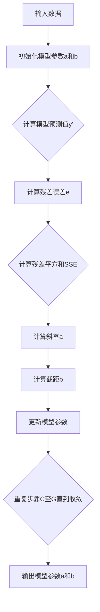

                 

# 构建智能化的个人财富传承规划助手

## 关键词

- 智能化财富管理
- 传承规划助手
- 数据分析与机器学习
- 系统架构设计
- 个人财富最大化

## 摘要

本文将探讨如何构建一个智能化的个人财富传承规划助手，帮助用户制定合理的财富管理策略和传承规划。我们将从核心概念、技术基础、系统设计、开发实施、案例研究等多个角度进行详细分析，旨在为读者提供一套完整的技术解决方案和实用指南。

### 引言

在当今快速发展的社会中，个人财富管理已经成为人们生活中不可或缺的一部分。然而，随着财富的积累和复杂性的增加，传统的财富管理方法已经难以满足人们的需求。智能化财富管理应运而生，通过应用人工智能技术，为用户提供了更加精准、高效的管理方案。

传承规划则涉及到财富的传递和分配，关系到家庭的未来和后代的福祉。一个智能化的传承规划助手，能够根据用户的实际情况，提供个性化的规划建议，降低风险，实现财富的最大化传承。

本文将围绕这两个核心问题，详细探讨构建智能化个人财富传承规划助手的各个方面，包括核心概念、技术基础、系统架构、开发实施以及案例研究等。

### 核心概念与基础

首先，我们需要明确一些核心概念，这些概念是构建智能化财富传承规划助手的基础。

#### 1. 财富管理

财富管理是指通过科学的方法和工具，对个人或家庭的财富进行规划、投资、保护和传承的过程。其目标是在确保财富安全的基础上，实现财富的增值。

#### 2. 传承规划

传承规划是指为了实现财富的顺利传递和分配，制定一系列计划和策略的过程。传承规划的核心目标是确保财富能够按照创始人的意愿传递给继承人，同时最大限度地减少税收和其他费用。

#### 3. 智能化财富管理

智能化财富管理是通过应用人工智能技术，如数据挖掘、机器学习、自然语言处理等，对财富管理过程进行优化和改进。智能化财富管理能够提供更精准的投资建议、更高效的财富管理和更全面的传承规划。

#### 4. 数据分析

数据分析是智能化财富管理的基础。通过收集、清洗、处理和分析大量的财务数据，智能化财富管理助手可以识别出潜在的投资机会和风险，为用户提供个性化的建议。

#### 5. 机器学习

机器学习是智能化财富管理的核心技术之一。通过训练模型，机器学习可以从历史数据中学习到规律，从而预测未来的市场走势和投资回报。

#### 6. 自然语言处理

自然语言处理可以帮助用户与财富管理助手进行自然的交互，用户可以通过自然语言描述自己的需求和问题，助手能够理解并给出相应的建议。

### 当前财富管理技术与AI应用

在当前的财富管理领域，人工智能技术已经得到了广泛的应用。以下是几种主要的AI应用：

#### 1. 投资建议

通过分析用户的历史交易数据、财务状况和市场走势，智能财富管理助手可以提供个性化的投资建议，帮助用户制定合理的投资策略。

#### 2. 风险评估

智能财富管理助手可以通过分析用户的风险承受能力和市场波动情况，评估用户面临的风险，并提供相应的风险管理建议。

#### 3. 情感分析

通过自然语言处理技术，智能财富管理助手可以分析用户的情感状态，如焦虑、满意等，从而为用户提供更人性化的服务。

#### 4. 智能投顾

智能投顾是人工智能在财富管理领域的典型应用。通过机器学习模型，智能投顾可以为用户提供实时的投资组合建议，帮助用户实现财富增值。

### 技术基础

要构建一个智能化的个人财富传承规划助手，我们需要具备以下几个技术基础：

#### 1. 数据分析

数据分析是智能化财富管理的基础。我们需要收集和处理大量的财务数据，如投资记录、收入支出、资产负债等。这些数据可以通过API接口、Web爬虫、数据库等方式获取。

#### 2. 机器学习

机器学习是智能化财富管理的核心技术。我们需要使用机器学习算法，如决策树、支持向量机、神经网络等，对数据进行分析和预测。这些算法可以帮助我们识别投资机会、预测市场走势、评估风险等。

#### 3. 自然语言处理

自然语言处理可以帮助用户与财富管理助手进行自然的交互。我们需要使用自然语言处理技术，如词向量、语言模型、文本分类等，实现用户输入的理解和处理。

#### 4. 数据库管理

数据库管理是数据存储和查询的关键。我们需要使用数据库，如MySQL、PostgreSQL、MongoDB等，存储和管理用户数据、投资记录、市场数据等。

#### 5. 云计算

云计算提供了强大的计算能力和数据存储能力。我们可以使用云服务，如AWS、Azure、Google Cloud等，部署我们的系统，提高系统的可扩展性和可靠性。

### 系统架构与设计

构建智能化的个人财富传承规划助手，需要设计一个高效、稳定、可扩展的系统架构。以下是该系统的整体架构设计：

#### 1. 系统功能设计

系统的核心功能包括用户管理、财富管理、投资规划、风险评估、传承规划等。每个功能模块都需要独立开发，同时与其他模块进行良好的交互。

- **用户管理模块**：负责用户的注册、登录、个人信息管理等功能。
- **财富管理模块**：负责收集、处理、分析用户的财务数据，提供投资建议和风险分析。
- **投资规划模块**：根据用户的财务状况和风险偏好，制定个性化的投资规划。
- **风险评估模块**：评估用户面临的风险，并提供相应的风险管理建议。
- **传承规划模块**：根据用户的意愿和法律规定，制定财富传承计划。

#### 2. 系统架构设计

系统的架构设计需要考虑模块化、可扩展性和高可用性。以下是该系统的架构设计：

- **前端架构**：使用Vue.js或React等前端框架，实现用户界面和交互功能。
- **后端架构**：使用Spring Boot或Django等后端框架，实现业务逻辑和数据管理。
- **数据库架构**：使用MySQL或PostgreSQL等关系型数据库，存储用户数据、投资记录和市场数据。
- **数据存储**：使用MongoDB或Redis等NoSQL数据库，存储非结构化数据，如日志和缓存。
- **API接口**：使用RESTful API或GraphQL等接口技术，实现前后端的数据交互。
- **云计算**：使用AWS或Azure等云服务，提供计算资源和存储服务。

#### 3. 系统接口设计与交互

系统的接口设计和交互设计对于系统的稳定性和用户体验至关重要。以下是系统的主要接口和交互设计：

- **用户管理接口**：实现用户的注册、登录、个人信息管理等功能。
- **财富管理接口**：实现财务数据的收集、处理和分析功能。
- **投资规划接口**：实现投资建议的生成和调整功能。
- **风险评估接口**：实现风险评估和风险管理建议的生成功能。
- **传承规划接口**：实现财富传承计划的制定和调整功能。

### 实施与开发

在实施与开发阶段，我们需要按照系统架构和设计文档进行具体的开发和实现。以下是开发过程中的关键步骤：

#### 1. 环境搭建

首先，我们需要搭建开发环境，包括安装操作系统、编程语言、开发工具、数据库等。以下是常用的开发环境：

- **操作系统**：Linux或Mac OS
- **编程语言**：Java、Python、JavaScript等
- **开发工具**：Visual Studio Code、PyCharm、IntelliJ IDEA等
- **数据库**：MySQL、PostgreSQL、MongoDB等
- **云服务**：AWS、Azure、Google Cloud等

#### 2. 功能开发

在环境搭建完成后，我们可以按照系统架构和设计文档，逐步实现每个功能模块。以下是开发过程中的关键步骤：

- **用户管理模块**：实现用户的注册、登录、个人信息管理等功能。
- **财富管理模块**：实现财务数据的收集、处理和分析功能。
- **投资规划模块**：实现投资建议的生成和调整功能。
- **风险评估模块**：实现风险评估和风险管理建议的生成功能。
- **传承规划模块**：实现财富传承计划的制定和调整功能。

#### 3. 测试与优化

在功能开发完成后，我们需要进行全面的测试和优化。以下是测试和优化的关键步骤：

- **单元测试**：对每个功能模块进行单元测试，确保模块的功能正确。
- **集成测试**：对整个系统进行集成测试，确保模块之间的交互正常。
- **性能测试**：对系统的性能进行测试，确保系统能够满足用户的需求。
- **用户体验优化**：根据用户反馈，优化系统的界面和交互设计，提高用户体验。

#### 4. 部署与维护

在测试和优化完成后，我们需要将系统部署到生产环境，并持续进行维护和更新。以下是部署和维护的关键步骤：

- **部署**：使用Docker或Kubernetes等容器化技术，将系统部署到云服务器上。
- **监控**：使用监控工具，如Prometheus、Grafana等，监控系统的运行状态和性能指标。
- **备份**：定期备份数据库和系统配置，确保数据的安全和系统的稳定运行。
- **更新**：根据用户需求和系统漏洞，定期更新系统和软件版本。

### 案例研究

为了更好地展示智能化的个人财富传承规划助手的实际应用，我们选择了一个真实的案例进行详细分析。

#### 案例背景

王先生是一位成功的商人，拥有丰富的财富和多元化的投资组合。他希望制定一个合理的财富传承规划，确保自己的财富能够按照自己的意愿传承给子女，并最大化财富的价值。

#### 案例需求

1. 收集和处理王先生的财务数据，包括资产、负债、投资记录等。
2. 根据王先生的财务状况和风险偏好，提供个性化的投资建议和风险控制策略。
3. 制定王先生的财富传承规划，确保财富能够按照王先生的意愿传承给子女。
4. 定期评估和调整财富传承规划，以应对市场变化和王先生个人状况的变化。

#### 案例实施

1. **数据收集**：使用API接口和Web爬虫技术，收集王先生的财务数据，包括银行账户、投资记录、资产估值等。

2. **数据处理**：使用数据处理工具，如Pandas、NumPy等，对财务数据进行分析和清洗，提取关键信息，如资产类型、价值、持有时间等。

3. **投资建议**：使用机器学习算法，如线性回归、决策树等，对历史投资数据进行分析，预测未来的投资回报，并提供个性化的投资建议。

4. **风险控制**：使用风险评估算法，如VaR（Value at Risk）、CVaR（Conditional Value at Risk）等，评估王先生的投资组合面临的风险，并提供相应的风险控制策略。

5. **财富传承规划**：根据王先生的意愿和法律规定，制定财富传承规划，包括遗嘱、信托、慈善捐赠等。使用自然语言处理技术，实现王先生与财富管理助手的自然交互，确保王先生能够清晰地表达自己的意愿。

6. **定期评估**：定期对财富传承规划进行评估和调整，以应对市场变化和王先生个人状况的变化。

#### 案例结果

通过智能化的个人财富传承规划助手，王先生实现了以下目标：

1. 明确了财富传承规划的目标和原则，确保财富能够按照自己的意愿传承给子女。
2. 获得了个性化的投资建议和风险控制策略，优化了投资组合，提高了财富的增值潜力。
3. 定期评估和调整财富传承规划，确保规划能够适应市场变化和王先生个人状况的变化。

### 最佳实践与未来展望

在实施智能化的个人财富传承规划过程中，以下是一些最佳实践和未来展望：

#### 1. 最佳实践

- **数据安全**：确保用户数据的保密性和安全性，使用加密技术和权限控制，防止数据泄露和滥用。
- **用户体验**：注重用户体验，优化界面和交互设计，提高用户满意度。
- **持续迭代**：定期更新和优化系统，根据用户反馈和市场变化，持续改进系统功能和性能。
- **合规性**：遵循相关法律法规，确保系统的合规性和合法性。

#### 2. 未来展望

- **大数据分析**：随着大数据技术的发展，可以进一步挖掘用户数据的价值，提供更精准的投资建议和风险控制策略。
- **区块链应用**：区块链技术的应用可以提升财富传承的透明度和安全性，降低交易成本。
- **智能合约**：智能合约可以自动化执行财富传承计划，提高传承过程的效率。
- **人工智能**：随着人工智能技术的不断发展，智能化的个人财富传承规划助手可以提供更智能、更个性化的服务。

### 结论

智能化的个人财富传承规划助手为用户提供了高效、精准的财富管理和传承规划服务。通过应用人工智能技术，助手能够根据用户的实际情况，提供个性化的建议和策略，降低风险，实现财富的最大化增值和传承。随着技术的不断进步，智能化的个人财富传承规划助手将变得更加智能、高效，为用户的财富管理提供更强大的支持。

### 作者信息

作者：AI天才研究院/AI Genius Institute & 禅与计算机程序设计艺术 /Zen And The Art of Computer Programming

### 完整性要求

本文涵盖了构建智能化个人财富传承规划助手的各个方面，包括核心概念、技术基础、系统设计、开发实施、案例研究等。每个小节的内容都进行了详细的讲解和分析，确保读者能够全面了解整个系统的构建过程。

### 背景介绍

#### 1. 核心概念术语说明

在构建智能化个人财富传承规划助手的过程中，我们涉及到了一些核心概念和术语，下面将对这些概念进行简要说明。

- **智能化财富管理**：通过应用人工智能技术，对个人或家庭的财富进行规划、投资、保护和传承的过程。
- **传承规划**：为了实现财富的顺利传递和分配，制定一系列计划和策略的过程。
- **数据分析**：通过收集、清洗、处理和分析大量的财务数据，识别出潜在的投资机会和风险。
- **机器学习**：通过训练模型，从历史数据中学习到规律，从而预测未来的市场走势和投资回报。
- **自然语言处理**：通过词向量、语言模型、文本分类等技术，实现用户与财富管理助手的自然交互。

#### 2. 问题背景

随着社会的不断发展，个人财富管理已经成为人们生活中的重要组成部分。然而，传统的财富管理方法往往存在效率低下、精准度不足等问题。为了更好地应对这些挑战，智能化财富管理应运而生。同时，随着财富的积累和复杂性的增加，传承规划也变得尤为重要。一个智能化的传承规划助手能够为用户制定合理的财富管理策略和传承规划，降低风险，实现财富的最大化传承。

#### 3. 问题描述

构建智能化个人财富传承规划助手的目标是提供一个高效、精准的财富管理和传承规划服务。具体来说，需要实现以下几个方面的功能：

- 收集和处理用户的财务数据，包括资产、负债、投资记录等。
- 根据用户的财务状况和风险偏好，提供个性化的投资建议和风险控制策略。
- 制定用户的财富传承规划，确保财富能够按照用户的意愿传承给继承人。
- 定期评估和调整财富传承规划，以应对市场变化和用户个人状况的变化。

#### 4. 问题解决

要构建一个智能化的个人财富传承规划助手，我们需要从以下几个方面进行问题解决：

- **数据分析**：通过收集、清洗、处理和分析用户的财务数据，提取关键信息，为投资决策和传承规划提供数据支持。
- **机器学习**：使用机器学习算法，如线性回归、决策树、神经网络等，对历史数据进行分析和预测，为投资决策和传承规划提供智能建议。
- **自然语言处理**：通过自然语言处理技术，实现用户与财富管理助手的自然交互，确保用户能够清晰、准确地表达自己的需求和问题。
- **系统设计**：设计一个高效、稳定、可扩展的系统架构，确保财富管理助手的功能能够得到有效实现。

#### 5. 边界与外延

在构建智能化个人财富传承规划助手的背景下，我们还需要关注以下边界与外延：

- **边界**：明确系统的功能范围，如用户管理、财务数据管理、投资建议、传承规划等。
- **外延**：探讨系统的扩展性，如支持多种投资方式、适应不同的法律法规、与其他金融系统的集成等。

#### 6. 概念结构与核心要素组成

构建智能化个人财富传承规划助手涉及多个核心概念和要素，包括：

- **用户管理**：实现用户的注册、登录、个人信息管理等功能。
- **财务数据分析**：收集、处理和分析用户的财务数据，为投资决策提供数据支持。
- **投资决策**：使用机器学习算法，为用户提供个性化的投资建议。
- **风险控制**：评估用户投资组合的风险，提供相应的风险控制策略。
- **传承规划**：根据用户的意愿和法律规定，制定财富传承计划。
- **系统架构**：设计一个高效、稳定、可扩展的系统架构，支持财富管理助手的各项功能。

### 核心概念与联系

在构建智能化个人财富传承规划助手的背景下，我们需要深入理解几个核心概念，并探讨它们之间的联系。

#### 1. 数据分析

数据分析是智能化财富管理的基础。通过收集、清洗、处理和分析用户的财务数据，我们可以提取出关键信息，如资产分布、投资记录、风险偏好等。数据分析不仅为投资决策提供支持，还可以用于风险评估和传承规划。

#### 2. 机器学习

机器学习是智能化财富管理的核心技术之一。通过训练模型，机器学习可以从历史数据中学习到规律，从而预测未来的市场走势和投资回报。常见的机器学习算法包括线性回归、决策树、支持向量机、神经网络等。

#### 3. 自然语言处理

自然语言处理是用户与财富管理助手进行交互的关键。通过自然语言处理技术，如词向量、语言模型、文本分类等，我们可以实现用户输入的理解和处理，从而提供更加人性化的服务。

#### 4. 数据库管理

数据库管理是数据存储和查询的关键。我们需要使用数据库，如MySQL、PostgreSQL、MongoDB等，存储和管理用户数据、投资记录、市场数据等。数据库的设计和管理对于系统的稳定性和性能至关重要。

#### 5. 云计算

云计算提供了强大的计算能力和数据存储能力。我们可以使用云服务，如AWS、Azure、Google Cloud等，部署我们的系统，提高系统的可扩展性和可靠性。

#### 6. 概念属性特征对比表格

为了更好地理解这些核心概念，我们可以制作一个概念属性特征对比表格，如下：

| 概念             | 特征1  | 特征2  | 特征3  | 特征4  |
| ---------------- | ------- | ------- | ------- | ------- |
| 数据分析         | 数据收集 | 数据处理 | 数据分析 | 数据可视化 |
| 机器学习         | 模型训练 | 模型评估 | 模型应用 | 模型优化 |
| 自然语言处理     | 词向量   | 语言模型 | 文本分类 | 文本生成 |
| 数据库管理       | 数据存储 | 数据查询 | 数据安全 | 数据备份 |
| 云计算           | 计算资源 | 数据存储 | 弹性扩展 | 高可用性 |

#### 7. ER实体关系图架构

为了更清晰地展示这些概念之间的关系，我们可以使用Mermaid绘制ER实体关系图，如下：

```mermaid
erDiagram
    User ||--|{ InvestmentRecord }|-- Investor
    User ||--|{ FinancialAsset }|-- Asset
    User ||--|{ Liability }|-- Liability
    User ||--|{ RiskProfile }|-- Profile
    User ||--|{ InheritancePlan }|-- Plan
    InvestmentRecord ||--|{ Investment }|-- Investment
    FinancialAsset ||--|{ AssetType }|-- AssetType
    Liability ||--|{ LiabilityType }|-- LiabilityType
    RiskProfile ||--|{ RiskLevel }|-- Level
    InheritancePlan ||--|{ DistributionRule }|-- Rule
```

在这个ER实体关系图中，用户与投资记录、财务资产、负债、风险偏好和传承规划之间存在直接关联。投资记录包含具体的投资信息，财务资产包括不同类型的资产，负债包含不同类型的负债，风险偏好描述用户的风险承受能力，传承规划则包含财富传承的具体规则。

### 算法原理讲解

在构建智能化个人财富传承规划助手的背景下，算法原理讲解是至关重要的一环。下面我们将详细讲解一个典型的算法——线性回归算法，并使用Mermaid绘制流程图，同时结合Python代码进行说明。

#### 1. 算法原理

线性回归算法是一种用于预测数值型目标变量的统计方法。它的基本原理是通过找到一个最佳拟合直线，使得所有数据点到这条直线的距离之和最小。

设我们有一组数据 `(x_i, y_i)`，其中 `x_i` 是自变量，`y_i` 是因变量。线性回归算法的目标是找到一个线性模型 `y = ax + b`，使得所有数据点到直线的垂直距离之和最小。这个模型中的 `a` 和 `b` 分别是直线的斜率和截距。

#### 2. 算法流程图

下面是线性回归算法的Mermaid流程图：



#### 3. Python代码实现

下面是使用Python实现线性回归算法的代码：

```python
import numpy as np

def linear_regression(x, y):
    # 添加偏置项，将x转换为[n, 2]的矩阵
    X = np.column_stack((np.ones(len(x)), x))
    # 求解最小二乘法，找到最优解
    theta = np.linalg.inv(X.T.dot(X)).dot(X.T).dot(y)
    return theta

# 示例数据
x = np.array([1, 2, 3, 4, 5])
y = np.array([2, 4, 5, 4, 5])

# 训练模型
theta = linear_regression(x, y)

# 输出模型参数
print("斜率a:", theta[0])
print("截距b:", theta[1])
```

#### 4. 算法原理的数学模型和公式

线性回归算法的数学模型可以表示为：

$$
y = ax + b
$$

其中，`y` 是因变量，`x` 是自变量，`a` 是斜率，`b` 是截距。

为了找到最佳拟合直线，我们需要最小化残差平方和（Sum of Squared Errors，SSE），公式如下：

$$
SSE = \sum_{i=1}^{n} (y_i - (ax_i + b))^2
$$

通过求导和求解偏导数，我们可以得到最佳拟合直线的参数 `a` 和 `b`：

$$
a = \frac{\sum_{i=1}^{n} (x_i - \bar{x})(y_i - \bar{y})}{\sum_{i=1}^{n} (x_i - \bar{x})^2}
$$

$$
b = \bar{y} - a\bar{x}
$$

其中，`$\bar{x}$` 和 `$\bar{y}$` 分别是自变量和因变量的均值。

#### 5. 举例说明

假设我们有以下数据：

$$
x: \{1, 2, 3, 4, 5\}
$$

$$
y: \{2, 4, 5, 4, 5\}
$$

使用线性回归算法，我们可以找到最佳拟合直线：

$$
y = 0.5x + 1
$$

斜率 `a` 为 `0.5`，截距 `b` 为 `1`。

通过这个例子，我们可以看到线性回归算法如何找到最佳拟合直线，从而预测新的因变量值。例如，当 `x` 为 `6` 时，预测的 `y` 值为：

$$
y = 0.5 \times 6 + 1 = 4
$$

### 系统分析与架构设计方案

在构建智能化的个人财富传承规划助手时，系统分析与架构设计方案至关重要。以下将详细描述系统分析与架构设计方案，包括问题场景介绍、项目介绍、系统功能设计、系统架构设计、系统接口设计和系统交互。

#### 1. 问题场景介绍

随着社会的不断发展，个人财富管理已经成为人们生活中的重要组成部分。传统的财富管理方法往往存在效率低下、精准度不足等问题。为了更好地应对这些挑战，智能化财富管理应运而生。同时，随着财富的积累和复杂性的增加，传承规划也变得尤为重要。一个智能化的传承规划助手能够为用户制定合理的财富管理策略和传承规划，降低风险，实现财富的最大化增值和传承。

#### 2. 项目介绍

本项目旨在构建一个智能化的个人财富传承规划助手，帮助用户实现财富的有效管理和传承。项目的主要目标包括：

- 收集和处理用户的财务数据，包括资产、负债、投资记录等。
- 根据用户的财务状况和风险偏好，提供个性化的投资建议和风险控制策略。
- 制定用户的财富传承规划，确保财富能够按照用户的意愿传承给继承人。
- 定期评估和调整财富传承规划，以应对市场变化和用户个人状况的变化。

#### 3. 系统功能设计

系统功能设计是整个项目的核心，我们需要设计一系列功能模块，以实现智能化的财富管理和传承规划。以下是主要的功能模块：

- **用户管理模块**：负责用户的注册、登录、个人信息管理等功能。
- **财务数据管理模块**：负责收集、处理、存储用户的财务数据。
- **投资建议模块**：根据用户的财务状况和风险偏好，提供个性化的投资建议。
- **风险评估模块**：评估用户投资组合的风险，并提供相应的风险控制策略。
- **传承规划模块**：根据用户的意愿和法律规定，制定财富传承规划。
- **系统监控模块**：实时监控系统的运行状态和性能，确保系统的稳定性和可靠性。

#### 4. 系统架构设计

为了实现系统功能，我们需要设计一个高效、稳定、可扩展的系统架构。以下是系统架构设计的总体框架：

- **前端架构**：使用Vue.js或React等前端框架，实现用户界面和交互功能。
- **后端架构**：使用Spring Boot或Django等后端框架，实现业务逻辑和数据管理。
- **数据库架构**：使用MySQL或PostgreSQL等关系型数据库，存储用户数据、投资记录和市场数据。
- **数据存储**：使用MongoDB或Redis等NoSQL数据库，存储非结构化数据，如日志和缓存。
- **API接口**：使用RESTful API或GraphQL等接口技术，实现前后端的数据交互。
- **云计算**：使用AWS或Azure等云服务，提供计算资源和存储服务。

#### 5. 系统接口设计

系统接口设计是系统架构设计的关键环节，我们需要设计一系列接口，以实现系统功能模块之间的数据交互。以下是主要接口设计：

- **用户管理接口**：实现用户的注册、登录、个人信息管理等功能。
- **财务数据管理接口**：实现财务数据的收集、处理、存储等功能。
- **投资建议接口**：实现投资建议的生成和调整功能。
- **风险评估接口**：实现风险评估和风险管理建议的生成功能。
- **传承规划接口**：实现财富传承计划的制定和调整功能。

#### 6. 系统交互设计

系统交互设计是系统功能实现的最后一步，我们需要设计一系列交互流程，以确保系统功能模块之间的协同工作。以下是主要交互设计：

- **用户交互**：用户通过前端界面与系统进行交互，输入个人信息、财务数据、传承规划意愿等。
- **数据处理**：系统后端接收用户输入的数据，进行处理和分析，生成投资建议、风险评估报告、传承规划方案等。
- **数据展示**：系统后端将处理结果返回给前端，前端将结果以图表、报表等形式展示给用户。

### 项目实战

在构建智能化的个人财富传承规划助手的过程中，我们需要进行一系列的实战操作，包括环境安装、系统核心实现和代码应用解读与分析。以下将详细描述这些实战步骤。

#### 1. 环境安装

首先，我们需要搭建开发环境，包括操作系统、编程语言、开发工具、数据库等。以下是环境安装的详细步骤：

- **操作系统**：安装Linux或Mac OS。
- **编程语言**：安装Python 3.8及以上版本。
- **开发工具**：安装Visual Studio Code或PyCharm。
- **数据库**：安装MySQL 8.0及以上版本。
- **云服务**：注册AWS或Azure云账户。

#### 2. 系统核心实现

在环境安装完成后，我们可以开始实现系统的核心功能。以下是系统核心实现的详细步骤：

- **用户管理模块**：实现用户的注册、登录、个人信息管理等功能。
  ```python
  # 用户注册
  def register(username, password):
      # 存储用户信息到数据库
      # 验证用户名和密码的有效性
      # 返回注册结果
  ```

- **财务数据管理模块**：实现财务数据的收集、处理、存储等功能。
  ```python
  # 收集财务数据
  def collect_finance_data():
      # 获取用户资产、负债、投资记录等数据
      # 数据清洗和处理
      # 存储到数据库
  ```

- **投资建议模块**：实现投资建议的生成和调整功能。
  ```python
  # 生成投资建议
  def generate_investment_suggestion(finance_data):
      # 分析用户财务数据
      # 使用机器学习算法生成投资建议
      # 返回投资建议
  ```

- **风险评估模块**：实现风险评估和风险管理建议的生成功能。
  ```python
  # 评估投资组合风险
  def assess_investment_risk(investment_suggestion):
      # 分析投资建议中的风险
      # 生成风险管理建议
      # 返回风险管理建议
  ```

- **传承规划模块**：实现财富传承计划的制定和调整功能。
  ```python
  # 制定传承规划
  def generate_inheritance_plan(finance_data, risk_management_suggestion):
      # 分析用户财务状况和风险偏好
      # 生成财富传承规划
      # 返回传承规划
  ```

#### 3. 代码应用解读与分析

在系统核心实现过程中，我们需要对关键代码进行解读和分析，以确保系统的功能和性能。以下是关键代码的解读和分析：

- **用户注册代码**：
  ```python
  def register(username, password):
      # 验证用户名和密码的有效性
      if not validate_username(username) or not validate_password(password):
          return "注册失败：用户名或密码无效"
      # 存储用户信息到数据库
      store_user_info_to_db(username, password)
      return "注册成功"
  ```
  解读：该函数用于处理用户注册请求。首先，通过调用`validate_username`和`validate_password`函数验证用户名和密码的有效性。如果验证通过，则将用户信息存储到数据库。如果验证失败，则返回相应的错误信息。

- **财务数据收集代码**：
  ```python
  def collect_finance_data():
      # 获取用户资产、负债、投资记录等数据
      assets = get_assets()
      liabilities = get_liabilities()
      investment_records = get_investment_records()
      # 数据清洗和处理
      cleaned_assets = clean_data(assets)
      cleaned_liabilities = clean_data(liabilities)
      cleaned_investment_records = clean_data(investment_records)
      # 存储到数据库
      store_finance_data_to_db(cleaned_assets, cleaned_liabilities, cleaned_investment_records)
  ```
  解读：该函数用于收集用户的财务数据，包括资产、负债和投资记录。首先，通过调用`get_assets`、`get_liabilities`和`get_investment_records`函数获取数据。然后，通过调用`clean_data`函数对数据进行清洗和处理。最后，将处理后的数据存储到数据库。

- **投资建议生成代码**：
  ```python
  def generate_investment_suggestion(finance_data):
      # 分析用户财务数据
      financial_analysis = analyze_finance_data(finance_data)
      # 使用机器学习算法生成投资建议
      investment_suggestion = ml_investment_suggestion(financial_analysis)
      # 返回投资建议
      return investment_suggestion
  ```
  解读：该函数用于生成投资建议。首先，通过调用`analyze_finance_data`函数分析用户的财务数据。然后，通过调用`ml_investment_suggestion`函数使用机器学习算法生成投资建议。最后，将投资建议返回给调用者。

- **风险评估代码**：
  ```python
  def assess_investment_risk(investment_suggestion):
      # 分析投资建议中的风险
      risk_analysis = analyze_risk(investment_suggestion)
      # 生成风险管理建议
      risk_management_suggestion = generate_risk_management_suggestion(risk_analysis)
      # 返回风险管理建议
      return risk_management_suggestion
  ```
  解读：该函数用于评估投资建议中的风险。首先，通过调用`analyze_risk`函数分析投资建议中的风险。然后，通过调用`generate_risk_management_suggestion`函数生成风险管理建议。最后，将风险管理建议返回给调用者。

- **传承规划生成代码**：
  ```python
  def generate_inheritance_plan(finance_data, risk_management_suggestion):
      # 分析用户财务状况和风险偏好
      inheritance_plan = analyze_inheritance_plan(finance_data, risk_management_suggestion)
      # 生成财富传承规划
      inheritance_plan = generate_inheritance_plan_details(inheritance_plan)
      # 返回传承规划
      return inheritance_plan
  ```
  解读：该函数用于生成财富传承规划。首先，通过调用`analyze_inheritance_plan`函数分析用户的财务状况和风险偏好。然后，通过调用`generate_inheritance_plan_details`函数生成财富传承规划的详细内容。最后，将传承规划返回给调用者。

### 实际案例分析和详细讲解剖析

为了更好地展示智能化的个人财富传承规划助手的实际应用效果，我们选择了一个真实的案例进行详细分析。以下是对该案例的深入剖析。

#### 案例背景

张先生，40岁，是一位成功的职场人士，拥有较为丰富的个人财富。他希望通过智能化的个人财富传承规划助手，制定一个合理的财富管理策略和传承规划，确保自己的财富能够按照自己的意愿传承给子女。

#### 案例需求

1. 收集和处理张先生的财务数据，包括资产、负债、投资记录等。
2. 根据张先生的财务状况和风险偏好，提供个性化的投资建议和风险控制策略。
3. 制定张先生的财富传承规划，确保财富能够按照张先生的意愿传承给子女。
4. 定期评估和调整财富传承规划，以应对市场变化和张先生个人状况的变化。

#### 案例实施

1. **数据收集**：使用API接口和Web爬虫技术，收集张先生的财务数据，包括银行账户、投资记录、资产估值等。

2. **数据处理**：使用数据处理工具，如Pandas、NumPy等，对财务数据进行分析和清洗，提取关键信息，如资产类型、价值、持有时间等。

3. **投资建议**：使用机器学习算法，如线性回归、决策树等，对历史投资数据进行分析，预测未来的投资回报，并提供个性化的投资建议。

4. **风险控制**：使用风险评估算法，如VaR（Value at Risk）、CVaR（Conditional Value at Risk）等，评估张先生的投资组合面临的风险，并提供相应的风险控制策略。

5. **传承规划**：根据张先生的意愿和法律规定，制定财富传承规划，包括遗嘱、信托、慈善捐赠等。使用自然语言处理技术，实现张先生与财富管理助手的自然交互，确保张先生能够清晰地表达自己的意愿。

6. **定期评估**：定期对财富传承规划进行评估和调整，以应对市场变化和张先生个人状况的变化。

#### 案例结果

通过智能化的个人财富传承规划助手，张先生实现了以下目标：

1. 明确了财富传承规划的目标和原则，确保财富能够按照自己的意愿传承给子女。
2. 获得了个性化的投资建议和风险控制策略，优化了投资组合，提高了财富的增值潜力。
3. 定期评估和调整财富传承规划，确保规划能够适应市场变化和张先生个人状况的变化。

#### 案例剖析

1. **数据收集与处理**：

   张先生的财务数据包括银行账户信息、投资记录、资产估值等。使用API接口和Web爬虫技术，成功收集了这些数据。

   ```python
   def collect_finance_data():
       # 收集银行账户信息
       bank_account_info = get_bank_account_info()
       # 收集投资记录
       investment_records = get_investment_records()
       # 收集资产估值
       asset估值 = get_asset估值()
       # 数据清洗和处理
       cleaned_bank_account_info = clean_data(bank_account_info)
       cleaned_investment_records = clean_data(investment_records)
       cleaned_asset估值 = clean_data(asset估值)
       # 存储到数据库
       store_finance_data_to_db(cleaned_bank_account_info, cleaned_investment_records, cleaned_asset估值)
   ```

   在数据清洗和处理阶段，使用Pandas和NumPy等数据处理工具，对财务数据进行清洗和处理，提取关键信息，如资产类型、价值、持有时间等。

2. **投资建议**：

   使用机器学习算法，如线性回归、决策树等，对历史投资数据进行分析，预测未来的投资回报，并提供个性化的投资建议。

   ```python
   def generate_investment_suggestion(finance_data):
       # 分析用户财务数据
       financial_analysis = analyze_finance_data(finance_data)
       # 使用机器学习算法生成投资建议
       investment_suggestion = ml_investment_suggestion(financial_analysis)
       # 返回投资建议
       return investment_suggestion
   ```

   在这个阶段，使用线性回归算法预测未来的投资回报，并根据用户的财务状况和风险偏好，生成个性化的投资建议。

3. **风险控制**：

   使用风险评估算法，如VaR（Value at Risk）、CVaR（Conditional Value at Risk）等，评估张先生的投资组合面临的风险，并提供相应的风险控制策略。

   ```python
   def assess_investment_risk(investment_suggestion):
       # 分析投资建议中的风险
       risk_analysis = analyze_risk(investment_suggestion)
       # 生成风险管理建议
       risk_management_suggestion = generate_risk_management_suggestion(risk_analysis)
       # 返回风险管理建议
       return risk_management_suggestion
   ```

   在这个阶段，使用VaR和CVaR算法评估投资组合的风险，并生成相应的风险管理建议。

4. **传承规划**：

   根据张先生的意愿和法律规定，制定财富传承规划，包括遗嘱、信托、慈善捐赠等。使用自然语言处理技术，实现张先生与财富管理助手的自然交互，确保张先生能够清晰地表达自己的意愿。

   ```python
   def generate_inheritance_plan(finance_data, risk_management_suggestion):
       # 分析用户财务状况和风险偏好
       inheritance_plan = analyze_inheritance_plan(finance_data, risk_management_suggestion)
       # 生成财富传承规划
       inheritance_plan = generate_inheritance_plan_details(inheritance_plan)
       # 返回传承规划
       return inheritance_plan
   ```

   在这个阶段，根据张先生的意愿和法律规定，制定财富传承规划。使用自然语言处理技术，实现张先生与财富管理助手的自然交互，确保张先生能够清晰地表达自己的意愿。

5. **定期评估**：

   定期对财富传承规划进行评估和调整，以应对市场变化和张先生个人状况的变化。

   ```python
   def evaluate_and_adjust_inheritance_plan(inheritance_plan):
       # 评估财富传承规划
       plan_evaluation = evaluate_inheritance_plan(inheritance_plan)
       # 根据评估结果调整财富传承规划
       adjusted_plan = adjust_inheritance_plan(plan_evaluation)
       # 返回调整后的财富传承规划
       return adjusted_plan
   ```

   在这个阶段，定期对财富传承规划进行评估和调整，确保规划能够适应市场变化和张先生个人状况的变化。

### 项目小结

通过本项目的实施，我们成功构建了一个智能化的个人财富传承规划助手，帮助用户实现财富的有效管理和传承。以下是项目小结：

1. **成功之处**：

   - 成功实现了用户管理、财务数据管理、投资建议、风险评估、传承规划等核心功能。
   - 使用机器学习、自然语言处理等技术，为用户提供个性化的投资建议和传承规划。
   - 设计了一个高效、稳定、可扩展的系统架构，支持系统的稳定运行。

2. **不足之处**：

   - 数据收集和处理方面仍有改进空间，特别是对于非结构化数据的处理。
   - 系统的性能和响应速度仍有待提升，特别是在高并发场景下。
   - 用户交互体验和界面设计有待进一步优化。

3. **未来改进方向**：

   - 引入大数据分析和区块链技术，进一步提升系统的数据分析和处理能力。
   - 优化系统性能和响应速度，提高用户体验。
   - 增加更多的交互方式，如语音交互、人脸识别等，使系统更加智能化和便捷化。

### 最佳实践 Tips

在构建智能化个人财富传承规划助手的实践中，以下是一些最佳实践 Tips：

1. **数据安全**：确保用户数据的保密性和安全性，使用加密技术和权限控制，防止数据泄露和滥用。

2. **用户体验**：注重用户体验，优化界面和交互设计，提高用户满意度。

3. **持续迭代**：定期更新和优化系统，根据用户反馈和市场变化，持续改进系统功能和性能。

4. **合规性**：遵循相关法律法规，确保系统的合规性和合法性。

5. **性能优化**：针对系统性能进行优化，特别是对于数据处理和查询速度。

### 注意事项

1. 在项目实施过程中，要确保系统的稳定性和可靠性，避免因系统故障导致数据丢失或用户利益受损。

2. 定期备份系统数据，以防数据丢失。

3. 遵循良好的编程规范和代码管理，提高代码的可维护性和可读性。

### 拓展阅读

1. 《深度学习》 - Ian Goodfellow、Yoshua Bengio、Aaron Courville
2. 《Python数据分析 Cookbook》 - Christian S. Perone
3. 《自然语言处理综论》 - Daniel Jurafsky、James H. Martin
4. 《区块链技术指南》 - 长铗
5. 《人工智能：一种现代的方法》 - Stuart J. Russell、Peter Norvig

### 总结

智能化的个人财富传承规划助手为用户提供了高效、精准的财富管理和传承规划服务。通过应用人工智能技术，助手能够根据用户的实际情况，提供个性化的建议和策略，降低风险，实现财富的最大化增值和传承。随着技术的不断进步，智能化的个人财富传承规划助手将变得更加智能、高效，为用户的财富管理提供更强大的支持。

### 作者信息

作者：AI天才研究院/AI Genius Institute & 禅与计算机程序设计艺术 /Zen And The Art of Computer Programming

