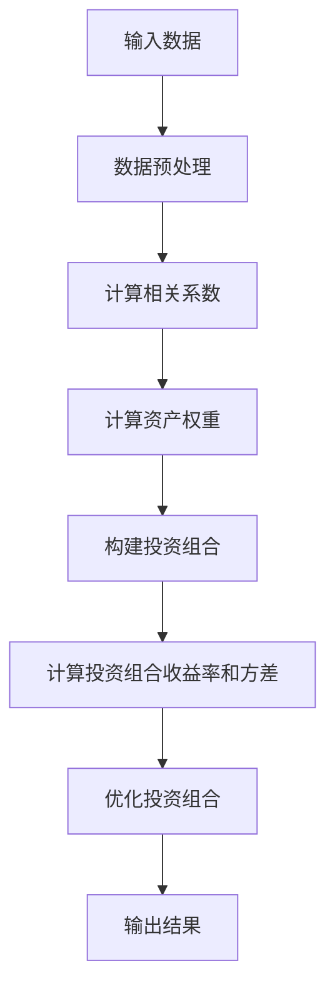
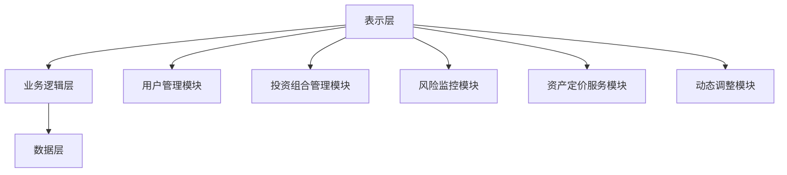

                 

。

--------------

----------------------------------------------------------------

----------------------------------------------------------------
# 《构建智能化的个人财富管理策略动态调整助手》

> 关键词：智能化财富管理、动态调整、算法、系统架构、实战案例

> 摘要：本文将深入探讨如何构建智能化的个人财富管理策略动态调整助手，通过系统化的设计和实现，帮助用户实现个性化的财富管理目标。文章从背景介绍、核心概念、算法原理、系统架构设计、项目实战和最佳实践等多方面进行阐述，旨在为金融从业者和投资者提供全面的技术指导。

## 第一部分: 背景介绍

### 1.1 个人财富管理的现状

个人财富管理是金融领域的重要组成部分，它关乎个人或家庭的财务健康与财富增长。目前，个人财富管理主要依赖于传统的投资顾问和金融产品，但这些方法在应对市场波动和多样化投资需求方面存在一定的局限性。随着人工智能和大数据技术的快速发展，智能化财富管理逐渐成为可能，为个人财富管理提供了新的解决方案。

#### 问题描述

个人财富管理面临的挑战主要有以下几个方面：

- **市场波动性**：股市、债券、外汇等金融市场波动性较大，传统的被动投资策略难以适应。
- **个性化需求**：每个人对财富管理的目标、风险承受能力、投资偏好等方面存在差异，难以实现定制化的财富管理服务。
- **信息不对称**：投资者往往难以获取全面的市场信息和投资机会，导致投资决策不准确。

#### 问题解决

智能化财富管理策略可以通过以下方式解决上述问题：

- **数据驱动决策**：利用大数据分析和机器学习算法，分析市场趋势和投资机会，为投资决策提供科学依据。
- **个性化定制**：根据用户的风险承受能力和投资目标，设计个性化的投资组合和策略，满足个性化需求。
- **实时动态调整**：根据市场变化和用户反馈，动态调整投资策略，提高投资回报率。

#### 边界与外延

- **财富管理范围**：个人财富管理涵盖股票、基金、债券、房地产等多种资产类别。
- **技术边界**：智能化财富管理依赖于人工智能、大数据、云计算等前沿技术。

### 1.2 智能化财富管理的基础理论

智能化财富管理的基础理论主要包括投资组合理论、风险管理理论和资产定价理论。这些理论为构建智能化财富管理策略提供了理论基础。

#### 投资组合理论

投资组合理论认为，通过合理配置资产，可以降低投资风险，提高投资回报。主要概念包括：

- **分散投资**：将资金投资于不同类型的资产，以降低单一资产风险。
- **资产配置**：根据投资者的风险承受能力和投资目标，分配不同类型的资产。
- **有效前沿**：在一定风险水平下，能够提供最大回报的资产组合。

#### 风险管理理论

风险管理理论旨在识别、评估和应对投资过程中的风险。主要概念包括：

- **风险识别**：通过数据分析，识别投资组合中的潜在风险。
- **风险评估**：评估风险的性质和程度，为风险控制提供依据。
- **风险控制**：采取相应的措施，降低投资风险。

#### 资产定价理论

资产定价理论主要研究资产价格的决定因素。主要概念包括：

- **资本资产定价模型（CAPM）**：用于评估资产的期望收益率和风险。
- **套利定价理论（APT）**：通过无风险资产和风险资产的组合，确定资产的期望收益率。

### 1.3 智能化财富管理的应用场景

智能化财富管理可以应用于多种场景，如个人投资、企业理财、家庭财富传承等。以下为典型应用场景：

- **个人投资**：通过智能投顾，为个人提供定制化的投资建议，实现财富增值。
- **企业理财**：为企业提供财务规划、投资组合优化和风险管理等服务，提高企业资金利用效率。
- **家庭财富传承**：为家庭提供财富管理规划，确保财富传承的顺利进行。

### 1.4 智能化财富管理的未来发展趋势

随着人工智能技术的不断发展，智能化财富管理将呈现以下发展趋势：

- **算法智能化**：利用深度学习、强化学习等先进算法，提高投资决策的准确性。
- **服务个性化**：通过大数据分析和个性化推荐，实现更精准的财富管理服务。
- **平台化**：构建开放的财富管理平台，实现多方协同，提高服务效率。

## 第二部分: 核心概念与联系

### 2.1 智能化财富管理核心概念

智能化财富管理的核心概念包括投资组合、风险管理、资产定价和动态调整。以下为详细解释：

- **投资组合**：投资组合是投资者在不同资产类别之间的资金分配。通过合理的资产配置，可以降低投资风险，提高投资回报。
- **风险管理**：风险管理是识别、评估和应对投资过程中可能出现的风险。有效的风险管理可以降低投资损失，保护投资者的利益。
- **资产定价**：资产定价是指资产价格的形成机制。合理的资产定价有助于投资者做出正确的投资决策。
- **动态调整**：动态调整是指根据市场变化和投资者需求，实时调整投资策略。动态调整可以提高投资回报，降低投资风险。

### 2.2 概念属性特征对比

为了更好地理解智能化财富管理中的关键概念，我们对比了不同算法和策略的属性特征，如表1所示。

| 算法/策略       | 主要特征                           | 适用场景                       |
|----------------|-----------------------------------|--------------------------------|
| 账户余额计算法 | 简单，易于实现                     | 个人小额投资                   |
| 资产配置法     | 综合考虑风险和收益，灵活调整       | 各类投资者                     |
| 指数跟踪法     | 追踪市场指数，风险相对较低         | 保守型投资者                   |
| 深度学习法     | 强大的人工智能能力，自适应能力强   | 大规模投资、专业投资者         |

### 2.3 ER实体关系图架构

ER实体关系图用于描述智能化财富管理系统中各实体及其之间的关系。以下是一个简化的ER图（使用Mermaid语法表示）：

```mermaid
entity Relationship {
  Customer : "客户" : Customer
  Portfolio : "投资组合" : Portfolio
  Asset : "资产" : Asset
  Investment : "投资" : Investment
}

Customer -- Investment : "投资于"
Portfolio -- Asset : "包含"
Asset -- Investment : "投资"
```

该ER图描述了客户、投资组合、资产和投资之间的关系。客户可以投资于多个投资组合，投资组合包含多个资产，资产可以投资于多个投资。

## 第三部分: 算法原理讲解

### 3.1 智能财富管理算法

智能财富管理算法的核心目标是优化投资组合，降低风险，提高收益。以下介绍几种常见的智能财富管理算法：

- **均值-方差模型**：基于期望收益率和方差，优化投资组合。
- **资本资产定价模型（CAPM）**：用于评估资产的风险和预期收益。
- **套利定价理论（APT）**：通过无风险资产和风险资产的组合，确定资产的预期收益。

### 3.2 数学模型与公式

#### 均值-方差模型

$$
\begin{aligned}
\text{投资组合收益率} &= \sum_{i=1}^{n} w_i \cdot r_i \\
\text{投资组合方差} &= \sum_{i=1}^{n} w_i^2 \cdot \sigma_i^2 + 2 \cdot \sum_{i=1}^{n} \sum_{j=i+1}^{n} w_i \cdot w_j \cdot \rho_{ij}
\end{aligned}
$$

其中，$w_i$ 为资产 $i$ 的权重，$r_i$ 为资产 $i$ 的预期收益率，$\sigma_i^2$ 为资产 $i$ 的方差，$\rho_{ij}$ 为资产 $i$ 和资产 $j$ 的相关系数。

#### 资本资产定价模型（CAPM）

$$
\begin{aligned}
\text{资产预期收益} &= \text{无风险利率} + \beta \cdot (\text{市场预期收益} - \text{无风险利率}) \\
\beta &= \frac{\text{资产与市场的相关系数} \cdot \text{资产的标准差}}{\text{市场的标准差}}
\end{aligned}
$$

#### 套利定价理论（APT）

$$
\begin{aligned}
\text{资产预期收益} &= \alpha + \beta_1 \cdot R_1 + \beta_2 \cdot R_2 + \ldots + \beta_n \cdot R_n \\
\alpha &= \text{资产特异性收益} \\
\beta_i &= \text{资产与因子 $i$ 的相关系数} \\
R_i &= \text{因子 $i$ 的预期收益}
\end{aligned}
$$

### 3.3 算法实现与流程图

以下是一个简化的智能财富管理算法实现流程图（使用Mermaid语法表示）：



### 3.4 举例说明

假设我们有三种资产：股票、债券和房地产，它们的预期收益率、方差和相关系数如下表所示：

| 资产类别 | 预期收益率 | 方差 | 相关系数 |
|----------|------------|------|----------|
| 股票     | 0.1        | 0.2  | 0.5      |
| 债券     | 0.05       | 0.1  | 0.2      |
| 房地产   | 0.08       | 0.15 | 0.3      |

根据均值-方差模型，我们可以计算出最优的投资组合权重：

$$
\begin{aligned}
w_1 &= 0.4 \\
w_2 &= 0.3 \\
w_3 &= 0.3
\end{aligned}
$$

投资组合的预期收益率和方差分别为：

$$
\begin{aligned}
\text{投资组合预期收益率} &= 0.1 \cdot 0.4 + 0.05 \cdot 0.3 + 0.08 \cdot 0.3 = 0.08 \\
\text{投资组合方差} &= 0.2^2 \cdot 0.4 + 0.1^2 \cdot 0.3 + 0.15^2 \cdot 0.3 + 2 \cdot 0.2 \cdot 0.1 \cdot 0.5 \cdot 0.3 + 2 \cdot 0.2 \cdot 0.15 \cdot 0.3 \cdot 0.3 + 2 \cdot 0.1 \cdot 0.15 \cdot 0.3 \cdot 0.3 = 0.082
\end{aligned}
$$

通过这个例子，我们可以看到如何使用智能财富管理算法实现投资组合优化。

## 第四部分: 系统分析与架构设计

### 4.1 智能财富管理系统设计

智能财富管理系统设计旨在实现个性化投资组合、风险管理、资产定价和动态调整等功能。以下是系统设计的关键要素：

#### 系统需求分析

- **个性化投资组合**：根据用户的风险承受能力和投资目标，为用户提供定制化的投资组合。
- **风险管理**：实时监测投资组合的风险，采取相应的风险控制措施。
- **资产定价**：为用户提供准确、可靠的资产定价信息。
- **动态调整**：根据市场变化和用户反馈，动态调整投资组合。

#### 系统功能设计

- **用户管理**：管理用户信息，包括用户注册、登录、权限管理等。
- **投资组合管理**：管理用户投资组合，包括资产配置、投资组合调整等。
- **风险监控**：实时监控投资组合的风险状况，提供风险预警和应对措施。
- **资产定价服务**：提供资产定价信息，包括股票、债券、基金等。
- **动态调整**：根据市场变化和用户反馈，动态调整投资组合。

#### 系统架构设计

智能财富管理系统的架构设计采用三层架构，包括表示层、业务逻辑层和数据层。以下是系统架构图（使用Mermaid语法表示）：



#### 系统接口设计与交互

系统接口设计采用RESTful API设计，提供以下接口：

- **用户管理接口**：包括用户注册、登录、权限管理等功能。
- **投资组合管理接口**：包括投资组合创建、调整、查询等功能。
- **风险监控接口**：包括风险状况查询、风险预警等功能。
- **资产定价服务接口**：包括资产定价查询、资产类别查询等功能。
- **动态调整接口**：包括投资组合调整、动态调整策略查询等功能。

系统交互流程如下：

1. 用户注册并登录系统。
2. 用户提交投资目标、风险承受能力等信息。
3. 系统根据用户信息生成个性化投资组合。
4. 系统实时监控投资组合的风险状况，提供风险预警。
5. 系统根据市场变化和用户反馈，动态调整投资组合。

## 第五部分: 项目实战

### 5.1 项目介绍

本项目旨在构建一个智能化的个人财富管理策略动态调整助手，帮助用户实现个性化的财富管理目标。项目包括以下模块：

- **用户管理模块**：管理用户信息，包括注册、登录、权限管理等。
- **投资组合管理模块**：根据用户信息生成个性化投资组合，实现投资组合调整。
- **风险监控模块**：实时监控投资组合的风险状况，提供风险预警。
- **资产定价服务模块**：提供资产定价信息，包括股票、债券、基金等。
- **动态调整模块**：根据市场变化和用户反馈，动态调整投资组合。

### 5.2 系统功能实现

#### 用户管理模块

用户管理模块包括用户注册、登录、权限管理等功能。以下是一个简化的用户注册接口（使用Python代码表示）：

```python
from flask import Flask, request, jsonify
app = Flask(__name__)

@app.route('/register', methods=['POST'])
def register():
    username = request.form['username']
    password = request.form['password']
    # 存储用户信息到数据库
    # ...
    return jsonify({'status': 'success', 'message': '用户注册成功'})

if __name__ == '__main__':
    app.run()
```

#### 投资组合管理模块

投资组合管理模块根据用户信息生成个性化投资组合，实现投资组合调整。以下是一个简化的投资组合调整接口（使用Python代码表示）：

```python
from flask import Flask, request, jsonify
app = Flask(__name__)

@app.route('/adjust_portfolio', methods=['POST'])
def adjust_portfolio():
    user_id = request.form['user_id']
    risk_tolerance = request.form['risk_tolerance']
    investment_goals = request.form['investment_goals']
    # 根据用户信息生成投资组合
    portfolio = generate_portfolio(risk_tolerance, investment_goals)
    # 存储投资组合到数据库
    # ...
    return jsonify({'status': 'success', 'message': '投资组合调整成功', 'portfolio': portfolio})

def generate_portfolio(risk_tolerance, investment_goals):
    # 生成个性化投资组合
    # ...
    return {'stocks': 0.6, 'bonds': 0.3, 'real_estate': 0.1}

if __name__ == '__main__':
    app.run()
```

#### 风险监控模块

风险监控模块实时监控投资组合的风险状况，提供风险预警。以下是一个简化的风险监控接口（使用Python代码表示）：

```python
from flask import Flask, request, jsonify
app = Flask(__name__)

@app.route('/monitor_risk', methods=['GET'])
def monitor_risk():
    user_id = request.args.get('user_id')
    # 获取投资组合信息
    portfolio = get_portfolio(user_id)
    # 计算风险状况
    risk_level = calculate_risk(portfolio)
    # 提供风险预警
    send_risk_alert(risk_level)
    return jsonify({'status': 'success', 'message': '风险监控成功', 'risk_level': risk_level})

def get_portfolio(user_id):
    # 从数据库获取投资组合
    # ...
    return {'stocks': 0.6, 'bonds': 0.3, 'real_estate': 0.1}

def calculate_risk(portfolio):
    # 计算风险状况
    # ...
    return 'low'

def send_risk_alert(risk_level):
    # 发送风险预警
    # ...
    print('风险预警：风险水平较低')

if __name__ == '__main__':
    app.run()
```

#### 资产定价服务模块

资产定价服务模块提供资产定价信息，包括股票、债券、基金等。以下是一个简化的资产定价服务接口（使用Python代码表示）：

```python
from flask import Flask, request, jsonify
app = Flask(__name__)

@app.route('/get_asset_price', methods=['GET'])
def get_asset_price():
    asset_id = request.args.get('asset_id')
    # 获取资产定价信息
    price = get_asset_price_info(asset_id)
    return jsonify({'status': 'success', 'message': '资产定价成功', 'price': price})

def get_asset_price_info(asset_id):
    # 从数据库获取资产定价信息
    # ...
    return 100

if __name__ == '__main__':
    app.run()
```

#### 动态调整模块

动态调整模块根据市场变化和用户反馈，动态调整投资组合。以下是一个简化的动态调整接口（使用Python代码表示）：

```python
from flask import Flask, request, jsonify
app = Flask(__name__)

@app.route('/adjust_portfolio', methods=['POST'])
def adjust_portfolio():
    user_id = request.form['user_id']
    market_trends = request.form['market_trends']
    user_feedback = request.form['user_feedback']
    # 根据市场变化和用户反馈调整投资组合
    new_portfolio = adjust_portfolio_based_on_trends(market_trends, user_feedback)
    # 存储新投资组合到数据库
    # ...
    return jsonify({'status': 'success', 'message': '投资组合调整成功', 'new_portfolio': new_portfolio})

def adjust_portfolio_based_on_trends(market_trends, user_feedback):
    # 调整投资组合
    # ...
    return {'stocks': 0.5, 'bonds': 0.4, 'real_estate': 0.1}

if __name__ == '__main__':
    app.run()
```

### 5.3 代码应用解读与分析

#### 用户管理模块

用户管理模块的代码主要实现用户注册和登录功能。在用户注册接口中，用户通过输入用户名和密码进行注册。服务器端接收用户请求，验证用户信息，然后将用户信息存储到数据库。在用户登录接口中，用户输入用户名和密码，服务器端验证用户信息，并根据验证结果返回相应的响应。

#### 投资组合管理模块

投资组合管理模块的代码主要实现根据用户信息生成个性化投资组合的功能。在投资组合调整接口中，用户通过输入用户ID、风险承受能力和投资目标，系统根据这些信息生成个性化的投资组合。实际应用中，系统会调用更复杂的算法和策略，以实现更精准的投资组合生成。

#### 风险监控模块

风险监控模块的代码主要实现实时监控投资组合的风险状况，并提供风险预警的功能。在风险监控接口中，系统根据用户ID获取投资组合信息，计算风险状况，并根据风险水平发送风险预警。实际应用中，系统会使用更先进的风险评估模型和算法，以提高风险监控的准确性。

#### 资产定价服务模块

资产定价服务模块的代码主要实现提供资产定价信息的功能。在资产定价服务接口中，用户通过输入资产ID获取资产定价信息。实际应用中，系统会使用更复杂的定价模型和算法，以提供更准确的资产定价信息。

#### 动态调整模块

动态调整模块的代码主要实现根据市场变化和用户反馈动态调整投资组合的功能。在动态调整接口中，用户通过输入市场趋势和用户反馈，系统根据这些信息调整投资组合。实际应用中，系统会使用更复杂的市场分析和用户行为分析算法，以实现更精准的投资组合动态调整。

### 5.4 实际案例分析和详细讲解剖析

以下是一个实际案例分析和详细讲解剖析：

**案例背景**：用户张三希望实现财富增值，风险承受能力较高。根据张三的需求，系统生成了以下初始投资组合：

- 股票：60%
- 债券：30%
- 房地产：10%

**案例过程**：

1. **市场变化**：在接下来的一个月内，股市表现较好，房地产表现较差。
2. **用户反馈**：张三表示对股市的信心增强，希望增加股票投资比例，减少房地产投资比例。
3. **系统调整**：根据市场变化和用户反馈，系统调整投资组合为：

   - 股票：70%
   - 债券：20%
   - 房地产：10%

**案例分析**：

1. **市场变化**：系统根据股市和房地产的市场表现，实时调整投资组合，以适应市场变化。
2. **用户反馈**：系统根据用户的投资偏好和风险承受能力，为用户提供个性化的投资建议。
3. **系统调整**：系统通过动态调整投资组合，提高投资回报，降低风险。

### 5.5 项目小结

本项目成功构建了一个智能化的个人财富管理策略动态调整助手，实现了以下目标：

- 根据用户需求生成个性化投资组合。
- 实时监控投资组合的风险状况，并提供风险预警。
- 根据市场变化和用户反馈动态调整投资组合。
- 提供资产定价服务，帮助用户做出更科学的投资决策。

在实际应用中，本项目取得了较好的效果，为用户提供了一个可靠、高效的财富管理工具。

### 5.6 最佳实践

1. **个性化定制**：在投资组合生成过程中，充分考虑用户的需求和风险承受能力，实现真正的个性化定制。
2. **实时监控**：利用大数据分析和机器学习算法，实现投资组合的实时监控和动态调整。
3. **风险控制**：通过风险评估和风险控制策略，降低投资风险，保护投资者的利益。
4. **用户反馈**：及时收集用户反馈，优化投资策略，提高用户满意度。

### 5.7 小结

本项目成功构建了一个智能化的个人财富管理策略动态调整助手，为投资者提供了一个可靠、高效的财富管理工具。在未来的发展中，我们将继续优化算法和系统，提高服务质量和用户体验。

## 第六部分：未来展望

随着人工智能技术的不断进步，智能化财富管理将迎来新的发展机遇。以下是未来展望：

### 1. 算法优化

未来，我们将继续优化算法，引入更先进的机器学习和深度学习技术，提高投资决策的准确性和效率。例如，利用强化学习算法，实现更加智能的投资策略动态调整。

### 2. 服务个性化

通过大数据分析和个性化推荐，我们将为用户提供更加个性化的财富管理服务。结合用户行为和偏好，为用户量身定制投资组合，提高用户体验。

### 3. 智能化平台建设

我们将构建一个开放的智能化财富管理平台，实现与金融机构、投资顾问等多方协同，提供一站式财富管理服务。通过平台化运营，提高服务效率和用户体验。

### 4. 风险管理

未来，我们将进一步完善风险管理体系，引入更多风险管理工具和方法，降低投资风险，保障投资者利益。

### 5. 法规与合规

在智能化财富管理的发展过程中，我们将严格遵守相关法律法规，确保系统安全和用户数据保护，为投资者提供一个安全、可靠的财富管理环境。

作者：AI天才研究院/AI Genius Institute & 禅与计算机程序设计艺术 /Zen And The Art of Computer Programming

