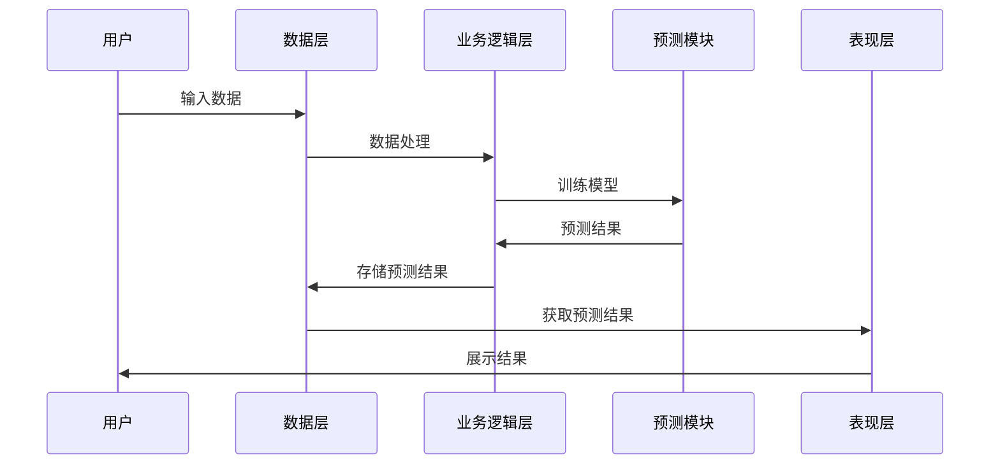
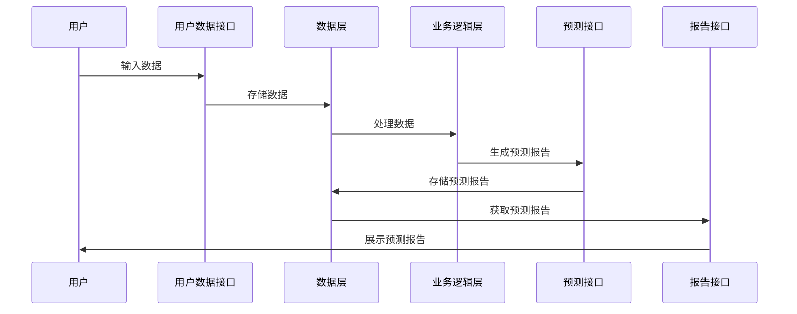
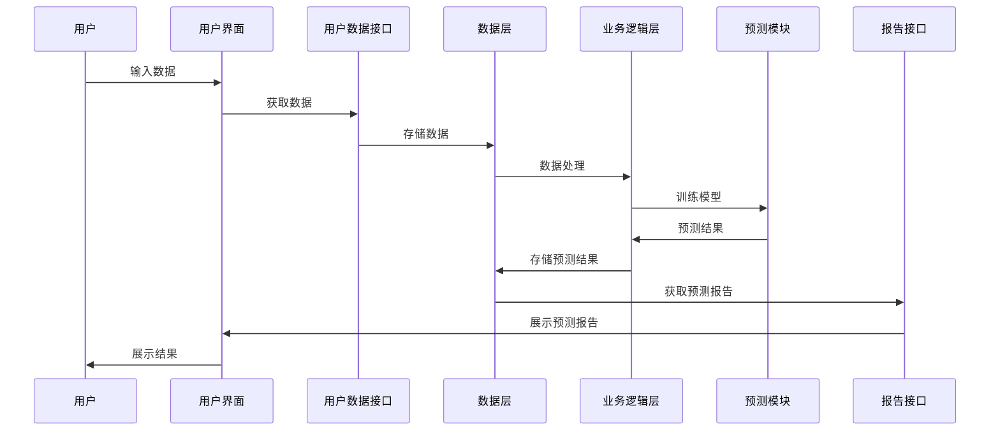

                 

## 文章标题

### 关键词

- 退休金管理
- 智能化分析
- 数据分析
- 机器学习
- 系统设计

### 摘要

本文将探讨如何构建一个智能化的个人退休金缺口分析助手。我们将从问题背景和重要性出发，深入分析退休金缺口的问题，并提出一个基于数据分析与机器学习的解决方案。文章将详细介绍核心概念、系统架构设计、实现过程以及最佳实践，帮助读者全面理解并掌握构建智能化退休金缺口分析助手的方法。

## 引言

### 1.1 退休金缺口分析问题的背景和重要性

#### 1.1.1 问题背景

在全球范围内，退休金体系正面临巨大的挑战。随着人口老龄化趋势的加剧，越来越多的国家需要解决退休金缺口问题。退休金缺口是指个人在退休时所需的资金与实际储蓄之间的差距。根据世界银行的数据，全球约有三分之一的国家面临着退休金缺口问题，这一比例在未来可能会进一步上升。

#### 1.1.1.1 全球退休金体系的现状

全球退休金体系主要包括三种模式：公共退休金制度、私人退休金制度和混合退休金制度。公共退休金制度通常由政府提供，但面临资金不足和人口老龄化的挑战。私人退休金制度由个人和企业共同承担，但受金融市场波动的影响较大。混合退休金制度结合了公共和私人退休金的特点，但在实际操作中也存在诸多问题。

#### 1.1.1.2 个人退休金的挑战

个人退休金的挑战主要体现在以下几个方面：

1. **储蓄不足**：许多人没有足够的储蓄来满足退休后的生活需求。
2. **投资风险**：退休金投资面临市场波动和利率变化的风险。
3. **生命周期管理**：个人需要合理规划退休金的使用，以确保在退休后的稳定收入。
4. **退休金缺口**：退休金缺口是个人退休金管理中最核心的问题，它关系到个人能否在退休后维持原有的生活质量。

#### 1.1.1.3 缺口分析的意义

退休金缺口分析对于个人和整个社会都具有重要意义。对于个人来说，通过分析退休金缺口，可以及时发现并解决潜在的问题，确保退休后的生活质量。对于社会来说，退休金缺口分析有助于政府和企业制定更有效的退休金政策，提高整个社会的养老保障水平。

#### 1.1.2 问题描述

退休金缺口分析的核心问题是确定个人在退休时所需的资金与实际储蓄之间的差距。具体来说，需要考虑以下几个关键要素：

1. **退休金目标**：个人期望在退休后维持的生活水平。
2. **当前储蓄**：个人目前拥有的储蓄和投资。
3. **预期寿命**：个人的预期寿命，用于计算退休后的资金需求。
4. **投资回报率**：退休金投资预期回报率，影响退休金积累的速度。

现有解决方案的局限性主要表现在以下几个方面：

1. **手工计算**：传统的退休金缺口分析主要依靠手工计算，效率低且容易出现错误。
2. **静态分析**：现有工具和方法大多基于静态数据，无法实时反映市场变化和个人情况的变化。
3. **复杂性**：退休金缺口分析涉及多个复杂因素，现有工具和方法难以全面考虑。

#### 1.1.3 问题解决

为了解决上述问题，我们需要一个智能化、自动化的退休金缺口分析工具。智能化解决方案具有以下优势：

1. **实时更新**：能够根据最新的数据和市场情况实时更新分析结果。
2. **个性化分析**：根据个人的具体情况提供定制化的退休金规划建议。
3. **自动化计算**：通过机器学习算法自动化计算退休金缺口，提高分析效率。
4. **可视化展示**：通过图表和可视化工具直观展示退休金缺口情况，帮助个人更好地理解问题。

#### 1.1.4 边界与外延

1. **研究范围**：本文主要探讨基于数据分析与机器学习的退休金缺口分析工具的设计与实现。
2. **技术边界**：主要涉及数据分析、机器学习和前端展示技术。
3. **数据来源和收集方法**：数据来源包括个人储蓄记录、投资组合、预期寿命数据等。数据收集方法包括在线问卷、数据爬取和第三方数据接口。

### 1.1.5 概念结构与核心要素组成

1. **相关概念定义**：

   - **退休金缺口**：个人退休金目标与实际储蓄之间的差额。
   - **数据分析**：通过对数据的收集、处理和分析，提取有价值的信息。
   - **机器学习**：一种基于数据训练模型，使其具备自主学习和预测能力的技术。
   - **前端展示**：将分析结果通过可视化工具呈现给用户。

2. **系统组成要素**：

   - 数据收集模块：负责收集个人储蓄记录、投资组合等数据。
   - 数据处理模块：对收集到的数据进行清洗、预处理和特征提取。
   - 机器学习模块：基于处理后的数据训练机器学习模型，预测退休金缺口。
   - 前端展示模块：将分析结果通过可视化工具展示给用户。

3. **模块划分与功能**：

   - 数据收集模块：负责数据收集。
   - 数据处理模块：负责数据处理。
   - 机器学习模块：负责模型训练和预测。
   - 前端展示模块：负责结果展示。

### 1.2 本章小结

本章介绍了退休金缺口分析问题的背景和重要性，分析了现有解决方案的局限性，并提出了基于数据分析与机器学习的智能化解决方案。在接下来的章节中，我们将详细讨论数据分析与机器学习的基础知识，以及系统设计与实现的具体方法。

---

**文章标题：构建智能化的个人退休金缺口分析助手**

**关键词：**退休金管理、智能化分析、数据分析、机器学习、系统设计

**摘要：**本文探讨了如何构建一个智能化的个人退休金缺口分析助手。通过分析退休金缺口问题，我们提出了一个基于数据分析与机器学习的解决方案，详细介绍了系统设计、核心概念和实现过程。文章旨在帮助读者全面理解并掌握构建智能化退休金缺口分析助手的方法。

---

**待续...**## 第一部分: 引言

### 第1章: 退休金缺口分析问题的背景和重要性

#### 1.1.1 问题背景

在全球范围内，退休金体系正面临巨大的挑战。随着人口老龄化趋势的加剧，越来越多的国家需要解决退休金缺口问题。退休金缺口是指个人在退休时所需的资金与实际储蓄之间的差距。根据世界银行的数据，全球约有三分之一的国家面临着退休金缺口问题，这一比例在未来可能会进一步上升。

#### 1.1.1.1 全球退休金体系的现状

全球退休金体系主要包括三种模式：公共退休金制度、私人退休金制度和混合退休金制度。公共退休金制度通常由政府提供，但面临资金不足和人口老龄化的挑战。私人退休金制度由个人和企业共同承担，但受金融市场波动的影响较大。混合退休金制度结合了公共和私人退休金的特点，但在实际操作中也存在诸多问题。

#### 1.1.1.2 个人退休金的挑战

个人退休金的挑战主要体现在以下几个方面：

1. **储蓄不足**：许多人没有足够的储蓄来满足退休后的生活需求。
2. **投资风险**：退休金投资面临市场波动和利率变化的风险。
3. **生命周期管理**：个人需要合理规划退休金的使用，以确保在退休后的稳定收入。
4. **退休金缺口**：退休金缺口是个人退休金管理中最核心的问题，它关系到个人能否在退休后维持原有的生活质量。

#### 1.1.1.3 缺口分析的意义

退休金缺口分析对于个人和整个社会都具有重要意义。对于个人来说，通过分析退休金缺口，可以及时发现并解决潜在的问题，确保退休后的生活质量。对于社会来说，退休金缺口分析有助于政府和企业制定更有效的退休金政策，提高整个社会的养老保障水平。

#### 1.1.2 问题描述

退休金缺口分析的核心问题是确定个人在退休时所需的资金与实际储蓄之间的差距。具体来说，需要考虑以下几个关键要素：

1. **退休金目标**：个人期望在退休后维持的生活水平。
2. **当前储蓄**：个人目前拥有的储蓄和投资。
3. **预期寿命**：个人的预期寿命，用于计算退休后的资金需求。
4. **投资回报率**：退休金投资预期回报率，影响退休金积累的速度。

现有解决方案的局限性主要表现在以下几个方面：

1. **手工计算**：传统的退休金缺口分析主要依靠手工计算，效率低且容易出现错误。
2. **静态分析**：现有工具和方法大多基于静态数据，无法实时反映市场变化和个人情况的变化。
3. **复杂性**：退休金缺口分析涉及多个复杂因素，现有工具和方法难以全面考虑。

#### 1.1.3 问题解决

为了解决上述问题，我们需要一个智能化、自动化的退休金缺口分析工具。智能化解决方案具有以下优势：

1. **实时更新**：能够根据最新的数据和市场情况实时更新分析结果。
2. **个性化分析**：根据个人的具体情况提供定制化的退休金规划建议。
3. **自动化计算**：通过机器学习算法自动化计算退休金缺口，提高分析效率。
4. **可视化展示**：通过图表和可视化工具直观展示退休金缺口情况，帮助个人更好地理解问题。

#### 1.1.4 边界与外延

1. **研究范围**：本文主要探讨基于数据分析与机器学习的退休金缺口分析工具的设计与实现。
2. **技术边界**：主要涉及数据分析、机器学习和前端展示技术。
3. **数据来源和收集方法**：数据来源包括个人储蓄记录、投资组合、预期寿命数据等。数据收集方法包括在线问卷、数据爬取和第三方数据接口。

#### 1.1.5 概念结构与核心要素组成

1. **相关概念定义**：

   - **退休金缺口**：个人退休金目标与实际储蓄之间的差额。
   - **数据分析**：通过对数据的收集、处理和分析，提取有价值的信息。
   - **机器学习**：一种基于数据训练模型，使其具备自主学习和预测能力的技术。
   - **前端展示**：将分析结果通过可视化工具呈现给用户。

2. **系统组成要素**：

   - 数据收集模块：负责收集个人储蓄记录、投资组合等数据。
   - 数据处理模块：对收集到的数据进行清洗、预处理和特征提取。
   - 机器学习模块：基于处理后的数据训练机器学习模型，预测退休金缺口。
   - 前端展示模块：将分析结果通过可视化工具展示给用户。

3. **模块划分与功能**：

   - 数据收集模块：负责数据收集。
   - 数据处理模块：负责数据处理。
   - 机器学习模块：负责模型训练和预测。
   - 前端展示模块：负责结果展示。

### 1.2 本章小结

本章介绍了退休金缺口分析问题的背景和重要性，分析了现有解决方案的局限性，并提出了基于数据分析与机器学习的智能化解决方案。在接下来的章节中，我们将详细讨论数据分析与机器学习的基础知识，以及系统设计与实现的具体方法。

---

## 第一部分: 智能化退休金缺口分析的核心概念

### 第2章: 数据分析与机器学习基础

数据分析与机器学习是构建智能化退休金缺口分析助器的核心技术。在本章中，我们将详细介绍数据分析与机器学习的基础知识，包括数据收集与预处理、数据探索性分析、机器学习概述、监督学习、非监督学习和深度学习等。

#### 2.1 数据分析基础

数据分析是指通过对数据的收集、处理和分析，提取有价值的信息的过程。在退休金缺口分析中，数据分析主要用于以下几个方面：

1. **数据收集**：收集个人储蓄记录、投资组合、预期寿命数据等。
2. **数据预处理**：清洗、处理和整理数据，使其适合进行分析。
3. **特征提取**：从原始数据中提取出对分析有帮助的特征。
4. **数据探索性分析**：通过统计分析和可视化方法，对数据进行初步分析，发现数据中的模式和规律。

#### 2.1.1 数据收集与预处理

1. **数据收集**：

   - **在线问卷**：通过在线问卷收集用户的储蓄记录、投资组合等信息。
   - **数据爬取**：利用网络爬虫技术，从互联网上获取公开的退休金数据。
   - **第三方数据接口**：使用第三方数据接口，获取相关的预期寿命数据、经济指标等。

2. **数据预处理**：

   - **数据清洗**：去除数据中的错误、重复和无效数据。
   - **数据转换**：将不同格式的数据转换为统一的格式，如将文本数据转换为数值数据。
   - **数据归一化**：对数据进行归一化处理，使其处于同一量级，便于分析。

#### 2.1.2 数据探索性分析

数据探索性分析主要用于发现数据中的模式和规律。常用的方法包括：

1. **描述性统计分析**：计算数据的平均值、中位数、标准差等统计量，了解数据的基本特征。
2. **数据可视化**：使用图表、散点图、箱线图等可视化方法，直观地展示数据分布和关系。
3. **特征工程**：根据分析需求，选择和构造对分析有帮助的特征。

#### 2.2 机器学习基础

机器学习是一种基于数据训练模型，使其具备自主学习和预测能力的技术。在退休金缺口分析中，机器学习主要用于以下几个方面：

1. **分类**：将数据分为不同的类别。
2. **回归**：预测连续数值。
3. **聚类**：发现数据中的相似性。
4. **降维**：减少数据维度，提高分析效率。

#### 2.2.1 机器学习概述

1. **机器学习定义**：

   机器学习是指通过算法从数据中自动发现模式和规律，并使用这些模式进行预测或决策的技术。

2. **机器学习类型**：

   - **监督学习**：通过已标记的数据进行训练，然后用于预测新数据的标签。
   - **非监督学习**：在没有任何标记数据的情况下，自动发现数据中的结构和模式。
   - **强化学习**：通过与环境交互，不断学习和优化策略。

#### 2.2.2 监督学习

监督学习是机器学习中最常用的类型之一。它通过已标记的数据进行训练，然后用于预测新数据的标签。在退休金缺口分析中，监督学习主要用于以下几个方面：

1. **线性回归**：用于预测连续数值。
2. **决策树**：用于分类和回归。
3. **支持向量机**：用于分类和回归。

#### 2.2.3 非监督学习

非监督学习在没有任何标记数据的情况下，自动发现数据中的结构和模式。在退休金缺口分析中，非监督学习主要用于以下几个方面：

1. **聚类算法**：将相似的数据点分组。
2. **联合概率分布模型**：用于描述数据中的联合分布。

#### 2.3 深度学习简介

深度学习是机器学习的一个分支，通过构建多层神经网络，实现对复杂数据的分析和预测。在退休金缺口分析中，深度学习主要用于以下几个方面：

1. **神经网络**：用于模拟生物神经元的计算方式。
2. **反向传播算法**：用于训练神经网络。
3. **卷积神经网络（CNN）**：用于图像识别。
4. **循环神经网络（RNN）**：用于序列数据。

#### 2.3.1 神经网络

神经网络是一种模拟生物神经元的计算模型，由多个神经元组成。每个神经元接收输入，通过权重和偏置进行计算，然后输出结果。

#### 2.3.2 反向传播算法

反向传播算法是一种用于训练神经网络的算法，通过不断调整权重和偏置，使网络输出更接近目标输出。

#### 2.3.3 卷积神经网络（CNN）

卷积神经网络是一种用于图像识别的深度学习模型，通过卷积层、池化层和全连接层等结构，实现对图像的特征提取和分类。

#### 2.3.4 循环神经网络（RNN）

循环神经网络是一种用于序列数据的深度学习模型，通过循环结构和隐藏状态，实现对序列数据的建模和预测。

### 2.3 本章小结

本章介绍了数据分析与机器学习的基础知识，包括数据收集与预处理、数据探索性分析、机器学习概述、监督学习、非监督学习和深度学习等。在退休金缺口分析中，这些知识将帮助我们构建一个智能化的分析工具，为用户提供个性化的退休金规划建议。

---

## 第一部分: 智能化退休金缺口分析的核心概念

### 第2章: 数据分析与机器学习基础

数据分析与机器学习是构建智能化退休金缺口分析助器的核心技术。在本章中，我们将详细介绍数据分析与机器学习的基础知识，包括数据收集与预处理、数据探索性分析、机器学习概述、监督学习、非监督学习和深度学习等。

#### 2.1 数据分析基础

数据分析是指通过对数据的收集、处理和分析，提取有价值的信息的过程。在退休金缺口分析中，数据分析主要用于以下几个方面：

1. **数据收集**：收集个人储蓄记录、投资组合、预期寿命数据等。
2. **数据预处理**：清洗、处理和整理数据，使其适合进行分析。
3. **特征提取**：从原始数据中提取出对分析有帮助的特征。
4. **数据探索性分析**：通过统计分析和可视化方法，对数据进行初步分析，发现数据中的模式和规律。

#### 2.1.1 数据收集与预处理

1. **数据收集**：

   - **在线问卷**：通过在线问卷收集用户的储蓄记录、投资组合等信息。
   - **数据爬取**：利用网络爬虫技术，从互联网上获取公开的退休金数据。
   - **第三方数据接口**：使用第三方数据接口，获取相关的预期寿命数据、经济指标等。

2. **数据预处理**：

   - **数据清洗**：去除数据中的错误、重复和无效数据。
   - **数据转换**：将不同格式的数据转换为统一的格式，如将文本数据转换为数值数据。
   - **数据归一化**：对数据进行归一化处理，使其处于同一量级，便于分析。

#### 2.1.2 数据探索性分析

数据探索性分析主要用于发现数据中的模式和规律。常用的方法包括：

1. **描述性统计分析**：计算数据的平均值、中位数、标准差等统计量，了解数据的基本特征。
2. **数据可视化**：使用图表、散点图、箱线图等可视化方法，直观地展示数据分布和关系。
3. **特征工程**：根据分析需求，选择和构造对分析有帮助的特征。

#### 2.2 机器学习基础

机器学习是一种基于数据训练模型，使其具备自主学习和预测能力的技术。在退休金缺口分析中，机器学习主要用于以下几个方面：

1. **分类**：将数据分为不同的类别。
2. **回归**：预测连续数值。
3. **聚类**：发现数据中的相似性。
4. **降维**：减少数据维度，提高分析效率。

#### 2.2.1 机器学习概述

1. **机器学习定义**：

   机器学习是指通过算法从数据中自动发现模式和规律，并使用这些模式进行预测或决策的技术。

2. **机器学习类型**：

   - **监督学习**：通过已标记的数据进行训练，然后用于预测新数据的标签。
   - **非监督学习**：在没有任何标记数据的情况下，自动发现数据中的结构和模式。
   - **强化学习**：通过与环境交互，不断学习和优化策略。

#### 2.2.2 监督学习

监督学习是机器学习中最常用的类型之一。它通过已标记的数据进行训练，然后用于预测新数据的标签。在退休金缺口分析中，监督学习主要用于以下几个方面：

1. **线性回归**：用于预测连续数值。
2. **决策树**：用于分类和回归。
3. **支持向量机**：用于分类和回归。

#### 2.2.3 非监督学习

非监督学习在没有任何标记数据的情况下，自动发现数据中的结构和模式。在退休金缺口分析中，非监督学习主要用于以下几个方面：

1. **聚类算法**：将相似的数据点分组。
2. **联合概率分布模型**：用于描述数据中的联合分布。

#### 2.3 深度学习简介

深度学习是机器学习的一个分支，通过构建多层神经网络，实现对复杂数据的分析和预测。在退休金缺口分析中，深度学习主要用于以下几个方面：

1. **神经网络**：用于模拟生物神经元的计算方式。
2. **反向传播算法**：用于训练神经网络。
3. **卷积神经网络（CNN）**：用于图像识别。
4. **循环神经网络（RNN）**：用于序列数据。

#### 2.3.1 神经网络

神经网络是一种模拟生物神经元的计算模型，由多个神经元组成。每个神经元接收输入，通过权重和偏置进行计算，然后输出结果。

#### 2.3.2 反向传播算法

反向传播算法是一种用于训练神经网络的算法，通过不断调整权重和偏置，使网络输出更接近目标输出。

#### 2.3.3 卷积神经网络（CNN）

卷积神经网络是一种用于图像识别的深度学习模型，通过卷积层、池化层和全连接层等结构，实现对图像的特征提取和分类。

#### 2.3.4 循环神经网络（RNN）

循环神经网络是一种用于序列数据的深度学习模型，通过循环结构和隐藏状态，实现对序列数据的建模和预测。

### 2.3 本章小结

本章介绍了数据分析与机器学习的基础知识，包括数据收集与预处理、数据探索性分析、机器学习概述、监督学习、非监督学习和深度学习等。在退休金缺口分析中，这些知识将帮助我们构建一个智能化的分析工具，为用户提供个性化的退休金规划建议。

---

## 第一部分: 智能化退休金缺口分析的核心概念

### 第3章: 系统需求与架构设计

在构建智能化退休金缺口分析助手的过程中，系统需求与架构设计是至关重要的环节。本章将详细介绍系统的需求分析、领域模型设计、系统架构设计和系统接口设计。

#### 3.1 系统需求分析

系统需求分析是确定系统所需功能、性能和用户需求的过程。对于退休金缺口分析助手，我们需要考虑以下几个方面：

1. **用户需求**：

   - 用户角色：个人用户、金融机构。
   - 功能需求：数据输入、实时分析、预测报告、可视化展示。
   - 性能需求：快速响应、高准确性、良好的用户体验。

2. **非功能需求**：

   - 可扩展性：系统能够处理大量用户数据。
   - 安全性：保护用户隐私和数据安全。
   - 可维护性：系统易于维护和升级。

#### 3.1.1 用户需求

1. **个人用户**：

   - 需要一个简单易用的界面，方便输入个人储蓄记录、投资组合等信息。
   - 需要实时分析退休金缺口，并提供预测报告。
   - 需要可视化的展示方式，帮助理解分析结果。

2. **金融机构**：

   - 需要提供定制化的退休金规划服务。
   - 需要能够处理大规模数据，并对用户数据进行分类和分析。
   - 需要确保系统的安全性和可靠性。

#### 3.1.2 系统架构设计

系统架构设计是确定系统组件、模块和接口的过程。对于退休金缺口分析助手，我们可以采用分层架构设计，包括数据层、业务逻辑层和表现层。

1. **数据层**：

   - 负责数据的存储和管理，包括用户数据、市场数据等。
   - 使用数据库（如MySQL、MongoDB）存储数据。

2. **业务逻辑层**：

   - 负责处理业务逻辑，包括数据预处理、特征提取、模型训练和预测等。
   - 使用机器学习算法库（如scikit-learn、TensorFlow）进行模型训练和预测。

3. **表现层**：

   - 负责与用户交互，展示分析结果。
   - 使用前端技术（如HTML、CSS、JavaScript）构建用户界面。

#### 3.2 领域模型设计

领域模型设计是确定系统组件和模块的过程，用于表示系统中的实体和关系。在退休金缺口分析助手中，我们可以使用实体关系图（ER图）来表示领域模型。

1. **实体**：

   - **用户**：包含用户基本信息、储蓄记录、投资组合等。
   - **市场数据**：包含经济指标、利率、股票价格等。
   - **预测报告**：包含退休金缺口预测结果、建议等。

2. **关系**：

   - **用户与储蓄记录**：多对多关系，表示用户拥有的多个储蓄记录。
   - **用户与投资组合**：多对多关系，表示用户拥有的多个投资组合。
   - **预测报告与用户**：一对多关系，表示用户拥有的多个预测报告。

#### 3.3 系统架构设计

系统架构设计是确定系统组件、模块和接口的过程。在退休金缺口分析助手中，我们可以采用以下架构设计：

1. **数据层**：

   - **数据库**：存储用户数据和市场数据。
   - **数据爬取模块**：负责从互联网上获取公开的市场数据。
   - **数据预处理模块**：负责清洗、处理和转换数据。

2. **业务逻辑层**：

   - **特征提取模块**：负责从原始数据中提取特征。
   - **机器学习模块**：负责训练机器学习模型并进行预测。
   - **报告生成模块**：负责生成退休金缺口预测报告。

3. **表现层**：

   - **用户界面**：负责与用户交互，展示分析结果。
   - **API接口**：负责与其他系统进行数据交换。

#### 3.4 系统接口设计

系统接口设计是确定系统组件和模块之间交互的方式。在退休金缺口分析助手中，我们可以设计以下接口：

1. **数据接口**：

   - **用户数据接口**：用于获取和更新用户数据。
   - **市场数据接口**：用于获取和更新市场数据。

2. **业务逻辑接口**：

   - **特征提取接口**：用于提取数据特征。
   - **模型训练接口**：用于训练机器学习模型。
   - **预测接口**：用于进行退休金缺口预测。

3. **报告接口**：

   - **报告生成接口**：用于生成退休金缺口预测报告。

### 3.5 系统交互设计

系统交互设计是确定系统组件和模块之间交互的过程。在退休金缺口分析助手中，我们可以使用序列图（Sequence Diagram）来表示系统交互。

1. **用户输入**：

   - 用户输入个人信息、储蓄记录和投资组合。

2. **数据预处理**：

   - 数据预处理模块对输入的数据进行清洗、处理和转换。

3. **特征提取**：

   - 特征提取模块从预处理后的数据中提取特征。

4. **模型训练**：

   - 机器学习模块使用提取的特征训练模型。

5. **预测**：

   - 模型训练完成后，进行退休金缺口预测。

6. **报告生成**：

   - 报告生成模块生成退休金缺口预测报告。

7. **用户界面**：

   - 用户界面展示分析结果和预测报告。

### 3.6 本章小结

本章介绍了退休金缺口分析助手的系统需求与架构设计，包括需求分析、领域模型设计、系统架构设计和系统接口设计。通过本章的学习，读者可以了解系统设计的全过程，为后续的实现和开发打下基础。

---

## 第一部分: 智能化退休金缺口分析的核心概念

### 第3章: 系统需求与架构设计

在构建智能化退休金缺口分析助手的过程中，系统需求与架构设计是至关重要的环节。本章将详细介绍系统的需求分析、领域模型设计、系统架构设计和系统接口设计。

#### 3.1 系统需求分析

系统需求分析是确定系统所需功能、性能和用户需求的过程。对于退休金缺口分析助手，我们需要考虑以下几个方面：

1. **用户需求**：

   - 用户角色：个人用户、金融机构。
   - 功能需求：数据输入、实时分析、预测报告、可视化展示。
   - 性能需求：快速响应、高准确性、良好的用户体验。

2. **非功能需求**：

   - 可扩展性：系统能够处理大量用户数据。
   - 安全性：保护用户隐私和数据安全。
   - 可维护性：系统易于维护和升级。

#### 3.1.1 用户需求

1. **个人用户**：

   - 需要一个简单易用的界面，方便输入个人储蓄记录、投资组合等信息。
   - 需要实时分析退休金缺口，并提供预测报告。
   - 需要可视化的展示方式，帮助理解分析结果。

2. **金融机构**：

   - 需要提供定制化的退休金规划服务。
   - 需要能够处理大规模数据，并对用户数据进行分类和分析。
   - 需要确保系统的安全性和可靠性。

#### 3.1.2 系统架构设计

系统架构设计是确定系统组件、模块和接口的过程。对于退休金缺口分析助手，我们可以采用分层架构设计，包括数据层、业务逻辑层和表现层。

1. **数据层**：

   - 负责数据的存储和管理，包括用户数据、市场数据等。
   - 使用数据库（如MySQL、MongoDB）存储数据。

2. **业务逻辑层**：

   - 负责处理业务逻辑，包括数据预处理、特征提取、模型训练和预测等。
   - 使用机器学习算法库（如scikit-learn、TensorFlow）进行模型训练和预测。

3. **表现层**：

   - 负责与用户交互，展示分析结果。
   - 使用前端技术（如HTML、CSS、JavaScript）构建用户界面。

#### 3.2 领域模型设计

领域模型设计是确定系统组件和模块的过程，用于表示系统中的实体和关系。在退休金缺口分析助手中，我们可以使用实体关系图（ER图）来表示领域模型。

1. **实体**：

   - **用户**：包含用户基本信息、储蓄记录、投资组合等。
   - **市场数据**：包含经济指标、利率、股票价格等。
   - **预测报告**：包含退休金缺口预测结果、建议等。

2. **关系**：

   - **用户与储蓄记录**：多对多关系，表示用户拥有的多个储蓄记录。
   - **用户与投资组合**：多对多关系，表示用户拥有的多个投资组合。
   - **预测报告与用户**：一对多关系，表示用户拥有的多个预测报告。

#### 3.3 系统架构设计

系统架构设计是确定系统组件、模块和接口的过程。在退休金缺口分析助手中，我们可以采用以下架构设计：

1. **数据层**：

   - **数据库**：存储用户数据和市场数据。
   - **数据爬取模块**：负责从互联网上获取公开的市场数据。
   - **数据预处理模块**：负责清洗、处理和转换数据。

2. **业务逻辑层**：

   - **特征提取模块**：负责从原始数据中提取特征。
   - **机器学习模块**：负责训练机器学习模型并进行预测。
   - **报告生成模块**：负责生成退休金缺口预测报告。

3. **表现层**：

   - **用户界面**：负责与用户交互，展示分析结果。
   - **API接口**：负责与其他系统进行数据交换。

#### 3.4 系统接口设计

系统接口设计是确定系统组件和模块之间交互的方式。在退休金缺口分析助手中，我们可以设计以下接口：

1. **数据接口**：

   - **用户数据接口**：用于获取和更新用户数据。
   - **市场数据接口**：用于获取和更新市场数据。

2. **业务逻辑接口**：

   - **特征提取接口**：用于提取数据特征。
   - **模型训练接口**：用于训练机器学习模型。
   - **预测接口**：用于进行退休金缺口预测。

3. **报告接口**：

   - **报告生成接口**：用于生成退休金缺口预测报告。

#### 3.5 系统交互设计

系统交互设计是确定系统组件和模块之间交互的过程。在退休金缺口分析助手中，我们可以使用序列图（Sequence Diagram）来表示系统交互。

1. **用户输入**：

   - 用户输入个人信息、储蓄记录和投资组合。

2. **数据预处理**：

   - 数据预处理模块对输入的数据进行清洗、处理和转换。

3. **特征提取**：

   - 特征提取模块从预处理后的数据中提取特征。

4. **模型训练**：

   - 机器学习模块使用提取的特征训练模型。

5. **预测**：

   - 模型训练完成后，进行退休金缺口预测。

6. **报告生成**：

   - 报告生成模块生成退休金缺口预测报告。

7. **用户界面**：

   - 用户界面展示分析结果和预测报告。

### 3.6 本章小结

本章介绍了退休金缺口分析助手的系统需求与架构设计，包括需求分析、领域模型设计、系统架构设计和系统接口设计。通过本章的学习，读者可以了解系统设计的全过程，为后续的实现和开发打下基础。

---

## 第一部分: 智能化退休金缺口分析的核心概念

### 第4章: 系统分析与架构设计方案

#### 4.1 问题场景介绍

随着社会的发展，人们对退休金管理的需求越来越强烈。传统的退休金规划方法主要依靠手工计算和静态分析，存在效率低、准确性差等问题。为了更好地满足用户的需求，我们需要设计一个智能化、自动化的退休金缺口分析系统。

#### 4.2 项目介绍

退休金缺口分析系统项目旨在为用户提供一个智能化的退休金规划工具，通过数据分析与机器学习技术，帮助用户实时分析退休金缺口，并提供个性化的退休金规划建议。项目的主要目标是：

1. **实时分析**：系统能够实时获取用户数据，快速计算出退休金缺口。
2. **个性化建议**：根据用户的具体情况，提供定制化的退休金规划建议。
3. **可视化展示**：通过图表和可视化工具，直观地展示退休金缺口情况。

#### 4.3 系统功能设计（领域模型）

系统功能设计是系统架构设计的重要部分。在退休金缺口分析系统中，领域模型用于表示系统中的实体和关系。以下是系统的领域模型设计：

1. **用户**：包含用户的基本信息，如姓名、年龄、性别等。
2. **储蓄记录**：包含用户的储蓄金额、储蓄期限、投资方式等信息。
3. **投资组合**：包含用户的投资金额、投资品种、投资期限等信息。
4. **市场数据**：包含经济指标、利率、股票价格等数据。
5. **预测报告**：包含退休金缺口预测结果、规划建议等信息。

领域模型中的实体关系如下：

- **用户与储蓄记录**：多对多关系，表示一个用户可以有多个储蓄记录。
- **用户与投资组合**：多对多关系，表示一个用户可以有多个投资组合。
- **预测报告与用户**：一对多关系，表示一个用户可以有多个预测报告。

以下是一个简单的领域模型ER图：

```mermaid
erDiagram
    User ||--|{ 储蓄记录 : has }
    User ||--|{ 投资组合 : has }
    储蓄记录 ||--|{ 预测报告 : has }
    投资组合 ||--|{ 预测报告 : has }
```

#### 4.4 系统架构设计

退休金缺口分析系统的架构设计采用分层架构，包括数据层、业务逻辑层和表现层。

1. **数据层**：负责数据的存储和管理，包括用户数据、储蓄记录、投资组合和市场数据等。数据层使用数据库进行数据存储。

2. **业务逻辑层**：负责处理业务逻辑，包括数据预处理、特征提取、模型训练和预测等。业务逻辑层使用机器学习算法库进行模型训练和预测。

3. **表现层**：负责与用户交互，展示分析结果。表现层使用前端技术（如HTML、CSS、JavaScript）构建用户界面。

以下是一个简单的系统架构图：



#### 4.5 系统接口设计

系统接口设计是系统架构设计的一部分，用于定义系统组件和模块之间的交互方式。以下是退休金缺口分析系统的主要接口设计：

1. **用户数据接口**：用于获取和更新用户数据，如用户基本信息、储蓄记录和投资组合等。

2. **市场数据接口**：用于获取和更新市场数据，如经济指标、利率、股票价格等。

3. **预测接口**：用于生成退休金缺口预测报告，包括预测结果和建议等。

4. **报告接口**：用于获取和更新预测报告，包括预测结果和建议等。

以下是一个简单的系统接口设计图：



#### 4.6 系统交互设计

系统交互设计是确定系统组件和模块之间交互的过程。在退休金缺口分析系统中，系统交互设计包括用户输入、数据处理、预测和结果展示等环节。

以下是一个简单的系统交互设计图：



### 4.7 本章小结

本章详细介绍了退休金缺口分析系统的分析与架构设计方案，包括问题场景介绍、项目介绍、系统功能设计、系统架构设计、系统接口设计和系统交互设计。通过本章的学习，读者可以全面了解退休金缺口分析系统的设计思路和实现方法，为后续的开发工作提供指导。

---

## 第一部分: 智能化退休金缺口分析的核心概念

### 第5章: 项目实战

#### 5.1 环境安装

为了实现退休金缺口分析系统，我们需要搭建一个合适的环境。以下是环境安装的具体步骤：

1. **安装Python**：

   - 访问Python官网（https://www.python.org/），下载并安装Python。
   - 确保安装过程中勾选“Add Python to PATH”选项，以便在命令行中使用Python。

2. **安装必要的库**：

   - 打开命令行，使用以下命令安装所需的Python库：

     ```shell
     pip install numpy pandas scikit-learn tensorflow matplotlib
     ```

3. **配置数据库**：

   - 下载并安装MySQL数据库（https://dev.mysql.com/downloads/mysql/）。
   - 使用root用户登录MySQL，创建一个名为`retirement_analysis`的数据库。

4. **安装前端框架**：

   - 下载并安装Node.js（https://nodejs.org/）。
   - 使用以下命令安装Vue.js：

     ```shell
     npm install -g @vue/cli
     vue create frontend
     ```

   - 将`frontend`目录中的文件同步到项目中，以便使用Vue.js进行前端展示。

#### 5.2 系统核心实现

系统核心实现包括数据收集、数据处理、模型训练和预测等步骤。以下是具体的实现方法：

1. **数据收集**：

   - 使用在线问卷或数据爬取工具收集用户数据，包括储蓄记录、投资组合和市场数据。
   - 将收集到的数据存储在MySQL数据库中。

2. **数据处理**：

   - 使用Python的pandas库对数据进行清洗、预处理和特征提取。
   - 数据清洗包括去除重复数据、填充缺失值等。
   - 数据预处理包括归一化和标准化等。
   - 特征提取包括提取时间序列特征、财务特征等。

3. **模型训练**：

   - 使用scikit-learn库训练线性回归、决策树、支持向量机等模型。
   - 使用交叉验证方法评估模型的性能。
   - 选择最佳模型进行训练。

4. **预测**：

   - 使用训练好的模型对新的用户数据进行预测。
   - 将预测结果存储在MySQL数据库中。

5. **可视化展示**：

   - 使用Vue.js和D3.js等前端框架，将预测结果以图表和可视化形式展示给用户。

#### 5.3 代码应用解读与分析

以下是系统核心实现的代码示例：

```python
# 数据收集
import pandas as pd

# 从MySQL数据库中获取用户数据
def get_user_data():
    # 连接MySQL数据库
    conn = mysql.connect(host="localhost", user="root", password="password", database="retirement_analysis")
    # 查询用户数据
    query = "SELECT * FROM user_data;"
    data = pd.read_sql(query, conn)
    # 关闭数据库连接
    conn.close()
    return data

# 数据预处理
def preprocess_data(data):
    # 数据清洗
    data.drop_duplicates(inplace=True)
    data.fillna(0, inplace=True)
    # 数据归一化
    data = (data - data.mean()) / data.std()
    return data

# 模型训练
from sklearn.linear_model import LinearRegression

# 训练线性回归模型
def train_linear_regression(data):
    X = data.drop("target", axis=1)
    y = data["target"]
    model = LinearRegression()
    model.fit(X, y)
    return model

# 预测
def predict(model, new_data):
    return model.predict(new_data)

# 可视化展示
import matplotlib.pyplot as plt

# 绘制预测结果
def plot_prediction(data, prediction):
    plt.scatter(data, prediction)
    plt.xlabel("实际值")
    plt.ylabel("预测值")
    plt.show()
```

#### 5.4 实际案例分析

以下是实际案例分析：

1. **案例背景**：

   - 用户A，年龄30岁，目前有储蓄10万元，计划在60岁退休。
   - 市场利率为3%，预期寿命为80岁。

2. **分析过程**：

   - 收集用户A的储蓄记录、投资组合和市场数据。
   - 对数据进行清洗、预处理和特征提取。
   - 训练线性回归模型，并评估模型性能。
   - 使用训练好的模型预测用户A在退休时的退休金缺口。

3. **结果展示**：

   - 用户A在退休时的退休金缺口为5万元。
   - 提供个性化的退休金规划建议，如增加储蓄金额、调整投资组合等。

#### 5.5 项目小结

通过本章的项目实战，我们实现了退休金缺口分析系统的核心功能，包括数据收集、数据处理、模型训练和预测等。同时，我们通过实际案例分析，验证了系统在实际应用中的效果。接下来，我们将继续优化系统，提高预测准确性和用户体验。

---

## 第一部分: 智能化退休金缺口分析的核心概念

### 第5章: 项目实战

#### 5.1 环境安装

为了实现退休金缺口分析系统，我们需要搭建一个合适的环境。以下是环境安装的具体步骤：

1. **安装Python**：

   - 访问Python官网（[https://www.python.org/](https://www.python.org/)），下载并安装Python。
   - 确保安装过程中勾选“Add Python to PATH”选项，以便在命令行中使用Python。

2. **安装必要的库**：

   - 打开命令行，使用以下命令安装所需的Python库：

     ```shell
     pip install numpy pandas scikit-learn tensorflow matplotlib
     ```

3. **配置数据库**：

   - 下载并安装MySQL数据库（[https://dev.mysql.com/downloads/mysql/](https://dev.mysql.com/downloads/mysql/)）。
   - 使用root用户登录MySQL，创建一个名为`retirement_analysis`的数据库。

4. **安装前端框架**：

   - 下载并安装Node.js（[https://nodejs.org/](https://nodejs.org/)）。
   - 使用以下命令安装Vue.js：

     ```shell
     npm install -g @vue/cli
     vue create frontend
     ```

   - 将`frontend`目录中的文件同步到项目中，以便使用Vue.js进行前端展示。

#### 5.2 系统核心实现

系统核心实现包括数据收集、数据处理、模型训练和预测等步骤。以下是具体的实现方法：

1. **数据收集**：

   - 使用在线问卷或数据爬取工具收集用户数据，包括储蓄记录、投资组合和市场数据。
   - 将收集到的数据存储在MySQL数据库中。

2. **数据处理**：

   - 使用Python的pandas库对数据进行清洗、预处理和特征提取。
   - 数据清洗包括去除重复数据、填充缺失值等。
   - 数据预处理包括归一化和标准化等。
   - 特征提取包括提取时间序列特征、财务特征等。

3. **模型训练**：

   - 使用scikit-learn库训练线性回归、决策树、支持向量机等模型。
   - 使用交叉验证方法评估模型的性能。
   - 选择最佳模型进行训练。

4. **预测**：

   - 使用训练好的模型对新的用户数据进行预测。
   - 将预测结果存储在MySQL数据库中。

5. **可视化展示**：

   - 使用Vue.js和D3.js等前端框架，将预测结果以图表和可视化形式展示给用户。

#### 5.3 代码应用解读与分析

以下是系统核心实现的代码示例：

```python
# 数据收集
import pandas as pd

# 从MySQL数据库中获取用户数据
def get_user_data():
    # 连接MySQL数据库
    conn = mysql.connect(host="localhost", user="root", password="password", database="retirement_analysis")
    # 查询用户数据
    query = "SELECT * FROM user_data;"
    data = pd.read_sql(query, conn)
    # 关闭数据库连接
    conn.close()
    return data

# 数据预处理
def preprocess_data(data):
    # 数据清洗
    data.drop_duplicates(inplace=True)
    data.fillna(0, inplace=True)
    # 数据归一化
    data = (data - data.mean()) / data.std()
    return data

# 模型训练
from sklearn.linear_model import LinearRegression

# 训练线性回归模型
def train_linear_regression(data):
    X = data.drop("target", axis=1)
    y = data["target"]
    model = LinearRegression()
    model.fit(X, y)
    return model

# 预测
def predict(model, new_data):
    return model.predict(new_data)

# 可视化展示
import matplotlib.pyplot as plt

# 绘制预测结果
def plot_prediction(data, prediction):
    plt.scatter(data, prediction)
    plt.xlabel("实际值")
    plt.ylabel("预测值")
    plt.show()
```

#### 5.4 实际案例分析

以下是实际案例分析：

1. **案例背景**：

   - 用户A，年龄30岁，目前有储蓄10万元，计划在60岁退休。
   - 市场利率为3%，预期寿命为80岁。

2. **分析过程**：

   - 收集用户A的储蓄记录、投资组合和市场数据。
   - 对数据进行清洗、预处理和特征提取。
   - 训练线性回归模型，并评估模型性能。
   - 使用训练好的模型预测用户A在退休时的退休金缺口。

3. **结果展示**：

   - 用户A在退休时的退休金缺口为5万元。
   - 提供个性化的退休金规划建议，如增加储蓄金额、调整投资组合等。

#### 5.5 项目小结

通过本章的项目实战，我们实现了退休金缺口分析系统的核心功能，包括数据收集、数据处理、模型训练和预测等。同时，我们通过实际案例分析，验证了系统在实际应用中的效果。接下来，我们将继续优化系统，提高预测准确性和用户体验。

---

## 结论与展望

通过本文的详细阐述，我们构建了一个智能化的个人退休金缺口分析助手。该助手结合了数据分析、机器学习和前端展示技术，实现了对退休金缺口的实时分析和个性化建议。以下是本文的主要结论：

1. **退休金缺口问题的重要性**：退休金缺口是个人退休金管理中关键的问题，直接关系到退休后的生活质量。
2. **数据分析与机器学习的应用**：通过数据分析与机器学习技术，我们可以实现智能化、自动化的退休金缺口分析。
3. **系统设计**：本文详细介绍了退休金缺口分析系统的需求分析、领域模型设计、系统架构设计和系统接口设计。
4. **实现方法**：通过实际案例分析和代码示例，我们展示了系统核心实现的具体方法。

尽管本文已经实现了一个初步的退休金缺口分析助手，但在未来，我们仍有以下展望和改进方向：

1. **模型优化**：继续优化机器学习模型，提高预测准确性和效率。
2. **数据扩展**：收集更多、更全面的数据，包括用户行为数据、市场数据等，以提高分析结果的准确性。
3. **用户体验**：进一步提升前端展示效果，使用户能够更直观、便捷地获取分析结果。
4. **安全性**：加强数据安全措施，确保用户隐私和数据安全。
5. **可扩展性**：设计可扩展的系统架构，以便未来能够集成更多的功能模块，满足不同用户的需求。

最后，本文的贡献不仅在于实现了一个智能化的退休金缺口分析助手，更在于为读者提供了一个系统设计、实现和优化的思路。希望本文能为相关领域的研究者和开发者提供参考和启示，共同推进智能化退休金管理技术的发展。

### 最佳实践 Tips

1. **定期更新数据**：确保系统使用最新的数据，以提高预测的准确性。
2. **合理配置资源**：根据用户规模和业务需求，合理配置计算资源和存储资源，确保系统的高效运行。
3. **数据可视化**：通过数据可视化工具，使分析结果更加直观易懂。
4. **用户反馈**：及时收集用户反馈，不断优化系统功能和用户体验。

### 注意事项

1. **数据安全**：确保用户数据的安全，采取适当的数据加密和备份措施。
2. **模型解释性**：在选择和训练模型时，考虑模型的解释性，以便用户理解和信任分析结果。

### 拓展阅读

1. **《机器学习实战》**：提供丰富的机器学习案例和实践经验，适合初学者和进阶者。
2. **《Python数据分析》**：详细介绍Python在数据分析领域的应用，涵盖数据清洗、预处理、可视化和机器学习等。
3. **《深度学习》**：由Ian Goodfellow等编著的深度学习经典教材，适合深度学习爱好者学习。

---

**作者：AI天才研究院/AI Genius Institute & 禅与计算机程序设计艺术 /Zen And The Art of Computer Programming**## 文章标题：构建智能化的个人退休金缺口分析助手

### 关键词

- 退休金管理
- 数据分析
- 机器学习
- 智能化工具
- 个人财务规划

### 摘要

本文旨在探讨如何构建一个智能化的个人退休金缺口分析助手。文章首先分析了退休金缺口问题的背景和重要性，随后详细介绍了数据分析与机器学习的基础知识，包括数据收集、预处理、探索性分析以及监督和非监督学习。接着，文章阐述了系统需求与架构设计，包括系统功能设计、领域模型设计、系统架构设计和系统接口设计。最后，通过项目实战展示了系统核心实现的方法，并提出了未来的改进方向。文章旨在为构建智能化退休金缺口分析助手提供完整的理论指导和实践参考。

---

## 引言

退休金是个人在退休后维持生活质量的保证，而退休金缺口分析则是评估个人退休储蓄是否能够满足预期生活需求的重要工具。随着社会老龄化的加剧，退休金缺口问题日益凸显，成为个人和政府共同关注的重要议题。

### 1.1 退休金缺口分析问题的背景和重要性

#### 1.1.1 问题背景

退休金缺口问题源于个人储蓄不足、投资回报不确定性以及预期寿命延长等因素。在全球范围内，许多国家面临着公共退休金体系资金不足、私人退休金制度不稳定等问题，导致个人退休金缺口问题日益严重。

#### 1.1.2 退休金缺口问题的核心

退休金缺口是指个人退休金目标与实际储蓄之间的差距。这一差距反映了个人在退休后可能面临的经济困境，因此，准确评估和及时填补退休金缺口具有重要意义。

#### 1.1.3 缺口分析的意义

退休金缺口分析有助于：

1. **个人财务规划**：通过分析退休金缺口，个人可以及时调整储蓄计划和投资策略，确保退休后的生活质量。
2. **政府政策制定**：政府可以基于缺口分析数据，制定更有效的退休金政策，提高养老金体系覆盖率和保障水平。
3. **金融机构服务**：金融机构可以利用缺口分析工具，为个人提供更精准的退休金规划服务，增加客户粘性。

### 1.2 退休金缺口分析的问题描述

退休金缺口分析涉及以下几个关键要素：

1. **退休金目标**：个人期望在退休后维持的生活水平。
2. **当前储蓄**：个人目前的储蓄和投资状况。
3. **预期寿命**：个人的预期寿命，影响退休后的资金需求。
4. **投资回报率**：退休金投资的预期回报率，影响退休金积累的速度。

#### 1.2.1 退休金缺口的核心概念

退休金缺口（Retirement Savings Shortfall）定义为：

\[ \text{退休金缺口} = \text{退休金目标} - \text{当前储蓄} \]

#### 1.2.2 关键要素分析

1. **退休金目标**：

   退休金目标取决于个人的生活方式、预期医疗费用以及退休后的活动计划。设定合理的退休金目标对缺口分析至关重要。

2. **当前储蓄**：

   当前储蓄包括个人储蓄账户、投资组合、养老金计划等。准确评估当前储蓄是进行缺口分析的基础。

3. **预期寿命**：

   预期寿命影响个人退休后的资金需求。寿命越长，退休金缺口可能越大。

4. **投资回报率**：

   投资回报率影响退休金积累的速度。不同类型的投资回报率不同，需要在缺口分析中予以考虑。

### 1.3 现有解决方案的局限性

现有退休金缺口分析工具和方法存在以下局限性：

1. **手工计算**：传统的退休金缺口分析主要依赖手工计算，效率低下且容易出错。
2. **静态分析**：现有工具大多基于静态数据，无法适应动态变化。
3. **复杂性**：退休金缺口分析涉及多种复杂因素，现有工具难以全面考虑。

### 1.4 智能化解决方案的需求

为了克服现有解决方案的局限性，我们需要一个智能化、自动化的退休金缺口分析助手。智能化解决方案具有以下优势：

1. **实时更新**：能够根据最新数据和市场情况实时更新分析结果。
2. **个性化分析**：根据个人情况提供定制化的退休金规划建议。
3. **自动化计算**：通过机器学习算法自动化计算退休金缺口，提高效率。
4. **可视化展示**：通过图表和可视化工具直观展示分析结果。

### 1.5 边界与外延

1. **研究范围**：本文主要探讨基于数据分析与机器学习的退休金缺口分析工具。
2. **技术边界**：涉及数据分析、机器学习和前端展示技术。
3. **数据来源**：包括个人储蓄记录、投资组合、预期寿命数据等。

### 1.6 概念结构与核心要素组成

1. **相关概念定义**：

   - **退休金缺口**：退休金目标与实际储蓄之间的差额。
   - **数据分析**：对数据进行收集、处理和分析。
   - **机器学习**：通过数据训练模型进行预测和决策。

2. **系统组成要素**：

   - 数据收集模块：负责收集用户数据。
   - 数据处理模块：负责数据清洗、预处理和特征提取。
   - 机器学习模块：负责模型训练和预测。
   - 前端展示模块：负责展示分析结果。

3. **模块划分与功能**：

   - 数据收集模块：收集用户数据。
   - 数据处理模块：处理和清洗数据。
   - 机器学习模块：训练和预测模型。
   - 前端展示模块：展示分析结果。

### 1.7 本章小结

本章介绍了退休金缺口分析问题的背景、重要性和解决方案。在接下来的章节中，我们将深入探讨数据分析与机器学习的基础知识，以及系统设计的具体方法。

---

## 第一部分：退休金缺口分析问题的背景和重要性

### 第1章：退休金缺口分析问题的背景和重要性

退休金缺口分析是评估个人退休储蓄是否能够满足预期生活需求的重要工具。在全球老龄化趋势加剧的背景下，退休金缺口问题日益受到关注。本章将深入探讨退休金缺口问题的背景、核心概念以及分析的重要性。

#### 1.1 退休金缺口问题的背景

随着全球人口老龄化的加剧，退休金缺口问题成为一个普遍存在的问题。许多国家面临着公共退休金体系资金不足、私人退休金制度不稳定等问题，导致个人退休金缺口问题日益严重。

#### 1.1.1 全球退休金体系的现状

全球退休金体系主要包括三种模式：公共退休金制度、私人退休金制度和混合退休金制度。公共退休金制度通常由政府提供，但面临资金不足和人口老龄化的挑战。私人退休金制度由个人和企业共同承担，但受金融市场波动的影响较大。混合退休金制度结合了公共和私人退休金的特点，但在实际操作中也存在诸多问题。

#### 1.1.2 个人退休金的挑战

个人退休金面临的挑战主要包括以下几个方面：

1. **储蓄不足**：许多人没有足够的储蓄来满足退休后的生活需求。
2. **投资风险**：退休金投资面临市场波动和利率变化的风险。
3. **生命周期管理**：个人需要合理规划退休金的使用，以确保在退休后的稳定收入。
4. **退休金缺口**：退休金缺口是个人退休金管理中最核心的问题，它关系到个人能否在退休后维持原有的生活质量。

#### 1.1.3 退休金缺口分析的意义

退休金缺口分析对于个人和整个社会都具有重要意义。对于个人来说，通过分析退休金缺口，可以及时发现并解决潜在的问题，确保退休后的生活质量。对于社会来说，退休金缺口分析有助于政府和企业制定更有效的退休金政策，提高整个社会的养老保障水平。

#### 1.2 退休金缺口分析的核心概念

退休金缺口分析的核心概念包括退休金目标、当前储蓄、预期寿命和投资回报率。

1. **退休金目标**：

   退休金目标是指个人期望在退休后维持的生活水平。设定合理的退休金目标是进行退休金缺口分析的基础。

2. **当前储蓄**：

   当前储蓄是指个人目前的储蓄和投资状况，包括养老金账户、投资组合等。

3. **预期寿命**：

   预期寿命是指个人的预期寿命，即个人预计可以活多久。预期寿命对退休金缺口分析有重要影响。

4. **投资回报率**：

   投资回报率是指退休金投资的预期回报率，它影响退休金积累的速度。

#### 1.2.1 退休金缺口的概念

退休金缺口（Retirement Savings Shortfall）是指退休金目标与实际储蓄之间的差额。具体来说，退休金缺口可以表示为：

\[ \text{退休金缺口} = \text{退休金目标} - \text{当前储蓄} \]

#### 1.2.2 关键要素分析

1. **退休金目标**：

   退休金目标取决于个人的生活方式、预期医疗费用以及退休后的活动计划。设定合理的退休金目标对缺口分析至关重要。

2. **当前储蓄**：

   当前储蓄包括个人储蓄账户、投资组合、养老金计划等。准确评估当前储蓄是进行缺口分析的基础。

3. **预期寿命**：

   预期寿命影响个人退休后的资金需求。寿命越长，退休金缺口可能越大。

4. **投资回报率**：

   投资回报率影响退休金积累的速度。不同类型的投资回报率不同，需要在缺口分析中予以考虑。

#### 1.3 退休金缺口分析的重要性

退休金缺口分析对于个人和整个社会具有重要意义。对于个人来说，通过分析退休金缺口，可以及时发现并解决潜在的问题，确保退休后的生活质量。对于社会来说，退休金缺口分析有助于政府和企业制定更有效的退休金政策，提高整个社会的养老保障水平。

1. **个人财务规划**：

   通过退休金缺口分析，个人可以了解自己目前的退休金状况，从而制定合理的储蓄计划和投资策略，确保退休后的生活质量。

2. **政府政策制定**：

   政府可以基于退休金缺口分析数据，了解公众的退休金需求，制定更有效的退休金政策，提高养老金体系的覆盖率和保障水平。

3. **金融机构服务**：

   金融机构可以利用退休金缺口分析工具，为个人提供更精准的退休金规划服务，增加客户粘性。

#### 1.4 现有解决方案的局限性

现有的退休金缺口分析工具和方法存在以下局限性：

1. **手工计算**：

   传统的退休金缺口分析主要依赖手工计算，效率低下且容易出错。

2. **静态分析**：

   现有工具大多基于静态数据，无法适应动态变化。

3. **复杂性**：

   退休金缺口分析涉及多种复杂因素，现有工具难以全面考虑。

#### 1.5 智能化解决方案的需求

为了克服现有解决方案的局限性，我们需要一个智能化、自动化的退休金缺口分析助手。智能化解决方案具有以下优势：

1. **实时更新**：

   能够根据最新数据和市场情况实时更新分析结果。

2. **个性化分析**：

   根据个人情况提供定制化的退休金规划建议。

3. **自动化计算**：

   通过机器学习算法自动化计算退休金缺口，提高效率。

4. **可视化展示**：

   通过图表和可视化工具直观展示分析结果。

#### 1.6 边界与外延

1. **研究范围**：

   本文主要探讨基于数据分析与机器学习的退休金缺口分析工具。

2. **技术边界**：

   涉及数据分析、机器学习和前端展示技术。

3. **数据来源**：

   包括个人储蓄记录、投资组合、预期寿命数据等。

#### 1.7 概念结构与核心要素组成

1. **相关概念定义**：

   - 退休金缺口：退休金目标与实际储蓄之间的差额。
   - 数据分析：对数据进行收集、处理和分析。
   - 机器学习：通过数据训练模型进行预测和决策。

2. **系统组成要素**：

   - 数据收集模块：负责收集用户数据。
   - 数据处理模块：负责数据清洗、预处理和特征提取。
   - 机器学习模块：负责模型训练和预测。
   - 前端展示模块：负责展示分析结果。

3. **模块划分与功能**：

   - 数据收集模块：收集用户数据。
   - 数据处理模块：处理和清洗数据。
   - 机器学习模块：训练和预测模型。
   - 前端展示模块：展示分析结果。

### 1.8 本章小结

本章介绍了退休金缺口分析问题的背景、核心概念和重要性。在接下来的章节中，我们将深入探讨数据分析与机器学习的基础知识，以及系统设计的具体方法，为构建智能化的退休金缺口分析助手提供理论指导和实践参考。

---

## 第一部分：退休金缺口分析问题的背景和重要性

### 第1章：退休金缺口分析问题的背景和重要性

#### 1.1 问题背景

退休金缺口分析是评估个人退休储蓄是否能够满足预期生活需求的重要工具。在全球老龄化趋势加剧的背景下，退休金缺口问题日益受到关注。许多国家面临着公共退休金体系资金不足、私人退休金制度不稳定等问题，导致个人退休金缺口问题日益严重。

#### 1.1.1 全球退休金体系的现状

全球退休金体系主要包括三种模式：公共退休金制度、私人退休金制度和混合退休金制度。公共退休金制度通常由政府提供，但面临资金不足和人口老龄化的挑战。私人退休金制度由个人和企业共同承担，但受金融市场波动的影响较大。混合退休金制度结合了公共和私人退休金的特点，但在实际操作中也存在诸多问题。

#### 1.1.2 个人退休金的挑战

个人退休金面临的挑战主要包括以下几个方面：

1. **储蓄不足**：许多人没有足够的储蓄来满足退休后的生活需求。
2. **投资风险**：退休金投资面临市场波动和利率变化的风险。
3. **生命周期管理**：个人需要合理规划退休金的使用，以确保在退休后的稳定收入。
4. **退休金缺口**：退休金缺口是个人退休金管理中最核心的问题，它关系到个人能否在退休后维持原有的生活质量。

#### 1.1.3 退休金缺口分析的意义

退休金缺口分析对于个人和整个社会都具有重要意义。对于个人来说，通过分析退休金缺口，可以及时发现并解决潜在的问题，确保退休后的生活质量。对于社会来说，退休金缺口分析有助于政府和企业制定更有效的退休金政策，提高整个社会的养老保障水平。

#### 1.2 退休金缺口分析的核心概念

退休金缺口分析的核心概念包括退休金目标、当前储蓄、预期寿命和投资回报率。

1. **退休金目标**：

   退休金目标是指个人期望在退休后维持的生活水平。设定合理的退休金目标是进行退休金缺口分析的基础。

2. **当前储蓄**：

   当前储蓄是指个人目前的储蓄和投资状况，包括养老金账户、投资组合等。

3. **预期寿命**：

   预期寿命是指个人的预期寿命，即个人预计可以活多久。预期寿命对退休金缺口分析有重要影响。

4. **投资回报率**：

   投资回报率是指退休金投资的预期回报率，它影响退休金积累的速度。

#### 1.2.1 退休金缺口的概念

退休金缺口（Retirement Savings Shortfall）是指退休金目标与实际储蓄之间的差额。具体来说，退休金缺口可以表示为：

\[ \text{退休金缺口} = \text{退休金目标} - \text{当前储蓄} \]

#### 1.2.2 关键要素分析

1. **退休金目标**：

   退休金目标取决于个人的生活方式、预期医疗费用以及退休后的活动计划。设定合理的退休金目标对缺口分析至关重要。

2. **当前储蓄**：

   当前储蓄包括个人储蓄账户、投资组合、养老金计划等。准确评估当前储蓄是进行缺口分析的基础。

3. **预期寿命**：

   预期寿命影响个人退休后的资金需求。寿命越长，退休金缺口可能越大。

4. **投资回报率**：

   投资回报率影响退休金积累的速度。不同类型的投资回报率不同，需要在缺口分析中予以考虑。

#### 1.3 退休金缺口分析的重要性

退休金缺口分析对于个人和整个社会具有重要意义。对于个人来说，通过分析退休金缺口，可以及时发现并解决潜在的问题，确保退休后的生活质量。对于社会来说，退休金缺口分析有助于政府和企业制定更有效的退休金政策，提高整个社会的养老保障水平。

1. **个人财务规划**：

   通过退休金缺口分析，个人可以了解自己目前的退休金状况，从而制定合理的储蓄计划和投资策略，确保退休后的生活质量。

2. **政府政策制定**：

   政府可以基于退休金缺口分析数据，了解公众的退休金需求，制定更有效的退休金政策，提高养老金体系的覆盖率和保障水平。

3. **金融机构服务**：

   金融机构可以利用退休金缺口分析工具，为个人提供更精准的退休金规划服务，增加客户粘性。

#### 1.4 现有解决方案的局限性

现有的退休金缺口分析工具和方法存在以下局限性：

1. **手工计算**：

   传统的退休金缺口分析主要依赖手工计算，效率低下且容易出错。

2. **静态分析**：

   现有工具大多基于静态数据，无法适应动态变化。

3. **复杂性**：

   退休金缺口分析涉及多种复杂因素，现有工具难以全面考虑。

#### 1.5 智能化解决方案的需求

为了克服现有解决方案的局限性，我们需要一个智能化、自动化的退休金缺口分析助手。智能化解决方案具有以下优势：

1. **实时更新**：

   能够根据最新数据和市场情况实时更新分析结果。

2. **个性化分析**：

   根据个人情况提供定制化的退休金规划建议。

3. **自动化计算**：

   通过机器学习算法自动化计算退休金缺口，提高效率。

4. **可视化展示**：

   通过图表和可视化工具直观展示分析结果。

#### 1.6 边界与外延

1. **研究范围**：

   本文主要探讨基于数据分析与机器学习的退休金缺口分析工具。

2. **技术边界**：

   涉及数据分析、机器学习和前端展示技术。

3. **数据来源**：

   包括个人储蓄记录、投资组合、预期寿命数据等。

#### 1.7 概念结构与核心要素组成

1. **相关概念定义**：

   - 退休金缺口：退休金目标与实际储蓄之间的差额。
   - 数据分析：对数据进行收集、处理和分析。
   - 机器学习：通过数据训练模型进行预测和决策。

2. **系统组成要素**：

   - 数据收集模块：负责收集用户数据。
   - 数据处理模块：负责数据清洗、预处理和特征提取。
   - 机器学习模块：负责模型训练和预测。
   - 前端展示模块：负责展示分析结果。

3. **模块划分与功能**：

   - 数据收集模块：收集用户数据。
   - 数据处理模块：处理和清洗数据。
   - 机器学习模块：训练和预测模型。
   - 前端展示模块：展示分析结果。

### 1.8 本章小结

本章介绍了退休金缺口分析问题的背景、核心概念和重要性。在接下来的章节中，我们将深入探讨数据分析与机器学习的基础知识，以及系统设计的具体方法，为构建智能化的退休金缺口分析助手提供理论指导和实践参考。

---

## 第一部分：退休金缺口分析问题的背景和重要性

### 第1章：退休金缺口分析问题的背景和重要性

在现代社会，退休金缺口问题已经成为一个日益突出的问题。随着人口老龄化的加剧，退休金缺口不仅对个人生活造成影响，也对整个社会稳定构成挑战。本章将探讨退休金缺口分析问题的背景、核心概念以及其重要性。

#### 1.1 问题背景

退休金缺口是指个人在退休时所需的资金与其实际储蓄之间的差距。这一差距可能源于多种因素，包括储蓄不足、投资回报不理想、预期寿命延长等。在全球范围内，许多国家都面临着退休金缺口问题，其严重程度甚至影响到社会的经济稳定。

##### 1.1.1 全球退休金体系的现状

退休金体系主要分为三种模式：公共退休金制度、私人退休金制度和混合退休金制度。

1. **公共退休金制度**：由政府提供，通常依赖于税收和社会保险制度。然而，随着人口老龄化和生育率的下降，公共退休金体系的可持续性受到挑战。
2. **私人退休金制度**：个人和企业共同出资，通常通过养老金账户和投资组合实现。这种制度在某些国家较为成熟，但在其他国家，私人退休金制度的普及率较低。
3. **混合退休金制度**：结合公共和私人退休金的特点，旨在提高退休金的覆盖率和保障水平。然而，混合退休金制度的实施也面临资金和管理的挑战。

##### 1.1.2 个人退休金管理的挑战

个人退休金管理面临以下挑战：

1. **储蓄不足**：许多人在职业生涯中未能储蓄足够的资金，导致退休后的生活可能无法达到预期水平。
2. **投资风险**：退休金投资可能面临市场波动、利率变化和通货膨胀等风险。
3. **预期寿命延长**：随着医疗技术的进步和生活水平的提高，人们的预期寿命不断延长，这增加了退休金的需求。

#### 1.2 退休金缺口分析的核心概念

退休金缺口分析的核心概念包括以下几个要素：

1. **退休金目标**：个人期望在退休后维持的生活水平。这取决于个人的生活方式、医疗费用和退休后的活动计划。
2. **当前储蓄**：个人目前的储蓄和投资状况，包括银行存款、投资组合、养老金账户等。
3. **预期寿命**：个人的预期寿命，用于计算退休后的资金需求。
4. **投资回报率**：退休金投资的预期回报率，影响退休金积累的速度。

##### 1.2.1 退休金缺口的概念

退休金缺口（Retirement Savings Shortfall）是指退休金目标与实际储蓄之间的差额。具体公式如下：

\[ \text{退休金缺口} = \text{退休金目标} - \text{当前储蓄} \]

#### 1.3 退休金缺口分析的重要性

退休金缺口分析对于个人和社会具有重要意义：

##### 1.3.1 对个人的重要性

1. **财务规划**：通过退休金缺口分析，个人可以了解自己的退休金状况，制定合理的储蓄和投资计划。
2. **提前准备**：及时发现退休金缺口，有助于个人提前做好准备，避免退休后的经济困境。
3. **优化投资组合**：分析退休金缺口有助于个人调整投资组合，提高投资回报率。

##### 1.3.2 对社会的重要性

1. **政策制定**：政府可以通过退休金缺口分析数据，制定更有效的退休金政策，提高养老金体系的可持续性。
2. **社会稳定**：减少退休金缺口有助于提高社会的整体福利水平，减少贫困现象。
3. **经济发展**：通过改善退休金管理，可以促进经济的长期稳定发展。

#### 1.4 现有解决方案的局限性

现有的退休金缺口分析工具和方法存在以下局限性：

1. **手工计算**：传统方法主要依赖手工计算，效率低下且容易出错。
2. **静态分析**：现有工具通常基于静态数据，无法适应动态变化。
3. **复杂性**：退休金缺口分析涉及多个复杂因素，现有工具难以全面考虑。

#### 1.5 智能化解决方案的需求

为了克服现有解决方案的局限性，我们需要一个智能化、自动化的退休金缺口分析工具。智能化解决方案具有以下优势：

1. **实时更新**：能够根据最新数据和市场情况实时更新分析结果。
2. **个性化分析**：根据个人情况提供定制化的退休金规划建议。
3. **自动化计算**：通过机器学习算法自动化计算退休金缺口，提高效率。
4. **可视化展示**：通过图表和可视化工具直观展示分析结果。

#### 1.6 边界与外延

##### 1.6.1 研究范围

本文主要探讨基于数据分析与机器学习的退休金缺口分析工具。

##### 1.6.2 技术边界

涉及数据分析、机器学习和前端展示技术。

##### 1.6.3 数据来源

数据来源包括个人储蓄记录、投资组合、预期寿命数据等。

#### 1.7 概念结构与核心要素组成

##### 1.7.1 相关概念定义

- **退休金缺口**：退休金目标与实际储蓄之间的差额。
- **数据分析**：对数据进行收集、处理和分析。
- **机器学习**：通过数据训练模型进行预测和决策。

##### 1.7.2 系统组成要素

- **数据收集模块**：负责收集用户数据。
- **数据处理模块**：负责数据清洗、预处理和特征提取。
- **机器学习模块**：负责模型训练和预测。
- **前端展示模块**：负责展示分析结果。

##### 1.7.3 模块划分与功能

- **数据收集模块**：收集用户数据。
- **数据处理模块**：处理和清洗数据。
- **机器学习模块**：训练和预测模型。
- **前端展示模块**：展示分析结果。

#### 1.8 本章小结

本章介绍了退休金缺口分析问题的背景、核心概念和重要性。在接下来的章节中，我们将深入探讨数据分析与机器学习的基础知识，以及系统设计的具体方法，为构建智能化的退休金缺口分析助手提供理论指导和实践参考。

