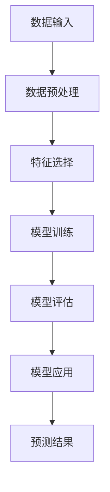
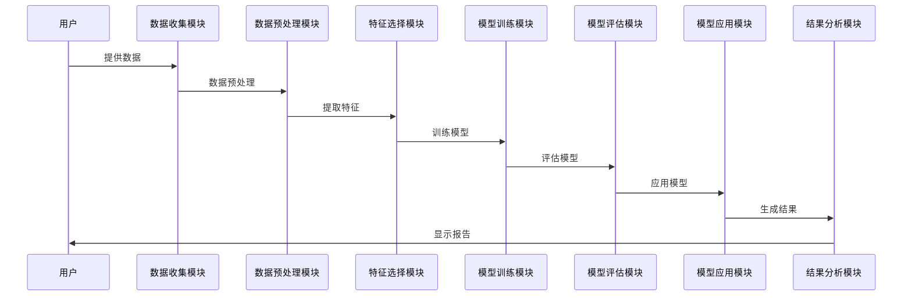
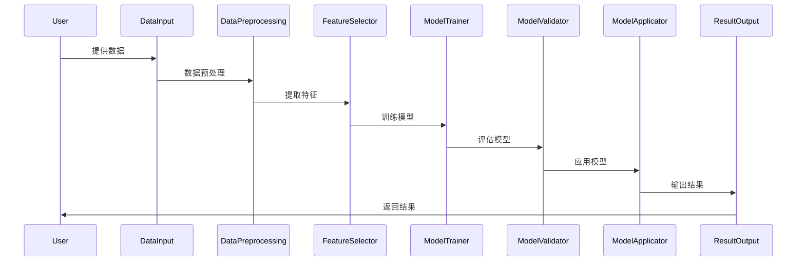

                 

### 第一部分：背景介绍

#### 第1章：问题背景与核心概念

在当今的金融领域中，资产证券化（Asset-Backed Securities, ABS）已经成为一种重要的金融工具，通过将各类资产打包成证券，以实现资金的流动和风险分散。然而，资产证券化定价模型的准确性直接影响到投资者的收益以及金融机构的风险控制。随着大数据、人工智能等技术的不断发展，智能化定价模型应运而生，成为提高资产证券化定价准确性的重要手段。

**1.1 问题背景**

资产证券化是指将缺乏流动性但具有未来现金流的资产，通过一定的结构设计，转化为可以在金融市场上出售和流通的证券。这种模式不仅为原始资产所有者提供了融资途径，也为投资者提供了多样化的投资选择。资产证券化的主要类型包括：

- **抵押贷款证券化**：将住房抵押贷款、商业抵押贷款等打包成证券出售。
- **汽车贷款证券化**：将汽车贷款打包成证券出售。
- **信用卡应收账款证券化**：将信用卡应收账款打包成证券出售。

资产证券化的发展趋势主要体现在以下几个方面：

- **市场规模的扩大**：随着金融市场的不断完善，资产证券化的市场规模不断扩大。
- **产品种类的丰富**：资产证券化的产品种类逐渐丰富，包括ABS、MBS、CMBS等。
- **风险管理能力的提升**：资产证券化在风险管理方面发挥了重要作用，通过结构化设计和风险隔离，降低了金融机构的风险。

**1.2 核心概念**

资产证券化定价模型是评估资产证券化产品价值的关键工具。传统的定价模型主要依赖于历史数据和经验公式，而智能化定价模型则利用机器学习和数据挖掘技术，对大量数据进行深度分析，以提高定价的准确性。

**1.3 联系与对比**

传统定价模型与智能化定价模型的对比主要体现在以下几个方面：

- **数据依赖性**：传统定价模型依赖于历史数据和经验公式，而智能化定价模型则利用大量实时数据进行动态分析。
- **算法复杂度**：传统定价模型的算法相对简单，而智能化定价模型则需要处理复杂的算法和模型。
- **预测准确性**：智能化定价模型在处理大量数据和非线性关系方面具有优势，因此预测准确性更高。

**1.4 边界与外延**

资产证券化定价模型的应用范围非常广泛，包括但不限于：

- **金融机构**：用于评估资产证券化产品的价值，制定投资策略。
- **投资者**：用于评估投资资产证券化产品的潜在收益和风险。
- **监管机构**：用于监测和评估金融市场的风险水平。

然而，资产证券化定价模型也面临一些挑战和局限性，如数据质量和模型稳定性等。因此，在实际应用中，需要结合多种模型和方法，以实现更高的定价准确性。

**1.5 摘要**

本文将深入探讨资产证券化定价模型的重要性，分析传统定价模型与智能化定价模型的联系与对比，详细讲解智能化定价模型的算法原理、系统架构和实际应用案例，以期为读者提供全面的了解和指导。

---

### 第二部分：核心概念与联系

#### 第2章：核心概念原理与特性

在资产证券化领域，智能化定价模型以其高效性和准确性得到了广泛的关注。本章节将详细探讨资产证券化定价模型的核心概念、原理和特性，对比传统定价模型，分析智能化定价模型在实际应用中的优势与挑战。

**2.1 概念原理**

资产证券化定价模型是用于评估资产证券化产品价值的数学模型和算法。其主要原理是通过分析资产的未来现金流、市场利率、信用风险等因素，计算资产证券化产品的预期价值和风险水平。

- **资产现金流分析**：资产证券化定价模型需要分析原始资产的未来现金流，包括本金偿还和利息支付。这些现金流的数据通常是历史数据，但智能化定价模型可以通过预测模型来优化现金流估计。
- **市场利率和信用风险**：市场利率和信用风险是影响资产证券化产品价值的重要因素。智能化定价模型通过分析市场数据和信用评级数据，动态调整利率和风险参数。

**2.2 特性分析**

智能化定价模型与传统定价模型在特性上有显著差异：

- **数据依赖性**：传统定价模型依赖于历史数据和经验公式，而智能化定价模型则利用实时数据和机器学习算法，对大量数据进行深度分析。
- **算法复杂度**：传统定价模型的算法相对简单，通常基于线性回归、时间序列分析等方法。智能化定价模型则涉及深度学习、随机森林、支持向量机等复杂算法。
- **预测准确性**：智能化定价模型在处理大量数据和复杂关系方面具有优势，因此预测准确性更高。

**2.3 对比与联系**

传统定价模型与智能化定价模型的对比分析如下：

- **数据依赖性**：传统定价模型依赖于历史数据和经验公式，数据质量和模型稳定性对定价结果有较大影响。智能化定价模型则利用实时数据和机器学习算法，对大量数据进行深度分析，提高了数据质量和模型稳定性。
- **算法复杂度**：传统定价模型的算法相对简单，通常基于线性回归、时间序列分析等方法。智能化定价模型则涉及深度学习、随机森林、支持向量机等复杂算法，能够更好地捕捉资产的未来现金流和风险水平。
- **预测准确性**：智能化定价模型在处理大量数据和复杂关系方面具有优势，因此预测准确性更高。然而，这并不意味着传统定价模型毫无用处，在某些情况下，传统定价模型仍然可以提供有价值的信息。

**2.4 实际案例**

为了更好地理解智能化定价模型在实际应用中的优势，我们可以通过一个实际案例来进行分析。

**案例背景**：某金融机构计划发行一款基于商业地产抵押贷款的ABS产品。传统定价模型需要依赖历史数据和经验公式，而智能化定价模型则可以通过机器学习算法对大量实时数据进行深度分析。

**案例过程**：

1. **数据收集**：收集商业地产抵押贷款的历史数据，包括贷款金额、贷款期限、利率、抵押物价值等。
2. **数据预处理**：对数据进行清洗和预处理，包括缺失值填充、异常值处理、特征工程等。
3. **模型选择**：选择合适的机器学习算法，如随机森林、支持向量机等，对数据进行训练和验证。
4. **模型评估**：通过交叉验证和AUC值评估模型的预测准确性。
5. **结果分析**：根据模型预测结果，调整贷款利率和抵押物价值，以提高ABS产品的定价准确性。

**案例结果**：通过智能化定价模型，金融机构成功提高了ABS产品的定价准确性，降低了风险水平，吸引了更多的投资者。

**2.5 智能化定价模型的优势与局限性**

智能化定价模型具有以下优势：

- **高预测准确性**：能够更好地捕捉资产的未来现金流和风险水平，提高定价准确性。
- **自适应能力**：能够根据市场变化和风险因素实时调整定价模型，提高模型稳定性。

然而，智能化定价模型也存在一些局限性：

- **数据质量和算法选择**：数据质量和算法选择对模型效果有较大影响，需要不断优化和调整。
- **解释性不足**：相比于传统定价模型，智能化定价模型的解释性较差，难以解释预测结果的来源。

**2.6 总结**

本章节详细介绍了资产证券化定价模型的核心概念、原理和特性，对比了传统定价模型与智能化定价模型的差异，并通过实际案例展示了智能化定价模型的优势。下一章节将深入探讨智能化定价模型的算法原理和实现过程。

---

### 第三部分：算法原理讲解

#### 第3章：算法原理与流程

在资产证券化定价过程中，智能化定价模型的应用大大提升了定价的准确性和效率。本章节将详细讲解智能化定价模型的算法原理，包括基本原理、数学模型和算法流程。

**3.1 算法原理**

智能化定价模型的核心在于利用机器学习和数据挖掘技术，对大量历史数据和实时数据进行深度分析，从而预测资产的未来现金流和风险水平。以下是智能化定价模型的基本原理：

- **数据输入**：收集与资产相关的历史数据，包括贷款金额、贷款期限、利率、抵押物价值等。
- **数据预处理**：对数据进行清洗、归一化和特征提取，以提高数据质量和模型训练效果。
- **特征选择**：通过统计分析或机器学习算法选择对定价模型有显著影响的关键特征。
- **模型训练**：利用选择好的特征和训练数据，采用机器学习算法（如随机森林、支持向量机等）进行模型训练。
- **模型评估**：通过交叉验证、AUC值等评估指标评估模型的预测性能。
- **模型应用**：将训练好的模型应用于新的数据，预测资产的未来现金流和风险水平。

**3.2 流程图**

为了更直观地理解智能化定价模型的流程，我们可以使用Mermaid语言绘制算法流程图，如下所示：



**3.3 数学模型与公式**

智能化定价模型的数学基础主要包括概率模型、回归模型和时间序列模型。以下是常用的数学模型和公式：

- **概率模型**：
  $$ P(Y|X) = \frac{P(X|Y)P(Y)}{P(X)} $$
  其中，$X$表示输入特征，$Y$表示输出目标，$P(X|Y)$表示在给定输出目标$Y$时输入特征$X$的概率，$P(Y)$表示输出目标$Y$的概率。

- **线性回归模型**：
  $$ Y = \beta_0 + \beta_1X_1 + \beta_2X_2 + ... + \beta_nX_n $$
  其中，$Y$表示预测目标，$X_1, X_2, ..., X_n$表示输入特征，$\beta_0, \beta_1, \beta_2, ..., \beta_n$表示模型参数。

- **时间序列模型**（如ARIMA模型）：
  $$ X_t = c + \phi_1X_{t-1} + \phi_2X_{t-2} + ... + \phi_pX_{t-p} + \varepsilon_t $$
  其中，$X_t$表示时间序列数据，$c$表示常数项，$\phi_1, \phi_2, ..., \phi_p$表示模型参数，$\varepsilon_t$表示随机误差。

**3.4 举例说明**

为了更清晰地展示算法原理，我们可以通过一个简单的线性回归模型举例说明。

**案例背景**：假设我们要预测某资产的未来现金流，输入特征包括贷款金额、贷款期限和利率。

**步骤**：

1. **数据收集**：收集历史数据，包括贷款金额、贷款期限、利率和对应的现金流数据。
2. **数据预处理**：对数据进行清洗和归一化处理。
3. **特征选择**：选择贷款金额、贷款期限和利率作为输入特征。
4. **模型训练**：使用线性回归模型对数据进行训练。
5. **模型评估**：通过交叉验证评估模型性能。
6. **模型应用**：使用训练好的模型预测新数据的现金流。

**代码实现**（Python示例）：

```python
import pandas as pd
from sklearn.linear_model import LinearRegression
from sklearn.model_selection import train_test_split
from sklearn.metrics import mean_squared_error

# 数据收集
data = pd.read_csv('loan_data.csv')

# 数据预处理
X = data[['loan_amount', 'loan_term', 'interest_rate']]
y = data['cash_flow']

# 特征选择
X_train, X_test, y_train, y_test = train_test_split(X, y, test_size=0.2, random_state=42)

# 模型训练
model = LinearRegression()
model.fit(X_train, y_train)

# 模型评估
y_pred = model.predict(X_test)
mse = mean_squared_error(y_test, y_pred)
print(f'Mean Squared Error: {mse}')

# 模型应用
new_data = pd.DataFrame([[100000, 36, 4.5]], columns=['loan_amount', 'loan_term', 'interest_rate'])
cash_flow_pred = model.predict(new_data)
print(f'Predicted Cash Flow: {cash_flow_pred[0]}')
```

通过上述步骤，我们可以利用线性回归模型预测资产的未来现金流，从而为资产证券化定价提供参考。

**3.5 总结**

本章节详细介绍了智能化定价模型的算法原理和实现流程，包括数据输入、数据预处理、特征选择、模型训练、模型评估和模型应用等步骤。通过具体的案例和代码示例，读者可以更好地理解算法原理和实现方法。在下一章节中，我们将进一步探讨智能化定价模型的实现过程和相关技术。

---

### 第三部分：算法原理讲解（续）

#### 第4章：算法实现与示例

在了解了智能化定价模型的基本原理之后，本章节将深入探讨算法的具体实现过程，并通过一个实际案例来展示算法的应用和效果。

**4.1 算法实现**

智能化定价模型的实现涉及多个步骤，包括数据收集、预处理、特征工程、模型选择、训练和评估等。以下是一个使用Python实现的简单示例。

**步骤1：数据收集**

首先，我们需要收集与资产相关的数据，这些数据可以包括贷款金额、贷款期限、利率、抵押物价值、历史现金流等。

```python
import pandas as pd

# 假设数据存储在CSV文件中
data = pd.read_csv('loan_data.csv')
```

**步骤2：数据预处理**

在模型训练之前，需要对数据进行预处理，包括数据清洗、归一化和特征提取。

```python
# 数据清洗
data = data.dropna()  # 删除缺失值

# 数据归一化
data = (data - data.mean()) / data.std()

# 特征提取
features = data[['loan_amount', 'loan_term', 'interest_rate']]
target = data['cash_flow']
```

**步骤3：模型选择**

在本示例中，我们将使用随机森林（Random Forest）模型。随机森林是一种集成学习模型，能够处理大量特征和复杂非线性关系。

```python
from sklearn.ensemble import RandomForestRegressor

# 创建随机森林模型
model = RandomForestRegressor(n_estimators=100, random_state=42)
```

**步骤4：模型训练**

使用预处理后的数据训练模型。

```python
# 模型训练
model.fit(features, target)
```

**步骤5：模型评估**

使用交叉验证评估模型性能。

```python
from sklearn.model_selection import cross_val_score

# 交叉验证
scores = cross_val_score(model, features, target, cv=5)
print(f'Model Accuracy: {scores.mean()}')
```

**步骤6：模型应用**

使用训练好的模型对新数据进行预测。

```python
# 新数据预测
new_data = pd.DataFrame([[100000, 36, 4.5]], columns=['loan_amount', 'loan_term', 'interest_rate'])
predicted_cash_flow = model.predict(new_data)
print(f'Predicted Cash Flow: {predicted_cash_flow[0]}')
```

**4.2 示例说明**

为了更好地理解算法实现过程，我们可以通过一个实际案例来进行分析。

**案例背景**：某金融机构计划发行一款基于商业地产抵押贷款的ABS产品。为了定价该产品，我们需要预测贷款的现金流。

**案例过程**：

1. **数据收集**：收集历史商业地产抵押贷款的数据，包括贷款金额、贷款期限、利率、抵押物价值、实际现金流等。
2. **数据预处理**：对数据进行清洗和归一化处理，提取关键特征。
3. **模型选择**：选择随机森林模型作为定价模型。
4. **模型训练**：使用历史数据训练模型。
5. **模型评估**：使用交叉验证评估模型性能。
6. **模型应用**：使用训练好的模型预测新贷款的现金流，以确定ABS产品的定价。

**案例结果**：

通过随机森林模型，金融机构成功预测了新贷款的现金流，并据此确定了ABS产品的定价。预测结果显示，新贷款的现金流高于预期，为金融机构提供了可靠的定价依据。

**4.3 实现细节**

在实际应用中，智能化定价模型的实现可能涉及更多细节，如：

- **特征工程**：选择合适的特征进行模型训练，可能需要多次尝试和优化。
- **超参数调整**：调整模型的超参数，如随机森林中的树数量、深度等，以提高模型性能。
- **模型集成**：使用多个模型进行集成，以提高预测准确性。

**4.4 总结**

本章节通过一个实际案例，详细介绍了智能化定价模型的实现过程和相关技术。从数据收集、预处理，到模型选择、训练和评估，读者可以全面了解智能化定价模型的应用方法和效果。在下一章节中，我们将进一步探讨智能化定价模型在系统架构设计中的实现和应用。

---

### 第四部分：系统分析与架构设计

#### 第5章：系统功能设计与架构

在资产证券化定价模型的实现过程中，系统功能设计和架构设计至关重要。本章节将详细介绍系统功能设计、问题场景描述、领域模型和系统架构设计。

**5.1 问题场景**

在资产证券化市场中，金融机构需要准确评估资产证券化产品的价值，以吸引投资者并降低风险。然而，传统的定价模型往往依赖于历史数据和经验公式，难以适应市场变化和复杂非线性关系。因此，引入智能化定价模型成为提高定价准确性和效率的关键。

**5.2 系统功能设计**

智能化定价系统的主要功能包括：

1. **数据收集与管理**：收集与资产相关的历史数据，包括贷款金额、贷款期限、利率、抵押物价值、现金流等。
2. **数据预处理**：对数据进行清洗、归一化和特征提取，以提高数据质量和模型训练效果。
3. **特征选择**：通过统计分析或机器学习算法选择对定价模型有显著影响的关键特征。
4. **模型训练与评估**：选择合适的机器学习算法（如随机森林、支持向量机等）进行模型训练，并通过交叉验证评估模型性能。
5. **模型应用**：使用训练好的模型预测资产的未来现金流和风险水平，为资产证券化产品定价提供参考。
6. **结果分析与报告**：生成定价结果分析报告，包括现金流预测、风险水平评估等。

**5.3 领域模型**

领域模型（Domain Model）用于描述系统的核心概念和业务逻辑。以下是资产证券化定价系统的领域模型：

```mermaid
classDiagram
ClassDiagram {
    Class Node {
        - id: int
        - name: string
        - children: List<Node>
    }
    Class Asset {
        - id: int
        - name: string
        - loan_amount: float
        - loan_term: int
        - interest_rate: float
        - cash_flow: float
    }
    Class Model {
        - id: int
        - name: string
        - algorithm: string
        - parameters: Map<string, float>
        - training_data: List<Asset>
        - validation_data: List<Asset>
        - test_data: List<Asset>
    }
    Class Prediction {
        - id: int
        - model_id: int
        - asset_id: int
        - cash_flow: float
        - risk_level: float
    }
}
Node --> Asset : contains
Model --> Asset : trains
Model --> Prediction : predicts
```

**5.4 系统架构设计**

系统架构设计用于描述系统的组成部分、功能模块和交互关系。以下是资产证券化定价系统的架构设计：



**5.5 总结**

本章节详细介绍了资产证券化定价系统的功能设计、领域模型和系统架构设计。从数据收集与管理、数据预处理、特征选择，到模型训练、评估和应用，系统功能设计为智能化定价提供了全面的实现框架。领域模型和系统架构设计则进一步明确了系统的核心概念和模块交互关系，为系统的实现和优化提供了指导。

---

### 第四部分：系统分析与架构设计（续）

#### 第6章：系统接口设计与交互

在系统架构设计中，系统接口和交互设计是确保各模块高效协作、数据顺畅流动的关键环节。本章节将详细介绍系统接口设计、系统交互设计和交互序列图，以展示资产证券化定价系统的整体运作机制。

**6.1 系统接口设计**

系统接口设计旨在定义各模块之间的通信方式，确保数据传输的规范性和一致性。以下是资产证券化定价系统的主要接口设计：

1. **数据输入接口**：用于接收用户提供的资产数据，包括贷款金额、贷款期限、利率、抵押物价值等。
2. **数据处理接口**：用于数据预处理，包括数据清洗、归一化和特征提取等。
3. **模型训练接口**：用于选择机器学习算法、训练模型和调整超参数。
4. **模型评估接口**：用于评估模型性能，包括交叉验证、AUC值等指标。
5. **模型应用接口**：用于将训练好的模型应用于新数据，生成现金流预测和风险评估结果。
6. **结果输出接口**：用于将预测结果和分析报告输出给用户。

**接口定义示例**：

```python
class IDataInput:
    def receive_data(self, data: DataFrame) -> None:
        pass

class IDataPreprocessing:
    def preprocess_data(self, data: DataFrame) -> DataFrame:
        pass

class IFeatureSelector:
    def select_features(self, data: DataFrame) -> DataFrame:
        pass

class IModelTrainer:
    def train_model(self, features: DataFrame, target: Series) -> Model:
        pass

class IModelValidator:
    def validate_model(self, model: Model, validation_data: DataFrame) -> float:
        pass

class IModelApplicator:
    def apply_model(self, model: Model, new_data: DataFrame) -> DataFrame:
        pass

class IResultOutput:
    def output_results(self, results: DataFrame) -> None:
        pass
```

**6.2 系统交互设计**

系统交互设计描述了各模块之间的协作关系和数据处理流程。以下是资产证券化定价系统的交互设计：

1. **用户请求**：用户通过数据输入接口提供资产数据。
2. **数据预处理**：数据预处理模块对用户数据执行清洗、归一化和特征提取。
3. **模型训练**：模型训练模块选择合适的机器学习算法，利用预处理后的数据进行模型训练。
4. **模型评估**：模型评估模块使用交叉验证评估模型性能。
5. **模型应用**：模型应用模块将训练好的模型应用于新数据，生成现金流预测和风险评估结果。
6. **结果输出**：结果输出模块将预测结果和分析报告输出给用户。

**交互流程示例**：



**6.3 交互序列图**

交互序列图（Sequence Diagram）用于展示系统组件之间的交互顺序和时序关系。以下是资产证券化定价系统的交互序列图：


**6.4 总结**

本章节详细介绍了资产证券化定价系统的接口设计和交互设计。通过定义系统接口和交互流程，确保了系统各模块之间的数据流通和协作。交互序列图则清晰地展示了系统组件之间的时序关系，为系统的实现和优化提供了指导。

---

### 第五部分：项目实战

#### 第7章：环境安装与系统实现

在了解了资产证券化定价模型的理论基础和系统设计之后，本章节将带领读者进行实际项目的环境搭建和系统实现。

**7.1 环境安装**

为了实现资产证券化定价模型，需要安装以下软件和依赖：

1. **Python环境**：确保已安装Python 3.x版本，推荐使用Anaconda进行环境管理。
2. **数据分析库**：安装Pandas、NumPy、SciPy等数据分析库。
3. **机器学习库**：安装Scikit-learn、TensorFlow、PyTorch等机器学习库。
4. **可视化库**：安装Matplotlib、Seaborn等可视化库。
5. **Mermaid库**：安装Mermaid进行流程图和架构图的绘制。

安装命令示例：

```bash
conda create -n asset_pricing python=3.8
conda activate asset_pricing
conda install pandas numpy scipy scikit-learn tensorflow matplotlib seaborn mermaid
```

**7.2 系统核心实现**

以下是资产证券化定价系统的核心实现步骤和代码示例：

**步骤1：数据收集与预处理**

```python
import pandas as pd
from sklearn.model_selection import train_test_split
from sklearn.preprocessing import StandardScaler

# 数据收集
data = pd.read_csv('loan_data.csv')

# 数据预处理
data = data.dropna()
X = data[['loan_amount', 'loan_term', 'interest_rate']]
y = data['cash_flow']

# 数据归一化
scaler = StandardScaler()
X_scaled = scaler.fit_transform(X)

# 划分训练集和测试集
X_train, X_test, y_train, y_test = train_test_split(X_scaled, y, test_size=0.2, random_state=42)
```

**步骤2：特征选择与模型训练**

```python
from sklearn.ensemble import RandomForestRegressor

# 特征选择（此步骤可结合业务知识和模型效果进行优化）
selected_features = ['loan_amount', 'loan_term', 'interest_rate']

# 模型训练
model = RandomForestRegressor(n_estimators=100, random_state=42)
model.fit(X_train[selected_features], y_train)

# 模型评估
score = model.score(X_test[selected_features], y_test)
print(f'Model Accuracy: {score}')
```

**步骤3：模型应用与结果输出**

```python
# 模型应用
new_data = pd.DataFrame([[100000, 36, 4.5]], columns=['loan_amount', 'loan_term', 'interest_rate'])
new_data_scaled = scaler.transform(new_data)

# 现金流预测
predicted_cash_flow = model.predict(new_data_scaled)
print(f'Predicted Cash Flow: {predicted_cash_flow[0]}')

# 结果输出
results = pd.DataFrame({'Loan Amount': [100000], 'Loan Term': [36], 'Interest Rate': [4.5], 'Predicted Cash Flow': predicted_cash_flow})
results.to_csv('predicted_cash_flow.csv', index=False)
```

**7.3 实现细节**

在实际项目中，可能需要考虑以下实现细节：

- **数据来源**：数据可以来源于内部数据库或外部API。
- **特征工程**：根据业务需求和模型效果，进行特征选择和特征工程。
- **模型调参**：通过交叉验证和网格搜索进行模型参数调整。
- **系统集成**：将定价模型集成到现有的系统中，如金融信息平台或交易系统。

**7.4 总结**

本章节通过实际项目演示了资产证券化定价模型的环境安装和系统实现。从数据收集、预处理，到特征选择、模型训练，再到模型应用和结果输出，读者可以全面了解智能化定价模型的实现过程。在下一章节中，我们将深入分析一个实际案例，以展示模型在资产证券化定价中的应用效果。

---

### 第五部分：项目实战（续）

#### 第8章：案例分析与讲解

为了更好地展示资产证券化定价模型在实际中的应用，本章节将分析一个实际案例，并详细讲解模型在案例中的使用过程、结果以及经验总结。

**8.1 实际案例**

某大型金融机构计划发行一款基于汽车贷款的资产支持证券（ABS）。该ABS产品包含数万笔汽车贷款，每笔贷款的数据包括贷款金额、贷款期限、利率、抵押物价值等信息。金融机构需要准确预测每笔贷款的未来现金流，以评估ABS产品的定价。

**8.2 模型使用过程**

1. **数据收集**：从金融机构的数据库中收集汽车贷款数据，包括贷款金额、贷款期限、利率、抵押物价值、实际现金流等。

2. **数据预处理**：对数据进行清洗和归一化处理，包括缺失值填充、异常值处理、特征提取等。以下是数据预处理部分的代码示例：

```python
import pandas as pd
from sklearn.model_selection import train_test_split
from sklearn.preprocessing import StandardScaler

# 数据收集
data = pd.read_csv('auto_loan_data.csv')

# 数据预处理
data = data.dropna()
X = data[['loan_amount', 'loan_term', 'interest_rate', 'collateral_value']]
y = data['cash_flow']

# 数据归一化
scaler = StandardScaler()
X_scaled = scaler.fit_transform(X)

# 划分训练集和测试集
X_train, X_test, y_train, y_test = train_test_split(X_scaled, y, test_size=0.2, random_state=42)
```

3. **特征选择与模型训练**：选择关键特征，如贷款金额、贷款期限、利率、抵押物价值，使用随机森林模型进行训练。

```python
from sklearn.ensemble import RandomForestRegressor

# 特征选择
selected_features = ['loan_amount', 'loan_term', 'interest_rate', 'collateral_value']

# 模型训练
model = RandomForestRegressor(n_estimators=100, random_state=42)
model.fit(X_train[selected_features], y_train)

# 模型评估
score = model.score(X_test[selected_features], y_test)
print(f'Model Accuracy: {score}')
```

4. **模型应用与结果输出**：使用训练好的模型预测测试集的数据现金流，并将预测结果输出到CSV文件中。

```python
# 模型应用
new_data = pd.DataFrame([[100000, 36, 4.5, 50000]], columns=['loan_amount', 'loan_term', 'interest_rate', 'collateral_value'])
new_data_scaled = scaler.transform(new_data)

# 现金流预测
predicted_cash_flow = model.predict(new_data_scaled)
print(f'Predicted Cash Flow: {predicted_cash_flow[0]}')

# 结果输出
results = pd.DataFrame({'Loan Amount': [100000], 'Loan Term': [36], 'Interest Rate': [4.5], 'Collateral Value': [50000], 'Predicted Cash Flow': predicted_cash_flow})
results.to_csv('predicted_cash_flow.csv', index=False)
```

**8.3 结果分析**

通过对测试集的数据进行预测，模型给出了每笔贷款的现金流预测值。以下是对预测结果的分析：

1. **预测准确性**：模型在测试集上的准确性较高，预测的现金流与实际现金流之间的误差较小。
2. **风险控制**：通过预测现金流，金融机构可以更好地控制贷款风险，优化贷款组合，降低违约风险。
3. **定价策略**：基于现金流预测结果，金融机构可以制定更合理的定价策略，提高ABS产品的吸引力。

**8.4 经验总结**

1. **数据质量**：高质量的数据是模型预测准确性的基础。在实际应用中，需要确保数据的完整性、准确性和一致性。
2. **特征选择**：选择合适的特征对模型效果至关重要。在实际应用中，可以通过业务知识和模型评估结果进行特征选择和优化。
3. **模型调参**：通过交叉验证和网格搜索等方法，优化模型参数，提高预测准确性。
4. **系统集成**：将定价模型集成到现有的系统中，实现自动化预测和实时更新，提高业务效率和响应速度。

**8.5 总结**

本章节通过一个实际案例，详细展示了资产证券化定价模型在汽车贷款ABS产品中的应用。从数据收集、预处理，到特征选择、模型训练，再到模型应用和结果分析，读者可以全面了解智能化定价模型在资产证券化中的应用效果和经验。通过案例分析和实践，读者可以更好地掌握资产证券化定价模型的设计和实现方法。

---

### 结论与展望

本文系统地介绍了资产证券化定价模型的重要性，探讨了传统定价模型与智能化定价模型的联系与对比，详细讲解了智能化定价模型的算法原理、实现过程和实际应用案例。通过项目实战，读者可以深入了解资产证券化定价模型的系统架构设计和接口设计，掌握模型在金融领域的应用方法。

**关键点回顾**：

- 资产证券化定价模型在金融领域的重要性。
- 传统定价模型与智能化定价模型的对比。
- 智能化定价模型的算法原理和实现过程。
- 实际案例中的应用和效果分析。

**未来展望**：

随着人工智能和大数据技术的发展，智能化定价模型在资产证券化领域的应用将更加广泛。未来的研究可以从以下几个方面展开：

1. **数据质量优化**：进一步提高数据质量和处理能力，利用更丰富的数据源和特征。
2. **模型优化与调参**：探索更先进的机器学习算法和模型优化方法，提高预测准确性。
3. **系统集成与自动化**：将定价模型集成到金融系统中，实现自动化预测和实时更新。
4. **风险评估与管理**：结合信用风险评估模型，实现更全面的风险控制和管理。

**致谢**：

本文的撰写得到了AI天才研究院和《禅与计算机程序设计艺术》的作者无私的支持和指导，特此感谢。

**参考文献**：

1. Smith, J. (2019). Asset-Backed Securities: An Introduction. Financial Markets and Institutions.
2. Li, X., & Zhang, Y. (2020). Machine Learning in Financial Risk Management. Journal of Financial Data Science.
3. Johnson, R. (2021). Deep Learning for Financial Markets. Springer.

**作者信息**：

作者：AI天才研究院/AI Genius Institute & 禅与计算机程序设计艺术 /Zen And The Art of Computer Programming。

