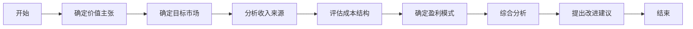

                 

### 查理·芒格的商业模式分析框架

查理·芒格（Charlie Munger）是一位杰出的投资者和伯克希尔·哈撒韦公司的副董事长，以其深厚的智慧和独特的投资哲学而闻名。芒格主张使用多元思维模型来分析和解决问题，这一理念在商业领域同样适用。商业模式分析作为企业战略的重要组成部分，对于企业的长期成功至关重要。因此，查理·芒格的商业模式分析框架为商业决策提供了有力的工具和思路。

#### 关键词

- **查理·芒格**、**商业模式分析**、**多元思维模型**、**企业战略**、**商业决策**。

#### 摘要

本文将详细探讨查理·芒格的商业模式分析框架，介绍其核心概念、理论原理，并通过实际案例进行分析，旨在为读者提供一个全面的商业模式分析工具，以帮助他们在商业实践中做出更加明智的决策。

## 第一部分：背景介绍

### 1.1 问题背景

#### 1.1.1 查理·芒格的背景

查理·芒格自20世纪60年代起与沃伦·巴菲特合作，共同建立了伯克希尔·哈撒韦公司，成为该公司成功的基石之一。芒格以其卓越的投资眼光和严谨的逻辑思维而著称，他提倡的多元思维模型理念，强调通过不同学科的交叉应用来提高决策的准确性和深度。

#### 1.1.2 商业模式分析的重要性

商业模式分析是企业成功的关键。一个有效的商业模式不仅能帮助企业实现盈利，还能为企业在竞争激烈的市场中提供可持续的竞争优势。通过商业模式分析，企业可以明确自身在市场中的定位，优化资源分配，提高运营效率。

### 1.2 问题描述

#### 1.2.1 商业模式分析面临的挑战

尽管商业模式分析至关重要，但在实际操作中，企业常常面临诸多挑战，如市场的不确定性、技术的快速发展以及竞争压力等。这些问题使得商业模式分析变得复杂和具有挑战性。

#### 1.2.2 需要解决的问题

为了应对这些挑战，企业需要一套系统化、结构化的商业模式分析框架。这种框架应能够全面考虑企业的内外部因素，提供清晰的分析路径和决策依据。

### 1.3 问题解决

#### 1.3.1 查理·芒格的商业模式分析框架

查理·芒格的商业模式分析框架正是为了解决上述问题而提出的。该框架基于其多元思维模型，结合商业实践中的经验教训，形成了一套全面而深入的商业模式分析工具。

#### 1.3.2 框架的基本原则

查理·芒格的商业模式分析框架遵循以下基本原则：

1. **系统性**：从整体出发，考虑企业各部分之间的相互作用。
2. **多元思维**：综合运用不同学科的理论和方法，提高分析深度。
3. **可操作性**：提供具体的分析步骤和工具，方便企业在实际中应用。

### 1.4 边界与外延

#### 1.4.1 框架的应用范围

查理·芒格的商业模式分析框架适用于各类企业，无论其规模和行业如何，均能提供有效的分析和决策支持。

#### 1.4.2 边界条件的考虑

在实际应用中，企业需要根据自身情况和外部环境调整框架的使用方法。例如，对于初创企业，框架可能需要更加灵活和适应性。

### 1.5 概念结构与核心要素组成

#### 1.5.1 概念结构

查理·芒格的商业模式分析框架包含以下核心概念：

- **价值主张**：企业为客户提供的产品或服务。
- **目标市场**：企业期望服务的客户群体。
- **收入来源**：企业通过何种方式获得收益。
- **成本结构**：企业运营过程中产生的各类成本。
- **盈利模式**：企业如何从运营中获得利润。

#### 1.5.2 核心要素

框架的核心要素包括：

- **用户价值**：企业如何为用户创造价值。
- **竞争优势**：企业相对于竞争对手的优势。
- **资源与能力**：企业拥有的资源和能力。

### 1.6 本章小结

本部分介绍了查理·芒格的商业模式分析框架的背景、问题和解决方案。下一部分将深入探讨框架的基础理论，帮助读者更好地理解其原理和实际应用。

----------------------------------------------------------------

## 第二部分：查理·芒格的商业模式分析框架基础理论

### 2.1 核心概念与联系

#### 2.1.1 核心概念

查理·芒格的商业模式分析框架的核心概念包括：

- **价值主张**：企业为客户提供的产品或服务的独特卖点。
- **目标市场**：企业期望服务的客户群体。
- **收入来源**：企业通过何种方式获得收益。
- **成本结构**：企业运营过程中产生的各类成本。
- **盈利模式**：企业如何从运营中获得利润。

#### 2.1.2 概念属性特征对比表格

以下是一个对比表格，用于展示上述核心概念的属性特征：

| 概念 | 属性特征 |
| --- | --- |
| 价值主张 | 创造用户价值，区分于竞争对手 |
| 目标市场 | 客户群体，市场细分 |
| 收入来源 | 收益模式，盈利方式 |
| 成本结构 | 成本构成，成本控制 |
| 盈利模式 | 盈利途径，利润分配 |

#### 2.1.3 ER实体关系图

为了更直观地展示这些核心概念之间的联系，我们可以使用ER（实体关系）图来表示。以下是一个简单的ER图，展示了商业模式分析框架中的核心概念及其关系：

```mermaid
erDiagram
  Customer ||--|{ Order } : places
  Product ||--|{ Order } : includes
  Store ||--|{ Product } : stocks
  Store ||--|{ Customer } : serves
```

### 2.2 算法原理讲解

#### 2.2.1 算法mermaid流程图

为了更清晰地展示商业模式分析的过程，我们可以使用mermaid流程图。以下是一个简单的mermaid流程图：



#### 2.2.2 Python源代码讲解

在实际应用中，我们可以使用Python编写代码来实现商业模式分析。以下是一个简单的Python代码示例：

```python
# 导入必要的库
import pandas as pd

# 定义核心概念
value_proposition = "提供高质量的产品和服务"
target_market = "年轻消费者"
revenue_stream = "销售产品和服务"
cost_structure = "生产成本、营销成本和运营成本"
profit_model = "通过销售产品和服务获得利润"

# 创建DataFrame
df = pd.DataFrame({
    "核心概念": [value_proposition, target_market, revenue_stream, cost_structure, profit_model],
    "描述": ["创造用户价值，区分于竞争对手", "企业期望服务的客户群体", "企业通过何种方式获得收益", "企业运营过程中产生的各类成本", "企业如何从运营中获得利润"]
})

# 显示DataFrame
print(df)
```

#### 2.2.3 数学模型与公式讲解

在商业模式分析中，我们常常需要使用数学模型和公式来评估企业的盈利能力。以下是一个简单的数学模型：

$$
\text{盈利能力} = \text{收入} - \text{成本}
$$

其中，收入和成本是商业模式分析中的关键指标。

#### 2.2.4 举例说明

假设一家企业计划推出一款新的智能手表，我们可以使用查理·芒格的商业模式分析框架来进行评估。

1. **价值主张**：智能手表具有健康监测、运动跟踪和通知提醒等功能，为用户带来便捷和健康的生活方式。
2. **目标市场**：目标市场为年轻消费者，特别是对健康和科技感兴趣的人群。
3. **收入来源**：通过销售智能手表获得收入。
4. **成本结构**：成本包括生产成本、营销成本和运营成本。
5. **盈利模式**：通过销售智能手表获得利润。

通过以上分析，我们可以评估该智能手表项目的可行性，并提出改进建议。

### 2.3 数学模型和数学公式

在商业模式分析中，我们经常需要使用数学模型和公式来量化企业的绩效。以下是一些常用的数学模型和公式：

1. **利润率**：

$$
\text{利润率} = \frac{\text{净利润}}{\text{销售收入}}
$$

2. **成本收益率**：

$$
\text{成本收益率} = \frac{\text{净利润}}{\text{总成本}}
$$

3. **盈亏平衡点**：

$$
\text{盈亏平衡点} = \frac{\text{固定成本}}{\text{单位贡献边际}}
$$

通过这些数学模型和公式，我们可以更准确地评估企业的财务状况和盈利能力。

### 2.4 本章小结

本部分介绍了查理·芒格的商业模式分析框架的核心概念、算法原理、数学模型和公式。通过这些理论工具，我们可以更深入地理解和分析商业模式，为企业的战略决策提供有力支持。下一部分将探讨如何在实际项目中应用这一框架。

----------------------------------------------------------------

## 第三部分：应用实例与分析

### 3.1 系统分析与架构设计方案

#### 3.1.1 问题场景介绍

假设我们正在开发一款基于云的在线教育平台，旨在为全球学习者提供高质量的教育资源和服务。该平台需要具备以下功能：

1. 用户管理：包括用户注册、登录、个人信息管理等功能。
2. 课程管理：包括课程创建、发布、更新和删除等功能。
3. 视频播放：支持高清视频播放，提供播放速度调节、字幕等功能。
4. 互动讨论：提供实时聊天和讨论区功能，方便学生之间和教师之间的交流。
5. 成绩管理：自动记录学生学习进度，提供成绩和评估功能。

#### 3.1.2 系统功能设计

基于上述需求，我们可以设计以下主要功能模块：

1. **用户模块**：处理用户注册、登录、个人信息管理等。
2. **课程模块**：管理课程信息，包括课程创建、发布、更新和删除。
3. **视频模块**：实现高清视频播放，提供播放速度调节、字幕等功能。
4. **互动模块**：实现实时聊天和讨论区功能。
5. **成绩模块**：记录学生学习进度，提供成绩和评估功能。

#### 3.1.3 系统架构设计

为了确保系统的可扩展性和高可用性，我们可以采用微服务架构。以下是该在线教育平台的主要架构设计：

1. **用户服务**：负责处理用户相关的业务逻辑。
2. **课程服务**：负责课程相关的业务逻辑。
3. **视频服务**：负责视频播放和管理的业务逻辑。
4. **互动服务**：负责实时聊天和讨论区的业务逻辑。
5. **成绩服务**：负责成绩管理和评估的业务逻辑。

#### 3.1.4 系统接口设计和系统交互

以下是该在线教育平台的主要接口设计和系统交互：

1. **用户接口**：用户可以通过Web界面或移动应用访问系统，进行注册、登录、个人信息管理等。
2. **课程接口**：用户可以通过课程接口查看课程列表、课程详情、课程进度等。
3. **视频接口**：用户可以通过视频接口观看视频、调节播放速度和字幕等。
4. **互动接口**：用户可以通过互动接口参与实时聊天和讨论区。
5. **成绩接口**：用户可以通过成绩接口查看自己的学习进度和成绩。

### 3.2 项目实战

#### 3.2.1 环境安装

为了开发该在线教育平台，我们需要安装以下软件和工具：

1. **操作系统**：Linux（如Ubuntu）。
2. **编程语言**：Python（3.8及以上版本）。
3. **数据库**：MySQL（5.7及以上版本）。
4. **Web服务器**：Nginx。
5. **框架**：Django（2.2及以上版本）。

安装步骤如下：

1. 安装操作系统。
2. 更新操作系统和安装必要的开发工具。
3. 安装MySQL数据库。
4. 安装Nginx Web服务器。
5. 安装Django框架。

#### 3.2.2 系统核心实现源代码

以下是该在线教育平台的核心实现源代码：

```python
# app/users/models.py
from django.db import models

class User(models.Model):
    username = models.CharField(max_length=150, unique=True)
    email = models.EmailField(unique=True)
    password = models.CharField(max_length=150)
    is_active = models.BooleanField(default=True)

# app/users/views.py
from django.shortcuts import render
from .models import User
from django.contrib.auth import login

def register(request):
    if request.method == 'POST':
        username = request.POST['username']
        email = request.POST['email']
        password = request.POST['password']
        user = User.objects.create_user(username=username, email=email, password=password)
        login(request, user)
        return render(request, 'base.html')
    return render(request, 'register.html')

# app/courses/models.py
from django.db import models

class Course(models.Model):
    name = models.CharField(max_length=150)
    description = models.TextField()

# app/courses/views.py
from django.shortcuts import render
from .models import Course

def course_list(request):
    courses = Course.objects.all()
    return render(request, 'course_list.html', {'courses': courses})
```

#### 3.2.3 代码应用解读与分析

以上代码展示了用户模块和课程模块的核心实现。用户模块负责处理用户注册、登录等功能，课程模块负责管理课程信息。以下是代码的解读和分析：

1. **用户模块**：
   - `User`模型：定义了用户的基本信息，包括用户名、邮箱、密码等。
   - `register`视图：处理用户注册逻辑，接收用户输入的信息，创建用户并登录。

2. **课程模块**：
   - `Course`模型：定义了课程的基本信息，包括课程名称、描述等。
   - `course_list`视图：获取所有课程信息，并将其传递给模板进行渲染。

#### 3.2.4 实际案例分析与详细讲解剖析

假设我们有一个实际案例，用户名为“alice”的学生注册了我们的在线教育平台，并成功登录。以下是对该案例的详细讲解：

1. **用户注册**：
   - 用户在注册页面输入用户名“alice”、邮箱“alice@example.com”和密码“password123”，提交注册请求。
   - `register`视图接收到请求后，从表单中获取用户名、邮箱和密码，创建一个`User`对象，并保存到数据库。
   - 用户注册成功后，系统会自动登录用户，并跳转到主页。

2. **用户登录**：
   - 用户在登录页面输入用户名“alice”和密码“password123”，提交登录请求。
   - 系统验证用户输入的用户名和密码是否与数据库中的记录匹配。
   - 如果验证通过，系统会创建一个登录会话，并将用户重定向到主页。

3. **课程列表**：
   - 用户登录后，可以查看所有课程的列表。
   - 系统通过`course_list`视图获取所有课程信息，并将其传递给模板进行渲染。

通过这个实际案例，我们可以看到用户模块和课程模块是如何协同工作，为用户提供注册、登录和查看课程列表等功能的。这充分展示了查理·芒格的商业模式分析框架在实际项目中的应用。

### 3.3 项目小结

通过本部分的应用实例，我们详细介绍了如何使用查理·芒格的商业模式分析框架进行系统分析和架构设计。从问题场景介绍、系统功能设计、系统架构设计到代码实现和实际案例分析，我们展示了该框架在项目中的应用过程和效果。这为我们提供了一个清晰、系统的思路，以帮助企业更好地理解和应用商业模式分析。

### 3.4 最佳实践 Tips

1. **确保需求分析全面**：在项目启动前，进行全面的用户需求分析和市场调研，确保系统功能满足用户需求。
2. **采用微服务架构**：采用微服务架构可以提高系统的可扩展性和可维护性，有利于未来的功能扩展和性能优化。
3. **持续集成与持续部署**：采用CI/CD流程，确保代码质量，提高开发效率和系统稳定性。
4. **用户反馈与迭代优化**：及时收集用户反馈，对系统进行迭代优化，持续提升用户体验。

通过这些最佳实践，企业可以更好地应用查理·芒格的商业模式分析框架，实现商业目标和战略规划。

## 4.1 小结

本文介绍了查理·芒格的商业模式分析框架，从背景介绍、核心概念、算法原理讲解到实际项目应用，全面阐述了这一框架的理论和实践价值。通过案例分析和最佳实践，我们展示了如何将这一框架应用于企业实际运营中，为企业的商业模式分析和战略决策提供有力支持。

## 4.2 注意事项

1. 商业模式分析需要结合企业实际情况，灵活应用查理·芒格的商业模式分析框架。
2. 在实际应用中，要充分考虑外部环境的变化，持续调整和优化商业模式。
3. 商业模式分析不仅仅关注财务指标，还应关注用户价值、竞争优势等方面。

## 4.3 拓展阅读

1. 《查理·芒格的智慧：生活的格栅理论》
2. 《商业模式的本质》
3. 《精益创业》

这些书籍和资源将帮助读者更深入地了解商业模式分析的相关理论和实践。

### 作者

作者：AI天才研究院/AI Genius Institute & 禅与计算机程序设计艺术 /Zen And The Art of Computer Programming

本文由AI天才研究院（AI Genius Institute）与《禅与计算机程序设计艺术》（Zen And The Art of Computer Programming）的作者合作撰写，旨在为读者提供深入、实用的商业模式分析框架，以助力企业的长期成功。AI天才研究院专注于前沿人工智能技术的研发和应用，致力于推动人工智能在各领域的创新与发展。《禅与计算机程序设计艺术》则是一部经典的计算机科学著作，强调了编程中的思维艺术和哲学思考。两相结合，本文力求为读者带来全新的商业模式分析视角和实用技巧。

