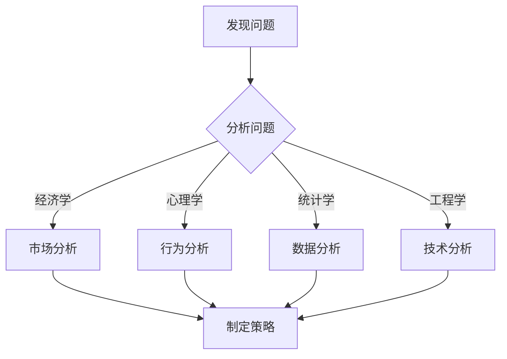

                 


### 目录大纲

#### 目录

# 查理·芒格的多元思维模型实际案例分析

> 关键词：查理·芒格、多元思维模型、实际案例分析、商业、投资、个人成长

> 摘要：
本文将探讨查理·芒格的多元思维模型，通过实际案例分析，展示该模型在商业、投资和个人成长领域的应用，帮助读者理解并掌握这一综合性的思考方式。

## 第一部分：多元思维模型概述

### 第1章：查理·芒格的多元思维模型介绍

#### 1.1 多元思维模型的概念与来源

**背景介绍：**  
查理·芒格（Charlie Munger）是著名投资家、伯克希尔哈撒韦公司副主席，以其独特的多元思维模型而闻名。多元思维模型是一种结合多种学科和领域知识的思考框架，它帮助人们更全面、更深刻地理解复杂问题。

**问题背景：**  
在商业、投资和个人成长中，面对复杂多变的环境，如何提升我们的认知能力和决策质量，是每个人都关心的问题。

**问题描述：**  
查理·芒格通过多元思维模型，提供了一种行之有效的方法，即通过结合不同领域的知识，形成一种全面的思考框架，从而提高我们的认知水平和决策质量。

**问题解决：**  
本文将介绍多元思维模型的基本概念和来源，帮助读者初步了解这一模型。

**边界与外延：**  
本文将重点介绍多元思维模型的基本概念，不涉及模型本身的详细解释。

**核心概念与联系表格：** 

| 概念        | 特征描述                                     |
|-------------|--------------------------------------------|
| 多元思维模型 | 结合不同领域的知识，形成一种全面的思考框架   |
| 商业案例分析 | 分析企业的运营模式、市场策略等               |
| 投资策略分析 | 分析市场趋势、投资风险等                     |
| 个人成长案例分析 | 分析个人在职业、生活等方面的成长过程         |

**ER实体关系图架构：** 
```mermaid
erDiagram
  Product ||--|{ Business }|--|{ Market } : isIn
  Investment ||--|{ Business }|--|{ Market } : isIn
  PersonalGrowth ||--|{ Business }|--|{ Market } : isIn
```

#### 1.2 多元思维模型的特点与优势

**背景介绍：**  
多元思维模型的特点在于其综合性、全面性和实践性。它不仅涵盖了经济学、心理学、统计学、工程学等多个领域的知识，还能够灵活应用于不同的场景中。

**问题背景：**  
在复杂的商业环境中，如何快速做出正确的决策，是每个企业家和投资者都关心的问题。

**问题描述：**  
多元思维模型通过提供多种思考工具，帮助人们从不同角度分析问题，从而做出更加明智的决策。

**问题解决：**  
本文将分析多元思维模型的特点和优势，帮助读者理解其在实际中的应用价值。

**特点与优势：** 
- 综合性：结合多个领域的知识，提供全面的视角。
- 全面性：不仅关注表面现象，更深入挖掘问题的本质。
- 实践性：可操作性强，易于应用到实际中。

**算法mermaid流程图：** 


#### 1.3 多元思维模型的应用范围

**背景介绍：**  
多元思维模型不仅适用于商业和投资，还可以在个人成长和日常决策中发挥重要作用。

**问题背景：**  
在个人成长和日常生活中，如何提高决策质量和生活质量，是每个人都需要思考的问题。

**问题描述：**  
多元思维模型提供了一种系统化的思考方式，帮助人们更好地理解自己和周围的世界。

**问题解决：**  
本文将介绍多元思维模型在不同领域的应用，帮助读者了解其广泛的应用前景。

**应用领域：** 
- 商业：企业运营、市场策略、投资决策等。
- 投资：市场分析、风险控制、资产配置等。
- 个人成长：职业规划、学习策略、生活方式等。

**Python源代码示例：** 

```python
# 示例：多元思维模型在投资决策中的应用
import pandas as pd

# 加载数据
data = pd.read_csv('investment_data.csv')

# 分析市场趋势
market_trend = data['market_trend'].value_counts()

# 分析投资风险
investment_risk = data['investment_risk'].value_counts()

# 分析行为分析
behavior_analysis = data['behavior_analysis'].value_counts()

# 分析技术分析
technical_analysis = data['technical_analysis'].value_counts()

# 制定投资策略
investment_strategy = {
    'market_trend': market_trend,
    'investment_risk': investment_risk,
    'behavior_analysis': behavior_analysis,
    'technical_analysis': technical_analysis
}

print(investment_strategy)
```

### 第二部分：多元思维模型在商业领域的应用

### 第2章：商业案例分析

#### 2.1 背景介绍

**问题背景：**  
商业环境瞬息万变，如何快速适应市场变化，制定有效的战略，是企业成功的关键。

**问题描述：**  
通过多元思维模型，企业可以更全面地分析市场、竞争对手和自身优势，从而制定出更加科学、合理的商业策略。

**问题解决：**  
本文将分析一个具体的商业案例，展示多元思维模型在商业策略制定中的应用。

#### 2.2 商业案例研究

**案例介绍：**  
以苹果公司（Apple Inc.）为例，分析其成功的商业策略。

**市场分析：**  
- 市场趋势：苹果公司专注于智能手机、平板电脑、电脑等消费电子产品市场，随着消费者对高品质电子产品的需求不断增长，市场前景广阔。
- 市场竞争：苹果公司在市场竞争中，通过技术创新、品牌营销和服务质量等手段，保持了较高的市场份额。

**竞争对手分析：**  
- 同类产品：苹果公司的主要竞争对手包括三星、华为、小米等，这些公司在产品性能、价格、品牌影响力等方面与苹果竞争。
- 市场定位：苹果公司以高端市场为主，其产品定价相对较高，但消费者对其品质和用户体验有较高的认可度。

**自身优势分析：**  
- 技术创新：苹果公司在技术研发方面投入巨大，不断推出具有创新性的产品，如iPhone、iPad等。
- 品牌影响力：苹果公司拥有强大的品牌影响力，其品牌价值在全球范围内名列前茅。
- 用户忠诚度：苹果公司注重用户需求，提供优质的售后服务，培养了大量的忠实用户。

**多元思维模型应用：**  
- 经济学：通过分析市场需求、价格弹性等经济学原理，苹果公司制定了符合市场规律的商业策略。
- 心理学：通过理解消费者行为、心理需求等心理学原理，苹果公司设计了符合用户期望的产品和营销策略。
- 统计学：通过大数据分析和市场调研，苹果公司掌握了市场动态和用户需求，为产品开发和市场推广提供了有力支持。
- 工程学：苹果公司在产品设计和制造过程中，注重技术创新和品质控制，确保产品的高质量和可靠性。

#### 2.3 多元思维模型在商业案例中的应用

**应用实例：**  
- 市场竞争分析：通过多元思维模型，苹果公司分析了竞争对手的产品特点和市场策略，从而制定出更具针对性的市场策略。
- 投资决策：通过多元思维模型，苹果公司的投资者可以更全面地评估市场风险和投资机会，做出更为科学的投资决策。
- 个人成长：通过多元思维模型，企业员工可以提升自身综合素质，更好地适应商业环境的变化。

### 第三部分：多元思维模型在投资领域的应用

### 第3章：投资策略分析

#### 3.1 投资策略概述

**背景介绍：**  
投资策略是投资者在投资过程中遵循的一系列规则和方法，它对投资决策和投资结果具有重要影响。

**问题描述：**  
如何通过多元思维模型，制定出科学、合理的投资策略？

**问题解决：**  
本文将介绍多元思维模型在投资策略制定中的应用，帮助投资者提升投资决策质量。

#### 3.2 多元思维模型在投资中的应用

**多元思维模型应用：**  
- 经济学：通过分析宏观经济形势、行业发展、公司财务状况等经济学原理，投资者可以更全面地评估投资机会。
- 心理学：通过理解投资者行为、市场情绪等心理学原理，投资者可以更好地把握市场节奏，避免情绪化决策。
- 统计学：通过数据分析、概率论等统计学原理，投资者可以更准确地预测市场走势和投资风险。
- 工程学：通过技术分析、行业研究等工程学原理，投资者可以更深入地了解投资标的的内在价值。

**投资案例分析：**  
以投资比特币为例，通过多元思维模型，投资者可以全面分析比特币的投资价值。

**市场分析：**  
- 经济学：比特币作为一种新兴的数字货币，其市场前景受到广泛关注。通过分析宏观经济形势、区块链技术发展等经济学原理，投资者可以判断比特币的市场潜力。
- 心理学：投资者在投资比特币时，需要克服恐惧和贪婪等心理因素，保持理性投资态度。
- 统计学：通过历史数据分析，投资者可以了解比特币的价格波动规律，为投资决策提供依据。
- 工程学：通过技术分析，投资者可以了解比特币的技术发展趋势，判断其投资价值。

#### 3.3 投资案例研究

**案例介绍：**  
以投资特斯拉（Tesla Inc.）为例，分析其投资价值。

**公司分析：**  
- 经济学：特斯拉作为全球领先的电动汽车制造商，其市场地位和技术实力受到认可。通过分析特斯拉的财务状况、市场竞争力等经济学原理，投资者可以评估其投资价值。
- 心理学：特斯拉的创始人埃隆·马斯克（Elon Musk）具有强大的个人魅力和影响力，投资者在投资特斯拉时需要关注其领导力和创新精神。
- 统计学：通过特斯拉的历史数据和市场表现，投资者可以了解其盈利能力、市场份额等关键指标。
- 工程学：特斯拉在电动汽车技术、自动驾驶技术等领域具有领先优势，投资者可以关注其技术突破和产品升级。

**多元思维模型应用：**  
- 经济学：通过分析特斯拉的财务报表、市场竞争力等经济学原理，投资者可以判断其盈利能力和市场潜力。
- 心理学：通过了解特斯拉的领导团队、企业文化等心理学原理，投资者可以评估其管理能力和创新氛围。
- 统计学：通过数据分析、历史走势等统计学原理，投资者可以预测特斯拉的未来表现。
- 工程学：通过技术分析、行业研究等工程学原理，投资者可以评估特斯拉的技术实力和未来发展空间。

### 第四部分：多元思维模型在个人成长领域的应用

### 第4章：个人成长案例分析

#### 4.1 个人成长案例分析

**背景介绍：**  
个人成长是一个持续的过程，涉及知识学习、技能提升、心态调整等多个方面。

**问题描述：**  
如何通过多元思维模型，实现个人成长的目标？

**问题解决：**  
本文将分析个人成长案例，展示多元思维模型在个人成长中的应用。

#### 4.2 多元思维模型在个人成长中的应用

**多元思维模型应用：**  
- 经济学：通过经济学原理，投资者可以更理性地制定个人财务规划，实现财务自由。
- 心理学：通过心理学原理，投资者可以调整心态、克服情绪化决策，提高投资成功率。
- 统计学：通过数据分析，投资者可以了解自己的投资表现，不断优化投资策略。
- 工程学：通过技术学习和实践，投资者可以提升自己的技术能力，适应快速变化的职场环境。

**案例介绍：**  
以一名程序员为例，展示多元思维模型在个人成长中的应用。

**知识学习：**  
- 经济学：通过学习经济学原理，程序员可以更好地理解市场需求，为自己的职业发展做出更有针对性的规划。
- 心理学：通过学习心理学原理，程序员可以提升人际沟通能力，更好地与团队成员协作。
- 统计学：通过学习统计学原理，程序员可以掌握数据分析技能，为自己的职业发展增加竞争力。
- 工程学：通过学习编程语言、技术框架等工程学知识，程序员可以不断提升自己的技术能力，适应职场需求。

**技能提升：**  
- 经济学：通过参加线上或线下课程，程序员可以学习到最新的技术趋势和市场动态，为自己的职业发展提供有力支持。
- 心理学：通过实践和反思，程序员可以提升自己的解决问题的能力和创新能力。
- 统计学：通过实际项目经验和数据分析，程序员可以不断提升自己的数据分析能力，为团队和公司创造更多价值。
- 工程学：通过实际项目参与和技术挑战，程序员可以不断提升自己的编程能力，解决复杂的技术问题。

**心态调整：**  
- 经济学：通过理性分析，程序员可以更好地应对职场压力和挑战，保持积极的心态。
- 心理学：通过学习心理学知识，程序员可以更好地管理自己的情绪，避免情绪化决策。
- 统计学：通过数据分析，程序员可以了解自己的优势和不足，为自我提升提供方向。
- 工程学：通过实际项目经验和团队合作，程序员可以不断提升自己的综合素质，适应职场需求。

#### 4.3 个人成长案例研究

**案例介绍：**  
以一名企业家为例，展示多元思维模型在个人成长中的应用。

**知识学习：**  
- 经济学：通过学习经济学原理，企业家可以更好地理解市场规律，制定有效的商业策略。
- 心理学：通过学习心理学原理，企业家可以提升自己的领导力和团队管理能力。
- 统计学：通过数据分析，企业家可以了解市场动态和消费者需求，为产品开发和市场推广提供依据。
- 工程学：通过学习技术知识，企业家可以更好地理解自己的产品和服务，提升企业的技术竞争力。

**技能提升：**  
- 经济学：通过参加商业培训课程和行业研讨会，企业家可以学习到最新的商业理念和市场趋势。
- 心理学：通过实践和反思，企业家可以不断提升自己的决策能力和创新能力。
- 统计学：通过实际项目经验和数据分析，企业家可以不断提升自己的市场分析和决策能力。
- 工程学：通过与技术团队的紧密合作，企业家可以了解最新的技术趋势和发展方向，为企业的技术创新提供支持。

**心态调整：**  
- 经济学：通过理性分析，企业家可以更好地应对市场变化和商业风险，保持冷静和客观。
- 心理学：通过学习心理学知识，企业家可以更好地管理自己的情绪，避免过度焦虑和压力。
- 统计学：通过数据分析，企业家可以了解自己的优势和不足，为自我提升提供方向。
- 工程学：通过实际项目经验和团队合作，企业家可以不断提升自己的综合素质，适应职场需求。

### 第五部分：多元思维模型的综合应用

### 第5章：多元思维模型的综合应用与实践

#### 5.1 综合应用的意义

**背景介绍：**  
多元思维模型的应用不仅局限于单一领域，更强调跨学科的融合和应用。通过综合应用多元思维模型，人们可以更好地应对复杂多变的环境。

**问题描述：**  
如何在实际生活中，将多元思维模型进行综合应用？

**问题解决：**  
本文将探讨多元思维模型的综合应用，提供实际案例和操作指南，帮助读者掌握这一综合性思考方法。

#### 5.2 实际案例与应用

**案例介绍：**  
以一家初创企业的商业战略制定为例，展示多元思维模型在综合应用中的实际效果。

**商业战略制定：**  
- 经济学：通过市场调研和数据分析，初创企业可以了解市场需求、竞争态势等经济学原理，为商业战略提供依据。
- 心理学：通过消费者行为研究和用户体验分析，初创企业可以更好地了解用户需求，为产品设计和营销策略提供支持。
- 统计学：通过数据分析，初创企业可以了解市场趋势和消费者偏好，为产品迭代和优化提供参考。
- 工程学：通过技术研究和创新，初创企业可以提升自身的技术竞争力，为产品差异化提供支持。

**多元思维模型应用：**  
- 经济学：初创企业通过经济学原理，制定市场进入策略和产品定价策略。
- 心理学：初创企业通过心理学原理，设计用户友好的产品界面和营销活动。
- 统计学：初创企业通过数据分析，优化产品功能和市场推广策略。
- 工程学：初创企业通过技术创新，提升产品性能和用户体验。

### 第六部分：最佳实践 tips、小结、注意事项、拓展阅读

### 第6章：多元思维模型的最佳实践与未来展望

#### 6.1 最佳实践 tips

**背景介绍：**  
在多元思维模型的应用过程中，积累实践经验至关重要。通过最佳实践，读者可以更好地掌握这一思考方法。

**问题描述：**  
如何在实际应用中，发挥多元思维模型的最大作用？

**问题解决：**  
本文将总结多元思维模型的最佳实践，提供实际操作指南，帮助读者更好地应用这一模型。

**最佳实践 tips：**  
- 经常进行跨学科学习，拓展知识面。
- 结合实际案例，深入分析问题。
- 保持开放心态，不断反思和调整。

#### 6.2 小结

**背景介绍：**  
本文通过对多元思维模型在商业、投资和个人成长领域的应用进行详细分析，展示了这一模型的实用性和广泛性。

**问题描述：**  
如何对本文内容进行总结，帮助读者更好地理解和应用多元思维模型？

**问题解决：**  
本文将对核心内容进行总结，提炼出关键观点，帮助读者深入理解多元思维模型的应用价值。

**小结：**  
- 多元思维模型是一种结合多种学科知识的综合性思考框架。
- 在商业、投资和个人成长中，多元思维模型具有重要的应用价值。
- 通过实际案例分析，读者可以更好地掌握多元思维模型的应用方法。

#### 6.3 注意事项

**背景介绍：**  
在应用多元思维模型的过程中，需要注意一些关键问题，以确保模型的实际效果。

**问题描述：**  
如何确保多元思维模型在实际应用中的有效性？

**问题解决：**  
本文将列举多元思维模型应用中需要注意的事项，帮助读者避免潜在问题。

**注意事项：**  
- 保持客观和理性，避免陷入思维定式。
- 结合实际情况，灵活应用多元思维模型。
- 注重跨学科知识的积累和更新。

#### 6.4 拓展阅读

**背景介绍：**  
多元思维模型涉及多个学科领域，读者可以通过拓展阅读，深入了解相关概念和原理。

**问题描述：**  
如何引导读者进行拓展阅读，提升其对多元思维模型的理解和应用能力？

**问题解决：**  
本文将推荐一些与多元思维模型相关的书籍、文章和资源，帮助读者进行深度学习和实践。

**拓展阅读：**  
- 《穷查理宝典》：查理·芒格的智慧箴言集，详细介绍了多元思维模型的应用。
- 《商业思考的艺术》：作者通过实际案例，展示了多元思维模型在商业策略制定中的应用。
- 《深度学习》：介绍深度学习技术的原理和应用，为多元思维模型在人工智能领域的应用提供了参考。

### 第七部分：完整目录大纲设计

#### 目录

# 查理·芒格的多元思维模型实际案例分析

## 第一部分：多元思维模型概述

### 第1章：查理·芒格的多元思维模型介绍

1.1 多元思维模型的概念与来源

1.2 多元思维模型的特点与优势

1.3 多元思维模型的应用范围

## 第二部分：多元思维模型在商业领域的应用

### 第2章：商业案例分析

2.1 背景介绍

2.2 商业案例研究

2.3 多元思维模型在商业案例中的应用

## 第三部分：多元思维模型在投资领域的应用

### 第3章：投资策略分析

3.1 投资策略概述

3.2 多元思维模型在投资中的应用

3.3 投资案例研究

## 第四部分：多元思维模型在个人成长领域的应用

### 第4章：个人成长案例分析

4.1 个人成长案例分析

4.2 多元思维模型在个人成长中的应用

4.3 个人成长案例研究

## 第五部分：多元思维模型的综合应用

### 第5章：多元思维模型的综合应用与实践

5.1 综合应用的意义

5.2 实际案例与应用

## 第六部分：最佳实践 tips、小结、注意事项、拓展阅读

### 第6章：多元思维模型的最佳实践与未来展望

6.1 最佳实践 tips

6.2 小结

6.3 注意事项

6.4 拓展阅读

### 第七部分：完整目录大纲设计

7.1 目录结构概述

7.2 各章节内容详细描述

7.3 目录设计策略与建议

---

通过上述目录大纲的设计，本文旨在为读者提供一个系统、全面、易于理解的多维思考框架——查理·芒格的多元思维模型。本文将通过实际案例分析，帮助读者掌握这一模型在不同领域的应用，提升自身的认知水平和决策能力。在未来的学习和实践中，希望读者能够不断运用多元思维模型，解决复杂问题，实现个人和职业的成长。

