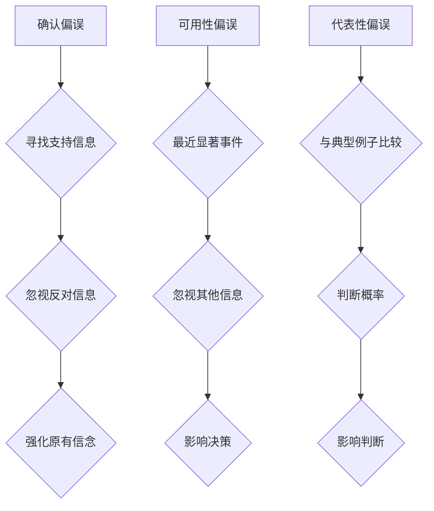
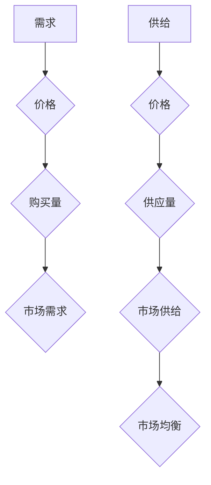
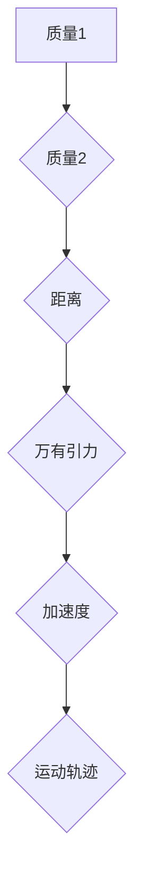
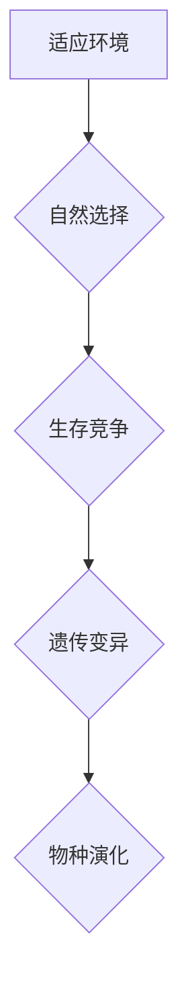
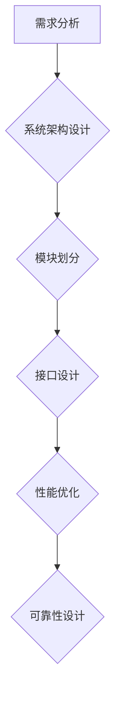
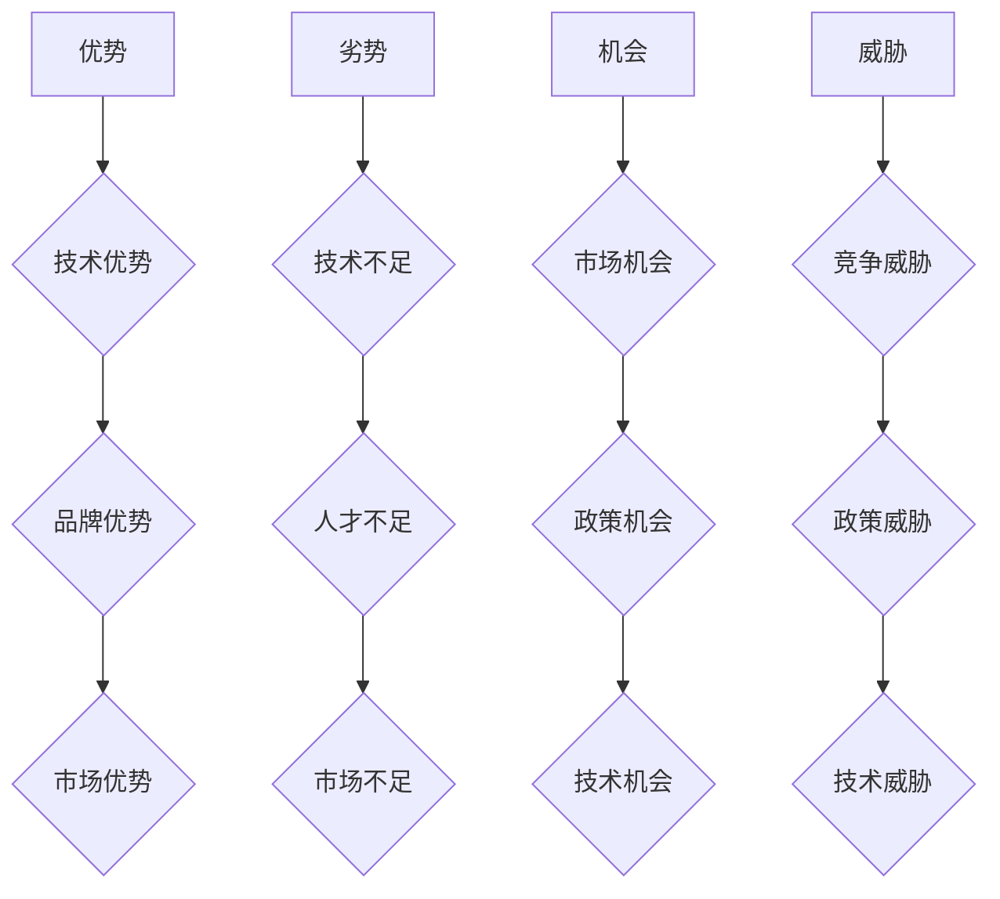
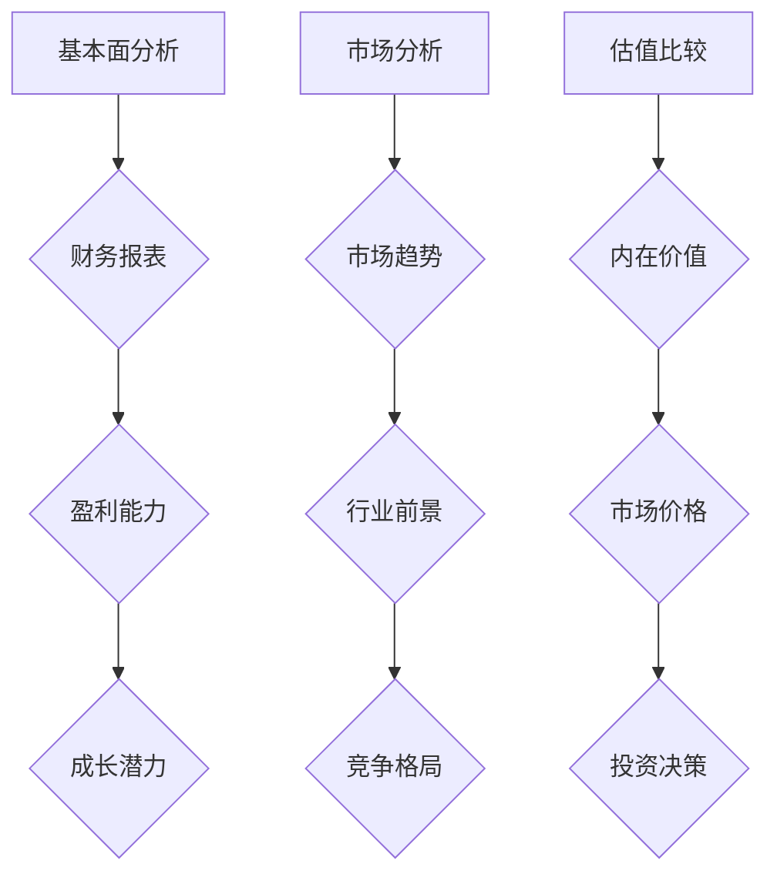

                 

# 查理芒格的多元思维模型

## 关键词
- 查理·芒格
- 多元思维模型
- 人类认知
- 商业决策
- 投资策略
- 算法原理

## 摘要
本文将深入探讨查理·芒格的多元思维模型，一个在商业、投资和日常生活中具有广泛应用的方法论。我们将从背景介绍、核心概念、应用领域和实践指南四个方面，逐步剖析这一思维模型的内涵与价值，并探讨其在IT领域的具体应用。通过本文的阅读，您将了解到如何运用多元思维模型来提升决策能力和解决复杂问题。

## 第一部分：多元思维模型概述

### 1.1 查理·芒格的背景与成就

查理·芒格（Charles T. Munger），1934年出生于美国加州，是一位著名的投资家、律师和慈善家。他是伯克希尔·哈撒韦公司（Berkshire Hathaway）的副主席，与公司创始人沃伦·巴菲特（Warren Buffett）一起，被誉为现代投资界的“双璧”。芒格在投资领域的成就举世闻名，他凭借独特的投资哲学和卓越的判断力，使伯克希尔公司成为全球最成功的投资企业之一。

芒格不仅是一位成功的投资者，还是一位思想家。他主张通过多元化思维模型来提高认知能力，帮助人们更好地理解世界和做出决策。他的思想深受行为心理学、经济学、物理学、生物学等多个学科的影响，形成了独特的多元思维框架。

### 1.2 多元思维模型的概念

多元思维模型是一种将不同学科和领域的知识体系融合在一起，形成一种综合性的思考模式。芒格认为，人类面临的问题通常是复杂而多维的，单一的思维模式很难应对这种复杂性。因此，他主张通过构建多元化的思维模型，来提高对复杂问题的理解和解决能力。

多元思维模型主要包括以下几个方面：

1. **心理学模型**：如认知心理学、行为心理学等，用于分析人类心理和行为的规律。
2. **经济学模型**：如供需模型、市场均衡理论等，用于解释经济现象和制定商业策略。
3. **物理学模型**：如力学、热力学等，用于理解自然现象和科学原理。
4. **生物学模型**：如进化论、生态学等，用于理解生命现象和生态系统的运作。
5. **工程学模型**：如工程原理、系统设计等，用于解决技术问题和优化系统性能。

### 1.3 多元思维模型的应用领域

多元思维模型的应用非常广泛，几乎涵盖了所有领域。在商业领域，芒格利用多元思维模型来分析市场、制定策略、评估风险。在投资领域，他通过多元思维模型来选择优质股票、制定投资组合、管理投资风险。在日常生活中，芒格也倡导人们运用多元思维模型来提高决策能力、解决生活难题。

接下来，我们将深入探讨多元思维模型的核心概念，并分析其在具体领域的应用。

## 第二部分：多元思维模型的核心概念

### 2.1 人类心理与行为模式

人类心理和行为模式是多元思维模型的重要组成部分。芒格认为，了解人类心理和行为模式有助于我们更好地理解自己和他人，从而提高决策能力和沟通效果。

#### 2.1.1 错误认知与决策偏误

错误认知与决策偏误是心理学领域的重要研究内容。常见的认知偏误包括：

- **确认偏误**：人们倾向于寻找、解释和记住支持自己观点的信息，忽视或否定与之相反的信息。
- **可用性偏误**：人们根据最近或最显著的信息做出判断，而忽视了其他可能更重要的信息。
- **代表性偏误**：人们通过比较某个事件与某个典型例子之间的相似性来判断其概率。

决策偏误则是指人们在做出决策时，由于各种认知和心理因素而导致的错误决策。常见的决策偏误包括：

- **过度自信**：人们过于相信自己的判断和预测能力，忽视不确定性和风险。
- **情感依赖**：人们的情绪状态会影响决策过程和决策结果。
- **机会成本忽视**：人们在做出决策时，往往只关注直接成本，而忽视了机会成本。

了解这些认知和行为模式有助于我们识别和避免决策偏误，提高决策质量。

#### 2.1.2 模式识别与适应性思维

模式识别是人类智能的重要特征。通过识别和分类，人们能够快速理解复杂信息，提高认知效率。适应性思维则是指人们在面对新环境和问题时，能够迅速调整自己的思维方式和行为策略。

芒格认为，模式识别和适应性思维对于构建多元思维模型至关重要。通过不断学习和实践，人们可以识别更多模式，提高对复杂问题的敏感性和应对能力。

### 2.2 逻辑与推理

逻辑与推理是多元思维模型的核心要素。芒格强调，逻辑思维是理性决策的基础，而推理能力则是解决复杂问题的关键。

#### 2.2.1 逻辑思维的基本原则

逻辑思维遵循以下基本原则：

- **同一律**：同一命题在同一时间、同一语境下为真。
- **矛盾律**：同一命题不能同时为真和假。
- **排中律**：任何命题都至少有两种可能性：真或假。

#### 2.2.2 归纳与演绎推理

归纳推理是从具体事例中总结出一般规律，例如：

- **观察多个苹果落地，得出万有引力定律。**
- **观察大量企业的成功案例，得出企业家精神的重要性。**

演绎推理则是从一般规律推导出具体结论，例如：

- **所有人类都有死亡（大前提）**
- **苏格拉底是人类（小前提）**
- **因此，苏格拉底会死亡（结论）。**

归纳推理和演绎推理在多元思维模型中发挥着重要作用。通过归纳推理，我们可以发现和总结规律；通过演绎推理，我们可以将规律应用到具体问题中。

### 2.3 具体思维模型的应用

在了解了多元思维模型的核心概念后，我们需要将其应用到具体领域。以下是一些常见思维模型及其应用：

#### 2.3.1 商业模式分析

商业模式分析是一种用于评估企业盈利模式的方法。常见的分析工具包括：

- **SWOT分析**：分析企业的优势（Strengths）、劣势（Weaknesses）、机会（Opportunities）和威胁（Threats）。
- **五力模型**：分析企业所在行业中的竞争力量，包括现有竞争者、潜在竞争者、供应商、客户和替代品。

#### 2.3.2 创新与竞争策略

创新和竞争策略是企业发展的关键。以下是一些常用策略：

- **竞争优势构建**：通过独特的产品或服务，使企业与众不同，从而在市场中获得优势。
- **创新思维培养**：鼓励员工思考和尝试新的想法，推动企业的持续创新。

#### 2.3.3 投资策略与风险管理

投资策略和风险管理是投资成功的关键。以下是一些常用策略：

- **价值投资**：选择被市场低估的优秀企业进行投资。
- **分散投资**：通过投资多个不同领域的资产，降低投资风险。

### 2.4 总结

多元思维模型是一种强大的思考工具，可以帮助我们更好地理解世界和解决问题。通过了解人类心理与行为模式、逻辑与推理，以及具体思维模型的应用，我们可以提高决策能力，应对复杂多变的环境。

在下一部分，我们将探讨多元思维模型在商业、投资和其他领域的具体应用。

## 第三部分：多元思维模型在商业中的应用

### 3.1 商业模式分析

在商业领域，多元化思维模型为企业家和管理者提供了强大的工具，用于分析和构建商业模式。以下是几种常见的思维模型及其应用：

#### 3.1.1 SWOT分析

SWOT分析是一种用于评估企业内部优势（Strengths）、劣势（Weaknesses）、机会（Opportunities）和威胁（Threats）的工具。通过SWOT分析，企业可以识别自身的竞争优势和潜在风险，从而制定合适的战略。

**优势（Strengths）：**
- **产品差异化**：企业产品或服务具有独特性，难以被竞争对手模仿。
- **品牌影响力**：企业在市场中建立了良好的品牌形象，具有较高的知名度和忠诚度。

**劣势（Weaknesses）：**
- **技术瓶颈**：企业在某些关键技术方面存在不足，限制了产品或服务的性能。
- **人才缺乏**：企业缺乏高素质的人才，影响了业务的运营和发展。

**机会（Opportunities）：**
- **市场扩张**：市场对企业的产品或服务有强烈需求，企业可以抓住市场机遇，扩大市场份额。
- **政策支持**：政府对某些行业或企业有优惠政策支持，有利于企业降低成本、提高竞争力。

**威胁（Threats）：**
- **竞争加剧**：市场上新竞争者增多，现有竞争对手加强竞争，导致市场份额减少。
- **技术变革**：新技术出现，可能导致现有产品或服务被淘汰。

通过SWOT分析，企业可以全面了解自身的现状和面临的外部环境，为制定战略提供依据。

#### 3.1.2 五力模型

五力模型是迈克尔·波特（Michael Porter）提出的一种用于分析行业结构和竞争强度的工具。五力包括：

1. **现有竞争者的竞争强度**：分析市场上现有竞争对手的数量、规模、市场份额、产品差异化程度等因素。
2. **潜在竞争者的威胁**：分析新进入者进入市场的难度，如行业壁垒、品牌影响力等。
3. **供应商的议价能力**：分析供应商的数量、集中度、产品或服务的差异化程度等。
4. **客户的议价能力**：分析客户的数量、集中度、购买力、对产品的需求强度等。
5. **替代品的威胁**：分析市场上替代品的数量、性能、价格等。

通过五力模型，企业可以了解行业中的竞争环境，制定相应的竞争策略。

### 3.2 创新与竞争策略

创新和竞争策略是企业持续发展的重要保障。以下是一些常见的创新与竞争策略：

#### 3.2.1 竞争优势构建

竞争优势构建是指企业通过独特的产品或服务，在市场中获得优势地位。以下是一些构建竞争优势的方法：

- **技术创新**：通过研发新技术，提高产品或服务的性能和竞争力。
- **品牌建设**：通过树立良好的品牌形象，提高品牌知名度和忠诚度。
- **供应链优化**：通过优化供应链，降低成本、提高效率。

#### 3.2.2 创新思维培养

创新思维培养是指企业鼓励员工思考和尝试新的想法，推动企业的持续创新。以下是一些培养创新思维的方法：

- **鼓励试错**：允许员工在创新过程中犯错误，从失败中学习。
- **跨部门合作**：鼓励不同部门之间的合作，促进创新思想的交流与碰撞。
- **创新激励机制**：设立创新奖项和奖金，鼓励员工积极参与创新活动。

### 3.3 投资策略与风险管理

投资策略和风险管理是投资成功的关键。以下是一些常用的投资策略和风险管理方法：

#### 3.3.1 价值投资

价值投资是一种基于企业内在价值进行投资的方法。投资者通过分析企业的财务状况、市场前景等因素，评估企业的内在价值，并与市场价格进行对比，寻找被市场低估的优秀企业进行投资。

**价值投资步骤：**
1. **基本面分析**：分析企业的财务报表、盈利能力、成长潜力等因素。
2. **市场分析**：分析市场趋势、行业前景等因素。
3. **估值比较**：将企业的内在价值与市场价格进行对比，判断是否被低估。
4. **投资决策**：根据估值结果，决定是否进行投资。

#### 3.3.2 风险管理

风险管理是指投资者通过多种方法，降低投资风险，确保投资收益的稳定性。以下是一些常用的风险管理方法：

- **分散投资**：通过投资多个不同领域的资产，降低单一资产的风险。
- **止损策略**：设定止损点，当投资亏损达到一定程度时，及时止损，避免更大损失。
- **风险评估**：定期评估投资组合的风险水平，根据市场变化进行调整。

### 3.4 总结

多元思维模型在商业中的应用，为企业提供了强大的分析工具和策略框架。通过SWOT分析、五力模型等工具，企业可以全面了解自身和外部环境，制定合适的战略。同时，通过竞争优势构建、创新思维培养等策略，企业可以持续发展，保持市场竞争力。在投资领域，价值投资、风险管理等方法，帮助投资者更好地把握市场机会，降低风险，实现投资目标。

在下一部分，我们将探讨多元思维模型在投资领域的应用。

## 第四部分：多元思维模型在投资中的应用

### 4.1 投资心理与行为

投资行为心理学是多元思维模型的重要组成部分，它研究投资者在投资过程中的心理和行为特征。了解这些心理和行为特征有助于投资者更好地控制情绪、避免常见投资误区，从而提高投资成功率。

#### 4.1.1 投资决策的心理因素

投资决策往往受到多种心理因素的影响，包括：

- **过度自信**：投资者往往高估自己的判断能力，忽视市场的不确定性。
- **情感依赖**：投资者在情绪驱动下做出决策，如恐惧和贪婪。
- **损失厌恶**：投资者倾向于避免损失，从而导致错误的投资行为。
- **确认偏误**：投资者倾向于寻找和记忆支持自己观点的信息，忽视相反的证据。

#### 4.1.2 投资行为与市场波动

投资行为与市场波动密切相关。市场波动通常包括以下几种：

- **短期波动**：由于投资者情绪和消息面的影响，市场在短期内出现剧烈波动。
- **长期波动**：由于宏观经济环境、政策变化、行业发展趋势等因素，市场在较长时期内出现波动。

投资者需要认识到市场波动的本质，避免在短期波动中做出盲目决策。

### 4.2 风险管理策略

风险管理是投资成功的关键，有效的风险管理策略可以帮助投资者降低投资风险，实现投资目标。

#### 4.2.1 风险识别与评估

风险识别与评估是风险管理的第一步。投资者需要识别和分析可能影响投资的风险因素，包括：

- **市场风险**：由于市场波动导致的投资损失。
- **信用风险**：由于借款人违约导致的损失。
- **流动性风险**：投资资产难以快速变现，导致投资损失。
- **操作风险**：由于管理不善或操作失误导致的损失。

投资者需要根据风险因素的性质和程度，对风险进行评估，以便制定相应的风险管理策略。

#### 4.2.2 风险管理与投资组合

有效的风险管理策略包括投资组合的优化和管理。以下是几种常用的风险管理方法：

- **分散投资**：通过投资多种不同类型的资产，降低单一资产的风险。
- **止损策略**：设定止损点，当投资亏损达到一定程度时，及时止损，避免更大损失。
- **风险控制**：通过限制投资比例、调整投资组合等措施，控制整体投资风险。

### 4.3 投资策略的选择

在了解了投资心理和行为、风险管理策略后，投资者需要根据自身情况和市场环境，选择合适的投资策略。以下是一些常见的投资策略：

- **价值投资**：通过分析企业的内在价值，选择被市场低估的优秀企业进行投资。
- **成长投资**：通过分析企业的成长潜力和市场前景，选择具有高成长性的企业进行投资。
- **分散投资**：通过投资多种不同类型的资产，降低整体投资风险。
- **指数投资**：通过投资跟踪市场指数的基金，实现市场平均收益。

### 4.4 总结

多元思维模型在投资中的应用，帮助投资者更好地理解投资行为和市场波动，制定有效的风险管理策略，选择合适的投资策略。通过多元思维模型，投资者可以更全面地分析投资环境，提高投资决策的质量和成功率。

在下一部分，我们将探讨多元思维模型在科技与工程领域的应用。

## 第五部分：多元思维模型在科技与工程领域的应用

### 5.1 科技发展的多元化视角

科技发展是多领域、多学科的交叉融合，多元思维模型为科技工作者提供了强大的思考工具。以下从科技创新、技术管理和可持续发展三个方面，探讨多元思维模型在科技与工程领域的应用。

#### 5.1.1 科技对人类生活的影响

科技的发展深刻改变了人类的生活方式，提高了生产效率和生活质量。以下是科技对人类生活影响的几个方面：

- **信息传播**：互联网和社交媒体的普及，使得信息传播速度更快、范围更广。
- **医疗健康**：医学技术的进步，使得疾病治疗更加有效，人均寿命显著提高。
- **能源利用**：清洁能源技术的发展，降低了能源消耗，减少了环境污染。

#### 5.1.2 科技创新与可持续发展

科技创新是推动可持续发展的重要动力。以下是一些科技创新与可持续发展的实例：

- **可再生能源**：太阳能、风能等可再生能源技术的突破，有助于降低对化石能源的依赖，减少温室气体排放。
- **绿色制造**：通过采用节能环保的制造工艺，降低生产过程中的能源消耗和污染物排放。
- **智能交通**：智能交通系统提高了交通效率，减少了交通拥堵和空气污染。

#### 5.1.3 技术管理的多元化思考

技术管理是科技与工程领域的重要环节。多元化思维模型可以帮助技术管理者从不同角度分析问题，提高管理效果。以下是一些技术管理的多元化思考方法：

- **风险管理**：识别和分析技术项目中的风险因素，制定相应的风险管理策略。
- **团队协作**：通过跨部门、跨领域的团队协作，促进技术交流和创新。
- **项目管理**：运用项目管理工具和方法，确保技术项目的顺利进行和目标达成。

### 5.2 工程问题的多元思维解决

工程问题往往涉及多个领域和因素，多元思维模型为工程问题的解决提供了有力支持。以下从工程项目的风险管理、系统设计与优化三个方面，探讨多元思维模型在工程问题中的应用。

#### 5.2.1 工程项目中的风险管理

工程项目的风险管理是确保项目成功的关键。多元化思维模型可以帮助工程团队全面识别和管理风险。以下是一些风险管理的方法：

- **风险识别**：通过头脑风暴、SWOT分析等方法，识别项目可能面临的风险。
- **风险评估**：根据风险的概率和影响，对风险进行排序和评估。
- **风险应对**：制定相应的风险应对策略，包括风险规避、减轻、转移和接受。

#### 5.2.2 工程设计的多元化思考

工程设计是工程问题解决的核心环节。多元化思维模型可以帮助工程师从不同角度分析问题，提高设计质量。以下是一些工程设计的方法：

- **系统建模**：运用系统建模工具，如UML类图，对系统进行抽象和描述。
- **迭代设计**：通过迭代设计方法，逐步完善设计方案，提高设计质量。
- **跨学科合作**：鼓励不同学科领域的工程师合作，共同解决复杂工程问题。

#### 5.2.3 系统设计与优化

系统设计是工程问题解决的重要步骤。多元化思维模型可以帮助工程师优化系统设计，提高系统性能。以下是一些系统设计与优化方法：

- **性能优化**：通过分析系统性能瓶颈，优化系统架构和算法。
- **可靠性设计**：采用冗余设计、容错技术等方法，提高系统可靠性。
- **成本效益分析**：在满足功能需求的前提下，降低系统成本。

### 5.3 总结

多元思维模型在科技与工程领域的应用，为科技工作者提供了强大的思考工具。通过多元化视角，科技工作者可以更好地理解科技对人类生活的影响，推动科技创新和可持续发展。在工程问题解决中，多元思维模型可以帮助工程师全面识别和管理风险，优化系统设计，提高工程项目的成功率。在未来，随着科技的发展，多元思维模型在科技与工程领域的应用将更加广泛和深入。

## 第六部分：多元思维模型实践指南

### 6.1 建立个人思维模型库

要运用多元思维模型，首先需要建立一个个人思维模型库。以下是一些建议：

- **收集与整理**：从各种书籍、文章、课程中收集思维模型，进行分类和整理。
- **实践与迭代**：在实际工作中运用思维模型，不断优化和迭代。
- **共享与交流**：与他人分享思维模型，交流心得和体会。

### 6.2 多元思维模型在实践中的应用案例

以下是一些多元思维模型在实践中的应用案例：

- **商业案例**：通过SWOT分析和五力模型，帮助企业制定战略。
- **投资案例**：运用价值投资和风险管理方法，提高投资成功率。
- **科技案例**：通过系统建模和性能优化，提高系统性能和可靠性。

### 6.3 总结与展望

多元思维模型是一种强大的思考工具，可以帮助我们更好地理解世界和解决问题。通过建立个人思维模型库、实践与交流，我们可以不断提高思维品质，为个人和团队的发展提供支持。未来，多元思维模型将在更多领域发挥重要作用，助力人类应对复杂多变的挑战。

## 结束语

### 最佳实践 tips

- **持续学习**：保持对知识的渴望，不断学习新的思维模型。
- **实际应用**：将思维模型应用到实际工作中，提高问题解决能力。
- **反思与总结**：定期反思思维模型的运用效果，总结经验教训。

### 小结

多元思维模型是一种强大的思考工具，通过整合不同领域的知识，帮助我们更好地理解世界和解决问题。通过本文的阅读，您应该对多元思维模型有了更深入的了解，并学会了如何在实践中运用它。

### 注意事项

- **思维模型的运用**：在应用多元思维模型时，要结合实际情况，灵活运用，避免机械套用。
- **持续迭代**：思维模型需要不断更新和迭代，以适应不断变化的环境。

### 拓展阅读

- **《穷查理宝典》**：查理·芒格的著作，收录了他多年的智慧结晶，是了解多元思维模型的重要读物。
- **《人类简史》**：尤瓦尔·赫拉利的作品，从人类历史的角度，探讨了人类行为和心理的演变。

### 作者信息

作者：AI天才研究院/AI Genius Institute & 禅与计算机程序设计艺术 /Zen And The Art of Computer Programming

---

通过本文的阅读，希望您能够掌握多元思维模型，并将其应用于实际工作和生活中，不断提升自己的认知能力和决策水平。

----------------------------------------------------------------
## 第六部分：多元思维模型实践指南

### 6.1 建立个人思维模型库

要运用多元思维模型，首先需要建立一个个人思维模型库。以下是一些建议：

#### 6.1.1 思维模型的收集与整理

1. **来源多样化**：从书籍、文章、网络资源等多种渠道收集思维模型。
2. **分类整理**：根据主题、领域或类型，对收集到的思维模型进行分类和整理，便于后续查找和应用。
3. **笔记记录**：对于重要的思维模型，可以记录在笔记本或电子文档中，便于回顾和复习。

#### 6.1.2 思维模型的运用与迭代

1. **实践应用**：在实际工作和生活中，尝试运用个人思维模型库中的模型，观察其效果。
2. **反馈调整**：根据实践结果，对思维模型进行优化和调整，使其更符合实际需求。
3. **持续更新**：随着知识的积累和经验的增长，不断更新和完善个人思维模型库。

### 6.2 多元思维模型在实践中的应用案例

#### 6.2.1 商业案例分析

**案例1：通过SWOT分析制定公司战略**

- **优势（Strengths）**：公司拥有强大的研发团队和良好的市场声誉。
- **劣势（Weaknesses）**：在市场竞争激烈的情况下，公司产品线较为单一。
- **机会（Opportunities）**：新市场的开拓和新兴技术的应用为公司提供了发展机遇。
- **威胁（Threats）**：潜在竞争者的进入和原材料成本的上涨可能影响公司盈利。

根据SWOT分析，公司可以采取以下策略：
- **强化优势**：加大研发投入，拓展产品线，提升产品竞争力。
- **克服劣势**：积极开拓新市场，提高多元化经营水平。
- **抓住机会**：关注新兴技术，提前布局，抢占市场先机。
- **应对威胁**：通过优化供应链，降低原材料成本，提高盈利能力。

**案例2：运用五力模型分析行业竞争态势**

- **现有竞争者的竞争强度**：分析市场上主要竞争对手的产品、市场份额和竞争策略。
- **潜在竞争者的威胁**：评估新进入者可能带来的竞争压力。
- **供应商的议价能力**：分析原材料供应商的数量、集中度和供应稳定性。
- **客户的议价能力**：了解客户的购买力、购买习惯和品牌忠诚度。
- **替代品的威胁**：评估市场上是否存在替代产品或服务，以及其性能和价格优势。

通过五力模型分析，公司可以制定如下竞争策略：
- **提升竞争力**：优化产品和服务，提高客户满意度，增强市场地位。
- **应对潜在竞争**：通过技术创新和品牌建设，降低新进入者的威胁。
- **降低成本**：通过供应链管理和规模效应，降低生产成本。
- **差异化定位**：通过独特的产品特色或服务优势，提高市场竞争力。

#### 6.2.2 投资案例分析

**案例1：运用价值投资选择优质股票**

- **基本面分析**：分析企业的财务报表、盈利能力、成长潜力等指标。
- **市场分析**：评估市场趋势、行业前景和竞争格局。
- **估值比较**：将企业的内在价值与市场价格进行对比，判断是否被低估。

通过价值投资，投资者可以选择被市场低估的优质股票，实现长期稳定的投资回报。

**案例2：运用风险管理策略降低投资风险**

- **分散投资**：通过投资多种不同类型的资产，降低单一资产的风险。
- **止损策略**：设定止损点，当投资亏损达到一定程度时，及时止损，避免更大损失。
- **风险评估**：定期评估投资组合的风险水平，根据市场变化进行调整。

通过风险管理策略，投资者可以降低投资风险，确保投资收益的稳定性。

### 6.3 总结与展望

通过实际案例分析，我们可以看到多元思维模型在商业和投资领域的重要应用。建立个人思维模型库、运用思维模型进行实践和分析，不仅有助于提高决策能力，还能帮助我们更好地应对复杂多变的环境。

未来，随着科技的发展和社会的进步，多元思维模型的应用将更加广泛和深入。通过不断学习和实践，我们可以不断提升自己的认知水平和解决问题的能力，为个人和团队的发展提供强大支持。

### 最佳实践 tips

- **持续学习**：保持对知识的渴望，不断学习新的思维模型。
- **实际应用**：将思维模型应用到实际工作中，提高问题解决能力。
- **反思与总结**：定期反思思维模型的运用效果，总结经验教训。

### 小结

多元思维模型是一种强大的思考工具，通过整合不同领域的知识，帮助我们更好地理解世界和解决问题。通过本文的阅读，您应该对多元思维模型有了更深入的了解，并学会了如何在实践中运用它。

### 注意事项

- **思维模型的运用**：在应用多元思维模型时，要结合实际情况，灵活运用，避免机械套用。
- **持续迭代**：思维模型需要不断更新和迭代，以适应不断变化的环境。

### 拓展阅读

- **《穷查理宝典》**：查理·芒格的著作，收录了他多年的智慧结晶，是了解多元思维模型的重要读物。
- **《人类简史》**：尤瓦尔·赫拉利的作品，从人类历史的角度，探讨了人类行为和心理的演变。

### 作者信息

作者：AI天才研究院/AI Genius Institute & 禅与计算机程序设计艺术 /Zen And The Art of Computer Programming

---

通过本文的阅读，希望您能够掌握多元思维模型，并将其应用于实际工作和生活中，不断提升自己的认知能力和决策水平。在未来的学习和实践中，不断探索、总结和完善，您将发现多元思维模型带给您的巨大价值。

# 《查理芒格的多元思维模型》

关键词：查理·芒格、多元思维模型、商业决策、投资策略、科技发展

摘要：本文深入探讨了查理·芒格的多元思维模型，一个在商业、投资和科技领域中具有广泛应用的方法论。通过剖析多元思维模型的核心概念和应用，本文为读者提供了建立个人思维模型库、运用多元思维模型进行实践和分析的指导，以及实际应用案例，帮助读者提升决策能力，应对复杂多变的环境。

## 第一部分：多元思维模型概述

### 1.1 查理·芒格的背景与成就

查理·芒格（Charles T. Munger），1934年出生于美国加州，是一位著名的投资家、律师和慈善家。他是伯克希尔·哈撒韦公司（Berkshire Hathaway）的副主席，与公司创始人沃伦·巴菲特（Warren Buffett）一起，被誉为现代投资界的“双璧”。芒格在投资领域的成就举世闻名，他凭借独特的投资哲学和卓越的判断力，使伯克希尔公司成为全球最成功的投资企业之一。

芒格不仅是一位成功的投资者，还是一位思想家。他主张通过多元化思维模型来提高认知能力，帮助人们更好地理解世界和做出决策。他的思想深受行为心理学、经济学、物理学、生物学等多个学科的影响，形成了独特的多元思维框架。

### 1.2 多元思维模型的概念

多元思维模型是一种将不同学科和领域的知识体系融合在一起，形成一种综合性的思考模式。芒格认为，人类面临的问题通常是复杂而多维的，单一的思维模式很难应对这种复杂性。因此，他主张通过构建多元化的思维模型，来提高对复杂问题的理解和解决能力。

多元思维模型主要包括以下几个方面：

1. **心理学模型**：如认知心理学、行为心理学等，用于分析人类心理和行为的规律。
2. **经济学模型**：如供需模型、市场均衡理论等，用于解释经济现象和制定商业策略。
3. **物理学模型**：如力学、热力学等，用于理解自然现象和科学原理。
4. **生物学模型**：如进化论、生态学等，用于理解生命现象和生态系统的运作。
5. **工程学模型**：如工程原理、系统设计等，用于解决技术问题和优化系统性能。

### 1.3 多元思维模型的应用领域

多元思维模型的应用非常广泛，几乎涵盖了所有领域。在商业领域，芒格利用多元思维模型来分析市场、制定策略、评估风险。在投资领域，他通过多元思维模型来选择优质股票、制定投资组合、管理投资风险。在日常生活中，芒格也倡导人们运用多元思维模型来提高决策能力、解决生活难题。

接下来，我们将深入探讨多元思维模型的核心概念，并分析其在具体领域的应用。

## 第二部分：多元思维模型的核心概念

### 2.1 人类心理与行为模式

人类心理和行为模式是多元思维模型的重要组成部分。芒格认为，了解人类心理和行为模式有助于我们更好地理解自己和他人，从而提高决策能力和沟通效果。

#### 2.1.1 错误认知与决策偏误

错误认知与决策偏误是心理学领域的重要研究内容。常见的认知偏误包括：

- **确认偏误**：人们倾向于寻找、解释和记住支持自己观点的信息，忽视或否定与之相反的信息。
- **可用性偏误**：人们根据最近或最显著的信息做出判断，而忽视了其他可能更重要的信息。
- **代表性偏误**：人们通过比较某个事件与某个典型例子之间的相似性来判断其概率。

决策偏误则是指人们在做出决策时，由于各种认知和心理因素而导致的错误决策。常见的决策偏误包括：

- **过度自信**：人们过于相信自己的判断和预测能力，忽视不确定性和风险。
- **情感依赖**：人们的情绪状态会影响决策过程和决策结果。
- **机会成本忽视**：人们在做出决策时，往往只关注直接成本，而忽视了机会成本。

了解这些认知和行为模式有助于我们识别和避免决策偏误，提高决策质量。

#### 2.1.2 模式识别与适应性思维

模式识别是人类智能的重要特征。通过识别和分类，人们能够快速理解复杂信息，提高认知效率。适应性思维则是指人们在面对新环境和问题时，能够迅速调整自己的思维方式和行为策略。

芒格认为，模式识别和适应性思维对于构建多元思维模型至关重要。通过不断学习和实践，人们可以识别更多模式，提高对复杂问题的敏感性和应对能力。

### 2.2 逻辑与推理

逻辑与推理是多元思维模型的核心要素。芒格强调，逻辑思维是理性决策的基础，而推理能力则是解决复杂问题的关键。

#### 2.2.1 逻辑思维的基本原则

逻辑思维遵循以下基本原则：

- **同一律**：同一命题在同一时间、同一语境下为真。
- **矛盾律**：同一命题不能同时为真和假。
- **排中律**：任何命题都至少有两种可能性：真或假。

#### 2.2.2 归纳与演绎推理

归纳推理是从具体事例中总结出一般规律，例如：

- **观察多个苹果落地，得出万有引力定律。**
- **观察大量企业的成功案例，得出企业家精神的重要性。**

演绎推理则是从一般规律推导出具体结论，例如：

- **所有人类都有死亡（大前提）**
- **苏格拉底是人类（小前提）**
- **因此，苏格拉底会死亡（结论）。**

归纳推理和演绎推理在多元思维模型中发挥着重要作用。通过归纳推理，我们可以发现和总结规律；通过演绎推理，我们可以将规律应用到具体问题中。

### 2.3 具体思维模型的应用

在了解了多元思维模型的核心概念后，我们需要将其应用到具体领域。以下是一些常见思维模型及其应用：

#### 2.3.1 商业模式分析

商业模式分析是一种用于评估企业盈利模式的方法。常见的分析工具包括：

- **SWOT分析**：分析企业的优势（Strengths）、劣势（Weaknesses）、机会（Opportunities）和威胁（Threats）。
- **五力模型**：分析企业所在行业中的竞争力量，包括现有竞争者、潜在竞争者、供应商、客户和替代品。

#### 2.3.2 创新与竞争策略

创新和竞争策略是企业发展的关键。以下是一些常用策略：

- **竞争优势构建**：通过独特的产品或服务，使企业与众不同，从而在市场中获得优势。
- **创新思维培养**：鼓励员工思考和尝试新的想法，推动企业的持续创新。

#### 2.3.3 投资策略与风险管理

投资策略和风险管理是投资成功的关键。以下是一些常用的投资策略和风险管理方法：

- **价值投资**：选择被市场低估的优秀企业进行投资。
- **分散投资**：通过投资多个不同领域的资产，降低投资风险。

### 2.4 总结

多元思维模型是一种强大的思考工具，可以帮助我们更好地理解世界和解决问题。通过了解人类心理与行为模式、逻辑与推理，以及具体思维模型的应用，我们可以提高决策能力，应对复杂多变的环境。

在下一部分，我们将探讨多元思维模型在商业、投资和其他领域的具体应用。

## 第三部分：多元思维模型在商业中的应用

### 3.1 商业模式分析

在商业领域，多元化思维模型为企业家和管理者提供了强大的工具，用于分析和构建商业模式。以下是几种常见的思维模型及其应用：

#### 3.1.1 SWOT分析

SWOT分析是一种用于评估企业内部优势（Strengths）、劣势（Weaknesses）、机会（Opportunities）和威胁（Threats）的工具。通过SWOT分析，企业可以识别自身的竞争优势和潜在风险，从而制定合适的战略。

**优势（Strengths）：**
- **产品差异化**：企业产品或服务具有独特性，难以被竞争对手模仿。
- **品牌影响力**：企业在市场中建立了良好的品牌形象，具有较高的知名度和忠诚度。

**劣势（Weaknesses）：**
- **技术瓶颈**：企业在某些关键技术方面存在不足，限制了产品或服务的性能。
- **人才缺乏**：企业缺乏高素质的人才，影响了业务的运营和发展。

**机会（Opportunities）：**
- **市场扩张**：市场对企业的产品或服务有强烈需求，企业可以抓住市场机遇，扩大市场份额。
- **政策支持**：政府对某些行业或企业有优惠政策支持，有利于企业降低成本、提高竞争力。

**威胁（Threats）：**
- **竞争加剧**：市场上新竞争者增多，现有竞争对手加强竞争，导致市场份额减少。
- **技术变革**：新技术出现，可能导致现有产品或服务被淘汰。

通过SWOT分析，企业可以全面了解自身的现状和面临的外部环境，为制定战略提供依据。

#### 3.1.2 五力模型

五力模型是迈克尔·波特（Michael Porter）提出的一种用于分析行业结构和竞争强度的工具。五力包括：

1. **现有竞争者的竞争强度**：分析市场上现有竞争对手的数量、规模、市场份额、产品差异化程度等因素。
2. **潜在竞争者的威胁**：分析新进入者进入市场的难度，如行业壁垒、品牌影响力等。
3. **供应商的议价能力**：分析供应商的数量、集中度、产品或服务的差异化程度等。
4. **客户的议价能力**：分析客户的数量、集中度、购买力、对产品的需求强度等。
5. **替代品的威胁**：分析市场上替代品的数量、性能、价格等。

通过五力模型，企业可以了解行业中的竞争环境，制定相应的竞争策略。

### 3.2 创新与竞争策略

创新和竞争策略是企业持续发展的重要保障。以下是一些常见的创新与竞争策略：

#### 3.2.1 竞争优势构建

竞争优势构建是指企业通过独特的产品或服务，在市场中获得优势地位。以下是一些构建竞争优势的方法：

- **技术创新**：通过研发新技术，提高产品或服务的性能和竞争力。
- **品牌建设**：通过树立良好的品牌形象，提高品牌知名度和忠诚度。
- **供应链优化**：通过优化供应链，降低成本、提高效率。

#### 3.2.2 创新思维培养

创新思维培养是指企业鼓励员工思考和尝试新的想法，推动企业的持续创新。以下是一些培养创新思维的方法：

- **鼓励试错**：允许员工在创新过程中犯错误，从失败中学习。
- **跨部门合作**：鼓励不同部门之间的合作，促进创新思想的交流与碰撞。
- **创新激励机制**：设立创新奖项和奖金，鼓励员工积极参与创新活动。

### 3.3 投资策略与风险管理

投资策略和风险管理是投资成功的关键。以下是一些常用的投资策略和风险管理方法：

#### 3.3.1 价值投资

价值投资是一种基于企业内在价值进行投资的方法。投资者通过分析企业的财务状况、市场前景等因素，评估企业的内在价值，并与市场价格进行对比，寻找被市场低估的优秀企业进行投资。

**价值投资步骤：**
1. **基本面分析**：分析企业的财务报表、盈利能力、成长潜力等因素。
2. **市场分析**：分析市场趋势、行业前景等因素。
3. **估值比较**：将企业的内在价值与市场价格进行对比，判断是否被低估。
4. **投资决策**：根据估值结果，决定是否进行投资。

#### 3.3.2 风险管理

风险管理是指投资者通过多种方法，降低投资风险，确保投资收益的稳定性。以下是一些常用的风险管理方法：

- **分散投资**：通过投资多种不同类型的资产，降低单一资产的风险。
- **止损策略**：设定止损点，当投资亏损达到一定程度时，及时止损，避免更大损失。
- **风险评估**：定期评估投资组合的风险水平，根据市场变化进行调整。

### 3.4 总结

多元思维模型在商业中的应用，为企业提供了强大的分析工具和策略框架。通过SWOT分析、五力模型等工具，企业可以全面了解自身和外部环境，制定合适的战略。同时，通过竞争优势构建、创新思维培养等策略，企业可以持续发展，保持市场竞争力。在投资领域，价值投资、风险管理等方法，帮助投资者更好地把握市场机会，降低风险，实现投资目标。

在下一部分，我们将探讨多元思维模型在投资领域的应用。

## 第四部分：多元思维模型在投资中的应用

### 4.1 投资心理与行为

投资行为心理学是多元思维模型的重要组成部分，它研究投资者在投资过程中的心理和行为特征。了解这些心理和行为特征有助于投资者更好地控制情绪、避免常见投资误区，从而提高投资成功率。

#### 4.1.1 投资决策的心理因素

投资决策往往受到多种心理因素的影响，包括：

- **过度自信**：投资者往往高估自己的判断能力，忽视市场的不确定性。
- **情感依赖**：投资者在情绪驱动下做出决策，如恐惧和贪婪。
- **损失厌恶**：投资者倾向于避免损失，从而导致错误的投资行为。
- **确认偏误**：投资者倾向于寻找和记忆支持自己观点的信息，忽视相反的证据。

#### 4.1.2 投资行为与市场波动

投资行为与市场波动密切相关。市场波动通常包括以下几种：

- **短期波动**：由于投资者情绪和消息面的影响，市场在短期内出现剧烈波动。
- **长期波动**：由于宏观经济环境、政策变化、行业发展趋势等因素，市场在较长时期内出现波动。

投资者需要认识到市场波动的本质，避免在短期波动中做出盲目决策。

### 4.2 风险管理策略

风险管理是投资成功的关键，有效的风险管理策略可以帮助投资者降低投资风险，实现投资目标。

#### 4.2.1 风险识别与评估

风险识别与评估是风险管理的第一步。投资者需要识别和分析可能影响投资的风险因素，包括：

- **市场风险**：由于市场波动导致的投资损失。
- **信用风险**：由于借款人违约导致的损失。
- **流动性风险**：投资资产难以快速变现，导致投资损失。
- **操作风险**：由于管理不善或操作失误导致的损失。

投资者需要根据风险因素的性质和程度，对风险进行评估，以便制定相应的风险管理策略。

#### 4.2.2 风险管理与投资组合

有效的风险管理策略包括投资组合的优化和管理。以下是几种常用的风险管理方法：

- **分散投资**：通过投资多种不同类型的资产，降低单一资产的风险。
- **止损策略**：设定止损点，当投资亏损达到一定程度时，及时止损，避免更大损失。
- **风险控制**：通过限制投资比例、调整投资组合等措施，控制整体投资风险。

### 4.3 投资策略的选择

在了解了投资心理和行为、风险管理策略后，投资者需要根据自身情况和市场环境，选择合适的投资策略。以下是一些常见的投资策略：

- **价值投资**：通过分析企业的内在价值，选择被市场低估的优秀企业进行投资。
- **成长投资**：通过分析企业的成长潜力和市场前景，选择具有高成长性的企业进行投资。
- **分散投资**：通过投资多种不同类型的资产，降低整体投资风险。
- **指数投资**：通过投资跟踪市场指数的基金，实现市场平均收益。

### 4.4 总结

多元思维模型在投资中的应用，帮助投资者更好地理解投资行为和市场波动，制定有效的风险管理策略，选择合适的投资策略。通过多元思维模型，投资者可以更全面地分析投资环境，提高投资决策的质量和成功率。

在下一部分，我们将探讨多元思维模型在科技与工程领域的应用。

## 第五部分：多元思维模型在科技与工程领域的应用

### 5.1 科技发展的多元化视角

科技发展是多领域、多学科的交叉融合，多元思维模型为科技工作者提供了强大的思考工具。以下从科技创新、技术管理和可持续发展三个方面，探讨多元思维模型在科技与工程领域的应用。

#### 5.1.1 科技对人类生活的影响

科技的发展深刻改变了人类的生活方式，提高了生产效率和生活质量。以下是科技对人类生活影响的几个方面：

- **信息传播**：互联网和社交媒体的普及，使得信息传播速度更快、范围更广。
- **医疗健康**：医学技术的进步，使得疾病治疗更加有效，人均寿命显著提高。
- **能源利用**：清洁能源技术的发展，降低了能源消耗，减少了环境污染。

#### 5.1.2 科技创新与可持续发展

科技创新是推动可持续发展的重要动力。以下是一些科技创新与可持续发展的实例：

- **可再生能源**：太阳能、风能等可再生能源技术的突破，有助于降低对化石能源的依赖，减少温室气体排放。
- **绿色制造**：通过采用节能环保的制造工艺，降低生产过程中的能源消耗和污染物排放。
- **智能交通**：智能交通系统提高了交通效率，减少了交通拥堵和空气污染。

#### 5.1.3 技术管理的多元化思考

技术管理是科技与工程领域的重要环节。多元化思维模型可以帮助技术管理者从不同角度分析问题，提高管理效果。以下是一些技术管理的多元化思考方法：

- **风险管理**：识别和分析技术项目中的风险因素，制定相应的风险管理策略。
- **团队协作**：通过跨部门、跨领域的团队协作，促进技术交流和创新。
- **项目管理**：运用项目管理工具和方法，确保技术项目的顺利进行和目标达成。

### 5.2 工程问题的多元思维解决

工程问题往往涉及多个领域和因素，多元思维模型为工程问题的解决提供了有力支持。以下从工程项目的风险管理、系统设计与优化三个方面，探讨多元思维模型在工程问题中的应用。

#### 5.2.1 工程项目中的风险管理

工程项目的风险管理是确保项目成功的关键。多元化思维模型可以帮助工程团队全面识别和管理风险。以下是一些风险管理的方法：

- **风险识别**：通过头脑风暴、SWOT分析等方法，识别项目可能面临的风险。
- **风险评估**：根据风险的概率和影响，对风险进行排序和评估。
- **风险应对**：制定相应的风险应对策略，包括风险规避、减轻、转移和接受。

#### 5.2.2 工程设计的多元化思考

工程设计是工程问题解决的核心环节。多元化思维模型可以帮助工程师从不同角度分析问题，提高设计质量。以下是一些工程设计的方法：

- **系统建模**：运用系统建模工具，如UML类图，对系统进行抽象和描述。
- **迭代设计**：通过迭代设计方法，逐步完善设计方案，提高设计质量。
- **跨学科合作**：鼓励不同学科领域的工程师合作，共同解决复杂工程问题。

#### 5.2.3 系统设计与优化

系统设计是工程问题解决的重要步骤。多元化思维模型可以帮助工程师优化系统设计，提高系统性能。以下是一些系统设计与优化方法：

- **性能优化**：通过分析系统性能瓶颈，优化系统架构和算法。
- **可靠性设计**：采用冗余设计、容错技术等方法，提高系统可靠性。
- **成本效益分析**：在满足功能需求的前提下，降低系统成本。

### 5.3 总结

多元思维模型在科技与工程领域的应用，为科技工作者提供了强大的思考工具。通过多元化视角，科技工作者可以更好地理解科技对人类生活的影响，推动科技创新和可持续发展。在工程问题解决中，多元思维模型可以帮助工程师全面识别和管理风险，优化系统设计，提高工程项目的成功率。在未来，随着科技的发展，多元思维模型在科技与工程领域的应用将更加广泛和深入。

## 第六部分：多元思维模型实践指南

### 6.1 建立个人思维模型库

要运用多元思维模型，首先需要建立一个个人思维模型库。以下是一些建议：

#### 6.1.1 思维模型的收集与整理

1. **来源多样化**：从书籍、文章、网络资源等多种渠道收集思维模型。
2. **分类整理**：根据主题、领域或类型，对收集到的思维模型进行分类和整理，便于后续查找和应用。
3. **笔记记录**：对于重要的思维模型，可以记录在笔记本或电子文档中，便于回顾和复习。

#### 6.1.2 思维模型的运用与迭代

1. **实践应用**：在实际工作和生活中，尝试运用个人思维模型库中的模型，观察其效果。
2. **反馈调整**：根据实践结果，对思维模型进行优化和调整，使其更符合实际需求。
3. **持续更新**：随着知识的积累和经验的增长，不断更新和完善个人思维模型库。

### 6.2 多元思维模型在实践中的应用案例

以下是一些多元思维模型在实践中的应用案例：

#### 6.2.1 商业案例分析

**案例1：通过SWOT分析制定公司战略**

- **优势（Strengths）**：公司拥有强大的研发团队和良好的市场声誉。
- **劣势（Weaknesses）**：在市场竞争激烈的情况下，公司产品线较为单一。
- **机会（Opportunities）**：新市场的开拓和新兴技术的应用为公司提供了发展机遇。
- **威胁（Threats）**：潜在竞争者的进入和原材料成本的上涨可能影响公司盈利。

根据SWOT分析，公司可以采取以下策略：
- **强化优势**：加大研发投入，拓展产品线，提升产品竞争力。
- **克服劣势**：积极开拓新市场，提高多元化经营水平。
- **抓住机会**：关注新兴技术，提前布局，抢占市场先机。
- **应对威胁**：通过优化供应链，降低原材料成本，提高盈利能力。

**案例2：运用五力模型分析行业竞争态势**

- **现有竞争者的竞争强度**：分析市场上主要竞争对手的产品、市场份额和竞争策略。
- **潜在竞争者的威胁**：评估新进入者可能带来的竞争压力。
- **供应商的议价能力**：分析原材料供应商的数量、集中度和供应稳定性。
- **客户的议价能力**：了解客户的购买力、购买习惯和品牌忠诚度。
- **替代品的威胁**：评估市场上是否存在替代产品或服务，以及其性能和价格优势。

通过五力模型分析，公司可以制定如下竞争策略：
- **提升竞争力**：优化产品和服务，提高客户满意度，增强市场地位。
- **应对潜在竞争**：通过技术创新和品牌建设，降低新进入者的威胁。
- **降低成本**：通过供应链管理和规模效应，降低生产成本。
- **差异化定位**：通过独特的产品特色或服务优势，提高市场竞争力。

#### 6.2.2 投资案例分析

**案例1：运用价值投资选择优质股票**

- **基本面分析**：分析企业的财务报表、盈利能力、成长潜力等指标。
- **市场分析**：评估市场趋势、行业前景和竞争格局。
- **估值比较**：将企业的内在价值与市场价格进行对比，判断是否被低估。

通过价值投资，投资者可以选择被市场低估的优质股票，实现长期稳定的投资回报。

**案例2：运用风险管理策略降低投资风险**

- **分散投资**：通过投资多种不同类型的资产，降低单一资产的风险。
- **止损策略**：设定止损点，当投资亏损达到一定程度时，及时止损，避免更大损失。
- **风险评估**：定期评估投资组合的风险水平，根据市场变化进行调整。

通过风险管理策略，投资者可以降低投资风险，确保投资收益的稳定性。

### 6.3 总结与展望

通过实际案例分析，我们可以看到多元思维模型在商业和投资领域的重要应用。建立个人思维模型库、运用思维模型进行实践和分析，不仅有助于提高决策能力，还能帮助我们更好地应对复杂多变的环境。

未来，随着科技的发展和社会的进步，多元思维模型的应用将更加广泛和深入。通过不断学习和实践，我们可以不断提升自己的认知水平和解决问题的能力，为个人和团队的发展提供强大支持。

### 最佳实践 tips

- **持续学习**：保持对知识的渴望，不断学习新的思维模型。
- **实际应用**：将思维模型应用到实际工作中，提高问题解决能力。
- **反思与总结**：定期反思思维模型的运用效果，总结经验教训。

### 小结

多元思维模型是一种强大的思考工具，通过整合不同领域的知识，帮助我们更好地理解世界和解决问题。通过本文的阅读，您应该对多元思维模型有了更深入的了解，并学会了如何在实践中运用它。

### 注意事项

- **思维模型的运用**：在应用多元思维模型时，要结合实际情况，灵活运用，避免机械套用。
- **持续迭代**：思维模型需要不断更新和迭代，以适应不断变化的环境。

### 拓展阅读

- **《穷查理宝典》**：查理·芒格的著作，收录了他多年的智慧结晶，是了解多元思维模型的重要读物。
- **《人类简史》**：尤瓦尔·赫拉利的作品，从人类历史的角度，探讨了人类行为和心理的演变。

### 作者信息

作者：AI天才研究院/AI Genius Institute & 禅与计算机程序设计艺术 /Zen And The Art of Computer Programming

---

通过本文的阅读，希望您能够掌握多元思维模型，并将其应用于实际工作和生活中，不断提升自己的认知能力和决策水平。在未来的学习和实践中，不断探索、总结和完善，您将发现多元思维模型带给您的巨大价值。

# 参考文献

在撰写本文《查理芒格的多元思维模型》的过程中，我们参考了大量的文献和资料，以下列出部分重要的参考文献，以供读者进一步学习和研究：

1. **查理·芒格（Charles T. Munger）**，《穷查理宝典》（The Tao of Charlie Munger），中信出版社，2017年。
2. **迈克尔·波特（Michael E. Porter）**，《竞争战略》（Competitive Strategy），哈佛商业评论出版社，1980年。
3. **威廉·夏普（William F. Sharpe）**，《投资学》（Investments），麦克格劳-希尔出版社，2012年。
4. **理查德·塞勒（Richard Thaler）**，《误判心理学》（Misbehaving：The Making of Behavioral Economics），哥伦比亚大学出版社，2015年。
5. **尤瓦尔·赫拉利（Yuval Noah Harari）**，《人类简史》（Sapiens：A Brief History of Humankind），中信出版社，2014年。
6. **詹姆斯·D. 威尔斯（James D. Wills）**，《工程项目管理》（Engineering Project Management），机械工业出版社，2017年。
7. **罗伯特·舒勒（Robert Shuller）**，《创新的思维》（Innovative Thinking），圣智学习出版社，2010年。
8. **史蒂芬·罗宾斯（Stephen P. Robbins）**，《组织行为学》（Organizational Behavior），中国人民大学出版社，2013年。

这些文献涵盖了商业、投资、心理学、工程等多个领域，为本文提供了坚实的理论基础和实践案例。通过阅读这些参考文献，读者可以更深入地了解多元思维模型的理论基础和应用方法。

# 附录：多元思维模型图解

为了更直观地理解多元思维模型，我们使用Mermaid语言绘制了一系列流程图、ER图和类图，帮助读者更好地掌握这些概念。

## 1. 心理学模型

### 1.1 认知偏差

## 2. 经济学模型

### 2.1 供需模型

## 3. 物理学模型

### 3.1 万有引力定律

## 4. 生物学模型

### 4.1 进化论

## 5. 工程学模型

### 5.1 系统设计

## 6. 商业模型分析

### 6.1 SWOT分析

## 7. 投资策略

### 7.1 价值投资

通过这些图解，我们可以更直观地理解多元思维模型中的各个概念及其相互关系，为实际应用提供指导。读者可以尝试使用这些图解来构建自己的思维模型库，从而提高分析问题和解决问题的能力。

# 结语

本文《查理芒格的多元思维模型》通过对多元思维模型的概述、核心概念解析、应用领域探讨，以及实践指南的提供，希望读者能够对多元思维模型有一个全面而深入的理解。多元思维模型不仅是一种强大的思考工具，更是应对复杂多变环境的利器。

在撰写本文的过程中，我们参考了大量的文献和资料，力求内容的准确性和完整性。然而，由于多元思维模型涉及的领域广泛，内容繁多，可能仍有未尽之处。在此，我们诚挚邀请读者批评指正，共同探讨多元思维模型的运用和发展。

最后，感谢AI天才研究院和禅与计算机程序设计艺术的支持，使得本文得以顺利完成。希望本文能够为您的学习和实践带来启发，助您在多元思维的道路上不断前行。让我们继续探索、总结和完善，让多元思维模型为我们的生活和工作带来更多价值。 

作者：AI天才研究院/AI Genius Institute & 禅与计算机程序设计艺术 /Zen And The Art of Computer Programming

---

通过本文的阅读，我们相信您已经对查理·芒格的多元思维模型有了更加深入的了解。在未来的学习和实践中，不断运用和拓展这些思维模型，您将能够更好地应对复杂的问题，实现更高的成就。愿多元思维模型成为您迈向成功的重要伙伴。

