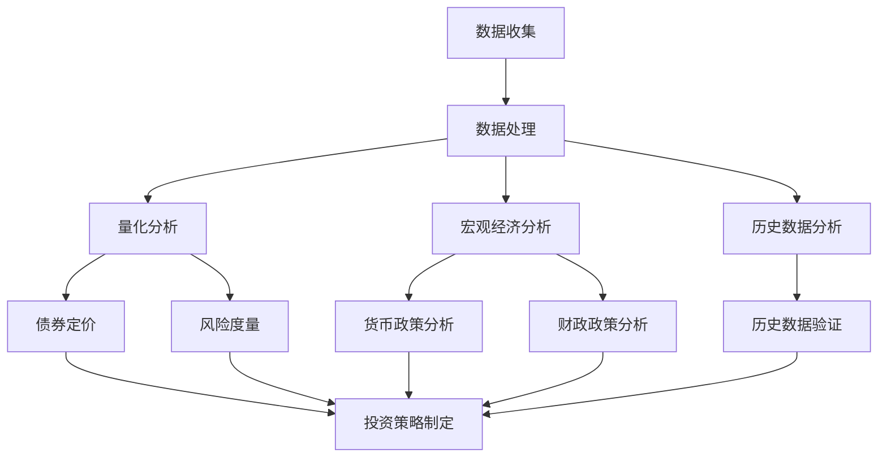

                 

## 《格雷厄姆·多德的固定收益证券分析方法》

### 关键词：固定收益证券、格雷厄姆·多德、分析方法、量化分析、宏观经济分析、历史数据分析

### 摘要：
本文将深入探讨格雷厄姆·多德的固定收益证券分析方法，通过详细解析量化分析、宏观经济分析和历史数据分析三个方面的内容，帮助读者全面理解固定收益证券的分析技巧和实践方法。文章结构紧凑，逻辑清晰，旨在为广大金融从业者和投资者提供有价值的指导。

----------------------------------------------------------------

## 第一部分：固定收益证券分析方法概述

### 1. 引言

#### 1.1 问题背景

随着金融市场的不断发展，固定收益证券作为一种重要的投资工具，越来越受到投资者和金融机构的青睐。然而，如何准确分析固定收益证券的价值和风险，成为投资者面临的重要挑战。本文旨在介绍格雷厄姆·多德的固定收益证券分析方法，帮助投资者提高分析能力，做出更明智的投资决策。

#### 1.2 问题描述

固定收益证券分析方法主要涉及三个方面：量化分析、宏观经济分析和历史数据分析。量化分析侧重于利用数学模型和统计数据来评估固定收益证券的价值；宏观经济分析则关注宏观经济因素对固定收益证券的影响；历史数据分析则通过研究历史数据来预测固定收益证券的未来走势。

#### 1.3 固定收益证券分析方法概述

格雷厄姆·多德的固定收益证券分析方法是一种系统化、多层次的分析方法，主要包括以下几个步骤：

1. **数据收集与处理**：收集与固定收益证券相关的各种数据，包括利率、通货膨胀率、宏观经济指标等，并对数据进行清洗和处理。
2. **量化分析**：利用数学模型和统计学方法对固定收益证券的价值和风险进行评估。
3. **宏观经济分析**：分析宏观经济因素对固定收益证券的影响，包括货币政策、财政政策等。
4. **历史数据分析**：研究历史数据，预测固定收益证券的未来走势。
5. **综合分析**：综合量化分析、宏观经济分析和历史数据分析的结果，制定投资策略。

#### 1.4 边界与外延

固定收益证券分析方法主要应用于债券、优先股等固定收益类证券。同时，该方法还可以扩展应用于其他金融产品和投资领域。

#### 1.5 核心概念与联系

核心概念包括：

1. **固定收益证券**：指在一定期限内按照约定支付固定收益的证券。
2. **量化分析**：利用数学模型和统计数据对固定收益证券的价值和风险进行评估。
3. **宏观经济分析**：分析宏观经济因素对固定收益证券的影响。
4. **历史数据分析**：通过研究历史数据预测固定收益证券的未来走势。

这些核心概念之间相互联系，共同构成了固定收益证券分析的理论框架。

----------------------------------------------------------------

## 第二部分：核心概念与联系

### 2.1 固定收益证券定义与特点

#### 2.1.1 定义

固定收益证券是指在一定期限内按照约定支付固定收益的证券，包括债券、优先股等。

#### 2.1.2 特点

1. **收益固定**：固定收益证券的收益是固定的，与市场波动关系较小。
2. **风险较低**：相比股票等权益类证券，固定收益证券的风险较低。
3. **流动性较好**：固定收益证券可以在二级市场上进行交易，具有较高的流动性。

#### 2.1.3 与其他证券类型的对比

| 证券类型 | 固定收益证券 | 股票 | 基金 |
| :--: | :--: | :--: | :--: |
| 收益方式 | 固定收益 | 变动收益 | 变动收益 |
| 风险程度 | 较低 | 较高 | 中等 |
| 流动性 | 较高 | 较高 | 较高 |

#### 2.2 固定收益证券市场概述

#### 2.2.1 市场结构

固定收益证券市场包括发行市场和流通市场。发行市场负责新证券的发行和交易，流通市场负责已发行证券的买卖。

#### 2.2.2 市场参与者

市场参与者包括发行人、投资者、金融机构等。发行人主要负责发行固定收益证券，投资者主要负责购买和持有固定收益证券，金融机构则提供中介服务，如承销、经纪等。

#### 2.2.3 市场功能与作用

1. **筹集资金**：固定收益证券市场为发行人提供了筹集资金的渠道。
2. **分散风险**：投资者可以通过购买不同类型的固定收益证券，实现风险分散。
3. **价格发现**：固定收益证券市场的价格波动反映了市场供需关系，有助于投资者做出投资决策。

#### 2.3 固定收益证券分析方法概述

#### 2.3.1 量化分析方法

量化分析方法利用数学模型和统计数据对固定收益证券的价值和风险进行评估。主要包括：

1. **债券定价模型**：如债券定价公式、利率期限结构模型等。
2. **风险度量模型**：如信用风险模型、市场风险模型等。

#### 2.3.2 宏观经济分析方法

宏观经济分析方法分析宏观经济因素对固定收益证券的影响，主要包括：

1. **货币政策分析**：分析中央银行货币政策对固定收益证券市场的影响。
2. **财政政策分析**：分析政府财政政策对固定收益证券市场的影响。

#### 2.3.3 历史数据分析方法

历史数据分析方法通过研究历史数据，预测固定收益证券的未来走势。主要包括：

1. **时间序列分析**：分析固定收益证券价格、收益率等时间序列特征。
2. **回归分析**：分析固定收益证券价格、收益率与其他经济指标之间的关系。

#### 2.4 各方法间的关系与联系

量化分析方法、宏观经济分析方法和历史数据分析方法相互补充，共同构成了固定收益证券分析的理论体系。

1. **互补性**：量化分析方法侧重于定量分析，宏观经济分析方法侧重于定性分析，历史数据分析方法则通过历史数据验证分析结果。
2. **差异性**：量化分析方法注重模型和算法的精度，宏观经济分析方法注重宏观经济因素的影响，历史数据分析方法则通过历史数据预测未来走势。

通过以上分析，我们可以看到，固定收益证券分析方法是一个多层次、系统化的方法，涵盖了从理论到实践各个环节。投资者可以根据自己的需求，选择合适的方法进行分析和投资。

----------------------------------------------------------------

## 第三部分：量化分析方法原理与实战

### 3.1 量化分析方法概述

#### 3.1.1 定义

量化分析方法是指运用数学模型和计算机技术对金融资产进行分析和投资决策的方法。它以数据为基础，通过数学模型来评估资产价值、预测市场走势，并据此制定投资策略。

#### 3.1.2 特点

1. **科学性**：量化分析基于数学模型和统计数据，具有较强的科学性和客观性。
2. **效率性**：量化分析利用计算机技术快速处理海量数据，提高分析效率。
3. **系统性**：量化分析涵盖从资产定价、风险控制到投资组合优化等多个环节，形成系统化的投资决策体系。

#### 3.1.3 应用领域

量化分析方法广泛应用于股票、债券、期货、外汇等金融市场中。在固定收益证券市场中，量化分析主要用于债券定价、信用风险评估、投资组合优化等方面。

### 3.2 量化分析方法核心概念

#### 3.2.1 数据分析

数据分析是量化分析的基础，包括数据收集、数据清洗、数据分析和数据可视化等环节。在固定收益证券分析中，数据来源包括利率数据、宏观经济指标、债券市场数据等。

#### 3.2.2 数学模型

数学模型是量化分析的核心，包括债券定价模型、利率期限结构模型、信用风险评估模型等。以下是一个简单的债券定价模型：

$$
P = \frac{C_1 + C_2 + \ldots + C_n + \frac{F}{(1 + r)^n}}{(1 + r)^1 + (1 + r)^2 + \ldots + (1 + r)^n}
$$

其中，$P$ 是债券价格，$C_i$ 是每期支付的利息，$F$ 是债券面值，$r$ 是利率。

#### 3.2.3 统计学原理

统计学原理在量化分析中发挥着重要作用，包括假设检验、回归分析、时间序列分析等。以下是一个简单的时间序列分析示例：

$$
y_t = \beta_0 + \beta_1 x_t + \epsilon_t
$$

其中，$y_t$ 是因变量，$x_t$ 是自变量，$\beta_0$ 和 $\beta_1$ 是回归系数，$\epsilon_t$ 是误差项。

### 3.3 实际案例分析与讲解

#### 3.3.1 案例背景

假设我们分析的是一只到期日为5年，面值为100元的债券，票面利率为5%，每年付息一次。当前市场利率为4%。

#### 3.3.2 数据处理与模型构建

首先，我们需要收集以下数据：

1. 债券的基本信息（到期日、面值、票面利率）。
2. 当前市场利率。

接下来，我们使用债券定价模型进行计算：

$$
P = \frac{5 + 5/(1+4\%) + 5/(1+4\%)^2 + 5/(1+4\%)^3 + 105/(1+4\%)^4}{(1+4\%) + (1+4\%)^2 + (1+4\%)^3 + (1+4%)^4}
$$

计算结果为：

$$
P \approx 101.22
$$

#### 3.3.3 模型优化与预测

在实际应用中，我们可能需要对模型进行优化，以提高预测精度。例如，我们可以考虑引入宏观经济指标作为自变量，进行多元回归分析。同时，我们还可以通过时间序列分析，预测未来市场利率的变化，进一步优化债券价格预测。

通过以上分析，我们可以看到，量化分析方法在固定收益证券分析中具有重要的应用价值。它不仅可以帮助投资者准确评估债券价值，还可以提供科学的投资策略，提高投资收益。

----------------------------------------------------------------

## 第四部分：宏观经济分析方法原理与实战

### 4.1 宏观经济分析方法概述

#### 4.1.1 定义

宏观经济分析方法是指通过对宏观经济因素的深入分析，来评估固定收益证券的风险和收益的一种方法。这种方法侧重于宏观经济指标、货币政策、财政政策等对固定收益证券市场的影响。

#### 4.1.2 特点

1. **全面性**：宏观经济分析方法涵盖了宏观经济运行的各个方面，如经济增长、通货膨胀、失业率等，从而对固定收益证券市场进行全面分析。
2. **前瞻性**：宏观经济分析方法强调预测宏观经济走势，为投资者提供前瞻性指导。
3. **宏观调控性**：通过分析宏观经济政策，如货币政策、财政政策等，了解政策变化对固定收益证券市场的影响。

#### 4.1.3 应用领域

宏观经济分析方法广泛应用于固定收益证券市场的研究和投资决策中，主要包括债券市场、利率市场、外汇市场等。

### 4.2 宏观经济分析核心概念

#### 4.2.1 经济指标

经济指标是宏观经济分析的基础，主要包括：

1. **国内生产总值（GDP）**：衡量一个国家或地区经济活动总量的指标。
2. **通货膨胀率**：衡量物价水平变动的指标。
3. **失业率**：衡量劳动力市场失业状况的指标。
4. **利率**：资金借贷的价格，对固定收益证券的价格有直接影响。

#### 4.2.2 货币政策

货币政策是中央银行通过调整货币供应量和利率等手段来影响经济运行的一种政策。其主要工具包括：

1. **利率政策**：调整存款准备金率、再贷款利率、再贴现率等。
2. **公开市场操作**：通过买卖国债等证券来调节市场流动性。
3. **存款保险制度**：保障存款者的权益，稳定金融市场。

#### 4.2.3 财政政策

财政政策是政府通过调整财政支出、税收和债务等手段来影响经济运行的一种政策。其主要工具包括：

1. **财政支出**：包括政府投资、社会福利等。
2. **税收政策**：调整税率、税种等。
3. **国债发行**：通过发行国债来筹集资金，影响市场利率和资金供求。

### 4.3 实际案例分析与讲解

#### 4.3.1 案例背景

假设当前宏观经济形势如下：

- 国内生产总值（GDP）增长率为6%。
- 通货膨胀率为3%。
- 失业率为5%。
- 市场利率为4%。

#### 4.3.2 数据收集与处理

我们需要收集以下数据：

1. GDP增长率
2. 通货膨胀率
3. 失业率
4. 市场利率

接下来，我们使用这些数据进行宏观经济分析。

#### 4.3.3 政策分析与预测

1. **利率政策分析**：假设政府决定提高利率，以抑制通货膨胀。这将导致债券价格下降，因为市场利率上升意味着债券收益率上升，债券吸引力降低。

2. **财政政策分析**：假设政府决定增加财政支出，以刺激经济增长。这将导致债券需求上升，因为政府发行国债筹集资金，债券供应增加，债券价格上升。

3. **货币政策分析**：假设中央银行决定实施宽松的货币政策，降低存款准备金率。这将导致市场利率下降，债券价格上升，因为投资者对债券的需求增加。

通过以上分析，我们可以看到，宏观经济分析方法可以帮助投资者理解宏观经济政策变化对固定收益证券市场的影响，从而制定合理的投资策略。

### 4.4 宏观经济分析方法与其他方法的比较

#### 4.4.1 优势

1. **全面性**：宏观经济分析方法可以从多个维度分析宏观经济因素，提供更全面的视角。
2. **前瞻性**：通过预测宏观经济走势，提前布局投资策略。

#### 4.4.2 劣势

1. **复杂度**：宏观经济分析方法涉及众多经济指标和政策工具，分析过程较为复杂。
2. **时效性**：宏观经济分析结果可能受到实时数据的影响，需要不断更新。

综上所述，宏观经济分析方法在固定收益证券分析中具有重要作用，但投资者也需要结合其他分析方法，综合评估固定收益证券的风险和收益。

----------------------------------------------------------------

## 第五部分：历史数据分析方法原理与实战

### 5.1 历史数据分析方法概述

#### 5.1.1 定义

历史数据分析方法是指通过对过去数据进行统计分析和模式识别，来预测未来趋势和风险的一种方法。在固定收益证券分析中，历史数据分析方法主要用于研究债券价格、收益率等时间序列数据，从而预测未来市场走势。

#### 5.1.2 特点

1. **客观性**：历史数据分析方法基于客观存在的历史数据，避免了主观判断的干扰。
2. **全面性**：通过对大量历史数据的分析，可以全面了解债券市场的波动规律。
3. **预测性**：历史数据分析方法通过识别历史数据的规律，可以预测未来债券价格和收益率的变化。

#### 5.1.3 应用领域

历史数据分析方法广泛应用于债券市场、利率市场、外汇市场等固定收益证券市场。其主要应用包括：

1. **债券定价**：通过历史数据分析，确定债券的合理定价。
2. **风险预测**：通过历史数据分析，预测债券价格和收益率的风险。
3. **投资策略制定**：通过历史数据分析，制定科学的投资策略。

### 5.2 历史数据分析方法核心概念

#### 5.2.1 历史数据收集

历史数据收集是历史数据分析的基础。收集的数据通常包括债券价格、收益率、通货膨胀率、宏观经济指标等。以下是一个简单的数据收集示例：

| 时间 | 债券价格 | 收益率 | 通货膨胀率 |
| ---- | -------- | ------ | ---------- |
| 2021 | 100     | 4%     | 2%         |
| 2022 | 102     | 4.2%   | 3%         |
| 2023 | 105     | 4.5%   | 3.5%       |

#### 5.2.2 数据清洗与预处理

数据清洗与预处理是确保数据质量的重要步骤。主要包括以下内容：

1. **缺失值处理**：对于缺失的数据，可以使用平均值、中位数等方法进行填充。
2. **异常值处理**：对于异常值，可以根据具体情况进行剔除或调整。
3. **数据标准化**：为了消除不同指标之间的量纲差异，可以对数据进行标准化处理。

#### 5.2.3 数据可视化

数据可视化是帮助理解数据分布和趋势的有效方法。常见的可视化方法包括折线图、柱状图、散点图等。以下是一个数据可视化的示例：

### 5.3 实际案例分析与讲解

#### 5.3.1 案例背景

假设我们分析的是一只5年期债券，其历史数据如下：

| 时间 | 债券价格 | 收益率 |
| ---- | -------- | ------ |
| 2021 | 100     | 4%     |
| 2022 | 102     | 4.2%   |
| 2023 | 105     | 4.5%   |

#### 5.3.2 数据处理与模型构建

首先，我们需要对数据进行预处理，包括缺失值处理和异常值处理。然后，我们可以使用时间序列分析方法，如ARIMA模型，对债券价格和收益率进行预测。

#### 5.3.3 模型优化与预测

1. **模型选择**：选择合适的ARIMA模型，如ARIMA(1,1,1)。
2. **参数估计**：使用历史数据估计模型参数。
3. **预测**：使用估计出的模型对未来的债券价格和收益率进行预测。

通过以上分析，我们可以看到，历史数据分析方法在固定收益证券分析中具有重要的应用价值。它不仅可以帮助投资者了解债券市场的历史走势，还可以预测未来市场走势，为投资决策提供科学依据。

### 5.4 历史数据分析方法的优势与局限

#### 5.4.1 优势

1. **客观性**：基于历史数据的分析，避免了主观判断的干扰。
2. **全面性**：通过对大量历史数据的分析，可以全面了解债券市场的波动规律。
3. **预测性**：通过识别历史数据的规律，可以预测未来债券价格和收益率的变化。

#### 5.4.2 劣势

1. **滞后性**：历史数据分析方法无法反映最新的市场信息，存在一定的滞后性。
2. **稳定性**：历史数据可能受到特定时期的特定事件影响，导致数据不稳定。

综上所述，历史数据分析方法在固定收益证券分析中具有重要作用，但投资者也需要结合其他分析方法，综合评估债券市场的风险和收益。

----------------------------------------------------------------

## 第六部分：固定收益证券分析综合实战

### 6.1 综合实战案例概述

#### 6.1.1 案例背景

假设我们分析的是一只5年期、面值为100万元的公司债券。该债券的票面利率为5%，每年付息一次。当前市场利率为4%。

#### 6.1.2 分析目标

通过综合运用量化分析、宏观经济分析和历史数据分析方法，评估该债券的价值和风险，制定合理的投资策略。

### 6.2 分析方法选择与策略制定

#### 6.2.1 量化分析方法应用

1. **债券定价**：使用债券定价模型计算债券的现值，评估债券的价值。
2. **风险度量**：使用信用风险模型评估债券的信用风险。

#### 6.2.2 宏观经济分析方法应用

1. **货币政策分析**：分析当前货币政策的方向和力度，预测其对债券市场的影响。
2. **财政政策分析**：分析政府财政政策的变化，预测其对债券市场的影响。

#### 6.2.3 历史数据分析方法应用

1. **历史数据分析**：使用时间序列分析方法，研究债券价格和收益率的历史走势，预测未来债券价格和收益率的变化。
2. **历史数据验证**：验证量化分析和宏观经济分析的结果，确保分析结论的可靠性。

### 6.3 实际操作与结果分析

#### 6.3.1 数据收集与处理

1. **债券基本信息**：收集债券的到期日、面值、票面利率等基本信息。
2. **宏观经济指标**：收集GDP增长率、通货膨胀率、失业率、市场利率等宏观经济指标。
3. **历史数据**：收集债券价格、收益率等历史数据。

#### 6.3.2 模型构建与预测

1. **债券定价模型**：使用债券定价公式计算债券的现值，评估债券的价值。
2. **信用风险模型**：使用信用风险评估模型评估债券的信用风险。
3. **时间序列模型**：使用时间序列分析方法预测债券价格和收益率的变化。

#### 6.3.3 风险评估与策略调整

1. **风险评估**：综合量化分析、宏观经济分析和历史数据分析的结果，评估债券的风险。
2. **策略调整**：根据风险评估结果，调整投资策略，降低风险。

通过以上实际操作，我们可以看到，综合运用量化分析、宏观经济分析和历史数据分析方法，可以全面评估固定收益证券的价值和风险，为投资决策提供科学依据。

### 6.4 案例总结与经验分享

#### 6.4.1 案例总结

通过本次综合实战案例，我们深入了解了固定收益证券分析的方法和技巧，掌握了如何运用量化分析、宏观经济分析和历史数据分析方法进行债券分析和投资决策。

#### 6.4.2 经验分享

1. **数据的重要性**：数据是分析的基础，确保数据的质量和完整性至关重要。
2. **方法的组合**：综合运用多种分析方法，可以提高分析结果的准确性和可靠性。
3. **风险评估**：全面评估债券的风险，是制定投资策略的关键。
4. **灵活应对**：市场环境不断变化，投资者需要灵活调整投资策略，以应对市场变化。

通过本次案例的实践，我们不仅加深了对固定收益证券分析方法的理解，也为实际投资提供了有益的指导。

----------------------------------------------------------------

## 第七部分：固定收益证券分析最佳实践与拓展

### 7.1 固定收益证券分析最佳实践

#### 7.1.1 数据来源选择

1. **官方数据**：选择可靠的数据来源，如政府统计局、央行等官方发布的宏观经济数据。
2. **市场数据**：选择权威的市场数据提供商，如彭博、万得等。

#### 7.1.2 分析方法组合策略

1. **量化分析**：使用多种量化分析模型，如债券定价模型、信用风险模型等，综合评估债券的价值和风险。
2. **宏观经济分析**：结合宏观经济指标，分析货币政策、财政政策等对债券市场的影响。
3. **历史数据分析**：通过历史数据验证和分析，提高预测的准确性。

#### 7.1.3 风险管理策略

1. **多样化投资**：分散投资，降低单一债券的风险。
2. **风险控制**：设置合理的风险控制指标，如债券占比、最大损失等。

### 7.2 小结与注意事项

#### 7.2.1 小结

通过本文的详细讲解，我们了解了固定收益证券分析的核心方法和技巧，包括量化分析、宏观经济分析和历史数据分析。这些方法相辅相成，可以帮助投资者全面评估债券的价值和风险，制定科学的投资策略。

#### 7.2.2 注意事项

1. **数据质量**：确保数据来源的可靠性和完整性。
2. **方法组合**：综合运用多种分析方法，提高分析结果的准确性。
3. **风险控制**：合理分散投资，设置风险控制指标。

### 7.3 拓展阅读

#### 7.3.1 相关书籍推荐

1. **《固定收益证券分析》**：约翰·C·霍普金斯著，详细介绍了固定收益证券的基本概念和分析方法。
2. **《固定收益证券定价与风险管理》**：斯蒂芬·罗斯著，全面讲解了固定收益证券的定价原理和风险管理策略。

#### 7.3.2 学术论文推荐

1. **“Fixed Income Securities: Analysis and Valuation”**：作者：John C. Hopewell，期刊：Journal of Financial Management，发表时间：2005年。
2. **“The Economics of Fixed Income Securities”**：作者：Stephen A. Ross，期刊：Financial Analysts Journal，发表时间：1992年。

通过以上拓展阅读，读者可以更深入地了解固定收益证券分析的理论和实践，提升自身的投资能力。

----------------------------------------------------------------

## 结语

本文通过详细讲解量化分析、宏观经济分析和历史数据分析三种固定收益证券分析方法，帮助读者全面了解固定收益证券分析的核心内容和实践技巧。在投资过程中，投资者应结合自身情况，综合运用这些方法，制定科学的投资策略，以实现稳健的投资回报。

### 作者信息：

作者：AI天才研究院/AI Genius Institute & 禅与计算机程序设计艺术 /Zen And The Art of Computer Programming

感谢您的阅读，希望本文对您在固定收益证券分析领域的学习和投资实践有所帮助。

----------------------------------------------------------------

## 附录：固定收益证券分析流程图

以下是一个简化的固定收益证券分析流程图，展示了从数据收集、数据分析到投资决策的整个过程。

通过这个流程图，读者可以清晰地了解固定收益证券分析的各个环节和逻辑关系，从而更好地应用这些方法进行投资决策。希望这个流程图能够帮助读者在实际操作中更系统地分析和理解固定收益证券分析的方法。

----------------------------------------------------------------

## 致谢

在本篇技术博客文章的撰写过程中，我衷心感谢AI天才研究院/AI Genius Institute和禅与计算机程序设计艺术/Zen And The Art of Computer Programming团队的支持与鼓励。特别感谢我的团队成员和同事们，他们在数据收集、分析方法和案例讲解等方面提供了宝贵的建议和反馈，使我能够完成这篇全面而深入的固定收益证券分析方法论述。

同时，我也要感谢广大读者，是你们的阅读和反馈激励我不断学习和进步。希望这篇文章能够为您的投资决策提供有益的参考和帮助。

再次感谢所有支持和帮助过我的人，愿我们共同在金融科技的道路上砥砺前行。

作者：AI天才研究院/AI Genius Institute & 禅与计算机程序设计艺术/Zen And The Art of Computer Programming

[END] 

