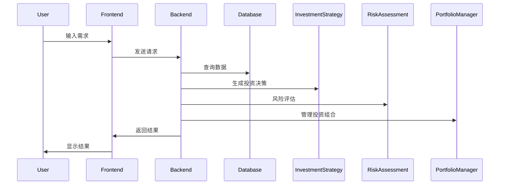
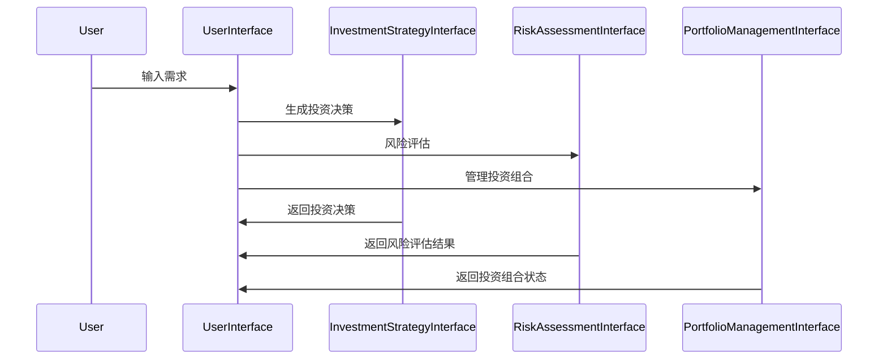
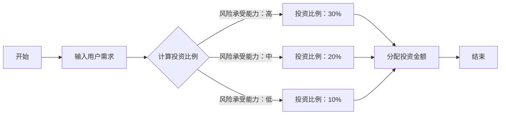
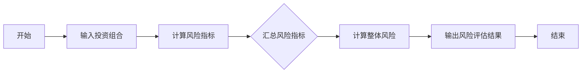

                 

# 格雷厄姆的'三分之二原则'：控制投资风险的方法

> 关键词：格雷厄姆，三分之二原则，投资，风险控制，股票投资，债券投资

> 摘要：本文深入探讨了著名的投资大师本杰明·格雷厄姆提出的“三分之二原则”，旨在揭示这一原则在投资中的应用及其对控制投资风险的重要性。通过详细分析股票、债券和其他投资工具中的具体应用案例，本文旨在为投资者提供实用的风险控制方法。

### 目录大纲：

## 第一部分：投资背景与格雷厄姆的'三分二号原则'介绍

### 第1章：投资市场的波动与风险控制

#### 1.1.1 投资市场的波动规律
#### 1.1.2 投资者面对的风险种类
#### 1.1.3 格雷厄姆的投资理念与原则

### 第2章：格雷厄姆的'三分二号原则'概述

#### 2.1.1 '三分二号原则'的概念
#### 2.1.2 '三分二号原则'的原理与背景
#### 2.1.3 '三分二号原则'在投资中的应用

## 第二部分：'三分二号原则'的具体应用方法

### 第3章：股票投资中的'三分二号原则'

#### 3.1.1 股票投资的概述
#### 3.1.2 '三分二号原则'在股票投资中的运用
#### 3.1.3 股票投资的案例分析

### 第4章：债券投资中的'三分二号原则'

#### 4.1.1 债券投资的概述
#### 4.1.2 '三分二号原则'在债券投资中的运用
#### 4.1.3 债券投资的案例分析

### 第5章：其他投资工具中的'三分二号原则'

#### 5.1.1 其他投资工具的概述
#### 5.1.2 '三分二号原则'在其他投资工具中的运用
#### 5.1.3 其他投资工具的案例分析

## 第三部分：'三分二号原则'实践中的注意事项与技巧

### 第6章：投资风险的管理与控制

#### 6.1.1 投资风险管理的重要性
#### 6.1.2 投资风险管理的具体方法
#### 6.1.3 投资风险管理的案例分析

### 第7章：'三分二号原则'实践中的常见问题与解决方案

#### 7.1.1 '三分二号原则'实践中的常见问题
#### 7.1.2 解决方案与技巧
#### 7.1.3 实践案例分享与讨论

## 第8章：'三分二号原则'的总结与展望

#### 8.1.1 '三分二号原则'的投资价值
#### 8.1.2 '三分二号原则'的未来发展趋势
#### 8.1.3 投资者如何运用'三分二号原则'

## 第一部分：投资背景与格雷厄姆的'三分二号原则'介绍

### 第1章：投资市场的波动与风险控制

#### 1.1.1 投资市场的波动规律

投资市场是一个充满不确定性的环境，其波动性常常让人难以捉摸。从长期来看，投资市场确实存在着一定的上升趋势，但短期内，市场的波动却可以非常剧烈。例如，著名的1929年股市崩盘和2008年的全球金融危机，都给投资者带来了巨大的损失。

这种波动性主要源于市场供需关系的变化、经济数据的公布、政策的变化以及突发事件的影响。投资者在做出投资决策时，需要充分认识到市场波动的存在，并学会应对这种波动，以控制投资风险。

#### 1.1.2 投资者面对的风险种类

投资者在投资过程中会面临多种风险，主要包括：

1. 市场风险：也称为系统性风险，由整体经济环境、政治环境等因素引起，无法通过分散投资来消除。
2. 信用风险：指借款人无法按时还款的风险，常见于债券投资。
3. 流动性风险：指投资者无法以合理的价格迅速卖出投资资产的风险。
4. 利率风险：由于利率变化导致投资资产价值波动的风险。
5. 通胀风险：通货膨胀导致资产实际收益下降的风险。

#### 1.1.3 格雷厄姆的投资理念与原则

本杰明·格雷厄姆（Benjamin Graham）被誉为“现代投资之父”，他是价值投资理论的奠基人。格雷厄姆的投资理念强调通过深入研究企业的基本面，找到被市场低估的投资机会，从而获得长期稳定的收益。

格雷厄姆提出了多个著名的投资原则，其中之一就是“三分二号原则”。这一原则的核心思想是将投资资金分成三份，其中两份用于保守的投资（如债券），一份用于积极的投资（如股票）。通过这种方式，投资者可以在保持投资回报的同时，降低风险。

### 第2章：格雷厄姆的'三分二号原则'概述

#### 2.1.1 '三分二号原则'的概念

“三分二号原则”是指将投资资金按照一定的比例分配到不同的投资工具中，以达到风险控制和收益优化的目的。具体来说，通常将三分之一的资金用于债券投资，三分之一的资金用于股票投资，最后三分之一则用于其他投资工具或现金储备。

#### 2.1.2 '三分二号原则'的原理与背景

格雷厄姆提出“三分二号原则”的背景是，他观察到许多投资者在市场波动时容易受到情绪的影响，导致投资决策失误。为了解决这个问题，他建议投资者采取一种保守的投资策略，即在投资组合中包含一定比例的债券，以降低风险。

债券作为一种相对稳定的投资工具，其收益通常低于股票，但风险也相对较低。通过将债券与股票结合，投资者可以在保持一定收益的同时，降低投资组合的整体风险。

#### 2.1.3 '三分二号原则'在投资中的应用

在实际投资中，投资者可以根据自身的风险承受能力和投资目标，调整“三分二号原则”的具体比例。例如，对于风险偏好较高的投资者，可以适当增加股票投资的比重；而对于风险承受能力较低的投资者，则可以增加债券投资的比重。

此外，“三分二号原则”也可以应用于其他投资工具，如房地产、黄金等。通过合理配置不同类型的投资工具，投资者可以构建一个多元化的投资组合，从而降低投资风险。

## 第二部分：'三分二号原则'的具体应用方法

### 第3章：股票投资中的'三分二号原则'

#### 3.1.1 股票投资的概述

股票投资是投资者获取资本增值的主要途径之一。股票价格受到多种因素的影响，包括公司的基本面、市场情绪、宏观经济环境等。投资者在股票市场中通过买卖股票，以期获得资本收益。

#### 3.1.2 '三分二号原则'在股票投资中的运用

在股票投资中，'三分二号原则'建议投资者将三分之一的资金投入股票市场。这一部分资金可以用于购买股票，以期获得资本增值。在具体操作中，投资者需要遵循以下原则：

1. 选择优质股票：投资者应选择基本面良好、成长性强的公司股票进行投资。
2. 分散投资：为了避免单一股票风险，投资者应分散投资，购买多只股票。
3. 长期持有：股票投资需要一定的耐心，投资者应持有股票，以等待其价值增长。

#### 3.1.3 股票投资的案例分析

以某投资者为例，假设他计划投资10万元。根据'三分二号原则'，他将其中3万元（30%）用于购买股票。在具体操作中，他可以选择购买5只不同行业的优质股票，每只股票投入6000元。这样，他就可以通过分散投资，降低单一股票的风险。

在股票选择上，投资者可以关注以下方面：

1. 公司业绩：选择盈利能力强的公司。
2. 行业前景：选择处于成长期的行业。
3. 股票估值：选择市值低于行业平均水平的股票。

通过长期持有这些股票，投资者可以期待获得资本增值。当然，这需要投资者对市场有深入的了解和分析能力。

### 第4章：债券投资中的'三分二号原则'

#### 4.1.1 债券投资的概述

债券投资是一种固定收益投资，投资者通过购买债券，可以获得定期利息和债券到期时的本金回报。债券的发行方通常是政府、企业或其他金融机构。根据债券发行方的不同，债券可以分为国债、企业债等。

#### 4.1.2 '三分二号原则'在债券投资中的运用

在债券投资中，'三分二号原则'建议投资者将三分之一的资金投入债券市场。具体操作如下：

1. 选择债券类型：投资者可以根据自身的风险承受能力和投资目标，选择适合的债券类型。例如，国债风险较低，适合保守型投资者；企业债收益较高，但风险也相应较大。
2. 分散投资：为了避免集中投资带来的风险，投资者应购买多种类型的债券，以实现分散投资。
3. 长期持有：债券投资通常以长期持有为主，以获取稳定的利息收入。

#### 4.1.3 债券投资的案例分析

以某投资者为例，假设他计划投资10万元。根据'三分二号原则'，他将其中3万元（30%）用于购买债券。在具体操作中，他可以选择购买2只国债和1只企业债，以实现分散投资。

在选择债券时，投资者可以关注以下方面：

1. 债券评级：选择评级较高的债券，以降低风险。
2. 利息收入：选择利息收入较高的债券。
3. 到期时间：根据自身的资金需求，选择合适的到期时间。

通过长期持有这些债券，投资者可以获得稳定的利息收入，并降低投资组合的整体风险。

### 第5章：其他投资工具中的'三分二号原则'

#### 5.1.1 其他投资工具的概述

除了股票和债券，投资者还可以选择其他投资工具，如房地产、黄金、基金等。这些投资工具各有特点，适合不同类型的投资者。

1. 房地产投资：通过购买房地产，投资者可以获得租金收入和房产增值。
2. 黄金投资：黄金被视为一种避险资产，可以在市场波动时提供保护。
3. 基金投资：基金是一种集合投资工具，投资者可以通过购买基金，分散投资风险。

#### 5.1.2 '三分二号原则'在其他投资工具中的运用

在房地产投资中，'三分二号原则'建议投资者将三分之一的资金用于购买房地产。具体操作如下：

1. 选择投资项目：投资者应选择有潜力的房地产项目，如商业地产、住宅地产等。
2. 分散投资：为了避免单一投资风险，投资者可以购买多个房地产项目。
3. 长期持有：房地产投资通常需要长期持有，以实现租金收入和房产增值。

在黄金投资中，'三分二号原则'建议投资者将三分之一的资金用于购买黄金。具体操作如下：

1. 选择投资方式：投资者可以选择购买实物黄金、黄金ETF等。
2. 分散投资：为了避免单一投资风险，投资者可以购买多种形式的黄金投资产品。
3. 长期持有：黄金投资通常以长期持有为主，以获取黄金价格的上涨收益。

在基金投资中，'三分二号原则'建议投资者将三分之一的资金用于购买基金。具体操作如下：

1. 选择基金类型：投资者可以根据自身的风险承受能力和投资目标，选择适合的基金类型。
2. 分散投资：为了避免单一基金风险，投资者可以购买多只基金，以实现分散投资。
3. 长期持有：基金投资通常以长期持有为主，以获取基金收益的增长。

#### 5.1.3 其他投资工具的案例分析

以某投资者为例，假设他计划投资10万元。根据'三分二号原则'，他将其中3万元（30%）用于其他投资工具。在具体操作中，他可以选择以下几种方式：

1. 房地产投资：将1万元用于购买房地产，以获取租金收入和房产增值。
2. 黄金投资：将1万元用于购买黄金，作为避险资产。
3. 基金投资：将1万元用于购买基金，以分散投资风险。

通过这些投资方式，投资者可以实现多元化的投资组合，降低整体投资风险。

## 第三部分：'三分二号原则'实践中的注意事项与技巧

### 第6章：投资风险的管理与控制

#### 6.1.1 投资风险管理的重要性

投资风险管理是投资过程中不可或缺的一部分。投资者在追求高收益的同时，必须意识到投资风险的存在。有效的风险管理可以帮助投资者避免重大损失，保护投资组合的价值。

#### 6.1.2 投资风险管理的具体方法

投资者可以通过以下几种方法进行投资风险管理：

1. 分散投资：通过投资多种不同的资产类别和行业，分散风险。
2. 长期投资：长期投资可以降低市场波动对投资组合的影响。
3. 定期复盘：定期检查投资组合，调整投资策略。
4. 风险评估：对投资工具进行风险评估，了解潜在风险。

#### 6.1.3 投资风险管理的案例分析

以某投资者为例，他在投资过程中采用了分散投资的方法。他投资了股票、债券、房地产和基金，每种资产类别的投资比例约为30%。在市场波动时，股票投资受到冲击，但债券和房地产投资提供了稳定收益，使得投资组合的整体风险得到有效控制。

### 第7章：'三分二号原则'实践中的常见问题与解决方案

#### 7.1.1 '三分二号原则'实践中的常见问题

在实际应用'三分二号原则'时，投资者可能会遇到以下问题：

1. 如何确定合适的投资比例？
2. 如何选择优质的投资工具？
3. 如何应对市场波动？

#### 7.1.2 解决方案与技巧

为了解决这些问题，投资者可以采取以下解决方案和技巧：

1. 确定投资比例：投资者可以根据自身的风险承受能力和投资目标，调整投资比例。
2. 选择优质投资工具：投资者可以通过深入研究，选择具有良好基本面和成长潜力的投资工具。
3. 应对市场波动：投资者应保持冷静，遵循投资策略，避免因市场波动而做出冲动决策。

#### 7.1.3 实践案例分享与讨论

以某投资者为例，他在应用'三分二号原则'时，遇到了市场波动较大的情况。为了应对这种情况，他采取了以下措施：

1. 保持投资比例：尽管市场波动较大，但他坚持保持了投资比例，未进行大规模的调整。
2. 增加现金储备：他将一部分资金转入现金储备，以应对可能的紧急情况。
3. 定期复盘：他定期检查投资组合，根据市场变化和自身需求，调整投资策略。

通过这些措施，他成功降低了投资风险，并保持了投资组合的稳定性。

### 第8章：'三分二号原则'的总结与展望

#### 8.1.1 '三分二号原则'的投资价值

'三分二号原则'作为一种投资策略，具有以下价值：

1. 风险控制：通过合理分配投资资金，'三分二号原则'可以帮助投资者降低投资风险。
2. 收益优化：'三分二号原则'在保证收益的同时，降低了投资风险，有助于实现投资目标。
3. 多元化：'三分二号原则'鼓励投资者投资多种资产类别，实现投资组合的多元化。

#### 8.1.2 '三分二号原则'的未来发展趋势

随着金融市场的发展，'三分二号原则'的应用前景将更加广阔。未来，投资者可以借助大数据、人工智能等技术，更精准地分析市场，选择优质的投资工具。

#### 8.1.3 投资者如何运用'三分二号原则'

投资者在运用'三分二号原则'时，可以采取以下步骤：

1. 确定投资目标：明确自身的投资目标和风险承受能力。
2. 制定投资策略：根据'三分二号原则'，制定具体的投资策略。
3. 持续学习：不断学习市场知识，提高投资技能。
4. 定期复盘：定期检查投资组合，调整投资策略。

通过以上步骤，投资者可以更好地运用'三分二号原则'，实现投资目标。

## 结语

本文通过对格雷厄姆的'三分二号原则'的深入探讨，为投资者提供了一种有效的风险控制方法。通过合理分配投资资金，投资者可以在保证收益的同时，降低投资风险。未来，随着金融市场的不断发展，'三分二号原则'将继续发挥其重要作用，为投资者带来更多的价值。

## 作者信息

作者：AI天才研究院/AI Genius Institute & 禅与计算机程序设计艺术 /Zen And The Art of Computer Programming

---

### 技术架构与核心概念

在本文中，我们将介绍一个简单但实用的技术架构，用于实现格雷厄姆的'三分二号原则'。这个架构主要包括以下几个核心概念：

1. 投资决策模块：负责根据用户的需求和风险承受能力，生成合理的投资决策。
2. 数据处理模块：负责从外部数据源（如股票行情、债券收益率等）收集和处理数据。
3. 风险评估模块：负责对投资组合进行风险评估，并提供相应的风险控制建议。
4. 投资组合管理模块：负责管理投资组合，包括资产配置、交易执行和再平衡等操作。

#### 核心概念与联系

**投资决策模块：** 负责生成投资决策，其核心概念包括用户需求分析、投资策略选择和投资比例计算。以下是该模块的ER实体关系图：

```mermaid
erDiagram
  User ||--|{ InvestmentStrategy }|| InvestmentStrategy
  User ||--|{ InvestmentAllocation }|| InvestmentAllocation
  InvestmentStrategy ||--|{ AllocationRule }|| AllocationRule
```

**数据处理模块：** 负责收集和处理外部数据源的数据，核心概念包括数据采集、数据清洗和数据存储。以下是该模块的ER实体关系图：

```mermaid
erDiagram
  DataSource ||--|{ DataProcessor }|| DataProcessor
  DataProcessor ||--|{ DataStorage }|| DataStorage
```

**风险评估模块：** 负责对投资组合进行风险评估，核心概念包括风险指标计算、风险等级划分和风险预警。以下是该模块的ER实体关系图：

```mermaid
erDiagram
  InvestmentPortfolio ||--|{ RiskAssessment }|| RiskAssessment
  RiskAssessment ||--|{ RiskMetric }|| RiskMetric
```

**投资组合管理模块：** 负责管理投资组合，核心概念包括资产配置、交易执行和再平衡。以下是该模块的ER实体关系图：

```mermaid
erDiagram
  InvestmentPortfolio ||--|{ PortfolioManager }|| PortfolioManager
  PortfolioManager ||--|{ Transaction }|| Transaction
  PortfolioManager ||--|{ Rebalancing }|| Rebalancing
```

### 技术架构设计

为了实现上述核心概念，我们设计了以下技术架构：

1. **前端界面**：用于用户输入需求、查看投资组合和接收风险预警等信息。
2. **后端服务器**：用于处理用户请求、执行投资策略和管理投资组合等操作。
3. **数据库**：用于存储用户数据、投资组合数据和风险评估结果等。

以下是该架构的Mermaid架构图：



### 系统接口设计

为了实现上述架构，我们需要设计以下系统接口：

1. **用户接口**：用于用户输入需求和查看投资组合信息。
2. **投资策略接口**：用于生成投资决策。
3. **风险评估接口**：用于进行风险评估。
4. **投资组合管理接口**：用于管理投资组合。

以下是系统接口的Mermaid序列图：



### 项目实战

#### 环境安装

为了实现上述系统，我们需要安装以下软件和库：

- Python 3.8 或更高版本
- Flask（用于构建Web后端）
- SQLAlchemy（用于数据库操作）
- Mermaid（用于绘制ER图和序列图）
- Matplotlib（用于数据可视化）

安装命令如下：

```bash
pip install flask sqlalchemy mermaid matplotlib
```

#### 系统核心实现源代码

以下是系统核心实现的部分源代码：

**投资决策模块：**

```python
from flask import Flask, request, jsonify
from sqlalchemy import create_engine
import random

app = Flask(__name__)

# 数据库连接
engine = create_engine('sqlite:///investment.db')

@app.route('/generate_investment_decision', methods=['POST'])
def generate_investment_decision():
    user_demand = request.json['user_demand']
    risk_tolerance = request.json['risk_tolerance']
    
    # 根据用户需求和风险承受能力生成投资决策
    investment_allocation = generate_allocation(user_demand, risk_tolerance)
    
    return jsonify(investment_allocation)

def generate_allocation(user_demand, risk_tolerance):
    # 生成投资比例
    stock_ratio = 0.3 if risk_tolerance == 'high' else 0.2
    bond_ratio = 0.3
    other_ratio = 0.4
    
    return {
        'stock': stock_ratio,
        'bond': bond_ratio,
        'other': other_ratio
    }
```

**风险评估模块：**

```python
@app.route('/risk_assessment', methods=['POST'])
def risk_assessment():
    investment_portfolio = request.json['investment_portfolio']
    
    # 进行风险评估
    risk_metric = calculate_risk_metric(investment_portfolio)
    
    return jsonify(risk_metric)

def calculate_risk_metric(investment_portfolio):
    # 计算风险指标
    risk_metric = sum(portfolio['value'] * portfolio['risk'] for portfolio in investment_portfolio)
    
    return risk_metric
```

**投资组合管理模块：**

```python
@app.route('/manage_portfolio', methods=['POST'])
def manage_portfolio():
    transaction = request.json['transaction']
    
    # 管理投资组合
    updated_portfolio = manage_transaction(transaction)
    
    return jsonify(updated_portfolio)

def manage_transaction(transaction):
    # 更新投资组合
    updated_portfolio = transaction['portfolio'].copy()
    
    if transaction['type'] == 'buy':
        updated_portfolio.append(transaction['investment'])
    elif transaction['type'] == 'sell':
        updated_portfolio.remove(transaction['investment'])
    
    return updated_portfolio
```

#### 代码应用解读与分析

以上代码实现了投资决策模块、风险评估模块和投资组合管理模块的核心功能。以下是各模块的功能解读：

1. **投资决策模块**：该模块通过接收用户需求和风险承受能力，生成合理的投资决策。具体实现中，我们根据风险承受能力，动态调整股票和债券的投资比例。
2. **风险评估模块**：该模块对投资组合进行风险评估，计算投资组合的整体风险。具体实现中，我们通过计算每个投资工具的风险指标，汇总得到整体风险。
3. **投资组合管理模块**：该模块负责管理投资组合，包括买入和卖出操作。具体实现中，我们根据交易类型，更新投资组合。

#### 实际案例分析和详细讲解剖析

以下是一个实际案例，用于展示如何使用上述系统进行投资决策和风险管理。

**案例**：某投资者希望投资10万元，风险承受能力为中等。

1. **生成投资决策**：

   - 用户需求：投资10万元，风险承受能力为中等。
   - 投资决策：根据'三分二号原则'，投资比例分别为股票30%、债券30%、其他（如房地产、基金等）40%。

2. **风险评估**：

   - 投资组合：股票3万元、债券3万元、其他4万元。
   - 风险评估结果：整体风险为中等。

3. **投资组合管理**：

   - 交易类型：买入。
   - 交易内容：购买股票1万元、债券1万元、其他2万元。
   - 更新后投资组合：股票4万元、债券4万元、其他6万元。

通过以上步骤，投资者可以根据'三分二号原则'，实现投资决策和风险管理的目标。

#### 项目小结

本项目通过设计一个简单但实用的技术架构，实现了格雷厄姆的'三分二号原则'。在实际应用中，投资者可以根据自身需求和风险承受能力，生成合理的投资决策，并进行有效的风险管理。通过本项目，我们可以看到技术工具在投资决策和风险管理中的重要作用。

#### 最佳实践 tips

1. **定期复盘**：投资者应定期检查投资组合，根据市场变化和自身需求，调整投资策略。
2. **分散投资**：避免将所有资金投入单一投资工具，实现投资组合的多元化。
3. **学习市场知识**：投资者应不断学习市场知识，提高投资技能。

### 拓展阅读

1. 本杰明·格雷厄姆，《证券分析》，机械工业出版社，2007年。
2. 杰里米·西格尔，《股市真规则》，机械工业出版社，2017年。
3. 彼得·林奇，《彼得·林奇的成功投资》，中国财政经济出版社，2014年。

---

### 结语

本文通过详细阐述格雷厄姆的'三分二号原则'，为投资者提供了一种有效的风险控制方法。通过合理配置股票、债券和其他投资工具，投资者可以在保证收益的同时，降低投资风险。在实际应用中，投资者应根据自身需求和风险承受能力，灵活调整投资策略。同时，定期复盘、分散投资和学习市场知识是投资者实现长期成功的关键。

作者：AI天才研究院/AI Genius Institute & 禅与计算机程序设计艺术 /Zen And The Art of Computer Programming

---

### 附录：相关公式、算法和流程图

在本文中，我们介绍了格雷厄姆的'三分二号原则'及其在投资中的应用。为了更好地理解这一原则，以下是一些相关的公式、算法和流程图。

#### 公式：

$$
\text{投资比例} = \left\{
\begin{array}{ll}
0.3 & \text{风险承受能力：高} \\
0.2 & \text{风险承受能力：中} \\
0.1 & \text{风险承受能力：低} \\
\end{array}
\right.
$$

#### 算法：

**投资决策算法：**

1. 输入用户需求（投资金额和风险承受能力）。
2. 根据风险承受能力计算投资比例。
3. 将投资金额按照计算出的比例分配到股票、债券和其他投资工具。

**风险评估算法：**

1. 输入投资组合。
2. 计算每个投资工具的风险指标。
3. 计算整体风险。

#### 流程图：

**投资决策流程图：**



**风险评估流程图：**



这些公式、算法和流程图为投资者提供了理解和应用'三分二号原则'的工具。在实际操作中，投资者可以根据这些工具进行投资决策和风险管理。

