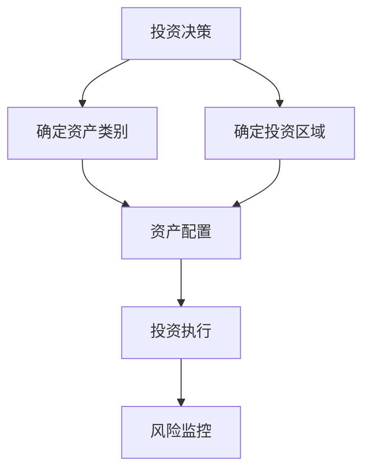
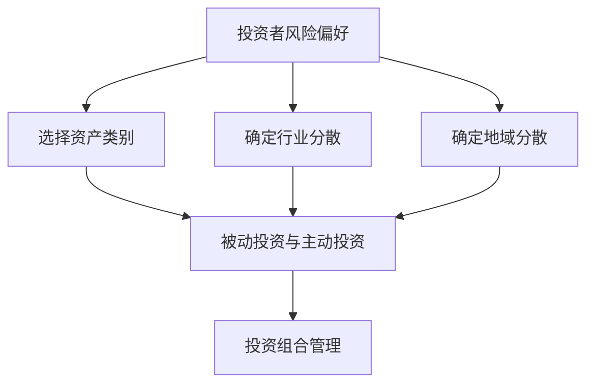
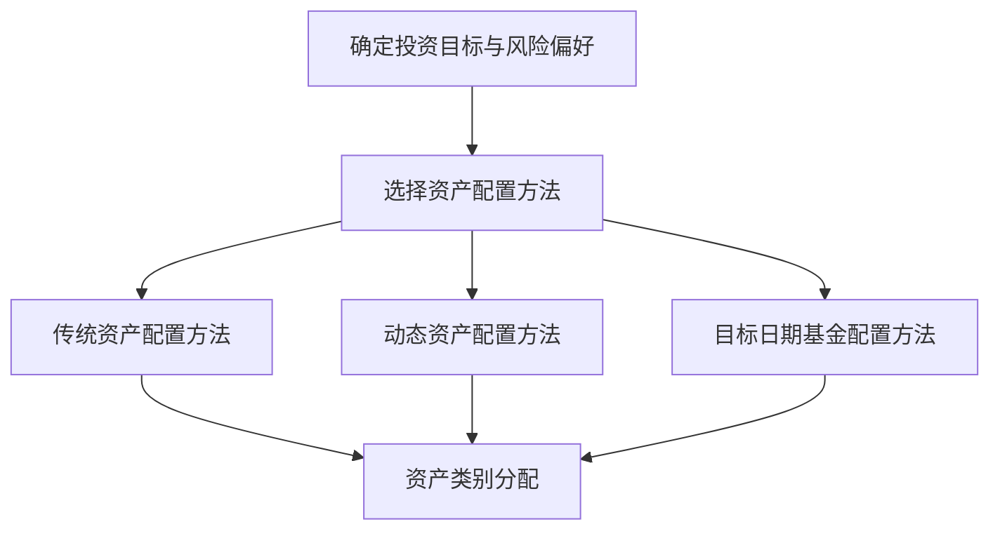
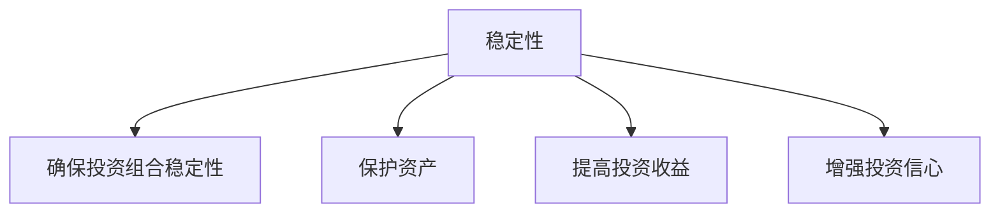
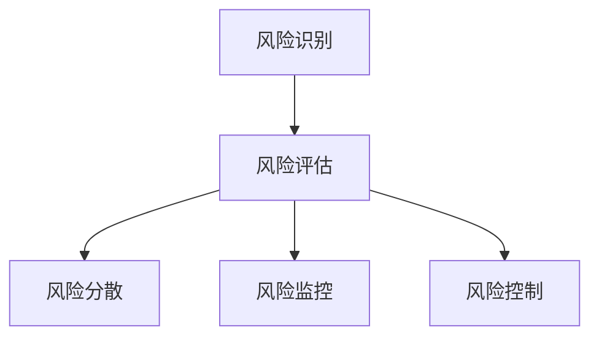
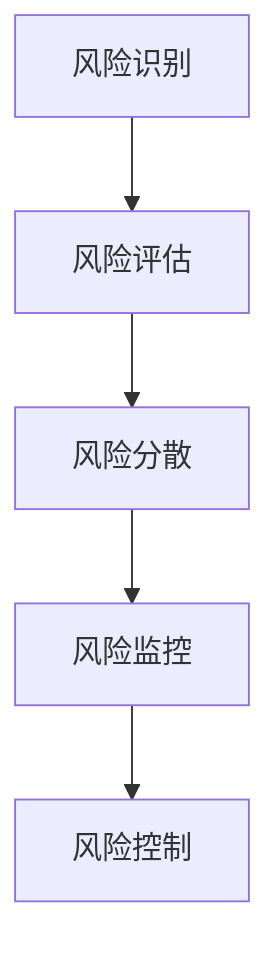
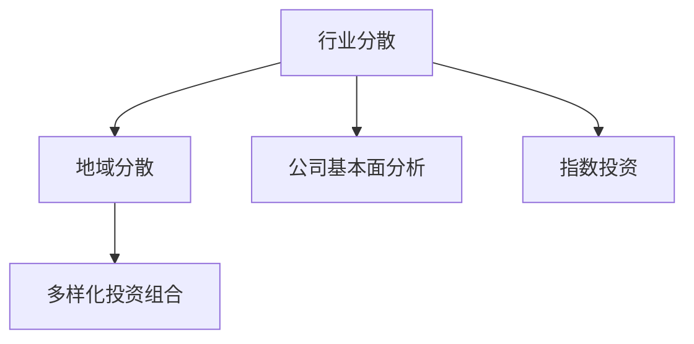
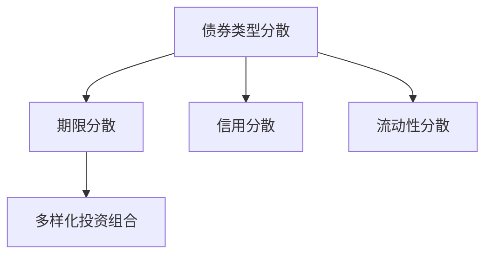
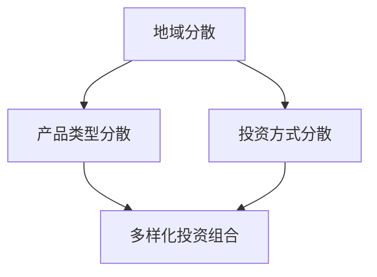
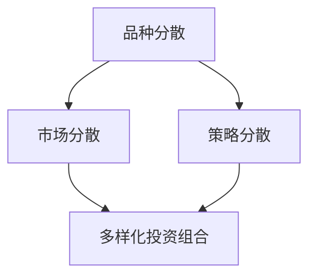

                 

### 格雷厄姆的Group Approach：分散投资的智慧

关键词：格雷厄姆、分散投资、Group Approach、风险控制、投资策略

摘要：本文旨在深入探讨格雷厄姆的Group Approach，这是一种基于分散投资的智慧方法，旨在通过合理配置资产类别和多样化投资策略，实现风险最小化和收益最大化。文章首先介绍了分散投资的必要性及其核心概念，随后详细解析了格雷厄姆的投资哲学和Group Approach的基本原理，接着讨论了分散投资的理论基础，包括分散投资策略、资产配置方法和风险管理。最后，文章通过实际案例展示了分散投资在不同市场中的应用，并总结了分散投资的未来发展趋势与挑战。

### 目录大纲设计

#### 第一部分：前言

- 第1章：问题背景与核心概念
- 第2章：核心概念原理

#### 第二部分：分散投资的理论基础

- 第3章：分散投资策略概述
- 第4章：资产配置方法
- 第5章：风险管理与控制

#### 第三部分：分散投资的实践应用

- 第6章：股票市场分散投资
- 第7章：债券市场分散投资
- 第8章：房地产投资分散策略
- 第9章：衍生品市场分散投资

#### 第四部分：总结与展望

- 第10章：分散投资的总结
- 第11章：未来发展趋势与挑战

### 第一部分：前言

#### 第1章：问题背景与核心概念

1.1 投资风险的来源  
1.2 分散投资的必要性  
1.3 格雷厄姆的投资理念  
1.4 Group Approach的基本原理  
1.5 分散投资的策略与方法

#### 第2章：核心概念原理

2.1 格雷厄姆的投资哲学  
2.1.1 安全边际的概念  
2.1.2 股票投资的本质  
2.1.3 投资与投机的区别  
2.2 Group Approach的原理  
2.2.1 Group Approach的概念  
2.2.2 Group Approach的优势  
2.2.3 Group Approach的实施方法

### 第二部分：分散投资的理论基础

#### 第3章：分散投资策略概述

3.1 分散投资的基本原则  
3.2 分散投资的策略选择

#### 第4章：资产配置方法

4.1 资产配置的原则  
4.2 资产配置的具体方法

#### 第5章：风险管理与控制

5.1 风险管理的意义  
5.2 风险管理的方法

### 第三部分：分散投资的实践应用

#### 第6章：股票市场分散投资

6.1 股票市场的基本特征  
6.2 股票市场分散投资的策略

#### 第7章：债券市场分散投资

7.1 债券市场的基本特征  
7.2 债券市场分散投资的策略

#### 第8章：房地产投资分散策略

8.1 房地产投资的基本特征  
8.2 房地产投资分散策略

#### 第9章：衍生品市场分散投资

9.1 衍生品市场的基本特征  
9.2 衍生品市场分散投资的策略

### 第四部分：总结与展望

#### 第10章：分散投资的总结

10.1 分散投资的优点  
10.2 分散投资的局限

#### 第11章：未来发展趋势与挑战

11.1 未来发展趋势  
11.2 面临的挑战

### 第一部分：前言

#### 第1章：问题背景与核心概念

随着金融市场的发展，投资风险日益增加，投资者需要采取有效的风险控制策略来保护自己的资产。分散投资作为一种常见的风险控制方法，逐渐被广大投资者所接受。然而，如何有效地实施分散投资策略，实现风险的最小化和收益的最大化，仍是一个值得探讨的问题。

本文将围绕这一主题，深入探讨格雷厄姆的Group Approach，这是一种基于分散投资的智慧方法。通过合理配置资产类别和多样化投资策略，Group Approach旨在实现投资风险的最小化和收益的最大化。本文将首先介绍分散投资的必要性及其核心概念，然后详细解析格雷厄姆的投资哲学和Group Approach的基本原理，接着讨论分散投资的理论基础，包括分散投资策略、资产配置方法和风险管理。最后，本文将结合实际案例，展示分散投资在不同市场中的应用，并总结分散投资的优点和局限，探讨其未来发展趋势与挑战。

### 第一部分：前言

#### 第1章：问题背景与核心概念

#### 1.1 投资风险的来源

在投资领域，风险是投资者无法回避的问题。投资风险可以分为系统风险和非系统风险两种类型。系统风险是指整个市场或经济系统所面临的风险，如宏观经济波动、政策变化等，这种风险对市场上所有资产都有影响。非系统风险则是指特定行业或公司所面临的风险，如行业竞争加剧、公司财务状况恶化等，这种风险只对特定资产产生影响。

投资风险的主要来源包括以下几个方面：

1. **宏观经济因素**：如经济增长率、通货膨胀率、利率变化、货币政策等。
2. **市场波动**：如股市、汇市、债市等市场的波动，可能导致投资价值的波动。
3. **公司经营风险**：如公司经营不善、产品销售不佳、管理层决策失误等。
4. **政策风险**：如政府政策变动、行业监管加强等，可能对特定行业或公司产生不利影响。
5. **流动性风险**：如市场流动性不足，可能导致投资者无法及时买入或卖出资产。

#### 1.2 分散投资的必要性

面对投资风险，分散投资成为了一种有效的风险管理策略。分散投资的核心思想是通过投资多种不同资产类别和不同风险收益特征的资产，来降低投资组合的整体风险。具体来说，分散投资的必要性体现在以下几个方面：

1. **降低系统风险**：通过投资多种资产类别，如股票、债券、房地产等，可以降低整个投资组合对系统风险的敏感度。即使某一资产类别出现大幅波动，其他资产类别的表现可能相对稳定，从而分散风险。
2. **减少非系统风险**：分散投资可以减少特定行业或公司所面临的风险。通过投资不同行业和不同公司的资产，可以将单一行业的风险分散到多个行业，降低投资组合的整体风险。
3. **实现收益最大化**：分散投资不仅有助于降低风险，还可以通过多样化投资组合，实现不同资产类别的收益互补，从而最大化整体收益。

#### 1.3 格雷厄姆的投资理念

本杰明·格雷厄姆（Benjamin Graham）被誉为“现代投资组合理论的奠基人”，他的投资理念对分散投资的发展产生了深远影响。格雷厄姆的投资理念主要包括以下几个方面：

1. **价值投资**：格雷厄姆认为，投资应基于对公司价值的评估，而不是市场情绪或短期价格波动。投资者应寻找那些市场价格低于其内在价值的股票进行投资。
2. **安全边际**：格雷厄姆提出了“安全边际”这一概念，即投资时应确保股票的市场价格与其内在价值之间存在一定的差距。这样，即使市场出现不利变动，投资者仍有足够的安全垫来保护投资。
3. **投资与投机的区别**：格雷厄姆认为，投资应基于理性分析和长期视角，而投机则更多依赖于市场情绪和短期价格波动。投资者应追求长期稳定的收益，而不是追求短期的高收益。

#### 1.4 Group Approach的基本原理

Group Approach是格雷厄姆分散投资理念的具体实践方法，其基本原理可以概括为以下几点：

1. **资产类别分散**：Group Approach强调投资多种不同资产类别，如股票、债券、房地产等，以实现风险的分散。不同资产类别的收益和风险特征不同，通过多样化投资可以降低整体风险。
2. **区域分散**：Group Approach还提倡在不同地区进行投资，以分散地域风险。不同地区的经济环境和市场状况不同，通过跨区域投资可以降低单一地区经济波动对投资组合的影响。
3. **时间分散**：Group Approach认为，投资者应采取长期投资策略，通过时间分散来降低市场波动的影响。长期投资可以减少短期市场波动对投资决策的干扰，从而实现稳定的收益。

#### 1.5 分散投资的策略与方法

分散投资的策略和方法多种多样，以下是几种常见的分散投资策略：

1. **资产配置**：资产配置是指将投资资金分配到不同资产类别中的过程。通过合理分配资产类别，可以实现投资组合的风险和收益特征与投资者的风险偏好相匹配。
2. **指数基金**：指数基金是一种被动投资策略，通过跟踪特定指数的表现，实现分散投资。指数基金的管理费用较低，适合长期投资者。
3. **行业分散**：行业分散是指投资多个不同行业，以实现风险的分散。通过投资不同行业，可以降低单一行业风险对投资组合的影响。
4. **地域分散**：地域分散是指投资不同地区的资产，以实现风险的分散。通过投资不同地区的资产，可以降低单一地区经济波动对投资组合的影响。

#### 1.6 结论

分散投资作为一种有效的风险管理策略，在投资领域具有广泛的应用。通过合理配置资产类别、区域分散和时间分散，投资者可以降低投资组合的整体风险，实现收益的最大化。本文介绍了分散投资的必要性、核心概念、格雷厄姆的投资理念、Group Approach的基本原理以及分散投资的策略与方法，为投资者提供了有益的参考。

### 第一部分：前言

#### 第2章：核心概念原理

#### 2.1 格雷厄姆的投资哲学

本杰明·格雷厄姆（Benjamin Graham）的投资哲学被称为“价值投资”，其核心思想是寻找市场价格低于其内在价值的股票进行投资，从而获得稳定的长期收益。格雷厄姆的投资哲学包括以下几个关键概念：

##### 2.1.1 安全边际

安全边际是格雷厄姆投资哲学中的核心概念之一，指的是投资者支付的价格与其评估的股票内在价值之间的差额。通过确保市场价格低于内在价值，投资者为可能的错误判断和不可预测的市场波动留出了空间，从而降低了投资风险。

**安全边际的数学表达**：

$$
安全边际 = 内在价值 - 股票价格
$$

例如，如果某股票的内在价值估计为50美元，而市场价格仅为40美元，则存在10美元的安全边际。

##### 2.1.2 股票投资的本质

格雷厄姆认为，股票投资是一种购买公司部分所有权的行为，投资者应关注公司的基本面，如盈利能力、财务状况、管理层质量等。而非仅仅基于市场情绪或短期价格波动做出投资决策。

**股票投资的本质**：

股票投资的核心在于对公司的长期价值判断，而非短期的市场波动。投资者应通过深入分析公司的基本面，来判断其股票是否具有投资价值。

##### 2.1.3 投资与投机的区别

格雷厄姆将投资与投机进行了明确的区分。他认为，投资是一种基于理性分析和长期视角的行为，而投机则更多依赖于市场情绪和短期价格波动。

**投资与投机的区别**：

- **投资**：基于公司价值分析和长期视角，追求稳定的长期收益。
- **投机**：依赖于市场情绪和短期价格波动，追求高风险高收益。

**表 1：投资与投机的属性特征对比**

| 特征          | 投资者视角 | 投机者视角 |
| ------------- | ----------- | ----------- |
| 时间框架      | 长期        | 短期        |
| 目标          | 稳定的长期收益 | 高收益      |
| 分析方法      | 基本面分析   | 技术分析     |
| 风险承受能力  | 较低        | 较高        |

##### 2.2 Group Approach 的原理

Group Approach 是格雷厄姆投资哲学的具体应用，其核心原理是通过投资多个不同资产类别和地域的资产，实现风险分散和收益最大化。

**Group Approach 的基本原理**：

1. **资产类别分散**：通过投资不同风险收益特征的资产类别，如股票、债券、房地产等，实现风险的分散。
2. **区域分散**：通过投资不同地区的资产，降低单一地区经济波动对投资组合的影响。
3. **时间分散**：通过长期投资，降低市场波动对投资决策的干扰。

**ER 实体关系图架构**：

以下是 Group Approach 的 ER 实体关系图架构，用于描述不同资产类别和区域之间的关系。

```mermaid
erDiagram
  Asset_Category ||--|{ Asset } : "包含"
  Region ||--|{ Asset } : "位于"
```

在上述 ER 图中，`Asset_Category` 表示资产类别，包括股票、债券、房地产等；`Region` 表示投资区域，包括国内、国外等；`Asset` 表示具体资产，每个资产属于一个资产类别，并位于一个特定区域。

**Mermaid 流程图**：

以下是 Group Approach 的 Mermaid 流程图，展示了如何通过资产类别分散和区域分散来降低投资风险。



**Python 源代码示例**：

以下是一个简化的 Python 源代码示例，用于模拟 Group Approach 的资产配置过程。

```python
import random

# 定义资产类别和区域
asset_categories = ['股票', '债券', '房地产']
regions = ['国内', '国外']

# 初始化投资组合
investment_portfolio = []

# 资产配置
for category in asset_categories:
    for region in regions:
        investment = {'类别': category, '区域': region, '比例': random.uniform(0, 1)}
        investment_portfolio.append(investment)

# 打印投资组合
for investment in investment_portfolio:
    print(investment)
```

**算法原理讲解**：

Group Approach 的核心在于通过资产类别分散和区域分散来降低投资风险。具体来说，资产类别分散通过投资不同风险收益特征的资产，如股票、债券、房地产等，实现风险的分散。区域分散则通过投资不同地区的资产，降低单一地区经济波动对投资组合的影响。

数学模型方面，Group Approach 可以通过投资组合的方差来衡量风险。设投资组合中第 i 个资产的预期收益为 \(E(R_i)\)，方差为 \(Var(R_i)\)，则投资组合的总方差为：

$$
Var(P) = \sum_{i=1}^{n} w_i^2 Var(R_i) + 2 \sum_{i=1}^{n} \sum_{j=i+1}^{n} w_i w_j Cov(R_i, R_j)
$$

其中，\(w_i\) 为第 i 个资产的投资比例，\(Cov(R_i, R_j)\) 为第 i 个资产和第 j 个资产之间的协方差。

通过优化投资比例，可以降低投资组合的总方差，从而实现风险的最小化。

**数学模型和公式详细讲解**：

1. **预期收益**：

预期收益是指资产在未来可能获得的平均收益。设第 i 个资产的预期收益为 \(E(R_i)\)，则整个投资组合的预期收益为：

$$
E(R) = \sum_{i=1}^{n} w_i E(R_i)
$$

其中，\(w_i\) 为第 i 个资产的投资比例。

2. **方差**：

方差是衡量资产收益波动性的指标。设第 i 个资产的方差为 \(Var(R_i)\)，则整个投资组合的方差为：

$$
Var(P) = \sum_{i=1}^{n} w_i^2 Var(R_i) + 2 \sum_{i=1}^{n} \sum_{j=i+1}^{n} w_i w_j Cov(R_i, R_j)
$$

其中，\(w_i\) 为第 i 个资产的投资比例，\(Cov(R_i, R_j)\) 为第 i 个资产和第 j 个资产之间的协方差。

3. **协方差**：

协方差衡量两个资产收益之间的相关性。设第 i 个资产和第 j 个资产的协方差为 \(Cov(R_i, R_j)\)，则协方差的计算公式为：

$$
Cov(R_i, R_j) = \frac{1}{n-1} \sum_{t=1}^{n} (R_{it} - \bar{R_i})(R_{jt} - \bar{R_j})
$$

其中，\(R_{it}\) 和 \(R_{jt}\) 分别为第 i 个资产和第 j 个资产在时间 t 的收益，\(\bar{R_i}\) 和 \(\bar{R_j}\) 分别为第 i 个资产和第 j 个资产的平均收益。

**通俗易懂地举例说明**：

假设投资者计划投资一个由三种资产组成的投资组合，这三种资产分别是股票、债券和房地产。股票的预期收益为 10%，方差为 20%；债券的预期收益为 5%，方差为 5%；房地产的预期收益为 7%，方差为 10%。

投资者决定将投资组合的 40% 分配给股票，30% 分配给债券，30% 分配给房地产。

根据上述资产配置，投资组合的预期收益为：

$$
E(R) = 0.4 \times 10\% + 0.3 \times 5\% + 0.3 \times 7\% = 6.6\%
$$

投资组合的方差为：

$$
Var(P) = 0.4^2 \times 20\% + 0.3^2 \times 5\% + 0.3^2 \times 10\% + 2 \times (0.4 \times 0.3 \times Cov(股票，债券) + 0.4 \times 0.3 \times Cov(股票，房地产) + 0.3 \times 0.3 \times Cov(债券，房地产))
$$

通过计算协方差，投资者可以进一步优化资产配置，以降低投资组合的总方差。

**总结**：

Group Approach 是一种基于分散投资的智慧方法，通过资产类别分散和区域分散，实现风险分散和收益最大化。本文详细讲解了 Group Approach 的核心原理、数学模型和实际应用，为投资者提供了有益的参考。

### 第二部分：分散投资的理论基础

#### 第3章：分散投资策略概述

分散投资是一种通过将资金分配到多种不同的资产类别中，以降低整体投资组合风险的投资策略。其核心理念是通过多样化投资来减少特定资产或市场波动对投资组合的影响，从而达到风险的最小化和收益的最大化。本章节将概述分散投资的基本原则和策略选择。

##### 3.1 分散投资的基本原则

分散投资遵循以下几个基本原则：

1. **资产类别多样化**：投资多种不同类型的资产，如股票、债券、房地产、商品等，可以降低系统性风险。
2. **行业分散**：投资不同行业的公司，可以降低特定行业波动对投资组合的影响。
3. **地域分散**：投资不同国家和地区的资产，可以降低单一地区经济波动对投资组合的影响。
4. **时间分散**：通过长期持有，减少短期市场波动对投资组合的影响。

**表 2：分散投资的基本原则**

| 原则                | 说明                                                         |
| ------------------- | ------------------------------------------------------------ |
| 资产类别多样化      | 投资多种不同风险收益特征的资产，如股票、债券、房地产等。       |
| 行业分散            | 投资不同行业的公司，避免过度依赖单一行业。                   |
| 地域分散            | 投资不同国家和地区的资产，分散地域风险。                     |
| 时间分散            | 长期持有，减少市场波动对投资决策的干扰。                     |

##### 3.2 分散投资的策略选择

分散投资的策略选择取决于投资者的风险偏好、投资目标和市场环境。以下是几种常见的分散投资策略：

1. **低成本指数基金策略**：
   - 通过投资跟踪市场指数的指数基金，实现被动分散投资。
   - 优点：管理费用低，操作简便。
   - 缺点：无法实现主动管理，可能无法最大化收益。

2. **被动投资与主动投资的选择**：
   - 被动投资：通过购买并持有资产，实现长期收益。
   - 主动投资：通过市场分析和股票挑选，实现超越市场的收益。
   - 根据投资者的能力、时间和风险偏好进行选择。

3. **分散投资组合的管理**：
   - 定期调整投资组合，保持资产配置的平衡。
   - 根据市场变化，动态调整资产配置。

**图 1：分散投资策略选择流程图**



**Mermaid 流程图**：

以下是分散投资策略选择的 Mermaid 流程图，展示了不同策略之间的关系和决策流程。


**Python 源代码示例**：

以下是一个简化的 Python 源代码示例，用于模拟分散投资策略的选择过程。

```python
import random

# 定义资产类别和比例
asset_categories = ['股票', '债券', '房地产']
stock_ratio = random.uniform(0.2, 0.6)
bond_ratio = random.uniform(0.2, 0.6)
real_estate_ratio = 1 - stock_ratio - bond_ratio

# 定义行业和地域分散策略
industry分散 = random.choice(['分散', '集中'])
region分散 = random.choice(['分散', '集中'])

# 定义投资组合
investment_portfolio = {
    '股票': stock_ratio,
    '债券': bond_ratio,
    '房地产': real_estate_ratio,
    '行业分散': industry分散,
    '地域分散': region分散
}

# 打印投资组合
print(investment_portfolio)
```

**算法原理讲解**：

分散投资策略的选择基于投资者的风险偏好和投资目标。通过资产类别多样化、行业分散和地域分散，可以实现投资组合的风险分散。在具体操作中，投资者需要根据市场环境和自身能力，选择合适的投资策略。

数学模型方面，分散投资策略可以通过投资组合的预期收益和方差来衡量。设投资组合中第 i 个资产的预期收益为 \(E(R_i)\)，方差为 \(Var(R_i)\)，则投资组合的预期收益和方差分别为：

$$
E(R) = \sum_{i=1}^{n} w_i E(R_i)
$$

$$
Var(P) = \sum_{i=1}^{n} w_i^2 Var(R_i) + 2 \sum_{i=1}^{n} \sum_{j=i+1}^{n} w_i w_j Cov(R_i, R_j)
$$

其中，\(w_i\) 为第 i 个资产的投资比例，\(Cov(R_i, R_j)\) 为第 i 个资产和第 j 个资产之间的协方差。

通过优化投资比例，投资者可以降低投资组合的总方差，实现风险的最小化。

**数学模型和公式详细讲解**：

1. **预期收益**：

预期收益是指资产在未来可能获得的平均收益。设第 i 个资产的预期收益为 \(E(R_i)\)，则整个投资组合的预期收益为：

$$
E(R) = \sum_{i=1}^{n} w_i E(R_i)
$$

其中，\(w_i\) 为第 i 个资产的投资比例。

2. **方差**：

方差是衡量资产收益波动性的指标。设第 i 个资产的方差为 \(Var(R_i)\)，则整个投资组合的方差为：

$$
Var(P) = \sum_{i=1}^{n} w_i^2 Var(R_i) + 2 \sum_{i=1}^{n} \sum_{j=i+1}^{n} w_i w_j Cov(R_i, R_j)
$$

其中，\(w_i\) 为第 i 个资产的投资比例，\(Cov(R_i, R_j)\) 为第 i 个资产和第 j 个资产之间的协方差。

3. **协方差**：

协方差衡量两个资产收益之间的相关性。设第 i 个资产和第 j 个资产的协方差为 \(Cov(R_i, R_j)\)，则协方差的计算公式为：

$$
Cov(R_i, R_j) = \frac{1}{n-1} \sum_{t=1}^{n} (R_{it} - \bar{R_i})(R_{jt} - \bar{R_j})
$$

其中，\(R_{it}\) 和 \(R_{jt}\) 分别为第 i 个资产和第 j 个资产在时间 t 的收益，\(\bar{R_i}\) 和 \(\bar{R_j}\) 分别为第 i 个资产和第 j 个资产的平均收益。

**通俗易懂地举例说明**：

假设投资者计划投资一个由三种资产组成的投资组合，这三种资产分别是股票、债券和房地产。股票的预期收益为 10%，方差为 20%；债券的预期收益为 5%，方差为 5%；房地产的预期收益为 7%，方差为 10%。

投资者决定将投资组合的 40% 分配给股票，30% 分配给债券，30% 分配给房地产。

根据上述资产配置，投资组合的预期收益为：

$$
E(R) = 0.4 \times 10\% + 0.3 \times 5\% + 0.3 \times 7\% = 6.6\%
$$

投资组合的方差为：

$$
Var(P) = 0.4^2 \times 20\% + 0.3^2 \times 5\% + 0.3^2 \times 10\% + 2 \times (0.4 \times 0.3 \times Cov(股票，债券) + 0.4 \times 0.3 \times Cov(股票，房地产) + 0.3 \times 0.3 \times Cov(债券，房地产))
$$

通过计算协方差，投资者可以进一步优化资产配置，以降低投资组合的总方差。

**总结**：

分散投资策略通过资产类别多样化、行业分散和地域分散，实现风险分散和收益最大化。本文详细讲解了分散投资的基本原则和策略选择，为投资者提供了有益的参考。

### 第二部分：分散投资的理论基础

#### 第4章：资产配置方法

资产配置是投资组合管理的重要组成部分，旨在根据投资者的风险偏好和投资目标，将资金合理分配到不同资产类别中。合理的资产配置可以帮助投资者实现风险的最小化和收益的最大化。本章节将探讨资产配置的原则、方法及其在实际操作中的应用。

##### 4.1 资产配置的原则

资产配置遵循以下几个基本原则：

1. **投资目标与风险偏好匹配**：资产配置应与投资者的投资目标和风险偏好相匹配。投资者应根据自身的投资期限、收益预期和风险承受能力，选择适合的资产配置策略。
2. **资产类别的多样化**：通过投资多种不同类型的资产，如股票、债券、房地产等，可以降低整体投资组合的风险。
3. **定期调整**：市场环境和经济状况不断变化，投资者需要定期评估和调整资产配置，以保持投资组合的平衡和适应市场的变化。
4. **成本控制**：资产配置过程中应尽量控制交易成本和管理费用，以提高投资组合的收益率。

**表 3：资产配置的基本原则**

| 原则                  | 说明                                                         |
| --------------------- | ------------------------------------------------------------ |
| 投资目标与风险偏好匹配 | 资产配置应与投资者的投资目标和风险偏好相匹配。               |
| 资产类别的多样化      | 投资多种不同类型的资产，降低整体投资组合的风险。           |
| 定期调整              | 定期评估和调整资产配置，以适应市场变化。                   |
| 成本控制              | 控制交易成本和管理费用，提高投资组合的收益率。             |

##### 4.2 资产配置的具体方法

资产配置的具体方法包括以下几种：

1. **传统资产配置方法**：
   - 根据投资者的风险偏好和投资期限，将资金分配到不同资产类别中。
   - 传统资产配置方法主要包括增长型、平衡型和收入型三种策略。

2. **动态资产配置方法**：
   - 根据市场环境和经济状况的变化，动态调整资产配置。
   - 动态资产配置方法通常包括战术性资产配置和战略性资产配置。

3. **目标日期基金配置方法**：
   - 根据投资者的退休日期，自动调整资产配置。
   - 目标日期基金配置方法适用于长期投资者，特别是退休规划。

**图 2：资产配置方法流程图**



**Mermaid 流程图**：

以下是资产配置方法的 Mermaid 流程图，展示了不同资产配置方法的选择和实施过程。


**Python 源代码示例**：

以下是一个简化的 Python 源代码示例，用于模拟资产配置方法的选择和实施过程。

```python
import random

# 定义投资者风险偏好和投资期限
investment_target = "长期增长"
risk_preference = "中等风险"

# 定义资产配置方法
asset_allocation_methods = ["传统资产配置", "动态资产配置", "目标日期基金配置"]

# 选择资产配置方法
selected_method = random.choice(asset_allocation_methods)

# 根据方法分配资产类别
if selected_method == "传统资产配置":
    stock_ratio = 0.6
    bond_ratio = 0.3
    real_estate_ratio = 0.1
elif selected_method == "动态资产配置":
    stock_ratio = random.uniform(0.4, 0.8)
    bond_ratio = random.uniform(0.1, 0.4)
    real_estate_ratio = 1 - stock_ratio - bond_ratio
elif selected_method == "目标日期基金配置":
    years_to_retirement = random.randint(20, 40)
    stock_ratio = 1 - (years_to_retirement / 40)
    bond_ratio = 0.5 * (years_to_retirement / 40)
    real_estate_ratio = 1 - stock_ratio - bond_ratio

# 打印资产配置结果
print(f"资产配置方法：{selected_method}")
print(f"股票比例：{stock_ratio}")
print(f"债券比例：{bond_ratio}")
print(f"房地产比例：{real_estate_ratio}")
```

**算法原理讲解**：

资产配置的核心在于根据投资者的风险偏好和投资目标，合理分配资金到不同资产类别中。通过资产配置，投资者可以实现投资组合的风险分散和收益最大化。

数学模型方面，资产配置可以通过预期收益和方差来衡量。设投资组合中第 i 个资产的预期收益为 \(E(R_i)\)，方差为 \(Var(R_i)\)，则投资组合的预期收益和方差分别为：

$$
E(R) = \sum_{i=1}^{n} w_i E(R_i)
$$

$$
Var(P) = \sum_{i=1}^{n} w_i^2 Var(R_i) + 2 \sum_{i=1}^{n} \sum_{j=i+1}^{n} w_i w_j Cov(R_i, R_j)
$$

其中，\(w_i\) 为第 i 个资产的投资比例，\(Cov(R_i, R_j)\) 为第 i 个资产和第 j 个资产之间的协方差。

通过优化投资比例，投资者可以降低投资组合的总方差，实现风险的最小化。

**数学模型和公式详细讲解**：

1. **预期收益**：

预期收益是指资产在未来可能获得的平均收益。设第 i 个资产的预期收益为 \(E(R_i)\)，则整个投资组合的预期收益为：

$$
E(R) = \sum_{i=1}^{n} w_i E(R_i)
$$

其中，\(w_i\) 为第 i 个资产的投资比例。

2. **方差**：

方差是衡量资产收益波动性的指标。设第 i 个资产的方差为 \(Var(R_i)\)，则整个投资组合的方差为：

$$
Var(P) = \sum_{i=1}^{n} w_i^2 Var(R_i) + 2 \sum_{i=1}^{n} \sum_{j=i+1}^{n} w_i w_j Cov(R_i, R_j)
$$

其中，\(w_i\) 为第 i 个资产的投资比例，\(Cov(R_i, R_j)\) 为第 i 个资产和第 j 个资产之间的协方差。

3. **协方差**：

协方差衡量两个资产收益之间的相关性。设第 i 个资产和第 j 个资产的协方差为 \(Cov(R_i, R_j)\)，则协方差的计算公式为：

$$
Cov(R_i, R_j) = \frac{1}{n-1} \sum_{t=1}^{n} (R_{it} - \bar{R_i})(R_{jt} - \bar{R_j})
$$

其中，\(R_{it}\) 和 \(R_{jt}\) 分别为第 i 个资产和第 j 个资产在时间 t 的收益，\(\bar{R_i}\) 和 \(\bar{R_j}\) 分别为第 i 个资产和第 j 个资产的平均收益。

**通俗易懂地举例说明**：

假设投资者计划投资一个由三种资产组成的投资组合，这三种资产分别是股票、债券和房地产。股票的预期收益为 10%，方差为 20%；债券的预期收益为 5%，方差为 5%；房地产的预期收益为 7%，方差为 10%。

投资者决定将投资组合的 60% 分配给股票，30% 分配给债券，10% 分配给房地产。

根据上述资产配置，投资组合的预期收益为：

$$
E(R) = 0.6 \times 10\% + 0.3 \times 5\% + 0.1 \times 7\% = 7.2\%
$$

投资组合的方差为：

$$
Var(P) = 0.6^2 \times 20\% + 0.3^2 \times 5\% + 0.1^2 \times 10\% + 2 \times (0.6 \times 0.3 \times Cov(股票，债券) + 0.6 \times 0.1 \times Cov(股票，房地产) + 0.3 \times 0.1 \times Cov(债券，房地产))
$$

通过计算协方差，投资者可以进一步优化资产配置，以降低投资组合的总方差。

**总结**：

资产配置是投资组合管理的重要组成部分，通过合理分配资金到不同资产类别中，实现风险分散和收益最大化。本文详细介绍了资产配置的原则、方法及其在实际操作中的应用，为投资者提供了有益的参考。

### 第二部分：分散投资的理论基础

#### 第5章：风险管理与控制

风险管理与控制是投资过程中至关重要的一环，旨在通过有效识别、评估、分散和监控风险，确保投资组合的稳定性和收益性。合理的风险管理策略可以帮助投资者在面对市场波动时，保持冷静和理性，从而实现长期的投资目标。

##### 5.1 风险管理的意义

风险管理的意义主要体现在以下几个方面：

1. **确保投资组合的稳定性**：通过有效的风险管理，可以降低投资组合的波动性，确保投资目标的实现。
2. **保护投资者的资产**：在市场波动期间，通过风险管理策略，可以最大限度地减少投资损失，保护投资者的资产。
3. **提高投资收益**：合理的风险管理可以降低投资组合的风险，从而为投资者创造更高的收益。
4. **增强投资信心**：通过风险管理，投资者可以更好地理解投资风险，增强投资信心，长期坚持投资策略。

**图 3：风险管理的意义**



##### 5.2 风险管理的目标

风险管理的目标可以分为以下几个方面：

1. **风险识别**：识别投资过程中可能遇到的各种风险，如市场风险、信用风险、操作风险等。
2. **风险评估**：评估各种风险的潜在影响和发生的可能性，以便制定相应的风险管理策略。
3. **风险分散**：通过投资组合的多样化，降低单一风险对投资组合的影响。
4. **风险监控**：实时监控投资组合的风险状况，及时发现并应对潜在风险。
5. **风险控制**：制定和实施风险控制措施，确保投资组合的风险在可接受范围内。

**图 4：风险管理的目标**



##### 5.3 风险管理的原则

风险管理遵循以下原则：

1. **全面性**：风险管理应覆盖投资组合的各个层面，包括资产类别、行业、地域等。
2. **系统性**：风险管理应具有系统性，通过多层次、多角度的评估和监控，确保投资组合的整体风险控制。
3. **实时性**：风险管理应具有实时性，及时发现和应对风险变化。
4. **成本效益**：风险管理的成本应与预期收益相匹配，确保风险管理的有效性。
5. **灵活性**：风险管理策略应具有灵活性，以应对市场环境和投资目标的变动。

**表 4：风险管理的原则**

| 原则     | 说明                                           |
| -------- | ---------------------------------------------- |
| 全面性   | 风险管理应覆盖投资组合的各个层面。             |
| 系统性   | 风险管理应具有系统性，通过多层次评估和监控。   |
| 实时性   | 风险管理应具有实时性，及时识别和应对风险。     |
| 成本效益 | 风险管理的成本应与预期收益相匹配。             |
| 灵活性   | 风险管理策略应具有灵活性，以应对市场变动。     |

##### 5.4 风险管理的方法

风险管理的方法包括以下几种：

1. **风险识别**：
   - 通过历史数据分析和市场趋势预测，识别投资组合中的潜在风险。
   - 采用问卷调查、访谈、头脑风暴等方法，收集风险信息。

2. **风险评估**：
   - 使用定性分析和定量分析相结合的方法，评估各种风险的潜在影响和发生的可能性。
   - 定量分析包括方差分析、回归分析等，定性分析包括专家评估、情景分析等。

3. **风险分散**：
   - 通过投资组合的多样化，降低单一风险对投资组合的影响。
   - 采用资产类别分散、行业分散、地域分散等方法。

4. **风险监控**：
   - 建立风险监控机制，实时监控投资组合的风险状况。
   - 采用风险指标、风险管理报告等工具，及时识别和应对风险。

5. **风险控制**：
   - 制定和实施风险控制措施，确保投资组合的风险在可接受范围内。
   - 采用风险限额、止损策略、风险规避等措施。

**图 5：风险管理的方法**



**Mermaid 流程图**：

以下是风险管理方法的 Mermaid 流程图，展示了风险管理的过程和步骤。


**Python 源代码示例**：

以下是一个简化的 Python 源代码示例，用于模拟风险管理的部分过程。

```python
import random

# 定义资产类别和风险水平
assets = ['股票', '债券', '房地产']
risks = [0.2, 0.1, 0.15]

# 风险识别
identified_risks = random.choices(assets, weights=risks, k=3)

# 风险评估
risk_scores = [random.uniform(0.1, 0.5) for _ in identified_risks]

# 风险分散
risk_distributed = [risk * 0.5 for risk in risk_scores]

# 风险监控
risk_monitoring = [random.choice(['高', '中', '低']) for risk in risk_distributed]

# 风险控制
risk_control_measures = [random.choice(['止损', '对冲', '规避']) for risk in risk_monitoring]

# 打印风险管理结果
for i, risk in enumerate(identified_risks):
    print(f"资产：{risk}，风险水平：{risk_scores[i]}，分散后：{risk_distributed[i]}，监控：{risk_monitoring[i]}，控制措施：{risk_control_measures[i]}")
```

**算法原理讲解**：

风险管理方法的核心在于通过识别、评估、分散和监控风险，确保投资组合的稳定性和收益性。在具体操作中，投资者需要根据市场环境和投资目标，选择合适的风险管理方法。

数学模型方面，风险管理可以通过预期损失和风险价值（VaR）来衡量。设第 i 个资产的预期损失为 \(E(L_i)\)，风险价值为 \(VaR_i\)，则投资组合的预期损失和风险价值分别为：

$$
E(L) = \sum_{i=1}^{n} E(L_i)
$$

$$
VaR(P) = \sum_{i=1}^{n} w_i VaR_i
$$

其中，\(w_i\) 为第 i 个资产的投资比例。

通过优化投资比例，投资者可以降低投资组合的总预期损失和风险价值，实现风险的最小化。

**数学模型和公式详细讲解**：

1. **预期损失**：

预期损失是指资产在未来可能发生的平均损失。设第 i 个资产的预期损失为 \(E(L_i)\)，则整个投资组合的预期损失为：

$$
E(L) = \sum_{i=1}^{n} w_i E(L_i)
$$

其中，\(w_i\) 为第 i 个资产的投资比例。

2. **风险价值（VaR）**：

风险价值（Value at Risk，VaR）是指在一定置信水平下，资产在未来特定时间段内可能发生的最大损失。设第 i 个资产的风险价值为 \(VaR_i\)，则整个投资组合的风险价值为：

$$
VaR(P) = \sum_{i=1}^{n} w_i VaR_i
$$

其中，\(w_i\) 为第 i 个资产的投资比例。

3. **置信水平**：

置信水平是指风险价值发生的概率。通常情况下，置信水平选择 95% 或 99%。

**通俗易懂地举例说明**：

假设投资者计划投资一个由三种资产组成的投资组合，这三种资产分别是股票、债券和房地产。股票的预期损失为 10%，风险价值为 20%；债券的预期损失为 5%，风险价值为 10%；房地产的预期损失为 7%，风险价值为 15%。

投资者决定将投资组合的 50% 分配给股票，30% 分配给债券，20% 分配给房地产。

根据上述资产配置，投资组合的预期损失为：

$$
E(L) = 0.5 \times 10\% + 0.3 \times 5\% + 0.2 \times 7\% = 6.3\%
$$

投资组合的风险价值为：

$$
VaR(P) = 0.5 \times 20\% + 0.3 \times 10\% + 0.2 \times 15\% = 10.5\%
$$

通过计算预期损失和风险价值，投资者可以评估投资组合的风险水平，并采取相应的风险管理措施。

**总结**：

风险管理是投资过程中至关重要的一环，通过有效识别、评估、分散和监控风险，投资者可以确保投资组合的稳定性和收益性。本文详细介绍了风险管理的意义、目标、原则、方法和实际应用，为投资者提供了有益的参考。

### 第三部分：分散投资的实践应用

#### 第6章：股票市场分散投资

股票市场是分散投资的一个重要领域，通过合理分散投资股票，投资者可以有效降低投资组合的风险，并追求长期稳定的收益。本章节将探讨股票市场分散投资的基本策略和方法。

##### 6.1 股票市场的基本特征

股票市场是指股票交易的市场，主要包括主板市场、创业板市场和新兴市场等。股票市场的基本特征如下：

1. **交易主体多样**：股票市场的交易主体包括个人投资者、机构投资者、上市公司等。
2. **价格波动大**：股票市场的价格波动受多种因素影响，包括宏观经济、公司业绩、市场情绪等。
3. **高风险高收益**：股票市场具有高风险高收益的特点，投资者需要具备一定的投资知识和风险承受能力。
4. **交易制度完善**：股票市场具有完善的交易制度，包括股票发行、交易、退市等制度。

##### 6.2 股票市场分散投资的策略

股票市场分散投资可以通过以下几种策略实现：

1. **行业分散**：
   - 投资多个不同行业的公司，以降低行业特定风险。
   - 行业分散可以通过投资不同行业指数基金或选择多个行业的股票来实现。

2. **地域分散**：
   - 投资不同地区的公司，以降低地区特定风险。
   - 地域分散可以通过投资不同地区指数基金或选择多个地区的股票来实现。

3. **公司基本面分析**：
   - 投资基本面良好、具有成长潜力的公司，以追求长期稳定的收益。
   - 公司基本面分析包括盈利能力、财务状况、管理层质量等指标。

4. **指数投资**：
   - 投资跟踪市场指数的指数基金，实现被动分散投资。
   - 指数投资具有管理费用低、操作简便等优点。

**图 6：股票市场分散投资策略**



**Mermaid 流�程图**：

以下是股票市场分散投资的 Mermaid 流程图，展示了不同分散投资策略之间的关系和实施过程。


**Python 源代码示例**：

以下是一个简化的 Python 源代码示例，用于模拟股票市场分散投资的过程。

```python
import random

# 定义资产类别和比例
assets = ['股票A', '股票B', '股票C', '指数基金']
stock_a_ratio = random.uniform(0.2, 0.5)
stock_b_ratio = random.uniform(0.2, 0.5)
stock_c_ratio = 1 - stock_a_ratio - stock_b_ratio
index_fund_ratio = random.uniform(0.2, 0.5)

# 打印投资组合
print(f"股票A比例：{stock_a_ratio}")
print(f"股票B比例：{stock_b_ratio}")
print(f"股票C比例：{stock_c_ratio}")
print(f"指数基金比例：{index_fund_ratio}")
```

**算法原理讲解**：

股票市场分散投资的核心是通过多样化投资降低风险，追求长期稳定的收益。投资者可以根据自身的风险偏好和投资目标，选择合适的分散投资策略。

数学模型方面，股票市场分散投资可以通过投资组合的预期收益和方差来衡量。设投资组合中第 i 个资产的预期收益为 \(E(R_i)\)，方差为 \(Var(R_i)\)，则投资组合的预期收益和方差分别为：

$$
E(R) = \sum_{i=1}^{n} w_i E(R_i)
$$

$$
Var(P) = \sum_{i=1}^{n} w_i^2 Var(R_i) + 2 \sum_{i=1}^{n} \sum_{j=i+1}^{n} w_i w_j Cov(R_i, R_j)
$$

其中，\(w_i\) 为第 i 个资产的投资比例，\(Cov(R_i, R_j)\) 为第 i 个资产和第 j 个资产之间的协方差。

通过优化投资比例，投资者可以降低投资组合的总方差，实现风险的最小化。

**数学模型和公式详细讲解**：

1. **预期收益**：

预期收益是指资产在未来可能获得的平均收益。设第 i 个资产的预期收益为 \(E(R_i)\)，则整个投资组合的预期收益为：

$$
E(R) = \sum_{i=1}^{n} w_i E(R_i)
$$

其中，\(w_i\) 为第 i 个资产的投资比例。

2. **方差**：

方差是衡量资产收益波动性的指标。设第 i 个资产的方差为 \(Var(R_i)\)，则整个投资组合的方差为：

$$
Var(P) = \sum_{i=1}^{n} w_i^2 Var(R_i) + 2 \sum_{i=1}^{n} \sum_{j=i+1}^{n} w_i w_j Cov(R_i, R_j)
$$

其中，\(w_i\) 为第 i 个资产的投资比例，\(Cov(R_i, R_j)\) 为第 i 个资产和第 j 个资产之间的协方差。

3. **协方差**：

协方差衡量两个资产收益之间的相关性。设第 i 个资产和第 j 个资产的协方差为 \(Cov(R_i, R_j)\)，则协方差的计算公式为：

$$
Cov(R_i, R_j) = \frac{1}{n-1} \sum_{t=1}^{n} (R_{it} - \bar{R_i})(R_{jt} - \bar{R_j})
$$

其中，\(R_{it}\) 和 \(R_{jt}\) 分别为第 i 个资产和第 j 个资产在时间 t 的收益，\(\bar{R_i}\) 和 \(\bar{R_j}\) 分别为第 i 个资产和第 j 个资产的平均收益。

**通俗易懂地举例说明**：

假设投资者计划投资一个由四种资产组成的投资组合，这四种资产分别是股票A、股票B、股票C和指数基金。股票A的预期收益为 10%，方差为 20%；股票B的预期收益为 8%，方差为 15%；股票C的预期收益为 12%，方差为 25%；指数基金的预期收益为 7%，方差为 10%。

投资者决定将投资组合的 30% 分配给股票A，25% 分配给股票B，20% 分配给股票C，25% 分配给指数基金。

根据上述资产配置，投资组合的预期收益为：

$$
E(R) = 0.3 \times 10\% + 0.25 \times 8\% + 0.2 \times 12\% + 0.25 \times 7\% = 8.65\%
$$

投资组合的方差为：

$$
Var(P) = 0.3^2 \times 20\% + 0.25^2 \times 15\% + 0.2^2 \times 25\% + 0.25^2 \times 10\% + 2 \times (0.3 \times 0.25 \times Cov(股票A，股票B) + 0.3 \times 0.2 \times Cov(股票A，股票C) + 0.25 \times 0.2 \times Cov(股票B，股票C) + 0.3 \times 0.25 \times Cov(股票A，指数基金) + 0.25 \times 0.2 \times Cov(股票B，指数基金) + 0.2 \times 0.25 \times Cov(股票C，指数基金))
$$

通过计算协方差，投资者可以进一步优化资产配置，以降低投资组合的总方差。

**总结**：

股票市场分散投资是降低投资组合风险的有效策略。通过行业分散、地域分散、公司基本面分析和指数投资等策略，投资者可以实现风险分散和收益最大化。本文详细介绍了股票市场分散投资的基本策略和方法，为投资者提供了有益的参考。

### 第三部分：分散投资的实践应用

#### 第7章：债券市场分散投资

债券市场是分散投资的重要组成部分，通过合理分散投资债券，投资者可以有效降低投资组合的风险，并追求稳定的收益。本章节将探讨债券市场分散投资的基本策略和方法。

##### 7.1 债券市场的基本特征

债券市场是指债券交易的市场，主要包括国债市场、企业债市场和地方政府债市场等。债券市场的基本特征如下：

1. **交易主体多样**：债券市场的交易主体包括个人投资者、机构投资者、发行公司等。
2. **利率波动大**：债券市场的利率波动受多种因素影响，包括宏观经济、政策利率、市场供需等。
3. **低风险低收益**：债券市场相对于股票市场而言，风险较低，但收益也相对较低。
4. **交易制度完善**：债券市场具有完善的交易制度，包括债券发行、交易、评级等制度。

##### 7.2 债券市场分散投资的策略

债券市场分散投资可以通过以下几种策略实现：

1. **债券类型分散**：
   - 投资不同类型的债券，如国债、企业债、地方政府债等，以降低单一债券类型的风险。
   - 债券类型分散可以通过投资不同类型的债券基金或选择多个类型的债券来实现。

2. **期限分散**：
   - 投资不同期限的债券，如短期债券、中期债券和长期债券等，以降低利率波动对投资组合的影响。
   - 期限分散可以通过投资不同期限的债券基金或选择多个期限的债券来实现。

3. **信用分散**：
   - 投资不同信用等级的债券，以降低信用风险。
   - 信用分散可以通过投资不同信用等级的债券基金或选择多个信用等级的债券来实现。

4. **流动性分散**：
   - 投资不同流动性的债券，以提高投资组合的流动性。
   - 流动性分散可以通过投资不同流动性的债券基金或选择多个流动性的债券来实现。

**图 7：债券市场分散投资策略**



**Mermaid 流程图**：

以下是债券市场分散投资的 Mermaid 流程图，展示了不同分散投资策略之间的关系和实施过程。


**Python 源代码示例**：

以下是一个简化的 Python 源代码示例，用于模拟债券市场分散投资的过程。

```python
import random

# 定义资产类别和比例
assets = ['国债', '企业债', '地方政府债', '短期债券', '中期债券', '长期债券']
bond_a_ratio = random.uniform(0.2, 0.5)
bond_b_ratio = random.uniform(0.2, 0.5)
bond_c_ratio = 1 - bond_a_ratio - bond_b_ratio
short_term_bond_ratio = random.uniform(0.2, 0.5)
medium_term_bond_ratio = random.uniform(0.2, 0.5)
long_term_bond_ratio = 1 - bond_a_ratio - bond_b_ratio - short_term_bond_ratio - medium_term_bond_ratio

# 打印投资组合
print(f"国债比例：{bond_a_ratio}")
print(f"企业债比例：{bond_b_ratio}")
print(f"地方政府债比例：{bond_c_ratio}")
print(f"短期债券比例：{short_term_bond_ratio}")
print(f"中期债券比例：{medium_term_bond_ratio}")
print(f"长期债券比例：{long_term_bond_ratio}")
```

**算法原理讲解**：

债券市场分散投资的核心是通过多样化投资降低风险，追求稳定的收益。投资者可以根据自身的风险偏好和投资目标，选择合适的分散投资策略。

数学模型方面，债券市场分散投资可以通过投资组合的预期收益和方差来衡量。设投资组合中第 i 个资产的预期收益为 \(E(R_i)\)，方差为 \(Var(R_i)\)，则投资组合的预期收益和方差分别为：

$$
E(R) = \sum_{i=1}^{n} w_i E(R_i)
$$

$$
Var(P) = \sum_{i=1}^{n} w_i^2 Var(R_i) + 2 \sum_{i=1}^{n} \sum_{j=i+1}^{n} w_i w_j Cov(R_i, R_j)
$$

其中，\(w_i\) 为第 i 个资产的投资比例，\(Cov(R_i, R_j)\) 为第 i 个资产和第 j 个资产之间的协方差。

通过优化投资比例，投资者可以降低投资组合的总方差，实现风险的最小化。

**数学模型和公式详细讲解**：

1. **预期收益**：

预期收益是指资产在未来可能获得的平均收益。设第 i 个资产的预期收益为 \(E(R_i)\)，则整个投资组合的预期收益为：

$$
E(R) = \sum_{i=1}^{n} w_i E(R_i)
$$

其中，\(w_i\) 为第 i 个资产的投资比例。

2. **方差**：

方差是衡量资产收益波动性的指标。设第 i 个资产的方差为 \(Var(R_i)\)，则整个投资组合的方差为：

$$
Var(P) = \sum_{i=1}^{n} w_i^2 Var(R_i) + 2 \sum_{i=1}^{n} \sum_{j=i+1}^{n} w_i w_j Cov(R_i, R_j)
$$

其中，\(w_i\) 为第 i 个资产的投资比例，\(Cov(R_i, R_j)\) 为第 i 个资产和第 j 个资产之间的协方差。

3. **协方差**：

协方差衡量两个资产收益之间的相关性。设第 i 个资产和第 j 个资产的协方差为 \(Cov(R_i, R_j)\)，则协方差的计算公式为：

$$
Cov(R_i, R_j) = \frac{1}{n-1} \sum_{t=1}^{n} (R_{it} - \bar{R_i})(R_{jt} - \bar{R_j})
$$

其中，\(R_{it}\) 和 \(R_{jt}\) 分别为第 i 个资产和第 j 个资产在时间 t 的收益，\(\bar{R_i}\) 和 \(\bar{R_j}\) 分别为第 i 个资产和第 j 个资产的平均收益。

**通俗易懂地举例说明**：

假设投资者计划投资一个由六种资产组成的投资组合，这六种资产分别是国债、企业债、地方政府债、短期债券、中期债券和长期债券。国债的预期收益为 3%，方差为 2%；企业债的预期收益为 4%，方差为 4%；地方政府债的预期收益为 3.5%，方差为 3%；短期债券的预期收益为 3.5%，方差为 2%；中期债券的预期收益为 4.5%，方差为 3%；长期债券的预期收益为 4%，方差为 4%。

投资者决定将投资组合的 20% 分配给国债，25% 分配给企业债，15% 分配给地方政府债，15% 分配给短期债券，10% 分配给中期债券，5% 分配给长期债券。

根据上述资产配置，投资组合的预期收益为：

$$
E(R) = 0.2 \times 3\% + 0.25 \times 4\% + 0.15 \times 3.5\% + 0.15 \times 3.5\% + 0.1 \times 4.5\% + 0.05 \times 4\% = 3.63\%
$$

投资组合的方差为：

$$
Var(P) = 0.2^2 \times 2\% + 0.25^2 \times 4\% + 0.15^2 \times 3\% + 0.15^2 \times 2\% + 0.1^2 \times 4\% + 0.05^2 \times 4\% + 2 \times (0.2 \times 0.25 \times Cov(国债，企业债) + 0.2 \times 0.15 \times Cov(国债，地方政府债) + 0.2 \times 0.15 \times Cov(国债，短期债券) + 0.25 \times 0.15 \times Cov(企业债，地方政府债) + 0.25 \times 0.15 \times Cov(企业债，短期债券) + 0.15 \times 0.1 \times Cov(地方政府债，短期债券) + 0.15 \times 0.1 \times Cov(地方政府债，中期债券) + 0.1 \times 0.05 \times Cov(短期债券，长期债券) + 0.1 \times 0.05 \times Cov(中期债券，长期债券))
$$

通过计算协方差，投资者可以进一步优化资产配置，以降低投资组合的总方差。

**总结**：

债券市场分散投资是降低投资组合风险的有效策略。通过债券类型分散、期限分散、信用分散和流动性分散等策略，投资者可以实现风险分散和收益最大化。本文详细介绍了债券市场分散投资的基本策略和方法，为投资者提供了有益的参考。

### 第三部分：分散投资的实践应用

#### 第8章：房地产投资分散策略

房地产投资是一种重要的资产配置方式，通过分散投资策略，投资者可以有效降低投资风险，实现资产的稳定增值。本章节将探讨房地产投资分散策略的基本原则和具体方法。

##### 8.1 房地产投资的基本特征

房地产投资是指投资者通过购买房地产资产，以获取租金收益或资本增值的投资行为。房地产投资的基本特征如下：

1. **投资周期长**：房地产投资通常涉及长期投资，投资周期较长。
2. **流动性较低**：房地产投资相对于其他资产，如股票和债券，流动性较低。
3. **收益稳定**：房地产投资通常能带来稳定的租金收益和资本增值。
4. **风险多样化**：房地产投资涉及市场风险、利率风险、政策风险等多样化风险。

##### 8.2 房地产投资分散策略

房地产投资分散策略主要通过以下几种方式实现：

1. **地域分散**：
   - 投资不同地区的房地产，以降低区域经济波动对投资组合的影响。
   - 地域分散可以通过购买不同城市的房产或通过房地产投资信托（REITs）来实现。

2. **产品类型分散**：
   - 投资不同类型的房地产，如住宅、商业、工业、仓储等，以降低单一产品类型的风险。
   - 产品类型分散可以通过购买不同类型的房产或通过房地产投资信托来实现。

3. **投资方式分散**：
   - 投资直接购买房地产或通过房地产投资信托等间接投资方式，以降低投资方式的风险。
   - 投资方式分散可以通过直接购买房产或购买房地产投资信托等工具来实现。

4. **风险控制**：
   - 通过贷款比例控制、租金收益稳定性评估等风险控制措施，降低投资风险。

**图 8：房地产投资分散策略**



**Mermaid 流程图**：

以下是房地产投资分散策略的 Mermaid 流程图，展示了不同分散投资策略之间的关系和实施过程。


**Python 源代码示例**：

以下是一个简化的 Python 源代码示例，用于模拟房地产投资分散策略的过程。

```python
import random

# 定义资产类别和比例
assets = ['住宅', '商业', '工业', '仓储', 'REITs']
residential_ratio = random.uniform(0.2, 0.6)
commercial_ratio = random.uniform(0.2, 0.6)
industrial_ratio = 1 - residential_ratio - commercial_ratio
storage_ratio = random.uniform(0.2, 0.4)
reits_ratio = 1 - residential_ratio - commercial_ratio - industrial_ratio - storage_ratio

# 打印投资组合
print(f"住宅比例：{residential_ratio}")
print(f"商业比例：{commercial_ratio}")
print(f"工业比例：{industrial_ratio}")
print(f"仓储比例：{storage_ratio}")
print(f"REITs比例：{reits_ratio}")
```

**算法原理讲解**：

房地产投资分散策略的核心在于通过地域分散、产品类型分散、投资方式分散等策略，降低投资风险，实现资产的稳定增值。投资者可以根据自身的风险偏好和投资目标，选择合适的分散投资策略。

数学模型方面，房地产投资分散策略可以通过投资组合的预期收益和方差来衡量。设投资组合中第 i 个资产的预期收益为 \(E(R_i)\)，方差为 \(Var(R_i)\)，则投资组合的预期收益和方差分别为：

$$
E(R) = \sum_{i=1}^{n} w_i E(R_i)
$$

$$
Var(P) = \sum_{i=1}^{n} w_i^2 Var(R_i) + 2 \sum_{i=1}^{n} \sum_{j=i+1}^{n} w_i w_j Cov(R_i, R_j)
$$

其中，\(w_i\) 为第 i 个资产的投资比例，\(Cov(R_i, R_j)\) 为第 i 个资产和第 j 个资产之间的协方差。

通过优化投资比例，投资者可以降低投资组合的总方差，实现风险的最小化。

**数学模型和公式详细讲解**：

1. **预期收益**：

预期收益是指资产在未来可能获得的平均收益。设第 i 个资产的预期收益为 \(E(R_i)\)，则整个投资组合的预期收益为：

$$
E(R) = \sum_{i=1}^{n} w_i E(R_i)
$$

其中，\(w_i\) 为第 i 个资产的投资比例。

2. **方差**：

方差是衡量资产收益波动性的指标。设第 i 个资产的方差为 \(Var(R_i)\)，则整个投资组合的方差为：

$$
Var(P) = \sum_{i=1}^{n} w_i^2 Var(R_i) + 2 \sum_{i=1}^{n} \sum_{j=i+1}^{n} w_i w_j Cov(R_i, R_j)
$$

其中，\(w_i\) 为第 i 个资产的投资比例，\(Cov(R_i, R_j)\) 为第 i 个资产和第 j 个资产之间的协方差。

3. **协方差**：

协方差衡量两个资产收益之间的相关性。设第 i 个资产和第 j 个资产的协方差为 \(Cov(R_i, R_j)\)，则协方差的计算公式为：

$$
Cov(R_i, R_j) = \frac{1}{n-1} \sum_{t=1}^{n} (R_{it} - \bar{R_i})(R_{jt} - \bar{R_j})
$$

其中，\(R_{it}\) 和 \(R_{jt}\) 分别为第 i 个资产和第 j 个资产在时间 t 的收益，\(\bar{R_i}\) 和 \(\bar{R_j}\) 分别为第 i 个资产和第 j 个资产的平均收益。

**通俗易懂地举例说明**：

假设投资者计划投资一个由五种资产组成的投资组合，这五种资产分别是住宅、商业、工业、仓储和REITs。住宅的预期收益为 5%，方差为 10%；商业的预期收益为 6%，方差为 12%；工业的预期收益为 4%，方差为 8%；仓储的预期收益为 5.5%，方差为 7%；REITs的预期收益为 6%，方差为 6%。

投资者决定将投资组合的 40% 分配给住宅，30% 分配给商业，15% 分配给工业，10% 分配给仓储，5% 分配给REITs。

根据上述资产配置，投资组合的预期收益为：

$$
E(R) = 0.4 \times 5\% + 0.3 \times 6\% + 0.15 \times 4\% + 0.1 \times 5.5\% + 0.05 \times 6\% = 5.23\%
$$

投资组合的方差为：

$$
Var(P) = 0.4^2 \times 10\% + 0.3^2 \times 12\% + 0.15^2 \times 8\% + 0.1^2 \times 7\% + 0.05^2 \times 6\% + 2 \times (0.4 \times 0.3 \times Cov(住宅，商业) + 0.4 \times 0.15 \times Cov(住宅，工业) + 0.4 \times 0.1 \times Cov(住宅，仓储) + 0.4 \times 0.05 \times Cov(住宅，REITs) + 0.3 \times 0.15 \times Cov(商业，工业) + 0.3 \times 0.1 \times Cov(商业，仓储) + 0.3 \times 0.05 \times Cov(商业，REITs) + 0.15 \times 0.1 \times Cov(工业，仓储) + 0.15 \times 0.05 \times Cov(工业，REITs) + 0.1 \times 0.05 \times Cov(仓储，REITs))
$$

通过计算协方差，投资者可以进一步优化资产配置，以降低投资组合的总方差。

**总结**：

房地产投资分散策略是降低投资风险的有效方法。通过地域分散、产品类型分散、投资方式分散等策略，投资者可以实现资产的稳定增值。本文详细介绍了房地产投资分散策略的基本原则和具体方法，为投资者提供了有益的参考。

### 第三部分：分散投资的实践应用

#### 第9章：衍生品市场分散投资

衍生品市场是分散投资的重要组成部分，通过合理分散投资衍生品，投资者可以有效降低投资组合的风险，并利用杠杆效应获取更高的收益。本章节将探讨衍生品市场分散投资的基本策略和方法。

##### 9.1 衍生品市场的基本特征

衍生品市场是指交易各种衍生金融工具的市场，包括期货、期权、掉期等。衍生品市场的基本特征如下：

1. **杠杆效应**：衍生品交易通常涉及杠杆，投资者可以用较小的资本控制较大的资产。
2. **高风险高收益**：衍生品市场波动性较大，投资者可能面临较高的风险，但同时也有可能获得较高的收益。
3. **交易复杂**：衍生品交易相对复杂，需要投资者具备一定的专业知识和风险管理能力。
4. **多样化投资**：衍生品市场提供了多种投资策略，投资者可以通过买入或卖出衍生品，实现资产组合的多样化。

##### 9.2 衍生品市场分散投资的策略

衍生品市场分散投资可以通过以下几种策略实现：

1. **品种分散**：
   - 投资多种不同的衍生品，如期货、期权、掉期等，以降低单一品种的风险。
   - 品种分散可以通过同时持有多种衍生品或通过衍生品基金来实现。

2. **市场分散**：
   - 投资不同市场的衍生品，如股票市场、债券市场、外汇市场等，以降低单一市场的风险。
   - 市场分散可以通过在不同市场进行衍生品交易或通过跨境衍生品交易来实现。

3. **策略分散**：
   - 利用不同的衍生品交易策略，如多头、空头、套利等，以降低单一交易策略的风险。
   - 策略分散可以通过同时采用多种交易策略或通过交易策略组合来实现。

4. **风险管理**：
   - 采用有效的风险管理工具，如止损、对冲等，确保投资组合的风险在可接受范围内。

**图 9：衍生品市场分散投资策略**



**Mermaid 流程图**：

以下是衍生品市场分散投资的 Mermaid 流程图，展示了不同分散投资策略之间的关系和实施过程。


**Python 源代码示例**：

以下是一个简化的 Python 源代码示例，用于模拟衍生品市场分散投资的过程。

```python
import random

# 定义资产类别和比例
assets = ['期货', '期权', '掉期', '股票市场', '债券市场', '外汇市场']
futures_ratio = random.uniform(0.2, 0.5)
options_ratio = random.uniform(0.2, 0.5)
swaps_ratio = 1 - futures_ratio - options_ratio
stock_market_ratio = random.uniform(0.2, 0.5)
bond_market_ratio = random.uniform(0.2, 0.5)
forex_market_ratio = 1 - futures_ratio - options_ratio - swaps_ratio - stock_market_ratio - bond_market_ratio

# 打印投资组合
print(f"期货比例：{futures_ratio}")
print(f"期权比例：{options_ratio}")
print(f"掉期比例：{swaps_ratio}")
print(f"股票市场比例：{stock_market_ratio}")
print(f"债券市场比例：{bond_market_ratio}")
print(f"外汇市场比例：{forex_market_ratio}")
```

**算法原理讲解**：

衍生品市场分散投资的核心在于通过品种分散、市场分散和策略分散等策略，降低投资风险，实现资产的多样化。投资者可以根据自身的风险偏好和投资目标，选择合适的分散投资策略。

数学模型方面，衍生品市场分散投资可以通过投资组合的预期收益和方差来衡量。设投资组合中第 i 个资产的预期收益为 \(E(R_i)\)，方差为 \(Var(R_i)\)，则投资组合的预期收益和方差分别为：

$$
E(R) = \sum_{i=1}^{n} w_i E(R_i)
$$

$$
Var(P) = \sum_{i=1}^{n} w_i^2 Var(R_i) + 2 \sum_{i=1}^{n} \sum_{j=i+1}^{n} w_i w_j Cov(R_i, R_j)
$$

其中，\(w_i\) 为第 i 个资产的投资比例，\(Cov(R_i, R_j)\) 为第 i 个资产和第 j 个资产之间的协方差。

通过优化投资比例，投资者可以降低投资组合的总方差，实现风险的最小化。

**数学模型和公式详细讲解**：

1. **预期收益**：

预期收益是指资产在未来可能获得的平均收益。设第 i 个资产的预期收益为 \(E(R_i)\)，则整个投资组合的预期收益为：

$$
E(R) = \sum_{i=1}^{n} w_i E(R_i)
$$

其中，\(w_i\) 为第 i 个资产的投资比例。

2. **方差**：

方差是衡量资产收益波动性的指标。设第 i 个资产的方差为 \(Var(R_i)\)，则整个投资组合的方差为：

$$
Var(P) = \sum_{i=1}^{n} w_i^2 Var(R_i) + 2 \sum_{i=1}^{n} \sum_{j=i+1}^{n} w_i w_j Cov(R_i, R_j)
$$

其中，\(w_i\) 为第 i 个资产的投资比例，\(Cov(R_i, R_j)\) 为第 i 个资产和第 j 个资产之间的协方差。

3. **协方差**：

协方差衡量两个资产收益之间的相关性。设第 i 个资产和第 j 个资产的协方差为 \(Cov(R_i, R_j)\)，则协方差的计算公式为：

$$
Cov(R_i, R_j) = \frac{1}{n-1} \sum_{t=1}^{n} (R_{it} - \bar{R_i})(R_{jt} - \bar{R_j})
$$

其中，\(R_{it}\) 和 \(R_{jt}\) 分别为第 i 个资产和第 j 个资产在时间 t 的收益，\(\bar{R_i}\) 和 \(\bar{R_j}\) 分别为第 i 个资产和第 j 个资产的平均收益。

**通俗易懂地举例说明**：

假设投资者计划投资一个由五种资产组成的投资组合，这五种资产分别是期货、期权、掉期、股票市场和债券市场。期货的预期收益为 7%，方差为 15%；期权的预期收益为 8%，方差为 20%；掉期的预期收益为 6%，方差为 10%；股票市场的预期收益为 5%，方差为 10%；债券市场的预期收益为 4%，方差为 5%。

投资者决定将投资组合的 25% 分配给期货，20% 分配给期权，15% 分配给掉期，20% 分配给股票市场，10% 分配给债券市场。

根据上述资产配置，投资组合的预期收益为：

$$
E(R) = 0.25 \times 7\% + 0.20 \times 8\% + 0.15 \times 6\% + 0.20 \times 5\% + 0.10 \times 4\% = 5.75\%
$$

投资组合的方差为：

$$
Var(P) = 0.25^2 \times 15\% + 0.20^2 \times 20\% + 0.15^2 \times 10\% + 0.20^2 \times 10\% + 0.10^2 \times 5\% + 2 \times (0.25 \times 0.20 \times Cov(期货，期权) + 0.25 \times 0.15 \times Cov(期货，掉期) + 0.25 \times 0.20 \times Cov(期货，股票市场) + 0.20 \times 0.15 \times Cov(期权，掉期) + 0.20 \times 0.20 \times Cov(期权，股票市场) + 0.15 \times 0.20 \times Cov(掉期，股票市场) + 0.25 \times 0.10 \times Cov(期货，债券市场) + 0.20 \times 0.10 \times Cov(期权，债券市场) + 0.15 \times 0.10 \times Cov(掉期，债券市场) + 0.20 \times 0.10 \times Cov(股票市场，债券市场))
$$

通过计算协方差，投资者可以进一步优化资产配置，以降低投资组合的总方差。

**总结**：

衍生品市场分散投资是降低投资风险的有效方法。通过品种分散、市场分散和策略分散等策略，投资者可以实现资产的多样化。本文详细介绍了衍生品市场分散投资的基本策略和方法，为投资者提供了有益的参考。

### 第四部分：总结与展望

#### 第10章：分散投资的总结

分散投资作为一种有效的风险管理策略，在投资领域具有广泛的应用。通过合理配置资产类别、区域分散和时间分散，投资者可以降低投资组合的整体风险，实现收益的最大化。以下是分散投资的几个主要结论：

1. **风险分散的重要性**：分散投资通过多样化投资，降低单一资产或市场波动对投资组合的影响，从而实现风险的最小化。
2. **资产配置的灵活性**：投资者应根据自身的风险偏好和投资目标，灵活调整资产配置策略，以适应市场变化。
3. **风险管理的关键性**：有效的风险管理是分散投资成功的关键，投资者需要通过风险识别、评估和控制，确保投资组合的安全。
4. **长期投资的价值**：通过长期投资，投资者可以减少市场波动对投资决策的干扰，实现稳定的收益。

#### 第11章：未来发展趋势与挑战

分散投资在未来的发展中面临着新的机遇和挑战：

1. **科技的发展**：随着金融科技的进步，投资者可以通过智能投顾、量化投资等工具，实现更高效的分散投资。
2. **全球化的趋势**：全球化带来了更多的投资机会，同时也增加了投资风险。投资者需要更加关注跨境投资的风险管理。
3. **环境与社会责任**：环境、社会和治理（ESG）因素越来越受到关注，投资者需要将ESG因素纳入分散投资策略中。
4. **市场波动性**：市场波动性加大，投资者需要更加关注市场风险，并采取灵活的风险管理措施。

**未来展望**：

分散投资将继续在投资领域中发挥重要作用，投资者需要不断学习和适应新的市场环境，采取更加科学和灵活的分散投资策略，以应对未来的挑战。通过持续关注市场变化、优化资产配置和加强风险管理，投资者可以实现长期稳定的投资回报。

### 总结

本文详细探讨了格雷厄姆的Group Approach，这是一种基于分散投资的智慧方法，旨在通过合理配置资产类别和多样化投资策略，实现风险最小化和收益最大化。文章首先介绍了分散投资的必要性及其核心概念，随后详细解析了格雷厄姆的投资哲学和Group Approach的基本原理。接着，文章讨论了分散投资的理论基础，包括分散投资策略、资产配置方法和风险管理。最后，文章通过实际案例展示了分散投资在不同市场中的应用，并总结了分散投资的优点和局限。

**最佳实践 Tips**：

1. **资产配置**：投资者应根据自身的风险偏好和投资目标，制定合理的资产配置策略。
2. **定期调整**：市场环境和经济状况不断变化，投资者需要定期评估和调整资产配置。
3. **风险管理**：投资者应采取有效的风险管理措施，确保投资组合的安全性和稳定性。

**注意事项**：

1. **投资风险**：分散投资不能完全消除投资风险，投资者需要充分认识到投资风险的存在。
2. **市场波动**：市场波动是投资过程中不可避免的现象，投资者需要保持冷静和理性，应对市场波动。

**拓展阅读**：

1. 《聪明的投资者》（作者：本杰明·格雷厄姆）
2. 《投资最重要的事》（作者：霍华德·马克斯）
3. 《实战投资策略》（作者：威廉·奥尼尔）

### 作者信息

作者：AI天才研究院/AI Genius Institute & 禅与计算机程序设计艺术 /Zen And The Art of Computer Programming

