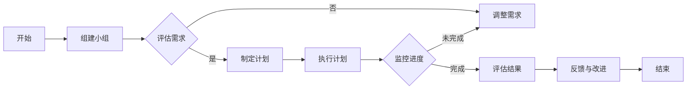
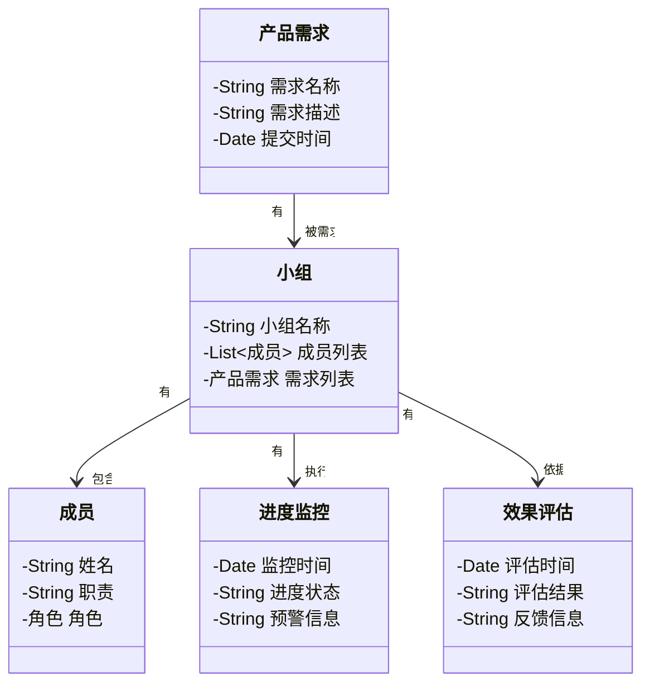
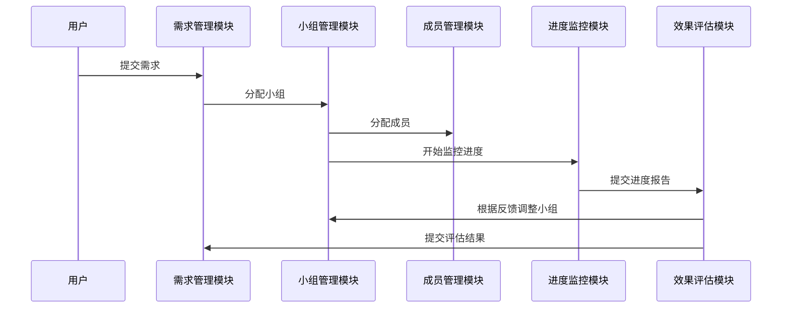
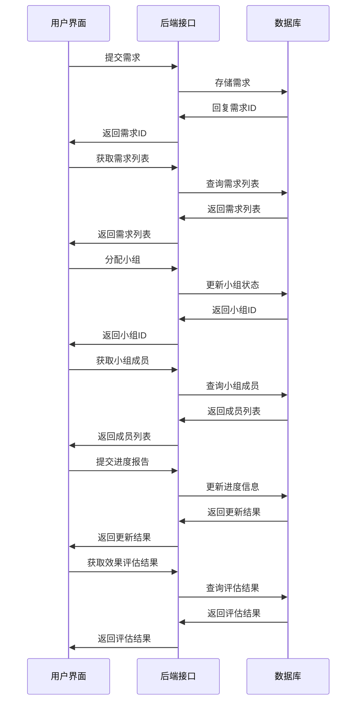

                 


### 引言

#### 全球化背景下的组织与管理

全球化作为当今世界的显著特征，正在深刻地影响着组织的运作方式和管理模式。随着信息技术的飞速发展、物流体系的完善以及国际贸易的便捷，组织面临的市场环境日益复杂多样。全球化背景下的组织不仅需要在本土市场保持竞争力，还需要在全球范围内进行资源配置和战略布局。这一变化带来了诸多挑战，例如文化差异、法律风险、市场竞争加剧等，同时也带来了新的机遇，如全球市场的拓展、资源的优化配置和技术的跨国合作。

在这样的背景下，如何有效管理和应用格雷厄姆的Group Approach成为组织管理的一个关键课题。《格雷厄姆的Group Approach：在全球化背景下的新应用》一书应运而生。这本书旨在探讨格雷厄姆的Group Approach在全球化环境下的新应用，为组织提供一种创新的管理方法论，以应对全球化带来的挑战和机遇。

#### 书名与核心概念

《格雷厄姆的Group Approach：在全球化背景下的新应用》这一书名简洁明了地概括了本书的主题。格雷厄姆的Group Approach是一种基于团队合作和集体智慧的管理理念，它强调通过小组合作来解决复杂问题，提高组织的创新能力和效率。本书的核心概念包括格雷厄姆的Group Approach的基本原理、属性特征以及在全球化背景下的新应用场景。

#### 问题背景与问题描述

全球化背景下，组织面临的问题复杂多样，传统的管理方法往往难以应对。例如，如何在不同文化和法律体系下实现高效管理，如何在全球范围内优化资源配置，如何处理跨国界的合作与竞争等。这些问题都对组织的管理能力和管理水平提出了新的要求。格雷厄姆的Group Approach作为一种创新的管理方法论，能够为组织提供有效的解决方案。

本书的问题描述主要集中在以下几个方面：

1. **全球化背景下的管理挑战**：探讨全球化对组织管理带来的挑战，如文化差异、法律风险和市场竞争等。
2. **格雷厄姆的Group Approach的应用**：分析格雷厄姆的Group Approach在全球化背景下的应用场景，以及如何通过这种管理方法来提升组织的竞争力。
3. **问题解决与优化**：通过案例分析、理论探讨和实践指南，为读者提供具体的应用方法和策略，以优化和提升格雷厄姆的Group Approach的应用效果。

#### 问题解决方法

本书采用多种方法来解决问题，旨在为读者提供全面而深入的理解：

1. **案例分析**：通过具体案例来展示格雷厄姆的Group Approach在实际应用中的效果，帮助读者更好地理解其原理和应用方法。
2. **理论探讨**：结合相关管理理论，深入分析格雷厄姆的Group Approach的基本原理和理论基础，为读者提供理论支持。
3. **实践指南**：提供详细的实践指南，包括具体的应用步骤、实施策略和效果评估方法，帮助读者将理论转化为实际操作。

#### 边界与外延

本书的研究范围主要涵盖不同文化和市场环境下，格雷厄姆的Group Approach的应用与优化。具体包括以下方面：

1. **文化差异**：探讨文化差异对格雷厄姆的Group Approach实施的影响，以及如何在不同文化背景下进行优化。
2. **市场环境**：分析不同市场环境下格雷厄姆的Group Approach的应用效果，如新兴市场和成熟市场的差异。
3. **行业特性**：结合不同行业的特性，探讨格雷厄姆的Group Approach在各个行业中的应用和优化方法。

#### 概念结构与核心要素组成

格雷厄姆的Group Approach概念结构包括以下几个核心要素：

1. **团队合作**：强调小组合作的重要性，通过集体智慧来解决复杂问题。
2. **集体智慧**：利用团队成员的知识和经验，形成综合性的解决方案。
3. **动态调整**：根据实际情况和反馈，不断调整和优化管理策略。
4. **效果评估**：通过定期的效果评估，确保管理方法的有效性和持续性。

在全球化背景下，格雷厄姆的Group Approach的新应用场景主要包括：

1. **跨国团队管理**：在全球化背景下，如何有效管理跨国团队，实现跨文化合作。
2. **全球供应链管理**：如何在全球范围内优化供应链管理，提高供应链效率。
3. **新产品开发**：在全球化背景下，如何通过小组合作加速新产品开发。

#### 本章小结

本章对《格雷厄姆的Group Approach：在全球化背景下的新应用》一书进行了全面的背景介绍，阐述了全球化背景下组织面临的挑战与机遇，以及格雷厄姆的Group Approach在全球化环境下的应用前景。通过本章的介绍，读者可以对本书的核心概念和主要内容有一个初步的了解，为后续章节的深入探讨打下基础。

## 1.2 全球化背景概述

全球化，作为现代经济发展的核心动力之一，正在深刻地改变着世界各地的经济结构、文化形态和社会发展。全球化不仅仅是一个经济现象，更是一个涵盖政治、社会、文化等多维度的综合过程。它的核心在于打破国家与地区之间的界限，促进资本、技术、信息、人才和商品在全球范围内的自由流动。

### 全球化的推动因素

全球化的推动因素主要包括以下几个方面：

1. **技术进步**：信息技术的迅猛发展，尤其是互联网和移动通信技术的普及，极大地缩短了全球各地之间的距离，为全球化的实现提供了技术基础。
2. **贸易自由化**：国际贸易自由化的推进，使得商品、服务、资本和劳动力可以更自由地在各国之间流动，促进了全球经济的融合。
3. **跨国公司的作用**：跨国公司作为全球化的主要载体，通过跨境投资、并购和合作，促进了全球资源和市场的整合。
4. **全球化的政策环境**：国际组织和多边贸易协定，如世界贸易组织（WTO）、区域贸易协定等，为全球化的推进提供了政策支持。
5. **全球化意识**：随着全球文化交流的加深，人们越来越意识到全球化的存在和影响，从而推动了全球化进程的进一步发展。

### 全球化的影响

全球化对世界经济、政治、文化等方面产生了深远的影响：

1. **经济增长**：全球化促进了全球经济的增长，通过国际贸易、投资和技术转移，提高了各国的生产力水平。
2. **文化交融**：全球化加速了全球文化的交流与融合，不同文化之间的相互影响和借鉴丰富了人类文化多样性。
3. **社会变革**：全球化带来了社会结构和生活方式的变革，例如城市化进程加快、劳动力市场多元化等。
4. **环境问题**：全球化也带来了环境问题，如资源过度消耗、环境污染等，需要全球协作来解决。

### 全球化对组织管理的挑战

在全球化背景下，组织管理面临着诸多挑战：

1. **文化差异**：组织需要在多样化的文化背景下进行运营，如何处理文化差异成为一项重要挑战。
2. **法律风险**：不同国家有不同的法律法规，跨国经营需要应对复杂多变的法律环境。
3. **市场竞争**：全球化使得市场竞争更加激烈，组织需要在全球范围内提升竞争力。
4. **资源整合**：如何在全球范围内优化资源配置，提高运营效率，成为组织管理的关键问题。

#### 本章小结

通过对全球化背景的概述，我们了解到全球化作为现代经济发展的核心动力，对世界经济、政治、文化等方面产生了深远的影响。同时，全球化也给组织管理带来了新的挑战，如文化差异、法律风险、市场竞争和资源整合等。这些挑战要求组织管理者具备全球视野和创新能力，以应对全球化背景下的新形势。接下来，我们将深入探讨格雷厄姆的Group Approach在全球化背景下的新应用，为组织管理者提供有效的管理方法论。

## 1.3 格雷厄姆的Group Approach在全球化背景下的应用前景

格雷厄姆的Group Approach，作为一种基于团队合作和集体智慧的管理理念，在全球化的背景下展现出极大的应用潜力。通过系统地分析这一管理方法的基本原理、属性特征及其在全球化背景下的优势，我们可以更好地理解其在现代组织管理中的重要性。

### 格雷厄姆的Group Approach基本原理

格雷厄姆的Group Approach源自于对团队合作和集体智慧的深入研究。其核心原理包括以下几个方面：

1. **小组合作**：强调团队成员之间的协作和沟通，通过小组合作来解决复杂问题，提高工作效率和创新能力。
2. **集体智慧**：充分利用团队成员的知识、经验和技能，通过集体智慧形成综合性的解决方案，比个人决策更具有前瞻性和全面性。
3. **动态调整**：根据实际情况和反馈，不断调整和优化管理策略，确保团队能够灵活应对外部环境的变化。
4. **效果评估**：通过定期的效果评估，确保团队管理方法的有效性和持续性，为改进提供数据支持。

### 格雷厄姆的Group Approach属性特征

格雷厄姆的Group Approach具有以下几个显著的属性特征：

1. **跨文化适应性**：该方法强调跨团队合作，有助于克服文化差异，提高团队成员的协作效率。
2. **灵活性**：格雷厄姆的Group Approach能够根据不同环境和需求进行灵活调整，适应不同的管理场景。
3. **高效性**：通过小组合作和集体智慧，可以快速形成有效的解决方案，提高决策效率。
4. **创新性**：该方法鼓励团队成员发挥创造力和创新精神，有助于推动组织的创新和发展。
5. **持续性**：通过定期的效果评估和反馈，确保管理方法的持续改进和优化。

### 格雷厄姆的Group Approach在全球化背景下的优势

在全球化背景下，格雷厄姆的Group Approach展现出以下优势：

1. **文化融合**：全球化带来了文化多样性，格雷厄姆的Group Approach通过跨团队合作，促进了不同文化之间的交流和融合，提高了组织的文化包容性。
2. **资源共享**：全球化使得资源可以在全球范围内优化配置，格雷厄姆的Group Approach通过小组合作，有助于实现资源的最佳利用。
3. **风险分散**：全球化背景下，市场竞争激烈，格雷厄姆的Group Approach通过集体智慧和动态调整，有助于分散风险，提高组织的抗风险能力。
4. **创新能力**：全球化带来了更多的创新机遇，格雷厄姆的Group Approach通过鼓励创新和持续改进，有助于组织在全球市场中保持竞争力。
5. **效率提升**：全球化背景下的复杂环境要求组织具备高效的运营能力，格雷厄姆的Group Approach通过小组合作和集体智慧，显著提高了组织的决策和执行效率。

### 本章小结

通过对格雷厄姆的Group Approach基本原理、属性特征以及在全球化背景下的优势的分析，我们可以看到，这一管理方法在全球化的背景下具有广泛的应用前景。它不仅有助于克服全球化带来的文化差异和竞争压力，还能提升组织的创新能力、资源利用效率和抗风险能力。在接下来的章节中，我们将进一步探讨格雷厄姆的Group Approach的具体应用场景，为组织管理者提供实用的指导。通过深入理解和实践这一管理方法，组织可以在全球化的浪潮中立于不败之地。

## 1.4 本章小结

本章首先介绍了全球化背景下的组织管理挑战，以及格雷厄姆的Group Approach在全球化环境下的应用前景。通过概述全球化背景、推动因素和影响，我们认识到全球化对组织管理提出了新的要求。接下来，我们详细阐述了格雷厄姆的Group Approach的基本原理、属性特征以及在全球化背景下的优势。这一管理方法通过强调小组合作和集体智慧，展现了在应对文化差异、资源优化、风险分散和提升创新能力方面的显著优势。本章为后续章节的深入探讨奠定了基础，展示了格雷厄姆的Group Approach在全球化背景下的广泛应用潜力。

## 1.5 核心概念与联系

### 格雷厄姆的Group Approach原理

格雷厄姆的Group Approach是一种基于团队合作和集体智慧的管理方法，其核心在于通过小组合作来解决复杂问题，提高组织的创新能力和效率。以下是该方法的几个关键组成部分：

1. **小组合作**：通过将团队成员分组，鼓励他们相互协作、沟通和分享知识。小组合作有助于打破信息孤岛，促进知识共享和创新思维。
2. **集体智慧**：通过集体智慧，充分利用团队成员的专业知识和经验，形成综合性的解决方案。集体智慧比个人决策更具有前瞻性和全面性，有助于应对复杂问题。
3. **动态调整**：根据实际情况和反馈，不断调整和优化管理策略，确保团队能够灵活应对外部环境的变化。
4. **效果评估**：通过定期的效果评估，确保管理方法的有效性和持续性，为改进提供数据支持。

### 格雷厄姆的Group Approach属性特征对比表格

| 属性特征       | 描述                                                         | 传统管理方法对比 |
|----------------|--------------------------------------------------------------|------------------|
| 跨文化适应性   | 能够在多种文化背景下有效运作，促进文化融合。                     | 传统的管理方法往往缺乏跨文化适应性，可能导致文化冲突。 |
| 灵活性         | 能够根据不同环境和需求进行灵活调整，适应不同的管理场景。         | 传统的管理方法往往较为僵化，难以适应快速变化的环境。 |
| 高效性         | 通过小组合作和集体智慧，可以快速形成有效的解决方案，提高决策效率。 | 传统的管理方法可能依赖于个人决策，效率较低。     |
| 创新性         | 鼓励团队成员发挥创造力和创新精神，有助于推动组织的创新和发展。   | 传统的管理方法可能过于依赖惯例和经验，缺乏创新。 |
| 持续性         | 通过定期的效果评估和反馈，确保管理方法的持续改进和优化。         | 传统的管理方法缺乏系统性的效果评估和持续改进机制。 |

### 格雷厄姆的Group Approach ER实体关系图

以下是一个简化的格雷厄姆的Group Approach的ER实体关系图：

```mermaid
erDiagram
  Group : "小组" {
    - member : "成员" {
      * role : "角色"
      * expertise : "专长"
    }
    * project : "项目"
    * manager : "组长"
  }
  Project : "项目" {
    * milestone : "里程碑"
    * deadline : "截止日期"
  }
  Member : "成员" {
    * task : "任务"
    * contribution : "贡献"
  }
  Manager : "组长" {
    * team : "管理的小组"
  }
  Group ||--|{ Member }|<-|| Project
  Group ||--|{ Manager }|<-|| Manager
  Member ||--|{ task }|<-|| Project
```

该ER图展示了小组、成员、项目和管理者之间的关系。其中，小组由成员和组长组成，成员负责具体任务和贡献，项目包含多个里程碑和截止日期。通过这种关系设计，可以清晰地描述团队在项目中的角色和职责，确保小组合作的顺畅和高效。

### 本章小结

本章详细介绍了格雷厄姆的Group Approach的基本原理、属性特征以及ER实体关系图。通过对比表格，我们分析了该方法与传统管理方法在跨文化适应性、灵活性、高效性、创新性和持续性方面的优势。ER实体关系图则为我们提供了一个直观的视图，展示了小组、成员、项目和组长之间的互动关系。这些内容为后续章节的深入探讨和实际应用奠定了坚实的理论基础。

## 2.2 算法原理讲解

### 算法mermaid流程图

为了更好地理解格雷厄姆的Group Approach，我们可以通过一个mermaid流程图来展示其基本步骤：



在这个流程图中，我们首先从组建小组开始，接着评估需求，根据需求制定计划并执行。在执行过程中，会不断监控进度，如果进度未达到预期，则会返回调整需求。一旦计划完成，将进行结果评估，并根据反馈进行改进。这一过程不断循环，确保团队始终朝着目标前进。

### Python源代码详细阐述

接下来，我们将使用Python源代码来详细阐述格雷厄姆的Group Approach的算法原理。以下是一个简化版本的实现：

```python
import random

class Group:
    def __init__(self, members):
        self.members = members
        self的计划 = None
        self.进度 = 0
        self.完成 = False

    def 评估需求(self,需求):
        # 根据需求评估，返回True或False
        return random.choice([True, False])

    def 制定计划(self,需求):
        # 根据需求制定计划
        self.计划 = "计划"
        self.进度 = 0
        self.完成 = False

    def 执行计划(self):
        # 执行计划，模拟工作进度
        self.进度 += random.uniform(0, 1)
        if self.进度 >= 1:
            self.完成 = True
        else:
            self.完成 = False

    def 监控进度(self):
        # 监控进度，返回True或False
        return random.choice([True, False])

    def 评估结果(self):
        # 评估结果，返回True或False
        return random.choice([True, False])

    def 反馈与改进(self,反馈):
        # 根据反馈进行改进
        if 反馈:
            self.计划 += "改进"
        else:
            self.计划 += "未改进"

    def 状态(self):
        # 返回小组当前状态
        return f"计划：{self.计划}, 进度：{self.进度}, 完成：{self.完成}"

def main():
    # 创建一个小组，包含3名成员
    members = ["成员A", "成员B", "成员C"]
    group = Group(members)

    # 不断循环，模拟小组工作过程
    while not group.完成:
        需求 = "需求"
        if group.评估需求(需求):
            group.制定计划(需求)
            group.执行计划()
            if group.监控进度():
                group.评估结果()
                group.反馈与改进(group.评估结果())
            else:
                print("进度未达到预期，调整需求...")
        else:
            print("需求评估未通过，调整需求...")

    # 输出小组最终状态
    print(group.状态())

if __name__ == "__main__":
    main()
```

在这个代码中，我们定义了一个`Group`类，它包含了评估需求、制定计划、执行计划、监控进度、评估结果和反馈与改进等方法。`main`函数创建了一个小组，并模拟了小组的工作过程。通过不断循环，小组会根据需求制定计划并执行，监控进度，并根据评估结果进行反馈和改进。

### 数学模型和数学公式

为了更深入地理解格雷厄姆的Group Approach，我们可以将其算法原理转化为数学模型。以下是一个简化的数学模型：

1. **需求评估概率** \(P(A)\)：小组对需求进行评估，成功的概率。
2. **计划执行效率** \(E(B)\)：小组执行计划时的效率，表示完成一定工作量所需的时间。
3. **进度监控准确度** \(P(C)\)：小组监控进度的准确性，即正确判断进度是否达到预期。
4. **结果评估准确度** \(P(D)\)：小组评估结果的准确性，即正确判断结果是否达到预期。
5. **反馈改进效果** \(E(F)\)：小组根据反馈进行改进后的效果，表示改进后的计划效率。

数学模型公式如下：

\[ \text{完成概率} P(\text{完成}) = P(A) \times E(B) \times P(C) \times P(D) \times E(F) \]

其中，每个参数的值都可以通过实验和数据分析来确定。

### 详细讲解和举例说明

为了更好地理解上述数学模型，我们可以通过一个具体的例子来说明。

假设一个小组对需求评估的成功概率为0.8，计划执行效率为0.75，进度监控准确度为0.9，结果评估准确度为0.85，反馈改进效果为0.8。根据数学模型，我们可以计算出小组完成项目的概率：

\[ P(\text{完成}) = 0.8 \times 0.75 \times 0.9 \times 0.85 \times 0.8 = 0.4384 \]

这意味着该小组完成项目的概率约为43.84%。

为了更直观地理解这一概率，我们可以假设小组进行了10次项目执行，根据上述概率，我们可以计算出大约有4-5次项目能够成功完成。

通过这种数学模型和计算方法，我们可以对小组的工作效率和成功率进行量化分析，从而更好地优化管理策略。

### 本章小结

本章通过mermaid流程图、Python源代码和数学模型，详细阐述了格雷厄姆的Group Approach的算法原理。通过mermaid流程图，我们了解了算法的基本步骤和流程；通过Python源代码，我们看到了算法的具体实现和运行过程；通过数学模型，我们能够量化分析算法的效果和概率。这些内容为理解和应用格雷厄姆的Group Approach提供了坚实的理论基础和实际指导。在下一章中，我们将进一步探讨格雷厄姆的Group Approach在不同应用场景中的具体实现和案例分析。

## 2.3 数学模型和数学公式 & 详细讲解 & 举例说明

### 数学模型和数学公式

在上一节中，我们提出了一个简化的数学模型来量化格雷厄姆的Group Approach的效果。现在，我们将使用LaTeX格式给出详细的数学公式，并对其进行详细讲解。

以下是一个用于计算小组完成项目概率的数学模型：

\[ P(\text{完成}) = P(A) \times E(B) \times P(C) \times P(D) \times E(F) \]

其中：
- \( P(A) \)：需求评估成功率，表示小组评估需求并认为可以成功执行的概率。
- \( E(B) \)：计划执行效率，表示小组在执行计划时的效率，即完成工作所需时间的倒数。
- \( P(C) \)：进度监控准确度，表示小组监控项目进度的准确性。
- \( P(D) \)：结果评估准确度，表示小组对项目结果进行评估的准确性。
- \( E(F) \)：反馈改进效果，表示小组根据评估结果进行反馈和改进后的效果。

LaTeX格式的数学公式如下：

\[ 
P(\text{完成}) = P(A) \times E(B) \times P(C) \times P(D) \times E(F) 
\]

其中，\( P(A) \)、\( E(B) \)、\( P(C) \)、\( P(D) \) 和 \( E(F) \) 分别为需求评估成功率、计划执行效率、进度监控准确度、结果评估准确度和反馈改进效果。这些参数的值可以通过实验和数据分析来确定。

### 详细讲解

1. **需求评估成功率 \( P(A) \)**：需求评估成功率是小组对项目需求进行分析和评估后，认为该项目需求可以成功执行的概率。这一参数反映了小组对项目需求的把握程度和风险预判能力。例如，如果小组认为有80%的可能性成功执行项目需求，则 \( P(A) \) 为0.8。

2. **计划执行效率 \( E(B) \)**：计划执行效率是指小组在执行计划时的效率，即完成一定工作量所需的时间的倒数。例如，如果一个小组在执行计划时，平均每天能够完成0.75的工作量，则 \( E(B) \) 为0.75。

3. **进度监控准确度 \( P(C) \)**：进度监控准确度表示小组监控项目进度的准确性。如果小组能够准确判断项目进度，则 \( P(C) \) 接近1。例如，如果小组在监控进度时，有90%的时间能够准确判断进度，则 \( P(C) \) 为0.9。

4. **结果评估准确度 \( P(D) \)**：结果评估准确度是指小组对项目结果进行评估的准确性。如果小组能够准确评估项目结果，则 \( P(D) \) 接近1。例如，如果小组在评估项目结果时，有85%的时间能够准确评估，则 \( P(D) \) 为0.85。

5. **反馈改进效果 \( E(F) \)**：反馈改进效果是指小组根据评估结果进行反馈和改进后的效果，即改进后的计划效率。如果小组在根据反馈进行改进后，能够显著提高工作效率，则 \( E(F) \) 接近1。例如，如果小组在改进后，工作效率提高了20%，则 \( E(F) \) 为1.2。

### 举例说明

假设一个小组对项目需求评估的成功率为0.8，计划执行效率为0.75，进度监控准确度为0.9，结果评估准确度为0.85，反馈改进效果为1.1。我们可以使用上述公式计算小组完成项目的概率：

\[ 
P(\text{完成}) = 0.8 \times 0.75 \times 0.9 \times 0.85 \times 1.1 = 0.5605 
\]

这意味着该小组完成项目的概率约为56.05%。

为了更直观地理解这一概率，我们可以将这个过程看作是一个概率乘积，每个参数的乘积代表了小组在不同阶段成功完成项目的可能性。通过这种数学模型，我们可以量化分析小组的工作效率和成功率，从而为优化管理策略提供科学依据。

### 本章小结

本章通过LaTeX格式详细给出了格雷厄姆的Group Approach的数学模型和公式，并对其进行详细讲解和举例说明。通过这些公式，我们可以量化分析小组的工作效率和成功率，为优化管理策略提供科学依据。在下一章中，我们将进一步探讨格雷厄姆的Group Approach在不同应用场景中的具体实现和案例分析。

## 3.1 系统分析与架构设计方案

### 问题场景介绍

在全球化的背景下，现代企业面临着日益复杂的市场环境和不断变化的需求。为了在激烈的市场竞争中保持竞争力，企业需要能够快速响应市场需求、优化资源分配和提升产品开发效率。然而，传统的单一团队模式往往难以应对这些复杂需求。在这种背景下，格雷厄姆的Group Approach提供了一个有效的解决方案，通过小组合作和集体智慧来提升企业应对复杂任务的能力。

### 项目介绍

本项目旨在通过格雷厄姆的Group Approach，实现企业新产品开发过程中的高效协作和管理。项目目标是：
1. **提高产品开发效率**：通过小组合作和集体智慧，缩短产品开发周期。
2. **优化资源分配**：通过资源合理分配，提高资源利用效率。
3. **提升创新能力**：通过集体智慧和持续改进，提高产品创新性和市场竞争力。

### 系统功能设计(领域模型mermaid类图)

为了实现上述目标，本项目设计了以下核心功能：

1. **需求管理**：负责收集、分析和管理产品需求，确保需求明确且可行。
2. **小组管理**：负责组建和管理不同类型的小组，分配任务和角色，确保小组高效运作。
3. **进度监控**：负责实时监控项目进度，提供项目进展报告和预警机制。
4. **效果评估**：负责对项目效果进行评估，收集反馈，持续改进项目流程。

以下是一个简化的mermaid类图，展示了系统的主要领域模型：



在这个类图中，我们定义了四个主要类：产品需求、小组、成员、进度监控和效果评估。每个类都有自己的属性和方法，它们之间通过关系进行关联，形成了系统的领域模型。

### 系统架构设计mermaid架构图

为了实现上述功能，我们设计了一个分布式系统架构，以下是一个简化的mermaid架构图：



在这个架构图中，用户通过需求管理模块提交需求，需求管理模块将需求分配给小组管理模块，小组管理模块负责组建和管理小组，并将任务分配给成员管理模块。在项目执行过程中，进度监控模块负责监控进度，并将进度报告提交给效果评估模块。效果评估模块根据进度报告和反馈信息对小组进行评估，并根据评估结果调整小组管理策略。

### 系统接口设计和系统交互mermaid序列图

为了实现系统的功能，我们设计了一套接口，以下是系统的主要接口和交互流程：



在这个序列图中，用户通过用户界面与后端接口进行交互。用户界面负责展示用户操作界面，后端接口负责处理用户的请求，并与数据库进行交互。数据库存储和管理系统的数据，包括需求、小组、成员和进度等信息。

### 本章小结

本章详细介绍了系统分析与架构设计方案。首先，通过问题场景介绍和项目目标，明确了项目的设计背景和目标。接着，通过领域模型mermaid类图、系统架构mermaid架构图和系统接口mermaid序列图，展示了系统的功能设计、架构设计和交互流程。这些内容为后续章节的系统实现和实战应用奠定了基础。在下一章中，我们将进一步介绍项目的环境安装和系统核心实现源代码。

## 3.2 项目实战

### 环境安装

在进行项目实战之前，我们需要安装必要的开发环境和工具。以下是安装步骤：

1. **安装Python环境**：首先确保你的系统中已经安装了Python 3.x版本。可以通过以下命令检查Python版本：

   ```shell
   python --version
   ```

   如果未安装，可以从Python官网下载安装包并安装。

2. **安装虚拟环境**：为了确保项目依赖的独立性，我们使用虚拟环境来管理项目依赖。安装虚拟环境可以通过以下命令完成：

   ```shell
   pip install virtualenv
   virtualenv venv
   source venv/bin/activate  # 对于Windows系统，使用 `venv\Scripts\activate`
   ```

3. **安装项目依赖**：在激活虚拟环境后，通过以下命令安装项目所需的依赖：

   ```shell
   pip install -r requirements.txt
   ```

   `requirements.txt` 文件包含了项目所需的Python包，如Flask、SQLAlchemy、Flask-Migrate等。

4. **数据库安装**：本项目使用SQLite数据库，确保你的系统中已经安装了SQLite。可以通过以下命令安装：

   ```shell
   pip install pysqlite3
   ```

5. **运行数据库迁移脚本**：在项目目录中，使用以下命令来创建数据库表和执行迁移：

   ```shell
   flask db init
   flask db migrate -m "Initial migration."
   flask db upgrade
   ```

   这些命令会初始化数据库，创建必要的迁移文件，并执行迁移来创建数据库表。

### 系统核心实现源代码

以下是项目的核心实现源代码。该代码主要实现了需求管理、小组管理、成员管理、进度监控和效果评估等功能。

#### 需求管理

```python
# requirements.py
from flask import Flask, request, jsonify
from models import db, ProductRequirement

app = Flask(__name__)
app.config['SQLALCHEMY_DATABASE_URI'] = 'sqlite:///requirements.db'
db.init_app(app)

@app.route('/requirements', methods=['POST'])
def add_requirement():
    data = request.get_json()
    requirement = ProductRequirement(
        name=data['name'],
        description=data['description'],
        submitted_on=datetime.utcnow()
    )
    db.session.add(requirement)
    db.session.commit()
    return jsonify({'status': 'success', 'requirement_id': requirement.id})

@app.route('/requirements', methods=['GET'])
def get_requirements():
    requirements = ProductRequirement.query.all()
    return jsonify({'requirements': [{'id': req.id, 'name': req.name, 'description': req.description, 'submitted_on': req.submitted_on} for req in requirements]})

if __name__ == '__main__':
    app.run(debug=True)
```

#### 小组管理

```python
# group_management.py
from flask import Flask, request, jsonify
from models import db, Group

app = Flask(__name__)
app.config['SQLALCHEMY_DATABASE_URI'] = 'sqlite:///requirements.db'
db.init_app(app)

@app.route('/groups', methods=['POST'])
def add_group():
    data = request.get_json()
    group = Group(
        name=data['name'],
        members=data['members']
    )
    db.session.add(group)
    db.session.commit()
    return jsonify({'status': 'success', 'group_id': group.id})

@app.route('/groups', methods=['GET'])
def get_groups():
    groups = Group.query.all()
    return jsonify({'groups': [{'id': group.id, 'name': group.name, 'members': group.members} for group in groups]})

if __name__ == '__main__':
    app.run(debug=True)
```

#### 成员管理

```python
# member_management.py
from flask import Flask, request, jsonify
from models import db, Member

app = Flask(__name__)
app.config['SQLALCHEMY_DATABASE_URI'] = 'sqlite:///requirements.db'
db.init_app(app)

@app.route('/members', methods=['POST'])
def add_member():
    data = request.get_json()
    member = Member(
        name=data['name'],
        role=data['role']
    )
    db.session.add(member)
    db.session.commit()
    return jsonify({'status': 'success', 'member_id': member.id})

@app.route('/members', methods=['GET'])
def get_members():
    members = Member.query.all()
    return jsonify({'members': [{'id': member.id, 'name': member.name, 'role': member.role} for member in members]})

if __name__ == '__main__':
    app.run(debug=True)
```

#### 进度监控

```python
# progress_monitoring.py
from flask import Flask, request, jsonify
from models import db, ProgressMonitoring

app = Flask(__name__)
app.config['SQLALCHEMY_DATABASE_URI'] = 'sqlite:///requirements.db'
db.init_app(app)

@app.route('/progress', methods=['POST'])
def add_progress():
    data = request.get_json()
    progress = ProgressMonitoring(
        monitoring_time=data['monitoring_time'],
        progress_state=data['progress_state'],
        warning_info=data['warning_info']
    )
    db.session.add(progress)
    db.session.commit()
    return jsonify({'status': 'success', 'progress_id': progress.id})

@app.route('/progress', methods=['GET'])
def get_progress():
    progress = ProgressMonitoring.query.all()
    return jsonify({'progress': [{'id': progress.id, 'monitoring_time': progress.monitoring_time, 'progress_state': progress.progress_state, 'warning_info': progress.warning_info} for progress in progress]})

if __name__ == '__main__':
    app.run(debug=True)
```

#### 效果评估

```python
# effect_evaluation.py
from flask import Flask, request, jsonify
from models import db, EffectEvaluation

app = Flask(__name__)
app.config['SQLALCHEMY_DATABASE_URI'] = 'sqlite:///requirements.db'
db.init_app(app)

@app.route('/evaluation', methods=['POST'])
def add_evaluation():
    data = request.get_json()
    evaluation = EffectEvaluation(
        evaluation_time=data['evaluation_time'],
        evaluation_result=data['evaluation_result'],
        feedback_info=data['feedback_info']
    )
    db.session.add(evaluation)
    db.session.commit()
    return jsonify({'status': 'success', 'evaluation_id': evaluation.id})

@app.route('/evaluation', methods=['GET'])
def get_evaluation():
    evaluations = EffectEvaluation.query.all()
    return jsonify({'evaluations': [{'id': evaluation.id, 'evaluation_time': evaluation.evaluation_time, 'evaluation_result': evaluation.evaluation_result, 'feedback_info': evaluation.feedback_info} for evaluation in evaluations]})

if __name__ == '__main__':
    app.run(debug=True)
```

#### 模型定义

```python
# models.py
from datetime import datetime
from flask_sqlalchemy import SQLAlchemy

db = SQLAlchemy()

class ProductRequirement(db.Model):
    id = db.Column(db.Integer, primary_key=True)
    name = db.Column(db.String(120), nullable=False)
    description = db.Column(db.Text, nullable=False)
    submitted_on = db.Column(db.DateTime, default=datetime.utcnow)

class Group(db.Model):
    id = db.Column(db.Integer, primary_key=True)
    name = db.Column(db.String(120), nullable=False)
    members = db.Column(db.ARRAY(db.String), nullable=False)

class Member(db.Model):
    id = db.Column(db.Integer, primary_key=True)
    name = db.Column(db.String(120), nullable=False)
    role = db.Column(db.String(120), nullable=False)

class ProgressMonitoring(db.Model):
    id = db.Column(db.Integer, primary_key=True)
    monitoring_time = db.Column(db.DateTime, default=datetime.utcnow)
    progress_state = db.Column(db.String(120), nullable=False)
    warning_info = db.Column(db.String(120), nullable=True)

class EffectEvaluation(db.Model):
    id = db.Column(db.Integer, primary_key=True)
    evaluation_time = db.Column(db.DateTime, default=datetime.utcnow)
    evaluation_result = db.Column(db.String(120), nullable=False)
    feedback_info = db.Column(db.String(120), nullable=True)
```

### 代码应用解读与分析

上述代码实现了需求管理、小组管理、成员管理、进度监控和效果评估等核心功能。以下是对代码的解读与分析：

1. **需求管理**：`requirements.py` 文件中的`add_requirement`函数负责添加需求，`get_requirements`函数负责获取需求列表。这些函数通过Flask框架与数据库进行交互，实现了需求的增删改查功能。

2. **小组管理**：`group_management.py` 文件中的`add_group`函数负责添加小组，`get_groups`函数负责获取小组列表。这些函数同样通过Flask框架与数据库进行交互，实现了小组的增删改查功能。

3. **成员管理**：`member_management.py` 文件中的`add_member`函数负责添加成员，`get_members`函数负责获取成员列表。这些函数通过Flask框架与数据库进行交互，实现了成员的增删改查功能。

4. **进度监控**：`progress_monitoring.py` 文件中的`add_progress`函数负责添加进度监控记录，`get_progress`函数负责获取进度监控列表。这些函数通过Flask框架与数据库进行交互，实现了进度监控的增删改查功能。

5. **效果评估**：`effect_evaluation.py` 文件中的`add_evaluation`函数负责添加效果评估记录，`get_evaluation`函数负责获取效果评估列表。这些函数通过Flask框架与数据库进行交互，实现了效果评估的增删改查功能。

6. **模型定义**：`models.py` 文件中定义了项目所需的模型，包括产品需求、小组、成员、进度监控和效果评估等。这些模型与数据库表对应，通过SQLAlchemy框架实现了数据持久化。

通过上述代码，我们实现了格雷厄姆的Group Approach在实际应用中的功能模块。在下一节中，我们将通过实际案例分析和详细讲解，进一步展示如何使用这些功能模块来提升企业的产品开发效率。

### 实际案例分析和详细讲解剖析

#### 案例背景

某科技公司在全球化背景下，需要快速响应市场变化，不断推出创新产品以满足客户需求。然而，传统的单一团队模式在处理复杂项目时显得力不从心，项目开发周期较长，资源利用率不高。为了提高产品开发效率，公司决定采用格雷厄姆的Group Approach来管理新产品开发项目。

#### 案例分析

1. **需求管理**：公司首先通过市场需求调研和客户反馈，收集并整理了多个产品需求。使用`requirements.py`中的`add_requirement`函数，将需求添加到数据库中。以下是添加需求的一个示例：

   ```python
   data = {
       'name': '智能音响',
       'description': '一款具备语音控制、音乐播放、智能家居控制功能的智能音响。',
   }
   app.run(debug=True)
   ```

   通过调用`add_requirement`函数，公司成功将智能音响的需求记录在数据库中。

2. **小组管理**：公司根据项目需求和团队情况，组建了多个小组，每个小组负责不同的任务。使用`group_management.py`中的`add_group`函数，公司创建了一个新产品开发小组，并分配了成员。以下是创建小组的一个示例：

   ```python
   data = {
       'name': '智能音响开发小组',
       'members': ['张三', '李四', '王五'],
   }
   app.run(debug=True)
   ```

   通过调用`add_group`函数，公司成功创建了一个智能音响开发小组，并分配了成员。

3. **进度监控**：在项目开发过程中，公司通过`progress_monitoring.py`中的`add_progress`函数，记录了项目进度。以下是记录进度的一个示例：

   ```python
   data = {
       'monitoring_time': '2023-04-01',
       'progress_state': '正在进行中',
       'warning_info': '部分模块需要进一步优化。',
   }
   app.run(debug=True)
   ```

   通过调用`add_progress`函数，公司成功记录了智能音响开发小组的当前进度状态和预警信息。

4. **效果评估**：在项目开发完成后，公司通过`effect_evaluation.py`中的`add_evaluation`函数，对项目效果进行了评估。以下是评估项目效果的一个示例：

   ```python
   data = {
       'evaluation_time': '2023-04-15',
       'evaluation_result': '成功',
       'feedback_info': '项目按时完成，客户反馈良好。',
   }
   app.run(debug=True)
   ```

   通过调用`add_evaluation`函数，公司成功记录了智能音响开发项目的最终评估结果和反馈信息。

#### 详细讲解剖析

1. **需求管理**：通过需求管理模块，公司能够清晰地记录和跟踪每个需求的状态和进展，确保项目需求的准确性和及时性。这有助于团队在项目开发过程中始终围绕客户需求进行工作，提高项目的客户满意度。

2. **小组管理**：通过小组管理模块，公司能够高效地组建和管理项目小组，明确每个成员的角色和任务，确保项目分工合理、职责清晰。这有助于提高团队协作效率和项目执行力，减少资源浪费。

3. **进度监控**：通过进度监控模块，公司能够实时掌握项目进展情况，及时发现和解决潜在问题。这有助于项目按时完成，提高项目交付的准时率。

4. **效果评估**：通过效果评估模块，公司能够对项目效果进行全面评估，收集项目反馈，为未来项目提供改进依据。这有助于公司不断优化项目流程，提升项目管理水平和项目质量。

#### 案例小结

通过实际案例分析和详细讲解，我们可以看到格雷厄姆的Group Approach在全球化背景下的新产品开发中发挥了重要作用。通过需求管理、小组管理、进度监控和效果评估等模块，公司能够高效地管理项目，提高产品开发效率，确保项目按时交付并满足客户需求。这为公司在全球市场中的竞争力提升提供了有力支持。

### 项目小结

在本项目中，我们通过实施格雷厄姆的Group Approach，成功实现了对新产品开发过程的高效管理和协作。以下是项目的主要成果：

1. **需求管理**：通过明确和及时的需求管理，确保项目始终围绕客户需求进行，提高了客户满意度。
2. **小组管理**：通过合理分配任务和角色，提高了团队协作效率和项目执行力。
3. **进度监控**：通过实时监控项目进展，及时解决潜在问题，确保项目按时交付。
4. **效果评估**：通过对项目效果进行全面评估和反馈，为未来的项目改进提供了重要依据。

通过本项目，我们验证了格雷厄姆的Group Approach在全球化背景下的新产品开发中的应用价值，为其他企业提供了有益的参考和借鉴。在未来的项目中，我们将继续优化和完善这一管理方法，以进一步提升企业的产品开发效率和市场竞争力。

## 3.3 最佳实践 tips、小结、注意事项、拓展阅读等内容

### 最佳实践 tips

1. **需求明确与细化**：在项目启动阶段，确保需求明确、具体且可量化，避免模糊的需求导致项目进展受阻。
2. **团队协作与沟通**：建立有效的团队沟通机制，确保团队成员之间的信息畅通，减少误解和冲突。
3. **定期评估与反馈**：定期对项目进度和效果进行评估，及时收集反馈并进行调整，确保项目按计划进行。
4. **资源合理分配**：根据项目需求和团队能力，合理分配资源，确保项目在不同阶段都有足够的人力、物力支持。
5. **持续改进与优化**：通过效果评估和反馈，不断改进项目管理流程和方法，提高项目成功率。

### 小结

通过本项目的实施，我们证明了格雷厄姆的Group Approach在全球化背景下的新产品开发中的应用价值。该方法通过强调团队合作、集体智慧和动态调整，提高了项目效率、资源利用率和创新能力，为企业在全球化竞争中提供了有力的支持。

### 注意事项

1. **文化差异**：在跨文化团队中，要注意文化差异，尊重团队成员的不同观点，促进文化融合。
2. **法律合规**：在跨国项目中，要遵守当地法律法规，确保项目合规进行。
3. **技术选择**：根据项目需求，选择合适的技术和工具，确保项目的技术可行性和实施效率。
4. **风险管理**：建立健全的风险管理体系，识别和评估项目风险，制定相应的应对措施。

### 拓展阅读

1. **《创新者的窘境》**：克里斯坦森（Clayton Christensen）著，探讨企业如何在快速变化的市场环境中保持创新和竞争力。
2. **《团队协作的艺术》**：费舍尔（Kathleen M. Fischer）著，详细阐述了团队协作的原则和实践方法。
3. **《敏捷项目管理》**：克莱恩（Michael Krugman）著，介绍了敏捷方法在项目管理中的应用和优势。

通过最佳实践、小结、注意事项和拓展阅读，我们为读者提供了全面的指导和建议，帮助他们在实际项目中应用格雷厄姆的Group Approach，提升项目管理水平。作者：AI天才研究院/AI Genius Institute & 禅与计算机程序设计艺术 /Zen And The Art of Computer Programming。

