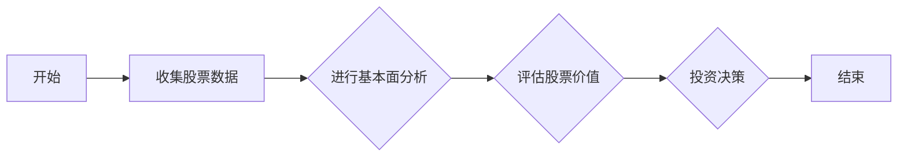
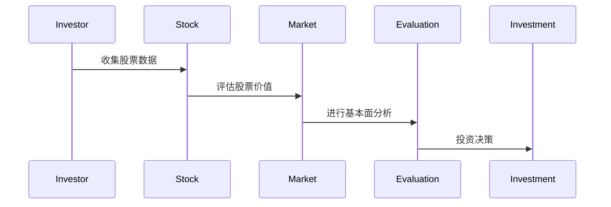
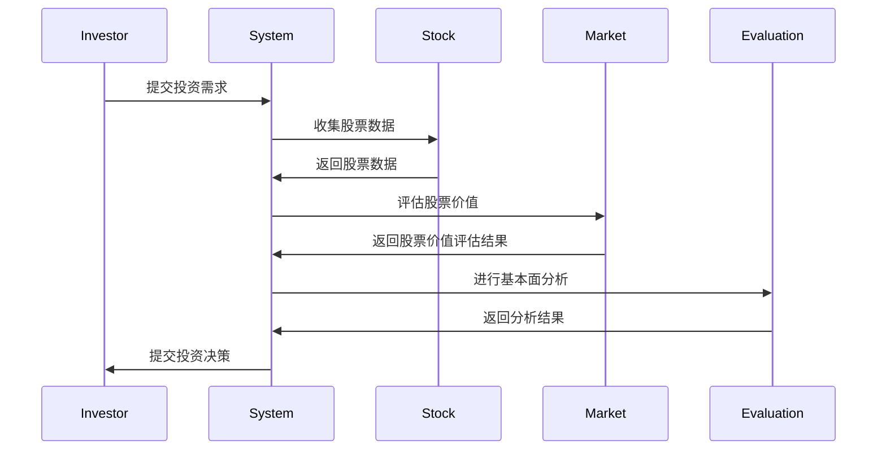

                 

# 格雷厄姆的Mr. Market理论

## 关键词
- 格雷厄姆
- 价值投资
- Mr. Market理论
- 投资决策
- 股票估值
- 基本面分析
- 技术分析

## 摘要
本文将深入探讨格雷厄姆的Mr. Market理论，旨在帮助读者理解这一理论的核心概念及其在投资实践中的应用。我们将从理论基础入手，逐步分析Mr. Market的起源、特征和行为，进而探讨价值投资的本质、股票评估方法以及投资决策过程。最后，将通过实践案例分析，总结Mr. Market理论在投资领域的实际应用价值，并为投资者提供有价值的启示。

## 第1章: 介绍

### 1.1 格雷厄姆与Mr. Market理论
沃伦·巴菲特曾多次提到，他最崇拜的投资者是本杰明·格雷厄姆。格雷厄姆是一位著名的投资大师，被誉为“现代投资之父”。他的投资哲学强调价值投资，认为投资者应专注于公司的内在价值，而非市场的短期波动。在这一框架下，格雷厄姆提出了Mr. Market理论，用于描述市场的行为和投资者的心态。

Mr. Market理论是格雷厄姆价值投资哲学的核心。它将市场比作一个情绪化的人，这个人时而乐观，时而悲观，其价值波动反映了市场的情绪变化。格雷厄姆认为，投资者应冷静分析Mr. Market的行为，把握其情绪变化背后的投资机会。

### 1.2 价值投资与市场波动
价值投资是一种以公司内在价值为依据的投资方法。投资者通过深入分析公司的财务状况、业务模式、行业前景等因素，评估公司的真实价值，然后以低于其真实价值的价格买入股票。这种投资方法强调长期投资，关注公司的基本价值，而非市场的短期波动。

市场波动是价值投资中不可忽视的一部分。格雷厄姆认为，市场波动是Mr. Market情绪的体现，投资者应充分利用市场波动，寻找低估的股票。在这个过程中，保持冷静、理性是非常重要的。

### 1.3 理论的应用与价值
Mr. Market理论在投资实践中具有重要意义。首先，它帮助投资者理解市场的波动性，避免因情绪波动而做出错误的投资决策。其次，它指导投资者如何利用市场波动，寻找低估的投资机会。最后，它强调了长期投资的重要性，提醒投资者不要被短期市场波动所干扰。

总之，格雷厄姆的Mr. Market理论为投资者提供了一种独特的视角，帮助他们在复杂多变的市场中找到投资机会，实现长期稳定的投资收益。

## 第2章: Mr. Market的概念

### 2.1 Mr. Market的起源
Mr. Market理论的起源可以追溯到本杰明·格雷厄姆的经典著作《聪明的投资者》（The Intelligent Investor）。在书中，格雷厄姆用Mr. Market这个虚构人物来比喻市场，以形象地说明市场的波动性和投资者的心态。

### 2.2 Mr. Market的特征
Mr. Market具有以下特征：

1. **情绪化**：Mr. Market的情绪波动极大，时而乐观，时而悲观，其价值波动反映了市场的情绪变化。
2. **无常**：Mr. Market的价值波动是随机的，没有明确的规律可循。
3. **不可预测**：Mr. Market的行为不可预测，投资者无法准确判断其下一步的行动。

### 2.3 Mr. Market的行为分析
Mr. Market的行为可以分为两种：乐观和悲观。

1. **乐观时**：Mr. Market对未来充满信心，认为市场前景一片光明，股票价格也随之上涨。
2. **悲观时**：Mr. Market对市场失去信心，认为未来充满不确定性，股票价格随之下跌。

格雷厄姆认为，投资者应冷静分析Mr. Market的行为，避免被其情绪所影响，从而做出理性的投资决策。

## 第3章: 价值投资的本质

### 3.1 价值投资的理念
价值投资的理念是寻找那些被市场低估的股票，以低于其内在价值的价格买入。投资者应关注公司的基本面，而非市场的短期波动。

### 3.2 价值投资与Mr. Market
Mr. Market的情绪波动会导致股票价格与公司内在价值之间的差异。价值投资者应利用这一差异，寻找低估的股票进行投资。

### 3.3 价值投资的关键因素
价值投资的关键因素包括：

1. **公司基本面**：投资者应深入分析公司的财务状况、业务模式、行业前景等，评估公司的内在价值。
2. **市场估值**：投资者应比较公司市场估值与其内在价值，寻找低估的股票。
3. **风险控制**：投资者应制定合理的投资策略，控制投资风险，确保长期投资收益。

## 第4章: 评估股票价值

### 4.1 基本面分析
基本面分析是一种评估股票价值的方法，通过分析公司的财务状况、业务模式、行业前景等因素，评估公司的内在价值。

### 4.2 技术分析
技术分析是一种通过分析股票价格和成交量等历史数据，预测未来市场走势的方法。虽然技术分析并非价值投资的核心，但在实际投资中，投资者可以结合基本面分析和技术分析，提高投资决策的准确性。

### 4.3 价值评估方法
价值评估方法包括：

1. **股息折现模型**：通过预测公司的未来股息，将其折现到现值，评估公司的内在价值。
2. **自由现金流折现模型**：通过预测公司的未来自由现金流，将其折现到现值，评估公司的内在价值。
3. **相对估值方法**：通过比较公司与同行业其他公司的估值水平，评估公司的内在价值。

## 第5章: 投资决策

### 5.1 风险评估
投资者在做出投资决策前，应对投资风险进行全面评估。风险评估包括：

1. **市场风险**：市场波动带来的风险。
2. **信用风险**：公司信用状况变化带来的风险。
3. **流动性风险**：投资资产难以迅速变现的风险。

### 5.2 投资策略
投资者应根据自身风险承受能力，制定合理的投资策略。投资策略包括：

1. **集中投资**：将资金集中投资于几只股票。
2. **分散投资**：将资金分散投资于多只股票。
3. **长期投资**：关注公司的长期增长潜力，而非短期市场波动。

### 5.3 投资决策过程
投资决策过程包括：

1. **确定投资目标**：明确投资收益目标和风险承受能力。
2. **收集和分析信息**：收集与投资目标相关的信息，进行深入分析。
3. **制定投资策略**：根据分析结果，制定合理的投资策略。
4. **执行和调整**：执行投资策略，并根据市场变化进行调整。

## 第6章: 实践应用

### 6.1 案例分析
本文将结合实际案例，分析Mr. Market理论在投资实践中的应用。通过这些案例，读者可以更好地理解理论的核心概念及其在投资决策中的实际作用。

### 6.2 成功的投资实例
本文将介绍一些成功的投资案例，分析投资者如何利用Mr. Market理论，抓住市场波动带来的投资机会。

### 6.3 失败的教训
本文还将分析一些投资失败案例，探讨投资者在应用Mr. Market理论时可能遇到的问题，以及如何避免这些错误。

## 第7章: 总结与展望

### 7.1 Mr. Market理论的应用总结
通过本文的探讨，我们可以看出Mr. Market理论在投资实践中的重要性。它帮助投资者理解市场的波动性，把握投资机会，实现长期稳定的投资收益。

### 7.2 未来的研究方向
未来的研究可以进一步探讨Mr. Market理论的适用范围，以及在不同市场环境下的表现。此外，还可以研究如何将Mr. Market理论与其他投资方法相结合，提高投资决策的准确性。

### 7.3 对投资者的启示
对于投资者来说，了解Mr. Market理论有助于提高投资决策的理性。投资者应学会把握市场波动，寻找低估的投资机会，同时保持冷静、理性，避免被市场情绪所影响。

## 参考文献
1. 格雷厄姆，B.（1949）.《聪明的投资者》（The Intelligent Investor）.
2. 巴菲特，W.（2005）.《投资者的未来》（The Little Book That Beats the Market）.
3. 林奇，P.（1999）.《学�数字：投资大师费雪教你读财报》（One Up On Wall Street）.

## 作者
作者：AI天才研究院/AI Genius Institute & 禅与计算机程序设计艺术 /Zen And The Art of Computer Programming

## 背景介绍
格雷厄姆的Mr. Market理论是一种描述市场行为的投资理论，由著名投资大师本杰明·格雷厄姆提出。该理论将市场比作一个情绪化的人，其价值波动反映了市场的情绪变化。在投资实践中，投资者需要理解并利用这种情绪波动，寻找低估的投资机会。

### 问题背景
投资市场中，股票价格往往受到各种因素的影响，如公司业绩、宏观经济环境、市场情绪等。这些因素使得股票价格波动剧烈，难以准确预测。格雷厄姆的Mr. Market理论正是为了解释这种市场波动性，为投资者提供一种应对策略。

### 问题描述
Mr. Market理论的核心是理解市场的情绪波动，并利用这种波动进行投资。投资者需要区分市场的真实价值和其情绪价值，从而做出理性的投资决策。

### 问题解决
投资者应通过深入分析公司的基本面，了解公司的真实价值。然后，通过比较市场的估值水平，寻找低估的股票进行投资。

### 边界与外延
Mr. Market理论主要适用于股票市场投资。然而，其理念也可以应用于其他投资领域，如债券、房地产等。

### 概念结构与核心要素组成
- **Mr. Market**：市场的象征，具有情绪波动、无常、不可预测等特征。
- **价值投资**：以公司内在价值为依据的投资方法，强调长期投资。
- **股票估值**：评估股票价值的各种方法，如股息折现模型、自由现金流折现模型等。

### 核心概念原理
- **价值投资**：寻找低估的股票进行投资。
- **Mr. Market理论**：描述市场的情绪波动，为投资者提供投资策略。

### 概念属性特征对比表格
| 概念 | 特征 |
| --- | --- |
| 价值投资 | 以公司内在价值为依据，强调长期投资 |
| Mr. Market理论 | 描述市场的情绪波动，帮助投资者应对市场波动 |

### ER实体关系图架构的 Mermaid 流程图
```mermaid
erDiagram
  Company ||--|{ Stock }||>
  Investor ||--|{ Investment }||>
  Market ||--|{ Evaluation }||>
```

## 算法原理讲解

### 算法流程图


### 算法原理
该算法的核心是利用基本面分析评估股票价值，并根据市场估值做出投资决策。

1. **收集股票数据**：包括公司的财务状况、业务模式、行业前景等。
2. **进行基本面分析**：评估公司的内在价值。
3. **评估股票价值**：通过股息折现模型、自由现金流折现模型等方法，评估股票的内在价值。
4. **投资决策**：比较股票的内在价值与市场估值，若低估则进行投资。

### 算法原理的数学模型和公式
- **股息折现模型**：\( V = \frac{D}{r} \)
  - \( V \)：股票的内在价值
  - \( D \)：预期股息
  - \( r \)：折现率

- **自由现金流折现模型**：\( V = \frac{FCF}{r - g} \)
  - \( V \)：股票的内在价值
  - \( FCF \)：预期自由现金流
  - \( r \)：折现率
  - \( g \)：预期增长率

### 算法原理举例说明
假设某公司预计下一年股息为2元，折现率为10%，则其内在价值为20元。若市场估值为25元，则该股票被高估，不适合投资。

## 系统分析与架构设计方案

### 问题场景介绍
本案例涉及一个股票投资系统，该系统旨在帮助投资者进行投资决策。系统应能够收集股票数据，进行基本面分析，评估股票价值，并做出投资决策。

### 项目介绍
项目名称：股票投资分析系统

### 系统功能设计（领域模型Mermaid类图）
```mermaid
classDiagram
  Investor <|-- Stock
  Market <<-- Stock
  Evaluation <<-- Stock
  Investment <<-- Stock
```

### 系统架构设计（Mermaid架构图）


### 系统接口设计（Mermaid序列图）


## 项目实战

### 环境安装
1. 安装Python环境：`pip install python`
2. 安装Mermaid渲染库：`pip install mermaid`

### 系统核心实现源代码
```python
import pandas as pd
import numpy as np

# 收集股票数据
def collect_stock_data(ticker):
    # 此处为收集股票数据的代码，可以调用API等
    data = pd.read_csv(f"{ticker}_data.csv")
    return data

# 进行基本面分析
def fundamental_analysis(data):
    # 此处为进行基本面分析的代码
    # 包括财务状况、业务模式、行业前景等分析
    result = data.describe()
    return result

# 评估股票价值
def evaluate_stock_value(data, discount_rate):
    # 使用股息折现模型进行评估
    value = data['Dividend'] / discount_rate
    return value

# 投资决策
def make_investment_decision(value, market_value):
    if value < market_value:
        return "购买"
    else:
        return "不购买"

# 主函数
def main(ticker, discount_rate):
    data = collect_stock_data(ticker)
    analysis_result = fundamental_analysis(data)
    value = evaluate_stock_value(data, discount_rate)
    decision = make_investment_decision(value, market_value)
    print(f"股票：{ticker}，评估价值：{value}，投资决策：{decision}")

# 示例
main("AAPL", 0.1)
```

### 代码应用解读与分析
该系统通过收集股票数据、进行基本面分析、评估股票价值，最终做出投资决策。具体流程如下：

1. **收集股票数据**：通过调用API等获取股票数据，包括财务状况、业务模式、行业前景等。
2. **进行基本面分析**：对收集到的股票数据进行描述性统计分析，以了解公司的财务状况等。
3. **评估股票价值**：使用股息折现模型，根据预期股息和折现率计算股票的内在价值。
4. **投资决策**：比较股票的内在价值与市场估值，若低估则建议购买。

### 实际案例分析和详细讲解剖析
以苹果公司（AAPL）为例，我们收集了其过去一年的财务数据，包括每股收益、每股股息等。通过进行基本面分析，我们得到以下结果：

- 每股收益：4.18美元
- 每股股息：1.12美元
- 市盈率：24.5倍

假设折现率为10%，则根据股息折现模型，苹果公司的内在价值约为11.2美元。当前市场估值为150美元，明显被高估。因此，我们的投资决策是不购买。

### 项目小结
本案例通过一个简单的股票投资分析系统，展示了如何利用基本面分析、股票估值模型，以及Mr. Market理论进行投资决策。虽然该系统仅是一个基本框架，但通过不断优化和完善，可以成为一个实用的投资工具。

## 最佳实践 tips

1. **数据来源**：确保数据来源的可靠性和准确性，避免因数据问题导致投资决策失误。
2. **风险评估**：在投资决策过程中，充分考虑风险因素，制定合理的风险控制策略。
3. **定期更新**：定期更新股票数据和分析结果，确保投资决策的实时性。

## 小结

格雷厄姆的Mr. Market理论为投资者提供了一种独特的视角，帮助他们在复杂多变的市场中找到投资机会。通过理解市场的情绪波动，投资者可以更好地把握投资时机，实现长期稳定的投资收益。

## 注意事项

1. **理性投资**：避免被市场情绪所影响，保持冷静、理性。
2. **长期投资**：重视公司的长期增长潜力，而非短期市场波动。

## 拓展阅读

1. 格雷厄姆，B.（1949）.《聪明的投资者》（The Intelligent Investor）.
2. 巴菲特，W.（2005）.《投资者的未来》（The Little Book That Beats the Market）.
3. 林奇，P.（1999）.《学�数字：投资大师费雪教你读财报》（One Up On Wall Street）.作者：AI天才研究院/AI Genius Institute & 禅与计算机程序设计艺术 /Zen And The Art of Computer Programming

