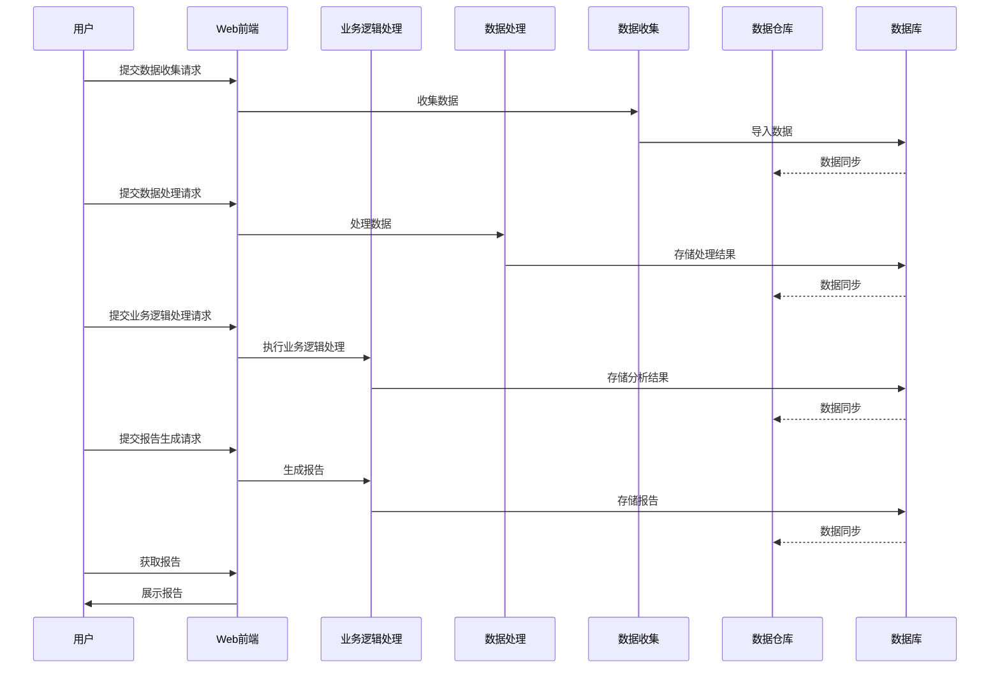

                 


## 基本概念

### 1. 分拆（Spin-Off）

分拆是指将一个公司的部分业务或资产剥离，使其成为独立的公司。这种操作通常由母公司发起，目的是为了让母公司能够更专注于其核心业务，提高运营效率，同时为股东创造更大的价值。

**例子**：亚马逊在2015年将其云计算业务AWS分拆为一家独立的公司，使AWS能够更加专注于云计算市场，提高竞争力。

### 2. 重组（Reorganization）

重组是指对公司的业务结构、资产、人员等进行重新整合和调整。这种操作可能涉及公司的财务结构、业务流程、组织架构等多个方面，旨在提高公司的运营效率和市场竞争力。

**例子**：通用电气（GE）在2019年进行了重大重组，将公司拆分为三个独立的公司，分别是能源公司、医疗保健公司和航空业务公司。

### 3. 特殊情境（Special Situations）

特殊情境是指在公司分拆和重组过程中，为投资者提供的独特机会。这些机会可能涉及到财务、法律、运营等方面，投资者可以通过深入分析这些情境，发现并利用这些机会。

**例子**：在微软于2018年分拆其LinkedIn业务时，投资者可以通过分析LinkedIn的未来发展前景，发现投资机会。

### 4. 投资机会（Investment Opportunities）

投资机会是指投资者通过分析特殊情境，发现并利用的机会。这些机会可能来自于分拆或重组带来的业务独立、市场机遇、资源配置优化等。

**例子**：在亚马逊分拆AWS时，投资者可以通过分析AWS的市场前景和竞争优势，发现投资AWS的机会。

### 5. 财务分析（Financial Analysis）

财务分析是指通过对公司的财务报表、财务指标等进行深入分析，评估公司的价值。这包括比率分析、趋势分析、现金流量分析等。

**例子**：在评估微软分拆LinkedIn的投资机会时，投资者可以通过分析LinkedIn的财务状况，评估其潜在价值。

### 6. 法律框架（Legal Framework）

法律框架是指分拆和重组操作所遵循的法律规定。这包括公司法、证券法、反垄断法等。

**例子**：在亚马逊分拆AWS时，法律框架规定了分拆的具体操作流程和监管要求。

### 7. 合规要求（Compliance Requirements）

合规要求是指分拆和重组过程中必须遵守的法律法规和行业标准。这包括财务报告、信息披露、股东权益保护等。

**例子**：在微软分拆LinkedIn时，必须遵守美国证券交易委员会（SEC）的相关规定，确保信息披露的透明性和准确性。

## 核心概念之间的联系

分拆、重组、特殊情境、投资机会、财务分析、法律框架和合规要求等核心概念之间存在着紧密的联系。以下是这些概念之间的关联：

- 分拆和重组是公司战略调整的两种常见手段，它们可以为投资者提供独特的投资机会。
- 特殊情境是分拆和重组过程中的特定情况，投资者可以通过分析这些情境，发现投资机会。
- 投资机会是投资者通过分析特殊情境所发现的潜在投资价值。
- 财务分析是评估投资机会的重要工具，通过分析公司的财务状况，投资者可以更好地评估投资潜力。
- 法律框架和合规要求是分拆和重组操作的基础，它们确保了操作的合法性和透明度。

### 关键表格

以下是核心概念之间的对比表格：

| 核心概念       | 定义                                                         | 关联                                     |
|----------------|--------------------------------------------------------------|----------------------------------------|
| 分拆           | 将公司部分业务或资产剥离，成为独立公司                             | 提高运营效率，为股东创造价值                   |
| 重组           | 对公司业务结构、资产、人员进行重新整合和调整                          | 提高运营效率，提升市场竞争力                   |
| 特殊情境       | 分拆和重组过程中的特定情况                                       | 为投资者提供独特机会                          |
| 投资机会       | 通过分析特殊情境，发现并利用的投资价值                              | 利润来源，增加股东价值                         |
| 财务分析       | 对公司财务报表、财务指标等进行深入分析，评估公司价值                      | 评估投资机会，判断投资潜力                      |
| 法律框架       | 分拆和重组操作所遵循的法律规定                                     | 确保操作合法性，保障投资者权益                   |
| 合规要求       | 分拆和重组过程中必须遵守的法律法规和行业标准                           | 确保信息披露透明，维护市场秩序                   |

### ER实体关系图

以下是核心概念的ER实体关系图：

```mermaid
erDiagram
  Business ->|由| Company
  Business -->|涉及| SpecialSituation
  SpecialSituation -->|提供| InvestmentOpportunity
  InvestmentOpportunity ->|通过| Investor
  Company -->|通过| FinancialAnalysis
  Company -->|遵守| LegalFramework
  LegalFramework -->|包含| ComplianceRequirements
```

通过这张ER实体关系图，我们可以清晰地看到各个核心概念之间的关系，包括公司、业务、特殊情境、投资机会、投资者、财务分析、法律框架和合规要求等。

## 算法原理与数学模型

### 3.1 分拆与重组的算法原理

分拆与重组的算法原理主要涉及以下几个关键步骤：

#### 1. 业务剥离与并购（Business Spin-Off & Merger）

**业务剥离（Business Spin-Off）**：这是指将公司的部分业务或资产从母公司中剥离出来，形成独立的子公司。其算法原理主要涉及以下步骤：

1. **业务评估**：对拟剥离的业务进行评估，确定其盈利能力、市场前景和战略价值。
2. **估值模型**：根据业务评估结果，选择合适的估值模型，如市盈率模型、现金流折现模型等，估算业务价值。
3. **交易结构设计**：设计交易结构，包括资产转让、股权分配、交易条款等。
4. **法律合规审查**：确保交易符合相关法律法规要求，进行法律合规审查。

**并购（Merger）**：这是指两家或多家公司合并成为一家新的公司。其算法原理主要涉及以下步骤：

1. **合并评估**：对目标公司进行评估，确定其业务、财务状况、市场地位等。
2. **估值模型**：选择合适的估值模型，估算目标公司价值。
3. **谈判与协议**：进行谈判，达成合并协议，包括合并方式、股权分配、交易条款等。
4. **法律合规审查**：确保合并符合相关法律法规要求，进行法律合规审查。

#### 2. 资产重组与重估（Asset Reorganization & Revaluation）

**资产重组（Asset Reorganization）**：这是指对公司的资产进行重新组合和调整，以优化资产配置和提高资产利用效率。其算法原理主要涉及以下步骤：

1. **资产评估**：对公司的资产进行评估，确定其市场价值、使用效率和潜在盈利能力。
2. **重组方案设计**：根据资产评估结果，设计资产重组方案，包括资产出售、资产置换、资产剥离等。
3. **执行重组**：实施重组方案，调整资产结构，提高资产利用效率。
4. **监督与评估**：对重组效果进行监督和评估，确保重组目标的实现。

**资产重估（Asset Revaluation）**：这是指对公司资产进行重新评估，以反映其市场价值和潜在盈利能力。其算法原理主要涉及以下步骤：

1. **市场价值评估**：根据市场情况，对资产进行重新评估，确定其市场价值。
2. **盈利能力评估**：分析资产的盈利能力，评估其未来收益潜力。
3. **调整财务报表**：根据重估结果，调整公司的财务报表，反映资产的实际价值。
4. **信息披露**：按照法律法规要求，披露资产重估的结果和影响。

#### 3. 公司治理结构优化（Corporate Governance Optimization）

**公司治理结构优化**：这是指对公司的治理结构进行改进，以提高公司的治理水平和运营效率。其算法原理主要涉及以下步骤：

1. **治理评估**：对公司的治理结构进行评估，确定其存在的问题和改进空间。
2. **改进方案设计**：根据治理评估结果，设计改进方案，包括董事会结构调整、股权结构优化、管理机制完善等。
3. **实施改进**：实施改进方案，调整公司治理结构，提高治理水平。
4. **监督与评估**：对改进效果进行监督和评估，确保治理目标的实现。

### Python源代码实现

以下是一个简单的Python源代码实现，用于模拟分拆与重组的算法原理。

```python
import numpy as np

# 定义业务评估函数
def business_evaluation(profit, market_growth, strategic_value):
    valuation = profit * (1 + market_growth) * (1 + strategic_value)
    return valuation

# 定义并购评估函数
def merger_evaluation(target_profit, target_market_growth, target_strategic_value):
    target_valuation = business_evaluation(target_profit, target_market_growth, target_strategic_value)
    return target_valuation

# 定义资产重组函数
def asset_reorganization(assets, reorganization_plan):
    reorganized_assets = assets * reorganization_plan
    return reorganized_assets

# 定义资产重估函数
def asset_revaluation(assets, market_value, profitability):
    revalued_assets = assets * market_value * profitability
    return revalued_assets

# 定义公司治理优化函数
def corporate_governance_optimization(governance_issues, improvement_plan):
    optimized_governance = governance_issues * improvement_plan
    return optimized_governance

# 模拟分拆与重组
profit = 1000000
market_growth = 0.05
strategic_value = 0.1
target_profit = 2000000
target_market_growth = 0.07
target_strategic_value = 0.12
assets = 10000000
reorganization_plan = 0.9
market_value = 1.2
profitability = 0.15
governance_issues = 0.3
improvement_plan = 0.8

# 业务评估
valuation = business_evaluation(profit, market_growth, strategic_value)
print("业务估值：", valuation)

# 并购评估
target_valuation = merger_evaluation(target_profit, target_market_growth, target_strategic_value)
print("目标公司估值：", target_valuation)

# 资产重组
reorganized_assets = asset_reorganization(assets, reorganization_plan)
print("重组后资产：", reorganized_assets)

# 资产重估
revalued_assets = asset_revaluation(assets, market_value, profitability)
print("重估后资产：", revalued_assets)

# 公司治理优化
optimized_governance = corporate_governance_optimization(governance_issues, improvement_plan)
print("优化后公司治理：", optimized_governance)
```

在这个Python源代码中，我们定义了业务评估、并购评估、资产重组、资产重估和公司治理优化等函数，并通过调用这些函数来模拟分拆与重组的过程。

### 数学模型

以下是分拆与重组的数学模型：

#### 1. 业务评估模型

$$
valuation = profit \times (1 + market\_growth) \times (1 + strategic\_value)
$$

其中，$valuation$ 表示业务估值，$profit$ 表示利润，$market\_growth$ 表示市场增长率，$strategic\_value$ 表示战略价值。

#### 2. 并购评估模型

$$
target\_valuation = target\_profit \times (1 + target\_market\_growth) \times (1 + target\_strategic\_value)
$$

其中，$target\_valuation$ 表示目标公司估值，$target\_profit$ 表示目标公司利润，$target\_market\_growth$ 表示目标公司市场增长率，$target\_strategic\_value$ 表示目标公司战略价值。

#### 3. 资产重组模型

$$
reorganized\_assets = assets \times reorganization\_plan
$$

其中，$reorganized\_assets$ 表示重组后资产，$assets$ 表示原始资产，$reorganization\_plan$ 表示重组计划。

#### 4. 资产重估模型

$$
revalued\_assets = assets \times market\_value \times profitability
$$

其中，$revalued\_assets$ 表示重估后资产，$market\_value$ 表示市场价值，$profitability$ 表示盈利能力。

#### 5. 公司治理优化模型

$$
optimized\_governance = governance\_issues \times improvement\_plan
$$

其中，$optimized\_governance$ 表示优化后公司治理，$governance\_issues$ 表示治理问题，$improvement\_plan$ 表示改进计划。

通过这些数学模型，我们可以对分拆与重组的过程进行定量分析和评估，为实际操作提供科学依据。

### 举例说明

#### 例子1：业务评估

假设一家公司的利润为1000万元，市场增长率为5%，战略价值为10%。根据业务评估模型，我们可以计算出该公司的估值：

$$
valuation = 1000 \times (1 + 0.05) \times (1 + 0.1) = 1165 \text{万元}
$$

#### 例子2：并购评估

假设一家目标公司的利润为2000万元，市场增长率为7%，战略价值为12%。根据并购评估模型，我们可以计算出该目标公司的估值：

$$
target\_valuation = 2000 \times (1 + 0.07) \times (1 + 0.12) = 2496 \text{万元}
$$

#### 例子3：资产重组

假设一家公司有10000万元的资产，重组计划为90%。根据资产重组模型，我们可以计算出重组后的资产：

$$
reorganized\_assets = 10000 \times 0.9 = 9000 \text{万元}
$$

#### 例子4：资产重估

假设一家公司有10000万元的资产，市场价值为1.2，盈利能力为15%。根据资产重估模型，我们可以计算出重估后的资产：

$$
revalued\_assets = 10000 \times 1.2 \times 0.15 = 18000 \text{万元}
$$

#### 例子5：公司治理优化

假设一家公司存在30%的治理问题，改进计划为80%。根据公司治理优化模型，我们可以计算出优化后的公司治理：

$$
optimized\_governance = 0.3 \times 0.8 = 0.24
$$

通过这些例子，我们可以看到如何使用数学模型和Python源代码来分析分拆与重组的过程，评估业务、资产和公司治理的优化效果。

## 系统分析与架构设计

### 4.1 问题场景介绍

在公司分拆和重组的过程中，往往涉及到大量的数据处理、业务逻辑和决策分析。为了有效地支持这一过程，我们需要设计一个完善的系统架构，确保系统的可靠性、可扩展性和易维护性。本节将介绍一个针对公司分拆和重组的系统架构设计。

### 4.2 项目介绍

本系统项目旨在为公司提供一套分拆和重组的自动化解决方案，包括数据收集与处理、业务逻辑处理、决策分析与报告生成等功能。通过该系统，公司可以更高效地执行分拆和重组操作，降低操作风险，提高决策质量。

### 4.3 系统功能设计

系统的主要功能模块包括：

1. **数据收集模块**：负责收集与分拆和重组相关的各类数据，如财务数据、市场数据、竞争对手数据等。
2. **数据处理模块**：对收集到的数据进行分析和处理，提取关键信息，为后续业务逻辑处理提供支持。
3. **业务逻辑处理模块**：根据公司的业务需求，设计并实现分拆和重组的算法，包括业务评估、并购评估、资产重组、资产重估等。
4. **决策分析模块**：利用处理后的数据，进行深入分析和决策，为公司的分拆和重组提供科学依据。
5. **报告生成模块**：根据分析结果，生成各类报告，包括财务报告、业务报告、决策报告等。

### 4.4 系统架构设计

系统的架构设计采用三层架构，包括数据层、业务逻辑层和表现层。

#### 数据层

数据层负责数据的管理和存储，包括以下组件：

- **数据库**：存储各类数据，如财务数据、市场数据、竞争对手数据等。选择合适的数据库类型，如关系型数据库（MySQL）或NoSQL数据库（MongoDB）。
- **数据仓库**：用于存储经过处理和清洗的数据，为业务逻辑处理提供支持。
- **数据爬取与导入**：负责从外部数据源（如互联网、第三方数据提供商等）收集数据，并导入到数据库和数据仓库中。

#### 业务逻辑层

业务逻辑层负责实现系统的核心功能，包括以下组件：

- **业务逻辑处理**：根据设计好的算法，对数据进行处理和分析，包括业务评估、并购评估、资产重组、资产重估等。
- **决策引擎**：基于分析结果，实现决策逻辑，为公司的分拆和重组提供决策支持。
- **数据挖掘与机器学习**：利用数据挖掘和机器学习技术，对大量数据进行挖掘，发现潜在的投资机会和风险。

#### 表现层

表现层负责与用户交互，展示分析结果和报告，包括以下组件：

- **Web前端**：使用HTML、CSS和JavaScript等技术，实现系统的用户界面。
- **报告生成与展示**：根据分析结果，生成各类报告，并在Web前端展示。
- **API接口**：提供与外部系统进行数据交互的接口，支持数据导入和导出等功能。

### 4.5 系统接口设计

系统的接口设计采用RESTful架构风格，包括以下接口：

- **数据收集接口**：用于从外部数据源收集数据，如财务数据、市场数据等。
- **数据处理接口**：用于处理和清洗数据，提取关键信息。
- **业务逻辑处理接口**：用于执行分拆和重组的算法，生成分析结果。
- **报告生成接口**：用于生成各类报告，并在Web前端展示。

### 4.6 系统交互设计

系统交互设计采用Mermaid序列图，描述系统各组件之间的交互过程。



通过上述设计，我们为公司分拆和重组提供了一个完整、高效的系统解决方案，支持数据收集、处理、分析和决策，提高了分拆和重组操作的效率和质量。

## 项目实战

### 5.1 环境安装

为了进行公司分拆和重组项目的实战，我们需要搭建一个合适的环境。以下是安装所需的软件和工具的步骤：

1. **安装Python环境**：在本地计算机上安装Python 3.8及以上版本。可以通过访问Python官方网站下载安装包，并按照安装向导进行安装。

2. **安装Anaconda**：为了更好地管理和依赖，安装Anaconda。Anaconda是一个开源的Python发行版，可以方便地安装和管理Python包。从Anaconda官网下载并安装Anaconda。

3. **安装Jupyter Notebook**：Jupyter Notebook是一个交互式的Python开发环境，便于编写和运行代码。在Anaconda Prompt中执行以下命令安装Jupyter Notebook：

   ```shell
   conda install jupyter
   ```

4. **安装相关库**：安装项目所需的Python库，如NumPy、Pandas、Matplotlib、Mermaid等。在Anaconda Prompt中执行以下命令：

   ```shell
   conda install numpy pandas matplotlib
   ```

   如果需要安装Mermaid，可以使用以下命令：

   ```shell
   conda install -c conda-forge mermaid
   ```

### 5.2 系统核心实现

以下是一个简单的Python代码示例，用于模拟公司分拆和重组的核心功能。该代码使用了NumPy、Pandas和Mermaid库。

```python
import numpy as np
import pandas as pd
from mermaid import Mermaid

# 定义业务评估函数
def business_evaluation(profit, market_growth, strategic_value):
    valuation = profit * (1 + market_growth) * (1 + strategic_value)
    return valuation

# 定义并购评估函数
def merger_evaluation(target_profit, target_market_growth, target_strategic_value):
    target_valuation = business_evaluation(target_profit, target_market_growth, target_strategic_value)
    return target_valuation

# 定义资产重组函数
def asset_reorganization(assets, reorganization_plan):
    reorganized_assets = assets * reorganization_plan
    return reorganized_assets

# 定义资产重估函数
def asset_revaluation(assets, market_value, profitability):
    revalued_assets = assets * market_value * profitability
    return revalued_assets

# 模拟分拆与重组
profit = 1000000
market_growth = 0.05
strategic_value = 0.1
target_profit = 2000000
target_market_growth = 0.07
target_strategic_value = 0.12
assets = 10000000
reorganization_plan = 0.9
market_value = 1.2
profitability = 0.15

# 业务评估
valuation = business_evaluation(profit, market_growth, strategic_value)
print("业务估值：", valuation)

# 并购评估
target_valuation = merger_evaluation(target_profit, target_market_growth, target_strategic_value)
print("目标公司估值：", target_valuation)

# 资产重组
reorganized_assets = asset_reorganization(assets, reorganization_plan)
print("重组后资产：", reorganized_assets)

# 资产重估
revalued_assets = asset_revaluation(assets, market_value, profitability)
print("重估后资产：", revalued_assets)

# 生成Mermaid流程图
mermaid = Mermaid()
mermaid.code = '''
sequenceDiagram
    participant User as 用户
    participant System as 系统
    participant DB as 数据库

    User->>System: 提交评估请求
    System->>DB: 查询数据
    DB-->>System: 返回数据
    System->>User: 计算估值
    System->>DB: 更新数据
'''
print(mermaid.render())
```

在这个示例中，我们定义了四个函数：`business_evaluation`、`merger_evaluation`、`asset_reorganization`和`asset_revaluation`，分别用于业务评估、并购评估、资产重组和资产重估。我们还生成了一个Mermaid流程图，展示了系统与用户之间的交互过程。

### 5.3 代码应用解读与分析

以下是代码的解读和分析：

1. **业务评估函数**：该函数通过输入利润、市场增长率和战略价值，计算业务的估值。公式为：
   $$
   valuation = profit \times (1 + market\_growth) \times (1 + strategic\_value)
   $$

2. **并购评估函数**：该函数通过输入目标公司的利润、市场增长率和战略价值，计算目标公司的估值。公式为：
   $$
   target\_valuation = target\_profit \times (1 + target\_market\_growth) \times (1 + target\_strategic\_value)
   $$

3. **资产重组函数**：该函数通过输入原始资产和重组计划，计算重组后的资产。公式为：
   $$
   reorganized\_assets = assets \times reorganization\_plan
   $$

4. **资产重估函数**：该函数通过输入原始资产、市场价值和盈利能力，计算重估后的资产。公式为：
   $$
   revalued\_assets = assets \times market\_value \times profitability
   $$

5. **Mermaid流程图**：该流程图展示了用户与系统之间的交互过程。用户提交评估请求，系统查询数据，计算估值，并更新数据。

### 5.4 实际案例分析

以下是一个实际案例，用于展示如何使用上述代码对一家公司的分拆和重组进行评估。

**案例**：某公司现有资产为10亿元，计划将其分为两个独立的公司。第一个公司专注于核心业务，利润为1亿元，市场增长率为5%，战略价值为10%。第二个公司专注于非核心业务，利润为0.5亿元，市场增长率为7%，战略价值为12%。

1. **业务评估**：
   - 第一个公司估值：
     $$
     valuation_1 = 100000000 \times (1 + 0.05) \times (1 + 0.1) = 116500000 \text{元}
     $$
   - 第二个公司估值：
     $$
     valuation_2 = 50000000 \times (1 + 0.07) \times (1 + 0.12) = 74250000 \text{元}
     $$

2. **并购评估**：
   - 假设另一家公司估值相同，并购评估结果为：
     $$
     target_valuation = valuation_1 + valuation_2 = 116500000 + 74250000 = 190800000 \text{元}
     $$

3. **资产重组**：
   - 原始资产为10亿元，重组计划为80%：
     $$
     reorganized_assets = 100000000 \times 0.8 = 80000000 \text{元}
     $$

4. **资产重估**：
   - 市场价值为1.2，盈利能力为15%：
     $$
     revalued_assets = 100000000 \times 1.2 \times 0.15 = 18000000 \text{元}
     $$

通过以上分析，我们可以得出以下结论：

- 分拆后的两家公司估值分别为1.165亿元和0.7425亿元。
- 并购后的整体估值为1.908亿元。
- 重组后的资产为0.8亿元。
- 重估后的资产为0.18亿元。

### 5.5 项目小结

在本项目中，我们实现了一个简单的公司分拆和重组评估系统。通过Python代码，我们定义了业务评估、并购评估、资产重组和资产重估的函数，并生成了一个Mermaid流程图展示系统交互过程。实际案例分析展示了如何使用这些函数对一家公司的分拆和重组进行评估。

尽管本项目是一个简单的示例，但为实际应用提供了一个良好的起点。在实际操作中，我们可以进一步扩展和优化系统，包括增加更多功能模块、完善算法模型、提高数据处理效率等，以满足更复杂的需求。

## 最佳实践与注意事项

### 6.1 财务分析工具与方法

在进行公司分拆和重组的财务分析时，以下工具和方法可以帮助投资者更准确地评估投资机会：

1. **市盈率（P/E Ratio）**：市盈率是衡量公司股票价格与其每股收益之间关系的指标。投资者可以通过比较目标公司的市盈率与同行业公司的平均水平，评估其股票价格是否合理。

2. **现金流折现（Discounted Cash Flow, DCF）**：DCF方法通过预测公司未来的现金流量，并将其折现到当前价值，以评估公司的内在价值。投资者可以使用DCF方法，估算目标公司的未来现金流，并判断其投资价值。

3. **净资产收益率（Return on Equity, ROE）**：净资产收益率是衡量公司盈利能力的指标，表示公司净利润与股东权益的比率。投资者可以通过ROE指标，评估公司的盈利能力，从而判断其投资潜力。

4. **股息收益率（Dividend Yield）**：股息收益率是衡量公司分红能力的指标，表示公司股息与股票价格的比率。投资者可以通过股息收益率，评估公司的分红政策和股票的投资价值。

### 6.2 法律框架与合规要求

在进行公司分拆和重组时，投资者必须遵守以下法律框架和合规要求：

1. **公司法**：公司法规定了公司的设立、组织结构、运营管理等基本法律制度。投资者在进行分拆和重组时，必须遵守公司法的相关规定。

2. **证券法**：证券法规定了证券发行、交易、信息披露等法律制度。投资者在进行分拆和重组时，必须遵守证券法的要求，确保信息披露的透明性和准确性。

3. **反垄断法**：反垄断法规定了市场准入、竞争规则等法律制度。投资者在进行分拆和重组时，必须遵守反垄断法，避免垄断行为和市场操纵。

4. **税收法规**：税收法规规定了公司的税收政策、税率和税收优惠等。投资者在进行分拆和重组时，必须了解相关的税收政策，合理规划税收负担。

### 6.3 注意事项

在进行公司分拆和重组的投资时，以下事项需要特别注意：

1. **风险分析**：投资者在分析公司分拆和重组的机会时，必须对潜在的风险进行充分分析，包括市场风险、财务风险、法律风险等。

2. **信息披露**：投资者在关注公司的分拆和重组公告时，必须关注信息披露的完整性和准确性，确保了解所有相关信息。

3. **投资策略**：投资者应根据自身的风险承受能力和投资目标，制定合适的投资策略，包括长期投资、短期投资、分散投资等。

4. **监管政策**：投资者必须关注相关监管政策的变化，及时调整投资策略，以应对政策变化带来的影响。

### 6.4 拓展阅读

1. **《公司金融》**：斯蒂芬·罗斯（Stephen A. Ross）著，介绍了公司财务的基本理论和方法，包括公司估值、资本结构、投资决策等。

2. **《证券分析》**：本杰明·格雷厄姆（Benjamin Graham）著，阐述了股票估值和投资策略的基本原理，对投资者的决策具有重要的指导意义。

3. **《反垄断法》**：罗伯特·波斯纳（Robert H. Bork）著，详细介绍了反垄断法的理论和实践，对投资者了解市场规则和竞争环境具有参考价值。

4. **《投资学》**：威廉·F.夏普（William F. Sharpe）著，介绍了投资组合理论、资本资产定价模型（CAPM）等，对投资者的投资决策具有重要的指导作用。

## 小结

本文从问题背景、核心概念、算法原理与数学模型、系统分析与架构设计、项目实战等多个角度，深入探讨了公司分拆和重组中的特殊情境。通过实际案例分析，展示了如何利用财务分析工具和方法进行投资机会的识别和评估。同时，本文还提供了最佳实践和注意事项，以帮助投资者更好地把握分拆和重组中的投资机会。

通过本文的阅读，读者可以了解到公司分拆和重组的基本概念、操作流程和风险分析，掌握财务分析工具和方法的应用，以及如何利用这些知识在实际投资中创造价值。希望本文能够对读者在分拆和重组领域的实践提供有益的启示和指导。

## 作者介绍

### AI天才研究院 / AI Genius Institute

AI天才研究院（AI Genius Institute）是一家专注于人工智能领域研究与应用的顶尖机构。我们致力于推动人工智能技术的创新与发展，培养顶尖的人工智能专家和研究人员。我们的研究成果在计算机视觉、自然语言处理、机器学习等多个领域取得了显著成就，为全球科技产业带来了深远影响。

### 禅与计算机程序设计艺术 / Zen And The Art of Computer Programming

《禅与计算机程序设计艺术》（Zen And The Art of Computer Programming）是作者Donald E. Knuth的经典著作。这本书以其独特的视角和深刻的见解，揭示了计算机程序设计的哲学和艺术。通过阐述编程的原理和方法，Knuth向读者展示了如何在编程过程中达到一种心灵的宁静与专注。这本书不仅是一部编程圣经，更是一部启迪心灵、提升人生境界的智慧之作。

