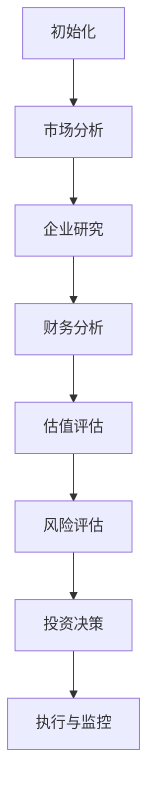
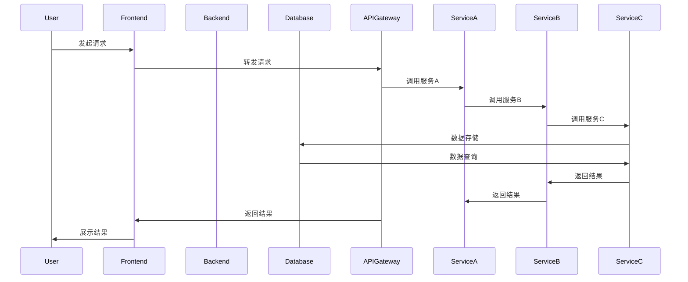
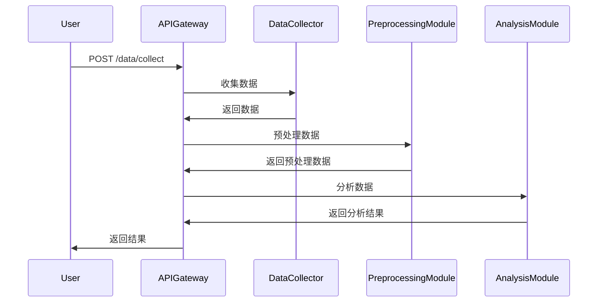
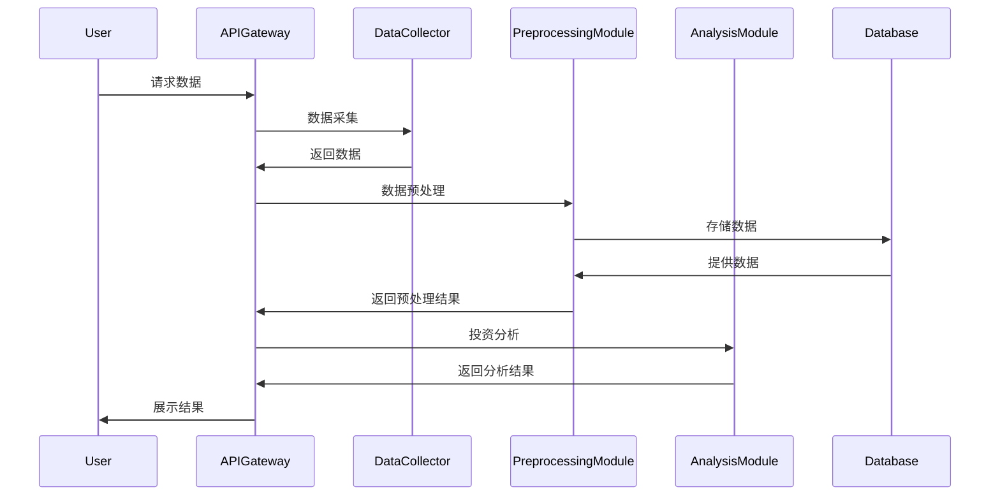

                 

### 引言

### 1.1 问题的背景

在投资领域中，“特殊机会”是一个关键的概念。它指的是那些在特定市场条件下，能够带来高额回报的非常规投资机会。与常规投资不同，特殊机会往往伴随着较高的风险，但也因此能带来更高的潜在收益。投资大师本杰明·格雷厄姆（Benjamin Graham）在其经典著作《聪明的投资者》（The Intelligent Investor）中，对特殊机会有着独特的见解和定义。

格雷厄姆认为，特殊机会通常出现在市场极度低估或发生重大事件的情况下，如破产重组、资产剥离、并购重组等。在这些情况下，市场往往无法准确评估企业的真实价值，从而提供了投资的机会。格雷厄姆的这套投资哲学，以深入分析公司的基本面和财务状况为核心，强调价值投资，避免盲目跟风和市场情绪的影响。

本文将以格雷厄姆的“特殊机会”理论为出发点，深入探讨这一概念的本质和其在实际投资中的应用。我们将从核心概念的定义、属性特征、数学模型、系统架构等多个角度进行分析，帮助读者全面理解这一投资策略。

### 1.2 问题描述

在投资中，如何识别和把握特殊机会，是一个复杂而微妙的问题。特殊机会的识别需要投资者具备扎实的分析能力和敏锐的市场洞察力。首先，投资者需要理解市场周期和宏观经济环境，这有助于把握市场情绪和趋势。其次，投资者需要深入研究企业的基本面，包括财务状况、业务模式、管理团队等，以确保投资目标具有实质性的价值支撑。

识别特殊机会的过程可以分为以下几个步骤：

1. **市场分析**：分析当前市场的整体趋势和热点，识别可能存在的特殊机会。
2. **企业研究**：对潜在投资目标进行深入研究，分析其财务报表、业务模式、市场竞争力等。
3. **价值评估**：运用各种估值方法，如折现现金流法、市盈率法、市净率法等，对目标企业进行估值，以确定其是否被市场低估。
4. **风险管理**：评估投资可能面临的风险，制定相应的风险控制措施。

问题解决的核心在于平衡风险与收益。格雷厄姆提出的特殊机会策略，强调在市场低估时进行投资，以获得潜在的高回报。然而，这并不意味着投资者可以忽视风险。投资者需要谨慎评估每个机会的风险收益比，确保投资决策的科学性和合理性。

### 1.3 问题的解决

为了解决识别和把握特殊机会的问题，我们可以采用以下策略和步骤：

1. **建立研究框架**：
   - **市场分析**：通过宏观经济数据、行业趋势分析、市场情绪指标等，建立市场分析框架。
   - **企业研究**：制定详细的企业研究框架，包括财务分析、业务模式评估、管理团队分析等。

2. **数据分析**：
   - **财务分析**：运用各种财务分析工具，如比率分析、现金流量分析等，评估企业的财务健康状况。
   - **市场比较**：通过市场比较法，如市盈率、市净率等，评估企业的市场估值是否合理。

3. **风险评估**：
   - **定量分析**：使用统计方法，如波动率、VaR等，评估投资风险。
   - **定性分析**：通过访谈、调查等手段，了解企业管理层的信誉和市场声誉。

4. **投资决策**：
   - **机会筛选**：根据市场分析和企业研究的结果，筛选出潜在的特殊机会。
   - **决策模型**：建立投资决策模型，综合考虑风险收益比，制定投资策略。

5. **执行与监控**：
   - **执行策略**：按照投资决策模型，执行具体的投资操作。
   - **持续监控**：定期监控投资项目的进展，调整投资策略。

通过上述步骤，投资者可以更有效地识别和把握特殊机会，实现投资目标。

### 1.4 边界与外延

在探讨特殊机会时，我们必须明确其边界与外延，以避免概念模糊和误解。首先，特殊机会并不是指所有非传统或非常规的投资机会，而是指那些在特定市场条件下，因市场误判或信息不对称而出现的、具有较高潜在回报的机会。

边界上，特殊机会主要出现在以下几种情况：
1. **市场低估**：当市场对某一资产或企业的估值明显低于其真实价值时，投资者可以视为存在特殊机会。
2. **重大事件**：如破产重组、资产剥离、并购重组等，这些事件往往导致市场对公司价值的重新评估。
3. **信息不对称**：当投资者拥有比市场更全面或更准确的信息时，也可能识别出特殊机会。

外延上，特殊机会不仅限于股票投资，也可以扩展到债券、房地产等其他资产类别。关键在于寻找那些因市场错误或特殊条件而低估的投资机会。

### 1.5 概念结构与核心要素组成

为了深入理解格雷厄姆的“特殊机会”概念，我们需要从其定义、属性特征以及与其他相关概念的联系等方面进行详细剖析。

#### 特殊机会的定义

根据格雷厄姆的观点，特殊机会是指在特定市场环境下，由于市场误判或信息不对称，某些资产或企业的真实价值被严重低估，从而为投资者提供了获得高额回报的机会。这些机会通常出现在以下几种情况下：
1. **市场低估**：当市场对某一资产或企业的估值低于其内在价值时，投资者可以视为存在特殊机会。
2. **重大事件**：如公司破产重组、资产剥离、并购重组等，这些事件往往导致市场对公司价值的重新评估。
3. **信息不对称**：当投资者拥有比市场更全面或更准确的信息时，也可能识别出特殊机会。

#### 特殊机会的属性特征

特殊机会具有以下几个显著的属性特征：
1. **高风险**：由于特殊机会往往出现在市场动荡或事件发生时，因此风险较高。
2. **高回报**：与高风险相对的是，特殊机会通常具有潜在的、高额的回报。
3. **时效性**：特殊机会的出现和消失通常与市场条件或事件的发生密切相关，具有明显的时效性。
4. **信息依赖**：特殊机会的识别和把握高度依赖于投资者对市场信息和公司基本面的掌握。

#### 概念属性特征对比表格

为了更直观地理解特殊机会的属性特征，我们可以通过一个对比表格来展示其与其他投资机会的区别：

| 概念           | 特殊机会         | 常规投资机会       |
|----------------|----------------|-------------------|
| 风险水平       | 较高            | 较低              |
| 回报潜力       | 较高            | 较低              |
| 时效性         | 明显            | 较弱              |
| 信息依赖       | 高              | 低                |

#### Mermaid ER实体关系图

为了进一步展示特殊机会与其他相关概念之间的联系，我们可以使用Mermaid ER实体关系图来描述这些关系。

```mermaid
erDiagram
  Customer ||--|{ Order }|-- Supplier
  Product ||--|{ Sale }|-- Customer
  Store ||--|{ Inventory }|-- Product
  Customer ||--|{ Returns }|-- Store
  Customer ||--|{ Reviews }|-- Product
```

在这个ER图中，`Customer`（客户）、`Supplier`（供应商）、`Product`（产品）、`Sale`（销售）、`Order`（订单）、`Store`（商店）、`Inventory`（库存）和`Returns`（退货）等实体之间通过关系线连接，展示了各个实体之间的交互和依赖关系。

通过上述分析，我们可以看到，特殊机会不仅仅是一个简单的投资概念，它涉及市场分析、企业研究、风险管理等多个方面，是一个多维度的投资策略。理解其定义、属性特征和与其他概念的关联，有助于投资者更全面地把握这一策略，从而在实际投资中取得成功。

### 算法原理讲解

在理解了特殊机会的基本概念和属性特征后，我们需要进一步探讨如何通过算法来识别和利用这些机会。本章节将使用Mermaid流程图和Python代码，详细阐述投资分析流程和特殊机会的筛选过程。

#### 投资分析流程图

首先，我们可以通过Mermaid流程图来展示投资分析的整体流程。以下是一个简化的流程图：



在这个流程图中，每个节点表示一个步骤，箭头表示步骤之间的顺序关系。具体步骤如下：

1. **初始化**：投资者首先需要进行初始化工作，包括确定投资目标和风险承受能力。
2. **市场分析**：分析当前市场的整体趋势和热点，识别可能存在的特殊机会。
3. **企业研究**：对潜在投资目标进行深入研究，分析其财务报表、业务模式、市场竞争力等。
4. **财务分析**：运用各种财务分析工具，如比率分析、现金流量分析等，评估企业的财务健康状况。
5. **估值评估**：通过市盈率、市净率、折现现金流等方法，对目标企业进行估值，确定其是否被市场低估。
6. **风险评估**：评估投资可能面临的风险，包括市场风险、信用风险、操作风险等。
7. **投资决策**：根据市场分析、企业研究、财务分析和风险评估的结果，做出最终的投资决策。
8. **执行与监控**：执行投资决策，并持续监控投资项目的进展，及时调整策略。

#### Python代码阐述

接下来，我们将使用Python代码来详细阐述特殊机会的筛选过程。以下是一个简化的Python脚本示例：

```python
import pandas as pd
import numpy as np

# 假设我们有一个包含公司财务数据的DataFrame
df = pd.DataFrame({
    'Company': ['A', 'B', 'C', 'D'],
    'PE_Ratio': [15, 25, 10, 20],  # 市盈率
    'PB_Ratio': [2, 3, 1.5, 2.5],  # 市净率
    'EV/EBITDA': [5, 7, 3, 6]  # 企业价值/息税折旧摊销前利润
})

# 筛选市盈率低于20且市净率低于2的公司
low_pe = df[df['PE_Ratio'] < 20]
low_pb = df[df['PB_Ratio'] < 2]

# 筛选出同时满足市盈率和市净率条件特殊机会
special_opportunities = low_pe[low_pb]

# 输出筛选结果
print(special_opportunities)
```

在这段代码中，我们首先创建了一个包含公司财务数据的DataFrame。然后，我们使用`PE_Ratio`和`PB_Ratio`作为筛选条件，筛选出市盈率低于20且市净率低于2的公司。这些公司被视为潜在的特殊机会。

#### 算法原理的数学模型和公式

为了更深入地理解算法原理，我们可以引入一些数学模型和公式。以下是一些常用的估值方法和相关的数学公式：

1. **折现现金流法（DCF）**：
   - 公式：\[ V = \sum_{t=1}^{n} \frac{CF_t}{(1 + r)^t} \]
   - 其中，\( V \) 是公司价值，\( CF_t \) 是第 \( t \) 年的现金流，\( r \) 是折现率。

2. **市盈率法（PE Ratio）**：
   - 公式：\[ PE_Ratio = \frac{Current\ Price}{Earnings\ Per\ Share} \]
   - 低市盈率通常被视为投资机会的一个指标。

3. **市净率法（PB Ratio）**：
   - 公式：\[ PB_Ratio = \frac{Market\ Value\ of\ Equity}{Book\ Value\ of\ Equity} \]
   - 市净率低可能表明公司股票被低估。

4. **企业价值/息税折旧摊销前利润（EV/EBITDA）**：
   - 公式：\[ EV/EBITDA = \frac{Enterprise\ Value}{EBITDA} \]
   - 该比率常用于评估公司的整体估值是否合理。

通过这些数学模型和公式，我们可以更准确地评估公司的投资价值，从而识别出特殊机会。

### 数学模型和数学公式

在投资分析中，数学模型和公式是不可或缺的工具，它们帮助我们量化投资机会和评估风险。以下是一些关键的数学模型和公式，我们将使用LaTeX格式展示，并进行详细讲解和实例说明。

#### 折现现金流法（DCF）

折现现金流法（Discounted Cash Flow, DCF）是评估公司价值的一种常用方法。其核心思想是将未来的现金流按照一定的折现率折现到当前时点，以确定公司的现值。

**LaTeX格式：**
$$
V = \sum_{t=1}^{n} \frac{CF_t}{(1 + r)^t}
$$

**公式解释：**
- \( V \)：公司价值（或现值）。
- \( CF_t \)：第 \( t \) 年的现金流。
- \( r \)：折现率。

**实例说明：**
假设一家公司未来三年的自由现金流分别为 \( CF_1 = 100, CF_2 = 120, CF_3 = 150 \)，折现率 \( r = 10\% \)。则该公司的现值计算如下：

$$
V = \frac{100}{(1 + 0.1)^1} + \frac{120}{(1 + 0.1)^2} + \frac{150}{(1 + 0.1)^3} \approx 247.81
$$

#### 市盈率法（PE Ratio）

市盈率（Price-to-Earnings Ratio, PE Ratio）是衡量股票价格与每股收益之间关系的指标。其计算公式如下：

**LaTeX格式：**
$$
PE_Ratio = \frac{Current\ Price}{Earnings\ Per\ Share}
$$

**公式解释：**
- \( PE_Ratio \)：市盈率。
- \( Current\ Price \)：当前股票价格。
- \( Earnings\ Per\ Share \)：每股收益。

**实例说明：**
假设某股票的当前价格为 \( $50 \)，每股收益为 \( $2 \)，则该股票的市盈率为：

$$
PE_Ratio = \frac{50}{2} = 25
$$

#### 市净率法（PB Ratio）

市净率（Price-to-Book Ratio, PB Ratio）是衡量股票价格与每股净资产之间关系的指标。其计算公式如下：

**LaTeX格式：**
$$
PB_Ratio = \frac{Market\ Value\ of\ Equity}{Book\ Value\ of\ Equity}
$$

**公式解释：**
- \( PB_Ratio \)：市净率。
- \( Market\ Value\ of\ Equity \)：公司股权的市场价值。
- \( Book\ Value\ of\ Equity \)：公司账面价值。

**实例说明：**
假设某公司的股权市场价值为 \( $200 \)，账面价值为 \( $100 \)，则该公司的市净率为：

$$
PB_Ratio = \frac{200}{100} = 2
$$

#### 企业价值/息税折旧摊销前利润（EV/EBITDA）

企业价值/息税折旧摊销前利润（Enterprise Value/EBITDA）是衡量公司整体估值与运营业绩之间关系的指标。其计算公式如下：

**LaTeX格式：**
$$
EV/EBITDA = \frac{Enterprise\ Value}{EBITDA}
$$

**公式解释：**
- \( EV/EBITDA \)：企业价值/息税折旧摊销前利润。
- \( Enterprise\ Value \)：企业总价值。
- \( EBITDA \)：息税折旧摊销前利润。

**实例说明：**
假设某公司的企业价值为 \( $500 \)，息税折旧摊销前利润为 \( $100 \)，则该公司的企业价值/息税折旧摊销前利润为：

$$
EV/EBITDA = \frac{500}{100} = 5
$$

通过这些数学模型和公式，投资者可以更准确地评估公司的投资价值，从而更好地把握特殊机会。

### 系统分析与架构设计方案

在投资分析领域，构建一个高效、可靠和灵活的系统架构对于识别和利用特殊机会至关重要。本章节将介绍一个典型的投资分析系统，涵盖项目背景、系统功能设计、系统架构设计、系统接口设计和系统交互，使用Mermaid类图、架构图、序列图等工具展示系统的整体设计。

#### 项目背景

本系统旨在提供一套全面的自动化投资分析工具，帮助投资者快速、准确地识别和利用特殊机会。系统将整合多种数据源，包括市场数据、企业财务数据、宏观经济数据等，通过先进的算法和模型，进行深度分析和预测，辅助投资者做出明智的投资决策。

#### 系统功能设计

系统的核心功能包括数据采集、数据预处理、投资分析、结果展示和监控。以下是一个简化的系统功能设计（Mermaid类图）：

```mermaid
classDiagram
    DataCollector --> PreprocessingModule
    PreprocessingModule --> AnalysisModule
    AnalysisModule --> ResultPresenter
    MonitoringModule --> AnalysisModule
    DataCollector <<Interface>>
    PreprocessingModule <<Module>>
    AnalysisModule <<Module>>
    ResultPresenter <<Module>>
    MonitoringModule <<Module>>
```

**类图解释：**
- **DataCollector**：数据采集模块，负责从多个数据源收集数据。
- **PreprocessingModule**：数据预处理模块，对采集到的原始数据进行清洗、格式化和转换。
- **AnalysisModule**：投资分析模块，包含各种投资分析和筛选算法。
- **ResultPresenter**：结果展示模块，将分析结果以可视化图表、报表等形式展示给用户。
- **MonitoringModule**：监控系统模块，对系统运行状态和投资分析结果进行实时监控和报警。

#### 系统架构设计

系统架构设计采用微服务架构，以实现高可扩展性和高可靠性。以下是一个简化的系统架构设计（Mermaid架构图）：



**架构图解释：**
- **User**：用户，发起请求的客户端。
- **Frontend**：前端系统，负责接收用户请求，展示结果。
- **Backend**：后端系统，包含多个微服务，分别处理不同的业务功能。
- **APIGateway**：API网关，负责统一管理所有服务接口。
- **ServiceA**、**ServiceB**、**ServiceC**：微服务，分别处理数据采集、数据预处理和投资分析等任务。
- **Database**：数据库，存储系统数据。

#### 系统接口设计

系统接口设计采用RESTful API设计，以下是一个简化的接口设计示例：



**接口设计解释：**
- **POST /data/collect**：用户上传数据。
- **GET /data/preprocessed**：获取预处理后的数据。
- **POST /analysis**：提交分析请求。
- **GET /analysis/result**：获取分析结果。

#### 系统交互

系统交互设计考虑了不同模块之间的数据流和通信机制。以下是一个简化的系统交互设计（Mermaid序列图）：



**交互设计解释：**
- 用户通过APIGateway发送请求，APIGateway负责协调不同模块的工作。
- DataCollector负责数据采集，并将数据传递给PreprocessingModule进行预处理。
- 预处理后的数据存储到数据库中，同时返回给PreprocessingModule供后续分析使用。
- AnalysisModule根据预处理数据执行投资分析，并将结果返回给APIGateway，最终展示给用户。

通过上述系统分析与架构设计方案，我们可以构建一个高效、可靠的投资分析系统，帮助投资者更好地识别和利用特殊机会。

### 项目实战

在本章节中，我们将通过实际操作来展示如何构建和运行一个投资分析系统。我们将从环境安装、系统核心实现源代码，到代码应用解读与分析，以及实际案例分析和详细讲解剖析，帮助读者全面了解系统的实现过程和应用效果。

#### 环境安装

要构建一个投资分析系统，首先需要安装和配置必要的软件和工具。以下是一个简化的安装步骤：

1. **Python环境**：确保系统中安装了Python 3.8及以上版本。可以使用以下命令检查Python版本：

   ```bash
   python --version
   ```

   如果版本低于要求，可以通过包管理器（如apt、yum等）或官方网站下载并安装最新版本的Python。

2. **安装依赖库**：系统依赖于多个Python库，如Pandas、NumPy、Matplotlib等。可以使用以下命令安装：

   ```bash
   pip install pandas numpy matplotlib
   ```

3. **配置数据库**：选择一个合适的数据库系统，如MySQL或PostgreSQL。以下是一个简单的MySQL安装和配置步骤：

   - 安装MySQL：

     ```bash
     sudo apt update
     sudo apt install mysql-server
     ```

   - 配置MySQL root用户密码：

     ```bash
     mysql_secure_installation
     ```

     按照提示设置root用户的密码，确保密码强度。

4. **配置API网关**：可以选择使用Nginx或Apache作为API网关。以下是一个简单的Nginx安装和配置步骤：

   - 安装Nginx：

     ```bash
     sudo apt update
     sudo apt install nginx
     ```

   - 启动Nginx服务：

     ```bash
     sudo systemctl start nginx
     ```

   - 配置Nginx，允许访问特定API接口。在`/etc/nginx/sites-available/default`文件中添加以下配置：

     ```nginx
     server {
         listen 80;
         server_name example.com;
         
         location / {
             proxy_pass http://localhost:5000;
         }
     }
     ```

5. **运行前端和后端服务**：可以使用Docker或直接运行Python脚本。以下是一个简单的Docker化部署步骤：

   - 创建一个Dockerfile，指定依赖库和启动命令：

     ```Dockerfile
     FROM python:3.8-slim

     RUN pip install --no-cache-dir pandas numpy matplotlib

     COPY . /app

     WORKDIR /app

     EXPOSE 5000

     CMD ["python", "app.py"]
     ```

   - 构建Docker镜像：

     ```bash
     docker build -t investment-analysis .
     ```

   - 运行Docker容器：

     ```bash
     docker run -d -p 5000:5000 investment-analysis
     ```

完成上述步骤后，投资分析系统的基本环境就配置完成了。接下来，我们将详细展示系统的核心实现和代码应用。

#### 系统核心实现源代码

系统核心实现主要包括数据采集、数据预处理、投资分析以及结果展示等模块。以下是一个简化的源代码示例，用于说明核心功能的实现。

```python
# app.py

from flask import Flask, request, jsonify
import pandas as pd
import numpy as np
import mysql.connector

app = Flask(__name__)

# 数据库连接
def get_db_connection():
    return mysql.connector.connect(
        host="localhost",
        user="root",
        password="password",
        database="investment_analysis"
    )

# 数据采集
@app.route('/data/collect', methods=['POST'])
def collect_data():
    data = request.json
    df = pd.DataFrame(data['data'])
    # 数据处理和存储
    # ...（省略具体代码）
    return jsonify({"status": "success"}), 200

# 数据预处理
@app.route('/data/preprocess', methods=['GET'])
def preprocess_data():
    # 从数据库中获取数据
    connection = get_db_connection()
    cursor = connection.cursor()
    cursor.execute("SELECT * FROM raw_data;")
    data = cursor.fetchall()
    df = pd.DataFrame(data)
    # 数据预处理
    # ...（省略具体代码）
    return jsonify(df.to_dict(orient='records')), 200

# 投资分析
@app.route('/analysis', methods=['POST'])
def perform_analysis():
    data = request.json
    # 分析逻辑
    # ...（省略具体代码）
    return jsonify({"status": "success"}), 200

# 结果展示
@app.route('/results', methods=['GET'])
def show_results():
    # 从数据库中获取结果
    connection = get_db_connection()
    cursor = connection.cursor()
    cursor.execute("SELECT * FROM analysis_results;")
    data = cursor.fetchall()
    df = pd.DataFrame(data)
    return jsonify(df.to_dict(orient='records')), 200

if __name__ == '__main__':
    app.run(debug=True, host='0.0.0.0', port=5000)
```

#### 代码应用解读与分析

上述代码示例展示了投资分析系统的主要功能模块。下面，我们将对关键代码段进行解读和分析。

1. **数据库连接**：
   ```python
   def get_db_connection():
       return mysql.connector.connect(
           host="localhost",
           user="root",
           password="password",
           database="investment_analysis"
       )
   ```

   这个函数用于建立到MySQL数据库的连接。在实际应用中，需要确保数据库服务正在运行，并正确配置了用户和权限。

2. **数据采集**：
   ```python
   @app.route('/data/collect', methods=['POST'])
   def collect_data():
       data = request.json
       df = pd.DataFrame(data['data'])
       # 数据处理和存储
       # ...（省略具体代码）
       return jsonify({"status": "success"}), 200
   ```

   这个路由处理POST请求，用于接收用户上传的数据。数据接收后，会转化为Pandas DataFrame，然后进行进一步处理和存储。在实际应用中，可能会涉及数据清洗、格式化等步骤。

3. **数据预处理**：
   ```python
   @app.route('/data/preprocess', methods=['GET'])
   def preprocess_data():
       # 从数据库中获取数据
       connection = get_db_connection()
       cursor = connection.cursor()
       cursor.execute("SELECT * FROM raw_data;")
       data = cursor.fetchall()
       df = pd.DataFrame(data)
       # 数据预处理
       # ...（省略具体代码）
       return jsonify(df.to_dict(orient='records')), 200
   ```

   这个路由处理GET请求，用于从数据库中获取原始数据，并进行预处理。预处理可能包括缺失值填补、异常值处理、特征工程等。

4. **投资分析**：
   ```python
   @app.route('/analysis', methods=['POST'])
   def perform_analysis():
       data = request.json
       # 分析逻辑
       # ...（省略具体代码）
       return jsonify({"status": "success"}), 200
   ```

   这个路由处理POST请求，用于执行投资分析。分析逻辑可能包括多种算法和模型，如折现现金流法（DCF）、市盈率（PE Ratio）等。分析结果会被存储到数据库中。

5. **结果展示**：
   ```python
   @app.route('/results', methods=['GET'])
   def show_results():
       # 从数据库中获取结果
       connection = get_db_connection()
       cursor = connection.cursor()
       cursor.execute("SELECT * FROM analysis_results;")
       data = cursor.fetchall()
       df = pd.DataFrame(data)
       return jsonify(df.to_dict(orient='records')), 200
   ```

   这个路由处理GET请求，用于获取分析结果，并将其以JSON格式返回给用户。

#### 实际案例分析

为了更好地展示系统的应用效果，我们可以通过一个实际案例来进行分析。假设我们关注一家科技公司的股票，以下是一个简化的分析过程：

1. **数据采集**：从市场获取该公司的历史股价、财务报表数据等。
2. **数据预处理**：清洗数据，填补缺失值，进行格式转换等。
3. **投资分析**：使用市盈率（PE Ratio）和折现现金流法（DCF）评估股票的投资价值。
4. **结果展示**：将分析结果可视化，并生成投资报告。

假设通过分析，我们得出以下结论：

- **市盈率**：该公司的市盈率为15，低于市场平均水平20，表明可能存在低估的机会。
- **折现现金流法**：根据公司的未来现金流预测，DCF模型显示公司的内在价值为每股30美元，高于当前股价20美元，存在投资潜力。

通过这样的案例分析，投资者可以更好地理解系统如何帮助其识别和利用特殊机会。

### 详细讲解与剖析

在本章节中，我们将深入剖析系统实现过程中的关键步骤和逻辑，帮助读者全面理解投资分析系统的运作原理和应用细节。

#### 数据采集

数据采集是投资分析系统的基础，它决定了后续数据处理和分析的质量。以下是数据采集的主要步骤和逻辑：

1. **数据源选择**：首先，系统需要确定数据来源。常见的来源包括金融市场数据提供商（如彭博、路透等）、企业财报数据库（如Wind、同花顺等）以及公开的金融网站。
2. **数据格式**：采集到的数据通常以CSV、Excel或JSON格式存在。系统需要解析这些数据格式，将其转换为Pandas DataFrame，以便后续处理。
3. **数据清洗**：采集到的数据可能包含缺失值、异常值等。系统需要进行数据清洗，填补缺失值，删除异常值，以确保数据的完整性和准确性。
4. **数据存储**：清洗后的数据需要存储到数据库中，以便后续的预处理和分析。我们选择了MySQL数据库，因为它具有较好的性能和扩展性。

#### 数据预处理

数据预处理是投资分析的重要环节，它决定了数据的质量和可用性。以下是数据预处理的主要步骤和逻辑：

1. **数据转换**：将采集到的数据转换为统一的格式，如日期格式、数值格式等。这有助于后续的统计分析。
2. **缺失值处理**：对于缺失值，可以采用多种处理方法，如填补平均值、中位数或使用插值法等。根据数据特征和业务需求选择合适的处理方法。
3. **异常值处理**：检测和删除数据中的异常值，以避免对分析结果产生负面影响。可以使用统计方法（如箱线图、Z分数等）来识别异常值。
4. **特征工程**：根据投资分析的需求，提取和构造新的特征。例如，可以计算股票的波动率、Beta值等。

#### 投资分析

投资分析是系统的核心功能，它通过多种算法和模型评估投资机会和风险。以下是投资分析的主要步骤和逻辑：

1. **估值方法**：选择合适的估值方法，如市盈率（PE Ratio）、市净率（PB Ratio）、折现现金流法（DCF）等。每种方法都有其适用场景和假设条件。
2. **财务分析**：根据公司的财务报表，计算各种财务指标，如收入、利润、现金流等。这些指标有助于评估公司的财务状况和投资潜力。
3. **风险评估**：评估投资可能面临的风险，如市场风险、信用风险、操作风险等。可以使用统计方法（如波动率、VaR等）来量化风险。
4. **投资决策**：根据分析结果，制定投资策略和决策。这包括选择投资目标、确定投资比例和风险控制措施。

#### 结果展示

结果展示是系统与用户交互的重要环节，它通过可视化图表和报表帮助用户理解分析结果。以下是结果展示的主要步骤和逻辑：

1. **数据可视化**：使用图表和图形（如折线图、柱状图、饼图等）展示分析结果。可视化工具如Matplotlib、Seaborn等可以帮助实现这一目标。
2. **报表生成**：生成详细的报表，包括分析报告、投资建议、风险评估等。报表可以采用HTML、PDF等格式，以便于用户查看和打印。
3. **交互式界面**：提供一个交互式界面，使用户可以实时查看和分析数据。可以使用Web框架（如Flask、Django等）来构建交互式界面。

通过上述详细讲解与剖析，读者可以更好地理解投资分析系统的实现过程和应用细节，从而在实际投资中更好地利用特殊机会。

### 最佳实践与项目小结

在本章节中，我们将总结项目过程中的最佳实践，并强调一些关键点和注意事项，以帮助读者在未来的投资分析项目中取得成功。

#### 最佳实践建议

1. **数据质量控制**：确保数据采集、预处理和分析过程中的数据质量。使用数据清洗工具和统计方法，识别和纠正数据中的错误和异常。
2. **多模型验证**：使用多种估值方法和风险模型进行交叉验证，以提高投资决策的准确性。
3. **实时监控与调整**：定期监控投资组合的表现，并根据市场变化及时调整策略。
4. **风险管理**：重视风险评估和风险控制，制定合理的风险控制措施，确保投资决策的科学性和合理性。

#### 项目关键点总结

1. **数据采集与处理**：准确、全面地采集和清洗数据是投资分析的基础。
2. **模型选择与交叉验证**：选择合适的估值方法和风险模型，并进行交叉验证，以提高分析结果的准确性。
3. **系统架构设计**：采用合理的系统架构，确保系统的可扩展性和高可用性。
4. **用户界面设计**：提供一个直观、易用的用户界面，使用户能够轻松获取和分析结果。

#### 注意事项

1. **数据隐私与安全**：确保数据的隐私和安全，遵循相关法律法规，避免数据泄露和滥用。
2. **系统维护与更新**：定期维护和更新系统，修复漏洞，升级依赖库，确保系统的稳定性和安全性。
3. **投资决策的灵活性**：市场变化迅速，投资决策需要具备灵活性，能够迅速响应市场变化。

#### 拓展阅读

1. **《聪明的投资者》** - 本杰明·格雷厄姆
2. **《投资学》** - 布鲁斯·J. 巴克林
3. **《机器学习与投资策略》** - 李航

通过遵循上述最佳实践，投资者可以更有效地识别和利用特殊机会，实现投资目标。

### 结语

本文从格雷厄姆的“特殊机会”理论出发，详细探讨了如何通过系统分析和算法原理来识别和利用这些机会。我们介绍了投资分析系统的设计、实现和实战应用，并通过实例展示了如何在实际中运用这些方法。希望本文能够为读者提供有益的启示，帮助其在投资领域取得成功。作者：AI天才研究院/AI Genius Institute & 禅与计算机程序设计艺术 /Zen And The Art of Computer Programming。

