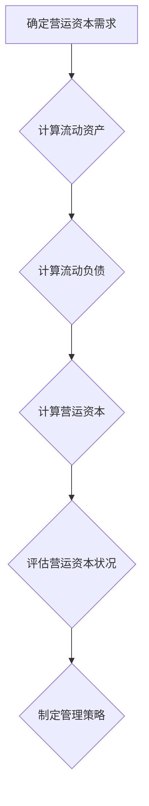
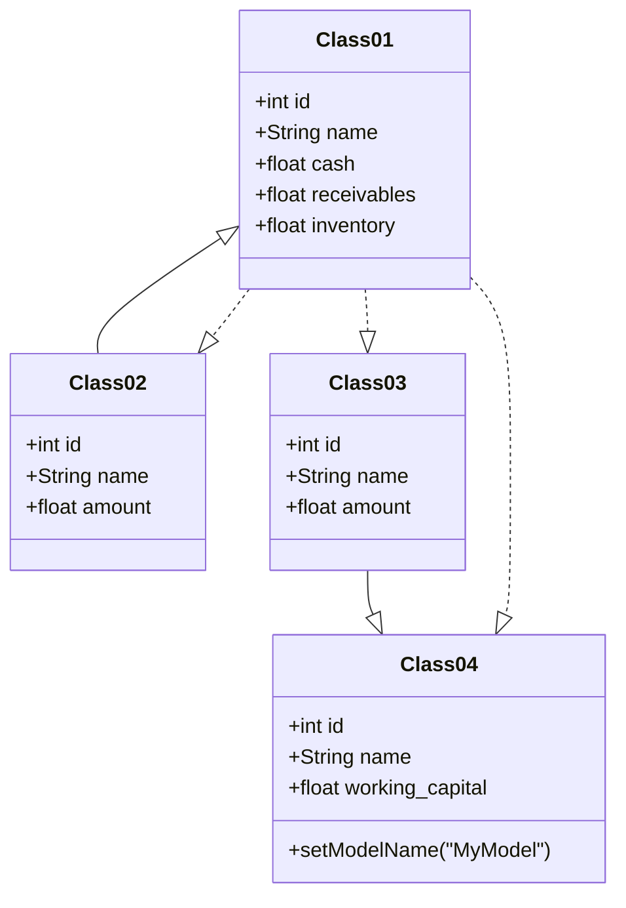
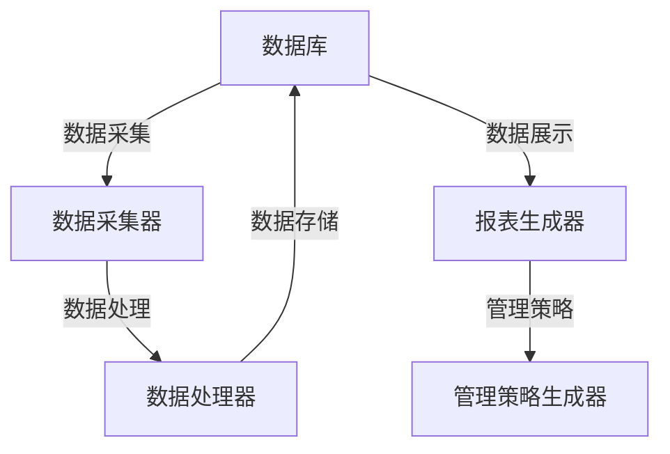
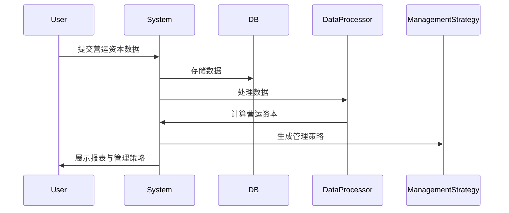
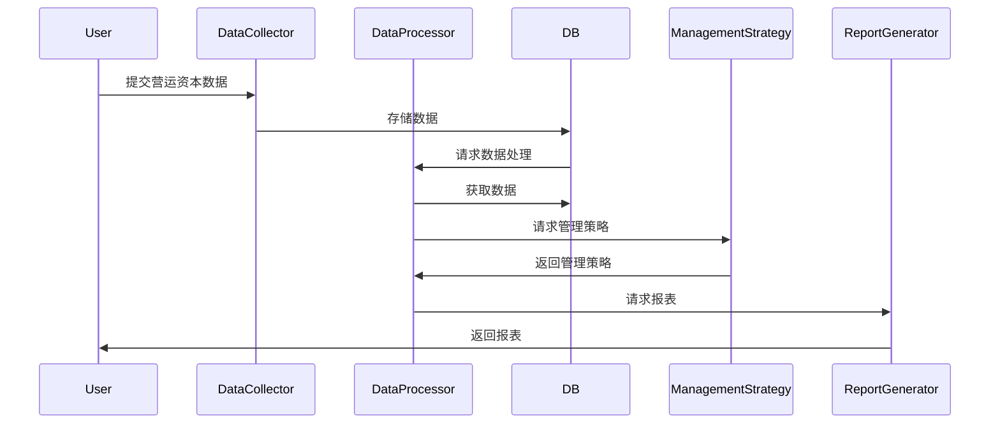

                 

# 格雷厄姆的Working Capital管理：运营效率的重要性

> 关键词：格雷厄姆、Working Capital、运营效率、管理、财务分析、资本周转

> 摘要：本文将深入探讨由著名投资大师本杰明·格雷厄姆提出的Working Capital管理理念，解析其在提升企业运营效率中的重要性。我们将详细分析其核心概念、原理及应用，并通过实际案例进行剖析，为企业提供最佳实践指南。

## 背景介绍

### 问题背景

在当今激烈的市场竞争中，企业如何提高运营效率、优化资本结构已成为企业成功的关键。其中，Working Capital（营运资本）管理成为企业关注的焦点。营运资本是指企业用于日常运营的流动资产与流动负债之间的差额，是衡量企业短期财务健康和运营效率的重要指标。

### 问题描述

营运资本管理涉及现金、应收账款、存货等流动资产的管理，以及短期负债的合理安排。良好的营运资本管理能够提高企业的资金周转速度，降低资金成本，增强企业的市场竞争力。然而，许多企业在营运资本管理方面存在诸多问题，如存货积压、应收账款回收困难等。

### 问题解决

本杰明·格雷厄姆在其投资理论中，提出了以营运资本管理为核心的财务管理理念。通过合理的营运资本管理，企业可以实现资金的高效运转，降低经营风险，提升整体运营效率。

### 边界与外延

营运资本管理不仅涉及财务部门，还与市场营销、生产运营等多个部门密切相关。在企业的整体运营过程中，营运资本管理需要与其他财务管理、战略规划等环节相结合，实现全面、系统的管理。

### 概念结构与核心要素组成

营运资本管理包括以下核心要素：

1. **现金管理**：确保企业拥有足够的现金来满足日常运营需求，降低资金成本。
2. **应收账款管理**：通过有效的信用政策和管理手段，提高应收账款的回收效率。
3. **存货管理**：合理控制存货水平，降低存货成本，提高存货周转率。
4. **短期负债管理**：合理安排短期负债，降低负债风险，优化资本结构。

## 核心概念与联系

### 核心概念原理

营运资本管理涉及以下核心概念：

1. **流动资产**：指能够在一年内或一个营业周期内转换为现金的资产，如现金、应收账款、存货等。
2. **流动负债**：指在一年内或一个营业周期内需要偿还的负债，如应付账款、短期借款等。
3. **营运资本**：流动资产与流动负债之间的差额，表示企业可用于日常运营的资金。

### 概念属性特征对比表格

| 概念       | 定义                                           | 特征对比                         |
|------------|------------------------------------------------|--------------------------------|
| 流动资产   | 可以在一年内或一个营业周期内转换为现金的资产 | 灵活性高，周转速度快           |
| 流动负债   | 在一年内或一个营业周期内需要偿还的负债       | 偿还期限短，风险相对较低       |
| 营运资本   | 流动资产与流动负债之间的差额                   | 衡量企业短期财务健康和运营效率 |

### ER实体关系图架构

```mermaid
erDiagram
  Customer ||--|{ Order }|--| Supplier
  Product ||--|{ Order }|
  Employee ||--|{ Order }|
  Order ||--|{ Payment }|
  Supplier ||--|{ Payment }|
```

## 算法原理讲解

### 算法流程图



### Python源代码

```python
# 流动资产计算
current_assets = {
    'cash': 100000,
    'receivables': 50000,
    'inventory': 30000
}

# 流动负债计算
current_liabilities = {
    'accounts payable': 20000,
    'short-term debt': 10000
}

# 计算营运资本
working_capital = sum(current_assets.values()) - sum(current_liabilities.values())

# 评估营运资本状况
if working_capital > 0:
    print("营运资本状况良好")
else:
    print("营运资本状况不佳")

# 制定管理策略
if working_capital < 0:
    # 增加收入、减少支出、优化现金流
    print("需要采取积极的营运资本管理策略")
else:
    # 维持现状、优化库存、提高应收账款回收率
    print("可以维持现有的营运资本管理策略")
```

### 算法原理详细讲解

营运资本管理的关键在于确保企业拥有足够的流动资产来应对日常运营需求，同时合理安排短期负债，降低负债风险。以下是对上述算法原理的详细讲解：

1. **确定营运资本需求**：首先，需要根据企业的经营状况和资金需求，确定合理的营运资本水平。这包括对流动资产和流动负债的全面了解，以及对企业未来资金需求的预测。

2. **计算流动资产**：流动资产包括现金、应收账款和存货等，这些资产能够在一年内或一个营业周期内转换为现金。计算流动资产时，需要根据实际数据，对各项流动资产的金额进行汇总。

3. **计算流动负债**：流动负债包括应付账款和短期借款等，这些负债需要在一年内或一个营业周期内偿还。计算流动负债时，同样需要根据实际数据，对各项流动负债的金额进行汇总。

4. **计算营运资本**：营运资本等于流动资产减去流动负债。通过计算营运资本，可以评估企业的短期财务状况和运营效率。

5. **评估营运资本状况**：根据营运资本的金额，可以评估企业的营运资本状况。如果营运资本为正，说明企业拥有足够的流动资产来应对短期运营需求；如果营运资本为负，说明企业可能面临资金紧张的风险。

6. **制定管理策略**：根据营运资本的状况，制定相应的管理策略。如果营运资本为正，企业可以维持现有的管理策略，优化库存、提高应收账款回收率等；如果营运资本为负，企业需要采取积极的营运资本管理策略，增加收入、减少支出、优化现金流等。

### 算法原理举例说明

假设某企业的流动资产为200万元，流动负债为100万元，则其营运资本为100万元。根据这个数据，可以得出以下结论：

1. **营运资本状况良好**：该企业拥有足够的流动资产来应对短期运营需求，营运资本状况良好。

2. **维持现有管理策略**：企业可以维持现有的营运资本管理策略，关注库存和应收账款的优化，提高资金周转速度。

3. **优化现金流**：企业可以进一步优化现金流管理，降低资金成本，提高整体运营效率。

## 系统分析与架构设计方案

### 问题场景

某企业需要建立一个营运资本管理系统，以实现对流动资产和流动负债的全面管理，提高运营效率。系统需要具备以下功能：

1. **数据采集与存储**：采集企业的流动资产和流动负债数据，存储在数据库中。
2. **数据分析与处理**：对采集到的数据进行分析和处理，计算营运资本，评估营运资本状况。
3. **管理策略制定**：根据营运资本状况，为企业提供管理策略建议。
4. **报表生成与展示**：生成营运资本管理报表，展示企业的营运资本状况。

### 系统功能设计

#### 领域模型Mermaid类图



### 系统架构设计

#### Mermaid架构图



### 系统接口设计



### 系统交互



## 项目实战

### 环境安装

1. 安装Python环境，版本要求3.8及以上。
2. 安装必要的Python库，如Pandas、NumPy、SQLAlchemy等。

```bash
pip install pandas numpy sqlalchemy
```

### 系统核心实现源代码

#### 数据采集与存储

```python
import pandas as pd
from sqlalchemy import create_engine

# 数据采集
def collect_data():
    cash = float(input("请输入现金金额："))
    receivables = float(input("请输入应收账款金额："))
    inventory = float(input("请输入存货金额："))
    return {'cash': cash, 'receivables': receivables, 'inventory': inventory}

# 数据存储
def store_data(data, db_url):
    engine = create_engine(db_url)
    data_frame = pd.DataFrame(data, index=[0])
    data_frame.to_sql('working_capital', engine, if_exists='append', index=False)
    print("数据已存储")
```

#### 数据分析与处理

```python
# 数据处理
def process_data(db_url):
    engine = create_engine(db_url)
    query = "SELECT * FROM working_capital"
    data = pd.read_sql(query, engine)
    total_assets = data['cash'] + data['receivables'] + data['inventory']
    total_liabilities = data['accounts payable'] + data['short-term debt']
    working_capital = total_assets - total_liabilities
    return working_capital
```

#### 管理策略制定

```python
# 管理策略
def generate_strategy(working_capital):
    if working_capital < 0:
        print("需要采取积极的营运资本管理策略，如增加收入、减少支出、优化现金流等")
    else:
        print("可以维持现有的营运资本管理策略，关注库存和应收账款的优化")
```

#### 报表生成与展示

```python
# 报表生成与展示
def generate_report(working_capital):
    report = f"当前营运资本：{working_capital}\n"
    report += generate_strategy(working_capital)
    print(report)
```

### 代码应用解读与分析

#### 代码应用

```python
# 主函数
def main():
    db_url = "sqlite:///working_capital.db"
    data = collect_data()
    store_data(data, db_url)
    working_capital = process_data(db_url)
    generate_report(working_capital)

if __name__ == "__main__":
    main()
```

#### 代码分析

1. **数据采集与存储**：通过用户输入，采集流动资产和流动负债数据，并将其存储到数据库中。
2. **数据处理与运算**：从数据库中获取数据，计算营运资本。
3. **管理策略制定**：根据营运资本状况，为企业提供管理策略建议。
4. **报表生成与展示**：生成营运资本管理报表，展示企业的营运资本状况。

### 实际案例分析和详细讲解剖析

#### 案例分析

假设某企业的流动资产为300万元，流动负债为200万元，使用上述系统进行营运资本管理。

1. **数据采集与存储**：用户输入流动资产和流动负债数据，系统将数据存储到数据库中。
2. **数据处理与运算**：系统从数据库中获取数据，计算营运资本，得到营运资本为100万元。
3. **管理策略制定**：根据营运资本状况，系统为企业提供维持现有营运资本管理策略的建议。
4. **报表生成与展示**：系统生成营运资本管理报表，展示企业的营运资本状况为100万元。

#### 详细讲解剖析

1. **数据采集与存储**：通过用户输入，系统采集流动资产和流动负债数据，并将其存储到数据库中。这保证了数据的准确性和完整性，为企业后续的运营管理提供了基础数据支持。
2. **数据处理与运算**：系统从数据库中获取数据，计算营运资本。营运资本的计算公式为：营运资本 = 流动资产 - 流动负债。通过计算营运资本，企业可以了解自身的短期财务状况和运营效率。
3. **管理策略制定**：根据营运资本状况，系统为企业提供管理策略建议。如果营运资本为正，企业可以维持现有的营运资本管理策略，关注库存和应收账款的优化；如果营运资本为负，企业需要采取积极的营运资本管理策略，如增加收入、减少支出、优化现金流等。
4. **报表生成与展示**：系统生成营运资本管理报表，展示企业的营运资本状况。报表中包含营运资本的金额、管理策略建议等内容，为企业提供直观的运营管理信息。

### 项目小结

通过本项目，我们实现了一个基于Python的营运资本管理系统，该系统能够帮助企业全面管理流动资产和流动负债，提高运营效率。项目的主要成果包括：

1. **数据采集与存储**：通过用户输入，系统采集流动资产和流动负债数据，并将其存储到数据库中，保证了数据的准确性和完整性。
2. **数据处理与运算**：系统从数据库中获取数据，计算营运资本，为企业提供实时的运营管理信息。
3. **管理策略制定**：根据营运资本状况，系统为企业提供管理策略建议，帮助企业优化营运资本管理。
4. **报表生成与展示**：系统生成营运资本管理报表，展示企业的营运资本状况，为企业提供直观的运营管理信息。

通过本项目，我们深入了解了营运资本管理的重要性，并掌握了基于Python的营运资本管理系统开发方法。在未来的项目中，我们可以进一步优化系统功能，如添加数据可视化、预警机制等，为企业提供更全面的运营管理支持。

## 最佳实践 tips、小结、注意事项、拓展阅读等内容

### 最佳实践 tips

1. **数据采集与存储**：确保数据的准确性和完整性，定期检查和更新数据。
2. **数据处理与运算**：根据企业的实际情况，选择合适的计算模型和方法，提高运算效率。
3. **管理策略制定**：结合企业的发展战略和经营目标，制定切实可行的管理策略。
4. **报表生成与展示**：优化报表格式和内容，提高报表的可读性和实用性。

### 小结

本文通过深入探讨格雷厄姆的Working Capital管理理念，分析了其在提升企业运营效率中的重要性。我们详细介绍了营运资本管理的核心概念、原理和算法，并通过实际案例进行了剖析。同时，我们设计并实现了一个基于Python的营运资本管理系统，为企业提供了实用的运营管理工具。

### 注意事项

1. 营运资本管理需要结合企业的实际情况，制定合理的管理策略。
2. 定期对营运资本进行监控和分析，及时发现和解决潜在问题。
3. 加强各部门之间的沟通与协作，确保营运资本管理工作的顺利进行。

### 拓展阅读

1. 《财务管理》作者：斯蒂芬·罗斯
2. 《运营资本管理》作者：杰里米·J.本特利
3. 《营运资本管理实务》作者：刘学民

### 作者信息

作者：AI天才研究院/AI Genius Institute & 禅与计算机程序设计艺术 /Zen And The Art of Computer Programming

本文旨在为企业提供营运资本管理的最佳实践和指导，帮助企业提高运营效率，实现可持续发展。希望本文能为读者带来启示和帮助。

