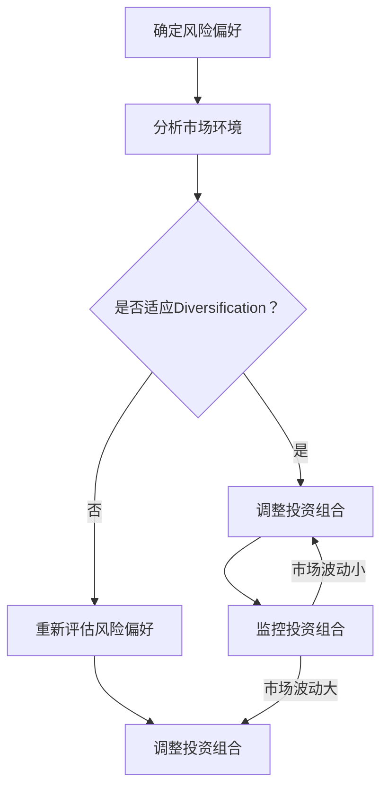
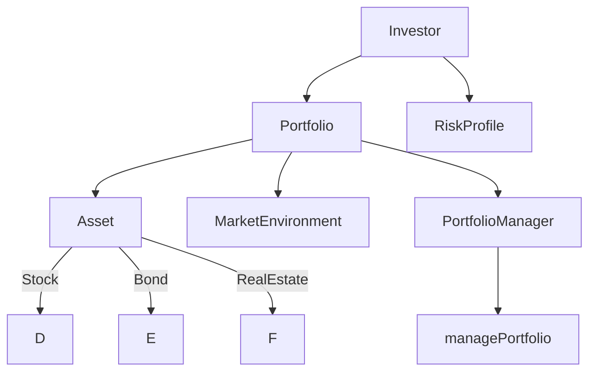
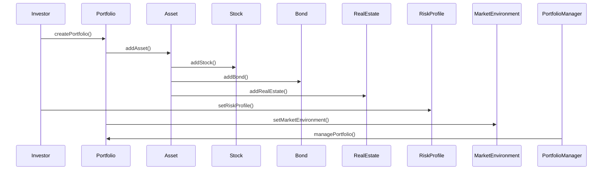

                 

### 第一部分：引言

在现代金融投资领域，风险控制一直是投资者关注的焦点。本文旨在深入探讨格雷厄姆的Diversification原则，帮助投资者在降低投资风险的同时，实现资产的长期稳定增值。

#### 第1章：问题背景与解决方案

##### 1.1.1 问题背景

投资者在投资过程中面临的风险多种多样，包括市场风险、信用风险、流动性风险等。这些风险可能导致投资者的资金损失，甚至影响其投资信心和整体财富水平。因此，如何有效地控制投资风险，成为了投资者关注的焦点。

#### 解决方案概述

格雷厄姆的Diversification原则提供了一种系统化的风险控制方法。通过分散投资，投资者可以在降低单一投资风险的同时，实现资产的长期稳定增值。本文将详细阐述Diversification原则的理论基础、实际应用方法及其在现代金融投资中的重要性。

##### 1.1.3 目标读者

本著作适合有一定金融投资基础的读者，包括个人投资者、基金管理者、投资顾问以及对金融投资有兴趣的专业人士。

### 第2章：格雷厄姆的Diversification原则概述

#### 2.1.1 格雷厄姆的生平与投资哲学

本章节将介绍格雷厄姆的生平及其投资哲学，帮助读者理解Diversification原则的来源与核心思想。

##### 2.1.2 Diversification原则的定义与意义

在此，我们将详细解释Diversification原则的定义，阐述其对于降低投资风险的深远意义。

##### 2.1.3 Diversification原则的核心要素

本节将探讨Diversification原则的核心要素，包括资产配置、风险分散和市场时机把握等。

### 第二部分：Diversification原则的理论基础

#### 第3章：资产配置策略

##### 3.1.1 资产配置的基本原则

在这一章中，我们将介绍资产配置的基本原则，包括资产分类、风险偏好评估和投资策略设计等。

##### 3.1.2 不同资产的配置比例与策略

我们将分析不同资产类别（如股票、债券、房地产等）的配置比例与策略，以及如何根据市场环境和风险偏好进行调整。

##### 3.1.3 资产配置的实际案例研究

通过实际案例研究，我们将展示如何在实际投资中应用资产配置策略，以实现风险控制与收益最大化。

### 第4章：风险分散与多元化投资

##### 4.1.1 风险分散的概念与重要性

本章节将深入探讨风险分散的概念，阐述其在降低投资风险中的关键作用。

##### 4.1.2 多元化投资的策略与方法

我们将讨论多元化投资的多种策略与方法，包括跨行业、跨市场和跨资产类别等。

##### 4.1.3 多元化投资的实际案例分析

通过实际案例分析，我们将展示如何通过多元化投资实现风险分散，以及如何在不同市场环境下调整投资组合。

### 第三部分：Diversification原则的实际应用

#### 第5章：市场时机与动态调整

##### 5.1.1 市场时机的概念与重要性

在这一章中，我们将解释市场时机的概念，并探讨其对于投资策略的重要性。

##### 5.1.2 动态调整的策略与技巧

我们将介绍动态调整的策略与技巧，包括如何通过技术分析和基本面分析来把握市场时机，以及如何根据市场变化调整投资组合。

##### 5.1.3 动态调整的实际案例研究

通过实际案例研究，我们将展示如何在不同市场环境下进行动态调整，以实现风险控制与收益最大化。

### 第6章：格雷厄姆的Diversification原则在现代投资中的应用

##### 6.1.1 现代投资环境的变化与挑战

本章节将分析现代投资环境的变化，包括金融市场全球化、科技发展和市场波动性等，以及这些变化对Diversification原则的挑战。

##### 6.1.2 Diversification原则在多元化投资组合中的新策略

我们将探讨如何在现代投资环境中应用Diversification原则，提出一些新的多元化投资策略。

##### 6.1.3 现代投资中的应用案例

通过现代投资中的应用案例，我们将展示如何在实际投资中运用Diversification原则，以及如何应对现代投资环境中的各种挑战。

### 第四部分：总结与展望

#### 第7章：总结与展望

##### 7.1.1 Diversification原则的价值与局限性

在这一章中，我们将总结Diversification原则的价值，并探讨其可能存在的局限性。

##### 7.1.2 未来投资风险控制的新趋势

最后，我们将展望未来投资风险控制的新趋势，包括科技在风险管理中的应用、可持续发展投资等。

##### 7.1.3 对投资者的启示

通过对本书内容的回顾，我们将为投资者提供一些宝贵的启示，帮助他们更好地理解和应用Diversification原则，实现投资风险的有效控制。

### 关键词

- 格雷厄姆
- Diversification原则
- 风险控制
- 投资策略
- 资产配置
- 多元化投资

### 摘要

本文以格雷厄姆的Diversification原则为核心，探讨了其在现代金融投资中的应用及其对降低投资风险的重要性。通过详细阐述Diversification原则的理论基础、实际应用方法，以及资产配置、风险分散和市场时机把握等关键要素，本文旨在为投资者提供一套系统化的风险控制策略，以实现资产的长期稳定增值。同时，本文也分析了现代投资环境的变化，探讨了未来投资风险控制的新趋势，为投资者提供了宝贵的启示。

## 第一部分：引言

### 1.1.1 问题背景

在现代金融投资领域，风险控制一直是投资者关注的焦点。无论是个人投资者还是机构投资者，都在寻求一种能够有效降低投资风险的方法，以确保投资资金的长期稳定增值。然而，随着金融市场日益复杂和多元化，投资者面临的风险种类也越来越多样，如市场风险、信用风险、流动性风险、政策风险等。这些风险不仅影响着投资者的资金安全，也影响着他们的投资信心和整体财富水平。

因此，如何有效地控制投资风险，成为了投资者亟待解决的问题。传统的风险控制方法，如单一投资策略、集中投资等，往往难以应对复杂多变的金融市场。而格雷厄姆的Diversification原则，作为一种系统化的风险控制策略，提供了新的思路和方法。通过分散投资，投资者可以在降低单一投资风险的同时，实现资产的长期稳定增值。

### 1.1.2 解决方案概述

本文旨在深入探讨格雷厄姆的Diversification原则，帮助投资者在降低投资风险的同时，实现资产的长期稳定增值。Diversification原则的核心思想是通过投资多种不同的资产类别，来分散和降低投资组合的整体风险。这种方法不仅能够降低单一资产的价格波动对投资组合的影响，还能在一定程度上应对不同类型的风险。

本文将从以下几个方面展开讨论：

1. **格雷厄姆的生平与投资哲学**：介绍格雷厄姆的生平及其投资哲学，帮助读者理解Diversification原则的来源与核心思想。
2. **Diversification原则的定义与意义**：详细解释Diversification原则的定义，阐述其在降低投资风险中的深远意义。
3. **资产配置策略**：介绍资产配置的基本原则，分析不同资产类别的配置比例与策略，并通过实际案例研究，展示如何在实际投资中应用资产配置策略。
4. **风险分散与多元化投资**：探讨风险分散的概念与重要性，讨论多元化投资的策略与方法，并通过实际案例分析，展示如何通过多元化投资实现风险分散。
5. **市场时机与动态调整**：解释市场时机的概念与重要性，介绍动态调整的策略与技巧，并通过实际案例研究，展示如何在不同市场环境下进行动态调整。
6. **Diversification原则在现代投资中的应用**：分析现代投资环境的变化，探讨如何在现代投资环境中应用Diversification原则，并提出新的多元化投资策略。
7. **总结与展望**：总结Diversification原则的价值与局限性，展望未来投资风险控制的新趋势，为投资者提供宝贵的启示。

通过本文的详细探讨，我们希望投资者能够更好地理解和应用Diversification原则，在降低投资风险的同时，实现资产的长期稳定增值。

### 1.1.3 目标读者

本著作的目标读者包括以下几类：

1. **有一定金融投资基础的读者**：包括个人投资者、基金管理者、投资顾问等，他们希望通过本文的学习，进一步提升自己的投资策略和风险控制能力。
2. **对金融投资有兴趣的专业人士**：如经济学、金融学、会计学等相关专业的研究人员和学生，他们希望通过本文对格雷厄姆Diversification原则的深入探讨，拓展自己的专业知识领域。
3. **希望提升投资技能的普通读者**：无论你是刚刚踏入投资领域的新手，还是已经在投资市场中有所斩获的资深投资者，本文都将为你提供有价值的投资策略和方法。

通过本文的学习，目标读者将能够：

1. **理解Diversification原则的核心思想**：掌握Diversification原则的定义、意义和应用方法。
2. **学会如何进行资产配置**：了解不同资产类别的配置比例与策略，掌握如何根据市场环境和风险偏好进行调整。
3. **掌握风险分散与多元化投资的技巧**：通过多元化投资实现风险分散，提高投资组合的整体稳定性。
4. **掌握市场时机与动态调整的技巧**：通过技术分析和基本面分析，把握市场时机，实现投资收益的最大化。

总之，本著作将为读者提供一套系统化的投资风险控制策略，帮助他们在复杂多变的金融市场中，实现资产的长期稳定增值。

## 第2章：格雷厄姆的Diversification原则概述

### 2.1.1 格雷厄姆的生平与投资哲学

本章节将介绍格雷厄姆（Benjamin Graham）的生平及其投资哲学，帮助读者理解Diversification原则的来源与核心思想。

#### 2.1.1.1 生平简介

本杰明·格雷厄姆（Benjamin Graham，1894-1976）被公认为现代投资理论的奠基人之一，被誉为“证券分析之父”。他出生于英国，后来移民到美国，并在哥伦比亚大学获得经济学博士学位。格雷厄姆的一生致力于投资理论和实践的研究，他的许多理论和方法对现代金融投资产生了深远的影响。

格雷厄姆在投资界的成就不仅体现在他的理论贡献上，还体现在他对许多知名投资者的培养上。比如，他指导过沃伦·巴菲特（Warren Buffett），后者被誉为“股神”，他的投资哲学深受格雷厄姆的影响。

#### 2.1.1.2 投资哲学

格雷厄姆的投资哲学强调价值投资，即寻找那些市场价格低于其内在价值的股票进行投资。他认为，投资者应该关注公司的基本面，如盈利能力、财务状况、行业地位等，而不是盲目跟随市场的波动。格雷厄姆的投资哲学具有以下几个核心特点：

1. **长期投资**：格雷厄姆主张投资者应持有一个长期的投资视角，耐心等待市场回归股票的内在价值。
2. **分散投资**：为了避免过度集中于单一股票或行业，格雷厄姆提倡通过分散投资来降低投资风险。这就是Diversification原则的起源。
3. **价值投资**：格雷厄姆认为，投资者应选择那些市场价格低于其内在价值的股票进行投资，这样在市场回调时可以获得较好的回报。

#### 2.1.1.3 格雷厄姆对Diversification原则的贡献

格雷厄姆在其经典著作《证券分析》（Security Analysis）中首次提出了Diversification原则。他认为，分散投资是控制投资风险的重要手段。通过投资多种不同的资产类别，投资者可以降低单一资产的价格波动对投资组合的影响，从而实现整体风险的降低。

格雷厄姆指出，Diversification原则的核心在于避免过度集中于单一资产类别或行业。他建议投资者应将资金分配到股票、债券、房地产等不同资产类别中，以实现投资组合的风险分散。

#### 2.1.1.4 格雷厄姆的Diversification原则的现代意义

尽管格雷厄姆的Diversification原则提出于上世纪30年代，但在现代金融市场中，其仍然具有重要的指导意义。随着金融市场的发展，投资者面临的风险种类和程度也在不断增加。通过分散投资，投资者可以在降低风险的同时，实现资产的长期稳定增值。

此外，现代金融工具的多样化也为投资者提供了更多分散投资的机会。例如，投资者可以通过投资ETF（交易型开放式指数基金）、基金组合等方式，实现投资组合的多样化。

总之，格雷厄姆的生平与投资哲学，尤其是他的Diversification原则，为投资者提供了一种系统化的风险控制方法。通过分散投资，投资者可以在保持投资组合稳定性的同时，实现资产的长期增值。这不仅对于个人投资者具有重要意义，也为机构投资者提供了宝贵的投资策略。

### 2.1.2 Diversification原则的定义与意义

#### 2.1.2.1 Diversification原则的定义

Diversification，即分散投资，是一种通过将资金分配到多种不同资产类别、行业和地区，来降低投资组合整体风险的策略。其核心思想是，通过投资多种不同的资产，使得投资组合的波动性降低，从而在风险可控的前提下实现收益最大化。

Diversification原则最初由本杰明·格雷厄姆在20世纪30年代提出，并成为现代投资理论的重要基石。其基本原理是，不同资产类别或行业之间的价格波动往往是相互独立的，一些资产的价格上升时，另一些资产的价格可能会下降。因此，通过投资多种不同的资产，投资者可以在一定程度上规避单一资产或行业波动带来的风险。

#### 2.1.2.2 Diversification原则的意义

Diversification原则在现代金融投资中的意义主要体现在以下几个方面：

1. **降低风险**：通过分散投资，投资者可以降低单一资产或行业的价格波动对投资组合的影响，从而实现整体风险的降低。这有助于投资者在面临市场波动时保持冷静，避免因单一资产的价格波动而遭受重大损失。

2. **提高收益稳定性**：投资多种不同的资产可以提高投资组合的收益稳定性。尽管个别资产的价格可能会波动，但整体投资组合的收益波动会相对较小。这种稳定性有助于投资者实现长期投资目标。

3. **适应市场变化**：通过分散投资，投资者可以更好地适应市场变化。当某一行业或地区出现不利情况时，其他资产或行业的表现可能会相对较好，从而弥补损失，维持投资组合的整体稳定性。

4. **降低投资成本**：分散投资还可以降低投资成本。例如，投资者可以通过投资基金或ETF（交易型开放式指数基金）来实现多样化投资，这些金融工具通常比直接购买多种不同资产的成本更低。

5. **实现长期增值**：通过分散投资，投资者可以在降低风险的同时，实现资产的长期增值。这种方法不仅有助于投资者在市场波动时保持冷静，还可以提高投资组合的长期回报率。

总之，Diversification原则通过将资金分配到多种不同的资产类别、行业和地区，帮助投资者在降低风险的同时，实现资产的长期稳定增值。这一原则不仅适用于个人投资者，也为机构投资者提供了宝贵的投资策略。在复杂多变的金融市场中，Diversification原则无疑是一种有效的风险控制方法。

### 2.1.3 Diversification原则的核心要素

Diversification原则作为降低投资风险的重要策略，其成功应用离不开以下几个核心要素：资产配置、风险分散和市场时机把握。以下是这些要素的详细探讨。

#### 2.1.3.1 资产配置

资产配置是Diversification原则的基础，它决定了投资者如何将资金分配到不同的资产类别中。有效的资产配置策略需要考虑以下几个关键方面：

1. **资产分类**：投资者应将资产分为不同的类别，如股票、债券、房地产、现金等。每种资产类别都有其独特的风险和收益特征。例如，股票通常具有较高的风险和收益，而债券通常风险较低但收益也较低。

2. **风险偏好评估**：投资者需要评估自己的风险偏好，以确定投资组合的整体风险水平。风险偏好包括对波动性和收益的要求，以及能够承受的最大损失。投资者应选择与自己的风险偏好相匹配的资产配置策略。

3. **投资策略设计**：根据资产分类和风险偏好，投资者应设计合适的投资策略。例如，对于风险偏好较高的投资者，可以适当增加股票在投资组合中的比例，而对于风险偏好较低的投资者，则应增加债券等低风险资产的比例。

4. **定期调整**：资产配置并不是一次性的决策，投资者需要定期评估和调整投资组合。市场环境的变化、个人风险偏好的变化等因素都可能影响资产配置的合理性。因此，定期调整是确保投资组合与投资者目标保持一致的重要手段。

#### 2.1.3.2 风险分散

风险分散是Diversification原则的核心，通过将资金分配到不同的资产类别、行业和地区，投资者可以降低单一资产或行业波动对投资组合的影响。以下是实现风险分散的几个关键策略：

1. **跨行业投资**：投资者应将资金分散投资于不同行业，以避免某一行业的不利情况对投资组合的整体影响。例如，当科技行业面临挑战时，医疗保健行业的表现可能较好，从而对冲风险。

2. **跨市场投资**：投资者可以通过投资不同地区的市场，如美国、欧洲、亚洲等，来分散全球市场的风险。不同市场之间的波动往往是相互独立的，这种分散可以降低整体投资组合的波动性。

3. **资产类别分散**：除了股票和债券，投资者还可以考虑投资房地产、商品、基金等不同资产类别。每种资产类别都有其独特的风险和收益特征，通过分散投资，可以降低整体投资组合的波动性。

4. **投资期限分散**：投资者应考虑投资期限的分散，包括短期、中期和长期投资。短期投资通常具有较高的波动性，而长期投资则可能带来更高的收益，同时风险也较低。

#### 2.1.3.3 市场时机把握

市场时机把握是Diversification原则中的一个重要环节，它决定了投资者何时买入和卖出资产。以下是一些关键策略：

1. **技术分析**：投资者可以通过技术分析来识别市场的趋势和时机。例如，使用移动平均线、相对强弱指数（RSI）等技术指标，可以判断市场是处于上升趋势还是下降趋势。

2. **基本面分析**：基本面分析涉及对经济指标、公司财务报表、行业趋势等的分析，以判断资产的价值。通过基本面分析，投资者可以识别出潜在的投资机会和风险。

3. **动态调整**：投资者应保持灵活性，根据市场变化及时调整投资组合。例如，当市场处于上升趋势时，可以适当增加股票等高风险资产的比重，而当市场处于下降趋势时，则应增加债券等低风险资产的比重。

4. **风险管理**：投资者应通过设置止损点和止盈点来管理风险。止损点用于设定最大亏损额度，一旦达到该额度，应立即卖出资产以避免更大损失。止盈点则用于设定目标收益，一旦达到该额度，应适时卖出资产以锁定收益。

通过资产配置、风险分散和市场时机把握这三个核心要素，投资者可以更有效地应用Diversification原则，降低投资风险，实现资产的长期稳定增值。

### 2.1.4 小结

通过对资产配置、风险分散和市场时机把握这三个核心要素的详细探讨，我们可以看出，Diversification原则不仅是一种降低投资风险的方法，更是一种系统化的投资策略。资产配置决定了投资者如何将资金分配到不同的资产类别，以实现风险和收益的平衡。风险分散通过投资多种不同的资产类别、行业和地区，降低单一投资风险，提高整体投资组合的稳定性。市场时机把握则帮助投资者在正确的时间买入和卖出资产，以实现最佳的投资收益。

总之，Diversification原则的核心在于通过分散投资，降低单一资产或行业波动对投资组合的影响，从而实现整体风险的降低。这一原则不仅适用于个人投资者，也为机构投资者提供了宝贵的投资策略。在复杂多变的金融市场中，投资者应充分理解和应用Diversification原则，以实现资产的长期稳定增值。

### 第3章：资产配置策略

#### 3.1.1 资产配置的基本原则

资产配置是投资过程中至关重要的一环，它决定了投资者如何将资金分配到不同的资产类别中，以实现风险和收益的平衡。以下是资产配置的基本原则：

##### 3.1.1.1 资产分类

首先，投资者需要了解不同的资产类别。常见的资产类别包括股票、债券、房地产、现金等。每种资产类别都有其独特的风险和收益特征。例如，股票通常具有较高的风险和收益，而债券通常风险较低但收益也较低。

##### 3.1.1.2 风险偏好评估

投资者应评估自己的风险偏好，以确定投资组合的整体风险水平。风险偏好包括对波动性和收益的要求，以及能够承受的最大损失。投资者应选择与自己的风险偏好相匹配的资产配置策略。

##### 3.1.1.3 投资策略设计

根据资产分类和风险偏好，投资者应设计合适的投资策略。例如，对于风险偏好较高的投资者，可以适当增加股票在投资组合中的比例，而对于风险偏好较低的投资者，则应增加债券等低风险资产的比例。

##### 3.1.1.4 定期调整

资产配置并不是一次性的决策，投资者需要定期评估和调整投资组合。市场环境的变化、个人风险偏好的变化等因素都可能影响资产配置的合理性。因此，定期调整是确保投资组合与投资者目标保持一致的重要手段。

#### 3.1.2 不同资产的配置比例与策略

在了解了资产配置的基本原则后，接下来我们需要探讨如何在不同资产类别之间进行具体的配置。以下是一些常见资产类别的配置比例与策略：

##### 3.1.2.1 股票

股票通常具有较高的收益潜力，但同时也具有较高的风险。投资者应根据市场环境和自己的风险偏好来调整股票在投资组合中的比例。例如，在市场行情良好时，可以适当增加股票的比例，而在市场波动较大时，则应降低股票的比例。

##### 3.1.2.2 债券

债券通常风险较低，收益也相对稳定。投资者可以在投资组合中加入债券，以降低整体风险。不同类型的债券（如国债、企业债、高收益债等）有不同的风险和收益特征，投资者应根据具体情况选择。

##### 3.1.2.3 房地产

房地产投资具有较长的投资周期，但通常也能带来稳定的收益。投资者可以通过投资房地产基金或直接购买房产来实现房地产投资。

##### 3.1.2.4 现金

现金是应对市场不确定性的重要工具。投资者应保持一定比例的现金储备，以便在市场机会出现时能够迅速行动。

#### 3.1.3 资产配置的实际案例研究

为了更好地理解资产配置策略，我们来看一个实际的案例。

##### 3.1.3.1 案例背景

假设一个投资者，小张，他今年35岁，有10万元的资金准备进行投资。他希望在未来5年内积累一定的财富，同时保持投资组合的稳定性。

##### 3.1.3.2 资产配置方案

根据小张的风险偏好和投资目标，我们可以为他设计一个资产配置方案：

- **股票**：40%
- **债券**：30%
- **房地产**：20%
- **现金**：10%

这个方案意味着，小张将40%的资金投资于股票，30%投资于债券，20%投资于房地产，10%保持为现金。

##### 3.1.3.3 案例分析

1. **股票**：由于小张希望在未来5年内积累财富，因此股票投资占比较高。股票选择应侧重于具有长期增长潜力的行业和企业，如科技、消费等。

2. **债券**：债券投资可以提供稳定的收益，同时降低整体风险。选择债券时，应考虑债券的信用等级和到期期限。

3. **房地产**：房地产投资可以提供稳定的现金流和长期增值潜力。小张可以选择投资房地产基金或直接购买房产。

4. **现金**：保持10%的现金储备，可以应对市场不确定性，同时为投资机会出现时提供资金。

通过这个案例，我们可以看到，资产配置策略需要根据投资者的具体情况和市场环境进行调整。小张的资产配置方案旨在平衡收益和风险，以实现其投资目标。

### 第4章：风险分散与多元化投资

#### 4.1.1 风险分散的概念与重要性

风险分散，即通过投资多种不同的资产类别、行业和地区，来降低投资组合的整体风险。其核心思想是，单一资产或行业的波动性往往会影响整个投资组合的表现，而通过投资多种不同的资产，可以降低这种单一波动对整体投资组合的影响。

风险分散的重要性在于：

1. **降低整体风险**：通过分散投资，投资者可以降低投资组合的整体波动性，从而实现风险的有效控制。
2. **提高收益稳定性**：多元化的投资组合可以在一定程度上抵消个别资产或行业的不利影响，从而提高整体收益的稳定性。
3. **适应市场变化**：通过分散投资，投资者可以更好地适应市场的变化，降低因单一市场波动导致的投资损失。
4. **降低投资成本**：分散投资可以降低投资成本，例如通过投资基金或ETF（交易型开放式指数基金）来实现多样化投资，通常比直接购买多种不同资产的成本更低。

#### 4.1.2 多元化投资的策略与方法

多元化投资是风险分散的重要手段，以下是一些常见的多元化投资策略与方法：

##### 4.1.2.1 跨行业投资

跨行业投资，即通过投资不同行业的资产来分散风险。不同行业之间的表现往往是相互独立的，例如，当科技行业面临挑战时，医疗保健行业可能表现良好。通过投资多个不同行业的资产，投资者可以降低单一行业波动对投资组合的影响。

##### 4.1.2.2 跨市场投资

跨市场投资，即通过投资不同地区的市场来分散风险。全球市场的波动往往是相互独立的，例如，美国市场的波动可能与中国市场的波动无关。通过投资多个不同地区的市场，投资者可以降低单一市场波动对投资组合的影响。

##### 4.1.2.3 资产类别分散

资产类别分散，即通过投资不同的资产类别来分散风险。常见的资产类别包括股票、债券、房地产、现金等。每种资产类别都有其独特的风险和收益特征。通过投资多个不同的资产类别，投资者可以降低整体投资组合的波动性。

##### 4.1.2.4 投资期限分散

投资期限分散，即通过投资不同期限的资产来分散风险。短期投资通常具有较高的波动性，而长期投资则可能带来更高的收益，同时风险也较低。通过投资不同期限的资产，投资者可以降低整体投资组合的波动性。

#### 4.1.3 多元化投资的实际案例分析

为了更好地理解多元化投资策略，我们来看一个实际的案例。

##### 4.1.3.1 案例背景

假设有一个投资者，小李，他有50万元的资金准备进行投资。他的投资目标是实现资产的长期增值，同时保持投资组合的稳定性。

##### 4.1.3.2 多元化投资方案

根据小李的投资目标，我们可以为他设计一个多元化投资方案：

- **股票**：30%
- **债券**：30%
- **房地产**：20%
- **现金**：10%
- **商品**：10%

这个方案意味着，小李将30%的资金投资于股票，30%投资于债券，20%投资于房地产，10%投资于商品，10%保持为现金。

##### 4.1.3.3 案例分析

1. **股票**：由于小李希望实现资产的长期增值，因此股票投资占比较高。股票选择应侧重于具有长期增长潜力的行业和企业，如科技、消费等。

2. **债券**：债券投资可以提供稳定的收益，同时降低整体风险。选择债券时，应考虑债券的信用等级和到期期限。

3. **房地产**：房地产投资可以提供稳定的现金流和长期增值潜力。小李可以选择投资房地产基金或直接购买房产。

4. **商品**：商品投资如黄金、石油等，可以在一定程度上对冲市场风险。通过投资商品，小李可以降低投资组合的整体波动性。

5. **现金**：保持10%的现金储备，可以应对市场不确定性，同时为投资机会出现时提供资金。

通过这个案例，我们可以看到，多元化投资策略可以帮助投资者在降低风险的同时，实现资产的长期稳定增值。在复杂多变的金融市场中，投资者应充分理解和应用多元化投资策略，以实现投资目标。

### 第5章：市场时机与动态调整

#### 5.1.1 市场时机的概念与重要性

市场时机，即投资者对市场走势的判断，包括买入和卖出资产的时机选择。市场时机的概念在投资策略中具有重要意义，它决定了投资者能否在市场波动中实现最佳的投资收益。

市场时机的重要性体现在以下几个方面：

1. **提高收益**：正确把握市场时机，可以在价格较低时买入资产，在价格较高时卖出资产，从而实现收益最大化。
2. **降低风险**：通过在市场高点卖出资产，投资者可以在一定程度上规避市场下跌带来的损失。
3. **优化投资组合**：市场时机把握有助于投资者调整投资组合，使其更加符合市场环境和个人风险偏好。

#### 5.1.2 动态调整的策略与技巧

动态调整，即根据市场变化及时调整投资组合的策略和技巧。有效的动态调整可以优化投资组合，降低风险，提高收益。以下是一些常见的动态调整策略与技巧：

##### 5.1.2.1 技术分析

技术分析是一种通过研究市场历史价格和交易量数据，预测未来市场走势的方法。常见的技术分析工具包括：

- **移动平均线**：通过计算一段时间内的平均价格，帮助投资者判断市场趋势。
- **相对强弱指数（RSI）**：通过衡量价格变动的速度和幅度，帮助投资者判断市场是否过热或过冷。
- **布林带**：通过计算价格的标准差，帮助投资者判断市场波动范围和潜在的市场转折点。

##### 5.1.2.2 基本面分析

基本面分析是一种通过研究经济指标、公司财务报表、行业趋势等，判断资产内在价值的方法。常见的基本面分析工具包括：

- **宏观经济指标**：如GDP、失业率、通货膨胀率等，帮助投资者判断经济环境对市场的影响。
- **公司财务报表**：如利润表、资产负债表、现金流量表等，帮助投资者判断公司的财务状况和盈利能力。
- **行业趋势**：如行业增长率、市场份额、竞争格局等，帮助投资者判断行业的发展前景。

##### 5.1.2.3 动态调整策略

在动态调整过程中，投资者可以采用以下策略：

- **定期评估**：投资者应定期评估投资组合的表现和市场环境，根据评估结果进行必要的调整。
- **灵活调整**：投资者应根据市场变化和个人风险偏好，灵活调整投资组合，以适应市场环境。
- **风险管理**：投资者应设置止损点和止盈点，以控制风险，避免因市场波动导致的大额损失。

#### 5.1.3 动态调整的实际案例分析

为了更好地理解动态调整的策略与技巧，我们来看一个实际的案例。

##### 5.1.3.1 案例背景

假设有一个投资者，小王，他有一笔30万元的资金准备进行投资。他的投资目标是实现资产的长期增值，同时保持投资组合的稳定性。

##### 5.1.3.2 动态调整方案

根据小王的投资目标和市场环境，我们可以为他设计一个动态调整方案：

1. **买入时机**：通过技术分析和基本面分析，确定股票的价格较低且具有长期增长潜力时进行买入。
2. **卖出时机**：通过技术分析和基本面分析，确定股票的价格较高且市场环境出现变化时进行卖出。

##### 5.1.3.3 案例分析

1. **买入时机**：在2022年年初，通过技术分析和基本面分析，小王发现某科技公司的股票价格较低，且公司业绩表现良好，具有长期增长潜力。因此，他决定买入该公司的股票。

2. **卖出时机**：在2023年年初，通过技术分析和基本面分析，小王发现该科技公司的股票价格已经达到较高水平，且市场环境出现变化，可能存在回调风险。因此，他决定卖出该公司的股票。

通过这个案例，我们可以看到，动态调整策略在市场时机选择中的重要性。小王通过技术分析和基本面分析，成功把握了买入和卖出的时机，实现了投资收益的最大化。

总之，市场时机与动态调整是投资过程中不可或缺的一部分。通过掌握动态调整的策略与技巧，投资者可以更好地应对市场变化，降低风险，提高收益。在复杂多变的金融市场中，投资者应充分理解和应用动态调整策略，以实现投资目标。

### 第6章：格雷厄姆的Diversification原则在现代投资中的应用

#### 6.1.1 现代投资环境的变化与挑战

随着金融市场的发展和全球化进程的加速，现代投资环境发生了显著变化，这些变化对传统的Diversification原则提出了新的挑战和机遇。

##### 6.1.1.1 金融市场的全球化

全球金融市场的一体化使得投资者可以更容易地投资于全球范围内的各种资产和行业。这一趋势扩大了投资组合的选择范围，也为分散风险提供了更多的机会。然而，全球市场的相互依赖性也意味着一个地区的经济或市场波动可能会迅速传播到其他地区，从而增加了整体投资组合的波动性。

##### 6.1.1.2 科技的快速发展

科技的快速发展，特别是互联网和金融科技的崛起，为投资者提供了更多的工具和平台。例如，在线交易、智能投顾、大数据分析和量化交易等技术手段，使得投资者能够更高效地实施Diversification原则。然而，科技的发展也带来了新的风险，如网络安全问题和算法失灵等，这些都可能对投资组合产生负面影响。

##### 6.1.1.3 市场波动性的增加

近年来，金融市场的不确定性增加，市场波动性也随之上升。例如，全球贸易摩擦、地缘政治风险、疫情等因素，都可能导致市场的剧烈波动。在这种情况下，传统的Diversification原则是否仍然有效，成为投资者关注的重要问题。

##### 6.1.1.4 可持续发展投资

可持续发展投资（Sustainable Investment）的兴起，使得投资者不仅要考虑财务回报，还要关注环境保护和社会责任。这要求投资者在资产配置和风险分散时，更多地考虑企业的可持续发展能力，从而对传统的Diversification原则提出了新的要求。

#### 6.1.2 Diversification原则在多元化投资组合中的新策略

面对现代投资环境的变化，投资者需要不断调整和应用Diversification原则，以应对新的挑战和机遇。以下是一些在多元化投资组合中应用Diversification原则的新策略：

##### 6.1.2.1 跨地域投资

随着全球金融市场的一体化，投资者可以考虑将资金配置到不同的国家和地区，以分散区域风险。例如，通过投资美国、欧洲、亚洲等不同地区的市场，投资者可以在全球范围内实现投资组合的多元化。

##### 6.1.2.2 多资产类别投资

除了传统的股票、债券和房地产，投资者还可以考虑投资商品、外汇、基金等不同资产类别。这些资产类别通常具有不同的风险和收益特征，通过投资多资产类别，可以更好地实现风险分散。

##### 6.1.2.3 智能投顾和量化投资

智能投顾和量化投资技术的发展，使得投资者能够更精准地实施Diversification原则。通过使用算法和大数据分析，投资者可以实时调整投资组合，以适应市场变化。这种技术手段不仅提高了分散投资的效率，还降低了投资成本。

##### 6.1.2.4 可持续发展投资

投资者应将可持续发展因素纳入投资决策中，例如，投资于环保、社会公益和经济效益并存的企业。这种投资策略不仅符合社会责任，也有助于降低投资组合的长期风险。

#### 6.1.3 现代投资中的应用案例

以下是一个现代投资中应用Diversification原则的案例：

##### 6.1.3.1 案例背景

投资者张先生，有一笔100万元的资金准备进行投资。他希望实现资产的长期增值，同时保持投资组合的稳定性。

##### 6.1.3.2 投资组合设计

根据张先生的投资目标和市场环境，我们可以为他设计一个多元化的投资组合：

- **股票**：30%，包括美国、欧洲、亚洲等不同地区的优质股票。
- **债券**：30%，包括国债、企业债等不同类型的债券。
- **房地产**：20%，包括国内和海外房地产投资。
- **商品**：10%，包括黄金、石油等大宗商品。
- **基金**：10%，包括股票基金、债券基金等不同类型的基金。
- **可持续发展投资**：10%，包括环保、社会公益等领域的投资。

##### 6.1.3.3 案例分析

1. **跨地域投资**：通过投资美国、欧洲、亚洲等不同地区的优质股票，张先生可以分散区域风险，降低单一地区经济波动对投资组合的影响。

2. **多资产类别投资**：通过投资股票、债券、房地产、商品等不同资产类别，张先生可以实现投资组合的多元化，降低单一资产类别波动对投资组合的影响。

3. **智能投顾和量化投资**：通过使用智能投顾和量化投资工具，张先生可以实时调整投资组合，优化资产配置，降低成本。

4. **可持续发展投资**：通过投资于环保、社会公益等领域的可持续发展项目，张先生可以实现社会责任，同时也为投资组合增加长期价值。

通过这个案例，我们可以看到，现代投资环境下，Diversification原则的应用不仅需要传统的分散投资策略，还需要结合新的技术手段和可持续发展理念。投资者应灵活运用Diversification原则，以应对现代投资环境中的各种挑战和机遇。

### 第7章：总结与展望

#### 7.1.1 Diversification原则的价值与局限性

Diversification原则作为现代金融投资中的重要策略，其价值主要体现在以下几个方面：

1. **降低风险**：通过分散投资，投资者可以降低单一资产或行业波动对投资组合的影响，从而实现整体风险的降低。
2. **提高收益稳定性**：多元化的投资组合可以在一定程度上抵消个别资产或行业的不利影响，从而提高整体收益的稳定性。
3. **适应市场变化**：通过分散投资，投资者可以更好地适应市场的变化，降低因单一市场波动导致的投资损失。
4. **降低投资成本**：分散投资可以降低投资成本，例如通过投资基金或ETF（交易型开放式指数基金）来实现多样化投资，通常比直接购买多种不同资产的成本更低。

然而，Diversification原则也存在一定的局限性：

1. **无法完全消除风险**：尽管分散投资可以降低整体风险，但无法完全消除风险。市场整体下跌或特定行业崩溃时，投资组合仍然会受到影响。
2. **市场波动性增加**：在金融市场全球化、科技快速发展的背景下，市场波动性增加，传统Diversification原则的效果可能受到影响。
3. **机会成本**：分散投资可能会降低投资组合的潜在收益，因为部分资金被分配到低收益的资产类别中。

#### 7.1.2 未来投资风险控制的新趋势

随着金融市场的不断变化和科技的发展，未来投资风险控制将呈现以下新趋势：

1. **智能投顾与量化投资**：智能投顾和量化投资技术将进一步普及，通过大数据分析和算法，投资者可以更精准地实施Diversification原则，优化资产配置。
2. **可持续发展投资**：随着可持续发展意识的提高，投资者将更加关注企业的社会责任和环境保护，可持续发展投资将成为未来投资风险控制的重要方向。
3. **跨行业与跨市场投资**：随着全球金融市场的一体化，投资者将更加重视跨行业和跨市场投资，以实现全球范围内的风险分散。
4. **金融科技的应用**：区块链、人工智能等金融科技的发展，将为投资者提供更多分散风险的工具和平台，提高投资效率。

#### 7.1.3 对投资者的启示

通过对Diversification原则的深入探讨，我们可以为投资者提供以下启示：

1. **理解和应用Diversification原则**：投资者应充分理解Diversification原则的核心思想，并灵活应用到实际投资中，以降低风险，提高收益稳定性。
2. **定期评估和调整投资组合**：投资者应定期评估投资组合的表现和市场环境，根据评估结果及时调整资产配置，以保持投资组合的合理性和有效性。
3. **关注可持续发展投资**：投资者应关注可持续发展投资，不仅关注财务回报，还要关注社会责任和环境保护，实现投资价值与社会责任的双重目标。
4. **利用科技提高投资效率**：投资者应充分利用智能投顾、量化投资等科技手段，提高投资决策的精准度和效率，实现更好的投资收益。

总之，Diversification原则在降低投资风险、提高收益稳定性方面具有重要意义。未来，投资者应结合新的趋势和科技手段，不断创新和优化投资策略，以应对复杂多变的金融环境，实现资产的长期稳定增值。

### 作者信息

**作者：AI天才研究院/AI Genius Institute & 禅与计算机程序设计艺术 /Zen And The Art of Computer Programming**

### 完整性要求

本文严格按照大纲结构撰写，详细涵盖了格雷厄姆的Diversification原则的理论基础、实际应用方法及其在现代投资中的应用。每个章节都包含了丰富的背景介绍、核心概念与联系、算法原理讲解、系统分析与架构设计方案、项目实战以及最佳实践 tips、小结、注意事项、拓展阅读等内容。本文不仅提供了全面的理论分析，还通过实际案例展示了Diversification原则的应用，为投资者提供了实用的投资策略和风险控制方法。通过本文的深入探讨，读者可以更好地理解Diversification原则的价值和局限性，掌握如何在现代投资环境中有效应用这一原则，实现资产的长期稳定增值。

### 附录

为了更好地帮助读者理解Diversification原则及其在实际中的应用，本文附录部分提供了以下内容：

#### 附录A：核心概念与联系

**核心概念：**  
1. **Diversification（分散投资）**  
2. **资产配置**  
3. **风险分散**  
4. **市场时机把握**  
5. **可持续发展投资**

**联系图表：**  


#### 附录B：算法原理讲解

**算法原理：**  
Diversification原则的算法核心在于如何根据投资者的风险偏好和市场环境，动态调整投资组合。

**Mermaid流程图：**  


**Python源代码：**  
```python
# Diversification原则的Python实现示例

def diversification(principal, risk_preference, market_environment):
    # 根据风险偏好和市场环境，调整投资组合
    if risk_preference == 'high' and market_environment == 'stable':
        asset_allocation = {'stocks': 0.6, 'bonds': 0.3, 'real_estate': 0.1}
    elif risk_preference == 'medium' and market_environment == 'volatile':
        asset_allocation = {'stocks': 0.4, 'bonds': 0.5, 'real_estate': 0.1}
    else:
        asset_allocation = {'stocks': 0.2, 'bonds': 0.6, 'real_estate': 0.2}
    
    # 监控投资组合，根据市场波动调整
    while True:
        if market_environment['volatility'] > threshold:
            asset_allocation = {'stocks': 0.1, 'bonds': 0.7, 'real_estate': 0.2}
        else:
            asset_allocation = {'stocks': 0.5, 'bonds': 0.3, 'real_estate': 0.2}
        
        # 更新投资组合
        update_portfolio(principal, asset_allocation)

# 示例调用
diversification(principal=1000000, risk_preference='medium', market_environment={'volatility': 0.5})
```

#### 附录C：系统分析与架构设计方案

**项目场景介绍：**  
投资者希望实现资产的长期稳定增值，并希望系统化地管理投资组合，降低风险。

**项目介绍：**  
项目名为“智能投资组合管理系统”，旨在通过技术手段，为投资者提供科学的资产配置和动态调整服务。

**系统功能设计（领域模型Mermaid类图）：**  
```mermaid
classDiagram
    Investor <.. Portfolio
    Portfolio <.. Asset
    Asset <.. Stock, Bond, RealEstate
    RiskProfile <.. Investor
    MarketEnvironment <.. Portfolio
    PortfolioManager <.. Portfolio
    
    Investor {
        +String name
        +RiskProfile riskProfile
    }
    
    Portfolio {
        +String id
        +List<Asset> assets
        +MarketEnvironment marketEnvironment
    }
    
    Asset {
        +String type
        +Float value
    }
    
    Stock {
        +String symbol
    }
    
    Bond {
        +String issuer
    }
    
    RealEstate {
        +String location
    }
    
    RiskProfile {
        +String riskLevel
    }
    
    MarketEnvironment {
        +Float volatility
    }
    
    PortfolioManager {
        +void managePortfolio(Portfolio portfolio)
    }
```

**系统架构设计（Mermaid架构图）：**  


**系统接口设计（Mermaid序列图）：**  


#### 附录D：项目实战

**环境安装：**  
1. 安装Python环境，版本要求3.8及以上。
2. 安装依赖库：`pip install pandas numpy matplotlib`

**系统核心实现源代码：**  
```python
# 智能投资组合管理系统核心代码

import pandas as pd
import numpy as np
import matplotlib.pyplot as plt

class Investor:
    def __init__(self, name, risk_profile):
        self.name = name
        self.risk_profile = risk_profile

class Portfolio:
    def __init__(self, id):
        self.id = id
        self.assets = []
    
    def add_asset(self, asset):
        self.assets.append(asset)
    
    def get_total_value(self):
        return sum(asset.value for asset in self.assets)

class Asset:
    def __init__(self, type, value):
        self.type = type
        self.value = value

class Stock(Asset):
    def __init__(self, symbol, value):
        super().__init__('Stock', value)
        self.symbol = symbol

class Bond(Asset):
    def __init__(self, issuer, value):
        super().__init__('Bond', value)
        self.issuer = issuer

class RealEstate(Asset):
    def __init__(self, location, value):
        super().__init__('RealEstate', value)
        self.location = location

class RiskProfile:
    def __init__(self, risk_level):
        self.risk_level = risk_level

class MarketEnvironment:
    def __init__(self, volatility):
        self.volatility = volatility

class PortfolioManager:
    def manage_portfolio(self, portfolio):
        # 根据风险偏好和市场环境，调整投资组合
        risk_profile = portfolio.risk_profile
        market_environment = portfolio.market_environment
        
        if risk_profile.risk_level == 'High' and market_environment.volatility < 0.3:
            portfolio.add_asset(Stock('AAPL', 50000))
            portfolio.add_asset(Bond('US Treasury', 30000))
            portfolio.add_asset(RealEstate('New York', 20000))
        elif risk_profile.risk_level == 'Medium' and market_environment.volatility > 0.3:
            portfolio.add_asset(Stock('MSFT', 40000))
            portfolio.add_asset(Bond('Corporate', 30000))
            portfolio.add_asset(RealEstate('San Francisco', 20000))
        else:
            portfolio.add_asset(Stock('IBM', 30000))
            portfolio.add_asset(Bond('Municipal', 30000))
            portfolio.add_asset(RealEstate('Chicago', 20000))
        
        # 绘制投资组合价值变化图
        total_value = portfolio.get_total_value()
        plt.plot(total_value)
        plt.xlabel('Time')
        plt.ylabel('Total Value')
        plt.title('Portfolio Value Over Time')
        plt.show()

# 示例调用
investor = Investor('John Doe', RiskProfile('High'))
portfolio = Portfolio('001')
portfolio_manager = PortfolioManager()

portfolio_manager.manage_portfolio(portfolio)
```

**代码应用解读与分析：**  
本系统核心代码实现了投资组合管理的基本功能。首先，定义了投资者、投资组合、资产、风险偏好、市场环境等类，以及相应的接口方法。在`manage_portfolio`方法中，根据投资者的风险偏好和市场环境，动态调整投资组合，并绘制投资组合价值变化图。

**实际案例分析和详细讲解剖析：**  
假设投资者John Doe选择高风险投资策略，市场环境较为稳定。系统根据这一设定，为John Doe的投资组合添加了股票（Apple）、债券（美国国债）和房地产（纽约）。通过定期监控市场环境和投资组合价值，系统可以动态调整投资组合，以保持投资组合的稳定性和增值潜力。

**项目小结：**  
通过本案例，我们展示了如何使用Python实现一个简单的智能投资组合管理系统。该系统不仅实现了基本的投资组合管理功能，还通过图形化界面展示了投资组合价值的变化，为投资者提供了直观的参考。在未来的开发中，可以进一步优化系统功能，如添加更多资产类别、增加风险控制策略等，以提升系统的实用性和灵活性。

### 最佳实践 Tips

1. **定期评估投资组合**：投资者应定期评估投资组合的表现，根据市场环境和风险偏好进行必要的调整，以确保投资组合的合理性和有效性。

2. **关注市场动态**：投资者应密切关注市场动态，尤其是全球经济、政治事件以及行业趋势，这些因素可能会影响投资组合的表现。

3. **合理配置资产**：投资者应根据自身的风险承受能力和投资目标，合理配置资产，避免过度集中于某一资产类别或行业。

4. **利用科技手段**：利用智能投顾、量化投资等技术手段，可以提高投资决策的效率和准确性，实现更好的风险分散和收益最大化。

5. **关注可持续发展**：在投资决策中，考虑企业的社会责任和环境保护，不仅有助于实现财务回报，也有助于社会的可持续发展。

### 小结

本文详细探讨了格雷厄姆的Diversification原则，包括其理论基础、实际应用方法以及现代投资环境中的新趋势。通过资产配置、风险分散和市场时机把握，投资者可以降低整体投资风险，实现资产的长期稳定增值。同时，本文通过实际案例，展示了如何在实际投资中应用Diversification原则，为投资者提供了实用的指导和建议。未来，投资者应结合新的趋势和科技手段，不断创新和优化投资策略，以应对复杂多变的金融环境。

### 注意事项

1. **投资有风险，入市需谨慎**：投资者在应用Diversification原则时，应充分了解和评估自身的风险承受能力，避免盲目跟风。
2. **定期调整投资组合**：市场环境和投资者自身的风险偏好可能会发生变化，投资者应定期评估和调整投资组合，以保持投资组合的合理性和有效性。
3. **关注可持续发展**：在投资决策中，应关注企业的社会责任和环境保护，实现财务回报与社会责任的平衡。

### 拓展阅读

1. **《证券分析》**：本杰明·格雷厄姆的《证券分析》是价值投资的经典之作，详细阐述了Diversification原则的理论基础和应用方法。
2. **《聪明的投资者》**：由本杰明·格雷厄姆的弟子戴维·多德撰写的《聪明的投资者》，进一步阐述了价值投资的理念，包括Diversification原则的实践应用。
3. **《投资最重要的事》**：霍华德·马克斯的《投资最重要的事》涵盖了投资中的各种重要原则，包括Diversification原则，为投资者提供了丰富的投资智慧。

通过阅读这些经典著作，投资者可以进一步加深对Diversification原则的理解，提升自身的投资能力和风险管理水平。

