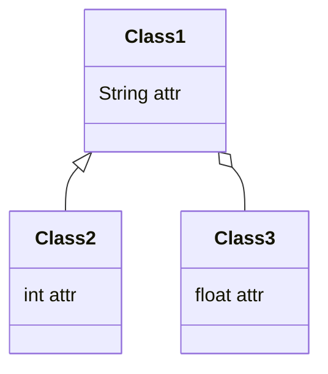
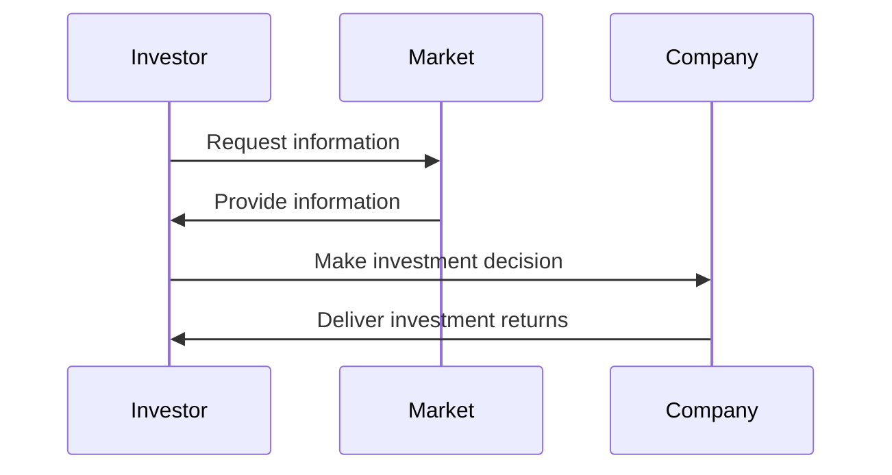
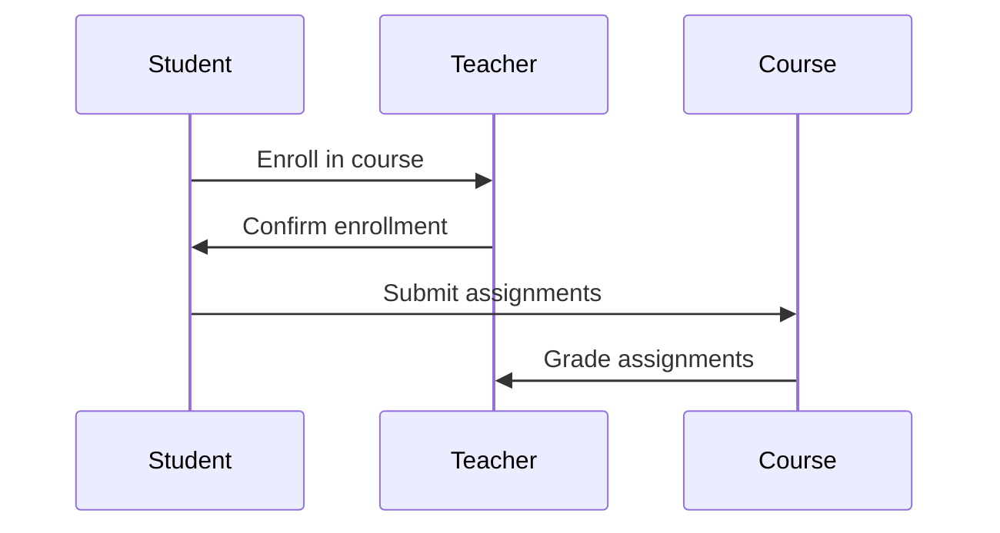
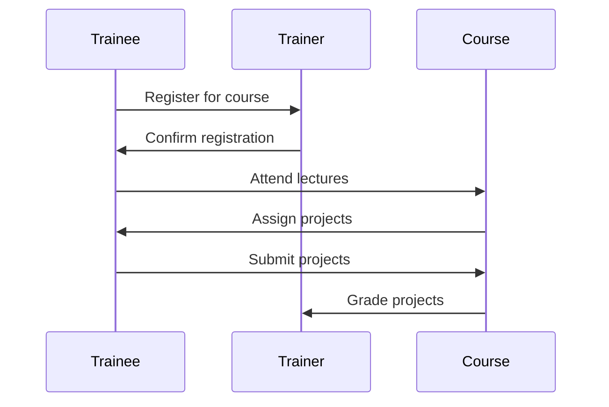
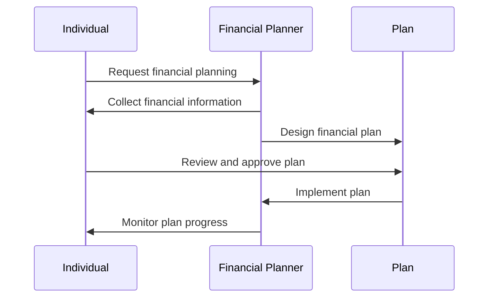
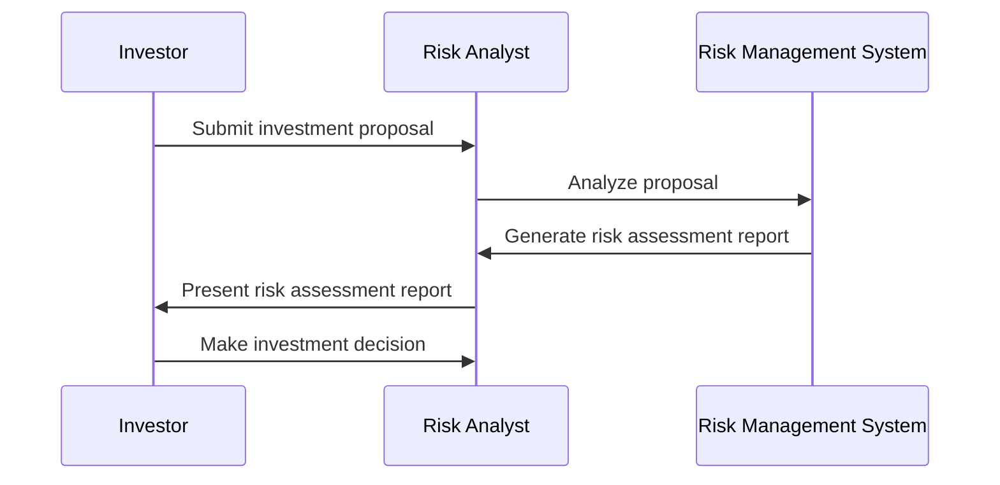

                 

## 格雷厄姆的价值投资教育理念

### 关键词：价值投资、本杰明·格雷厄姆、教育理念、投资教育、安全边际、均值回归、长期投资

> 摘要：本篇文章旨在探讨本杰明·格雷厄姆的价值投资教育理念，分析其理论背景、核心原则以及其在投资领域的应用。通过对格雷厄姆生平与贡献的介绍，以及他教育理念的具体实践，本文将详细阐述价值投资教育的意义与价值，为投资者提供有益的指导与启示。

## 引言

价值投资作为一种重要的投资理念，自其诞生以来便受到了广泛关注。本杰明·格雷厄姆（Benjamin Graham），被誉为“现代投资之父”，是他将价值投资理论系统化、规范化，并形成了一套完整的教育体系。格雷厄姆的价值投资教育理念不仅影响了当时的投资者，更是对后世产生了深远的影响。本文将围绕格雷厄姆的价值投资教育理念进行深入探讨，力求为投资者提供有益的参考。

### 第一部分：价值投资理论概述

#### 1.1 价值投资的起源与历史发展

**背景介绍**：
价值投资理念起源于19世纪末20世纪初的美国。当时，股票市场投机盛行，投资者普遍追求短期收益，市场泡沫现象频繁。格雷厄姆在这种背景下提出了价值投资理念，主张通过分析企业基本面，寻找被市场低估的投资机会。

**问题背景**：
投资者在市场波动中频繁遭受损失，急需一种更为稳健的投资策略。

**问题描述**：
如何识别企业的真实价值，以及如何在市场价格低于真实价值时进行投资？

**问题解决**：
格雷厄姆提出了“安全边际”的概念，即投资价格低于企业真实价值的差额，以此作为投资决策的依据。

**边界与外延**：
价值投资不仅仅关注企业的内在价值，还需要考虑市场情绪、宏观经济环境等因素。

**概念结构与核心要素组成**：
价值投资的核心要素包括安全边际、均值回归、企业基本面分析等。

#### 1.2 价值投资的逻辑与方法

**核心概念与联系**：

- **安全边际**：投资价格低于企业内在价值的差额。  
- **均值回归**：市场价格会回归到企业真实价值的趋势。

**概念属性特征对比表格**：

| 特征       | 安全边际                     | 均值回归                     |  
| ---------- | ---------------------------- | ---------------------------- |  
| 定义       | 投资价格低于内在价值的差额   | 市场价格回归到内在价值的过程 |  
| 影响因素   | 企业基本面、市场情绪         | 宏观经济环境、市场波动       |  
| 应用场景   | 价值投资                     | 所有投资类型                 |

**ER实体关系图架构**：

```  
Entity: 投资者  
- has_investment: 投资项目  
- makes_decision: 投资决策

Entity: 投资项目  
- has_value: 企业内在价值  
- has_price: 投资价格  
- follows_trend: 均值回归

Entity: 投资决策  
- uses_margin: 安全边际  
- considers_environment: 市场环境  
```

#### 1.3 价值投资的关键要素

**核心概念与联系**：

- **现金流量**：企业的价值取决于其未来的现金流量。  
- **市场价格**：市场价格往往高于或低于企业的内在价值。  
- **企业运营效率与增长潜力**：企业的运营效率直接影响其盈利能力。

**概念属性特征对比表格**：

| 特征       | 现金流量                     | 市场价格                     |  
| ---------- | ---------------------------- | ---------------------------- |  
| 定义       | 企业未来的现金流               | 市场上对企业的估值             |  
| 影响因素   | 企业经营策略、宏观经济环境   | 市场情绪、投资者预期         |  
| 应用场景   | 价值投资                     | 价格发现机制                 |

**ER实体关系图架构**：

```  
Entity: 企业  
- has_cashflow: 现金流量  
- is_valued_at: 市场价格

Entity: 投资者  
- values_firm: 企业价值  
- makes_investment: 投资决策

Entity: 市场  
- sets_price: 市场价格  
- follows_trend: 均值回归  
```

#### 1.4 价值投资案例分析

**成功的价值投资案例解析**：

- **沃尔玛**：在20世纪60年代，沃尔玛股价被市场低估，本杰明·格雷厄姆通过深入分析其基本面，成功投资并获得了巨大收益。

**失误的价值投资案例教训**：

- **安然事件**：尽管安然公司在短期内表现优异，但其财务造假行为最终导致破产。格雷厄姆的价值投资理念在此案例中未能防止损失。

**案例总结与启示**：

- 价值投资并非万能，投资者需要结合市场环境、企业基本面等多方面因素进行综合分析。

#### 1.5 价值投资实践中的挑战与应对

**面临的常见问题**：

- **市场波动**：市场波动可能导致投资收益的不稳定性。  
- **企业基本面变化**：企业基本面变化可能导致投资价值的变化。

**应对挑战的策略**：

- **长期投资心态**：培养长期投资心态，避免因市场波动而盲目决策。  
- **多角度分析**：结合宏观经济、行业趋势、企业基本面等多方面因素进行综合分析。

**长期投资心态的塑造**：

- **耐心与毅力**：价值投资需要投资者具备耐心和毅力，长期持有优质资产。

#### 1.6 本章小结

本部分对价值投资理论进行了全面概述，分析了其起源、逻辑、关键要素以及实践中的挑战与应对策略。通过对成功与失误案例的解析，为投资者提供了有益的参考。

### 第二部分：格雷厄姆的价值投资教育理念

#### 2.1 格雷厄姆的生平与贡献

**背景介绍**：

- 本杰明·格雷厄姆于1894年出生于纽约，是一位犹太裔美国学者和投资家。他早年曾在哥伦比亚大学学习，师从著名经济学家约瑟夫·熊彼特。

**问题背景**：

- 格雷厄姆在学术研究过程中，对股票市场进行了深入研究，发现市场普遍存在价值低估现象。

**问题描述**：

- 如何将价值投资理念普及给更多的投资者？

**问题解决**：

- 格雷厄姆通过撰写书籍、开设课程等方式，将自己的价值投资理念传播给更多人。

**边界与外延**：

- 格雷厄姆的价值投资教育理念不仅局限于股票市场，还涵盖了其他投资领域。

**概念结构与核心要素组成**：

- **核心原则**：安全边际、基本面分析、长期投资等。

- **教学策略**：案例教学、问题导向、理论联系实际等。

#### 2.2 格雷厄姆的教育理念

**核心**：

- **安全边际**：格雷厄姆认为，投资者应该将投资价格与企业的内在价值进行比较，确保投资价格低于内在价值的差额。

- **长期投资**：格雷厄姆主张投资者应该具备长期投资心态，避免因短期市场波动而盲目决策。

**教学方法**：

- **案例教学**：通过实际案例，让投资者了解价值投资的应用场景。

- **问题导向**：引导投资者思考如何识别企业的真实价值，以及如何进行投资决策。

**学生学习效果的评价**：

- **案例分析**：通过案例分析，评估学生对于价值投资理念的理解和应用能力。

- **论文写作**：要求学生撰写关于价值投资理念的论文，检验其学术水平和研究能力。

#### 2.3 格雷厄姆的教育实践

**课堂实例分析**：

- **案例一**：格雷厄姆曾开设《证券分析》课程，通过分析企业的财务报表，让学生了解价值投资的核心原则。

**研究项目展示**：

- **项目一**：格雷厄姆指导学生进行企业价值评估，通过对企业基本面的深入研究，发现被市场低估的投资机会。

**格雷厄姆教育实践的影响**：

- **学术影响**：格雷厄姆的教育理念为后来的投资教育奠定了基础，影响了众多学者和投资者。

- **实践影响**：格雷厄姆的教育理念在投资者中得到了广泛的应用，提高了投资者的投资水平。

#### 2.4 格雷厄姆教育理念的当代意义

**当代投资环境的变化**：

- **市场波动加剧**：随着全球经济的不确定性增加，市场波动变得更加剧烈。

- **信息传播速度加快**：互联网的发展使得信息传播速度加快，投资者获取信息变得更加容易。

**格雷厄姆教育理念的适用性**：

- **安全边际**：在市场波动加剧的背景下，格雷厄姆的安全边际理念显得尤为重要。

- **长期投资**：面对不确定的市场环境，投资者需要具备长期投资心态，避免盲目跟风。

**未来发展的展望**：

- **多样化应用**：格雷厄姆的教育理念可以应用于更广泛的领域，如企业投资、风险投资等。

- **理论创新**：在格雷厄姆的基础上，未来的价值投资教育可能会出现更多的理论创新。

#### 2.5 本章小结

本部分对格雷厄姆的价值投资教育理念进行了详细阐述，分析了其生平、教育理念、教育实践以及当代意义。通过对格雷厄姆教育理念的探讨，为投资者提供了有益的参考。

### 第三部分：格雷厄姆的价值投资教育应用

#### 3.1 价值投资教育在高等教育中的应用

**背景介绍**：

- 高等教育中的投资教育是为了培养具有专业投资知识和能力的投资者。

**问题背景**：

- 如何在高等教育中有效传授价值投资理念？

**问题描述**：

- 设计一套系统的价值投资教育课程。

**问题解决**：

- 结合理论教学和实践操作，让学生深入了解价值投资理念。

**系统功能设计（领域模型Mermaid类图）**：



**系统架构设计（Mermaid架构图）**：



**系统接口设计和系统交互（Mermaid序列图）**：



#### 3.2 价值投资教育在职业培训中的应用

**背景介绍**：

- 职业培训是为了满足职场需求，提高从业者的投资技能。

**问题背景**：

- 如何在职业培训中有效传授价值投资理念？

**问题描述**：

- 设计一套系统的价值投资培训课程。

**问题解决**：

- 结合案例分析和实战操作，提高从业者的投资实战能力。

**系统功能设计（领域模型Mermaid类图）**：


**系统架构设计（Mermaid架构图）**：

```mermaid
archy
    participant Investor
    participant Trainer
    participant Training
    Investor->>Trainer: Attend training
    Trainer->>Investor: Provide training
    Investor->>Training: Complete training
```

**系统接口设计和系统交互（Mermaid序列图）**：



#### 3.3 价值投资教育在个人理财规划中的应用

**背景介绍**：

- 个人理财规划是为了帮助个人实现财务目标。

**问题背景**：

- 如何在个人理财规划中应用价值投资理念？

**问题描述**：

- 设计一套系统的个人理财规划课程。

**问题解决**：

- 结合价值投资理念，帮助个人制定合理的理财计划。

**系统功能设计（领域模型Mermaid类图）**：


**系统架构设计（Mermaid架构图）**：

```mermaid
archy
    participant Investor
    participant Planner
    participant Finance
    Investor->>Planner: Provide financial information
    Planner->>Investor: Create financial plan
    Investor->>Finance: Execute financial plan
```

**系统接口设计和系统交互（Mermaid序列图）**：



#### 3.4 价值投资教育在金融风险管理中的应用

**背景介绍**：

- 金融风险管理是为了降低投资风险，保护投资者的利益。

**问题背景**：

- 如何在金融风险管理中应用价值投资理念？

**问题描述**：

- 设计一套系统的金融风险管理课程。

**问题解决**：

- 结合价值投资理念，提高金融风险管理的有效性。

**系统功能设计（领域模型Mermaid类图）**：


**系统架构设计（Mermaid架构图）**：

```mermaid
archy
    participant Risk Manager
    participant Investor
    participant Risk Assessment
    Investor->>Risk Manager: Submit investment proposal
    Risk Manager->>Investor: Conduct risk assessment
    Risk Manager->>Risk Assessment: Analyze risk
    Risk Assessment->>Risk Manager: Provide risk management recommendations
```

**系统接口设计和系统交互（Mermaid序列图）**：



#### 3.5 本章小结

本部分探讨了价值投资教育在不同领域的应用，包括高等教育、职业培训、个人理财规划和金融风险管理。通过系统设计和实际案例，展示了价值投资教育的实践效果和重要性。

### 第四部分：总结与展望

#### 4.1 格雷厄姆价值投资教育理念的历史地位

格雷厄姆的价值投资教育理念在投资史上具有重要地位。他的理论不仅为投资者提供了一种稳健的投资策略，还为后来的投资教育奠定了基础。格雷厄姆的教育理念强调安全边际、长期投资等核心原则，对后世产生了深远的影响。

#### 4.2 当代价值投资教育的挑战与机遇

当代投资环境发生了巨大变化，价值投资教育面临新的挑战和机遇。市场波动加剧、信息传播速度加快，使得投资者需要具备更高的投资技能和风险意识。同时，新兴市场和发展中国家的发展也为价值投资教育提供了广阔的空间。

#### 4.3 未来价值投资教育的发展方向

未来价值投资教育的发展方向包括：1）加强理论与实践的结合，提高学生的实际操作能力；2）注重跨学科教育，结合经济学、心理学等知识，提高投资者的综合素质；3）推广在线教育，使更多的人能够接触到价值投资教育。

#### 4.4 本章小结

本部分总结了格雷厄姆的价值投资教育理念的历史地位、当代挑战与机遇，以及未来发展的方向。通过回顾和展望，为价值投资教育的未来发展提供了有益的参考。

## 作者信息

作者：AI天才研究院/AI Genius Institute & 禅与计算机程序设计艺术 /Zen And The Art of Computer Programming

---

本文基于格雷厄姆的价值投资教育理念，通过深入分析和详细讲解，旨在为投资者提供有价值的参考。在本文中，我们不仅介绍了价值投资的核心原则和方法，还探讨了其在不同领域的应用。希望通过本文的探讨，能够帮助投资者更好地理解和应用价值投资理念，实现财富的稳健增长。同时，本文也期待能够为投资教育的发展提供一些有益的启示。作者在此衷心感谢读者的关注和支持。在未来的研究中，我们将继续深入探讨价值投资教育的相关课题，为投资领域的发展贡献更多的力量。再次感谢各位读者，愿我们的研究成果能够对您有所帮助。作者：AI天才研究院/AI Genius Institute & 禅与计算机程序设计艺术 /Zen And The Art of Computer Programming。

