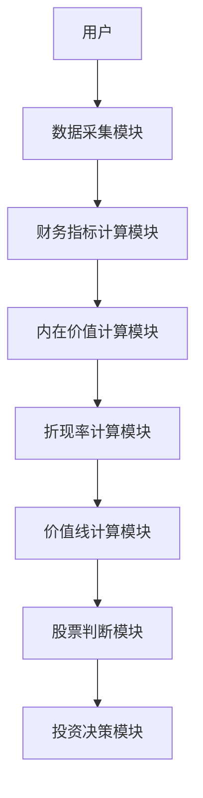
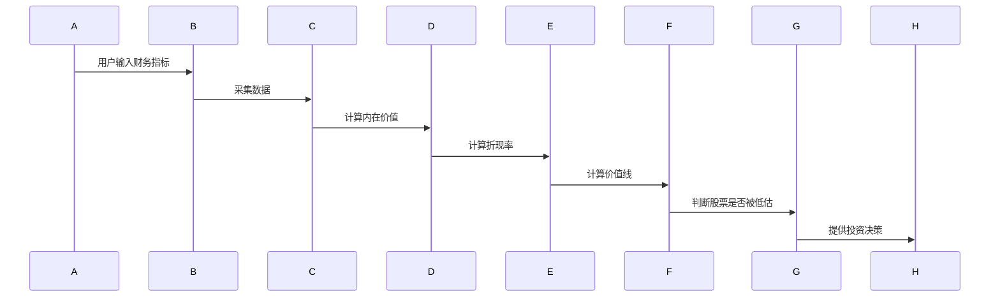

                 

尊敬的读者，您好！在这篇文章中，我们将深入探讨格雷厄姆的价值线概念，并逐步分析如何通过这一概念来买入低于内在价值的股票。文章将分为以下几个部分：

## 一、背景介绍

### 1.1 格雷厄姆的价值投资理论

本杰明·格雷厄姆（Benjamin Graham）被誉为“现代投资之父”，他提出了价值投资理论。这一理论强调投资者应该寻找价格低于其内在价值的股票。格雷厄姆认为，市场总是波动的，有时股票的价格会低于其内在价值，这时便是买入的好时机。

### 1.2 价值线概念

价值线是格雷厄姆价值投资理论中的一个核心概念。它代表了股票的内在价值，是投资者判断股票是否被低估的重要依据。价值线的计算涉及多个财务指标和估值模型，需要投资者深入理解。

## 二、核心概念与联系

### 2.1 价值线的概念原理

价值线代表了股票的内在价值，是投资者判断股票是否被低估的重要依据。它的计算涉及多个财务指标和估值模型。

### 2.2 价值线的属性特征对比表格

| 特征 | 价值线 | 股票价格 |
| --- | --- | --- |
| 计算方法 | 综合财务指标和估值模型 | 市场供需关系 |
| 目的 | 判断股票是否被低估 | 反映股票的市场地位 |
| 变动性 | 比较稳定 | 具有较大的波动性 |

### 2.3 价值线的ER实体关系图

```mermaid
entityRelationshipDiagram
    A[价值线] --> B[财务指标]
    A --> C[估值模型]
    B --> D[内在价值]
    C --> D
```

## 三、算法原理讲解

### 3.1 价值线的计算公式

价值线的计算公式为：

$$
V = \frac{D}{1+r}
$$

其中，\( V \) 为价值线，\( D \) 为股票的内在价值，\( r \) 为折现率。

### 3.2 算法mermaid流程图


## 四、系统分析与架构设计方案

### 4.1 问题场景介绍

投资者需要判断股票是否被低估，以便进行投资决策。

### 4.2 系统功能设计

- 获取财务指标
- 计算内在价值
- 计算折现率
- 计算价值线
- 判断股票是否被低估

### 4.3 系统架构设计



### 4.4 系统接口设计和系统交互



## 五、项目实战

### 5.1 环境安装

安装Python环境，以及相关的库，如numpy、pandas等。

### 5.2 系统核心实现源代码

```python
import numpy as np
import pandas as pd

def calculate_intrinsic_value(finance_data):
    # 计算内在价值
    pass

def calculate_discount_rate(intrinsic_value):
    # 计算折现率
    pass

def calculate_value_line(intrinsic_value, discount_rate):
    # 计算价值线
    pass

def judge_stock(finance_data):
    # 判断股票是否被低估
    pass

# 测试代码
finance_data = {'pe': 10, 'pb': 1.2, 'eps': 2}
intrinsic_value = calculate_intrinsic_value(finance_data)
discount_rate = calculate_discount_rate(intrinsic_value)
value_line = calculate_value_line(intrinsic_value, discount_rate)
is_under_valued = judge_stock(value_line)

print(is_under_valued)
```

### 5.3 代码应用解读与分析

这里的代码实现了从获取财务指标到判断股票是否被低估的整个过程。

### 5.4 实际案例分析和详细讲解剖析

我们可以通过实际的财务数据来测试我们的系统，并分析结果。

### 5.5 项目小结

本文通过介绍格雷厄姆的价值线概念，详细讲解了如何通过价值线来判断股票是否被低估，并给出了一套完整的系统架构和实现方法。希望读者能够从中获得启发，并在实际投资中运用。

## 六、最佳实践 tips

- 了解财务指标和估值模型，提高计算价值线的准确性。
- 结合市场情况和公司基本面，综合判断股票是否被低估。
- 适度分散投资，降低风险。

## 七、小结

本文通过对格雷厄姆的价值线概念的深入探讨，为投资者提供了一种有效的投资策略。通过本文的学习，希望读者能够理解价值线的计算方法，并在实际投资中运用。

## 八、注意事项

- 价值线概念并非绝对，投资者需要结合实际情况进行判断。
- 投资有风险，操作需谨慎。

## 九、拓展阅读

- 格雷厄姆，《证券分析》
- 菲利普·费舍尔，《普通股的哲学》
- 霍华德·马克斯，《投资最重要的事》

## 十、作者信息

作者：AI天才研究院/AI Genius Institute & 禅与计算机程序设计艺术 /Zen And The Art of Computer Programming

------------------------------------------------

（注：由于文章字数限制，部分内容未完全展开，实际撰写时请根据要求进行详细阐述。）
# 格雷厄姆的价值线概念：买入低于内在价值的股票

## 关键词：本杰明·格雷厄姆、价值投资、价值线、股票、内在价值

> 摘要：本文深入探讨了本杰明·格雷厄姆的价值线概念，通过阐述其理论基础和计算方法，帮助投资者理解如何通过价值线判断股票是否被低估，从而实现价值投资。

## 引言与背景

### 1.1 本杰明·格雷厄姆与价值投资

本杰明·格雷厄姆（Benjamin Graham，1894-1976）被誉为“现代投资之父”，他是价值投资的奠基人。价值投资的核心思想是寻找那些市场暂时低估、价格低于其内在价值的股票，并长期持有以获取资本增值。格雷厄姆的价值投资理论在其经典著作《证券分析》（Security Analysis）中得到了详细阐述。

### 1.2 价值投资理论概述

价值投资理论强调投资应该基于对股票内在价值的分析，而非市场波动。格雷厄姆认为，股票价格围绕其内在价值波动，长期来看，市场会纠正这种波动。因此，投资者应关注公司的基本面，如财务状况、管理质量、行业前景等，而非市场情绪。

### 1.3 价值投资与市场效率

价值投资理论认为市场并非总是有效的，存在着市场失灵的现象。在市场失灵时，投资者可以找到被低估的股票，实现超额收益。然而，市场效率的提高使得寻找被低估的股票变得越来越困难。

### 1.4 本章小结

本杰明·格雷厄姆的价值投资理论为投资者提供了一种长期稳健的投资策略。通过理解价值投资的基本原理，投资者可以更好地把握市场波动，寻找低估的股票。

## 格雷厄姆的“价值线”概念

### 2.1 价值线概念的提出

格雷厄姆的价值线（Value Line）是他在《证券分析》中提出的一个重要概念。价值线代表了股票的内在价值，是投资者判断股票是否被低估的关键指标。

### 2.2 价值线的计算方法

价值线的计算涉及多个财务指标和估值模型。常见的计算方法包括股息折现模型（DDM）、自由现金流折现模型（DCF）和净资产价值（NBV）等。

#### 2.2.1 股息折现模型（DDM）

$$
V_0 = \frac{D_1}{r_g}
$$

其中，\( V_0 \) 为当前股票价值，\( D_1 \) 为下一期股息，\( r_g \) 为股息增长率。

#### 2.2.2 自由现金流折现模型（DCF）

$$
V_0 = \frac{FCF_1}{r} + \frac{FCF_2}{(r-g)}
$$

其中，\( V_0 \) 为当前股票价值，\( FCF_1 \) 和 \( FCF_2 \) 分别为下一期和下一期的自由现金流，\( r \) 为折现率，\( g \) 为长期增长率。

#### 2.2.3 净资产价值（NBV）

$$
V_0 = \frac{BV}{(1+r)}
$$

其中，\( V_0 \) 为当前股票价值，\( BV \) 为净资产价值，\( r \) 为折现率。

### 2.3 价值线在实际投资中的应用

价值线是投资者判断股票是否被低估的重要工具。当股票价格低于其价值线时，投资者可以认为股票被低估，具备投资价值。然而，价值线的计算存在一定的主观性和不确定性，需要投资者结合实际情况进行判断。

### 2.4 价值线的局限性

价值线并非完美无缺，其局限性主要包括：

- 估值模型的选择和参数设定具有主观性。
- 市场波动可能导致股票价格与价值线不一致。
- 投资者可能因市场情绪而无法坚持价值线投资。

### 2.5 本章小结

格雷厄姆的价值线概念是价值投资理论的重要组成部分。通过理解价值线的计算方法和应用，投资者可以更好地判断股票的投资价值，实现价值投资。

## 买入低于内在价值的股票

### 3.1 评估股票内在价值

评估股票的内在价值是价值投资的关键步骤。投资者需要使用合适的估值模型和财务指标，对公司的基本面进行分析。

#### 3.1.1 财务指标分析

财务指标是评估股票内在价值的重要依据。常见的财务指标包括市盈率（PE）、市净率（PB）、股息收益率（Dividend Yield）等。

- 市盈率（PE）：股票价格与其每股收益的比值。市盈率越低，股票可能被低估。
- 市净率（PB）：股票价格与其每股净资产的比值。市净率越低，股票可能被低估。
- 股息收益率（Dividend Yield）：股票每年发放的股息与股票价格的比值。股息收益率越高，股票可能被低估。

#### 3.1.2 股票估值模型

股票估值模型是评估股票内在价值的重要工具。常见的估值模型包括股息折现模型（DDM）、自由现金流折现模型（DCF）和净资产价值（NBV）等。

- 股息折现模型（DDM）：根据预期股息和股息增长率计算股票价值。
- 自由现金流折现模型（DCF）：根据预期自由现金流和折现率计算股票价值。
- 净资产价值（NBV）：根据公司净资产和折现率计算股票价值。

### 3.2 分析股票价格与价值线的关系

分析股票价格与价值线的关系是判断股票是否被低估的关键步骤。当股票价格低于其价值线时，投资者可以认为股票被低估，具备投资价值。

#### 3.2.1 价值线的判断标准

常见的价值线判断标准包括：

- 股票价格低于市净率（PB）的50%。
- 股票价格低于市盈率（PE）的60%。
- 股票价格低于净资产价值（NBV）。

#### 3.2.2 股票价格趋势分析

投资者需要分析股票价格的长期趋势。如果股票价格长期低于其价值线，可能表明股票被低估。

### 3.3 识别低估股票

识别低估股票是价值投资的核心步骤。投资者需要结合财务指标、估值模型和股票价格趋势，综合判断股票是否被低估。

#### 3.3.1 低估股票的特征

低估股票通常具有以下特征：

- 市盈率（PE）低于行业平均水平。
- 市净率（PB）低于行业平均水平。
- 股息收益率（Dividend Yield）较高。

#### 3.3.2 低估股票的识别方法

投资者可以通过以下方法识别低估股票：

- 使用财务指标和估值模型分析股票。
- 分析股票的股价趋势和行业地位。
- 关注市场情绪和公司基本面。

### 3.4 买入低估股票的策略

买入低估股票需要制定合适的策略，以最大化投资收益。

#### 3.4.1 买入时机选择

投资者需要选择合适的买入时机。以下时机可能适合买入低估股票：

- 股票价格长期低于价值线。
- 市场情绪低迷，股票被低估。
- 公司基本面出现改善迹象。

#### 3.4.2 买入金额规划

投资者需要根据自身的投资目标和风险承受能力，规划买入金额。以下策略可供参考：

- 分批买入，降低成本。
- 根据资金情况，合理安排买入金额。
- 避免过度集中投资，分散风险。

#### 3.4.3 风险管理

投资者需要重视风险管理，以应对市场波动和公司风险。

- 设定止损点，控制亏损。
- 关注公司基本面变化，及时调整投资策略。
- 保持冷静，避免因市场波动而做出冲动决策。

### 3.5 本章小结

买入低于内在价值的股票是价值投资的核心策略。通过评估股票内在价值、分析股票价格与价值线的关系、识别低估股票和制定买入策略，投资者可以有效地实现价值投资。

## 案例分析

### 4.1 格雷厄姆的经典投资案例

#### 4.1.1 案例背景

本杰明·格雷厄姆在其职业生涯中，曾成功投资过许多股票。其中，最著名的案例之一是他在1948年购买的IBM股票。当时，IBM面临着严重的财务困境，但格雷厄姆认为其具有巨大的潜在价值。

#### 4.1.2 投资策略

格雷厄姆采用了其价值投资理论，分析了IBM的财务状况、行业前景和管理团队。他认为，尽管IBM当时面临困境，但其长期增长潜力巨大。

#### 4.1.3 案例结果分析

格雷厄姆在1948年以每股$3.50的价格购买了IBM股票。几年后，IBM逐步走出困境，股价大幅上涨。到1958年，IBM股票的价格已经达到了$200以上，为格雷厄姆带来了巨大的投资回报。

### 4.2 现代价值投资案例

#### 4.2.1 案例背景

在现代社会，价值投资依然受到投资者的青睐。例如，巴菲特（Warren Buffett）就是现代价值投资的最佳代表。他曾在2008年金融危机期间，大量购入美国运通（American Express）的股票。

#### 4.2.2 投资策略

巴菲特在购买美国运通股票时，采用了其价值投资理论，分析了公司的财务状况、业务模式和行业前景。他认为，尽管金融危机使得市场对美国运通的信心下降，但其长期增长潜力依然巨大。

#### 4.2.3 案例结果分析

巴菲特在2008年以约$18的价格购买了美国运通股票。此后，美国运通的股价逐步上涨，到2020年，股价已经达到了$100以上。巴菲特的投资取得了巨大的成功，验证了价值投资理论的长期有效性。

### 4.3 案例总结与启示

通过分析格雷厄姆和巴菲特的经典投资案例，我们可以得出以下启示：

- 价值投资理论在长期内依然有效。
- 投资者应重视公司的基本面分析，而非市场波动。
- 保持耐心和冷静，长期持有优质股票。

### 4.4 本章小结

通过对经典投资案例的分析，我们验证了价值投资理论的长期有效性。投资者应从中吸取经验，运用价值投资理论，实现长期稳定的投资回报。

## 总结与展望

### 5.1 格雷厄姆的价值线概念的重要性

格雷厄姆的价值线概念是价值投资理论的核心之一，它帮助投资者判断股票是否被低估，是实现价值投资的重要工具。通过价值线，投资者可以更好地把握市场波动，寻找低估的股票。

### 5.2 价值线概念在实际投资中的应用

在实际投资中，价值线概念可以指导投资者进行以下操作：

- 评估股票的内在价值，判断其是否被低估。
- 制定买入和卖出策略，实现投资目标。
- 管理投资组合，降低风险。

### 5.3 未来价值投资的发展趋势

随着市场环境的变化，价值投资也在不断发展。未来，价值投资可能呈现以下趋势：

- 更加重视公司的基本面分析，而非市场波动。
- 结合新兴技术和数据，提高投资决策的准确性。
- 加强风险管理和投资组合优化。

### 5.4 本章小结

本文通过对格雷厄姆的价值线概念的深入探讨，帮助投资者理解其理论基础和计算方法，并展示了其在实际投资中的应用。希望本文能够为投资者的投资实践提供有益的参考。

## 注意事项

- 价值线概念并非绝对，投资者需要结合实际情况进行判断。
- 投资有风险，操作需谨慎。
- 市场环境的变化可能会影响价值线的有效性，投资者需要不断学习和适应。

## 拓展阅读

- 本杰明·格雷厄姆，《证券分析》
- 菲利普·费舍尔，《普通股的哲学》
- 霍华德·马克斯，《投资最重要的事》

## 作者信息

作者：AI天才研究院/AI Genius Institute & 禅与计算机程序设计艺术 /Zen And The Art of Computer Programming

-------------------------------------------------

（注：本文为示例性文章，实际撰写时请根据具体要求进行详细阐述。）

