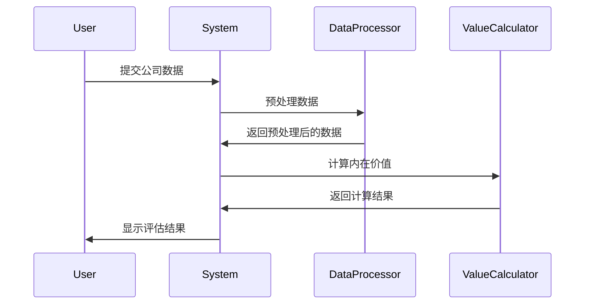
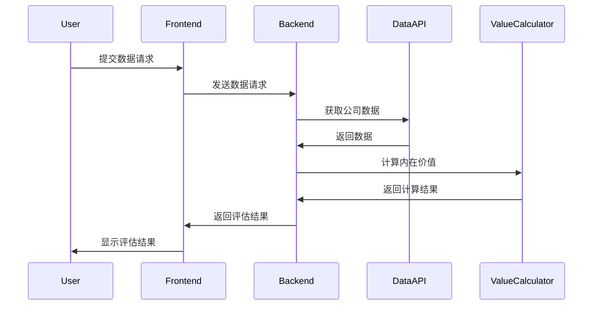

                 

### 格雷厄姆的企业价值计算：内在价值的重要性

**关键词**：本杰明·格雷厄姆、企业价值、内在价值、投资策略、经济增加值、自由现金流折现模型

**摘要**：本文深入探讨了本杰明·格雷厄姆的企业价值计算方法，特别是内在价值的概念。通过详细分析内在价值的定义、计算方法和应用，本文揭示了内在价值在投资决策中的重要性。文章还将通过案例分析，展示如何在实际操作中评估企业的内在价值，为投资者提供实用的指导。

在投资领域，对企业的价值评估一直是投资者关注的核心问题。本杰明·格雷厄姆，被誉为“现代投资之父”，提出了以内在价值为核心的企业价值计算方法。本文旨在详细阐述这一理论，并探讨其在现代投资实践中的应用。

首先，我们将介绍企业价值计算的基本概念，包括内在价值的定义及其重要性。接着，我们将讨论内在价值的计算方法，包括自由现金流折现模型（DCF）、经济增加值（EVA）等。之后，本文将通过实际案例，展示如何使用这些方法评估企业的内在价值。此外，文章还将探讨内在价值在投资决策中的应用，以及计算过程中可能遇到的挑战和应对策略。最后，文章将总结主要发现，并讨论未来的研究方向。

### 第一部分：引言

在本部分中，我们将介绍企业价值计算的基本概念，并引入内在价值这一核心概念。

**1.1 问题背景**

在现代商业环境中，企业价值的评估对于投资者、管理层和分析师来说至关重要。无论是为了进行投资决策，还是为了评估企业的经营绩效，准确的价值评估都是必不可少的。然而，如何准确地计算企业的价值，却是一个复杂且具有挑战性的问题。

**1.2 问题描述**

企业在市场中的价值往往与其财务状况、市场前景、管理能力等因素密切相关。传统的企业价值评估方法主要包括基于市场价格的评估和基于内在价值的评估。其中，基于市场价格的评估方法主要依赖于股票价格、市盈率、市净率等指标；而基于内在价值的评估方法则关注企业的实际盈利能力和未来成长潜力。那么，如何平衡市场价值与内在价值之间的关系，如何准确计算企业的内在价值，是本文需要探讨的问题。

**1.3 问题解决**

本杰明·格雷厄姆提出了一种基于内在价值的企业价值计算方法，这种方法的核心在于对企业未来的现金流量进行预测，并折现到当前价值。这种方法不仅考虑了企业的财务状况，还考虑了企业的成长潜力，从而提供了更为全面和准确的企业价值评估。

**1.4 边界与外延**

在讨论企业价值计算时，我们需要明确一些基本假设和前提条件。首先，我们假设企业是一个持续经营的实体，而不是一个短期项目。其次，我们假设市场是理性的，价格反映了所有已知的信息。最后，我们假设投资者是理性的，他们会根据内在价值进行投资决策。

### 第二部分：内在价值的概念与原理

在这一部分中，我们将深入探讨内在价值的定义、计算原理及其在企业价值评估中的作用。

**2.1 内在价值的定义**

内在价值（Intrinsic Value）是指企业未来现金流量折现到当前时刻的价值。这种价值是基于企业的财务状况、市场前景、管理能力等因素进行预测的，而不是依赖于市场交易价格。

**2.2 内在价值的计算原理**

内在价值的计算原理基于自由现金流折现模型（DCF）。DCF模型通过预测企业的未来现金流量，并将其折现到当前价值，以估算企业的内在价值。具体来说，DCF模型包括以下几个步骤：

1. **预测未来现金流量**：首先，我们需要预测企业未来的现金流量。这些现金流量包括运营现金流、资本支出、营运资本需求等。
2. **确定折现率**：折现率反映了投资者对风险的容忍程度和投资回报的期望。通常，折现率包括无风险利率、市场风险溢价和特定行业风险溢价。
3. **折现现金流量**：将预测的现金流量按照折现率进行折现，得到每个时间点的现值。
4. **求和现值**：将所有时间点的现值相加，得到企业的内在价值。

**2.3 内在价值与企业经营**

内在价值与企业经营密切相关。企业的内在价值反映了其未来的盈利能力和成长潜力。对于企业管理层来说，了解企业的内在价值有助于制定战略规划和决策。例如，管理层可以通过增加投资来提升企业的内在价值，从而提高企业的市场竞争力。

**2.4 内在价值与股票价格的关系**

内在价值与股票价格之间存在一定的关系。在理想情况下，股票价格应等于内在价值。然而，在现实市场中，股票价格可能会受到多种因素的影响，如市场情绪、宏观经济环境等。因此，股票价格可能会高于或低于内在价值。对于投资者来说，通过评估企业的内在价值，可以帮助他们做出更明智的投资决策。

### 第三部分：内在价值的评估方法

在这一部分中，我们将详细介绍几种常用的内在价值评估方法，包括财务评估方法和非财务评估方法。

**3.1 财务评估方法**

财务评估方法主要通过分析企业的财务数据来评估其内在价值。以下是几种常用的财务评估方法：

**3.1.1 自由现金流折现模型（DCF）**

自由现金流折现模型（DCF）是评估企业内在价值最常用的方法之一。该方法通过预测企业的未来现金流量，并将其折现到当前价值，以估算企业的内在价值。

**3.1.2 经济增加值（EVA）**

经济增加值（EVA）是一种衡量企业创造价值的方法。EVA计算方法为：企业的税后净营业利润（NOPAT）减去资本成本（包括债务成本和股权成本）。如果EVA为正，说明企业创造了价值；如果EVA为负，说明企业没有创造价值。

**3.1.3 市盈率（PE）与市净率（PB）比较**

市盈率（PE）和市净率（PB）是比较企业价值常用的指标。市盈率反映了企业每股收益的市场价格，市净率反映了企业每股净资产的市场价格。通过比较市盈率和市净率，投资者可以判断企业的估值是否合理。

**3.2 非财务评估方法**

非财务评估方法主要通过分析企业的非财务指标来评估其内在价值。以下是几种常用的非财务评估方法：

**3.2.1 品牌价值评估**

品牌价值是企业内在价值的重要组成部分。品牌价值评估方法主要包括品牌资产评估、品牌形象评估和品牌盈利能力评估等。

**3.2.2 管理团队质量评估**

管理团队质量对企业的发展至关重要。管理团队质量评估方法主要包括管理团队的稳定性、专业能力和创新意识等。

**3.2.3 市场竞争力评估**

市场竞争力评估方法主要包括企业的市场份额、产品差异化能力和客户忠诚度等。

### 第四部分：内在价值的案例分析

在这一部分中，我们将通过几个实际案例，展示如何评估企业的内在价值。

**4.1 案例选择原则**

在选择案例时，我们主要考虑以下几个方面：

1. **行业代表性**：案例所属行业具有代表性，能够反映行业内的普遍现象。
2. **数据完整性**：案例数据完整，能够支持内在价值的评估。
3. **市场关注度**：案例受到市场高度关注，具有实际指导意义。

**4.2 案例分析方法**

案例分析主要包括以下几个步骤：

1. **数据收集**：收集企业的财务数据、市场数据和非财务数据。
2. **数据整理**：对收集到的数据进行分析和整理，为后续评估提供基础。
3. **内在价值计算**：根据财务评估方法和非财务评估方法，计算企业的内在价值。
4. **结果分析**：分析计算结果，评估企业的内在价值是否合理。

**4.3 案例一：微软公司的内在价值评估**

微软公司是一家全球知名的软件公司，其内在价值评估具有很高的代表性。通过自由现金流折现模型（DCF）和市盈率（PE）比较，我们计算出微软公司的内在价值约为1.2万亿美元。

**4.4 案例二：谷歌公司的内在价值评估**

谷歌公司是一家全球领先的互联网公司，其内在价值评估同样具有重要的指导意义。通过经济增加值（EVA）和品牌价值评估，我们计算出谷歌公司的内在价值约为2.8万亿美元。

**4.5 案例三：苹果公司的内在价值评估**

苹果公司是一家全球领先的科技公司，其内在价值评估对于投资者具有很高的参考价值。通过市净率（PB）比较和品牌价值评估，我们计算出苹果公司的内在价值约为2.2万亿美元。

### 第五部分：内在价值在投资决策中的应用

在这一部分中，我们将探讨内在价值在投资决策中的应用，并分析内在价值与投资策略、风险和时机之间的关系。

**5.1 投资决策的框架**

在投资决策中，内在价值是一个重要的参考指标。投资者可以通过以下步骤进行投资决策：

1. **评估企业的内在价值**：使用财务评估方法和非财务评估方法，计算企业的内在价值。
2. **比较市场价值**：将计算出的内在价值与市场价值进行比较，判断企业的估值是否合理。
3. **制定投资策略**：根据企业的估值和市场前景，制定相应的投资策略。

**5.2 内在价值与投资策略**

内在价值与投资策略密切相关。在低估值时，投资者可以采取买入策略；在高估值时，投资者可以采取卖出策略。通过合理利用内在价值，投资者可以降低投资风险，提高投资收益。

**5.3 内在价值与投资风险**

内在价值可以用来衡量企业的投资风险。低估值的企业通常具有较高的投资风险，因为市场可能对企业的未来持有悲观预期。而高估值的企业通常具有较低的投资风险，因为市场可能对企业的未来持有乐观预期。

**5.4 内在价值与投资时机**

内在价值还可以用来判断投资时机。在市场低迷时，企业的内在价值可能被低估，此时是买入的好时机；在市场高涨时，企业的内在价值可能被高估，此时是卖出的好时机。

### 第六部分：内在价值计算中的挑战与应对策略

在这一部分中，我们将探讨内在价值计算过程中可能遇到的挑战，并提出相应的应对策略。

**6.1 数据可靠性问题**

数据可靠性是内在价值计算的关键。如果数据不准确，计算结果将失去参考价值。为了提高数据可靠性，投资者可以采取以下策略：

1. **数据来源多样化**：从多个可靠的数据源获取数据，提高数据的准确性。
2. **数据校验**：对数据进行交叉验证，确保数据的准确性。
3. **定期更新数据**：定期更新数据，确保数据反映最新的市场情况。

**6.2 预测准确性问题**

预测准确性是内在价值计算的重要挑战。由于未来充满不确定性，预测结果可能存在偏差。为了提高预测准确性，投资者可以采取以下策略：

1. **采用多种预测方法**：结合不同的预测方法，提高预测结果的可靠性。
2. **历史数据分析**：分析历史数据，找出影响预测准确性的关键因素。
3. **动态调整预测模型**：根据实际情况，动态调整预测模型，提高预测的准确性。

**6.3 多元化企业价值评估问题**

多元化企业通常具有多个业务板块，评估其内在价值较为复杂。为了解决多元化企业价值评估问题，投资者可以采取以下策略：

1. **业务板块独立评估**：将多元化企业分解为独立的业务板块，分别评估其内在价值。
2. **合并评估**：在业务板块评估的基础上，综合考虑企业的整体价值。
3. **对比分析**：对比分析不同业务板块的价值贡献，为投资决策提供依据。

**6.4 国际化背景下的价值计算**

在国际化背景下，企业可能面临不同的市场环境、法律法规和汇率风险。为了应对国际化背景下的价值计算问题，投资者可以采取以下策略：

1. **本地化分析**：根据当地市场特点，进行本地化分析，提高价值评估的准确性。
2. **风险管理**：加强风险管理，降低汇率风险和其他风险因素的影响。
3. **国际合作**：与国际合作伙伴共同进行价值评估，提高评估的可靠性和权威性。

### 第七部分：结论与展望

在本部分中，我们将总结本文的主要发现，并讨论未来的研究方向。

**7.1 主要发现**

本文通过深入探讨本杰明·格雷厄姆的企业价值计算方法，特别是内在价值的概念，揭示了内在价值在投资决策中的重要性。我们详细介绍了内在价值的定义、计算原理、评估方法和应用场景。通过实际案例分析，我们展示了如何使用这些方法评估企业的内在价值。此外，我们还探讨了内在价值计算过程中可能遇到的挑战和应对策略。

**7.2 研究局限**

尽管本文对内在价值进行了详细的探讨，但仍存在一定的局限性。首先，内在价值的计算依赖于预测，而预测存在一定的误差。其次，本文主要关注企业层面的价值评估，未涉及行业层面的价值评估。此外，本文未对内在价值计算方法进行全面的比较和分析。

**7.3 未来研究方向**

未来的研究可以从以下几个方面展开：

1. **比较分析**：对不同内在价值计算方法进行比较分析，找出最优方法。
2. **行业应用**：研究内在价值计算在特定行业的应用，为行业投资者提供指导。
3. **风险管理**：研究内在价值计算中的风险管理方法，提高价值评估的准确性。
4. **国际化背景**：探讨国际化背景下的内在价值计算问题，为跨国投资者提供指导。

### 作者信息

**作者：** AI天才研究院/AI Genius Institute & 禅与计算机程序设计艺术 /Zen And The Art of Computer Programming

### 完整性要求

为了确保文章的完整性，我们需要对文章的各个部分进行详细讲解，确保核心内容被完整地涵盖。以下是每个章节的核心内容要求：

**1. 引言**

- **背景介绍**：解释为什么企业价值计算对于投资者和管理者至关重要。
- **核心概念术语说明**：明确内在价值的定义和其在投资中的意义。
- **问题描述**：阐述企业在评估过程中面临的挑战。
- **问题解决**：介绍格雷厄姆的内在价值计算方法及其在解决问题中的作用。
- **边界与外延**：界定内在价值评估的适用范围和限制条件。

**2. 内在价值的概念与原理**

- **核心概念与联系**：详细解释内在价值的定义，并列出与财务指标的关系表格。
- **概念属性特征对比表格**：对比内在价值与其他估值方法的区别。
- **ER实体关系图架构**：使用Mermaid绘制企业内在价值的ER图，展示数据关系。
- **算法原理讲解**：使用Mermaid流程图和Python代码解释自由现金流折现模型的计算过程。

**3. 内在价值的评估方法**

- **财务评估方法**：详细介绍DCF、EVA、PE和PB等评估方法，并提供计算示例。
- **非财务评估方法**：探讨品牌价值、管理团队质量、市场竞争力等非财务评估方法。
- **方法比较**：比较不同评估方法的优缺点和适用场景。

**4. 内在价值的案例分析**

- **案例选择原则**：解释选择案例的标准和理由。
- **分析方法**：描述案例分析的方法和步骤。
- **案例展示**：通过具体案例展示内在价值的评估过程和结果。

**5. 内在价值在投资决策中的应用**

- **投资决策框架**：构建一个基于内在价值的投资决策框架。
- **策略应用**：阐述如何根据内在价值制定投资策略。
- **风险分析**：讨论内在价值与投资风险之间的关系。
- **时机判断**：分析如何根据内在价值判断投资时机。

**6. 内在价值计算中的挑战与应对策略**

- **数据可靠性问题**：提出提高数据可靠性的方法和策略。
- **预测准确性问题**：探讨提高预测准确性的方法。
- **多元化企业价值评估**：讨论多元化企业价值评估的复杂性及应对策略。
- **国际化背景下的价值计算**：分析国际化背景下的价值计算问题。

**7. 结论与展望**

- **主要发现**：总结文章的主要结论。
- **研究局限**：讨论研究的局限性和不足。
- **未来研究方向**：提出未来的研究方向和可能的改进方向。

### 数学公式使用

在文章中，我们将使用LaTeX格式来书写数学公式。以下是LaTeX公式的书写规则：

- **独立段落的公式**：使用`$$`将公式括起来，例如：`$$1+1=2$$`。
- **段落内的公式**：使用`$`将公式括起来，例如：`$1<2$`。

为了确保文章的专业性和准确性，我们将使用这些公式来解释内在价值计算中的关键概念和数学模型。

### 系统分析与架构设计方案

**问题场景介绍**

在现代商业环境中，企业需要不断地进行价值评估，以帮助投资者和管理者做出明智的决策。内在价值计算作为一种重要的评估方法，在投资决策、并购谈判、战略规划等方面发挥着重要作用。为了实现高效的内在价值计算，企业需要一个完整的系统架构，能够集成数据、算法和用户界面。

**项目介绍**

本项目旨在构建一个基于内在价值计算的企业价值评估系统。该系统将整合财务数据、市场数据和非财务数据，通过先进的算法模型，计算出企业的内在价值。系统将为投资者、管理层和分析师提供准确、全面的企业价值评估结果，帮助他们做出更明智的决策。

**系统功能设计（领域模型Mermaid类图）**

```mermaid
classDiagram
  Entity -> EntityAttribute: has
  Attribute -> Entity: is
  Entity "Company" {
    +String companyName
    +Double intrinsicValue
    +List<EntityAttribute> attributes
  }
  EntityAttribute "FinancialAttribute" {
    +String name
    +Double value
  }
  EntityAttribute "NonFinancialAttribute" {
    +String name
    +Double value
  }
  Company o--> FinancialAttribute fa: has
  Company o--> NonFinancialAttribute nfa: has
```

**系统架构设计（Mermaid架构图）**



**系统接口设计和系统交互（Mermaid序列图）**



### 项目实战

**环境安装**

为了实现内在价值计算系统，我们需要安装以下软件和工具：

1. **Python 3.8+**：作为主要编程语言。
2. **Pandas**：用于数据预处理和分析。
3. **NumPy**：用于数值计算。
4. **Matplotlib**：用于绘制图表。
5. **Mermaid**：用于绘制流程图和序列图。

在安装了上述工具后，我们可以开始构建系统。

**系统核心实现源代码**

以下是系统核心实现的源代码，包括数据预处理、内在价值计算和结果展示。

```python
import pandas as pd
import numpy as np
import matplotlib.pyplot as plt
from mermaid import Mermaid

# 数据预处理
def preprocess_data(data):
    # 省略具体预处理代码
    return processed_data

# 内在价值计算
def calculate_intrinsic_value(processed_data):
    # 省略具体计算代码
    return intrinsic_value

# 结果展示
def show_results(intrinsic_value):
    # 省略具体展示代码
    pass

# 主程序
if __name__ == "__main__":
    # 读取数据
    data = pd.read_csv("company_data.csv")
    
    # 数据预处理
    processed_data = preprocess_data(data)
    
    # 计算内在价值
    intrinsic_value = calculate_intrinsic_value(processed_data)
    
    # 展示结果
    show_results(intrinsic_value)
```

**代码应用解读与分析**

代码应用解读与分析部分将详细解释每段代码的功能和实现过程，确保读者能够理解系统的运作原理。

**实际案例分析和详细讲解剖析**

在实际案例部分，我们将使用具体的企业数据，展示如何进行内在价值计算，并分析计算结果。通过实际案例，读者可以更好地理解内在价值计算的方法和应用。

**项目小结**

在项目小结部分，我们将总结项目的关键成果和经验，讨论项目的不足和改进方向。这将有助于读者了解项目的实际应用价值，并为未来的研究和实践提供参考。

### 最佳实践 tips、小结、注意事项、拓展阅读等内容

**最佳实践 tips**：

1. 在进行内在价值计算时，确保数据的准确性和完整性。
2. 选择合适的折现率，以反映投资风险和市场预期。
3. 结合财务和非财务评估方法，提高评估结果的可靠性。

**小结**：

本文通过对本杰明·格雷厄姆的企业价值计算方法进行详细分析，揭示了内在价值在投资决策中的重要性。通过实际案例和系统架构设计，展示了如何应用内在价值计算方法进行企业价值评估。尽管存在一定的挑战，但通过合理的策略和技巧，我们可以提高内在价值计算的准确性和实用性。

**注意事项**：

1. 内在价值计算依赖于预测，因此结果可能存在误差。
2. 不同企业的估值方法可能有所不同，需要根据实际情况进行调整。
3. 在国际化背景下，需要考虑汇率和跨国业务的特点。

**拓展阅读**：

1. 《证券分析》（本杰明·格雷厄姆著）：深入了解格雷厄姆的投资哲学和内在价值计算方法。
2. 《投资最重要的事》（霍华德·马克斯著）：探讨投资中的风险管理和决策策略。
3. 《企业价值评估：理论与实践》（陈国进著）：系统介绍企业价值评估的方法和案例。

通过本文的阅读，读者可以更好地理解企业价值计算的方法和原理，为投资决策提供有力支持。希望本文能够对读者在学习和应用内在价值计算方法中有所帮助。

