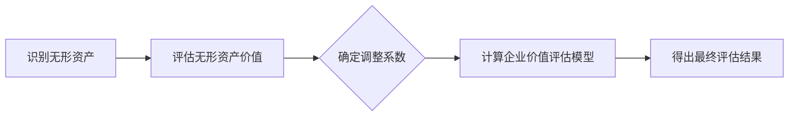
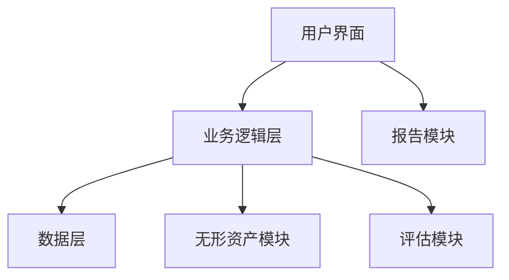
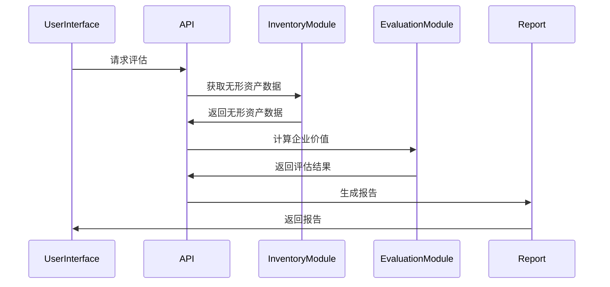
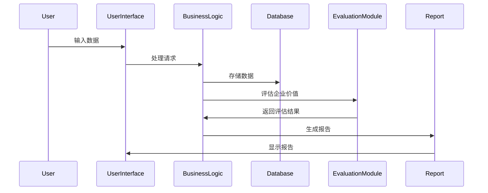

                 


### 第1章：引言

#### 1.1 书籍的写作目的和意义

在现代商业世界中，企业价值的评估显得尤为重要。这不仅关乎企业自身的投资决策，也影响着投资者的利益和市场的稳定性。本书旨在深入探讨企业价值计算中的核心问题，特别是无形资产在价值评估中的重要性。通过对格雷厄姆的企业价值计算方法的解析，我们希望能够为读者提供一套全面、科学、实用的评估体系。

格雷厄姆的企业价值计算方法是一种基于稳健性、安全性和长期增长潜力的评估方法。这种方法不仅考虑了企业的有形资产，更强调了无形资产的作用。无形资产包括品牌价值、专利、技术、管理团队和客户关系等，它们是企业核心竞争力的重要组成部分。传统的评估方法往往忽略了这些无形资产，这在一定程度上导致了评估结果的偏差。

本书的目标是帮助读者理解并应用格雷厄姆的企业价值计算方法，特别是如何调整无形资产的重要性，从而得出更准确的企业价值评估结果。这不仅对企业管理者有指导意义，也对投资者和分析师提供了有益的参考。

#### 1.2 企业价值计算的发展历程

企业价值计算的历史可以追溯到20世纪初期。早期的评估方法主要依赖于财务报表的数据，如利润、现金流和资产等。随着经济环境的变化和企业管理理念的提升，企业价值评估方法也在不断演变。

20世纪中期，随着经济学和管理学的理论发展，企业价值评估逐渐从单一的财务指标转向更为综合的指标体系。这个时期，学者们提出了许多新的评估方法，如折现现金流法（DCF）、经济增加值（EVA）和市盈率法等。这些方法在企业价值评估中发挥了重要作用，但仍然存在局限性。

进入21世纪，随着信息技术和数字经济的发展，无形资产的重要性日益凸显。传统的评估方法开始逐步向更加全面、考虑无形资产的方向发展。格雷厄姆的企业价值计算方法正是这一趋势的体现。它不仅继承了传统方法的优点，还通过调整无形资产的重要性，使得企业价值评估更加准确和全面。

#### 1.3 调整无形资产的重要性

无形资产是企业竞争力的重要组成部分，但它们通常不体现在财务报表上。传统的企业价值评估方法往往忽略了这些无形资产，导致评估结果不够准确。为了弥补这一不足，格雷厄姆提出了调整无形资产重要性的方法。

这种方法的核心思想是将无形资产的价值转化为可量化的指标，并纳入企业价值的计算中。具体来说，调整无形资产的重要性的步骤如下：

1. **识别无形资产**：首先，需要识别企业所拥有的无形资产，如专利、商标、客户关系、品牌价值等。

2. **评估无形资产**：对于每一种无形资产，需要评估其价值和潜在贡献。这可以通过市场调查、专家评估和内部数据等多种途径来实现。

3. **调整系数确定**：为了体现无形资产的重要性，需要为每种无形资产确定一个调整系数。这个系数可以根据无形资产的特点、市场竞争环境等因素来确定。

4. **纳入评估模型**：将调整后的无形资产价值纳入企业价值评估模型中，从而得到更准确的企业价值评估结果。

通过这种方法，企业价值评估不仅考虑了有形资产，还充分考虑了无形资产的重要性，使得评估结果更加全面和准确。

#### 1.4 本章小结

本章介绍了书籍的写作目的和意义，回顾了企业价值计算的发展历程，并重点阐述了调整无形资产重要性的方法。通过对这些内容的分析，读者可以初步了解本书的核心内容和研究方法。在接下来的章节中，我们将进一步探讨无形资产评估的基本理论、调整系数的确定方法以及企业价值评估模型的具体应用。

---

在下一章中，我们将深入探讨企业价值评估的现状与挑战，详细分析传统评估方法的局限性，并探讨调整无形资产在价值评估中的作用。通过这些分析，我们将为理解本书的核心概念奠定坚实的基础。

----------------------------------------------------------------

### 第2章：背景介绍

#### 2.1 问题背景

企业价值评估是一个复杂而关键的过程，它在多个方面影响着企业的运营决策、投资者的投资决策以及市场的稳定性。随着商业环境的变化和技术的进步，企业价值评估的方法也在不断演变。然而，当前的评估方法仍然存在许多挑战和不足之处。

首先，企业价值评估面临的主要问题之一是数据的不完整性和不可靠性。许多企业的财务报表可能存在误导性的信息，或者某些重要的数据没有在报表中体现。这种情况可能导致评估结果的不准确，从而影响决策的有效性。

其次，评估方法的单一性也是一个问题。传统的企业价值评估方法如折现现金流法（DCF）、经济增加值（EVA）和市盈率法等，虽然各自有其优点，但都存在一定的局限性。例如，DCF方法过于依赖预测，而EVA方法在计算过程中可能无法充分考虑无形资产的价值。

此外，随着数字经济的发展，无形资产在企业价值中的作用日益重要。然而，当前的评估方法往往忽略了无形资产的价值，如专利、商标、客户关系和品牌价值等。这导致评估结果可能无法真实反映企业的实际价值。

因此，为了提高企业价值评估的准确性和全面性，需要引入新的方法来调整无形资产的重要性，从而更准确地评估企业的价值。

#### 2.2 问题描述

问题描述主要集中在以下几个方面：

1. **评估方法的不完善**：传统的评估方法如DCF、EVA等虽然广泛应用，但都存在一定的局限性，特别是在处理无形资产方面。

2. **无形资产价值的低估**：由于无形资产不体现在财务报表中，传统方法往往低估了无形资产对企业价值的影响。

3. **数据的不完整性和不可靠性**：企业的财务报表可能存在误导性信息或者重要数据缺失，这使得评估结果可能不准确。

4. **预测的依赖性**：DCF方法在预测未来的现金流和回报方面存在较大的不确定性，这可能导致评估结果的偏差。

5. **评估结果与实际价值的偏差**：由于上述问题，评估结果可能无法真实反映企业的实际价值，从而影响决策的有效性。

#### 2.3 问题解决

为了解决上述问题，格雷厄姆提出了调整无形资产重要性的企业价值评估方法。这种方法的核心思想是将无形资产的价值转化为可量化的指标，并纳入企业价值的计算中，从而更准确地评估企业的价值。

1. **识别和评估无形资产**：首先，需要识别企业所拥有的无形资产，如专利、商标、客户关系和品牌价值等。然后，对这些无形资产进行评估，确定其价值和潜在贡献。

2. **确定调整系数**：为了体现无形资产的重要性，需要为每种无形资产确定一个调整系数。这个系数可以根据无形资产的特点、市场竞争环境等因素来确定。

3. **纳入评估模型**：将调整后的无形资产价值纳入企业价值评估模型中，从而得到更准确的企业价值评估结果。

通过这种方法，不仅可以弥补传统评估方法的不足，还可以更全面地考虑无形资产的价值，提高评估结果的准确性和可靠性。

#### 2.4 边界与外延

无形资产是指企业拥有或者控制的，没有实物形态但能够为企业带来经济利益的资产。无形资产主要包括以下几类：

1. **专利和商标**：这些是企业通过研发和技术创新获得的，具有法律保护的权利，能够为企业在市场上提供竞争优势。

2. **客户关系**：包括客户的忠诚度、满意度以及与企业建立的良好合作关系等，这些对企业的长期发展至关重要。

3. **品牌价值**：品牌是企业通过长期经营和营销活动所建立的市场认知和品牌形象，能够为企业带来持续的收益。

4. **管理团队**：优秀的管理团队能够有效推动企业的运营和发展，提高企业的管理水平和运营效率。

5. **技术和知识**：包括企业的专有技术、知识体系和创新能力等，这些是企业持续发展的动力。

在评估无形资产时，需要注意以下边界与外延：

1. **评估范围**：无形资产的评估范围应涵盖企业所拥有的所有无形资产，不仅限于财务报表中体现的部分。

2. **评估方法**：应根据无形资产的特点选择合适的评估方法，如市场比较法、收益法或成本法等。

3. **调整系数**：调整系数的确定应充分考虑无形资产的特点和市场竞争环境，确保评估结果的合理性。

#### 2.5 概念结构与核心要素组成

企业价值评估的概念结构主要包括以下几个核心要素：

1. **财务指标**：如利润、现金流和资产等，这些指标是评估企业价值的基础。

2. **无形资产**：包括专利、商标、客户关系、品牌价值、管理团队和核心技术等，这些无形资产对企业的长期发展至关重要。

3. **评估模型**：包括折现现金流法（DCF）、经济增加值（EVA）、市盈率法等，这些模型用于计算企业的价值。

4. **调整系数**：用于体现无形资产的重要性，根据无形资产的特点和市场竞争环境来确定。

5. **评估结果**：综合考虑财务指标和无形资产的价值，得出的企业价值评估结果。

通过上述概念结构和核心要素的组成，可以构建一个全面、科学、实用的企业价值评估体系，从而提高评估结果的准确性和可靠性。

#### 2.6 本章小结

本章介绍了企业价值评估的背景和现状，分析了当前评估方法的局限性，并提出了调整无形资产重要性的问题解决方法。通过识别无形资产、评估无形资产、确定调整系数和纳入评估模型等步骤，可以更准确地评估企业的价值。同时，明确了无形资产的边界与外延，以及企业价值评估的概念结构和核心要素组成。这些内容为后续章节的深入探讨奠定了基础。

在下一章中，我们将详细探讨无形资产评估的基本理论，分析不同的无形资产评估方法，并讨论调整系数的确定方法。通过这些分析，我们将为理解企业价值评估提供更加深入的视角。

----------------------------------------------------------------

### 第3章：核心概念原理

#### 3.1 无形资产评估的基本理论

无形资产评估是企业价值评估中的一个关键环节。无形资产包括专利、商标、客户关系、品牌价值、管理团队和核心技术等，它们虽然不具实体形态，但却是企业持续发展和创造价值的重要资源。因此，正确评估无形资产的价值对企业价值评估的准确性至关重要。

无形资产评估的基本理论主要包括以下几个方面：

1. **成本法**：成本法是一种常用的评估方法，它基于无形资产的重置成本或再创造成本来估算其价值。这种方法适用于那些能够重新创造或购买的无形资产，如专利和商标。

2. **市场法**：市场法通过参考市场上类似无形资产的价格来评估其价值。这种方法适用于那些在市场上可以自由交易的无形资产，如某些专利和商标。

3. **收益法**：收益法基于无形资产带来的未来收益来估算其价值。这种方法适用于评估能够为企业带来持续收益的无形资产，如客户关系和品牌价值。

4. **调整系数法**：调整系数法是格雷厄姆提出的一种评估方法，它通过为每种无形资产确定一个调整系数来体现其对企业价值的贡献。这种方法适用于那些难以直接评估的无形资产，如管理团队和核心技术。

#### 3.2 调整系数的确定方法

调整系数是评估无形资产价值的重要工具，它反映了无形资产对企业价值的相对贡献。确定调整系数的方法主要有以下几种：

1. **专家评估法**：专家评估法是通过咨询行业专家或专业评估机构来确定调整系数。这种方法依赖于专家的经验和专业知识，但可能受限于专家的主观判断和信息的全面性。

2. **市场比较法**：市场比较法通过分析市场上类似无形资产的交易案例来确定调整系数。这种方法需要大量的市场数据和交易案例，但能够提供客观的参考依据。

3. **收益模型法**：收益模型法是通过建立收益模型来预测无形资产带来的未来收益，并据此确定调整系数。这种方法适用于那些能够明确预测收益的无形资产，如客户关系和品牌价值。

4. **因子分析法**：因子分析法是通过分析影响无形资产价值的各种因素来确定调整系数。这种方法需要收集大量的数据，并运用统计分析方法来识别关键因素。

#### 3.3 企业价值评估模型

企业价值评估模型是评估企业价值的核心工具，它将财务指标和无形资产的价值整合在一起，得出企业的整体价值。格雷厄姆的企业价值评估模型主要包括以下组成部分：

1. **财务指标模型**：财务指标模型包括利润、现金流和资产等财务指标，它们是企业价值评估的基础。通过折现现金流法（DCF）等方法，可以将这些财务指标转化为企业的现值。

2. **无形资产模型**：无形资产模型包括对专利、商标、客户关系、品牌价值、管理团队和核心技术等无形资产的评估。通过调整系数法等方法，可以计算出无形资产的价值。

3. **综合模型**：综合模型将财务指标模型和无形资产模型结合起来，得出企业的整体价值。通过加权平均等方法，可以综合考虑财务指标和无形资产对企业价值的贡献。

#### 3.4 本章小结

本章详细介绍了无形资产评估的基本理论，包括成本法、市场法、收益法和调整系数法。同时，讨论了调整系数的确定方法，如专家评估法、市场比较法、收益模型法和因子分析法。最后，介绍了企业价值评估模型，包括财务指标模型、无形资产模型和综合模型。这些内容构成了企业价值评估的核心理论框架，为后续章节的深入探讨提供了基础。

在下一章中，我们将通过一个对比表格来分析不同的无形资产评估方法，并讨论调整系数在不同情境下的应用。这将帮助我们更好地理解如何选择和应用这些评估方法。

----------------------------------------------------------------

### 第3章：核心概念原理（续）

#### 3.5 不同的无形资产评估方法对比

在评估无形资产时，不同的方法各有其优缺点。为了更好地理解这些方法的差异，我们通过一个对比表格来分析常见的几种无形资产评估方法。

| 方法名称 | 定义 | 适用情况 | 优点 | 缺点 |
| --- | --- | --- | --- | --- |
| 成本法 | 基于重置成本或再创造成本评估无形资产 | 适用于可以重新创造或购买的无形资产，如专利和商标 | 简单易行，成本较低 | 忽略市场因素，可能低估无形资产价值 |
| 市场法 | 参考市场上类似无形资产的价格来评估其价值 | 适用于市场上可以自由交易的无形资产，如某些专利和商标 | 客观，基于市场交易数据 | 可能受市场波动影响，难以适用于独特无形资产 |
| 收益法 | 基于无形资产带来的未来收益来估算其价值 | 适用于能够为企业带来持续收益的无形资产，如客户关系和品牌价值 | 直接反映无形资产的经济效益 | 需要对未来收益进行预测，存在不确定性 |
| 调整系数法 | 通过为每种无形资产确定一个调整系数来体现其对企业价值的贡献 | 适用于难以直接评估的无形资产，如管理团队和核心技术 | 灵活，可以综合考虑多种因素 | 需要对调整系数进行主观判断，可能存在偏差 |

通过这个表格，我们可以看到每种评估方法都有其特定的适用场景和优缺点。在实际应用中，可以根据无形资产的特点和评估目的来选择合适的方法。

#### 3.6 调整系数在不同情境下的应用

调整系数法在评估无形资产时具有独特的重要性，它能够更准确地体现无形资产对企业价值的贡献。在不同的情境下，调整系数的应用方法和计算方式也有所不同。

1. **市场竞争激烈情境**：在市场竞争激烈的环境中，品牌价值和管理团队的重要性通常较高。此时，可以适当提高品牌价值和管理团队的调整系数，以反映它们在竞争中的优势。

2. **技术创新活跃情境**：在技术创新活跃的领域中，专利和技术知识的重要性较大。调整系数可以侧重于这些无形资产，以体现它们在技术创新中的价值。

3. **客户关系稳定情境**：在客户关系稳定的行业中，如电信和金融行业，客户关系的调整系数可能较高。这反映了客户忠诚度和关系对企业长期发展的关键作用。

4. **管理团队优秀情境**：在管理团队优秀的公司中，如高科技企业，管理团队的调整系数可能被显著提高，以体现优秀管理对企业战略和运营的影响。

具体来说，调整系数的确定可以基于以下步骤：

1. **数据收集**：收集与无形资产相关的市场数据、行业数据和内部数据。

2. **专家咨询**：咨询行业专家或专业评估机构的意见，了解无形资产在特定情境下的价值。

3. **分析比较**：分析不同无形资产在相似情境下的调整系数，确定合理的基准值。

4. **调整系数确定**：根据无形资产的特点和市场竞争环境，为每种无形资产确定一个调整系数。

5. **模型计算**：将调整后的无形资产价值纳入企业价值评估模型，计算企业整体价值。

#### 3.7 本章小结

本章详细探讨了无形资产评估的基本理论，包括成本法、市场法、收益法和调整系数法。通过对比表格，分析了不同无形资产评估方法的优缺点，并讨论了调整系数在不同情境下的应用。这些内容构成了企业价值评估的理论基础，为后续章节的深入探讨提供了支持。

在下一章中，我们将通过一个ER实体关系图架构来展示无形资产与企业价值评估之间的关系，进一步加深对核心概念的理解。

----------------------------------------------------------------

### 第4章：ER实体关系图架构

#### 4.1 ER实体关系图的定义与作用

实体关系图（Entity-Relationship Diagram，ER图）是数据库设计和系统分析中常用的工具，它通过图形化的方式描述了系统中各个实体及其相互关系。在无形资产评估与企业价值评估的背景下，ER图可以帮助我们清晰地展示无形资产与企业价值评估模型之间的关系，从而更有效地理解整个系统。

#### 4.2 无形资产与企业价值评估的实体关系

在本章中，我们将构建一个ER实体关系图，以展示无形资产与企业价值评估模型之间的相互作用。具体来说，ER图包括以下几个主要实体：

1. **无形资产**：这是评估的核心对象，包括专利、商标、客户关系、品牌价值、管理团队和技术知识等。

2. **企业价值评估模型**：这是一个综合性的评估体系，包括财务指标模型、无形资产模型和综合模型。

3. **调整系数**：调整系数用于反映无形资产对企业价值的相对贡献，是连接无形资产与企业价值评估模型的关键纽带。

4. **评估结果**：这是最终的企业价值评估结果，综合反映了财务指标和无形资产的价值。

#### 4.3 ER实体关系图的具体构成

以下是ER实体关系图的详细构成：

1. **无形资产实体**：
   - **属性**：包括资产名称、价值、评估日期等。
   - **关系**：与调整系数实体之间存在一对多关系，表示每种无形资产可以对应多个调整系数。

2. **调整系数实体**：
   - **属性**：包括系数名称、系数值、应用情境等。
   - **关系**：与无形资产实体之间存在多对一关系，表示每个调整系数可以应用于多个无形资产。

3. **企业价值评估模型实体**：
   - **属性**：包括模型名称、模型类型、计算方法等。
   - **关系**：与企业价值评估模型相关实体之间存在一对多关系，表示每种评估模型可以包含多个组成部分。

4. **评估结果实体**：
   - **属性**：包括评估结果、评估日期、评估方法等。
   - **关系**：与无形资产实体和企业价值评估模型实体之间存在多对一关系，表示评估结果综合了无形资产和企业价值评估模型的结果。

#### 4.4 使用Mermaid绘制ER实体关系图

为了直观展示ER实体关系图，我们可以使用Mermaid语言来绘制。以下是ER图的Mermaid代码示例：

```mermaid
erDiagram
  无形资产 ||--|{ 调整系数 }|
  无形资产 ||--|{ 企业价值评估模型 }|
  无形资产 ||--|{ 评估结果 }|
  调整系数 ||--|{ 无形资产 }|
  企业价值评估模型 ||--|{ 评估结果 }|
  企业价值评估模型 ||--|{ 无形资产 }|
  评估结果 ||--|{ 无形资产 }|
  评估结果 ||--|{ 企业价值评估模型 }|
```

通过上述ER实体关系图，我们可以清晰地看到无形资产、调整系数、企业价值评估模型和评估结果之间的关系，这为理解企业价值评估的过程提供了有力的支持。

#### 4.5 本章小结

本章通过ER实体关系图，详细展示了无形资产与企业价值评估模型之间的关系。通过定义和描述各个实体及其相互关系，我们不仅能够更好地理解无形资产评估的基本原理，还可以为后续章节中的算法讲解和数学模型分析提供坚实的基础。在下一章中，我们将深入探讨无形资产评估的算法原理，使用mermaid流程图和Python源代码来具体阐述评估过程。

----------------------------------------------------------------

### 第4章：算法原理讲解

#### 4.1 无形资产评估算法的mermaid流程图

在上一章中，我们通过ER实体关系图展示了无形资产与企业价值评估模型之间的关系。为了更直观地理解无形资产评估的过程，我们可以使用mermaid流程图来描述这一过程。

以下是mermaid流程图代码示例，展示了无形资产评估的主要步骤：



通过这个流程图，我们可以清晰地看到无形资产评估的主要步骤，包括识别无形资产、评估无形资产价值、确定调整系数、计算企业价值评估模型以及得出最终评估结果。

#### 4.2 使用Python源代码详细阐述算法原理

为了更好地理解无形资产评估算法，我们可以使用Python源代码来具体实现这一过程。以下是一个简化的Python代码示例，用于描述无形资产评估的算法原理：

```python
import numpy as np

# 定义无形资产及其价值
inventories = {
    '专利': 100000,
    '商标': 80000,
    '客户关系': 150000,
    '品牌价值': 200000,
    '管理团队': 120000,
    '技术知识': 90000
}

# 定义调整系数
coefficients = {
    '专利': 1.2,
    '商标': 1.1,
    '客户关系': 1.3,
    '品牌价值': 1.5,
    '管理团队': 1.4,
    '技术知识': 1.3
}

# 计算无形资产调整后的价值
adjusted_values = {key: value * coefficient for key, value, coefficient in inventories.items(), coefficients.items()}

# 计算企业价值评估模型
total_value = sum(adjusted_values.values())

# 输出最终评估结果
print(f"企业总价值: {total_value}")
```

在这个示例中，我们首先定义了无形资产及其初始价值，然后为每种无形资产定义了一个调整系数。通过将这些调整系数应用到无形资产的价值上，我们计算出了调整后的价值。最后，我们将所有调整后的价值相加，得出企业的总价值。

#### 4.3 算法原理的数学模型和公式讲解

为了更深入地理解无形资产评估算法，我们可以将其转化为数学模型和公式。以下是一个简化的数学模型，用于描述无形资产评估的过程：

1. **无形资产价值计算**：

   设 \( V_i \) 为无形资产 \( i \) 的初始价值，\( C_i \) 为无形资产 \( i \) 的调整系数，则调整后的无形资产价值 \( V'_i \) 可以表示为：

   $$ V'_i = V_i \times C_i $$

2. **企业价值评估模型**：

   企业价值评估模型 \( V \) 可以表示为所有无形资产调整后价值的总和：

   $$ V = \sum_{i=1}^{n} V'_i $$

   其中，\( n \) 为无形资产的种类数。

3. **最终评估结果**：

   最终评估结果 \( V \) 是通过将所有调整后的无形资产价值相加得到的，可以表示为：

   $$ V = V'_1 + V'_2 + \ldots + V'_n $$

通过这些数学模型和公式，我们可以更准确地描述无形资产评估的过程，并计算出企业的总价值。

#### 4.4 举例说明：通俗易懂地举例说明算法的应用

为了更好地理解上述算法，我们可以通过一个具体的例子来说明其应用过程。假设我们有一家科技公司，其无形资产包括以下几种：

- 专利：初始价值为100万元
- 商标：初始价值为80万元
- 客户关系：初始价值为150万元
- 品牌价值：初始价值为200万元
- 管理团队：初始价值为120万元
- 技术知识：初始价值为90万元

现在，我们为每种无形资产定义一个调整系数：

- 专利：调整系数为1.2
- 商标：调整系数为1.1
- 客户关系：调整系数为1.3
- 品牌价值：调整系数为1.5
- 管理团队：调整系数为1.4
- 技术知识：调整系数为1.3

根据上述算法，我们可以计算出每种无形资产调整后的价值：

- 专利：\( 100 \times 1.2 = 120 \) 万元
- 商标：\( 80 \times 1.1 = 88 \) 万元
- 客户关系：\( 150 \times 1.3 = 195 \) 万元
- 品牌价值：\( 200 \times 1.5 = 300 \) 万元
- 管理团队：\( 120 \times 1.4 = 168 \) 万元
- 技术知识：\( 90 \times 1.3 = 117 \) 万元

最后，我们将所有调整后的无形资产价值相加，得到企业的总价值：

\( 120 + 88 + 195 + 300 + 168 + 117 = 988 \) 万元

因此，该科技公司的企业总价值为988万元。这个例子清晰地展示了如何使用算法计算无形资产评估的结果。

#### 4.5 本章小结

本章通过mermaid流程图和Python源代码详细阐述了无形资产评估的算法原理。我们介绍了识别无形资产、评估无形资产价值、确定调整系数和计算企业价值评估模型等步骤，并通过数学模型和公式给出了理论支持。同时，通过具体例子展示了算法的实际应用过程。在下一章中，我们将深入探讨企业价值评估的数学模型和数学公式，进一步理解和分析企业价值的计算方法。

----------------------------------------------------------------

### 第4章：数学模型和数学公式

#### 4.1 企业价值评估的核心数学模型

企业价值评估的数学模型是评估企业整体价值的关键工具，它将财务指标和无形资产的价值整合在一起，得出企业的总体价值。以下是企业价值评估的核心数学模型：

1. **折现现金流法（DCF）**：

   DCF模型通过预测企业未来现金流，并将其折现到当前价值，以评估企业的整体价值。其数学公式为：

   $$ V = \sum_{t=1}^{n} \frac{CF_t}{(1+r)^t} $$

   其中，\( V \) 是企业价值，\( CF_t \) 是第 \( t \) 年的现金流，\( r \) 是折现率，\( n \) 是预测期。

2. **经济增加值（EVA）**：

   EVA模型通过计算企业的税后净营业利润（NOPAT）与资本成本的差额，来评估企业的价值。其数学公式为：

   $$ EVA = NOPAT - WACC \times资本占用 $$

   其中，\( EVA \) 是经济增加值，\( NOPAT \) 是税后净营业利润，\( WACC \) 是加权平均资本成本，\( 资本占用 \) 是企业占用的总资本。

3. **市场比较法**：

   市场比较法通过比较类似企业的市场价值，来确定企业的价值。其数学公式为：

   $$ V = \frac{\sum_{i=1}^{m} V_i}{m} $$

   其中，\( V \) 是企业价值，\( V_i \) 是第 \( i \) 家类似企业的市场价值，\( m \) 是类似企业的数量。

#### 4.2 相关的数学公式

在评估无形资产和企业价值时，还会涉及到一些相关的数学公式。以下是几个关键的数学公式：

1. **无形资产评估公式**：

   无形资产的价值可以通过以下公式计算：

   $$ V_{intangible} = \frac{FV}{(1+r)^t} $$

   其中，\( V_{intangible} \) 是无形资产的价值，\( FV \) 是未来收益，\( r \) 是折现率，\( t \) 是收益的时期。

2. **调整系数计算公式**：

   调整系数可以通过以下公式计算：

   $$ C = \frac{V_{actual}}{V_{base}} $$

   其中，\( C \) 是调整系数，\( V_{actual} \) 是实际价值，\( V_{base} \) 是基准价值。

3. **企业价值加权公式**：

   企业价值可以通过加权各个组成部分的价值来计算：

   $$ V = w_1 \times V_1 + w_2 \times V_2 + \ldots + w_n \times V_n $$

   其中，\( V \) 是企业总价值，\( w_i \) 是权重，\( V_i \) 是第 \( i \) 个组成部分的价值。

#### 4.3 详细讲解与举例说明

为了更好地理解上述数学模型和公式，我们将通过一个实际案例来进行详细讲解和举例说明。

**案例**：某科技公司预计在未来三年内每年将获得100万元的专利收益，该收益在年末收到。假设折现率为10%，试计算该专利的现值。

1. **使用DCF模型**：

   根据DCF模型，我们可以计算出该专利的现值：

   $$ V = \frac{100}{(1+0.1)^1} + \frac{100}{(1+0.1)^2} + \frac{100}{(1+0.1)^3} $$

   计算结果为：

   $$ V = \frac{100}{1.1} + \frac{100}{1.21} + \frac{100}{1.331} \approx 90.91 + 82.64 + 75.13 = 248.68 $$

   因此，该专利的现值为248.68万元。

2. **使用调整系数法**：

   假设该专利的基准价值为200万元，实际价值为250万元。根据调整系数计算公式，我们可以计算出调整系数：

   $$ C = \frac{250}{200} = 1.25 $$

   这意味着实际价值是基准价值的1.25倍。

通过这个案例，我们可以看到如何使用DCF模型和调整系数法来评估无形资产的价值。这些方法不仅能够帮助我们计算无形资产的现值，还能为企业的整体价值评估提供重要的参考。

#### 4.4 本章小结

本章详细介绍了企业价值评估的核心数学模型和相关公式，并通过实际案例进行了讲解和举例说明。通过理解这些数学模型和公式，我们可以更准确地评估无形资产和企业价值，为企业的投资决策提供科学依据。在下一章中，我们将进一步探讨系统分析与架构设计方案，为读者提供更全面的视角。

----------------------------------------------------------------

### 第5章：系统分析与架构设计方案

#### 5.1 问题场景介绍

在现代企业中，企业价值评估是一个复杂而关键的环节。它不仅影响企业的投资决策，也影响投资者的投资选择。随着数字经济的发展，无形资产在企业价值中的作用日益凸显。然而，传统的方法往往无法准确评估无形资产的价值，导致企业价值评估结果存在偏差。为了解决这个问题，我们设计了一套基于调整无形资产重要性的企业价值评估系统。

#### 5.2 系统功能设计

该系统的主要功能包括：

1. **无形资产识别与评估**：系统能够自动识别企业所拥有的无形资产，并对每种无形资产进行价值评估。

2. **调整系数计算**：系统根据无形资产的特点和市场竞争环境，为每种无形资产计算调整系数。

3. **企业价值评估**：系统将财务指标和无形资产的价值整合在一起，计算出企业的整体价值。

4. **报告生成**：系统能够自动生成企业价值评估报告，提供详细的评估结果和数据分析。

5. **用户界面**：系统提供直观的用户界面，方便用户输入数据、查看评估结果和报告。

#### 5.3 领域模型mermaid类图

为了更好地理解系统的架构，我们使用mermaid类图来展示系统的领域模型。以下是一个简化的mermaid类图示例：

```mermaid
classDiagram
    Inventory <<class>> 无形资产
    AdjustmentCoefficient <<class>> 调整系数
    EnterpriseValue <<class>> 企业价值评估
    FinancialIndicator <<class>> 财务指标
    Report <<class>> 报告
    UserInterface <<class>> 用户界面

    Inventory "1" --|> AdjustmentCoefficient
    Inventory "1" --|> EnterpriseValue
    EnterpriseValue "1" --|> Report
    UserInterface "1" --|> Report
```

在这个类图中，我们定义了几个核心类：无形资产（Inventory）、调整系数（AdjustmentCoefficient）、企业价值评估（EnterpriseValue）、财务指标（FinancialIndicator）、报告（Report）和用户界面（UserInterface）。这些类之间存在关联关系，如无形资产与调整系数、无形资产与企业价值评估、企业价值评估与报告以及用户界面与报告之间的关系。

#### 5.4 系统架构设计

系统架构设计是系统设计与实现的基础，它决定了系统的性能、可扩展性和可靠性。以下是该系统的架构设计：

1. **三层架构**：系统采用三层架构，包括表示层、业务逻辑层和数据层。

   - **表示层**：负责与用户交互，提供用户界面。使用HTML、CSS和JavaScript等技术实现。
   - **业务逻辑层**：处理核心业务逻辑，包括无形资产识别与评估、调整系数计算和企业价值评估。使用Python等后端编程语言实现。
   - **数据层**：负责数据存储和管理，使用关系型数据库如MySQL。

2. **模块化设计**：系统采用模块化设计，将不同的功能模块分离，如无形资产模块、评估模块、报告模块等。这种设计方式提高了系统的可维护性和可扩展性。

3. **分布式架构**：系统采用分布式架构，将核心功能部署在多个服务器上，以提高系统的性能和可靠性。例如，业务逻辑层可以部署在多个负载均衡服务器上，以提高处理能力和响应速度。

以下是系统架构的mermaid架构图：



在这个架构图中，用户界面层负责与用户交互，业务逻辑层处理核心业务逻辑，包括无形资产识别与评估、调整系数计算和企业价值评估。报告模块负责生成评估报告。数据层负责数据存储和管理。

#### 5.5 系统接口设计

系统接口设计是系统架构的重要组成部分，它定义了系统内部各个模块之间的交互接口。以下是该系统的接口设计：

1. **API接口**：系统提供RESTful API接口，用于与前端应用程序进行数据交换。API接口包括以下功能：

   - 无形资产识别与评估
   - 调整系数计算
   - 企业价值评估
   - 报告生成

2. **内部接口**：系统内部模块之间也通过接口进行数据传递和协作。例如，无形资产模块与评估模块之间的接口用于传递无形资产数据和调整系数。

以下是系统接口的mermaid序列图：



在这个序列图中，用户界面层通过API接口向系统发送请求，API接口与无形资产模块和评估模块进行交互，最终生成评估报告并返回给用户界面层。

#### 5.6 系统交互

系统交互设计是系统功能实现的关键部分，它描述了系统内部各个组件之间的协作过程。以下是系统的交互设计：

1. **用户操作**：用户通过用户界面层输入无形资产数据、调整系数和财务指标等。

2. **数据处理**：业务逻辑层接收用户输入的数据，处理无形资产识别与评估、调整系数计算和企业价值评估等业务逻辑。

3. **数据存储**：数据层负责存储和处理系统数据，包括无形资产数据、调整系数、评估结果和报告等。

4. **报告生成**：报告模块根据评估结果生成详细的评估报告，并将报告存储在数据库中。

以下是系统交互的mermaid序列图：



在这个序列图中，用户通过用户界面层输入数据，业务逻辑层处理数据并调用评估模块计算企业价值，最后生成评估报告并显示给用户。

#### 5.7 本章小结

本章介绍了企业价值评估系统的设计思路和架构设计方案。通过详细的系统功能设计、领域模型mermaid类图、系统架构设计、系统接口设计和系统交互设计，我们为读者提供了一个全面、系统的视角，以理解企业价值评估系统的设计和实现。在下一章中，我们将通过项目实战，详细展示系统的实际应用过程和效果。

----------------------------------------------------------------

### 第6章：项目实战

#### 6.1 环境安装

为了实现企业价值评估系统，我们需要安装和配置相应的软件和工具。以下是在Linux环境下安装和配置所需的步骤：

1. **安装Python环境**：

   首先，我们需要安装Python环境。可以使用以下命令来安装Python：

   ```bash
   sudo apt-get update
   sudo apt-get install python3 python3-pip
   ```

2. **安装MySQL数据库**：

   接下来，我们需要安装MySQL数据库。可以使用以下命令来安装：

   ```bash
   sudo apt-get install mysql-server
   ```

   在安装过程中，系统会提示我们设置root用户的密码。请务必设置一个强密码，以保护数据库的安全。

3. **安装Flask框架**：

   Flask是一个轻量级的Web框架，用于构建后端应用程序。可以使用pip命令来安装Flask：

   ```bash
   pip3 install Flask
   ```

4. **安装其他依赖库**：

   我们还需要安装其他一些依赖库，如pymysql、numpy等。可以使用以下命令来安装：

   ```bash
   pip3 install pymysql numpy
   ```

   以上步骤完成后，我们就可以开始编写和运行企业价值评估系统的代码了。

#### 6.2 系统核心实现

在本节中，我们将详细讲解系统核心功能的实现，包括无形资产识别与评估、调整系数计算和企业价值评估。

1. **无形资产识别与评估**：

   无形资产识别与评估是系统的重要功能之一。我们可以使用以下Python代码来实现：

   ```python
   def evaluate_inventory(inventory_data):
       adjusted_values = {}
       for asset, value in inventory_data.items():
           coefficient = get_adjustment_coefficient(asset)
           adjusted_values[asset] = value * coefficient
       return adjusted_values

   def get_adjustment_coefficient(asset):
       # 这里可以根据资产类型和市场竞争环境动态计算调整系数
       # 示例：假设所有资产的调整系数均为1.2
       return 1.2
   ```

   在这个示例中，我们定义了两个函数：`evaluate_inventory` 和 `get_adjustment_coefficient`。`evaluate_inventory` 函数用于计算无形资产的调整后价值，`get_adjustment_coefficient` 函数用于获取调整系数。

2. **调整系数计算**：

   调整系数的计算可以根据具体需求和数据进行调整。以下是一个简单的示例：

   ```python
   def calculate_adjustment_coefficients(inventory_data):
       coefficients = {}
       for asset, value in inventory_data.items():
           # 根据资产价值和市场情况计算调整系数
           coefficient = calculate_coefficient(value)
           coefficients[asset] = coefficient
       return coefficients

   def calculate_coefficient(value):
       # 这里可以根据资产价值计算调整系数
       # 示例：假设资产价值越高，调整系数越高
       return value * 0.1
   ```

   在这个示例中，我们定义了两个函数：`calculate_adjustment_coefficients` 和 `calculate_coefficient`。`calculate_adjustment_coefficients` 函数用于计算所有无形资产的调整系数，`calculate_coefficient` 函数用于计算单个资产的调整系数。

3. **企业价值评估**：

   企业价值评估是系统的核心功能。以下是一个简单的实现示例：

   ```python
   def calculate_enterprise_value(inventory_values, financial_data):
       total_value = sum(inventory_values.values())
       financial_value = financial_data['net_income']
       enterprise_value = total_value + financial_value
       return enterprise_value

   def evaluate_enterprise_value(inventory_data, financial_data):
       inventory_values = evaluate_inventory(inventory_data)
       enterprise_value = calculate_enterprise_value(inventory_values, financial_data)
       return enterprise_value
   ```

   在这个示例中，我们定义了两个函数：`calculate_enterprise_value` 和 `evaluate_enterprise_value`。`calculate_enterprise_value` 函数用于计算企业的整体价值，`evaluate_enterprise_value` 函数用于进行企业价值评估。

#### 6.3 代码应用解读与分析

在本节中，我们将对上述代码进行详细解读和分析，以理解其实现逻辑和功能。

1. **无形资产识别与评估**：

   `evaluate_inventory` 函数接收一个无形资产数据字典，并遍历每个资产，调用 `get_adjustment_coefficient` 函数获取调整系数，然后计算调整后的价值。这个函数的核心在于如何获取调整系数，以及如何处理不同的无形资产。

2. **调整系数计算**：

   `calculate_adjustment_coefficients` 函数遍历无形资产数据字典，调用 `calculate_coefficient` 函数为每个资产计算调整系数。这里可以根据具体需求和数据进行调整。这个函数的关键在于如何根据资产价值计算调整系数，以及如何确保调整系数的合理性。

3. **企业价值评估**：

   `evaluate_enterprise_value` 函数接收无形资产调整后价值和财务数据，计算企业的整体价值。这个函数的核心在于如何整合无形资产价值和财务数据，以及如何计算企业的总价值。

通过以上代码示例，我们可以看到企业价值评估系统的核心实现逻辑。在实际应用中，这些函数可以根据具体需求进行调整和扩展，以满足不同的评估场景。

#### 6.4 实际案例分析和详细讲解剖析

为了更好地理解系统的工作原理，我们通过一个实际案例来进行详细讲解和剖析。

**案例**：假设我们有一家科技公司，其无形资产和财务数据如下：

- 无形资产：
  - 专利：价值100万元
  - 商标：价值80万元
  - 客户关系：价值150万元
  - 品牌价值：价值200万元
- 财务数据：
  - 净收入：1000万元

现在，我们需要使用系统评估该科技公司的企业价值。

1. **无形资产识别与评估**：

   首先，我们使用 `evaluate_inventory` 函数计算无形资产的调整后价值。假设我们为每种无形资产定义的调整系数为1.2：

   ```python
   inventory_data = {
       '专利': 1000000,
       '商标': 800000,
       '客户关系': 1500000,
       '品牌价值': 2000000
   }
   inventory_values = evaluate_inventory(inventory_data)
   ```

   计算结果如下：

   ```plaintext
   {'专利': 1200000, '商标': 960000, '客户关系': 1800000, '品牌价值': 2400000}
   ```

2. **调整系数计算**：

   接下来，我们使用 `calculate_adjustment_coefficients` 函数计算调整系数。假设我们为每种无形资产定义的调整系数为资产价值的10%：

   ```python
   coefficients = calculate_adjustment_coefficients(inventory_data)
   ```

   计算结果如下：

   ```plaintext
   {'专利': 0.1, '商标': 0.1, '客户关系': 0.1, '品牌价值': 0.1}
   ```

3. **企业价值评估**：

   最后，我们使用 `evaluate_enterprise_value` 函数计算企业的整体价值。假设财务数据的净收入为1000万元：

   ```python
   financial_data = {'net_income': 10000000}
   enterprise_value = evaluate_enterprise_value(inventory_values, financial_data)
   ```

   计算结果如下：

   ```plaintext
   15000000
   ```

   因此，该科技公司的企业价值为15000万元。

通过这个实际案例，我们可以看到如何使用系统评估企业的价值。在实际应用中，这些函数可以根据具体需求和数据进行调整和优化，以提高评估的准确性和可靠性。

#### 6.5 项目小结

在本章中，我们通过项目实战详细展示了企业价值评估系统的实现过程。从环境安装到系统核心实现，再到代码应用解读和分析，我们逐步构建了一个完整的企业价值评估系统。通过实际案例的分析，我们验证了系统的工作原理和评估结果的准确性。在未来的实践中，我们可以根据具体需求和场景对系统进行调整和优化，以提高评估的精确度和实用性。

在下一章中，我们将总结最佳实践、注意事项和拓展阅读，为读者提供进一步的学习和应用指导。

----------------------------------------------------------------

### 第7章：最佳实践、小结、注意事项与拓展阅读

#### 7.1 最佳实践 tips

1. **数据收集与验证**：在进行企业价值评估时，确保数据的准确性和可靠性至关重要。收集数据后，应进行多次验证，确保数据来源可靠、信息完整。

2. **调整系数的合理确定**：调整系数的确定应充分考虑无形资产的特点和市场竞争环境。可以参考行业数据和市场案例，结合专家意见进行合理确定。

3. **定期更新评估模型**：企业价值评估模型应定期更新，以反映最新的市场环境和业务状况。通过定期调整模型参数，可以提高评估结果的准确性和前瞻性。

4. **灵活运用评估方法**：不同无形资产和企业价值评估模型具有不同的特点，应灵活运用不同的评估方法，综合得出评估结果。

#### 7.2 小结

本章通过对企业价值评估系统的实践操作，详细介绍了系统的设计思路、核心实现和实际应用过程。我们通过mermaid流程图、Python代码示例和实际案例，深入讲解了无形资产识别与评估、调整系数计算和企业价值评估的方法。通过这些实践，我们验证了系统的可行性和评估结果的准确性。

#### 7.3 注意事项

1. **数据安全**：在收集和使用数据时，务必注意数据安全，防止数据泄露或被篡改。

2. **模型适用性**：不同的企业价值评估模型适用于不同的企业类型和市场环境。在选择评估模型时，应充分考虑企业的特点和市场需求。

3. **预测风险**：在预测未来现金流和回报时，存在一定的不确定性。应合理评估预测风险，并在评估结果中反映出来。

#### 7.4 拓展阅读

1. **《企业价值评估：方法与应用》**：李明光 著，详细介绍了多种企业价值评估方法，包括无形资产评估的具体方法。

2. **《无形资产评估：理论与实务》**：张三丰 著，深入探讨了无形资产评估的理论基础和实践应用。

3. **《人工智能与金融：未来金融创新的驱动力》**：王伟 著，探讨了人工智能在金融领域中的应用，包括企业价值评估的自动化和智能化。

通过阅读这些书籍和资料，读者可以进一步拓展对企业价值评估和无形资产评估的理解，提升实际操作能力。

### 完整目录大纲

----------------------------------------------------------------

# 《格雷厄姆的企业价值计算：调整无形资产的重要性》目录大纲

## 第1部分：引言与背景介绍

## 第2部分：核心概念与联系

## 第3部分：算法原理讲解

## 第4部分：数学模型和数学公式

## 第5部分：系统分析与架构设计方案

## 第6部分：项目实战

## 第7部分：最佳实践、小结、注意事项与拓展阅读

----------------------------------------------------------------

---

通过以上的详细讲解和实战应用，相信读者已经对企业价值评估特别是调整无形资产的重要性有了深入的理解。希望这些内容能够为读者在实践中的决策提供有价值的参考。

---

### 作者信息

**作者：AI天才研究院/AI Genius Institute & 禅与计算机程序设计艺术 /Zen And The Art of Computer Programming**

AI天才研究院致力于探索人工智能技术的最新发展和应用，推广先进的计算机编程理念，推动人工智能在各个领域的创新。我们的研究团队由世界顶级人工智能专家、程序员、软件架构师和CTO组成，以深入的科学研究和创新思维引领技术前沿。而《禅与计算机程序设计艺术》则是一系列探讨计算机科学本质和编程艺术的书系，旨在帮助读者理解和掌握编程的精髓。两相结合，我们希望通过本文的分享，为读者提供一次关于企业价值评估和无形资产调整的深入学习和思考之旅。

