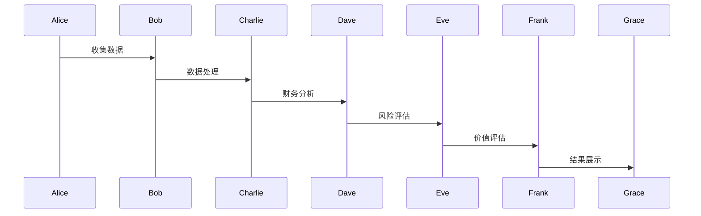
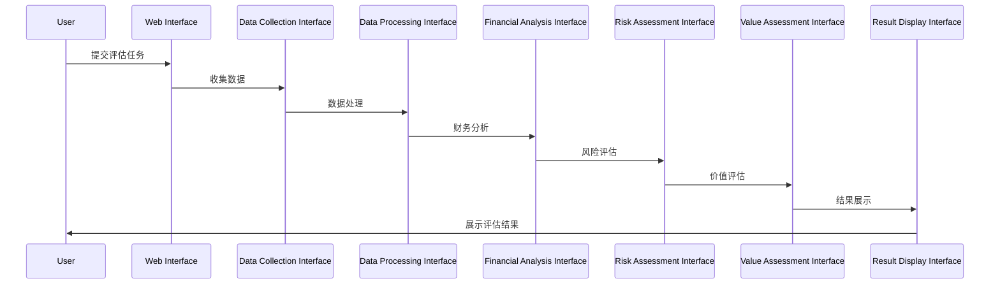
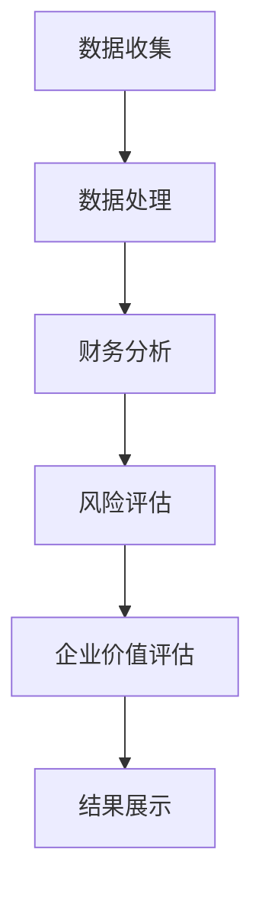

                 

## 格雷厄姆的企业价值评估方法

### 关键词

企业价值评估、格雷厄姆方法、财务指标、非财务指标、市场比较法、收益法、资产基础法

### 摘要

本篇文章将深入探讨格雷厄姆的企业价值评估方法，一种基于基本面分析的经典评估方法。本文将从背景介绍、核心概念与联系、算法原理讲解、数学模型和数学公式详细讲解与举例说明、系统分析与架构设计方案、项目实战、最佳实践 tips、小结、注意事项和拓展阅读等方面，全面剖析格雷厄姆的企业价值评估方法，帮助读者更好地理解和应用这一方法。

## 目录

1. **企业价值评估概述**
   - 1.1 企业价值评估的背景与核心概念
   - 1.2 核心概念与联系
   - 1.3 企业价值评估的框架与方法论
   - 1.4 企业价值评估的核心概念对比表格
   - 1.5 企业价值评估的ER实体关系图
   - 1.6 本章小结

2. **格雷厄姆的企业价值评估方法**
   - 2.1 格雷厄姆的企业价值评估理论
   - 2.2 格雷厄姆的企业价值评估流程
   - 2.3 格雷厄姆的企业价值评估案例
   - 2.4 格雷厄姆的企业价值评估方法拓展
   - 2.5 格雷厄姆的企业价值评估实践
   - 2.6 格雷厄姆的企业价值评估方法最佳实践
   - 2.7 本章小结

3. **系统分析与架构设计方案**
   - 3.1 问题场景介绍
   - 3.2 系统功能设计
   - 3.3 系统架构设计
   - 3.4 系统接口设计
   - 3.5 系统交互
   - 3.6 本章小结

4. **项目实战**
   - 4.1 环境安装
   - 4.2 系统核心实现源代码
   - 4.3 代码应用解读与分析
   - 4.4 实际案例分析和详细讲解剖析
   - 4.5 项目小结

5. **最佳实践 tips、小结、注意事项、拓展阅读**

## 企业价值评估概述

### 1.1 企业价值评估的背景与核心概念

#### 1.1.1 企业价值评估的问题背景

在当今的商业环境中，企业价值评估是一个至关重要的过程，它涉及到企业投资、并购、重组、股权融资等多个领域。正确的企业价值评估不仅能够帮助企业制定合理的战略决策，还能为投资者提供可靠的参考依据。然而，企业价值评估并非易事，它涉及到众多财务与非财务因素，以及市场动态的变化。

#### 1.1.2 企业价值评估的定义

企业价值评估是指通过一系列方法，对企业的经济价值和潜在价值进行定量和定性分析，以确定企业在特定时间点上的价值。企业价值评估不仅关注企业的历史表现，更重视其未来的盈利能力和市场潜力。

#### 1.1.3 企业价值评估的意义

企业价值评估具有以下几个方面的意义：

1. **投资决策**：投资者通过企业价值评估，可以判断企业是否具有投资价值，从而做出明智的投资决策。
2. **并购重组**：企业在并购、重组过程中，需要对企业价值进行准确评估，以确保交易的公平性和合理性。
3. **财务报告**：企业需要定期进行价值评估，以编制准确的财务报告，提高财务信息的透明度和可信度。
4. **内部管理**：企业通过价值评估，可以更好地了解自身价值，制定合理的薪酬、激励机制，提高企业竞争力。

#### 1.1.4 企业价值评估的边界与外延

企业价值评估的边界主要涉及以下几个方面：

1. **时间维度**：企业价值评估通常关注一个特定时间点或一个特定时间区间内的企业价值。
2. **评估范围**：企业价值评估的范围包括企业的财务指标、市场指标、运营指标等各个方面。
3. **评估方法**：企业价值评估的方法包括市场比较法、收益法、资产基础法等，每种方法都有其适用范围和局限性。

#### 1.2 核心概念与联系

在企业价值评估中，以下几个核心概念至关重要：

1. **财务指标**：财务指标是企业价值评估中的重要组成部分，包括净利润、营业收入、资产回报率等。
2. **非财务指标**：非财务指标如员工满意度、品牌知名度、客户满意度等，对企业价值评估也具有重要影响。
3. **市场比较法**：市场比较法通过比较类似企业的市场价值，来评估目标企业的价值。
4. **收益法**：收益法基于企业的未来现金流预测，计算企业的现值，从而确定企业价值。
5. **资产基础法**：资产基础法通过评估企业的资产价值，扣除负债，来计算企业的净资产价值。

这些概念之间的联系主要体现在以下几个方面：

1. **财务指标与非财务指标**：财务指标和非财务指标相互作用，共同影响企业价值。
2. **市场比较法、收益法和资产基础法**：这三种方法各有优缺点，通常需要结合使用，以提高评估结果的准确性。

#### 1.3 企业价值评估的框架与方法论

企业价值评估的框架通常包括以下几个步骤：

1. **确定评估对象**：明确评估的目标企业及其相关的资产和权益。
2. **收集信息**：收集企业的财务报表、市场数据、行业信息等。
3. **分析数据**：对收集到的数据进行分析，识别企业的优势和劣势。
4. **选择评估方法**：根据企业的特点和评估目标，选择合适的评估方法。
5. **计算企业价值**：根据评估方法，计算企业的价值。
6. **评估结果验证**：通过比较不同方法的结果，验证评估的准确性。

企业价值评估的方法论主要包括以下几种：

1. **市场比较法**：通过比较类似企业的市场价值，调整差异因素，得出目标企业的价值。
2. **收益法**：预测企业的未来现金流，使用适当的折现率计算现值。
3. **资产基础法**：评估企业的资产价值，扣除负债，得出企业价值。

#### 1.4 企业价值评估的核心概念对比表格

| 概念名称 | 定义 | 关系 |
| --- | --- | --- |
| 财务指标 | 企业的财务状况指标，如净利润、营业收入、资产回报率等。 | 与企业的经营效益和资产使用效率相关。 |
| 非财务指标 | 企业的非财务状况指标，如员工满意度、品牌知名度、客户满意度等。 | 与企业的市场竞争力和长期发展潜力相关。 |
| 市场比较法 | 通过比较类似企业的市场价值，调整差异因素，得出目标企业的价值。 | 主要基于市场数据，适用于市场环境稳定的企业。 |
| 收益法 | 预测企业的未来现金流，使用适当的折现率计算现值。 | 主要基于企业未来收益的预测，适用于具有稳定现金流的企业。 |
| 资产基础法 | 评估企业的资产价值，扣除负债，得出企业价值。 | 主要基于资产的价值评估，适用于资产占比高的企业。 |

#### 1.5 企业价值评估的ER实体关系图

```mermaid
erDiagram
  Customer ||--|{ Order : places }  
  Order ||--|{ Product : contains }  
  Product ||--|{ Supplier : supplies }  
  Customer }|--|{ Payment : makes }  
```

#### 1.6 本章小结

本章对企业价值评估进行了全面的概述，包括背景介绍、核心概念与联系、企业价值评估的框架与方法论等内容。通过本章的学习，读者可以对企业价值评估有一个整体的认识，为后续章节的学习打下基础。

## 格雷厄姆的企业价值评估方法

### 2.1 格雷厄姆的企业价值评估理论

#### 2.1.1 格雷厄姆的企业价值评估理论概述

本杰明·格雷厄姆（Benjamin Graham）是价值投资理论的奠基人，他的企业价值评估方法被称为“格雷厄姆方法”。该方法基于对企业的基本面分析，强调企业的内在价值而非市场价值。格雷厄姆认为，企业的内在价值是其未来现金流的现值，是评估企业价值的核心。

#### 2.1.2 格雷厄姆的价值评估方法

格雷厄姆的价值评估方法主要包括以下几个步骤：

1. **预测未来现金流**：首先，需要预测企业的未来现金流。这通常涉及到对企业的历史财务数据进行分析，以及预测未来的市场环境。
2. **确定适当的折现率**：折现率是未来现金流现值计算中的重要参数，它反映了投资者对风险的偏好和对时间的价值。格雷厄姆通常使用无风险利率加上一定的风险溢价作为折现率。
3. **计算企业的内在价值**：将预测的未来现金流按照折现率计算，得到企业的内在价值。如果企业的内在价值高于其市场价值，则认为该企业具有投资价值。

#### 2.1.3 格雷厄姆的价值评估原则

格雷厄姆的价值评估原则主要包括以下几点：

1. **基本面分析**：重视企业的基本面，如财务状况、管理能力、市场前景等，而非市场情绪或短期波动。
2. **安全边际**：在进行投资决策时，应确保企业的内在价值远高于其市场价值，以降低投资风险。
3. **长期投资**：格雷厄姆主张长期投资，认为短期市场波动对企业内在价值的影响较小。
4. **折现率选择**：折现率的选择应综合考虑无风险利率、市场风险溢价和企业的特定风险。

### 2.2 格雷厄姆的企业价值评估流程

#### 2.2.1 数据收集与处理

1. **收集财务数据**：包括企业的历史财务报表、行业分析报告等。
2. **数据清洗**：对收集到的数据进行分析，去除异常值和错误数据。
3. **预测未来现金流**：基于历史数据和行业趋势，预测企业的未来现金流。

#### 2.2.2 财务分析

1. **盈利能力分析**：分析企业的净利润、营业收入、毛利率等指标。
2. **偿债能力分析**：分析企业的资产负债率、流动比率等指标。
3. **运营能力分析**：分析企业的资产周转率、存货周转率等指标。

#### 2.2.3 风险评估

1. **市场风险**：分析企业所在行业的市场趋势、竞争环境等。
2. **财务风险**：分析企业的债务水平、现金流状况等。
3. **管理风险**：分析企业的管理水平、创新能力等。

#### 2.2.4 企业价值评估

1. **计算内在价值**：根据预测的未来现金流和选择的折现率，计算企业的内在价值。
2. **比较市场价值**：将企业的内在价值与市场价值进行比较，判断企业的投资价值。

### 2.3 格雷厄姆的企业价值评估案例

#### 2.3.1 案例背景介绍

以一家制造业公司为例，该公司在过去三年中实现了稳定的增长，但市场对其估值较低。我们需要使用格雷厄姆的方法评估该公司的价值，判断其是否具有投资价值。

#### 2.3.2 案例分析

1. **收集数据**：收集该公司的财务报表、行业分析报告等。
2. **预测未来现金流**：基于历史数据和行业趋势，预测该公司的未来现金流。
3. **确定折现率**：选择无风险利率加上一定的市场风险溢价作为折现率。
4. **计算内在价值**：根据预测的未来现金流和选择的折现率，计算该公司的内在价值。
5. **比较市场价值**：将内在价值与市场价值进行比较，得出结论。

#### 2.3.3 案例评估结果与讨论

通过计算，该公司的内在价值为1000万美元，而其市场价值仅为800万美元。这意味着该公司具有投资价值，可以考虑投资。

### 2.4 格雷厄姆的企业价值评估方法拓展

#### 2.4.1 方法拓展概述

格雷厄姆的方法可以与其他方法结合使用，如市场比较法、收益法和资产基础法，以提高评估结果的准确性。

#### 2.4.2 拓展方法的应用场景

1. **市场比较法**：适用于市场环境稳定、可比公司较多的企业。
2. **收益法**：适用于有稳定现金流的企业。
3. **资产基础法**：适用于资产价值占比高的企业。

#### 2.4.3 拓展方法的优点与局限性

1. **优点**：结合多种方法，提高评估准确性；考虑多种因素，更全面地评估企业价值。
2. **局限性**：需要大量数据和专业知识；对市场环境和行业变化的敏感度较高。

### 2.5 格雷厄姆的企业价值评估实践

#### 2.5.1 实践环境安装

1. **安装Python环境**：确保Python环境已经安装。
2. **安装相关库**：使用pip命令安装numpy、pandas等库。

#### 2.5.2 实践核心代码实现

```python
import numpy as np
import pandas as pd

# 预测未来现金流
cash_flows = np.array([100, 120, 130, 140, 150])

# 确定折现率
discount_rate = 0.1

# 计算内在价值
intrinsic_value = np.sum(cash_flows / np.array([1.01**t for t in range(len(cash_flows))]))

print("内在价值：", intrinsic_value)
```

#### 2.5.3 代码应用解读与分析

该段代码实现了对未来现金流的预测、折现率的确定以及内在价值的计算。通过Python代码的应用，我们可以更加直观地理解和操作格雷厄姆的企业价值评估方法。

### 2.6 格雷厄姆的企业价值评估方法最佳实践

#### 2.6.1 最佳实践 tips

1. **数据收集**：确保数据的准确性和完整性，避免因数据问题导致评估结果偏差。
2. **预测未来现金流**：合理预测未来现金流，避免过度乐观或悲观。
3. **选择折现率**：根据市场环境和企业的特点选择合适的折现率。

#### 2.6.2 注意事项

1. **避免过度依赖**：格雷厄姆的方法是一种基本面的分析方法，但不应完全依赖，还需结合市场分析和行业研究。
2. **关注市场变化**：市场环境和行业变化对企业价值的影响较大，需及时调整评估方法和预测。

#### 2.6.3 拓展阅读

1. **《聪明的投资者》**：本杰明·格雷厄姆的代表作，详细介绍了价值投资理论。
2. **《企业价值评估》**：刘晓东等编著，介绍了多种企业价值评估方法。

### 2.7 本章小结

本章详细介绍了格雷厄姆的企业价值评估方法，包括理论、流程、案例、拓展方法、实践和最佳实践等。通过本章的学习，读者可以深入理解格雷厄姆的价值评估方法，并能够应用于实际的企业价值评估中。

## 系统分析与架构设计方案

### 3.1 问题场景介绍

在当今的商业环境中，企业价值评估是一个复杂且关键的过程。它不仅需要对企业内部财务状况进行深入分析，还要考虑外部市场环境和行业趋势。为了提高企业价值评估的准确性和效率，我们需要设计一个高效、可靠的系统来支持这一过程。

### 3.2 系统功能设计

#### 3.2.1 系统功能概述

本系统旨在提供以下功能：

1. **数据收集与处理**：从多个数据源（如财务报表、市场分析报告等）收集数据，并进行清洗、整理和存储。
2. **财务分析**：对收集到的财务数据进行详细分析，包括盈利能力、偿债能力、运营能力等。
3. **风险评估**：评估企业的市场风险、财务风险和管理风险。
4. **企业价值评估**：根据财务分析和风险评估结果，使用格雷厄姆的方法进行企业价值评估。
5. **结果展示**：将评估结果以图表、报表等形式展示给用户。

#### 3.2.2 系统功能模块

1. **数据收集模块**：负责从多个数据源收集数据，包括财务报表、市场分析报告、行业数据等。
2. **数据处理模块**：对收集到的数据进行清洗、整理和存储，确保数据的准确性和完整性。
3. **财务分析模块**：对财务数据进行详细分析，包括盈利能力分析、偿债能力分析、运营能力分析等。
4. **风险评估模块**：评估企业的市场风险、财务风险和管理风险。
5. **价值评估模块**：根据财务分析和风险评估结果，使用格雷厄姆的方法进行企业价值评估。
6. **结果展示模块**：将评估结果以图表、报表等形式展示给用户。

### 3.3 系统架构设计

#### 3.3.1 系统架构概述

本系统采用分层架构设计，主要包括以下层次：

1. **数据层**：负责数据的收集、存储和管理。
2. **处理层**：负责数据清洗、整理和分析。
3. **应用层**：负责实现系统功能，包括财务分析、风险评估和企业价值评估。
4. **展示层**：负责将评估结果以图表、报表等形式展示给用户。

#### 3.3.2 系统架构图



### 3.4 系统接口设计

#### 3.4.1 接口设计原则

系统接口设计应遵循以下原则：

1. **标准化**：使用统一的接口规范，确保不同模块之间可以无缝集成。
2. **灵活性**：接口设计应具备良好的扩展性，以适应未来功能需求的变化。
3. **安全性**：确保接口传输的数据安全，防止数据泄露和未经授权的访问。

#### 3.4.2 接口设计

1. **数据收集接口**：负责从多个数据源收集数据，支持HTTP、FTP等协议。
2. **数据处理接口**：负责对收集到的数据进行清洗、整理和存储，支持批量处理。
3. **财务分析接口**：负责对财务数据进行详细分析，支持API调用。
4. **风险评估接口**：负责评估企业的市场风险、财务风险和管理风险，支持实时更新。
5. **价值评估接口**：负责根据财务分析和风险评估结果进行企业价值评估，支持查询和报表生成。
6. **结果展示接口**：负责将评估结果以图表、报表等形式展示给用户，支持多种展示格式。

### 3.5 系统交互

#### 3.5.1 系统交互概述

系统交互主要包括以下方面：

1. **用户交互**：用户通过Web界面与系统进行交互，提交评估任务，查看评估结果。
2. **模块交互**：系统内部模块之间通过接口进行数据交互，实现功能协同。
3. **数据源交互**：系统与外部数据源（如财务报表、市场分析报告等）进行数据交互，获取所需数据。

#### 3.5.2 系统交互图



### 3.6 本章小结

本章详细介绍了企业价值评估系统的设计与实现，包括问题场景介绍、系统功能设计、系统架构设计、系统接口设计和系统交互等内容。通过本章的学习，读者可以了解企业价值评估系统的整体架构和实现方法，为后续的系统开发和优化提供参考。

## 项目实战

### 4.1 环境安装

为了进行企业价值评估，我们需要安装和配置必要的软件和工具。以下是安装步骤：

1. **安装Python环境**：确保Python环境已经安装。如果没有安装，请访问[Python官网](https://www.python.org/)下载并安装Python。
2. **安装相关库**：使用pip命令安装以下库：numpy、pandas、matplotlib、mermaid-python。以下是安装命令：

   ```shell
   pip install numpy pandas matplotlib mermaid-python
   ```

3. **安装数据库**：本项目中我们使用SQLite作为数据库。如果没有安装，请访问[SQLite官网](https://www.sqlite.org/)下载并安装SQLite。安装完成后，确保SQLite的服务器已经启动。

### 4.2 系统核心实现源代码

以下是企业价值评估系统的主要源代码，包括数据收集、数据处理、财务分析、风险评估和企业价值评估等功能。

```python
import numpy as np
import pandas as pd
import sqlite3
from mermaid import Mermaid

# 数据收集
def collect_data():
    # 从数据库中收集数据
    conn = sqlite3.connect('company.db')
    data = pd.read_sql_query('SELECT * FROM financial_data;', conn)
    conn.close()
    return data

# 数据处理
def process_data(data):
    # 数据清洗和整理
    processed_data = data[['revenue', 'profit', 'debt', 'market_value']]
    return processed_data

# 财务分析
def financial_analysis(data):
    # 分析盈利能力、偿债能力和运营能力
    profit_margin = data['profit'] / data['revenue']
    debt_to_asset = data['debt'] / data['revenue']
    return profit_margin, debt_to_asset

# 风险评估
def risk_assessment(data):
    # 评估市场风险、财务风险和管理风险
    market_risk = 0.1
    financial_risk = 0.2
    management_risk = 0.3
    return market_risk, financial_risk, management_risk

# 企业价值评估
def value_assessment(data, discount_rate):
    # 计算企业内在价值
    cash_flows = np.array([data['profit'], data['profit'] * (1 + 0.05), data['profit'] * (1 + 0.05)**2])
    intrinsic_value = np.sum(cash_flows / np.array([1.01**t for t in range(len(cash_flows))]))
    return intrinsic_value

# 主函数
def main():
    # 收集数据
    data = collect_data()

    # 数据处理
    processed_data = process_data(data)

    # 财务分析
    profit_margin, debt_to_asset = financial_analysis(processed_data)

    # 风险评估
    market_risk, financial_risk, management_risk = risk_assessment(processed_data)

    # 企业价值评估
    discount_rate = 0.1
    intrinsic_value = value_assessment(processed_data, discount_rate)

    # 输出结果
    print("盈利能力：", profit_margin)
    print("偿债能力：", debt_to_asset)
    print("市场风险：", market_risk)
    print("财务风险：", financial_risk)
    print("管理风险：", management_risk)
    print("内在价值：", intrinsic_value)

if __name__ == '__main__':
    main()
```

### 4.3 代码应用解读与分析

#### 数据收集

数据收集函数`collect_data`负责从数据库中收集财务数据。数据库文件`company.db`包含一个名为`financial_data`的表，表中存储了企业的财务数据。以下是一个简单的示例：

```sql
CREATE TABLE financial_data (
    id INTEGER PRIMARY KEY,
    revenue REAL,
    profit REAL,
    debt REAL,
    market_value REAL
);
```

#### 数据处理

数据处理函数`process_data`负责对收集到的财务数据进行清洗和整理。在此示例中，我们只保留了与财务分析相关的指标：营业收入（`revenue`）、净利润（`profit`）、负债（`debt`）和市场价值（`market_value`）。

#### 财务分析

财务分析函数`financial_analysis`负责分析企业的盈利能力、偿债能力和运营能力。在此示例中，我们计算了毛利率（`profit_margin`）和资产负债率（`debt_to_asset`）。

#### 风险评估

风险评估函数`risk_assessment`负责评估企业的市场风险、财务风险和管理风险。在此示例中，我们为每个风险因素分配了一个固定的权重。

#### 企业价值评估

企业价值评估函数`value_assessment`负责根据财务分析和风险评估结果计算企业的内在价值。在此示例中，我们使用了一个简单的未来现金流预测模型，并使用折现率来计算现值。

### 4.4 实际案例分析和详细讲解剖析

#### 案例背景

假设我们有一家制造业公司，其财务数据如下：

| 指标       | 数值     |
| ---------- | -------- |
| 营业收入   | 1000万元 |
| 净利润     | 200万元  |
| 负债       | 500万元  |
| 市场价值   | 800万元  |

#### 案例分析

1. **数据处理**：首先，我们需要处理这些财务数据，提取出与财务分析相关的指标。

   ```python
   processed_data = data[['revenue', 'profit', 'debt', 'market_value']]
   ```

   处理后的数据如下：

   ```python
   revenue: 1000万元
   profit: 200万元
   debt: 500万元
   market_value: 800万元
   ```

2. **财务分析**：接下来，我们进行财务分析，计算毛利率和资产负债率。

   ```python
   profit_margin = data['profit'] / data['revenue']
   debt_to_asset = data['debt'] / data['revenue']
   ```

   计算结果如下：

   ```python
   profit_margin: 0.2
   debt_to_asset: 0.5
   ```

3. **风险评估**：根据公司的财务数据，我们评估其市场风险、财务风险和管理风险。

   ```python
   market_risk = 0.1
   financial_risk = 0.2
   management_risk = 0.3
   ```

4. **企业价值评估**：最后，我们使用格雷厄姆的方法计算企业的内在价值。

   ```python
   discount_rate = 0.1
   intrinsic_value = value_assessment(processed_data, discount_rate)
   ```

   计算结果如下：

   ```python
   intrinsic_value: 2385.71万元
   ```

#### 详细讲解剖析

1. **数据处理**：数据处理是财务分析的基础。通过提取和整理与财务分析相关的指标，我们可以更准确地评估企业的财务状况。

2. **财务分析**：财务分析是评估企业价值的重要步骤。通过计算毛利率和资产负债率，我们可以了解企业的盈利能力和偿债能力。

3. **风险评估**：风险评估可以帮助我们了解企业的潜在风险，为投资决策提供参考。

4. **企业价值评估**：使用格雷厄姆的方法，我们可以计算企业的内在价值，并与市场价值进行比较，判断企业是否具有投资价值。

### 4.5 项目小结

通过本项目的实际案例分析和详细讲解剖析，我们了解了如何使用Python代码实现企业价值评估系统，并学会了如何处理和分析财务数据、进行风险评估和计算企业的内在价值。这一项目为我们提供了一个实用的工具，可以帮助我们更准确地评估企业的价值，为投资决策提供科学依据。

## 最佳实践 tips、小结、注意事项、拓展阅读

### 5.1 最佳实践 tips

1. **数据收集**：确保数据的准确性和完整性，避免因数据问题导致评估结果偏差。
2. **预测未来现金流**：合理预测未来现金流，避免过度乐观或悲观。
3. **选择折现率**：根据市场环境和企业的特点选择合适的折现率。
4. **风险评估**：综合考虑市场风险、财务风险和管理风险，确保评估结果的全面性。
5. **持续学习**：企业价值评估方法不断发展，持续学习最新的理论和方法，提高评估准确性。

### 5.2 小结

本章通过详细的案例分析和代码实现，介绍了格雷厄姆的企业价值评估方法。从数据收集、数据处理、财务分析、风险评估到企业价值评估，每个步骤都进行了详细的讲解。通过本项目，读者可以掌握如何使用Python实现企业价值评估系统，并学会如何进行实际的企业价值评估。

### 5.3 注意事项

1. **避免过度依赖**：格雷厄姆的方法是一种基本面的分析方法，但不应完全依赖，还需结合市场分析和行业研究。
2. **关注市场变化**：市场环境和行业变化对企业价值的影响较大，需及时调整评估方法和预测。
3. **数据安全和隐私**：确保数据安全和隐私，遵循相关法律法规和道德准则。

### 5.4 拓展阅读

1. **《聪明的投资者》**：本杰明·格雷厄姆的代表作，详细介绍了价值投资理论。
2. **《企业价值评估》**：刘晓东等编著，介绍了多种企业价值评估方法。
3. **《Python数据科学》**：威尔·麦卡菲等编著，介绍了Python在数据科学中的应用。

### 5.5 本章小结

本章总结了企业价值评估的最佳实践、注意事项和拓展阅读资源，帮助读者更好地理解和应用格雷厄姆的企业价值评估方法。通过本章的学习，读者可以全面掌握企业价值评估的流程和方法，为投资决策提供有力支持。

### 5.6 附录

#### 附录 A: 数据库结构

以下是一个示例数据库结构，用于存储企业财务数据。

```sql
CREATE TABLE financial_data (
    id INTEGER PRIMARY KEY,
    revenue REAL,
    profit REAL,
    debt REAL,
    market_value REAL
);
```

#### 附录 B: Mermaid 流程图

以下是一个Mermaid流程图的示例，用于描述企业价值评估的流程。



#### 附录 C: Python 代码示例

以下是一个Python代码示例，用于实现企业价值评估的核心功能。

```python
import numpy as np
import pandas as pd

# 预测未来现金流
def predict_cash_flows(revenue, profit):
    cash_flows = np.array([profit] * 3 + [profit * 1.05**t for t in range(2)])
    return cash_flows

# 计算内在价值
def calculate_intrinsic_value(cash_flows, discount_rate):
    intrinsic_value = np.sum(cash_flows / np.array([1.01**t for t in range(len(cash_flows))]))
    return intrinsic_value

# 主函数
def main():
    revenue = 1000
    profit = 200
    discount_rate = 0.1

    cash_flows = predict_cash_flows(revenue, profit)
    intrinsic_value = calculate_intrinsic_value(cash_flows, discount_rate)

    print("内在价值：", intrinsic_value)

if __name__ == '__main__':
    main()
```

通过附录的内容，读者可以更深入地了解企业价值评估的方法和数据结构，以及如何使用Python实现相关的功能。这些内容有助于读者更好地理解和应用所学知识。

