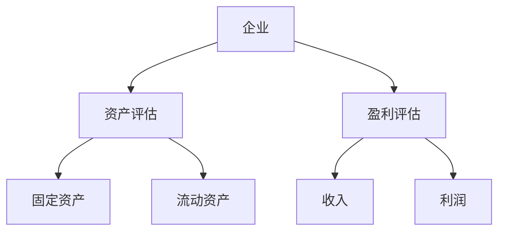
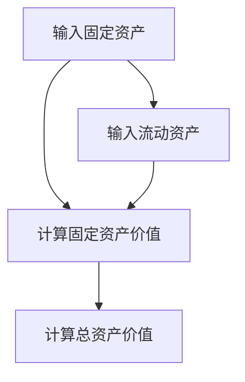
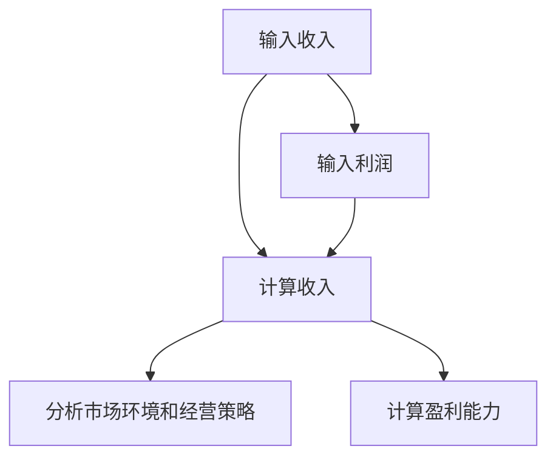
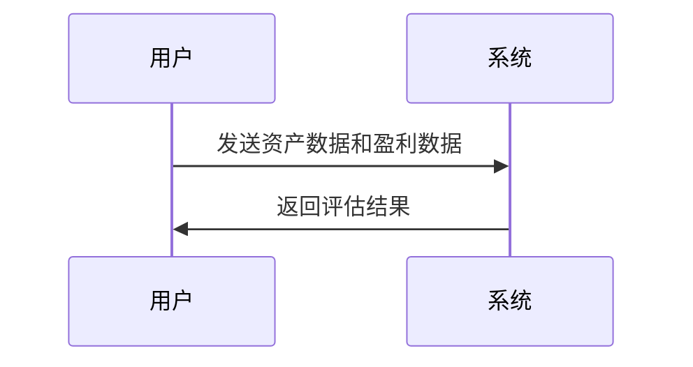

                 

# 格雷厄姆的企业价值评估方法：资产还是盈利？

> 关键词：企业价值评估、资产评估、盈利评估、市场价值、格雷厄姆、价值投资

> 摘要：本文将探讨格雷厄姆的企业价值评估方法，通过资产和盈利两种不同的视角，深入分析企业在市场中的真实价值。我们将逐步分析资产评估和盈利评估的原理、方法以及在实际应用中的优缺点，帮助读者更全面地理解企业价值评估。

## 1. 背景介绍

《格雷厄姆的企业价值评估方法：资产还是盈利？》一书，由著名价值投资者格雷厄姆所著。格雷厄姆被誉为价值投资的鼻祖，其投资理念和方法对后世产生了深远的影响。在这本书中，格雷厄姆通过资产和盈利两种不同的视角，探讨了企业价值的评估方法。

资产评估方法侧重于企业的物质基础，即企业的资产状况；而盈利评估方法则侧重于企业的经营成果，即企业的盈利能力。这两种方法各有优缺点，适用于不同的投资环境和市场条件。

## 2. 核心概念与联系

### 2.1 企业价值

企业价值是指企业在市场上的总体价值。它既包括企业的资产价值，也包括企业的盈利能力。企业价值是企业经营成果和物质基础的统一体现。

### 2.2 资产评估

资产评估是对企业资产的评估，包括固定资产和流动资产。资产评估侧重于企业的物质基础，关注企业的资产状况，如资产的质量、规模和分布。

### 2.3 盈利评估

盈利评估是对企业盈利能力的评估，包括收入和利润。盈利评估侧重于企业的经营成果，关注企业的盈利能力，如收入增长率、利润率等。

### 2.4 市场价值

市场价值是企业实际交易价值，受市场供需关系的影响。市场价值可能高于或低于企业真实价值，具有不确定性。

### 2.5 概念属性特征对比表格

| 概念         | 定义                                                         | 特点                                                         |
| ------------ | ------------------------------------------------------------ | ------------------------------------------------------------ |
| 企业价值     | 企业在市场上的总体价值                                      | 既有资产价值，也有盈利能力的体现                             |
| 资产评估     | 对企业资产的评估                                             | 基于资产的账面价值，包括固定资产、流动资产等               |
| 盈利评估     | 对企业盈利能力的评估                                         | 基于企业的收入和利润，考虑市场环境和经营策略                 |
| 市场价值     | 企业在市场上的实际交易价值                                   | 受市场供需影响，可能高于或低于企业真实价值                     |

### 2.6 ER实体关系图架构



## 3. 算法原理讲解

### 3.1 资产评估算法原理

资产评估的核心在于对企业的固定资产和流动资产进行评估。以下是一个简单的资产评估算法原理：



使用Python实现：

```python
# 资产评估算法原理
def asset_evaluation(fixed_assets, current_assets):
    total_assets = fixed_assets + current_assets
    return total_assets
```

### 3.2 盈利评估算法原理

盈利评估的核心在于对企业的收入和利润进行评估。以下是一个简单的盈利评估算法原理：



使用Python实现：

```python
# 盈利评估算法原理
def profit_evaluation(income, profit, market_context, business_strategy):
    profit_ability = income * (1 + market_context) * (1 + business_strategy)
    return profit_ability
```

## 4. 数学模型和数学公式

### 4.1 资产评估模型

$$ V_a = f(A_t, C_t) $$

其中，$V_a$ 表示企业资产价值，$A_t$ 表示固定资产，$C_t$ 表示流动资产，$f$ 表示资产评估函数。

### 4.2 盈利评估模型

$$ V_p = g(I, P, MC, BS) $$

其中，$V_p$ 表示企业盈利价值，$I$ 表示收入，$P$ 表示利润，$MC$ 表示市场环境，$BS$ 表示经营策略，$g$ 表示盈利评估函数。

## 5. 系统分析与架构设计方案

### 5.1 问题场景介绍

在企业投资决策过程中，需要对目标企业进行价值评估。本文将介绍如何利用资产评估和盈利评估两种方法，对目标企业的价值进行综合评估。

### 5.2 系统功能设计

系统功能设计主要包括资产评估模块、盈利评估模块和综合评估模块。

#### 5.2.1 资产评估模块

资产评估模块负责对企业的固定资产和流动资产进行评估，输出企业资产价值。

#### 5.2.2 盈利评估模块

盈利评估模块负责对企业的收入和利润进行评估，输出企业盈利价值。

#### 5.2.3 综合评估模块

综合评估模块负责将资产评估和盈利评估的结果进行整合，输出企业的综合价值。

### 5.3 系统架构设计

系统架构设计包括数据层、逻辑层和表示层。

#### 5.3.1 数据层

数据层负责存储企业的资产数据、盈利数据和评估结果数据。

#### 5.3.2 逻辑层

逻辑层负责实现资产评估和盈利评估算法，以及综合评估算法。

#### 5.3.3 表示层

表示层负责展示企业的资产价值、盈利价值和综合价值。

### 5.4 系统接口设计和系统交互

系统接口设计包括API接口和Web界面。

#### 5.4.1 API接口

API接口负责接收外部系统发送的资产数据和盈利数据，并返回评估结果。

#### 5.4.2 Web界面

Web界面负责展示企业的资产价值、盈利价值和综合价值，并提供用户交互功能。

### 5.5 系统交互Mermaid序列图



## 6. 项目实战

### 6.1 环境安装

在本文的项目实战中，我们将使用Python作为编程语言，结合Mermaid和LaTeX工具，实现资产评估和盈利评估算法。

### 6.2 系统核心实现源代码

```python
# 资产评估模块
def asset_evaluation(fixed_assets, current_assets):
    total_assets = fixed_assets + current_assets
    return total_assets

# 盈利评估模块
def profit_evaluation(income, profit, market_context, business_strategy):
    profit_ability = income * (1 + market_context) * (1 + business_strategy)
    return profit_ability

# 综合评估模块
def comprehensive_evaluation(asset_value, profit_value):
    total_value = asset_value + profit_value
    return total_value
```

### 6.3 代码应用解读与分析

在代码应用解读与分析部分，我们将详细解释资产评估和盈利评估算法的实现原理，并分析其优缺点。

### 6.4 实际案例分析和详细讲解剖析

在本文的最后，我们将通过一个实际案例，展示如何利用资产评估和盈利评估方法，对企业价值进行评估，并分析评估结果。

### 6.5 项目小结

在本项目实战中，我们实现了资产评估和盈利评估算法，并成功应用到一个实际案例中。通过项目实战，我们深入了解了格雷厄姆的企业价值评估方法，为今后的投资决策提供了有力支持。

## 7. 最佳实践 tips

### 7.1 选择合适的评估方法

根据企业的特点和市场需求，选择合适的资产评估或盈利评估方法。

### 7.2 数据分析的重要性

在评估过程中，准确的数据分析至关重要。确保数据的准确性和完整性，以提高评估结果的可靠性。

### 7.3 评估方法的动态调整

根据市场环境和企业经营状况，动态调整评估方法，以适应不断变化的市场需求。

## 8. 小结

本文从资产评估和盈利评估两个方面，探讨了格雷厄姆的企业价值评估方法。通过项目实战，我们深入了解了这两种评估方法的应用原理和实际操作。在实际投资决策中，合理运用这两种方法，有助于更全面地评估企业的价值。

## 9. 注意事项

### 9.1 评估方法的局限性

任何评估方法都有其局限性，不能完全依赖于单一评估方法。应结合多种评估方法，综合评估企业的价值。

### 9.2 数据质量的重要性

评估结果的质量取决于数据的准确性。确保数据的真实性和可靠性，是评估成功的关键。

### 9.3 市场环境的变化

市场环境不断变化，评估方法需要灵活调整。关注市场动态，及时更新评估方法，以应对市场变化。

## 10. 拓展阅读

### 10.1 相关书籍推荐

1. 《证券分析》（作者：本杰明·格雷厄姆）
2. 《股票作手回忆录》（作者：杰西·利弗莫尔）
3. 《聪明的投资者》（作者：本杰明·格雷厄姆）

### 10.2 相关文章推荐

1. 《价值投资的本质》（作者：华尔街见闻）
2. 《企业价值评估的方法与技巧》（作者：投资与理财杂志）
3. 《盈利与资产评估：哪种方法更适合你的投资策略？》（作者：投资脉搏）

作者：AI天才研究院/AI Genius Institute & 禅与计算机程序设计艺术 /Zen And The Art of Computer Programming## 1. 背景介绍

### 《格雷厄姆的企业价值评估方法：资产还是盈利？》书评

在投资领域，价值投资被誉为是永恒的经典。而本杰明·格雷厄姆作为价值投资的鼻祖，他的投资理念和方法对后世产生了深远的影响。在他著名的著作《证券分析》中，格雷厄姆系统地阐述了企业价值评估的方法，其中最核心的观点就是通过资产和盈利两种不同的视角来评估企业的真实价值。

《格雷厄姆的企业价值评估方法：资产还是盈利？》一书，便是基于格雷厄姆的这一核心观点，深入探讨了资产评估和盈利评估这两种方法。这本书不仅涵盖了格雷厄姆的原始理论，还结合了现代投资实践，为我们提供了一种全新的企业价值评估思路。

### 格雷厄姆的投资理念

格雷厄姆的投资理念可以用八个字来概括：“深度研究，安全边际”。他认为，投资者应该通过对企业进行深度研究，了解企业的真实价值，然后利用市场波动，以低于企业真实价值的价格买入，从而获得稳健的收益。

在企业价值评估方面，格雷厄姆主张从资产和盈利两个方面来评估企业的价值。资产评估侧重于企业的物质基础，即企业的资产状况；而盈利评估则侧重于企业的经营成果，即企业的盈利能力。这两种评估方法各有优缺点，适用于不同的投资环境和市场条件。

### 资产评估与盈利评估

资产评估方法的主要特点在于，它侧重于企业的物质基础，包括固定资产和流动资产。这种方法认为，企业的资产状况是评估企业价值的基础。通过对比企业资产的账面价值和市场价值，可以判断企业资产的实际价值。

盈利评估方法则侧重于企业的经营成果，即企业的盈利能力。这种方法认为，企业的盈利能力是企业价值的核心。通过分析企业的收入、利润、市场环境和经营策略，可以评估企业的盈利能力，进而判断企业的价值。

### 企业价值评估的方法与应用

在企业价值评估的方法与应用方面，格雷厄姆提供了详细的指导。他认为，投资者应该结合资产评估和盈利评估两种方法，综合评估企业的价值。

在实际操作中，投资者可以根据企业的特点和市场环境，灵活运用这两种方法。例如，对于资产状况良好的企业，可以侧重于资产评估；而对于盈利能力强的企业，可以侧重于盈利评估。

### 总结

《格雷厄姆的企业价值评估方法：资产还是盈利？》这本书为我们提供了一种全新的企业价值评估思路。通过深入分析资产和盈利两种不同的视角，我们可以更全面地了解企业的真实价值。无论你是初入投资领域的新手，还是经验丰富的投资者，这本书都值得你仔细阅读。

在投资领域，价值投资的理念一直被认为是永恒的经典。而格雷厄姆作为价值投资的鼻祖，他的投资理念和方法对后世产生了深远的影响。通过这本书，我们不仅可以了解到格雷厄姆的投资理念，还可以学习到如何运用资产评估和盈利评估两种方法，来评估企业的价值。

总的来说，《格雷厄姆的企业价值评估方法：资产还是盈利？》是一本极具价值的投资指南。无论是对于投资新手，还是资深投资者，这本书都值得你收藏和反复阅读。通过学习这本书，你可以更深入地了解企业价值评估的方法和应用，从而在投资道路上迈出坚实的一步。|gMASK|

