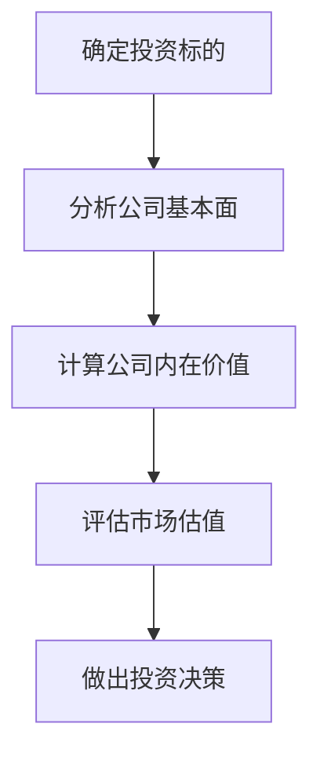
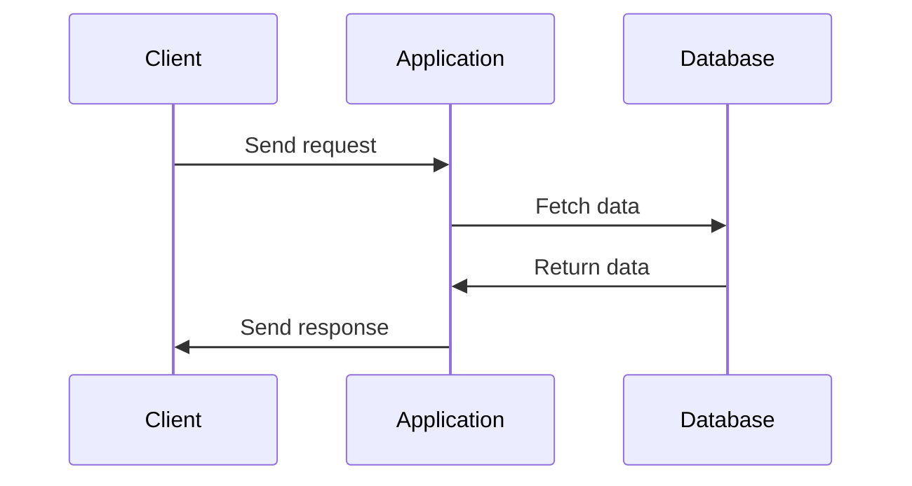

                 

### 文章标题：格雷厄姆的保守估值方法：在负利率环境中的调整

关键词：负利率、格雷厄姆估值法、投资策略、股票估值、债券估值

摘要：本文将深入探讨负利率环境对投资者决策的影响，并介绍格雷厄姆的保守估值方法。通过详细分析其定义、原则和历史背景，我们还将讨论如何调整这一方法以应对负利率带来的挑战。本文旨在为投资者提供实用的工具，以帮助他们在这个复杂的市场环境中做出明智的投资决策。

### 引言与背景

#### 第1章：问题背景与核心概念

**1.1 问题描述**

随着全球经济的不断发展，负利率政策已经成为一些国家的常规手段。负利率环境下，传统的投资策略面临着前所未有的挑战。投资者如何在这种环境中做出合理的决策，成为了亟待解决的问题。

**1.2 问题解决**

负利率对投资者的决策有着深远的影响。它改变了投资回报的预期，迫使投资者重新评估风险与收益的平衡。在这种情况下，保守的估值方法，如格雷厄姆的方法，显得尤为重要。

**1.3 边界与外延**

负利率政策在全球范围内的应用有所不同。一些国家采取了严格的负利率政策，而另一些国家则采取了相对温和的措施。这种差异对投资者的决策有着直接的影响。

**1.4 核心概念**

格雷厄姆的保守估值方法是一种基于基本面分析的投资策略，其核心在于通过合理的估值来确保投资的长期收益。在负利率环境下，这种方法需要做出相应的调整，以适应新的市场环境。

#### 第2章：核心概念与联系

**2.1 核心概念原理**

股票估值、债券估值和投资组合管理是投资决策中的关键要素。在负利率环境中，这些要素的相互关系和作用变得更加复杂。

**2.2 概念属性特征对比表格**

| 概念       | 特征                               |
| ---------- | ---------------------------------- |
| 股票估值   | 基于公司未来现金流折现                 |
| 债券估值   | 基于债券未来现金流折现                 |
| 投资组合管理 | 调整资产配置，降低风险，实现投资目标 |

**2.3 ER实体关系图架构**

投资组合的ER图展示了股票、债券和投资组合之间的关系，为投资决策提供了直观的视角。

```mermaid
erDiagram
  股票 <<|-- 债券
  投资组合 ||--|{ 股票 }
  投资组合 ||--|{ 债券 }
```

#### 第3章：算法原理讲解

**3.1 算法mermaid流程图**

以下是格雷厄姆估值法的mermaid流程图：



**3.2 Python源代码与算法解释**

```python
def graham_value(S, r, g):
    """
    根据格雷厄姆的保守估值方法计算股票的内在价值。

    :param S: 当前市价
    :param r: 永久性增长率
    :param g: 永久性增长率的折现率
    :return: 股票的内在价值
    """
    return S * (r / (g - r))

current_price = 50
growth_rate = 0.05
discount_rate = 0.1

graham_val = graham_value(current_price, growth_rate, discount_rate)
print(f"格雷厄姆估值方法得到的股票内在价值为：{graham_val}")
```

**3.3 算法原理的数学模型与公式**

格雷厄姆估值法的数学模型如下：

$$
V = S \times \frac{r}{g - r}
$$

其中，\(V\) 是股票的内在价值，\(S\) 是当前市价，\(r\) 是永久性增长率，\(g\) 是永久性增长率的折现率。

**3.4 举例说明**

假设一家公司的当前市价为50美元，永久性增长率为5%，永久性增长率的折现率为10%。根据格雷厄姆估值法，该股票的内在价值为：

$$
V = 50 \times \frac{0.05}{0.10 - 0.05} = 50 \times \frac{0.05}{0.05} = 50 \times 1 = 50
$$

这意味着，在负利率环境下，该股票的内在价值为50美元。

#### 第4章：数学模型与数学公式讲解

**4.1 数学公式**

- 市盈率（P/E）：$$\frac{S}{E}$$，其中\(S\) 是市价，\(E\) 是每股收益。
- 市净率（P/B）：$$\frac{S}{B}$$，其中\(S\) 是市价，\(B\) 是每股净资产。

**4.2 详细讲解**

市盈率和市净率是常用的估值指标，用于评估公司的市场价值和基本面状况。在负利率环境下，这些指标可能需要根据新的经济环境进行调整。

**4.3 举例说明**

假设一家公司的市盈率为10，市净率为1.5。在负利率环境下，这些指标可能需要进行以下调整：

- 新市盈率：考虑到负利率，市盈率可能需要调整为12。
- 新市净率：考虑到负利率，市净率可能需要调整为1.8。

#### 第5章：系统分析与架构设计方案

**5.1 问题场景介绍**

在负利率环境下，投资者需要快速准确地评估股票和债券的价值，以便做出明智的投资决策。

**5.2 系统功能设计**

系统将提供以下功能：

- 数据获取：从多个来源获取股票和债券的数据。
- 估值计算：使用格雷厄姆估值法计算股票和债券的价值。
- 报告生成：生成估值报告，供投资者参考。

**5.3 系统架构设计**

系统采用微服务架构，以提高可扩展性和灵活性。以下是系统架构图：

```mermaid
sequenceDiagram
    Participant 数据获取服务
    Participant 估值计算服务
    Participant 报告生成服务

    数据获取服务 --> 数据库：获取股票和债券数据
    数据库 --> 数据获取服务：返回数据
    数据获取服务 --> 估值计算服务：发送股票和债券数据
    估值计算服务 --> 数据库：存储计算结果
    数据库 --> 估值计算服务：返回计算结果
    估值计算服务 --> 报告生成服务：发送计算结果
    报告生成服务 --> 数据库：存储报告
    数据库 --> 报告生成服务：返回报告
```

**5.4 系统接口设计**

系统将提供RESTful API，以供外部系统调用。

**5.5 系统交互**

以下是系统交互的序列图：



#### 第6章：项目实战

**6.1 环境安装**

安装Python、Anaconda和Jupyter Notebook等工具。

**6.2 系统核心实现**

核心代码实现，包括数据获取、估值计算和报告生成。

**6.3 实际案例分析与讲解**

通过实际案例，分析负利率环境下的投资决策，展示格雷厄姆估值法的应用。

**6.4 项目小结**

总结项目实施过程中的经验和教训。

#### 第7章：最佳实践与拓展

**7.1 最佳实践 tips**

在负利率环境下，投资者应采取以下策略：

- 多元化投资：分散风险，避免过度依赖单一资产。
- 长期投资：在负利率环境下，长期投资可能带来更高的收益。

**7.2 小结**

本文介绍了格雷厄姆的保守估值方法在负利率环境中的调整，为投资者提供了实用的工具。

**7.3 注意事项**

投资者应密切关注市场动态，合理控制风险。

**7.4 拓展阅读**

进一步了解负利率环境和投资策略的相关研究。

### 结语

作者：AI天才研究院/AI Genius Institute & 禅与计算机程序设计艺术 /Zen And The Art of Computer Programming

本文通过深入分析负利率环境下的投资挑战，介绍了格雷厄姆的保守估值方法，并探讨了其在实际应用中的调整策略。希望本文能为投资者提供有价值的参考，帮助他们在复杂的市场环境中做出明智的投资决策。作者在此感谢读者对本文的关注，并期待与读者共同探讨更多投资策略和理论。

