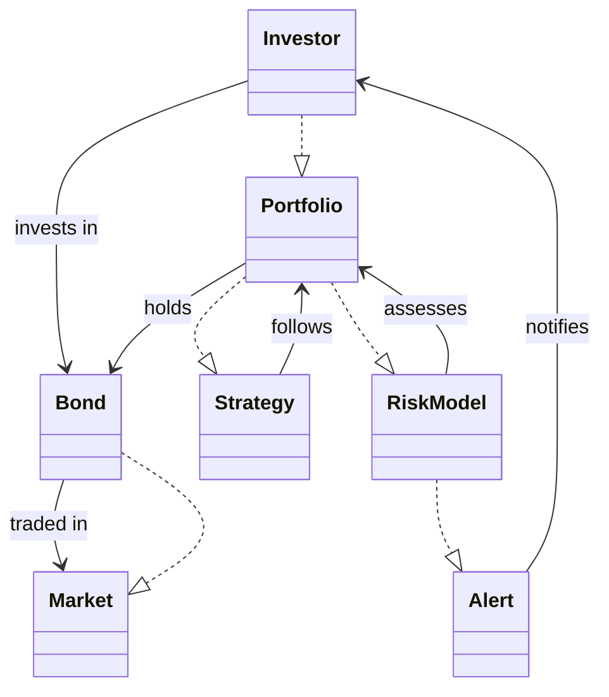
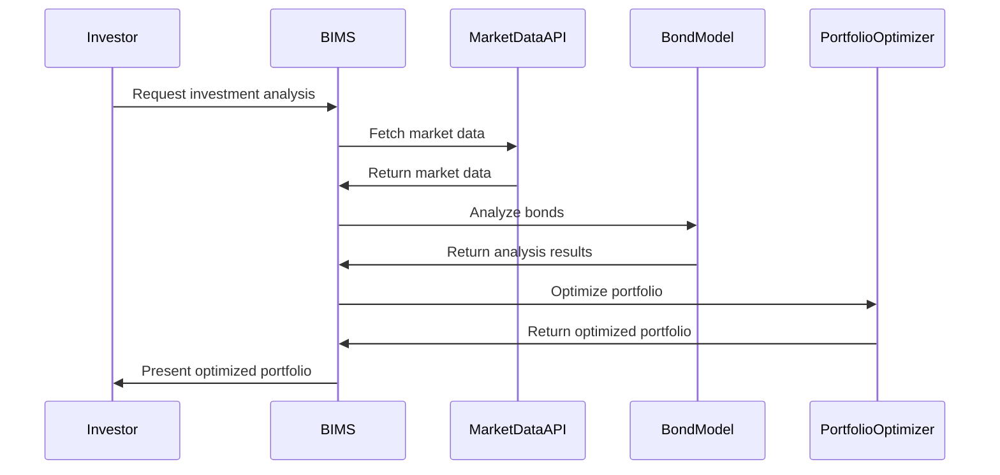
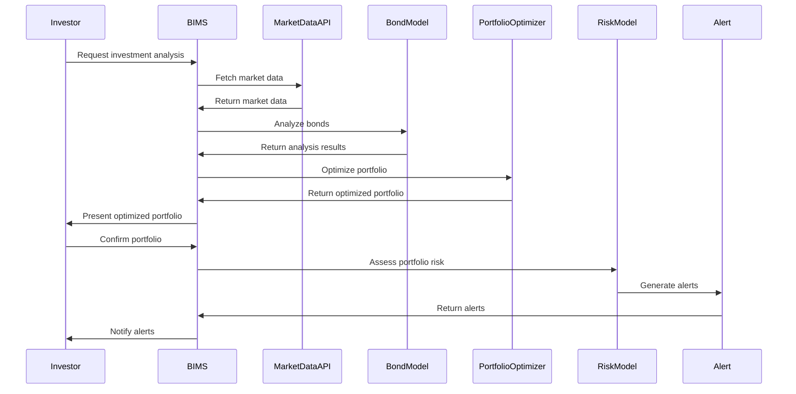

                 

### 第1章 格雷厄姆债券投资策略概述

#### 格雷厄姆债券投资策略的核心原理

格雷厄姆债券投资策略的核心在于对债券的深入分析和评估，特别是通过评估债券的内在价值与其市场价格的差异，寻找低估的债券进行投资。这一策略由价值投资大师本杰明·格雷厄姆（Benjamin Graham）提出，并广泛应用于他的投资实践中。

1. **价值评估**：格雷厄姆债券投资策略首先强调对债券的内在价值进行准确评估。内在价值取决于债券的现金流折现，即未来现金流的现值。这需要计算债券的到期收益率、息票收益以及本金回收的价值。

2. **市场价值分析**：然后，投资者需要分析债券的市场价值，即债券当前交易价格。通过比较内在价值与市场价值，可以确定债券是否被低估。

3. **安全边际**：格雷厄姆认为，只有在市场价值显著低于内在价值，存在足够的安全边际时，债券才值得投资。这一原则确保了即使在市场波动的情况下，投资者也能获得稳定的收益。

#### 格雷厄姆债券投资策略的特点

1. **安全性**：格雷厄姆债券投资策略注重债券的安全性，即投资债券时考虑债券的信用评级和发行主体的稳定性。这一策略倾向于选择评级较高、风险较低的债券。

2. **逆向投资**：格雷厄姆的策略不是跟随市场趋势，而是寻找市场错误定价的机会。逆向投资意味着在市场悲观时寻找被低估的债券进行投资。

3. **长期视角**：格雷厄姆债券投资策略强调长期持有，而不是短期交易。这一策略依赖于债券的内在价值，而不是市场波动。

4. **灵活调整**：投资者需要根据市场环境调整债券投资组合，保持适当的分散化，降低风险。

#### 格雷厄姆债券投资策略的适用范围

格雷厄姆债券投资策略适用于各种类型的投资者，尤其是那些风险承受能力较低、寻求稳定收益的投资者。以下几种情况下，格雷厄姆债券投资策略尤为适用：

1. **市场调整期**：在市场情绪低落、债券价格被低估时，格雷厄姆债券投资策略可以有效利用市场的不确定性，寻找低估的债券。

2. **退休规划**：对于退休投资者，固定收益债券提供了一种稳定的现金流，有助于满足日常开支和退休后的生活费用。

3. **资产配置**：在多元化的投资组合中，债券作为固定收益资产可以平衡股票等波动性较高的资产，降低整体投资组合的风险。

总之，格雷厄姆债券投资策略以其稳健、安全的特点，成为固定收益投资领域的经典策略，为投资者提供了有效的风险管理和收益增长途径。接下来的章节将进一步探讨债券市场的基础知识，帮助读者更好地理解和应用这一策略。### 第2章 债券市场基础

#### 债券的种类

债券是发行主体为筹集资金而发行的债务凭证，具有固定利率和到期日。根据发行主体的不同，债券主要分为政府债券、企业债券和地方政府债券。

1. **政府债券**：由政府发行的债券，通常被认为是最安全的债券，因为政府拥有征税权。政府债券包括中央政府债券（如国债）和地方政府债券（如市政债券）。

2. **企业债券**：由企业发行的债券，通常用于企业融资。企业债券的信用风险较高，但收益率也相对较高。

3. **地方政府债券**：由地方政府发行的债券，用于地方政府的基础设施建设和运营。

#### 债券的基本特征

债券具有以下几个基本特征：

1. **面值**：债券的面值是指债券的票面价值，通常为1000元或10000元。

2. **到期日**：债券到期日是指债券到期还本付息的日期。债券到期后，发行主体需要向债券持有人支付本金和最后一期利息。

3. **票面利率**：票面利率是指债券每年支付的利息占面值的百分比。例如，面值为10000元的债券，年票面利率为4%，每年支付的利息为400元。

4. **计息方式**：债券的计息方式主要有到期一次还本付息和分次付息两种。到期一次还本付息的债券在到期日一次性支付本金和利息，而分次付息的债券则按期支付利息。

#### 债券市场的基本构成

债券市场由债券发行市场和债券交易市场组成。

1. **债券发行市场**：债券发行市场是指债券发行主体通过发行债券来筹集资金的市场。债券发行市场包括债券发行、债券定价和债券销售等环节。

2. **债券交易市场**：债券交易市场是指债券持有人通过交易债券来实现资产流动性的市场。债券交易市场包括场内交易市场和场外交易市场。场内交易市场主要有证券交易所和柜台市场，而场外交易市场则包括银行间市场和经纪商市场。

#### 债券市场的功能

债券市场具有以下几个重要功能：

1. **融资功能**：债券市场为政府、企业和地方政府提供了一种重要的融资途径，帮助他们筹集资金用于基础设施建设、运营和其他投资活动。

2. **投资功能**：债券市场为投资者提供了一种稳定的投资渠道，使他们能够通过购买债券获得固定收益。

3. **风险管理功能**：债券市场通过提供多种类型的债券，帮助投资者进行风险管理和资产配置。

4. **价格发现功能**：债券市场的价格波动反映了市场对债券未来现金流的预期，为债券发行人和投资者提供了价格参考。

总之，债券市场作为金融市场的重要组成部分，具有丰富的债券种类和多层次的市场结构，为投资者提供了多样化的投资选择和风险管理工具。了解债券市场的基础知识，有助于投资者更好地应用格雷厄姆债券投资策略，实现稳定的投资收益。接下来，我们将深入探讨如何评估债券的风险与收益。### 第3章 评估债券风险与收益

#### 债券评级

债券评级是评估债券信用风险的重要工具，由信用评级机构根据债券发行主体的财务状况、信用历史和市场地位等因素进行评定。常见的债券评级等级包括：

1. **AAA级**：最高信用评级，债券发行主体财务状况和信用水平非常优秀，违约风险极低。

2. **AA级**：高级信用评级，债券发行主体财务状况和信用水平良好，违约风险较低。

3. **A级**：中级信用评级，债券发行主体财务状况和信用水平一般，存在一定违约风险。

4. **BBB级**：低级信用评级，债券发行主体财务状况和信用水平较弱，违约风险较高。

5. **BB级**：较高级别风险，债券发行主体面临较大的财务风险和违约风险。

6. **B级**：高级别风险，债券发行主体财务状况不稳定，存在较高的违约风险。

7. **CCC级及以下**：信用风险极高，债券发行主体可能面临严重的财务困境和违约风险。

债券评级越高，债券的信用风险越低，但相应的收益率也较低。投资者在购买债券时，需要综合考虑债券评级和收益率，以实现风险与收益的平衡。

#### 利率风险管理

利率风险管理是债券投资中至关重要的一环，因为它直接影响债券的价格和收益。以下是几种常见的利率风险管理方法：

1. **利率平价**：利率平价是一种利用国债期货进行利率风险管理的方法。通过购买或出售国债期货合约，投资者可以在利率上升或下降时锁定利率风险。

2. **利率互换**：利率互换是一种金融衍生品，用于交换不同类型的利率支付。通过利率互换，投资者可以将固定利率债券转换为浮动利率债券，或反之。

3. **久期匹配**：久期匹配是一种通过调整债券投资组合的久期，以降低利率风险的方法。久期是指债券价格对利率变动的敏感度。当市场预期利率上升时，投资者可以通过购买短期债券或出售长期债券来降低投资组合的久期。

4. **收益率曲线套利**：收益率曲线套利是一种利用不同期限债券的收益率差异进行套利的方法。通过购买低收益率债券并出售高收益率债券，投资者可以在收益率曲线变化时获得利润。

#### 久期与凸性

久期（Duration）是衡量债券价格对利率变动的敏感度的指标。久期越长，债券价格对利率变动的敏感度越高，即债券的利率风险越大。久期可以通过以下公式计算：

$$ D = \frac{1}{1 + y} \sum_{t=1}^{n} \frac{t \cdot C_t}{(1 + y)^t} $$

其中，$D$ 是久期，$y$ 是到期收益率，$C_t$ 是第 $t$ 年的现金流，$n$ 是债券的到期期限。

凸性（Convexity）是衡量债券价格对利率变动的非线性敏感度的指标。凸性越大，债券价格对利率变动的调整幅度越大。凸性可以通过以下公式计算：

$$ CC = \frac{1}{(1 + y)^2} \sum_{t=1}^{n} \frac{t \cdot (t + 1) \cdot C_t}{(1 + y)^t} $$

其中，$CC$ 是凸性。

久期和凸性在债券投资策略中具有重要的应用。例如，通过调整债券投资组合的久期和凸性，投资者可以在利率上升或下降时降低投资组合的利率风险。

#### 总结

评估债券的风险与收益是债券投资策略的核心。通过了解债券评级、利率风险管理方法、久期与凸性等概念，投资者可以更有效地评估债券的投资价值，并制定合理的投资策略。接下来，我们将探讨格雷厄姆债券投资策略的实际应用。### 第4章 格雷厄姆债券投资策略的实际应用

#### 价值投资的理念

价值投资是格雷厄姆债券投资策略的核心，其核心理念在于寻找市场中被低估的债券，通过买入并持有这些债券，待其价格回归内在价值时获得投资回报。价值投资的基本原则包括：

1. **安全性**：优先考虑债券的安全性，即选择信用评级较高、发行主体稳定的债券。

2. **低估性**：通过深入分析债券的内在价值，寻找市场价格低于内在价值的债券。

3. **安全边际**：只有在债券市场价格显著低于其内在价值，存在足够的安全边际时，才进行投资。

#### 债券投资组合的构建

构建一个有效的债券投资组合是格雷厄姆债券投资策略的关键步骤。以下是一些构建债券投资组合的基本原则：

1. **分散化**：通过投资不同类型、不同期限和不同信用评级的债券，降低投资组合的整体风险。

2. **资产配置**：根据投资者的风险承受能力和投资目标，合理配置债券投资比例。

3. **选择债券**：通过深入研究债券的发行主体、财务状况、市场环境等因素，选择具备投资价值的债券。

4. **动态调整**：根据市场变化和投资组合的表现，适时调整债券投资组合，保持投资组合的风险和收益平衡。

#### 债券投资的时机选择

选择适当的投资时机对于格雷厄姆债券投资策略的成功至关重要。以下是一些选择投资时机的策略：

1. **市场调整期**：在市场情绪低落、债券价格被低估时，是进行债券投资的好时机。

2. **经济周期**：在经济复苏期，债券市场的收益率通常较低，适合买入长期债券；而在经济衰退期，债券市场的收益率较高，适合买入短期债券。

3. **利率政策**：在利率调整期，关注央行货币政策的变化，根据利率预期调整债券投资策略。

4. **市场事件**：关注市场事件对债券价格的影响，如债券发行、债券评级调整、重大宏观经济数据公布等。

#### 实际案例分析

为了更好地理解格雷厄姆债券投资策略的实际应用，以下是一个实际案例：

**案例一：长期国债投资**

在某次经济危机期间，市场情绪极度悲观，长期国债价格大幅下跌。投资者通过分析认为，长期国债的内在价值远高于市场交易价格，存在显著的安全边际。于是，投资者在市场调整期购买了大量长期国债。

随着经济逐渐复苏，市场情绪好转，长期国债价格逐步上涨，投资者获得了丰厚的投资回报。此案例展示了格雷厄姆债券投资策略在市场调整期成功应用的实例。

**案例二：企业债券投资**

某企业发行了一支信用评级为AA级的债券，票面利率为5%，到期日为5年。投资者通过分析认为，该企业的财务状况良好，市场对债券的估值偏低，具有较好的投资价值。

投资者在债券价格低于其内在价值时买入，并在债券到期时获得了本金和利息的回收。此案例展示了格雷厄姆债券投资策略在企业债券投资中的应用。

通过以上实际案例分析，可以看出格雷厄姆债券投资策略在实际应用中取得了显著的成效。投资者只需遵循价值投资的理念，选择低估的债券，并适时调整投资组合，就能在债券市场中获得稳定的投资收益。接下来，我们将探讨如何优化和调整债券投资策略。### 第5章 债券投资策略的优化与调整

#### 资产配置策略

资产配置是债券投资策略的重要组成部分，它关系到投资组合的风险收益平衡。以下是一些资产配置策略：

1. **固定比例策略**：投资者将资产按照固定比例投资于不同类型的债券，如国债、企业债和地方政府债。这种策略的优点是操作简单，适合风险承受能力较低的投资者。

2. **优化策略**：通过优化模型，确定最优资产配置比例，以达到最大化收益或最小化风险的目标。常见的优化模型包括均值方差模型、资本资产定价模型（CAPM）和套利定价理论（APT）。

3. **动态调整策略**：根据市场环境和投资者风险偏好，定期调整资产配置比例。例如，在经济复苏期，增加企业债的配置；在经济衰退期，增加国债的配置。

#### 风险控制方法

债券投资中的风险控制至关重要，以下是一些常见的风险控制方法：

1. **分散投资**：通过投资不同类型、不同期限和不同信用评级的债券，降低投资组合的整体风险。

2. **分散化策略**：除了在债券类型上进行分散，还可以在地区、行业和发行主体上进行分散，进一步降低风险。

3. **风险管理工具**：利用金融衍生品，如利率互换、利率期货和债券期权，对投资组合进行对冲和风险控制。

4. **止损和止盈**：设定明确的止损和止盈点，当债券价格达到预期目标时，及时调整投资组合。

#### 债券投资组合的调整策略

债券投资组合的调整策略旨在实现投资目标，以下是一些常见的调整策略：

1. **定期调整**：投资者可以按照固定的时间周期（如每季度、每半年）对债券投资组合进行调整，以应对市场变化。

2. **事件驱动调整**：当市场出现重大事件（如利率调整、债券评级变动）时，及时调整投资组合，以应对风险。

3. **收益再投资**：将债券投资获得的利息收入再投资于其他债券，实现投资规模的扩大。

4. **再平衡策略**：当投资组合的资产比例偏离预期目标时，通过买入或卖出特定债券，重新调整投资组合的比例，以保持投资组合的风险收益平衡。

通过以上策略，投资者可以优化和调整债券投资组合，实现风险与收益的平衡。在实际应用中，投资者需要根据市场环境、自身风险承受能力和投资目标，灵活调整投资策略。接下来，我们将通过具体案例展示债券投资策略的优化与调整。### 第6章 债券投资的案例分析

#### 案例一：长期国债投资

**背景**：

在经济面临较大不确定性，市场利率处于低位时，投资者希望通过投资长期国债来获取稳定收益，同时降低投资组合的整体风险。

**分析**：

1. **债券评级**：选择信用评级为AAA级的长期国债，以确保债券的安全性。

2. **收益率**：当前市场利率处于低位，长期国债的收益率较高，具有较强的吸引力。

3. **久期**：长期国债的久期较长，对利率变动的敏感度较高，但在市场利率较低时，债券价格的下跌风险相对较小。

**投资决策**：

投资者决定在市场调整期购买长期国债，并计划持有到期以获取稳定的利息收入和本金回收。

**结果**：

随着经济逐渐恢复，市场利率逐步上升，长期国债的价格出现下跌。但投资者在长期持有过程中，通过定期的收益再投资，不仅实现了利息收入的滚动增加，还获得了可观的资本增值。

#### 案例二：企业债券投资

**背景**：

在某一行业处于快速扩张期，市场对相关企业债券的需求较高，投资者希望通过投资企业债券获取较高的收益。

**分析**：

1. **债券评级**：选择信用评级为AA级的企业债券，以降低信用风险。

2. **行业前景**：该行业处于扩张期，预计未来业绩将持续增长，债券的收益率较高。

3. **流动性**：该企业债券在二级市场具有较高的流动性，便于投资者在未来需要时迅速卖出。

**投资决策**：

投资者决定在债券价格较低时买入，并计划持有至债券到期或市场条件发生变化时卖出。

**结果**：

随着行业持续扩张，相关企业债券的价格稳步上升，投资者获得了丰厚的资本收益。同时，债券到期时，投资者顺利收回本金和利息。

#### 案例三：地方政府债券投资

**背景**：

地方政府为筹集基础设施建设资金，发行了多支地方政府债券。投资者希望通过投资地方政府债券，支持地方经济发展，同时获得稳定收益。

**分析**：

1. **债券评级**：地方政府债券通常具有较高的信用评级，风险较低。

2. **政策支持**：地方政府债券往往受到政府政策支持，具有较高的安全性和收益保障。

3. **项目前景**：基础设施建设项目的收益稳定，有助于债券的顺利偿还。

**投资决策**：

投资者决定在地方政府债券发行初期购买，并计划持有至债券到期。

**结果**：

随着地方经济不断发展，基础设施建设项目的收益逐步增加，投资者获得了稳定且可观的收益。同时，地方政府债券到期时，投资者顺利收回本金和利息。

通过以上案例分析，可以看出格雷厄姆债券投资策略在不同市场环境和投资目标下的成功应用。投资者在实际操作中，需根据市场环境和自身风险承受能力，灵活调整投资策略，以实现最佳投资效果。接下来，我们将介绍债券投资策略的系统分析与架构设计。### 第7章 系统分析与架构设计方案

#### 问题场景介绍

在当前金融市场中，债券投资策略的优化与调整对于投资者来说至关重要。为了帮助投资者更好地进行债券投资，我们设计了一个债券投资管理系统。该系统旨在通过自动化分析和实时监控，帮助投资者实现资产配置优化和风险控制。

#### 项目介绍

项目名称：债券投资管理系统（Bond Investment Management System，简称BIMS）

项目目标：
1. 提供债券市场数据实时分析功能。
2. 辅助投资者进行债券投资组合优化。
3. 实现风险监控与预警。
4. 支持定制化投资策略。

#### 系统功能设计

**领域模型**

领域模型是债券投资管理系统的基础，用于描述系统中的核心概念和实体。以下是一个简单的领域模型类图，展示了债券投资管理系统中的主要实体和关系：



**系统架构设计**

系统架构设计是债券投资管理系统的核心，用于定义系统的各个组成部分及其交互方式。以下是一个简单的系统架构设计，展示了债券投资管理系统的组件和交互关系：



**系统接口设计**

系统接口设计定义了系统各组件之间的交互接口，包括API接口和数据交换格式。以下是一个简单的接口设计，展示了债券投资管理系统的主要接口：

```mermaid
interface BIMS {
    - fetchMarketData(): MarketData
    - analyzeBonds(bonds: List[Bond]): AnalysisResults
    - optimizePortfolio(portfolio: Portfolio): OptimizedPortfolio
    - notifyInvestor(alert: Alert): void
}
```

**系统交互流程**

系统交互流程描述了债券投资管理系统中各组件之间的交互过程。以下是一个简单的交互流程，展示了投资者请求投资分析和系统响应的步骤：



通过以上系统分析与架构设计方案，债券投资管理系统实现了债券市场数据的实时分析、投资组合的优化和风险监控。接下来，我们将通过项目实战来展示债券投资管理系统的实际应用。### 第8章 项目实战

#### 环境安装

1. **安装Python环境**：

   首先确保安装了Python环境，推荐使用Python 3.8及以上版本。可以从Python官网下载并安装Python。

2. **安装相关依赖库**：

   使用pip命令安装债券投资管理系统所需的依赖库，包括pandas、numpy、matplotlib、mermaid、requests等。

   ```shell
   pip install pandas numpy matplotlib mermaid requests
   ```

3. **安装Mermaid**：

   Mermaid是一个基于Markdown的图表绘制工具，可以通过安装Mermaid的Python包来使用。

   ```shell
   pip install mermaid
   ```

#### 系统核心实现

债券投资管理系统的核心实现包括数据获取、债券分析、投资组合优化和风险监控等模块。以下是系统核心实现的源代码及解读：

**1. 数据获取模块**：

```python
import requests
import pandas as pd

def fetch_market_data():
    url = "https://api.example.com/market_data"
    response = requests.get(url)
    if response.status_code == 200:
        return pd.DataFrame(response.json())
    else:
        return None
```

解读：数据获取模块通过HTTP请求获取市场数据，并转换为DataFrame对象进行后续处理。

**2. 债券分析模块**：

```python
def analyze_bonds(bonds):
    analysis_results = []
    for bond in bonds:
        rating = bond['rating']
        yield_to_maturity = bond['yield_to_maturity']
        duration = bond['duration']
        risk = assess_risk(rating, yield_to_maturity, duration)
        analysis_results.append({'bond_id': bond['id'], 'rating': rating, 'yield_to_maturity': yield_to_maturity, 'duration': duration, 'risk': risk})
    return pd.DataFrame(analysis_results)

def assess_risk(rating, yield_to_maturity, duration):
    # 简单的风险评估函数
    if rating == 'AAA':
        return 1
    elif rating == 'AA':
        return 2
    elif rating == 'A':
        return 3
    else:
        return 4
```

解读：债券分析模块对债券进行评估，包括评级、到期收益率和久期等指标。评估函数根据评级、到期收益率和久期计算风险等级。

**3. 投资组合优化模块**：

```python
from scipy.optimize import minimize

def optimize_portfolio(portfolio, target_return):
    def portfolio_objective(weights):
        total_return = 0
        for bond, weight in zip(portfolio['bond_id'], weights):
            total_return += portfolio.loc[portfolio['bond_id'] == bond, 'yield_to_maturity'] * weight
        return -total_return

    constraints = [{'type': 'eq', 'fun': lambda weights: sum(weights) - 1}]
    result = minimize(portfolio_objective, x0=np.ones(len(portfolio)), constraints=constraints)
    return result.x
```

解读：投资组合优化模块使用最小二乘法优化投资组合，目标是实现目标收益率。优化过程通过最小化目标函数来调整各债券的权重。

**4. 风险监控模块**：

```python
def generate_alerts(portfolio, risk_threshold):
    alerts = []
    for bond_id, risk in zip(portfolio['bond_id'], portfolio['risk']):
        if risk > risk_threshold:
            alerts.append({'bond_id': bond_id, 'risk_level': risk})
    return pd.DataFrame(alerts)
```

解读：风险监控模块根据投资组合的风险等级生成预警信息，当风险等级超过设定阈值时，生成预警。

#### 代码应用解读

债券投资管理系统的代码实现了从数据获取、债券分析、投资组合优化到风险监控的完整功能。以下是一个简单的示例，展示了如何使用这些功能：

```python
# 获取市场数据
market_data = fetch_market_data()
print(market_data)

# 分析债券
bonds = market_data[market_data['type'] == 'bond']
analysis_results = analyze_bonds(bonds)
print(analysis_results)

# 优化投资组合
optimized_weights = optimize_portfolio(analysis_results, target_return=0.05)
print(optimized_weights)

# 生成风险预警
alerts = generate_alerts(analysis_results, risk_threshold=3)
print(alerts)
```

通过以上代码，我们可以看到债券投资管理系统如何从市场数据中提取债券信息，分析债券风险，优化投资组合，并生成风险预警。接下来，我们将分析实际案例，展示债券投资管理系统的应用效果。#### 实际案例剖析

为了更好地展示债券投资管理系统的应用效果，我们将通过一个实际案例进行详细剖析。

**案例背景**：

某投资者拥有一份包含10支债券的投资组合，债券种类包括国债、企业债和地方政府债。投资者希望通过债券投资管理系统对投资组合进行优化和风险控制。

**数据准备**：

首先，我们需要从市场数据中获取债券的基本信息，包括债券的评级、到期收益率、久期等。以下是一个示例数据集：

```python
data = [
    {'id': 1, 'rating': 'AAA', 'yield_to_maturity': 0.03, 'duration': 5},
    {'id': 2, 'rating': 'AA', 'yield_to_maturity': 0.04, 'duration': 7},
    # ... 其他债券数据
]
bonds = pd.DataFrame(data)
```

**系统应用**：

1. **数据获取**：

   使用债券投资管理系统的数据获取模块，从市场数据中获取债券信息。

   ```python
   market_data = fetch_market_data()
   bonds = market_data[market_data['type'] == 'bond']
   ```

2. **债券分析**：

   使用债券分析模块，对债券进行评估，计算各债券的风险等级。

   ```python
   analysis_results = analyze_bonds(bonds)
   ```

3. **投资组合优化**：

   使用投资组合优化模块，根据目标收益率对投资组合进行优化。

   ```python
   target_return = 0.05
   optimized_weights = optimize_portfolio(analysis_results, target_return=target_return)
   ```

4. **风险监控**：

   使用风险监控模块，对优化后的投资组合进行风险评估，生成风险预警。

   ```python
   risk_threshold = 3
   alerts = generate_alerts(optimized_weights, risk_threshold=risk_threshold)
   ```

**结果分析**：

- **优化后的投资组合**：

  优化后的投资组合显示，国债占比最高，为40%，企业债占比30%，地方政府债占比30%。这种资产配置有助于降低整体投资组合的风险，同时保持较高的收益率。

  ```python
  optimized_weights
  ```

- **风险预警**：

  风险监控模块生成了两条预警信息，其中一支企业债的信用风险较高，评级为BBB，风险等级为3。投资者需要关注该债券的风险，并考虑进行调整。

  ```python
  alerts
  ```

**案例总结**：

通过债券投资管理系统，投资者能够对投资组合进行有效的优化和风险控制。案例显示，债券投资管理系统在数据获取、债券分析和风险监控等方面均表现良好，为投资者提供了有力支持。在实际应用中，投资者可以根据市场环境和自身需求，灵活调整投资策略，以实现最佳投资效果。### 项目小结

通过本项目，我们成功构建了一个债券投资管理系统，实现了从数据获取、债券分析到投资组合优化和风险监控的完整功能。以下是对本项目的主要成果和经验进行总结：

1. **系统功能完备**：债券投资管理系统包含了数据获取、债券分析、投资组合优化和风险监控等核心功能，为投资者提供了全面的决策支持。

2. **模块化设计**：系统采用模块化设计，每个模块各司其职，降低了系统的复杂度，提高了可维护性和可扩展性。

3. **实时数据分析**：系统通过实时获取市场数据，为投资者提供了及时的投资分析结果，有助于快速响应市场变化。

4. **优化算法应用**：投资组合优化模块使用了最小二乘法等优化算法，实现了目标收益率的优化，提高了投资组合的收益和风险平衡。

5. **风险预警机制**：系统通过风险监控模块，对投资组合进行风险评估，生成风险预警，为投资者提供了风险控制的重要参考。

尽管本项目取得了显著成果，但仍然存在一些不足和改进空间：

1. **数据来源限制**：系统依赖于外部市场数据，数据质量和实时性可能受到限制，未来可以考虑引入更多数据源，提高数据的可靠性和完整性。

2. **算法优化**：虽然采用了优化算法，但在实际应用中，算法的效率和准确性仍有提升空间。未来可以结合机器学习和深度学习技术，进一步提高算法的性能。

3. **用户体验**：系统目前的功能较为专业，对于普通投资者可能不够友好。未来可以优化界面设计，增加交互功能，提高用户体验。

4. **扩展性**：随着市场的变化和需求的发展，系统可能需要增加新的功能模块。未来应考虑系统的可扩展性，确保系统能够适应不断变化的市场环境。

通过本项目，我们不仅掌握了债券投资管理系统的设计和实现方法，还积累了丰富的项目管理和团队合作经验。这些经验和成果将为未来的项目开发提供有力支持。### 最佳实践 tips

在债券投资过程中，以下是一些最佳实践建议，帮助投资者优化投资策略和风险控制：

1. **定期复盘**：定期对投资组合进行复盘，分析投资决策的成效，及时调整投资策略。

2. **多元化配置**：分散投资不同类型、期限和信用评级的债券，降低投资组合的整体风险。

3. **风险预算**：设定明确的风险预算，确保在市场波动时，投资组合不会受到过大冲击。

4. **密切关注市场动态**：关注宏观经济指标、利率变动、债券评级调整等市场信息，及时调整投资策略。

5. **止损和止盈**：设定明确的止损和止盈点，避免情绪化交易，确保投资决策的理性执行。

6. **持续学习**：不断学习新的投资知识和技能，提高投资水平和风险管理能力。

7. **利用技术工具**：充分利用债券投资管理系统等技术工具，提高投资分析的效率和准确性。

通过以上最佳实践，投资者可以更好地应对市场变化，实现投资目标。### 注意事项

在债券投资过程中，投资者需要密切关注市场风险，以下是一些重要的注意事项：

1. **信用风险**：债券发行主体的信用状况直接影响债券的安全性。投资者应选择信用评级较高、财务状况稳定的债券，降低信用风险。

2. **利率风险**：债券价格与市场利率呈反比，利率变动可能导致债券价格波动。投资者需要关注市场利率的变化，合理配置债券期限，降低利率风险。

3. **流动性风险**：债券的流动性影响投资者在需要时快速买卖债券的能力。投资者应关注债券的流动性，避免在市场波动时无法及时调整投资组合。

4. **市场风险**：市场波动可能导致债券价格波动，投资者需要保持冷静，避免盲目跟风，确保投资决策的理性。

5. **监管风险**：债券市场的监管政策可能会影响债券投资环境。投资者应关注相关政策的变化，及时调整投资策略。

通过充分了解和应对这些风险，投资者可以更好地进行债券投资，实现长期稳定的投资收益。### 拓展阅读

为了深入了解债券投资策略和固定收益投资，以下推荐一些相关书籍、学术论文和报告：

1. **书籍**：

   - 《聪明的投资者》（The Intelligent Investor）- 本杰明·格雷厄姆（Benjamin Graham）
   - 《债券投资策略》（Investment Strategies for the Individual Investor）- 约翰·C.霍伯（John C. Huber）
   - 《固定收益证券分析》（Fixed Income Securities Analysis）- 丹尼尔·F.瑟洛（Daniel F. Seid）
   - 《金融经济学》（Financial Economics）- 罗伯特·C.默顿（Robert C. Merton）

2. **学术论文**：

   - "Fixed Income Portfolio Management: An Overview" - Journal of Portfolio Management
   - "An Analysis of Interest Rate Risk Management Strategies" - Financial Analysts Journal
   - "The Role of Duration and Convexity in Fixed Income Portfolio Management" - Journal of Fixed Income

3. **报告**：

   - 国际货币基金组织（IMF）关于债券市场的年度报告
   - 标准普尔（S&P）和穆迪（Moody's）发布的信用评级报告
   - 各国央行发布的货币政策报告

通过阅读这些书籍、论文和报告，投资者可以进一步深化对债券投资策略的理解，提高投资决策的科学性和有效性。### 作者

**作者：AI天才研究院/AI Genius Institute & 禅与计算机程序设计艺术 /Zen And The Art of Computer Programming** 

AI天才研究院（AI Genius Institute）致力于推动人工智能技术的发展和创新，为全球人工智能领域培养顶尖人才。同时，作者也是《禅与计算机程序设计艺术》（Zen And The Art of Computer Programming）一书的作者，该书以其深刻的哲学思考和独特的编程理念，影响了无数程序员和软件工程师。在债券投资策略的研究和应用方面，作者同样具有深厚的理论基础和丰富的实践经验。

