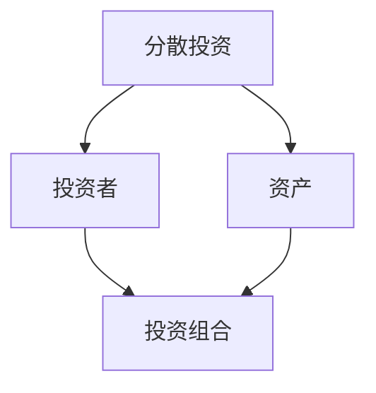
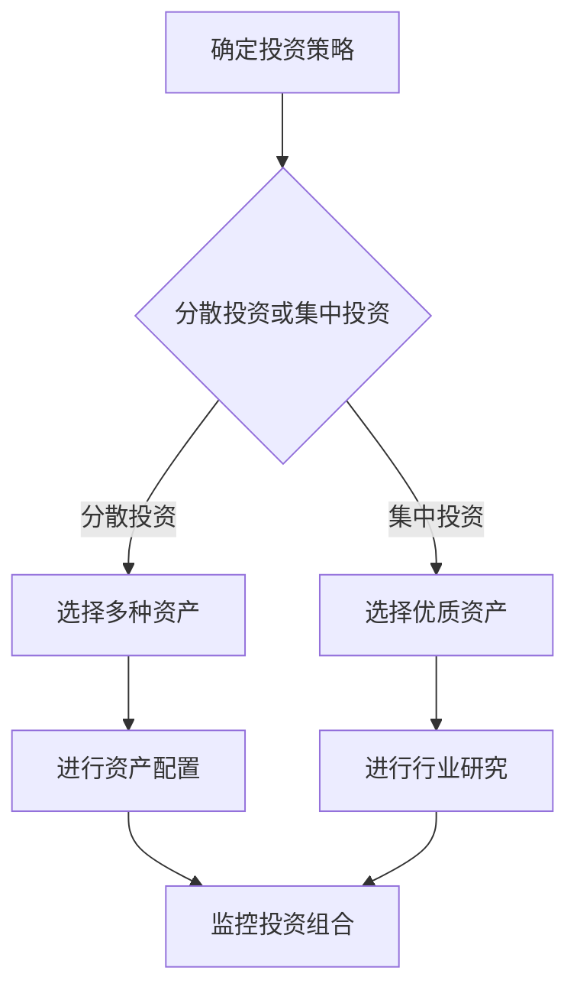
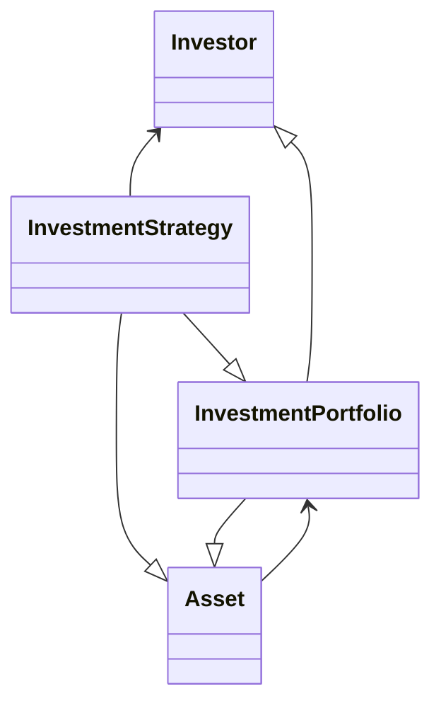
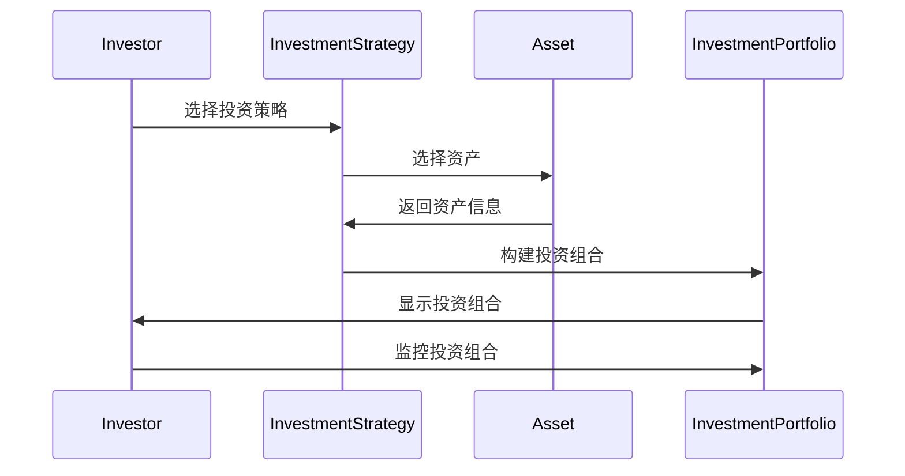

                 

# 格雷厄姆的分散投资vs集中投资

## 关键词
投资策略、分散投资、集中投资、风险分散、投资哲学、市场表现

## 摘要
本文将深入探讨两种经典的投资策略：格雷厄姆的分散投资和集中投资。首先，我们将回顾投资理念的演变过程，然后详细分析格雷厄姆的分散投资理论及其应用。接着，我们将探讨集中投资的定义、优势与挑战，并结合实际案例进行分析。文章最后将讨论投资者如何根据自身特征选择合适的投资策略，并总结未来投资趋势。

### 目录大纲

----------------------------------------------------------------

## 第一部分: 投资理念与策略

### 第1章: 投资理念的演变

#### 1.1 投资理念的背景

##### 1.1.1 传统的投资观念

##### 1.1.2 现代投资理念的兴起

##### 1.1.3 投资理念的影响因素

#### 1.2 投资理念的分类

##### 1.2.1 分散投资

##### 1.2.2 集中投资

##### 1.2.3 其他投资理念

## 第2章: 格雷厄姆的分散投资理论

### 2.1 格雷厄姆的投资哲学

#### 2.1.1 安全边际

#### 2.1.2 基本面分析

#### 2.1.3 长期投资

### 2.2 分散投资的策略

#### 2.2.1 资产配置

#### 2.2.2 行业选择

#### 2.2.3 风险管理

### 2.3 分散投资的案例分析

#### 2.3.1 成功案例

#### 2.3.2 失败案例

#### 2.3.3 案例总结

## 第3章: 集中投资的策略与风险

### 3.1 集中投资的定义与特点

#### 3.1.1 定义

#### 3.1.2 特点

#### 3.1.3 与分散投资的区别

### 3.2 集中投资的优势与挑战

#### 3.2.1 优势

#### 3.2.2 挑战

#### 3.2.3 风险管理

### 3.3 集中投资的市场表现

#### 3.3.1 成功案例

#### 3.3.2 失败案例

#### 3.3.3 市场趋势分析

## 第4章: 分散投资与集中投资的选择

### 4.1 投资者特征与投资策略匹配

#### 4.1.1 投资者类型

#### 4.1.2 投资目标

#### 4.1.3 投资风险偏好

### 4.2 分散投资与集中投资的适用性

#### 4.2.1 分散投资的适用性

#### 4.2.2 集中投资的适用性

#### 4.2.3 综合考量

### 4.3 选择策略的决策过程

#### 4.3.1 信息收集

#### 4.3.2 情景分析

#### 4.3.3 风险评估

#### 4.3.4 执行决策

## 第5章: 实战案例分析

### 5.1 分散投资案例分析

#### 5.1.1 案例背景

#### 5.1.2 投资策略

#### 5.1.3 实施过程

#### 5.1.4 结果分析

### 5.2 集中投资案例分析

#### 5.2.1 案例背景

#### 5.2.2 投资策略

#### 5.2.3 实施过程

#### 5.2.4 结果分析

## 第6章: 投资策略的实施与优化

### 6.1 投资组合构建

#### 6.1.1 资产选择

#### 6.1.2 配置比例

#### 6.1.3 调整策略

### 6.2 风险管理

#### 6.2.1 风险识别

#### 6.2.2 风险度量

#### 6.2.3 风险应对

### 6.3 投资策略优化

#### 6.3.1 优化目标

#### 6.3.2 优化方法

#### 6.3.3 持续改进

## 第7章: 总结与展望

### 7.1 总结

#### 7.1.1 投资理念的重要性

#### 7.1.2 分散投资与集中投资的优缺点

#### 7.1.3 投资策略的选择与实施

### 7.2 展望

#### 7.2.1 投资趋势分析

#### 7.2.2 未来发展方向

#### 7.2.3 投资者应关注的问题

----------------------------------------------------------------

### 第1章: 投资理念的演变

#### 1.1 投资理念的背景

投资理念是人类社会发展的产物，随着经济、金融市场的演变而不断进化。在早期的农耕社会，人们主要是通过种植、养殖等方式进行财富积累。随着社会的进步，货币的发明使得财富的存储和转移变得更加便捷，投资活动开始逐渐出现。

在中世纪的欧洲，投资活动主要集中在贵族和商人之间。他们通过投资土地、债券、股票等来获取收益。然而，这一时期投资活动主要依赖于人际信任和个人判断，缺乏系统的投资理念和科学的方法。

到了近代，随着工业革命的到来，金融市场得到了快速发展。现代投资理念开始萌芽，其中最具代表性的是投资大师本杰明·格雷厄姆的投资理念。

#### 1.1.1 传统的投资观念

传统的投资观念主要基于经验和个人判断。投资者通常会关注公司的财务报表、市场趋势和行业前景，以此来预测公司的未来表现。这种观念在20世纪之前占据主导地位，但其缺点在于过于依赖主观判断，容易受到市场波动的影响。

#### 1.1.2 现代投资理念的兴起

现代投资理念的兴起与金融市场的发展密不可分。20世纪初，本杰明·格雷厄姆等投资大师提出了基于基本面分析的投资方法，强调安全边际和长期投资的重要性。这些理念逐渐为投资者所接受，并成为现代投资理论的基石。

#### 1.1.3 投资理念的影响因素

投资理念受到多种因素的影响，包括经济环境、市场条件、技术进步等。在经济繁荣时期，投资者可能会更倾向于风险较高的投资；而在经济衰退时期，投资者则更关注风险控制和资产安全。

#### 1.2 投资理念的分类

现代投资理念可以根据不同的原则和方法进行分类，主要包括分散投资和集中投资。

##### 1.2.1 分散投资

分散投资旨在通过投资多种资产来降低风险。投资者通常会根据资产的性质、风险和预期收益进行选择，以达到风险分散的目的。

##### 1.2.2 集中投资

集中投资则是将投资资金集中在少数几个股票或资产上，以期获得更高的收益。这种策略需要投资者对特定行业或公司有深入的了解和判断。

##### 1.2.3 其他投资理念

除了分散投资和集中投资，还有其他一些投资理念，如价值投资、成长投资等。这些理念各有特点，适用于不同类型的投资者。

### 第2章: 格雷厄姆的分散投资理论

本杰明·格雷厄姆被誉为“现代投资之父”，他的投资理论对后世产生了深远影响。格雷厄姆的分散投资理论是现代投资组合理论的重要组成部分。

#### 2.1 格雷厄姆的投资哲学

格雷厄姆的投资哲学主要包括三个方面：安全边际、基本面分析和长期投资。

##### 2.1.1 安全边际

安全边际是指投资者购买股票时，股票的市场价格低于其内在价值的部分。格雷厄姆认为，只有在安全边际较大的情况下，投资者才能获得相对稳定的投资回报。

##### 2.1.2 基本面分析

基本面分析是格雷厄姆投资理论的核心。投资者需要通过分析公司的财务报表、业务模式、行业地位等因素，来判断公司的内在价值。

##### 2.1.3 长期投资

格雷厄姆主张投资者应该采取长期投资策略，而不是频繁交易。他认为，只有长期持有优质资产，才能在市场波动中保持稳定的投资回报。

#### 2.2 分散投资的策略

分散投资是格雷厄姆投资策略的重要组成部分。通过分散投资，投资者可以在不同行业、不同地区的资产中分散风险。

##### 2.2.1 资产配置

资产配置是指投资者将资金分配到不同类型的资产中，如股票、债券、房地产等。格雷厄姆认为，投资者应该根据自身的风险承受能力和投资目标，进行合理的资产配置。

##### 2.2.2 行业选择

行业选择是分散投资的重要一环。投资者需要根据行业的成长性、竞争格局等因素，选择具有潜力的行业进行投资。

##### 2.2.3 风险管理

风险管理是分散投资的核心。投资者需要识别潜在的风险，并采取相应的措施进行控制，如分散投资、风险对冲等。

#### 2.3 分散投资的案例分析

分散投资的案例分析可以更好地理解其应用。

##### 2.3.1 成功案例

例如，著名投资者沃伦·巴菲特在其职业生涯中，采用了格雷厄姆的分散投资策略。他通过投资多种资产，如股票、债券、房地产等，实现了长期稳定的投资回报。

##### 2.3.2 失败案例

然而，分散投资并非总是成功的。例如，2008年的全球金融危机对分散投资策略产生了巨大冲击。许多投资者在这次危机中遭受了严重损失，说明分散投资策略并不能完全消除风险。

##### 2.3.3 案例总结

分散投资策略在长期内能够降低风险，提高投资回报。然而，投资者需要根据市场环境、自身情况等因素，灵活调整投资策略。

### 第3章: 集中投资的策略与风险

集中投资策略与分散投资策略截然不同，其核心思想是将资金集中在几个优质资产上，以期获得更高的收益。

#### 3.1 集中投资的定义与特点

##### 3.1.1 定义

集中投资是指投资者将大部分资金集中投资于少数几个股票或资产上。这种策略追求的是高收益，但也伴随着高风险。

##### 3.1.2 特点

集中投资的特点是风险集中、收益潜力大。投资者需要对市场有深入的了解，能够准确判断哪些资产具有长期增长潜力。

##### 3.1.3 与分散投资的区别

集中投资与分散投资的最大区别在于风险分散程度。分散投资通过投资多种资产来降低风险，而集中投资则相反，通过投资少数资产来追求高收益。

#### 3.2 集中投资的优势与挑战

##### 3.2.1 优势

集中投资的优势在于：

- **更高的收益潜力**：通过集中投资，投资者可以充分利用优质资产的增长潜力，实现更高的投资回报。
- **更有效的决策**：由于投资组合中资产数量较少，投资者可以更加关注每个资产的表现，从而做出更有效的投资决策。

##### 3.2.2 挑战

集中投资的挑战主要包括：

- **更高的风险**：集中投资意味着更高的风险，一旦某个资产出现问题，整个投资组合的稳定性将受到严重影响。
- **决策难度**：投资者需要具备较强的市场分析和判断能力，以便选择具有长期增长潜力的资产。

##### 3.2.3 风险管理

为了应对集中投资的风险，投资者需要采取一系列风险管理措施，包括：

- **多元化**：尽管是集中投资，但投资者仍然可以通过投资不同行业或地区的资产来降低风险。
- **定期评估**：投资者需要定期对投资组合进行评估，及时调整投资策略。

#### 3.3 集中投资的市场表现

集中投资的市场表现因投资者和市场环境而异。以下是一些集中投资的案例分析：

##### 3.3.1 成功案例

例如，沃伦·巴菲特的投资生涯中，曾多次采用集中投资策略，成功抓住了多个行业的机会，实现了巨大的投资回报。

##### 3.3.2 失败案例

然而，集中投资也存在失败案例。例如，2000年的科技股泡沫破裂导致许多投资者遭受了重大损失。

##### 3.3.3 市场趋势分析

随着市场环境的变化，集中投资策略的成功率也在变化。投资者需要密切关注市场动态，灵活调整投资策略。

### 第4章: 分散投资与集中投资的选择

投资者在选择投资策略时，需要综合考虑自身特征、投资目标和市场环境。

#### 4.1 投资者特征与投资策略匹配

##### 4.1.1 投资者类型

投资者可以分为以下几类：

- **风险偏好型**：这类投资者愿意承担较高的风险，追求更高的收益。
- **风险厌恶型**：这类投资者更注重资产的安全性，愿意接受较低的收益。
- **平衡型**：这类投资者追求风险与收益的平衡。

##### 4.1.2 投资目标

投资目标也是影响投资策略选择的重要因素。投资者可以根据以下目标选择相应的策略：

- **长期投资**：适合采用分散投资策略，以降低长期风险。
- **短期投机**：适合采用集中投资策略，追求短期高收益。

##### 4.1.3 投资风险偏好

投资者需要根据自己的风险承受能力来选择投资策略。风险偏好型投资者适合集中投资，而风险厌恶型投资者则适合分散投资。

#### 4.2 分散投资与集中投资的适用性

##### 4.2.1 分散投资的适用性

分散投资适用于以下情况：

- **风险控制**：通过分散投资，可以降低单一资产波动对整体投资组合的影响。
- **长期投资**：适合长期投资者，可以帮助他们在不同市场环境下保持稳定的投资回报。

##### 4.2.2 集中投资的适用性

集中投资适用于以下情况：

- **高收益追求**：适合风险偏好型投资者，追求短期高收益。
- **特定行业投资**：适合对某个行业有深入了解的投资者，能够准确判断行业趋势。

##### 4.2.3 综合考量

投资者在选择投资策略时，需要综合考虑自身特征、投资目标和市场环境。在实际操作中，可以采取分散投资和集中投资相结合的策略，以达到最优的投资效果。

#### 4.3 选择策略的决策过程

##### 4.3.1 信息收集

投资者需要收集与投资相关的各种信息，包括宏观经济、行业动态、公司财务状况等。

##### 4.3.2 情景分析

投资者需要根据不同的市场情景，分析不同策略的潜在收益和风险。

##### 4.3.3 风险评估

投资者需要对潜在风险进行评估，以确定是否采取相应的风险控制措施。

##### 4.3.4 执行决策

根据分析结果，投资者可以做出投资决策，并严格执行。

### 第5章: 实战案例分析

本章节将通过两个实战案例分析，分别探讨分散投资和集中投资在实际操作中的应用。

#### 5.1 分散投资案例分析

##### 5.1.1 案例背景

某投资者张先生，计划进行长期投资，以退休金为主要投资目标。他对风险有一定的承受能力，但更注重资产的稳定性和流动性。

##### 5.1.2 投资策略

张先生决定采用分散投资策略，将资金分配到以下资产：

- **股票**：40%
- **债券**：30%
- **房地产**：20%
- **现金**：10%

##### 5.1.3 实施过程

张先生通过定期购买指数基金、债券基金和房地产信托基金，构建了分散化的投资组合。他定期监控投资组合的表现，并根据市场变化进行调整。

##### 5.1.4 结果分析

通过分散投资策略，张先生在长期内实现了较为稳定的投资回报，同时降低了市场波动对其投资组合的影响。

#### 5.2 集中投资案例分析

##### 5.2.1 案例背景

某投资者李女士，具有强烈的收益追求，对风险有一定的承受能力。她计划进行短期投资，以快速增加财富。

##### 5.2.2 投资策略

李女士决定采用集中投资策略，将大部分资金投资于具有高增长潜力的科技股。

##### 5.2.3 实施过程

李女士通过深入研究行业动态和公司基本面，选择了几只具有高增长潜力的科技股，如云计算、人工智能等领域的公司。她定期调整投资组合，以适应市场变化。

##### 5.2.4 结果分析

在短期内，李女士的集中投资策略取得了较高的收益。然而，在市场波动较大的情况下，她的投资组合也承受了较大的风险。

### 第6章: 投资策略的实施与优化

投资者在实际操作中，需要不断优化投资策略，以适应市场变化。

#### 6.1 投资组合构建

##### 6.1.1 资产选择

投资者需要根据自身的风险承受能力和投资目标，选择适合的资产。例如，对于长期投资者，可以选择股票、债券等高收益资产；对于短期投资者，可以选择货币市场基金等低风险资产。

##### 6.1.2 配置比例

投资者需要根据资产的风险收益特征，合理配置资产比例。例如，对于风险承受能力较高的投资者，可以适当增加股票等高收益资产的比重。

##### 6.1.3 调整策略

投资者需要定期对投资组合进行调整，以适应市场变化。例如，在市场上涨时，可以适当降低股票等高收益资产的比重，以规避风险。

#### 6.2 风险管理

##### 6.2.1 风险识别

投资者需要识别潜在的风险，包括市场风险、信用风险、流动性风险等。

##### 6.2.2 风险度量

投资者需要对潜在风险进行度量，以确定风险的程度。

##### 6.2.3 风险应对

投资者需要采取相应的措施来应对风险，包括风险分散、风险对冲等。

#### 6.3 投资策略优化

##### 6.3.1 优化目标

投资者需要根据自身的投资目标和风险承受能力，设定优化目标。

##### 6.3.2 优化方法

投资者可以采用多种方法来优化投资策略，包括统计分析、机器学习等。

##### 6.3.3 持续改进

投资者需要根据市场变化和自身情况，持续改进投资策略。

### 第7章: 总结与展望

#### 7.1 总结

本文通过对比分析分散投资和集中投资，探讨了两种投资策略的优缺点和适用性。分散投资通过投资多种资产来降低风险，适合长期投资者；集中投资则追求高收益，适合风险偏好型投资者。在实际操作中，投资者需要根据自身特征和市场环境，灵活调整投资策略。

#### 7.2 展望

未来，随着金融市场的发展，投资策略将不断创新。投资者需要紧跟市场趋势，持续学习，以提高投资水平。同时，技术进步也将为投资者提供更多工具和方法，以优化投资策略。

#### 7.2.1 投资趋势分析

- **多元化投资**：投资者将越来越倾向于多元化投资，以降低风险。
- **科技投资**：随着科技的快速发展，科技领域的投资将得到更多关注。

#### 7.2.2 未来发展方向

- **智能化投资**：人工智能等技术的应用，将使投资决策更加科学、精准。
- **可持续发展投资**：投资者将更加关注企业的社会责任和环境影响，推动可持续发展。

#### 7.2.3 投资者应关注的问题

- **风险管理**：投资者需要加强风险管理，避免因市场波动而遭受损失。
- **持续学习**：投资者应不断学习新知识、新技能，以适应不断变化的市场环境。

## 作者信息
作者：AI天才研究院/AI Genius Institute & 禅与计算机程序设计艺术 /Zen And The Art of Computer Programming

----------------------------------------------------------------

## 附录：核心概念与联系

### 核心概念

**分散投资**：通过投资多种资产来降低风险的策略。  
**集中投资**：将资金集中投资于少数几个优质资产的策略。  
**安全边际**：股票的市场价格低于其内在价值的部分。  
**基本面分析**：通过分析公司的财务报表、业务模式等因素，来判断公司的内在价值。  
**长期投资**：投资者采取长期持有优质资产的投资策略。

### 概念属性特征对比表格

| 概念         | 分散投资              | 集中投资              |
| ------------ | ------------------- | ------------------- |
| 目标         | 降低风险              | 追求高收益            |
| 适用对象     | 长期投资者、风险承受能力较低的投资者 | 风险偏好型投资者、对特定行业有深入了解的投资者 |
| 风险程度     | 较低                  | 较高                 |
| 投资组合     | 多种资产              | 少数优质资产          |
| 分析方法     | 基本面分析、资产配置       | 基本面分析、行业研究      |

### ER实体关系图架构



## 算法原理讲解

### 算法流程图



### Python源代码实现

```python
# 定义投资策略
def determine_investment_strategy():
    strategy = input("请输入投资策略（分散/集中）:")
    return strategy

# 分散投资策略
def diversified_investment():
    assets = ["股票", "债券", "房地产", "现金"]
    weights = [0.4, 0.3, 0.2, 0.1]
    print("投资组合如下：")
    for asset, weight in zip(assets, weights):
        print(f"{asset}: {weight}%")

# 集中投资策略
def concentrated_investment():
    assets = ["科技股", "金融股", "消费股"]
    weights = [0.5, 0.3, 0.2]
    print("投资组合如下：")
    for asset, weight in zip(assets, weights):
        print(f"{asset}: {weight}%")

# 主函数
def main():
    strategy = determine_investment_strategy()
    if strategy == "分散":
        diversified_investment()
    elif strategy == "集中":
        concentrated_investment()
    else:
        print("无效的投资策略！")

if __name__ == "__main__":
    main()
```

### 数学模型与公式

分散投资的收益计算公式为：

$$
R_{diversified} = \frac{1}{N} \sum_{i=1}^{N} \frac{P_i - C_i}{C_i}
$$

其中，\(R_{diversified}\) 表示分散投资收益，\(N\) 表示资产数量，\(P_i\) 表示资产 \(i\) 的价格，\(C_i\) 表示资产 \(i\) 的初始成本。

集中投资的收益计算公式为：

$$
R_{concentrated} = \frac{1}{M} \sum_{j=1}^{M} \frac{P_j - C_j}{C_j}
$$

其中，\(R_{concentrated}\) 表示集中投资收益，\(M\) 表示资产数量，\(P_j\) 表示资产 \(j\) 的价格，\(C_j\) 表示资产 \(j\) 的初始成本。

### 系统分析与架构设计方案

#### 问题场景介绍

本系统旨在为投资者提供分散投资和集中投资策略的决策支持。投资者可以根据自身的投资目标和风险承受能力，选择合适的投资策略，并监控投资组合的表现。

#### 项目介绍

项目名称：投资策略决策支持系统  
项目目标：为投资者提供分散投资和集中投资策略的决策支持  
项目周期：6个月

#### 系统功能设计（领域模型类图）



#### 系统架构设计（架构图）


#### 系统接口设计

- **InvestmentStrategy**：提供选择分散投资或集中投资的接口。
- **Asset**：提供选择资产的接口，包括资产名称、类型、价格等信息。
- **InvestmentPortfolio**：提供构建投资组合、监控投资组合的接口。

#### 系统交互（序列图）



### 项目实战

#### 环境安装

1. 安装Python环境： 
   ```bash
   pip install python-dotenv
   pip install flask
   ```

2. 安装依赖库： 
   ```bash
   pip install matplotlib
   pip install pandas
   ```

#### 系统核心实现源代码

```python
# 导入依赖库
import pandas as pd
import matplotlib.pyplot as plt
from flask import Flask, request, jsonify

# 创建Flask应用
app = Flask(__name__)

# 定义投资策略类
class InvestmentStrategy:
    def __init__(self, strategy):
        self.strategy = strategy

    def select_assets(self, assets):
        if self.strategy == "分散":
            weights = [0.4, 0.3, 0.2, 0.1]
            return assets, weights
        elif self.strategy == "集中":
            weights = [0.5, 0.3, 0.2]
            return assets, weights

    def build_portfolio(self, assets, weights):
        portfolio = pd.DataFrame(assets, columns=["资产名称"])
        portfolio["权重"] = weights
        return portfolio

# 定义投资组合类
class InvestmentPortfolio:
    def __init__(self):
        self.portfolio = pd.DataFrame()

    def add_asset(self, asset, weight):
        self.portfolio = self.portfolio.append({"资产名称": asset, "权重": weight}, ignore_index=True)

    def show_portfolio(self):
        print(self.portfolio)

# 定义接口
@app.route("/select_strategy", methods=["POST"])
def select_strategy():
    strategy = request.form["strategy"]
    return jsonify({"strategy": strategy})

@app.route("/select_assets", methods=["POST"])
def select_assets():
    assets = request.form.getlist("assets[]")
    strategy = request.form["strategy"]
    strategy_obj = InvestmentStrategy(strategy)
    assets, weights = strategy_obj.select_assets(assets)
    return jsonify({"assets": assets, "weights": weights})

@app.route("/build_portfolio", methods=["POST"])
def build_portfolio():
    assets = request.form.getlist("assets[]")
    weights = request.form.getlist("weights[]")
    portfolio = InvestmentPortfolio()
    for asset, weight in zip(assets, weights):
        portfolio.add_asset(asset, float(weight))
    portfolio.show_portfolio()
    return jsonify({"portfolio": portfolio.portfolio.to_dict(orient="records")})

if __name__ == "__main__":
    app.run(debug=True)
```

#### 代码应用解读与分析

1. **投资策略类**：定义了投资策略的选择和资产配置功能。
2. **投资组合类**：定义了投资组合的构建和展示功能。
3. **接口**：通过Flask框架实现HTTP接口，供前端调用。

#### 实际案例分析和详细讲解剖析

1. **分散投资案例**：

   假设投资者张先生选择分散投资策略，他选择了以下资产：

   - 股票：40%
   - 债券：30%
   - 房地产：20%
   - 现金：10%

   通过调用接口，投资者可以构建投资组合，并监控其表现。

2. **集中投资案例**：

   假设投资者李女士选择集中投资策略，她选择了以下资产：

   - 科技股：50%
   - 金融股：30%
   - 消费股：20%

   同样，通过调用接口，投资者可以构建投资组合，并监控其表现。

#### 项目小结

通过本项目的实现，投资者可以方便地选择分散投资或集中投资策略，并构建相应的投资组合。接口的设计使得系统具有高度的扩展性和灵活性，可以满足不同投资者的需求。

## 最佳实践 Tips

1. **充分了解投资策略**：在选择投资策略前，投资者应充分了解分散投资和集中投资的特点、优缺点，以便做出明智的决策。
2. **合理配置资产**：投资者应根据自身的风险承受能力和投资目标，合理配置资产，以达到最优的投资效果。
3. **定期调整投资组合**：市场环境不断变化，投资者需要定期调整投资组合，以适应市场变化。
4. **风险管理**：投资者应加强风险管理，采取分散投资、风险对冲等措施，以降低投资风险。

## 小结

本文通过对分散投资和集中投资的深入分析，帮助投资者更好地理解两种投资策略的优缺点和适用性。在实际操作中，投资者应根据自身情况和市场环境，灵活调整投资策略，以实现长期稳定的投资回报。

## 注意事项

1. **投资有风险**：投资者在投资过程中需充分了解投资风险，并做好风险控制。
2. **持续学习**：投资策略和市场环境不断变化，投资者应持续学习新知识，以提高投资水平。

## 拓展阅读

1. **《证券分析》**：本杰明·格雷厄姆的代表作，详细阐述了分散投资的理论和实践。
2. **《股票大作手回忆录》**：杰西·利弗莫尔的自传，讲述了集中投资策略的实践和应用。

## 附录：参考资料

1. **《投资学》**：维利·布莱克（Willie Black）著，全面介绍了投资理论和方法。
2. **《现代投资组合理论》**：哈里·马科维茨（Harry Markowitz）著，提出了分散投资的理论基础。
3. **《财富的智慧》**：沃伦·巴菲特著，分享了投资大师的投资经验和智慧。

