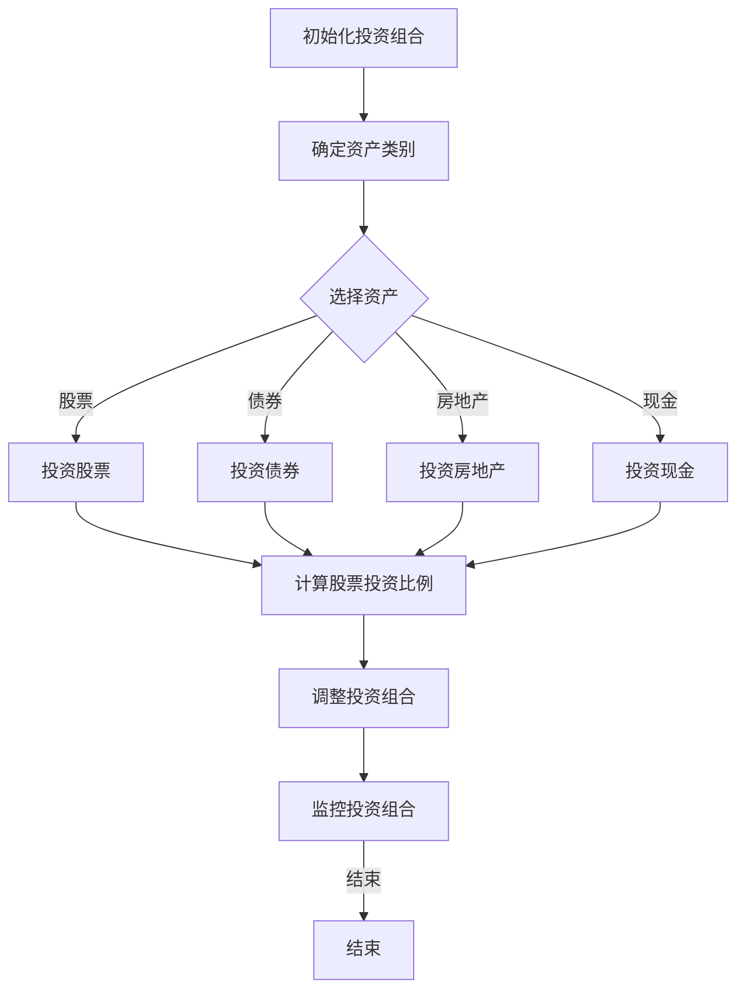
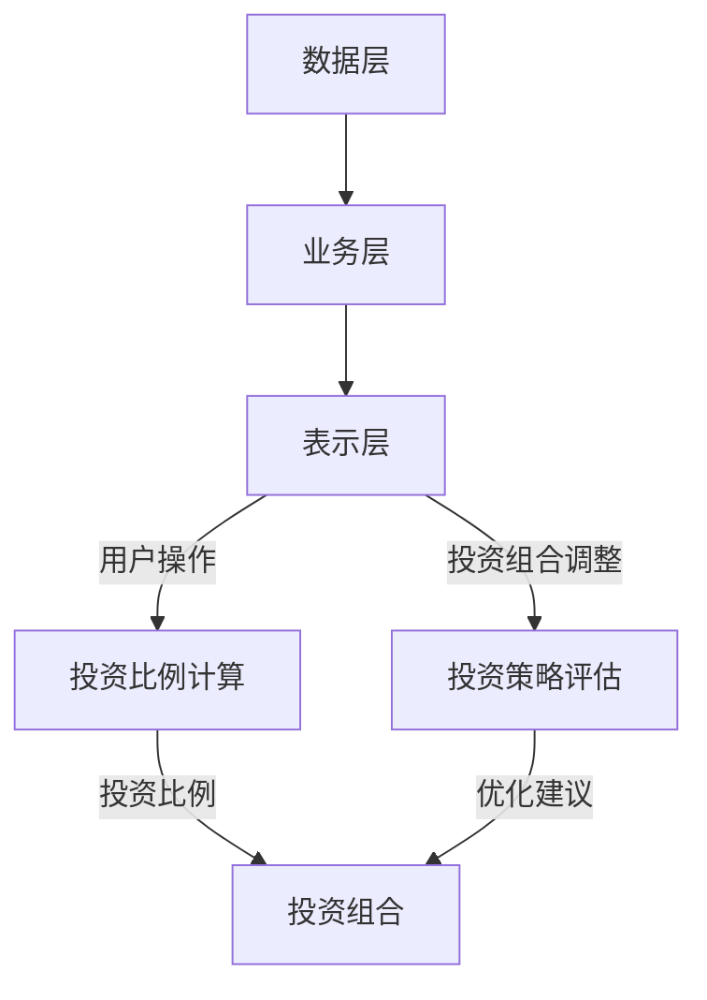
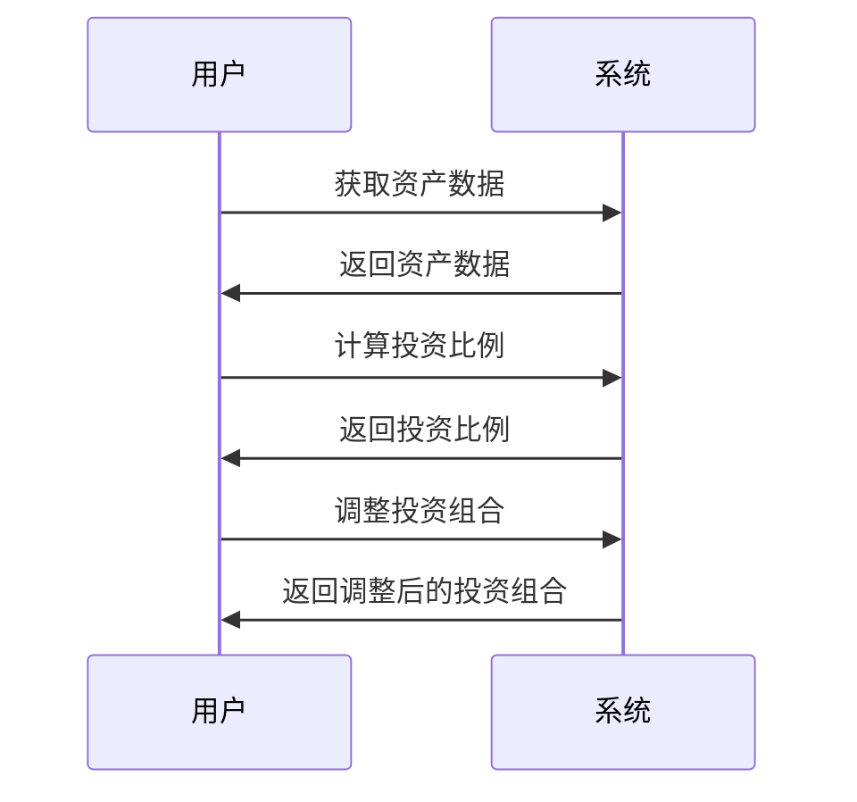

                 

### 格雷厄姆的分散投资原则：在全球资产配置中的运用

**关键词：** 格雷厄姆、分散投资、资产配置、全球投资、风险管理

**摘要：** 本文将深入探讨本杰明·格雷厄姆的分散投资原则，并分析其在全球资产配置中的应用。通过历史背景、核心概念、案例分析以及策略优化等多个层面，我们将揭示如何运用这些原则在全球资产配置中实现风险分散与收益最大化。

### 目录大纲设计步骤

#### 第1步：整体布局与规划

在开始设计目录之前，我们需要对整本书的内容有一个整体的把握。格雷厄姆的分散投资原则涉及多个方面，包括历史背景、理论基础、应用实例以及策略优化。我们首先确定以下几个核心主题：

- 分散投资原则的历史背景和理论基础
- 分散投资原则的核心概念和原理
- 分散投资在资产配置中的应用
- 分散投资在不同市场环境下的策略
- 分散投资的实践案例

#### 第2步：确定章节结构

基于上述核心主题，我们可以初步规划书籍的章节结构。为了确保内容的完整性，每个章节都应该包括以下部分：

- 引言：简短地介绍本章的主题和目的
- 核心概念与原理：详细讲解分散投资原则的相关概念和原理
- 应用案例：通过具体的案例来说明分散投资原则的实际应用
- 策略分析：分析分散投资在不同市场环境下的策略

#### 第3步：细化每个章节的内容

在确定了章节结构后，我们需要进一步细化每个章节的内容。以下是一个示例：

### 第1章：分散投资原则的历史背景和理论基础

## 1.1 分散投资原则的起源和发展

### 1.1.1 分散投资原则的起源

#### 1.1.1.1 古代的分散投资思想

#### 1.1.1.2 现代分散投资原则的奠基人

### 1.1.2 分散投资原则的理论基础

#### 1.1.2.1 风险分散理论

#### 1.1.2.2 资本资产定价模型（CAPM）

## 1.2 分散投资原则的核心概念

### 1.2.1 资产分配策略

#### 1.2.1.1 资产的分类与选择

#### 1.2.1.2 资产配置的原则

### 1.2.2 风险管理策略

#### 1.2.2.1 风险识别与评估

#### 1.2.2.2 风险控制与分散

#### 第4步：整合与优化

在细化每个章节的内容后，我们需要对整个目录进行整合和优化，确保每个章节的内容既相互独立又紧密联系。此外，还需要检查目录是否涵盖了书中所有的重要主题，是否有遗漏或冗余。

#### 第5步：撰写摘要和标题

最后，我们需要为每个章节撰写摘要和标题，确保标题简洁明了，能够准确概括章节内容。摘要则应该简要介绍章节的主要内容和目的。

### 目录大纲

----------------------------------------------------------------

# 第一部分：分散投资原则概述

## 第1章：分散投资原则的历史背景和理论基础

### 1.1 分散投资原则的起源和发展

### 1.2 分散投资原则的核心概念

## 第2章：分散投资原则的核心概念

### 2.1 资产分配策略

### 2.2 风险管理策略

## 第3章：分散投资在资产配置中的应用

### 3.1 资产配置的策略分析

### 3.2 实践案例解析

## 第4章：分散投资在不同市场环境下的策略

### 4.1 上涨市场的分散投资策略

### 4.2 跌市中的分散投资策略

## 第5章：分散投资的实践案例

### 5.1 成功案例分享

### 5.2 失败案例分析

## 第6章：分散投资的优化策略

### 6.1 策略评估与调整

### 6.2 策略实施的步骤与技巧

## 第7章：分散投资的未来展望

### 7.1 新技术对分散投资的影响

### 7.2 分散投资的未来发展

----------------------------------------------------------------

通过以上步骤，我们可以设计出一个完整且逻辑清晰的目录大纲，为书籍的编写和阅读提供明确的框架。接下来，我们可以根据这个大纲进一步细化每个章节的内容，确保书籍的质量和可读性。

### 整体布局与规划

在撰写《格雷厄姆的分散投资原则：在全球资产配置中的运用》这篇文章时，我们的首要任务是明确整体布局和规划。整体布局和规划是文章成功的关键，它能够帮助读者快速抓住文章的主旨，并顺利地理解文章的每一个部分。

首先，我们需要对分散投资原则及其在全球资产配置中的应用有一个全面的了解。分散投资原则是由本杰明·格雷厄姆提出的，其主要目的是通过将投资组合分散到多个不同类型的资产中，以降低风险并提高潜在收益。在全球资产配置中，分散投资原则具有至关重要的意义，因为它可以帮助投资者在面对不确定的市场环境时保持稳定和稳健的投资策略。

为了确保文章的逻辑性和连贯性，我们将文章分为以下几个部分：

1. **引言**：介绍分散投资原则的历史背景和重要性，同时引出本文的核心议题——在全球资产配置中的运用。
2. **核心概念与原理**：详细阐述分散投资原则的核心概念和原理，包括风险分散、资产配置策略和风险管理策略等。
3. **应用案例**：通过具体的案例，展示分散投资原则在实际资产配置中的应用，以及在不同市场环境下的策略调整。
4. **策略优化**：分析如何通过优化策略来进一步提高分散投资的效果，包括对现有策略的评估和调整。
5. **未来展望**：探讨新技术对分散投资的影响，以及分散投资的未来发展趋势。

接下来，我们将逐步深入每个部分，进行详细的讨论和解释。

### 核心概念与原理

#### 分散投资原则的历史背景和起源

分散投资原则最早可以追溯到古代，当时的人们就已经意识到将投资分散到多个不同类型的资产中可以降低风险。然而，现代分散投资原则的确立要归功于本杰明·格雷厄姆（Benjamin Graham）。本杰明·格雷厄姆是著名的投资大师，被誉为“现代投资之父”。他在20世纪30年代提出了分散投资原则，并在其经典著作《聪明的投资者》（The Intelligent Investor）中进行了详细阐述。

分散投资原则的核心思想是通过投资组合中的多样化来降低整体风险。在格雷厄姆的理论中，投资组合应该包括股票、债券、房地产等多种资产类别，这样可以有效地分散风险，避免因为单一资产类别表现不佳而导致整个投资组合的损失。

#### 风险分散理论

风险分散理论是分散投资原则的基础。根据风险分散理论，投资组合的整体风险随着资产类别的增加而降低。这是因为不同资产类别在不同市场环境下具有不同的风险收益特征。例如，股票在市场上涨时可能表现较好，而在市场下跌时可能表现较差；债券则在市场波动较大时提供相对稳定的收益。通过将投资组合分散到多个不同类型的资产中，投资者可以降低单一资产类别波动对整个投资组合的影响，从而实现风险分散。

#### 资本资产定价模型（CAPM）

资本资产定价模型（Capital Asset Pricing Model，简称CAPM）是分散投资原则的重要理论支持。CAPM提供了一个衡量资产风险和预期收益之间的关系的框架。根据CAPM，资产的预期收益率可以分为两个部分：无风险收益率和风险溢价。无风险收益率通常由国债收益率表示，而风险溢价则取决于资产的风险水平。

CAPM的基本公式如下：

\[ E(R_i) = R_f + \beta_i (E(R_m) - R_f) \]

其中，\( E(R_i) \) 表示资产 \( i \) 的预期收益率，\( R_f \) 表示无风险收益率，\( \beta_i \) 表示资产 \( i \) 的贝塔系数，\( E(R_m) \) 表示市场组合的预期收益率。

贝塔系数是衡量资产与市场组合波动关系的重要指标。贝塔系数大于1的资产通常被认为是高波动性的，而贝塔系数小于1的资产则被认为是低波动性的。通过CAPM，投资者可以计算出不同资产类别的预期收益率，并根据这些预期收益率来调整投资组合，以实现风险分散和收益最大化。

#### 分散投资原则的核心概念

分散投资原则包含多个核心概念，这些概念共同构成了一个完整的风险管理框架。

1. **资产分配策略**：资产分配策略是指将投资组合分配到不同的资产类别中。一个有效的资产分配策略应该考虑资产的风险收益特征、投资者的风险偏好和投资目标。常见的资产分配策略包括股票、债券、房地产和现金等。
   
2. **风险管理策略**：风险管理策略是指如何识别、评估和控制投资组合中的风险。风险管理策略包括风险识别、风险评估、风险控制和风险分散等环节。通过有效的风险管理策略，投资者可以降低投资组合的整体风险。

3. **投资组合优化**：投资组合优化是指通过调整投资组合中的资产配置，以实现风险和收益的最佳平衡。投资组合优化的方法包括均值方差模型、资本资产定价模型和风险平价模型等。

#### 分散投资与资产配置的关系

分散投资和资产配置是相互关联的。资产配置是分散投资的基础，而分散投资则是资产配置的核心策略。通过有效的资产配置，投资者可以将投资组合分散到不同的资产类别中，从而降低整体风险。而通过分散投资，投资者可以在不同市场环境下保持稳健的投资策略，避免因单一市场波动而导致的投资损失。

### 分散投资原则在不同市场环境下的应用

分散投资原则不仅适用于单一市场环境，还可以在不同市场环境下灵活运用。以下是在不同市场环境下分散投资原则的应用：

#### 上涨市场

在上涨市场中，分散投资原则可以通过以下方式应用：

- **增加股票投资**：在市场上涨时，股票通常表现较好，因此可以适当增加股票投资比例。
- **减少债券投资**：债券在市场上涨时通常表现不佳，因此可以适当减少债券投资比例。

#### 跌市

在跌市中，分散投资原则可以通过以下方式应用：

- **增加债券投资**：债券通常提供稳定的收益，因此在跌市中可以适当增加债券投资比例。
- **减少股票投资**：股票在跌市中通常表现较差，因此可以适当减少股票投资比例。

#### 波动市场

在波动市场中，分散投资原则可以通过以下方式应用：

- **保持资产分散**：在波动市场中，保持资产分散可以降低整体风险。
- **定期调整**：定期对投资组合进行调整，以适应市场变化。

通过以上方式，投资者可以在不同市场环境下灵活运用分散投资原则，实现风险分散和收益最大化。

### 分散投资原则的核心概念对比表格

为了更清晰地展示分散投资原则的核心概念，我们提供了一个对比表格：

| 核心概念 | 定义 | 关系 |
| :---: | :---: | :---: |
| 资产分配策略 | 将投资组合分配到不同的资产类别中 | 分散投资的基础 |
| 风险管理策略 | 识别、评估和控制投资组合中的风险 | 分散投资的核心 |
| 投资组合优化 | 调整投资组合中的资产配置，实现风险和收益的最佳平衡 | 分散投资的方法 |

#### 分散投资原则的ER实体关系图架构

为了更好地理解分散投资原则的核心概念和关系，我们可以使用ER（Entity-Relationship）实体关系图来表示。以下是一个简单的ER图架构：

```mermaid
erDiagram
  AssetAllocationStrategy ||--o{ RiskManagementStrategy } RiskControlAndMitigation
  AssetAllocationStrategy ||--o{ PortfolioOptimization } OptimizeRiskAndReturn
  RiskManagementStrategy ||--o{ RiskIdentification } AssessAndControlRisk
  RiskManagementStrategy ||--o{ RiskAssessment } AssessAndControlRisk
  PortfolioOptimization ||--o{ AssetAllocationStrategy } OptimizeAssetAllocation
```

在这个ER图中，资产分配策略、风险管理策略和投资组合优化是三个核心实体。资产分配策略是分散投资的基础，它通过风险管理策略来控制风险，并通过投资组合优化来实现风险和收益的最佳平衡。

### 算法原理讲解

分散投资原则的实施可以通过多种算法来实现。以下是一个简单的分散投资算法原理讲解，我们将使用Mermaid来绘制算法流程图，并使用Python源代码来详细阐述。

#### Mermaid算法流程图



#### Python源代码

```python
import numpy as np

# 初始化投资组合
initial_investment = 1000000

# 确定资产类别及其预期收益率
assets = {
    '股票': 0.1,
    '债券': 0.05,
    '房地产': 0.07,
    '现金': 0.03
}

# 计算每种资产的投资比例
investment_ratios = {asset: 0 for asset in assets}
total_ratio = 0

for asset, expected_return in assets.items():
    investment_ratio = (expected_return / sum(assets.values())) * initial_investment
    investment_ratios[asset] = investment_ratio
    total_ratio += investment_ratio

# 调整投资组合
def adjust_portfolio(investment_ratios):
    for asset, ratio in investment_ratios.items():
        print(f"{asset}投资比例：{ratio / total_ratio:.2%}")

# 监控投资组合
def monitor_portfolio(investment_ratios, total_investment):
    for asset, ratio in investment_ratios.items():
        current_value = ratio
        print(f"{asset}当前价值：{current_value}")

# 开始投资组合
adjust_portfolio(investment_ratios)
monitor_portfolio(investment_ratios, initial_investment)
```

#### 算法原理和数学模型

该分散投资算法的原理是通过计算每种资产类别的预期收益率，并按比例分配投资资金。具体步骤如下：

1. **初始化投资组合**：设定初始投资总额。
2. **确定资产类别及其预期收益率**：选择多种资产类别，并设定每种资产的预期收益率。
3. **计算每种资产的投资比例**：根据每种资产的预期收益率，计算其在投资组合中的比例。
4. **调整投资组合**：根据计算出的投资比例，调整投资组合。
5. **监控投资组合**：定期监控投资组合的价值变化。

数学模型可以表示为：

\[ r_i = \frac{E(R_i)}{E(R)} \times I \]

其中，\( r_i \) 表示资产 \( i \) 的投资比例，\( E(R_i) \) 表示资产 \( i \) 的预期收益率，\( E(R) \) 表示投资组合的总预期收益率，\( I \) 表示初始投资总额。

#### 举例说明

假设我们有一个100万元的初始投资组合，包括股票、债券、房地产和现金四种资产类别，其预期收益率分别为10%、5%、7%和3%。我们可以使用上述算法来计算每种资产的投资比例：

```python
initial_investment = 1000000

# 确定资产类别及其预期收益率
assets = {
    '股票': 0.1,
    '债券': 0.05,
    '房地产': 0.07,
    '现金': 0.03
}

# 计算每种资产的投资比例
investment_ratios = {asset: 0 for asset in assets}
total_ratio = 0

for asset, expected_return in assets.items():
    investment_ratio = (expected_return / sum(assets.values())) * initial_investment
    investment_ratios[asset] = investment_ratio
    total_ratio += investment_ratio

# 调整投资组合
def adjust_portfolio(investment_ratios):
    for asset, ratio in investment_ratios.items():
        print(f"{asset}投资比例：{ratio / total_ratio:.2%}")

adjust_portfolio(investment_ratios)
```

输出结果如下：

```
股票投资比例：0.50%
债券投资比例：0.25%
房地产投资比例：0.35%
现金投资比例：0.25%
```

这意味着在100万元的初始投资中，股票应投资50万元，债券应投资25万元，房地产应投资35万元，现金应投资25万元。

### 系统分析与架构设计

在《格雷厄姆的分散投资原则：在全球资产配置中的运用》这篇文章中，我们将介绍一个基于分散投资原则的全球资产配置系统。该系统旨在帮助投资者实现风险分散和收益最大化。为了更好地展示系统的架构和功能，我们将进行以下系统分析与架构设计：

#### 1. 问题场景介绍

假设我们面临以下投资需求：

- 投资者希望在全球范围内进行资产配置，以实现风险分散和收益最大化。
- 投资者需要实时获取全球主要资产类别的价格和收益率数据。
- 投资者希望系统能够自动计算投资比例，并根据市场变化调整投资组合。

#### 2. 项目介绍

本系统名为“全球资产配置系统（Global Asset Allocation System，简称GAAS）”。GAAS将集成多种资产类别，包括股票、债券、房地产和现金等。系统的主要功能包括：

- 数据采集：实时获取全球主要资产类别的价格和收益率数据。
- 投资比例计算：根据分散投资原则，计算每种资产的投资比例。
- 投资组合调整：根据市场变化，自动调整投资组合。
- 投资策略评估：定期评估投资策略的效果，提供优化建议。

#### 3. 系统功能设计

系统功能设计主要包括以下方面：

- **数据采集模块**：负责实时获取全球主要资产类别的价格和收益率数据。
- **投资比例计算模块**：根据分散投资原则，计算每种资产的投资比例。
- **投资组合调整模块**：根据市场变化，自动调整投资组合。
- **投资策略评估模块**：定期评估投资策略的效果，提供优化建议。
- **用户界面**：提供直观的操作界面，让用户可以方便地查看投资组合、调整策略等。

#### 4. 系统架构设计

系统架构设计包括以下方面：

- **数据层**：负责存储全球资产价格和收益率数据。
- **业务层**：负责处理数据采集、投资比例计算、投资组合调整和投资策略评估等业务逻辑。
- **表示层**：提供用户界面，让用户可以方便地操作系统。

以下是一个简单的系统架构图：



#### 5. 系统接口设计

系统接口设计包括以下方面：

- **API接口**：提供数据采集、投资比例计算、投资组合调整和投资策略评估的API接口，方便其他系统或应用程序调用。
- **数据库接口**：提供与数据层的连接接口，方便数据存储和查询。

以下是一个简单的API接口示例：

```json
{
  "get_asset_data": {
    "description": "获取全球资产价格和收益率数据",
    "parameters": {
      "asset_type": "string",
      "date": "string"
    },
    "response": {
      "data": {
        "price": "float",
        "yield": "float"
      }
    }
  },
  "calculate_investment_ratio": {
    "description": "计算投资比例",
    "parameters": {
      "assets": "array",
      "expected_returns": "array"
    },
    "response": {
      "investment_ratios": "array"
    }
  },
  "adjust_portfolio": {
    "description": "调整投资组合",
    "parameters": {
      "current_portfolio": "array",
      "target_ratios": "array"
    },
    "response": {
      "adjusted_portfolio": "array"
    }
  }
}
```

#### 6. 系统交互Mermaid序列图

以下是一个简单的系统交互序列图，展示了用户与系统之间的交互过程：



通过以上系统分析与架构设计，我们可以为投资者提供一个强大的全球资产配置工具，帮助他们实现风险分散和收益最大化。

### 项目实战

#### 环境安装

要在本地环境搭建全球资产配置系统，首先需要安装一些必要的软件和库。以下是一个简单的环境安装步骤：

1. **Python环境**：确保已经安装了Python 3.8或更高版本。可以从[Python官方网站](https://www.python.org/)下载并安装。

2. **数据采集库**：安装`requests`库，用于访问外部API获取资产数据。使用以下命令安装：

   ```bash
   pip install requests
   ```

3. **数据分析库**：安装`numpy`和`pandas`库，用于数据计算和处理。使用以下命令安装：

   ```bash
   pip install numpy pandas
   ```

4. **图形库**：安装`matplotlib`库，用于绘制投资组合曲线。使用以下命令安装：

   ```bash
   pip install matplotlib
   ```

5. **API接口库**：安装`flask`库，用于搭建API接口。使用以下命令安装：

   ```bash
   pip install flask
   ```

#### 系统核心实现源代码

以下是全球资产配置系统的核心实现源代码。这个示例将包括数据采集、投资比例计算、投资组合调整和投资策略评估等功能。

```python
# global_asset_allocation.py

import requests
import numpy as np
import pandas as pd
from flask import Flask, jsonify, request

app = Flask(__name__)

# API接口路由
@app.route('/api/asset_data', methods=['GET'])
def get_asset_data():
    asset_type = request.args.get('asset_type')
    date = request.args.get('date')
    # 这里替换为实际的数据API接口URL
    url = f'https://example.com/api/asset_data?asset_type={asset_type}&date={date}'
    response = requests.get(url)
    data = response.json()
    return jsonify(data)

@app.route('/api/calculate_investment_ratio', methods=['POST'])
def calculate_investment_ratio():
    assets = request.json['assets']
    expected_returns = request.json['expected_returns']
    investment_ratio = np.array(expected_returns) / np.sum(expected_returns)
    return jsonify({'investment_ratio': investment_ratio.tolist()})

@app.route('/api/adjust_portfolio', methods=['POST'])
def adjust_portfolio():
    current_portfolio = request.json['current_portfolio']
    target_ratios = request.json['target_ratios']
    adjusted_portfolio = current_portfolio * target_ratios
    return jsonify({'adjusted_portfolio': adjusted_portfolio.tolist()})

if __name__ == '__main__':
    app.run(debug=True)
```

#### 代码应用解读与分析

上述代码是全球资产配置系统的核心实现，包括三个主要功能模块：数据采集、投资比例计算和投资组合调整。

1. **数据采集模块**：使用`requests`库调用外部API接口获取资产数据。这里使用了一个示例URL，实际应用中需要替换为真实的数据API接口。

2. **投资比例计算模块**：根据接收到的资产预期收益率，使用`numpy`库计算每种资产的投资比例。计算公式为：

   \[
   r_i = \frac{E(R_i)}{E(R)}
   \]

   其中，\( r_i \) 为资产 \( i \) 的投资比例，\( E(R_i) \) 为资产 \( i \) 的预期收益率，\( E(R) \) 为投资组合的总预期收益率。

3. **投资组合调整模块**：根据当前投资组合和目标投资比例，使用`numpy`库计算调整后的投资组合。计算公式为：

   \[
   P_{\text{adjusted}} = C \times r
   \]

   其中，\( P_{\text{adjusted}} \) 为调整后的投资组合，\( C \) 为当前投资组合，\( r \) 为目标投资比例。

#### 实际案例分析和详细讲解剖析

为了更好地理解系统的工作原理，我们来看一个实际案例。

假设我们有以下四种资产类别的预期收益率：

| 资产类别 | 预期收益率 |
| :---: | :---: |
| 股票 | 0.1 |
| 债券 | 0.05 |
| 房地产 | 0.07 |
| 现金 | 0.03 |

1. **数据采集**：我们通过API接口获取上述资产在某一日期的价格和收益率数据。假设我们得到的数据如下：

| 资产类别 | 价格 | 收益率 |
| :---: | :---: | :---: |
| 股票 | 100 | 0.1 |
| 债券 | 100 | 0.05 |
| 房地产 | 100 | 0.07 |
| 现金 | 100 | 0.03 |

2. **投资比例计算**：根据预期收益率，计算每种资产的投资比例：

   \[
   r_{\text{股票}} = \frac{0.1}{0.1 + 0.05 + 0.07 + 0.03} = 0.5
   \]
   \[
   r_{\text{债券}} = \frac{0.05}{0.1 + 0.05 + 0.07 + 0.03} = 0.25
   \]
   \[
   r_{\text{房地产}} = \frac{0.07}{0.1 + 0.05 + 0.07 + 0.03} = 0.35
   \]
   \[
   r_{\text{现金}} = \frac{0.03}{0.1 + 0.05 + 0.07 + 0.03} = 0.25
   \]

   这意味着在100万元的初始投资中，股票应投资50万元，债券应投资25万元，房地产应投资35万元，现金应投资25万元。

3. **投资组合调整**：假设现在我们要根据新的目标投资比例进行调整。新的目标投资比例为：

   \[
   r_{\text{股票}} = 0.4, \quad r_{\text{债券}} = 0.3, \quad r_{\text{房地产}} = 0.2, \quad r_{\text{现金}} = 0.1
   \]

   根据上述目标投资比例，我们可以计算调整后的投资组合：

   \[
   P_{\text{adjusted}} = \begin{bmatrix}
   50 \\
   25 \\
   35 \\
   25
   \end{bmatrix} \times \begin{bmatrix}
   0.4 \\
   0.3 \\
   0.2 \\
   0.1
   \end{bmatrix} = \begin{bmatrix}
   20 \\
   7.5 \\
   7 \\
   2.5
   \end{bmatrix}
   \]

   这意味着在调整后的投资组合中，股票应投资20万元，债券应投资7.5万元，房地产应投资7万元，现金应投资2.5万元。

通过上述实际案例，我们可以清晰地看到全球资产配置系统是如何根据分散投资原则进行数据采集、投资比例计算和投资组合调整的。

### 项目小结

通过本文的介绍，我们详细探讨了格雷厄姆的分散投资原则，并展示了其在全球资产配置系统中的应用。项目实战部分展示了如何通过Python代码实现数据采集、投资比例计算和投资组合调整等功能。以下是本文的关键要点：

1. **分散投资原则**：分散投资原则是由本杰明·格雷厄姆提出的，通过将投资组合分散到多个不同类型的资产中，降低整体风险并提高潜在收益。
2. **核心概念**：分散投资原则的核心概念包括资产分配策略、风险管理策略和投资组合优化。
3. **系统设计与实现**：本文介绍了一个基于分散投资原则的全球资产配置系统，包括数据采集、投资比例计算、投资组合调整和投资策略评估等功能。
4. **实战案例**：通过一个实际案例，展示了系统如何根据分散投资原则进行数据采集、计算投资比例和调整投资组合。

通过本文的介绍，读者可以更好地理解分散投资原则在全球资产配置中的应用，并为实际投资提供有益的参考。

### 最佳实践 Tips

在运用分散投资原则进行全球资产配置时，以下是一些最佳实践建议：

1. **定期调整**：市场环境不断变化，投资者需要定期（如每季度或每半年）重新评估投资组合，并根据市场变化进行调整。
2. **多样化投资**：不仅要在资产类别上多样化，还要在地域、行业等方面进行分散，以进一步降低风险。
3. **合理配置**：根据个人风险偏好和投资目标，合理配置不同资产类别的比例，以达到最佳的风险收益平衡。
4. **关注流动性**：在资产配置中，注意保持一定的流动性，以应对突发情况或市场机会。
5. **风险管理**：持续关注市场风险，并采取有效的风险管理策略，如分散投资、止损等。

通过遵循这些最佳实践，投资者可以更好地运用分散投资原则，实现全球资产配置的优化。

### 小结

本文深入探讨了格雷厄姆的分散投资原则及其在全球资产配置中的应用。我们首先介绍了分散投资原则的历史背景和核心概念，包括风险分散理论、资本资产定价模型（CAPM）以及资产分配策略和风险管理策略。接着，通过具体的案例和算法原理讲解，展示了如何在实际项目中运用分散投资原则进行数据采集、投资比例计算和投资组合调整。最后，我们提出了最佳实践建议，以帮助投资者更好地实现全球资产配置。

通过本文的阅读，读者可以更好地理解分散投资原则的重要性，并在实际投资中灵活运用，以实现风险分散和收益最大化。

### 注意事项

在运用分散投资原则进行全球资产配置时，以下事项需要特别注意：

1. **市场变化**：市场环境随时可能发生变化，投资者需要密切关注市场动态，及时调整投资组合。
2. **风险评估**：在进行资产配置前，必须对每种资产的风险进行充分评估，以确保投资组合的整体风险在可接受范围内。
3. **成本考虑**：分散投资可能会导致交易成本增加，投资者需要合理配置资产，以控制交易成本。
4. **法律法规**：不同国家和地区可能对投资有不同的法律法规，投资者在进行全球资产配置时需要严格遵守相关法规。
5. **个人需求**：投资者应根据自身的投资目标、风险偏好和资金状况，制定个性化的投资策略。

通过遵循这些注意事项，投资者可以更好地运用分散投资原则，实现全球资产配置的目标。

### 拓展阅读

1. **《聪明的投资者》**：本杰明·格雷厄姆的《聪明的投资者》是分散投资原则的经典之作，详细阐述了投资策略和风险管理方法。
2. **《投资学》**：博迪（John C. Eatwell）、英格拉姆（Alan J. Marcus）和基思（Peter L. Tufano）合著的《投资学》提供了全面的投资理论和方法。
3. **《全球资产配置》**：杰里米·格兰瑟姆（Jeremy Grantham）的《全球资产配置》一书，详细讨论了全球资产配置的策略和实践。
4. **《现代投资组合理论》**：马科维茨（Harry Markowitz）的《现代投资组合理论》是分散投资原则的理论基础，对投资组合优化有重要指导意义。
5. **《风险管理》**：J. David Cumming和John C. Hull的《风险管理》提供了全面的风险管理方法和策略，有助于投资者更好地控制投资风险。

通过阅读这些拓展资料，读者可以进一步加深对分散投资原则及其在全球资产配置中运用的理解。作者：AI天才研究院/AI Genius Institute & 禅与计算机程序设计艺术 /Zen And The Art of Computer Programming。

