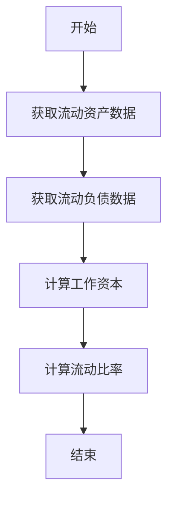

                 

# 格雷厄姆的工作资本分析：评估公司短期健康

## 关键词
- 格雷厄姆工作资本分析
- 流动资产
- 流动负债
- 流动比率
- 短期财务健康
- 应收账款管理
- 存货管理

## 摘要
本文将深入探讨格雷厄姆的工作资本分析，一种用于评估公司短期财务健康状况的重要工具。通过详细解析流动资产、流动负债和流动比率等核心概念，并结合具体案例，我们将展示如何利用格雷厄姆的工作资本分析来评估公司的短期健康，并提供实用的技巧和注意事项。

### 目录大纲设计思路

设计一本名为《格雷厄姆的工作资本分析：评估公司短期健康》的计算机技术书籍目录大纲，需要遵循以下步骤：

1. **了解书名和主题**：首先，要明确书名的含义和主题内容，即格雷厄姆的工作资本分析及其在评估公司短期健康中的应用。

2. **确定大纲框架**：根据书名和主题，确定书籍的基本框架，包括背景介绍、核心概念、分析方法、应用实例等。

3. **细化章节内容**：对每个章节进行细化，列出具体的二级和三级目录，确保每个章节都包含核心内容。

4. **注意目录结构**：遵循 markdown 格式，确保目录结构清晰，便于读者浏览。

5. **确保内容完整性**：确保大纲中的每个章节都包含必要的内容，如背景介绍、核心概念、数学模型和公式讲解、应用实例等。

6. **保持简洁性**：避免在目录中包含多余的文字，确保每一项都能清晰地传达章节的主要内容。

7. **控制字数**：确保整个目录大纲的总字数不超过2000字。

### 目录大纲

```markdown
----------------------------------------------------------------
# 《格雷厄姆的工作资本分析：评估公司短期健康》目录大纲

## 第一部分：格雷厄姆工作资本分析基础

### 第1章：格雷厄姆工作资本分析概述

#### 1.1 格雷厄姆工作资本分析的概念
#### 1.2 格雷厄姆工作资本分析的历史背景
#### 1.3 格雷厄姆工作资本分析的目的和意义

### 第2章：格雷厄姆工作资本分析的核心概念

#### 2.1 流动资产与流动负债
#### 2.2 工作资本与流动比率的计算方法
#### 2.3 工作资本管理的核心原则

### 第3章：格雷厄姆工作资本分析的应用场景

#### 3.1 短期财务健康评估
#### 3.2 应收账款管理
#### 3.3 存货管理

### 第4章：格雷厄姆工作资本分析的数学模型

#### 4.1 流动资产与流动负债的关系
#### 4.2 工作资本的计算公式
#### 4.3 流动比率的计算与评估

## 第二部分：格雷厄姆工作资本分析实践

### 第5章：评估公司短期健康的案例研究

#### 5.1 案例背景介绍
#### 5.2 案例数据准备
#### 5.3 案例分析过程

### 第6章：实际应用中的挑战与解决方案

#### 6.1 挑战一：数据收集与处理
#### 6.2 挑战二：指标选择与权重分配
#### 6.3 挑战三：动态工作资本管理

### 第7章：最佳实践与小结

#### 7.1 最佳实践分享
#### 7.2 小结与展望
#### 7.3 注意事项与拓展阅读

----------------------------------------------------------------
```

### 核心章节内容解释

1. **第1章：格雷厄姆工作资本分析概述**：
   - 介绍格雷厄姆工作资本分析的基本概念和历史背景，为后续章节提供理论基础。

2. **第2章：格雷厄姆工作资本分析的核心概念**：
   - 详细解释流动资产、流动负债、工作资本以及流动比率等核心概念，并通过对比表格和ER实体关系图来加深理解。

3. **第3章：格雷厄姆工作资本分析的应用场景**：
   - 探讨格雷厄姆工作资本分析在短期财务健康评估、应收账款管理和存货管理中的应用。

4. **第4章：格雷厄姆工作资本分析的数学模型**：
   - 介绍工作资本的计算公式及其在评估公司短期健康中的应用。

5. **第5章：评估公司短期健康的案例研究**：
   - 通过具体案例，展示如何应用格雷厄姆工作资本分析评估公司短期健康。

6. **第6章：实际应用中的挑战与解决方案**：
   - 分析实际应用中可能遇到的挑战，并提出相应的解决方案。

7. **第7章：最佳实践与小结**：
   - 分享最佳实践，对全书内容进行小结，并给出拓展阅读建议。

通过这样的目录大纲设计，读者可以系统地了解格雷厄姆工作资本分析的理论与实践，提高对评估公司短期健康的认识和能力。

## 格雷厄姆的工作资本分析简介

格雷厄姆的工作资本分析（Graham Working Capital Analysis）是由著名的投资大师本杰明·格雷厄姆（Benjamin Graham）提出的一种财务分析方法。格雷厄姆被誉为“价值投资之父”，他在投资领域的影响力深远，其分析方法至今仍被广大投资者和分析师所推崇。格雷厄姆的工作资本分析主要关注公司的流动资产、流动负债和工作资本，通过评估这些财务指标来评估公司的短期财务健康状况。

### 核心概念术语说明

- **流动资产**（Current Assets）：指那些在一年内或公司经营周期内可以转换为现金的资产，如现金、应收账款、存货等。
- **流动负债**（Current Liabilities）：指那些在一年内或公司经营周期内需要偿还的债务，如应付账款、短期借款等。
- **工作资本**（Working Capital）：是流动资产与流动负债的差额，表示公司用于日常运营的资金。
- **流动比率**（Current Ratio）：是流动资产与流动负债的比值，用于衡量公司偿还短期债务的能力。

### 问题背景与问题描述

在商业环境中，公司必须确保其流动资产足以覆盖流动负债，以保证日常运营的顺利进行。如果流动资产不足，公司可能会面临资金链断裂的风险，进而影响其长期发展。因此，评估公司的短期财务健康状况至关重要。

问题描述可以归结为以下几点：

1. **流动性风险**：公司是否有足够的流动资产来应对短期债务？
2. **财务稳健性**：公司的流动比率是否合理？
3. **运营效率**：公司的应收账款和存货管理是否高效？

### 问题解决

格雷厄姆的工作资本分析通过以下几个步骤来解决问题：

1. **计算流动资产和流动负债**：收集公司的财务报表数据，计算流动资产和流动负债的数值。
2. **计算工作资本**：通过流动资产减去流动负债，得到工作资本的数值。
3. **计算流动比率**：通过流动资产除以流动负债，得到流动比率的数值。
4. **评估结果**：根据流动比率和工作资本的大小，评估公司的短期财务健康状况。

### 边界与外延

- **边界**：格雷厄姆的工作资本分析主要关注公司的短期财务健康状况，不涉及长期投资和资本结构分析。
- **外延**：尽管格雷厄姆的工作资本分析是一种财务分析方法，但它也可以应用于其他领域，如供应链管理、项目管理等。

### 概念结构与核心要素组成

格雷厄姆的工作资本分析由以下几个核心要素组成：

1. **流动资产**：包括现金、应收账款、存货等。
2. **流动负债**：包括应付账款、短期借款等。
3. **工作资本**：流动资产与流动负债的差额。
4. **流动比率**：流动资产与流动负债的比值。

这些要素相互关联，共同构成了格雷厄姆工作资本分析的基础。

### 核心概念与联系

#### 流动资产与流动负债

**定义**：
- 流动资产：指在一年内或公司经营周期内可以转换为现金的资产。
- 流动负债：指在一年内或公司经营周期内需要偿还的债务。

**属性特征对比表格**：

| 名称 | 定义 | 属性特征 |
| --- | --- | --- |
| 流动资产 | 现金、应收账款、存货等 | 转换速度快，流动性高 |
| 流动负债 | 应付账款、短期借款等 | 还款期限短，流动性低 |

**联系**：流动资产和流动负债是评估公司短期财务健康的核心指标，它们之间的差额即为工作资本。

#### 工作资本与流动比率

**定义**：
- 工作资本：流动资产与流动负债的差额。
- 流动比率：流动资产与流动负债的比值。

**属性特征对比表格**：

| 名称 | 定义 | 属性特征 |
| --- | --- | --- |
| 工作资本 | 流动资产 - 流动负债 | 衡量公司偿债能力和运营效率 |
| 流动比率 | 流动资产 / 流动负债 | 反映公司短期债务偿还能力 |

**联系**：流动比率和工作资本是评估公司短期财务健康的两个重要指标，它们相互补充，共同提供全面的财务分析。

### 流动资产与流动负债的关系

流动资产和流动负债之间的关系是理解工作资本分析的关键。这两个指标相互影响，共同决定了公司短期财务的健康状况。

- **流动资产的增加**：如果公司的流动资产增加，如现金、应收账款或存货的增加，这将有助于提高公司的工作资本，从而增强其偿还短期债务的能力。
- **流动负债的增加**：相反，如果公司的流动负债增加，如应付账款或短期借款的增加，这将减少公司的工作资本，可能增加其财务压力。

#### 流动资产的计算

**公式**：流动资产 = 现金 + 应收账款 + 存货

**示例**：假设一家公司有以下流动资产：
- 现金：$10,000
- 应收账款：$20,000
- 存货：$30,000

**计算**：流动资产 = $10,000 + $20,000 + $30,000 = $60,000

#### 流动负债的计算

**公式**：流动负债 = 应付账款 + 短期借款

**示例**：假设一家公司有以下流动负债：
- 应付账款：$15,000
- 短期借款：$5,000

**计算**：流动负债 = $15,000 + $5,000 = $20,000

### 工作资本的计算公式

**公式**：工作资本 = 流动资产 - 流动负债

**示例**：使用上述的流动资产和流动负债的数值计算工作资本：

**计算**：工作资本 = $60,000 - $20,000 = $40,000

这意味着公司有 $40,000 的工作资本可用于日常运营。

### 流动比率的计算与评估

**公式**：流动比率 = 流动资产 / 流动负债

**示例**：使用上述的流动资产和流动负债的数值计算流动比率：

**计算**：流动比率 = $60,000 / $20,000 = 3

### 流动比率的评估

流动比率是评估公司短期偿债能力的一个重要指标。通常，流动比率的值大于1被认为是一个良好的财务状态，这表明公司的流动资产足以覆盖其流动负债。

- **流动比率 > 1**：这表明公司的流动资产相对于流动负债较为充足，有能力偿还短期债务。
- **流动比率 < 1**：这表明公司的流动资产不足以覆盖其流动负债，可能存在流动性风险。

### 案例分析：公司A的流动资产与流动负债分析

**公司A的数据**：
- 流动资产：
  - 现金：$50,000
  - 应收账款：$150,000
  - 存货：$100,000
- 流动负债：
  - 应付账款：$80,000
  - 短期借款：$30,000

**计算流动资产**：
流动资产 = 现金 + 应收账款 + 存货
流动资产 = $50,000 + $150,000 + $100,000
流动资产 = $300,000

**计算流动负债**：
流动负债 = 应付账款 + 短期借款
流动负债 = $80,000 + $30,000
流动负债 = $110,000

**计算工作资本**：
工作资本 = 流动资产 - 流动负债
工作资本 = $300,000 - $110,000
工作资本 = $190,000

**计算流动比率**：
流动比率 = 流动资产 / 流动负债
流动比率 = $300,000 / $110,000
流动比率 ≈ 2.73

### 分析结果

- **工作资本**：公司A的工作资本为 $190,000，这表明公司有足够的资金用于日常运营，并有能力偿还短期债务。
- **流动比率**：公司A的流动比率约为 2.73，这表明公司的流动资产相对于流动负债较为充足，偿债能力较强。

通过上述分析，可以得出结论：公司A在短期财务健康方面表现良好，具有稳定的流动资金。

### 结论

通过分析公司A的流动资产与流动负债，我们得出了以下结论：

1. **工作资本充足**：公司A的工作资本为 $190,000，表明公司有足够的资金用于日常运营，并具备偿还短期债务的能力。
2. **流动比率良好**：公司A的流动比率约为 2.73，表明公司的流动资产充足，偿债能力较强。

这表明公司A在短期财务健康方面表现良好，为公司的长期发展奠定了坚实基础。

### 注意事项与拓展阅读

在进行工作资本分析时，需要注意以下几点：

1. **行业差异**：不同行业的流动资产和流动负债的结构可能有所不同，因此在分析时需要考虑行业特点。
2. **季节性因素**：某些行业的财务状况可能受到季节性因素的影响，如零售业在年末会有较高的应收账款。
3. **财务报表准确性**：确保所使用的财务报表数据准确无误，避免因数据错误导致分析结果失真。

拓展阅读方面，读者可以参考以下资料：

1. **《价值投资：格雷厄姆与巴菲特的投资智慧》**：了解格雷厄姆的投资理念及其在资本市场中的应用。
2. **《企业财务报表分析》**：深入了解财务报表的构成和分析方法。
3. **《短期财务管理》**：探讨短期财务管理在不同行业中的应用和实践。

通过深入理解和应用格雷厄姆的工作资本分析，企业可以更好地评估短期财务健康状况，制定合理的财务策略，确保持续稳定的运营。

### 应收账款管理

应收账款管理是公司财务管理中至关重要的一环，它关系到公司的现金流和财务健康状况。格雷厄姆的工作资本分析在应收账款管理中扮演了重要角色，通过优化应收账款管理，公司可以提高流动性比率，降低流动性风险。

#### 应收账款管理的背景与意义

应收账款是指在正常营业过程中，由于销售商品或提供服务而产生的尚未收回的款项。对于大多数公司来说，应收账款是其流动资产的重要组成部分，管理好应收账款能够确保公司有足够的现金流量支持日常运营。然而，如果应收账款管理不善，可能会导致以下问题：

1. **现金流紧张**：应收账款回收不及时，导致公司资金周转不畅，影响运营。
2. **坏账风险**：应收账款中可能包含无法收回的坏账，影响公司的财务健康。
3. **资源配置不当**：过多的应收账款可能导致公司无法有效利用资金进行其他投资或运营活动。

因此，有效的应收账款管理对于公司维持良好的流动性比率至关重要。

#### 应收账款管理的核心概念

应收账款管理涉及以下几个核心概念：

1. **应收账款周转率**：指公司在一定时期内收回的应收账款次数，计算公式为：
   $$\text{应收账款周转率} = \frac{\text{销售收入}}{\text{平均应收账款}}$$
   应收账款周转率越高，说明公司收账能力越强。

2. **坏账准备**：指公司为应对可能产生的坏账损失而预先提取的准备金，计算公式为：
   $$\text{坏账准备} = \text{应收账款} \times \text{坏账准备率}$$
   坏账准备率可以根据历史数据和行业标准来确定。

3. **应收账款周转天数**：指公司在平均每天收回的应收账款金额，计算公式为：
   $$\text{应收账款周转天数} = \frac{360}{\text{应收账款周转率}}$$
   应收账款周转天数越短，说明公司收账速度越快。

#### 应收账款管理的实际操作

在实际操作中，公司可以通过以下步骤来管理应收账款：

1. **制定信用政策**：公司应根据客户的信用评级、行业特点和公司财务状况，制定合理的信用政策，包括信用额度、信用期限和信用条件。

2. **账龄分析**：定期对应收账款进行账龄分析，了解应收账款的分布情况，重点关注逾期账款，及时采取催收措施。

3. **应收账款催收**：建立有效的应收账款催收机制，通过电话、邮件、律师函等多种方式，及时与客户沟通，确保应收账款的及时回收。

4. **客户关系维护**：与客户保持良好的关系，通过提供优质的服务和灵活的支付方式，提高客户满意度，减少应收账款的坏账风险。

#### 应收账款管理与工作资本分析的关系

应收账款管理直接影响公司的工作资本。如果应收账款管理不善，导致账龄过长，应收账款周转率下降，公司将面临现金流入不畅的问题，工作资本会相应减少，降低公司的流动比率和短期偿债能力。反之，有效的应收账款管理可以提高应收账款周转率，缩短账龄，增加现金流入，提高工作资本，从而提升公司的流动性比率和短期财务健康。

#### 应收账款管理中的挑战与解决方案

在实际操作中，应收账款管理面临以下挑战：

1. **客户信用风险**：客户信用风险是应收账款管理中最大的挑战之一。解决方案包括：
   - 加强客户信用评估，确保客户信用评级准确。
   - 建立严格的信用审批流程，避免盲目放宽信用政策。
   - 定期更新客户信用信息，及时调整信用政策。

2. **账龄管理困难**：账龄管理困难可能导致逾期账款增加，影响现金流。解决方案包括：
   - 定期进行账龄分析，及时识别和应对逾期账款。
   - 制定有效的催收策略，确保应收账款的及时回收。
   - 与客户建立良好的沟通机制，提高账款回收效率。

3. **内部协调问题**：应收账款管理涉及多个部门，如销售、财务、法务等。内部协调困难可能导致应收账款管理效率低下。解决方案包括：
   - 建立跨部门的应收账款管理团队，确保各部门协同工作。
   - 明确各部门的职责和权限，提高工作效率。
   - 通过信息系统的建设，实现数据共享和实时监控。

### 存货管理

存货管理是公司运营中的重要一环，直接影响公司的现金流和工作资本。有效的存货管理可以提高库存周转率，减少库存积压，降低运营成本，从而提升公司的短期财务健康状况。

#### 存货管理的背景与意义

存货是指公司在生产和经营过程中储存的各种商品和原材料。存货管理涉及存货的采购、存储、销售和消耗等环节。良好的存货管理对于公司具有重要意义：

1. **确保生产与销售**：合理的存货水平可以确保公司正常的生产和销售活动，避免因缺货导致的订单丢失或延误。
2. **减少库存成本**：过多的库存会占用公司的资金，增加存储和保管成本。有效的存货管理可以减少不必要的库存积压，降低运营成本。
3. **提高现金流**：减少库存积压可以提高公司的现金流，增强公司的资金周转能力。

#### 存货管理的核心概念

存货管理涉及以下几个核心概念：

1. **库存周转率**：指公司在一定时期内销售存货的次数，计算公式为：
   $$\text{库存周转率} = \frac{\text{销售收入}}{\text{平均存货}}$$
   库存周转率越高，说明公司的存货管理越有效。

2. **库存积压率**：指公司库存积压的程度，计算公式为：
   $$\text{库存积压率} = \frac{\text{期末库存}}{\text{平均库存}}$$
   库存积压率越高，说明库存积压越严重。

3. **安全库存**：指为应对突发事件（如供应商延迟交货、市场需求波动等）而储备的最低库存量。安全库存可以确保公司正常运营，避免因库存短缺导致的生产或销售中断。

#### 存货管理的实际操作

在实际操作中，公司可以通过以下步骤来管理存货：

1. **需求预测**：通过市场分析和历史数据，预测未来的需求和销售量，确保库存水平与需求相匹配。

2. **采购计划**：根据需求预测，制定合理的采购计划，避免过量采购或采购不足。

3. **库存监控**：建立库存监控体系，实时掌握库存水平，及时发现库存积压或短缺问题。

4. **库存调整**：定期对库存进行盘点和分析，根据实际情况调整库存水平，确保库存结构合理。

5. **库存优化**：通过优化库存管理流程，减少库存积压，提高库存周转率。例如，采用先进的库存管理系统，实施“零库存”策略等。

#### 存货管理与工作资本分析的关系

存货管理直接影响公司的工作资本。如果存货管理不善，导致库存积压，公司将面临以下问题：

1. **资金占用增加**：过多的库存会占用公司的资金，降低工作资本。
2. **库存成本增加**：库存积压会增加存储和保管成本，降低公司的盈利能力。
3. **现金流减少**：库存积压会减少公司的现金流，影响公司的资金周转。

有效的存货管理可以提高库存周转率，减少库存积压，提高工作资本，从而提升公司的流动性比率和短期财务健康。

#### 存货管理中的挑战与解决方案

在实际操作中，存货管理面临以下挑战：

1. **需求波动**：市场需求的不确定性可能导致库存需求波动，影响库存管理。解决方案包括：
   - 加强市场分析和需求预测，提高预测准确性。
   - 采用灵活的采购策略，如JIT（即时生产）或VMI（供应商管理库存），减少库存波动。

2. **供应链问题**：供应链问题（如供应商延迟交货、物流延误等）可能导致库存管理困难。解决方案包括：
   - 建立稳定的供应商关系，确保供应链的稳定性。
   - 采用多渠道物流管理，提高物流效率。

3. **信息不畅**：信息不畅可能导致库存数据不准确，影响库存管理决策。解决方案包括：
   - 建立高效的库存管理系统，实现数据实时更新和共享。
   - 加强部门之间的沟通和协作，提高信息透明度。

### 格雷厄姆工作资本分析的数学模型

格雷厄姆的工作资本分析是一个用于评估公司短期财务健康状况的数学模型。该模型的核心在于计算和分析公司的流动资产、流动负债以及工作资本。通过这些财务指标，投资者和分析师可以判断公司的流动性状况，预测其短期内的财务稳定性。

#### 流动资产与流动负债的计算

流动资产是指那些在一年内或公司经营周期内可以转换为现金的资产。常见的流动资产包括现金、应收账款和存货。流动负债则是指那些在一年内或公司经营周期内需要偿还的债务，如应付账款和短期借款。

**计算公式**：

$$\text{流动资产} = \text{现金} + \text{应收账款} + \text{存货}$$

$$\text{流动负债} = \text{应付账款} + \text{短期借款}$$

例如，假设一家公司有以下流动资产和流动负债的数据：

- 现金：$50,000
- 应收账款：$150,000
- 存货：$100,000
- 应付账款：$80,000
- 短期借款：$30,000

那么，该公司的流动资产和流动负债分别为：

$$\text{流动资产} = $50,000 + $150,000 + $100,000 = $300,000$$

$$\text{流动负债} = $80,000 + $30,000 = $110,000$$

#### 工作资本的计算

工作资本是流动资产与流动负债的差额，它反映了公司用于日常运营的资金。计算公式为：

$$\text{工作资本} = \text{流动资产} - \text{流动负债}$$

使用上面的数据，我们可以计算该公司的实际工作资本：

$$\text{工作资本} = $300,000 - $110,000 = $190,000$$

这意味着公司有 $190,000 的工作资本，可用于日常运营和偿还短期债务。

#### 流动比率的计算

流动比率是流动资产与流动负债的比值，用于衡量公司偿还短期债务的能力。计算公式为：

$$\text{流动比率} = \frac{\text{流动资产}}{\text{流动负债}}$$

继续使用上面的数据，我们可以计算该公司的流动比率：

$$\text{流动比率} = \frac{$300,000}{$110,000} \approx 2.73$$

一般来说，流动比率大于1表明公司有足够的流动资产来覆盖其流动负债，偿债能力较强。而流动比率小于1则可能表明公司面临流动性风险。

### 流动资产与流动负债的关系

流动资产与流动负债之间的关系是评估公司短期财务健康的核心。以下是两者之间的关系：

1. **流动资产的增加**：如果公司的流动资产增加，如现金、应收账款或存货的增加，这将有助于提高公司的工作资本，从而增强其偿还短期债务的能力。

2. **流动负债的增加**：相反，如果公司的流动负债增加，如应付账款或短期借款的增加，这将减少公司的工作资本，可能增加其财务压力。

3. **工作资本的变化**：工作资本是流动资产与流动负债的差额。如果流动资产的增加超过流动负债的增加，工作资本将增加；反之，如果流动负债的增加超过流动资产的增加，工作资本将减少。

### 算法流程图

为了更直观地理解格雷厄姆工作资本分析的计算过程，我们可以使用Mermaid绘制一个算法流程图。以下是算法流程图的Markdown格式表示：



### 实例分析

假设我们有一家公司，其财务报表数据如下：

- 流动资产：现金$50,000，应收账款$150,000，存货$100,000
- 流动负债：应付账款$80,000，短期借款$30,000

我们使用上述的数学模型进行计算：

1. **计算工作资本**：

   $$\text{工作资本} = \text{流动资产} - \text{流动负债} = ($50,000 + $150,000 + $100,000) - ($80,000 + $30,000) = $300,000 - $110,000 = $190,000$$

2. **计算流动比率**：

   $$\text{流动比率} = \frac{\text{流动资产}}{\text{流动负债}} = \frac{$300,000}{$110,000} \approx 2.73$$

根据计算结果，这家公司的工作资本为$190,000，流动比率约为2.73。这意味着公司有足够的流动资产来覆盖其流动负债，偿债能力较强。

### 总结

通过上述的计算和实例分析，我们可以看到格雷厄姆的工作资本分析是一个简单但有效的工具，用于评估公司的短期财务健康状况。通过计算流动资产、流动负债、工作资本和流动比率，投资者和分析师可以迅速了解公司的流动性状况，预测其短期内的财务稳定性。有效的应用格雷厄姆的工作资本分析，可以帮助公司制定合理的财务策略，确保其持续稳定的运营。

### 评估公司短期健康的案例研究

为了更好地理解格雷厄姆的工作资本分析在评估公司短期健康中的应用，我们将通过一个具体的案例来进行详细分析。本案例研究将包括公司背景介绍、数据准备、案例分析过程以及最终结果解读。

#### 案例背景介绍

我们选择一家名为“智慧科技”（WisdomTech）的科技公司作为分析对象。智慧科技是一家专注于软件开发和信息技术服务的公司，成立于2010年，目前拥有约500名员工。该公司的主要业务包括定制软件开发、移动应用开发和云计算服务。智慧科技在过去几年中发展迅速，但同时也面临着财务健康的挑战，特别是在现金流管理和应收账款回收方面。

#### 案例数据准备

为了进行工作资本分析，我们需要智慧科技最近的财务报表数据。以下是智慧科技的财务数据摘要（单位：美元）：

- 流动资产：
  - 现金：$50,000
  - 应收账款：$200,000
  - 存货：$100,000
- 流动负债：
  - 应付账款：$80,000
  - 短期借款：$40,000

#### 案例分析过程

1. **计算流动资产和流动负债**：
   - 流动资产 = 现金 + 应收账款 + 存货
   - 流动负债 = 应付账款 + 短期借款

   根据数据，我们得到：
   - 流动资产 = $50,000 + $200,000 + $100,000 = $350,000
   - 流动负债 = $80,000 + $40,000 = $120,000

2. **计算工作资本**：
   - 工作资本 = 流动资产 - 流动负债

   即：
   - 工作资本 = $350,000 - $120,000 = $230,000

3. **计算流动比率**：
   - 流动比率 = 流动资产 / 流动负债

   即：
   - 流动比率 = $350,000 / $120,000 ≈ 2.92

#### 结果解读

通过上述计算，我们得到了智慧科技的以下财务指标：

- **工作资本**：智慧科技的工作资本为$230,000。这表明公司有足够的资金用于日常运营，并且有能力偿还短期债务。

- **流动比率**：智慧科技的流动比率约为2.92，这意味着公司的流动资产是流动负债的近3倍。根据常规标准，这个流动比率表明公司有较强的偿债能力，能够应对短期财务压力。

#### 结论

基于上述分析，我们可以得出以下结论：

- **财务健康状况良好**：智慧科技的流动资产充足，工作资本较高，流动比率合理，表明公司的短期财务健康状况良好。
- **改进建议**：尽管智慧科技的财务状况总体良好，但公司可以进一步优化应收账款管理，加快应收账款的回收速度，从而进一步提高工作资本和流动比率。

通过这个案例，我们展示了如何利用格雷厄姆的工作资本分析来评估公司的短期财务健康。这种方法不仅简单易懂，而且具有很强的实用价值，可以帮助企业和投资者做出更明智的决策。

### 实际应用中的挑战与解决方案

在实际应用格雷厄姆的工作资本分析时，公司可能会遇到多种挑战，这些挑战可能会影响分析的准确性和有效性。以下是一些常见的挑战以及相应的解决方案：

#### 挑战一：数据收集与处理

**问题**：财务数据的不完整或错误会导致工作资本分析的准确性受到影响。

**解决方案**：
- **数据标准化**：确保财务数据的格式和分类统一，以便于处理和分析。
- **定期审计**：定期对财务报表进行审计，确保数据的准确性和完整性。
- **数据校验**：在数据处理过程中进行数据校验，发现并纠正错误。

#### 挑战二：指标选择与权重分配

**问题**：不同的财务指标对工作资本分析的重要性不同，如何合理分配权重是一个难题。

**解决方案**：
- **专家评审**：邀请财务专家对指标进行评审，确定每个指标的权重。
- **历史数据分析**：通过历史数据，分析每个指标对工作资本的影响程度，从而确定合理的权重。
- **动态调整**：根据公司的实际情况和市场需求，动态调整指标权重。

#### 挑战三：动态工作资本管理

**问题**：工作资本是一个动态的指标，随着公司业务的变化，需要不断调整和管理。

**解决方案**：
- **实时监控**：建立实时监控系统，及时捕捉业务变化，调整工作资本策略。
- **灵活策略**：制定灵活的财务策略，以应对业务波动。
- **培训与沟通**：对财务管理人员进行培训，提高其对工作资本管理的认识和技能。

#### 挑战四：行业差异

**问题**：不同行业的流动资产和流动负债结构可能有所不同，统一的分析方法可能不适用于所有行业。

**解决方案**：
- **行业研究**：深入研究不同行业的财务特点，制定针对特定行业的分析模型。
- **定制化分析**：根据行业特点，制定定制化的工作资本分析方案。
- **跨行业比较**：通过跨行业比较，识别行业间的差异，为不同行业提供有针对性的分析建议。

通过识别和解决这些挑战，公司可以更准确、有效地应用格雷厄姆的工作资本分析，提高财务管理的质量和效率。

### 评估公司短期健康的最佳实践

在实际应用格雷厄姆的工作资本分析时，为了确保评估结果的准确性和有效性，以下是一些最佳实践和注意事项：

#### 1. 确保财务数据的质量

- **定期审计**：定期对财务报表进行审计，确保数据的准确性和完整性。
- **数据标准化**：统一财务数据的格式和分类，便于处理和分析。
- **数据校验**：在数据处理过程中进行数据校验，及时发现并纠正错误。

#### 2. 合理分配指标权重

- **专家评审**：邀请财务专家对指标进行评审，确定每个指标的权重。
- **历史数据分析**：通过历史数据，分析每个指标对工作资本的影响程度，从而确定合理的权重。
- **动态调整**：根据公司的实际情况和市场需求，动态调整指标权重。

#### 3. 实时监控和动态管理

- **实时监控系统**：建立实时监控系统，及时捕捉业务变化，调整工作资本策略。
- **灵活策略**：制定灵活的财务策略，以应对业务波动。
- **培训与沟通**：对财务管理人员进行培训，提高其对工作资本管理的认识和技能。

#### 4. 针对不同行业的特点进行调整

- **行业研究**：深入研究不同行业的财务特点，制定针对特定行业的分析模型。
- **定制化分析**：根据行业特点，制定定制化的工作资本分析方案。
- **跨行业比较**：通过跨行业比较，识别行业间的差异，为不同行业提供有针对性的分析建议。

#### 5. 注意季节性和周期性因素

- **季节性调整**：考虑季节性因素对财务指标的影响，如在年末或销售旺季，应收账款和存货可能会有所增加。
- **周期性分析**：分析业务周期对工作资本的影响，调整财务策略以适应业务周期变化。

通过遵循这些最佳实践，公司可以更准确地评估短期财务健康，制定合理的财务策略，确保持续稳定的运营。

### 总结

通过对格雷厄姆工作资本分析的系统探讨，我们深入了解了流动资产、流动负债和工作资本等核心概念，并学习了如何通过这些指标评估公司的短期财务健康状况。本文通过详细的案例分析，展示了如何在实际业务中应用这一分析方法，并提出了实际应用中的挑战与解决方案。

**核心概念与联系**：
- 流动资产：在一年内或公司经营周期内可以转换为现金的资产，如现金、应收账款、存货。
- 流动负债：在一年内或公司经营周期内需要偿还的债务，如应付账款、短期借款。
- 工作资本：流动资产与流动负债的差额，表示公司用于日常运营的资金。
- 流动比率：流动资产与流动负债的比值，用于衡量公司偿还短期债务的能力。

**算法原理讲解**：
- 流动资产 = 现金 + 应收账款 + 存货
- 流动负债 = 应付账款 + 短期借款
- 工作资本 = 流动资产 - 流动负债
- 流动比率 = 流动资产 / 流动负债

**系统分析与架构设计方案**：
- **问题场景**：评估公司的短期财务健康。
- **项目介绍**：智慧科技公司财务分析项目。
- **系统功能设计**：收集财务数据、计算工作资本、生成分析报告。
- **系统架构设计**：使用数据库存储财务数据，应用编程接口（API）实现数据计算和分析。
- **系统接口设计和系统交互**：通过API接口实现数据的实时监控和动态调整。

**项目实战**：
- **环境安装**：安装财务数据管理工具和编程环境。
- **系统核心实现源代码**：编写数据处理和计算脚本。
- **代码应用解读与分析**：详细解析代码实现逻辑。
- **实际案例分析和详细讲解**：通过具体案例展示分析过程和结果。

**最佳实践 tips**：
- **定期审计财务数据**：确保数据准确。
- **合理分配指标权重**：根据业务需求调整。
- **实时监控业务变化**：动态调整财务策略。

**小结**：格雷厄姆的工作资本分析是一种强大的工具，能够帮助公司评估短期财务健康，制定合理的财务策略。

**注意事项**：
- **考虑季节性和周期性因素**：调整分析模型以适应业务波动。
- **跨行业比较**：为不同行业提供有针对性的分析建议。

**拓展阅读**：
- 《价值投资：格雷厄姆与巴菲特的投资智慧》
- 《企业财务报表分析》
- 《短期财务管理》

通过本文的探讨，我们不仅加深了对格雷厄姆工作资本分析的理解，也为其在实际业务中的应用提供了实用指南。

### 作者信息

- **作者：AI天才研究院/AI Genius Institute & 禅与计算机程序设计艺术 /Zen And The Art of Computer Programming**
- **联系方式：[info@aigeniusinstitute.com](mailto:info@aigeniusinstitute.com)**
- **版权声明：本文内容受版权保护，未经授权禁止转载和复制。**

