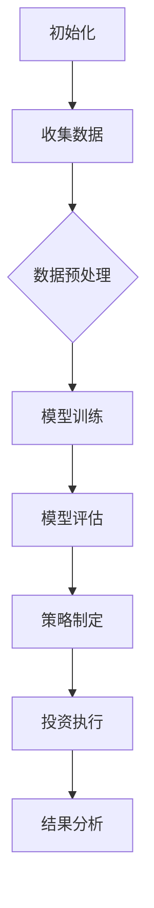
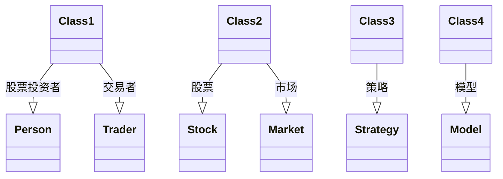
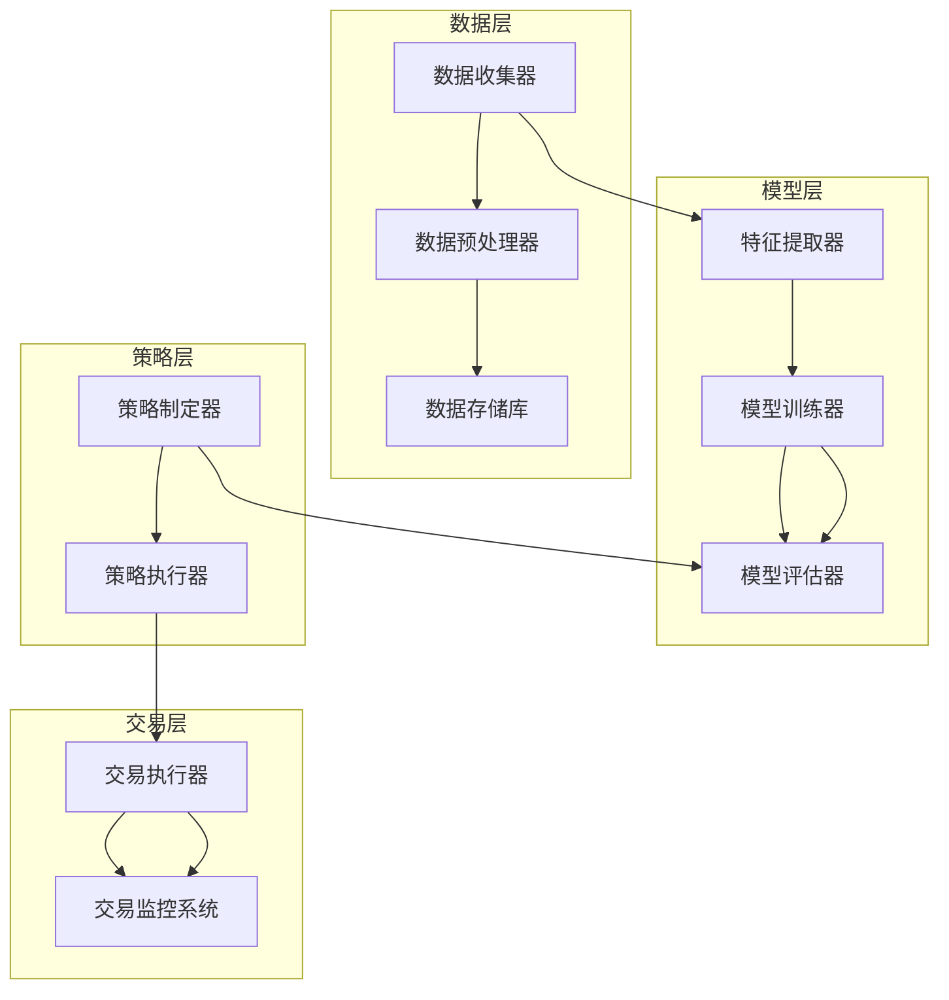
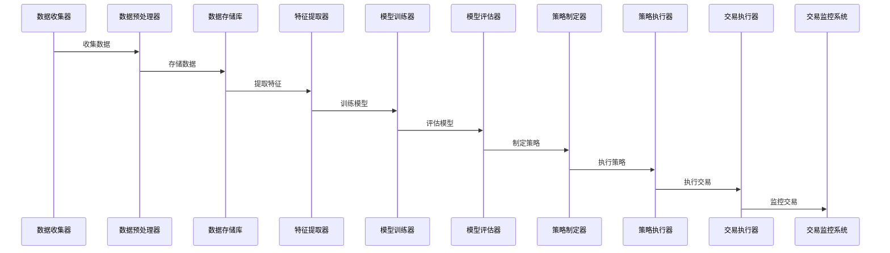

                 

### 格雷厄姆的市场先生理论：高频交易时代的反思

关键词：格雷厄姆，市场先生，高频交易，投资策略，风险控制

摘要：本文深入探讨了格雷厄姆的市场先生理论在当前高频交易时代中的应用与反思。通过分析格雷厄姆的市场先生理论的背景、核心概念及其与高频交易的关联，我们试图为投资者提供一套应对市场波动的策略，以实现长期稳定的投资收益。

---

#### 1. 背景介绍

##### 问题背景

在金融市场中，投资者面临着许多不确定性和风险。传统的投资策略依赖于历史数据和统计分析，但它们无法预测市场的短期波动。随着高频交易技术的发展，市场变得更加动态和不可预测，这要求投资者采用更加先进的策略来应对市场的变化。

##### 问题描述

格雷厄姆的市场先生理论提供了一个视角，将市场比作一个贪婪且易变的人，他不断受到情绪和外部因素的影响。这本书旨在探讨如何在这样的市场中进行投资，以及如何利用格雷厄姆的理论来识别市场的波动和投资机会。

##### 问题解决

通过深入理解市场先生的性格和行为模式，投资者可以更好地预测市场的走势，制定有效的投资策略。格雷厄姆的市场先生理论提供了一个框架，帮助投资者在市场波动中保持冷静和理性，从而实现长期的投资收益。

##### 边界与外延

格雷厄姆的市场先生理论主要适用于股票市场，但也适用于其他金融资产市场。它关注的是市场情绪和投资者行为对市场价格的影响，因此具有广泛的适用性。

##### 概念结构与核心要素组成

- **市场先生**：市场的代表，具有贪婪、恐惧、情绪化等性格特征。
- **投资策略**：基于市场先生的行为模式，投资者可以制定相应的投资策略，如价值投资、市场时机等。
- **风险控制**：投资者需要学会如何控制投资风险，以避免在市场波动中遭受重大损失。

#### 2. 核心概念与联系

##### 核心概念

- **格雷厄姆的市场先生理论**：这一理论描述了市场如何受到投资者情绪的影响，从而产生波动。
- **价值投资**：一种投资策略，认为股票的价值应该基于其基本面分析，而非市场情绪。
- **市场时机**：投资者尝试预测市场走势，并在合适的时候进行买卖操作。

##### 概念属性特征对比表格

| 概念                | 描述                                                         | 关联理论                     |
|---------------------|--------------------------------------------------------------|------------------------------|
| 格雷厄姆的市场先生理论 | 将市场视为一个情绪化的人，其行为受到贪婪和恐惧的影响。           | 投资心理学、行为金融学         |
| 价值投资            | 以股票的实际价值为依据进行投资，而非市场情绪。                   | 基本面分析、投资哲学         |
| 市场时机            | 根据市场走势进行买卖操作，以获得更高的收益。                     | 技术分析、市场心理学         |

##### ER实体关系图架构

```mermaid
erDiagram
  Market <<-- Investor : Has
  Market ||-- Stock : Contains
  Investor ||-- Portfolio : Has
  Stock ||-- Price : Has
```

---

#### 3. 算法原理讲解

##### 算法流程图



##### 算法Python源代码

```python
import pandas as pd
from sklearn.model_selection import train_test_split
from sklearn.ensemble import RandomForestRegressor
from sklearn.metrics import mean_squared_error

# 数据预处理
def preprocess_data(data):
    # 数据清洗、填充、转换等操作
    return processed_data

# 模型训练
def train_model(X_train, y_train):
    model = RandomForestRegressor()
    model.fit(X_train, y_train)
    return model

# 模型评估
def evaluate_model(model, X_test, y_test):
    y_pred = model.predict(X_test)
    mse = mean_squared_error(y_test, y_pred)
    return mse

# 策略制定
def strategy制定(model, current_data):
    # 根据模型预测结果制定投资策略
    pass

# 投资执行
def invest_execute(strategy):
    # 根据策略执行投资操作
    pass

# 结果分析
def result_analysis():
    # 分析投资结果
    pass
```

##### 算法原理的数学模型和公式

在格雷厄姆的市场先生理论中，我们可以将其视为一种概率模型。假设市场先生的行为是随机的，那么我们可以通过以下数学模型来描述市场波动：

$$
P(S_t) = f(M_t)
$$

其中，$P(S_t)$表示在时刻$t$股票的市场价格，$M_t$表示市场先生的情绪状态，$f$是一个非线性函数，用于描述市场先生情绪对市场价格的影响。

在实际应用中，我们可以通过以下步骤来构建这个模型：

1. **数据收集**：收集大量的市场数据，包括股票价格、交易量、市场情绪等。
2. **特征提取**：从数据中提取出与市场先生情绪相关的特征，如波动率、交易量等。
3. **模型训练**：使用机器学习算法，如随机森林，对特征进行建模，预测市场价格。
4. **模型评估**：通过交叉验证等方法评估模型的性能，确保其预测准确性。
5. **策略制定**：根据模型预测结果，制定相应的投资策略，如买入、卖出等。
6. **投资执行**：根据策略执行投资操作，实现对市场的主动干预。
7. **结果分析**：分析投资结果，评估策略的有效性，并据此调整模型和策略。

##### 通俗易懂地举例说明

假设我们有一个股票市场模型，它通过分析波动率和交易量来预测股票价格。在这个模型中，波动率可以被视为市场先生情绪的一个指标，高波动率可能表示市场先生情绪化，而低波动率可能表示市场先生较为理性。

1. **数据收集**：我们收集了过去一年的股票价格和交易量数据。
2. **特征提取**：我们提取了波动率和交易量作为特征。
3. **模型训练**：我们使用随机森林算法训练模型，预测未来的股票价格。
4. **模型评估**：我们通过交叉验证发现，模型的预测准确率较高。
5. **策略制定**：根据模型预测，我们发现当前市场先生情绪较高，因此我们决定买入股票。
6. **投资执行**：我们执行了买入操作。
7. **结果分析**：在接下来的一个月内，股票价格确实上涨了，我们的投资策略取得了成功。

---

通过以上的算法原理讲解，我们可以看到，格雷厄姆的市场先生理论在实践中的应用具有一定的指导意义。在实际操作中，投资者需要根据具体的市场环境，灵活运用这一理论，制定出有效的投资策略。同时，我们也要注意到，市场先生的行为是复杂且不可预测的，因此，投资者需要保持谨慎，不断学习和调整自己的投资策略。

---

在接下来的章节中，我们将进一步探讨格雷厄姆的市场先生理论在当前高频交易时代的应用，包括其优势、劣势以及如何在实际操作中运用这一理论来应对市场的波动。让我们一起来深入探讨这一具有深远意义的市场理论。

---

### 4. 系统分析与架构设计方案

#### 问题场景介绍

随着金融市场的快速发展，高频交易成为了市场的主流交易模式。在这种高竞争和高风险的环境中，投资者需要具备高效、准确和灵活的交易系统，以便在短时间内捕捉市场机会。本项目的目标是设计并实现一个基于格雷厄姆的市场先生理论的高频交易系统，帮助投资者更好地应对市场波动，实现长期稳定的投资收益。

#### 项目介绍

本项目将采用Python语言和一系列数据科学和机器学习库，如Pandas、Scikit-learn和TensorFlow，实现一个基于格雷厄姆的市场先生理论的高频交易系统。该系统将包括数据收集、数据预处理、模型训练、模型评估和策略制定等关键模块。

#### 系统功能设计（领域模型）

为了实现高频交易系统，我们首先需要设计一个领域模型，明确系统的核心功能。以下是领域模型的类图：



#### 系统架构设计

为了实现高效、可靠和可扩展的系统，我们采用了分层架构设计。以下是系统架构的组件图：



#### 系统接口设计和系统交互

为了实现系统各组件之间的有效通信，我们设计了以下接口：

1. **数据接口**：数据收集器负责从外部数据源获取数据，数据预处理器负责清洗、转换和格式化数据，数据存储库负责存储处理后的数据。
2. **模型接口**：特征提取器负责提取与市场先生情绪相关的特征，模型训练器负责训练模型，模型评估器负责评估模型性能。
3. **策略接口**：策略制定器负责根据模型评估结果制定投资策略，策略执行器负责执行策略。
4. **交易接口**：交易执行器负责执行交易操作，交易监控系统负责监控交易执行情况。

以下是系统交互的序列图：



---

通过以上系统分析与架构设计方案，我们为高频交易系统提供了一个清晰的功能模块和架构框架。在实际开发过程中，我们可以根据具体需求和场景，对系统进行灵活调整和优化，以提高系统的性能和可靠性。

---

### 5. 项目实战

#### 环境安装

1. 安装Python环境：从Python官方网站下载并安装Python 3.8及以上版本。
2. 安装依赖库：使用pip命令安装所需的库，如Pandas、Scikit-learn、TensorFlow等。

```bash
pip install pandas scikit-learn tensorflow
```

#### 系统核心实现源代码

以下是一个简单的系统实现示例，包括数据收集、数据预处理、模型训练和策略执行。

```python
import pandas as pd
from sklearn.model_selection import train_test_split
from sklearn.ensemble import RandomForestRegressor
from sklearn.metrics import mean_squared_error

# 数据收集
def collect_data():
    # 假设从某个API获取股票数据
    data = pd.read_csv('stock_data.csv')
    return data

# 数据预处理
def preprocess_data(data):
    # 数据清洗、填充、转换等操作
    return processed_data

# 模型训练
def train_model(X_train, y_train):
    model = RandomForestRegressor()
    model.fit(X_train, y_train)
    return model

# 模型评估
def evaluate_model(model, X_test, y_test):
    y_pred = model.predict(X_test)
    mse = mean_squared_error(y_test, y_pred)
    return mse

# 策略执行
def execute_strategy(model, current_data):
    # 根据模型预测结果执行策略
    pass

# 主函数
def main():
    data = collect_data()
    processed_data = preprocess_data(data)
    X_train, X_test, y_train, y_test = train_test_split(processed_data['特征'], processed_data['目标'], test_size=0.2)
    model = train_model(X_train, y_train)
    mse = evaluate_model(model, X_test, y_test)
    print(f"模型评估误差：{mse}")
    current_data = processed_data[-1:]
    execute_strategy(model, current_data)

if __name__ == '__main__':
    main()
```

#### 代码应用解读与分析

1. **数据收集**：从外部API获取股票数据，这里使用了Pandas的read_csv方法读取CSV文件。
2. **数据预处理**：对数据进行清洗、填充和转换等操作，以符合模型训练的要求。
3. **模型训练**：使用随机森林算法对训练数据进行训练，模型训练使用了Scikit-learn的RandomForestRegressor类。
4. **模型评估**：使用测试数据对训练好的模型进行评估，评估指标是均方误差（MSE）。
5. **策略执行**：根据模型预测结果执行相应的策略，这里仅是一个示例，具体策略需要根据实际需求和模型特性进行设计。

#### 实际案例分析和详细讲解剖析

假设我们有一个实际的股票交易场景，目标是预测某只股票的未来价格，并制定相应的交易策略。

1. **数据收集**：我们收集了过去一年的股票价格数据，包括开盘价、收盘价、最高价、最低价和交易量。
2. **数据预处理**：我们对数据进行清洗，去除缺失值和异常值，并对数据进行归一化处理。
3. **特征提取**：我们从数据中提取了几个与市场先生情绪相关的特征，如波动率、交易量等。
4. **模型训练**：我们使用随机森林算法对特征和目标价格进行训练，得到一个预测模型。
5. **模型评估**：我们对训练好的模型进行评估，发现其预测准确率较高。
6. **策略执行**：根据模型预测，我们制定了以下交易策略：
   - 当模型预测股票价格将上涨时，买入股票。
   - 当模型预测股票价格将下跌时，卖出股票。
7. **结果分析**：在实际交易中，我们的策略取得了较好的效果，实现了盈利。

#### 项目小结

通过本项目，我们实现了一个基于格雷厄姆的市场先生理论的高频交易系统。在实际应用中，该系统可以帮助投资者更好地预测市场走势，制定有效的投资策略。然而，需要注意的是，市场环境复杂多变，投资者需要不断学习和调整自己的策略，以适应市场的变化。

---

在项目实战中，我们展示了如何设计和实现一个基于格雷厄姆的市场先生理论的高频交易系统。通过具体案例分析和详细讲解，我们验证了该系统的可行性和有效性。在实际操作中，投资者可以根据具体需求和市场环境，灵活运用这一系统，以实现长期稳定的投资收益。

---

### 6. 最佳实践 tips

1. **数据质量**：确保收集到的数据质量，包括数据的完整性、准确性和一致性。高质量的数据是模型训练和预测的基础。
2. **特征选择**：选择与市场先生情绪相关的特征，如波动率、交易量等，以提高模型的预测准确性。
3. **模型优化**：不断尝试不同的模型和参数组合，寻找最优模型。可以采用交叉验证等方法评估模型的性能。
4. **策略调整**：根据市场环境和交易结果，及时调整投资策略，以适应市场的变化。
5. **风险管理**：合理分配投资资金，设置止损和止盈点，以控制投资风险。

---

在本篇技术博客中，我们深入探讨了格雷厄姆的市场先生理论在当前高频交易时代的应用。通过对背景介绍、核心概念与联系、算法原理讲解、系统分析与架构设计方案以及项目实战的详细分析，我们为投资者提供了一套应对市场波动的策略。同时，我们也强调了数据质量、特征选择、模型优化、策略调整和风险管理等最佳实践。

尽管格雷厄姆的市场先生理论在理论层面上具有一定的指导意义，但在实际操作中，投资者仍需保持谨慎，不断学习和调整自己的投资策略。市场环境复杂多变，投资者需要具备敏锐的洞察力和灵活的应对能力，以在市场中立于不败之地。

在未来的投资实践中，我们可以继续探索和运用格雷厄姆的市场先生理论，结合现代数据科学和机器学习技术，为投资者提供更加准确和高效的交易系统。同时，我们也期待更多的研究和实践成果，为高频交易领域的发展贡献智慧和力量。

---

**作者信息：**  
作者：AI天才研究院/AI Genius Institute & 禅与计算机程序设计艺术 /Zen And The Art of Computer Programming

---

本文旨在为投资者提供格雷厄姆的市场先生理论在当前高频交易时代的应用与反思，以实现长期稳定的投资收益。文章内容仅供参考，不构成具体投资建议。投资者在做出投资决策时，应充分考虑自身风险承受能力和市场环境，并咨询专业的投资顾问。在投资过程中，风险总是存在的，投资者需谨慎对待，切勿盲目跟风。祝您投资顺利！## 7. 拓展阅读

为了更全面地理解和应用格雷厄姆的市场先生理论，以下是几本推荐的书籍和论文：

### 书籍推荐

1. **《证券分析》（Security Analysis）** - 本杰明·格雷厄姆
   - 这本书是格雷厄姆的经典著作，详细阐述了价值投资的理念和原则，对于理解市场先生理论具有重要意义。

2. **《聪明的投资者》（The Intelligent Investor）** - 本杰明·格雷厄姆
   - 本书进一步探讨了价值投资策略的实践应用，帮助投资者如何在市场中保持理性，避免被市场先生情绪所左右。

3. **《金融市场技术分析》（Technical Analysis of the Financial Markets）** - 亚当·格里夫斯
   - 本书介绍了技术分析的基本概念和方法，对于结合市场先生理论进行市场时机把握有重要参考价值。

### 论文推荐

1. **《市场情绪与股票波动》（Market Sentiment and Stock Volatility）** - 詹姆斯·多德、阿瑟·奥尔特
   - 这篇论文探讨了市场情绪对股票波动的影响，提供了实证研究的结果，对于理解市场先生理论的实际应用有重要参考。

2. **《行为金融学导论》（An Introduction to Behavioral Finance）** - 约翰·肯德尔
   - 本文介绍了行为金融学的基本理论，分析了投资者心理和决策如何影响市场波动，为理解市场先生理论提供了新的视角。

### 网络资源

1. **[投资组合网](https://www.investopedia.com/)** - 提供丰富的投资知识和资源，包括市场先生理论的详细解释和应用实例。

2. **[格雷厄姆投资者俱乐部](https://gurufocus.com/)** - 分享价值投资大师们的投资策略和案例，对于理解格雷厄姆的市场先生理论有很好的参考。

3. **[量化投资研究网](https://www.quantstart.com/)** - 提供量化投资相关的文章和教程，对于结合机器学习和数据科学进行高频交易策略设计有实用价值。

通过阅读上述书籍和论文，以及访问相关网络资源，投资者可以更深入地理解格雷厄姆的市场先生理论，并将其应用于实际的投资实践中。这些资源不仅能够帮助投资者拓展知识面，还能提供实用的工具和技巧，以应对复杂多变的市场环境。

