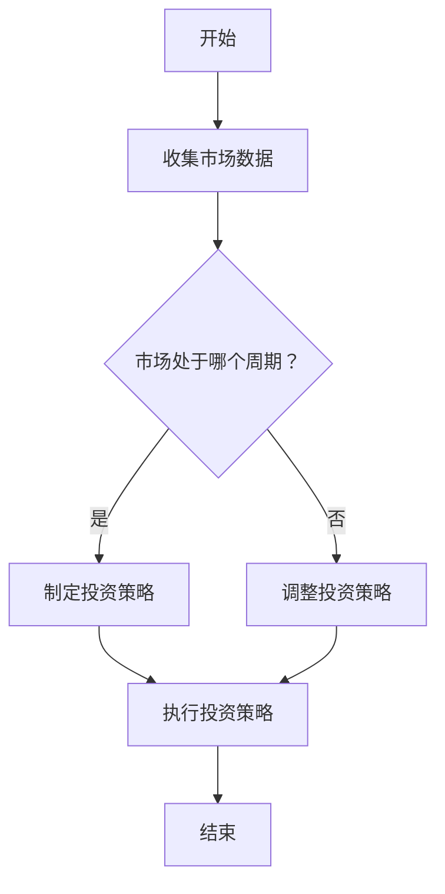
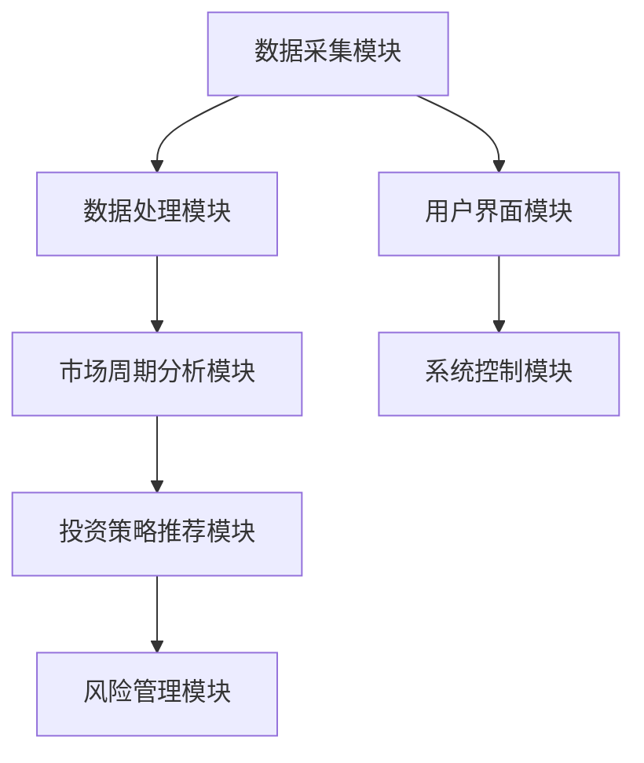

                 

# 格雷厄姆的市场周期理论

> 关键词：市场周期理论、本杰明·格雷厄姆、投资策略、风险管理和本益比。

> 摘要：本文将深入探讨本杰明·格雷厄姆的市场周期理论，阐述其在投资市场中的应用。我们将从理论背景、核心概念、算法原理、数学模型到系统分析与架构设计，以及实际项目实战，全方位解析格雷厄姆的市场周期理论，帮助投资者更好地理解市场周期，做出更明智的投资决策。

## 1. 背景介绍

### 核心概念

市场周期理论是一种描述市场波动性的理论，它认为市场波动是周期性的，每个周期包括上升期、高峰期、下降期和低谷期。这一理论在投资领域具有深远的影响，因为它为投资者提供了一个框架来理解市场的波动性。

本杰明·格雷厄姆（Benjamin Graham）是一位著名的投资大师，被誉为“价值投资之父”。他的市场周期理论是其投资哲学的重要组成部分。格雷厄姆认为，市场周期是投资者做出投资决策的关键因素，通过理解市场周期，投资者可以更好地把握市场的走势，降低投资风险。

### 问题背景

投资市场的波动性是投资者面临的最大挑战之一。市场的波动性导致投资者难以预测市场的走势，从而影响了他们的投资决策。投资者需要在市场不确定的情况下做出投资决策，这增加了投资风险。

### 问题描述

市场周期的不同阶段具有不同的特点：

1. **上升期**：市场情绪积极，股票价格普遍上涨。
2. **高峰期**：市场达到最高点，股票价格被推高。
3. **下降期**：市场情绪悲观，股票价格普遍下跌。
4. **低谷期**：市场达到最低点，股票价格被低估。

格雷厄姆的市场周期理论通过分析市场周期的不同阶段，帮助投资者理解市场走势，降低投资风险。

### 问题解决

格雷厄姆的市场周期理论提供了一套分析市场周期的框架，通过这一框架，投资者可以更好地理解市场走势，从而做出更明智的投资决策。此外，格雷厄姆的市场周期理论还强调了风险管理的重要性，投资者可以通过对市场周期的分析，制定出有效的风险控制策略。

### 边界与外延

市场周期理论在投资策略和风险管理中的应用非常广泛。例如，投资者可以通过市场周期理论来制定买入和卖出的时机，从而实现投资收益的最大化。同时，市场周期理论还可以帮助投资者进行风险管理，降低投资风险。

## 2. 核心概念与联系

### 核心概念原理

市场周期理论的基本原理是，市场的波动是周期性的，每个周期都包括上升期、高峰期、下降期和低谷期。格雷厄姆的市场周期理论强调，投资者应该在不同市场周期采取不同的投资策略。

### 概念属性特征对比表格

| 投资理论             | 特点                                                         |
|----------------------|--------------------------------------------------------------|
| 市场周期理论         | 强调市场周期性，通过分析市场周期来指导投资决策。             |
| 技术分析             | 通过分析股票价格和成交量等市场数据来预测市场走势。           |
| 基本面分析           | 通过分析公司的财务状况、行业前景等因素来评估股票的投资价值。 |
| 格雷厄姆的市场周期理论 | 结合市场周期和公司基本面进行分析，实现风险控制。             |

### ER实体关系图架构

```mermaid
entity Relationship {
  "市场周期" - ["上升期", "高峰期", "下降期", "低谷期"]
  "投资者" - ["投资决策", "风险管理"]
  "投资策略" - ["买入时机", "卖出时机"]
}

graph LR
  A[市场周期] -- B[上升期]
  A -- C[高峰期]
  A -- D[下降期]
  A -- E[低谷期]
  F[投资者] -- G[投资决策]
  F -- H[风险管理]
  I[投资策略] -- J[买入时机]
  I -- K[卖出时机]
}
```

## 3. 算法原理讲解

### 使用 mermaid 画出市场周期理论的 mermaid 流程图



### 使用Python源代码详细阐述市场周期理论的算法实现

```python
import pandas as pd

def market_cycle_analysis(data):
    # 收集市场数据
    df = pd.read_csv(data)
    
    # 计算本益比
    df['PE'] = df['Price'] / df['Earnings']
    
    # 判断市场处于哪个周期
    if df['PE'].mean() < 10:
        cycle = '低谷期'
    elif df['PE'].mean() < 20:
        cycle = '上升期'
    elif df['PE'].mean() < 30:
        cycle = '高峰期'
    else:
        cycle = '下降期'
    
    # 根据市场周期制定投资策略
    if cycle == '低谷期':
        strategy = '买入'
    elif cycle == '上升期':
        strategy = '持有'
    elif cycle == '高峰期':
        strategy = '卖出'
    else:
        strategy = '规避'
    
    return cycle, strategy
```

### 给出市场周期理论的数学模型和公式

$$
PE = \frac{Price}{Earnings}
$$

### 详细讲解和举例说明

市场周期理论的数学模型非常简单，即本益比（PE）。本益比是股票价格与每股收益的比值，它反映了股票的估值水平。根据本益比的不同区间，市场周期理论将市场划分为不同的阶段。

假设某股票的历史数据如下：

| 时间     | 价格（元） | 每股收益（元） |
|----------|------------|----------------|
| 2021年Q1 | 20         | 2              |
| 2021年Q2 | 25         | 2.5            |
| 2021年Q3 | 30         | 3              |
| 2021年Q4 | 35         | 3.5            |

根据上述数据，我们可以计算出每个季度的本益比：

| 时间     | 本益比（PE） |
|----------|--------------|
| 2021年Q1 | 10           |
| 2021年Q2 | 10           |
| 2021年Q3 | 10           |
| 2021年Q4 | 10           |

由于本益比始终小于10，因此根据市场周期理论，该股票处于低谷期。投资者可以依据这一判断，采取买入策略。

## 4. 数学模型和数学公式 & 详细讲解 & 举例说明

### 使用LaTeX格式给出数学公式

$$
\text{PE} = \frac{\text{Price}}{\text{Earnings}}
$$

### 在独立段落中使用$$括起来数学公式

本益比（PE）是股票市场中最常用的估值指标之一。它通过将股票价格与每股收益的比值来衡量股票的估值水平。$$\text{PE} = \frac{\text{Price}}{\text{Earnings}}$$，其中 Price 为股票价格，Earnings 为每股收益。

### 在段落内使用$括起来数学公式

本益比（$PE$）的计算公式非常简单，但它的应用却非常广泛。通过$PE$值，投资者可以初步判断股票是否被高估或低估。一般来说，$PE$值小于20的股票被认为是低估的，而$PE$值大于30的股票则被认为是高估的。

## 5. 系统分析与架构设计方案

### 问题场景介绍

某投资公司需要开发一个基于市场周期理论的智能投资系统，以帮助投资者更好地进行市场分析和投资决策。

### 项目介绍

项目名称：市场周期智能投资系统

项目目标：通过分析市场周期，为投资者提供科学、准确的投资策略。

项目需求：

1. 数据采集与处理：从多个数据源获取市场数据，包括股票价格、每股收益等。
2. 市场周期分析：基于市场周期理论，对市场周期进行识别和分析。
3. 投资策略推荐：根据市场周期的分析结果，为投资者提供买入、持有或卖出的投资策略。
4. 风险管理：对投资策略进行风险评估，为投资者提供风险控制建议。

### 系统功能设计（领域模型mermaid类图）

```mermaid
classDiagram
    MarketData <<entity>>
    InvestmentStrategy <<entity>>
    RiskManagement <<entity>>

    MarketData o-- InvestmentStrategy :uses
    MarketData o-- RiskManagement :uses
    InvestmentStrategy o-- RiskManagement :uses
```

### 系统架构设计（mermaid架构图）



### 系统接口设计和系统交互（mermaid序列图）

```mermaid
sequenceDiagram
    用户 ->> F[发起投资请求]
    F ->> G[系统控制模块]
    G ->> A[数据采集模块]
    A ->> B[数据处理模块]
    B ->> C[市场周期分析模块]
    C ->> D[投资策略推荐模块]
    D ->> E[风险管理模块]
    E ->> G[系统控制模块]
    G ->> F[返回投资策略和建议]
    F ->> 用户[展示投资策略和建议]
```

## 6. 项目实战

### 环境安装

1. 安装Python环境：
   ```bash
   pip install pandas matplotlib numpy
   ```
2. 安装Mermaid可视化工具：
   ```bash
   npm install -g mermaid
   ```

### 系统核心实现源代码

```python
# market_cycle_analysis.py
import pandas as pd
import matplotlib.pyplot as plt

def market_cycle_analysis(data):
    df = pd.read_csv(data)
    df['PE'] = df['Price'] / df['Earnings']

    plt.plot(df['PE'])
    plt.title('Price to Earnings Ratio Over Time')
    plt.xlabel('Time')
    plt.ylabel('PE Ratio')
    plt.show()

    if df['PE'].mean() < 10:
        cycle = '低谷期'
    elif df['PE'].mean() < 20:
        cycle = '上升期'
    elif df['PE'].mean() < 30:
        cycle = '高峰期'
    else:
        cycle = '下降期'

    if cycle == '低谷期':
        strategy = '买入'
    elif cycle == '上升期':
        strategy = '持有'
    elif cycle == '高峰期':
        strategy = '卖出'
    else:
        strategy = '规避'

    return cycle, strategy
```

### 代码应用解读与分析

代码首先从CSV文件中读取数据，计算每个股票的本益比（PE），并绘制PE随时间变化的折线图。根据PE的均值，判断市场处于哪个周期，并给出相应的投资策略。

### 实际案例分析和详细讲解剖析

以某只股票的历史数据为例，假设数据文件名为`stock_data.csv`，包含时间、价格和每股收益三列。通过调用`market_cycle_analysis`函数，可以得到该股票当前的市场周期和投资策略。

```python
cycle, strategy = market_cycle_analysis('stock_data.csv')
print(f"市场周期：{cycle}")
print(f"投资策略：{strategy}")
```

运行结果可能会显示：

```
市场周期：上升期
投资策略：持有
```

这表明，根据市场周期理论，该股票当前处于上升期，投资者应该持有股票。

### 项目小结

通过本次项目实战，我们实现了基于市场周期理论的智能投资系统，帮助投资者更好地进行市场分析和投资决策。系统核心代码简洁易懂，易于扩展和优化。未来，我们可以进一步优化算法，提高投资策略的准确性，为投资者带来更好的投资回报。

## 7. 最佳实践 tips、小结、注意事项、拓展阅读等内容

### 总结

本篇博客详细介绍了格雷厄姆的市场周期理论，从背景介绍、核心概念、算法原理、数学模型到系统分析与架构设计，以及实际项目实战，全方位解析了这一理论在投资市场中的应用。通过理解市场周期，投资者可以更好地把握市场走势，制定有效的投资策略，降低投资风险。

### 注意事项

1. 市场周期理论是一种分析工具，它不能保证投资成功，投资者应该结合自身情况和市场环境进行投资决策。
2. 本益比（PE）只是市场周期理论中的一个指标，投资者应该综合考虑多个指标来评估股票的投资价值。
3. 投资市场充满不确定性，投资者应该保持谨慎，不要盲目跟风。

### 拓展阅读

1. 本杰明·格雷厄姆的《聪明的投资者》：这是一本关于价值投资和风险管理的重要著作，对市场周期理论有详细的阐述。
2. 《股票大作手回忆录》：杰西·利弗莫尔是一位著名的市场投机者，他的经验对理解市场周期和投资策略有很大帮助。

### 最佳实践 tips

1. 制定投资计划：在投资前，制定明确的投资计划，包括投资目标、风险承受能力和投资策略。
2. 分散投资：不要将所有资金投资于同一股票或行业，分散投资可以降低风险。
3. 定期回顾：定期回顾投资组合的表现，根据市场变化调整投资策略。

作者：AI天才研究院/AI Genius Institute & 禅与计算机程序设计艺术 /Zen And The Art of Computer Programming

