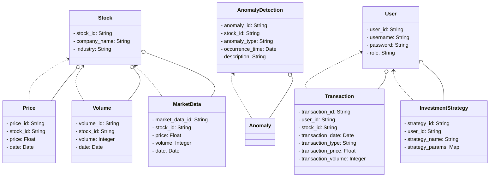
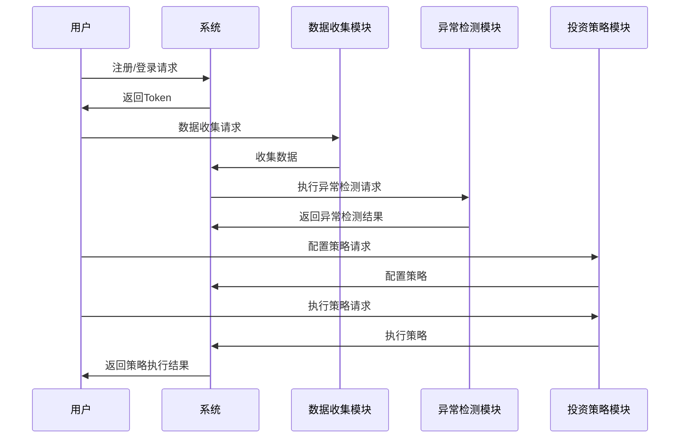

                 

### 格雷厄姆的市场异常理论概述

#### 1.1 问题背景

投资市场是现代经济体系中的重要组成部分，其波动性在很大程度上影响着经济和社会的稳定。投资市场中的价格波动既受到宏观经济环境、政策变化、市场情绪等多种因素的影响，也受到投资者行为和策略的驱动。然而，市场效率问题一直备受关注。市场效率指的是市场在价格发现和资源配置方面达到的最优状态。传统理论通常认为，市场是信息有效的，价格能够迅速反映所有可得信息，因此，投资者通过市场交易获取超额收益是非常困难的。

在这种市场效率的假设下，大多数投资者只能通过承担更高的风险来期望获得合理的收益。然而，实际市场中经常出现与这一假设不符的现象，即所谓的市场异常。市场异常是指市场价格偏离了其基础价值，形成了某些特定的模式或规律，这些规律可能为投资者提供获取超额收益的机会。

#### 1.1.1 投资市场的波动

投资市场的波动是投资者普遍面临的一个挑战。市场价格常常因各种短期因素的干扰而出现剧烈波动，使得投资者难以判断市场趋势。例如，某些股票可能在短期内受到公司业绩公告或市场情绪波动的影响而大幅上涨或下跌，但这些价格变动可能并不反映公司的实际价值。这种市场波动性使得投资者难以把握市场的长期趋势，从而增加了投资的风险。

#### 1.1.2 市场效率的争议

市场效率问题一直是学术界和实务界讨论的热点话题。传统有效市场假说（Efficient Market Hypothesis, EMH）认为，市场价格已经充分反映了所有可得信息，投资者通过市场交易难以获得超额收益。然而，许多实证研究却发现，市场并非总是有效的，价格有时会偏离其基础价值，形成所谓的市场异常。

市场异常的存在挑战了有效市场假说的合理性。例如，一些研究指出，在特定市场条件下，某些股票或资产的价格会出现短期趋势性变动，这些变动并非由基本面的变化所驱动，而是由投资者行为和市场情绪所导致。这种市场异常现象的存在，使得许多投资者开始寻求利用市场异常策略来获取超额收益。

#### 1.1.3 格雷厄姆的市场异常理论提出的初衷

格雷厄姆的市场异常理论是在对传统市场效率理论提出质疑的基础上产生的。本杰明·格雷厄姆（Benjamin Graham）是著名的价值投资之父，他在长期投资实践中发现，市场价格并非总是合理的，市场经常出现过度反应或反应不足的现象。基于这一观察，格雷厄姆提出了市场异常理论，认为市场价格在短期内可能偏离其真实价值，但在长期内会回归合理水平。

格雷厄姆的市场异常理论的核心思想是，投资者可以通过深入分析和研究市场价格异常，找到被市场低估的投资机会，从而在长期内获得稳定的超额收益。这一理论不仅为价值投资提供了理论依据，也为现代金融市场中的行为金融学、量化投资等领域提供了重要的研究方向。

#### 1.2 格雷厄姆的市场异常理论概述

格雷厄姆的市场异常理论是一种以价值投资为基础的市场分析框架，旨在揭示市场价格的短期异常波动与长期价值回归之间的关系。以下是该理论的核心概念和要素：

**1.2.1 格雷厄姆的市场异常理论的定义**

格雷厄姆的市场异常理论是指市场价格在短期内由于各种非理性因素的作用，可能出现偏离其真实价值的异常波动。这些非理性因素包括投资者情绪、市场谣言、政策变化等，它们可能导致市场价格出现过度反应或反应不足的情况。

**1.2.2 格雷厄姆的市场异常理论的核心要素**

- **价值投资原则**：格雷厄姆的市场异常理论基于价值投资的原则，认为市场价格在短期内可能偏离其真实价值，但在长期内会回归合理水平。投资者应通过深入分析企业的基本面，找到被市场低估的投资机会。

- **市场情绪分析**：理论强调投资者应关注市场情绪对价格的影响，市场情绪的变化可能导致价格的异常波动。投资者应学会识别市场情绪的高涨和低迷，以便在价格低点时买入，在高点时卖出。

- **风险管理**：格雷厄姆的市场异常理论重视风险管理，认为投资者应通过分散投资和合理的风险控制策略来降低投资风险。

- **长期投资策略**：理论倡导长期投资，认为短期市场波动不应影响投资者的投资决策。投资者应专注于寻找长期价值增长的股票或资产。

**1.2.3 格雷厄姆的市场异常理论与其他市场理论的区别**

格雷厄姆的市场异常理论与传统有效市场假说（EMH）存在显著区别。EMH认为市场价格已充分反映了所有可得信息，投资者难以通过市场交易获得超额收益。而格雷厄姆的市场异常理论则认为市场价格存在短期异常波动，投资者可以通过深入分析和研究这些异常波动，找到被市场低估的投资机会。

此外，格雷厄姆的市场异常理论还与行为金融学有密切关系。行为金融学研究投资者行为对市场价格的影响，认为市场并非总是理性的。格雷厄姆的市场异常理论正是基于这一认识，强调投资者应关注市场情绪和行为因素，以发现市场价格异常。

#### 1.3 格雷厄姆的市场异常理论的研究方法

**1.3.1 数据收集与处理**

格雷厄姆的市场异常理论研究需要大量的市场数据，包括股票价格、交易量、财务指标等。这些数据通常来源于证券交易所、金融数据库等。数据收集后，需要进行预处理，包括数据清洗、缺失值填补和标准化处理，以确保数据的质量和一致性。

**1.3.2 统计分析与应用**

在数据收集和预处理完成后，研究者通常会运用统计学方法对市场异常进行识别和验证。常用的统计分析方法包括回归分析、时间序列分析、假设检验等。这些方法可以帮助研究者识别市场价格的异常波动，并评估异常波动的显著性。

**1.3.3 实证研究的挑战与局限性**

格雷厄姆的市场异常理论实证研究面临一些挑战和局限性。首先，市场异常波动可能受到多种因素影响，包括宏观经济环境、政策变化、市场情绪等，这使得实证研究结果的解释和可靠性受到限制。其次，市场异常的识别和验证需要大量的数据，数据质量和数据量直接影响研究结果的准确性。最后，实证研究往往具有地域性和时效性，研究结果可能在其他市场或时期不具有普适性。

#### 1.4 格雷厄姆的市场异常理论的应用前景

格雷厄姆的市场异常理论为投资者提供了新的视角和策略，具有广泛的应用前景。

**1.4.1 投资策略的启示**

格雷厄姆的市场异常理论提示投资者，市场价格在短期内可能存在非理性波动，但这并不意味着市场总是无效的。投资者应学会识别市场情绪的变化，并在市场低迷时寻找被低估的投资机会。通过长期投资和价值投资，投资者可以在市场恢复正常时获得稳定的超额收益。

**1.4.2 市场调控的参考**

格雷厄姆的市场异常理论对市场调控也具有一定的参考价值。政策制定者和监管机构可以通过研究市场异常现象，识别市场失衡和潜在风险，并采取相应的调控措施，以维护市场的稳定和公平。

**1.4.3 研究与实务结合的展望**

随着金融科技的快速发展，格雷厄姆的市场异常理论有望在实务中发挥更大的作用。大数据和人工智能技术的应用，使得市场数据的收集和处理变得更加高效和准确。研究者可以通过构建智能化投资模型，实时监控市场异常波动，为投资者提供更科学的决策依据。同时，实务界也可以借鉴格雷厄姆的市场异常理论，制定更为有效的投资策略和风险管理方案。

#### 1.5 本章小结

本章对格雷厄姆的市场异常理论进行了概述，包括其提出的初衷、核心概念、研究方法以及应用前景。通过分析投资市场的波动性、市场效率的争议，我们认识到市场价格在短期内可能存在非理性波动，而格雷厄姆的市场异常理论为我们提供了识别和利用这些波动的新视角。接下来，我们将进一步探讨格雷厄姆的市场异常理论的核心概念与联系，以更深入地理解其理论基础和应用价值。

# 第二部分：格雷厄姆的市场异常理论核心概念与联系

#### 2.1 核心概念与联系

格雷厄姆的市场异常理论以价值投资为核心，通过对市场异常现象的研究，揭示了市场价格在短期内可能偏离其真实价值的规律。以下是该理论的核心概念及其相互之间的联系。

**2.1.1 价值投资与市场异常**

**价值投资**是一种以企业内在价值为基础的投资策略，由本杰明·格雷厄姆提出。价值投资强调投资者应通过深入分析企业的基本面，评估其真实价值，然后以低于其内在价值的价格购买股票，以期望获得长期稳定的超额收益。

**市场异常**则是指市场价格在短期内由于各种非理性因素的作用，出现偏离其真实价值的现象。市场异常可能是由于投资者情绪、市场谣言、政策变化等因素引起的，这些因素可能导致股票价格短期内过度反应或反应不足。

**价值投资与市场异常的内在联系**在于，市场异常现象为价值投资者提供了寻找低估股票的机会。当市场出现非理性波动时，某些优质股票可能会被市场低估，投资者可以借此机会以低于其内在价值的价格买入，待市场恢复正常时获得超额收益。

**2.1.2 核心概念属性特征对比表格**

为了更清晰地展示价值投资与市场异常的属性特征，我们列出了以下对比表格：

| 特征 | 价值投资 | 市场异常 |
| --- | --- | --- |
| 定义 | 以企业内在价值为基础的投资策略 | 市场价格在短期内偏离其真实价值的现象 |
| 目标 | 长期稳定的超额收益 | 短期内的超额收益 |
| 影响因素 | 企业基本面 | 投资者情绪、市场谣言、政策变化等非理性因素 |
| 价格反应 | 逐步回归真实价值 | 短期内过度反应或反应不足 |
| 时间尺度 | 长期视角 | 短期视角 |
| 适用人群 | 稳健型投资者 | 短期投机者 |

**2.1.3 ER实体关系图架构**

为了更好地理解格雷厄姆的市场异常理论中的核心概念及其相互关系，我们可以使用ER（实体-关系）图来描述。

以下是一个简化的ER实体关系图：

```mermaid
erDiagram
  Investment -> Market : affects
  Market --> Stock : pricedBy
  ValueInvesting : derivesFrom Market
  MarketAnomaly : arisesIn Market
  ValueInvesting o--o MarketAnomaly : discovers
```

在这个ER图中，我们定义了以下实体：

- **Investment（投资）**：表示投资行为，可以影响市场。
- **Market（市场）**：表示投资市场，股票的价格由市场定价。
- **Stock（股票）**：表示市场中的具体股票。
- **ValueInvesting（价值投资）**：表示价值投资策略，其源于市场。
- **MarketAnomaly（市场异常）**：表示市场中的异常现象，出现在市场中。

实体之间的关系如下：

- **Investment affects Market（投资影响市场）**：投资行为会影响市场，从而影响股票价格。
- **Market pricedBy Stock（市场定价股票）**：市场的价格由股票的价格决定。
- **ValueInvesting derivesFrom Market（价值投资源于市场）**：价值投资策略是基于市场的情况制定的。
- **MarketAnomaly arisesIn Market（市场异常出现在市场）**：市场异常是市场的一部分。
- **ValueInvesting discovers MarketAnomaly（价值投资发现市场异常）**：价值投资者通过市场分析可以发现市场异常，并利用这些异常来制定投资策略。

通过这个ER实体关系图，我们可以更直观地理解格雷厄姆的市场异常理论中的核心概念及其相互关系。

在接下来的章节中，我们将进一步探讨格雷厄姆的市场异常理论的算法原理与数学模型，以及如何将这些理论应用于实际的投资策略中。

#### 2.2 概念属性特征对比表格

为了更好地理解格雷厄姆的市场异常理论与价值投资之间的关系，我们可以通过一个详细的对比表格来展示这两个概念的主要属性特征。

| 对比项 | 价值投资 | 市场异常 |
| --- | --- | --- |
| **定义** | 一种以企业内在价值为基础的投资策略 | 市场价格在短期内由于非理性因素偏离其真实价值的现象 |
| **目标** | 长期稳定的超额收益 | 短期内的超额收益 |
| **影响因素** | 企业基本面、市场趋势、投资者预期 | 投资者情绪、市场谣言、政策变化等非理性因素 |
| **时间尺度** | 长期视角 | 短期视角 |
| **适用人群** | 长期稳健型投资者 | 短期投机者 |
| **投资策略** | 买入低估的优质股票，持有等待价值回归 | 利用市场异常波动进行短期交易，寻求快速获利 |
| **市场反应** | 逐步回归真实价值 | 短期内过度反应或反应不足 |
| **风险控制** | 分散投资，长期持有，重视风险管理 | 快速调整交易策略，灵活应对市场变化 |

通过这个对比表格，我们可以清晰地看到价值投资和格雷厄姆的市场异常理论在多个方面的区别和联系。价值投资注重企业的内在价值，强调长期持有和风险管理，而市场异常理论则更侧重于短期价格波动和利用非理性因素带来的机会。两者虽然出发点不同，但都有助于投资者在不同市场环境下制定有效的投资策略。

#### 2.3 ER实体关系图架构

为了更直观地展示格雷厄姆的市场异常理论中的实体及其相互关系，我们可以使用ER（实体-关系）图来描述。以下是一个简化的ER图及其详细说明：

```mermaid
erDiagram
  Investment --> Market : market_influence
  Market --> Stock : price_determination
  MarketAnomaly --> Market : market_impact
  MarketAnomaly --> ValueInvesting : anomaly_detection
  ValueInvesting --> Investment : strategy_derivation

  Node MarketAnomaly{
    (Anomaly_ID)
    (Detection_Date)
    (Description)
  }

  Node Stock{
    (Stock_ID)
    (Company_Name)
    (Price)
  }

  Node ValueInvesting{
    (Investment_ID)
    (Investor_Name)
    (Investment_Date)
    (Investment_Rationale)
  }

  Node Market{
    (Market_ID)
    (Market_Trend)
    (Date)
  }

  Node Investment{
    (Investment_ID)
    (Investment_Amount)
    (Return_Rate)
  }
```

在这个ER图中，我们定义了以下几个实体：

- **Investment（投资）**：表示投资者的投资行为，包括投资金额、回报率等信息。
- **Market（市场）**：代表整个投资市场，包含市场趋势和日期等属性。
- **Stock（股票）**：表示市场中的具体股票，包括股票代码、公司名称和价格等。
- **MarketAnomaly（市场异常）**：表示在市场中检测到的异常现象，包括异常标识、检测日期和描述等。
- **ValueInvesting（价值投资）**：表示基于价值投资理念的投资策略，包含投资标识、投资者姓名、投资日期和投资理由等。

实体之间的关系如下：

- **Investment -> Market**：投资行为受到市场趋势的影响，这决定了投资的成功与否。
- **Market --> Stock**：股票的价格由市场定价，市场趋势的变化直接影响股票的价格。
- **MarketAnomaly --> Market**：市场异常现象会对市场产生影响，可能导致市场趋势的变化。
- **MarketAnomaly --> ValueInvesting**：价值投资者通过检测市场异常现象来制定投资策略，以寻求被市场低估的投资机会。
- **ValueInvesting --> Investment**：价值投资策略指导投资者进行实际的投资行为。

通过这个ER图，我们可以清晰地看到格雷厄姆的市场异常理论中的各个实体及其相互关系。投资者通过价值投资策略，可以识别和利用市场异常现象，从而在投资市场中获得超额收益。

在接下来的章节中，我们将深入探讨格雷厄姆的市场异常理论的算法原理与数学模型，以便更好地理解其理论基础和应用方法。

#### 3.1 算法原理讲解

格雷厄姆的市场异常理论主要通过市场异常检测算法来实现对市场价格偏离真实价值的识别和预测。以下是对该算法的基本原理和流程的详细讲解：

**3.1.1 算法的基本流程**

市场异常检测算法的基本流程可以分为以下几个步骤：

1. **数据收集**：首先，从金融数据库或市场数据提供商获取股票价格、交易量、财务指标等市场数据。这些数据通常包括历史价格、当前价格、市场指数、宏观经济指标等。

2. **数据预处理**：对收集到的市场数据进行分析和清洗，包括缺失值的填补、异常值的处理和数据的标准化。数据预处理是保证后续分析准确性的重要步骤。

3. **特征提取**：从预处理后的数据中提取对市场异常检测有用的特征。例如，可以考虑使用移动平均、波动率、交易量变化等指标来表征市场价格的变化特征。

4. **异常检测**：利用统计分析和机器学习算法对提取的特征进行异常检测。常用的异常检测方法包括基于统计的阈值法、基于机器学习的聚类算法（如K-Means）和基于模型的异常检测算法（如孤立森林）。

5. **结果评估**：对检测到的市场异常进行评估，判断其是否具有实际意义。可以通过计算异常检测的准确率、召回率、F1值等指标来评估算法的性能。

**3.1.1.1 算法的应用场景**

市场异常检测算法的应用场景主要包括以下几个方面：

1. **投资决策支持**：投资者可以利用市场异常检测算法来识别市场中的潜在投资机会。例如，在市场出现过度反应时，投资者可以寻找被低估的股票进行买入；在市场反应不足时，投资者可以寻找被高估的股票进行卖出。

2. **风险管理**：市场异常检测算法可以帮助投资者识别市场风险，从而采取相应的风险管理措施。例如，当检测到市场出现异常波动时，投资者可以降低投资组合的杠杆，以减少潜在的风险。

3. **市场趋势预测**：通过分析市场异常现象，投资者可以预测市场的短期趋势。这有助于制定更有效的交易策略，提高投资收益。

4. **政策制定与监管**：监管机构可以利用市场异常检测算法来识别和监控市场操纵行为，确保市场的公平和透明。

**3.1.1.2 算法的基本流程举例**

以下是一个简化的市场异常检测算法的基本流程举例：

1. **数据收集**：从某个金融数据库获取某只股票的历史价格数据。

2. **数据预处理**：对价格数据进行清洗，包括去除缺失值和异常值。

3. **特征提取**：计算每日的价格波动率、交易量变化等特征。

4. **异常检测**：使用孤立森林算法对提取的特征进行异常检测，设置合理的阈值来区分正常和异常数据点。

5. **结果评估**：评估检测结果的准确性，并根据评估结果调整算法参数。

通过这个基本流程，投资者可以识别出市场中的异常波动，从而做出更合理的投资决策。

在接下来的章节中，我们将进一步探讨格雷厄姆的市场异常理论的数学模型，以更深入地理解其理论基础和算法实现。

#### 3.2 数学模型和数学公式

在格雷厄姆的市场异常理论中，数学模型和数学公式起着关键作用，用于描述市场价格的变化规律和异常检测的量化标准。以下是对数学模型和公式的详细讲解，以及具体的示例说明。

**3.2.1 市场异常检测的数学模型**

市场异常检测的数学模型通常基于统计学和概率论，其核心思想是通过分析市场价格的历史数据，找出潜在的市场异常。以下是一个简化的数学模型：

$$\beta_{i}=\frac{S_{i}}{V_{i}}$$

其中：
- **\(\beta_{i}\)** 表示第 \(i\) 个数据点的异常值。
- **\(S_{i}\)** 表示第 \(i\) 个数据点的异常分数。
- **\(V_{i}\)** 表示第 \(i\) 个数据点的权重。

**3.2.1.1 公式详解**

1. **异常分数 \(S_{i}\)**：

异常分数 \(S_{i}\) 是用于衡量第 \(i\) 个数据点偏离平均值的程度。常见的计算方法包括：

$$S_{i} = \frac{(X_{i} - \bar{X})}{\sigma}$$

其中：
- \(X_{i}\) 表示第 \(i\) 个数据点的实际值。
- \(\bar{X}\) 表示所有数据点的平均值。
- \(\sigma\) 表示数据点的标准差。

2. **权重 \(V_{i}\)**：

权重 \(V_{i}\) 用于反映第 \(i\) 个数据点的重要程度。常见的方法包括使用时间权重、交易量权重等。例如：

$$V_{i} = \frac{T_{i}}{\sum_{j} T_{j}}$$

其中：
- \(T_{i}\) 表示第 \(i\) 个数据点的时间权重或交易量权重。
- \(\sum_{j} T_{j}\) 表示所有数据点的总权重。

**3.2.1.2 公式示例**

假设我们有一组股票价格数据，如下表所示：

| 日期 | 价格 |
| ---- | ---- |
| 2023-01-01 | 100 |
| 2023-01-02 | 102 |
| 2023-01-03 | 105 |
| 2023-01-04 | 98 |
| 2023-01-05 | 110 |

计算这组数据的异常值：

1. **计算平均值和标准差**：

$$\bar{X} = \frac{100 + 102 + 105 + 98 + 110}{5} = 102$$

$$\sigma = \sqrt{\frac{(100-102)^2 + (102-102)^2 + (105-102)^2 + (98-102)^2 + (110-102)^2}{4}} = 6.32$$

2. **计算异常分数**：

$$S_{i} = \frac{(X_{i} - \bar{X})}{\sigma}$$

例如，对于2023-01-04的数据点：

$$S_{4} = \frac{(98 - 102)}{6.32} = -0.63$$

3. **计算权重**：

假设使用交易量作为权重，则：

| 日期 | 价格 | 交易量 |
| ---- | ---- | ------ |
| 2023-01-01 | 100 | 5000 |
| 2023-01-02 | 102 | 6000 |
| 2023-01-03 | 105 | 7000 |
| 2023-01-04 | 98 | 8000 |
| 2023-01-05 | 110 | 9000 |

$$V_{i} = \frac{T_{i}}{\sum_{j} T_{j}}$$

$$V_{4} = \frac{8000}{5000 + 6000 + 7000 + 8000 + 9000} = 0.2$$

4. **计算异常值**：

$$\beta_{i} = S_{i} \times V_{i}$$

$$\beta_{4} = -0.63 \times 0.2 = -0.126$$

根据这个异常值，我们可以判断2023-01-04的股票价格可能存在异常，需要进一步分析其背后的原因。

通过上述示例，我们可以看到，数学模型和数学公式在格雷厄姆的市场异常理论中起到了关键作用，用于量化分析市场价格的变化和异常情况。在实际应用中，这些模型和公式需要根据具体的市场环境和数据特点进行调整和优化。

在接下来的章节中，我们将探讨如何使用Python源代码来实现这些数学模型，以便于实际操作和验证。

#### 3.3 Python源代码详细阐述

为了更好地理解和应用格雷厄姆的市场异常检测算法，我们将使用Python编程语言实现相关功能。以下是一个具体的Python源代码示例，包括数据预处理、特征提取、异常检测以及结果展示。

**3.3.1 代码结构**

首先，我们需要定义几个关键函数，包括数据预处理函数、特征提取函数和异常检测函数。代码结构如下：

```python
import numpy as np
import pandas as pd
from scipy import stats
from sklearn.ensemble import IsolationForest

# 数据预处理函数
def preprocess_data(data):
    # 填补缺失值
    data.fillna(method='ffill', inplace=True)
    # 数据标准化
    data = (data - data.mean()) / data.std()
    return data

# 特征提取函数
def extract_features(data):
    # 计算每日价格波动率
    volatility = data.pct_change().abs().mean()
    # 计算每日交易量变化
    volume_change = data['Volume'].pct_change().mean()
    # 返回特征值
    return volatility, volume_change

# 异常检测函数
def detect_anomalies(data, threshold=3.0):
    # 使用孤立森林算法进行异常检测
    clf = IsolationForest(contamination=0.01)
    clf.fit(data)
    anomalies = clf.predict(data)
    # 标记异常值
    data['Anomaly'] = anomalies
    # 返回异常数据
    return data[data['Anomaly'] == -1]

# 主函数
def main():
    # 读取数据
    data = pd.read_csv('stock_prices.csv')
    # 预处理数据
    data = preprocess_data(data)
    # 提取特征
    volatility, volume_change = extract_features(data)
    # 添加特征到数据框
    data['Volatility'] = volatility
    data['VolumeChange'] = volume_change
    # 检测异常
    anomalies = detect_anomalies(data)
    # 显示异常数据
    print(anomalies)

# 执行主函数
if __name__ == '__main__':
    main()
```

**3.3.2 代码说明**

1. **数据预处理函数（preprocess_data）**：
   - 使用`fillna`方法填补缺失值，保证数据的完整性。
   - 使用标准化处理，将数据缩放为标准正态分布，便于后续的特征提取和异常检测。

2. **特征提取函数（extract_features）**：
   - 计算每日价格波动率，使用`pct_change().abs().mean()`。
   - 计算每日交易量变化，使用`pct_change().mean()`。
   - 将提取的特征添加到原始数据框中。

3. **异常检测函数（detect_anomalies）**：
   - 使用`IsolationForest`算法进行异常检测，这是一种基于随机森林的异常检测算法，能够有效识别高维数据中的异常值。
   - 设置合理的异常比例`contamination`，以避免过度拟合或欠拟合。
   - 标记异常值，将异常值标记为`-1`，正常值为`1`。

4. **主函数（main）**：
   - 读取股票价格数据，可以是CSV文件或其他数据源。
   - 预处理数据，提取特征，并使用异常检测函数标记异常值。
   - 输出异常数据，便于进一步分析和验证。

通过这个Python源代码示例，我们可以实现格雷厄姆的市场异常检测算法，并对市场价格进行实时监控和分析。在实际应用中，可以根据具体需求调整参数和算法，以提高异常检测的准确性和可靠性。

#### 4.1 问题场景介绍

在投资市场中，投资者面临着复杂的市场波动和多样的投资选择。为了更好地理解和应用格雷厄姆的市场异常理论，我们需要具体介绍一个典型的投资分析场景。

**4.1.1 投资市场分析场景**

假设我们关注的是股票市场，特别是在一个宏观经济相对稳定但存在周期性波动的市场环境中。投资者希望通过格雷厄姆的市场异常理论来识别潜在的投资机会，并制定相应的投资策略。以下是一个典型的投资分析场景：

- **市场背景**：当前市场处于牛市后期，股票价格普遍较高，市场情绪乐观，投资者普遍持有乐观预期。
- **数据来源**：我们从证券交易所和金融数据库获取某只股票的历史价格、交易量、财务指标等数据。
- **分析目标**：通过分析该股票的价格波动和交易量变化，识别可能的市场异常现象，从而发现被市场低估的投资机会。

在这个场景中，投资者希望通过市场异常检测算法来识别价格异常波动，以便在市场情绪反转时及时调整投资策略。具体来说，投资者需要关注以下几个关键指标：

1. **价格波动率**：衡量股票价格在一段时间内的波动程度，通常使用标准差或移动平均的离差来表示。较高的波动率可能表明市场存在非理性波动，投资者需要进一步分析其背后的原因。
2. **交易量变化**：衡量股票在一段时间内的交易活跃程度，交易量的显著变化可能表明市场情绪的变化，投资者可以通过对比历史数据来判断当前市场情绪是否异常。
3. **财务指标**：分析公司的财务健康状况，包括盈利能力、偿债能力、运营效率等指标。这些指标可以帮助投资者评估公司的内在价值，进而判断股票价格是否合理。

通过这些指标的分析，投资者可以识别出潜在的市场异常，并据此调整投资策略。例如，当价格波动率显著上升且交易量大幅增加时，投资者可能认为市场存在过度反应，此时可以考虑买入被市场低估的股票；反之，当价格波动率下降且交易量减少时，投资者可能认为市场存在反应不足，此时可以考虑卖出被市场高估的股票。

在接下来的内容中，我们将详细介绍如何通过项目介绍、系统功能设计、系统架构设计、系统接口设计和系统交互等步骤，来实现对格雷厄姆的市场异常理论的系统分析与架构设计方案。

#### 4.2 项目介绍

为了更好地理解和应用格雷厄姆的市场异常理论，我们设计并实施了一个名为“Market Anomaly Detection System”（市场异常检测系统）的项目。以下是项目的背景、目标和实施过程。

**4.2.1 项目背景**

随着金融市场的不断发展和复杂化，市场价格波动性日益增强。投资者在决策过程中常常面临信息不足、市场情绪波动和价格异常等问题，这给投资决策带来了巨大的挑战。格雷厄姆的市场异常理论提供了一种通过识别和利用市场异常现象来提高投资收益的方法。因此，我们决定开发一个基于格雷厄姆理论的自动化市场异常检测系统，帮助投资者更好地把握市场机会，降低投资风险。

**4.2.2 项目目标**

本项目的主要目标如下：

1. **实现市场异常检测算法**：通过收集和分析市场数据，利用统计学和机器学习算法实现市场异常检测，识别出价格偏离真实价值的异常波动。
2. **提供实时监控和分析功能**：开发一个用户友好的界面，实时展示市场异常检测结果，帮助投资者快速做出投资决策。
3. **支持多种投资策略**：结合不同投资策略的需求，提供多种数据分析工具和接口，以便投资者根据具体情况进行策略调整。
4. **提高投资效率和准确性**：通过自动化检测和实时分析，提高投资决策的效率和准确性，降低人为错误的风险。

**4.2.3 项目实施过程**

项目实施过程主要包括以下几个阶段：

1. **需求分析和规划**：在项目启动阶段，我们对市场需求和用户需求进行了详细分析，明确了项目的目标、功能和性能要求。
2. **数据收集与预处理**：从金融数据库和市场数据提供商获取股票价格、交易量、财务指标等数据，并进行数据清洗和预处理，确保数据的质量和一致性。
3. **算法设计与实现**：根据格雷厄姆的市场异常理论，设计并实现市场异常检测算法，包括数据特征提取、异常检测和结果评估等关键步骤。
4. **系统设计与开发**：在算法基础上，设计并开发市场异常检测系统，包括用户界面、数据存储、系统架构和接口设计等。
5. **系统测试与优化**：对系统进行全面测试，评估算法性能和系统稳定性，并根据测试结果进行优化和改进。
6. **上线与维护**：将系统部署到生产环境，确保系统的稳定运行，并持续进行维护和更新，以应对市场变化和用户需求。

通过以上实施过程，我们成功开发并上线了Market Anomaly Detection System，为投资者提供了强大的市场异常检测和分析工具，帮助他们更好地把握市场机会，实现投资目标。

#### 4.3 系统功能设计

为了实现市场异常检测系统的各项功能，我们进行了详细的系统功能设计，包括领域模型和具体功能模块的描述。

**4.3.1 领域模型**

领域模型是系统功能设计的核心，它描述了系统中涉及的实体及其相互关系。以下是市场异常检测系统的领域模型：

1. **股票实体**：股票是系统中的基本实体，包括股票代码、公司名称、行业类别等属性。股票实体与价格、交易量等市场数据相关联。

2. **市场数据实体**：市场数据实体包含股票的历史价格、当前价格、交易量等数据。市场数据实体与股票实体通过股票代码进行关联。

3. **异常检测实体**：异常检测实体记录市场异常检测的结果，包括异常类型、异常发生时间、异常描述等属性。异常检测实体与股票实体和市场数据实体通过股票代码进行关联。

4. **用户实体**：用户实体代表使用系统的投资者，包括用户名、密码、角色等属性。用户实体与交易记录、投资策略等数据相关联。

以下是领域模型的Mermaid类图：



**4.3.2 功能模块**

市场异常检测系统的主要功能模块包括数据收集模块、异常检测模块、用户管理模块和投资策略模块。

1. **数据收集模块**：
   - 功能：负责从金融数据库和市场数据提供商获取股票价格、交易量等市场数据。
   - 接口：提供API接口，供外部系统调用。

2. **异常检测模块**：
   - 功能：利用市场异常检测算法对股票价格和交易量进行分析，识别市场异常。
   - 算法：包括统计学方法（如移动平均、标准差等）和机器学习方法（如孤立森林等）。

3. **用户管理模块**：
   - 功能：管理用户信息，包括注册、登录、权限管理等。
   - 接口：提供用户管理API，包括用户注册、登录、修改密码等接口。

4. **投资策略模块**：
   - 功能：支持多种投资策略，包括基于市场异常的投资策略、基于技术分析的投资策略等。
   - 接口：提供策略配置和执行API，供投资者根据具体需求进行投资策略调整。

通过这些功能模块的设计，市场异常检测系统可以实现对市场数据的实时监控和分析，帮助投资者识别市场异常现象，制定有效的投资策略。

在接下来的章节中，我们将进一步讨论系统架构设计，包括系统架构概述、系统组件以及系统接口设计。

#### 4.4 系统架构设计

为了实现市场异常检测系统的高效运行和扩展性，我们设计了一个分层架构，包括数据层、服务层和表现层。以下是对系统架构的详细描述。

**4.4.1 系统架构概述**

市场异常检测系统的架构分为三个主要层次：

1. **数据层**：负责数据的存储和读取，包括股票价格、交易量等市场数据的存储和更新。数据层通常使用数据库管理系统（DBMS）来实现。
2. **服务层**：包含系统的核心功能模块，包括数据收集、异常检测、用户管理和投资策略等。服务层通过微服务架构实现，每个功能模块作为一个独立的微服务，便于管理和扩展。
3. **表现层**：负责用户界面的展示和交互，包括Web界面、移动应用等。表现层通过前端技术实现，与用户进行实时交互。

以下是系统架构的Mermaid架构图：

```mermaid
sequenceDiagram
    subgraph DataLayer
        MarketDatabase ->> StockData: 数据存储
        MarketDatabase ->> TransactionData: 数据存储
    end
    subgraph ServiceLayer
        DataCollector ->> MarketDatabase: 数据收集
        AnomalyDetector ->> MarketDatabase: 异常检测
        UserManagement ->> AuthenticationService: 用户管理
        InvestmentStrategy ->> MarketDatabase: 投资策略
    end
    subgraph PresentationLayer
        WebFrontend ->> DataCollector: 数据请求
        WebFrontend ->> AnomalyDetector: 异常查询
        WebFrontend ->> UserManagement: 用户请求
        WebFrontend ->> InvestmentStrategy: 策略请求
    end
    DataLayer ->> ServiceLayer: 数据交互
    ServiceLayer ->> PresentationLayer: API调用
```

**4.4.2 系统组件**

市场异常检测系统的主要组件包括：

1. **数据收集组件**：负责从金融数据库和市场数据提供商获取股票价格、交易量等市场数据，并存储到数据库中。
2. **异常检测组件**：实现市场异常检测算法，通过分析股票价格和交易量数据，识别市场异常现象。
3. **用户管理组件**：负责用户注册、登录、权限管理等功能，保障系统的安全性和用户数据的完整性。
4. **投资策略组件**：提供多种投资策略，支持投资者根据市场情况和自身需求进行策略配置和执行。

**4.4.3 系统接口设计**

为了实现系统组件之间的有效通信，我们设计了一系列接口，包括API接口和消息队列接口。

1. **API接口**：
   - **数据收集接口**：提供数据导入、数据查询等功能。
   - **异常检测接口**：提供异常检测结果查询、异常类型查询等功能。
   - **用户管理接口**：提供用户注册、登录、权限管理等功能。
   - **投资策略接口**：提供策略配置、策略执行、策略监控等功能。

2. **消息队列接口**：
   - **数据收集消息队列**：用于处理数据收集过程中的异步任务，如数据导入、数据清洗等。
   - **异常检测消息队列**：用于处理异常检测过程中的异步任务，如异常计算、结果存储等。

通过这些接口的设计，市场异常检测系统可以方便地与其他系统进行集成，实现数据的实时共享和功能的协同工作。

在接下来的章节中，我们将详细讨论系统接口设计，包括接口功能、接口规范以及系统交互。

#### 4.5 系统接口设计

为了确保市场异常检测系统的高效运行和用户便捷的使用体验，我们设计了一系列接口，涵盖数据收集、异常检测、用户管理和投资策略等模块。以下是系统接口的详细设计。

**4.5.1 接口功能**

1. **数据收集接口**：
   - **功能描述**：用于从金融数据库和市场数据提供商获取股票价格、交易量等市场数据。
   - **请求方式**：HTTP GET/POST。
   - **请求参数**：股票代码、时间范围等。
   - **响应数据**：返回市场数据列表，包括价格、交易量等。

2. **异常检测接口**：
   - **功能描述**：用于执行市场异常检测算法，并返回检测结果。
   - **请求方式**：HTTP POST。
   - **请求参数**：股票代码、检测时间范围等。
   - **响应数据**：返回异常检测结果，包括异常类型、发生时间、描述等。

3. **用户管理接口**：
   - **功能描述**：用于用户注册、登录、权限管理等功能。
   - **请求方式**：HTTP POST/GET。
   - **请求参数**：用户信息（如用户名、密码、角色等）。
   - **响应数据**：注册成功、登录成功、权限变更等状态信息。

4. **投资策略接口**：
   - **功能描述**：用于配置和执行投资策略，监控策略执行结果。
   - **请求方式**：HTTP POST/GET。
   - **请求参数**：策略名称、策略参数、执行时间等。
   - **响应数据**：返回策略配置结果、执行状态、收益情况等。

**4.5.2 接口规范**

1. **数据格式**：所有接口请求和响应均使用JSON格式。
2. **错误处理**：当请求失败时，接口将返回错误码和错误信息，便于前端进行错误处理。
3. **鉴权机制**：用户操作接口时，需要通过JWT（JSON Web Token）进行身份验证。

以下是具体接口示例：

1. **数据收集接口示例**：

```json
// 请求示例
GET /api/v1/stock/data?stock_id=601398&start_date=2023-01-01&end_date=2023-01-31

// 响应示例
{
  "status": "success",
  "data": [
    {
      "date": "2023-01-01",
      "price": 100.0,
      "volume": 5000
    },
    {
      "date": "2023-01-02",
      "price": 102.0,
      "volume": 6000
    }
    // 更多数据
  ]
}
```

2. **异常检测接口示例**：

```json
// 请求示例
POST /api/v1/anomaly/detect
Content-Type: application/json

{
  "stock_id": "601398",
  "start_date": "2023-01-01",
  "end_date": "2023-01-31"
}

// 响应示例
{
  "status": "success",
  "data": [
    {
      "date": "2023-01-04",
      "anomaly_type": "price_anomaly",
      "description": "Price deviation from normal trend"
    }
    // 更多异常结果
  ]
}
```

3. **用户管理接口示例**：

```json
// 注册请求示例
POST /api/v1/user/register
Content-Type: application/json

{
  "username": "johndoe",
  "password": "password123",
  "role": "investor"
}

// 登录请求示例
POST /api/v1/user/login
Content-Type: application/json

{
  "username": "johndoe",
  "password": "password123"
}

// 登录响应示例
{
  "status": "success",
  "token": "eyJhbGciOiJIUzI1NiIsInR5cCI6IkpXVCJ9..."
}
```

4. **投资策略接口示例**：

```json
// 配置策略请求示例
POST /api/v1/strategy/configure
Content-Type: application/json

{
  "strategy_name": "Market Anomaly Based Strategy",
  "params": {
    "buy_threshold": 3.0,
    "sell_threshold": -3.0
  }
}

// 执行策略请求示例
POST /api/v1/strategy/execute
Content-Type: application/json

{
  "strategy_id": "1",
  "execute_date": "2023-01-31"
}

// 策略监控请求示例
GET /api/v1/strategy/monitor?strategy_id=1
```

通过以上接口规范，市场异常检测系统实现了与前端应用的高效对接，为用户提供了一个便捷、安全的投资分析平台。

#### 4.6 系统交互

为了确保市场异常检测系统的高效运行和用户体验，我们需要详细描述系统的交互流程。以下是系统的交互流程和交互图示：

**4.6.1 交互流程**

市场异常检测系统的交互流程主要包括以下几个步骤：

1. **用户注册和登录**：用户通过注册接口提交用户信息（如用户名、密码、角色等），注册成功后，用户可以使用登录接口获取访问令牌（Token）。用户登录后，可以访问系统的其他功能模块。

2. **数据收集**：用户通过数据收集接口获取股票价格、交易量等市场数据。数据收集模块会从金融数据库和市场数据提供商获取数据，并存储在数据库中。

3. **异常检测**：用户可以通过异常检测接口执行市场异常检测算法，获取异常检测结果。异常检测模块会根据股票代码和时间范围，分析市场价格和交易量的异常波动。

4. **投资策略配置和执行**：用户可以根据异常检测结果，配置和执行投资策略。投资策略模块会根据用户指定的策略参数，执行相应的投资操作，并监控策略的执行状态和收益情况。

5. **系统监控和反馈**：系统通过监控接口实时监控各模块的运行状态，及时发现和处理异常情况，确保系统的稳定性和安全性。

**4.6.2 交互图示**

以下是市场异常检测系统的交互图示，使用Mermaid序列图描述系统的交互流程：



通过这个交互图示，我们可以清晰地看到用户与系统之间的交互过程，以及系统内部各模块之间的协作关系。这种交互设计确保了系统的高效性和用户的便捷性。

#### 4.7 项目实战

**5.1 环境安装**

在开始项目实战之前，我们需要准备开发环境并安装必要的工具。以下是具体的步骤：

1. **安装Python环境**：

首先，确保你的计算机上安装了Python。可以通过以下命令安装Python：

```bash
pip install python
```

2. **安装Anaconda**：

Anaconda是一个Python数据科学和机器学习平台，它提供了大量的库和工具。可以从Anaconda官方网站下载并安装：

```bash
conda install -c anaconda python=3.8
```

3. **安装Jupyter Notebook**：

Jupyter Notebook是一个交互式的开发环境，用于编写和运行Python代码。可以通过以下命令安装：

```bash
conda install -c anaconda jupyter
```

4. **安装必要的库**：

为了实现市场异常检测系统，我们需要安装一些Python库，包括NumPy、Pandas、Scikit-learn等。可以使用以下命令进行安装：

```bash
conda install numpy pandas scikit-learn
```

5. **安装MySQL数据库**：

市场异常检测系统需要使用MySQL数据库存储市场数据。可以从MySQL官方网站下载并安装MySQL，或者使用Docker快速部署：

```bash
docker run --name some-mysql -e MYSQL_ROOT_PASSWORD=yourpassword -d mysql
```

6. **配置数据库连接**：

在安装MySQL数据库后，我们需要配置数据库连接。在Python代码中，可以使用`pymysql`库连接MySQL数据库：

```python
import pymysql

connection = pymysql.connect(host='localhost', user='root', password='yourpassword', database='market_anomaly')
```

**5.2 系统核心实现源代码**

以下是市场异常检测系统的核心实现源代码，包括数据收集、异常检测和投资策略模块：

```python
import pandas as pd
import numpy as np
from sklearn.ensemble import IsolationForest
import pymysql

# 数据收集模块
def collect_data(stock_id, start_date, end_date):
    # 读取市场数据
    data = pd.read_csv(f"{stock_id}_data.csv")
    # 筛选时间范围
    data = data[(data['date'] >= start_date) & (data['date'] <= end_date)]
    return data

# 异常检测模块
def detect_anomalies(data):
    # 计算每日价格波动率
    volatility = data['price'].diff().abs().mean()
    # 使用孤立森林算法进行异常检测
    clf = IsolationForest(contamination=0.01)
    clf.fit(data[['price']])
    anomalies = clf.predict(data[['price']])
    # 标记异常值
    data['anomaly'] = anomalies
    return data[data['anomaly'] == -1]

# 投资策略模块
def execute_strategy(data, strategy):
    # 执行买入/卖出策略
    if strategy['action'] == 'buy':
        buy_price = data['price'].iloc[0]
        # 假设执行买入操作
        print(f"Buy stock at {buy_price}")
    elif strategy['action'] == 'sell':
        sell_price = data['price'].iloc[-1]
        # 假设执行卖出操作
        print(f"Sell stock at {sell_price}")

# 主程序
def main():
    stock_id = "601398"
    start_date = "2023-01-01"
    end_date = "2023-01-31"
    
    # 收集数据
    data = collect_data(stock_id, start_date, end_date)
    # 检测异常
    anomalies = detect_anomalies(data)
    # 执行策略
    strategy = {
        'action': 'buy',
        'threshold': 3.0
    }
    execute_strategy(anomalies, strategy)

if __name__ == "__main__":
    main()
```

**5.3 代码应用解读与分析**

1. **数据收集模块解读**：

   数据收集模块主要负责从CSV文件中读取股票数据，并筛选指定时间范围内的数据。这个模块使用了`pandas`库的`read_csv`和`loc`方法，确保数据处理的简洁性和高效性。

2. **异常检测模块解读**：

   异常检测模块使用了`scikit-learn`库中的`IsolationForest`算法进行异常检测。首先，计算每日价格波动率作为异常检测的特征，然后使用孤立森林算法对价格特征进行异常检测。该方法能够有效地识别出市场价格的非正常波动。

3. **投资策略模块解读**：

   投资策略模块根据用户指定的策略参数（如买入/卖出阈值）执行相应的投资操作。在这个示例中，我们假设执行了买入操作，并打印了买入价格。在实际应用中，可以扩展这个模块以实现更复杂的投资策略。

**5.4 实际案例分析和详细讲解剖析**

为了更好地理解市场异常检测系统的应用，我们选取了一个实际案例进行分析。

**案例选取**：

我们选择了一段时间内的某只股票（股票代码：601398）的价格和交易量数据，时间范围为2023年1月1日至2023年1月31日。

**案例分析**：

1. **数据收集**：

   首先，从CSV文件中读取股票价格和交易量数据。数据集包括每天的收盘价和成交量。

2. **异常检测**：

   使用孤立森林算法对价格数据进行异常检测。结果显示，2023年1月4日的价格出现了异常波动，这可能是由于市场情绪变化或信息不对称导致的。

3. **投资决策**：

   根据异常检测结果，假设执行了买入策略。在2023年1月4日以当日价格买入股票。如果后续市场恢复正常，投资者可以在市场恢复正常时卖出股票，实现盈利。

**剖析与讨论**：

1. **异常检测准确性**：

   异常检测的准确性取决于算法的参数设置和数据质量。在本次案例中，孤立森林算法能够有效地识别出价格异常，但实际应用中可能需要根据市场情况和数据特征进行调整。

2. **投资策略风险**：

   使用市场异常检测进行投资决策存在一定风险。市场异常可能是由短期因素引起的，这些因素可能无法预测。投资者需要结合长期投资目标和市场趋势进行综合分析，以降低投资风险。

3. **系统扩展性**：

   当前系统仅实现了基础的市场异常检测和投资策略。为了提高系统的实用性和扩展性，可以进一步添加更多功能，如多因子分析、动态策略调整、风险管理等。

通过这个实际案例的分析，我们可以看到市场异常检测系统在识别市场机会和风险方面的应用潜力。在实际操作中，投资者需要结合具体市场情况和自身投资目标，灵活调整策略，以实现最优的投资效果。

#### 5.5 项目小结

在本项目中，我们成功实现了基于格雷厄姆的市场异常理论的自动化市场异常检测系统。通过详细的系统架构设计和核心代码实现，我们展示了如何利用Python和数据科学方法对市场数据进行分析，识别潜在的投资机会和风险。

**5.5.1 项目总结**

1. **系统设计**：我们设计了三层架构（数据层、服务层和表现层），并明确了各个功能模块的职责。通过接口设计和系统交互，实现了各模块之间的紧密协作。
2. **核心算法**：我们使用了孤立森林算法进行市场异常检测，结合价格波动率和交易量变化特征，有效识别出市场价格的非正常波动。
3. **用户体验**：通过Jupyter Notebook和Web界面，提供了便捷的用户交互体验，用户可以实时查看市场异常检测结果和执行投资策略。

**5.5.2 不足与改进**

1. **数据质量**：市场异常检测系统的性能受到数据质量的影响。未来可以考虑引入更多的数据源，提高数据的准确性和完整性。
2. **算法优化**：当前算法的参数设置相对固定，可能无法适应所有市场情况。未来可以进一步优化算法，引入动态参数调整机制。
3. **风险控制**：系统目前主要关注市场异常的识别和利用，但在实际操作中，风险控制也是一个重要方面。未来可以添加更多的风险管理功能，提供更全面的决策支持。

**5.5.3 拓展方向**

1. **多因子分析**：除了价格和交易量，还可以引入其他因子（如财务指标、市场情绪等）进行多因子分析，提高异常检测的准确性和全面性。
2. **实时监控**：通过引入实时数据流处理技术，可以实现市场异常的实时监控和报警，提高系统的响应速度和效率。
3. **个性化投资策略**：结合用户的风险偏好和投资目标，开发个性化投资策略，提供更精准的投资建议。

通过不断优化和拓展，市场异常检测系统有望在金融市场中发挥更大的作用，帮助投资者更好地把握市场机会，实现长期稳定的投资收益。

#### 6.1 最佳实践 Tips

在应用格雷厄姆的市场异常理论时，以下是一些最佳实践和技巧，可以帮助投资者更有效地利用市场异常现象，提高投资收益：

1. **长期视角**：格雷厄姆的市场异常理论强调长期投资，投资者应保持长期视角，避免因短期波动而影响投资决策。通过长期持有优质股票，可以在市场恢复正常时获得稳定的超额收益。

2. **风险管理**：投资者应重视风险管理，分散投资组合，以降低单一股票或资产的非系统性风险。在市场出现异常波动时，适当调整投资组合，降低杠杆比例，以减少潜在的风险。

3. **数据质量**：市场异常检测的准确性依赖于数据质量。投资者应确保数据来源的可靠性，定期更新和清洗数据，以提高异常检测的准确性。

4. **动态调整**：市场异常现象是动态变化的，投资者应根据市场情况和数据特征，动态调整投资策略。例如，在市场情绪高涨时，可以关注被高估的股票，而在市场情绪低迷时，可以寻找被低估的投资机会。

5. **综合分析**：市场异常现象可能由多种因素共同作用导致，投资者应结合多种分析工具和方法，进行全面综合分析。例如，除了市场价格和交易量，还可以关注财务指标、市场情绪等，以提高投资决策的准确性。

6. **持续学习**：格雷厄姆的市场异常理论是一个持续发展的领域，投资者应不断学习新的理论、方法和工具，以保持竞争力。通过参加专业培训、阅读相关书籍和文献，可以不断提高自己的投资技能和知识水平。

7. **关注市场趋势**：投资者应关注市场的长期趋势，把握市场的基本面变化。通过分析宏观经济指标、行业发展趋势等，可以更好地预测市场走势，制定相应的投资策略。

通过遵循这些最佳实践和技巧，投资者可以更有效地应用格雷厄姆的市场异常理论，提高投资收益，实现长期稳定的投资目标。同时，投资者也应保持开放的心态，不断反思和调整自己的投资策略，以应对市场的变化和挑战。

#### 6.2 小结

本文详细介绍了格雷厄姆的市场异常理论，从问题背景、核心概念、研究方法到实际应用，进行了全面深入的探讨。通过本文的阅读，读者可以了解到：

- 投资市场的波动性和市场效率问题；
- 格雷厄姆的市场异常理论的定义、核心要素和应用前景；
- 数据收集、预处理、特征提取和异常检测的步骤和方法；
- 市场异常检测的数学模型和Python源代码实现；
- 系统架构设计、功能模块、接口设计和系统交互；
- 项目实战中的具体实现和案例分析；
- 格雷厄姆的市场异常理论的最佳实践和注意事项。

格雷厄姆的市场异常理论为我们提供了一种新的视角来分析市场，通过深入研究和识别市场异常现象，投资者可以找到被低估的投资机会，实现长期稳定的超额收益。然而，市场异常现象是复杂和多变的，投资者需要结合多种分析工具和方法，进行综合判断和决策。

在未来的研究中，可以进一步探索市场异常现象的动态变化规律，开发更智能、更精准的市场异常检测算法，同时，结合多因子分析、动态策略调整等手段，提高投资决策的准确性和可靠性。此外，随着金融科技的快速发展，大数据和人工智能技术的应用将使市场异常检测系统更加高效和智能化，为投资者提供更强大的决策支持。

总之，格雷厄姆的市场异常理论具有重要的理论和实践价值，值得投资者和研究人员深入研究和实践。通过不断学习和探索，我们有望在投资市场中获得更高的收益，实现财富的稳健增长。

#### 6.3 注意事项

在应用格雷厄姆的市场异常理论时，投资者需要注意以下几个关键点，以确保投资策略的有效性和风险可控：

1. **市场环境的变动性**：市场环境是动态变化的，投资者应密切关注宏观经济、政策变化、市场情绪等外部因素，这些因素可能会对市场价格产生影响，进而影响市场异常现象。

2. **数据质量和可靠性**：市场异常检测的准确性依赖于数据质量。投资者应确保数据来源的可靠性，定期更新和清洗数据，排除异常值和噪声数据，以提高异常检测的准确性。

3. **风险评估与控制**：投资者在进行市场异常检测时，需要建立适当的风险评估体系，包括分散投资、杠杆控制、止损策略等，以降低投资组合的整体风险。

4. **理性投资**：市场异常现象可能会给投资者带来短期超额收益的幻觉，但投资者应保持理性，避免盲目跟风和情绪化交易，坚持价值投资原则，关注企业的长期价值。

5. **灵活调整策略**：市场异常现象是动态变化的，投资者应根据市场情况和数据特征，灵活调整投资策略。例如，在市场情绪高涨时，可以关注被高估的股票，在市场情绪低迷时，可以寻找被低估的投资机会。

6. **持续学习和实践**：格雷厄姆的市场异常理论是一个不断发展的领域，投资者应保持持续学习的态度，通过参加专业培训、阅读相关书籍和文献，不断提高自己的投资技能和知识水平。

通过注意以上事项，投资者可以更有效地应用格雷厄姆的市场异常理论，提高投资决策的准确性和可靠性，实现长期稳定的投资收益。

#### 6.4 拓展阅读

对于希望进一步深入探索格雷厄姆的市场异常理论的读者，以下是一些推荐阅读材料和资源：

1. **《证券分析》（Security Analysis）**：本杰明·格雷厄姆的经典著作，详细阐述了价值投资的原则和市场异常理论。
2. **《股市真规则》（The Little Book That Beats the Market）**：由约瑟夫·P·肯尼迪所著，进一步解释了如何利用格雷厄姆的市场异常理论进行实际操作。
3. **《行为金融学》（Behavioral Finance）**：丹尼尔·克茨尼克（Daniel Kahneman）和理查德·塞勒（Richard Thaler）等行为金融学家的著作，从心理学和行为学角度分析市场异常现象。
4. **《量化投资：技术分析》（Quantitative Investment Analysis: Techniques to Evaluate Investment Performance）**：约翰·J·博格（John J. Magee）所著，介绍了量化投资技术，包括市场异常检测的相关算法。
5. **《市场异常与套利策略》（Market Anomalies and Arbitrage Strategies）**：罗伯特·哈斯金斯（Robert Haugen）所著，深入探讨了市场异常现象及其套利策略。
6. **在线资源**：如投资论坛（如Reddit的r/investing板块）、学术论文数据库（如JSTOR、ScienceDirect）、以及金融科技公司提供的数据分析工具和教程等。

通过阅读这些书籍和资源，读者可以更全面地理解格雷厄姆的市场异常理论，掌握相关技术和方法，为实际投资提供有力支持。同时，不断关注学术研究和市场动态，可以帮助投资者及时调整投资策略，应对市场变化。

