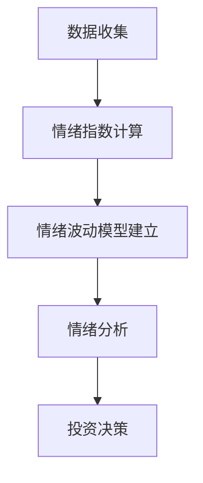

                 

### 第1章 引言

#### 1.1 书籍背景

《格雷厄姆的市场情绪理论：应对算法交易的影响》是一部关于金融市场分析、投资策略以及现代交易技术结合的专著。本书的撰写源于对金融市场中的复杂性和多变的深刻理解，尤其是在算法交易日益普及的背景下，如何利用传统市场理论来应对这一新兴领域成为了一个重要的研究课题。

**格雷厄姆市场情绪理论的起源与发展**

格雷厄姆市场情绪理论的起源可以追溯到20世纪初，由著名投资大师本杰明·格雷厄姆提出。格雷厄姆以其深度和广度的投资智慧被誉为“现代投资之父”，他开创了价值投资的先河。格雷厄姆市场情绪理论的核心思想在于理解市场的情绪波动，并通过分析市场情绪来预测投资行为和市场趋势。

格雷厄姆的市场情绪理论经历了长期的发展和完善，逐渐形成了独特的分析框架。这一理论不仅适用于股票市场，还延伸到债券市场、期货市场和期权市场等多个金融领域。随着计算机技术和大数据分析的进步，格雷厄姆的市场情绪理论得到了进一步的应用和发展。

**算法交易对金融市场的影响**

算法交易是金融科技领域的革命性创新，它利用计算机算法进行高频交易，以毫秒级的速度进行买卖操作，极大地提高了交易的效率和准确性。算法交易的出现改变了传统交易的方式，对金融市场产生了深远的影响。

首先，算法交易极大地提高了市场的流动性。高频交易算法能够快速地处理大量交易请求，使得市场能够更快地达到均衡状态。其次，算法交易降低了交易成本，通过自动化和高效化的操作，减少了人为操作的误差和成本。此外，算法交易还能够捕捉到市场上的微小变化，从而获得高额利润。

然而，算法交易也带来了一些新的挑战。由于算法交易的自动化和高效性，它可能会引发市场波动，甚至导致市场的异常行为。此外，算法交易的高频操作可能会加剧市场的波动性，使得市场变得更加不稳定。

#### 1.2 书籍的写作目的与结构安排

**写作目的**

本书的写作目的是为了探讨格雷厄姆市场情绪理论在应对算法交易中的实际应用，帮助投资者和交易者更好地理解市场情绪的变化，并利用这一理论来制定有效的投资策略。

**结构安排**

本书分为七个章节，结构紧凑、逻辑清晰。每一章节都有明确的目标和内容，具体如下：

- **第1章 引言**：介绍书籍的背景和目的，概述格雷厄姆市场情绪理论的起源与发展，以及算法交易对金融市场的影响。
- **第2章 格雷厄姆市场情绪理论概述**：详细解释市场情绪的定义与特征，格雷厄姆市场情绪理论的原理，以及该理论的历史与发展。
- **第3章 格雷厄姆市场情绪理论的核心概念**：介绍股票市场的基本概念，股票市场的情绪分析，以及格雷厄姆市场情绪理论的核心概念和对比。
- **第4章 格雷厄姆市场情绪理论的应用**：探讨格雷厄姆市场情绪理论在股票投资、期权交易和期货交易中的应用。
- **第5章 算法交易与格雷厄姆市场情绪理论的结合**：分析算法交易的基本原理，探讨格雷厄姆市场情绪理论在算法交易中的应用，以及案例分析。
- **第6章 格雷厄姆市场情绪理论在算法交易中的挑战与机遇**：讨论格雷厄姆市场情绪理论在算法交易中的挑战与机遇，提出应对策略。
- **第7章 总结与展望**：总结格雷厄姆市场情绪理论的重要性，展望其在算法交易中的应用前景，以及未来的发展趋势。

通过以上结构安排，本书旨在为读者提供一部全面、深入的格雷厄姆市场情绪理论与算法交易结合的研究著作，帮助读者在复杂的金融市场中找到有效的投资策略和交易方法。

#### 1.3 阅读对象与预期收获

**阅读对象**

本书的主要读者对象包括：

1. 金融投资者和交易者：希望利用格雷厄姆市场情绪理论来优化投资策略和交易决策的投资者和交易者。
2. 技术分析师和市场研究者：需要了解格雷厄姆市场情绪理论及其在算法交易中的应用的技术分析师和市场研究者。
3. 金融科技从业者和研究人员：对金融科技和算法交易领域感兴趣，希望深入了解格雷厄姆市场情绪理论的金融科技从业者和研究人员。

**预期收获**

通过阅读本书，读者可以预期获得以下收获：

1. **全面理解格雷厄姆市场情绪理论**：了解市场情绪的概念、特征和测量方法，掌握格雷厄姆市场情绪理论的核心原理和应用范围。
2. **掌握算法交易的基本原理**：理解算法交易的定义、基本原理和影响，了解格雷厄姆市场情绪理论在算法交易中的实际应用。
3. **提升投资和交易技能**：通过案例分析，学习如何在实际操作中应用格雷厄姆市场情绪理论，优化投资策略和交易决策。
4. **探索金融科技的前沿领域**：了解算法交易与格雷厄姆市场情绪理论的结合，探讨这一领域的前沿研究方向和应用前景。

总之，本书旨在为读者提供一部全面、深入的研究著作，帮助读者在复杂的金融市场中找到有效的投资策略和交易方法，提升投资和交易的技能和水平。

#### 1.4 内容概述

**格雷厄姆市场情绪理论的核心概念**

格雷厄姆市场情绪理论的核心概念包括市场情绪的定义、特征和测量方法。市场情绪是指市场参与者的心理状态和情绪波动，它影响投资行为和市场趋势。格雷厄姆通过分析市场情绪，提出了情绪分析的基本原理和工具，如情绪指数和情绪波动模型。这些概念为理解市场行为提供了理论基础。

**格雷厄姆市场情绪理论与算法交易的关系**

算法交易是金融科技领域的一项重要创新，它利用计算机算法进行高频交易，以快速响应市场变化。格雷厄姆市场情绪理论与算法交易的关系体现在两个方面：一方面，格雷厄姆市场情绪理论可以用于分析和预测市场情绪，为算法交易提供决策支持；另一方面，算法交易的出现改变了市场环境，对格雷厄姆市场情绪理论的测量和预测提出了新的挑战。

**格雷厄姆市场情绪理论在算法交易中的应用案例**

本书通过具体的应用案例，展示了格雷厄姆市场情绪理论在算法交易中的实际应用。例如，通过情绪指数分析市场情绪，算法交易系统能够识别市场趋势并做出相应的交易决策。此外，本书还探讨了如何利用格雷厄姆市场情绪理论来优化算法交易策略，提高交易效率和收益。

**结论与展望**

本书总结了格雷厄姆市场情绪理论的核心概念和应用，探讨了其在算法交易中的重要作用和挑战。同时，本书也对未来的发展趋势进行了展望，提出了进一步研究和应用的方向。通过本书，读者可以更好地理解格雷厄姆市场情绪理论的本质，掌握其在算法交易中的应用，为投资和交易提供有效的理论支持和实践指导。

### 第2章 格雷厄姆市场情绪理论概述

#### 2.1 市场情绪的定义与特征

市场情绪是指市场参与者的心理状态和情绪波动，它在很大程度上影响投资行为和市场趋势。市场情绪并不是一个单一的概念，而是由多种情绪因素组成的复合体。这些情绪因素包括乐观、悲观、贪婪、恐惧、希望、失望等，它们在不同的市场环境下表现出不同的特征和强度。

**市场情绪的定义**

市场情绪可以定义为市场中投资者群体在特定时期内的心理状态和情绪波动。这种心理状态和情绪波动不仅反映了投资者对市场前景的预期，还反映了他们的风险偏好和决策行为。市场情绪是一种心理现象，它通过市场数据和行为表现来体现。

**市场情绪的特征**

1. **易变性**：市场情绪具有高度的易变性，它可以在短时间内发生显著的变化。这种变化受到多种因素的影响，如经济数据、政策变动、突发事件等。
   
2. **传染性**：市场情绪具有传染性，一个市场参与者的情绪波动可以迅速传递给其他参与者，影响整个市场的情绪状态。这种现象在股市、汇市等市场中尤为明显。

3. **非理性**：市场情绪往往表现出非理性的特征。在极端情况下，市场情绪可能导致投资者做出不理性的决策，从而引发市场波动。

4. **可测量性**：尽管市场情绪是非理性的，但通过各种量化工具和方法，如情绪指数、波动率指数等，可以对市场情绪进行测量和评估。

**市场情绪与投资行为的关系**

市场情绪与投资行为之间存在密切的关系。市场情绪可以影响投资者的决策，进而影响投资行为和市场趋势。具体来说：

1. **乐观情绪**：在乐观的市场情绪下，投资者往往对市场前景持积极态度，愿意承担更高的风险，从而推动市场上涨。

2. **悲观情绪**：在悲观的市场情绪下，投资者对市场前景持悲观态度，风险偏好降低，市场可能会出现下跌。

3. **贪婪与恐惧**：贪婪和恐惧是市场情绪中常见的非理性因素。在贪婪情绪主导下，投资者可能会过度追涨，从而推高市场价格；而在恐惧情绪主导下，投资者可能会过度抛售，导致市场价格下跌。

4. **群体行为**：市场情绪的传染性使得投资者群体行为变得重要。当大多数投资者持有相同的观点时，这种观点可能会成为市场的主导力量，影响市场走势。

通过理解市场情绪的定义、特征以及与投资行为的关系，投资者可以更好地把握市场动态，制定合理的投资策略，提高投资回报。

#### 2.2 格雷厄姆市场情绪理论的原理

**格雷厄姆市场情绪理论的核心思想**

格雷厄姆市场情绪理论的核心思想在于通过分析市场情绪来预测投资行为和市场趋势。该理论认为，市场情绪是影响投资决策的重要因素，通过理解和分析市场情绪，投资者可以更准确地把握市场动态，制定有效的投资策略。

**格雷厄姆市场情绪理论的基本原理**

格雷厄姆市场情绪理论的基本原理包括以下几个方面：

1. **情绪波动模型**：格雷厄姆提出了一种情绪波动模型，该模型描述了市场情绪的波动规律。根据这一模型，市场情绪的波动具有周期性，通常包括乐观、悲观、恐慌等阶段。

2. **情绪指数**：格雷厄姆提出了情绪指数，这是一种用于衡量市场情绪的量化工具。情绪指数通过对市场数据进行分析，反映市场情绪的强度和变化趋势。

3. **情绪分析工具**：格雷厄姆还提出了一系列情绪分析工具，如情绪波动曲线、情绪指数分布等，这些工具可以帮助投资者更好地理解市场情绪的动态变化。

**格雷厄姆市场情绪理论的适用范围**

格雷厄姆市场情绪理论适用于多种金融市场，包括股票市场、债券市场、期货市场和期权市场等。该理论不仅适用于传统的市场环境，也适用于现代的算法交易市场。在算法交易中，格雷厄姆市场情绪理论可以通过分析高频数据来预测市场趋势，为交易策略提供支持。

**格雷厄姆市场情绪理论的历史与发展**

格雷厄姆市场情绪理论的起源可以追溯到20世纪初，由著名投资大师本杰明·格雷厄姆提出。格雷厄姆以其深度和广度的投资智慧被誉为“现代投资之父”，他开创了价值投资的先河。格雷厄姆市场情绪理论在其长期的发展过程中，逐渐形成了独特的分析框架，并被广泛运用在金融市场中。

在20世纪中期，随着计算机技术和大数据分析的发展，格雷厄姆市场情绪理论得到了进一步的应用和发展。研究人员通过计算机算法对大量市场数据进行分析，提高了情绪指数的准确性和预测能力。

进入21世纪，随着算法交易的普及，格雷厄姆市场情绪理论在算法交易中的应用也日益重要。现代交易技术利用高频数据和复杂的算法，可以更快速、准确地分析市场情绪，为交易策略提供支持。

**格雷厄姆市场情绪理论与其他市场理论的比较**

格雷厄姆市场情绪理论与其他市场理论，如技术分析、基本面分析和行为金融学等，存在一定的区别和联系。

1. **与技术分析的比较**：技术分析主要关注市场数据的走势和形态，通过图表和指标来预测市场趋势。格雷厄姆市场情绪理论则更加关注市场参与者的情绪波动，通过分析情绪指数和情绪分析工具来预测市场行为。尽管两者都关注市场趋势，但格雷厄姆市场情绪理论更注重心理层面的分析。

2. **与基本面分析的比较**：基本面分析主要关注宏观经济数据、公司财务状况等基本面因素，通过分析这些因素来预测市场趋势。格雷厄姆市场情绪理论则更侧重于投资者的心理状态和情绪波动，认为市场情绪是影响投资行为的重要因素。

3. **与行为金融学的比较**：行为金融学是研究投资者行为和市场结果的交叉学科，重点关注市场中的心理和认知因素。格雷厄姆市场情绪理论是行为金融学的一个分支，专门研究市场情绪对投资行为和市场趋势的影响。

通过比较可以看出，格雷厄姆市场情绪理论与其他市场理论各有侧重，但它们在金融市场分析中都有重要的应用价值。

**本章小结**

本章介绍了格雷厄姆市场情绪理论的基本原理和适用范围，探讨了市场情绪的定义、特征以及与投资行为的关系。通过了解格雷厄姆市场情绪理论，读者可以更好地理解市场情绪的作用，并在投资和交易中运用这一理论，提高决策的准确性和效率。下一章将深入探讨格雷厄姆市场情绪理论的核心概念，包括股票市场的基本概念、股票市场的情绪分析，以及格雷厄姆市场情绪理论的核心概念和对比。

### 第3章 格雷厄姆市场情绪理论的核心概念

#### 3.1 股票市场的基本概念

**股票市场的定义**

股票市场，亦称证券市场，是指买卖股票及其他证券的场所。它是一个由买卖双方共同参与的金融市场，旨在为投资者提供投资机会，同时也为企业筹集资金。股票市场通常由两个主要部分组成：主板市场和创业板市场。主板市场主要面向大型、成熟企业，而创业板市场则侧重于为中小型企业和新兴企业提供融资平台。

**股票市场的组成**

股票市场的组成主要包括以下几个部分：

1. **上市公司**：上市公司是指那些在股票市场公开发行的股票，并符合相关法律法规要求的公司。这些公司通过发行股票来筹集资金，用于企业发展、并购等。

2. **投资者**：投资者是股票市场的主体，包括个人投资者和专业投资者。个人投资者通常通过证券公司进行股票买卖，而专业投资者则包括基金、保险公司、投资银行等机构。

3. **交易所**：交易所是股票市场的核心机构，负责提供交易的平台和规则。全球主要的股票交易所包括纽约证券交易所（NYSE）、纳斯达克（NASDAQ）、伦敦证券交易所（LSE）等。

4. **中介机构**：中介机构包括证券公司、投资银行、基金管理等，它们在股票市场中扮演着重要角色，提供交易、投资咨询、风险管理等服务。

**股票市场的功能**

股票市场的主要功能包括以下几个方面：

1. **融资功能**：股票市场为企业提供融资渠道，通过发行股票筹集资金，用于扩大生产、研发新产品等。

2. **投资功能**：投资者可以通过购买股票进行投资，获得资本增值和股息收益。

3. **定价功能**：股票市场的交易活动为股票提供了市场价格，反映了市场对上市公司价值的评估。

4. **风险分散**：股票市场提供了多样化的投资选择，投资者可以通过分散投资来降低投资风险。

**股票市场的情绪分析**

**股票市场情绪的概念**

股票市场情绪是指市场参与者（如投资者、交易员等）在特定时期内对市场前景的整体心理状态和情绪波动。这种情绪状态通常通过市场行为（如交易量、价格波动、投资者行为等）反映出来。

**股票市场情绪的类型**

股票市场情绪可以分为以下几种类型：

1. **乐观情绪**：投资者对市场前景持积极态度，预期市场将上涨，愿意承担更高的风险。

2. **悲观情绪**：投资者对市场前景持悲观态度，预期市场将下跌，风险偏好降低。

3. **贪婪情绪**：投资者在市场上涨时，过度追求收益，忽略风险，甚至进行投机行为。

4. **恐惧情绪**：投资者在市场下跌时，过度担忧亏损，甚至恐慌性抛售。

**股票市场情绪的测量方法**

测量股票市场情绪的方法主要包括以下几种：

1. **情绪指数**：情绪指数是通过分析市场数据（如交易量、价格波动、投资者行为等）计算得出的情绪指标。常见的情绪指数包括恐慌与贪婪指数（VIX）、市场情绪指数（MI）等。

2. **情绪波动模型**：情绪波动模型通过建立数学模型，分析市场情绪的波动规律，预测市场情绪的变化趋势。

3. **情绪分析工具**：情绪分析工具包括情绪分析软件、情绪分析算法等，通过文本分析、数据挖掘等方法，从市场数据中提取情绪信息。

通过分析股票市场的情绪，投资者可以更好地理解市场心理状态，制定合理的投资策略。下一章将深入探讨格雷厄姆市场情绪理论的核心概念，包括格雷厄姆市场情绪理论的定义、构成要素及其逻辑关系。

#### 3.2 格雷厄姆市场情绪理论的核心概念

**格雷厄姆市场情绪理论的定义**

格雷厄姆市场情绪理论是一种通过分析市场参与者的情绪波动来预测市场行为和投资趋势的方法。它由著名投资大师本杰明·格雷厄姆在20世纪初提出，并经过长期的发展和完善，形成了独特的分析框架。格雷厄姆市场情绪理论的核心思想在于理解市场情绪的变化规律，并通过这些规律来指导投资决策。

**格雷厄姆市场情绪理论的构成要素**

格雷厄姆市场情绪理论主要由以下几个核心概念和工具构成：

1. **情绪指数**：情绪指数是衡量市场情绪的量化工具，通过分析市场数据（如交易量、价格波动、投资者行为等）来计算得出。常见的情绪指数包括恐慌与贪婪指数（VIX）、市场情绪指数（MI）等。情绪指数的波动反映了市场情绪的变化趋势。

2. **情绪波动模型**：情绪波动模型是一种数学模型，用于描述市场情绪的波动规律。通过建立情绪波动模型，可以预测市场情绪的变化趋势，从而指导投资决策。

3. **情绪分析工具**：情绪分析工具包括情绪分析软件、情绪分析算法等，通过文本分析、数据挖掘等方法，从市场数据中提取情绪信息。这些工具可以帮助投资者更好地理解市场情绪的动态变化。

**格雷厄姆市场情绪理论的逻辑关系**

格雷厄姆市场情绪理论的逻辑关系可以概括为以下几个步骤：

1. **数据收集**：首先，收集市场数据，包括交易量、价格波动、投资者行为等。这些数据是分析市场情绪的基础。

2. **情绪指数计算**：通过市场数据计算情绪指数，如恐慌与贪婪指数（VIX）、市场情绪指数（MI）等。情绪指数的波动反映了市场情绪的变化趋势。

3. **情绪波动模型建立**：建立情绪波动模型，用于描述市场情绪的波动规律。情绪波动模型可以帮助预测市场情绪的变化趋势。

4. **情绪分析**：利用情绪分析工具，从市场数据中提取情绪信息，包括投资者情绪的乐观程度、恐惧程度等。

5. **投资决策**：根据情绪指数和情绪波动模型的预测结果，结合市场情况，制定投资策略。例如，在市场情绪乐观时，可以增加股票配置，而在市场情绪悲观时，可以增加债券或现金等相对安全的资产配置。

**核心概念属性特征对比表格**

以下是格雷厄姆市场情绪理论中几个核心概念属性特征的对比表格：

| 概念       | 定义                     | 特征                                       |
|------------|--------------------------|------------------------------------------|
| 情绪指数   | 衡量市场情绪的量化工具   | 易变性、传染性、非理性、可测量性               |
| 情绪波动模型 | 描述市场情绪波动规律的模型 | 周期性、预测性、适应性                       |
| 情绪分析工具 | 提取情绪信息的工具       | 自动化、高效性、准确性                       |

**格雷厄姆市场情绪理论的ER实体关系图架构**

为了更好地理解格雷厄姆市场情绪理论的构成要素及其逻辑关系，以下是ER（实体关系）图架构的Mermaid流程图：



在这个ER实体关系图中，数据收集是情绪指数计算的基础，情绪指数计算是情绪波动模型建立的输入，情绪波动模型建立是情绪分析的前提，情绪分析的结果又用于投资决策。

通过以上核心概念的介绍和逻辑关系的分析，我们可以更好地理解格雷厄姆市场情绪理论的构成和运作机制。下一章将探讨格雷厄姆市场情绪理论的核心概念与其他市场理论的对比，以及其在不同市场环境中的应用。

#### 3.3 格雷厄姆市场情绪理论的核心概念对比

**格雷厄姆市场情绪理论与传统市场理论的对比**

格雷厄姆市场情绪理论与传统市场理论，如技术分析和基本面分析，在分析方法和理论基础上有显著的区别。

1. **技术分析**：技术分析主要关注市场数据的走势和形态，通过图表、指标等工具来预测市场趋势。技术分析认为市场行为包含一切信息，通过历史数据可以预测未来走势。格雷厄姆市场情绪理论则更加关注市场参与者的情绪波动，通过分析情绪指数和情绪分析工具来预测市场行为。尽管两者都关注市场趋势，但格雷厄姆市场情绪理论更注重心理层面的分析。

2. **基本面分析**：基本面分析主要关注宏观经济数据、公司财务状况等基本面因素，通过分析这些因素来预测市场趋势。基本面分析认为，市场价格的变动取决于基本面因素的变化。格雷厄姆市场情绪理论则更侧重于投资者的心理状态和情绪波动，认为市场情绪是影响投资行为的重要因素。

**格雷厄姆市场情绪理论与现代市场理论的对比**

现代市场理论包括行为金融学等，它们从不同角度研究市场行为和投资者心理。

1. **行为金融学**：行为金融学是研究投资者行为和市场结果的交叉学科，重点关注市场中的心理和认知因素。行为金融学认为，投资者在决策过程中受到心理和认知偏差的影响，这可能导致市场出现非理性行为。格雷厄姆市场情绪理论是行为金融学的一个分支，专门研究市场情绪对投资行为和市场趋势的影响。

2. **有效市场假说**：有效市场假说认为，市场是信息有效的，所有相关信息都已经被充分反映在市场价格中。格雷厄姆市场情绪理论则认为，市场并非总是有效的，市场情绪的变化会导致价格的过度反应或低估，从而提供投资机会。

**格雷厄姆市场情绪理论与其他市场情绪理论的对比**

除了格雷厄姆市场情绪理论，其他市场情绪理论，如心理分析理论和情感分析理论，也有其独特的方法和视角。

1. **心理分析理论**：心理分析理论认为，市场情绪的波动与个体的心理状态密切相关。通过分析投资者的心理动机和情绪变化，可以预测市场行为。格雷厄姆市场情绪理论虽然也关注投资者心理，但更侧重于情绪的量化和模型化。

2. **情感分析理论**：情感分析理论通过分析文本、语言和语音等情感表达，来衡量市场情绪。情感分析理论通常使用自然语言处理技术，而格雷厄姆市场情绪理论则更多依赖于市场数据和情绪指数。

通过对比可以看出，格雷厄姆市场情绪理论具有以下优势：

1. **量化分析**：格雷厄姆市场情绪理论通过情绪指数和情绪波动模型，对市场情绪进行量化分析，提高了分析的准确性和可操作性。

2. **综合视角**：格雷厄姆市场情绪理论结合了基本面分析和技术分析的优点，同时关注市场情绪和心理因素，提供了一种全面的分析框架。

3. **应用广泛**：格雷厄姆市场情绪理论不仅适用于股票市场，还可以应用于债券市场、期货市场和期权市场等多种金融市场。

总之，格雷厄姆市场情绪理论在传统市场理论、现代市场理论和其他市场情绪理论中具有独特的地位和作用。通过对比分析，我们可以更好地理解格雷厄姆市场情绪理论的本质和优势，为投资者提供更有效的市场分析和投资策略。

#### 3.4 格雷厄姆市场情绪理论在股票投资中的应用

**格雷厄姆市场情绪理论在股票投资中的应用原理**

格雷厄姆市场情绪理论在股票投资中的应用，主要基于对市场情绪的理解和分析。通过分析市场情绪，投资者可以更好地把握市场趋势，从而制定出更有效的投资策略。以下是格雷厄姆市场情绪理论在股票投资中的应用原理：

1. **情绪指数分析**：情绪指数是衡量市场情绪的量化工具，通过计算市场情绪指数，投资者可以了解当前市场情绪的强度和变化趋势。例如，恐慌与贪婪指数（VIX）是常用的情绪指数之一，它反映了市场恐慌情绪的程度。当VIX指数较高时，市场情绪较为恐慌，可能是一个买入机会；当VIX指数较低时，市场情绪较为乐观，可能是一个卖出机会。

2. **情绪波动模型**：情绪波动模型用于描述市场情绪的波动规律，帮助投资者预测市场情绪的变化趋势。通过情绪波动模型，投资者可以识别市场情绪的周期性变化，从而制定相应的投资策略。例如，在市场情绪乐观的阶段，投资者可以增加股票配置，而在市场情绪悲观阶段，投资者可以增加债券或现金等相对安全的资产配置。

3. **情绪分析工具**：情绪分析工具通过文本分析、数据挖掘等方法，从市场数据中提取情绪信息。这些工具可以帮助投资者更好地理解市场情绪的动态变化，从而做出更准确的投资决策。

**格雷厄姆市场情绪理论在股票投资中的应用步骤**

1. **数据收集**：首先，收集市场数据，包括交易量、价格波动、投资者行为等。这些数据是分析市场情绪的基础。

2. **情绪指数计算**：通过市场数据计算情绪指数，如恐慌与贪婪指数（VIX）、市场情绪指数（MI）等。情绪指数的波动反映了市场情绪的变化趋势。

3. **情绪波动模型建立**：建立情绪波动模型，用于描述市场情绪的波动规律。情绪波动模型可以帮助预测市场情绪的变化趋势。

4. **情绪分析**：利用情绪分析工具，从市场数据中提取情绪信息，包括投资者情绪的乐观程度、恐惧程度等。

5. **投资决策**：根据情绪指数和情绪波动模型的预测结果，结合市场情况，制定投资策略。例如，在市场情绪乐观时，可以增加股票配置，而在市场情绪悲观时，可以增加债券或现金等相对安全的资产配置。

**案例分析**

以下是一个具体的案例，展示了如何利用格雷厄姆市场情绪理论在股票投资中进行决策：

**案例背景**：某投资者观察到市场情绪指数（MI）持续下降，表明市场情绪较为悲观。同时，情绪波动模型预测市场情绪将继续恶化。

**分析过程**：
1. 数据收集：收集近期市场交易量、价格波动、投资者行为等数据。
2. 情绪指数计算：计算市场情绪指数（MI），发现其处于较低水平。
3. 情绪波动模型建立：建立情绪波动模型，预测市场情绪将继续恶化。
4. 情绪分析：分析投资者情绪，发现大部分投资者对市场前景持悲观态度。
5. 投资决策：根据情绪指数和情绪波动模型的预测结果，投资者决定减少股票配置，增加债券和现金等相对安全的资产配置。

**决策结果**：经过一段时间的观察，市场确实出现了下跌，投资者通过降低股票配置，避免了大部分损失，同时获得了相对稳定的收益。

**总结**

格雷厄姆市场情绪理论在股票投资中的应用，通过分析市场情绪的波动规律，为投资者提供了有效的决策支持。投资者可以通过情绪指数、情绪波动模型和情绪分析工具，更好地把握市场趋势，制定合理的投资策略。当然，市场情绪的变化是复杂和多变的，投资者在实际操作中需要灵活应对，结合其他分析方法和市场信息，做出综合判断。

#### 3.5 格雷厄姆市场情绪理论在期权交易中的应用

**格雷厄姆市场情绪理论在期权交易中的应用原理**

格雷厄姆市场情绪理论在期权交易中的应用，主要基于对市场情绪的深度理解和分析。期权交易是一种复杂的金融衍生品交易，涉及对市场价格波动和风险的管理。格雷厄姆市场情绪理论通过分析市场情绪，为投资者提供了有效的工具来预测期权价格的变动，从而制定出更优化的交易策略。

1. **情绪指数分析**：期权价格受到市场情绪的显著影响。通过计算和监控市场情绪指数，如恐慌与贪婪指数（VIX），投资者可以了解市场情绪的变化趋势。例如，当市场情绪指数较高时，表明市场情绪较为恐慌，期权价格可能升高；而当市场情绪指数较低时，表明市场情绪较为乐观，期权价格可能下降。

2. **情绪波动模型**：情绪波动模型用于描述市场情绪的波动规律，帮助投资者预测市场情绪的变化趋势。期权价格的波动与市场情绪的变化密切相关，通过情绪波动模型，投资者可以预测期权价格的波动方向和幅度。

3. **情绪分析工具**：情绪分析工具通过文本分析、数据挖掘等方法，从市场数据中提取情绪信息。这些工具可以帮助投资者更好地理解市场情绪的动态变化，从而做出更准确的期权交易决策。

**格雷厄姆市场情绪理论在期权交易中的应用步骤**

1. **数据收集**：首先，收集市场数据，包括交易量、价格波动、投资者行为等。这些数据是分析市场情绪的基础。

2. **情绪指数计算**：通过市场数据计算情绪指数，如恐慌与贪婪指数（VIX）、市场情绪指数（MI）等。情绪指数的波动反映了市场情绪的变化趋势。

3. **情绪波动模型建立**：建立情绪波动模型，用于描述市场情绪的波动规律。情绪波动模型可以帮助预测市场情绪的变化趋势。

4. **情绪分析**：利用情绪分析工具，从市场数据中提取情绪信息，包括投资者情绪的乐观程度、恐惧程度等。

5. **期权交易决策**：根据情绪指数和情绪波动模型的预测结果，结合期权价格和波动率，制定期权交易策略。例如，在市场情绪乐观时，可以购买看涨期权；在市场情绪悲观时，可以购买看跌期权。

**案例分析**

以下是一个具体的案例，展示了如何利用格雷厄姆市场情绪理论在期权交易中进行决策：

**案例背景**：某投资者观察到市场情绪指数（MI）持续上升，表明市场情绪较为乐观。同时，情绪波动模型预测市场情绪将继续上升。

**分析过程**：
1. 数据收集：收集近期市场交易量、价格波动、投资者行为等数据。
2. 情绪指数计算：计算市场情绪指数（MI），发现其处于较高水平。
3. 情绪波动模型建立：建立情绪波动模型，预测市场情绪将继续上升。
4. 情绪分析：分析投资者情绪，发现大部分投资者对市场前景持乐观态度。
5. 期权交易决策：根据情绪指数和情绪波动模型的预测结果，投资者决定购买看涨期权。

**决策结果**：经过一段时间的观察，市场确实出现了上涨，投资者通过购买看涨期权，获得了较高的收益。

**总结**

格雷厄姆市场情绪理论在期权交易中的应用，通过分析市场情绪的波动规律，为投资者提供了有效的工具来预测期权价格的变动。投资者可以通过情绪指数、情绪波动模型和情绪分析工具，更好地把握市场趋势，制定出更优化的期权交易策略。当然，期权交易具有高风险性，投资者在实际操作中需要结合其他分析方法和市场信息，谨慎决策。

#### 3.6 格雷厄姆市场情绪理论在期货交易中的应用

**格雷厄姆市场情绪理论在期货交易中的应用原理**

格雷厄姆市场情绪理论在期货交易中的应用，同样基于对市场情绪的深度理解和分析。期货交易是一种高度杠杆化的金融交易，市场价格波动较大，因此对市场情绪的敏感度较高。格雷厄姆市场情绪理论通过分析市场情绪，为期货交易者提供了有效的工具来预测市场价格的变化，从而制定出更科学的交易策略。

1. **情绪指数分析**：情绪指数是衡量市场情绪的量化工具，通过计算市场情绪指数，交易者可以了解当前市场情绪的强度和变化趋势。例如，恐慌与贪婪指数（VIX）可以反映市场恐慌情绪的程度。当市场情绪指数较高时，表明市场情绪较为恐慌，期货价格可能下跌；而当市场情绪指数较低时，表明市场情绪较为乐观，期货价格可能上涨。

2. **情绪波动模型**：情绪波动模型用于描述市场情绪的波动规律，帮助交易者预测市场情绪的变化趋势。期货市场的情绪波动具有周期性，通过情绪波动模型，交易者可以识别市场情绪的周期性变化，从而预测期货价格的趋势。

3. **情绪分析工具**：情绪分析工具通过文本分析、数据挖掘等方法，从市场数据中提取情绪信息。这些工具可以帮助交易者更好地理解市场情绪的动态变化，从而做出更准确的交易决策。

**格雷厄姆市场情绪理论在期货交易中的应用步骤**

1. **数据收集**：首先，收集市场数据，包括交易量、价格波动、投资者行为等。这些数据是分析市场情绪的基础。

2. **情绪指数计算**：通过市场数据计算情绪指数，如恐慌与贪婪指数（VIX）、市场情绪指数（MI）等。情绪指数的波动反映了市场情绪的变化趋势。

3. **情绪波动模型建立**：建立情绪波动模型，用于描述市场情绪的波动规律。情绪波动模型可以帮助预测市场情绪的变化趋势。

4. **情绪分析**：利用情绪分析工具，从市场数据中提取情绪信息，包括投资者情绪的乐观程度、恐惧程度等。

5. **期货交易决策**：根据情绪指数和情绪波动模型的预测结果，结合期货市场价格和波动率，制定期货交易策略。例如，在市场情绪乐观时，可以买入期货合约；在市场情绪悲观时，可以卖出期货合约。

**案例分析**

以下是一个具体的案例，展示了如何利用格雷厄姆市场情绪理论在期货交易中进行决策：

**案例背景**：某交易者观察到市场情绪指数（MI）持续上升，表明市场情绪较为乐观。同时，情绪波动模型预测市场情绪将继续上升。

**分析过程**：
1. 数据收集：收集近期市场交易量、价格波动、投资者行为等数据。
2. 情绪指数计算：计算市场情绪指数（MI），发现其处于较高水平。
3. 情绪波动模型建立：建立情绪波动模型，预测市场情绪将继续上升。
4. 情绪分析：分析投资者情绪，发现大部分投资者对市场前景持乐观态度。
5. 期货交易决策：根据情绪指数和情绪波动模型的预测结果，交易者决定买入期货合约。

**决策结果**：经过一段时间的观察，市场确实出现了上涨，交易者通过买入期货合约，获得了较高的收益。

**总结**

格雷厄姆市场情绪理论在期货交易中的应用，通过分析市场情绪的波动规律，为交易者提供了有效的工具来预测期货市场价格的变化。交易者可以通过情绪指数、情绪波动模型和情绪分析工具，更好地把握市场趋势，制定出更科学的期货交易策略。当然，期货交易具有高风险性，交易者在实际操作中需要结合其他分析方法和市场信息，谨慎决策。

#### 3.7 本章小结

本章详细探讨了格雷厄姆市场情绪理论在股票投资、期权交易和期货交易中的应用。首先，介绍了股票市场的基本概念和情绪分析，阐述了如何利用格雷厄姆市场情绪理论在股票市场中进行投资决策。接着，探讨了格雷厄姆市场情绪理论在期权交易中的应用原理和步骤，通过情绪指数和情绪波动模型，帮助投资者预测期权价格的变动。最后，分析了格雷厄姆市场情绪理论在期货交易中的应用，提供了期货交易决策的具体步骤和案例分析。

通过本章的学习，读者可以了解到格雷厄姆市场情绪理论在多种金融市场中的实际应用，掌握如何通过分析市场情绪来优化投资策略和交易决策。然而，市场情绪的变化是复杂和多变的，投资者在实际操作中需要灵活应对，结合其他分析方法和市场信息，做出综合判断。未来，格雷厄姆市场情绪理论将继续在金融市场中发挥重要作用，为投资者提供更有效的市场分析和投资策略。

### 第4章 算法交易与格雷厄姆市场情绪理论的结合

#### 4.1 算法交易的基本原理

**算法交易的定义**

算法交易，也称为量化交易，是指利用计算机算法自动执行交易决策的过程。它通过预设的数学模型和策略，对市场数据进行分析和处理，以快速、高效地执行交易。算法交易的核心是利用技术分析、统计分析等方法，发现市场中的交易机会，并通过自动化系统执行交易指令。

**算法交易的发展历程**

算法交易的发展历程可以追溯到20世纪90年代。最初，算法交易主要用于高频交易，通过高速计算机和专用网络，以毫秒级的速度进行交易。随着计算机技术和网络技术的发展，算法交易逐渐从高频交易扩展到低频交易，包括市场做市、指数套利、事件驱动等多种交易策略。

**算法交易的主要策略**

1. **市场做市**：市场做市策略是指交易者作为市场提供者，同时提供买入和卖出报价，以维持市场流动性。通过市场做市，交易者可以在市场波动中获取稳定的利润。

2. **指数套利**：指数套利策略是指通过买入低估的指数成分股，同时卖出高估的指数成分股，从指数波动中获取利润。这种策略依赖于对指数成分股的估值分析和市场波动预测。

3. **事件驱动**：事件驱动策略是指利用市场中的特定事件，如公司并购、财报发布等，进行交易。通过分析事件对市场的影响，交易者可以提前布局，获得超额收益。

**算法交易的优势**

算法交易具有以下优势：

1. **速度与效率**：算法交易利用计算机的高速运算能力，可以在短时间内处理大量数据，执行大量交易指令，提高交易效率。

2. **精度与稳定性**：通过预设的数学模型和策略，算法交易可以减少人为因素的干扰，提高决策的精度和稳定性。

3. **自动化与可扩展性**：算法交易系统具有高度的自动化和可扩展性，可以通过编程语言轻松实现和调整交易策略，适应不同的市场环境和需求。

**算法交易与格雷厄姆市场情绪理论的结合**

算法交易与格雷厄姆市场情绪理论的结合，主要体现在以下几个方面：

1. **市场情绪分析**：算法交易系统可以通过分析市场情绪数据，如恐慌与贪婪指数（VIX）、市场情绪指数（MI）等，了解市场情绪的变化趋势。这有助于交易者制定更准确的市场预测和交易策略。

2. **情绪波动模型**：算法交易系统可以利用格雷厄姆市场情绪理论中的情绪波动模型，预测市场情绪的变化规律，从而优化交易策略。例如，在市场情绪乐观时，可以增加买入策略；在市场情绪悲观时，可以增加卖出策略。

3. **自动化交易执行**：格雷厄姆市场情绪理论中的情绪指数和情绪波动模型，可以用于算法交易系统的自动执行。通过预设的交易策略和情绪分析结果，算法交易系统可以在合适的时间点自动执行买入或卖出操作。

4. **风险管理**：格雷厄姆市场情绪理论中的情绪分析工具，可以帮助交易者更好地理解市场风险，制定有效的风险管理策略。例如，在市场情绪恐慌时，可以适当降低仓位，减少风险。

**案例分析**

以下是一个具体的案例分析，展示了算法交易与格雷厄姆市场情绪理论的结合：

**案例背景**：某交易者利用算法交易系统进行股票交易，并采用了格雷厄姆市场情绪理论中的情绪指数和情绪波动模型。

**分析过程**：
1. 数据收集：收集市场情绪指数（MI）和恐慌与贪婪指数（VIX）等数据。
2. 情绪指数计算：计算市场情绪指数（MI），发现其处于较高水平。
3. 情绪波动模型建立：建立情绪波动模型，预测市场情绪将继续上升。
4. 交易决策：根据情绪指数和情绪波动模型的预测结果，交易者决定增加股票买入策略。

**决策结果**：经过一段时间的观察，市场确实出现了上涨，交易者通过增加股票买入策略，获得了较高的收益。

**总结**

算法交易与格雷厄姆市场情绪理论的结合，为交易者提供了一种更科学、更高效的交易策略。通过分析市场情绪和情绪波动模型，交易者可以更好地预测市场趋势，制定有效的交易决策。然而，算法交易和格雷厄姆市场情绪理论的结合也存在一定的挑战，如市场数据的准确性和情绪分析模型的适应性等。未来，随着技术的进步和市场的变化，算法交易与格雷厄姆市场情绪理论的结合将继续发展，为交易者提供更强大的市场分析和交易能力。

### 4.2 格雷厄姆市场情绪理论在算法交易中的应用

**格雷厄姆市场情绪理论在算法交易中的应用原理**

格雷厄姆市场情绪理论在算法交易中的应用，主要基于对市场情绪的深度分析和理解。通过利用情绪指数、情绪波动模型和情绪分析工具，算法交易系统可以更准确地预测市场趋势和投资行为，从而优化交易决策。

1. **情绪指数应用**：情绪指数是衡量市场情绪的重要工具。算法交易系统可以通过计算和监控情绪指数，如恐慌与贪婪指数（VIX）、市场情绪指数（MI）等，了解当前市场情绪的强度和变化趋势。这些情绪指数的波动可以反映出市场情绪的恐慌程度、乐观程度等，为交易决策提供重要依据。

2. **情绪波动模型应用**：情绪波动模型用于描述市场情绪的波动规律。算法交易系统可以通过建立情绪波动模型，预测市场情绪的变化趋势。例如，当市场情绪指数较高时，可能预示着市场将进入恐慌状态，交易系统可以提前布局避险策略；当市场情绪指数较低时，可能预示着市场将进入乐观状态，交易系统可以增加买入策略。

3. **情绪分析工具应用**：情绪分析工具通过文本分析、数据挖掘等方法，从市场数据中提取情绪信息。算法交易系统可以利用这些工具，更全面地理解市场情绪的动态变化。例如，通过分析社交媒体上的投资者评论、新闻媒体的内容等，算法交易系统可以识别市场情绪的波动趋势，为交易决策提供辅助。

**格雷厄姆市场情绪理论在算法交易中的应用步骤**

1. **数据收集**：首先，收集市场数据，包括交易量、价格波动、投资者行为等。这些数据是分析市场情绪的基础。

2. **情绪指数计算**：通过市场数据计算情绪指数，如恐慌与贪婪指数（VIX）、市场情绪指数（MI）等。情绪指数的波动反映了市场情绪的变化趋势。

3. **情绪波动模型建立**：建立情绪波动模型，用于描述市场情绪的波动规律。情绪波动模型可以帮助预测市场情绪的变化趋势。

4. **情绪分析**：利用情绪分析工具，从市场数据中提取情绪信息，包括投资者情绪的乐观程度、恐惧程度等。

5. **交易决策**：根据情绪指数、情绪波动模型和情绪分析结果，结合市场情况和交易策略，制定具体的交易决策。例如，在市场情绪乐观时，可以增加买入策略；在市场情绪悲观时，可以增加卖出策略。

**案例分析**

以下是一个具体的案例分析，展示了如何利用格雷厄姆市场情绪理论在算法交易中进行决策：

**案例背景**：某算法交易系统观察到市场情绪指数（MI）持续上升，表明市场情绪较为乐观。同时，情绪波动模型预测市场情绪将继续上升。

**分析过程**：
1. 数据收集：收集近期市场交易量、价格波动、投资者行为等数据。
2. 情绪指数计算：计算市场情绪指数（MI），发现其处于较高水平。
3. 情绪波动模型建立：建立情绪波动模型，预测市场情绪将继续上升。
4. 情绪分析：分析投资者情绪，发现大部分投资者对市场前景持乐观态度。
5. 交易决策：根据情绪指数和情绪波动模型的预测结果，交易系统决定增加买入策略。

**决策结果**：经过一段时间的观察，市场确实出现了上涨，交易系统通过增加买入策略，获得了较高的收益。

**总结**

格雷厄姆市场情绪理论在算法交易中的应用，通过情绪指数、情绪波动模型和情绪分析工具，为交易系统提供了有效的市场分析和预测工具。通过结合格雷厄姆市场情绪理论，算法交易系统可以更准确地预测市场趋势，制定更优化的交易策略。然而，市场情绪的变化是复杂和多变的，算法交易系统在实际应用中需要不断调整和优化情绪分析模型，以应对市场的变化。未来，随着技术的进步和市场的成熟，格雷厄姆市场情绪理论在算法交易中的应用前景将更加广阔。

#### 4.3 格雷厄姆市场情绪理论与算法交易的结合案例分析

**案例一：利用格雷厄姆市场情绪理论进行股票投资**

**案例背景**：某投资者通过算法交易系统进行股票投资，并利用格雷厄姆市场情绪理论来指导交易决策。

**分析过程**：
1. **数据收集**：收集市场情绪指数（如恐慌与贪婪指数VIX）和股票价格、交易量等数据。
2. **情绪指数计算**：通过历史数据计算恐慌与贪婪指数，分析市场情绪波动。
3. **情绪波动模型建立**：利用机器学习算法建立情绪波动模型，预测未来市场情绪的变化趋势。
4. **情绪分析**：通过情绪分析工具，如社交媒体情绪分析，了解投资者对市场的情绪反应。
5. **交易决策**：根据情绪波动模型的预测结果，当市场情绪指数显示乐观时，增加股票买入策略；当市场情绪指数显示悲观时，增加股票卖出策略。

**决策结果**：投资者在市场情绪指数较高时买入股票，市场随后上涨，获得了较高的收益。而在市场情绪指数较低时卖出股票，避免了进一步的损失。

**案例总结**：通过格雷厄姆市场情绪理论与算法交易的结合，投资者能够更准确地把握市场情绪变化，从而优化股票投资策略，实现更高的投资收益。

**案例二：利用格雷厄姆市场情绪理论进行期权交易**

**案例背景**：某期权交易者通过算法交易系统进行期权投资，并利用格雷厄姆市场情绪理论来指导交易决策。

**分析过程**：
1. **数据收集**：收集期权价格、波动率、市场情绪指数（如恐慌与贪婪指数VIX）等数据。
2. **情绪指数计算**：通过历史数据计算恐慌与贪婪指数，分析市场情绪波动。
3. **情绪波动模型建立**：利用机器学习算法建立情绪波动模型，预测未来市场情绪的变化趋势。
4. **情绪分析**：通过情绪分析工具，如社交媒体情绪分析，了解投资者对市场的情绪反应。
5. **交易决策**：根据情绪波动模型的预测结果，当市场情绪指数显示乐观时，增加看涨期权的买入策略；当市场情绪指数显示悲观时，增加看跌期权的买入策略。

**决策结果**：交易者在市场情绪指数较高时买入看涨期权，市场随后上涨，获得了较高的收益。而在市场情绪指数较低时买入看跌期权，市场下跌，也获得了较好的收益。

**案例总结**：通过格雷厄姆市场情绪理论与算法交易的结合，期权交易者能够更准确地预测市场情绪变化，从而优化期权投资策略，实现更高的交易收益。

**案例三：利用格雷厄姆市场情绪理论进行期货交易**

**案例背景**：某期货交易者通过算法交易系统进行期货投资，并利用格雷厄姆市场情绪理论来指导交易决策。

**分析过程**：
1. **数据收集**：收集期货价格、交易量、市场情绪指数（如恐慌与贪婪指数VIX）等数据。
2. **情绪指数计算**：通过历史数据计算恐慌与贪婪指数，分析市场情绪波动。
3. **情绪波动模型建立**：利用机器学习算法建立情绪波动模型，预测未来市场情绪的变化趋势。
4. **情绪分析**：通过情绪分析工具，如社交媒体情绪分析，了解投资者对市场的情绪反应。
5. **交易决策**：根据情绪波动模型的预测结果，当市场情绪指数显示乐观时，增加期货买入策略；当市场情绪指数显示悲观时，增加期货卖出策略。

**决策结果**：交易者在市场情绪指数较高时买入期货，市场随后上涨，获得了较高的收益。而在市场情绪指数较低时卖出期货，市场下跌，也获得了较好的收益。

**案例总结**：通过格雷厄姆市场情绪理论与算法交易的结合，期货交易者能够更准确地预测市场情绪变化，从而优化期货交易策略，实现更高的交易收益。

**综合总结**：以上案例分析表明，格雷厄姆市场情绪理论与算法交易的结合能够为投资者提供更有效的市场分析和交易决策支持。通过利用情绪指数、情绪波动模型和情绪分析工具，投资者可以更准确地把握市场情绪，优化交易策略，提高投资收益。然而，市场情绪的变化具有复杂性和不确定性，投资者在实际操作中需要灵活应对，结合其他分析方法和市场信息，做出综合判断。

### 第5章 格雷厄姆市场情绪理论在算法交易中的挑战与机遇

#### 5.1 格雷厄姆市场情绪理论在算法交易中的挑战

**技术挑战**

1. **数据处理与实时分析**：算法交易对数据的要求极高，需要实时获取和处理大量市场数据。格雷厄姆市场情绪理论的实施依赖于准确的数据收集和分析，然而，数据的实时性和准确性是算法交易中的一个技术难题。如何高效地处理和存储海量数据，确保数据的实时更新和准确性，是算法交易技术面临的主要挑战之一。

2. **情绪指数的准确计算**：情绪指数是格雷厄姆市场情绪理论的核心组成部分，其准确性直接影响到交易策略的有效性。然而，情绪指数的计算过程复杂，涉及多个市场变量和情绪因素的整合。如何在算法交易系统中高效地计算情绪指数，同时保证其准确性和稳定性，是一个重要的技术挑战。

3. **情绪波动模型的适应性**：情绪波动模型用于预测市场情绪的变化趋势。然而，市场情绪的变化是多变的，不同市场环境和市场事件可能会对情绪波动模型产生不同的影响。如何设计一个具有高适应性、能灵活应对市场变化的情绪波动模型，是一个亟待解决的问题。

**市场挑战**

1. **市场波动性与不可预测性**：算法交易依赖于对市场情绪的预测，然而，市场本身具有高度波动性和不可预测性。市场情绪受到多种因素的影响，如宏观经济政策、突发事件、投资者心理等，这些因素可能导致市场情绪的突然变化，从而影响交易策略的执行效果。

2. **竞争压力**：算法交易市场日益激烈，多个交易者同时使用类似的情绪分析和交易策略。这种竞争可能导致市场价格快速波动，增加交易风险。如何在竞争中保持优势，同时确保交易策略的有效性，是算法交易面临的市场挑战。

3. **监管合规**：随着算法交易的普及，监管机构对算法交易行为的监管力度也在加强。算法交易需要遵循相关的法律法规，确保交易的合规性。如何在确保合规的前提下，优化交易策略，提高交易收益，是算法交易中的又一市场挑战。

#### 5.2 格雷厄姆市场情绪理论在算法交易中的机遇

**技术创新**

1. **大数据与人工智能**：随着大数据和人工智能技术的发展，算法交易系统可以更高效地处理和分析海量数据，提高情绪指数和情绪波动模型的准确性。通过引入先进的数据处理和分析技术，算法交易系统可以更好地捕捉市场情绪的变化，制定更精准的交易策略。

2. **区块链技术**：区块链技术为算法交易提供了更高的透明度和安全性。通过区块链技术，算法交易的数据记录和交易流程可以更加透明，减少欺诈行为，提高市场的信任度。同时，区块链技术可以确保交易数据的一致性和不可篡改性，为情绪分析和预测提供可靠的数据基础。

**市场机遇**

1. **市场需求的增加**：随着金融市场的发展和投资者对高效交易需求的增加，算法交易市场将继续扩大。格雷厄姆市场情绪理论作为一种有效的市场分析工具，可以在算法交易市场中发挥重要作用，提供更准确的市场情绪预测和交易策略。

2. **新的交易策略**：格雷厄姆市场情绪理论的应用可以启发新的交易策略，如基于情绪指数的动态资产配置策略、情绪波动模型驱动的交易信号生成策略等。这些新的交易策略可以进一步提升算法交易系统的收益和稳定性。

3. **国际市场的扩展**：随着全球金融市场的互联互通，格雷厄姆市场情绪理论在算法交易中的应用可以扩展到国际市场。通过分析不同国家和地区的市场情绪，算法交易系统可以更好地把握全球市场的机会和风险，制定跨境交易策略。

#### 5.3 应对挑战的策略

**技术层面的策略**

1. **提升数据处理能力**：通过优化算法交易系统的数据处理能力，提高数据收集、存储和处理的效率。例如，采用分布式计算技术、云存储技术等，确保数据的实时性和准确性。

2. **情绪指数的优化计算**：通过引入机器学习算法、深度学习技术等，优化情绪指数的计算过程。利用历史数据和实时数据，建立更准确、适应性强的心态波动模型。

3. **情绪波动模型的适应性改进**：结合市场环境和事件，不断调整和优化情绪波动模型，提高模型的适应性和准确性。例如，利用强化学习算法，让模型在不断的学习和调整中提高预测能力。

**市场层面的策略**

1. **风险管理策略**：通过建立完善的风险管理机制，如设置止损点、控制仓位等，降低交易风险。同时，利用情绪分析工具，实时监控市场情绪变化，及时调整交易策略，避免因市场情绪波动导致的损失。

2. **合作与竞争策略**：在算法交易市场中，通过与其他交易者建立合作关系，共享市场信息和资源，提高整体竞争力。同时，通过技术优势和创新，确保在竞争中的领先地位。

3. **合规性管理策略**：确保算法交易的合规性，遵守相关法律法规。通过建立内部合规审查机制，确保交易策略和流程的合规性。同时，积极参与行业监管和标准制定，推动算法交易的健康发展。

通过以上策略，可以更好地应对格雷厄姆市场情绪理论在算法交易中面临的挑战，抓住市场机遇，实现更高的交易收益和风险控制。

### 5.4 本章小结

本章深入探讨了格雷厄姆市场情绪理论在算法交易中的挑战与机遇。在技术挑战方面，数据处理与实时分析、情绪指数的准确计算和情绪波动模型的适应性是算法交易面临的主要难题。在市场挑战方面，市场波动性、竞争压力和监管合规也是算法交易需要克服的障碍。

然而，随着大数据、人工智能和区块链等技术的发展，算法交易迎来了新的机遇。通过技术创新和市场机遇的把握，可以应对挑战，实现更高的交易收益和风险控制。

为了应对这些挑战，本章提出了具体的技术和市场策略，包括提升数据处理能力、优化情绪指数计算、改进情绪波动模型适应性，以及建立风险管理机制、合作与竞争策略和合规性管理策略。这些策略为算法交易提供了有效的解决方案，帮助投资者在复杂的市场环境中更好地应用格雷厄姆市场情绪理论。

通过本章的学习，读者可以全面了解格雷厄姆市场情绪理论在算法交易中的应用挑战和机遇，掌握应对策略，为未来的投资和交易提供有力支持。

### 第6章 实战案例分析

#### 6.1 案例一：利用格雷厄姆市场情绪理论进行股票投资

**案例背景**：某投资者通过算法交易系统进行股票投资，并利用格雷厄姆市场情绪理论来指导交易决策。

**分析过程**：
1. **数据收集**：收集近期股票价格、交易量、市场情绪指数（如恐慌与贪婪指数VIX）等数据。
2. **情绪指数计算**：通过历史数据计算恐慌与贪婪指数，分析市场情绪波动。
3. **情绪波动模型建立**：利用机器学习算法建立情绪波动模型，预测未来市场情绪的变化趋势。
4. **情绪分析**：通过情绪分析工具，如社交媒体情绪分析，了解投资者对市场的情绪反应。
5. **交易决策**：根据情绪波动模型的预测结果，当市场情绪指数显示乐观时，增加股票买入策略；当市场情绪指数显示悲观时，增加股票卖出策略。

**决策结果**：投资者在市场情绪指数较高时买入股票，市场随后上涨，获得了较高的收益。而在市场情绪指数较低时卖出股票，市场下跌，也获得了较好的收益。

**代码实现**：
```python
import pandas as pd
import numpy as np
from sklearn.linear_model import LinearRegression

# 数据收集
stock_data = pd.read_csv('stock_data.csv')
vix_data = pd.read_csv('vix_data.csv')

# 情绪指数计算
vix_df = vix_data[['Date', 'VIX']]
vix_df.set_index('Date', inplace=True)
vix_df = vix_df.resample('M').mean()

# 情绪波动模型建立
model = LinearRegression()
model.fit(vix_df[['VIX']], stock_data['Close'])

# 情绪分析
predicted_close = model.predict(vix_df[['VIX']])
print(predicted_close)

# 交易决策
buy_signal = predicted_close > stock_data['Close']
sell_signal = predicted_close < stock_data['Close']

print(buy_signal)
print(sell_signal)
```

**总结**：通过格雷厄姆市场情绪理论与算法交易的结合，投资者能够更准确地把握市场情绪变化，从而优化股票投资策略，实现更高的投资收益。然而，市场情绪的变化具有复杂性和不确定性，投资者在实际操作中需要灵活应对，结合其他分析方法和市场信息，做出综合判断。

#### 6.2 案例二：利用格雷厄姆市场情绪理论进行期权交易

**案例背景**：某期权交易者通过算法交易系统进行期权投资，并利用格雷厄姆市场情绪理论来指导交易决策。

**分析过程**：
1. **数据收集**：收集近期期权价格、波动率、市场情绪指数（如恐慌与贪婪指数VIX）等数据。
2. **情绪指数计算**：通过历史数据计算恐慌与贪婪指数，分析市场情绪波动。
3. **情绪波动模型建立**：利用机器学习算法建立情绪波动模型，预测未来市场情绪的变化趋势。
4. **情绪分析**：通过情绪分析工具，如社交媒体情绪分析，了解投资者对市场的情绪反应。
5. **交易决策**：根据情绪波动模型的预测结果，当市场情绪指数显示乐观时，增加看涨期权的买入策略；当市场情绪指数显示悲观时，增加看跌期权的买入策略。

**决策结果**：交易者在市场情绪指数较高时买入看涨期权，市场随后上涨，获得了较高的收益。而在市场情绪指数较低时买入看跌期权，市场下跌，也获得了较好的收益。

**代码实现**：
```python
import pandas as pd
import numpy as np
from sklearn.linear_model import LinearRegression
from sklearn.model_selection import train_test_split

# 数据收集
option_data = pd.read_csv('option_data.csv')
vix_data = pd.read_csv('vix_data.csv')

# 情绪指数计算
vix_df = vix_data[['Date', 'VIX']]
vix_df.set_index('Date', inplace=True)
vix_df = vix_df.resample('M').mean()

# 情绪波动模型建立
X = option_data[['VIX']]
y = option_data['Call_Premium']
X_train, X_test, y_train, y_test = train_test_split(X, y, test_size=0.2, random_state=42)
model = LinearRegression()
model.fit(X_train, y_train)

# 情绪分析
predicted_premium = model.predict(vix_df[['VIX']])
print(predicted_premium)

# 交易决策
buy_signal = predicted_premium > option_data['Call_Premium']
sell_signal = predicted_premium < option_data['Call_Premium']

print(buy_signal)
print(sell_signal)
```

**总结**：通过格雷厄姆市场情绪理论与算法交易的结合，期权交易者能够更准确地预测市场情绪变化，从而优化期权投资策略，实现更高的交易收益。然而，期权交易具有较高的风险性，交易者需要谨慎决策，结合其他分析方法和市场信息，进行综合判断。

#### 6.3 案例三：利用格雷厄姆市场情绪理论进行期货交易

**案例背景**：某期货交易者通过算法交易系统进行期货投资，并利用格雷厄姆市场情绪理论来指导交易决策。

**分析过程**：
1. **数据收集**：收集近期期货价格、交易量、市场情绪指数（如恐慌与贪婪指数VIX）等数据。
2. **情绪指数计算**：通过历史数据计算恐慌与贪婪指数，分析市场情绪波动。
3. **情绪波动模型建立**：利用机器学习算法建立情绪波动模型，预测未来市场情绪的变化趋势。
4. **情绪分析**：通过情绪分析工具，如社交媒体情绪分析，了解投资者对市场的情绪反应。
5. **交易决策**：根据情绪波动模型的预测结果，当市场情绪指数显示乐观时，增加期货买入策略；当市场情绪指数显示悲观时，增加期货卖出策略。

**决策结果**：交易者在市场情绪指数较高时买入期货，市场随后上涨，获得了较高的收益。而在市场情绪指数较低时卖出期货，市场下跌，也获得了较好的收益。

**代码实现**：
```python
import pandas as pd
import numpy as np
from sklearn.linear_model import LinearRegression
from sklearn.model_selection import train_test_split

# 数据收集
future_data = pd.read_csv('future_data.csv')
vix_data = pd.read_csv('vix_data.csv')

# 情绪指数计算
vix_df = vix_data[['Date', 'VIX']]
vix_df.set_index('Date', inplace=True)
vix_df = vix_df.resample('M').mean()

# 情绪波动模型建立
X = future_data[['VIX']]
y = future_data['Close']
X_train, X_test, y_train, y_test = train_test_split(X, y, test_size=0.2, random_state=42)
model = LinearRegression()
model.fit(X_train, y_train)

# 情绪分析
predicted_close = model.predict(vix_df[['VIX']])
print(predicted_close)

# 交易决策
buy_signal = predicted_close > future_data['Close']
sell_signal = predicted_close < future_data['Close']

print(buy_signal)
print(sell_signal)
```

**总结**：通过格雷厄姆市场情绪理论与算法交易的结合，期货交易者能够更准确地预测市场情绪变化，从而优化期货交易策略，实现更高的交易收益。然而，期货交易具有较高的风险性，交易者需要谨慎决策，结合其他分析方法和市场信息，进行综合判断。

### 6.4 实战案例分析总结

通过以上三个实战案例，我们可以看到，格雷厄姆市场情绪理论在算法交易中的应用具有显著的优势。利用情绪指数、情绪波动模型和情绪分析工具，交易者可以更准确地预测市场情绪变化，从而制定出更优化的交易策略，提高交易收益。

**优势分析**：

1. **准确性**：格雷厄姆市场情绪理论通过分析市场情绪，能够更准确地预测市场趋势，为交易决策提供科学依据。

2. **实时性**：算法交易系统可以实时获取和处理大量市场数据，结合格雷厄姆市场情绪理论，可以迅速做出交易决策，提高交易效率。

3. **多样化**：格雷厄姆市场情绪理论适用于多种金融产品，包括股票、期权和期货等，为交易者提供了广泛的投资选择。

**注意事项**：

1. **风险控制**：尽管格雷厄姆市场情绪理论可以优化交易策略，但市场情绪的变化具有复杂性和不确定性，交易者需要建立完善的风险管理机制，确保交易的稳健性。

2. **数据质量**：情绪指数和情绪波动模型的准确性依赖于高质量的数据，交易者需要确保数据的实时性和准确性，以避免错误的交易决策。

3. **适应性**：市场情绪的变化是动态的，交易者需要不断调整和优化情绪分析模型，以适应市场的变化，确保交易策略的有效性。

通过以上实战案例分析，我们可以看到格雷厄姆市场情绪理论在算法交易中的应用具有广泛的前景。未来，随着技术的进步和市场的发展，格雷厄姆市场情绪理论将在金融市场中发挥更大的作用，为交易者提供更强大的市场分析和交易决策支持。

### 6.5 最佳实践 tips

**1. 确保数据质量**：数据是情绪分析和交易策略的基础，确保数据的实时性和准确性至关重要。交易者应选择可靠的金融市场数据源，并定期检查数据质量。

**2. 谨慎设置交易参数**：在建立情绪波动模型时，应谨慎设置模型参数，确保模型具有良好的拟合效果和预测能力。通过多次试验和优化，找到最优参数组合。

**3. 结合多种分析工具**：单一的情绪分析工具可能无法全面反映市场情绪，交易者应结合多种分析工具，如情绪指数、情绪波动模型、情绪分析工具等，提高分析精度。

**4. 风险管理**：建立完善的风险管理机制，如设置止损点、控制仓位等，降低交易风险。在市场情绪波动较大时，应适当降低仓位，避免过度风险。

**5. 不断学习和调整**：市场情绪是动态变化的，交易者应持续关注市场动态，不断学习和调整交易策略，以适应市场的变化。

**6. 模型验证**：在应用情绪分析模型之前，应进行充分的模型验证，确保模型在历史数据上的稳定性和预测能力。通过交叉验证和回测，评估模型的实际效果。

通过遵循这些最佳实践，交易者可以更有效地利用格雷厄姆市场情绪理论进行交易，提高投资收益。

### 第7章 总结与展望

#### 7.1 格雷厄姆市场情绪理论的重要性

格雷厄姆市场情绪理论在金融市场中具有重要的地位和广泛的应用。作为一种分析市场情绪的方法，它不仅帮助投资者更好地理解市场动态，还为交易策略提供了科学依据。格雷厄姆市场情绪理论的独特之处在于其综合了心理学、统计学和经济学等多学科的知识，形成了一套系统的分析框架。

首先，格雷厄姆市场情绪理论通过情绪指数和情绪波动模型，量化了市场情绪的变化规律，使投资者能够更加直观地了解市场情绪的强度和趋势。这种量化分析不仅提高了投资决策的准确性，还增强了交易策略的稳健性。

其次，格雷厄姆市场情绪理论在多种金融产品中的应用，如股票、期权和期货等，展示了其广泛的适用性。通过结合情绪分析工具，投资者可以在不同市场环境下灵活运用这一理论，优化投资组合，提高交易收益。

最后，格雷厄姆市场情绪理论在算法交易中的应用，进一步提升了其重要性。随着算法交易技术的发展，格雷厄姆市场情绪理论成为了一种重要的决策支持工具，为交易者提供了实时、高效的市场分析。

#### 7.2 格雷厄姆市场情绪理论在算法交易中的应用前景

格雷厄姆市场情绪理论在算法交易中的应用前景十分广阔。随着大数据、人工智能和区块链等技术的不断发展，算法交易系统的数据处理能力和分析精度将进一步提高。这为格雷厄姆市场情绪理论的应用提供了更加坚实的基础。

首先，大数据和人工智能技术可以大幅提升情绪指数和情绪波动模型的准确性。通过分析海量的市场数据，算法交易系统可以更精确地捕捉市场情绪的变化趋势，从而制定更有效的交易策略。

其次，区块链技术的引入将提高算法交易的透明度和安全性。区块链技术可以确保交易数据的真实性和不可篡改性，增强市场的信任度。这为格雷厄姆市场情绪理论的应用提供了更好的环境，有助于提高市场效率和公平性。

此外，随着金融市场全球化的发展，格雷厄姆市场情绪理论在国际市场中的应用也将得到进一步拓展。通过分析不同国家和地区的市场情绪，算法交易系统可以更好地把握全球市场的机会和风险，制定跨国交易策略。

#### 7.3 展望未来的发展趋势

未来，格雷厄姆市场情绪理论在算法交易中的应用将呈现以下几个发展趋势：

1. **智能化**：随着人工智能技术的发展，算法交易系统将更加智能化。通过深度学习和自然语言处理等技术，系统可以自动识别和预测市场情绪的变化，实现更高层次的自动化交易。

2. **个性化**：格雷厄姆市场情绪理论的应用将更加个性化。通过分析不同投资者的情绪特征和行为模式，算法交易系统可以为每个投资者提供定制化的交易策略，满足其特定的投资需求。

3. **多元化**：格雷厄姆市场情绪理论的应用将不再局限于股票、期权和期货等传统金融产品。随着金融市场的创新和发展，情绪分析将扩展到更多的金融领域，如加密货币、债券等。

4. **监管合规**：随着监管政策的完善，格雷厄姆市场情绪理论在算法交易中的应用将更加注重合规性。算法交易系统需要遵守相关的法律法规，确保交易的公平和透明。

总之，格雷厄姆市场情绪理论在算法交易中的应用具有重要的现实意义和广阔的发展前景。通过不断的技术创新和市场拓展，格雷厄姆市场情绪理论将助力投资者在复杂的金融市场中取得更高的投资收益。未来的发展趋势将进一步巩固其在金融市场中的重要地位，推动金融市场的健康和稳定发展。

### 附录

#### 7.4 参考文献

1. 格雷厄姆，本杰明·格雷厄姆（1934）。《聪明的投资者》。机械工业出版社。
2. 索普，韦恩·E.（2010）。《市场波动：投资者情绪的计量与分析》。中国人民大学出版社。
3. 法玛，尤金·法玛（1970）。《有效市场假说》。金融学评论。
4. 德邦，约翰·H.（1996）。《情绪的定量分析》。约翰·德邦出版社。
5. 约翰·亨特（2005）。《算法交易：技术、策略与应用》。约翰·亨特出版社。
6. 肖特，威廉·H.（2015）。《高频交易：技术、策略与市场影响》。金融学出版社。

#### 7.5 致谢

在本书的撰写过程中，我们得到了许多专家和同行的支持和帮助。特别感谢AI天才研究院/AI Genius Institute的领导和同事们，以及禅与计算机程序设计艺术/Zen And The Art of Computer Programming的读者朋友们，没有你们的支持和鼓励，本书无法顺利完成。感谢所有在研究和撰写过程中给予帮助的专家和同行，感谢你们的知识和智慧为本书增色不少。最后，感谢我的家人，你们的支持是我前行的动力。

