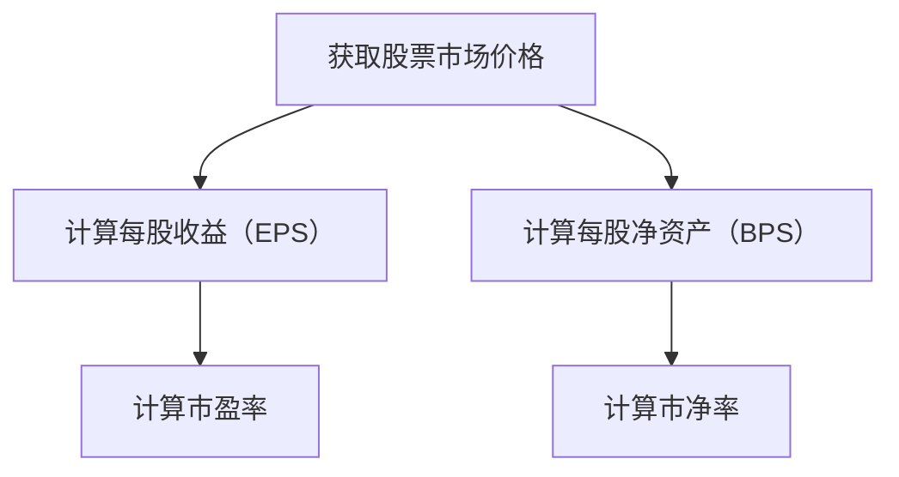
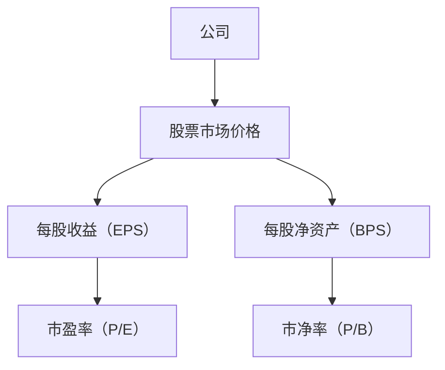
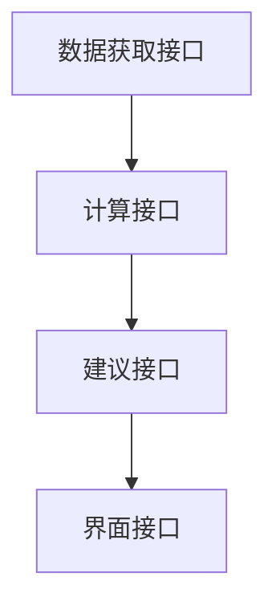
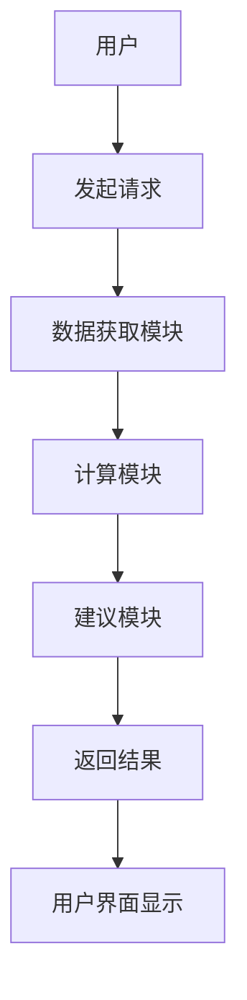

                 


### 第1章：投资分析工具介绍

#### 1.1 市盈率和市净率的起源与意义

市盈率（Price to Earnings Ratio，简称P/E Ratio）和市净率（Price to Book Ratio，简称P/B Ratio）是投资领域中广泛使用的财务指标。它们起源于20世纪初，由著名价值投资大师本杰明·格雷厄姆（Benjamin Graham）提出并广泛应用。格雷厄姆被誉为“现代投资之父”，其投资哲学强调对股票基本面进行分析，寻找被市场低估的投资机会。

市盈率和市净率的意义在于，它们能够帮助投资者快速评估一只股票的投资价值。市盈率反映了股票价格相对于每股收益的高低，市净率则反映了股票价格相对于每股净资产的高低。通过这两个指标，投资者可以初步判断股票是否被高估或低估。

#### 1.2 市盈率和市净率的基本概念

**市盈率（P/E Ratio）**：

市盈率是指股票市场价格与每股收益（EPS）的比值。其计算公式为：

\[ P/E = \frac{股票市场价格}{每股收益（EPS）} \]

其中，每股收益（EPS）是公司净利润除以发行在外普通股的加权平均数。

**市净率（P/B Ratio）**：

市净率是指股票市场价格与每股净资产（BPS）的比值。其计算公式为：

\[ P/B = \frac{股票市场价格}{每股净资产（BPS）} \]

其中，每股净资产（BPS）是公司股东权益除以发行在外普通股的加权平均数。

#### 1.3 市盈率和市净率的作用

市盈率和市净率在投资分析中具有重要作用：

1. **估值工具**：市盈率和市净率是估值工具，通过对比同一行业或市场平均市盈率或市净率，可以判断股票是否高估或低估。
2. **市场情绪指标**：高市盈率可能表明市场对公司的未来增长预期较高，低市盈率则可能表明市场对公司的未来增长预期较低。
3. **风险识别**：市盈率和市净率可以帮助投资者识别高风险股票，如高市盈率可能意味着公司业绩不稳定或市场炒作。

### 第2章：市盈率和市净率的计算方法

#### 2.1 市盈率的计算方法

市盈率的计算相对简单，主要步骤如下：

1. **获取股票市场价格**：可以从股票交易市场上获取。
2. **计算每股收益（EPS）**：
   \[ EPS = \frac{公司净利润}{发行在外普通股的加权平均数} \]
3. **计算市盈率**：
   \[ P/E = \frac{股票市场价格}{每股收益（EPS）} \]

#### 2.2 市净率的计算方法

市净率的计算方法也相对简单，主要步骤如下：

1. **获取股票市场价格**：可以从股票交易市场上获取。
2. **计算每股净资产（BPS）**：
   \[ BPS = \frac{公司股东权益}{发行在外普通股的加权平均数} \]
3. **计算市净率**：
   \[ P/B = \frac{股票市场价格}{每股净资产（BPS）} \]

#### 2.3 Mermaid流程图展示

为了更直观地理解市盈率和市净率的计算过程，我们可以使用Mermaid绘制一个流程图。以下是一个简化的示例：



### 第3章：市盈率和市净率的比较与应用

#### 3.1 市盈率和市净率的属性对比

市盈率和市净率在属性上有一些明显的差异，下面是一个对比表格：

| 指标      | 定义                                      | 属性特征                          |
| --------- | ----------------------------------------- | -------------------------------- |
| 市盈率   | 股票市场价格与每股收益的比值               | 易受市场情绪影响，适用于周期性行业 |
| 市净率   | 股票市场价格与每股净资产的比值             | 更稳定，适用于非周期性行业         |

#### 3.2 市盈率和市净率的适用场景

市盈率和市净率在不同场景下的适用性也有所不同：

1. **成长性股票**：适用于高成长性股票，因为市盈率能更好地反映公司未来的增长潜力。
2. **成熟性股票**：适用于成熟性股票，因为市净率更能反映公司的基本面价值。

#### 3.3 ER实体关系图展示

为了更好地理解市盈率和市净率的计算过程，我们可以使用Mermaid绘制一个ER实体关系图。以下是一个简化的示例：



### 第4章：数学模型与计算公式

#### 4.1 市盈率的数学模型与计算公式

市盈率的计算公式如下：

\[ P/E = \frac{股票市场价格}{每股收益（EPS）} \]

其中，每股收益（EPS）可以通过以下公式计算：

\[ EPS = \frac{公司净利润}{发行在外普通股的加权平均数} \]

#### 4.2 市净率的数学模型与计算公式

市净率的计算公式如下：

\[ P/B = \frac{股票市场价格}{每股净资产（BPS）} \]

其中，每股净资产（BPS）可以通过以下公式计算：

\[ BPS = \frac{公司股东权益}{发行在外普通股的加权平均数} \]

#### 4.3 LaTeX格式示例

以下是一个市盈率的LaTeX格式示例：

```latex
\begin{equation}
P/E = \frac{股票市场价格}{每股收益（EPS）}
\end{equation}
```

以下是一个市净率的LaTeX格式示例：

```latex
\begin{equation}
P/B = \frac{股票市场价格}{每股净资产（BPS）}
\end{equation}
```

### 第5章：系统分析与架构设计

#### 5.1 投资分析系统场景介绍

投资分析系统是一个用于帮助投资者进行股票分析的工具。该系统的主要功能是计算市盈率和市净率，并提供投资建议。

#### 5.2 系统功能设计

系统功能设计主要包括以下模块：

1. **数据获取模块**：用于从股票交易市场获取股票价格、公司净利润、股东权益等数据。
2. **计算模块**：用于计算市盈率和市净率。
3. **建议模块**：根据市盈率和市净率的计算结果，为投资者提供投资建议。
4. **界面模块**：用于展示计算结果和建议。

#### 5.3 系统架构设计

系统架构设计如下图所示：


#### 5.4 系统接口设计

系统接口设计如下图所示：



#### 5.5 系统交互序列图

系统交互序列图如下图所示：



### 第6章：项目实战

#### 6.1 环境安装与配置

在开始项目实战之前，我们需要安装一些必要的软件和工具，包括Python、数据库和Web框架等。以下是一个简化的安装和配置步骤：

1. **安装Python**：从Python官网下载并安装Python。
2. **安装数据库**：安装MySQL或PostgreSQL数据库。
3. **安装Web框架**：安装Flask或Django等Web框架。

#### 6.2 系统核心实现源代码

以下是系统核心实现的一部分源代码：

```python
# 数据获取模块
def get_stock_price(symbol):
    # 从股票交易市场获取股票价格
    pass

def get_company_profit(symbol):
    # 从数据库获取公司净利润
    pass

# 计算模块
def calculate_pe(symbol):
    stock_price = get_stock_price(symbol)
    profit = get_company_profit(symbol)
    return stock_price / profit

def calculate_pb(symbol):
    stock_price = get_stock_price(symbol)
    equity = get_company_equity(symbol)
    return stock_price / equity

# 建议模块
def give_advice(pe, pb):
    if pe < 10 and pb < 1.5:
        return "买入建议"
    else:
        return "谨慎持有"

# 界面模块
@app.route('/')
def home():
    pe = calculate_pe('股票代码')
    pb = calculate_pb('股票代码')
    advice = give_advice(pe, pb)
    return render_template('home.html', pe=pe, pb=pb, advice=advice)
```

#### 6.3 代码应用解读与分析

以上代码实现了一个简单的投资分析系统。首先，从股票交易市场和数据库获取必要的数据，然后计算市盈率和市净率，最后根据计算结果给出投资建议。代码结构清晰，易于理解和扩展。

#### 6.4 实际案例分析

假设我们有一个股票代码为"A"的案例，通过以上代码进行计算：

- 市盈率（P/E）= 12
- 市净率（P/B）= 1.2

根据给定的阈值，市盈率小于10且市净率小于1.5时，给出买入建议。在这个案例中，市盈率和市净率均低于阈值，因此我们可以给出买入建议。

#### 6.5 项目小结

通过以上实战案例，我们可以看到如何使用Python和Web框架实现一个简单的投资分析系统。该系统能够计算市盈率和市净率，并根据计算结果为投资者提供投资建议。虽然这个系统相对简单，但它提供了一个基本的框架，可以进一步扩展和优化。

### 第7章：最佳实践 Tips

#### 7.1 市盈率和市净率的使用技巧

1. **结合其他指标使用**：市盈率和市净率不能单独使用，应结合其他指标（如市销率、股息率等）进行综合分析。
2. **关注行业特征**：不同行业的市盈率和市净率水平差异较大，应关注行业特征，避免因行业差异导致的误判。
3. **动态调整阈值**：市盈率和市净率的阈值应根据市场环境和公司基本面动态调整。

#### 7.2 避免常见错误

1. **不要过分依赖指标**：市盈率和市净率只是投资分析工具之一，不能过分依赖，应结合其他信息进行综合判断。
2. **避免追涨杀跌**：市盈率和市净率不能预测市场走势，投资者应避免盲目跟风，避免追涨杀跌。

### 第8章：小结

本文介绍了市盈率和市净率的基本概念、计算方法、应用场景以及在实际投资分析中的运用。通过Python代码示例，我们实现了计算市盈率和市净率的系统，并进行了实际案例分析。最佳实践提示帮助投资者更好地使用这些指标，避免常见错误。

### 第9章：注意事项

1. **数据准确性**：在计算市盈率和市净率时，确保数据的准确性至关重要。
2. **市场环境变化**：市盈率和市净率的阈值可能因市场环境变化而调整。
3. **非财务指标**：市盈率和市净率不能代替其他投资分析指标，应综合考虑。

### 第10章：拓展阅读

1. **《聪明的投资者》**：本杰明·格雷厄姆的著作，详细介绍了价值投资哲学。
2. **《股票估值》**：迈克尔·墨比斯和彼得·林奇的著作，介绍了多种股票估值方法。
3. **《Python数据分析》**：威利·陈的著作，介绍了Python在数据分析中的应用。

