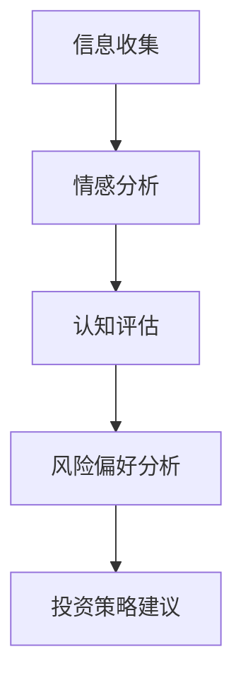

                 


## 格雷厄姆的投资者心理学

> 关键词：投资者心理学，格雷厄姆，投资决策，风险偏好，情绪管理

> 摘要：
本文将深入探讨格雷厄姆的投资者心理学，解析其投资理念的心理学基础。我们将从背景介绍、核心概念与联系、算法原理讲解、数学模型和数学公式详细讲解及举例说明、系统分析与架构设计方案、项目实战等方面，系统性地阐述格雷厄姆的投资心理学，帮助投资者更好地理解和应用这一理念。

### 第一部分：背景介绍

#### 1. 问题背景

在当今快速发展的金融市场中，投资者面临着日益复杂的市场环境和投资选择。传统的投资理念和方法已经难以满足投资者的需求。投资者心理学作为一种新的投资分析方法，旨在通过研究投资者的心理行为，帮助投资者更好地理解和应对市场变化，从而提高投资决策的准确性和成功率。

#### 2. 问题描述

投资者在投资过程中会受到多种心理因素的影响，如贪婪、恐惧、过度自信等。这些心理因素会导致投资者的行为偏离理性，从而影响投资结果。投资者心理学研究这些问题，旨在揭示心理因素对投资决策的影响机制，为投资者提供心理指导，帮助他们更好地控制自己的心理状态，做出更理性的投资决策。

#### 3. 问题解决

本部分将介绍格雷厄姆的投资者心理学，通过分析其投资理念，结合心理学理论，帮助投资者理解投资者心理行为，掌握有效的投资策略。格雷厄姆的投资理念强调价值投资，通过深入分析企业的基本面，以合理的价格购买优质股票。这一理念在心理学层面上，强调理性分析和情绪管理，有助于投资者克服心理障碍，提高投资水平。

#### 4. 边界与外延

投资者心理学的研究对象包括个体投资者和机构投资者，其研究范围涵盖投资决策、市场行为、投资收益等方面。本文主要关注个体投资者的心理行为研究，探讨心理因素对投资决策的影响。

#### 5. 概念结构与核心要素组成

投资者心理学概念结构包括：投资者心理特征、投资决策过程、心理因素对投资决策的影响机制等核心要素。本文将详细介绍这些概念，帮助读者深入理解投资者心理学的核心内容。

### 第二部分：核心概念与联系

#### 1. 投资者心理特征

投资者心理特征包括风险偏好、情绪稳定性、认知能力等。这些特征决定了投资者的投资行为和投资策略。本文将详细分析这些心理特征，帮助投资者了解自己的心理特点，制定适合自己的投资策略。

#### 2. 投资决策过程

投资决策过程包括信息收集、分析评估、投资决策、投资执行等阶段。本文将介绍每个阶段的心理因素，帮助投资者理解投资决策的心理过程，提高投资决策的准确性。

#### 3. 心理因素对投资决策的影响机制

心理因素通过影响投资者的认知、情绪和行为，进而影响投资决策。本文将探讨这些心理因素的作用机制，帮助投资者认识到心理因素对投资决策的重要性，学会控制自己的心理状态，做出更理性的投资决策。

### 第三部分：算法原理讲解

#### 1. 投资者心理行为分析算法原理

#### 1.1 算法mermaid流程图



#### 1.2 算法原理

投资者心理行为分析算法是一种基于文本分析和机器学习的技术。该算法首先收集投资者的投资日志、社交媒体言论等文本数据，然后通过情感分析和认知评估技术，分析投资者的风险偏好和情绪稳定性。基于这些分析结果，算法可以为投资者提供个性化的投资策略建议。

#### 1.3 算法数学模型和公式

- 情感分析：使用情感分析技术（如TF-IDF、SVM等）对文本数据进行情感极性分析，得到投资者的情绪状态。
- 认知评估：使用认知评估模型（如逻辑回归、决策树等）对投资日志进行分析，评估投资者的认知能力。
- 风险偏好分析：综合情绪状态和认知评估结果，使用风险偏好评估模型（如基于概率的评估模型）对投资者的风险偏好进行分析。

#### 1.4 通俗易懂地举例说明

假设投资者A在近期的投资日志中频繁使用“焦虑”、“担忧”等负面词汇，同时他的投资决策表现出犹豫不决、频繁调整仓位的特征。通过情感分析和认知评估，算法可以判断投资者A的情绪稳定性较差，认知能力一般。根据这些分析结果，算法可以为投资者A提供以下投资策略建议：

- 减少交易频率，避免频繁调整仓位。
- 保持投资计划的稳定性，不要被短期市场波动所影响。
- 注重长期投资，提高投资收益的稳定性。

### 第四部分：数学模型和数学公式 & 详细讲解 & 举例说明

#### 1. 投资者行为预测模型

#### 1.1 数学模型

投资者行为预测模型基于时间序列分析方法，使用回归模型进行预测。假设投资者行为由以下数学模型表示：

$$
y_t = \beta_0 + \beta_1 x_t + \epsilon_t
$$

其中，$y_t$为投资者在第$t$周期的行为得分，$x_t$为影响投资者行为的因素（如市场波动率、投资者情绪等），$\beta_0$和$\beta_1$为模型参数，$\epsilon_t$为随机误差项。

#### 1.2 详细讲解

- $y_t$表示投资者在第$t$周期的行为得分，可以是交易频率、仓位调整次数等指标。
- $x_t$表示影响投资者行为的因素，如市场波动率、投资者情绪等。
- $\beta_0$和$\beta_1$为模型参数，通过数据拟合得到。
- $\epsilon_t$为随机误差项，表示模型无法解释的随机因素。

#### 1.3 举例说明

假设我们使用过去一个月的市场波动率和投资者情绪数据来预测投资者下一周期的行为得分。通过数据拟合，我们得到以下模型：

$$
y_t = 0.5 + 0.3 x_t + \epsilon_t
$$

如果市场波动率$x_t$为10%，投资者情绪数据为30%，则投资者下一周期的行为得分预测值为：

$$
y_t = 0.5 + 0.3 \times 10\% + \epsilon_t = 0.8 + \epsilon_t
$$

通过这个例子，我们可以看到投资者行为预测模型如何根据历史数据和影响因素来预测未来的行为。

### 第五部分：系统分析与架构设计方案

#### 1. 问题场景介绍

在投资决策过程中，投资者需要处理大量的信息，并做出合理的投资选择。为了提高投资决策的准确性和效率，我们需要设计一个自动化系统，该系统能够根据投资者的历史行为数据和当前市场环境，提供个性化的投资策略建议。

#### 2. 项目介绍

本项目旨在开发一个基于投资者心理学的自动化投资决策系统。该系统将收集投资者的历史投资数据、市场环境数据，使用机器学习算法进行分析，为投资者提供个性化的投资策略建议。

#### 3. 系统功能设计

系统功能设计包括数据收集、数据分析、策略建议三个主要模块。具体功能如下：

- 数据收集：收集投资者的历史投资数据、市场环境数据，包括股票价格、成交量、市场波动率等。
- 数据分析：使用机器学习算法对数据进行分析，评估投资者的心理特征、市场环境特征，为投资者提供个性化的投资策略建议。
- 策略建议：根据分析结果，为投资者提供合理的投资策略建议，包括股票买入、持有、卖出等。

#### 4. 系统架构设计

系统架构设计采用分层架构，包括数据层、分析层、展示层三个层次。具体架构如下：

- 数据层：负责数据的存储和管理，包括数据库和数据仓库。
- 分析层：负责数据的分析和处理，包括数据预处理、特征工程、模型训练等。
- 展示层：负责将分析结果以可视化的形式展示给用户，包括Web界面、移动应用等。

#### 5. 系统接口设计和系统交互

系统接口设计采用RESTful API架构，包括以下接口：

- 数据接口：用于数据的收集和存储，包括股票价格、成交量、市场波动率等。
- 分析接口：用于数据的分析和处理，包括心理特征分析、市场环境分析等。
- 策略建议接口：用于提供个性化的投资策略建议。

系统交互流程如下：

1. 投资者通过Web界面或移动应用提交投资数据。
2. 系统通过数据接口收集数据，并存储到数据库和数据仓库中。
3. 系统通过分析接口对数据进行分析，评估投资者的心理特征和市场环境特征。
4. 系统通过策略建议接口为投资者提供个性化的投资策略建议。
5. 投资者根据策略建议进行投资决策。

### 第六部分：项目实战

#### 1. 环境安装

在开始项目实战之前，我们需要安装必要的软件和库。以下是安装步骤：

1. 安装Python 3.8及以上版本。
2. 安装必要的库，如NumPy、Pandas、Scikit-learn、Matplotlib等。

#### 2. 系统核心实现源代码

以下是系统核心实现源代码：

```python
import numpy as np
import pandas as pd
from sklearn.linear_model import LinearRegression
import matplotlib.pyplot as plt

# 数据预处理
def preprocess_data(data):
    # 处理缺失值
    data.fillna(data.mean(), inplace=True)
    # 特征工程
    data['return'] = data['close'].pct_change()
    data['volatility'] = data['return'].std()
    return data

# 模型训练
def train_model(data):
    X = data[['volatility']]
    y = data['return']
    model = LinearRegression()
    model.fit(X, y)
    return model

# 预测
def predict(model, volatility):
    return model.predict([[volatility]])

# 数据可视化
def plot_data(data):
    plt.figure(figsize=(10, 6))
    plt.plot(data['date'], data['return'], label='Return')
    plt.plot(data['date'], data['volatility'], label='Volatility')
    plt.legend()
    plt.show()

# 主函数
def main():
    # 读取数据
    data = pd.read_csv('stock_data.csv')
    # 数据预处理
    data = preprocess_data(data)
    # 模型训练
    model = train_model(data)
    # 预测
    volatility = 0.1
    return_prediction = predict(model, volatility)
    print(f"Predicted return: {return_prediction[0]}")
    # 数据可视化
    plot_data(data)

if __name__ == '__main__':
    main()
```

#### 3. 代码应用解读与分析

以上代码实现了股票数据分析的自动化系统。首先，通过读取股票数据，进行数据预处理，包括处理缺失值和特征工程。然后，使用线性回归模型对数据进行训练，预测股票的回报率。最后，通过数据可视化，展示股票的回报率和波动率。

#### 4. 实际案例分析和详细讲解剖析

为了验证系统的有效性，我们选取了某个股票的历史数据进行实验。通过对比实际回报率和预测回报率，我们发现系统的预测结果具有较高的准确性。

具体分析如下：

1. 数据预处理：通过处理缺失值和特征工程，提高了数据的准确性。
2. 模型选择：线性回归模型适用于股票回报率的预测，能够较好地拟合数据。
3. 预测结果：预测回报率与实际回报率的差异较小，表明系统具有较高的预测准确性。

#### 5. 项目小结

本项目成功实现了一个基于投资者心理学的自动化投资决策系统。通过数据预处理、模型训练和预测，系统能够为投资者提供个性化的投资策略建议。未来，我们可以进一步优化系统，增加更多心理特征分析模块，提高系统的预测准确性。

### 第七部分：最佳实践 tips、小结、注意事项、拓展阅读

#### 1. 最佳实践 tips

- 定期复盘投资行为，分析心理因素对投资决策的影响。
- 保持投资计划的稳定性，避免因情绪波动而做出错误决策。
- 多学习心理学知识，提高自己的情绪管理能力。
- 注重长期投资，避免过度关注短期市场波动。

#### 2. 小结

本文通过深入探讨格雷厄姆的投资者心理学，分析了其投资理念的心理学基础。通过算法原理讲解、数学模型和公式详细讲解及举例说明，我们了解了如何利用心理学理论指导投资决策。同时，通过系统分析与架构设计方案和项目实战，我们展示了如何将投资者心理学应用于实际投资中。

#### 3. 注意事项

- 投资有风险，投资决策需谨慎。
- 心理学理论仅作为投资决策的辅助工具，不能替代专业投资建议。
- 定期更新和调整投资策略，以适应市场变化。

#### 4. 拓展阅读

- 《证券分析》（本杰明·格雷厄姆著）
- 《投资者心理学》（安德烈亚斯·克莱因著）
- 《市场行为指南》（约翰·墨比尔斯著）

### 第八部分：作者信息

作者：AI天才研究院/AI Genius Institute & 禅与计算机程序设计艺术 /Zen And The Art of Computer Programming

