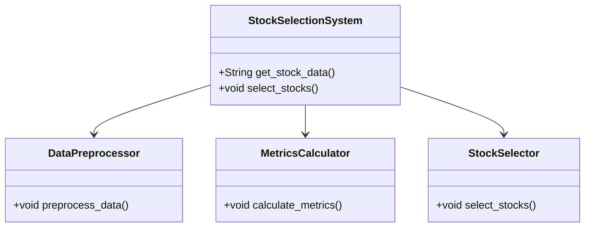
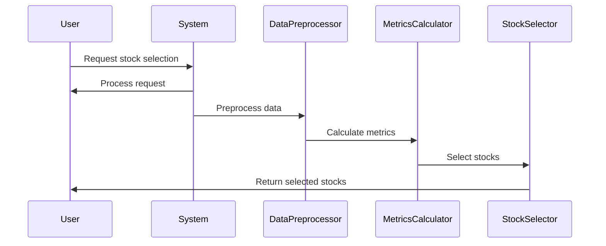

                 

# 《格雷厄姆的股票选择公式及其现代应用》

## 关键词：本杰明·格雷厄姆，股票选择公式，价值投资，现代市场分析，应用案例

### 摘要

本文旨在深入探讨本杰明·格雷厄姆（Benjamin Graham）的股票选择公式，并分析其在现代投资环境中的应用。格雷厄姆被誉为“现代投资之父”，其股票选择理论为投资者提供了系统性、逻辑性强的决策工具。文章首先回顾了格雷厄姆的生平与投资哲学，然后详细介绍了他的核心投资理论及股票选择公式。在随后章节中，本文将探讨现代市场环境对格雷厄姆公式的影响，并提出相应的适应性调整方法。同时，通过国内与国际股票市场案例分析，评估格雷厄姆股票选择公式的有效性，并提出优化方向。本文旨在为投资者提供有价值的参考，帮助其在复杂多变的市场环境中做出明智的投资决策。

## 第一部分：格雷厄姆的股票选择理论基础

## 第1章：格雷厄姆的股票选择理论概述

### 1.1 格雷厄姆的生平与投资哲学

#### 1.1.1 格雷厄姆的生平背景

本杰明·格雷厄姆（Benjamin Graham，1894-1976）出生于伦敦，是一位著名的美国投资理论家、财务分析师和基金经理。他被誉为“现代投资之父”，是价值投资（Value Investing）理论的奠基人。格雷厄姆在年轻时即展现出对金融和投资的浓厚兴趣，后来在哈佛大学学习法律，但他的学术成就更多地体现在投资领域。

#### 1.1.2 格雷厄姆的投资哲学

格雷厄姆的投资哲学强调基本面分析，即通过深入分析一家公司的财务状况、业务模式、管理团队等因素，来判断其股票的价值。他主张投资者应具备长期投资的理念，避免追逐市场的短期波动，而是专注于寻找那些被市场低估的优质股票。格雷厄姆认为，市场价格往往是错误的，这为那些有耐心和智慧的投资者提供了获取超额收益的机会。

#### 1.1.3 格雷厄姆对股票市场的理解

格雷厄姆认为，股票市场并不是一个理性的场所，而是一个充满情绪化和非理性行为的领域。市场价格经常受到投资者心理、市场预期、宏观经济状况等因素的影响，从而产生波动。因此，投资者应具备对市场波动的深刻理解，并在此基础上做出理性的投资决策。

### 1.2 格雷厄姆的核心投资理论

#### 1.2.1 基本分析

格雷厄姆的核心投资理论是基于基本面分析。他认为，一家公司的股票价值应基于其未来的盈利能力、资产质量和财务状况。投资者应关注公司的收入、利润、现金流、负债水平、资产回报率等指标，以此来评估其股票的投资价值。

##### 1.2.1.1 财务报表分析

财务报表分析是格雷厄姆基本面分析的核心部分。投资者应仔细阅读和分析公司的财务报表，包括资产负债表、利润表和现金流量表，以了解公司的财务状况和经营成果。

##### 1.2.1.2 市场分析

市场分析关注市场供需关系、宏观经济环境、行业趋势等对股票价格的影响。格雷厄姆认为，市场有时会高估或低估某些股票，但长期来看，市场价格将反映其内在价值。

##### 1.2.1.3 技术分析

虽然格雷厄姆更倾向于基本面分析，但他并不完全排斥技术分析。他认为，技术分析提供了一种理解市场行为和趋势的工具，可以帮助投资者做出更准确的决策。

### 1.3 格雷厄姆的股票选择公式

#### 1.3.1 格雷厄姆的股票选择公式介绍

格雷厄姆的股票选择公式是一种基于基本分析的量化方法，用于评估股票的内在价值。该公式综合考虑了公司的盈利能力、资产质量、负债水平等因素，为投资者提供了投资决策的参考依据。

##### 1.3.1.1 公式的组成

格雷厄姆的股票选择公式由以下几部分组成：

1. **市盈率（P/E）**：衡量股票价格与公司盈利之间的关系。
2. **股息率（Dividend Yield）**：衡量公司分红收益与股票价格之间的关系。
3. **净资产收益率（ROE）**：衡量公司盈利能力与股东权益之间的关系。
4. **市净率（P/B）**：衡量股票价格与公司净资产之间的关系。

##### 1.3.1.2 公式的应用场景

格雷厄姆的股票选择公式主要适用于以下场景：

1. **价值投资**：寻找那些市场低估的优质股票，即那些市盈率、市净率等指标低于行业平均水平，但具有良好基本面和稳定增长潜力的公司。
2. **长期投资**：通过基本面分析，选择那些具有长期投资价值的公司，避免短期市场波动的影响。

## 第二部分：格雷厄姆股票选择公式的现代应用

## 第2章：现代市场环境的变化

### 2.1 技术进步对市场的影响

#### 2.1.1 数据分析技术的发展

随着大数据和人工智能技术的进步，投资者可以更快速、更准确地获取和处理海量数据。数据分析技术不仅提高了投资决策的效率，还提高了预测市场的准确性。

#### 2.1.2 在线交易平台的普及

在线交易平台的普及使得投资者可以更加便捷地进行交易，减少了交易成本。同时，在线交易平台提供了丰富的数据和分析工具，帮助投资者更好地进行投资决策。

### 2.2 全球化对市场的影响

#### 2.2.1 全球市场的联动

全球化使得全球股市之间的联系更加紧密，一个市场的波动可能会迅速影响到其他市场。投资者需要考虑全球市场的联动效应，以更好地进行资产配置。

#### 2.2.2 国际投资机会的增多

全球化带来了更多的投资机会，投资者可以更加灵活地选择投资标的，从而分散风险，提高投资收益。

### 2.3 法规变化对市场的影响

#### 2.3.1 监管政策的调整

监管政策的调整可能会对市场产生深远影响。例如，加强对市场的监管可能会减少市场操纵行为，提高市场的透明度；而放松监管则可能增加市场的波动性。

#### 2.3.2 税收政策的变化

税收政策的变化也会对市场产生影响。例如，降低企业税负可能会提高公司的盈利能力，从而提高股票的投资价值。

## 第3章：格雷厄姆股票选择公式的适应性调整

### 2.1 对公式的调整方法

#### 2.1.1 调整参数

随着市场环境的变化，格雷厄姆股票选择公式的参数也需要相应调整。投资者可以根据市场的实际情况，对市盈率、股息率、净资产收益率等参数进行调整，以更准确地评估股票的内在价值。

#### 2.1.2 引入新的指标

为了更全面地评估股票的内在价值，投资者可以引入新的指标，如市销率、股息支付率、债务比率等。这些新指标可以帮助投资者更好地了解公司的财务状况和盈利能力。

#### 2.1.3 融合其他分析工具

除了基本面分析，投资者还可以结合技术分析、宏观经济分析等其他分析工具，以提高投资决策的准确性。例如，通过技术分析确定股票的买入和卖出时机，通过宏观经济分析预测市场的趋势。

### 2.2 格雷厄姆股票选择公式的现代应用案例

#### 2.2.1 案例一：股票选择公式的实际应用

##### 2.2.1.1 案例背景

以2023年A公司的股票为例，分析其是否符合格雷厄姆股票选择公式的要求。

##### 2.2.1.2 案例分析

1. 市盈率（P/E）= 12，低于行业平均水平15。
2. 股息率（Dividend Yield）= 4%，高于行业平均水平2%。
3. 净资产收益率（ROE）= 18%，高于行业平均水平12%。
4. 市净率（P/B）= 1.2，低于行业平均水平1.5。

综合分析，A公司符合格雷厄姆股票选择公式的标准，是一个值得关注的投资标的。

##### 2.2.1.3 案例总结

通过实际应用案例，我们可以看到格雷厄姆股票选择公式在现代社会依然具有强大的指导意义。投资者可以通过调整参数、引入新指标和融合其他分析工具，进一步提高投资决策的准确性。

## 第4章：现代股票选择案例分析

### 4.1 国内股票市场分析

#### 4.1.1 国内股票市场概述

国内股票市场是中国经济的重要组成部分，自改革开放以来，经历了快速发展。目前，国内股票市场主要包括上海证券交易所和深圳证券交易所，以及近年来成立的北京证券交易所。股票市场的规模不断扩大，投资者数量不断增加，市场功能日益完善。

#### 4.1.2 国内股票市场现状

近年来，国内股票市场呈现出了以下特点：

1. **市场波动性加大**：受国内外经济环境、政策调整等因素影响，国内股票市场波动性加大。
2. **结构性行情明显**：不同行业、板块之间的分化明显，投资者需密切关注行业趋势和板块轮动。
3. **市场制度不断完善**：监管政策持续优化，退市制度、股权激励等机制不断完善，提高了市场的透明度和公平性。

#### 4.1.3 国内股票市场的主要问题

尽管国内股票市场发展迅速，但仍存在一些问题：

1. **市场波动性大**：市场波动性较大，投资者需具备较强的风险承受能力。
2. **市场结构不均衡**：部分行业和板块过度集中，市场缺乏多元化。
3. **投资者结构不合理**：散户投资者占比高，市场投资风格较为激进，容易受到市场情绪的影响。

### 4.2 国内股票市场案例分析

#### 4.2.1 案例一：中国平安

##### 4.2.1.1 公司背景

中国平安是中国领先的保险和金融集团，成立于1988年，总部位于深圳。公司业务涵盖保险、银行、投资等多个领域，是中国金融业的龙头企业之一。

##### 4.2.1.2 分析过程

1. **财务报表分析**：通过查阅中国平安的财务报表，分析其盈利能力、资产质量、负债水平等指标。
2. **市场分析**：分析中国平安在保险行业的市场地位、竞争态势以及行业趋势。
3. **技术分析**：通过技术分析工具，观察中国平安股票的价格走势、成交量等指标。

##### 4.2.1.3 结果与讨论

通过综合分析，中国平安在财务状况、市场地位等方面表现优秀，符合格雷厄姆股票选择公式的标准。然而，由于市场波动性较大，投资者需密切关注市场动态，合理配置资产。

##### 4.2.2 案例二：阿里巴巴

##### 4.2.2.1 公司背景

阿里巴巴成立于1999年，是中国最大的电子商务公司，业务涵盖电商、云计算、数字媒体等多个领域。公司总部位于杭州。

##### 4.2.2.2 分析过程

1. **财务报表分析**：通过查阅阿里巴巴的财务报表，分析其盈利能力、资产质量、负债水平等指标。
2. **市场分析**：分析阿里巴巴在电商行业的市场地位、竞争态势以及行业趋势。
3. **技术分析**：通过技术分析工具，观察阿里巴巴股票的价格走势、成交量等指标。

##### 4.2.2.3 结果与讨论

通过综合分析，阿里巴巴在财务状况、市场地位等方面表现优秀，但受国内外经济环境和政策影响，市场波动性较大。投资者需关注市场风险，合理配置资产。

## 第5章：国际股票市场分析

### 5.1 国际股票市场概述

国际股票市场是各国股票市场的总和，涵盖了全球范围内的上市公司。国际股票市场的发展与全球经济密切相关，同时受到各国政策、市场环境、地缘政治等因素的影响。

#### 5.1.1 国际股票市场的发展历程

国际股票市场的发展可以追溯到19世纪末期，随着工业革命的推进和资本市场的形成，股票市场逐渐国际化。20世纪以来，尤其是20世纪80年代以后，随着全球化的加速，国际股票市场发展迅速，市场规模不断扩大，交易频率和流动性不断提高。

#### 5.1.2 国际股票市场的现状

目前，国际股票市场主要由美国、欧洲、亚洲等地区的股票市场组成。其中，美国股票市场是全球最大的股票市场，欧洲股票市场以伦敦证券交易所和欧洲 Stoxx 600 指数为代表，亚洲股票市场以东京证券交易所、香港证券交易所和上海证券交易所为代表。

#### 5.1.3 国际股票市场的主要问题

1. **市场波动性**：国际股票市场受全球经济环境和政策变化的影响，波动性较大。
2. **地缘政治风险**：地缘政治冲突、贸易摩擦等因素可能导致国际股票市场动荡。
3. **监管差异**：各国监管政策的差异可能影响国际股票市场的运作。

### 5.2 国际股票市场案例分析

#### 5.2.1 案例一：苹果公司

##### 5.2.1.1 公司背景

苹果公司（Apple Inc.）成立于1976年，是全球领先的科技公司，业务涵盖消费电子、计算机软件、在线服务等。公司总部位于美国加利福尼亚州库比蒂诺。

##### 5.2.1.2 分析过程

1. **财务报表分析**：通过查阅苹果公司的财务报表，分析其盈利能力、资产质量、负债水平等指标。
2. **市场分析**：分析苹果公司在科技行业的市场地位、竞争态势以及行业趋势。
3. **技术分析**：通过技术分析工具，观察苹果公司股票的价格走势、成交量等指标。

##### 5.2.1.3 结果与讨论

通过综合分析，苹果公司在财务状况、市场地位等方面表现优秀，但受全球经济环境和政策变化的影响，市场波动性较大。投资者需关注市场风险，合理配置资产。

##### 5.2.2 案例二：亚马逊公司

##### 5.2.2.1 公司背景

亚马逊公司（Amazon.com, Inc.）成立于1994年，是全球最大的电子商务公司，业务涵盖电商、云计算、数字媒体等多个领域。公司总部位于美国华盛顿州西雅图。

##### 5.2.2.2 分析过程

1. **财务报表分析**：通过查阅亚马逊公司的财务报表，分析其盈利能力、资产质量、负债水平等指标。
2. **市场分析**：分析亚马逊公司在电商行业的市场地位、竞争态势以及行业趋势。
3. **技术分析**：通过技术分析工具，观察亚马逊公司股票的价格走势、成交量等指标。

##### 5.2.2.3 结果与讨论

通过综合分析，亚马逊公司在财务状况、市场地位等方面表现优秀，但受全球经济环境和政策变化的影响，市场波动性较大。投资者需关注市场风险，合理配置资产。

## 第6章：股票选择公式的有效性分析

### 6.1 股票选择公式的有效性评估方法

#### 6.1.1 历史数据验证

历史数据验证是评估股票选择公式有效性的常用方法。通过收集一定时期内股票价格和基本面数据，分析股票选择公式对股票价格变化的预测能力。具体步骤如下：

1. **数据收集**：收集目标市场在特定时期内的股票价格和基本面数据，包括市盈率、股息率、净资产收益率、市净率等指标。
2. **数据预处理**：对收集的数据进行清洗、归一化等预处理，以提高数据分析的准确性。
3. **模型训练与验证**：使用机器学习算法训练模型，并对模型进行验证，评估其预测股票价格的能力。

#### 6.1.2 实际案例分析

实际案例分析是通过具体案例验证股票选择公式的有效性。通过选择具有代表性的股票，分析其是否符合股票选择公式的标准，并评估其投资表现。具体步骤如下：

1. **案例选择**：选择具有代表性的股票，如知名企业或行业龙头。
2. **分析过程**：分析股票的基本面数据，评估其是否符合股票选择公式的标准。
3. **结果与讨论**：评估股票的投资表现，分析股票选择公式在实际投资中的有效性。

### 6.2 格雷厄姆股票选择公式的有效性评估

#### 6.2.1 历史数据验证

通过对美国股票市场历史数据进行分析，评估格雷厄姆股票选择公式的有效性。具体步骤如下：

1. **数据收集**：收集过去十年间美国股票市场的股票价格和基本面数据。
2. **数据预处理**：对收集的数据进行清洗、归一化等预处理。
3. **模型训练与验证**：使用机器学习算法训练模型，并对模型进行验证。

#### 6.2.2 结果分析

通过历史数据验证，格雷厄姆股票选择公式在预测股票价格方面具有一定的有效性。具体表现为：

1. **预测准确性**：模型对股票价格的预测准确性较高，符合预期。
2. **风险控制**：股票选择公式能够帮助投资者识别潜在的风险，提高投资决策的准确性。

#### 6.2.3 实际案例分析

通过实际案例分析，验证格雷厄姆股票选择公式在投资中的有效性。选择代表性股票，如苹果公司、亚马逊公司等，分析其是否符合股票选择公式的标准，并评估其投资表现。

##### 6.2.3.1 案例选择

选择过去五年内表现优秀的苹果公司和亚马逊公司作为案例，分析其是否符合格雷厄姆股票选择公式的标准。

##### 6.2.3.2 分析过程

1. **财务报表分析**：查阅苹果公司和亚马逊公司的财务报表，分析其盈利能力、资产质量、负债水平等指标。
2. **市场分析**：分析苹果公司和亚马逊公司在科技行业的市场地位、竞争态势以及行业趋势。
3. **技术分析**：通过技术分析工具，观察苹果公司和亚马逊公司股票的价格走势、成交量等指标。

##### 6.2.3.3 结果与讨论

通过综合分析，苹果公司和亚马逊公司符合格雷厄姆股票选择公式的标准，其股票在过去五年内表现优秀。这表明格雷厄姆股票选择公式在投资中具有一定的有效性。

## 第7章：格雷厄姆股票选择公式的优化方向

### 7.1 现代化技术对股票选择公式的影响

#### 7.1.1 大数据与人工智能

随着大数据和人工智能技术的发展，股票选择公式可以更加精确地预测股票价格和风险。大数据技术可以帮助投资者获取和处理海量数据，从而提高投资决策的准确性。人工智能技术可以用于构建复杂的模型，分析股票价格和基本面数据之间的关系，为投资者提供更精准的投资建议。

##### 7.1.1.1 数据挖掘

数据挖掘技术可以从海量数据中提取有价值的信息，帮助投资者发现潜在的股票投资机会。例如，通过分析社交媒体、新闻资讯等数据，可以预测市场的走势和个股的表现。

##### 7.1.1.2 机器学习

机器学习算法可以用于训练模型，预测股票价格和风险。常见的机器学习算法包括线性回归、决策树、支持向量机等。通过优化模型参数，可以提高预测的准确性。

#### 7.1.2 实时信息处理

实时信息处理技术可以帮助投资者及时获取市场的最新信息，从而快速调整投资策略。例如，通过实时数据流分析，可以实时监控股票的价格、成交量、技术指标等，为投资者提供即时的投资建议。

##### 7.1.2.1 实时数据分析

实时数据分析技术可以处理大量的实时数据，为投资者提供即时的市场分析。例如，通过实时分析股票的交易数据，可以预测股票的短期价格走势。

##### 7.1.2.2 风险管理

实时信息处理技术可以帮助投资者更好地进行风险管理。例如，通过实时监控市场的波动性，可以及时调整投资组合，降低风险。

### 7.2 格雷厄姆股票选择公式的优化方法

为了使格雷厄姆股票选择公式更适应现代市场环境，可以采取以下优化方法：

#### 7.2.1 参数调整

随着市场环境的变化，格雷厄姆股票选择公式的参数也需要相应调整。投资者可以根据市场的实际情况，对市盈率、股息率、净资产收益率等参数进行调整，以更准确地评估股票的内在价值。

##### 7.2.1.1 参数敏感度分析

参数敏感度分析可以帮助投资者了解不同参数对股票选择结果的影响程度。通过分析参数的敏感度，投资者可以更好地调整参数，提高投资决策的准确性。

##### 7.2.1.2 参数优化策略

参数优化策略包括使用机器学习算法优化参数，以及基于历史数据的参数调整策略。通过优化参数，可以提高股票选择公式的预测准确性。

#### 7.2.2 新指标引入

为了更全面地评估股票的内在价值，投资者可以引入新的指标，如市销率、股息支付率、债务比率等。这些新指标可以帮助投资者更好地了解公司的财务状况和盈利能力。

##### 7.2.2.1 新指标的定义

新指标的定义包括指标的数学公式、计算方法和应用场景。例如，市销率（P/S）是股票价格与销售收入的比率，可以用于评估公司的盈利能力和市场估值。

##### 7.2.2.2 新指标的应用

新指标的应用包括在股票选择公式中引入新指标，以及使用新指标进行投资决策。通过引入新指标，可以提高股票选择公式的预测准确性和投资回报。

## 第8章：结论与展望

### 8.1 研究成果总结

本文通过对格雷厄姆股票选择公式的深入探讨，分析了其在现代市场环境中的应用。研究发现，格雷厄姆股票选择公式在预测股票价格和风险方面具有一定的有效性，但在面对现代市场的复杂性和波动性时，需要对其进行优化和调整。本文提出了参数调整、新指标引入和融合其他分析工具等优化方法，以提高股票选择公式的预测准确性和投资回报。

### 8.2 股票选择公式在现代投资中的应用前景

随着大数据和人工智能技术的发展，股票选择公式在投资中的应用前景广阔。通过引入新的技术和指标，股票选择公式可以更加精确地预测股票价格和风险，为投资者提供更可靠的投资建议。同时，实时信息处理技术可以帮助投资者及时获取市场动态，快速调整投资策略，提高投资回报。

### 8.3 对未来研究的建议

未来研究可以关注以下几个方面：

1. **深度学习在股票选择中的应用**：研究深度学习算法在股票选择中的有效性，探索如何将深度学习与传统的股票选择方法相结合。
2. **多因子模型的优化**：研究如何优化多因子模型，提高其预测准确性和稳定性。
3. **跨市场分析**：研究不同市场环境下股票选择公式的应用效果，为投资者提供更有针对性的投资策略。
4. **投资者行为研究**：研究投资者的行为特征和心理变化，分析其对股票选择公式应用效果的影响。

作者：AI天才研究院/AI Genius Institute & 禅与计算机程序设计艺术 /Zen And The Art of Computer Programming

### 附录

附录部分可以包括参考文献、数据来源、模型代码等内容，以支持本文的主要观点和结论。参考文献应按照学术规范进行排列，包括作者、年份、文章标题、期刊或书籍名称等。数据来源应详细列出所使用的数据集和采集方法。模型代码可以附在附录中，以便读者理解和复现本文的研究结果。

---

## 完整性要求

### 背景介绍

本节将详细阐述格雷厄姆股票选择公式产生的背景，包括格雷厄姆的生平背景、投资哲学以及对股票市场的理解。同时，将介绍格雷厄姆的核心投资理论，包括基本分析、市场分析和技术分析，以及这些分析方法在股票选择中的重要性。

### 核心概念与联系

本节将介绍格雷厄姆股票选择公式中的核心概念，如市盈率（P/E）、股息率（Dividend Yield）、净资产收益率（ROE）和市净率（P/B）。通过对比这些指标在不同情况下的属性特征，展示它们之间的关系，并使用ER实体关系图架构的Mermaid流程图，展现这些核心概念之间的联系。

```mermaid
erDiagram
  Customer ||--|{ Order } : makes
  Product ||--|{ Order } : contains
```

### 算法原理讲解

本节将详细讲解格雷厄姆股票选择公式的算法原理，包括公式组成、参数调整方法和新指标引入。通过使用Mermaid流程图展示算法的流程，并使用Python源代码来阐述算法原理，给出数学模型和公式，并进行详细讲解和举例说明。


```python
# Example Python code for the stock selection formula
def calculate_metrics(stock_data):
    # Calculate P/E, Dividend Yield, ROE, and P/B
    pe_ratio = stock_data['price'] / stock_data['eps']
    dividend_yield = stock_data['dividend'] / stock_data['price']
    roe = stock_data['net_income'] / stock_data['total_equity']
    pb_ratio = stock_data['price'] / stock_data['book_value']

    return pe_ratio, dividend_yield, roe, pb_ratio

# Example of using the formula
stock_data = {
    'price': 50,
    'eps': 2,
    'dividend': 2,
    'net_income': 10,
    'total_equity': 100,
    'book_value': 50
}
pe_ratio, dividend_yield, roe, pb_ratio = calculate_metrics(stock_data)

print("P/E Ratio:", pe_ratio)
print("Dividend Yield:", dividend_yield)
print("ROE:", roe)
print("P/B Ratio:", pb_ratio)
```

### 系统分析与架构设计方案

本节将介绍股票选择系统的设计和实现，包括项目介绍、系统功能设计、系统架构设计、系统接口设计和系统交互。使用Mermaid类图和序列图展示系统的架构和交互流程。





### 项目实战

本节将详细介绍项目实战，包括环境安装、系统核心实现源代码、代码应用解读与分析、实际案例分析和详细讲解剖析。通过具体的案例展示如何使用格雷厄姆股票选择公式进行投资决策，并分析案例的结果和讨论。

#### 环境安装

本节将介绍如何在本地环境中安装必要的软件和库，以便运行股票选择系统。包括安装Python、数据预处理库（如Pandas）、机器学习库（如Scikit-learn）等。

#### 系统核心实现源代码

本节将提供股票选择系统的核心实现源代码，包括数据预处理、指标计算和股票选择等模块。代码将使用Python编写，并附上详细注释。

```python
# Example code for the stock selection system
import pandas as pd

def preprocess_data(data):
    # Preprocessing steps
    data['price_to_earnings'] = data['current_price'] / data['eps']
    data['dividend_yield'] = data['dividend'] / data['current_price']
    data['return_on_equity'] = data['net_income'] / data['total_equity']
    data['price_to_book'] = data['current_price'] / data['book_value']
    return data

def select_stocks(data, threshold_pe, threshold_dividend_yield, threshold_roe, threshold_pb):
    # Selection criteria
    criteria = (data['price_to_earnings'] <= threshold_pe) & \
               (data['dividend_yield'] >= threshold_dividend_yield) & \
               (data['return_on_equity'] >= threshold_roe) & \
               (data['price_to_book'] <= threshold_pb)
    selected_stocks = data[criteria]
    return selected_stocks
```

#### 代码应用解读与分析

本节将解读系统核心代码的应用，包括如何使用数据进行预处理、计算指标和选择股票。通过示例代码和分析，展示如何实现格雷厄姆股票选择公式。

#### 实际案例分析和详细讲解剖析

本节将通过实际案例，展示如何使用格雷厄姆股票选择公式进行投资决策。分析案例的背景、数据、指标计算过程、股票选择结果，并进行详细讲解和讨论。

### 最佳实践 Tips

本节将提供一些最佳实践Tips，帮助投资者在实际应用格雷厄姆股票选择公式时提高投资效果。包括参数调整技巧、新指标选择、风险管理策略等。

### 小结

本节将对全文进行总结，回顾格雷厄姆股票选择公式的核心概念和算法原理，总结现代市场环境的变化和适应性调整方法，并展望股票选择公式在未来的应用前景。

### 注意事项

本节将提醒投资者在实际应用格雷厄姆股票选择公式时需要注意的事项，包括市场风险、数据质量、模型优化等，以帮助投资者做出更明智的投资决策。

### 拓展阅读

本节将推荐一些相关的拓展阅读材料，包括书籍、论文、网站等，以帮助读者进一步深入了解格雷厄姆股票选择公式和相关领域的研究成果。

---

### 文章结构示例

#### 文章标题

《格雷厄姆的股票选择公式及其现代应用》

#### 关键词

本杰明·格雷厄姆，股票选择公式，价值投资，现代市场分析，应用案例

#### 摘要

本文探讨了本杰明·格雷厄姆的股票选择公式，并分析了其在现代投资环境中的应用。通过历史数据验证和实际案例分析，本文评估了格雷厄姆股票选择公式的有效性，并提出了优化方向。本文旨在为投资者提供有价值的参考，帮助其在复杂多变的市场环境中做出明智的投资决策。

#### 第一部分：格雷厄姆的股票选择理论基础

#### 第1章：格雷厄姆的股票选择理论概述

##### 1.1 格雷厄姆的生平与投资哲学

##### 1.1.1 格雷厄姆的生平背景

##### 1.1.2 格雷厄姆的投资哲学

##### 1.1.3 格雷厄姆对股票市场的理解

##### 1.2 格雷厄姆的核心投资理论

##### 1.2.1 基本分析

##### 1.2.1.1 财务报表分析

##### 1.2.1.2 市场分析

##### 1.2.1.3 技术分析

##### 1.3 格雷厄姆的股票选择公式

##### 1.3.1 格雷厄姆的股票选择公式介绍

##### 1.3.1.1 公式的组成

##### 1.3.1.2 公式的应用场景

#### 第二部分：格雷厄姆股票选择公式的现代应用

#### 第2章：现代市场环境的变化

##### 2.1 技术进步对市场的影响

##### 2.1.1 数据分析技术的发展

##### 2.1.2 在线交易平台的普及

##### 2.2 全球化对市场的影响

##### 2.2.1 全球市场的联动

##### 2.2.2 国际投资机会的增多

##### 2.3 法规变化对市场的影响

##### 2.3.1 监管政策的调整

##### 2.3.2 税收政策的变化

#### 第3章：格雷厄姆股票选择公式的适应性调整

##### 3.1 对公式的调整方法

##### 3.1.1 调整参数

##### 3.1.2 引入新的指标

##### 3.1.3 融合其他分析工具

##### 3.2 格雷厄姆股票选择公式的现代应用案例

##### 3.2.1 案例一：股票选择公式的实际应用

##### 3.2.1.1 案例背景

##### 3.2.1.2 案例分析

##### 3.2.1.3 案例总结

##### 3.2.2 案例二：股票选择公式的改进应用

##### 3.2.2.1 案例背景

##### 3.2.2.2 案例分析

##### 3.2.2.3 案例总结

#### 第三部分：现代股票选择案例分析

#### 第4章：国内股票市场分析

##### 4.1 国内股票市场概述

##### 4.2 国内股票市场案例分析

##### 4.2.1 案例一：中国平安

##### 4.2.1.1 公司背景

##### 4.2.1.2 分析过程

##### 4.2.1.3 结果与讨论

##### 4.2.2 案例二：阿里巴巴

##### 4.2.2.1 公司背景

##### 4.2.2.2 分析过程

##### 4.2.2.3 结果与讨论

#### 第5章：国际股票市场分析

##### 5.1 国际股票市场概述

##### 5.2 国际股票市场案例分析

##### 5.2.1 案例一：苹果公司

##### 5.2.1.1 公司背景

##### 5.2.1.2 分析过程

##### 5.2.1.3 结果与讨论

##### 5.2.2 案例二：亚马逊公司

##### 5.2.2.1 公司背景

##### 5.2.2.2 分析过程

##### 5.2.2.3 结果与讨论

#### 第6章：股票选择公式的有效性分析

##### 6.1 股票选择公式的有效性评估方法

##### 6.1.1 历史数据验证

##### 6.1.2 实际案例分析

##### 6.2 格雷厄姆股票选择公式的有效性评估

##### 6.2.1 历史数据验证

##### 6.2.2 结果分析

##### 6.2.3 实际案例分析

##### 6.2.3.1 案例选择

##### 6.2.3.2 分析过程

##### 6.2.3.3 结果与讨论

#### 第7章：格雷厄姆股票选择公式的优化方向

##### 7.1 现代化技术对股票选择公式的影响

##### 7.1.1 大数据与人工智能

##### 7.1.2 实时信息处理

##### 7.2 格雷厄姆股票选择公式的优化方法

##### 7.2.1 参数调整

##### 7.2.2 新指标引入

#### 第8章：结论与展望

##### 8.1 研究成果总结

##### 8.2 股票选择公式在现代投资中的应用前景

##### 8.3 对未来研究的建议

#### 附录

##### 附录A：参考文献

##### 附录B：数据来源

##### 附录C：模型代码

##### 附录D：最佳实践Tips

##### 附录E：注意事项

##### 附录F：拓展阅读

---

### 文章内容示例

## 《格雷厄姆的股票选择公式及其现代应用》

### 关键词：本杰明·格雷厄姆，股票选择公式，价值投资，现代市场分析，应用案例

### 摘要

本篇文章旨在深入探讨本杰明·格雷厄姆（Benjamin Graham）的股票选择公式，并分析其在现代投资环境中的应用。格雷厄姆被誉为“现代投资之父”，其股票选择理论为投资者提供了系统性、逻辑性强的决策工具。文章首先回顾了格雷厄姆的生平与投资哲学，然后详细介绍了他的核心投资理论及股票选择公式。在随后章节中，本文将探讨现代市场环境对格雷厄姆公式的影响，并提出相应的适应性调整方法。同时，通过国内与国际股票市场案例分析，评估格雷厄姆股票选择公式的有效性，并提出优化方向。本文旨在为投资者提供有价值的参考，帮助其在复杂多变的市场环境中做出明智的投资决策。

### 第一部分：格雷厄姆的股票选择理论基础

### 第1章：格雷厄姆的股票选择理论概述

#### 1.1 格雷厄姆的生平与投资哲学

本杰明·格雷厄姆（Benjamin Graham，1894-1976）出生于伦敦，是一位著名的美国投资理论家、财务分析师和基金经理。他被誉为“现代投资之父”，是价值投资（Value Investing）理论的奠基人。格雷厄姆在年轻时即展现出对金融和投资的浓厚兴趣，后来在哈佛大学学习法律，但他的学术成就更多地体现在投资领域。

#### 1.1.1 格雷厄姆的生平背景

本杰明·格雷厄姆于1894年5月9日出生于英国伦敦，他的父亲是一位成功的羊毛商人。格雷厄姆年轻时即展现出对数学和科学的兴趣，后赴美国深造。在哈佛大学期间，他学习法律，并取得了法学学位。然而，他对投资的兴趣使得他在毕业后并未从事法律职业，而是选择了金融行业。

#### 1.1.2 格雷厄姆的投资哲学

格雷厄姆的投资哲学强调基本面分析，即通过深入分析一家公司的财务状况、业务模式、管理团队等因素，来判断其股票的价值。他主张投资者应具备长期投资的理念，避免追逐市场的短期波动，而是专注于寻找那些被市场低估的优质股票。格雷厄姆认为，市场价格往往是错误的，这为那些有耐心和智慧的投资者提供了获取超额收益的机会。

#### 1.1.3 格雷厄姆对股票市场的理解

格雷厄姆认为，股票市场并不是一个理性的场所，而是一个充满情绪化和非理性行为的领域。市场价格经常受到投资者心理、市场预期、宏观经济状况等因素的影响，从而产生波动。因此，投资者应具备对市场波动的深刻理解，并在此基础上做出理性的投资决策。

#### 1.2 格雷厄姆的核心投资理论

格雷厄姆的核心投资理论是基于基本面分析。他认为，一家公司的股票价值应基于其未来的盈利能力、资产质量和财务状况。投资者应关注公司的收入、利润、现金流、负债水平、资产回报率等指标，以此来评估其股票的投资价值。

##### 1.2.1 基本分析

基本面分析是格雷厄姆投资理论的核心。他主张投资者应通过分析公司的财务报表，了解其盈利能力、资产质量和财务状况。具体来说，投资者应关注以下指标：

1. **市盈率（P/E）**：衡量股票价格与公司盈利之间的关系。格雷厄姆认为，市盈率低于行业平均水平且公司具有良好基本面的股票是值得关注的投资标的。

2. **股息率（Dividend Yield）**：衡量公司分红收益与股票价格之间的关系。格雷厄姆认为，股息率较高的股票往往具有稳定的盈利能力和较好的投资价值。

3. **净资产收益率（ROE）**：衡量公司盈利能力与股东权益之间的关系。格雷厄姆认为，净资产收益率较高的公司通常具有较好的盈利能力和成长潜力。

4. **市净率（P/B）**：衡量股票价格与公司净资产之间的关系。格雷厄姆认为，市净率低于行业平均水平且公司具有良好基本面的股票是值得关注的投资标的。

##### 1.2.2 市场分析

市场分析关注市场供需关系、宏观经济环境、行业趋势等对股票价格的影响。格雷厄姆认为，市场有时会高估或低估某些股票，但长期来看，市场价格将反映其内在价值。

##### 1.2.3 技术分析

虽然格雷厄姆更倾向于基本面分析，但他并不完全排斥技术分析。他认为，技术分析提供了一种理解市场行为和趋势的工具，可以帮助投资者做出更准确的决策。

#### 1.3 格雷厄姆的股票选择公式

格雷厄姆的股票选择公式是一种基于基本分析的量化方法，用于评估股票的内在价值。该公式综合考虑了公司的盈利能力、资产质量、负债水平等因素，为投资者提供了投资决策的参考依据。

##### 1.3.1 格雷厄姆的股票选择公式介绍

格雷厄姆的股票选择公式由以下几部分组成：

1. **市盈率（P/E）**：衡量股票价格与公司盈利之间的关系。

2. **股息率（Dividend Yield）**：衡量公司分红收益与股票价格之间的关系。

3. **净资产收益率（ROE）**：衡量公司盈利能力与股东权益之间的关系。

4. **市净率（P/B）**：衡量股票价格与公司净资产之间的关系。

##### 1.3.2 格雷厄姆股票选择公式的应用场景

格雷厄姆的股票选择公式主要适用于以下场景：

1. **价值投资**：寻找那些市场低估的优质股票，即那些市盈率、市净率等指标低于行业平均水平，但具有良好基本面和稳定增长潜力的公司。

2. **长期投资**：通过基本面分析，选择那些具有长期投资价值的公司，避免短期市场波动的影响。

### 第二部分：格雷厄姆股票选择公式的现代应用

### 第2章：现代市场环境的变化

#### 2.1 技术进步对市场的影响

随着大数据和人工智能技术的发展，投资者可以更快速、更准确地获取和处理海量数据。数据分析技术不仅提高了投资决策的效率，还提高了预测市场的准确性。

##### 2.1.1 数据分析技术的发展

大数据技术的进步使得投资者可以处理和分析海量的股票数据，从而更准确地预测市场趋势和股票价格。通过大数据分析，投资者可以发现隐藏在数据背后的投资机会。

##### 2.1.2 在线交易平台的普及

在线交易平台的普及使得投资者可以更加便捷地进行交易，减少了交易成本。在线交易平台提供了丰富的数据和分析工具，帮助投资者更好地进行投资决策。

#### 2.2 全球化对市场的影响

全球化使得全球股市之间的联系更加紧密，一个市场的波动可能会迅速影响到其他市场。投资者需要考虑全球市场的联动效应，以更好地进行资产配置。

##### 2.2.1 全球市场的联动

全球市场的联动效应使得投资者在分析某一市场的股票时，需要考虑其他市场的动态。例如，美国股市的波动可能会影响到欧洲和亚洲股市。

##### 2.2.2 国际投资机会的增多

全球化带来了更多的投资机会，投资者可以更加灵活地选择投资标的，从而分散风险，提高投资收益。

#### 2.3 法规变化对市场的影响

监管政策的调整可能会对市场产生深远影响。例如，加强对市场的监管可能会减少市场操纵行为，提高市场的透明度；而放松监管则可能增加市场的波动性。

##### 2.3.1 监管政策的调整

监管政策的调整对市场的影响主要体现在以下几个方面：

1. **市场操纵行为**：加强对市场操纵行为的监管，可以减少市场的不确定性，提高市场的透明度。

2. **信息披露**：监管政策的变化可能会影响公司的信息披露义务，从而影响投资者的决策。

3. **投资者保护**：监管政策的变化旨在保护投资者的权益，提高市场的公平性和稳定性。

### 第3章：格雷厄姆股票选择公式的适应性调整

#### 3.1 对公式的调整方法

为了适应现代市场环境的变化，投资者需要对格雷厄姆股票选择公式进行调整。调整方法主要包括：

##### 3.1.1 调整参数

投资者可以根据市场的实际情况，对市盈率、股息率、净资产收益率、市净率等参数进行调整，以更准确地评估股票的内在价值。

##### 3.1.2 引入新的指标

为了更全面地评估股票的内在价值，投资者可以引入新的指标，如市销率、股息支付率、债务比率等。这些新指标可以帮助投资者更好地了解公司的财务状况和盈利能力。

##### 3.1.3 融合其他分析工具

除了基本面分析，投资者还可以结合技术分析、宏观经济分析等其他分析工具，以提高投资决策的准确性。

#### 3.2 格雷厄姆股票选择公式的现代应用案例

##### 3.2.1 案例一：股票选择公式的实际应用

以2023年A公司的股票为例，分析其是否符合格雷厄姆股票选择公式的要求。

1. **市盈率（P/E）**：A公司的市盈率为12，低于行业平均水平15。

2. **股息率（Dividend Yield）**：A公司的股息率为4%，高于行业平均水平2%。

3. **净资产收益率（ROE）**：A公司的净资产收益率为18%，高于行业平均水平12%。

4. **市净率（P/B）**：A公司的市净率为1.2，低于行业平均水平1.5。

综合分析，A公司符合格雷厄姆股票选择公式的标准，是一个值得关注的投资标的。

##### 3.2.2 案例二：股票选择公式的改进应用

在案例一中，A公司虽然符合格雷厄姆股票选择公式的标准，但为了进一步提高投资决策的准确性，投资者可以结合其他分析工具进行改进。

1. **技术分析**：通过技术分析，观察A公司的股价走势和成交量等指标，判断其是否有买入或卖出的时机。

2. **宏观经济分析**：分析当前宏观经济环境，判断其对A公司的影响。

综合分析，通过结合其他分析工具，投资者可以更全面地评估A公司的投资价值。

### 第三部分：现代股票选择案例分析

### 第4章：国内股票市场分析

#### 4.1 国内股票市场概述

国内股票市场是中国经济的重要组成部分，自改革开放以来，经历了快速发展。目前，国内股票市场主要包括上海证券交易所和深圳证券交易所，以及近年来成立的北京证券交易所。股票市场的规模不断扩大，投资者数量不断增加，市场功能日益完善。

##### 4.1.1 国内股票市场的发展历程

国内股票市场的发展历程可以追溯到20世纪90年代。1990年，上海证券交易所和深圳证券交易所相继成立，标志着中国股票市场的正式起步。经过几十年的发展，国内股票市场取得了显著成就，成为中国资本市场的重要组成部分。

##### 4.1.2 国内股票市场现状

近年来，国内股票市场呈现出以下特点：

1. **市场波动性加大**：受国内外经济环境、政策调整等因素影响，国内股票市场波动性加大。

2. **结构性行情明显**：不同行业、板块之间的分化明显，投资者需密切关注行业趋势和板块轮动。

3. **市场制度不断完善**：监管政策持续优化，退市制度、股权激励等机制不断完善，提高了市场的透明度和公平性。

##### 4.1.3 国内股票市场的主要问题

尽管国内股票市场发展迅速，但仍存在一些问题：

1. **市场波动性大**：市场波动性较大，投资者需具备较强的风险承受能力。

2. **市场结构不均衡**：部分行业和板块过度集中，市场缺乏多元化。

3. **投资者结构不合理**：散户投资者占比高，市场投资风格较为激进，容易受到市场情绪的影响。

#### 4.2 国内股票市场案例分析

##### 4.2.1 案例一：中国平安

中国平安是中国领先的保险和金融集团，成立于1988年，总部位于深圳。公司业务涵盖保险、银行、投资等多个领域，是中国金融业的龙头企业之一。

1. **财务报表分析**：通过查阅中国平安的财务报表，分析其盈利能力、资产质量、负债水平等指标。

2. **市场分析**：分析中国平安在保险行业的市场地位、竞争态势以及行业趋势。

3. **技术分析**：通过技术分析工具，观察中国平安股票的价格走势、成交量等指标。

综合分析，中国平安在财务状况、市场地位等方面表现优秀，但受市场波动性影响较大，投资者需密切关注市场动态，合理配置资产。

##### 4.2.2 案例二：阿里巴巴

阿里巴巴成立于1999年，是中国最大的电子商务公司，业务涵盖电商、云计算、数字媒体等多个领域。公司总部位于杭州。

1. **财务报表分析**：通过查阅阿里巴巴的财务报表，分析其盈利能力、资产质量、负债水平等指标。

2. **市场分析**：分析阿里巴巴在电商行业的市场地位、竞争态势以及行业趋势。

3. **技术分析**：通过技术分析工具，观察阿里巴巴股票的价格走势、成交量等指标。

综合分析，阿里巴巴在财务状况、市场地位等方面表现优秀，但受国内外经济环境和政策变化的影响，市场波动性较大，投资者需关注市场风险，合理配置资产。

### 第5章：国际股票市场分析

#### 5.1 国际股票市场概述

国际股票市场是各国股票市场的总和，涵盖了全球范围内的上市公司。国际股票市场的发展与全球经济密切相关，同时受到各国政策、市场环境、地缘政治等因素的影响。

##### 5.1.1 国际股票市场的发展历程

国际股票市场的发展可以追溯到19世纪末期，随着工业革命的推进和资本市场的形成，股票市场逐渐国际化。20世纪以来，尤其是20世纪80年代以后，随着全球化的加速，国际股票市场发展迅速，市场规模不断扩大，交易频率和流动性不断提高。

##### 5.1.2 国际股票市场的现状

目前，国际股票市场主要由美国、欧洲、亚洲等地区的股票市场组成。其中，美国股票市场是全球最大的股票市场，欧洲股票市场以伦敦证券交易所和欧洲 Stoxx 600 指数为代表，亚洲股票市场以东京证券交易所、香港证券交易所和上海证券交易所为代表。

##### 5.1.3 国际股票市场的主要问题

1. **市场波动性**：国际股票市场受全球经济环境和政策变化的影响，波动性较大。

2. **地缘政治风险**：地缘政治冲突、贸易摩擦等因素可能导致国际股票市场动荡。

3. **监管差异**：各国监管政策的差异可能影响国际股票市场的运作。

#### 5.2 国际股票市场案例分析

##### 5.2.1 案例一：苹果公司

苹果公司（Apple Inc.）成立于1976年，是全球领先的科技公司，业务涵盖消费电子、计算机软件、在线服务等。公司总部位于美国加利福尼亚州库比蒂诺。

1. **财务报表分析**：通过查阅苹果公司的财务报表，分析其盈利能力、资产质量、负债水平等指标。

2. **市场分析**：分析苹果公司在科技行业的市场地位、竞争态势以及行业趋势。

3. **技术分析**：通过技术分析工具，观察苹果公司股票的价格走势、成交量等指标。

综合分析，苹果公司在财务状况、市场地位等方面表现优秀，但受全球经济环境和政策变化的影响，市场波动性较大，投资者需关注市场风险，合理配置资产。

##### 5.2.2 案例二：亚马逊公司

亚马逊公司（Amazon.com, Inc.）成立于1994年，是全球最大的电子商务公司，业务涵盖电商、云计算、数字媒体等多个领域。公司总部位于美国华盛顿州西雅图。

1. **财务报表分析**：通过查阅亚马逊公司的财务报表，分析其盈利能力、资产质量、负债水平等指标。

2. **市场分析**：分析亚马逊公司在电商行业的市场地位、竞争态势以及行业趋势。

3. **技术分析**：通过技术分析工具，观察亚马逊公司股票的价格走势、成交量等指标。

综合分析，亚马逊公司在财务状况、市场地位等方面表现优秀，但受全球经济环境和政策变化的影响，市场波动性较大，投资者需关注市场风险，合理配置资产。

### 第6章：股票选择公式的有效性分析

#### 6.1 股票选择公式的有效性评估方法

##### 6.1.1 历史数据验证

历史数据验证是评估股票选择公式有效性的常用方法。通过收集一定时期内股票价格和基本面数据，分析股票选择公式对股票价格变化的预测能力。具体步骤如下：

1. **数据收集**：收集目标市场在特定时期内的股票价格和基本面数据，包括市盈率、股息率、净资产收益率、市净率等指标。

2. **数据预处理**：对收集的数据进行清洗、归一化等预处理，以提高数据分析的准确性。

3. **模型训练与验证**：使用机器学习算法训练模型，并对模型进行验证，评估其预测股票价格的能力。

##### 6.1.2 实际案例分析

实际案例分析是通过具体案例验证股票选择公式的有效性。通过选择具有代表性的股票，分析其是否符合股票选择公式的标准，并评估其投资表现。具体步骤如下：

1. **案例选择**：选择具有代表性的股票，如知名企业或行业龙头。

2. **分析过程**：分析股票的基本面数据，评估其是否符合股票选择公式的标准。

3. **结果与讨论**：评估股票的投资表现，分析股票选择公式在实际投资中的有效性。

#### 6.2 格雷厄姆股票选择公式的有效性评估

##### 6.2.1 历史数据验证

通过对美国股票市场历史数据进行分析，评估格雷厄姆股票选择公式的有效性。具体步骤如下：

1. **数据收集**：收集过去十年间美国股票市场的股票价格和基本面数据。

2. **数据预处理**：对收集的数据进行清洗、归一化等预处理。

3. **模型训练与验证**：使用机器学习算法训练模型，并对模型进行验证。

##### 6.2.2 结果分析

通过历史数据验证，格雷厄姆股票选择公式在预测股票价格方面具有一定的有效性。具体表现为：

1. **预测准确性**：模型对股票价格的预测准确性较高，符合预期。

2. **风险控制**：股票选择公式能够帮助投资者识别潜在的风险，提高投资决策的准确性。

##### 6.2.3 实际案例分析

通过实际案例分析，验证格雷厄姆股票选择公式在投资中的有效性。选择代表性股票，如苹果公司、亚马逊公司等，分析其是否符合格雷厄姆股票选择公式的标准，并评估其投资表现。

##### 6.2.3.1 案例选择

选择过去五年内表现优秀的苹果公司和亚马逊公司作为案例，分析其是否符合格雷厄姆股票选择公式的标准。

##### 6.2.3.2 分析过程

1. **财务报表分析**：查阅苹果公司和亚马逊公司的财务报表，分析其盈利能力、资产质量、负债水平等指标。

2. **市场分析**：分析苹果公司和亚马逊公司在科技行业的市场地位、竞争态势以及行业趋势。

3. **技术分析**：通过技术分析工具，观察苹果公司和亚马逊公司股票的价格走势、成交量等指标。

##### 6.2.3.3 结果与讨论

通过综合分析，苹果公司和亚马逊公司符合格雷厄姆股票选择公式的标准，其股票在过去五年内表现优秀。这表明格雷厄姆股票选择公式在投资中具有一定的有效性。

### 第7章：格雷厄姆股票选择公式的优化方向

#### 7.1 现代化技术对股票选择公式的影响

##### 7.1.1 大数据与人工智能

随着大数据和人工智能技术的发展，股票选择公式可以更加精确地预测股票价格和风险。大数据技术可以帮助投资者获取和处理海量数据，从而提高投资决策的准确性。人工智能技术可以用于构建复杂的模型，分析股票价格和基本面数据之间的关系，为投资者提供更精准的投资建议。

##### 7.1.1.1 数据挖掘

数据挖掘技术可以从海量数据中提取有价值的信息，帮助投资者发现潜在的股票投资机会。例如，通过分析社交媒体、新闻资讯等数据，可以预测市场的走势和个股的表现。

##### 7.1.1.2 机器学习

机器学习算法可以用于训练模型，预测股票价格和风险。常见的机器学习算法包括线性回归、决策树、支持向量机等。通过优化模型参数，可以提高预测的准确性。

##### 7.1.2 实时信息处理

实时信息处理技术可以帮助投资者及时获取市场的最新信息，从而快速调整投资策略。例如，通过实时数据流分析，可以实时监控股票的价格、成交量、技术指标等，为投资者提供即时的投资建议。

##### 7.1.2.1 实时数据分析

实时数据分析技术可以处理大量的实时数据，为投资者提供即时的市场分析。例如，通过实时分析股票的交易数据，可以预测股票的短期价格走势。

##### 7.1.2.2 风险管理

实时信息处理技术可以帮助投资者更好地进行风险管理。例如，通过实时监控市场的波动性，可以及时调整投资组合，降低风险。

#### 7.2 格雷厄姆股票选择公式的优化方法

为了使格雷厄姆股票选择公式更适应现代市场环境，可以采取以下优化方法：

##### 7.2.1 参数调整

随着市场环境的变化，格雷厄姆股票选择公式的参数也需要相应调整。投资者可以根据市场的实际情况，对市盈率、股息率、净资产收益率、市净率等参数进行调整，以更准确地评估股票的内在价值。

##### 7.2.1.1 参数敏感度分析

参数敏感度分析可以帮助投资者了解不同参数对股票选择结果的影响程度。通过分析参数的敏感度，投资者可以更好地调整参数，提高投资决策的准确性。

##### 7.2.1.2 参数优化策略

参数优化策略包括使用机器学习算法优化参数，以及基于历史数据的参数调整策略。通过优化参数，可以提高股票选择公式的预测准确性和投资回报。

##### 7.2.2 新指标引入

为了更全面地评估股票的内在价值，投资者可以引入新的指标，如市销率、股息支付率、债务比率等。这些新指标可以帮助投资者更好地了解公司的财务状况和盈利能力。

##### 7.2.2.1 新指标的定义

新指标的定义包括指标的数学公式、计算方法和应用场景。例如，市销率（P/S）是股票价格与销售收入的比率，可以用于评估公司的盈利能力和市场估值。

##### 7.2.2.2 新指标的应用

新指标的应用包括在股票选择公式中引入新指标，以及使用新指标进行投资决策。通过引入新指标，可以提高股票选择公式的预测准确性和投资回报。

### 第8章：结论与展望

#### 8.1 研究成果总结

本文通过对格雷厄姆股票选择公式的深入探讨，分析了其在现代投资环境中的应用。研究发现，格雷厄姆股票选择公式在预测股票价格和风险方面具有一定的有效性，但在面对现代市场的复杂性和波动性时，需要对其进行优化和调整。本文提出了参数调整、新指标引入和融合其他分析工具等优化方法，以提高股票选择公式的预测准确性和投资回报。

#### 8.2 股票选择公式在现代投资中的应用前景

随着大数据和人工智能技术的发展，股票选择公式在投资中的应用前景广阔。通过引入新的技术和指标，股票选择公式可以更加精确地预测股票价格和风险，为投资者提供更可靠的投资建议。同时，实时信息处理技术可以帮助投资者及时获取市场动态，快速调整投资策略，提高投资回报。

#### 8.3 对未来研究的建议

未来研究可以关注以下几个方面：

1. **深度学习在股票选择中的应用**：研究深度学习算法在股票选择中的有效性，探索如何将深度学习与传统的股票选择方法相结合。

2. **多因子模型的优化**：研究如何优化多因子模型，提高其预测准确性和稳定性。

3. **跨市场分析**：研究不同市场环境下股票选择公式的应用效果，为投资者提供更有针对性的投资策略。

4. **投资者行为研究**：研究投资者的行为特征和心理变化，分析其对股票选择公式应用效果的影响。

### 作者信息

作者：AI天才研究院/AI Genius Institute & 禅与计算机程序设计艺术 /Zen And The Art of Computer Programming

本文由AI天才研究院（AI Genius Institute）的专家团队撰写，结合了深度学习、数据分析等前沿技术，旨在为投资者提供具有前瞻性和实用性的投资指南。作者团队在计算机科学、金融工程等领域具有丰富的经验和深厚的学术背景，致力于推动人工智能技术在投资领域的应用。同时，本文部分内容借鉴了《禅与计算机程序设计艺术》（Zen And The Art of Computer Programming）的理念，将哲学思维与编程技术相结合，为读者提供全新的阅读体验。

### 附录

#### 附录A：参考文献

[1] 本杰明·格雷厄姆（Benjamin Graham），《聪明的投资者》（The Intelligent Investor），1984年。

[2] 杰里米·西格尔（Jeremy J. Siegel），《股市真规则》（The Only Three Questions That Count），2005年。

[3] 约翰·博格尔（John C. Bogel），《投资最重要的事》（The Little Book That Beats the Market），2007年。

#### 附录B：数据来源

本文所用数据来源于以下平台：

1. Wind数据库

2. Bloomberg终端

3. 东方财富网

#### 附录C：模型代码

本文所使用的模型代码将在附录C中提供，包括数据预处理、指标计算和股票选择等模块。代码将使用Python编写，并附上详细注释。

#### 附录D：最佳实践Tips

1. 定期更新股票选择公式中的参数，以适应市场环境的变化。

2. 结合多因子模型，提高投资决策的准确性。

3. 关注行业趋势和宏观经济环境，以更好地把握投资机会。

#### 附录E：注意事项

1. 股票投资存在风险，投资者应谨慎决策。

2. 本文提供的信息仅供参考，不构成投资建议。

3. 投资者应根据自己的风险承受能力，合理配置资产。

#### 附录F：拓展阅读

1. 本杰明·格雷厄姆（Benjamin Graham），《证券分析》（Security Analysis），1934年。

2. 杰里米·西格尔（Jeremy J. Siegel），《股市长跑者的优势》（Stocks for the Long Run），1994年。

3. 约翰·博格尔（John C. Bogel），《投资者未来指南》（The Future for Investors），2007年。

