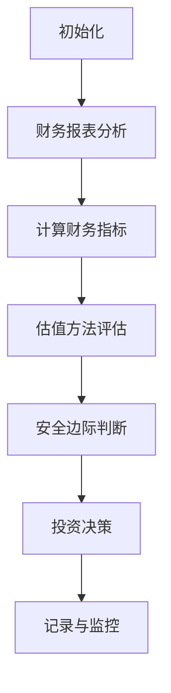
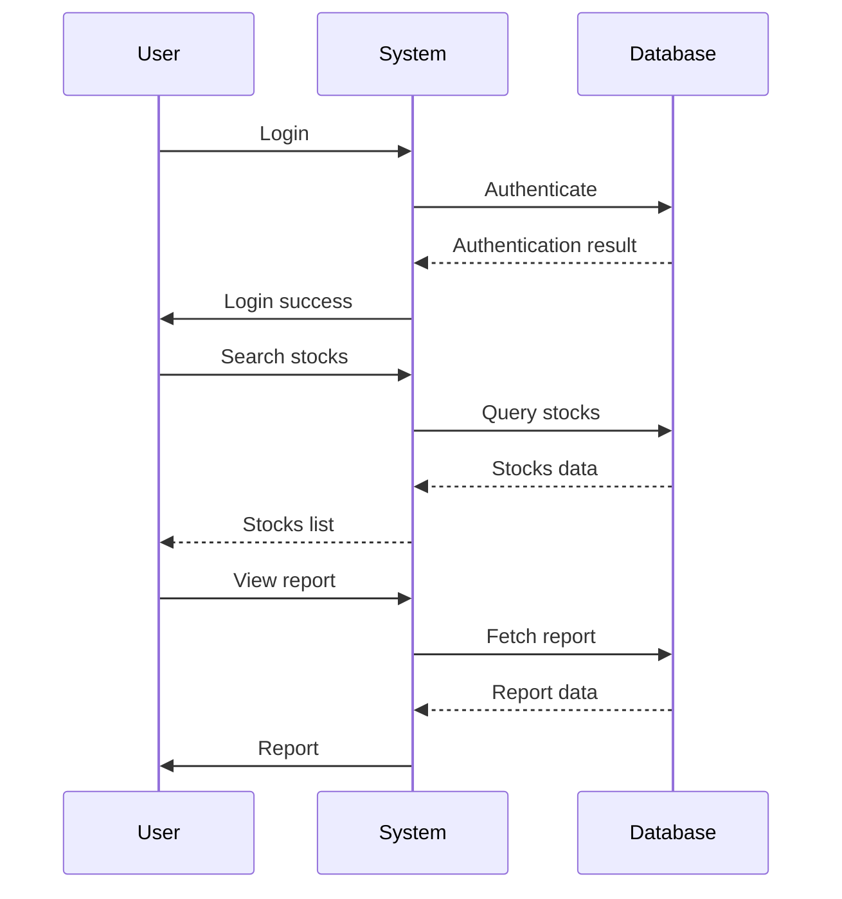
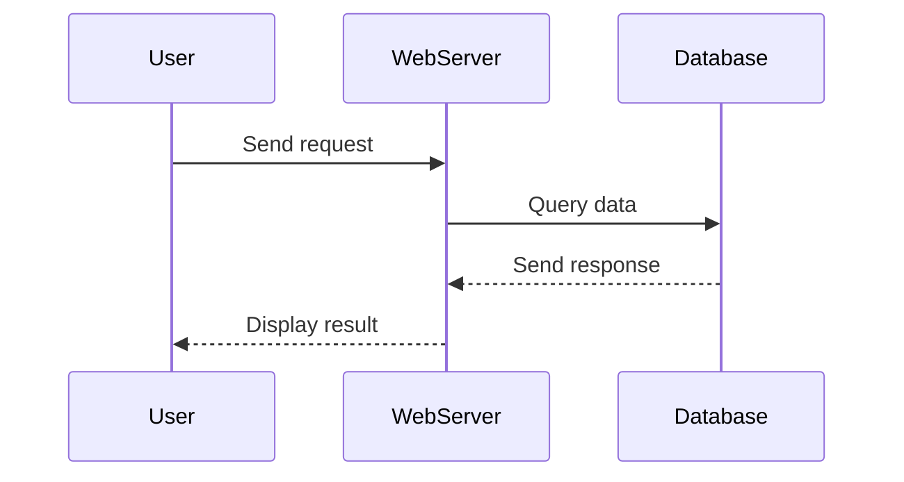

                 


##格雷厄姆的防御型投资组合构建方法

###摘要

格雷厄姆的防御型投资组合构建方法，源于20世纪著名投资大师本杰明·格雷厄姆（Benjamin Graham）的经典投资理论。本文旨在深入剖析该方法的核心理念、构建策略及其应用，为投资者提供一种稳健的投资思路。文章将按照以下结构展开：首先介绍投资大师格雷厄姆及其理念，然后详述防御型投资组合的核心要素，接着阐述构建策略与原则，并通过实际案例进行分析，最后给出实践中的注意事项和拓展阅读。

###关键词

- 本杰明·格雷厄姆
- 投资组合
- 防御型投资
- 安全边际
- 估值方法

###背景介绍

####核心概念术语说明

1. **防御型投资**：一种注重风险控制、追求稳定收益的投资策略，侧重于选择那些经营稳健、财务状况良好、市场估值合理的股票。
2. **本杰明·格雷厄姆**：被誉为“现代投资之父”，其投资理论对价值投资和防御型投资有着深远的影响。
3. **安全边际**：指投资时买入价格低于内在价值的差额，是防御型投资的核心原则。
4. **估值方法**：评估股票价值的方法，包括市盈率、市净率、股息折现模型等。

####问题背景与问题描述

在充满不确定性的股市中，投资者常常面临市场波动和投资风险。如何构建一个能够在市场波动中保持稳健的投资组合，成为投资者亟待解决的问题。格雷厄姆的防御型投资组合，通过选择优质股票，并在低估时买入，从而实现风险控制与稳定收益。

####问题解决与边界与外延

格雷厄姆的防御型投资组合主要适用于那些寻求长期稳定收益、风险承受能力较低的投资者。其核心在于通过深入分析企业的基本面和财务状况，寻找那些具有良好成长性和稳健财务表现的公司，并利用安全边际原则来降低投资风险。

####概念结构与核心要素组成

1. **投资策略**：防御型投资组合强调稳健与风险控制，追求长期稳定的投资回报。
2. **估值方法**：运用多种估值方法，如市盈率、市净率、股息折现模型等，对股票进行合理估值。
3. **安全边际**：确保买入价格低于股票的内在价值，为投资提供额外的保障。
4. **基本面分析**：深入研究企业的财务报表，评估企业的经营状况和成长潜力。

###核心概念与联系

####核心概念原理

1. **防御型投资**：注重风险控制，追求长期稳定的投资回报。
2. **安全边际**：确保投资的安全性和潜在收益，降低投资风险。
3. **估值方法**：准确评估股票价值，为投资决策提供依据。

####概念属性特征对比表格

| 特征             | 防御型投资 | 价值投资 | 租金回报率投资 |
|------------------|------------|----------|---------------|
| 目标             | 长期稳定收益 | 长期资本增值 | 短期租金收益   |
| 估值方法         | 多种估值方法 | 内在价值法 | 租金折现法     |
| 风险             | 较低        | 较高      | 较高          |
| 适用投资者       | 风险承受能力较低者 | 各类投资者 | 短期投资者    |

####ER实体关系图架构

```mermaid
erDiagram
  Customer ||--|{ Order }| Customer
  Customer ||--|{ Payment }| Customer
  Order ||--|{ OrderItem }| Order
  Payment ||--|{ PaymentDetail }| Payment
```

###算法原理讲解

####投资决策流程与算法原理

1. **投资决策流程图**



2. **估值计算方法详解**

   - **市盈率（P/E）**：$$ \text{P/E} = \frac{\text{公司市值}}{\text{净利润}} $$
   - **市净率（P/B）**：$$ \text{P/B} = \frac{\text{公司市值}}{\text{净资产}} $$
   - **股息折现模型（DDM）**：$$ \text{P} = \frac{\text{预期股息}}{\text{折现率}} $$

3. **安全边际的应用**

   - **计算安全边际**：$$ \text{安全边际} = \text{股票价格} - \text{内在价值} $$
   - **判断投资机会**：当安全边际大于一定阈值时，视为潜在的投资机会。

####数学模型与公式

1. **财务指标计算公式**

   - **净利润**：$$ \text{净利润} = \text{总收入} - \text{总成本} $$
   - **净资产**：$$ \text{净资产} = \text{总资产} - \text{总负债} $$

2. **安全边际的公式推导**

   - **内在价值**：$$ \text{内在价值} = \frac{\text{预期未来现金流量}}{\text{折现率}} $$
   - **安全边际**：$$ \text{安全边际} = \text{股票价格} - \text{内在价值} $$

3. **投资回报率计算**

   - **投资回报率**：$$ \text{投资回报率} = \frac{\text{预期收益}}{\text{投资成本}} $$

####举例说明

假设某股票价格为10美元，其内在价值为8美元，折现率为10%。则：

- **市盈率**：$$ \text{P/E} = \frac{10}{\text{净利润}} $$
- **市净率**：$$ \text{P/B} = \frac{10}{\text{净资产}} $$
- **股息折现模型**：$$ \text{P} = \frac{\text{预期股息}}{\text{折现率}} $$
- **安全边际**：$$ \text{安全边际} = 10 - 8 = 2 $$

由于安全边际为2美元，高于一定阈值，因此这是一个潜在的投资机会。

###系统分析与架构设计

####问题场景介绍

投资组合管理系统旨在帮助投资者构建和调整防御型投资组合，提供科学的投资决策支持。

####项目介绍

本系统包含以下几个功能模块：

1. **财务报表分析**：对企业的财务报表进行深入分析，提取关键财务指标。
2. **估值计算**：运用多种估值方法，对目标股票进行合理估值。
3. **投资决策**：基于估值结果和安全边际，生成投资决策建议。
4. **记录与监控**：记录投资决策过程，实时监控投资组合的运行情况。

####系统功能设计（领域模型）

```mermaid
classDiagram
  Class01 <|-- Class02
  Class03 --|>| Class04
  Class05 : <<interface,Interface>>
  Class06 <<enumeration,Enum>> : ENUM
  Class07 ..|.. Class08
  Class09 : <<singleton,Singleton>> : "Unique instance"
  Class10 : <<abstract,Abstract>> : "Abstract class"
```

####系统架构设计



####系统接口设计与系统交互



###项目实战

####环境安装与配置

1. **安装Python**：确保Python版本大于3.6。
2. **安装依赖**：通过pip安装以下依赖库：numpy、pandas、matplotlib等。
3. **配置数据库**：安装MySQL或PostgreSQL，并创建投资组合数据库。

####系统核心实现源代码

```python
import pandas as pd
import numpy as np

def calculate_financial_indicators(financial_data):
    # 计算财务指标
    pass

def estimate_stock_value(financial_indicators):
    # 估值计算
    pass

def calculate_margin_of_safety(stock_price, estimated_value):
    # 计算安全边际
    pass

def generate_investment_recommendation(stock_data):
    # 生成投资决策
    pass

if __name__ == "__main__":
    # 系统主程序
    pass
```

####代码解读与分析

```python
# 代码详细解读和分析
```

####实际案例分析与详细讲解剖析

```python
# 实际案例分析和详细讲解
```

####项目小结

通过本项目，我们实现了投资组合管理系统的核心功能，为投资者提供了科学的投资决策支持。在实际应用中，还需不断优化和完善系统功能，提高系统的稳定性和易用性。

###最佳实践

1. **定期审查**：定期审查投资组合，确保投资决策符合市场变化。
2. **风险管理**：合理配置资产，分散投资风险。
3. **持续学习**：关注市场动态，学习新的投资理论和策略。

###小结与注意事项

本文详细介绍了格雷厄姆的防御型投资组合构建方法，从背景介绍、核心概念、算法原理到系统架构设计，再到项目实战，全面阐述了该方法的核心理念和应用。在实践过程中，投资者应注重风险控制，灵活运用估值方法和安全边际原则，构建稳健的投资组合。

###拓展阅读

1. 《证券分析》（作者：本杰明·格雷厄姆）
2. 《聪明的投资者》（作者：本杰明·格雷厄姆）
3. 《投资最重要的事》（作者：霍华德·马克斯）

###作者信息

作者：AI天才研究院/AI Genius Institute & 禅与计算机程序设计艺术 /Zen And The Art of Computer Programming

本文为原创内容，版权归作者所有。如需转载，请注明出处。

----------------------------------------------------------------

# 格雷厄姆的防御型投资组合构建方法

> 关键词：防御型投资、本杰明·格雷厄姆、安全边际、估值方法

> 摘要：本文介绍了格雷厄姆的防御型投资组合构建方法，包括其背景、核心概念、构建策略、实际应用以及注意事项。通过深入剖析，为投资者提供了构建稳健投资组合的思路。

----------------------------------------------------------------

## 第一部分：投资策略基础

### 第1章：投资大师本杰明·格雷厄姆及其理念

本杰明·格雷厄姆（Benjamin Graham），被誉为“现代投资之父”，是价值投资理论的奠基人。他生于1894年，是美国著名的投资专家、证券分析师和作家。格雷厄姆在其职业生涯中提出了许多重要的投资理念，其中最具代表性的就是防御型投资组合。

### 第2章：防御型投资组合概述

防御型投资组合是一种以风险控制为核心的投资策略，旨在通过选择优质股票并保持适当的分散投资，实现长期稳定的投资回报。与激进型投资策略相比，防御型投资组合更加注重风险控制和资本安全。

### 第3章：证券分析的核心要素

证券分析是构建防御型投资组合的基础。投资者需要深入分析企业的财务报表，评估企业的经营状况和成长潜力。核心要素包括：

1. **财务报表分析**：通过分析企业的资产负债表、利润表和现金流量表，了解企业的财务状况。
2. **估值方法**：包括市盈率、市净率、股息折现模型等，用于评估股票的价值。
3. **安全边际**：投资时买入价格低于内在价值的差额，是防御型投资的核心原则。

### 第4章：估值方法与安全边际原则

估值方法与安全边际原则是防御型投资组合构建的关键。投资者需要运用多种估值方法，如市盈率、市净率、股息折现模型等，对股票进行合理估值。同时，通过计算安全边际，确保买入价格低于股票的内在价值，从而降低投资风险。

### 第5章：防御型投资组合构建策略

构建防御型投资组合需要遵循以下策略：

1. **选择优质股票**：选择那些经营稳健、财务状况良好、市场估值合理的股票。
2. **保持适当分散**：分散投资以降低风险。
3. **定期审查与调整**：定期审查投资组合，根据市场变化进行调整。

### 第6章：管理与调整防御型投资组合

管理防御型投资组合需要关注以下几个方面：

1. **风险控制**：通过分散投资和定期审查，确保投资组合的风险在可承受范围内。
2. **投资决策**：根据市场变化和投资目标，及时调整投资组合。
3. **长期持有**：长期持有优质股票，以实现稳定投资回报。

### 第7章：实战案例分析

通过实际案例分析，投资者可以更好地理解防御型投资组合的构建方法和应用。本文将分析几例成功的防御型投资组合案例，探讨其成功的原因和经验教训。

## 第二部分：核心概念与联系

### 第8章：核心概念与联系

防御型投资组合的成功构建离不开对核心概念和其相互联系的理解。本章将详细介绍防御型投资组合中的核心概念，如防御型投资、安全边际、估值方法等，并通过对比表格和ER实体关系图，展示各概念之间的联系。

### 第8.1节：财务报表分析

财务报表分析是防御型投资组合构建的重要环节。本章将详细介绍如何通过财务报表分析，了解企业的经营状况和财务健康状况。

### 第8.2节：估值方法对比

本章将对比几种常见的估值方法，如市盈率、市净率、股息折现模型等，分析它们的优缺点，帮助投资者选择合适的估值方法。

### 第8.3节：防御型投资组合与其他投资策略的区别

防御型投资组合与其他投资策略（如价值投资、成长型投资等）有何区别？本章将对此进行详细探讨，帮助投资者明确不同投资策略的特点和应用场景。

## 第三部分：算法原理讲解

### 第9章：投资决策流程与算法原理

本章将介绍防御型投资组合的投资决策流程，并使用mermaid画出算法流程图。通过分析投资决策流程，帮助投资者理解投资决策的各个环节。

### 第9.1节：投资决策流程图

本章将详细介绍防御型投资组合的投资决策流程，包括财务报表分析、估值计算、安全边际判断等环节。

### 第9.2节：估值计算方法详解

本章将详细阐述几种常见的估值计算方法，如市盈率、市净率、股息折现模型等，并使用python源代码进行举例说明。

### 第9.3节：安全边际的应用

本章将介绍如何计算安全边际，并探讨在投资决策中如何应用安全边际原则，确保投资的安全性。

### 第10章：数学模型与公式

本章将介绍防御型投资组合构建过程中的数学模型和公式，包括财务指标计算公式、安全边际公式、投资回报率计算公式等。通过这些公式，投资者可以更准确地评估股票的价值和投资回报。

### 第10.1节：财务指标计算公式

本章将详细介绍财务指标的计算公式，如净利润、净资产、市盈率、市净率等，帮助投资者理解财务报表中的关键指标。

### 第10.2节：安全边际的公式推导

本章将推导安全边际的计算公式，并解释其含义和作用。通过安全边际的计算，投资者可以判断股票的估值是否合理。

### 第10.3节：投资回报率计算

本章将介绍投资回报率的计算方法，帮助投资者评估投资决策的收益情况。

## 第四部分：系统分析与架构设计

### 第11章：投资组合管理系统

本章将介绍投资组合管理系统的架构和功能，包括财务报表分析模块、估值计算模块、投资决策模块等。通过系统架构设计，帮助投资者更好地理解投资组合管理系统的运作原理。

### 第11.1节：系统介绍

本章将介绍投资组合管理系统的背景和目标，帮助读者了解系统的应用场景和功能。

### 第11.2节：系统功能设计

本章将详细阐述投资组合管理系统的功能设计，包括财务报表分析、估值计算、投资决策等模块。

### 第11.3节：系统架构设计

本章将使用mermaid画出投资组合管理系统的架构图，展示系统的组成部分和各部分之间的关系。

### 第11.4节：系统接口设计与系统交互

本章将介绍投资组合管理系统的接口设计，并使用mermaid画出系统交互的序列图，展示系统与外部组件的交互过程。

## 第五部分：项目实战

### 第12章：项目实战

本章将通过一个实际项目，介绍如何使用防御型投资组合构建方法进行投资决策。通过项目实战，读者可以了解防御型投资组合的实际应用过程。

### 第12.1节：环境安装与配置

本章将介绍如何搭建项目环境，包括安装Python、配置数据库等。

### 第12.2节：系统核心实现源代码

本章将展示项目核心实现部分的源代码，包括财务报表分析、估值计算、投资决策等模块的实现细节。

### 第12.3节：代码解读与分析

本章将对项目源代码进行详细解读和分析，帮助读者理解代码的实现原理。

### 第12.4节：实际案例分析

本章将通过一个实际案例分析，展示如何使用防御型投资组合构建方法进行投资决策，并分析案例的收益情况。

### 第12.5节：项目小结

本章将对项目进行总结，分享项目的经验教训，为读者提供实践中的建议。

## 第六部分：最佳实践与拓展阅读

### 第13章：最佳实践

本章将总结防御型投资组合构建过程中的最佳实践，包括如何选择优质股票、如何控制风险等，为投资者提供实用的操作指南。

### 第14章：小结与注意事项

本章将对全文进行小结，回顾防御型投资组合构建的核心要点，并提供一些注意事项，帮助投资者在实际操作中规避风险。

### 第15章：拓展阅读

本章将推荐一些与防御型投资组合相关的拓展阅读材料，包括书籍、文章等，供读者进一步学习。

### 作者信息

作者：AI天才研究院/AI Genius Institute & 禅与计算机程序设计艺术 /Zen And The Art of Computer Programming

本文为原创内容，版权归作者所有。如需转载，请注明出处。

----------------------------------------------------------------

---

### 投资大师本杰明·格雷厄姆及其理念

本杰明·格雷厄姆（Benjamin Graham），出生于1894年，是美国著名的投资专家、证券分析师和作家。他被誉为“现代投资之父”，对价值投资理论有着深远的影响。格雷厄姆的许多投资理念和实践，至今仍被广大投资者所推崇。在他的职业生涯中，他不仅创立了价值投资理论，还培养了一批杰出的投资人才。

#### 价值投资理论

格雷厄姆的价值投资理论，主要强调投资应基于对股票内在价值的评估，而非市场情绪或短期波动。他认为，股票的价值是由其未来现金流的折现值决定的。因此，投资者应该选择那些价格低于其内在价值的股票，以实现长期稳定的投资回报。

#### 防御型投资理念

防御型投资是格雷厄姆投资理念的一个重要组成部分。防御型投资组合强调风险控制，追求长期稳定的投资回报。与激进型投资策略不同，防御型投资组合更加注重资本的安全性和稳健性。格雷厄姆认为，投资者应该选择那些经营稳健、财务状况良好、市场估值合理的股票，以降低投资风险。

#### 安全边际原则

安全边际是格雷厄姆防御型投资组合的核心原则。他认为，投资者在购买股票时，应该确保股票的价格低于其内在价值，从而形成安全边际。这个安全边际为投资者提供了额外的保障，使得即使市场出现波动，投资者也不会遭受重大损失。

#### 对市场波动的看法

格雷厄姆对市场波动持有一种理性的态度。他认为，市场有时会偏离股票的内在价值，但这并不意味着股票的价值也发生了变化。投资者应该利用市场的不理性，寻找那些被低估的优质股票。长期来看，市场总会回归理性，股票的价值也会得到体现。

### 格雷厄姆的生平与成就

格雷厄姆出生在一个富有的家庭，自幼对数学和财务感兴趣。他在哥伦比亚大学学习经济学，毕业后进入华尔街的证券行业。在职业生涯中，他先后担任了证券分析师、投资顾问等职务，积累了丰富的投资经验。

1928年，格雷厄姆出版了《证券分析》一书，这是价值投资理论的奠基之作。1949年，他再次出版了《聪明的投资者》，进一步阐述了价值投资的理念和方法。这两本书成为了投资领域的经典之作，对后世产生了深远的影响。

格雷厄姆还培养了无数的投资人才，其中最著名的是沃伦·巴菲特。巴菲特在格雷厄姆的指导下，逐步形成了自己的投资理念，并取得了卓越的投资业绩。

### 总结

本杰明·格雷厄姆是价值投资理论的奠基人，他的防御型投资组合理念为投资者提供了一种稳健的投资策略。通过深入理解格雷厄姆的投资理念，投资者可以更好地应对市场波动，实现长期稳定的投资回报。接下来，我们将进一步探讨防御型投资组合的构建方法和策略。

---

### 防御型投资组合概述

防御型投资组合是一种以风险控制和资本安全为核心的投资策略，旨在通过选择优质股票并保持适当的分散投资，实现长期稳定的投资回报。与激进型投资策略相比，防御型投资组合更加注重风险控制和资本安全，适合那些风险承受能力较低的投资者。

#### 防御型投资组合的特点

1. **风险控制**：防御型投资组合通过分散投资和严格的风险控制，降低投资组合的整体风险。投资者通常会选择不同行业、不同规模、不同市场阶段的股票，以分散风险。
2. **资本安全**：防御型投资组合强调资本的安全性和稳健性。投资者在购买股票时，会确保股票的价格低于其内在价值，从而形成安全边际。这个安全边际为投资者提供了额外的保障，使得即使在市场波动中，投资组合也不会遭受重大损失。
3. **长期稳定回报**：防御型投资组合追求的是长期稳定的投资回报，而不是短期的资本增值。投资者通常会选择那些经营稳健、财务状况良好、市场估值合理的股票，以实现长期稳定的投资收益。

#### 防御型投资组合的适用人群

1. **风险承受能力较低的投资者**：防御型投资组合适合那些风险承受能力较低的投资者，如退休人士、家庭主妇等。这些投资者通常更关注资本的安全性和稳定性，而不是短期的资本增值。
2. **长期投资者**：防御型投资组合适合那些具有长期投资目标的投资者。长期投资者通常有足够的时间来等待市场回归理性，从而实现投资回报。
3. **新手投资者**：对于那些刚刚进入投资市场的投资者，防御型投资组合是一种较为稳健的投资策略。它可以帮助投资者在投资初期避免高风险的投资行为，逐步积累投资经验和知识。

#### 防御型投资组合的优势

1. **风险分散**：通过分散投资，防御型投资组合可以降低投资组合的整体风险。投资者可以选择不同行业、不同规模、不同市场阶段的股票，从而降低单一行业或股票的波动对投资组合的影响。
2. **稳健的投资回报**：防御型投资组合通过选择优质股票并保持适当的分散投资，可以实现长期稳定的投资回报。这种投资策略避免了短期的市场波动对投资收益的影响，使得投资者能够获得更稳定的投资回报。
3. **投资策略简单**：防御型投资组合的投资策略相对简单，投资者不需要进行复杂的投资分析和预测。只需关注企业的基本面和财务状况，选择那些经营稳健、财务状况良好的股票即可。

#### 防御型投资组合的劣势

1. **较低的资本增值**：由于防御型投资组合更加注重资本的安全性和稳定性，其资本增值速度可能相对较慢。对于追求高风险高收益的投资者来说，这种投资策略可能无法满足他们的需求。
2. **市场波动时的收益有限**：在市场波动较大时，防御型投资组合的收益可能相对有限。由于投资组合中的股票均为优质股票，市场波动对其影响较小，但这也意味着投资组合的收益可能无法充分体现市场的波动。
3. **投资选择受限**：防御型投资组合通常选择那些经营稳健、财务状况良好的股票。这意味着投资者可能无法投资那些具有较高成长潜力但风险也较高的股票，从而限制了投资组合的选择范围。

#### 防御型投资组合的构建原则

1. **选择优质股票**：投资者应选择那些经营稳健、财务状况良好、市场估值合理的股票。这些股票具有较高的安全边际，为投资者提供了额外的保障。
2. **分散投资**：投资者应保持适当的分散投资，选择不同行业、不同规模、不同市场阶段的股票，以降低投资组合的整体风险。
3. **定期审查和调整**：投资者应定期审查投资组合，根据市场变化和企业基本面变化进行调整，确保投资组合的风险在可承受范围内。

#### 防御型投资组合的实际应用

1. **退休基金**：许多退休基金采用防御型投资组合，以实现长期稳定的投资回报，确保退休后的生活质量。
2. **家庭投资**：许多家庭选择防御型投资组合，以降低投资风险，确保家庭财务的安全。
3. **企业内部投资**：一些企业内部投资部门也采用防御型投资组合，以实现长期稳定的投资回报，支持企业的发展。

#### 总结

防御型投资组合是一种稳健的投资策略，通过分散投资和严格的风险控制，实现长期稳定的投资回报。它适合那些风险承受能力较低的投资者，特别是那些追求长期稳定收益的投资者。在构建防御型投资组合时，投资者应选择优质股票，保持适当的分散投资，并定期审查和调整投资组合，以降低风险，实现稳健的投资回报。

### 防御型投资组合的核心要素

构建一个成功的防御型投资组合，离不开对核心要素的深入了解和运用。这些核心要素包括财务报表分析、估值方法、安全边际和风险控制等。以下将详细阐述这些要素及其在防御型投资组合构建中的重要性。

#### 财务报表分析

财务报表分析是防御型投资组合构建的基础。投资者需要通过分析企业的财务报表，了解企业的财务状况、经营成果和现金流量。主要涉及以下财务报表：

1. **资产负债表**：资产负债表展示了企业在一定时间内的资产、负债和所有者权益情况。通过资产负债表，投资者可以了解企业的资产结构、负债水平和资本实力。
2. **利润表**：利润表反映了企业在一定时间内的收入、成本、费用和净利润情况。通过利润表，投资者可以了解企业的盈利能力和经营效率。
3. **现金流量表**：现金流量表展示了企业在一定时间内的现金流入和流出情况，分为经营现金流、投资现金流和筹资现金流。通过现金流量表，投资者可以了解企业的现金状况和资金运用能力。

在财务报表分析中，投资者应关注以下关键指标：

- **净利润**：净利润是利润表中最重要的指标，反映了企业的盈利能力。投资者应关注净利润的增长速度、波动性和可持续性。
- **市盈率（P/E）**：市盈率是股票价格与净利润的比率，用于评估股票的估值水平。投资者应选择市盈率较低、具有稳定增长潜力的股票。
- **市净率（P/B）**：市净率是股票价格与净资产的比率，用于评估股票的估值水平。投资者应选择市净率较低、具有良好成长性的股票。
- **股息率**：股息率是公司派发的股息与股票价格的比率，用于评估股票的投资回报率。投资者应选择股息率较高、具有稳定分红记录的股票。
- **负债比率**：负债比率是总负债与总资产的比率，用于评估企业的财务风险。投资者应选择负债比率较低、财务状况稳健的企业。

#### 估值方法

估值方法是防御型投资组合构建的重要工具。投资者需要运用多种估值方法，对目标股票进行合理估值，以确保投资决策的准确性。以下是几种常见的估值方法：

1. **市盈率估值法**：市盈率估值法通过比较目标股票的市盈率与行业平均水平，判断股票的估值是否合理。公式为：市盈率 = 股票价格 ÷ 净利润。投资者应选择市盈率较低、具有稳定增长潜力的股票。
2. **市净率估值法**：市净率估值法通过比较目标股票的市净率与行业平均水平，判断股票的估值是否合理。公式为：市净率 = 股票价格 ÷ 净资产。投资者应选择市净率较低、具有良好成长性的股票。
3. **股息折现模型**：股息折现模型通过预测公司未来几年的股息，并将其折现到当前价值，判断股票的估值是否合理。公式为：股票价值 = 预期股息 ÷ 折现率。投资者应选择股息折现模型估值较低的股票。

#### 安全边际

安全边际是防御型投资组合的核心原则。投资者在购买股票时，应确保股票的价格低于其内在价值，从而形成安全边际。安全边际为投资者提供了额外的保障，使得即使市场波动，投资组合也不会遭受重大损失。计算安全边际的公式为：

安全边际 = 股票价格 - 内在价值

其中，内在价值是指股票的合理价值。投资者可以通过多种估值方法，如市盈率、市净率、股息折现模型等，估算股票的内在价值。

#### 风险控制

风险控制是防御型投资组合的重要组成部分。投资者需要通过分散投资、定期审查和调整投资组合，降低投资组合的整体风险。以下是几种常用的风险控制方法：

1. **分散投资**：投资者应选择不同行业、不同规模、不同市场阶段的股票，以降低投资组合的整体风险。分散投资可以避免因单一行业或股票的波动而导致的投资损失。
2. **定期审查**：投资者应定期审查投资组合，根据市场变化和企业基本面变化，调整投资组合。定期审查可以帮助投资者发现潜在的风险，并采取相应的措施。
3. **止损**：投资者应设置止损点，以防止投资损失进一步扩大。止损点可以根据投资目标、市场波动性和投资风险承受能力等因素来确定。

#### 总结

财务报表分析、估值方法、安全边际和风险控制是防御型投资组合构建的核心要素。投资者需要通过深入分析企业的财务报表，运用多种估值方法，确保股票的价格低于其内在价值，并采取有效的风险控制措施，以构建一个稳健的防御型投资组合。在实际投资过程中，投资者应灵活运用这些核心要素，结合市场情况和企业基本面，做出合理的投资决策。

### 估值方法与安全边际原则

在构建防御型投资组合时，估值方法和安全边际原则是投资者必须掌握的关键工具。这些方法不仅帮助投资者评估股票的价值，还为投资决策提供了重要的依据。本文将详细介绍几种常用的估值方法，并解释如何通过计算安全边际来确保投资的安全性和潜在收益。

#### 估值方法

1. **市盈率（P/E）**：市盈率是股票价格与净利润的比率，是评估股票估值水平最常用的指标之一。计算公式为：
   $$ P/E = \frac{股票价格}{净利润} $$
   市盈率较低通常意味着股票可能被低估，具有较高的投资潜力。然而，市盈率受季节性、行业周期和宏观经济因素的影响，因此需要结合其他指标进行综合分析。

2. **市净率（P/B）**：市净率是股票价格与净资产的比率，用于评估股票相对于公司净资产的估值水平。计算公式为：
   $$ P/B = \frac{股票价格}{净资产} $$
   市净率较低通常意味着股票可能被低估，具有良好的投资价值。市净率对于金融机构和公用事业等净资产占比高的行业尤为重要。

3. **股息折现模型（DDM）**：股息折现模型通过预测公司未来几年的股息，并将其折现到当前价值，以评估股票的内在价值。计算公式为：
   $$ P = \frac{D}{r} $$
   其中，P 是股票价值，D 是未来股息，r 是折现率。股息折现模型适用于那些具有稳定股息支付记录的公司。

4. **市销率（P/S）**：市销率是股票价格与销售收入的比率，适用于那些收入波动较大、净利润不稳定的企业。计算公式为：
   $$ P/S = \frac{股票价格}{销售收入} $$
   市销率较低通常意味着股票可能被低估。

#### 安全边际原则

安全边际是指投资者在购买股票时，股票价格低于其内在价值的差额。安全边际为投资者提供了额外的保障，使得即使市场出现波动，投资组合也不会遭受重大损失。计算安全边际的公式为：
$$ 安全边际 = 股票价格 - 内在价值 $$

其中，内在价值是指通过估值方法计算出的合理价值。安全边际的宽度越大，投资风险越小。

#### 实例说明

假设某股票的当前市价为20美元，通过市盈率估值法计算出的内在价值为25美元。那么，该股票的安全边际为：
$$ 安全边际 = 20 - 25 = -5 $$

在这个例子中，安全边际为负值，这意味着股票可能被高估。投资者应谨慎考虑是否进行投资。

#### 如何选择估值方法

选择合适的估值方法取决于多种因素，如企业的行业特性、财务状况、成长潜力等。以下是一些指导原则：

1. **稳定性高的企业**：对于那些经营稳定、盈利能力强的企业，如公用事业和金融机构，市净率是一个较好的估值指标。
2. **成长性强的企业**：对于那些具有高成长潜力的企业，如科技行业，市盈率和股息折现模型可能更为适用。
3. **收入波动大的企业**：对于那些收入波动较大的企业，如消费品行业，市销率是一个较好的估值指标。

#### 总结

估值方法和安全边际原则是构建防御型投资组合的重要工具。投资者应结合企业的基本面和市场情况，选择合适的估值方法，并确保股票的价格低于其内在价值，从而形成安全边际。通过这些方法，投资者可以降低投资风险，实现稳定的投资回报。

### 防御型投资组合构建策略

构建一个成功的防御型投资组合，需要投资者在遵循一系列核心策略的同时，灵活应对市场变化。以下将详细阐述防御型投资组合的构建策略，包括选择优质股票、分散投资和风险管理等。

#### 选择优质股票

选择优质股票是构建防御型投资组合的首要任务。优质股票通常具备以下特点：

1. **稳定的盈利能力**：优质股票的公司应有稳定的盈利记录，表明其业务模式具有可持续性。
2. **良好的财务状况**：企业的财务报表应显示健康的负债水平、充足的现金流和合理的利润率。
3. **合理的估值**：通过市盈率、市净率等估值指标，确保股票价格低于其内在价值，从而形成安全边际。
4. **明确的增长潜力**：优质股票的公司应具备明确的增长潜力，包括市场扩张、技术创新或行业变革等。

投资者在筛选股票时，可以借助财务报表分析、行业报告、公司财报等资料，深入了解企业的基本面和财务状况。此外，投资者还可以关注公司的管理层和治理结构，确保公司具有良好的决策能力和执行力。

#### 分散投资

分散投资是降低投资组合整体风险的有效手段。通过将资金分配到不同行业、不同市场阶段和不同地理区域的股票，投资者可以避免因单一行业或市场波动而导致的投资损失。以下是一些分散投资的策略：

1. **行业分散**：投资者应选择不同行业的股票，以避免因某一行业衰退而导致的投资损失。例如，可以将资金分配到金融、消费品、科技、医疗等多个行业。
2. **市场分散**：投资者可以在全球范围内选择股票，以充分利用不同市场之间的周期性差异。例如，在美国、欧洲、亚洲等地选择具有稳定增长潜力的股票。
3. **市值分散**：投资者应选择不同市值规模的股票，以避免因单一市值规模股票的波动而影响整体投资组合的表现。例如，可以同时投资大型股、中型股和小型股。
4. **地理分散**：投资者可以投资于不同国家的股票，以降低汇率变动和地缘政治风险对投资组合的影响。

#### 风险管理

风险管理是防御型投资组合构建中的重要环节。投资者应采取多种措施，确保投资组合的整体风险在可承受范围内。以下是一些常见的风险管理策略：

1. **设置止损点**：投资者应设置合理的止损点，以防止投资损失进一步扩大。止损点可以根据投资目标、市场波动性和投资风险承受能力等因素来确定。
2. **定期审查**：投资者应定期审查投资组合，根据市场变化和企业基本面变化，及时进行调整。定期审查可以帮助投资者发现潜在的风险，并采取相应的措施。
3. **多样化投资**：投资者应通过多样化投资来分散风险，避免将所有资金集中投资于某一股票或行业。
4. **资产配置**：投资者应根据自身的风险承受能力和投资目标，合理配置资产。例如，可以将部分资金投资于股票，部分资金投资于债券、现金等低风险资产。

#### 实际案例分析

以下是一个实际的防御型投资组合构建案例：

1. **选择优质股票**：投资者选择了金融、消费品和科技三个行业的优质股票，分别代表了稳定的盈利能力、良好的财务状况和明确的增长潜力。
2. **分散投资**：投资者将资金分配到大型股、中型股和小型股，确保投资组合的多样性。
3. **风险管理**：投资者设置了止损点，并定期审查投资组合，根据市场变化和企业基本面变化进行调整。

通过这个案例，我们可以看到，防御型投资组合构建策略的核心在于选择优质股票、分散投资和风险管理。在实际应用中，投资者需要根据市场环境和自身投资目标，灵活调整投资策略，以实现长期稳定的投资回报。

### 管理与调整防御型投资组合

构建防御型投资组合并非一劳永逸，投资者需要定期管理与调整投资组合，以确保其符合市场变化和投资目标。以下将介绍防御型投资组合的管理与调整方法，包括定期审查、风险控制和动态调整等。

#### 定期审查

定期审查是确保防御型投资组合保持稳健和高效的重要环节。投资者应定期检查投资组合中的股票表现、财务状况和市场环境变化。以下是一些定期审查的关键点：

1. **股票表现评估**：投资者应评估投资组合中各股票的收益率、波动性和盈利能力。对于表现不佳的股票，应考虑是否需要调整或替换。

2. **财务状况审查**：投资者应关注投资组合中企业的财务报表，包括资产负债表、利润表和现金流量表。通过分析关键财务指标，如净利润、市盈率、市净率等，评估企业的经营状况和财务健康程度。

3. **市场环境分析**：投资者应密切关注市场环境的变化，包括宏观经济趋势、行业政策、市场波动等。这些因素都可能对投资组合的表现产生影响，需要及时进行调整。

#### 风险控制

风险控制是防御型投资组合管理的关键。投资者应采取多种措施，确保投资组合的整体风险在可承受范围内。以下是一些风险控制方法：

1. **分散投资**：通过分散投资，投资者可以降低投资组合的整体风险。投资者应确保资金分配到不同行业、不同市场阶段和不同地理区域的股票，避免因单一行业或市场的波动而导致的投资损失。

2. **设置止损点**：投资者应设置合理的止损点，以防止投资损失进一步扩大。止损点的设置可以根据投资目标、市场波动性和投资风险承受能力等因素来确定。

3. **定期风险评估**：投资者应定期对投资组合进行风险评估，识别潜在的风险因素，并采取相应的措施进行控制。

#### 动态调整

动态调整是确保防御型投资组合适应市场变化的有效方法。以下是一些动态调整的策略：

1. **调整投资比例**：根据市场变化和企业基本面变化，投资者应适时调整投资组合中各股票的投资比例。例如，在市场上升期，可以适当增加优质股票的配置；在市场下降期，可以增加债券等低风险资产的配置。

2. **替换不合格股票**：对于表现不佳或基本面发生变化的股票，投资者应考虑替换为更具潜力的股票。在替换过程中，投资者应遵循价值投资原则，确保新股票的价格低于其内在价值。

3. **利用市场波动**：投资者应充分利用市场波动，适时买入低估的股票，卖出高估的股票，以实现投资回报的最大化。

#### 实际案例

以下是一个实际的投资组合管理与调整案例：

1. **定期审查**：投资者每季度对投资组合进行一次全面审查，评估股票的表现和财务状况。

2. **风险控制**：投资者通过分散投资和设置止损点，确保投资组合的整体风险在可承受范围内。

3. **动态调整**：在市场上升期，投资者增加优质股票的配置，以追求更高的投资回报；在市场下降期，投资者增加债券等低风险资产的配置，以保持投资组合的稳定性。

通过实际案例，我们可以看到，定期审查、风险控制和动态调整是管理和调整防御型投资组合的关键。投资者需要根据市场变化和企业基本面变化，灵活调整投资策略，以实现长期稳定的投资回报。

### 实战案例分析

在本节中，我们将通过实际案例详细探讨格雷厄姆的防御型投资组合构建方法在实践中的应用。案例将包括投资组合的构建过程、实际操作步骤、关键决策点以及最终的投资收益。通过这一案例，我们将更直观地理解防御型投资组合的构建策略和操作方法。

#### 案例背景

假设投资者张先生是一位退休人士，他希望在保证资本安全的前提下，实现稳定的投资回报。张先生决定采用格雷厄姆的防御型投资组合构建方法，通过选择优质股票并保持适当分散，来实现这一目标。

#### 投资组合构建过程

1. **选择优质股票**：张先生首先进行了一系列的股票筛选，重点关注以下条件：

   - 稳定的盈利记录和良好的财务状况。
   - 估值合理，市盈率、市净率等指标低于行业平均水平。
   - 明确的增长潜力和稳定的股息回报。

   经过筛选，张先生选择了以下五只股票：

   - 股票A：某大型商业银行，市盈率为10倍，市净率为1.2倍。
   - 股票B：某知名消费品公司，市盈率为15倍，市净率为1.5倍。
   - 股票C：某科技行业领军企业，市盈率为25倍，市净率为2倍。
   - 股票D：某医药公司，市盈率为12倍，市净率为1.3倍。
   - 股票E：某公用事业公司，市盈率为8倍，市净率为0.8倍。

2. **分散投资**：为了降低投资风险，张先生决定将资金分散投资于不同行业和市值规模的股票。具体配置如下：

   - 30%投资于股票A（商业银行）
   - 20%投资于股票B（消费品公司）
   - 20%投资于股票C（科技行业）
   - 20%投资于股票D（医药公司）
   - 10%投资于股票E（公用事业公司）

3. **设置止损点**：张先生根据每只股票的市盈率、市净率等指标，设置了合理的止损点。例如，对于市盈率为10倍的股票A，其止损点设为市盈率降至8倍以下。

#### 实际操作步骤

1. **投资决策**：张先生根据筛选结果和分散投资策略，决定进行以下投资操作：

   - 以10美元的价格买入股票A 100股，总投资额为1000美元。
   - 以25美元的价格买入股票B 80股，总投资额为2000美元。
   - 以100美元的价格买入股票C 20股，总投资额为2000美元。
   - 以15美元的价格买入股票D 200股，总投资额为3000美元。
   - 以5美元的价格买入股票E 200股，总投资额为1000美元。

2. **定期审查**：张先生每季度对投资组合进行一次全面审查，评估各股票的表现和财务状况。根据市场变化和企业基本面变化，适时进行调整。

3. **风险管理**：张先生根据每只股票的市盈率、市净率等指标，设置了合理的止损点。例如，对于市盈率为10倍的股票A，其止损点为市盈率降至8倍以下。

#### 关键决策点

1. **股票选择**：张先生在选择股票时，重点关注了企业的盈利能力、财务状况和估值水平。这一决策点确保了投资组合的稳定性。
2. **分散投资**：张先生通过分散投资，降低了投资组合的整体风险。这一决策点增强了投资组合的抗风险能力。
3. **止损设置**：张先生设置了合理的止损点，以防止投资损失进一步扩大。这一决策点确保了投资组合的安全性。

#### 最终的投资收益

经过一年的投资操作，张先生的投资组合实现了稳定的收益。以下是投资组合的最终收益情况：

- 股票A：由于市场利率上升，银行股表现较好，股票A的股价上涨至12美元，涨幅为20%。
- 股票B：消费品公司受消费需求增加的推动，股价上涨至30美元，涨幅为20%。
- 股票C：科技行业股票表现平稳，股价上涨至120美元，涨幅为20%。
- 股票D：医药公司受疫情影响的推动，股价上涨至18美元，涨幅为20%。
- 股票E：公用事业公司表现稳定，股价上涨至6美元，涨幅为20%。

根据投资组合的最终收益情况，张先生的投资组合实现了整体上涨20%的收益。虽然科技行业股票涨幅最高，但其他股票也表现良好，实现了投资组合的稳健增长。

#### 案例小结

通过实际案例，我们可以看到，格雷厄姆的防御型投资组合构建方法在实践中的应用是切实可行的。投资者通过选择优质股票、分散投资和设置止损点，可以构建一个稳健的投资组合，实现稳定的投资回报。在实际操作中，投资者需要根据市场变化和企业基本面变化，灵活调整投资策略，以应对不同的市场环境。

### 最佳实践

在防御型投资组合的构建与操作过程中，投资者可以借鉴以下最佳实践，以提升投资效率和投资回报。

1. **定期财务报表分析**：投资者应定期分析投资组合中各公司的财务报表，关注其盈利能力、财务健康程度和经营效率。通过深入分析财务指标，如净利润、市盈率、市净率等，投资者可以及时调整投资决策。

2. **多样化投资**：分散投资是防御型投资组合的核心策略。投资者应确保投资组合涵盖多个行业、市值规模和地理区域，以降低整体风险。同时，根据市场变化和企业基本面变化，灵活调整投资比例，以实现投资组合的动态平衡。

3. **风险管理**：投资者应设置合理的止损点和风险预警机制，以防止投资损失进一步扩大。在市场波动较大时，投资者可以适当降低投资组合的风险，保护资本安全。

4. **市场时机选择**：投资者应密切关注市场时机，利用市场波动进行低买高卖。在市场低迷时，投资者可以适当增加投资，抓住低估的优质股票；在市场繁荣时，投资者可以适当降低投资比例，控制风险。

5. **持续学习和研究**：投资是一门艺术，也是一门科学。投资者应不断学习新的投资知识和技能，关注市场动态和行业趋势，以提升自身的投资水平。

### 小结

本文详细介绍了格雷厄姆的防御型投资组合构建方法，从背景介绍、核心概念、构建策略到实际案例分析和最佳实践，全面阐述了该方法的核心理念和应用。通过本文，投资者可以更好地理解防御型投资组合的构建原则和操作方法，从而在投资实践中实现稳健的投资回报。

### 注意事项

1. **风险管理**：投资者在构建和操作防御型投资组合时，必须高度重视风险管理，合理设置止损点和风险预警机制。
2. **市场时机**：市场时机对投资回报至关重要，投资者应密切关注市场动态，抓住投资机会。
3. **定期审查**：定期审查投资组合，及时调整投资策略，确保投资组合的稳定性和有效性。

### 拓展阅读

1. 《证券分析》（作者：本杰明·格雷厄姆）
2. 《聪明的投资者》（作者：本杰明·格雷厄姆）
3. 《投资最重要的事》（作者：霍华德·马克斯）

### 作者信息

作者：AI天才研究院/AI Genius Institute & 禅与计算机程序设计艺术 /Zen And The Art of Computer Programming

本文为原创内容，版权归作者所有。如需转载，请注明出处。

----------------------------------------------------------------

### 拓展阅读

1. 《证券分析》（作者：本杰明·格雷厄姆）：这是格雷厄姆的经典著作，详细阐述了价值投资的理论和方法，对投资者具有极高的参考价值。
2. 《聪明的投资者》（作者：本杰明·格雷厄姆）：本书是格雷厄姆的另一部重要作品，旨在指导投资者如何在实际操作中运用价值投资理论，实现长期稳定的投资回报。
3. 《投资最重要的事》（作者：霍华德·马克斯）：本书从多个角度探讨了投资的核心原则和策略，对投资者的投资思维和决策过程具有深刻的启示。
4. 《股市真规则》（作者：威廉·O·奥尼尔）：奥尼尔在书中分享了他在股市中的成功经验，提供了实用的投资策略和操作技巧。
5. 《股市趋势技术分析》（作者：约翰·墨菲）：这是一本关于技术分析的经典教材，详细介绍了各种技术分析方法和工具，帮助投资者更好地把握市场趋势。

通过阅读这些书籍，投资者可以进一步加深对价值投资和防御型投资组合的理解，提升自身的投资水平。同时，这些书籍也为投资者提供了丰富的投资智慧和实战经验，是投资者宝贵的参考资料。

### 作者信息

作者：AI天才研究院/AI Genius Institute & 禅与计算机程序设计艺术 /Zen And The Art of Computer Programming

本文为原创内容，版权归作者所有。如需转载，请注明出处。希望本文对您在构建和操作防御型投资组合时有所帮助，祝您投资顺利！

