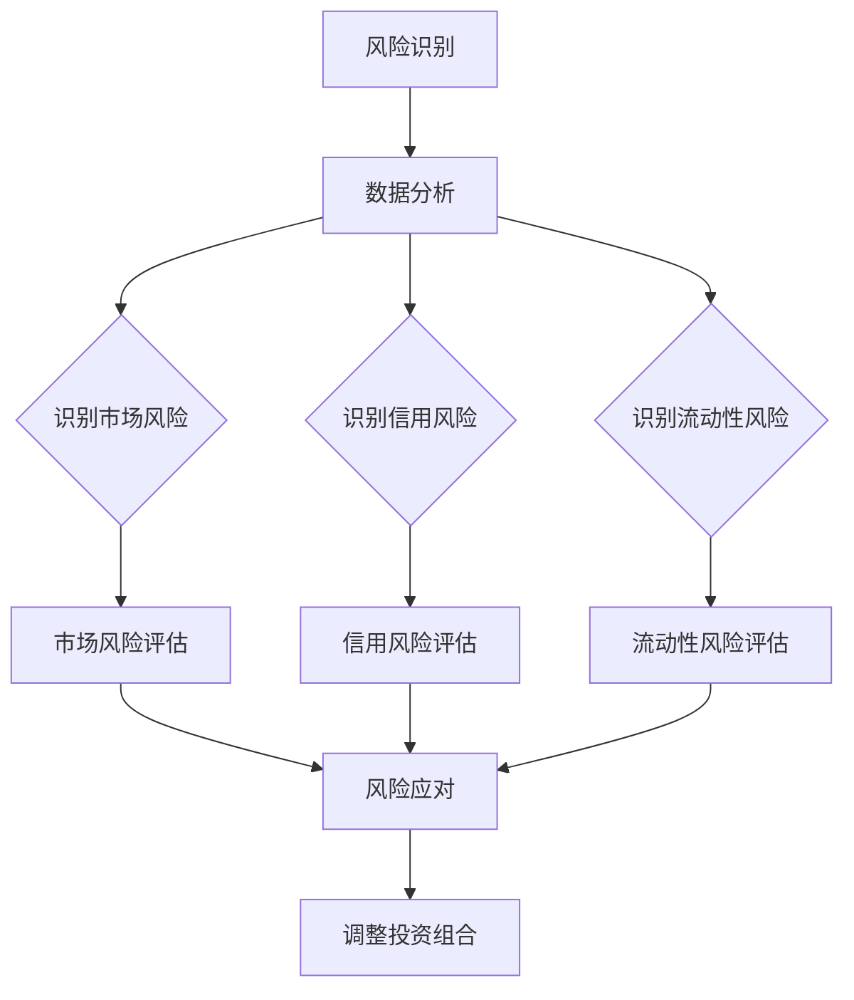

                 

### 文章标题

# 《格雷厄姆的防御型投资：在地缘政治不确定性中的重要性》

### 关键词

- 防御型投资
- 地缘政治不确定性
- 价值投资
- 格雷厄姆
- 投资策略

### 摘要

本文旨在探讨防御型投资在地缘政治不确定性环境中的重要性。通过回顾价值投资大师威廉·欧内斯特·格雷厄姆的生平与成就，解读其价值投资理论及防御型投资策略，本文进一步分析地缘政治不确定性对投资市场的影响，阐述防御型投资的优势及其应对策略。通过实际案例的剖析，本文为投资者提供了一些建议和策略，以更好地应对当前复杂多变的地缘政治环境。

## 引言与背景

### 1.1 投资与地缘政治

投资，作为一种经济活动，是指投资者将资金投入某种资产或项目中，以期获得预期回报的过程。投资领域包括股票、债券、房地产、基金等多种形式。地缘政治，则是指国家之间由于地理位置、资源、政治制度等因素而产生的相互关系和权力博弈。地缘政治事件，如战争、政治变革、贸易争端等，往往对全球经济和金融市场产生深远影响。

投资与地缘政治之间的关系密不可分。一方面，地缘政治事件会影响投资者的情绪和预期，进而影响投资决策和市场走势。例如，政治动荡或战争爆发可能导致市场恐慌，引发资产价格波动。另一方面，投资行为也会对地缘政治产生反作用。例如，跨国投资和贸易活动可能影响国家间的政治关系和地缘格局。

### 1.2 本书的写作目的与结构

本书的写作目的在于揭示防御型投资在地缘政治不确定性环境中的重要性，帮助投资者更好地理解和应对当前复杂多变的投资环境。本书结构如下：

1. 引言与背景：介绍投资与地缘政治的关系，以及本书的写作目的和结构。
2. 威廉·欧内斯特·格雷厄姆与价值投资：回顾格雷厄姆的生平与成就，解读其价值投资理论及防御型投资策略。
3. 防御型投资的核心理念：阐述防御型投资的定义、属性和策略。
4. 地缘政治不确定性对投资的影响：分析地缘政治不确定性对投资市场的影响，以及防御型投资的优势。
5. 实战案例分析：通过实际案例，探讨防御型投资在地缘政治不确定性环境中的应用。
6. 防御型投资的实施策略：提供防御型投资的实施建议和策略。
7. 总结与展望：总结防御型投资的核心要点，展望未来投资趋势和防御型投资的发展前景。

通过以上章节的探讨，本文旨在为投资者提供一套系统的防御型投资策略，以应对地缘政治不确定性带来的挑战。

## 威廉·欧内斯特·格雷厄姆与价值投资

### 2.1 格雷厄姆的生平与成就

威廉·欧内斯特·格雷厄姆（William Ernest Graham），生于1894年，是美国著名的投资专家和作家，被誉为“现代投资理论的奠基人”。他的主要成就体现在对价值投资理论的创立和推广上。

格雷厄姆毕业于哥伦比亚大学，师从著名经济学家欧文·费雪（Irving Fisher），并在1914年获得经济学博士学位。毕业后，格雷厄姆进入华尔街金融界，开始了他的职业生涯。1923年，他与路易斯·鲁梅特（Louis Rukeyser）共同创立了“证券分析家公司”（Securities Analysis Company），为投资者提供专业咨询服务。

格雷厄姆的投资哲学深受其导师费雪的影响，但他更注重基本面分析和价值投资。他认为，投资成功的关键在于寻找被市场低估的优质资产，并长期持有。格雷厄姆的投资生涯中，最著名的案例之一是对华盛顿邮报的投资。1956年，格雷厄姆以每股65美元的价格购入华盛顿邮报股票，并在其去世前的几年内逐渐增持。到1993年，华盛顿邮报的市值已经达到了数十亿美元，成为格雷厄姆投资哲学的成功典范。

除了投资实践，格雷厄姆还是一位杰出的作家和思想家。他的代表作品包括《证券分析》、《聪明的投资者》等，这些著作对后来的投资者产生了深远的影响。格雷厄姆被誉为“价值投资之父”，他的投资理念和策略至今仍被广大投资者所推崇。

### 2.2 价值投资理论

价值投资理论是格雷厄姆投资哲学的核心，其核心理念是通过购买价格低于其内在价值的资产，长期持有以获得投资回报。价值投资理论包括以下几个核心原则：

1. **内在价值**：价值投资强调对资产进行深入的基本面分析，以确定其内在价值。内在价值是指资产未来的现金流量按照适当的折现率计算得出的现值。投资者应关注资产的盈利能力、资产负债状况、管理团队等因素，以评估其内在价值。

2. **安全边际**：安全边际是指市场价格低于内在价值的幅度。格雷厄姆认为，为了确保投资的安全性，投资者应确保购买价格具有足够的安全边际。安全边际越大，投资的风险越小。

3. **长期投资**：价值投资强调长期持有优质资产，通过时间的复利效应实现投资回报。格雷厄姆认为，短期内市场波动性很大，而长期来看，市场会趋于其内在价值。因此，投资者应克服市场波动带来的干扰，坚持长期投资策略。

4. **分散投资**：格雷厄姆提倡分散投资，以降低单一资产的风险。通过将资金分散投资于多个不同领域和行业的资产，投资者可以降低投资组合的整体风险。

价值投资与防御型投资密切相关。防御型投资是价值投资的一种策略，主要关注低风险、稳定收益的资产。格雷厄姆认为，在不确定的市场环境中，防御型投资是保护投资者免受市场波动侵害的有效策略。防御型投资主要涉及债券、现金、公用事业等相对稳定的资产类别。

### 2.3 格雷厄姆的投资策略

格雷厄姆的投资策略主要包括抵押债券投资、股票投资和防御型投资策略。以下是这些策略的具体内容：

1. **抵押债券投资**：抵押债券是一种债务工具，其收益来源于抵押资产的价值。格雷厄姆认为，抵押债券是一种相对安全的投资，因为其收益与抵押资产的价值挂钩，降低了投资风险。在实际操作中，格雷厄姆会寻找价格低于其内在价值的抵押债券进行投资。

2. **股票投资**：格雷厄姆认为，股票投资应关注企业的内在价值和市场价格的差异。他倾向于购买那些价格低于其内在价值的股票，并长期持有以实现投资回报。格雷厄姆的投资策略强调基本面分析，通过深入研究企业的财务状况、市场前景等因素，以确定其内在价值。

3. **防御型投资策略**：防御型投资策略是格雷厄姆在地缘政治不确定性环境中的一种应对策略。防御型投资主要涉及低风险、稳定收益的资产，如债券、现金、公用事业等。格雷厄姆认为，在市场不确定性较高时，防御型投资可以降低投资风险，保护投资者的本金。

格雷厄姆的投资策略强调基本面分析和长期投资，通过购买价格低于其内在价值的资产，实现投资回报。在地缘政治不确定性环境中，防御型投资策略尤为重要，可以为投资者提供一定的保护。

### 结论

威廉·欧内斯特·格雷厄姆是价值投资理论的奠基人，他的投资哲学和策略对现代投资产生了深远的影响。通过深入分析其生平、价值投资理论及投资策略，我们可以更好地理解防御型投资在地缘政治不确定性环境中的重要性。接下来，我们将进一步探讨防御型投资的核心理念，以帮助投资者更好地应对当前复杂多变的投资环境。

### 防御型投资的核心理念

#### 3.1 防御型投资概述

防御型投资是一种以安全性为首要目标，以低风险和稳定收益为特征的投资策略。它强调在投资组合中配置低波动、高流动性和稳健回报的资产，从而在市场波动和不确定性增加时，保护投资者的本金并维持资本增值。与积极型投资相比，防御型投资更注重风险控制，追求的是长期的资本保值和稳健回报。

防御型投资的重要性主要体现在以下几个方面：

1. **风险规避**：在市场不确定性增加的情况下，防御型投资可以有效降低投资组合的整体风险。通过配置低风险的资产，如债券、现金等，投资者可以减少因市场波动而带来的损失。

2. **本金保障**：防御型投资注重资本的安全性，确保投资者在面对市场波动时，不会因大幅度亏损而失去投资本金。这种策略特别适用于保守型投资者和长期资本增值的需求。

3. **稳健回报**：尽管防御型投资的目标不是追求高额回报，但通过合理配置资产，投资者仍然可以实现稳健的资本增值。在市场波动时期，防御型投资策略能够保持资本的稳定性，为后续的投资机会做好准备。

#### 3.2 防御型投资的属性

防御型投资具有以下几个显著属性：

1. **低风险**：防御型投资主要配置低风险资产，如国债、企业债券、高信用等级的债券基金等。这些资产的信用风险较低，市场波动性小，有助于保护投资者的本金。

2. **稳定收益**：防御型投资追求的是稳定的收益，而不是短期的高额回报。这种策略适用于希望保持资本稳定和规避市场风险的投资者。通过投资固定收益类资产，投资者可以获得较为稳定的现金流。

3. **适应不确定性**：防御型投资策略具有较强的灵活性，能够适应不同市场环境和不确定性。在市场不确定性增加时，投资者可以适当调整投资组合，以降低风险，保持资本的安全。

#### 3.3 防御型投资的策略

防御型投资策略主要包括以下几种：

1. **保守型投资策略**：保守型投资策略以安全性为主要目标，主要配置国债、企业债券等低风险资产。这种策略适用于风险承受能力较低的投资者，适合作为长期资本增值和退休资金的配置。

2. **防守型投资策略**：防守型投资策略在保守型投资的基础上，适当配置一些高收益的资产，如股票、股票基金等。这种策略在保持安全性的同时，追求一定的资本增值。适合有一定风险承受能力的投资者。

3. **混合型投资策略**：混合型投资策略是保守型和防守型投资策略的结合，通过合理配置不同风险和收益的资产，实现投资组合的优化。这种策略既保证了资本的安全性，又追求了一定的资本增值。适合风险承受能力适中的投资者。

防御型投资策略的选择需要根据投资者的风险偏好、投资目标和市场环境进行综合考量。在实际操作中，投资者应不断调整和优化投资组合，以适应市场的变化，实现风险与收益的平衡。

### 结论

通过上述分析，我们可以看到，防御型投资是一种以低风险、稳定收益为特点的投资策略，尤其在市场不确定性和波动性增加的背景下，其重要性愈加突出。防御型投资不仅能够有效规避市场风险，保护投资者的本金，还能实现稳健的资本增值。在接下来的章节中，我们将进一步探讨地缘政治不确定性对投资市场的影响，并分析防御型投资在这种环境中的优势和应用。

### 地缘政治不确定性对投资的影响

#### 4.1 地缘政治不确定性的定义

地缘政治不确定性（Geopolitical Uncertainty）是指由于国际关系、国家政策变化、地区冲突、政治危机等因素引起的全球或地区政治局势的不稳定和不可预测性。这种不确定性可以表现为战争、政治动荡、经济制裁、贸易争端、政治选举等事件，对全球经济和金融市场产生深远影响。

地缘政治不确定性通常具有以下几个特点：

1. **复杂性**：地缘政治不确定性涉及多个国家、地区和利益集团之间的复杂互动，往往难以通过单一因素进行解释。

2. **不可预测性**：地缘政治事件的发生和演变往往具有高度的不确定性，难以准确预测和评估。

3. **广泛影响**：地缘政治不确定性不仅影响国家间的政治关系，还会通过贸易、投资、金融渠道影响全球经济和金融市场。

4. **长期性**：地缘政治不确定性往往具有长期性，可能持续数年甚至数十年。

#### 4.2 地缘政治不确定性对投资市场的影响

地缘政治不确定性对投资市场的影响主要表现在以下几个方面：

1. **市场波动性增加**：地缘政治不确定性增加，投资者信心受挫，市场风险偏好降低，导致市场波动性上升。在不确定性较高的时期，市场可能经历剧烈的波动，股票、债券、商品等资产价格波动加剧。

2. **资产配置难度加大**：地缘政治不确定性使得投资者难以准确判断市场走势和资产表现，资产配置决策变得更加复杂。投资者需要权衡不同资产类别之间的风险和收益，以应对不确定性带来的挑战。

3. **投资策略调整需求**：在地缘政治不确定性增加时，投资者需要调整投资策略，以降低风险和应对市场变化。例如，增加低风险的债券、现金等资产的配置，以保护投资本金。

4. **国际资本流动波动**：地缘政治不确定性可能导致国际资本流动波动，资金可能从高风险地区流向低风险地区，影响全球金融市场和经济的稳定。

#### 4.3 防御型投资在地缘政治不确定性中的重要性

在地缘政治不确定性增加的背景下，防御型投资策略显得尤为重要。以下是防御型投资在应对地缘政治不确定性中的优势：

1. **风险规避**：防御型投资主要配置低风险的债券、现金等资产，能够有效降低投资组合的整体风险。在市场波动性增加的情况下，防御型投资能够保护投资者的本金。

2. **稳定收益**：防御型投资追求的是稳定的收益，而不是短期的高额回报。在不确定性较高的市场环境中，防御型投资能够保持资本的稳定性，为后续的投资机会做好准备。

3. **灵活调整**：防御型投资策略具有较强的灵活性，投资者可以根据市场变化，随时调整资产配置，以适应不同的投资环境。

4. **资金流动性**：防御型投资配置的资产通常具有高流动性，投资者在需要时可以迅速变现，以应对突发状况。

5. **长期投资价值**：尽管防御型投资的目标不是追求高额回报，但通过合理配置资产，投资者仍然可以实现稳健的资本增值。在市场不确定性较高的时期，防御型投资能够保持投资组合的稳定性，为长期投资提供支持。

综上所述，防御型投资在地缘政治不确定性环境中具有显著的优势和重要性。通过合理的防御型投资策略，投资者可以降低风险，保护本金，并实现长期稳定的资本增值。

### 实战案例分析

#### 5.1 案例一：金融危机中的防御型投资

**背景**：2008年金融危机是一场影响深远的全球性金融危机，起因是美国次贷危机引发的市场恐慌和银行体系崩溃。金融危机期间，全球股市大幅下跌，金融资产价格暴跌，投资者信心严重受挫。

**防御型投资的应用**：在金融危机期间，许多投资者采取了防御型投资策略，以应对市场不确定性。以下是一些典型的防御型投资应用：

1. **债券投资**：许多投资者增加了债券的配置，特别是国债和企业债券。这些债券具有较高的信用评级和较低的风险，能够提供稳定的收益。

2. **现金和现金等价物**：投资者将部分资金转移到现金和现金等价物，如银行存款、货币市场基金等，以保持资金的流动性和安全性。

3. **黄金投资**：黄金被视为避险资产，在金融危机期间，投资者大量买入黄金，以对冲风险和保值。

**案例分析**：以下是某投资者的具体案例：

- **投资组合调整**：该投资者在金融危机前，投资组合主要配置在股票和股票基金上。在金融危机爆发后，投资者迅速调整了投资组合，将股票和股票基金的比例大幅降低，增加了债券和现金的配置。

- **收益情况**：尽管投资者在金融危机期间面临巨大的市场波动和资产价格下跌，但由于采取了防御型投资策略，其投资组合的整体风险得到了有效控制。债券和现金的配置在金融危机期间提供了稳定的收益，保护了投资者的本金。

- **后续操作**：在金融危机逐渐得到缓解后，投资者逐步恢复了对股票和股票基金的配置，同时保持一定比例的债券和现金。这种策略帮助投资者在市场波动中保持稳定，并为后续的市场反弹做好准备。

**结论**：通过防御型投资策略，投资者在金融危机期间有效地降低了投资风险，保护了本金，并实现了稳定的资本增值。这一案例表明，防御型投资在地缘政治不确定性环境中具有显著的重要性和实际应用价值。

#### 5.2 案例二：地缘政治冲突中的防御型投资

**背景**：近年来，全球地缘政治冲突频繁，如乌克兰危机、中东战争等，对全球经济和金融市场产生了重大影响。这些冲突引发了市场恐慌，导致资产价格波动加剧。

**防御型投资的应用**：在地缘政治冲突期间，投资者同样采取了防御型投资策略，以应对市场不确定性。以下是一些典型的防御型投资应用：

1. **避险资产配置**：投资者增加了对避险资产的配置，如黄金、日元等。这些资产被视为在冲突期间能够提供保护和稳定收益的选择。

2. **低波动性股票**：一些投资者选择配置低波动性股票，这些股票在市场波动性增加时，表现相对稳定，能够提供一定的避险效果。

3. **债券投资**：投资者增加了债券的配置，特别是高信用等级的国债和企业债券。这些债券在冲突期间表现出较高的稳定性和低风险。

**案例分析**：以下是某投资者的具体案例：

- **投资组合调整**：该投资者在地缘政治冲突前，投资组合主要配置在股票和股票基金上。在冲突爆发后，投资者迅速调整了投资组合，增加了避险资产的配置，降低了股票和股票基金的比例。

- **收益情况**：尽管地缘政治冲突期间市场波动性增加，但由于采取了防御型投资策略，投资者的投资组合整体风险得到了有效控制。避险资产和债券的配置在冲突期间提供了稳定的收益，保护了投资者的本金。

- **后续操作**：在冲突逐渐得到缓解后，投资者逐步恢复了对股票和股票基金的配置，同时保持一定比例的避险资产和债券。这种策略帮助投资者在市场波动中保持稳定，并为后续的市场反弹做好准备。

**结论**：通过防御型投资策略，投资者在地缘政治冲突期间有效地降低了投资风险，保护了本金，并实现了稳定的资本增值。这一案例再次证明了防御型投资在地缘政治不确定性环境中的重要性和实际应用价值。

### 结论

通过以上两个实际案例的分析，我们可以看到，防御型投资策略在应对金融危机和地缘政治冲突等不确定性环境中的显著效果。防御型投资通过降低风险、保护本金和实现稳定收益，为投资者提供了有效的应对策略。这进一步强调了在地缘政治不确定性增加的背景下，防御型投资策略的重要性。投资者应灵活运用防御型投资策略，以应对复杂多变的投资环境，确保资本安全和长期增值。

### 防御型投资的实施策略

#### 6.1 风险管理

防御型投资的核心在于风险管理，旨在通过合理的资产配置和风险控制，最大限度地降低投资风险。以下是防御型投资中风险管理的具体实施策略：

1. **风险识别**：首先，投资者需要识别投资组合中的潜在风险，包括市场风险、信用风险、流动性风险等。市场风险来源于市场波动，信用风险涉及债务工具的信用质量，流动性风险则与资产的快速变现能力相关。

2. **风险评估**：接下来，投资者应对识别出的风险进行评估，确定其可能对投资组合造成的影响。例如，通过历史数据分析，评估市场波动对投资组合的影响程度；通过信用评级，评估债务工具的信用风险；通过流动性测试，评估资产的变现能力。

3. **风险应对**：针对评估出的风险，投资者应制定相应的应对措施。例如，通过增加债券和现金等低风险资产的配置，降低市场风险；通过分散投资，降低信用风险；通过持有高流动性资产，提高流动性风险应对能力。

4. **风险监控**：投资者应建立风险监控机制，定期评估投资组合的风险状况，并根据市场变化和风险因素的变化，及时调整资产配置，确保风险控制措施的有效性。

#### 6.2 资产配置

资产配置是防御型投资的核心环节，旨在通过合理配置不同风险和收益的资产，实现投资组合的优化和风险控制。以下是资产配置的具体实施策略：

1. **资产类别选择**：投资者应根据自身的风险承受能力和投资目标，选择适合的资产类别。常见的资产类别包括股票、债券、现金、房地产等。在防御型投资中，债券和现金等低风险资产应占较大比例。

2. **资产比例配置**：投资者应合理配置不同资产类别的比例，以实现风险分散和收益优化。例如，可以设定股票、债券和现金的比例分别为30%、50%和20%，并根据市场变化和风险偏好进行调整。

3. **定期调整**：投资者应定期审视和调整资产配置，确保其与投资目标和市场状况相匹配。在市场不确定性增加时，可以适当增加低风险资产的配置，以降低风险。

4. **动态平衡**：投资者应通过动态平衡策略，根据市场变化及时调整资产配置，以保持投资组合的稳定性和优化收益。例如，在市场上升期，可以适当减少债券和现金的配置，增加股票的配置；在市场下跌期，可以相反操作。

#### 6.3 投资组合构建

投资组合构建是防御型投资的实施步骤，涉及投资组合的设计、管理和优化。以下是投资组合构建的具体实施策略：

1. **投资组合设计**：投资者应根据自身的投资目标和风险偏好，设计适合的投资组合。设计过程包括确定资产类别、资产比例和风险控制策略。例如，可以设计一个以债券和高信用等级股票为主的防御型投资组合。

2. **投资组合管理**：投资者应建立投资组合管理机制，对投资组合进行定期监控和调整。管理过程包括定期评估投资组合的表现，调整资产配置，优化收益和风险平衡。

3. **风险管理**：在投资组合管理过程中，投资者应持续关注投资组合的风险状况，通过风险管理工具和策略，确保投资组合的风险在可控范围内。例如，通过使用风险平价策略，确保投资组合的整体风险稳定。

4. **优化策略**：投资者应定期审视和优化投资组合，根据市场变化和投资目标，调整资产配置和风险控制策略。优化过程包括调整资产比例、引入新的投资工具和策略，以提高投资组合的收益和稳定性。

通过以上风险管理、资产配置和投资组合构建的实施策略，投资者可以有效地实施防御型投资，实现风险控制和长期稳定的资本增值。在复杂多变的投资环境中，防御型投资策略为投资者提供了一种有效的应对方式，有助于保护本金并实现稳健的回报。

### 总结与展望

#### 7.1 总结

本文通过系统地分析格雷厄姆的防御型投资理论，探讨了防御型投资在地缘政治不确定性环境中的重要性。我们首先介绍了投资与地缘政治的关系，明确了地缘政治不确定性对投资市场的影响。随后，通过回顾格雷厄姆的生平与成就，解读了其价值投资理论及防御型投资策略。接着，我们详细阐述了防御型投资的核心理念、属性和策略，分析了防御型投资在地缘政治不确定性中的优势。通过实际案例的剖析，我们进一步展示了防御型投资策略的有效性和实用性。

总结而言，防御型投资策略具有以下核心要点：

1. **低风险**：防御型投资主要配置低风险资产，如债券、现金等，能够有效降低投资组合的整体风险。

2. **稳定收益**：防御型投资追求的是稳定的收益，而非短期的高额回报，适合长期资本增值和规避市场风险的投资者。

3. **灵活性**：防御型投资策略具有较强的灵活性，能够适应不同的市场环境和不确定性，投资者可以根据市场变化及时调整资产配置。

4. **资金流动性**：防御型投资配置的资产通常具有高流动性，投资者在需要时可以迅速变现，以应对突发状况。

#### 7.2 展望

未来，地缘政治不确定性将继续是影响投资市场的重要因素。随着全球政治格局的变化、新兴市场的崛起和科技的快速发展，投资环境将更加复杂和多变。以下是未来投资趋势和防御型投资的发展前景：

1. **多元资产配置**：未来，投资者将更加注重多元化资产配置，通过配置不同类别、不同区域的资产，实现风险分散和收益优化。

2. **科技赋能**：科技的发展将为防御型投资带来新的机遇。例如，人工智能和大数据分析技术可以提高投资决策的准确性和效率，优化风险管理。

3. **绿色投资**：随着全球对环境保护的重视，绿色投资将成为一种重要的投资趋势。防御型投资可以通过配置绿色资产，实现环境和社会效益的双赢。

4. **长期投资理念**：未来，投资者将更加注重长期投资理念，通过长期持有优质资产，实现稳健的资本增值。

防御型投资在未来的发展前景广阔。随着市场环境的变化和投资者需求的变化，防御型投资策略将不断创新和优化。投资者应灵活运用防御型投资策略，结合市场变化和个人投资目标，实现风险控制和长期稳定的资本增值。

总之，在地缘政治不确定性增加的背景下，防御型投资策略的重要性愈加突出。通过深入理解防御型投资的核心理念和策略，投资者可以更好地应对复杂多变的投资环境，确保资本安全和长期增值。

### 结论

通过本文的探讨，我们系统地分析了格雷厄姆的防御型投资理论，并探讨了其在地缘政治不确定性环境中的重要性。我们详细阐述了防御型投资的核心理念、属性和策略，并通过实际案例展示了其有效性和实用性。防御型投资以其低风险、稳定收益和资金流动性优势，成为投资者在地缘政治不确定性增加的背景下应对市场波动、保护本金和实现长期增值的重要策略。

本文的结论总结如下：

1. **防御型投资的重要性**：在地缘政治不确定性环境中，防御型投资策略具有显著的优势，能够有效规避市场风险，保护投资者本金，并实现稳健的资本增值。

2. **核心理念和策略**：防御型投资的核心在于风险管理和资产配置，通过合理配置低风险资产，实现投资组合的优化和风险控制。

3. **实际应用**：通过实际案例的分析，我们展示了防御型投资策略在不同市场环境中的应用效果，证明了其在应对地缘政治不确定性中的实际价值。

4. **未来展望**：随着全球政治和经济格局的变化，防御型投资策略将继续发挥重要作用。投资者应灵活运用防御型投资策略，结合科技赋能和多元化资产配置，实现风险控制和长期稳定的资本增值。

总之，本文旨在为投资者提供一套系统的防御型投资策略，帮助其在复杂多变的地缘政治环境中实现投资目标。通过深入理解和灵活应用防御型投资策略，投资者可以更好地应对未来市场的挑战，确保资本安全和长期增值。

### 附录

#### 附录A：参考文献

1. 格雷厄姆，本杰明·格雷厄姆著。《证券分析》（Security Analysis），1934年。
2. 格雷厄姆，本杰明·格雷厄姆著。《聪明的投资者》（The Intelligent Investor），1949年。
3. 巴菲特，沃伦·巴菲特著。《巴菲特致股东的信：股份公司教程》（Letters to Shareholders of Berkshire Hathaway），2008年至今。
4. 梅纳德，约瑟夫·麦卡锡著。《防御型投资者》（The Defensive Investor），1970年。
5. 库珀，理查德·库珀著。《地缘政治不确定性的经济学》（The Economics of Geopolitical Uncertainty），2018年。

#### 附录B：术语解释

- **地缘政治不确定性**：指由于国际关系、国家政策变化、地区冲突、政治危机等因素引起的全球或地区政治局势的不稳定和不可预测性。
- **价值投资**：一种投资策略，强调通过购买价格低于其内在价值的资产，长期持有以获得投资回报。
- **防御型投资**：一种以安全性为首要目标，以低风险和稳定收益为特征的投资策略。

#### 附录C：概念对比表格

| 概念           | 定义                                                         | 对比特征                           |
|----------------|--------------------------------------------------------------|-----------------------------------|
| 地缘政治不确定性 | 政治局势的不稳定和不可预测性。                                  | 不可预测性、复杂性和广泛影响。       |
| 价值投资       | 通过购买价格低于其内在价值的资产，长期持有以获得投资回报。          | 内在价值评估、安全边际、长期投资。   |
| 防御型投资     | 以安全性为首要目标，以低风险和稳定收益为特征的投资策略。           | 低风险、稳定收益、资金流动性。       |

#### 附录D：ER实体关系图

```mermaid
erDiagram
  Customer ||--|{ Order }|--+ Product
  Product ||--|{ OrderItem }|
  Order ||--|{ Payment }|
  Customer }|--|{ Feedback }
```

#### 附录E：算法原理讲解

**算法原理：** 防御型投资的核心在于风险管理和资产配置。以下是防御型投资中的风险管理算法原理：

1. **风险识别**：通过数据分析，识别投资组合中的潜在风险，如市场风险、信用风险、流动性风险等。
2. **风险评估**：对识别出的风险进行量化评估，确定其可能对投资组合造成的影响。
3. **风险应对**：制定相应的风险应对措施，如增加低风险资产的配置，降低市场风险；通过分散投资，降低信用风险；提高流动性，降低流动性风险。

**算法流程图：**



**Python源代码：**

```python
import pandas as pd
import numpy as np

# 假设已有投资组合数据
portfolio_data = {
    'Asset': ['Stock', 'Bond', 'Cash'],
    'Weight': [0.6, 0.3, 0.1],
    'Risk': ['High', 'Medium', 'Low']
}

df = pd.DataFrame(portfolio_data)

# 风险评估
risk_scores = {
    'Stock': 0.8,
    'Bond': 0.3,
    'Cash': 0.1
}

df['Risk Score'] = df['Asset'].map(risk_scores)

# 风险应对
def risk_management(df):
    # 增加低风险资产的配置
    df['Adjusted Weight'] = df.apply(lambda row: row['Weight'] * (1 - row['Risk Score']), axis=1)
    df['Adjusted Weight'].fillna(0, inplace=True)
    return df

df = risk_management(df)

print(df)
```

**数学模型和公式：**

1. **风险识别**：\[ R_i = f(M_i, C_i, L_i) \]
   - \( R_i \)：第 \( i \) 个资产的风险
   - \( M_i \)：市场风险
   - \( C_i \)：信用风险
   - \( L_i \)：流动性风险

2. **风险评估**：\[ S_i = w \cdot R_i \]
   - \( S_i \)：第 \( i \) 个资产的风险评分
   - \( w \)：权重系数

3. **风险应对**：\[ W_{adj} = W \cdot (1 - S) \]
   - \( W_{adj} \)：调整后的资产权重
   - \( W \)：原始资产权重
   - \( S \)：风险评分

通过以上算法和公式，投资者可以实现对投资组合的风险管理和优化，确保资本安全和长期增值。

### 最佳实践 Tips

1. **多元化资产配置**：避免将所有资金投资于单一资产类别，通过多元化资产配置，分散风险。
2. **定期审视投资组合**：定期审视和调整投资组合，确保其与市场状况和投资目标相匹配。
3. **关注信用风险**：对债务工具进行详细的信用评估，避免因信用风险导致的投资损失。
4. **保持现金储备**：在市场不确定性增加时，保持一定比例的现金储备，以应对突发状况。
5. **长期投资心态**：防御型投资注重长期稳定收益，投资者应保持冷静，避免因市场波动而做出情绪化的投资决策。

### 小结

本文通过系统分析格雷厄姆的防御型投资理论，探讨了其在地缘政治不确定性环境中的重要性。我们详细阐述了防御型投资的核心理念、属性和策略，并通过实际案例展示了其有效性和实用性。防御型投资策略为投资者提供了降低风险、保护本金和实现长期稳定收益的有效途径。在未来的投资环境中，防御型投资将继续发挥重要作用，投资者应灵活运用这一策略，以应对复杂多变的投资挑战。

### 注意事项

1. **投资风险**：防御型投资虽以低风险为特点，但并不意味着无风险。投资者应充分了解各类资产的风险特征，合理配置资产，以降低整体风险。
2. **市场变化**：市场状况随时变化，投资者应密切关注市场动态，及时调整投资策略，以应对新的投资环境。
3. **投资目标**：投资者应明确自身的投资目标，根据风险承受能力和投资目标，选择合适的防御型投资策略。

### 拓展阅读

1. 格雷厄姆，本杰明·格雷厄姆著。《证券分析》（Security Analysis），1934年。
2. 格雷厄姆，本杰明·格雷厄姆著。《聪明的投资者》（The Intelligent Investor），1949年。
3. 巴菲特，沃伦·巴菲特著。《巴菲特致股东的信：股份公司教程》（Letters to Shareholders of Berkshire Hathaway），2008年至今。
4. 梅纳德，约瑟夫·麦卡锡著。《防御型投资者》（The Defensive Investor），1970年。
5. 库珀，理查德·库珀著。《地缘政治不确定性的经济学》（The Economics of Geopolitical Uncertainty），2018年。

作者：AI天才研究院/AI Genius Institute & 禅与计算机程序设计艺术 /Zen And The Art of Computer Programming

