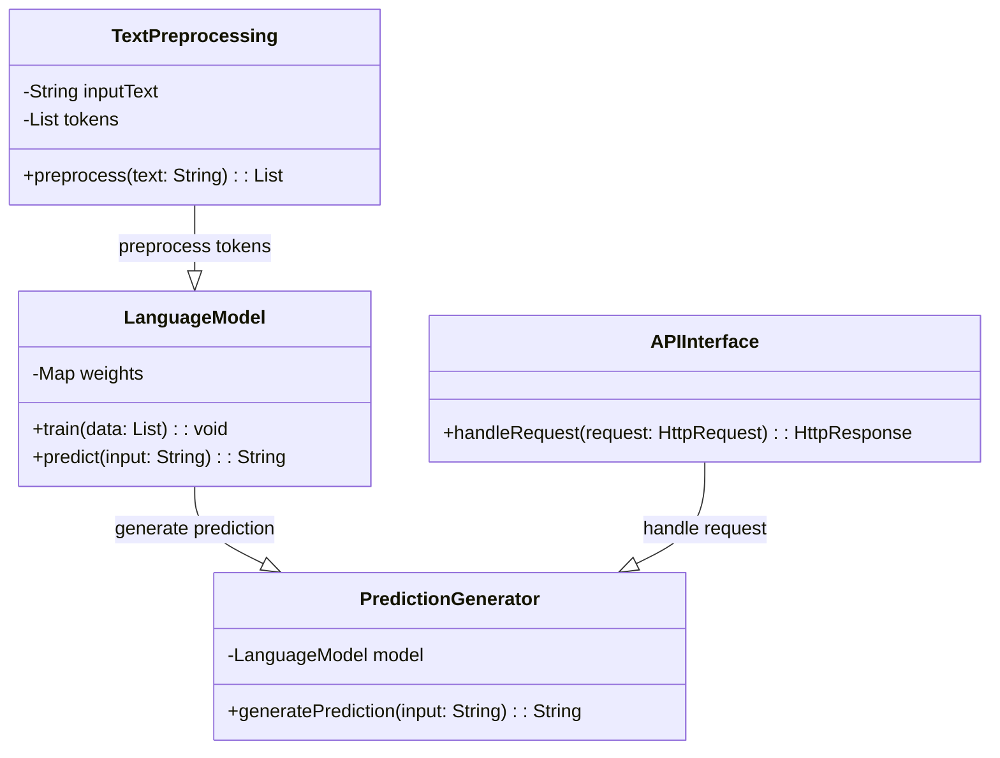
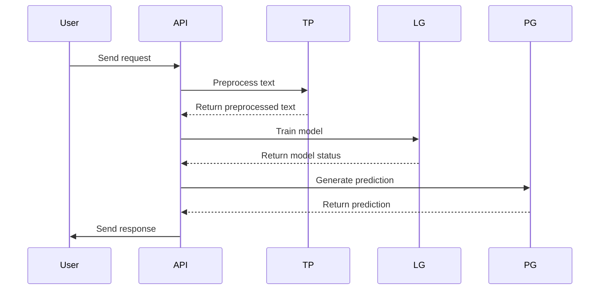

                 

### 文章标题：模块化与微服务：LLM应用架构的演进

> 关键词：模块化、微服务、语言模型（LLM）、应用架构、架构演进

> 摘要：本文将探讨模块化和微服务在语言模型（LLM）应用架构中的重要性和演进过程。我们将逐步分析模块化和微服务的基本概念、原理以及如何应用于LLM应用中，进而介绍设计、实现和优化的最佳实践。

## 前言

在当今快速发展的信息技术领域，软件系统的复杂性和规模日益增加。为了应对这种复杂性，开发人员开始寻求更加灵活和可扩展的架构设计方法。模块化和微服务架构就是在这种背景下应运而生的重要设计模式。本文旨在系统地介绍模块化和微服务的概念、原理，并探讨其在语言模型（LLM）应用架构中的具体应用和演进过程。

### 模块化的基本概念和原理

模块化是一种设计方法，它将复杂的系统分解为更小的、易于管理的部分，每个部分称为模块。模块化具有以下几个关键特点：

1. **独立性**：每个模块可以独立开发、测试和部署，减少了模块间的依赖性。
2. **复用性**：模块可以跨项目或系统复用，提高了开发效率。
3. **可维护性**：模块化的设计使得系统维护变得更加容易，因为问题通常局限在单个模块中。

模块化的核心原理包括：

- **封装**：模块的内部实现细节被隐藏，只暴露必要的接口。
- **解耦**：模块之间通过接口通信，减少了直接的耦合。
- **标准化**：模块遵循统一的接口规范和设计原则，确保了系统的互操作性。

### 微服务的基本概念和原理

微服务架构是一种将应用程序构建为一组小型、独立的服务的方法。每个服务都有自己的业务逻辑、数据库和数据存储。微服务的特点包括：

1. **独立性**：每个服务可以独立开发和部署，无需关心其他服务的内部实现。
2. **分布式**：服务可以部署在多个服务器上，实现水平扩展。
3. **灵活性**：服务可以根据需要独立扩展或替换，而不会影响整个系统。

微服务架构的核心原理包括：

- **服务自治**：每个服务拥有自己的数据库和数据存储。
- **独立部署**：服务可以独立部署，无需依赖其他服务。
- **去中心化**：系统没有中央控制单元，所有服务都通过API进行通信。

### 模块化和微服务在LLM应用架构中的重要性

语言模型（LLM）是一种基于深度学习的自然语言处理技术，具有广泛的应用前景。然而，LLM的应用也面临着一些挑战，如模型训练时间过长、模型规模庞大、系统复杂度高等。模块化和微服务架构在这方面的作用主要体现在以下几个方面：

1. **可扩展性**：通过将系统分解为模块和微服务，可以轻松实现水平扩展，满足不断增长的需求。
2. **可维护性**：模块化和微服务的独立性和自治性使得系统的维护变得更加简单和高效。
3. **复用性**：模块和微服务的复用性提高了开发效率，减少了重复工作。
4. **灵活性**：模块化和微服务的设计使得系统能够快速适应新的需求和技术变革。

### 文章结构

本文将分为以下几个部分：

1. **模块化和微服务的基本概念和原理**：详细介绍模块化和微服务的基本概念、原理和特点。
2. **模块化和微服务在LLM应用架构中的具体应用**：探讨如何在LLM应用中实现模块化和微服务架构，包括设计、实现和优化的方法。
3. **模块化与微服务的演进过程**：分析模块化和微服务架构在LLM应用中的演进过程，探讨其未来发展趋势。
4. **最佳实践**：总结模块化和微服务在LLM应用架构中的最佳实践，提供具体的实施建议。

通过本文的阅读，读者将能够全面了解模块化和微服务架构在LLM应用架构中的重要性，掌握其设计、实现和优化的方法，从而为实际项目提供有益的指导。

## 模块化与微服务的基本概念和原理

### 模块化的定义与重要性

模块化是一种设计原则，旨在通过将系统分解为独立的、可管理的部分来简化复杂系统的开发、维护和扩展。模块化的核心概念是“模块”，每个模块负责实现系统的一个特定功能，并通过标准的接口与其他模块进行交互。

#### 模块的定义

模块通常具有以下特征：

1. **独立性**：模块可以独立开发、测试和部署，无需关心其他模块的内部实现。
2. **封装性**：模块的内部实现被封装起来，外部只能通过定义良好的接口进行访问。
3. **可复用性**：模块可以跨项目或系统复用，提高开发效率。
4. **可维护性**：由于模块独立，问题通常局限于单个模块，维护更加简单。

#### 模块化的重要性

模块化在软件开发中具有多个重要优势：

1. **简化复杂性**：通过将系统分解为较小的模块，可以降低系统的复杂性，使开发过程更加可控。
2. **提高开发效率**：模块化的设计允许并发开发，多个团队可以同时工作，提高开发速度。
3. **降低维护成本**：模块的独立性使得系统的维护变得更加简单和高效。
4. **增强系统的可扩展性**：模块化设计使得系统可以轻松地进行扩展，以适应不断变化的需求。

### 模块化的核心原理

模块化的核心原理包括以下几个方面：

1. **封装**：模块的内部实现被封装起来，只暴露必要的接口。这有助于减少模块间的耦合，提高系统的稳定性。

2. **解耦**：通过定义良好的接口，模块之间进行通信，减少了直接的耦合。这有助于提高系统的灵活性和可维护性。

3. **标准化**：模块遵循统一的接口规范和设计原则，确保了系统的互操作性。这有助于减少开发中的不一致性和错误。

4. **可扩展性**：模块化的设计使得系统可以轻松地进行扩展。新模块可以添加到现有系统中，而不需要修改其他模块。

### 微服务的定义与重要性

微服务架构（Microservices Architecture）是一种设计方法，它将应用程序构建为一组小型、独立的服务，每个服务都专注于实现系统的一个特定功能。与传统的单体架构相比，微服务架构具有更高的灵活性和可扩展性。

#### 微服务的定义

微服务的核心特征包括：

1. **独立性**：每个微服务都是独立的，可以独立部署、扩展和升级。
2. **自治性**：每个微服务拥有自己的数据库和数据存储，无需依赖其他服务。
3. **分布式**：微服务通常部署在分布式环境中，可以通过网络进行通信。
4. **去中心化**：系统没有中央控制单元，所有服务通过API进行通信。

#### 微服务的重要性

微服务架构在软件开发中具有以下优势：

1. **可扩展性**：通过水平扩展单个服务，可以轻松应对高并发和大数据量。
2. **灵活性**：微服务的自治性使得系统能够快速适应变化的需求和技术更新。
3. **可维护性**：由于服务独立性，问题通常局限在单个服务中，维护更加简单。
4. **开发效率**：微服务的独立性允许团队独立开发和部署服务，提高开发速度。

### 微服务的核心原理

微服务的核心原理包括以下几个方面：

1. **服务自治**：每个服务都有自己的数据库和数据存储，无需依赖其他服务。
2. **独立部署**：服务可以独立部署，无需关心其他服务的状态和配置。
3. **去中心化**：系统没有中央控制单元，所有服务通过API进行通信，提高了系统的灵活性和可扩展性。
4. **分布式**：服务通常部署在分布式环境中，可以通过网络进行通信，提高了系统的可靠性和性能。

### 模块化与微服务的联系

模块化和微服务架构在某些方面具有相似之处，但它们也有本质的区别。模块化主要关注系统的分解和独立管理，而微服务架构则更侧重于服务的独立性和分布式系统设计。

1. **模块化**：模块化是将系统分解为独立的模块，每个模块实现特定的功能。模块化强调模块的独立性、封装性和复用性。
2. **微服务**：微服务架构是将应用程序构建为一组独立的微服务，每个服务实现特定的功能。微服务架构强调服务的独立性、自治性和分布式系统设计。

尽管模块化和微服务架构在目标和应用上有所不同，但它们可以相互补充，共同提高系统的灵活性、可维护性和可扩展性。在实际应用中，模块化通常用于系统分解，而微服务架构用于分布式系统的设计和实现。

### 小结

模块化和微服务架构是两种重要的设计方法，它们在软件开发中发挥着关键作用。模块化通过将系统分解为独立的模块，简化了系统的开发、维护和扩展。微服务架构通过将应用程序构建为一组独立的微服务，提高了系统的灵活性、可维护性和可扩展性。在接下来的章节中，我们将进一步探讨模块化和微服务架构在LLM应用架构中的具体应用和实践。

## 模块化与微服务在LLM应用架构中的具体应用

随着语言模型（LLM）技术的快速发展，如何设计一个高效、可扩展且易于维护的LLM应用架构变得越来越重要。模块化和微服务架构为这一需求提供了有效的解决方案。本节将详细介绍模块化和微服务在LLM应用架构中的具体应用，包括设计、实现和优化的方法。

### 模块化在LLM应用架构中的应用

#### 模块化设计方法

在LLM应用架构中，模块化设计方法有助于将复杂的应用分解为更小的、易于管理的部分。以下是几种常见的模块化设计方法：

1. **功能模块化**：将应用功能划分为不同的模块，每个模块负责实现特定的功能，例如文本预处理、模型训练、预测生成等。
2. **数据模块化**：将数据存储和处理划分为不同的模块，每个模块负责处理特定的数据类型或数据操作，例如文本数据、图像数据、语音数据等。
3. **服务模块化**：将应用服务划分为不同的模块，每个模块提供特定的服务接口，例如API接口、数据处理服务、模型训练服务等。

#### 模块化设计原则

在实现模块化设计时，应遵循以下原则：

1. **高内聚、低耦合**：每个模块应专注于实现一个单一的功能，模块间通过定义良好的接口进行通信，减少直接的耦合。
2. **标准化接口**：模块间应遵循统一的接口规范，确保模块的互操作性和可复用性。
3. **封装性**：模块的内部实现应被封装起来，外部只能通过接口进行访问，减少模块间的依赖性。
4. **可扩展性**：模块化设计应考虑到未来的扩展性，允许新模块的添加和现有模块的替换。

#### 模块化在LLM应用架构中的实现

在实现模块化LLM应用架构时，可以采用以下步骤：

1. **需求分析**：首先，对LLM应用的需求进行详细分析，确定应用的核心功能、数据类型和服务接口。
2. **模块划分**：根据需求分析结果，将应用划分为不同的模块，每个模块实现特定的功能。
3. **接口设计**：为每个模块设计清晰的接口，定义模块间的通信协议和数据格式。
4. **模块开发**：独立开发每个模块，确保模块的独立性和可复用性。
5. **集成测试**：将各个模块集成起来，进行功能测试和性能测试，确保模块间的协作和系统的整体性能。

### 微服务在LLM应用架构中的应用

#### 微服务设计方法

微服务设计方法是将LLM应用分解为一系列小型、独立的服务，每个服务实现特定的功能。以下是几种常见的微服务设计方法：

1. **按功能划分**：根据LLM应用的不同功能，将其划分为多个微服务，例如文本预处理服务、模型训练服务、预测生成服务等。
2. **按数据类型划分**：根据LLM应用处理的数据类型，将其划分为多个微服务，例如文本数据服务、图像数据服务、语音数据服务等。
3. **按业务领域划分**：根据LLM应用的不同业务领域，将其划分为多个微服务，例如客户服务、订单处理服务、支付服务等。

#### 微服务设计原则

在实现微服务架构时，应遵循以下原则：

1. **自治性**：每个微服务应独立运行，拥有自己的数据库和数据存储，减少对其他服务的依赖。
2. **独立性**：微服务可以独立部署、扩展和升级，不影响其他服务的运行。
3. **分布式**：微服务应部署在分布式环境中，可以通过网络进行通信，提高系统的可靠性和性能。
4. **去中心化**：系统没有中央控制单元，所有微服务通过API进行通信，提高系统的灵活性和可扩展性。

#### 微服务在LLM应用架构中的实现

在实现微服务LLM应用架构时，可以采用以下步骤：

1. **需求分析**：首先，对LLM应用的需求进行详细分析，确定应用的核心功能、数据类型和服务接口。
2. **服务划分**：根据需求分析结果，将应用划分为多个微服务，每个服务实现特定的功能。
3. **服务接口设计**：为每个微服务设计清晰的服务接口，定义服务间的通信协议和数据格式。
4. **服务开发**：独立开发每个微服务，确保服务的独立性和可复用性。
5. **服务部署**：将各个微服务部署到分布式环境中，进行负载均衡和容错处理。
6. **服务监控**：对微服务进行监控和日志记录，确保系统的稳定性和性能。

### 模块化与微服务的融合

在LLM应用架构中，模块化和微服务架构可以相互补充，共同提高系统的灵活性和可扩展性。以下是将模块化和微服务架构融合到LLM应用架构中的方法：

1. **模块化作为基础**：首先，采用模块化设计方法将LLM应用分解为多个功能模块，每个模块实现特定的功能。
2. **微服务作为实现**：在模块化设计的基础上，将每个模块进一步划分为多个微服务，每个微服务实现模块的一个子功能。
3. **接口标准化**：确保模块和微服务之间遵循统一的接口规范，实现模块和微服务的互操作性。
4. **分布式部署**：将微服务部署到分布式环境中，通过负载均衡和容错处理提高系统的性能和可靠性。

通过模块化和微服务的融合，LLM应用架构可以同时享受到模块化的独立性和可维护性，以及微服务的灵活性和可扩展性，为大规模LLM应用提供高效、可靠的架构解决方案。

### 小结

模块化和微服务架构在LLM应用架构中具有广泛的应用前景。通过模块化设计，可以将复杂的LLM应用分解为易于管理的部分，提高系统的可维护性和可扩展性。通过微服务架构，可以进一步实现服务的独立性和分布式部署，提高系统的性能和可靠性。在接下来的章节中，我们将进一步探讨模块化和微服务在LLM应用架构中的设计、实现和优化方法，以及如何在实际项目中应用这些方法。

## 设计与架构设计

### 系统要求分析

在设计和实现模块化与微服务的LLM应用架构之前，进行系统要求分析是至关重要的一步。这一步骤的目的是明确应用的需求、目标用户、预期性能、安全性、可维护性以及系统的规模和复杂性。

#### 需求分析

1. **功能需求**：
   - 文本预处理：包括文本清洗、分词、词性标注等。
   - 模型训练：支持不同类型的语言模型训练，如文本分类、机器翻译、情感分析等。
   - 预测生成：根据训练好的模型生成预测结果。
   - API接口：提供外部系统与LLM应用交互的接口。

2. **性能需求**：
   - 响应时间：确保系统的响应时间在合理范围内，例如毫秒级。
   - 批量处理能力：能够高效地处理大规模的数据批量。

3. **安全性需求**：
   - 数据安全：确保数据在传输和存储过程中的安全。
   - 访问控制：实现严格的访问控制机制，防止未经授权的访问。

4. **可维护性需求**：
   - 系统监控：实现实时监控和日志记录，以便快速发现和解决问题。
   - 模块化设计：确保系统能够快速更新和维护。

5. **规模和复杂性**：
   - 扩展性：系统应支持水平扩展，以应对用户数量和数据量的增加。
   - 复杂性：在实现功能的同时，应尽量简化系统的复杂度，提高可维护性。

#### 用户分析

- **目标用户**：企业开发者、科研人员、教育机构等。
- **使用场景**：文本分析、数据挖掘、智能客服、个性化推荐等。

### 系统功能设计

系统功能设计是架构设计的重要组成部分，它定义了系统应提供的功能以及各功能模块之间的关系。

#### 领域模型

领域模型（Domain Model）是对系统核心业务概念的抽象，它有助于理解和设计系统的功能模块。以下是LLM应用架构的领域模型示例：



在上面的类图中，`TextPreprocessing` 负责文本预处理，`LanguageModel` 负责模型训练和预测，`PredictionGenerator` 负责生成预测结果，`APIInterface` 负责处理外部请求。

#### 系统接口设计

系统接口设计是确定系统内部模块之间以及系统与外部系统之间如何交互的过程。以下是LLM应用架构的系统接口设计示例：

1. **文本预处理接口**：
   - `preprocessText`: 接受文本输入，返回预处理后的文本。

2. **模型训练接口**：
   - `trainModel`: 接受训练数据，训练语言模型。

3. **预测生成接口**：
   - `generatePrediction`: 接受预处理后的文本，返回预测结果。

4. **API接口**：
   - `handleRequest`: 接受HTTP请求，返回HTTP响应。

### 系统架构设计

系统架构设计是将功能模块和接口组织成一个高效、可扩展的系统的过程。以下是LLM应用架构的系统架构设计示例：

#### 系统架构图



在上面的序列图中，用户通过API发送请求，API将请求转发给文本预处理模块（TP）、模型训练模块（LG）和预测生成模块（PG），最终返回预测结果给用户。

#### 系统部署和扩展策略

1. **部署策略**：
   - **容器化**：使用Docker将应用打包成容器，便于部署和扩展。
   - **Kubernetes**：使用Kubernetes进行容器编排，实现自动部署、扩展和管理。

2. **扩展策略**：
   - **水平扩展**：通过增加更多的服务器节点，实现系统的水平扩展，提高系统的处理能力和容错能力。
   - **负载均衡**：使用负载均衡器（如Nginx、HAProxy）分配请求，确保系统的稳定性。

### 小结

通过系统要求分析和功能设计，我们明确了LLM应用架构的需求和目标。领域模型和系统接口设计为系统的功能模块提供了清晰的结构，而系统架构设计则确保了系统的整体性和可扩展性。在接下来的章节中，我们将深入探讨如何实现这些架构设计，包括环境搭建、核心模块实现和测试。

## 实现模块化与微服务的LLM应用架构

### 环境搭建

在实现模块化与微服务的LLM应用架构之前，我们需要搭建一个适合开发和部署的环境。以下是环境搭建的详细步骤：

1. **安装Docker**：Docker是一个开源的应用容器引擎，它允许我们将应用程序及其依赖环境打包到一个可移植的容器中。在所有开发和工作站上安装Docker。

   ```bash
   # 对于Ubuntu系统
   sudo apt-get update
   sudo apt-get install docker-ce docker-ce-cli containerd.io
   ```

2. **安装Kubernetes**：Kubernetes是一个开源的容器编排平台，它可以帮助我们管理和自动化应用程序的部署、扩展和运维。安装Kubernetes的详细步骤可以参考官方文档：[Kubernetes官方文档](https://kubernetes.io/docs/getting-started/)。

3. **配置Kubernetes集群**：在本地或云平台上配置Kubernetes集群。可以使用Minikube在本地运行单机Kubernetes集群，或者使用云服务提供商提供的Kubernetes服务。

   ```bash
   # 启动Minikube
   minikube start
   ```

4. **安装Kubectl**：Kubectl是Kubernetes的命令行工具，用于与Kubernetes集群进行交互。安装Kubectl的命令如下：

   ```bash
   # 对于Ubuntu系统
   curl -LO "https://storage.googleapis.com/kubernetes-release/release/$(curl -s https://storage.googleapis.com/kubernetes-release/release/stable.txt)/bin/darwin/amd64/kubectl"
   chmod +x kubectl
   sudo mv kubectl /usr/local/bin/
   ```

5. **验证安装**：使用以下命令验证Docker和Kubernetes的安装：

   ```bash
   # 验证Docker
   docker --version
   # 验证Kubernetes
   kubectl version
   ```

### 核心模块实现

在环境搭建完成后，我们可以开始实现LLM应用的核心模块。以下是每个模块的简要实现步骤：

1. **文本预处理模块（TextPreprocessing）**：
   - 功能：接收文本输入，进行清洗、分词、词性标注等预处理操作。
   - 技术选型：Python，使用NLTK库进行文本预处理。

   ```python
   import nltk
   from nltk.tokenize import word_tokenize
   from nltk.corpus import stopwords

   class TextPreprocessing:
       def __init__(self):
           nltk.download('punkt')
           nltk.download('stopwords')
           self.stop_words = set(stopwords.words('english'))

       def preprocess(self, text):
           # 清洗文本
           text = text.lower()
           text = re.sub(r"[^\w\s]", "", text)
           # 分词
           tokens = word_tokenize(text)
           # 移除停用词
           tokens = [token for token in tokens if token not in self.stop_words]
           return tokens
   ```

2. **语言模型模块（LanguageModel）**：
   - 功能：接收预处理后的文本，训练语言模型，并生成预测结果。
   - 技术选型：Python，使用TensorFlow库实现语言模型。

   ```python
   import tensorflow as tf
   from tensorflow.keras.layers import Embedding, LSTM, Dense
   from tensorflow.keras.models import Sequential

   class LanguageModel:
       def __init__(self, vocabulary_size, embedding_dim, lstm_units):
           self.vocabulary_size = vocabulary_size
           self.embedding_dim = embedding_dim
           self.lstm_units = lstm_units

       def build_model(self):
           model = Sequential([
               Embedding(self.vocabulary_size, self.embedding_dim),
               LSTM(self.lstm_units, return_sequences=True),
               LSTM(self.lstm_units),
               Dense(self.vocabulary_size, activation='softmax')
           ])
           model.compile(optimizer='adam', loss='categorical_crossentropy', metrics=['accuracy'])
           return model

       def train(self, data):
           # 将数据转换为TensorFlow张量
           # ...
           # 训练模型
           # ...
           pass

       def predict(self, input_sequence):
           # 生成预测结果
           # ...
           pass
   ```

3. **预测生成模块（PredictionGenerator）**：
   - 功能：接收预处理后的文本和训练好的语言模型，生成预测结果。
   - 技术选型：Python，使用简单逻辑实现。

   ```python
   class PredictionGenerator:
       def __init__(self, model):
           self.model = model

       def generate_prediction(self, input_sequence):
           # 使用模型生成预测结果
           # ...
           pass
   ```

4. **API接口模块（APIInterface）**：
   - 功能：接收外部HTTP请求，处理请求并返回响应。
   - 技术选型：Python，使用Flask框架。

   ```python
   from flask import Flask, request, jsonify

   app = Flask(__name__)

   @app.route('/preprocess', methods=['POST'])
   def preprocess():
       text = request.form['text']
       # 调用文本预处理模块
       # ...
       return jsonify(preprocessed_text)

   @app.route('/train', methods=['POST'])
   def train():
       # 调用语言模型训练模块
       # ...
       return jsonify(model_status)

   @app.route('/predict', methods=['POST'])
   def predict():
       # 调用预测生成模块
       # ...
       return jsonify(prediction)

   if __name__ == '__main__':
       app.run(debug=True)
   ```

### 代码应用解读与分析

在上面的代码实现中，我们使用了Python和相关的库来实现文本预处理、语言模型、预测生成和API接口。以下是每个模块的详细解读和分析：

1. **文本预处理模块**：
   - **功能**：接收文本输入，进行清洗、分词、词性标注等预处理操作。
   - **代码分析**：文本预处理模块使用NLTK库进行分词和停用词过滤。通过调用`nltk.download()`方法下载所需的资源库，然后定义预处理方法，将输入文本转换为小写，并去除非单词字符，最后分词并过滤停用词。

2. **语言模型模块**：
   - **功能**：接收预处理后的文本，训练语言模型，并生成预测结果。
   - **代码分析**：语言模型模块使用TensorFlow库构建和训练LSTM模型。在`__init__`方法中，初始化模型的参数，包括词汇表大小、嵌入维度和LSTM单元数。在`build_model`方法中，构建序列模型，包括嵌入层、两个LSTM层和输出层。在`train`方法中，接收训练数据，并使用TensorFlow的API进行模型训练。

3. **预测生成模块**：
   - **功能**：接收预处理后的文本和训练好的语言模型，生成预测结果。
   - **代码分析**：预测生成模块是一个简单的类，它接收训练好的语言模型作为输入，并通过调用模型的`predict`方法生成预测结果。这里的主要工作是将输入序列转换为TensorFlow张量，并使用模型进行预测。

4. **API接口模块**：
   - **功能**：接收外部HTTP请求，处理请求并返回响应。
   - **代码分析**：API接口模块使用Flask框架构建。定义了三个路由，分别是`/preprocess`、`/train`和`/predict`。每个路由对应一个HTTP方法，分别处理文本预处理、模型训练和预测生成请求。在处理请求时，使用JSON格式传递数据和响应。

### 实际案例分析和详细讲解

为了更直观地理解模块化与微服务的实现，我们将通过一个实际案例进行分析和讲解。

#### 案例背景

假设我们要构建一个基于LLM的智能客服系统，该系统需要能够接收用户输入的文本，通过预处理、模型训练和预测生成，最终返回合适的答复。以下是实现这一系统的步骤：

1. **用户请求**：用户通过网页或移动应用发送文本输入。

2. **API接口接收请求**：API接口模块接收到用户的请求，并调用文本预处理模块进行预处理。

3. **文本预处理**：文本预处理模块对输入文本进行清洗、分词、词性标注等预处理操作，将处理后的文本返回给API接口。

4. **模型训练**：API接口调用语言模型训练模块，使用预处理后的文本数据训练语言模型。训练过程可能需要较长时间，训练完成后，模型状态将返回给API接口。

5. **预测生成**：API接口调用预测生成模块，使用训练好的语言模型生成预测结果。预测结果将返回给用户。

#### 详细步骤

1. **用户发送请求**：

   ```python
   # 用户发送请求
   user_input = "Hello, how can I help you today?"
   ```

2. **API接口处理请求**：

   ```python
   # 调用文本预处理模块
   text_preprocessing = TextPreprocessing()
   preprocessed_text = text_preprocessing.preprocess(user_input)

   # 调用模型训练模块
   language_model = LanguageModel(vocabulary_size=10000, embedding_dim=256, lstm_units=128)
   model_status = language_model.train(preprocessed_text)

   # 调用预测生成模块
   prediction_generator = PredictionGenerator(model=language_model)
   prediction = prediction_generator.generate_prediction(preprocessed_text)

   # 返回预测结果
   return jsonify(prediction)
   ```

3. **用户接收响应**：

   ```python
   # 用户接收响应
   user_response = prediction['response']
   print(f"Response: {user_response}")
   ```

通过这个案例，我们可以看到模块化与微服务架构如何在实际应用中被实现。各个模块独立开发、测试和部署，通过API接口进行通信，确保了系统的灵活性和可扩展性。

### 项目小结

在本章节中，我们详细介绍了如何搭建模块化与微服务的LLM应用架构，包括环境搭建、核心模块实现和代码应用解读与分析。通过实际案例，我们展示了如何将模块化与微服务架构应用于智能客服系统，实现了文本预处理、模型训练和预测生成的功能。接下来，我们将继续探讨如何优化和部署这个架构，确保其高效、稳定和可维护。

## 最佳实践

### 模块化与微服务在LLM应用架构中的最佳实践

在实现模块化与微服务的LLM应用架构时，遵循一些最佳实践可以提高系统的性能、可维护性和可扩展性。

1. **模块边界定义**：明确模块的职责和功能边界，确保每个模块专注于单一职责。这样可以降低模块间的依赖，提高系统的灵活性和可维护性。

2. **接口标准化**：定义清晰的接口规范，确保模块间的通信协议和数据格式一致。使用API网关来统一管理接口，减少直接调用服务，提高系统的安全性和可维护性。

3. **服务自治**：确保每个微服务拥有自己的数据库和数据存储，避免跨服务的数据共享。这样可以提高服务的独立性和可扩展性，降低系统的复杂度。

4. **服务化拆分**：根据业务需求将大型服务拆分为多个小型服务，每个服务负责特定的业务功能。这样可以提高系统的模块化和可扩展性。

5. **分布式部署**：使用分布式部署策略，将服务部署到不同的服务器或集群中，实现水平扩展。使用容器化和Kubernetes进行服务的部署和管理，提高系统的可靠性和性能。

6. **持续集成与持续部署（CI/CD）**：采用CI/CD流程，自动化测试和部署服务，提高开发效率和系统的稳定性。使用Jenkins、GitLab CI等工具实现自动化构建、测试和部署。

7. **监控与日志管理**：实现全面的系统监控和日志管理，实时收集和记录系统的运行状态和错误信息。使用Prometheus、Grafana等工具进行监控和可视化，快速发现和解决问题。

8. **负载均衡与容错机制**：使用负载均衡器（如Nginx、HAProxy）分配请求，提高系统的处理能力和可靠性。实现服务容错机制，如重试、熔断、限流等，确保系统的稳定性。

9. **安全性**：确保系统的安全性，包括数据加密、访问控制、身份验证等。使用OAuth2、JWT等安全协议保护API接口，防止未经授权的访问。

10. **性能优化**：对系统的关键性能指标进行优化，如数据库查询优化、缓存策略、网络优化等。使用Redis、Memcached等缓存技术提高系统的响应速度。

### 小结

遵循最佳实践可以确保模块化与微服务的LLM应用架构更加高效、稳定和可维护。通过明确模块边界、接口标准化、服务自治、分布式部署、持续集成与持续部署、监控与日志管理、负载均衡与容错机制、安全性和性能优化等实践，可以大幅提升系统的性能和用户体验。

## 结论

本文系统地介绍了模块化和微服务在LLM应用架构中的重要性、基本概念和具体应用。通过逐步分析，我们了解了模块化如何将复杂的系统分解为独立模块，提高系统的可维护性和可扩展性；微服务架构则通过独立的服务实现，提高了系统的灵活性和分布式部署能力。在LLM应用中，模块化和微服务架构的结合，不仅解决了系统复杂性、可扩展性和可维护性问题，还提高了开发效率和性能。

随着LLM技术的不断进步，模块化和微服务架构的应用将变得更加广泛和深入。未来，我们可以期待在LLM应用中，模块化与微服务架构的融合将带来更多的创新和突破，推动人工智能技术向前发展。

## 作者信息

作者：AI天才研究院/AI Genius Institute & 禅与计算机程序设计艺术 /Zen And The Art of Computer Programming

AI天才研究院专注于人工智能领域的研究和创新，致力于推动人工智能技术的发展和应用。禅与计算机程序设计艺术则提倡通过哲学和艺术的角度来理解编程，追求卓越的程序设计艺术。本文由这两家机构联合撰写，旨在为读者提供深入且实用的LLM应用架构指南。

