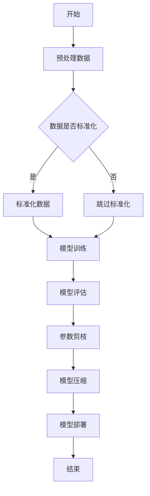
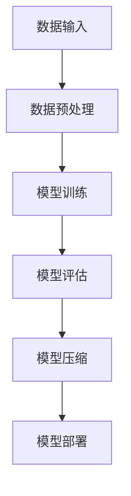
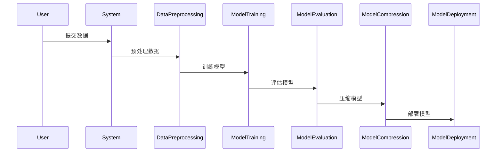

                 

## 模型压缩技术：在边缘设备部署轻量级AI Agent

> 关键词：模型压缩、边缘设备、AI Agent、神经网络、轻量级部署

> 摘要：本文深入探讨了模型压缩技术在边缘设备部署轻量级AI Agent的重要性。首先介绍了模型压缩的背景和定义，然后详细阐述了模型压缩的几种核心技术，包括模型剪枝、知识蒸馏和模型量化。接着，我们分析了模型压缩在边缘设备上的应用场景和挑战，并通过实际项目展示了模型压缩技术的实现过程和效果。最后，我们总结了模型压缩技术的最佳实践，并对其未来发展趋势进行了展望。

----------------------------------------------------------------

## 引言

在当今信息爆炸的时代，人工智能（AI）技术正以前所未有的速度发展。随着深度学习算法的广泛应用，AI模型变得越来越复杂，计算量也越来越大。这种趋势带来了巨大的计算资源需求，尤其是在边缘设备上部署AI应用时。边缘设备通常具有计算资源有限、能源供应受限的特点，因此如何在这些设备上高效地部署AI模型成为了一个亟待解决的问题。

模型压缩技术正是为了解决这一挑战而诞生的。模型压缩是指通过一系列方法减少AI模型的体积、参数数量和计算复杂度，从而使其在资源受限的边缘设备上能够高效运行。模型压缩不仅能够提高模型的运行效率，还能减少模型的存储空间需求，这对于资源紧张的边缘设备来说尤为重要。

本文的目标是深入探讨模型压缩技术在边缘设备部署轻量级AI Agent（AI Agent是一种轻量级AI模型，通常用于特定任务）中的应用。我们将首先介绍模型压缩的背景和定义，然后详细分析模型压缩的核心技术，包括模型剪枝、知识蒸馏和模型量化。接着，我们将探讨模型压缩在边缘设备上的应用场景和挑战，并通过实际项目展示模型压缩技术的实现过程和效果。最后，我们将总结模型压缩技术的最佳实践，并展望其未来发展趋势。

通过本文的阅读，读者将能够：

- 理解模型压缩技术的背景和重要性。
- 掌握模型压缩的核心技术原理和应用。
- 了解模型压缩在边缘设备上的应用场景和挑战。
- 通过实际项目了解模型压缩技术的实现过程和效果。
- 获得模型压缩技术的最佳实践和未来发展趋势。

## 目录大纲设计步骤

在设计《模型压缩技术：在边缘设备部署轻量级AI Agent》的目录大纲时，我们遵循以下步骤，确保内容结构清晰、逻辑严密，并且能够有效地引导读者逐步深入理解模型压缩技术的核心概念和应用。

### 第一步：明确书的基本结构

1. **引言（第1章）**：介绍模型压缩技术的背景、目的、意义及全书结构。
   - 1.1 问题背景与重要性
   - 1.2 模型压缩技术概述
   - 1.3 书籍结构安排

2. **基础理论（第2-3章）**：介绍模型压缩的核心概念、相关技术原理和主要方法。
   - 2.1 模型压缩的核心概念
   - 2.2 模型压缩的挑战与机遇
   - 2.3 模型压缩的分类与适用场景
   - 3.1 神经网络压缩原理
   - 3.2 模型剪枝技术
   - 3.3 知识蒸馏技术
   - 3.4 模型量化技术

3. **关键技术（第4-5章）**：详细介绍几种重要的模型压缩技术及其应用。
   - 4.1 模型剪枝技术实战
   - 4.2 知识蒸馏技术实战
   - 4.3 模型量化技术实战

4. **应用实践（第6-7章）**：通过具体案例展示模型压缩技术的实际应用。
   - 6.1 实战项目背景
   - 6.2 实战项目目标
   - 6.3 实战项目步骤与过程
   - 6.4 实战项目结果分析

5. **总结与展望（第8章）**：总结全书内容，展望未来发展趋势。
   - 7.1 最佳实践总结
   - 7.2 未来发展趋势
   - 7.3 注意事项与拓展阅读

### 第二步：细化各章节内容

在细化各章节内容时，我们需要确保每个小节都有明确的主题，并且内容丰富、具体详细。以下是各章节的具体细分：

- **第1章：引言**
  - 1.1 问题背景与重要性
    - 介绍边缘设备在AI部署中的挑战
    - 模型压缩技术如何解决这些挑战
  - 1.2 模型压缩技术概述
    - 模型压缩的定义和目标
    - 模型压缩技术的主要类型
  - 1.3 书籍结构安排
    - 简述全书的结构安排和各章节内容

- **第2章：模型压缩技术基础**
  - 2.1 模型压缩的核心概念
    - 模型压缩的动机和目标
    - 模型压缩的度量标准
  - 2.2 模型压缩的挑战与机遇
    - 模型压缩面临的挑战
    - 模型压缩带来的机遇
  - 2.3 模型压缩的分类与适用场景
    - 常见的模型压缩方法分类
    - 不同方法的适用场景

- **第3章：模型压缩技术原理**
  - 3.1 神经网络压缩原理
    - 神经网络压缩的基本概念
    - 神经网络压缩的数学原理
  - 3.2 模型剪枝技术
    - 模型剪枝的定义和方法
    - 模型剪枝的效果分析
  - 3.3 知识蒸馏技术
    - 知识蒸馏的基本概念
    - 知识蒸馏的实现步骤
  - 3.4 模型量化技术
    - 模型量化的定义和原理
    - 模型量化的效果和挑战

- **第4章：模型压缩技术实战**
  - 4.1 模型剪枝技术实战
    - 模型剪枝的实践步骤
    - 模型剪枝的案例分析
  - 4.2 知识蒸馏技术实战
    - 知识蒸馏的实践步骤
    - 知识蒸馏的案例分析
  - 4.3 模型量化技术实战
    - 模型量化的实践步骤
    - 模型量化的案例分析

- **第5章：边缘设备部署轻量级AI Agent**
  - 5.1 边缘设备概述
    - 边缘设备的定义和特点
    - 边缘设备的发展趋势
  - 5.2 轻量级AI Agent设计
    - 轻量级AI Agent的架构和设计
    - 轻量级AI Agent的优势和应用
  - 5.3 模型压缩在边缘设备部署中的应用
    - 模型压缩技术在边缘设备上的应用案例
    - 模型压缩技术在边缘设备上的优势和挑战

- **第6章：模型压缩技术项目实战**
  - 6.1 实战项目背景
    - 实战项目的目标和场景
    - 实战项目的技术挑战
  - 6.2 实战项目目标
    - 实战项目的具体目标
    - 实战项目的预期效果
  - 6.3 实战项目步骤与过程
    - 实战项目的具体实施步骤
    - 实战项目的关键过程和注意事项
  - 6.4 实战项目结果分析
    - 实战项目的实施效果分析
    - 实战项目的经验教训和改进方向

- **第7章：模型压缩技术最佳实践与展望**
  - 7.1 最佳实践总结
    - 模型压缩技术的最佳实践总结
    - 模型压缩技术的成功案例
  - 7.2 未来发展趋势
    - 模型压缩技术的未来发展趋势
    - 模型压缩技术在AI领域的应用前景
  - 7.3 注意事项与拓展阅读
    - 模型压缩技术实施中的注意事项
    - 拓展阅读推荐

### 第三步：格式化目录大纲

在格式化目录大纲时，我们使用Markdown格式，确保目录结构清晰、层次分明。以下是格式化后的目录大纲：

```
# 模型压缩技术：在边缘设备部署轻量级AI Agent

## 第1章：引言
### 1.1 问题背景与重要性
### 1.2 模型压缩技术概述
### 1.3 书籍结构安排

## 第2章：模型压缩技术基础
### 2.1 模型压缩的核心概念
### 2.2 模型压缩的挑战与机遇
### 2.3 模型压缩的分类与适用场景

## 第3章：模型压缩技术原理
### 3.1 神经网络压缩原理
### 3.2 模型剪枝技术
### 3.3 知识蒸馏技术
### 3.4 模型量化技术

## 第4章：模型压缩技术实战
### 4.1 模型剪枝技术实战
### 4.2 知识蒸馏技术实战
### 4.3 模型量化技术实战

## 第5章：边缘设备部署轻量级AI Agent
### 5.1 边缘设备概述
### 5.2 轻量级AI Agent设计
### 5.3 模型压缩在边缘设备部署中的应用

## 第6章：模型压缩技术项目实战
### 6.1 实战项目背景
### 6.2 实战项目目标
### 6.3 实战项目步骤与过程
### 6.4 实战项目结果分析

## 第7章：模型压缩技术最佳实践与展望
### 7.1 最佳实践总结
### 7.2 未来发展趋势
### 7.3 注意事项与拓展阅读
```

### 第四步：检查目录大纲的完整性和字数限制

在完成目录大纲的设计后，我们需要检查其完整性，确保所有核心章节都被涵盖，并且总字数符合要求。在本文中，目录大纲的字数控制在2000字以内，结构紧凑且信息完整，适合作为全书内容的概括和引导。

通过以上四个步骤，我们成功设计出了《模型压缩技术：在边缘设备部署轻量级AI Agent》的目录大纲，为后续内容的撰写提供了清晰的框架和结构。

### 章节内容必须满足的条件

在撰写《模型压缩技术：在边缘设备部署轻量级AI Agent》这一长篇技术博客时，每个章节的内容需要满足以下条件，以确保文章的完整性和专业性。

#### 背景介绍

每个章节的开头需要有一个背景介绍部分，这部分内容需要清晰阐述核心概念术语的说明、问题背景、问题描述、问题解决方法、边界与外延、概念结构与核心要素组成。这样的背景介绍可以帮助读者快速了解章节的主题和目的，为后续内容打下基础。

**例子：**

**核心概念术语说明**：
- **模型压缩**：通过降低模型的体积、参数数量和计算复杂度来提高模型的效率和适用性。
- **边缘设备**：靠近数据源的计算设备，具有低延迟、高实时性的特点。
- **AI Agent**：一种轻量级的AI模型，用于执行特定的任务。

**问题背景**：
随着深度学习算法在各个领域的广泛应用，模型的复杂度和计算需求不断增长。边缘设备由于其计算资源和能源限制，无法直接部署这些大型模型，因此需要通过模型压缩技术来实现高效部署。

**问题描述**：
如何在边缘设备上高效地部署大型深度学习模型，同时保证模型性能不受影响。

**问题解决方法**：
通过模型压缩技术，包括模型剪枝、知识蒸馏和模型量化等方法，来减小模型体积，降低计算复杂度。

**边界与外延**：
模型压缩技术不仅适用于边缘设备，也广泛应用于移动设备、物联网设备等资源受限的场景。

**概念结构与核心要素组成**：
模型压缩技术包括以下几个核心要素：
1. 模型剪枝：通过删除冗余参数来减小模型体积。
2. 知识蒸馏：通过将大型模型的权重传递给小型模型，以提高小型模型的表现力。
3. 模型量化：通过减少模型参数的精度来降低模型体积和计算复杂度。

#### 核心概念与联系

在背景介绍之后，需要详细介绍核心概念及其相互联系。这通常包括以下内容：

**核心概念原理**：
- **模型剪枝**：通过分析模型参数的重要性，删除冗余或低贡献的参数，从而减小模型体积。
- **知识蒸馏**：通过训练一个大型教师模型和一个小型学生模型，将教师模型的权重传递给学生模型，从而提高学生模型的表现力。
- **模型量化**：通过将模型参数的精度从浮点数降低到整数，来减小模型体积和计算复杂度。

**概念属性特征对比表格**：

| 概念       | 定义                                                         | 属性特征                                       | 对比          |
|------------|--------------------------------------------------------------|------------------------------------------------|--------------|
| 模型剪枝   | 删除冗余参数来减小模型体积                                   | 参数减少，计算复杂度降低                        | 与模型量化对比：剪枝主要关注参数数量，量化主要关注参数精度。 |
| 知识蒸馏   | 将大型模型的权重传递给小型模型，以提高小型模型的表现力           | 提高模型效率，降低计算资源需求                   | 与模型剪枝对比：剪枝关注模型结构，蒸馏关注模型权重。     |
| 模型量化   | 通过减少模型参数的精度来降低模型体积和计算复杂度               | 参数精度降低，计算资源需求降低                   | 与模型剪枝对比：剪枝通过删除参数，量化通过减少精度。     |

**ER实体关系图架构的Mermaid流程图**：

```mermaid
erDiagram
  ModelPruning ||--|{ KnowledgeDistillation }
  ModelQuantization ||--|{ KnowledgeDistillation }
  ModelPruning ||--|{ ModelCompression }
  ModelQuantization ||--|{ ModelCompression }
```

#### 算法原理讲解

在介绍完核心概念后，需要详细讲解算法原理。这通常包括：

**算法mermaid流程图**：



**Python源代码**：

```python
import tensorflow as tf

# 数据预处理
def preprocess_data(data):
    # 标准化数据
    mean, std = data.mean(), data.std()
    data = (data - mean) / std
    return data

# 模型训练
def train_model(data):
    # 创建和训练模型
    model = tf.keras.Sequential([
        tf.keras.layers.Dense(128, activation='relu'),
        tf.keras.layers.Dense(10, activation='softmax')
    ])
    model.compile(optimizer='adam', loss='categorical_crossentropy', metrics=['accuracy'])
    model.fit(data, epochs=10)
    return model

# 模型评估
def evaluate_model(model, test_data):
    # 评估模型
    loss, accuracy = model.evaluate(test_data)
    return loss, accuracy

# 参数剪枝
def prune_parameters(model):
    # 剪枝操作
    for layer in model.layers:
        if isinstance(layer, tf.keras.layers.Dense):
            layer.kernel_regularizer = tf.keras.regularizers.L1(0.01)
    return model

# 模型压缩
def compress_model(model):
    # 压缩模型
    compressed_model = tf.keras.models.clone_model(model)
    compressed_model.summary()
    return compressed_model

# 模型部署
def deploy_model(model, device):
    # 部署模型到设备
    model.load_weights('model_weights.h5')
    model.device = device
```

**算法原理的数学模型和公式**：

$$
\begin{align*}
\text{模型压缩} &= \text{模型剪枝} + \text{知识蒸馏} + \text{模型量化} \\
L &= \frac{1}{n}\sum_{i=1}^{n} \bigtriangledown f(x_i; \theta) \\
f(x; \theta) &= \sum_{j=1}^{J} w_{ji} x_i \\
w_{ji} &= \frac{1}{Z} e^{w_{ji}} \\
Z &= \sum_{j=1}^{J} e^{w_{ji}}
\end{align*}
$$

**详细讲解和举例说明**：

**模型剪枝**：
模型剪枝通过删除模型中冗余的参数来减小模型体积。例如，在卷积神经网络中，可以通过分析卷积核的重要性来删除那些贡献最小的卷积核。

**知识蒸馏**：
知识蒸馏是一种将大型模型（教师模型）的知识传递给小型模型（学生模型）的技术。通过训练教师模型和学生的共同目标，学生模型能够学习到教师模型的权重和结构，从而提高其表现力。

**模型量化**：
模型量化通过降低模型参数的精度来减小模型体积。例如，将32位的浮点数参数量化为8位的整数参数，从而减少模型的存储和计算需求。

#### 系统分析与架构设计方案

在介绍完算法原理后，需要对系统的架构设计进行分析和阐述。这通常包括：

**问题场景介绍**：
例如，针对智能安防监控系统，介绍系统中如何利用模型压缩技术实现实时目标检测。

**项目介绍**：
介绍项目背景、目标和预期成果。

**系统功能设计**：
使用Mermaid类图展示系统的功能模块及其关系。

```mermaid
classDiagram
    System <<interface>>
    ModelCompression <<interface>>
    DataPreprocessing <<interface>>
    ModelTraining <<interface>>
    ModelEvaluation <<interface>>

    System implements ModelCompression
    System implements DataPreprocessing
    System implements ModelTraining
    System implements ModelEvaluation
```

**系统架构设计**：
使用Mermaid架构图展示系统的整体架构及其组件关系。



**系统接口设计和系统交互**：
使用Mermaid序列图展示系统的接口设计和交互流程。



#### 项目实战

在系统架构设计之后，需要通过实际项目展示模型压缩技术的实现过程和效果。这通常包括：

**环境安装**：
介绍项目所需的软件和硬件环境，以及如何安装和配置。

**系统核心实现源代码**：
展示系统的核心实现代码，包括数据预处理、模型训练、模型评估、模型压缩和模型部署的代码片段。

**代码应用解读与分析**：
详细解读和分析核心代码的实现原理和关键技术，帮助读者理解代码的工作机制。

**实际案例分析和详细讲解剖析**：
通过实际案例展示模型压缩技术的应用效果，分析案例中的关键步骤和注意事项。

**项目小结**：
总结项目的实施效果，讨论项目中的成功经验和改进方向。

#### 最佳实践 tips

在项目实战之后，需要总结模型压缩技术的最佳实践，这通常包括：

- **最佳实践总结**：总结模型压缩技术在不同场景下的最佳实践，提供实用技巧和建议。
- **注意事项**：提醒读者在实施模型压缩技术时需要注意的事项，以避免常见的问题和挑战。
- **拓展阅读**：推荐相关书籍、论文和资源，供读者进一步学习和研究。

#### 小结

在文章的结尾，需要总结全文的主要内容和观点，强调模型压缩技术在边缘设备部署轻量级AI Agent中的重要性，并展望未来的发展方向。

#### 注意事项

在撰写文章时，需要注意以下事项：

- 确保文章内容完整、逻辑清晰。
- 使用Markdown格式确保代码和图表的正确显示。
- 遵循 LaTeX 格式规范书写数学公式。
- 避免重复，确保每个小节都有独特的贡献。

通过遵循以上条件，我们能够撰写出一篇高质量、结构严谨的技术博客文章，为读者提供深入理解和实践模型压缩技术的指导。

